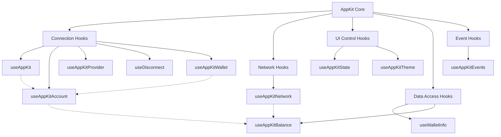

# Reown - React Appkit
# Installation

AppKit provides seamless integration with multiple blockchain ecosystems. . It supports [Wagmi](https://wagmi.sh/) and [Ethers v6](https://docs.ethers.org/v6/) on Ethereum,
[@solana/web3.js](https://solana-labs.github.io/solana-web3.js/) on Solana, as well as Bitcoin and other networks. AppKit Core with Universal Provider library, enable compatibility across any blockchain protocol.

Choose one of these to get started.

## Installation

**If you prefer referring to a video tutorial for this, please [click here](#video-tutorial).**

### Set up Reown AppKit using AI

If you're using Cursor IDE (or another AI based IDE) to build a project with Reown AppKit, Reown provides a `.mdc` file that enhances your development experience. The `reown-appkit.mdc` [file here](https://github.com/reown-com/reown-docs/blob/main/reown-appkit.mdc) contains Cursor-specific rules and type hints for Reown AppKit.

To use it in your project:

1. Copy the `reown-appkit.mdc` file from this repository
2. Create a `.cursor/rules` folder in your project's root directory (if it doesn't exist)
3. Place the `.mdc` file in your project's `.cursor/rules` folder

For more info, refer to [Cursor's documentation](https://docs.cursor.com/context/rules#project-rules).

### AppKit CLI

Reown offers a dedicated CLI to set up a minimal version of AppKit in the easiest and quickest way possible.

To do this, please run the command below.

```bash
npx @reown/appkit-cli
```

After running the command, you will be prompted to confirm the installation of the CLI. Upon your confirmation, the CLI will request the following details:

1. **Project Name**: Enter the name for your project.
2. **Framework**: Select your preferred framework or library. Currently, you have three options: React, Next.js, and Vue.
3. **Network-Specific libraries**: Choose whether you want to install Wagmi, Ethers, Solana, or Multichain (EVM + Solana).

After providing the project name and selecting your preferences, the CLI will install a minimal example of AppKit with your preferred blockchain library. The example will be pre-configured with a `projectId` that will only work on `localhost`.

To fully configure your project, please obtain a `projectId` from the Reown Dashboard and update your project accordingly.

**Refer to [this section](#cloud-configuration) for more information.**

### Custom Installation

<Warning>
  If you are setting up your React app, please **do not use** `npx
    create-react-app`, as it has been deprecated. Using it may cause dependency
  issues. Instead, please use
  [Vite](https://vitejs.dev/guide/#scaffolding-your-first-vite-project) to
  create your React app. You can set it up by running `npm create vite@latest`.
</Warning>

<Tabs>
  <Tab title="Wagmi">
    <CodeGroup>
      ```bash npm
      npm install @reown/appkit @reown/appkit-adapter-wagmi wagmi viem @tanstack/react-query
      ```

      ```bash Yarn
      yarn add @reown/appkit @reown/appkit-adapter-wagmi wagmi viem @tanstack/react-query
      ```

      ```bash Bun
      bun add @reown/appkit @reown/appkit-adapter-wagmi wagmi viem @tanstack/react-query
      ```

      ```bash pnpm
      pnpm add @reown/appkit @reown/appkit-adapter-wagmi wagmi viem @tanstack/react-query
      ```
    </CodeGroup>
  </Tab>

  <Tab title="Ethers v5">
    <CodeGroup>
      ```bash npm
      npm install @reown/appkit @reown/appkit-adapter-ethers5 ethers@5.7.2
      ```

      ```bash Yarn
      yarn add @reown/appkit @reown/appkit-adapter-ethers5 ethers@5.7.2
      ```

      ```bash Bun
      bun add @reown/appkit @reown/appkit-adapter-ethers5 ethers@5.7.2
      ```

      ```bash pnpm
      pnpm add @reown/appkit @reown/appkit-adapter-ethers5 ethers@5.7.2
      ```
    </CodeGroup>
  </Tab>

  <Tab title="Ethers">
    <CodeGroup>
      ```bash npm
      npm install @reown/appkit @reown/appkit-adapter-ethers ethers
      ```

      ```bash Yarn
      yarn add @reown/appkit @reown/appkit-adapter-ethers ethers
      ```

      ```bash Bun
      bun add @reown/appkit @reown/appkit-adapter-ethers ethers
      ```

      ```bash pnpm
      pnpm add @reown/appkit @reown/appkit-adapter-ethers ethers
      ```
    </CodeGroup>
  </Tab>

  <Tab title="Solana">
    <CodeGroup>
      ```bash npm
      npm install @reown/appkit @reown/appkit-adapter-solana
      ```

      ```bash Yarn
      yarn add @reown/appkit @reown/appkit-adapter-solana
      ```

      ```bash Bun
      bun add @reown/appkit @reown/appkit-adapter-solana
      ```

      ```bash pnpm
      pnpm add @reown/appkit @reown/appkit-adapter-solana
      ```
    </CodeGroup>
  </Tab>

  <Tab title="Bitcoin">
    <CodeGroup>
      ```bash npm
      npm install @reown/appkit @reown/appkit-adapter-bitcoin
      ```

      ```bash Yarn
      yarn add @reown/appkit @reown/appkit-adapter-bitcoin
      ```

      ```bash Bun
      bun add @reown/appkit @reown/appkit-adapter-bitcoin
      ```

      ```bash pnpm
      pnpm add @reown/appkit @reown/appkit-adapter-bitcoin
      ```
    </CodeGroup>
  </Tab>

  <Tab title="Others networks (AppKit Core)">
    <CodeGroup>
      ```bash npm
      npm install @reown/appkit @walletconnect/universal-provider @reown/appkit-common ethers
      ```

      ```bash Yarn
      yarn add @reown/appkit @walletconnect/universal-provider @reown/appkit-common ethers
      ```

      ```bash Bun
      bun add @reown/appkit @walletconnect/universal-provider @reown/appkit-common ethers
      ```

      ```bash pnpm
      pnpm add @reown/appkit @walletconnect/universal-provider @reown/appkit-common ethers
      ```
    </CodeGroup>
  </Tab>
</Tabs>

## Cloud Configuration

Create a new project on Reown Dashboard at [https://dashboard.reown.com](https://dashboard.reown.com) and obtain a new project ID.

<Info>
  **Don't have a project ID?**

  Head over to Reown Dashboard and create a new project now!

  <Card title="Get started" href="https://dashboard.reown.com/?utm_source=cloud_banner&utm_medium=docs&utm_campaign=backlinks" />
</Info>

## Implementation

<Tabs>
  <Tab title="Wagmi">
    <Card title="wagmi Example" icon="github" href="https://github.com/reown-com/appkit-web-examples/tree/main/react/react-wagmi">
      Check the React wagmi example
    </Card>

    For a quick integration, you can use the `createAppKit` function with a unified configuration. This automatically applies the predefined configurations for different adapters like Wagmi, Ethers, or Solana, so you no longer need to manually configure each one individually. Simply pass the common parameters such as `projectId`, `chains`, `metadata`, etc., and the function will handle the adapter-specific configurations under the hood.

    This includes WalletConnect, Coinbase and Injected connectors, and the [Blockchain API](../../../../cloud/blockchain-api) as a [transport](https://wagmi.sh/core/api/createConfig#transports)

    On top of your app set up the following configuration, making sure that all functions are called **outside** any React component to avoid unwanted rerenders.

    ```tsx
    import { createAppKit } from '@reown/appkit/react'

    import { WagmiProvider } from 'wagmi'
    import { arbitrum, mainnet } from '@reown/appkit/networks'
    import { QueryClient, QueryClientProvider } from '@tanstack/react-query'
    import { WagmiAdapter } from '@reown/appkit-adapter-wagmi'

    // 0. Setup queryClient
    const queryClient = new QueryClient()

    // 1. Get projectId from https://dashboard.reown.com
    const projectId = 'YOUR_PROJECT_ID'

    // 2. Create a metadata object - optional
    const metadata = {
      name: 'AppKit',
      description: 'AppKit Example',
      url: 'https://example.com', // origin must match your domain & subdomain
      icons: ['https://avatars.githubusercontent.com/u/179229932']
    }

    // 3. Set the networks
    const networks = [mainnet, arbitrum]

    // 4. Create Wagmi Adapter
    const wagmiAdapter = new WagmiAdapter({
      networks,
      projectId,
      ssr: true
    })

    // 5. Create modal
    createAppKit({
      adapters: [wagmiAdapter],
      networks,
      projectId,
      metadata,
      features: {
        analytics: true // Optional - defaults to your Cloud configuration
      }
    })

    export function AppKitProvider({ children }) {
      return (
        <WagmiProvider config={wagmiAdapter.wagmiConfig}>
          <QueryClientProvider client={queryClient}>{children}</QueryClientProvider>
        </WagmiProvider>
      )
    }
    ```

    ## Importing networks

    Reown AppKit use [Viem](https://viem.sh/) networks under the hood, which provide a wide variety of networks for EVM chains. You can find all the networks supported by Viem within the `@reown/appkit/networks` path.

    ```js {2}
    import { createAppKit } from '@reown/appkit'
    import { mainnet, arbitrum, base, scroll, polygon } from '@reown/appkit/networks'
    ```

    <Note>
      Looking to add a custom network? Check out the [custom networks](../../core/custom-networks) section.
    </Note>
  </Tab>

  <Tab title="Ethers v5">
    <Card title="Ethers v5 Example" icon="github" href="https://github.com/reown-com/appkit-web-examples/tree/main/react/react-ethers5">
      Check the React ethers v5 example
    </Card>

    On top of your app set up the following configuration, making sure that all functions are called outside any React component to avoid unwanted rerenders.

    ```tsx
    import { createAppKit } from "@reown/appkit/react";
    import { Ethers5Adapter } from "@reown/appkit-adapter-ethers5";
    import { mainnet, arbitrum } from "@reown/appkit/networks";

    // 1. Get projectId
    const projectId = "YOUR_PROJECT_ID";

    // 2. Create a metadata object - optional
    const metadata = {
      name: "My Website",
      description: "My Website description",
      url: "https://mywebsite.com", // origin must match your domain & subdomain
      icons: ["https://avatars.mywebsite.com/"],
    };

    // 3. Create the AppKit instance
    createAppKit({
      adapters: [new Ethers5Adapter()],
      metadata: metadata,
      networks: [mainnet, arbitrum],
      projectId,
      features: {
        analytics: true, // Optional - defaults to your Cloud configuration
      },
    });

    export default function App() {
      return <YourApp />; //make sure you have configured the <appkit-button> inside
    }
    ```

    <Warning>
      Make sure that the `url` from the `metadata` matches your domain and subdomain. This will later be used by the [Verify API](../../../cloud/verify) to tell wallets if your application has been verified or not.
    </Warning>
  </Tab>

  <Tab title="Ethers">
    <Card title="Ethers Example" icon="github" href="https://github.com/reown-com/appkit-web-examples/tree/main/react/react-ethers">
      Check the React ethers example
    </Card>

    On top of your app set up the following configuration, making sure that all functions are called outside any React component to avoid unwanted rerenders.

    ```tsx
    import { createAppKit } from "@reown/appkit/react";
    import { EthersAdapter } from "@reown/appkit-adapter-ethers";
    import { arbitrum, mainnet } from "@reown/appkit/networks";

    // 1. Get projectId
    const projectId = "YOUR_PROJECT_ID";

    // 2. Set the networks
    const networks = [arbitrum, mainnet];

    // 3. Create a metadata object - optional
    const metadata = {
      name: "My Website",
      description: "My Website description",
      url: "https://mywebsite.com", // origin must match your domain & subdomain
      icons: ["https://avatars.mywebsite.com/"],
    };

    // 4. Create a AppKit instance
    createAppKit({
      adapters: [new EthersAdapter()],
      networks,
      metadata,
      projectId,
      features: {
        analytics: true, // Optional - defaults to your Cloud configuration
      },
    });

    export default function App() {
      return <YourApp />; // Configure the <appkit-button> or a similar button inside
    }
    ```

    <Warning>
      Make sure that the `url` from the `metadata` matches your domain and subdomain. This will later be used by the [Verify API](../../../../cloud/verify) to tell wallets if your application has been verified or not.
    </Warning>
  </Tab>

  <Tab title="Solana">
    <Card title="Solana Example" icon="github" href="https://github.com/reown-com/appkit-web-examples/tree/main/react/react-solana">
      Check the React Solana example
    </Card>

    AppKit Solana provides a set of React components and hooks to easily connect Solana wallets with your application.

    On top of your app set up the following configuration, making sure that all functions are called outside any React component to avoid unwanted rerenders.

    ```tsx
    // App.tsx
    import { createAppKit } from "@reown/appkit/react";
    import { SolanaAdapter } from "@reown/appkit-adapter-solana/react";
    import { solana, solanaTestnet, solanaDevnet } from "@reown/appkit/networks";

    // 0. Set up Solana Adapter
    const solanaWeb3JsAdapter = new SolanaAdapter();

    // 1. Get projectId from https://dashboard.reown.com
    const projectId = "YOUR_PROJECT_ID";

    // 2. Create a metadata object - optional
    const metadata = {
      name: "AppKit",
      description: "AppKit Solana Example",
      url: "https://example.com", // origin must match your domain & subdomain
      icons: ["https://avatars.githubusercontent.com/u/179229932"],
    };

    // 3. Create modal
    createAppKit({
      adapters: [solanaWeb3JsAdapter],
      networks: [solana, solanaTestnet, solanaDevnet],
      metadata: metadata,
      projectId,
      features: {
        analytics: true, // Optional - defaults to your Cloud configuration
      },
    });

    export default function App() {
      return <YourApp />;
    }
    ```
  </Tab>

  <Tab title="Bitcoin">
    <Card title="Bitcoin Example" icon="github" href="https://github.com/reown-com/appkit-web-examples/tree/main/react/react-bitcoin">
      Check the React Bitcoin example
    </Card>

    AppKit Bitcoin provides a set of React components and hooks to easily connect Bitcoin wallets with your application.

    On top of your app set up the following configuration, making sure that all functions are called outside any React component to avoid unwanted rerenders.

    ```tsx
    // App.tsx
    import { createAppKit } from '@reown/appkit/react'
    import { BitcoinAdapter } from '@reown/appkit-adapter-bitcoin'
    import { bitcoin } from '@reown/appkit/networks'

    // 1. Get projectId from https://dashboard.reown.com
    const projectId = 'YOUR_PROJECT_ID'

    // 2. Set the networks
    const networks = [bitcoin]

    // 3. Set up Bitcoin Adapter
    const bitcoinAdapter = new BitcoinAdapter({
      projectId
    })

    // 4. Create a metadata object - optional
    const metadata = {
      name: 'AppKit',
      description: 'AppKit Bitcoin Example',
      url: 'https://example.com', // origin must match your domain & subdomain
      icons: ['https://avatars.githubusercontent.com/u/179229932']
    }

    // 5. Create modal
    createAppKit({
      adapters: [bitcoinAdapter],
      networks,
      metadata,
      projectId,
      features: {
        analytics: true // Optional - defaults to your Dashboard configuration,
        email: false,
        socials: []
      }
    })

    export default function App() {
      return <YourApp />
    }
    ```

    ## Bitcoin Provider Interface

    ```ts
    export interface BitcoinConnector extends ChainAdapterConnector, Provider {
      getAccountAddresses(): Promise<BitcoinConnector.AccountAddress[]>;
      signMessage(params: BitcoinConnector.SignMessageParams): Promise<string>;
      sendTransfer(params: BitcoinConnector.SendTransferParams): Promise<string>;
      signPSBT(
        params: BitcoinConnector.SignPSBTParams
      ): Promise<BitcoinConnector.SignPSBTResponse>;
    }
    ```

    ### Parameters

    <Tabs>
      <Tab title="SignMessageParams">
        ```ts
          export type SignMessageParams = {
            /**
             * The message to be signed
             */
            message: string
            /**
             * The address to sign the message with
             */
            address: string
          }
        ```
      </Tab>

      <Tab title="SignMessageParams">
        ```ts
          export type SendTransferParams = {
            /**
             * The amount to be sent in satoshis
             */
            amount: string
            /**
             * The address to send the transfer to
             */
            recipient: string
          }
        ```
      </Tab>

      <Tab title="SignPSBTParams">
        ```ts
          export type SignPSBTParams = {
            /**
             * The PSBT to be signed, string base64 encoded
             */
            psbt: string
            signInputs: {
              /**
               * The address whose private key to use for signing.
               */
              address: string
              /**
               * Specifies which input to sign
               */
              index: number
              /**
               * Specifies which part(s) of the transaction the signature commits to
               */
              sighashTypes: number[]
            }[]

            /**
             * If `true`, the PSBT will be broadcasted after signing. Default is `false`.
             */
            broadcast?: boolean

        }

        ```
      </Tab>
    </Tabs>

    ### Responses

    <Tabs>
      <Tab title="AccountAddress">
        ```ts
          export type AccountAddress = {
            /**
             * Public address belonging to the account.
             */
            address: string
            /**
             * Public key for the derivation path in hex, without 0x prefix
             */
            publicKey?: string
            /**
             * The derivation path of the address e.g. "m/84'/0'/0'/0/0"
             */
            path?: string
            /**
             * The purpose of the address
             */
            purpose: 'payment' | 'ordinal' | 'stx'
          }
        ```
      </Tab>

      <Tab title="SignPSBTResponse">
        ```ts
          export type SignPSBTResponse = {
            /**
             * The signed PSBT, string base64 encoded
             */
            psbt: string
            /**
             * The `string` transaction id of the broadcasted transaction or `undefined` if not broadcasted
             */
            txid?: string
          }
        ```
      </Tab>
    </Tabs>
  </Tab>

  <Tab title="Others networks (AppKit Core)">
    <Card title="AppKit Core Example" icon="github" href="https://github.com/reown-com/appkit-web-examples/tree/main/react/react-core-universal-provider-sui">
      Check the React AppKit Core example for Sui
    </Card>

    For a quick integration, you can use the `createAppKit` function with a unified configuration.
    This automatically applies the predefined configurations for different adapters like Wagmi, Ethers, or Solana,
    so you no longer need to manually configure each one individually.
    Simply pass the common parameters such as `projectId`, `chains`, `metadata` or check others config in the [Options section](options).

    This includes WalletConnect, Coinbase and Injected connectors, and the [Blockchain API](../../../../cloud/blockchain-api) as a [transport](https://wagmi.sh/core/api/createConfig#transports)

    We recommend creating a config file to establish a singleton instance for the Provider and AppKit:

    ```tsx
    import type { AppKitNetwork } from '@reown/appkit/networks'
    import type { InferredCaipNetwork } from '@reown/appkit-common'
    import UniversalProvider from '@walletconnect/universal-provider'
    import { AppKit, createAppKit } from '@reown/appkit/core'

    // Get projectId from https://dashboard.reown.com
    export const projectId = import.meta.env.VITE_PROJECT_ID || "b56e18d47c72ab683b10814fe9495694" // this is a public projectId only to use on localhost

    if (!projectId) {
      throw new Error('Project ID is not defined')
    }

    // you can configure your own network
    const sui: InferredCaipNetwork = {
      id: 784,
      chainNamespace: 'sui' as const,
      caipNetworkId: 'sui:mainnet',
      name: 'Sui',
      nativeCurrency: { name: 'SUI', symbol: 'SUI', decimals: 9 },
      rpcUrls: { default: { http: ['https://fullnode.mainnet.sui.io:443'] } }
    }

    export const networks = [sui] as [AppKitNetwork, ...AppKitNetwork[]]

    let provider: UniversalProvider | undefined
    let modal: AppKit | undefined

    export async function initializeProvider() {
      if (!provider) {
        provider = await UniversalProvider.init(
          { 
            projectId, 
            metadata: {
              name: "WalletConnect x Sui",
              description: "Sui integration with WalletConnect's Universal Provider",
              url: "https://yourdomain.com/",
              icons: ["https://avatars.githubusercontent.com/u/37784886"],
            }
          })
      }
      return provider
    }

    export function initializeModal(universalProvider?: UniversalProvider) {
      if (!modal && universalProvider) {
        modal = createAppKit({
          projectId,
          networks,
          universalProvider: universalProvider as any, // Type cast to fix version mismatch
          manualWCControl: true,
          features: {
            analytics: true // Optional - defaults to your Cloud configuration
          }
        })
      }
      return modal
    }
    ```

    In de App.tsx file you can add :

    ```tsx
    import { useState, useEffect } from 'react'
    import { initializeProvider, initializeModal } from './config' // previous config file
    import UniversalProvider from '@walletconnect/universal-provider'

    export function App() {
      const [provider, setProvider] = useState<UniversalProvider>();
      const [session, setSession] = useState<any>();

      
      // Initialize the Provider and AppKit on component mount, and check for existing session
      useEffect(() => {
        const init = async () => {
          const dataProvider = await initializeProvider();
          setProvider(dataProvider);
          initializeModal(dataProvider);

          if (dataProvider.session) { // check if there is a session
            setSession(dataProvider.session);
          }
        }
        init()
      }, [])


      useEffect(() => {
        // Handler for when WalletConnect generates a connection URI
        // Opens the AppKit modal with the URI and shows the connecting view
        const handleDisplayUri = (uri: string) => {
          const modal = initializeModal(provider)
          modal?.open({ uri, view: 'ConnectingWalletConnectBasic' })
        }

        // Handler for when a wallet successfully connects
        // Updates the session state and closes the modal
        const handleConnect = async (session: any) => {
          setSession(session.session);
          const modal = initializeModal(provider)
          await modal?.close()
        }

        // Subscribe to WalletConnect events
        provider?.on('display_uri', handleDisplayUri) // Listen for connection URI
        provider?.on('connect', handleConnect) // Listen for successful connections

        return () => {
          provider?.removeListener('connect', handleConnect)
          provider?.removeListener('display_uri', handleDisplayUri)
        }
      }, [provider])
    ```
  </Tab>
</Tabs>

## Trigger the modal

<Tabs>
  <Tab title="Wagmi">
    To open AppKit you can use our [**web component**](../../core/components) or build your own button with AppKit [**hooks**](../../core/hooks.mdx#useAppKit).
    In this example we are going to use the `<appkit-button>` component.

    Web components are global html elements that don't require importing.

    ```tsx
    export default function ConnectButton() {
      return <appkit-button />
    }
    ```

    Learn more about the AppKit web components [here](../../core/components)
  </Tab>

  <Tab title="Ethers v5">
    To open AppKit you can use our [**web component**](../core/components) or build your own button with AppKit [**hooks**](../core/hooks.mdx#useAppKit).

    <Tabs>
      <Tab title="Web Component">
        ```tsx
        export default function ConnectButton() {
          return <appkit-button />;
        }
        ```

        Learn more about the AppKit web components [here](../core/components)

        <Info>
          Web components are global html elements that don't require importing.
        </Info>
      </Tab>

      <Tab title="Hooks">
        You can trigger the modal by calling the `open` function from `useAppKit` hook.

        ```tsx
        import { useAppKit } from "@reown/appkit/react";

        export default function ConnectButton() {
          // 4. Use modal hook
          const { open } = useAppKit();

          return (
            <>
              <button onClick={() => open()}>Open Connect Modal</button>
              <button onClick={() => open({ view: "Networks" })}>
                Open Network Modal
              </button>
            </>
          );
        }
        ```

        Learn more about the AppKit hooks [here](../core/hooks)
      </Tab>
    </Tabs>
  </Tab>

  <Tab title="Ethers">
    To open AppKit you can use our [**web component**](../../core/components) or build your own button with AppKit [**hooks**](../../core/hooks.mdx#useAppKit).

    <Tabs>
      <Tab title="Web Component">
        ```tsx
        export default function ConnectButton() {
          return <appkit-button />;
        }
        ```

        Learn more about the AppKit web components [here](../../core/components)

        <Info>
          Web components are global html elements that don't require importing.
        </Info>
      </Tab>

      <Tab title="Hooks">
        You can trigger the modal by calling the `open` function from `useAppKit` hook.

        ```tsx
        import { useAppKit } from "@reown/appkit/react";

        export default function ConnectButton() {
          // 4. Use modal hook
          const { open } = useAppKit();

          return (
            <>
              <button onClick={() => open()}>Open Connect Modal</button>
              <button onClick={() => open({ view: "Networks" })}>
                Open Network Modal
              </button>
            </>
          );
        }
        ```

        Learn more about the AppKit hooks [here](../../core/hooks)
      </Tab>
    </Tabs>
  </Tab>

  <Tab title="Solana">
    To open AppKit you can use our default [web components](../../core/components) or build your own logic using [AppKit hooks](../../core/hooks).
    In this example we are going to use the `<appkit-button>` component.

    Web components are global html elements that don't require importing.

    ```tsx
    export default function ConnectButton() {
      return <appkit-button />
    }
    ```
  </Tab>

  <Tab title="Bitcoin">
    To open AppKit you can use our default [web components](../../core/components) or build your own logic using [AppKit hooks](../../core/hooks).
    In this example we are going to use the `<appkit-button>` component.

    Web components are global html elements that don't require importing.

    ```tsx
    export default function ConnectButton() {
      return <appkit-button />
    }
    ```
  </Tab>

  <Tab title="Others networks (AppKit Core)">
    To open AppKit you need to call the `connect` function from the Provider, sending the namespace, methods, the full chain Namespace and the events available.
    For more information, please visit [RPC Reference](https://docs.reown.com/advanced/multichain/rpc-reference/cosmos-rpc) section from our docs.

    ```tsx
        const handleConnect = async () => {
          try {
            if (!provider) {
              throw new Error("Provider is not initialized");
            }
            await provider.connect({
              optionalNamespaces: {
                sui: {
                  methods: ['sui_signPersonalMessage'],
                  chains: ["sui:mainnet"],
                  events: []
                }
              }
            })
          } catch (error) {
            console.error("Failed to connect:", error);
          }
        };

        ...

        return (
        (
        <div>      
            <button onClick={handleConnect}>Open AppKit Core</button>
        </div>
        )
    ```
  </Tab>
</Tabs>

## Smart Contract Interaction

<Tabs>
  <Tab title="Wagmi">
    [Wagmi hooks](https://wagmi.sh/react/api/hooks/useReadContract) can help us interact with wallets and smart contracts:

    ```tsx
    import { useReadContract } from "wagmi";
    import { USDTAbi } from "../abi/USDTAbi";

    const USDTAddress = "0x...";

    function App() {
      const result = useReadContract({
        abi: USDTAbi,
        address: USDTAddress,
        functionName: "totalSupply",
      });
    }
    ```

    Read more about Wagmi hooks for smart contract interaction [here](https://wagmi.sh/react/hooks/useReadContract).
  </Tab>

  <Tab title="Ethers">
    [Ethers](https://docs.ethers.org/v6/) can help us interact with wallets and smart contracts:

    ```tsx
    import { useAppKitProvider, useAppKitAccount } from "@reown/appkit/react";
    import { BrowserProvider, Contract, formatUnits } from "ethers";

    const USDTAddress = "0x617f3112bf5397D0467D315cC709EF968D9ba546";

    // The ERC-20 Contract ABI, which is a common contract interface
    // for tokens (this is the Human-Readable ABI format)
    const USDTAbi = [
      "function name() view returns (string)",
      "function symbol() view returns (string)",
      "function balanceOf(address) view returns (uint)",
      "function transfer(address to, uint amount)",
      "event Transfer(address indexed from, address indexed to, uint amount)",
    ];

    function Components() {
      const { address, isConnected } = useAppKitAccount();
      const { walletProvider } = useAppKitProvider("eip155");

      async function getBalance() {
        if (!isConnected) throw Error("User disconnected");

        const ethersProvider = new BrowserProvider(walletProvider);
        const signer = await ethersProvider.getSigner();
        // The Contract object
        const USDTContract = new Contract(USDTAddress, USDTAbi, signer);
        const USDTBalance = await USDTContract.balanceOf(address);

        console.log(formatUnits(USDTBalance, 18));
      }

      return <button onClick={getBalance}>Get User Balance</button>;
    }
    ```
  </Tab>

  <Tab title="Solana">
    [@Solana/web3.js](https://solana.com/docs/clients/javascript) library allows for seamless interaction with wallets and smart contracts on the Solana blockchain.

    For a practical example of how it works, you can refer to our [lab dApp](https://appkit-lab.reown.com/library/solana/).

    ```tsx
    import {
      SystemProgram,
      PublicKey,
      Keypair,
      Transaction,
      TransactionInstruction,
      LAMPORTS_PER_SOL
    } from '@solana/web3.js'
    import { useAppKitAccount, useAppKitProvider } from '@reown/appkit/react'
    import { useAppKitConnection, type Provider } from '@reown/appkit-adapter-solana/react'

    function deserializeCounterAccount(data?: Buffer): { count: number } {
      if (data?.byteLength !== 8) {
        throw Error('Need exactly 8 bytes to deserialize counter')
      }

      return {
        count: Number(data[0])
      }
    }

    const { address } = useAppKitAccount()
    const { connection } = useAppKitConnection()
    const { walletProvider } = useAppKitProvider<Provider>('solana')

    async function onIncrementCounter() {
      const PROGRAM_ID = new PublicKey('Cb5aXEgXptKqHHWLifvXu5BeAuVLjojQ5ypq6CfQj1hy')

      const counterKeypair = Keypair.generate()
      const counter = counterKeypair.publicKey

      const balance = await connection.getBalance(walletProvider.publicKey)
      if (balance < LAMPORTS_PER_SOL / 100) {
        throw Error('Not enough SOL in wallet')
      }

      const COUNTER_ACCOUNT_SIZE = 8
      const allocIx: TransactionInstruction = SystemProgram.createAccount({
        fromPubkey: walletProvider.publicKey,
        newAccountPubkey: counter,
        lamports: await connection.getMinimumBalanceForRentExemption(COUNTER_ACCOUNT_SIZE),
        space: COUNTER_ACCOUNT_SIZE,
        programId: PROGRAM_ID
      })

      const incrementIx: TransactionInstruction = new TransactionInstruction({
        programId: PROGRAM_ID,
        keys: [
          {
            pubkey: counter,
            isSigner: false,
            isWritable: true
          }
        ],
        data: Buffer.from([0x0])
      })

      const tx = new Transaction().add(allocIx).add(incrementIx)

      tx.feePayer = walletProvider.publicKey
      tx.recentBlockhash = (await connection.getLatestBlockhash('confirmed')).blockhash

      await walletProvider.signAndSendTransaction(tx, [counterKeypair])

      const counterAccountInfo = await connection.getAccountInfo(counter, {
        commitment: 'confirmed'
      })

      if (!counterAccountInfo) {
        throw new Error('Expected counter account to have been created')
      }

      const counterAccount = deserializeCounterAccount(counterAccountInfo?.data)

      if (counterAccount.count !== 1) {
        throw new Error('Expected count to have been 1')
      }

      console.log(`[alloc+increment] count is: ${counterAccount.count}`);
    }
    ```
  </Tab>
</Tabs>


# Hooks

Hooks are React functions that provide access to wallet connection features, modal controls, blockchain interactions, and wallet event subscriptions. They enable you to manage wallet connections, handle user authentication, interact with smart contracts, and respond to wallet events in your application.

## Hook Ecosystem

AppKit provides a comprehensive set of React hooks that work together to provide a complete wallet connection and blockchain interaction experience. These hooks can be categorized into several functional groups:

* **Connection Hooks**: Manage wallet connections and user authentication (`useAppKit`, `useAppKitAccount`, `useAppKitProvider`, `useDisconnect`)
* **Network Hooks**: Handle blockchain network selection and information (`useAppKitNetwork`)
* **UI Control Hooks**: Control the modal and UI elements (`useAppKitState`, `useAppKitTheme`)
* **Data Access Hooks**: Access wallet and blockchain data (`useAppKitBalance`, `useWalletInfo`)
* **Event Hooks**: Subscribe to wallet and connection events (`useAppKitEvents`)

The diagram below illustrates how these hooks relate to each other and to the core AppKit functionality:



These hooks provide a modular way to integrate wallet functionality into your application, allowing you to use only the features you need.

## useAppKit

The primary hook for controlling the modal's visibility and behavior. Use this hook when you need to programmatically open or close the modal, or when you want to show specific views like the connection screen or account details.

```ts
import { useAppKit } from "@reown/appkit/react";

export default function Component() {
  const { open, close } = useAppKit();
}
```

### Use Cases

* Opening the modal when a user clicks a "Connect Wallet" button
* Closing the modal after a successful connection
* Opening specific views of the modal (e.g., account view, connect view)
* Handling custom wallet connection flows

### Returns

* `open`: Function to open the modal
* `close`: Function to close the modal

### Parameters

You can also select the modal's view when calling the `open` function

```ts
open({ view: "Account" });

// to connect and show multi wallets view
open({ view: "Connect" });

// to connect and show only solana wallets
open({ view: "Connect", namespace: "solana" });

// to connect and show only bitcoin wallets
open({ view: "Connect", namespace: "bip122" });

// to connect and show only ethereum wallets
open({ view: "Connect", namespace: "eip155" });

// to open swap with arguments
open({
  view: 'Swap',
  arguments: {
    amount: '321.123',
    fromToken: 'USDC',
    toToken: 'ETH'
  }
})

// to open wallet send interface
open({ view: 'WalletSend' })
```

**Available namespaces for the Connect view:**

| Namespace | Description                        |
| --------- | ---------------------------------- |
| solana    | For connecting to Solana wallets   |
| bip122    | For connecting to Bitcoin wallets  |
| eip155    | For connecting to Ethereum wallets |

**List of views you can select:**

| Variable        | Description                                                                                                                                             |
| --------------- | ------------------------------------------------------------------------------------------------------------------------------------------------------- |
| Connect         | Principal view of the modal - default view when disconnected. A `namespace` can be selected to connect to a specific network (solana, bip122 or eip155) |
| Account         | User profile - default view when connected                                                                                                              |
| AllWallets      | Shows the list of all available wallets                                                                                                                 |
| Networks        | List of available networks - you can select and target a specific network before connecting                                                             |
| WhatIsANetwork  | "What is a network" onboarding view                                                                                                                     |
| WhatIsAWallet   | "What is a wallet" onboarding view                                                                                                                      |
| OnRampProviders | On-Ramp main view                                                                                                                                       |
| WalletSend      | Token sending interface that allows users to send tokens to another address                                                                             |
| Swap            | Swap main view                                                                                                                                          |

## useAppKitAccount

The essential hook for accessing wallet connection state and user information. Use this hook whenever you need to know if a user is connected, get their wallet address, or access their embedded wallet details.

```ts
import { useAppKitAccount } from "@reown/appkit/react";

const { address, isConnected, caipAddress, status, embeddedWalletInfo } =
  useAppKitAccount();
```

### Use Cases

* Displaying the connected wallet address in your UI
* Checking if a user is connected before showing certain features
* Getting user information for embedded wallets
* Handling multi-chain scenarios where you need account info for specific chains

<Note>
  Related hooks: [useAppKitWallet](#useappkitwallet), [useDisconnect](#usedisconnect)
</Note>

Hook for accessing account data and connection status for each namespace when working in a multi-chain environment.

```ts
import { useAppKitAccount } from "@reown/appkit/react";

const eip155Account = useAppKitAccount({ namespace: "eip155" }); // for EVM chains
const solanaAccount = useAppKitAccount({ namespace: "solana" });
const bip122Account = useAppKitAccount({ namespace: "bip122" }); // for bitcoin
```

### Returns

* `allAccounts`: A list of connected accounts
* `address`: The current account address
* `caipAddress`: The current account address in CAIP format
* `isConnected`: Boolean that indicates if the user is connected
* `status`: The current connection status
* `embeddedWalletInfo`: The current embedded wallet information

```typescript
type EmbeddedWalletInfo {
  user: {
    email?: string | null | undefined
    username?: string | null | undefined
  },
  accountType: 'eoa' | 'smartAccount',
  authProvider: 'google' | 'apple' | 'facebook' | 'x' | 'discord' | 'farcaster' | 'github' | 'email',
  isSmartAccountDeployed: boolean
}

type ConnectionStatus = 'connected' | 'disconnected' | 'connecting' | 'reconnecting'

type UseAppKitAccountReturnType = {
  isConnected: boolean
  allAccounts: Account[]
  status?: ConnectionStatus
  address?: string
  caipAddress?: `${string}:${string}`
  embeddedWalletInfo?: EmbeddedWalletInfo
}
```

### Getting Bitcoin Public Keys

When working with Bitcoin accounts, you can extract public keys from the connected accounts:

```tsx
import { useAppKitAccount } from "@reown/appkit/react";

function BitcoinComponent() {
  const { allAccounts } = useAppKitAccount({ chainNamespace: 'bip122' });
  const publicKeys = allAccounts.map(acc => acc.publicKey);
  
  return (
    <div>
      {publicKeys.map((key, index) => (
        <div key={index}>Public Key: {key}</div>
      ))}
    </div>
  );
}
```

This is particularly useful when you need to access Bitcoin public keys for transaction signing or address derivation.

## useAppKitWallet

<Frame>
  
</Frame>

The direct wallet connection hook that enables connectivity to specific wallets without opening the modal. Use this hook when you want to provide direct wallet buttons, create a customized wallet selection interface, or implement social login options.

Using the wallet button hooks ([Demo in our Lab](https://appkit-lab.reown.com/library/wagmi-wallet-button/)), you can directly connect to the top 20 wallets, WalletConnect QR and also all the social logins.
This hook allows to customize dApps, enabling users to connect their wallets effortlessly, all without the need to open the traditional modal.
Execute this command to install the library for use it:

<CodeGroup>
  ```bash npm
  npm install @reown/appkit-wallet-button
  ```

  ```bash Yarn
  yarn add @reown/appkit-wallet-button
  ```

  ```bash Bun
  bun a @reown/appkit-wallet-button
  ```

  ```bash pnpm
  pnpm add @reown/appkit-wallet-button
  ```
</CodeGroup>

Then you have to import the hook in your project:

```tsx
import { useAppKitWallet } from "@reown/appkit-wallet-button/react";
```

And finally, you can use the hook in your project:

```tsx
const { isReady, isPending, connect } = useAppKitWallet({
    namespace: 'eip155', // Optional: specify chain namespace
    onSuccess(parsedCaipAddress) {
      // Access the parsed CAIP address object
      // See: https://github.com/reown-com/appkit/blob/main/packages/common/src/utils/ParseUtil.ts#L3-L7
      // ...
    },
    onError(error) {
      // ...
    }
  })

...

// Connect to WalletConnect
<Button onClick={() => connect("walletConnect")} />
```

#### Options for the connect parameter

AppKit supports the [top 32 wallets](https://github.com/reown-com/appkit/blob/main/packages/wallet-button/src/utils/ConstantsUtil.ts#L11-L44), WalletConnect, social logins, and email authentication:

| Type          | Options                                                                                                                                                                                                                                                                                                    |
| ------------- | ---------------------------------------------------------------------------------------------------------------------------------------------------------------------------------------------------------------------------------------------------------------------------------------------------------- |
| QR Code       | walletConnect                                                                                                                                                                                                                                                                                              |
| Wallets       | metamask, trust, coinbase, rainbow, coinbase, jupiter, solflare, coin98, magic-eden, backpack, frontier, xverse, okx, bitget, leather, binance, uniswap, safepal, bybit, phantom, ledger, timeless-x, safe, zerion, oneinch, crypto-com, imtoken, kraken, ronin, robinhood, exodus, argent and tokenpocket |
| Social logins | google, github, apple, facebook, x, discord and farcaster                                                                                                                                                                                                                                                  |
| Email         | email                                                                                                                                                                                                                                                                                                      |

#### Use Cases

`useAppKitWallet` enables:

1. **Direct Wallet Integration**
   * Direct connection to specific wallets (e.g., MetaMask, Coinbase)
   * Streamlined connection flow without modal

2. **Social Authentication**
   * Social login options (Google, GitHub, etc.)
   * Email-based authentication

3. **Custom Wallet Selection**
   * Branded wallet selection interface
   * Custom styling and filtering options

4. **Network-Specific Access**
   * Chain-specific wallet options
   * Conditional wallet availability

5. **Enhanced UX**
   * Loading states and error handling
   * Custom notifications
   * Responsive connection states

6. **Multichain Support**
   * Connect to specific blockchain namespaces
   * Target wallets for specific chains (EVM, Solana, Bitcoin)

#### Multichain Examples

```tsx
// Connect to Ethereum/EVM chains
const { connect: connectEVM } = useAppKitWallet({
  namespace: 'eip155',
  onSuccess: (address) => console.log('Connected to EVM:', address)
})

// Connect to Solana
const { connect: connectSolana } = useAppKitWallet({
  namespace: 'solana',
  onSuccess: (address) => console.log('Connected to Solana:', address)
})

// Connect to Bitcoin
const { connect: connectBitcoin } = useAppKitWallet({
  namespace: 'bip122',
  onSuccess: (address) => console.log('Connected to Bitcoin:', address)
})

// Usage
<Button onClick={() => connectEVM("metamask")}>Connect MetaMask (EVM)</Button>
<Button onClick={() => connectSolana("phantom")}>Connect Phantom (Solana)</Button>
<Button onClick={() => connectBitcoin("leather")}>Connect Leather (Bitcoin)</Button>
```

#### Parameters

* `namespace` (optional): The blockchain namespace to target. Supported values:
  * `'eip155'` - Ethereum and EVM-compatible chains
  * `'solana'` - Solana blockchain
  * `'bip122'` - Bitcoin blockchain
  * If not specified, uses the default namespace from your AppKit configuration

## useAppKitNetwork

The network management hook that provides access to chain information and network switching capabilities. Use this hook when you need to display the current network, switch between networks, or validate network compatibility.

```ts
import { useAppKitNetwork } from "@reown/appkit/react";

export default Component(){
  const { caipNetwork, caipNetworkId, chainId, switchNetwork } = useAppKitNetwork()
}
```

### Use Cases

* Displaying the current network/chain in your UI
* Switching networks when a user selects a different chain
* Validating if a user is on the correct network for your dApp
* Handling network-specific features or contracts

<Note>
  Related hooks: [useAppKitBalance](#useappkitbalance), [useWalletInfo](#usewalletinfo)
</Note>

### Returns

* `caipNetwork`: The current network object
* `caipNetworkId`: The current network id in CAIP format
* `chainId`: The current chain id
* `switchNetwork`: Function to switch the network. Accepts a `caipNetwork` object as argument.

<Note>
  See how to import or create a networks
  [here](/appkit/react/core/custom-networks).
</Note>

## useAppKitBalance

The balance management hook that provides functions to fetch the native token balance of the connected wallet. Use this hook when you need to display the user's balance, check if they have sufficient funds for a transaction, or track balance changes.

```ts
import { useAppKitBalance } from "@reown/appkit/react";

function BalanceDisplay() {
  const { fetchBalance } = useAppKitBalance();
  const [balance, setBalance] = useState();
  const { isConnected } = useAppKitAccount();
  
  useEffect(() => {
    if (isConnected) {
      fetchBalance().then(setBalance);
    }
  }, [isConnected, fetchBalance]);

  return (
    <div>
      {balance && (
        <p>Balance: {balance.data?.formatted} {balance.data?.symbol}</p>
      )}
    </div>
  );
}
```

### Use Cases

* Displaying the user's wallet balance in your UI
* Checking if a user has sufficient funds before initiating a transaction
* Monitoring balance changes after transactions
* Implementing balance-based features or UIs

<Note>
  Related hooks: [useAppKitAccount](#useappkitaccount), [useAppKitNetwork](#useappkitnetwork)
</Note>

### Returns

* `fetchBalance`: Async function that returns the current balance of the connected wallet
  ```ts
  type BalanceResult = {
    data?: {
      formatted: string;
      symbol: string;
    };
    error: string | null;
    isSuccess: boolean;
    isError: boolean;
  }
  ```

## useAppKitState

The state management hook that provides real-time access to the modal's current state. Use this hook when you need to react to modal state changes or synchronize your UI with the modal's status.

```ts
import { useAppKitState } from "@reown/appkit/react";

const { 
  initialized, 
  loading, 
  open, 
  selectedNetworkId, 
  activeChain 
} = useAppKitState();
```

### Use Cases

* Syncing your UI with the modal's open/closed state
* Tracking which network the user has selected
* Creating custom UI elements that respond to modal state changes
* Implementing custom loading states based on modal state
* Checking if AppKit has been fully initialized before rendering components
* Displaying chain-specific UI based on the active blockchain namespace

### Returns

* `initialized`: Boolean that indicates if AppKit has been initialized. This sets to true when all controllers, adapters and internal state is ready
* `loading`: Boolean that indicates if AppKit is loading
* `open`: Boolean that indicates if the modal is open
* `selectedNetworkId`: The current chain id selected by the user in CAIP-2 format
* `activeChain`: The active chain namespace (e.g., 'eip155', 'solana', 'bip122')

### Example Usage

```tsx
import { useAppKitState } from "@reown/appkit/react";

function AppStatus() {
  const { initialized, loading, open, selectedNetworkId, activeChain } = useAppKitState();

  if (!initialized) {
    return <div>Initializing AppKit...</div>;
  }

  if (loading) {
    return <div>Loading...</div>;
  }

  return (
    <div>
      <p>Modal is {open ? 'open' : 'closed'}</p>
      <p>Selected Network: {selectedNetworkId}</p>
      <p>Active Chain: {activeChain}</p>
    </div>
  );
}
```

## useAppKitTheme

The theming hook that controls the visual appearance of the modal. Use this hook when you need to customize the modal's colors, implement dark/light mode, or match the modal's appearance with your application's theme.

```ts
import { useAppKitTheme } from "@reown/appkit/react";
const { themeMode, themeVariables, setThemeMode, setThemeVariables } =
  useAppKitTheme();

setThemeMode("dark");

setThemeVariables({
  "--w3m-color-mix": "#00BB7F",
  "--w3m-color-mix-strength": 40,
});
```

### Use Cases

* Implementing dark/light mode in your dApp
* Customizing the modal's appearance to match your brand
* Creating theme-specific UI elements
* Syncing the modal's theme with your app's theme

## useAppKitEvents

The event subscription hook that allows you to listen to modal and wallet events. Use this hook when you need to track user interactions, implement analytics, or respond to specific wallet events in your application.

```ts
import { useAppKitEvents } from "@reown/appkit/react";

const events = useAppKitEvents();
```

### Use Cases

* Tracking user interactions with the modal
* Implementing analytics for wallet connections
* Creating custom notifications for connection events
* Handling specific wallet events in your application

## useDisconnect

The session management hook that handles wallet disconnection. Use this hook when implementing logout functionality or when you need to clean up resources after a user disconnects their wallet.

```ts
import { useDisconnect } from "@reown/appkit/react";

const { disconnect } = useDisconnect();

// Disconnect from all namespaces
await disconnect();

// Disconnect from specific namespace
await disconnect({ namespace: 'eip155' }); // Disconnect from Ethereum
await disconnect({ namespace: 'solana' }); // Disconnect from Solana  
await disconnect({ namespace: 'bip122' }); // Disconnect from Bitcoin
```

### Parameters

* `namespace` (optional): The specific chain namespace to disconnect from. If not provided, disconnects from all connected namespaces.

### Use Cases

* Implementing a "Disconnect Wallet" button
* Handling logout flows in your application
* Cleaning up resources when a user disconnects
* Resetting application state after disconnection
* Disconnecting from specific chains in multi-chain applications

## useWalletInfo

The wallet information hook that provides details about the connected wallet. Use this hook when you need to display wallet-specific information, show wallet branding, or implement wallet-specific features.

```tsx
import { useWalletInfo } from '@reown/appkit/react'

function WalletDisplay() {
  const { walletInfo } = useWalletInfo();
  
  return (
    <div className="wallet-info">
      {walletInfo?.name && (
        <>
          
          <span>{walletInfo.name}</span>
        </>
      )}
    </div>
  );
}
```

### Use Cases

* Displaying wallet-specific information in your UI
* Implementing wallet-specific features
* Showing wallet icons or branding
* Handling wallet-specific behaviors

## useAppKitProvider

Hook that returns the `walletProvider` and the `WalletProviderType` for interacting with the connected wallet across different blockchain adapters.

```ts
import { useAppKitProvider } from "@reown/appkit/react";
import type { Provider } from "@reown/appkit/react";

const { walletProvider } = useAppKitProvider<Provider>("eip155");
```

### Use Cases

* Accessing the wallet provider for direct blockchain interactions
* Signing transactions and messages with the connected wallet
* Integrating with blockchain-specific libraries (ethers, solana web3, etc.)
* Building custom wallet interactions across different chains

### Adapter Examples

<Tabs>
  <Tab title="EVM (eip155)">
    ```tsx
    import { useAppKitProvider } from "@reown/appkit/react";
    import type { Provider } from "@reown/appkit/react";

    const { walletProvider } = useAppKitProvider<Provider>("eip155");
    ```
  </Tab>

  <Tab title="Solana">
    ```tsx
    import { useAppKitProvider } from "@reown/appkit/react";
    import type { Provider } from "@reown/appkit-adapter-solana/react";

    const { walletProvider } = useAppKitProvider<Provider>("solana");
    ```
  </Tab>

  <Tab title="Bitcoin (bip122)">
    ```tsx
    import { useAppKitProvider } from "@reown/appkit/react";
    import type { BitcoinConnector } from "@reown/appkit-adapter-bitcoin";

    const { walletProvider } = useAppKitProvider<BitcoinConnector>("bip122");
    ```
  </Tab>
</Tabs>

<Note>
  Related hooks: [useAppKitAccount](#useappkitaccount), [useAppKitNetwork](#useappkitnetwork)
</Note>

## Ethereum/Solana Library

<Tabs>
  <Tab title="Wagmi">
    ### useAppKitAccount

    Hook that returns the client's information.

    ```tsx
    import { useAppKitAccount } from "@reown/appkit/react";

    function Components() {
      const { address, caipAddress, isConnected } = useAppKitAccount();

      //...
    }
    ```

    ### useSignMessage

    Hook for signing messages with connected account.

    ```tsx
    import { useSignMessage } from "wagmi";

    function App() {
      const { signMessage } = useSignMessage();

      return (
        <button onClick={() => signMessage({ message: "hello world" })}>
          Sign message
        </button>
      );
    }
    ```

    <Card title="Learn More" href="https://wagmi.sh/react/api/hooks/useSignMessage" />
  </Tab>

  <Tab title="Ethers">
    ### switchNetwork

    ```tsx
    import { createAppKit } from "@reown/appkit/react";
    import { mainnet, arbitrum, polygon } from "@reown/appkit/networks";

    const modal = createAppKit({
      adapters: [wagmiAdapter],
      projectId,
      networks: [mainnet, arbitrum],
      metadata: metadata,
      features: {
        analytics: true,
      },
    });

    modal.switchNetwork(polygon);
    ```

    ### useAppKitProvider

    Hook that returns the `walletProvider` and the `WalletProviderType`.

    ```tsx
    import { BrowserProvider } from "ethers";
    import { useAppKitProvider } from "@reown/appkit/react";

    function Components() {
      const { walletProvider } = useAppKitProvider("eip155");

      async function onSignMessage() {
        const provider = new BrowserProvider(walletProvider);
        const signer = await provider.getSigner();
        const signature = await signer?.signMessage("Hello AppKit Ethers");
        console.log(signature);
      }

      return <button onClick={() => onSignMessage()}>Sign Message</button>;
    }
    ```

    ### getError

    ```ts
    function Components() {
      const error = modal.getError();
      //...
    }
    ```

    <Card title="Learn More About Ethers" href="https://docs.ethers.org/v6/getting-started/#starting-blockchain" />
  </Tab>

  <Tab title="Ethers v5">
    ### switchNetwork

    ```tsx
    import { createAppKit } from "@reown/appkit/react";
    import { mainnet, arbitrum, polygon } from "@reown/appkit/networks";

    const modal = createAppKit({
      adapters: [wagmiAdapter],
      projectId,
      networks: [mainnet, arbitrum],
      metadata: metadata,
      features: {
        analytics: true,
      },
    });

    modal.switchNetwork(polygon);
    ```

    ### useAppKitProvider

    Hook that returns the `walletProvider` and the `WalletProviderType`.

    ```tsx
    import {
      useAppKitAccount,
      useAppKitProvider,
      useAppKitNetwork,
    } from "@reown/appkit/react";
    import { ethers } from "ethers";
    import { useAppKitProvider } from "@reown/appkit/react";

    function Components() {
      const { walletProvider } = useAppKitProvider("eip155");
      const { address } = useAppKitAccount();
      const { chainId } = useAppKitNetwork();

      async function onSignMessage() {
        const provider = new ethers.providers.Web3Provider(walletProvider, chainId);
        const signer = provider.getSigner(address);
        const signature = await signer?.signMessage("Hello AppKit Ethers");
        console.log(signature);
      }

      return <button onClick={() => onSignMessage()}>Sign Message</button>;
    }
    ```

    ### getError

    ```ts
    function Components() {
      const error = modal.getError();
      //...
    }
    ```

    <Card title="Learn More About Ethers" href="https://docs.ethers.org/v6/getting-started/#starting-blockchain" />
  </Tab>

  <Tab title="Solana">
    ### useAppKitAccount

    Hook that returns the client's information.

    ```tsx
    import { useAppKitAccount } from "@reown/appkit/react";

    function Components() {
      const { address, caipAddress, isConnected } = useAppKitAccount();

      //...
    }
    ```

    ### useAppKitProvider

    Hook that returns the `walletProvider` and the `WalletProviderType`.

    ```tsx
    import { useAppKitAccount, useAppKitProvider } from "@reown/appkit/react";
    import type { Provider } from "@reown/appkit-adapter-solana";

    function SignMessage() {
      // 0. Get account and provider
      const { address } = useAppKitAccount();
      const { walletProvider } = useAppKitProvider<Provider>("solana");

      // 1. Create a function to sign a message
      async function onSignMessage() {
        try {
          if (!walletProvider || !address) {
            throw Error("user is disconnected");
          }

          // 2. Encode message and sign it
          const encodedMessage = new TextEncoder().encode("Hello from AppKit");
          const signature = await walletProvider.signMessage(encodedMessage);

          console.log(signature);
        } catch (err) {
          // Handle Error Here
        }
      }

      // 3. Create a button to trigger the function
      return <button onClick={onSignMessage}>Sign Message</button>;
    }
    ```

    ## useAppKitConnection

    Hook that returns the connection object. More info about [Connection Class](https://solana-labs.github.io/solana-web3.js/classes/Connection.html)

    ```tsx
    import { useAppKitConnection } from '@reown/appkit-adapter-solana/react'

    ...

    const { connection } = useAppKitConnection()
    ```
  </Tab>
</Tabs>


# Options

The following options can be passed to the `createAppKit` function:

```ts
createAppKit({ adapters, projectId, networks, ...options });
```

## networks

Array of networks that can be chosen from the `@reown/appkit/networks` library. This library retrieves the list of EVM networks from Viem and also includes the Solana networks.

```ts
import { mainnet, solana } from "@reown/appkit/networks";

createAppKit({
  // ...
  networks: [mainnet, solana],
});
```

For custom networks, refer to this [doc page](/appkit/react/core/custom-networks).

## metadata

Metadata for your AppKit. The `name`, `description`, `icons`, and `url` are used at certain places like the wallet connection, sign message, etc screens. If not provided, they will be fetched from the metadata of your website's document object.

```ts
createAppKit({
  // ...
  metadata: {
    name: "My App",
    description: "My App Description",
    icons: ["https://myapp.com/icon.png"],
    url: "https://myapp.com",
  },
});
```

This information will primarily be used in modals when signing a transaction or message using [Embedded wallets (Smart Accounts)](/appkit/features/smart-accounts), or when verifying ownership with [SIWE/SIWX](/appkit/authentication/siwx/default) using any wallet.

For custom networks, refer to this [doc page](/appkit/react/core/custom-networks).

<AccordionGroup>
  <Accordion title="The icon can be an encoded image">
    ```typescript
    const icon = "data:image/png;base64,iVBORw0KGgoAAAANSUhEUgAAAAUAAAAFCAYAAACNbyblAAAAHElEQVQI12P4//8/w38GIAXDIBKE0DHxgljNBAAO9TXL0Y4OHwAAAABJRU5ErkJggg==";
    createAppKit({
      // ...
      metadata: {
        // ...
        icons: [icon]
      }
    })
    ```
  </Accordion>
</AccordionGroup>

## defaultNetwork

Desired network for the initial connection as default:

<Tabs>
  <Tab title="Wagmi">
    ```ts
    import { mainnet } from "@reown/appkit/networks";

    createAppKit({
      //...
      defaultNetwork: mainnet,
    });
    ```
  </Tab>

  <Tab title="Ethers">
    ```ts
    const mainnet = {
      chainId: 1,
      name: "Ethereum",
      currency: "ETH",
      explorerUrl: "https://etherscan.io",
      rpcUrl: "https://cloudflare-eth.com",
    };

    createAppKit({
      //...
      defaultNetwork: mainnet,
    });
    ```
  </Tab>

  <Tab title="Solana">
    ```ts
    import { solana } from "@reown/appkit/networks";

    createAppKit({
      //...
      defaultNetwork: solana,
    });
    ```
  </Tab>
</Tabs>

## defaultAccountTypes

It allows you to configure the default account selected for the specified networks in AppKit. For example, if you want your EVM networks to use an EOA account by default, you can configure it as shown in the code below.

```ts
createAppKit({
  //...
  defaultAccountTypes: { eip155: "eoa" },
});
```

Here are all the options you have for each network identifier or networks. Network identifier or networks available are `eip155` for EVM chains, `solana` for Solana, `bip122` for Bitcoin, and `polkadot` for Polkadot.

```ts
type DefaultAccountTypes = {
  eip155: "eoa" | "smartAccount";
  solana: "eoa";
  bip122: "payment" | "ordinal" | "stx";
  polkadot: "eoa";
};
```

## featuredWalletIds

Select wallets that are going to be shown on the modal's main view. Default wallets are MetaMask and Trust Wallet.
Array of wallet ids defined will be prioritized (order is respected).
These wallets will also show up first in `All Wallets` view.
You can find the wallets IDs in [Wallets List](/cloud/wallets/wallet-list) or in [WalletGuide](https://walletguide.walletconnect.network/)

```ts
createAppKit({
  //...
  featuredWalletIds: [
    "1ae92b26df02f0abca6304df07debccd18262fdf5fe82daa81593582dac9a369",
    "4622a2b2d6af1c9844944291e5e7351a6aa24cd7b23099efac1b2fd875da31a0",
  ],
});
```

## chainImages

Add or override the modal's network images.

```ts
createAppKit({
  // ...
  chainImages: {
    1: "https://my.images.com/eth.png",
  },
});
```

## connectorImages

<Tabs>
  <Tab title="Wagmi">
    Set or override the images of any [connector](https://wagmi.sh/core/connectors/injected). AppKit supports two types of connector identification:

    * **EIP6963 wallets** (announced wallets): Use RDNS format like `'io.metamask'`, `'io.coinbase'`, `'app.phantom'`
    * **Other wallets**: Use normal connector IDs like `walletConnect`, `injected`, `appKitAuth`

    ```ts
    createAppKit({
      connectorImages: {
        // EIP6963 wallets (announced wallets use RDNS)
        'io.coinbase': "https://images.mydapp.com/coinbase.png",
        'io.metamask': "https://images.mydapp.com/metamask.png",
        // Other wallets (use normal connector IDs)
        walletConnect: "https://images.mydapp.com/walletconnect.png",
        injected: "https://images.mydapp.com/browser-wallet.png",
      },
    });
    ```
  </Tab>

  <Tab title="Ethers">
    Set or override the images of any connector.

    ```ts
    createAppKit({
      connectorImages: {
        // EIP6963 wallets (announced wallets use RDNS)
        'io.coinbase': "https://images.mydapp.com/coinbase.png",
        // Other wallets (use normal connector IDs)
        walletConnect: "https://images.mydapp.com/walletconnect.png",
      },
    });
    ```
  </Tab>

  <Tab title="Solana">
    Set or override the images of any connector.

    ```ts
    createAppKit({
      connectorImages: {
        // EIP6963 wallets (announced wallets use RDNS)
        'io.coinbase': "https://images.mydapp.com/coinbase.png",
        'app.phantom': "https://images.mydapp.com/phantom.png",
        // Other wallets (use normal connector IDs)
        walletConnect: "https://images.mydapp.com/walletconnect.png",
      },
    });
    ```
  </Tab>
</Tabs>

## enableWalletConnect

Enable or disable WalletConnect QR feature. Default is `true`.

```ts
enableWalletConnect: false;
```

## enableWallets

Enable or disable injected wallets and WalletConnect. Default is `true`.

```ts
createAppKit({
  //...
  enableWallets: false,
});
```

## enableNetworkSwitch

Enables or disables the network switching functionality in the modal. The default is `true`.

```ts
createAppKit({
  //...
  enableNetworkSwitch: false,
});
```

## enableReconnect

Enable or disable automatic reconnection on initialization and page load. Default is `true`.

```ts
createAppKit({
  //...
  enableReconnect: false,
});
```

## debug

Enable or disable debug mode in your AppKit. This is useful if you want to see UI alerts when debugging. Default is `false`.

```ts
debug: true;
```

## enableWalletGuide

Enable or disable the wallet guide text: `Haven't got a wallet? Get started`, is useful for people that don't have a wallet yet. Default is `true`.

```ts
createAppKit({
  //...
  enableWalletGuide: false,
});
```

## termsConditionsUrl

You can add an url for the *terms and conditions* link.

```ts
createAppKit({
  //...
  termsConditionsUrl: "https://www.mytermsandconditions.com",
});
```

## privacyPolicyUrl

A URL for the *privacy policy* link.

```ts
createAppKit({
  //...
  privacyPolicyUrl: "https://www.myprivacypolicy.com",
});
```

## features

Allows you to toggle (enable or disable) additional features provided by AppKit. Features such as analytics, email and social logins, On-ramp, swaps, etc., can be enabled using this parameter.

### analytics

Enable analytics to get more insights on your users activity within your [Reown Dashboard](https://dashboard.reown.com)

```ts
createAppKit({
  //...
  features: {
    analytics: true,
  },
});
```

<Card title="Learn More" href="/cloud/analytics" />

### swaps

Enable or disable the swap feature in your AppKit. [Swaps](/appkit/react/transactions/swaps) feature is enabled by default.

```ts
createAppKit({
  //...
  features: {
    swaps: true,
  },
});
```

### onramp

Enable or disable the onramp feature in your AppKit. [Onramp](/appkit/react/transactions/onramp) feature is enabled by default.

```ts
createAppKit({
  //...
  features: {
    onramp: true,
  },
});
```

### connectMethodsOrder

Order of the connection methods in the modal. The default order is `['wallet', 'email', 'social']`.

<Frame>
  
</Frame>

```ts
createAppKit({
  //...
  features: {
    connectMethodsOrder: ["social", "email", "wallet"],
  },
});
```

### legalCheckbox

Enable or disable the terms of service and/or privacy policy checkbox.

```ts
createAppKit({
  //...
  features: {
    legalCheckbox: true,
  },
});
```

<Frame>
  
</Frame>

## customWallets

Adds custom wallets to the modal. `customWallets` is an array of objects, where each object contains specific information of a custom wallet.

```ts
createAppKit({
  //...
  customWallets: [
    {
      id: "myCustomWallet",
      name: "My Custom Wallet",
      homepage: "www.mycustomwallet.com", // Optional
      image_url: "my_custom_wallet_image", // Optional
      mobile_link: "mobile_link", // Optional - Deeplink or universal
      desktop_link: "desktop_link", // Optional - Deeplink
      webapp_link: "webapp_link", // Optional
      app_store: "app_store", // Optional
      play_store: "play_store", // Optional
    },
  ],
});
```

## AllWallets

<Warning>
  If the "All Wallets" button is removed on mobile, all the mobile wallets that were not added on the main view of the modal **won't** be able to connect to your website via WalletConnect protocol.
</Warning>

The `allWallets` parameter allows you to add or remove the "All Wallets" button on the modal.

| Value         | Description                                              |
| ------------- | -------------------------------------------------------- |
| `SHOW`        | Shows the "All Wallets" button on AppKit.                |
| `HIDE`        | Removes the "All Wallets" button from AppKit.            |
| `ONLY_MOBILE` | Shows the "All Wallets" button on AppKit only on mobile. |

```ts
createAppKit({
  //...
  allWallets: "ONLY_MOBILE",
});
```

## includeWalletIds & excludeWalletIds

<Warning>
  Wallets that are either not included or excluded **won't** be able to connect to your website on mobile via WalletConnect protocol.
</Warning>

### includeWalletIds

Override default recommended wallets that are fetched from [WalletGuide](https://walletguide.walletconnect.network/).
Array of wallet ids defined will be shown (order is respected).
Unlike `featuredWalletIds`, these wallets will be the **only** ones shown in `All Wallets` view and as recommended wallets.
You can find the wallets IDs in our [Wallets List](/cloud/wallets/wallet-list).

```ts
createAppKit({
  //...
  includeWalletIds: [
    "1ae92b26df02f0abca6304df07debccd18262fdf5fe82daa81593582dac9a369",
    "4622a2b2d6af1c9844944291e5e7351a6aa24cd7b23099efac1b2fd875da31a0",
  ],
});
```

### excludeWalletIds

Exclude wallets that are fetched from [WalletGuide](https://walletguide.walletconnect.network/).
Array of wallet ids defined will be excluded. All other wallets will be shown in respective places.
You can find the wallets IDs in our [Wallets List](/cloud/wallets/wallet-list).

```ts
createAppKit({
  //...
  excludeWalletIds: [
    "1ae92b26df02f0abca6304df07debccd18262fdf5fe82daa81593582dac9a369",
    "4622a2b2d6af1c9844944291e5e7351a6aa24cd7b23099efac1b2fd875da31a0",
  ],
});
```

### Coinbase Smart Wallet

The Coinbase connector now includes a new flag to customize the Smart Wallet behavior.

The `preference` (or `coinbasePreference`) flag accepts one of the following string values:

* `eoaOnly`: Uses EOA Browser Extension or Mobile Coinbase Wallet.
* `smartWalletOnly`: Displays Smart Wallet popup.
* `all` (default): Supports both `eoaOnly` and `smartWalletOnly` based on context.

<Tabs>
  <Tab title="Wagmi">
    AppKit can be configured in **two** different ways: **Default** or **Custom**

    Select your preferred configuration mode below:

    Learn more about the Coinbase connector in the [Wagmi documentation](https://wagmi.sh/react/api/connectors/coinbaseWallet#preference).

    <CodeGroup>
      ```ts Default {4}
      createAppKit({
        //...
        enableCoinbase: true, // true by default
        coinbasePreference: "smartWalletOnly",
      });
      ```

      ```ts Custom {8}
      import { WagmiAdapter } from "@reown/appkit-adapter-wagmi";

      const adapter = new WagmiAdapter({
        //...
        connectors: [
          coinbaseWallet({
            //...
            preference: "smartWalletOnly",
          }),
          projectId,
          networks,
        ],
      });

      export const config = wagmiAdapter.wagmiConfig;
      ```
    </CodeGroup>
  </Tab>

  <Tab title="Ethers">
    ```ts {4}
    createAppKit({
      //...
      enableCoinbase: true, // true by default
      coinbasePreference: "smartWalletOnly",
    });
    ```
  </Tab>
</Tabs>

## customRpcUrls

This function allows you to add custom RPC URLs to override the default network RPC URLs for native RPC calls. This is useful when you want to use your own RPC endpoints instead of the defaults.

```ts
type CustomRpcUrl = {
  url: string
  config?: HttpTransportConfig // Optional transport configuration
}

type CustomRpcUrlMap = Record<CaipNetworkId, CustomRpcUrl[]>

createAppKit({
  //...
  customRpcUrls: {
    'eip155:1': [
      {
        url: 'https://your-custom-mainnet-url.com',
        config: {
          // Optional HTTP transport configuration
        }
      }
    ],
    'eip155:137': [
      {
        url: 'https://your-custom-polygon-url.com'
      }
    ]
  }
})
```

If you are using the Wagmi adapter, you need to pass the same `customRpcUrls` configuration to both the `WagmiAdapter` and `createAppKit`.

```ts
const customRpcUrls: CustomRpcUrlMap = {
  'eip155:1': [{ url: 'https://your-custom-mainnet-url.com' }],
  'eip155:137': [{ url: 'https://your-custom-polygon-url.com' }]
}

const wagmiAdapter = new WagmiAdapter({
  networks: [...],
  projectId: "project-id",
  customRpcUrls
})

const modal = createAppKit({
  adapters: [...],
  networks: [...],
  projectId: "project-id",
  customRpcUrls
})
```

<Note>
  When using the Wagmi adapter, you don't need to configure [`transports`](https://wagmi.sh/core/api/createConfig#transports) separately. The WagmiAdapter will automatically configure them based on your `customRpcUrls`.

  However, if you use both `customRpcUrls` and Wagmi's `transports` property, be aware that `transports` will take precedence and override any conflicting RPC URLs defined in `customRpcUrls`.

  ```ts
  const wagmiAdapter = new WagmiAdapter({
    //...
    customRpcUrls: {
      'eip155:1': [{ url: 'https://custom-rpc-1.com' }] // This will be overridden
    },
    transports: {
      [mainnet.id]: http('https://transport-rpc-1.com') // This takes precedence
    }
  })
  ```
</Note>

## universalProviderConfigOverride

Lets you customize specific aspects of the provider's behavior.

```ts
createAppKit({
  //...
  universalProviderConfigOverride: {
    methods: { eip155: ['eth_sendTransaction', 'personal_sign'] },
    chains: { eip155: ['1', '137'] },
    events: { eip155: ['chainChanged', 'accountsChanged'] },
    rpcMap: { eip155:1: 'https://ethereum.publicnode.com' },
    defaultChain: 'eip155:1'
  },
});
```

You can override any of the following properties:

* `methods`: Custom RPC methods for each namespace
* `chains`: Supported chains for each namespace
* `events`: Events to subscribe to for each namespace
* `rpcMap`: Custom RPC URLs for specific chains
* `defaultChain`: The default chain to connect to

## allowUnsupportedChain

Allow users to switch to an unsupported chain. This parameter prevents the switch network dialog when a user connects to a network not listed under the `networks` attribute.

```ts
createAppKit({
  //...
  allowUnsupportedChain: true,
});
```
# Web Components

## Trigger the modal

AppKit's [web components](https://www.webcomponents.org/) are custom and reusable HTML tags. They will work across modern browsers, and can be used with any JavaScript library or framework that works with HTML.

<Note>
  Web components are global html elements that don't require importing.
</Note>

### List of optional properties for AppKit web components

### `<appkit-button />`

| Variable       | Description                                                                                            | Type                               |
| -------------- | ------------------------------------------------------------------------------------------------------ | ---------------------------------- |
| `disabled`     | Enable or disable the button.                                                                          | `boolean`                          |
| `balance`      | Show or hide the user's balance.                                                                       | `'show'   \| 'hide'`               |
| `size`         | Default size for the button.                                                                           | `'md'     \| 'sm'`                 |
| `label`        | The text shown in the button.                                                                          | `string`                           |
| `loadingLabel` | The text shown in the button when the modal is open.                                                   | `string`                           |
| `namespace`    | Option to show specific namespace account info. Note: `eip155` is for EVM and `bip122` is for Bitcoin. | `'eip155' \| 'solana' \| 'bip122'` |

### `<appkit-account-button />`

| Variable   | Description                      | Type                 |
| ---------- | -------------------------------- | -------------------- |
| `disabled` | Enable or disable the button.    | `boolean`            |
| `balance`  | Show or hide the user's balance. | `'show'   \| 'hide'` |

### `<appkit-connect-button />`

| Variable       | Description                                          | Type              |
| -------------- | ---------------------------------------------------- | ----------------- |
| `size`         | Default size for the button.                         | `'md'    \| 'sm'` |
| `label`        | The text shown in the button.                        | `string`          |
| `loadingLabel` | The text shown in the button when the modal is open. | `string`          |

### `<appkit-network-button />`

| Variable   | Description                   | Type      |
| ---------- | ----------------------------- | --------- |
| `disabled` | Enable or disable the button. | `boolean` |

### `<appkit-wallet-button  />`

<Frame>
  
</Frame>

Using the wallet button components ([Demo in our Lab](https://appkit-lab.reown.com/library/wagmi-wallet-button/)), you can directly connect to the top 20 wallets, WalletConnect QR, and all the social logins.
This component allows to customize dApps, enabling users to connect their wallets effortlessly, all without the need to open the traditional modal.

Follow these steps to use the component:

1. Install the package:

<CodeGroup>
  ```bash npm
  npm install @reown/appkit-wallet-button
  ```

  ```bash Yarn
  yarn add @reown/appkit-wallet-button
  ```

  ```bash Bun
  bun a @reown/appkit-wallet-button
  ```

  ```bash pnpm
  pnpm add @reown/appkit-wallet-button
  ```
</CodeGroup>

2. Import the library in the project:

```tsx
import "@reown/appkit-wallet-button/react";
```

3. Use the component in the project:

```tsx
<appkit-wallet-button wallet="metamask" />
```

#### Multichain Support

You can specify a blockchain namespace to target specific chains:

```tsx
<!-- Connect to Ethereum/EVM chains -->
<appkit-wallet-button wallet="metamask" namespace="eip155" />

<!-- Connect to Solana -->
<appkit-wallet-button wallet="phantom" namespace="solana" />

<!-- Connect to Bitcoin -->
<appkit-wallet-button wallet="leather" namespace="bip122" />
```

#### Options for wallet property

| Type          | Options                                                                                                                                                                                                                                                                                                    |
| ------------- | ---------------------------------------------------------------------------------------------------------------------------------------------------------------------------------------------------------------------------------------------------------------------------------------------------------- |
| QR Code       | walletConnect                                                                                                                                                                                                                                                                                              |
| Wallets       | metamask, trust, coinbase, rainbow, coinbase, jupiter, solflare, coin98, magic-eden, backpack, frontier, xverse, okx, bitget, leather, binance, uniswap, safepal, bybit, phantom, ledger, timeless-x, safe, zerion, oneinch, crypto-com, imtoken, kraken, ronin, robinhood, exodus, argent and tokenpocket |
| Social logins | google, github, apple, facebook, x, discord and farcaster                                                                                                                                                                                                                                                  |

#### Options for namespace property

| Value    | Description                        |
| -------- | ---------------------------------- |
| `eip155` | Ethereum and EVM-compatible chains |
| `solana` | Solana blockchain                  |
| `bip122` | Bitcoin blockchain                 |

# Smart Accounts

## Overview

<Info>
  💡 Ensure you update AppKit to the latest version for optimal compatibility.
</Info>

Smart Accounts (SAs) are enabled by default within AppKit. These accounts enhance functionality by emitting 1271 and 6492 signatures, which should be taken into account for signature verification processes, such as Sign-In with Ethereum (SIWE).

### Deployment

Smart Accounts are deployed alongside the first transaction. Until deployment, a precalculated address, known as the counterfactual address, is displayed. Despite not being deployed, the account can still sign using 6492 signatures.

### Supported Networks

**Smart Accounts are available on several EVM networks. You can view the complete list of supported networks [here](https://docs.pimlico.io/infra/platform/supported-chains).**

### User Eligibility

Smart Accounts are exclusively available for embedded wallet users (email and social login)

## FAQ

### What is a Smart Account?

A Smart Account improves the traditional account experience by replacing Externally Owned Accounts (EOAs) with a Smart Contract that follows the [ERC-4337 standard](https://eips.ethereum.org/EIPS/eip-4337). This opens up many use cases that were previously unavailable.

Smart Accounts do no require Private Keys or Seed Phrases, instead they rely on a key or multiple keys from designated signers to access the smart account and perform actions on chain. The keys can take multiple forms including passkeys and EOA signatures.

### What can I do with a Smart Account?

Smart accounts unlock a host of use cases that were previously unavailable with EOAs. Essentially anything that can be programmed into a smart contract can be used by Smart Accounts.

* **Automated Transactions:** Set up recurring payments or conditional transfers.
* **Multi-Signature Authorization:** Require multiple approvals for a transaction to increase security.
* **Delegated Transactions:** Allow a third party to execute transactions on your behalf under specific conditions.
* **Enhanced Security:** Implement complex security mechanisms such as time-locked transactions and withdrawal limits.
* **Interoperability:** Interact seamlessly with decentralized applications (dApps) and decentralized finance (DeFi) protocols.
* **Custom Logic:** Create custom transaction rules and workflows that align with personal or business requirements.

### How do I get a Smart Account?

Existing AppKit Universal Wallet Users will be given the option to upgrade their account to a smart account. Once you upgrade you will still be able to access your EOA and self-custody your account.

New AppKit Universal Wallet Users will be given smart accounts by default when they login for the first time.

### Does it cost anything?

There is a small additional cost for activating your smart account. The activation fee is added to the first transaction and covers the network fees required for deploying the new smart contract onchain.

### Can I export my Smart Account?

No, you cannot export your Smart Account. The Smart Account (SA) is deployed by the EOA and is owned by the EOA. Your EOA account will always be exportable.
Also is good to know that SA don't have seedphrases.

### Can I withdraw all my funds from my Smart Account?

Yes, you can withdraw all your funds from your Smart Account.

### What are account names?

Smart account addresses start with ’0x’ followed by 42 characters, this is the unique address of your smart account on the network. ‘0x’ addresses like this are long, unwieldy and unmemorable. AppKit allows you to assign a more memorable name for your smart account using [ENS Resolvers](https://docs.ens.domains/resolvers/ccip-read).

You can assign a name to your account and this will act as an alias for your account that can be shared publicly and provide a better user experience. AppKit account names are followed by the "reown.id" domain.

### What can I do with my account name?

As AppKit smart account addresses are the same across the supported networks by [Pimlico](https://docs.pimlico.io/infra/platform/supported-chains), you only need one account name which can then be used across the networks.

For example if you want someone to send you USDC on Polygon they can send it to “johnsmith.reown.id”. If you want someone wants to send you USDC on Optimism they can also use “johnsmith.reown.id”.

# Embedded Wallets Interactions (EIP-5792)

AppKit integrates with EIP-5792 to interact with embedded Wallets (smart accounts) through wallet capabilities. It focuses on three primary methods: `wallet_getCapabilities`, `wallet_sendCalls`, and `wallet_getCallsStatus`. It shows how to check if atomic batch transactions are supported and how to use them.

## wallet\_getCapabilities

Appkit checks the `atomic` capability from `wallet_getCapabilities` of the wallet in order to know if a wallet required to handle the batch of calls atomically or not.
Wallets should include the [EIP-5792 capabilities in CAIP-25](/walletkit/android/eip5792#wallet-response).

## wallet\_sendCalls

Depending on the 3 different values from the `atomic` capability, AppKit will trigger the `wallet_sendCalls`:

* `supported` means that the wallet supports atomic batch transactions for the account and chain ID. The wallet executes calls atomically and contiguously
* `ready` means that the wallet can upgrade to support atomic execution, pending user approval.
* `unsupported` means that the wallet does not provide any atomicity or contiguity guarantees, and it will not suggest an upgrade to the user. The dApp should fallback to **`eth_sendTransaction`** instead of **`wallet_sendCalls`**, and **`eth_getTransactionReceipt`** instead of **`wallet_getCallsStatus`**

Request Example

```json
{
    "from": "0xd46e8dd67c5d32be8058bb8eb970870f07244567",
    "chainId": "0x01",
    "atomicRequired": true,
    "calls": [
      {
        "to": "0xd46e8dd67c5d32be8058bb8eb970870f07244567",
        "value": "0x9184e72a",
        "data": "0xd46e8dd67c5d32be8d46e8dd67c5d32be8058bb8eb970870f072445675058bb8eb970870f072445675"
      },
      {
        "to": "0xd46e8dd67c5d32be8058bb8eb970870f07244567",
        "value": "0x182183",
        "data": "0xfbadbaf01"
      }
    ]
  }
```

* `atomicRequired` -  can be set to either `true` or `false`.
  * If the `atomic` capability is not supported set to `false`
  * If the `atomic` capability is supported set to `true`

## wallet\_getCallsStatus

Call this function to get the information about the batch execution.

* The `batchId` field, returned from the `wallet_sendCalls` will be used to identify the batch call.

* The `atomic` field specifies how the wallet handled the batch of calls, which affects the structure of the `receipts` field.

### Response Example

```json
{
  "chainId": "0x01",
  "id": "0x00000000000000000000000000000000000000000000000000000000000000000e670ec64341771606e55d6b4ca35a1a6b75ee3d5145a99d05921026d1527331",
  "status": 200,
  "atomic": true,
  "receipts": [
    {
      "logs": [
        {
          "address": "0xa922b54716264130634d6ff183747a8ead91a40b",
          "topics": [
            "0x5a2a90727cc9d000dd060b1132a5c977c9702bb3a52afe360c9c22f0e9451a68"
          ],
          "data": "0xabcd"
        }
      ],
      "status": "0x1",
      "blockHash": "0xf19bbafd9fd0124ec110b848e8de4ab4f62bf60c189524e54213285e7f540d4a",
      "blockNumber": "0xabcd",
      "gasUsed": "0xdef",
      "transactionHash": "0x9b7bb827c2e5e3c1a0a44dc53e573aa0b3af3bd1f9f5ed03071b100bb039eaff"
    }
  ]
}
```

* if `atomic` is true, the batch was executed atomically by a wallet

* if `atomic` is false, the batch was executed **non-atomically** by a wallet

# Custom connectors

In AppKit, a 'connector' is the bridge between your app and a user's wallet. This page shows how to add custom connectors beyond the default ones, allowing your users to connect with additional wallet types and authentication methods.

<Tabs>
  <Tab title="Wagmi">
    If you already have Wagmi integrated into your application or would like more control over Wagmi's configuration, you can integrate AppKit on top of it.

    Adding custom connectors like WalletConnect and Coinbase is optional.

    By default, [EIP-6963](https://eips.ethereum.org/EIPS/eip-6963) and WC connectors are provided out of the box.

    ```tsx
    import { createAppKit } from '@reown/appkit/react'
    import { WagmiAdapter } from '@reown/appkit-adapter-wagmi'

    import { http, WagmiProvider, CreateConnectorFn } from 'wagmi'
    import { abstractTestnet } from '@reown/appkit/networks'
    // you need to add the abstract library in order to make it work
    import { abstractWalletConnector } from "@abstract-foundation/agw-react/connectors";

    import { QueryClient, QueryClientProvider } from '@tanstack/react-query'

    const queryClient = new QueryClient()

    const projectId = 'YOUR_PROJECT_ID'

    const metadata = {
      //...
    }

    // create the custom connector (in this example Abastract)
    const connectors: CreateConnectorFn[] = []
    connectors.push(abstractWalletConnector())

    export const networks = [abstractTestnet]

    export const wagmiAdapter = new WagmiAdapter({
      connectors,
      projectId,
      networks
    })

    export const config = wagmiAdapter.wagmiConfig

    createAppKit({
      adapters: [wagmiAdapter],
      projectId,
      networks: [sepolia]
    })

    export function ContextProvider({ children }) {
      return (
        <WagmiProvider config={config}>
          <QueryClientProvider client={queryClient}>{children}</QueryClientProvider>
        </WagmiProvider>
      )
    }
    ```

    Check our React Wagmi demo in [Github](https://github.com/reown-com/appkit-web-examples/)
  </Tab>
</Tabs>

# Custom networks

If you cannot find the network you are looking for within the `@reown/appkit/networks` path, you can always add a custom network.

Since AppKit v1.1.0, there are two ways to add your network to AppKit:

### 1. Adding Your Chain to Viem’s Directory (Recommended)

Reown AppKit use Viem to provide EVM chains to users under the hood. If your chain is EVM-compatible, it is recommended to open a PR to Viem to add your network to Viem’s directory. Once your chain is accepted by Viem, it will automatically be available in AppKit with no additional steps required.

**Here is the documentation of how to add new chain to Viem:**
[https://github.com/wevm/viem/blob/main/.github/CONTRIBUTING.md#chains](https://github.com/wevm/viem/blob/main/.github/CONTRIBUTING.md#chains)

### 2. Creating a Custom Chain Object

You can also create a custom network object without waiting for approval from Viem’s repository.

**Required Information**

You will need the following values to create a custom network:

* **id**: Chain ID of the network.
* **name**: Name of the network.
* **caipNetworkId**: CAIP-2 compliant network ID.
* **chainNamespace**: Chain namespace.
* **nativeCurrency**: Native currency of the network.
* **rpcUrls**: Object containing the RPC URLs for the network.
* **blockExplorers**: Object containing the block explorers for the network.

```js
import { defineChain } from '@reown/appkit/networks';

// Define the custom network
const customNetwork = defineChain({
  id: 123456789,
  caipNetworkId: 'eip155:123456789',
  chainNamespace: 'eip155',
  name: 'Custom Network',
  nativeCurrency: {
    decimals: 18,
    name: 'Ether',
    symbol: 'ETH',
  },
  rpcUrls: {
    default: {
      http: ['RPC_URL'],
      webSocket: ['WS_RPC_URL'],
    },
  },
  blockExplorers: {
    default: { name: 'Explorer', url: 'BLOCK_EXPLORER_URL' },
  },
  contracts: {
    // Add the contracts here
  }
})

// Then pass it to the AppKit
createAppKit({
    adapters: [...],
    networks: [customNetwork],
    chainImages: { // Customize networks' logos
      123456789: '/custom-network-logo.png', // <chainId>: 'www.network.com/logo.png'
    }
})
```

# Multichain

AppKit is now multichain. The architecture is designed to support both EVM and non-EVM blockchains. This will allow developers and projects to choose and configure multiple blockchain networks within their instance of AppKit, extending beyond just Ethereum-based (EVM) networks.

Currently, AppKit supports two non-EVM networks, they are, **Solana** and **Bitcoin**.

## Installation

<Tabs>
  <Tab title="Wagmi + Solana">
    <CodeGroup>
      ```bash npm
      npm install @reown/appkit @reown/appkit-adapter-wagmi @reown/appkit-adapter-solana
      ```

      ```bash Yarn
      yarn add @reown/appkit @reown/appkit-adapter-wagmi @reown/appkit-adapter-solana
      ```

      ```bash Bun
      bun a @reown/appkit @reown/appkit-adapter-wagmi @reown/appkit-adapter-solana
      ```

      ```bash pnpm
      pnpm add @reown/appkit @reown/appkit-adapter-wagmi @reown/appkit-adapter-solana
      ```
    </CodeGroup>
  </Tab>

  <Tab title="Wagmi + Bitcoin">
    <CodeGroup>
      ```bash npm
      npm install @reown/appkit @reown/appkit-adapter-wagmi @reown/appkit-adapter-bitcoin
      ```

      ```bash Yarn
      yarn add @reown/appkit @reown/appkit-adapter-wagmi @reown/appkit-adapter-bitcoin
      ```

      ```bash Bun
      bun a @reown/appkit @reown/appkit-adapter-wagmi @reown/appkit-adapter-bitcoin
      ```

      ```bash pnpm
      pnpm add @reown/appkit @reown/appkit-adapter-wagmi @reown/appkit-adapter-bitcoin
      ```
    </CodeGroup>
  </Tab>

  <Tab title="Ethers5 + Solana">
    <CodeGroup>
      ```bash npm
      npm install @reown/appkit @reown/appkit-adapter-ethers5 @reown/appkit-adapter-solana
      ```

      ```bash Yarn
      yarn add @reown/appkit @reown/appkit-adapter-ethers5 @reown/appkit-adapter-solana
      ```

      ```bash Bun
      bun a @reown/appkit @reown/appkit-adapter-ethers5 @reown/appkit-adapter-solana
      ```

      ```bash pnpm
      pnpm add @reown/appkit @reown/appkit-adapter-ethers5 @reown/appkit-adapter-solana
      ```
    </CodeGroup>
  </Tab>

  <Tab title="Ethers + Solana">
    <CodeGroup>
      ```bash npm
      npm install @reown/appkit @reown/appkit-adapter-ethers @reown/appkit-adapter-solana
      ```

      ```bash Yarn
      yarn add @reown/appkit @reown/appkit-adapter-ethers @reown/appkit-adapter-solana
      ```

      ```bash Bun
      bun a @reown/appkit @reown/appkit-adapter-ethers @reown/appkit-adapter-solana
      ```

      ```bash pnpm
      pnpm add @reown/appkit @reown/appkit-adapter-ethers @reown/appkit-adapter-solana
      ```
    </CodeGroup>
  </Tab>

  <Tab title="Core">
    <CodeGroup>
      ```bash npm
      npm install @reown/appkit
      ```

      ```bash Yarn
      yarn add @reown/appkit
      ```

      ```bash Bun
      bun a @reown/appkit
      ```

      ```bash pnpm
      pnpm add @reown/appkit
      ```
    </CodeGroup>
  </Tab>
</Tabs>

## Integration

The AppKit instance allows you to support multiple chains by importing the respective chains, creating the respective network adapters and passing these within the `createAppKit()` function.

Depending on the network adapter of your preference (`Wagmi`, `Ethers`, `Ethers5`), the integration may vary. Let's look at what the integration will look like.

<Tabs>
  <Tab title="Wagmi + Solana">
    ```ts
    import { createAppKit } from '@reown/appkit'
    import { SolanaAdapter } from '@reown/appkit-adapter-solana'
    import { WagmiAdapter } from '@reown/appkit-adapter-wagmi'

    import {
      mainnet,
      arbitrum,
      sepolia,
      solana,
      solanaTestnet,
      solanaDevnet,
    } from "@reown/appkit/networks";
    import type { AppKitNetwork } from "@reown/appkit/types";

    const networks: [AppKitNetwork, ...AppKitNetwork[]] = [mainnet, arbitrum, sepolia, solana, solanaTestnet, solanaDevnet]

    // 0. Get projectId from https://dashboard.reown.com
    const projectId = 'YOUR_PROJECT_ID'

    // 1. Create the Wagmi adapter
    export const wagmiAdapter = new WagmiAdapter({
      ssr: true,
      projectId,
      networks
    })

    // 2. Create Solana adapter
    const solanaWeb3JsAdapter = new SolanaAdapter()

    // 3. Set up the metadata - Optional
    const metadata = {
      name: 'AppKit',
      description: 'AppKit Example',
      url: 'https://example.com', // origin must match your domain & subdomain
      icons: ['https://avatars.githubusercontent.com/u/179229932']
    }

    // 4. Create the AppKit instance
    const modal = createAppKit({
      adapters: [wagmiAdapter, solanaWeb3JsAdapter],
      networks,
      metadata,
      projectId,
      features: {
        analytics: true,
      }
    })
    ```
  </Tab>

  <Tab title="Wagmi + Bitcoin">
    ```ts
    import { createAppKit } from '@reown/appkit'
    import { BitcoinAdapter } from '@reown/appkit-adapter-bitcoin'
    import { WagmiAdapter } from '@reown/appkit-adapter-wagmi'

    import { mainnet, arbitrum, sepolia, bitcoin } from '@reown/appkit/networks'

    const networks: [AppKitNetwork, ...AppKitNetwork[]] = [mainnet, arbitrum, sepolia, bitcoin]

    // 0. Get projectId from https://dashboard.reown.com
    const projectId = 'YOUR_PROJECT_ID'

    // 1. Create the Wagmi adapter
    export const wagmiAdapter = new WagmiAdapter({
      ssr: true,
      projectId,
      networks
    })

    // 2. Set up Bitcoin Adapter
    const bitcoinAdapter = new BitcoinAdapter({
      projectId
    })

    // 3. Set up the metadata - Optional
    const metadata = {
      name: 'AppKit',
      description: 'AppKit Example',
      url: 'https://example.com', // origin must match your domain & subdomain
      icons: ['https://avatars.githubusercontent.com/u/179229932']
    }

    // 4. Create the AppKit instance
    const modal = createAppKit({
      adapters: [wagmiAdapter, bitcoinAdapter],
      networks,
      metadata,
      projectId,
      features: {
        analytics: true,
      }
    })
    ```
  </Tab>

  <Tab title="Ethers + Solana">
    ```ts
    import { createAppKit } from '@reown/appkit'
    import { SolanaAdapter } from '@reown/appkit-adapter-solana'
    import { EthersAdapter } from '@reown/appkit-adapter-ethers'

    import { solana, solanaTestnet, solanaDevnet } from '@reown/appkit/networks';
    import { mainnet, arbitrum, sepolia } from "@reown/appkit/networks";


    const networks: [AppKitNetwork, ...AppKitNetwork[]] = [mainnet, arbitrum, sepolia, solana, solanaTestnet, solanaDevnet]

    // 0. Create the Ethers adapter
    export const ethersAdapter = new EthersAdapter()

    // 1. Create Solana adapter
    const solanaWeb3JsAdapter = new SolanaAdapter()

    // 2. Get projectId from https://dashboard.reown.com
    const projectId = 'YOUR_PROJECT_ID'

    // 3. Set up the metadata - Optional
    const metadata = {
    name: 'AppKit',
    description: 'AppKit Example',
    url: 'https://example.com', // origin must match your domain & subdomain
    icons: ['https://avatars.githubusercontent.com/u/179229932']
    }

    // 4. Create the AppKit instance
    const modal = createAppKit({
    adapters: [ethersAdapter, solanaWeb3JsAdapter],
    networks,
    metadata,
    projectId,
    features: {
    analytics: true,
    }
    })

    ```
  </Tab>

  <Tab title="Ethers5 + Solana">
    ```ts
    import { createAppKit } from '@reown/appkit'
    import { SolanaAdapter } from '@reown/appkit-adapter-solana'
    import { EthersAdapter } from '@reown/appkit-adapter-ethers'

    import { solana, solanaTestnet, solanaDevnet } from '@reown/appkit/networks'
    import { mainnet, arbitrum, sepolia } from '@reown/appkit/networks'

    // 0. Create the Ethers adapter
    export const ethersAdapter = new EthersAdapter()

    // 1. Create Solana adapter
    const solanaWeb3JsAdapter = new SolanaAdapter()

    // 2. Get projectId from https://dashboard.reown.com
    const projectId = 'YOUR_PROJECT_ID'

    // 3. Set up the metadata - Optional
    const metadata = {
      name: 'AppKit',
      description: 'AppKit Example',
      url: 'https://example.com', // origin must match your domain & subdomain
      icons: ['https://avatars.githubusercontent.com/u/179229932']
    }

    // 4. Create the AppKit instance
    const modal = createAppKit({
      adapters: [ethersAdapter, solanaWeb3JsAdapter],
      networks: [mainnet, arbitrum, sepolia, solana, solanaTestnet, solanaDevnet],
      metadata,
      projectId,
      features: {
        analytics: true,
      }
    })
    ```
  </Tab>

  <Tab title="Core">
    ```ts
    import { createAppKit } from "@reown/appkit";
    import { solana, solanaTestnet, solanaDevnet } from "@reown/appkit/networks";
    import { mainnet, arbitrum, sepolia } from "@reown/appkit/networks";

    // 1. Get projectId from https://dashboard.reown.com
    const projectId = "YOUR_PROJECT_ID";

    // 2. Set up the metadata - Optional
    const metadata = {
      name: "AppKit",
      description: "AppKit Example",
      url: "https://example.com", // origin must match your domain & subdomain
      icons: ["https://avatars.githubusercontent.com/u/179229932"],
    };

    // 3. Create the AppKit instance
    const modal = createAppKit({
      networks: [mainnet, arbitrum, sepolia, solana, solanaTestnet, solanaDevnet],
      metadata: metadata,
      projectId,
      features: {
        analytics: true,
      },
    });
    ```
  </Tab>
</Tabs>

## Solana Adapter Configuration

The `SolanaAdapter` accepts configuration options to customize its behavior.

### registerWalletStandard

Controls whether WalletConnect is registered as an available WalletStandard wallet following the Solana Wallet Standard protocol. When enabled, users will see "WalletConnect" as a wallet choice alongside other Solana wallets like Phantom, Solflare, etc. when integrating wallet standard libraries

```ts
const solanaWeb3JsAdapter = new SolanaAdapter({
  registerWalletStandard: true,
  wallets: [/* only show these specific wallets */]
})
```

### wallets

Array of custom Solana wallet adapters to include alongside the default WalletConnect functionality.

```ts
import { HuobiWalletAdapter } from '@solana/wallet-adapter-wallets'

const solanaWeb3JsAdapter = new SolanaAdapter({
  registerWalletStandard: true,
  wallets: [new HuobiWalletAdapter()]
})
```

# Theming

The theme for the AppKit integration in your dApp can be fully customized.

## ThemeMode

By default `themeMode` option will be set to user system settings 'light' or 'dark'. But you can override it like this:

```ts
createAppKit({
  //...
  themeMode: "light",
});
```

## themeVariables

By default `themeVariables` are undefined. You can set them like this:

```ts
createAppKit({
  //...
  themeVariables: {
    "--w3m-color-mix": "#00BB7F",
    "--w3m-color-mix-strength": 40,
  },
});
```

The following list shows the theme variables you can override:

| Variable                     | Description                                                  | Type     |
| ---------------------------- | ------------------------------------------------------------ | -------- |
| `--w3m-font-family`          | Base font family                                             | `string` |
| `--w3m-accent`               | Color used for buttons, icons, labels, etc.                  | `string` |
| `--w3m-color-mix`            | The color that blends in with the default colors             | `string` |
| `--w3m-color-mix-strength`   | The percentage on how much "--w3m-color-mix" should blend in | `number` |
| `--w3m-font-size-master`     | The base pixel size for fonts.                               | `string` |
| `--w3m-border-radius-master` | The base border radius in pixels.                            | `string` |
| `--w3m-z-index`              | The z-index of the modal.                                    | `number` |

## Wallet Buttons

Wallet buttons are components that allow users to connect their wallets to your dApp. They provide a simple and easy way to connect to the top 20 wallets, WalletConnect QR, and all the social logins.
You can also call them directly using hooks. Please check the [components](/appkit/react/core/components#walletButtons) and [hooks](/appkit/react/core/hooks#useappkitwallet) documentation for more information.

<Frame>
  
</Frame>

<br />

<br />

<Card title="Try Wallet Buttons" href="https://appkit-lab.reown.com/library/wagmi-wallet-button/" />

# Email & Socials

To allow users to authenticate using their email or social accounts, you need to configure the `features` parameter in the `createAppKit` function.

<Tabs>
  <Tab title="Wagmi">
    ```ts {6-20}
    const modal = createAppKit({
      adapters: [wagmiAdapter],
      projectId,
      networks: [mainnet, arbitrum],
      metadata,
      features: {
        email: true, // default to true
        socials: [
          "google",
          "x",
          "github",
          "discord",
          "apple",
          "facebook",
          "farcaster",
        ],
        emailShowWallets: true, // default to true
      },
      allWallets: "SHOW", // default to SHOW
    });
    ```
  </Tab>

  <Tab title="Ethers">
    ```ts {6-20}
    const modal = createAppKit({
      adapters: [wagmiAdapter],
      projectId,
      networks: [mainnet, arbitrum],
      metadata,
      features: {
        email: true, // default to true
        socials: [
          "google",
          "x",
          "github",
          "discord",
          "apple",
          "facebook",
          "farcaster",
        ],
        emailShowWallets: true, // default to true
      },
      allWallets: "SHOW", // default to SHOW
    });
    ```

    <Note>
      AppKit with ethers v5 does not support the `auth` parameter and social logins. If you're using ethers v5, please consider upgrading to ethers v6 following this [ethers migration guide](https://docs.ethers.org/v6/migrating/) and [AppKit Docs](https://docs.walletconnect.com/appkit/overview)
    </Note>
  </Tab>

  <Tab title="Solana">
    ```ts {6-20}
    const modal = createAppKit({
      adapters: [solanaWeb3JsAdapter],
      projectId,
      networks: [solana, solanaTestnet, solanaDevnet],
      metadata,
      features: {
        email: true, // default to true
        socials: [
          "google",
          "x",
          "discord",
          "farcaster",
          "github",
          "apple",
          "facebook",
        ],
        emailShowWallets: true, // default to true
      },
      allWallets: "SHOW", // default to SHOW
    });
    ```
  </Tab>
</Tabs>

## Options

* ***email \[boolean]*** : This boolean defines whether you want to enable email login. Default `true`
* ***socials \[array]*** : This array contains the list of social platforms that you want to enable for user authentication. The platforms in the example include Google, X, GitHub, Discord, Apple, Facebook and Farcaster. The default value of `undefined` displays everything. Set it to `false` to disable this feature. You can also pass an empty array to disable it.
* ***emailShowWallets \[boolean]*** : This boolean defines whether you want to show the wallet options on the first connect screen. If this is false and `socials` are enabled, it will show a button that directs you to a new screen displaying the wallet options. Default `true`

## User flow

1. Users will be able to connect to you application by simply using an email address. AppKit will send to them a One Time Password (OTP) to copy and paste in the modal, which will help to
   verify the user's authenticity. This will create a non-custodial wallet for your user which will be available in any application that integrates AppKit and email login.

2. Eventually the user can optionally choose to move from a non-custodial wallet to a self-custodial one by pressing "Upgrade Wallet" on AppKit.
   This will open the *([WalletConnect secure website](https://secure.walletconnect.com/dashboard))* that will walk your user through the upgrading process.

## UI Variants

AppKit SDK offers multiple UI variants to customize the user experience for the authentication process.

By configuring the `emailShowWallets` option in the `features` parameter, you can control the initial connect screen behavior:

* **`emailShowWallets: true`**: When this option is enabled, the initial connect screen will display the available wallet options directly to the user. This allows users to choose their preferred wallet immediately.

<Frame>
  
</Frame>

* **`emailShowWallets: false`**: If this option is disabled, the initial connect screen will show a button instead. When the user clicks this button, they will be directed to a new screen that lists all the available wallet options. This can help simplify the initial interface and reduce visual clutter.

<Frame>
  
</Frame>

By configuring the `socials` option in the `features` parameter, you can control the amount of social providers you want to show on the connect screen:

* **`socials: ['google']`**: When you only set one social provider, it will give you a button with \`connect with provider.

<Frame>
  
</Frame>

* **`socials: ['google', 'discord']`**: When you set 2 social provider, it will give you 2 buttons next to each other with the logo of the social provider

<Frame>
  
</Frame>

* **` socials: ['google', 'x', 'discord', 'apple', 'github']`**: When you set more than 2 social providers, the first provider in the array will get a button with `connect with provider`. The other providers will get a button with the logo of the social provider next to each other.

<Frame>
  
</Frame>

* **`socials: []` or `socials: false`**: When you want to disable social logins.

<Frame>
  
</Frame>

* **` email: false`**: When you want to disable email login.

<Frame>
  
</Frame>

By configuring the `allWallets` option inside the `createAppKit` function, you can control whether if and when you want to display all wallets.

* **`allWallets: 'HIDE'`**: When you do not want to display all wallets.

<Frame>
  
</Frame>

* **`allWallets: 'SHOW'`**: When you want to display all wallets.

<Frame>
  
</Frame>

* **`allWallets: 'ONLY_MOBILE'`**: When you want to display all wallets only on a mobile device.

# Sign In With Ethereum

<Warning>
  **SIWE is being migrated to SIWX.** We recommend using [SIWX (Sign In With X)](/appkit/authentication/siwx/default) for new implementations as it provides multichain authentication support. For existing SIWE implementations, see the [migration guide](/appkit/authentication/siwx/default#migrating-from-siwe-to-siwx).
</Warning>

AppKit provides a simple solution for integrating with "Sign In With Ethereum" (SIWE), a new form of authentication that enables users to control their digital identity with their Ethereum account.
SIWE is a standard also known as [EIP-4361](https://docs.login.xyz/general-information/siwe-overview/eip-4361).

## One-Click Auth

**One-Click Auth** represents a key advancement within WalletConnect v2, streamlining the user authentication process in AppKit by enabling them to seamlessly connect with a wallet and sign a SIWE message with just one click.

It supports both [EIP-1271](https://eips.ethereum.org/EIPS/eip-1271), the standard for signature validation in smart accounts, and [EIP-6492](https://eips.ethereum.org/EIPS/eip-6492), which enables signature validation for smart accounts (contracts) that are not yet deployed, allowing messages to be signed without requiring prior deployment.

Connecting a wallet, proving control of an address with an off-chain signature, authorizing specific actions. These are the kinds of authorizations that can be encoded as ["ReCaps"](https://eips.ethereum.org/EIPS/eip-5573). ReCaps are permissions for a specific website or dapp that can be compactly encoded as a long string in the message you sign and translated by any wallet into a straight-forward one-sentence summary.
reown uses permissions expressed as ReCaps to enable a One-Click Authentication.

## Installation

<Tabs>
  <Tab title="One-Click Auth">
    <CodeGroup>
      ```bash npm
      npm install @reown/appkit-siwe siwe viem
      ```

      ```bash Yarn
      yarn add @reown/appkit-siwe siwe viem
      ```

      ```bash Bun
      bun a @reown/appkit-siwe siwe viem
      ```

      ```bash pnpm
      pnpm add @reown/appkit-siwe siwe viem
      ```
    </CodeGroup>
  </Tab>

  <Tab title="Legacy">
    <Warning>For a better UX we recommend using One-Click Auth.</Warning>

    Install the AppKit SIWE package, additionally we also recommend installing [siwe](https://docs.login.xyz/) which will abstract a lot of the required logic.

    <CodeGroup>
      ```bash npm
      npm install @reown/appkit-siwe siwe
      ```

      ```bash Yarn
      yarn add @reown/appkit-siwe siwe
      ```

      ```bash Bun
      bun a @reown/appkit-siwe siwe
      ```

      ```bash pnpm
      pnpm add @reown/appkit-siwe siwe
      ```
    </CodeGroup>
  </Tab>
</Tabs>

## Configure your SIWE Client

<Card title="React SIWE Example" icon="github" href="https://github.com/reown-com/appkit-web-examples/tree/main/react/react-siwe-server-example">
  Check the client/server React example
</Card>

<Tabs>
  <Tab title="One-Click Auth">
    <Note>
      If you are not using our library on the server-side, please normalize the address with eip-55 in the createMessage function. You can check our example for that Functionality.
    </Note>

    ```ts
    import { SiweMessage } from "siwe";
    import {
      type SIWESession,
      type SIWEVerifyMessageArgs,
      type SIWECreateMessageArgs,
      createSIWEConfig,
      formatMessage,
    } from "@reown/appkit-siwe";

    const BASE_URL = "http://localhost:8080";

    /* Function that returns the user's session - this should come from your SIWE backend */
    async function getSession() {
      const res = await fetch(BASE_URL + "/session", {
        method: "GET",
        headers: {
          "Content-Type": "application/json",
        },
        credentials: "include",
      });
      if (!res.ok) {
        throw new Error("Network response was not ok");
      }

      const data = await res.json();

      const isValidData =
        typeof data === "object" &&
        typeof data.address === "string" &&
        typeof data.chainId === "number";

      return isValidData ? (data as SIWESession) : null;
    }

    /* Use your SIWE server to verify if the message and the signature are valid */
    const verifyMessage = async ({ message, signature }: SIWEVerifyMessageArgs) => {
      try {
        const response = await fetch(BASE_URL + "/verify", {
          method: "POST",
          headers: {
            Accept: "application/json",
            "Content-Type": "application/json",
          },
          mode: "cors",
          body: JSON.stringify({ message, signature }),
          credentials: "include",
        });

        if (!response.ok) {
          return false;
        }

        const result = await response.json();
        return result === true;
      } catch (error) {
        return false;
      }
    };

    // Check the full example for signOut and getNonce functions ...

    /* Create a SIWE configuration object */
    export const siweConfig = createSIWEConfig({
      getMessageParams: async () => ({
        domain: window.location.host,
        uri: window.location.origin,
        chains: [1, 2020],
        statement: "Please sign with your account",
      }),
      createMessage: ({ address, ...args }: SIWECreateMessageArgs) =>
        formatMessage(args, address),

      getNonce: async () => {
        //This is only an example, substitute it with your actual nonce getter.
        const nonce = "YOUR_NONCE_GETTER";
        if (!nonce) {
          throw new Error("Failed to get nonce!");
        }
        return nonce;
      },
      getSession,
      verifyMessage,
      signOut: async () => {
        //Example
        // Implement your Sign out function
      },
    });
    ```

    ## Server Side

    Setting up a backend server using Express for a web application that interacts with the Siwe protocol.

    ### Routes:

    * GET '/nonce': Generates and returns a nonce (single-use random number).
    * POST '/verify': Uses the Siwe protocol to verify the message, requiring a signature (the one you are going to approve throw the UX) and a nonce stored in the session.
    * GET '/session': Retrieves the stored Siwe object from the session.
    * GET '/signout': Clears the session.

    ```ts
    import cors from "cors";
    import express from "express";
    import Session from "express-session";
    import { generateNonce } from "siwe";
    import {
      /*verifySignature,*/
      getAddressFromMessage,
      getChainIdFromMessage,
    } from "@reown/appkit-siwe";
    import { createPublicClient, http } from "viem";

    const app = express();

    const projectId = "YOUR_PROJECT_ID";

    // configure cors and sessions
    app.use(
      cors({
        origin: "http://localhost:5173", // frontend URL
        credentials: true,
      })
    );
    app.use(express.json());
    app.use(
      Session({
        name: "siwe-quickstart",
        secret: "siwe-quickstart-secret",
        resave: true,
        saveUninitialized: true,
        cookie: { secure: false, sameSite: true },
      })
    );

    app.get("/nonce", function (_, res) {
      res.setHeader("Content-Type", "text/plain");
      res.send(generateNonce());
    });

    // verify the message
    app.post("/verify", async (req, res) => {
      try {
        if (!req.body.message) {
          return res.status(400).json({ error: "SiweMessage is undefined" });
        }

        // save the session with the address and chainId (SIWESession)
        req.session.siwe = { address, chainId };
        req.session.save(() => res.status(200).send(true));

        const message = req.body.message;
        const signature = req.body.signature;
        const address = getAddressFromMessage(message);
        let chainId = getChainIdFromMessage(message);

        // for the moment, the verifySignature is not working with social logins and emails  with non deployed smart accounts
        // for this reason we recommend using the viem to verify the signature
        const publicClient = createPublicClient({
          transport: http(
            `https://rpc.walletconnect.org/v1/?chainId=${chainId}&projectId=${projectId}`
          ),
        });
        const isValid = await publicClient.verifyMessage({
          message,
          address,
          signature,
        });
        if (!isValid) {
          // throw an error if the signature is invalid
          throw new Error("Invalid signature");
        }
        if (chainId.includes(":")) {
          chainId = chainId.split(":")[1];
        }

        // Convert chainId to a number
        chainId = Number(chainId);

        if (isNaN(chainId)) {
          throw new Error("Invalid chainId");
        }

        // save the session with the address and chainId (SIWESession)
        req.session.siwe = { address, chainId };
        req.session.save(() => res.status(200).send(true));
      } catch (e) {
        // clean the session
        req.session.siwe = null;
        req.session.nonce = null;
        req.session.save(() => res.status(500).json({ message: e.message }));
      }
    });

    /// ... check the github repository for the others endpoints

    // get the session
    app.get("/session", (req, res) => {
      res.setHeader("Content-Type", "application/json");
      res.send(req.session.siwe);
    });
    ```

    Check the github full example to see the full flow working: [siwe-quickstart](https://github.com/WalletConnect/web-examples/tree/main/dapps/appkit-siwe/react/)

    ### `verifySignature`

    Verify a SIWE signature.

    ```ts
    import { createPublicClient, http } from "viem";

    const publicClient = createPublicClient({
      transport: http(
        `https://rpc.walletconnect.org/v1/?chainId=${chainId}&projectId=${projectId}`
      ),
    });
    const isValid = await publicClient.verifyMessage({
      message,
      address: address as `0x${string}`,
      signature: signature as `0x${string}`,
    });

    // The verifySignature is not working with social logins and emails with non deployed smart accounts
    // for this reason we recommend using the viem to verify the signature
    // import { verifySignature } from '@reown/appkit-siwe'
    // const isValid = await verifySignature({ address, message, signature, chainId, projectId })
    ```
  </Tab>

  <Tab title="Legacy">
    With help of the [siwe package](https://docs.login.xyz/sign-in-with-ethereum/quickstart-guide/implement-the-frontend) we will create the required configuration for AppKit.

    <Info>
      The nonce and verification process will be implemented in your backend. [Read more.](https://docs.login.xyz/sign-in-with-ethereum/quickstart-guide/implement-the-backend)
    </Info>

    ```ts
    import { SiweMessage } from 'siwe'
    import type { SIWECreateMessageArgs, SIWEVerifyMessageArgs } from '@reown/appkit-siwe'

    /* Function that creates a SIWE message */
    function createMessage({ nonce, address, chainId }: SIWECreateMessageArgs){
      const message = new SiweMessage({
        version: '1',
        domain: window.location.host,
        uri: window.location.origin,
        address,
        chainId,
        nonce,
        statement: 'Sign in With Ethereum.'
      })

      return message.prepareMessage()
    }

    /* Function that returns the user's session */
    async function getSession(){
      //...
    }

    /* Use your SIWE server to verify if the message and the signature are valid */
    async function verifyMessage({ message, signature }: SIWEVerifyMessageArgs){
      try {
        const isValid = await validateMessage({ message, signature })

        return isValid
      } catch (error) {
        return false
      }
    },

    /* Create a SIWE configuration object */
    export const siweConfig = createSIWEConfig({
      createMessage,
      getNonce: async () => { //This is only an example, substitute it with your actual nonce getter.
        const nonce = "YOUR_NONCE_GETTER"
        if (!nonce) {
          throw new Error('Failed to get nonce!')
        }
        return nonce
      },
      getSession,
      verifyMessage,
      signOut: async () => { //Example
        // Implement your Sign out function
      }
    })
    ```
  </Tab>
</Tabs>

## Initialize AppKit with your `siweConfig`

Add the `siweConfig` to your createAppKit parameters

```ts
// Pass your siweConfig inside the createAppKit() function
const modal = createAppKit({
  adapters: [wagmiAdapter], //or your Ethers adapter
  projectId,
  networks: [mainnet, arbitrum],
  defaultNetwork: mainnet,
  features: {
    analytics: true, // Optional - defaults to your Cloud configuration
  },
  siweConfig: siweConfig, // pass your siweConfig
});
```

## SIWE Config Parameters

<Tabs>
  <Tab title="One-Click Auth">
    #### getMessageParams `() => Promise<{ domain: string, uri: string, chains: number[], statement: string }>`

    Parameters to create the SIWE message internally.

    #### getNonce `() => Promise<string>`

    The getNonce method functions as a safeguard against spoofing, akin to a CSRF token. The siwe package provides a generateNonce() helper, or you can utilize an existing CSRF token from your backend if available.

    #### createMessage `(args: SIWECreateMessageArgs) => string`

    The official siwe package offers a straightforward method for generating an EIP-4361-compatible message, which can subsequently be authenticated using the same package. The nonce parameter is derived from your getNonce endpoint, while the address and chainId variables are sourced from the presently connected wallet.

    #### verifyMessage `(args: SIWEVerifyMessageArgs) => Promise<boolean>`

    The function to ensure the message is valid, has not been tampered with, and has been appropriately signed by the wallet address.

    #### getSession `() => Promise<SIWESession | null>`

    The backend session should store the associated address and chainId and return it via the `getSession` method.

    #### signOut `() => Promise<boolean>`

    The users session can be destroyed calling `signOut`.

    #### onSignIn `(session?: SIWESession) => void`

    Callback when user signs in (Optional).

    #### onSignOut `() => void`

    Callback when user signs out (Optional).

    #### signOutOnDisconnect `boolean`

    * defaults to `true`

    Whether or not to sign out when the user disconnects their wallet (Optional).
  </Tab>

  <Tab title="Legacy">
    #### getNonce `() => Promise<string>`

    The getNonce method functions as a safeguard against spoofing, akin to a CSRF token. The siwe package provides a generateNonce() helper, or you can utilize an existing CSRF token from your backend if available.

    #### createMessage `(args: SIWECreateMessageArgs) => string`

    The official siwe package offers a straightforward method for generating an EIP-4361-compatible message, which can subsequently be authenticated using the same package. The nonce parameter is derived from your getNonce endpoint, while the address and chainId variables are sourced from the presently connected wallet.

    #### verifyMessage `(args: SIWEVerifyMessageArgs) => Promise<boolean>`

    The `verifyMessage` method should lean on the siwe package's new

    ```js
    SiweMessage(message).validate(signature);
    ```

    to ensure the message is valid, has not been tampered with, and has been appropriately signed by the wallet address.

    #### getSession `() => Promise<SIWESession | null>`

    The backend session should store the associated address and chainId and return it via the `getSession` method.

    #### signOut `() => Promise<boolean>`

    The users session can be destroyed calling `signOut`.

    #### onSignIn `(session?: SIWESession) => void`

    Callback when user signs in (Optional).

    #### onSignOut `() => void`

    Callback when user signs out (Optional).

    #### signOutOnDisconnect `boolean`

    * defaults to `true`

    Whether or not to sign out when the user disconnects their wallet (Optional).
  </Tab>
</Tabs>

# Sign In With X

## Introduction

The **Sign In With X** feature enables decentralized applications (Dapps) to authenticate users seamlessly across multiple blockchain networks, such as Ethereum, Polygon or Solana. This feature allows developers using our SDK to implement authentication by having users sign a unique string message with their blockchain wallets. The **Sign In With X** feature is designed in accordance with the [CAIP-122](https://github.com/ChainAgnostic/CAIPs/blob/main/CAIPs/caip-122.md) standard, which establishes a chain-agnostic framework for blockchain-based authentication and authorization on off-chain services.

<Frame>
  
</Frame>

<br />

<Card title="Try Demo" href="https://appkit-lab.reown.com/library/siwx-default/" />

<br />

## Getting Started

**SIWX** works as a plugin system for AppKit and you are going to add the plugin in the AppKit configuration. There are some ways to implement the **SIWX** feature:

* Use Reown Authentication to manage the sessions in the Reown Dashboard
* Use the `DefaultSIWX` class provided by AppKit
* Create a custom implementation to suit your specific requirements.

To initialize the **SIWX** feature, you need to add the `siwx` parameter to the `createAppKit` function.

### Reown Authentication

Reown Authentication is a predefined implementation of the SIWX configuration plugin that uses the Cloud service to create and manage SIWX messages and sessions. With Reown Authentication, you will be able to see and control the sessions of your users using the Reown [Dashboard](/cloud/reown-authentication).

Read more about the [Reown Authentication Implementation](./reown-authentication).

### Custom Implementation

`DefaultSIWX` is a scaffold implementation of the SIWX feature for quick custom integration. It offers pre-built components to get the feature running quickly with some custom adjustments.
Additionally, the expected \` parameters can be configured to allow customization of the feature to suit your specific requirements.

The defined interface must follow specific rules to make sure that AppKit can interact with it correctly. Read more about how to have your [Custom Implementation](./siwx-custom).

## SIWX Expected Behavior

* **SIWX** will prompt to get the user signature and verify his identity every time a connection happen;
* In case a SIWX session is already stored, the user will be automatically signed in and the prompt step will be skipped;
* If the user changes the connected network, **SIWX** will prompt to get the user signature and verify his identity again;
* If the user disconnects from the Dapp, **SIWX** will revoke the session and the user will need to sign in again.

## Migrating from SIWE to SIWX

If you are currently already using **SIWE** from `@reown/appkit-siwe`, after AppKit version 1.5.0, you will be migrated into **SIWX**. The migration process is automatic and your `siweConfig` from `createAppKit` function will be mapped internally.

<Warning>
  It is important to note that if you cannot use `siweConfig` and `siwx` at the same time, `createAppKit` will throw an error in case this happens.

  You may replace `siweConfig` with your own `siwx` configuration manually if you would like to do so.
</Warning>
