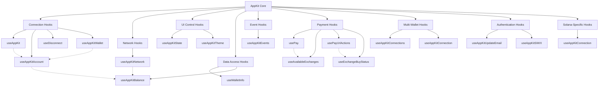

```mermaid
graph TD
  AppKit[AppKit Core] --> ConnHooks[Connection Hooks]
  AppKit --> NetworkHooks[Network Hooks]
  AppKit --> UIHooks[UI Control Hooks]
  AppKit --> DataHooks[Data Access Hooks]
  AppKit --> EventHooks[Event Hooks]
  AppKit --> PaymentHooks[Payment Hooks]
  AppKit --> MultiWalletHooks[Multi-Wallet Hooks]
  AppKit --> AuthHooks[Authentication Hooks]
  AppKit --> SolanaHooks[Solana-Specific Hooks]
  
  ConnHooks --> useAppKit
  ConnHooks --> useAppKitAccount
  ConnHooks --> useAppKitProvider
  ConnHooks --> useDisconnect
  ConnHooks --> useAppKitWallet
  
  NetworkHooks --> useAppKitNetwork
  
  UIHooks --> useAppKitState
  UIHooks --> useAppKitTheme
  
  DataHooks --> useWalletInfo
  DataHooks --> useAppKitBalance
  
  EventHooks --> useAppKitEvents
  
  PaymentHooks --> usePay
  PaymentHooks --> useAvailableExchanges
  PaymentHooks --> usePayUrlActions
  PaymentHooks --> useExchangeBuyStatus
  
  MultiWalletHooks --> useAppKitConnections
  MultiWalletHooks --> useAppKitConnection
  
  AuthHooks --> useAppKitUpdateEmail
  AuthHooks --> useAppKitSIWX
  
  SolanaHooks --> useAppKitConnectionSolana[useAppKitConnection]
  
  useAppKit -.-> useAppKitAccount
  useAppKitAccount -.-> useAppKitBalance
  useAppKitNetwork -.-> useAppKitBalance
  useAppKitWallet -.-> useAppKitAccount
  usePay -.-> useAvailableExchanges
  usePayUrlActions -.-> useExchangeBuyStatus
```

# appkit Folder

## .mdx (android/cloud/analytics.mdx)
---
title: Analytics
---

import Analytics from "/snippets/cloud/analytics.mdx";

<Analytics />

---

## .mdx (android/cloud/blockchain-api.mdx)
---
title: Blockchain API
---

import BlockchainAPI from "/snippets/cloud/blockchain-api.mdx";

<BlockchainAPI />

---

## .mdx (android/cloud/relay.mdx)
---
title: Relay
---

import Relay from "/snippets/cloud/relay.mdx";

<Relay />

---

## .mdx (android/core/actions.mdx)
---
title: Actions
---

## Chains

### Get selected chain

You can get selected chain by calling the `getSelectedChain()` on the `AppKit` object.

```kotlin
AppKit.getSelectedChain()
```

## AppKit.ModalDelegate

```kotlin
val appKitModalDelegate = object : AppKit.ModalDelegate {
    override fun onSessionApproved(approvedSession: Modal.Model.ApprovedSession) {
        // Triggered when receives the session approval from wallet
    }

    override fun onSessionRejected(rejectedSession: Modal.Model.RejectedSession) {
        // Triggered when receives the session rejection from wallet
    }

    override fun onSessionUpdate(updatedSession: Modal.Model.UpdatedSession) {
        // Triggered when receives the session update from wallet
    }

    override fun onSessionExtend(session: Modal.Model.Session) {
        // Triggered when receives the session extend from wallet
    }

    override fun onSessionEvent(sessionEvent: Modal.Model.SessionEvent) {
        // Triggered when the peer emits events that match the list of events agreed upon session settlement
    }

    override fun onSessionDelete(deletedSession: Modal.Model.DeletedSession) {
        // Triggered when receives the session delete from wallet
    }

    override fun onSessionRequestResponse(response: Modal.Model.SessionRequestResponse) {
        // Triggered when receives the session request response from wallet
    }

    override fun onProposalExpired(proposal: Modal.Model.ExpiredProposal) {
        // Triggered when a proposal becomes expired
    }

    override fun onRequestExpired(request: Modal.Model.ExpiredRequest) {
        // Triggered when a request becomes expired
    }

    override fun onConnectionStateChange(state: Modal.Model.ConnectionState) {
        //Triggered whenever the connection state is changed
    }

    override fun onError(error: Modal.Model.Error) {
        // Triggered whenever there is an issue inside the SDK
    }
}
```

You have set delegate on AppKit to start getting updates from Wallet.

```kotlin
    AppKit.setDelegate(appKitModalDelegate)
```

## Actions

### Disconnect

```kotlin

AppKit.disconnect(
    onSuccess = {
    /* callback that letting you know that you have successfully disconnected */
    },
    onError = { error ->
    /* callback for error while trying to disconnection with a peer */
    }
)
```

### Request

```kotlin
val requestParams = Modal.Params.Request(
    method = /* Selected method */,
    params = /* Method params  */,
)

AppKit.request(
    request = requestParams,
    onSuccess = {
    /* callback that letting you know that you have successful request */
    },
    onError = { error ->
    /* callback for error */
    }
)
```

### Get Active Account

Returns the current active account connected via AppKit

```kotlin
AppKit.getAccount()
```

### Get Connection type

Return information about the type of our connection

```kotlin
AppKit.getConnectorType()
```

---

## .mdx (android/core/components.mdx)
---
title: Components
---

You can use predefined AppKitComponent and add it in your application. As a view, dialog or modal.

```kotlin
import androidx.compose.material.ExperimentalMaterialApi
import androidx.compose.material.ModalBottomSheetState
import androidx.navigation.compose.NavHost
import androidx.navigation.compose.composable
import androidx.navigation.compose.rememberNavController
import androidx.compose.material.ModalBottomSheetLayout

setContent {
    val modalSheetState = rememberModalBottomSheetState(initialValue = ModalBottomSheetValue.Hidden, skipHalfExpanded = true)
    val coroutineScope = rememberCoroutineScope()
    val navController = rememberNavController()

    ModalBottomSheetLayout(
        sheetContent = {
            AppKitComponent(
                shouldOpenChooseNetwork = true | false,
                closeModal = { coroutineScope.launch { modalSheetState.hide() }
            )
        }
    ) {
        // content
    }
}
```

## Buttons

You can add ready made button components to your application

### Web3Button

<Tabs>
<Tab title="Compose">
```kotlin
import com.reown.appkit.ui.components.button.Web3Button
import com.reown.appkit.ui.components.button.ConnectButtonSize
import com.reown.appkit.ui.components.button.AccountButtonType
import com.reown.appkit.ui.components.button.rememberAppKitState

YourAppScreen(navController: NavController) {
    val appKitState = rememberAppKitState(navController = navController)
    Web3Button(
        state = appKitState,
        accountButtonType = AccountButtonType.NORMAL || AccountButtonType.MIXED,
        connectButtonSize = ConnectButtonSize.NORMAL || ConnectButtonSize.SMALL
    )
}
```
</Tab>
<Tab title="View">
```xml
<LinearLayout
    xmlns:android="http://schemas.android.com/apk/res/android"
    xmlns:app="http://schemas.android.com/apk/res-auto"
    android:layout_width="match_parent"
    android:layout_height="match_parent"
    android:gravity="center"
    android:orientation="vertical">

        <com.reown.appkit.ui.components.button.views.Web3Button
            android:layout_width="wrap_content"
            android:layout_height="wrap_content"
            app:connect_button_size="NORMAL" || "SMALL"
            app:account_button_type="NORMAL" || "MIXED"
        />
</LinearLayout>
```
</Tab>
</Tabs>

### Network Button

<Tabs>
<Tab title="Compose">
```kotlin
import com.reown.appkit.ui.components.button.NetworkButton
import com.reown.appkit.ui.components.button.rememberAppKitState

YourAppScreen(navController: NavController) {
    val appKitState = rememberAppKitState(navController = navController)
    NetworkButton(state = appKitState)
}
```
</Tab>
<Tab title="View">
```xml
<LinearLayout
    xmlns:android="http://schemas.android.com/apk/res/android"
    android:layout_width="match_parent"
    android:layout_height="match_parent"
    android:gravity="center"
    android:orientation="vertical">

        <com.reown.appkit.ui.components.button.views.NetworkButton
            android:layout_width="wrap_content"
            android:layout_height="wrap_content"
        />
</LinearLayout>
```
</Tab>
</Tabs>

### Connect Button

<Tabs>
<Tab title="Compose">
```kotlin
import com.reown.appkit.ui.components.button.ConnectButton
import com.reown.appkit.ui.components.button.ConnectButtonSize
import com.reown.appkit.ui.components.button.rememberAppKitState

YourAppScreen(navController: NavController) {
    val appKitState = rememberAppKitState(navController = navController)
    ConnectButton(
        state = appKitState,
        buttonSize = ConnectButtonSize.NORMAL || ConnectButtonSize.SMALL
    )
}
```
</Tab>
<Tab title="View">
```xml
<LinearLayout
    xmlns:android="http://schemas.android.com/apk/res/android"
    xmlns:app="http://schemas.android.com/apk/res-auto"
    android:layout_width="match_parent"
    android:layout_height="match_parent"
    android:gravity="center"
    android:orientation="vertical">

        <com.reown.appkit.ui.components.button.views.ConnectButton
            android:layout_width="wrap_content"
            android:layout_height="wrap_content"
            app:connect_button_size="NORMAL" || "SMALL"
        />
</LinearLayout>
```
</Tab>
</Tabs>

### Account Button

<Tabs>
<Tab title="Compose">
```kotlin
import com.reown.appkit.ui.components.button.AccountButton
import com.reown.appkit.ui.components.button.AccountButtonType
import com.reown.appkit.ui.components.button.rememberAppKitState

YourAppScreen(navController: NavController) {
    val appKitState = rememberAppKitState(navController = navController)
    AccountButton(
        state = appKitState,
        buttonSize = AccountButtonType.NORMAL || AccountButtonType.MIXED
    )
}
```
</Tab>
<Tab title="View">
```xml
<LinearLayout
    xmlns:android="http://schemas.android.com/apk/res/android"
    xmlns:app="http://schemas.android.com/apk/res-auto"
    android:layout_width="match_parent"
    android:layout_height="match_parent"
    android:gravity="center"
    android:orientation="vertical">

        <com.reown.appkit.ui.components.button.views.AccountButton
            android:layout_width="wrap_content"
            android:layout_height="wrap_content"
            app:account_button_type="NORMAL" || "MIXED"
        />
</LinearLayout>
```
</Tab>
</Tabs>

### AppKit State

AppKitState is an object that ensures communication between your application and the state of the AppKit.

#### Create appKitState:

NavController is required to create appKitState

```kotlin
    val appKitState = rememberAppKitState(navController)
```

#### AppKitState methods

```kotlin
    appKitState.isOpen
```

returns `StateFlow<Boolean>` whose value is updated depending on whether the appkit component is open

```kotlin
    appKitState.isConnected
```

returns `StateFlow<Boolean>` whose value depends on the active session in AppKit

---

## .mdx (android/core/installation.mdx)
---
title: Kotlin
---

Kotlin implementation of AppKit for Android applications.

Android Core \
Appkit 

### Requirements

- Android min SDK 23
- Java 11

## Installation

root/build.gradle.kts:

```gradle
allprojects {
   repositories {
      mavenCentral()
      maven { url "https://jitpack.io" }
   }
}
```

app/build.gradle.kts

```gradle
implementation(platform("com.reown:android-bom:$BOM_VERSION"))
implementation("com.reown:android-core")
implementation("com.reown:appkit")
```

## ProGuard rules

If you encounter issues with minification, add the below rules to your application:

```
-keepattributes *Annotation*

-keep class com.sun.jna.** { *; }
-keepclassmembers class com.sun.jna.** {
    native <methods>;
    *;
}

-keep class uniffi.** { *; }

# Preserve all public and protected fields and methods
-keepclassmembers class ** {
    public *;
    protected *;
}

-dontwarn uniffi.**
-dontwarn com.sun.jna.**
```

## Example

<Card
  title="AppKit with Kotlin example"
  icon="github"
  href="https://github.com/reown-com/reown-kotlin/tree/develop/sample/dapp"
>
  Check the Kotlin example
</Card>

## Test Apps

Want to see AppKit in action? Download our sample AppKit apps below and explore what it can do. Enjoy! 😊

- [Android Build (Firebase)](https://appdistribution.firebase.google.com/pub/i/4cf60e7b49f9265e)

---

## .mdx (android/core/one-click-auth.mdx)
---
title: Sign In With Ethereum
sidebarTitle: One-Click Auth (SIWE)
---

AppKit provides a simple solution for integrating with "Sign In With Ethereum" (SIWE), a form of authentication that enables users to control their digital identity with their Ethereum account. SIWE is a standard also known as [EIP-4361](https://docs.login.xyz/general-information/siwe-overview/eip-4361).

## One-Click Auth

One-Click Auth represents a key advancement within WalletConnect v2, streamlining the user authentication process in AppKit by enabling them to seamlessly connect with a wallet and sign a SIWE message with just one click.
Connecting a wallet, proving control of an address with an off-chain signature, authorizing specific actions. These are the kinds of authorizations that can be encoded as "ReCaps". ReCaps are permissions for a specific website or dapp that can be compactly encoded as a long string in the message you sign and translated by any wallet into a straight-forward one-sentence summary. WalletConnect uses permissions expressed as ReCaps to enable a One-Click Authentication.

## Configure your AppKit Client

To integrate SIWE with AppKit, you need to configure your AppKit client using `Modal.Model.AuthPayloadParams`, which are required to create a SIWE message for the user to sign:

```kotlin
 AppKit.setAuthRequestParams(authPayloadParams)
```

#### Example of AuthRequestParams

```kotlin
 val authParams = Modal.Model.AuthPayloadParams(
    chains = ["eip155:1", "eip155:137"],
    domain = "yourDappDomain.com",
    uri = "https://yourDappDomain.com/login",
    nonce = //uniqueNonce,
    statement = "I accept the Terms of Service: https://yourDappDomain.com/",
    methods = ["personal_sign", "eth_sendTransaction"],
    resources = null //// Here your dapp may request authorization with ReCaps
)
```

Configuring your AppKit client with Modal.Model.AuthPayloadParams will prioritize authentication requests over regular session proposals. If the wallet supports One-Click Auth, the session will be created and the user will automatically authenticate without needing to send another SIWE request over personal_sign. If the wallet does not support One-Click Auth, it will fall back to the session proposal. In this case, to authenticate the user, AppKit will send another session request to prove address ownership.

To check whether the user has signed a SIWE message, check `onSessionAuthenticateResponse` callback from `AppKit.ModalDelegate`:

```kotlin
fun onSessionAuthenticateResponse(response: Modal.Model.SessionAuthenticateResponse) {
    // Triggered when Dapp receives the session authenticate response from wallet

    if (response is Modal.Model.SessionAuthenticateResponse.Result) {
        if (response.session != null) {
            // Authentication successful, session established
        } else {
            // Authentication successful, but no session created (SIWE-only flow)
        }
    } else {
        // Authentication request was rejected or failed
    }
}
```

### Fallback to SIWE Over Session Request

If the wallet connecting to your dapp does not support One-Click Auth, the SDK will fallback to the `wc_sessionPropose` method and create a session with the wallet. AppKit will then inform the user that they need to sign a message to prove address ownership. AppKit will send a SIWE request to the wallet, and once the wallet responds with a signed message, use `onSIWEAuthenticationResponse` callback to check the result:

```kotlin
 override fun onSIWEAuthenticationResponse(response: Modal.Model.SIWEAuthenticateResponse) {
    if (response is Modal.Model.SIWEAuthenticateResponse.Result) {
        // message and signature
    } else {
        //error
    }
}
```

### Link Mode

The latest release of AppKit supports link mode, a low latency mechanism for transporting One-Click Auth requests and session requests over universal links, reducing the need for a WebSocket connection with the Relay. This significantly enhances the user experience when connecting native dApps to native wallets by reducing the latency associated with networking connections, especially when the user has an unstable internet connection.

<Frame>
<video
  controls
  autoPlay
  src="/images/link-mode.mp4"
  height="400" width="300"
></video>
</Frame>

To support link mode, configure your AppMetaData `appLink` with a valid universal link and set the `linkMode` property to `true`:

```kotlin
 val appMetaData = Core.Model.AppMetaData(
    ...
    appLink = "https://example.com/example_dapp",
    linkMode = true
)

CoreClient.initialize(
   metaData: appMetaData,
    ...
)

AppKit.initialize(Modal.Params.Init(core = CoreClient))
```

Once link mode is configured, your dApp will connect and send requests to wallets via app links after receiving proof from the wallet that it also supports link mode.

The wallet will also send responses using app links. Your app needs to pass these responses to the AppKit client so it can process them.

```kotlin
AppKit.handleDeepLink(url) { error ->
    //handle error

}
```

Ensure to handle incoming app links in your Activity onCreate method and in onNewIntent callback.

Ensure that your App Link is properly configured in your app's Manifest file with the `autoVerify` set to `true`:

```
<intent-filter android:autoVerify="true">
    <action android:name="android.intent.action.VIEW" />
    <category android:name="android.intent.category.DEFAULT" />
    <category android:name="android.intent.category.BROWSABLE" />

    <data android:scheme="https" android:host="your_host" />
</intent-filter>
```

#### How does it look without Link Mode?

<Frame>
<video
  controls
  autoPlay
  src="/images/without-link-mode.mp4"
  height="400" width="300"
></video>
</Frame>

For more information on how to configure app links for your app, refer to the [Android Documentation](https://developer.android.com/training/app-links/verify-android-applinks).

For enabling links to app content check [this](https://developer.android.com/training/app-links/deep-linking) documentation page.

For more information on how to interact with other apps using intents, see [Android Intent Documentation](https://developer.android.com/training/basics/intents).

---

## .mdx (android/core/options.mdx)
---
title: Options
---

### Explorer recommended wallets

Allows to set default recommended wallets that are fetched from [WalletGuide](https://walletguide.walletconnect.network/). You can define a list of wallets ids you'd like to prioritize (order is respected). You can get these ids from the explorer link mentioned before by clicking on a copy icon of your desired wallet card.

```kotlin
val recommendedWalletsIds = listOf<String>(
    "1ae92b26df02f0abca6304df07debccd18262fdf5fe82daa81593582dac9a369",
    "4622a2b2d6af1c9844944291e5e7351a6aa24cd7b23099efac1b2fd875da31a0"
)

val initParams = Modal.Params.Init(core = CoreClient, recommendedWalletsIds = recommendedWalletsIds)

AppKit.initialize(
    init = initParams,
    onSuccess = {
        // Callback will be called if initialization is successful
    },
    onError = { error ->
        // Error will be thrown if there's an issue during initialization
    }
)
```

### Explorer excluded wallets

Allows to exclude wallets that are fetched from [WalletGuide](https://walletguide.walletconnect.network/). You can define an array of wallet ids you'd like to exclude. You can get these ids from the explorer link mentioned before by clicking on a copy icon of your desired wallet card.

```kotlin
val excludedWalletIds = listOf<String>(
    "1ae92b26df02f0abca6304df07debccd18262fdf5fe82daa81593582dac9a369",
    "4622a2b2d6af1c9844944291e5e7351a6aa24cd7b23099efac1b2fd875da31a0"
)

val initParams = Modal.Params.Init(core = CoreClient, excludedWalletIds = excludedWalletIds)

AppKit.initialize(
    init = initParams,
    onSuccess = {
        // Callback will be called if initialization is successful
    },
    onError = { error ->
        // Error will be thrown if there's an issue during initialization
    }
)
```

### Show installed wallets

Allows you to show the `INSTALLED` icon in the list. To use this feature, you need to add selected wallets that you want to handle to `AndroidManifest.xml` as a query. Specs: [Android Specs](https://developer.android.com/guide/topics/manifest/queries-element)

```xml
<?xml version="1.0" encoding="utf-8"?>
<manifest xmlns:android="http://schemas.android.com/apk/res/android">

    <queries>
        <package android:name="..."/>
    </queries>

    <application>
        ...
    </application>
</manifest>
```

### Enable coinbase

<Warning>
**The Coinbase integration is in Beta**.
It's public API and associated documentation may still see significant and breaking changes.
</Warning>

Coinbase has been added since version 1.2.0

```kotlin
val initParams = Modal.Params.Init(core = CoreClient, coinbaseEnabled = true)

AppKit.initialize(
    init = initParams,
    onSuccess = {
        // Callback will be called if initialization is successful
    },
    onError = { error ->
        // Error will be thrown if there's an issue during initialization
    }
)
```

Coinbase Wallet SDK requires AppKit registration in Activity to receive responses from Coinbase wallet

```kotlin
    fun onCreate(savedInstanceState: Bundle?) {
        super.onCreate(savedInstanceState)
        AppKit.register(this)
        // Your content
    }
```

---

## .mdx (android/core/theming.mdx)
---
title: Theming
---

## Usage

<Tabs>
<Tab title="Compose">
Wrap your composable component with `AppKitTheme`

```kotlin
import com.reown.appkit.ui.AppKitTheme

AppKitTheme(
    mode = AppKitTheme.Mode.AUTO || AppKitTheme.Mode.LIGHT || AppKitTheme.Mode.DARK,
    lightColors = AppKitTheme.provideLightAppKitColors(
        // Override colors
    ),
    darkColors = AppKitTheme.provideDarkAppKitColors(
        // Override colors
    )
)    {
    /* any AppKit component or graph */
}

```
</Tab>
<Tab title="View">
You can define AppKitTheme in yours `style.xml` files

```xml
<?xml version="1.0" encoding="utf-8"?>
<resources>
    <style name="AppKitTheme">
        <item name="modalMode">AUTO || LIGHT || DARK</item>
        /* Override colors */
    </style>
</resources>
```
</Tab>
</Tabs>

## Mode

<Tabs>
<Tab title="Compose">
```kotlin
    enum class Mode {
        LIGHT, DARK, AUTO
    }
```
</Tab>
<Tab title="View">
```xml
<?xml version="1.0" encoding="utf-8"?>
<resources>
    <attr name="modalMode" format="enum">
        <enum name="AUTO" value="0"/>
        <enum name="DARK" value="1"/>
        <enum name="LIGHT" value="2"/>
    </attr>
</resources>
```
</Tab>
</Tabs>

## Colors

<Tabs>
<Tab title="Compose">
Customizable colors in AppKitTheme.
To override colors you need to use methods `AppKitTheme.provideLightAppKitColors` or AppKitTheme.provideDarkAppKitColors
To override foreground or background `ColorPalette` you can define new palette or use one of the AppKitTheme methods to provide Palette and override selected colors

```kotlin
    interface Colors {
        val accent100: Color
        val accent90: Color
        val accent80: Color
        val foreground: ColorPalette
        val background: ColorPalette
        val grayGlass: Color
        val success: Color
        val error: Color
    }
```

ColorPalette

```kotlin
    data class ColorPalette(
        val color100: Color,
        val color125: Color,
        val color150: Color,
        val color175: Color,
        val color200: Color,
        val color225: Color,
        val color250: Color,
        val color275: Color,
        val color300: Color,
    )
```

</Tab>
<Tab title="View">
```xml
<?xml version="1.0" encoding="utf-8"?>

You can override those values in AppKitTheme in your style.xml file

<resources>
    <attr name="modalAccent100" format="color"/>
    <attr name="modalAccent90" format="color"/>
    <attr name="modalAccent80" format="color"/>
    <attr name="modalForeground100" format="color"/>
    <attr name="modalForeground125" format="color"/>
    <attr name="modalForeground150" format="color"/>
    <attr name="modalForeground175" format="color"/>
    <attr name="modalForeground200" format="color"/>
    <attr name="modalForeground225" format="color"/>
    <attr name="modalForeground250" format="color"/>
    <attr name="modalForeground275" format="color"/>
    <attr name="modalForeground300" format="color"/>
    <attr name="modalBackground100" format="color"/>
    <attr name="modalBackground125" format="color"/>
    <attr name="modalBackground150" format="color"/>
    <attr name="modalBackground175" format="color"/>
    <attr name="modalBackground200" format="color"/>
    <attr name="modalBackground225" format="color"/>
    <attr name="modalBackground250" format="color"/>
    <attr name="modalBackground275" format="color"/>
    <attr name="modalBackground300" format="color"/>
    <attr name="modalGrayGlass" format="color"/>
    <attr name="modalSuccess" format="color"/>
    <attr name="modalError" format="color"/>

</resources>
```
</Tab>
</Tabs>

---

## .mdx (android/core/usage.mdx)
---
title: Usage
---

`AppKit` is a singleton that interacts with the AppKit SDK.

## Implementation

#### Initialize

```kotlin
val connectionType = ConnectionType.AUTOMATIC or ConnectionType.MANUAL
val projectId = "" // Get Project ID at https://dashboard.reown.com/
val appMetaData = Core.Model.AppMetaData(
    name = "Kotlin.AppKit",
    description = "Kotlin AppKit Implementation",
    url = "kotlin.reown.com",
    icons = listOf("https://gblobscdn.gitbook.com/spaces%2F-LJJeCjcLrr53DcT1Ml7%2Favatar.png?alt=media"),
    redirect = "kotlin-modal-wc://request"
)

CoreClient.initialize(projectId = projectId, connectionType = connectionType, application = this, metaData = appMetaData)

AppKit.initialize(
    init = Modal.Params.Init(CoreClient),
    onSuccess = {
        // Callback will be called if initialization is successful
     },
    onError = { error ->
        // Error will be thrown if there's an issue during initialization
    }
)
```

#### Session properties

You can define session properties by calling the `setSessionProperties` method on the `AppKit` object.

#### Chains

This example of define ethereum chain. You can define the chains you want to use. The chain must be EVM compatible.

```kotlin
Example of definition chains: https://github.com/reown-com/reown-kotlin/blob/main/product/appkit/src/main/kotlin/com/reown/appkit/presets/AppKitChainsPresets.kt

AppKit.setChains(AppKitChainsPresets.ethChains.values.toList())
```

**IMPORTANT**: `Chains` must be set before opening the modal.

## Usage

<Tabs>
<Tab title="Compose Accompanist">
```kotlin
import androidx.compose.material.ExperimentalMaterialApi
import androidx.compose.material.ModalBottomSheetState
import androidx.navigation.compose.NavHost
import androidx.navigation.compose.composable
import androidx.navigation.compose.rememberNavController
import com.google.accompanist.navigation.material.BottomSheetNavigator
import com.google.accompanist.navigation.material.ExperimentalMaterialNavigationApi
import com.google.accompanist.navigation.material.ModalBottomSheetLayout
import com.google.accompanist.navigation.material.bottomSheet
import com.reown.appkit.ui.appKitGraph

setContent {
    val modalSheetState = rememberModalBottomSheetState(initialValue = ModalBottomSheetValue.Hidden, skipHalfExpanded = true)
    val bottomSheetNavigator = BottomSheetNavigator(modalSheetState)
    val navController = rememberNavController(bottomSheetNavigator)

    ModalBottomSheetLayout(bottomSheetNavigator = bottomSheetNavigator) {
        NavHost(
            navController = navController,
            startDestination = "home"
        ) {
            composable("home") {
                HomeScreen()
            }
            appKitGraph(navController)
        }
    }
}
```

**IMPORTANT**: AppKit uses accompanist navigation material inside. `ModalBottomSheetLayout` should be imported from [Accompanist Navigation Material](https://google.github.io/accompanist/navigation-material/)

```kotlin
import com.reown.appkit.ui.openAppKit

navController().openAppKit(
    shouldOpenChooseNetwork = true | false
    onError = {  }
)
```
</Tab>
<Tab title="Compose Component">
```kotlin
import androidx.compose.material.ExperimentalMaterialApi
import androidx.compose.material.ModalBottomSheetState
import androidx.navigation.compose.NavHost
import androidx.navigation.compose.composable
import androidx.navigation.compose.rememberNavController
import androidx.compose.material.ModalBottomSheetLayout

setContent {
    val modalSheetState = rememberModalBottomSheetState(initialValue = ModalBottomSheetValue.Hidden, skipHalfExpanded = true)
    val coroutineScope = rememberCoroutineScope()
    val navController = rememberNavController()

    ModalBottomSheetLayout(
        sheetContent = {
            AppKitComponent(
                shouldOpenChooseNetwork = true | false,
                closeModal = { coroutineScope.launch { modalSheetState.hide() }
            )
        }
    ) {
        // content
    }
}
```
</Tab>
<Tab title="Kotlin DSL">
```kotlin
import androidx.navigation.createGraph
import androidx.navigation.fragment.fragment
import com.reown.appkit.ui.appKitGraph

navController.graph = navController.createGraph("Home") {
    fragment<HomeFragment>("Home")
    appKit()
}
```

```kotlin
import androidx.navigation.fragment.findNavController
import com.reown.appkit.ui.openAppKit

findNavController().openAppKit(
    shouldOpenChooseNetwork = true | false
    onError = {  }
)
```
</Tab>
<Tab title="Nav graph">
```xml
<navigation >
    <fragment
        android:id="@+id/HomeFragment"
        android:name="com.reown.sample.HomeFragment">
    </fragment>

    <include app:graph ="@navigation/appkit_graph"/>
</navigation>
```

```kotlin
import androidx.navigation.fragment.findNavController
import com.reown.appkit.ui.openAppKit

findNavController().openAppKit(
    shouldOpenChooseNetwork = true | false
    onError = {  }
)
```
</Tab>
</Tabs>

---

## .mdx (authentication/one-click-auth.mdx)
---
title: One-Click Auth
---

**One-Click Auth** represents a key advancement within WalletConnect v2, streamlining the user authentication process in AppKit by enabling them to seamlessly connect with a wallet and sign a SIWE message with just one click.

Enable your users to connect to web3 through a single tap with One-Click Auth, improving connectivity speeds and creating all-around better UX and friction-free user journeys. With one-tap multi-chain and multi-account signing, let users authenticate multiple chains and accounts simultaneously.

<Frame>
<video
  autoPlay
  controls
  className="w-full aspect-square"
  src="/images/one-click-auth-demo.mp4"
></video>
</Frame>

## Get Started

<CardGroup cols={2}>
  <Card title="React" icon="react" href="/appkit/react/core/siwe">
    Get started with AppKit in React.
  </Card>

<Card title="Next.js" icon="square-n" href="/appkit/next/core/siwe">
  Get started with AppKit in Next.js.
</Card>

<Card title="Vue" icon="vuejs" href="/appkit/vue/core/siwe">
  Get started with AppKit in Vue.
</Card>

<Card title="JavaScript" icon="js" href="/appkit/javascript/core/siwe">
  Get started with AppKit in JavaScript.
</Card>

<Card title="React Native" icon="react" href="/appkit/react-native/core/siwe">
  Get started with AppKit in React Native.
</Card>

<Card title="Flutter" icon="flutter" href="/appkit/flutter/core/siwe">
  Get started with AppKit in Flutter.
</Card>

<Card title="Android" icon="android" href="/appkit/android/core/one-click-auth">
  Get started with AppKit in Android.
</Card>

<Card title="iOS" icon="apple" href="/appkit/ios/core/one-click-auth">
  Get started with AppKit in iOS.
</Card>

  <Card title="Unity" icon="unity" href="/appkit/unity/core/siwe">
    Get started with AppKit in Unity.
  </Card>
</CardGroup>

<br />

<Card
  title="Try Demo"
  href="https://appkit-lab.reown.com/appkit/?name=wagmi-siwe"
/>

---

## .mdx (authentication/siwx/default.mdx)
---
title: Multichain Authentication (SIWX)
sidebarTitle: Multichain Authentication (SIWX)
---

The **Sign In With X** feature enables decentralized applications (Dapps) to authenticate users seamlessly across multiple blockchain networks, such as Ethereum, Solana, and Bitcoin, since this feature is **chain agnostic**.

This feature allows developers using our SDK to implement authentication by having users sign a unique string message with their blockchain wallets. The **Sign In With X** feature is designed in accordance with the [CAIP-122](https://github.com/ChainAgnostic/CAIPs/blob/main/CAIPs/caip-122.md) standard, which establishes a chain-agnostic framework for blockchain-based authentication and authorization on off-chain services.

<Frame caption="SIWX Demo">
  <video controls autoPlay loop src="/images/siwx.mp4"></video>
</Frame>

## Demo

<CardGroup cols={2}>
  <Card icon="flask" title="Try Demo" href="https://appkit-lab.reown.com/appkit/?name=siwx-default" />
</CardGroup>

## Getting Started

**SIWX** works as a plugin system for AppKit and you are going to add the plugin in the AppKit configuration. There are some ways to implement the **SIWX** feature:

- Use Reown Authentication to manage the sessions in the Reown Dashboard
- Use the `DefaultSIWX` class provided by AppKit
- Create a custom implementation to suit your specific requirements.

To initialize the **SIWX** feature, you need to add the `siwx` parameter to the `createAppKit` function.

### Reown Authentication

Reown Authentication is a predefined implementation of the SIWX configuration plugin that uses the Cloud service to create and manage SIWX messages and sessions. With Reown Authentication, you will be able to see and control the sessions of your users using the Reown [Dashboard](/cloud/reown-authentication).

Read more about the [Reown Authentication Implementation](./reown-authentication).

### Custom Implementation

`DefaultSIWX` is a scaffold implementation of the SIWX feature for quick custom integration. This option provides a set of pre-built components that allow you to have the feature up and running in no time or 
you can configure the `siwx` parameters expected to receive. This is what allows you to customize the feature to suit your specific requirements.

The defined interface must follow specific rules to make sure that AppKit can interact with it correctly. Read more about how to have your [Custom Implementation](./siwx-custom).

## SIWX Expected Behavior

- **SIWX** will prompt to get the user signature and verify his identity every time a connection happen;
- In case a SIWX session is already stored, the user will be automatically signed in and the prompt step will be skipped;
- If the user changes the connected network, **SIWX** will prompt to get the user signature and verify his identity again;
- If the user disconnects from the Dapp, **SIWX** will revoke the session and the user will need to sign in again.

## Migrating from SIWE to SIWX

If you are currently already using **SIWE** from `@reown/appkit-siwe`, after AppKit version 1.5.0, you will be migrated into **SIWX**. The migration process is automatic and your `siweConfig` from `createAppKit` function will be mapped internally.

<Warning>
It is important to note that you cannot use `siweConfig` and `siwx` at the same time, `createAppKit` will throw an error in case this happens.

You may replace `siweConfig` with your own `siwx` configuration manually if you would like to do so.

</Warning>

---

## .mdx (authentication/siwx/reown-authentication.mdx)
---
title: SIWX Implementation
displayed_sidebar: mainSidebar
---

import ReownAuthenticationContent from '/snippets/appkit/shared/siwx/reown-authentication.mdx'

# Reown Authentication SIWX Usage

<ReownAuthenticationContent />

---

## .mdx (authentication/siwx/siwx-custom.mdx)
---
title: SIWX Implementation
displayed_sidebar: mainSidebar
---

import SiwxCustom from '/snippets/appkit/shared/siwx/siwx-custom.mdx'

# SIWX Custom Usage

<SiwxCustom />

---

## .mdx (authentication/siwx/siwx-default.mdx)
---
title: SIWX Implementation
displayed_sidebar: mainSidebar
---

import SiwxDefault from '/snippets/appkit/shared/siwx/siwx-default.mdx'

# SIWX Default Usage

<SiwxDefault />

---

## .mdx (authentication/socials.mdx)
---
title: Email & Socials
sidebarTitle: Email & Social Login
---

Bring your app to a world of new users in minutes with default Email and Social login, giving both new and existing users the ability to seamlessly connect to your app using just an email address or social account. With minimal code changes, you can customize these options to suit your needs and use Smart Account functionality in minutes.

<Frame>
<video
  controls
  autoPlay
  className="w-full aspect-video"
  src="/images/socials-demo.mp4"
></video>
</Frame>

## Demo

Want to see social login in action? Try out the live demo to experience the seamless social login flow firsthand.

<Card icon="flask" title="Try Demo" href="https://demo.reown.com/?utm_source=navbar&utm_medium=docs&utm_campaign=backlinks" external />

## Supported Providers 

AppKit supports the following providers: **Email**, **Google**, **X**, **GitHub**, **Discord**, **Apple**, **Facebook** and **Farcaster**.

## Supported Chains

Email and Social login are supported for all **EVM-compatible chains** listed in Viem. If the EVM-compatible chain is included in the `viem/chains` [package](https://github.com/wevm/viem/blob/main/src/chains/index.ts), it should be supported for email and social login.

Email and Social login is also available for **Solana, Solana Devnet, and Solana Testnet**.

## Ensuring the Security of Your Private Key

Reown AppKit uses [Magic](https://magic.link/) to provide Universal Wallets. For information on how these are created and how the **Private Keys** are managed, refer to Magic's docs [here](https://magic.link/docs/home/security/product-security#patented-key-management).

## Get Started

<CardGroup cols={2}>
  <Card title="React" icon="react" href="/appkit/react/core/socials">
    Get started with AppKit in React.
  </Card>

<Card title="Next.js" icon="square-n" href="/appkit/next/core/socials">
  Get started with AppKit in Next.js.
</Card>

<Card title="Vue" icon="vuejs" href="/appkit/vue/core/socials">
  Get started with AppKit in Vue.
</Card>

<Card title="JavaScript" icon="js" href="/appkit/javascript/core/socials">
  Get started with AppKit in JavaScript.
</Card>

<Card title="React Native" icon="react" href="/appkit/react-native/core/email">
  Get started with AppKit in React Native.
</Card>

<Card title="Flutter" icon="flutter" href="/appkit/flutter/core/email">
  Get started with AppKit in Flutter.
</Card>

  <Card title="Unity" icon="unity" href="/appkit/unity/core/socials">
    Get started with AppKit in Unity.
  </Card>
</CardGroup>

---

## .mdx (faq.mdx)
---
title: "AppKit FAQs"
sidebarTitle: "FAQs"
---

This FAQ section covers common questions and solutions for using AppKit. The questions are organized into three main categories:

- **Configuration**: Questions about setting up AppKit, including project configuration, wallet visibility, and RPC customization.
- **Features**: Information about AppKit's capabilities, including off-ramp support, multi-wallet address retrieval, and branding options.
- **Technical**: Technical details about project approval requirements and initialization constraints.

## AppKit Configuration

<AccordionGroup>
  <Accordion title="Why am I seeing an 'Invalid App Configuration' error?">
    

    This error typically occurs when the `projectId` is not configured correctly. To resolve this:

    1. Create a valid project ID at [https://dashboard.reown.com/](https://dashboard.reown.com/)
    2. Add it to your AppKit configuration:

    ```javascript
    const modal = createAppKit({
      ...
      projectId: "..." // Add your valid projectId here
    });
    ```
    3. Ensure that you have added your domain to the allowed domains in your project settings. If you have not done so, you can do so by navigating to **"Project Domains"** on the Dashboard, clicking on **"Configure Domains"** and adding your domain.
  </Accordion>

  <Accordion title="Why can't I see any wallets in the modal and only see the 'Connect Wallet' title?">
    **Problem**: Users only see the "Connect Wallet" title in the modal after clicking the connect button.

    **Solution**: This issue typically has two possible causes:

    1. **Version Mismatch**: Ensure all @reown libraries use the same version in your `package.json`:

    ```json
    {
      "dependencies": {
        "@reown/appkit": "1.7.8",
        "@reown/appkit-adapter-wagmi": "1.7.8"
        // ... other dependencies
      }
    }
    ```

    2. **Initialization Location**: Call `createAppKit` outside of your component to ensure proper initialization:

    ```javascript
    // Create modal
    createAppKit({
      adapters: [wagmiAdapter],
      ...generalConfig,
      features: {
        analytics: true // Optional - defaults to your Cloud configuration
      }
    })

    export function App() {
      return (
        <WagmiProvider ...>
          <QueryClientProvider ...>
            <appkit-button />
          </QueryClientProvider>
        </WagmiProvider>
      )
    }
    ```
  </Accordion>

  <Accordion title="How can I use custom RPCs with AppKit?">
    You can use your own RPC by setting the `customRpcUrls` option in the AppKit configuration. This lets you define custom RPC URLs for specific chains. Each entry must follow the format:

    ```javascript
    customRpcUrls: {
      [ChainId.Ethereum]: 'https://your.custom.rpc.url',
      [ChainId.Polygon]: 'https://your.polygon.rpc.url'
    }
    ```

    AppKit will prioritize these URLs over the default ones.
  </Accordion>
</AccordionGroup>

## Features

<AccordionGroup>
  <Accordion title="When will Reown support off-ramp functionality?">
    Reown currently does not plan to support off-ramp functionality.
  </Accordion>

  <Accordion title="How do I get retrieve multiple addresses from multiple connected wallets?">
    To retrieve addresses from multiple connected wallets, refer to our multichain example:

    - [Live Demo](https://appkit-web-examples-react-multichain.reown.com/)
    - [Source Code](https://github.com/reown-com/appkit-web-examples/tree/main/react/react-multichain)

    Example using React SDK:

    ```javascript
    import { useAppKitAccount } from '@reown/appkit/react'

    // Get account states for different chains
    const eip155AccountState = useAppKitAccount({ namespace: 'eip155' })
    const solanaAccountState = useAppKitAccount({ namespace: 'solana' })
    ```

    ```javascript
    <>
      EVM Address: {eip155AccountState.address}<br />
      Solana Address: {solanaAccountState.address}<br />
    </>
    ```
  </Accordion>

  <Accordion title="How do I remove the 'UX by Reown' branding?">
    Currently, only enterprise clients can hide "UX by Reown" on the AppKit modal by adjusting this option on our Dashboard. If you are an enterprise client and would like to hide this branding, please contact sales@reown.com.
  </Accordion>

  <Accordion title="How do I increase my project's RPC limits?">
    Reown currently provides 2.5 million requests per 30 days. If you wish to increase this limit, you need to upgrade to AppKit Pro.
  </Accordion>
</AccordionGroup>

## Technical

<AccordionGroup>
  <Accordion title="Do I need to wait for Web3 app approval before using my projectId?">
    No, dApps do not need approval in order to use your projectId.
  </Accordion>

  <Accordion title="Can I reinitialize AppKit with different network configurations?">
    Currently, `createAppKit` can only be called once during the application's lifecycle. 
    It cannot be lazily initialized and then torn down for re-initialization. 
    This means you must pass in all the networks you plan to support during the initial setup.
  </Accordion>

  <Accordion title="Error Codes">
    Below is a list of error codes you may encounter when using AppKit, along with their descriptions and recommended actions:

    | Code | Message | Action |
    |------|---------|---------|
    | APKT001 | Network Not Found | We couldn't recognize the specified network. Make sure it's included in the `networks` array of your `createAppKit` config. |
    | APKT002 | Invalid App Configuration | The origin isn't in your allowlist. Update your allowed domains at https://dashboard.reown.com. |
    | APKT003 | Wallet Load Failed | We couldn't load the embedded wallet. This might be a network or server issue. Check your connection and try again, or contact support if it persists. |
    | APKT004 | Wallet Request Timeout | The wallet didn't respond in time. Check your network and try again. If the issue continues, contact support. |
    | APKT005 | Unverified Domain | The embedded wallet didn't load. Please verify your domain at https://dashboard.reown.com. |
    | APKT006 | Session Expired | Your session has expired or is invalid. Please check your device's date and time, then reconnect. |
    | APKT007 | Invalid Project ID | The project ID is invalid. You can find or create a valid one at https://dashboard.reown.com. |
    | APKT008 | Project ID Missing | No project ID was found. Set one up in your config at https://dashboard.reown.com. |
    | APKT009 | Server Error | We couldn't load your App Configuration. Check your network and try again. Contact support if it keeps happening. |
    | APKT010 | Rate Limited | Too many requests for App Configuration. Please wait a few minutes and try again. Reach out to support if needed. |
  </Accordion>
</AccordionGroup>

## Support

<AccordionGroup>
  <Accordion title="How do I get technical support for AppKit?">
    Free tier AppKit customers only are only entitled to support via [Discord](https://discord.gg/reown). Please join the Discord server and create a forum post **#developers-forum** and the team will get back to you.

    AppKit Pro and Enterprise customers get priority support via dedicated channels.
  </Accordion>
</AccordionGroup>

---

## .mdx (features/chain-abstraction.mdx)
---
title: Chain Abstraction
---

Chain Abstraction is a feature in Reown AppKit that enables dApps to facilitate seamless cross-chain transactions for users. It allows users to spend crypto tokens, such as stablecoins, across different blockchain networks without needing to manually bridge tokens, worry about network-specific tokens, or manage multiple wallets.

<Note>
Chain Abstraction is currently an early access feature.
</Note>

<Frame caption="Chain Abstraction Demo">
<video
  controls
  autoPlay
  className="w-full aspect-video"
  src="/images/chain-abstraction-demo.mp4"
></video>
</Frame>

## Demo

Want to see Chain Abstraction in action? Try out the live demo to experience Reown AppKit's Chain Abstraction flow firsthand. 

<CardGroup cols={2}>
    <Card icon="flask" title="Try Demo" href="https://ca-demo.reown.com/?utm_source=navbar&utm_medium=docs&utm_campaign=backlinks" external />
</CardGroup>

## When can you leverage Chain Abstraction?

1. **Seamless Cross-Chain Transactions**: Users can transact on a target blockchain network even if their assets reside on a different source network. For example, a user can make a payment on the Base network using USDC held on Arbitrum. 

2. **Enhanced User Experience**: By abstracting the complexities of cross-chain interactions, dApps can offer a more intuitive and frictionless experience, reducing the need for users to understand or manage the underlying blockchain infrastructure.

3.  **Developer-Friendly Integration**: Reown AppKit provides a set of tools and methods, such as prepare and execute, that allow developers to integrate chain abstraction functionality into their dApps with minimal effort. 

## How It Works

- **Transaction Preparation**: When a user initiates a transaction, the dApp uses the prepare method to determine if the user has sufficient funds on the target network. If not, it identifies the necessary bridging transactions required to move assets from the source to the target network.

- **Transaction Execution**: Once the necessary transactions are prepared and signed, the execute method broadcasts them, handling the bridging process and completing the original transaction on the target network.

- **Gas Estimation Handling**: To ensure accurate gas estimation, dApps should pass gas: null when sending transactions, allowing the wallet to handle gas calculations appropriately. 

## Networks and Assets Supported

Currently, Chain Abstraction on AppKit supports the following assets on the following networks:

| Network   | Assets          |
|-----------|-----------------|
| Optimism  | USDC, USDT, ETH |
| Arbitrum  | USDC, USDT, ETH |
| Base      | USDC, USDS, ETH |
| Solana    | USDC            |


## Use Cases

- Pay in stablecoins from any chain.
- Enable multichain bidding, swaps, or purchases without UX blockers.
- Skip bridging tutorials, token lists, and chain selection menus.

## Example Use Case

Consider a scenario where a user wants to **purchase an NFT on the Base network but holds USDC only on the Arbitrum network**. With Chain Abstraction:

- The dApp detects the asset location and prepares the necessary bridging transactions.

- The user signs the transactions, and the assets are bridged from Arbitrum to Base.

- The purchase is completed on the Base network without the user manually bridging assets or switching networks.

You can try out this use case in the [demo above](#demo).

## Get Started

<CardGroup cols={2}>
    <Card title="React" icon="react" href="/appkit/react/early-access/chain-abstraction">
        Get started with AppKit in React.
    </Card>

    <Card title="Next.js" icon="square-n" href="/appkit/next/early-access/chain-abstraction">
        Get started with AppKit in Next.js.
    </Card>
</CardGroup>

---

## .mdx (features/index.mdx)
---
title: Overview
---

While AppKit offers a wide range of features, networks, and authentication methods that make it easy to build interactive and user-friendly blockchain applications, certain features are limited to specific frameworks.

**The following table provides an overview of the features, networks, and authentication methods available in AppKit and the frameworks they support.**

- ✅ - indicates the feature is supported and can be integrated.
- ❌ - indicates the feature is not supported and cannot be integrated.

|                |    React                 | Next.js           |      Vue         | JavaScript        | React Native      | Flutter           | Android          | Swift             |  Unity (Web)      |  Unity (Native)   |
|----------------|--------------------------|-------------------|------------------|-------------------| ------------------| ------------------| -----------------| ----------------- | ----------------- | ----------------- |
| ***Features*** |                          |                   |                  |                   |                   |                   |                  |                   |                   |                   |
| Swaps (EVM Only)|<center>✅</center>       |<center>✅</center>|<center>✅</center>|<center>✅</center>|<center>✅</center>|<center>❌</center>|<center>❌</center>|<center>❌</center>|<center>✅</center>|<center>❌</center>|
| On-Ramp        |<center>✅</center>        |<center>✅</center>|<center>✅</center>|<center>✅</center>|<center>❌</center>|<center>❌</center>|<center>❌</center>|<center>❌</center>|<center>✅</center>|<center>❌</center>|
| Multichain Modal |<center>✅</center>      |<center>✅</center>|<center>✅</center>|<center>✅</center>|<center>❌</center>|<center>❌</center>|<center>❌</center>|<center>❌</center>|<center>❌</center>|<center>❌</center>|
| Smart Accounts |<center>✅</center>        |<center>✅</center>|<center>✅</center>|<center>✅</center>|<center>✅</center>|<center>❌</center>|<center>❌</center>|<center>❌</center>|<center>✅</center>|<center>✅</center>|
| Notifications  |<center>✅</center>        |<center>✅</center>|<center>✅</center>|<center>✅</center>|<center>❌</center>|<center>❌</center>|<center>❌</center>|<center>❌</center>|<center>❌</center>|<center>❌</center>|
| Telegram Mini Apps |<center>✅</center>    |<center>✅</center>|<center>✅</center>|<center>✅</center>|<center>❌</center>|<center>❌</center>|<center>❌</center>|<center>❌</center>|<center>✅</center>|<center>❌</center>|
| Sponsored Transactions |<center>✅</center>|<center>✅</center>|<center>✅</center>|<center>✅</center>|<center>❌</center>|<center>❌</center>|<center>❌</center>|<center>❌</center>|<center>❌</center>|<center>❌</center>|
| ***Networks*** |                          |                   |                   |                  |                   |                   |                  |                   |                   |                   |
| EVM Chains     |<center>✅</center>        |<center>✅</center>|<center>✅</center>|<center>✅</center>|<center>✅</center>|<center>✅</center>|<center>✅</center>|<center>✅</center>|<center>✅</center>|<center>✅</center>|
|     Solana     |<center>✅</center>        |<center>✅</center>|<center>✅</center>|<center>✅</center>|<center>❌</center>|<center>✅</center>|<center>❌</center>|<center>❌</center>|<center>❌</center>|<center>❌</center>|
|    Bitcoin     |<center>✅</center>        |<center>✅</center>|<center>✅</center>|<center>✅</center>|<center>❌</center>|<center>❌</center>|<center>❌</center>|<center>❌</center>|<center>❌</center>|<center>❌</center>|
| ***Authentication*** |                     |                  |                   |                  |                   |                   |                  |                   |                   |                   |
| Email & Social Login |<center>✅</center>  |<center>✅</center>|<center>✅</center>|<center>✅</center>|<center>✅</center>|<center>✅</center>|<center>❌</center>|<center>❌</center>|<center>✅</center>|<center>✅</center>|
|  One-Click Auth |<center>✅</center>        |<center>✅</center>|<center>✅</center>|<center>✅</center>|<center>✅</center>|<center>❌</center>|<center>✅</center>|<center>✅</center>|<center>✅</center>|<center>✅</center>|
|    SIWX        |<center>✅</center>        |<center>✅</center>|<center>✅</center>|<center>✅</center>|<center>❌</center>|<center>❌</center>|<center>❌</center>|<center>❌</center>|<center>❌</center>|<center>❌</center>|

---

## .mdx (features/multichain.mdx)
---
title: Multichain Support
---

AppKit is now multichain. The architecture is designed to support both EVM and non-EVM blockchains. This will allow developers and projects to choose and configure multiple blockchain networks within their instance of AppKit, extending beyond just Ethereum-based (EVM) networks.

<video
  controls
  autoPlay
  src="/images/multichain-demo.mp4"
  className="w-full"
></video>

<Card
  title="Try Demo"
  href="https://appkit-lab.reown.com/appkit/?name=multichain-wagmi-solana"
  horizontal
/>

## Get Started

<CardGroup cols={2}>
  <Card title="React" icon="react" href="/appkit/react/core/multichain">
    Get started with AppKit Multichain in React.
  </Card>

<Card title="Next.js" icon="square-n" href="/appkit/next/core/multichain">
  Get started with AppKit Multichain in Next.js.
</Card>

<Card title="Vue" icon="vuejs" href="/appkit/vue/core/multichain">
  Get started with AppKit Multichain in Vue.
</Card>

  <Card title="JavaScript" icon="js" href="/appkit/javascript/core/multichain">
    Get started with AppKit Multichain in JavaScript.
  </Card>
</CardGroup>

---

## .mdx (features/notifications.mdx)
---
title: Notifications
---

Notifications power web3 communications between apps and their communities, allowing projects to directly engage users with web3-native notifications sent straight to their wallet address.
Maximize reach with multiple touch points across in-app notifications, in-wallet notifications, and via the Web3Inbox app.

## Get Started

<CardGroup cols={2}>
  <Card title="React" icon="react" href="/appkit/react/notifications/overview">
    Get started with AppKit in React.
  </Card>

<Card
  title="Next.js"
  icon="square-n"
  href="/appkit/next/notifications/overview"
>
  Get started with AppKit in Next.js.
</Card>

<Card title="Vue" icon="vuejs" href="/appkit/vue/notifications/overview">
  Get started with AppKit in Vue.
</Card>

  <Card title="JavaScript" icon="js" href="/appkit/javascript/notifications/overview">
    Get started with AppKit in JavaScript.
  </Card>
</CardGroup>

---

## .mdx (features/onramp.mdx)
---
title: On-Ramp
---

On-Ramp securely provides users access to over 100 cryptocurrencies from right within your app. In just a few clicks, users can purchase tokens to support in-app activity and transactions across multiple chains. Set up in minutes with just one line of code.

<div style={{ position: 'relative', width: '100%', paddingBottom: '56.25%', height: 0 }}>
  <iframe 
    style={{
      position: 'absolute',
      top: 0,
      left: 0,
      width: '100%',
      height: '100%',
      maxWidth: '720px',
      margin: '0 auto'
    }}
    src="https://www.youtube.com/embed/B05eA3ufp-Y?si=hcRl_ZLf5qZ2l5pC" 
    title="YouTube video player" 
    frameBorder="0" 
    allow="accelerometer; autoplay; clipboard-write; encrypted-media; gyroscope; picture-in-picture; web-share" 
    referrerPolicy="strict-origin-when-cross-origin" 
    allowFullScreen
  />
</div>

## Demo

<CardGroup cols={2}>
    <Card icon="flask" title="Try Demo" href="https://appkit-lab.reown.com/appkit/?name=wagmi" />
</CardGroup>

## Get Started

<CardGroup cols={2}>
  <Card title="React" icon="react" href="/appkit/react/transactions/onramp">
    Get started with AppKit in React.
  </Card>

<Card title="Next.js" icon="square-n" href="/appkit/next/transactions/onramp">
  Get started with AppKit in Next.js.
</Card>

<Card title="Vue" icon="vuejs" href="/appkit/vue/transactions/onramp">
  Get started with AppKit in Vue.
</Card>

  <Card title="JavaScript" icon="js" href="/appkit/javascript/transactions/onramp">
    Get started with AppKit in JavaScript.
  </Card>
</CardGroup>

## Process Overview

AppKit On-Ramp makes it easy for users to purchase crypto without the hassle of switching between multiple platforms and signing multiple messages - a simple, seamless, in-app experience for anyone looking to securely transact within web3.

For a step-by-step guide on user flow with AppKit On-Ramp, refer to our Youtube video [here](https://youtu.be/m1E_N5b3r18?t=241&feature=shared).

<Note>
  On-Ramp is supported in the latest version of AppKit. If you are using an
  older version, make sure you upgrade.
</Note>

### Connect your wallet

Head over to a AppKit-enabled application and click the "Connect Wallet" button. You will be prompted to connect your wallet.

<Frame>
  
</Frame>

### Select "Buy Crypto"

Once connected, select "Buy Crypto" from the wallet modal.

<Frame>
  
</Frame>

### Choose your provider

Select "Coinbase" or "Meld" as your provider.

<Frame>
  
</Frame>

### Complete your purchase

Complete your purchase using your selected provider. You will be prompted to sign in to your Coinbase or Meld account.
If the payment page does not appear, you can copy link from the wallet modal and paste it in your browser.

<Frame>
  
</Frame>

### Select assets and amount

Choose the asset and amount you would like to purchase from your selected provider.

<Frame>
  
</Frame>

### Receive your crypto

Once your purchase is complete, you will receive your crypto in your wallet.

<Frame>
  
</Frame>

---

## .mdx (features/smart-accounts-interaction.mdx)
---
title: Embedded Wallets Interactions (EIP-5792)
---

AppKit integrates with [EIP-5792](https://eips.ethereum.org/EIPS/eip-5792) to interact with embedded Wallets (smart accounts) through wallet capabilities. 
EIP-5792 introduces a general mechanism for wallets to expose structured execution capabilities to dApps. AppKit currently focuses on key capabilities like atomic batch transactions, but the interface is extensible and can support future capabilities defined by the spec.
AppKit uses the following primary methods defined in EIP-5792:

- wallet_getCapabilities

- wallet_sendCalls

- wallet_getCallsStatus

## wallet_getCapabilities
This method queries the wallet for its supported execution capabilities. AppKit inspects the response to determine what features are supported by the wallet, including (but not limited to) atomic batch execution.
Wallets should include the [EIP-5792 capabilities in CAIP-25](/walletkit/android/eip5792#wallet-response). 

## wallet_sendCalls

Used to send one or more contract calls to the wallet for execution. The behavior depends on the specific capabilities returned by wallet_getCapabilities. For example:

- `atomic: "supported"` -> The wallet guarantees atomic and contiguous execution.
- `atomic: "ready"` -> The wallet may support atomic execution pending user action.
- `atomic: "unsupported"` -> The wallet does not guarantee atomic execution.

If a required capability is not supported, the dApp should fall back to legacy methods (e.g. eth_sendTransaction, eth_getTransactionReceipt).

Request Example
```json
{
    "from": "0xd46e8dd67c5d32be8058bb8eb970870f07244567",
    "chainId": "0x01",
    "atomicRequired": true,
    "calls": [
      {
        "to": "0xd46e8dd67c5d32be8058bb8eb970870f07244567",
        "value": "0x9184e72a",
        "data": "0xd46e8dd67c5d32be8d46e8dd67c5d32be8058bb8eb970870f072445675058bb8eb970870f072445675"
      },
      {
        "to": "0xd46e8dd67c5d32be8058bb8eb970870f07244567",
        "value": "0x182183",
        "data": "0xfbadbaf01"
      }
    ]
  }
  ```

  - `atomicRequired` should be set to true only if the dApp requires atomic execution and the wallet has advertised support.

## wallet_getCallsStatus

This method returns the status and receipt(s) of a previously submitted batch. 

- The `batchId` field, returned from the `wallet_sendCalls` will be used to identify the batch call.

- The `atomic` field specifies how the wallet handled the batch of calls, which affects the structure of the `receipts` field.

### Response Example

```json
{
  "chainId": "0x01",
  "id": "0x00000000000000000000000000000000000000000000000000000000000000000e670ec64341771606e55d6b4ca35a1a6b75ee3d5145a99d05921026d1527331",
  "status": 200,
  "atomic": true,
  "receipts": [
    {
      "logs": [
        {
          "address": "0xa922b54716264130634d6ff183747a8ead91a40b",
          "topics": [
            "0x5a2a90727cc9d000dd060b1132a5c977c9702bb3a52afe360c9c22f0e9451a68"
          ],
          "data": "0xabcd"
        }
      ],
      "status": "0x1",
      "blockHash": "0xf19bbafd9fd0124ec110b848e8de4ab4f62bf60c189524e54213285e7f540d4a",
      "blockNumber": "0xabcd",
      "gasUsed": "0xdef",
      "transactionHash": "0x9b7bb827c2e5e3c1a0a44dc53e573aa0b3af3bd1f9f5ed03071b100bb039eaff"
    }
  ]
}
```

- if `atomic` is true, the batch was executed atomically by a wallet

- if `atomic` is false, the batch was executed **non-atomically** by a wallet
---

## .mdx (features/smart-accounts.mdx)
---
title: Smart Accounts
---

AppKit now supports Smart Accounts, offering users enhanced security and convenience with features like multi-signature authorization and automated transaction workflows.
This update ensures a seamless and efficient experience for managing digital assets within decentralized applications.

<video
  controls
  autoPlay
  src="/images/smart-accounts-demo.mp4"
  className="w-full"
></video>

<Card title="Try Demo" href="https://appkit-lab.reown.com/" horizontal />

## Use Cases

- Let new users onboard instantly in games, social apps, or marketplaces.
- Reduce drop-off during onboarding in DeFi apps and NFT platforms.

## Deployment

Smart Accounts are deployed alongside the first transaction. Until deployment, a precalculated address, known as the counterfactual address, is displayed. Despite not being deployed, the account can still sign using 6492 signatures.

## Supported Networks

**Smart Accounts are available on several EVM networks. You can view the complete list of supported networks [here](https://docs.pimlico.io/infra/platform/supported-chains).**

## User Eligibility

Smart Accounts are exclusively available for embedded wallet users (email and social login)

## FAQ

### What is a Smart Account?

A Smart Account improves the traditional account experience by replacing Externally Owned Accounts (EOAs) with a Smart Contract that follows the [ERC-4337 standard](https://eips.ethereum.org/EIPS/eip-4337). This opens up many use cases that were previously unavailable.

Smart Accounts do no require Private Keys or Seed Phrases, instead they rely on a key or multiple keys from designated signers to access the smart account and perform actions on chain. The keys can take multiple forms including passkeys and EOA signatures.

### What can I do with a Smart Account?

Smart accounts unlock a host of use cases that were previously unavailable with EOAs. Essentially anything that can be programmed into a smart contract can be used by Smart Accounts.

- **Automated Transactions:** Set up recurring payments or conditional transfers.
- **Multi-Signature Authorization:** Require multiple approvals for a transaction to increase security.
- **Delegated Transactions:** Allow a third party to execute transactions on your behalf under specific conditions.
- **Enhanced Security:** Implement complex security mechanisms such as time-locked transactions and withdrawal limits.
- **Interoperability:** Interact seamlessly with decentralized applications (dApps) and decentralized finance (DeFi) protocols.
- **Custom Logic:** Create custom transaction rules and workflows that align with personal or business requirements.

### How do I get a Smart Account?

Existing AppKit Universal Wallet Users will be given the option to upgrade their account to a smart account. Once you upgrade you will still be able to access your EOA and self-custody your account.

New AppKit Universal Wallet Users will be given smart accounts by default when they login for the first time.

### Does it cost anything?

There is a small additional cost for activating your smart account. The activation fee is added to the first transaction and covers the network fees required for deploying the new smart contract onchain.

### Can I export my Smart Account?

No, you cannot export your Smart Account. The Smart Account (SA) is deployed by the EOA and is owned by the EOA. Your EOA account will always be exportable.
Also is good to know that SA don't have seedphrases.

### Can I withdraw all my funds from my Smart Account?

Yes, you can withdraw all your funds from your Smart Account.

### What are account names?

Smart account addresses start with ’0x’ followed by 42 characters, this is the unique address of your smart account on the network. ‘0x’ addresses like this are long, unwieldy and unmemorable. AppKit allows you to assign a more memorable name for your smart account using [ENS Resolvers](https://docs.ens.domains/resolvers/ccip-read).

You can assign a name to your account and this will act as an alias for your account that can be shared publicly and provide a better user experience. AppKit account names are followed by the "reown.id" domain.

### What can I do with my account name?

As AppKit smart account addresses are the same across the supported networks by [Pimlico](https://docs.pimlico.io/infra/platform/supported-chains), you only need one account name which can then be used across the networks.

For example if you want someone to send you USDC on Polygon they can send it to “johnsmith.reown.id”. If you want someone wants to send you USDC on Optimism they can also use “johnsmith.reown.id”.

---

## .mdx (features/smart-sessions.mdx)
---
title: Automated Onchain Actions (Smart Sessions)
sidebarTitle: Automated Onchain Actions (Smart Sessions)
---

Smart Sessions is a feature in Reown AppKit that allows users to grant decentralized applications (dApps) permission to perform specific blockchain actions on their behalf for a defined period of time. This eliminates the need for users to manually approve each transaction, enhancing the user experience by enabling seamless and automated interactions.

<Note>
Smart Sessions is currently an early access feature.
</Note>

<Frame caption="Tic Tac Toe Game using Smart Sessions">
<video
  controls
  autoPlay
  className="w-full aspect-video"
  src="/images/smart-sessions-demo.mp4"
></video>
</Frame>

## Demo

Want to see Smart Sessions in action? Try out the live demo to experience Reown AppKit's Smart Sessions flow firsthand.

<Note>
In order to try out the demo, you need to use the email login flow. If your email is test@gmail.com, enter it as test+smart-sessions@gmail.com.
</Note>

<CardGroup cols={2}>
    <Card icon="flask" title="Try Demo" href="https://smart-sessions-demo.reown.com/?utm_source=navbar&utm_medium=docs&utm_campaign=backlinks" external />
</CardGroup>

## When can you leverage Smart Sessions?

1. **Uninterrupted User Experience**: Users can authorize transactions to occur in the background, reducing friction and enhancing engagement, especially in contexts like gaming or decentralized finance (DeFi). 

2. **Enhanced Automation**: Web3 apps can automate routine tasks such as token swaps, staking, or loan repayments without requiring user intervention for each action. 

3. **Flexible Permissions**: Users can specify which functions a dApp is allowed to execute, the duration of the permissions, and other conditions, providing fine-grained control over delegated actions.

## How It Works

- **Permission Granting**: The user connects their wallet (e.g., via email) and grants the dApp permission to perform certain actions by approving a grantPermissions request. 

- **Server Interaction**: The dApp's backend server can then execute the authorized functions on behalf of the user by signing transactions using a predefined key pair. 

- **Transaction Execution**: The server prepares and sends the transactions to the blockchain, and can monitor their status to confirm successful execution. 

## Example Use Cases
- **Recurring Payments**: Automate subscription renewals without requiring user approval each time.

- **Automated Trading**: Set up limit orders or dollar-cost averaging strategies that execute based on predefined conditions.

- **In-Game Transactions**: Allow games to perform actions like purchasing items or allocating resources without interrupting gameplay. 

- **Power crypto subscriptions** - approve once, charge monthly.
- **Let gamers stake, trade, or level up** without wallet popups.
- **Automate cross-chain workflows** like swaps, staking, or purchases.

## Supported Networks

Currently, Smart Sessions are supported on Ethereum Sepolia and Base Sepolia. 

It will soon be available on Base Mainnet and all EVM chains supported by AppKit's [Smart Accounts](/appkit/features/smart-accounts). 

<Note>
Looking to add support for other networks? Contact sales@reown.com.
</Note>

## Get Started

<CardGroup cols={2}>
    <Card title="React" icon="react" href="/appkit/react/early-access/smart-session">
        Get started with AppKit in React.
    </Card>

    <Card title="Next.js" icon="square-n" href="/appkit/next/early-access/smart-session">
        Get started with AppKit in Next.js.
    </Card>

    <Card title="Vue" icon="vuejs" href="/appkit/vue/early-access/smart-session">
        Get started with AppKit in Vue.
    </Card>

    <Card title="JavaScript" icon="js" href="/appkit/javascript/early-access/smart-session">
        Get started with AppKit in JavaScript.
    </Card>
</CardGroup>
---

## .mdx (features/sponsored-transactions.mdx)
---
title: Gas Sponsorship (Sponsored Transactions)
sidebarTitle: Gas Sponsorship
---

<Note>
Currently in limited beta and available by invitation only. Request early access via our [Dashboard](https://dashboard.reown.com).
</Note>

Gas Sponsorship or Sponsored transactions is an umbrella term for multiple methods of utilizing
[ERC 7677](https://eips.ethereum.org/EIPS/eip-7677) paymasters that allow a dapp
to cover the gas fees for the transaction of a wallet.

This approach simplifies blockchain interactions by enabling users to perform
actions without directly handling transaction fees, which are instead paid by
the dApp. This concept is particularly beneficial for attracting new users, as
it removes the need to understand complex wallet mechanics or hold
cryptocurrency for gas fees, making the overall experience more intuitive and
accessible.

## Use Cases

- Cover gas for new users or first-time interactions.
- Increase conversion for payments, social quests, or DeFi approvals.
- Improve UX by removing native token requirements.

## Get Started

<CardGroup cols={2}>
  <Card title="React" icon="react" href="/appkit/react/transactions/sponsored-transactions">
    Get started with AppKit in React.
  </Card>

<Card
  title="Next.js"
  icon="square-n"
  href="/appkit/next/transactions/sponsored-transactions"
>
  Get started with AppKit in Next.js.
</Card>

<Card
  title="Vue"
  icon="vuejs"
  href="/appkit/vue/transactions/sponsored-transactions"
>
  Get started with AppKit in Vue.
</Card>

  <Card title="JavaScript" icon="js" href="/appkit/javascript/transactions/sponsored-transactions">
    Get started with AppKit in JavaScript.
  </Card>
</CardGroup>

---

## .mdx (features/swaps.mdx)
---
title: Swaps
---

With Swaps, your users can securely exchange crypto tokens right inside your app using the AppKit Modal. **The setup takes just one line of code**.

<video
  controls
  autoPlay
  src="/images/swaps-demo.mp4"
  className="w-full"
></video>

<Card title="Try Demo" href="https://appkit-lab.reown.com/" horizontal />

## Use Cases

Swaps can be used in various scenarios to enhance your application's functionality:

- **Token Exchange**: Allow users to easily convert between different cryptocurrencies
- **DeFi Integration**: Enable users to participate in DeFi protocols by swapping tokens
- **Payment Processing**: Let users pay with their preferred cryptocurrency by swapping to the required token
- **Cross-chain Operations**: Facilitate token swaps across different blockchain networks

## Get Started

<CardGroup cols={2}>
  <Card title="React" icon="react" href="/appkit/react/transactions/swaps">
    Get started with AppKit in React.
  </Card>

<Card title="Next.js" icon="square-n" href="/appkit/next/transactions/swaps">
  Get started with AppKit in Next.js.
</Card>

<Card title="Vue" icon="vuejs" href="/appkit/vue/transactions/swaps">
  Get started with AppKit in Vue.
</Card>

  <Card title="JavaScript" icon="js" href="/appkit/javascript/transactions/swaps">
    Get started with AppKit in JavaScript.
  </Card>
</CardGroup>

---

## .mdx (flutter/cloud/analytics.mdx)
---
title: Analytics
---

import Analytics from "/snippets/cloud/analytics.mdx";

<Analytics />

---

## .mdx (flutter/cloud/blockchain-api.mdx)
---
title: Blockchain API
---

import BlockchainAPI from "/snippets/cloud/blockchain-api.mdx";

<BlockchainAPI />

---

## .mdx (flutter/cloud/relay.mdx)
---
title: Relay
---

import Relay from "/snippets/cloud/relay.mdx";

<Relay />

---

## .mdx (flutter/core/actions.mdx)
---
title: Actions
---

### - Listen to balance change

You can subscribe to `_appKitModal.balanceNotifier` to be up to date with balance.

```javascript
// Example usage:
ValueListenableBuilder<String>(
  valueListenable: _appKitModal.balanceNotifier,
  builder: (_, balance, __) {
    return Text(balance);
  },
),

```

### Launch block explorer

You can open the selected chain's block explorer easily:

```javascript
_appKitModal.launchBlockExplorer();
```

### - Reconnect relay

In most cases it shouldn't be needed as it is called internally but this method is useful to reconnect the relay when internet connection is back after inactivity.

```javascript
await _appKitModal.reconnectRelay();
```

### - Load account data such as balance and identity

In most cases it shouldn't be needed as it is called internally but this method is useful to reload account data such as balance and identity. Particularly useful after a transaction.

```javascript
await _appKitModal.loadAccountData();
```

### - Send an RPC request

```javascript
final bytes = utf8.encode(message);
final encodedMessage = hex.encode(bytes);

final chainId = _appKitModal.selectedChain!.chainId;
final namespace = ReownAppKitModalNetworks.getNamespaceForChainId(chainId);

final result = await _appKitModal.request(
  topic: _appKitModal.session!.topic,
  chainId: chainId,
  request: SessionRequestParams(
    method: 'personal_sign',
    params: [
      '0x$encodedMessage',
      _appKitModal.session!.getAddress(namespace)!;
    ],
  ),
);
```

A list of all available methods can be found in [constants.dart](https://github.com/reown-com/reown_flutter/blob/master/packages/reown_core/lib/utils/constants.dart#L70) file, which is already exported for you to use directly from AppKit package.

### - List of approved chains by the connected wallet

```javascript
_appKitModal.getApprovedChains();
```

### - List of approved methods by connected wallet

```javascript
_appKitModal.getApprovedMethods();
```

### - List of approved events by the connected wallet

```javascript
_appKitModal.getApprovedEvents();
```

### - Request switch to or add chain

If you add a new chain on an ongoing session you should call `requestSwitchToChain()` so the wallet can add it as well. Otherwise it will just be not usable.
`requestAddChain()` is called automatically by `requestSwitchToChain()` in case of failing with the proper error from the wallet.

```javascript
await _appKitModal.requestSwitchToChain(ReownAppKitModalNetworkInfo newChain);
await _appKitModal.requestAddChain(ReownAppKitModalNetworkInfo newChain);
```

### - Interact with Smart Contracts

<Info>
These Smart Contract interaction methods only works for EVM chains but you can always structure your smart contract transaction and call the relevant chain method by using [request()](#--send-an-rpc-request) method.
</Info>

### - Read function:

```javascript
Future<List<dynamic>> requestReadContract({
  required String? topic,
  required String chainId,
  required DeployedContract deployedContract,
  required String functionName,
  EthereumAddress? sender,
  List parameters = const [],
});
```

#### Usage:

1. Create a `DeployedContract` object

```javascript
// Create DeployedContract object using contract's ABI and address
final tetherContract = DeployedContract(
  ContractAbi.fromJson(
    jsonEncode([{.....}]), // ABI object
    'Tether USD',
  ),
  EthereumAddress.fromHex('0xdAC17F958D2ee523a2206206994597C13D831ec7'), // https://etherscan.io/token/0xdAC17F958D2ee523a2206206994597C13D831ec7
);
```

2. Read from it by calling a read function

```javascript
final chainId = _appKitModal.selectedChain!.chainId;
final namespace = ReownAppKitModalNetworks.getNamespaceForChainId(chainId);

// Get token decimals
final decimals = await _appKitModal.requestReadContract(
  topic: _appKitModal.session!.topic,
  chainId: chainId,
  deployedContract: tetherContract,
  functionName: 'decimals',
);

// Get balance of wallet
final balanceOf = await _appKitModal.requestReadContract(
  deployedContract: tetherContract,
  topic: _appKitModal.session!.topic,
  chainId: chainId,
  functionName: 'balanceOf',
  parameters: [
    EthereumAddress.fromHex(_appKitModal.session!.getAddress(namespace)),
  ],
);

// Get token total supply
final totalSupply = await _appKitModal.requestReadContract(
  deployedContract: tetherContract,
  topic: _appKitModal.session!.topic,
  chainId: _appKitModal.selectedChain!.chainId,
  functionName: 'totalSupply',
);
```

### - Write function:

```javascript
Future<dynamic> requestWriteContract({
  required String? topic,
  required String chainId,
  required DeployedContract deployedContract,
  required String functionName,
  required Transaction transaction,
  List<dynamic> parameters = const [],
  String? method,
});
```

#### Usage:

Write to it by calling a write function, for example, `transfer` function from USDC token contract:

```javascript
final decimalUnits = (decimals.first as BigInt); // decimals value from `decimals` contract function
final transferValue = _formatValue(0.23, decimals: decimalUnits); // your format value function

// Transfer USDT
Future<void> transferToken() async {
  final chainId = _appKitModal.selectedChain!.chainId;
  final namespace = ReownAppKitModalNetworks.getNamespaceForChainId(chainId);

  // Transfer 0.01 amount of Token using Smart Contract's transfer function
  final result = await _appKitModal.requestWriteContract(
    topic: _appKitModal.session!.topic,
    chainId: chainId,
    deployedContract: deployedContract,
    functionName: 'transfer',
    transaction: Transaction(
      from: EthereumAddress.fromHex(_appKitModal.session!.getAddress(namespace)), // sender address
    ),
    parameters: [
      EthereumAddress.fromHex('0x59e2f66C0E96803206B6486cDb39029abAE834c0'), // recipient address
      transferValue, // == 0.23 USDT
    ],
  );
}

```

#### Additional example:

Call a `sayHello` function of a smart contract to write a message.

```javascript
// Write a message data
Future<void> writeMessage() async {
  final chainId = _appKitModal.selectedChain!.chainId;
  final namespace = ReownAppKitModalNetworks.getNamespaceForChainId(chainId);

  final result = await _appKitModal.requestWriteContract(
    topic: _appKitModal.session!.topic,
    chainId: chainId,
    deployedContract: deployedContract,
    functionName: 'sayHello',
    transaction: Transaction(
      from: EthereumAddress.fromHex(_appKitModal.session!.getAddress(namespace)), // sender address
    ),
    parameters: ['Hello world!'],
  );
}
```

For a complete example app check out the [example app](https://github.com/reown-com/reown_flutter/blob/master/packages/reown_appkit/example/modal/lib/services/eip155_service.dart) for AppKit

---

## .mdx (flutter/core/custom-chains.mdx)
---
title: Custom Networks
---

## Custom Networks addition and selection

AppKit Flutter supports EVM and Solana networks by default since *version 1.2.0*, meaning that you can connect to these networks with no extra configuration and it already comes with a predefined list of chains within the [ReownAppKitModalNetworks class](https://github.com/reown-com/reown_flutter/blob/develop/packages/reown_appkit/lib/modal/utils/public/appkit_modal_default_networks.dart). 

This means that if you intend to support just EVM and Solana networks then no further adjustments are necessary.

However, with extra configuration to `ReownAppKitModalNetworks` and `optionalNamespaces` you can connect to whatever other network you'd like.

<Note>
If you are starting from scratch, you can avoid this by using our [CLI tool](https://pub.dev/packages/reown_cli) and passing the chains you want to support as arguments.
</Note>


For instance, if you want to support also Polkadot blockchain then first add Polkadot to the supported networks list:

```javascript
// Add more non-EVM nor Solana networks, such as Polkadot
ReownAppKitModalNetworks.addSupportedNetworks('polkadot', [
  ReownAppKitModalNetworkInfo(
    name: 'Polkadot',
    chainId: '91b171bb158e2d3848fa23a9f1c25182',
    chainIcon: 'https://cryptologos.cc/logos/polkadot-new-dot-logo.png',
    currency: 'DOT',
    rpcUrl: 'https://rpc.polkadot.io',
    explorerUrl: 'https://polkadot.subscan.io',
  ),
  ReownAppKitModalNetworkInfo(
    name: 'Westend',
    chainId: 'e143f23803ac50e8f6f8e62695d1ce9e',
    currency: 'DOT',
    rpcUrl: 'https://westend-rpc.polkadot.io',
    explorerUrl: 'https://westend.subscan.io',
    isTestNetwork: true,
  ),
]);
```

_Remember to do this before `ReownAppKitModal` instance configuration and to set `isTestNetwork: true` if you are adding a testnet_

Then modify/add `optionalNamespaces:` property in ReownAppKitModal instance as follows:

```javascript
optionalNamespaces: {
  'eip155': RequiredNamespace.fromJson({
    'chains': ReownAppKitModalNetworks.getAllSupportedNetworks(
      namespace: 'eip155',
    ).map((chain) => '${chain.chainId}').toList(),
    'methods': NetworkUtils.defaultNetworkMethods['eip155']!.toList(),
    'events': NetworkUtils.defaultNetworkEvents['eip155']!.toList(),
  }),
  'solana': RequiredNamespace.fromJson({
    'chains': ReownAppKitModalNetworks.getAllSupportedNetworks(
      namespace: 'solana',
    ).map((chain) => '${chain.chainId}').toList(),
    'methods': NetworkUtils.defaultNetworkMethods['solana']!.toList(),
    'events': [],
  }),
  'polkadot': RequiredNamespace.fromJson({
    'chains': ReownAppKitModalNetworks.getAllSupportedNetworks(
      namespace: 'polkadot',
    ).map((chain) => '${chain.chainId}').toList(),
    'methods': [
      'polkadot_signMessage',
      'polkadot_signTransaction',
    ],
    'events': []
  }),
},
```

_When you set `optionalNamespaces` property you are overwriting the internal definition of it so it is important that you also include `eip155` and `solana` in this case. If you plan to support only EVM + Solana then this extra step is not needed as mentioned before_


`ReownAppKitModalNetworks` class also comes with handy methods to change the configuration of the supported networks list:

- You can add more EVM networks

```javascript
List<ReownAppKitModalNetworkInfo> extraChains = [...];
ReownAppKitModalNetworks.addSupportedNetworks('eip155', extraChains);
// The same applies for other namespaces
```

- You can remove Solana networks if you don't want to support it

```javascript
ReownAppKitModalNetworks.removeSupportedNetworks('solana');
// The same applies for other namespaces
```

- You can remove test networks altogether

```javascript
// Remove every test network
ReownAppKitModalNetworks.removeTestNetworks();
```

## Configuration examples

A list of different ways of configure `ReownAppKitModal()` instance to support different blockchains.

#### 1. Default support (EVM + Solana blockchains)

```javascript
// Nothing more is required to support EVM + Solana networks besides adding more EVM or Solana networks
// ReownAppKitModalNetworks.addSupportedNetworks('eip155', extraChains);
// ReownAppKitModalNetworks.addSupportedNetworks('solana', extraChains);

final _appKitModal = ReownAppKitModal(
  context: context,
  projectId: '{YOUR_PROJECT_ID}',
  metadata: const PairingMetadata(
    name: 'Example App',
    description: 'Example app description',
    url: 'https://example.com/',
    icons: ['https://example.com/logo.png'],
    redirect: Redirect( // OPTIONAL
      native: 'exampleapp://',
      universal: 'https://reown.com/exampleapp',
      linkMode: false,
    ),
  ),
  // With default configuration you can enable Email + Social Login
  featuresConfig: FeaturesConfig(
    email: true,
    socials: [...],
    showMainWallets: true|false,
  ),
);
```

#### 2. Only EVM blockchains support

```javascript
// first remove support for Solana networks
ReownAppKitModalNetworks.removeSupportedNetworks('solana');

final _appKitModal = ReownAppKitModal(
  context: context,
  projectId: '{YOUR_PROJECT_ID}',
  metadata: const PairingMetadata(
    name: 'Example App',
    description: 'Example app description',
    url: 'https://example.com/',
    icons: ['https://example.com/logo.png'],
    redirect: Redirect( // OPTIONAL
      native: 'exampleapp://',
      universal: 'https://reown.com/exampleapp',
      linkMode: false,
    ),
  ),
  // With only EVM support configuration you can enable Link Mode + SIWE feature
  siweConfig: SIWEConfig(...),
  // With only EVM support configuration you can enable Email + Social Login
  featuresConfig: FeaturesConfig(
    email: true,
    socials: [...],
    showMainWallets: true|false,
  ),
);
```

#### 3. Only Solana blockchain support

```javascript
// first remove support for EVM networks
ReownAppKitModalNetworks.removeSupportedNetworks('eip155');

final _appKitModal = ReownAppKitModal(
  context: context,
  projectId: '{YOUR_PROJECT_ID}',
  metadata: const PairingMetadata(
    name: 'Example App',
    description: 'Example app description',
    url: 'https://example.com/',
    icons: ['https://example.com/logo.png'],
    redirect: Redirect( // OPTIONAL
      native: 'exampleapp://',
      universal: 'https://reown.com/exampleapp',
      linkMode: false,
    ),
  ),
  // With only Solana support configuration you can enable Email + Social Login
  featuresConfig: FeaturesConfig(
    email: true,
    socials: [...],
    showMainWallets: true|false,
  ),
);
```

#### 4. Default support (EVM + Solana blockchains) + Polkadot + Tron

```javascript
// Add Polkadot and Tron before instantiating ReownAppKitModal()
ReownAppKitModalNetworks.addSupportedNetworks('polkadot', [
  ReownAppKitModalNetworkInfo(
    name: 'Polkadot',
    chainId: '91b171bb158e2d3848fa23a9f1c25182',
    chainIcon: 'https://cryptologos.cc/logos/polkadot-new-dot-logo.png',
    currency: 'DOT',
    rpcUrl: 'https://rpc.polkadot.io',
    explorerUrl: 'https://polkadot.subscan.io',
  ),
  ReownAppKitModalNetworkInfo(
    name: 'Westend',
    chainId: 'e143f23803ac50e8f6f8e62695d1ce9e',
    currency: 'DOT',
    rpcUrl: 'https://westend-rpc.polkadot.io',
    explorerUrl: 'https://westend.subscan.io',
    isTestNetwork: true,
  ),
]);

ReownAppKitModalNetworks.addSupportedNetworks('tron', [
  ReownAppKitModalNetworkInfo(
    name: 'Tron',
    chainId: '0x2b6653dc',
    chainIcon: 'https://cryptologos.cc/logos/tron-trx-logo.png',
    currency: 'TRX',
    rpcUrl: 'https://api.trongrid.io',
    explorerUrl: 'https://tronscan.org',
  ),
  ReownAppKitModalNetworkInfo(
    name: 'Tron testnet',
    chainId: '0xcd8690dc',
    chainIcon: 'https://cryptologos.cc/logos/tron-trx-logo.png',
    currency: 'TRX',
    rpcUrl: 'https://nile.trongrid.io',
    explorerUrl: 'https://test.tronscan.org',
    isTestNetwork: true,
  ),
]);

final _appKitModal = ReownAppKitModal(
  context: context,
  projectId: '{YOUR_PROJECT_ID}',
  metadata: const PairingMetadata(
    name: 'Example App',
    description: 'Example app description',
    url: 'https://example.com/',
    icons: ['https://example.com/logo.png'],
    redirect: Redirect( // OPTIONAL
      native: 'exampleapp://',
      universal: 'https://reown.com/exampleapp',
      linkMode: false,
    ),
  ),
  // With this configuration you can enable Email + Social Login but it will only work with EVM and Solana blockchains
  featuresConfig: FeaturesConfig(
    email: true,
    socials: [...],
    showMainWallets: true|false,
  ),
  // optionalNamespaces are mandatory with this kind of configuration 
  optionalNamespaces: {
    'eip155': RequiredNamespace.fromJson({
      'chains': ReownAppKitModalNetworks.getAllSupportedNetworks(
        namespace: 'eip155',
      ).map((chain) => '${chain.chainId}').toList(),
      'methods':
          NetworkUtils.defaultNetworkMethods['eip155']!.toList(),
      'events':
          NetworkUtils.defaultNetworkEvents['eip155']!.toList(),
    }),
    'solana': RequiredNamespace.fromJson({
      'chains': ReownAppKitModalNetworks.getAllSupportedNetworks(
        namespace: 'solana',
      ).map((chain) => '${chain.chainId}').toList(),
      'methods':
          NetworkUtils.defaultNetworkMethods['solana']!.toList(),
      'events': [],
    }),
    'polkadot': RequiredNamespace.fromJson({
      'chains': ReownAppKitModalNetworks.getAllSupportedNetworks(
        namespace: 'polkadot',
      ).map((chain) => '${chain.chainId}').toList(),
      'methods': [
        'polkadot_signMessage',
        'polkadot_signTransaction',
      ],
      'events': []
    }),
    'tron': RequiredNamespace.fromJson({
      'chains': ReownAppKitModalNetworks.getAllSupportedNetworks(
        namespace: 'tron',
      ).map((chain) => '${chain.chainId}').toList(),
      'methods': [
        'tron_signMessage',
        'tron_signTransaction',
      ],
      'events': []
    }),
  },
);
```

---

## .mdx (flutter/core/email.mdx)
---
title: Email & Social Wallets
---

AppKit enables passwordless Web3 onboarding and authentication, allowing your users interact with your application by creating a non-custodial wallet with just their emails or social accounts.

<Frame caption="Email & Social Wallets Demo">
  <video
    controls
    autoPlay
    src="/images/email-login-flutter.mp4"
    height="400" width="300"
  ></video>
</Frame>

<Warning>
Remember to whitelist your dapp's iOS's bundleId and Android's packageName in your cloud configuration.

1. LogIn into https://dashboard.reown.com
2. Open Dashboard and scroll down to _Mobile Application IDs_ menu
3. Add your iOS Bundle ID and your Android Package Name
</Warning>

<Note>
Email and Social login are supported only on EVM networks and Solana.
</Note>

## Integration

In order to support Email and Social Wallets creation just set `featuresConfig:` parameter in `ReownAppKitModal` initialization.

```javascript {14-27}
final _appKitModal = ReownAppKitModal(
  context: context,
  projectId: '{YOUR_PROJECT_ID}',
  metadata: const PairingMetadata(
    name: 'Example App',
    description: 'Example app description',
    url: 'https://example.com/',
    icons: ['https://example.com/logo.png'],
    redirect: Redirect(
      native: 'exampleapp://',
      universal: 'https://reown.com/exampleapp',
    ),
  ),
  featuresConfig: FeaturesConfig(
    socials: [
      AppKitSocialOption.Email,
      AppKitSocialOption.X,
      AppKitSocialOption.Google,
      AppKitSocialOption.Apple,
      AppKitSocialOption.Discord,
      AppKitSocialOption.GitHub,
      AppKitSocialOption.Facebook,
      AppKitSocialOption.Twitch,
      AppKitSocialOption.Telegram,
    ],
    showMainWallets: false, // OPTIONAL - true by default
  ),
);
```

## Options

- **_socials `List<AppKitSocialOption>`_** : This list contains the list of social platforms that you want to enable for user authentication. Is empty by default, it means that no social options is enabled. The buttons in the modal will be shown in the same order you configure the list.
- **_showMainWallets `bool`_** : This boolean defines whether you want to show the main wallet options on the first connect screen. If this is `false` it will show a button that directs you to a new screen displaying all available wallets. Default `true`.

<Info>
In order for Farcaster to work properly, either `AppKitModalConnectButton()` or `AppKitModalAccountButton()` has to be instantiated during the whole lifetime of the app.

If you already use them then nothing else has to be done, but in case you don't use them but still want to support Email & Social Wallets you would have to instantiate and hide them as follows:

```javascript
AppKitModalConnectButton(
  appKit: _appKitModal,
  custom: SizedBox.shrink(), // Will make the button invisible
),
AppKitModalAccountButton(
  appKit: _appKitModal,
  custom: SizedBox.shrink(), // Will make the button invisible
),
```
</Info>

## User Flow

1.	Users can connect to your application using either an email address or a social login option. Upon selecting an option, they will be redirected to a secure login page in the device’s default browser. If the Email option is selected, AppKit will first send an approval link to the user's email, followed by a One-Time Password (OTP) to be used in the login flow. This process helps verify the user’s identity. In both cases, whether using Email or Social login, a non-custodial wallet will be created for the user. This wallet will be accessible across any application that integrates AppKit and Email Wallets.

2.	Eventually, users can optionally choose to upgrade from a non-custodial wallet to a self-custodial one by tapping “Upgrade Wallet” in AppKit. This action opens the Reown secure website, which guides the user through the upgrade process.

---

## .mdx (flutter/core/events.mdx)
---
title: Events
---

### List of events you can subscribe to in order to get connection updates

#### Modal specific events

```javascript
_appKitModal.onModalConnect.subscribe((ModalConnect? event) {});

_appKitModal.onModalUpdate.subscribe((ModalConnect? event) {});

_appKitModal.onModalNetworkChange.subscribe((ModalNetworkChange? event) {});

_appKitModal.onModalDisconnect.subscribe((ModalDisconnect? event) {});

_appKitModal.onModalError.subscribe((ModalError? event) {});
```

<hr />

<Note>
The following events are available only through WalletConnect protocol, meaning that they won't be throwing events when connected to Coinbase Wallet nor Email or Social Login.
</Note>

#### Session specific events

```javascript
_appKitModal.onSessionExpireEvent.subscribe((SessionExpire? event) {});

_appKitModal.onSessionUpdateEvent.subscribe((SessionUpdate? event) {});

_appKitModal.onSessionEventEvent.subscribe((SessionEvent? event) {});
```

#### Relay specific events

```javascript
_appKitModal.appKit!.core.relayClient.onRelayClientConnect.subscribe((EventArgs? event) {});

_appKitModal.appKit!.core.relayClient.onRelayClientError.subscribe((EventArgs? event) {});

_appKitModal.appKit!.core.relayClient.onRelayClientDisconnect.subscribe((EventArgs? event) {});
```

---

## .mdx (flutter/core/installation.mdx)
---
title: Flutter
sidebarTitle: Installation
---

With AppKit Flutter, you can easily let people interact with multiple EVM compatible wallets and blockchains.

Let's get started with the installation and configuration!

## Installation

<Note>
If you are just starting a new project, you can use our [CLI tool](https://pub.dev/packages/reown_cli) to get started quickly.
</Note>

1.  - Add `reown_appkit` as a dependency in your `pubspec.yaml` and run `flutter pub get` (check out the [latest version](https://pub.dev/packages/reown_appkit/install))
    - Or simply run `flutter pub add reown_appkit`
2.  - Locate your `/ios/Podfile` file and add the following as the first line:

```ruby
platform :ios, '13.0'
```

3.  - Run `$ pod install` inside the `/ios` folder.
4.  - You should now be able to run your app with `flutter run --dart-define=PROJECT_ID={your_project_id}`

### Enable Installed Wallet Detection

To enable AppKit to detect installed wallets on the device, you need to make specific changes to the native sides of the project.

<Tabs>
<Tab title="iOS">

1. Open your `Info.plist` file.
2. Locate the `<key>LSApplicationQueriesSchemes</key>` section.
3. Add the desired wallet schemes as string entries within the `<array>`. These schemes represent the wallets you want to detect.
4. Refer to our [Info.plist example file](https://github.com/reown-com/reown_flutter/blob/master/packages/reown_appkit/example/modal/ios/Runner/Info.plist) for a detailed illustration.

Example:

```xml
<key>LSApplicationQueriesSchemes</key>
<array>
  <string>metamask</string>
  <string>trust</string>
  <string>safe</string>
  <string>rainbow</string>
  <!-- Add other wallet schemes names here -->
</array>
```

</Tab>
<Tab title="Android">

1. Open your `AndroidManifest.xml` file.
2. Add your `<queries>...</queries>` schemes outside of `<application />` scope.
3. Refer to [Android Specs](https://developer.android.com/guide/topics/manifest/queries-element) for more information.

Example:

```xml
<?xml version="1.0" encoding="utf-8"?>
<manifest xmlns:android="http://schemas.android.com/apk/res/android">

    <queries>
        <package android:name="io.metamask"/>
        <package android:name="com.wallet.crypto.trustapp"/>
        <package android:name="io.gnosis.safe"/>
        <package android:name="me.rainbow"/>
        <!-- Add other wallet schemes names here -->
    </queries>

    <application>
        ...
    </application>
</manifest>
```

</Tab>
</Tabs>

### Coinbase Wallet support

Coinbase Wallet does not use the WalletConnect protocol for communication between the dApp and the wallet.

This means that pairing topic, session topic, session events and other session-related features are not available when connecting to Coinbase Wallet.

However, you can still enable it to seamlessly connect with your dApp with these additional steps.

If you still want to support it, on your iOS and Android native side make the following changes:

<Tabs>
<Tab title="iOS">

1. Open your `Info.plist` file.
2. Locate the `<key>LSApplicationQueriesSchemes</key>` section.
3. Include `<string>cbwallet</string>` scheme as mentioned above in previous section

Example:

```xml
<key>LSApplicationQueriesSchemes</key>
<array>
  <string>cbwallet</string>
  <!-- Any other scheme previously added -->
</array>
```

4. Make sure pods are installed, otherwise run `pod install` inside your `/ios` folder.
5. Open your `/ios/Runner.xcworkspace` file with Xcode and add the following code in `AppDelegate.swift` file:

```swift
import CoinbaseWalletSDK
```

```swift
override func application(_ app: UIApplication, open url: URL, options: [UIApplication.OpenURLOptionsKey : Any] = [:]) -> Bool {
    if #available(iOS 13.0, *) {
      if (CoinbaseWalletSDK.isConfigured == true) {
        if (try? CoinbaseWalletSDK.shared.handleResponse(url)) == true {
            return true
        }
      }
    }

    return super.application(app, open: url, options: options)
}

override func application(_ application: UIApplication, continue userActivity: NSUserActivity, restorationHandler: @escaping ([UIUserActivityRestoring]?) -> Void) -> Bool {
    if #available(iOS 13.0, *) {
      if (CoinbaseWalletSDK.isConfigured == true) {
        if let url = userActivity.webpageURL,
            (try? CoinbaseWalletSDK.shared.handleResponse(url)) == true {
            return true
        }
      }
    }

    return super.application(application, continue: userActivity, restorationHandler: restorationHandler)
}
```

Check out the [AppDelegate.swift](https://github.com/reown-com/reown_flutter/blob/master/packages/reown_appkit/example/modal/ios/Runner/AppDelegate.swift) file from our sample dapp for reference.

</Tab>
<Tab title="Android">

1. Open your `AndroidManifest.xml` file.
2. Add `<package android:name="org.toshi"/>` scheme inside `<queries>...</queries>` as mentioned above in previous section

Example:

```xml
<?xml version="1.0" encoding="utf-8"?>
<manifest xmlns:android="http://schemas.android.com/apk/res/android">

    <queries>
        <package android:name="org.toshi"/>
        <!-- Any other scheme previously added -->
    </queries>

    <application>
        ...
    </application>
</manifest>
```

</Tab>
</Tabs>

#### Disable Coinbase Wallet

Coinbase Wallet is enabled by default even though, in order to function properly, a few steps have to be done as described in the previous section. However, if you don't want to include/support Coinbase Wallet in your app you just need to pass Coinbase Wallet id `fd20dc426fb37566d803205b19bbc1d4096b248ac04548e3cfb6b3a38bd033aa` to [excludedWalletIds](./options#excludedwalletids) options Array.

<hr />

### Phantom Wallet support

<Note>
Phantom Wallet support is available from `reown_appkit: ^1.4.0`.
</Note>

Phantom Wallet does not use the WalletConnect protocol for communication between the dApp and the wallet, instead it provides an internal API mechanism based on deep/universal links.

This means that pairing topic, session topic, session events and other session-related features are not available when connecting to Phantom Wallet and the interaction is really basic. Dapp sends a request, Phantom Wallet responds. That's all.

Furthermore, Phantom Wallet's deep/universal linking mechanism supports interaction exclusively with the Solana network. This means that if you have EVM networks configured in your AppKit instance, they will not be available for use after connecting with Phantom.

In order to support Phantom Wallet interactions, a few extra steps have to be performed (only if you haven't implemented [Link Mode](./link-mode) already).

1. First, be sure you already have your redirection back property configured in your dApp's metadata. See [Redirect to your dApp](./usage#redirect-to-your-dapp)
2. Then you will have to implement your own Deep Link mechanism on the Flutter (and native) side so that when a link is received through it, you can just call `await _appKitModal.dispatchEnvelope(link);`

As guidance, here you can see how it's done in our sample dApp:

#### First, enable Phantom Wallet detection

<Tabs>
<Tab title="iOS">

1. Open your `Info.plist` file.
2. Locate the `<key>LSApplicationQueriesSchemes</key>` section.
3. Include `<string>phantom</string>` scheme

Example:

```xml
<key>LSApplicationQueriesSchemes</key>
<array>
  <string>phantom</string>
  <!-- Any other scheme previously added -->
</array>
```

</Tab>
<Tab title="Android">

1. Open your `AndroidManifest.xml` file.
2. Add `<package android:name="app.phantom"/>` scheme inside `<queries>...</queries>` as mentioned above in previous section

Example:

```xml
<?xml version="1.0" encoding="utf-8"?>
<manifest xmlns:android="http://schemas.android.com/apk/res/android">

    <queries>
        <package android:name="app.phantom"/>
        <!-- Any other scheme previously added -->
    </queries>

    <application>
        ...
    </application>
</manifest>
```

</Tab>
</Tabs>

#### Then, on Flutter side we create an `EventChannel` where links are going to be received and passed to `dispatchEnvelope()`.

<Tabs>
<Tab title="Flutter">
```javascript
import 'package:flutter/foundation.dart';
import 'package:flutter/services.dart';
import 'package:reown_appkit/modal/i_appkit_modal_impl.dart';

class DeepLinkHandler {
  static const _eventChannel = EventChannel('com.exampledapp/events');
  static late IReownAppKitModal _appKitModal;

  static void init(IReownAppKitModal appKitModal) {
    if (kIsWeb) return;

    try {
      _appKitModal = appKitModal;
      _eventChannel.receiveBroadcastStream().listen(_onLink, onError: _onError);
    } catch (e) {
      debugPrint('[SampleDapp] checkInitialLink $e');
    }
  }

  static void _onLink(dynamic link) async {
    try {
      _appKitModal.dispatchEnvelope(link);
    } catch (e) {
      print(e);
    }
  }

  static void _onError(dynamic error) {
    print(error);
  }
}
```
</Tab>
</Tabs>

#### Then, on both native sides we leverage native APIs to capture the app opening link and send it to Flutter side.

<Tabs>
<Tab title="iOS">
```swift
import Flutter
import UIKit

@main
@objc class AppDelegate: FlutterAppDelegate {
  private static let EVENTS_CHANNEL = "com.exampledapp/events"
  private var eventsChannel: FlutterEventChannel?
  private let linkStreamHandler = LinkStreamHandler()

  override func application(_ application: UIApplication, didFinishLaunchingWithOptions launchOptions: [UIApplication.LaunchOptionsKey: Any]?) -> Bool {
    GeneratedPluginRegistrant.register(with: self)

    let controller = window.rootViewController as! FlutterViewController
    eventsChannel = FlutterEventChannel(name: AppDelegate.EVENTS_CHANNEL, binaryMessenger: controller.binaryMessenger)
    eventsChannel?.setStreamHandler(linkStreamHandler)

    if let userActivityDictionary = launchOptions?[.userActivityDictionary] as? [String: Any],
      let userActivity = userActivityDictionary["UIApplicationLaunchOptionsUserActivityKey"] as? NSUserActivity,
      userActivity.activityType == NSUserActivityTypeBrowsingWeb {

      handleIncomingUniversalLink(userActivity: userActivity)
    }

    return super.application(application, didFinishLaunchingWithOptions: launchOptions)
  }

  override func application(_ app: UIApplication, open url: URL, options: [UIApplication.OpenURLOptionsKey : Any] = [:]) -> Bool {
    return linkStreamHandler.handleLink(url.absoluteString)
  }

  override func application(_ application: UIApplication, continue userActivity: NSUserActivity, restorationHandler: @escaping ([UIUserActivityRestoring]?) -> Void) -> Bool {
    if userActivity.activityType == NSUserActivityTypeBrowsingWeb {
      handleIncomingUniversalLink(userActivity: userActivity)
      return true
    }

    return false
  }

  private func handleIncomingUniversalLink(userActivity: NSUserActivity) {
    if let url = userActivity.webpageURL {
      print("App launched with Universal Link: \(url.absoluteString)")
      let _ = linkStreamHandler.handleLink(url.absoluteString)
    }
  }
}

class LinkStreamHandler: NSObject, FlutterStreamHandler {
  var eventSink: FlutterEventSink?
  var queuedLinks = [String]()

  func onListen(withArguments arguments: Any?, eventSink events: @escaping FlutterEventSink) -> FlutterError? {
    self.eventSink = events
    queuedLinks.forEach({ events($0) })
    queuedLinks.removeAll()
    return nil
  }

  func onCancel(withArguments arguments: Any?) -> FlutterError? {
    self.eventSink = nil
    return nil
  }

  func handleLink(_ link: String) -> Bool {
    guard let eventSink = eventSink else {
      queuedLinks.append(link)
      return false
    }
    eventSink(link)
    return true
  }
}
```
</Tab>
<Tab title="Android">
```kt
package dapp.example

import io.flutter.embedding.android.FlutterActivity
import android.content.BroadcastReceiver
import android.content.Context
import android.content.Intent
import android.os.Bundle
import io.flutter.plugin.common.EventChannel

class MainActivity: FlutterActivity() {
  private val eventsChannel = "com.exampledapp/events"
  private var linksReceiver: BroadcastReceiver? = null

  override fun onCreate(savedInstanceState: Bundle?) {
    super.onCreate(savedInstanceState)

    EventChannel(flutterEngine?.dartExecutor?.binaryMessenger, eventsChannel).setStreamHandler(
      object : EventChannel.StreamHandler {
        override fun onListen(args: Any?, events: EventChannel.EventSink) {
          linksReceiver = createChangeReceiver(events)
        }
        override fun onCancel(args: Any?) {
          linksReceiver = null
        }
      }
    )
  }

  override fun onNewIntent(intent: Intent) {
    super.onNewIntent(intent)
    if (intent.action === Intent.ACTION_VIEW) {
      linksReceiver?.onReceive(this.applicationContext, intent)
    }
  }

  fun createChangeReceiver(events: EventChannel.EventSink): BroadcastReceiver? {
    return object : BroadcastReceiver() {
      override fun onReceive(context: Context, intent: Intent) {
        val dataString = intent.dataString ?:
        events.error("UNAVAILABLE", "Link unavailable", null)
        events.success(dataString)
      }
    }
  }
}
```
</Tab>
</Tabs>

Links to full examples:

- [Android's platform specific code](https://github.com/reown-com/reown_flutter/blob/develop/packages/reown_appkit/example/base/android/app/src/main/kotlin/com/example/dapp/MainActivity.kt) (only `eventsChannel` is important Phantom wise)
- [iOS's platform specific code](https://github.com/reown-com/reown_flutter/blob/develop/packages/reown_appkit/example/base/ios/Runner/AppDelegate.swift)  (only `eventsChannel` is important Phantom wise)
- [Dart's specific code](https://github.com/reown-com/reown_flutter/blob/develop/packages/reown_appkit/example/base/lib/utils/deep_link_handler.dart)  (only `eventsChannel` is important Phantom wise)

_Constructing a Solana transaction would depend on the library/package of your choice but in [*our sample dApp's code*](https://github.com/reown-com/reown_flutter/blob/develop/packages/reown_appkit/example/base/lib/utils/crypto/helpers.dart#L170) you can see how we do it using `solana_web3` package._

#### Disable Phantom Wallet

Phantom Wallet is enabled by default even though, in order to function properly, a few steps have to be done as described in the previous section. However, if you don't want to include/support Phantom Wallet in your app you just need to pass Phantom Wallet id `a797aa35c0fadbfc1a53e7f675162ed5226968b44a19ee3d24385c64d1d3c393` to [excludedWalletIds](./options#excludedwalletids) options Array.

<hr />

### Solflare Wallet support

<Note>
Solflare Wallet support is available from `reown_appkit: ^1.6.0`.
</Note>

Similar to Phantom Wallet, Solflare does not use the WalletConnect protocol for communication between the dApp and the wallet, instead it provides an internal API mechanism based on deep/universal links.

This means that pairing topic, session topic, session events and other session-related features are not available when connecting to Solflare Wallet and the interaction is really basic. Dapp sends a request, Solflare Wallet responds. That's all.

Furthermore, Solflare Wallet's deep/universal linking mechanism supports interaction exclusively with the Solana network. This means that if you have EVM networks configured in your AppKit instance, they will not be available for use after connecting with Solflare.

In order to support Solflare Wallet interactions, a few extra steps have to be performed (only if you haven't implemented [Link Mode](./link-mode) already).

1. First, be sure you already have your redirection back property configured in your dApp's metadata. See [Redirect to your dApp](./usage#redirect-to-your-dapp)
2. Then you will have to implement your own Deep Link mechanism on the Flutter (and native) side so that when a link is received through it, you can just call `await _appKitModal.dispatchEnvelope(link);`

As guidance, here you can see how it's done in our sample dApp:

#### First, enable Solflare Wallet detection

<Tabs>
<Tab title="iOS">

1. Open your `Info.plist` file.
2. Locate the `<key>LSApplicationQueriesSchemes</key>` section.
3. Include `<string>solflare</string>` scheme

Example:

```xml
<key>LSApplicationQueriesSchemes</key>
<array>
  <string>solflare</string>
  <!-- Any other scheme previously added -->
</array>
```

</Tab>
<Tab title="Android">

1. Open your `AndroidManifest.xml` file.
2. Add `<package android:name="com.solflare.mobile"/>` scheme inside `<queries>...</queries>` as mentioned above in previous section

Example:

```xml
<?xml version="1.0" encoding="utf-8"?>
<manifest xmlns:android="http://schemas.android.com/apk/res/android">

    <queries>
        <package android:name="com.solflare.mobile"/>
        <!-- Any other scheme previously added -->
    </queries>

    <application>
        ...
    </application>
</manifest>
```

</Tab>
</Tabs>

The rest of the configuration is identical to Phantom's configuration.

#### Disable Solflare Wallet

Solflare Wallet is enabled by default even though, in order to function properly, a few steps have to be done as described in the previous section. However, if you don't want to include/support Solflare Wallet in your app you just need to pass Solflare Wallet id `1ca0bdd4747578705b1939af023d120677c64fe6ca76add81fda36e350605e79` to [excludedWalletIds](./options#excludedwalletids) options Array.

## Example

<Card
  title="AppKit with Flutter example"
  icon="github"
  href="https://github.com/reown-com/reown_flutter/tree/master/packages/reown_appkit/example/base/lib">
Check the Flutter example
</Card>

## Test Apps

Want to see AppKit in action? Download our sample AppKit apps below and explore what it can do. Enjoy! 😊

- [Android Build (Firebase)](https://appdistribution.firebase.dev/i/52c9b87bbf5fbe01)
- [iOS Build (Testflight)](https://testflight.apple.com/join/6aRJSllc)

---

## .mdx (flutter/core/link-mode.mdx)
---
title: Link Mode
---

AppKit Link Mode is a low latency mechanism for transporting One-Click Auth requests and session requests over Universal Links, reducing the need for a WebSocket connection with the Relay. This significantly enhances the user experience when connecting native dApps to native wallets by reducing the latency associated with network connections, especially when the user has an unstable internet connection.

By enabling it, the wallet and dapp will communicate through declared Universal Links on iOS and/or App Links on Android **even without an internet connection.**

<Frame>
<video
  controls
  autoPlay
  src="/images/link-mode.mp4"
  height="400" width="300"
></video>
</Frame>

<Warning>
For Link Mode to work fully, you also need to enable the [One-Click Auth + Sign In With Ethereum](./siwe) feature.

This feature is compatible only with EVM blockchains, so if you decide to included non-EVM blockchains Link Mode mechanism is going to be disabled internally.

Check out [SIWE basic example](./siwe#basic-usage-example) to try it out.
</Warning>

### How to enable it:

1. Add a Universal Link for your wallet in the **Explorer** tab of your [**Cloud project configuration**](https://dashboard.reown.com/sign-in), under the **Mobile Linking** section

2. Configure your `PairingMetadata`'s `redirect:` object with that Universal Link

3. Set the `linkMode` property to `true`:

```javascript {11-12}
final _appKitModal = ReownAppKitModal(
  context: context,
  projectId: '{YOUR_PROJECT_ID}',
  metadata: const PairingMetadata(
    name: 'Example App',
    description: 'Example app description',
    url: 'https://example.com/',
    icons: ['https://example.com/logo.png'],
    redirect: Redirect(
      native: 'exampleapp://',
      universal: 'https://reown.com/exampleapp',
      linkMode: true,
    ),
  ),
);

```

Once everything is properly configured, and the user interacts with a Link Mode-supporting Wallet, your dApp will receive responses through it.

In Flutter, there are several plugins that can help you integrate Universal/App Links. However, regardless of which one you choose, it is crucial that, when capturing an incoming link, you pass it to AppKit so it can process the request.

```javascript
void _onLinkCaptured(String link) async {
  await _appKitModal.dispatchEnvelope(link);
}
```

### How does it look without Link Mode?

<Frame>
<video
  controls
  autoPlay
  src="/images/without-link-mode.mp4"
  height="400" width="300"
></video>
</Frame>

### Platform specifics:

<Tabs>
<Tab title="iOS">
1. Ensure that you handle incoming Universal Links in the appropriate methods of `AppDelegate` or `SceneDelegate`.
2. Ensure that you have enabled the Associated Domains Capability in your XCode project and that your Universal Link is properly configured. _(Depending on the previous states of your Provisioning Profiles it may be necessary to update or create new ones)_

```xml
<?xml version="1.0" encoding="UTF-8"?>
<!DOCTYPE plist PUBLIC "-//Apple//DTD PLIST 1.0//EN" "http://www.apple.com/DTDs/PropertyList-1.0.dtd">
<plist version="1.0">
<dict>
  <key>com.apple.developer.associated-domains</key>
  <array>
    <string>applinks:your_dapp_universal_link.com</string>
  </array>
</dict>
</plist>
```

3. Update/Create your domain's `.well-known/apple-app-site-association` file accordingly.

For more information on how to configure universal links for your app, refer to the [Apple Documentation](https://developer.apple.com/documentation/xcode/allowing-apps-and-websites-to-link-to-your-content?language=swift).<br />
For a debugging guide, visit the [Debugging Universal Links](https://developer.apple.com/documentation/technotes/tn3155-debugging-universal-links) page.<br />

You can check our Flutter's AppKit sample [AppDelegate file](https://github.com/reown-com/reown_flutter/blob/master/packages/reown_appkit/example/base/ios/Runner/AppDelegate.swift) as a reference.

</Tab>
<Tab title="Android">
1. Ensure that you handle incoming App Links in your Activity's `onCreate` method and in `onNewIntent` callback.
2. Ensure that your App Link is properly configured in your app's `AndroidManifest.xml` file with the `autoVerify` set to `true`:

```xml
<intent-filter android:autoVerify="true">
  <action android:name="android.intent.action.VIEW" />

  <category android:name="android.intent.category.DEFAULT" />
  <category android:name="android.intent.category.BROWSABLE" />

  <data android:scheme="https" />
  <data android:host="your_wallet_universal_link.com" />
  <data android:pathPattern="/open" />
</intent-filter>
```

3. Update/Create your domains's `.well-known/assetlinks.json` file accordingly

For more information on how to configure app links for your app, refer to the [Android Documentation](https://developer.android.com/training/app-links/verify-android-applinks).<br />
For enabling links to app content check [this](https://developer.android.com/training/app-links/deep-linking) documentation page.<br />
For more information on how to interact with other apps using intents, see [Android Intent Documentation](https://developer.android.com/training/basics/intents).

You can check our Flutter's AppKit sample [MainActivity file](https://github.com/reown-com/reown_flutter/blob/master/packages/reown_appkit/example/base/android/app/src/main/kotlin/com/example/dapp/MainActivity.kt) as a reference.
</Tab>
</Tabs>

---

## .mdx (flutter/core/options.mdx)
---
title: Options
---

```javascript
final _appKitModal = ReownAppKitModal(
  logLevel: LogLevel.error,
  context: context,
  projectId: '{YOUR_PROJECT_ID}',
  metadata: const PairingMetadata(
    name: 'Example App',
    description: 'Example app description',
    url: 'https://example.com/',
    icons: ['https://example.com/logo.png'],
    redirect: Redirect( // OPTIONAL
      native: 'exampleapp://',
      universal: 'https://reown.com/exampleapp',
      linkMode: true|false,
    ),
  ),
  // disconnectOnDispose: false,
  // enableAnalytics: true, // OPTIONAL - null by default
  // siweConfig: SIWEConfig(...), // OPTIONAL - null by default
  // featuresConfig: FeaturesConfig(
  //   email: true, // OPTIONAL - false by default
  //   socials: [...], // OPTIONAL - empty by default
  //   showMainWallets: true, // OPTIONAL - true by default
  // ),
  // getBalanceFallback: () async { }, // OPTIONAL - null by default
  // optionalNamespaces: {}, // OPTIONAL - null by default
  // featuredWalletIds: {}, // OPTIONAL - null by default
  // includedWalletIds: {}, // OPTIONAL - null by default
  // excludedWalletIds: {}, // OPTIONAL - null by default
  // customWallets: [ // OPTIONAL - null by default
  //   ReownAppKitModalWalletInfo(
  //     listing: AppKitModalWalletListing(
  //       ...
  //     ),
  //   ),
  // ],
);
```

### enableAnalytics:

Enable analytics to get more insights on your users activity within your [Reown Dashboard](https://dashboard.reown.com)

### siweConfig:

Used to configure [One-Click Auth + Sign In With Ethereum](./siwe) feature. 

Will be disabled automatically if you decide to support/include non-EVM blockchains.

### featuresConfig:

Used to configure extra features such [Email and Social Login](../core/email).

### getBalanceFallback:

This callback method will be triggered if getting the balance from our blockchain API fails due to unsupported network. You may replace this with your own `getBalance()` method if desired.

### optionalNamespaces:

These are the set of namespaces that will be requested to the wallet you are connecting to.

These values are optional and, in most cases, not required, as AppKit already defines all namespaces internally based on the [default configured networks](https://github.com/reown-com/reown_flutter/blob/develop/packages/reown_appkit/lib/modal/utils/public/appkit_modal_default_networks.dart) (EVM and Solana).

However, if you would want to override that definition with your own or support more networks than just EVM and Solana (i.e. Polkadot, Kadena, etc...) then this is the object you should modify. See [Custom Networks](../core/custom-chains) section.

### featuredWalletIds:

Allows to override default recommended wallets that are fetched from the API. You can define an array of wallet ids you'd like to prioritize (order is respected). 
You can find the wallets IDs in our [Wallets List](/cloud/wallets/wallet-list).

```javascript
final Set<String> featuredWalletIds = {
  'c57ca95b47569778a828d19178114f4db188b89b763c899ba0be274e97267d96', // MetaMask
  '4622a2b2d6af1c9844944291e5e7351a6aa24cd7b23099efac1b2fd875da31a0', // Trust
  'fd20dc426fb37566d803205b19bbc1d4096b248ac04548e3cfb6b3a38bd033aa', // Coinbase Wallet
}
```

### includedWalletIds:

Similar to `featuredWalletIds` this option allows you to determine exactly which wallets do you want to show. If `includedWalletIds` is set then only the wallets listed in this object are going to be displayed in the modal.

```javascript
final Set<String> includedWalletIds = {
  'c57ca95b47569778a828d19178114f4db188b89b763c899ba0be274e97267d96', // MetaMask
  '4622a2b2d6af1c9844944291e5e7351a6aa24cd7b23099efac1b2fd875da31a0', // Trust
  'fd20dc426fb37566d803205b19bbc1d4096b248ac04548e3cfb6b3a38bd033aa', // Coinbase Wallet
}
```

### excludedWalletIds:

Similar to `includedWalletIds` this option allows you to exclude a list of wallets from the API response.

```javascript
final Set<String> excludedWalletIds = {
  'c57ca95b47569778a828d19178114f4db188b89b763c899ba0be274e97267d96', // MetaMask
  '4622a2b2d6af1c9844944291e5e7351a6aa24cd7b23099efac1b2fd875da31a0', // Trust
  'fd20dc426fb37566d803205b19bbc1d4096b248ac04548e3cfb6b3a38bd033aa', // Coinbase Wallet
}
```

### customWallets:

A list of user defined wallets. Example:

```javascript
customWallets: [
  ReownAppKitModalWalletInfo(
    listing: AppKitModalWalletListing(
      id: '00001',
      name: 'Reown Web Sample',
      homepage: 'https://react-wallet.walletconnect.com',
      imageId:
          'https://avatars.githubusercontent.com/u/179229932?s=200&v=4',
      order: 1,
      webappLink: 'https://react-wallet.walletconnect.com',
    ),
  ),
],
```

### disconnectOnDispose:

Whether if you want to disconnect the user when disposing the context that holds  your modal instance

---

## .mdx (flutter/core/siwe.mdx)
---
title: Sign In With Ethereum
sidebarTitle: One-Click Auth (SIWE)
---

AppKit provides a simple solution for integrating with "Sign In With Ethereum" (SIWE), a new form of authentication that enables users to control their digital identity with their Ethereum account.
SIWE is a standard also known as [EIP-4361](https://docs.login.xyz/general-information/siwe-overview/eip-4361).

## One-Click Auth

_One-Click Auth_ represents a key advancement within WalletConnect v2, streamlining the user authentication process in AppKit by enabling them to seamlessly connect with a wallet and sign a SIWE message with just one click.

Connecting a wallet, proving control of an address with an off-chain signature, authorizing specific actions. These are the kinds of authorizations that can be encoded as ["ReCaps"](https://eips.ethereum.org/EIPS/eip-5573). ReCaps are permissions for a specific website or dapp that can be compactly encoded as a long string in the message you sign and translated by any wallet into a straight-forward one-sentence summary.
WalletConnect uses permissions expressed as ReCaps to enable a One-Click Authentication.

## Pre-requisites

For 1-CA + SIWE to function properly, a backend for communication is required. This backend will be used to generate a nonce, verify messages and handle sessions.
More info [here](https://docs.login.xyz/sign-in-with-ethereum/quickstart-guide/implement-the-backend)

<Warning>
This feature is compatible only with EVM blockchains. Therefore, including non-EVM blockchains will result in the internal disabling of the 1-CA + SIWE mechanism.

If you are willing to give support just to EVM blockchains you should disabled Solana support from AppKit by calling `ReownAppKitModalNetworks.removeSupportedNetworks('solana');` right before your `ReownAppKitModal()` definition.
</Warning>

## Configure your SIWEConfig object

```javascript
final _siweConfig = SIWEConfig(
  getNonce: () async {
    // The getNonce method functions as a safeguard
    // against spoofing, akin to a CSRF token.

    return await yourApi.getNonce();
  },
  getMessageParams: () async {
    // Parameters to create the SIWE message internally.
    // More info in https://github.com/ChainAgnostic/CAIPs/blob/main/CAIPs/caip-222.method

    return SIWEMessageArgs(
      domain: 'yourdomain.com',
      uri: 'https://yourdomain.com/login',
      statement: 'Please sign with your account',
      methods: ['personal_sign', 'eth_sendTransaction'],
    );
  },
  createMessage: (SIWECreateMessageArgs args) {
    // Method for generating an EIP-4361-compatible message.
    // You can use our provided formatMessage() method or implement your own

    return SIWEUtils.formatMessage(args);
  },
  verifyMessage: (SIWEVerifyMessageArgs args) async {
    // This function ensures the message is valid,
    // has not been tampered with, and has been appropriately
    // signed by the wallet address.

    try {
      final isValidMessage = await yourApi.verifyMessage(args.toJson());
      return isValidMessage;
    } catch (error) {
      // error validating message
      return false;
    }
  },
  getSession: () async {
    // Called after verifyMessage() succeeds
    // The backend session should store the associated address and chainId
    // and return it via the `getSession` method.

    try {
      final session = await yourApi.getSession();
      return SIWESession(address: session.address, chains: [session.chainId]);
    } catch (error) {
      // error getting session
      rethrow;
    }
  },
  onSignIn: (SIWESession session) {
    // Called after getSession() succeeds
  },
  signOut: () async {
    // Called when wallet disconnects if `signOutOnDisconnect == true` and/or when
    // `signOutOnAccountChange == true` and/or
    // `signOutOnNetworkChange == true`
    try {
      final success = await yourApi.signOut();
      return success;
    } catch (error) {
      // error signing out
      return false;
    }
  },
  onSignOut: () {
    // Called after signOut() succeeds
  },
  // enabled: true, // OPTIONAL. Enables One-Click Auth + SIWE logic, if `false`, regular session proposal will be used. (default `true`)
  // signOutOnDisconnect: true, // OPTIONAL (default `true`)
  // signOutOnAccountChange: true, // OPTIONAL (default `true`)
  // signOutOnNetworkChange: true, // OPTIONAL (default `true`)
);
```

## Initialize ReownAppKitModal with your `siweConfig`

Add the siwe configuration in `ReownAppKitModal` initialization

```javascript {14}
final _appKitModal = ReownAppKitModal(
  context: context,
  projectId: '{YOUR_PROJECT_ID}',
  metadata: const PairingMetadata(
    name: 'Example App',
    description: 'Example app description',
    url: 'https://example.com/',
    icons: ['https://example.com/logo.png'],
    redirect: Redirect(
      native: 'exampleapp://',
      universal: 'https://reown.com/exampleapp',
    ),
  ),
  siweConfig: SIWEConfig(...),
);
```

### SIWEConfig reference

```javascript 
class SIWEConfig {
  final Future<String> Function() getNonce;
  final Future<SIWEMessageArgs> Function() getMessageParams;
  final String Function(SIWECreateMessageArgs args) createMessage;
  final Future<bool> Function(SIWEVerifyMessageArgs args) verifyMessage;
  final Future<SIWESession?> Function() getSession;
  final Future<bool> Function() signOut;
  // Callback when user signs in
  final Function(SIWESession session)? onSignIn;
  // Callback when user signs out
  final VoidCallback? onSignOut;
  // Defaults to true
  final bool enabled;
  // In milliseconds, defaults to 5 minutes
  final int nonceRefetchIntervalMs;
  // In milliseconds, defaults to 5 minutes
  final int sessionRefetchIntervalMs;
  // Defaults to true
  final bool signOutOnDisconnect;
  // Defaults to true
  final bool signOutOnAccountChange;
  // Defaults to true
  final bool signOutOnNetworkChange;
  //

  SIWEConfig({
    required this.getNonce,
    required this.getMessageParams,
    required this.createMessage,
    required this.verifyMessage,
    required this.getSession,
    required this.signOut,
    this.onSignIn,
    this.onSignOut,
    this.enabled = true,
    this.signOutOnDisconnect = true,
    this.signOutOnAccountChange = true,
    this.signOutOnNetworkChange = true,
    this.nonceRefetchIntervalMs = 300000,
    this.sessionRefetchIntervalMs = 300000,
  });
}

```

<Note>
Not configuring `siweConfig` object has the same effect as setting `false` on `siweConfig.enable` parameter.
</Note>

## Exported functions

### `generateNonce`

Simple method to generate a timestamp-based nonce

```javascript
SIWEUtils.generateNonce();
```

### `formatMessage`

Creates [EIP-4361](https://docs.login.xyz/general-information/siwe-overview/eip-4361#informal-message-template) message based on input arguments.

```javascript
SIWEUtils.formatMessage(args);
```

### `verifySignature`

Verify a SIWE signature. Internally it calls your backend verification method.

```javascript
await SIWEUtils.verifySignature(
  address,
  message,
  signature,
  chainId,
  projectId
);
```

### `getChainIdFromMessage`

Get the chain ID from the SIWE message.

```javascript
SIWEUtils.getChainIdFromMessage(message);
```

### `getAddressFromMessage`

Get the address from the SIWE message.

```javascript
SIWEUtils.getAddressFromMessage(message);
```

## Basic usage example

This basic configuration is enough to try the feature out without a backend

```javascript
final _appKitModal = ReownAppKitModal(
  context: context,
  projectId: '{YOUR_PROJECT_ID}',
  metadata: const PairingMetadata(
    name: 'Example App',
    description: 'Example app description',
    url: 'https://example.com/',
    icons: ['https://example.com/logo.png'],
    redirect: Redirect(
      native: 'exampleapp://',
      universal: 'https://reown.com/exampleapp',
    ),
  ),
  siweConfig: SIWEConfig(
    getNonce: () async {
      return SIWEUtils.generateNonce();
    },
    getMessageParams: () async {
      return SIWEMessageArgs(
        domain: Uri.parse(_appKitModal.appKit!.metadata.url).authority,
        uri: _appKitModal.appKit!.metadata.url,
        statement: '{Your custom message here}',
        methods: MethodsConstants.allMethods,
      );
    },
    createMessage: (SIWECreateMessageArgs args) {
      return SIWEUtils.formatMessage(args);
    },
    verifyMessage: (SIWEVerifyMessageArgs args) async {
      final chainId = SIWEUtils.getChainIdFromMessage(args.message);
      final address = SIWEUtils.getAddressFromMessage(args.message);
      final cacaoSignature = args.cacao != null
          ? args.cacao!.s
          : CacaoSignature(
              t: CacaoSignature.EIP191,
              s: args.signature,
            );
      return await SIWEUtils.verifySignature(
        address,
        args.message,
        cacaoSignature,
        chainId,
        DartDefines.projectId,
      );
    },
    getSession: () async {
      final chainId = _appKitModal.selectedChain?.chainId ?? '1';
      final namespace = ReownAppKitModalNetworks.getNamespaceForChainId(
        chainId,
      );
      final address = _appKitModal.session!.getAddress(namespace)!;
      return SIWESession(address: address, chains: [chainId]);
    },
    signOut: () async {
      return true;
    },
  ),
);
```

---

## .mdx (flutter/core/theming.mdx)
---
title: Theming
---

To theme the `AppKitModal` you must wrap your `MaterialApp` with a `ReownAppKitModalTheme` widget.

```javascript
return ReownAppKitModalTheme(
  child: MaterialApp(
    ...
  ),
);
```

### Default themes

_ReownAppKitModalTheme_ already comes with 2 default themes.<br />
A light option: `ReownAppKitModalColors.lightMode`<br />
A dark option: `ReownAppKitModalColors.darkMode`.<br />
You can switch between them by toggling the `isDarkMode:` parameter in `ReownAppKitModalTheme` like so:

```javascript
return ReownAppKitModalTheme(
  isDarkMode: _isDarkMode,
  child: MaterialApp(
    ...
  ),
);
```

You can check [Flutter's doc here](https://api.flutter.dev/flutter/widgets/WidgetsBinding/handlePlatformBrightnessChanged.html) to know how to listen to device's theme changes

### Custom themes

You can define your own light and dark themes by tweaking `ReownAppKitModalThemeData` parameters. For instance, if you want to change the main foreground and background color you could do:

```javascript
final _themeData = ReownAppKitModalThemeData(
  lightColors: ReownAppKitModalColors.lightMode.copyWith(
    accent100: Colors.red,
    background125: Colors.yellow.shade300,
  ),
  darkColors: ReownAppKitModalColors.darkMode.copyWith(
    accent100: Colors.green,
    background125: Colors.brown,
  ),
);
```

and pass this object to `ReownAppKitModalTheme`'s `themeData:` parameter:

```javascript
return ReownAppKitModalTheme(
  isDarkMode: _isDarkMode,
  themeData: _themeData,
  child: MaterialApp(
    ...
  ),
);
```

### Preset theme shortcuts

`ReownAppKitModalTheme` comes with default border radiuses but you can override these values by passing your own values to `ReownAppKitModalRadiuses()` object and then adding this object to `ReownAppKitModalThemeData`'s `radiuses:` parameter.

But you can also set _no corner radiuses_ at all by setting this value to `ReownAppKitModalRadiuses.square` or _everything circular_ by using `ReownAppKitModalRadiuses.circular`

```javascript
final _themeData = ReownAppKitModalThemeData(
  lightColors: ReownAppKitModalColors.lightMode.copyWith(
    accent100: Colors.red,
    background125: Colors.yellow.shade300,
  ),
  darkColors: ReownAppKitModalColors.darkMode.copyWith(
    accent100: Colors.green,
    background125: Colors.brown,
  ),
  // No corner radius, modal will look square, use ReownAppKitModalRadiuses.circular to make everything circular
  radiuses: ReownAppKitModalRadiuses.square,
);
```

<Note>
If you don't wrap your `MaterialApp` with a `ReownAppKitModalTheme` widget, the `ReownAppKitModal` will use the default light theme.
</Note>

`ReownAppKitModalTheme` is an InheritedWidget so it comes with a few handy methods for you to use:

Check if the current time is dark:

```javascript
final isDarkMode = ReownAppKitModalTheme.of(context).isDarkMode;
final isMaybeDarkMode = ReownAppKitModalTheme.maybeOf(context)?.isDarkMode;
```

Get current `ReownAppKitModalThemeData` object:

```javascript
final data = ReownAppKitModalTheme.getDataOf(context);
```

Get current `ReownAppKitModalColors` object:

```javascript
final colors = ReownAppKitModalTheme.colorsOf(context);
```

You can build your own theme by creating a `ReownAppKitModalThemeData` object. _(More and easier customization options will come in the future)_

---

## .mdx (flutter/core/usage.mdx)
---
title: Usage
---

import CloudBanner from "/snippets/cloud-banner.mdx";

## Import the package:

```javascript
import "package:reown_appkit/reown_appkit.dart";
```

Create your `ReownAppKitModal()` instance, which is your primary class for opening, closing, disconnecting, etc.

Be sure to update the _project ID_ and _metadata_ with your own.

<CloudBanner />

## Initialization

In order to initialize `ReownAppKitModal()` instance you must provide a _projectId_ and a _metadata_.

```javascript
// AppKit Modal instance
final _appKitModal = ReownAppKitModal(
  logLevel: LogLevel.error,
  context: context,
  projectId: '{YOUR_PROJECT_ID}',
  metadata: const PairingMetadata(
    name: 'Example App',
    description: 'Example app description',
    url: 'https://example.com/',
    icons: ['https://example.com/logo.png'],
    redirect: Redirect(
      native: 'exampleapp://',
      universal: 'https://reown.com/exampleapp',
      linkMode: true|false,
    ),
  ),
  enableAnalytics: true,
  siweConfig: SIWEConfig(...),
  featuresConfig: FeaturesConfig(...),
  getBalanceFallback: () async {},
  disconnectOnDispose: true|false,
  customWallets: [
    ReownAppKitModalWalletInfo(
      listing: AppKitModalWalletListing(
        ...
      ),
    ),
  ],
);

// Register here the event callbacks on the service you'd like to use. See `Events` section.

await _appKitModal.init();
```

Alternatively, `ReownAppKitModal()` allows you to create an instance by passing a `ReownAppKit()` object as follows:

```javascript
// AppKit instance
final appKit = ReownAppKit.createInstance(
  projectId: '{YOUR_PROJECT_ID}',
  metadata: const PairingMetadata(
    name: 'Example App',
    description: 'Example app description',
    url: 'https://example.com/',
    icons: ['https://example.com/logo.png'],
    redirect: Redirect(
      native: 'exampleapp://',
      universal: 'https://reown.com/exampleapp',
      linkMode: true|false,
    ),
  ),
);

// AppKit Modal instance
final _appKitModal = ReownAppKitModal(
  context: context,
  appKit: appKit,
);

// Register here the event callbacks on the service you'd like to use. See `Events` section.

await _appKitModal.init();
```

The `metadata` object should contain your dApp's name, description, url and icon. Redirect object is optional but _highly recommended_. See next session why.

## Redirect to your dApp

AppKit's metadata object contains a `redirect` option that should be used by the wallet to redirected back to your dapp after connection.

```javascript
redirect: Redirect(
  // your own custom scheme for deep linking
  native: 'exampleapp://',
  // your own universal link for deep linking, required if you are going to use Link Mode
  universal: 'https://reown.com/exampleapp',
  // enable or disable relay-less communication, see `Link Mode` section
  // won't be used if you decide to support/include non-EVM blockchains
  linkMode: true|false,
),
```

But in order for the redirect mechanism to work you would also need to add the following in the iOS and Android native sides:

<Tabs>
<Tab title="iOS">

1. Locate your `Info.plist` file under `your_project/ios/Runner/` folder.
2. Locate the `<key>CFBundleURLTypes</key>` section.
3. Add your schema as `<dict>` entry within the `<array>` object as follows.

```xml
<key>CFBundleURLTypes</key>
<array>
  <dict>
    <key>CFBundleTypeRole</key>
    <string>Editor</string>
    <key>CFBundleURLName</key>
    <string>com.example.yourBundleId</string> <!-- Bundle ID of your app -->
    <key>CFBundleURLSchemes</key>
    <array>
      <!-- your own custom scheme -->
      <!-- Should be the same you set on Redirect.native on Flutter side -->
      <!-- Be mind of removing :// for this step -->
      <string>exampleapp</string>
    </array>
  </dict>
</array>
```

</Tab>
<Tab title="Android">

1. Locate your `AndroidManifest.xml` file under `your_project/android/app/src/main/` folder.
2. Locate the `<Activity .MainActivity` inside `<application />` scope.
3. Add the following intent

```xml
<intent-filter>
    <action android:name="android.intent.action.VIEW" />
    <category android:name="android.intent.category.DEFAULT" />
    <category android:name="android.intent.category.BROWSABLE" />
    <!-- your own custom scheme -->
    <!-- Should be the same you set on Redirect.native on Flutter side -->
    <!-- Be mind of removing :// for this step -->
    <data android:scheme="exampleapp" />
</intent-filter>
```

</Tab>
</Tabs>

## Available Buttons

`AppKitModalConnectButton` to open modal and connect to a wallet or through social options

```javascript
AppKitModalConnectButton(appKit: _appKitModal)
```

`AppKitModalNetworkSelectButton` to select an available network

```javascript
AppKitModalNetworkSelectButton(appKit: _appKitModal)
```

`AppKitModalAccountButton` to open account screen once connected

```javascript
AppKitModalAccountButton(appKitModal: _appKitModal)
```

`AppKitModalAddressButton` shows the address on the current selected network

```javascript
AppKitModalAddressButton(appKitModal: _appKitModal)
```

`AppKitModalBalanceButton` shows wallet balance on the current selected network

```javascript
AppKitModalBalanceButton(appKitModal: _appKitModal)
```

To connect to a wallet you can either use `AppKitModalConnectButton` or `AppKitModalNetworkSelectButton`.

`AppKitModalNetworkSelectButton` will allow the user to pre-select a Network before connecting while `AppKitModalConnectButton` will directly show available wallets and social options.

Once connected, `AppKitModalConnectButton` will serve as Disconnect button while `AppKitModalAccountButton` will show basic account data such as balance and address and will be used to open Account screen.

Quick example:

```javascript
Column(
  mainAxisAlignment: MainAxisAlignment.center,
  children: [
    AppKitModalNetworkSelectButton(appKit: _appKitModal),
    AppKitModalConnectButton(appKit: _appKitModal),
    Visibility(
      visible: _appKitModal.isConnected,
      child: AppKitModalAccountButton(appKit: _appKitModal),
    )
  ],
),
```

`AppKitModalAccountButton` is composed by `AppKitModalBalanceButton` and `AppKitModalAddressButton` and you can use these separately from `AppKitModalAccountButton`

```javascript
AppKitModalBalanceButton(appKitModal: _appKitModal, onTap: _appKitModal.openModalView);

AppKitModalAddressButton(appKitModal: _appKitModal, onTap: _appKitModal.openModalView);
```

## Custom Buttons

If you like you can also override AppKit's buttons by using the `custom:` property as follows

```javascript {3-8}
AppKitModalConnectButton(
  appKit: _appKitModal,
  custom: MyCustomButton(
    onPressed: () {
      _appKitModal.openModalView();
    },
    child: const Text('CONNECT WALLET'),
  ),
),
```

`openModalView()` method can accept a "startWidget" argument that you can leverage to open specifics screens of the modal:

```javascript
// With no options will open default screen depending on the connection status
_appKitModal.openModalView();

// Will open Network Selection screen independently of the connection status
// This option is not needed if you use AppKitModalNetworkSelectButton()
_appKitModal.openModalView(ReownAppKitModalSelectNetworkPage());

// Will open QR Code screen for connection.
// Will work only if not yet connected.
_appKitModal.openModalView(ReownAppKitModalQRCodePage());

// Will open All Wallets screen for connection
// Will work only if not yet connected.
_appKitModal.openModalView(ReownAppKitModalAllWalletsPage());
```

---

## .mdx (integrations/farcaster-mini-apps.mdx)
---
title: Farcaster Mini Apps
---

## Introducing Farcaster Mini Apps

If you are building Web3 mini-app on Farcaster, Appkit provides the perfect out of the box interface for your users to connect their self-custodial Wallet or create their first wallet using Email or Social login.

<Frame>
<video
  autoPlay
  controls
  className="w-full aspect-square"
  src="/images/farcaster.mp4"
></video>
</Frame>

## Features

By integrating Appkit into your mini-app you will get the following features out of the box:

- **Email & Social Login**
- **Sign in with Farcaster wallet**
- **Swaps**
- **Onramp**
- **Transaction History**
- **Network Switching**


## Configuration

**Farcaster Mini Apps** that are using Reown AppKit and providing social logins **must add the mini app's domain** and `https://farcaster.xyz` as the allowed domains for their projectId on the [Reown Dashboard](https://dashboard.reown.com/?utm_source=farcaster&utm_medium=docs&utm_campaign=backlinks).


## Get Started

<CardGroup cols={2}>
  <Card title="React" icon="react" href="/appkit/react/core/installation">
    Get started with AppKit in React.
  </Card>

<Card title="Next.js" icon="square-n" href="/appkit/next/core/installation">
  Get started with AppKit in Next.js.
</Card>

<Card title="Vue" icon="vuejs" href="/appkit/vue/core/installation">
  Get started with AppKit in Vue.
</Card>

  <Card title="JavaScript" icon="js" href="/appkit/javascript/core/installation">
    Get started with AppKit in JavaScript.
  </Card>
</CardGroup>

---

## .mdx (integrations/telegram-mini-apps.mdx)
---
title: Telegram Mini Apps
---

## Introducing Telegram Mini Apps

If you are building Web3 mini-app on telegram, Appkit provides the perfect out of the box interface for your users to connect their self-custodial Wallet or create their first wallet using Email or Social login.

<Frame>
<video
  autoPlay
  controls
  className="w-full aspect-square"
  src="/images/recipes/tgvideo.mp4"
></video>
</Frame>

## Features

By integrating Appkit into your mini-app you will get the following features out of the box:

- **Email & Social Login**
- **Swaps**
- **Onramp**
- **Transaction History**
- **Network Switching**

<Info>
  The "Try Demo" button below redirects you to a Telegram bot. Click on its
  profile, then click the "Open App" button. This will open AppKit Lab, allowing
  you to interact with it directly from Telegram.
</Info>
<Card title="Try Demo" href="https://t.me/appkit_test_ggr_bot" horizontal />
<Card
  title="Check out the Telegram Mini Apps Guide"
  href="https://reown.com/blog/how-to-build-a-telegram-mini-app"
  horizontal
/>

## Get Started

<CardGroup cols={2}>
  <Card title="React" icon="react" href="/appkit/react/core/installation">
    Get started with AppKit in React.
  </Card>

<Card title="Next.js" icon="square-n" href="/appkit/next/core/installation">
  Get started with AppKit in Next.js.
</Card>

<Card title="Vue" icon="vuejs" href="/appkit/vue/core/installation">
  Get started with AppKit in Vue.
</Card>

  <Card title="JavaScript" icon="js" href="/appkit/javascript/core/installation">
    Get started with AppKit in JavaScript.
  </Card>
</CardGroup>

---

## .mdx (ios/cloud/analytics.mdx)
---
title: Analytics
---

import Analytics from "/snippets/cloud/analytics.mdx";

<Analytics />

---

## .mdx (ios/cloud/blockchain-api.mdx)
---
title: Blockchain API
---

import BlockchainAPI from "/snippets/cloud/blockchain-api.mdx";

<BlockchainAPI />

---

## .mdx (ios/cloud/relay.mdx)
---
title: Relay
---

import Relay from "/snippets/cloud/relay.mdx";

<Relay />

---

## .mdx (ios/core/actions.mdx)
---
title: Actions
---

## Chains

### Chain selection

You can select your own chain by calling the `selectChain(_ chain: Chain)` static method on the `AppKit` object.

### Get selected chain

You can get selected chain by calling the `getSelectedChain()` static method on the `AppKit` object.

## Sign Actions

### Create pairing

```swift
let uri: WalletConnectURI = try await AppKit.instance.createPairing()
```

### Connect

```swift
try await AppKit.instance.connect(
    requiredNamespaces: [String: ProposalNamespace],
    optionalNamespaces: [String: ProposalNamespace]?,
    sessionProperties: [String: String]?,
    topic: topic // Can be existing topic or nil to create new one
)

// Or without specifying namespaces to stick with default values

try await AppKit.instance.connect(
    topic: topic // Can be existing topic or nil to create new one
)
```

More about optional and required namespaces can be found [here](https://github.com/ChainAgnostic/CAIPs/blob/master/CAIPs/caip-25.md)

### Disconnect

```swift
try await AppKit.instance.disconnect(topic: topic)
```

### Request

```swift
try await AppKit.instance.request(
    params: .init(
        topic: session.topic,
        method: "some_method",
        params: AnyCodable(payload),
        chainId: Blockchain
    )
)
```

### Get List of Active Sessions

```swift
AppKit.instance.getSessions()
```

To get a list of active sessions, call `AppKit.instance.getSessions()` which will return `[Session]`.

### launch connected wallet

```swift
AppKit.instance.launchCurrentWallet()
```

To open a wallet that your dapp is connected to

### handle deep links

```swift
AppKit.instance.handleDeeplink(url)
```

### Cleanup

```swift
AppKit.instance.cleanup(topic)
```

Delete all stored data such as: pairings, sessions, keys

---

## .mdx (ios/core/custom-chains.mdx)
---
title: Custom Chains
---

## Custom Chain Selection

You can add your own chain to extend default set of chain presets by calling the `addChainPreset(_ chain: Chain)` static method on the `AppKit` object.

<Note>
If you modify the presets, it will be reflected in the `AppKitNetworkButton` button and Network selection screens.
</Note>

<Info>
The chain must be EVM compatible
</Info>

---

## .mdx (ios/core/installation.mdx)
---
title: Swift
---

<Tabs>
<Tab title="SPM">

### SwiftPackageManager

You can add AppKit to your project with Swift Package Manager. In order to do that:

1. Open Xcode
2. Go to File -> Add Packages
3. Paste the repo GitHub url: https://github.com/reown-com/reown-swift
4. Tap Add Package
5. Choose the AppKit products that you want installed in your app.

### Alternatively, add AppKit to a `Package.swift` manifest

To integrate via a `Package.swift` manifest instead of Xcode, you can add
AppKit to the dependencies array of your package:

```swift
dependencies: [
  .package(
    name: "AppKit",
    url: "https://github.com/reown-com/reown-swift",
    .upToNextMajor(from: "1.0.0")
  ),

  // Any other dependencies you have...
],
```

Then, in any target that depends on a AppKit product, add it to the `dependencies`
array of that target:

```swift
.target(
  name: "MyTargetName",
  dependencies: [
    // The product(s) you want (most likely AppKit).
    .product(name: "AppKit", package: "AppKit"),
  ]
),
```

</Tab>
<Tab title="Cocoapods">

<Warning>
Cocoapods support may be deprecated soon, use SPM instead.
</Warning>

1. Update Cocoapods spec repos. Type in terminal `pod repo update`
2. Initialize Podfile if needed with `pod init`
3. Add pod to your Podfile like this:

```ruby
pod 'reown-swift/ReownAppKit', :git => 'https://github.com/reown-com/reown-swift.git', :tag => '1.0.4'
```

4. Install pods with `pod install`

</Tab>
</Tabs>

## Example

<Card
  title="AppKit with Swift example"
  icon="github"
  href="https://github.com/reown-com/reown-swift/tree/develop/Example/ExampleApp.xcodeproj"
>
  Check the Swift example
</Card>

## Test Apps

Want to see AppKit in action? Download our sample AppKit apps below and explore what it can do. Enjoy! 😊

- [iOS Build (Testflight)](https://testflight.apple.com/join/7S1GYcjC)

---

## .mdx (ios/core/one-click-auth.mdx)
---
title: One-Click Auth (SIWE)
---

AppKit provides a simple solution for integrating with "Sign In With Ethereum" (SIWE), a form of authentication that enables users to control their digital identity with their Ethereum account. SIWE is a standard also known as EIP-4361.

## One-Click Auth

One-Click Auth represents a key advancement within WalletConnect v2, streamlining the user authentication process in AppKit by enabling them to seamlessly connect with a wallet and sign a SIWE message with just one click.
Connecting a wallet, proving control of an address with an off-chain signature, authorizing specific actions. These are the kinds of authorizations that can be encoded as "ReCaps". ReCaps are permissions for a specific website or dapp that can be compactly encoded as a long string in the message you sign and translated by any wallet into a straight-forward one-sentence summary. WalletConnect uses permissions expressed as ReCaps to enable a One-Click Authentication.

## Configure your AppKit Client

To integrate SIWE with AppKit, you need to configure your AppKit client using `AuthRequestParams`, which are required to create a SIWE message for the user to sign:

```swift
AppKit.configure(
    ...
    authRequestParams: authRequestParams,
    ...
)
```

#### Example of AuthRequestParams

```swift
extension AuthRequestParams {
    static func stub(
        domain: String = "yourDappDomain.com",
        chains: [String] = ["eip155:1", "eip155:137"],
        nonce: String = "uniqueNonce",
        uri: String = "https://yourDappDomain.com/login",
        statement: String? = "I accept the Terms of Service: https://yourDappDomain.com/tos",
        resources: [String]? = nil, // Here your dapp may request authorization with ReCaps
        methods: [String]? = ["personal_sign", "eth_sendTransaction"]
    ) -> AuthRequestParams {
        return try! AuthRequestParams(
            domain: domain,
            chains: chains,
            nonce: nonce,
            uri: uri,
            statement: statement,
            resources: resources,
            methods: methods
        )
    }
}
```

Configuring your AppKit client with AuthRequestParams will prioritize authentication requests over regular session proposals. If the wallet supports One-Click Auth, the session will be created and the user will automatically authenticate without needing to send another SIWE request over personal_sign. If the wallet does not support One-Click Auth, it will fall back to the session proposal. In this case, to authenticate the user, you can send another session request to prove address ownership.

To check whether the user has signed a SIWE message, subscribe to authResponsePublisher:

```swift
AppKit.instance.authResponsePublisher.sink { (id, result) in
    switch result {
    case .success((session, cacaos)):
        // User has authenticated
        ...
    }
}
```

### Link Mode

The latest release of AppKit supports link mode, a low latency mechanism for transporting 1-click auth requests and session requests over universal links, eliminating the need for a WebSocket connection with the Relay. This significantly enhances the user experience when connecting native dApps to native wallets by reducing the latency associated with networking connections, especially when the user has an unstable internet connection.

<Frame>
<video
  controls
  autoPlay
  src="/images/link-mode.mp4"
  height="400" width="300"
></video>
</Frame>

To support link mode, configure your AppMetadata.Redirect with a valid universal link and set the linkMode property to true:

```swift
let metadata = AppMetadata(
    ...
    redirect: try! AppMetadata.Redirect(native: "exampleApp://", universal: "https://example.com/example_dapp", linkMode: true)
)

AppKit.configure(
    ...
    metadata: metadata,
    ...
)
```

#### How does it look without Link Mode?

<Frame>
<video
  controls
  autoPlay
  src="/images/without-link-mode.mp4"
  height="400" width="300"
></video>
</Frame>

For more information on how to configure universal links for your app, refer to the [Apple Documentation](https://developer.apple.com/documentation/xcode/allowing-apps-and-websites-to-link-to-your-content?language=objc).

For a debugging guide, visit the [Debugging Universal Links](https://developer.apple.com/documentation/technotes/tn3155-debugging-universal-links) page.

Once link mode is configured, your dApp will connect and send requests to wallets via universal links after receiving proof from the wallet that it also supports link mode.

The wallet will also send responses using universal links. Your app needs to pass these responses to the AppKit client so it can process them.

```swift
AppKit.instance.handleDeeplink(url)
```

---

## .mdx (ios/core/options.mdx)
---
title: Options
---

### Explorer recommended wallets

Allows to set default recommended wallets that are fetched from [WalletGuide](https://walletguide.walletconnect.network/). You can define a list of wallets ids you'd like to prioritize (order is respected). You can get these ids from the explorer link mentioned before by clicking on a copy icon of your desired wallet card.

```swift
AppKit.configure(
    ...
    recommendedWalletIds: [String]
    ...
)
```

### Explorer excluded wallets

Allows to exclude wallets that are fetched from [WalletGuide](https://walletguide.walletconnect.network/). You can define an array of wallet ids you'd like to exclude. You can get these ids from the explorer link mentioned before by clicking on a copy icon of your desired wallet card.

```swift
AppKit.configure(
    ...
    excludedWalletIds: [String]
    ...
)
```

### Add custom wallets

If you want to list wallet that is not included in the explorer, you can configure the client as follows:

```swift
AppKit.configure(
    ...
    customWallets: [
                .init(
                    id: "swift-sample",
                    name: "Swift Sample Wallet",
                    homepage: "https://reown.com/",
                    imageUrl: "https://avatars.githubusercontent.com/u/179229932?s=200&v=4",
                    order: 1,
                    mobileLink: "walletapp://",
                    linkMode: "https://appkit-lab.reown.com/example"
                )
            ]
    ...
)
```

### Enable Installed Wallet Detection

To enable AppKit to detect wallets installed on the device, you need to make specific changes your project Info.plist.

#### For iOS:

1. Open your `Info.plist` file.
2. Locate the `<key>LSApplicationQueriesSchemes</key>` section.
3. Add the desired wallet schemes as string entries within the `<array>`. These schemes represent the wallets you want to detect.
4. Refer to our [Info.plist example file](https://github.com/WalletConnect/react-native-examples/blob/main/dapps/ModalUProvider/ios/ModalUProvider/Info.plist) for a detailed illustration.

Example:

```xml
<key>LSApplicationQueriesSchemes</key>
<array>
  <string>metamask</string>
  <string>trust</string>
  <string>safe</string>
  <string>rainbow</string>
  <string>uniswap</string>
  <!-- Add other wallet schemes names here -->
</array>
```

### Enable Coinbase Wallet

<Note>
Coinbase Wallet is available from AppKit **version 1.1.0** and higher
</Note>

Since Coinbase Wallet uses its own SDK there are a few simply steps to do if you are planning to include and support it

1. Open your `Info.plist` file.
2. Locate the `<key>LSApplicationQueriesSchemes</key>` section.
3. Include `<string>cbwallet</string>` scheme as mentioned above in previous section

Example:

```xml
<key>LSApplicationQueriesSchemes</key>
<array>
  <string>cbwallet</string>
  <!-- Any other scheme previously added -->
</array>
```

Then you need to add the following code to your `AppDelegate.swift` file

```swift
import CoinbaseWalletSDK

override func application(_ app: UIApplication, open url: URL, options: [UIApplication.OpenURLOptionsKey : Any] = [:]) -> Bool {
    AppKit.instance.handleDeeplink(url)
}
```

or for SwiftUI attach `onOpenURL` modifier somewhere in your view hierarchy like shown below.

```swift
WindowGroup {
  YourView()
      .onOpenURL { url in
          AppKit.instance.handleDeeplink(url)
      }
}

```

<Info>
If you don't want to include/support Coinbase Wallet you just need to set `coinbaseEnabled` to `false` in your AppKit configure call.
</Info>

---

## .mdx (ios/core/usage.mdx)
---
title: Usage
---

import CloudBanner from "/snippets/cloud-banner.mdx";

### Configure Networking and Pair clients

Make sure that you properly configure Networking and Pair Clients first.

- [Networking](/advanced/api/core/relay)

### Initialize AppKit Client

In order to initialize a client just call a `configure` method from the AppKit instance wrapper

```swift
let metadata = AppMetadata(
    name: "Example Wallet",
    description: "Wallet description",
    url: "example.wallet",
    icons: ["https://avatars.githubusercontent.com/u/179229932"],
    // Used for the Verify: to opt-out verification ignore this parameter
    verifyUrl: "verify.walletconnect.com"
)

AppKit.configure(
    projectId: PROJECT_ID,
    metadata: metadata
)
```

<CloudBanner />

This example will default to using following namespaces.

```swift
let methods: Set<String> = ["eth_sendTransaction", "personal_sign", "eth_signTypedData"]
let events: Set<String> = ["chainChanged", "accountsChanged"]
let blockchains: Set<Blockchain> = [Blockchain("eip155:1")!]
let namespaces: [String: ProposalNamespace] = [
    "eip155": ProposalNamespace(
        chains: blockchains,
        methods: methods,
        events: events
    )
]

let defaultSessionParams =  SessionParams(
                                namespaces: namespaces,
                                sessionProperties: nil
                            )
```

If you want to change that you can call configure and define your own session parameters like this.

```swift
let metadata = AppMetadata(...)

let sessionParams = SessionParams(...)

AppKit.configure(
    projectId: PROJECT_ID,
    metadata: metadata,
    sessionParams: sessionParams
)
```

or you can change them later by calling `AppKit.set(sessionParams: SessionParams(...))`

### Provided UI components

Now you can use the `AppKitButton` or `AppKitNetworkButton` components. These two components reflect the state of the AppKit client,
including the session state, account address and balance, currently selected network, and will automatically update when the state changes.
More can be found in https://github.com/reown-com/reown-swift/blob/develop/Sample/Example/ContentView.swift as part of the Sample app.

### Custom UI

If you want to use custom UI you can present the modal by simply calling.

```swift
AppKit.present()
```

It will traverse the view hierarchy and try to present from top most controller. This is meant more towards SwiftUI.

Otherwise you can specify the viewController to present from.

```swift
AppKit.present(from: viewController)
```

### Subscribe for AppKit Publishers

The following publishers are available to subscribe:

```swift
public var sessionPublisher: AnyPublisher<[Session], Never>
public var sessionSettlePublisher: AnyPublisher<Session, Never>
public var sessionRejectionPublisher: AnyPublisher<(Session.Proposal, Reason), Never>
public var sessionDeletePublisher: AnyPublisher<(String, Reason), Never>
public var sessionResponsePublisher: AnyPublisher<Response, Never>
public var socketConnectionStatusPublisher: AnyPublisher<SocketConnectionStatus, Never>
public var authResponsePublisher: AnyPublisher<(id: RPCID, result: Result<(Session?, [Cacao]), AuthError>), Never>
```

### Sign methods

AppKit is internally using Sign SDK and most of its method are being exposed through AppKit interface.

### Where to go from here

Check the AppKit usage in our Sample app that is part of AppKit repository.

---

## .mdx (javascript/cloud/analytics.mdx)
---
title: Analytics
---

import Analytics from "/snippets/cloud/analytics.mdx";

<Analytics />

---

## .mdx (javascript/cloud/blockchain-api.mdx)
---
title: Blockchain API
---

import BlockchainAPI from "/snippets/cloud/blockchain-api.mdx";

<BlockchainAPI />

---

## .mdx (javascript/cloud/relay.mdx)
---
title: Relay
---

import Relay from "/snippets/cloud/relay.mdx";

<Relay />

---

## .mdx (javascript/core/actions.mdx)
---
title: "Actions"
---

import WagmiActions from "/snippets/appkit/javascript/wagmi/actions.mdx";
import EthersActions from "/snippets/appkit/javascript/ethers/actions.mdx";
import SolanaActions from "/snippets/appkit/javascript/solana/actions.mdx";

Actions are functions that will help you control the modal, subscribe to wallet events and interact with them and smart contracts.

## Open and close the modal

```ts
const modal = createAppKit({
  adapters: [wagmiAdapter],
  networks: [mainnet, arbitrum],
  projectId,
});

modal.open();

modal.close();
```

You can also select the modal's view when calling the `open` function

```ts
modal.open({ view: "Account" });

// to connect and show multi wallets view
modal.open({ view: "Connect" });

// to connect and show only solana wallets
modal.open({ view: "Connect", namespace: "solana" });

// to connect and show only bitcoin wallets
modal.open({ view: "Connect", namespace: "bip122" });

// to connect and show only ethereum wallets
modal.open({ view: "Connect", namespace: "eip155" });

// to open swap with arguments
open({
  view: 'Swap',
  arguments: {
    amount: '321.123',
    fromToken: 'USDC',
    toToken: 'ETH'
  }
})

// to open wallet send interface
modal.open({ view: 'WalletSend' })
```

List of views you can select

| Variable          | Description                                                                                                                                               |
| ----------------- | --------------------------------------------------------------------------------------------------------------------------------------------------------- |
| `Connect`         | Principal view of the modal - default view when disconnected. A `namespace` can be selected to connect to a specific network (solana, bip122, or eip155). |
| `Account`         | User profile - default view when connected.                                                                                                               |
| `AllWallets`      | Shows the list of all available wallets.                                                                                                                  |
| `Networks`        | List of available networks - you can select and target a specific network before connecting.                                                              |
| `WhatIsANetwork`  | "What is a network" onboarding view.                                                                                                                      |
| `WhatIsAWallet`   | "What is a wallet" onboarding view.                                                                                                                       |
| `OnRampProviders` | On-Ramp main view.                                                                                                                                        |
| `WalletSend`      | Token sending interface that allows users to send tokens to another address.                                                                             |
| `Swap`            | Swap main view.                                                                                                                                           |

## Disconnect

```ts
modal.adapter?.connectionControllerClient?.disconnect();
```

## WalletInfo

Metadata information from the connected wallet

```ts
function handler({ name, icon }) {
  console.log(name, icon);
}

modal.subscribeWalletInfo(handler);

//or

const { name, icon } = modal.getWalletInfo();
```

## Provider Access

Access wallet providers for direct blockchain interactions across different namespaces.

### subscribeProviders

Subscribe to provider state changes and access wallet providers for different blockchain namespaces.

```ts
const modal = createAppKit({
  adapters: [wagmiAdapter],
  networks: [mainnet, arbitrum],
  projectId,
});

const unsubscribe = modal.subscribeProviders((state) => {
  const eip155Provider = state["eip155"];
  const solanaProvider = state["solana"];
  const bitcoinProvider = state["bip122"];
  
  console.log("Providers updated:", { eip155Provider, solanaProvider, bitcoinProvider });
});

const providers = modal.getProviders();
const eip155Provider = providers["eip155"];
```

### Examples by Namespace

<Tabs>
<Tab title="EVM (eip155)">

```ts
import { BrowserProvider, Contract, parseEther } from "ethers";

const provider = await modal.subscribeProviders((state) => {
  return state["eip155"];
});

if (!provider) throw Error("No EVM provider found");

const ethersProvider = new BrowserProvider(provider);
const signer = await ethersProvider.getSigner();
```

</Tab>
<Tab title="Solana">

```ts
const provider = await modal.subscribeProviders((state) => {
  return state["solana"];
});

if (!provider) throw Error("No Solana provider found");

const signature = await provider.signMessage(new TextEncoder().encode("Hello"));
```

</Tab>
<Tab title="Bitcoin (bip122)">

```ts
const provider = await modal.subscribeProviders((state) => {
  return state["bip122"];
});

if (!provider) throw Error("No Bitcoin provider found");

const signature = await provider.signMessage("Hello from AppKit");
```

</Tab>
</Tabs>

## Ethereum Library

<Tabs>
<Tab title="Wagmi">

<WagmiActions />

</Tab>
<Tab title="Ethers">

<EthersActions />

</Tab>
</Tabs>

## Modal State

Get the current value of the modal's state

```ts
const modal = createAppKit({
  adapters: [wagmiAdapter],
  networks: [mainnet, arbitrum],
  projectId,
});

const { open, selectedNetworkId } = modal.getState();
```

The modal state is an object of two properties:

| Property            | Description                                                           | Type      |
| ------------------- | --------------------------------------------------------------------- | --------- |
| `open`              | Open state will be true when the modal is open and false when closed. | `boolean` |
| `selectedNetworkId` | The current chain id selected by the user.                            | `number`  |

You can also subscribe to the modal's state changes.

```ts
const modal = createAppKit({ wagmiConfig, projectId });

modal.subscribeState((newState) => console.log(newState));
```

## ThemeMode

Set the `themeMode` after creating the modal

```ts
const modal = createAppKit({ wagmiConfig, projectId });

modal.setThemeMode("dark");
```

Get the current `themeMode` value by calling the `getThemeMode` function

```ts
const modal = createAppKit({ wagmiConfig, projectId });

const themeMode = modal.getThemeMode();
```


## Wallet Buttons


Using wallet buttons ([Demo in our Lab](https://appkit-lab.reown.com/appkit/?name=wagmi)), you can directly connect to the top 20 wallets, WalletConnect QR and also all the social logins.
This feature allows to customize dApps, enabling users to connect their wallets effortlessly, all without the need for the traditional modal.

Follow these steps to use the component:

1. Install the package:

<CodeGroup>

```bash npm
npm install @reown/appkit-wallet-button
```

```bash Yarn
yarn add @reown/appkit-wallet-button
```

```bash Bun
bun a @reown/appkit-wallet-button
```

```bash pnpm
pnpm add @reown/appkit-wallet-button
```

</CodeGroup>

2. Import and use it in your Javascript dApp:

```javascript
<script type="module">
  import { createAppKitWalletButton } from '@reown/appkit-wallet-button';
  const wb = createAppKitWalletButton();

  function connectWallet(id) {
    if (wb.isReady()) {
      wb.connect(id);
    }
  }

  // Attach it to the global scope so it can be called from inline HTML
  window.connectWallet = connectWallet;
</script>

<button onclick="connectWallet('walletConnect')">Open QR modal</button>
<button onclick="connectWallet('metamask')">Connect to MetaMask</button>
<button onclick="connectWallet('google')">Connect to Google</button>
 
```

#### Multichain Support

You can specify a blockchain namespace to target specific chains:

```javascript
<script type="module">
  import { createAppKitWalletButton } from '@reown/appkit-wallet-button';
  
  // Create wallet buttons for different namespaces
  const evmWalletButton = createAppKitWalletButton({ namespace: 'eip155' });
  const solanaWalletButton = createAppKitWalletButton({ namespace: 'solana' });
  const bitcoinWalletButton = createAppKitWalletButton({ namespace: 'bip122' });

  function connectEVMWallet(id) {
    if (evmWalletButton.isReady()) {
      evmWalletButton.connect(id);
    }
  }

  function connectSolanaWallet(id) {
    if (solanaWalletButton.isReady()) {
      solanaWalletButton.connect(id);
    }
  }

  function connectBitcoinWallet(id) {
    if (bitcoinWalletButton.isReady()) {
      bitcoinWalletButton.connect(id);
    }
  }

  // Attach to global scope
  window.connectEVMWallet = connectEVMWallet;
  window.connectSolanaWallet = connectSolanaWallet;
  window.connectBitcoinWallet = connectBitcoinWallet;
</script>

<!-- Connect to Ethereum/EVM chains -->
<button onclick="connectEVMWallet('metamask')">Connect MetaMask (EVM)</button>

<!-- Connect to Solana -->
<button onclick="connectSolanaWallet('phantom')">Connect Phantom (Solana)</button>

<!-- Connect to Bitcoin -->
<button onclick="connectBitcoinWallet('leather')">Connect Leather (Bitcoin)</button>
```

<Note>
  Make sure to call `createAppKitWalletButton` after `createAppKit`.
</Note>

#### Options for wallet property. 
Change the string parameter `name` from `appKitWalletButton.connect(name)` in order to open a different wallet.

| Type          | Options                                                                                                                                                                                                                                                                                                                                                                       |
| ------------- | ----------------------------------------------------------------------------------------------------------------------------------------------------------------------------------------------------------------------------------------------------------------------------------------------------------------------------------------------------------------------------- |
| QR Code       | `walletConnect`                                                                                                                                                                                                                                                                                                                                                               |
| Wallets       | `metamask`, `trust`, `coinbase`, `rainbow`, `coinbase`, `jupiter`, `solflare`, `coin98`, `magic-eden`, `backpack`, `frontier`, `xverse`, `okx`, `bitget`, `leather`, `binance`, `uniswap`, `safepal`, `bybit`, `phantom`, `ledger`, `timeless-x`, `safe`, `zerion`, `oneinch`, `crypto-com`, `imtoken`, `kraken`, `ronin`, `robinhood`, `exodus`, `argent`, and `tokenpocket` |
| Social logins | `google`, `github`, `apple`, `facebook`, `x`, `discord`, and `farcaster`                                                                                                                                                                                                                                                                                                      |

#### Options for namespace property

| Value     | Description                           |
| --------- | ------------------------------------- |
| `eip155`  | Ethereum and EVM-compatible chains    |
| `solana`  | Solana blockchain                     |
| `bip122`  | Bitcoin blockchain                    |


## themeVariables

Set the `themeVariables` after creating the modal

```ts
const modal = createAppKit({ wagmiConfig, projectId })

modal.setThemeVariables({ ... })
```

Get the current `themeVariables` value by calling the `getThemeVariables` function

```ts
const modal = createAppKit({ wagmiConfig, projectId });

const themeMode = modal.getThemeVariables();
```

## Subscribe to theme changes

```ts
const unsubscribe = modal.subscribeTheme((newTheme) => console.log(newTheme));
```

## Track modal events

```ts
modal.getEvent(); // get last event
modal.subscribeEvents((event) => console.log(event)); // subscribe to events
```

---

## .mdx (javascript/core/components.mdx)
---
title: Components
---

import Components from "/snippets/appkit/shared/components.mdx";

# Web Components

<Components />

---

## .mdx (javascript/core/custom-connectors.mdx)
---
title: Custom connectors
---

In AppKit, a 'connector' is the bridge between your app and a user's wallet. This page shows how to add custom connectors beyond the default ones, allowing your users to connect with additional wallet types and authentication methods.

<Tabs>
<Tab title="Wagmi">

If you already have Wagmi integrated into your application or would like more control over Wagmi's configuration, you can integrate AppKit on top of it.

Adding custom connectors like WalletConnect and Coinbase is optional.

By default, [EIP-6963](https://eips.ethereum.org/EIPS/eip-6963) and WC connectors are provided out of the box.

```ts
import { createAppKit } from '@reown/appkit'
import { WagmiAdapter } from '@reown/appkit-adapter-wagmi'
import { reconnect, http, createConfig } from '@wagmi/core'
import { CreateConnectorFn } from 'wagmi'
import { abstractTestnet } from '@reown/appkit/networks'
// you need to add the abstract library in order to make it work
import { abstractWalletConnector } from "@abstract-foundation/agw-react/connectors";

const projectId = 'YOUR_PROJECT_ID'

const metadata = {
  //...
}

// create the connectors (delete the ones you don't need)
const connectors: CreateConnectorFn[] = []
connectors.push(abstractWalletConnector())

export const networks = [abstractTestnet]

export const wagmiAdapter = new WagmiAdapter({
  connectors,
  projectId,
  networks
})

export const config = wagmiAdapter.wagmiConfig

createAppKit({
  adapters: [wagmiAdapter],
  projectId,
  networks
})
```

Check our JavaScript Wagmi demo in [Github](https://github.com/reown-com/appkit-web-examples/)

</Tab>
</Tabs>

---

## .mdx (javascript/core/custom-networks.mdx)
---
title: Custom networks
---

# Custom networks

If you cannot find the network you are looking for within the `@reown/appkit/networks` path, you can always add a custom network.

Since AppKit v1.1.0, there are two ways to add your network to AppKit:

### 1. Adding Your Chain to Viem’s Directory (Recommended)

Reown AppKit use Viem to provide EVM chains to users under the hood. If your chain is EVM-compatible, it is recommended to open a PR to Viem to add your network to Viem’s directory. Once your chain is accepted by Viem, it will automatically be available in AppKit with no additional steps required.

**Here is the documentation of how to add new chain to Viem:**
https://github.com/wevm/viem/blob/main/.github/CONTRIBUTING.md#chains

### 2. Creating a Custom Chain Object

You can also create a custom network object without waiting for approval from Viem’s repository.

**Required Information**

You will need the following values to create a custom network:

- **id**: Chain ID of the network.
- **name**: Name of the network.
- **caipNetworkId**: CAIP-2 compliant network ID.
- **chainNamespace**: Chain namespace.
- **nativeCurrency**: Native currency of the network.
- **rpcUrls**: Object containing the RPC URLs for the network.
- **blockExplorers**: Object containing the block explorers for the network.

```js
import { defineChain } from '@reown/appkit/networks';

// Define the custom network
const customNetwork = defineChain({
  id: 123456789,
  caipNetworkId: 'eip155:123456789',
  chainNamespace: 'eip155',
  name: 'Custom Network',
  nativeCurrency: {
    decimals: 18,
    name: 'Ether',
    symbol: 'ETH',
  },
  blockExplorers: {
    default: { name: 'Explorer', url: 'BLOCK_EXPLORER_URL' },
  },
  contracts: {
    // Add the contracts here
  }
})

// Then pass it to the AppKit
createAppKit({
    adapters: [...],
    networks: [customNetwork],
    chainImages: { // Customize networks' logos
      123456789: '/custom-network-logo.png', // <chainId>: 'www.network.com/logo.png'
    }
})
```
You can use your own RPC by setting the `customRpcUrls` option in the [AppKit configuration](/appkit/javascript/core/options#customrpcurls). This lets you define custom RPC URLs for specific chains. Each entry must follow the format:

```javascript
customRpcUrls: {
  [eip155:1]: 'https://your.custom.rpc.url',
  [eip155:137]: 'https://your.polygon.rpc.url'
}
```

AppKit will prioritize these URLs over the default ones.
---

## .mdx (javascript/core/installation.mdx)
---
title: Installation
---

import CloudBanner from "/snippets/cloud-banner.mdx";

import WagmiImplementation from "/snippets/appkit/javascript/wagmi/about/implementation.mdx";
import WagmiModal from "/snippets/appkit/javascript/wagmi/about/triggermodal.mdx";

import Ethers5Implementation from "/snippets/appkit/javascript/ethers5/implementation.mdx";

import EthersImplementation from "/snippets/appkit/javascript/ethers/about/implementation.mdx";
import EthersModal from "/snippets/appkit/javascript/ethers/about/triggermodal.mdx";

import SolanaImplementation from "/snippets/appkit/javascript/solana/about/implementation.mdx";
import SolanaModal from "/snippets/appkit/javascript/solana/about/triggermodal.mdx";
import SolanaPrograms from "/snippets/appkit/javascript/solana/about/programs.mdx";

import BitcoinImplementation from "/snippets/appkit/javascript/bitcoin/about/implementation.mdx";
import BitcoinModal from "/snippets/appkit/javascript/bitcoin/about/triggermodal.mdx";

import CoreImplementation from "/snippets/appkit/javascript/core/about/implementation.mdx";
import CoreModal from "/snippets/appkit/javascript/core/about/triggermodal.mdx";

# JavaScript

AppKit provides seamless integration with multiple blockchain ecosystems. . It supports [Wagmi](https://wagmi.sh/) and [Ethers v6](https://docs.ethers.org/v6/) on Ethereum, 
[@solana/web3.js](https://solana-labs.github.io/solana-web3.js/) on Solana, as well as Bitcoin and other networks. AppKit Core with Universal Provider library, enable compatibility across any blockchain protocol.
Choose one of these to get started.

<Note>
  We recommend using
  [Vite](https://vitejs.dev/guide/#scaffolding-your-first-vite-project) to get
  started with AppKit JavaScript.
</Note>

## Installation

<Tabs>
<Tab title="Wagmi">

<CodeGroup>

```bash npm
npm install @reown/appkit @reown/appkit-adapter-wagmi wagmi viem
```

```bash Yarn
yarn add @reown/appkit @reown/appkit-adapter-wagmi wagmi viem
```

```bash Bun
bun add @reown/appkit @reown/appkit-adapter-wagmi wagmi viem
```

```bash pnpm
pnpm add @reown/appkit @reown/appkit-adapter-wagmi wagmi viem
```

</CodeGroup>

</Tab>
<Tab title="Ethers v5">

<CodeGroup>

```bash npm
npm install @reown/appkit @reown/appkit-adapter-ethers5 ethers@5.7.2
```

```bash Yarn
yarn add @reown/appkit @reown/appkit-adapter-ethers5 ethers@5.7.2
```

```bash Bun
bun add @reown/appkit @reown/appkit-adapter-ethers5 ethers@5.7.2
```

```bash pnpm
pnpm add @reown/appkit @reown/appkit-adapter-ethers5 ethers@5.7.2
```

</CodeGroup>

</Tab>
<Tab title="Ethers">

<CodeGroup>

```bash npm
npm install @reown/appkit @reown/appkit-adapter-ethers ethers
```

```bash Yarn
yarn add @reown/appkit @reown/appkit-adapter-ethers ethers
```

```bash Bun
bun add @reown/appkit @reown/appkit-adapter-ethers ethers
```

```bash pnpm
pnpm add @reown/appkit @reown/appkit-adapter-ethers ethers
```

</CodeGroup>

</Tab>
<Tab title="Solana">

<CodeGroup>

```bash npm
npm install @reown/appkit @reown/appkit-adapter-solana
```

```bash Yarn
yarn add @reown/appkit @reown/appkit-adapter-solana
```

```bash Bun
bun add @reown/appkit @reown/appkit-adapter-solana
```

```bash pnpm
pnpm add @reown/appkit @reown/appkit-adapter-solana
```

</CodeGroup>

</Tab>
<Tab title="Bitcoin">

<CodeGroup>

```bash npm
npm install @reown/appkit @reown/appkit-adapter-bitcoin
```

```bash Yarn
yarn add @reown/appkit @reown/appkit-adapter-bitcoin
```

```bash Bun
bun add @reown/appkit @reown/appkit-adapter-bitcoin
```

```bash pnpm
pnpm add @reown/appkit @reown/appkit-adapter-bitcoin
```

</CodeGroup>

</Tab>
<Tab title="Others networks (AppKit Core)">

<CodeGroup>

```bash npm
npm install @reown/appkit @reown/appkit-universal-connector @reown/appkit-common ethers
```

```bash Yarn
yarn add @reown/appkit @reown/appkit-universal-connector @reown/appkit-common ethers
```

```bash Bun
bun add @reown/appkit @reown/appkit-universal-connector @reown/appkit-common ethers
```

```bash pnpm
pnpm add @reown/appkit @reown/appkit-universal-connector @reown/appkit-common ethers
```

</CodeGroup>

</Tab>
</Tabs>

## Cloud Configuration

Create a new project on Reown Dashboard at https://dashboard.reown.com and obtain a new project ID.

<CloudBanner />

## Implementation

<Tabs>
<Tab title="Wagmi">
<Card title="wagmi Example" icon="github" href="https://github.com/reown-com/appkit-web-examples/tree/main/javascript/javascript-wagmi">
Check the JavaScript wagmi example
</Card>

<WagmiImplementation />

</Tab>
<Tab title="Ethers v5">

<Ethers5Implementation />

</Tab>
<Tab title="Ethers">
<Card title="ethers Example" icon="github" href="https://github.com/reown-com/appkit-web-examples/tree/main/javascript/javascript-ethers">
Check the JavaScript ethers example
</Card>

<EthersImplementation />

</Tab>
<Tab title="Solana">
<Card title="Solana Example" icon="github" href="https://github.com/reown-com/appkit-web-examples/tree/main/javascript/javascript-solana">
Check the JavaScript Solana example
</Card>

<SolanaImplementation />

</Tab>
<Tab title="Bitcoin">
<Card title="Bitcoin Example" icon="github" href="https://github.com/reown-com/appkit-web-examples/tree/main/javascript/javascript-bitcoin">
Check the JavaScript Bitcoin example
</Card>

<BitcoinImplementation />

</Tab>
<Tab title="Others networks (AppKit Core)">
<Card title="AppKit Core Example" icon="github" href="https://github.com/reown-com/appkit-web-examples/tree/main/javascript/javascript-core-universal-connector">
Check the JavaScript AppKit Core example for Sui and Stacks
</Card>

<CoreImplementation />

</Tab>
</Tabs>

## Trigger the modal

<Tabs>
<Tab title="Wagmi">

<WagmiModal />

</Tab>
<Tab title="Ethers v5">

<EthersModal />

</Tab>
<Tab title="Ethers">

<EthersModal />

</Tab>
<Tab title="Solana">

<SolanaModal />

</Tab>
<Tab title="Bitcoin">

<BitcoinModal />

</Tab>
<Tab title="Others networks (AppKit Core)">

<CoreModal />

</Tab>
</Tabs>

## Blockchain Interaction

<Tabs>

<Tab title="Wagmi">
You need to install @wagmi/core to interact with smart contracts:

<CodeGroup>

```bash npm
npm install @wagmi/core
```

```bash Yarn
yarn add @wagmi/core
```

```bash Bun
bun a @wagmi/core
```

```bash pnpm
pnpm add @wagmi/core
```
</CodeGroup>

[Wagmi actions](https://wagmi.sh/core/api/actions/readContract) can help us interact with wallets and smart contracts:

For this use case, we need to import the `wagmiConfig`from our AppKit WagmiAdapter configuration.

```tsx
import { readContract } from "@wagmi/core";
import { USDTAbi } from "../abi/USDTAbi";

const USDTAddress = "0x...";

const data = readContract(wagmiConfig, {
  address: USDTAddress,
  abi: USDTAbi,
  functionName: "totalSupply",
  args: [],
});
```

Read more about Wagmi actions for smart contract interaction [here](https://wagmi.sh/core/actions/readContract).

</Tab>
<Tab title="Ethers">

[Ethers](https://docs.ethers.org/v6/) can help us interact with wallets and smart contracts:

```tsx
import { BrowserProvider, Contract, parseEther } from "ethers";

const provider = await modal.subscribeProviders((state) => {
  return state["eip155"];
});

const addressFrom = await modal.subscribeAccount((state) => {
  return state;
});

if (!provider) throw Error("No provider found");
if (!addressFrom) throw Error("No address found");

function sendTransaction() {
  const tx = {
    from: addressFrom,
    to: "0x...", // any address
    value: parseEther("0.0001"),
  };
  const ethersProvider = new BrowserProvider(provider);
  const signer = await ethersProvider.getSigner();
  const tx = await signer.sendTransaction(tx);
  console.log("transaction:", tx);
}
```

</Tab>
<Tab title="Solana">
  <SolanaPrograms />
</Tab>
</Tabs>

---

## .mdx (javascript/core/multichain.mdx)
---
title: Multichain
---

import Multichain from "/snippets/appkit/shared/multichain.mdx";

<Multichain />

---

## .mdx (javascript/core/options.mdx)
---
title: Options
---

import Options from "/snippets/appkit/shared/options.mdx";

# Options

<Options />

---

## .mdx (javascript/core/reown-authentication.mdx)
---
title: SIWX Implementation
displayed_sidebar: mainSidebar
---

import ReownAuthenticationContent from '/snippets/appkit/shared/siwx/reown-authentication.mdx'

import JavascriptReownAuthenticationContent from '/snippets/appkit/javascript/siwx/reown-authentication.mdx'

# Reown Authentication SIWX Usage

<ReownAuthenticationContent />

<JavascriptReownAuthenticationContent />

---

## .mdx (javascript/core/resources.mdx)
---
title: Resources
---

import Resources from "/snippets/appkit/shared/resources.mdx";

# Resources

<Resources />

---

## .mdx (javascript/core/siwe.mdx)
---
title: Sign In With Ethereum
sidebarTitle: One-Click Auth (SIWE)
---

import SiweCode from "/snippets/appkit/shared/siwe/code.mdx";
import SiweParams from "/snippets/appkit/shared/siwe/parameters.mdx";

<Warning>
**SIWE is being migrated to SIWX.** We recommend using [SIWX (Sign In With X)](/appkit/authentication/siwx/default) for new implementations as it provides multichain authentication support. For existing SIWE implementations, see the [migration guide](/appkit/authentication/siwx/default#migrating-from-siwe-to-siwx).
</Warning>

AppKit provides a simple solution for integrating with "Sign In With Ethereum" (SIWE), a new form of authentication that enables users to control their digital identity with their Ethereum account.
SIWE is a standard also known as [EIP-4361](https://docs.login.xyz/general-information/siwe-overview/eip-4361).

## One-Click Auth

**One-Click Auth** represents a key advancement within WalletConnect v2, streamlining the user authentication process in AppKit by enabling them to seamlessly connect with a wallet and sign a SIWE message with just one click.
It supports both [EIP-1271](https://eips.ethereum.org/EIPS/eip-1271), the standard for signature validation in smart accounts, and [EIP-6492](https://eips.ethereum.org/EIPS/eip-6492), which enables signature validation for smart accounts (contracts) that are not yet deployed, allowing messages to be signed without requiring prior deployment.

Connecting a wallet, proving control of an address with an off-chain signature, authorizing specific actions. These are the kinds of authorizations that can be encoded as ["ReCaps"](https://eips.ethereum.org/EIPS/eip-5573). ReCaps are permissions for a specific website or dapp that can be compactly encoded as a long string in the message you sign and translated by any wallet into a straight-forward one-sentence summary.
WalletConnect uses permissions expressed as ReCaps to enable a One-Click Authentication.

## Installation

<Tabs >
<Tab title="One-Click Auth">

<CodeGroup>

```bash npm
npm install @reown/appkit-siwe siwe
```

```bash Yarn
yarn add @reown/appkit-siwe siwe
```

```bash Bun
bun a @reown/appkit-siwe siwe
```

```bash pnpm
pnpm add @reown/appkit-siwe siwe
```
</CodeGroup>

</Tab>
<Tab title="Legacy">

<Warning>For a better UX we recommend using One-Click Auth.</Warning>

Install the AppKit SIWE package, additionally we also recommend installing [siwe](https://docs.login.xyz/) which will abstract a lot of the required logic.

<CodeGroup>

```bash npm
npm install @reown/appkit-siwe siwe viem
```

```bash Yarn
yarn add @reown/appkit-siwe siwe viem
```

```bash Bun
bun a @reown/appkit-siwe siwe viem
```

```bash pnpm
pnpm add @reown/appkit-siwe siwe viem
```
</CodeGroup>

</Tab>
</Tabs>

## Configure your SIWE Client

<SiweCode />

## Initialize AppKit with your `siweConfig`

```ts
// Pass your siweConfig inside the createAppKit() function
const modal = createAppKit({
  adapters: [wagmiAdapter], //or your Ethers adapter
  projectId,
  networks: [mainnet, arbitrum],
  defaultNetwork: mainnet,
  features: {
    analytics: true, // Optional - defaults to your Cloud configuration
  },
  siweConfig: siweConfig, // pass your siweConfig
});
```

## SIWE Config Parameters

<SiweParams />

---

## .mdx (javascript/core/siwx-custom.mdx)
---
title: SIWX Implementation
displayed_sidebar: AppKit_JS
pagination_prev: appkit/javascript/core/siwx-custom
---

import SiwxCustom from '/snippets/appkit/shared/siwx/siwx-custom.mdx'

# SIWX Custom Usage

<SiwxCustom />

---

## .mdx (javascript/core/siwx-default.mdx)
---
title: SIWX Implementation
pagination_next: appkit/javascript/core/siwx-custom
pagination_prev: appkit/javascript/core/siwx
displayed_sidebar: AppKit_JS
---

import SiwxDefault from '/snippets/appkit/shared/siwx/siwx-default.mdx'

# SIWX Default Usage

<SiwxDefault />

---

## .mdx (javascript/core/siwx.mdx)
---
title: SIWX
pagination_next: appkit/javascript/core/siwx-default
---

import SiwxIndex from "/snippets/appkit/shared/siwx/index.mdx";

# Sign In With X

<SiwxIndex />
---

## .mdx (javascript/core/smart-accounts-interaction.mdx)
---
title: Embedded Wallets Interactions (EIP-5792)
---

import SmartAccount from "/snippets/appkit/shared/smart-accounts-interaction.mdx";

<SmartAccount />

---

## .mdx (javascript/core/smart-accounts.mdx)
---
title: Smart Accounts
---

import SmartAccount from "/snippets/appkit/shared/smart-accounts.mdx";

<SmartAccount />
---

## .mdx (javascript/core/socials.mdx)
---
title: Email & Socials
---

import Socials from "/snippets/appkit/shared/socials.mdx";

<Socials />
---

## .mdx (javascript/core/theming.mdx)
---
title: Theming
---

import Theming from "/snippets/appkit/shared/theming.mdx";

<Theming />

---

## .mdx (javascript/early-access/smart-session.mdx)
---
title: Smart Sessions
---

import SmartSessions from "/snippets/appkit/shared/smart-sessions.mdx";

<SmartSessions />
---

## .mdx (javascript/experimental/smart-session.mdx)
---
title: Smart Sessions
---

import SmartSessions from "/snippets/appkit/shared/smart-sessions.mdx";

<SmartSessions />

---

## .mdx (javascript/notifications/authorization-signatures/all-apps.mdx)
---
title: "Signing the message: “I further authorize this app to view and manage my notifications for ALL apps”"
sidebarTitle: All Apps
---

When subscribing to notifications from an app that uses Web3Inbox, you may be presented with a signature request that reads the following message:

> I further authorize this app to view and manage my notifications for ALL apps. Read more at https://walletconnect.com/notifications-all-apps

For any signature request, it’s critical that you always read the message attached before signing in order to fully understand the permissions you’re granting.

Take caution when signing this request as doing so will allow the app to:

- Subscribe you to notifications from any app
- Manage your notifications for any app
- View your notifications from any app

The app will not be able to:

- Sign blockchain transactions or additional messages

Typically, apps you subscribe to for notifications will send a slightly [different request](this-app) that asks you to only authorize them to manage notifications _for that app only_ upon signing. You should only ever be presented with the message shown in the example above when an app requires wider access to your subscriptions and messages.

A common example of this would be an app that enables you to view notifications and messages from multiple apps, like a wallet or the [Web3Inbox.com app](https://app.web3inbox.com).

Always be cautious when granting this permission to an app, and ensure that you’re familiar with the app sending the request.

## Example wallet signature requests

<div style={{ display: "grid", gridTemplateColumns: "1fr 1fr", gridGap: 16 }}>
  <Frame>
    
  </Frame>
  <Frame>
    
  </Frame>
</div>

---

## .mdx (javascript/notifications/authorization-signatures/overview.mdx)
---
title: Authorization Signatures
sidebarTitle: About
---

When a user wants to enable notifications with an app or wallet, they must sign a SIWE message with their account granting that app access to view and manage their notifications. The SIWE message varies depending on whether the app is requesting access to manage all app notifications, or just that app's notifications. Below are the two possible SIWE messages the user would be requested to sign:

- [I authorize [...] this app](this-app)
- [I authorize [...] all apps](all-apps)

---

## .mdx (javascript/notifications/authorization-signatures/this-app.mdx)
---
title: "Signing the message: “I further authorize this app to send me notifications”"
sidebarTitle: This App
---

When subscribing to notifications from an app that uses Web3Inbox, you'll likely be presented with a signature request that reads the following message:

> I further authorize this app to send me notifications. Read more at https://walletconnect.com/notifications

For any signature request, it’s critical that you always read the message attached before signing to fully understand the permissions you’re granting.

By signing this request, you’re allowing the app to:

- Subscribe you to notifications from only this app
- Manage your notifications for only this app
- View your notifications from only this app

The app will not be able to:

- Sign blockchain transactions or additional messages
- Subscribe to, manage, or view notifications from other apps

Most apps that send notifications using Web3Inbox will request for you to sign this message&mdash;this will allow the app to simply interact with you directly. If you wish to opt-in to receive notifications from this app, signing this message will enable you to do so.

If you’ve signed up to notifications but have received a different message, head [here](all-apps) to learn about other scenarios in which you may receive a signature request regarding notifications.

### Example wallet signature requests

<div style={{ display: "grid", gridTemplateColumns: "1fr 1fr", gridGap: 16 }}>
  <Frame>
    
  </Frame>
  <Frame>
    
  </Frame>
</div>

---

## .mdx (javascript/notifications/backend-integration.mdx)
---
title: Backend Integration
---

Once an account is subscribed to your app's notifications you can test sending notifications to the account. You can subscribe in your app directly with our [Frontend Integration](frontend-integration/usage), or with one of the below testing options.

We recommend testing notifications with the [Web3Inbox.com app](https://app.web3inbox.com) which supports push notifications and can be installed to your phone. You can also try one of our sample wallets:

- [iOS sample wallet](https://testflight.apple.com/join/09bTAryp)
- [Android sample wallet](https://appdistribution.firebase.dev/i/d2c86e879abd5a86)

## Authentication

To send notifications and access all subscriber information for your dapp, you will need your Notify API Secret and project ID.

You can find the Notify API Secret under the Notify API section of the APIs tab of your project on [Reown Dashboard](https://dashboard.reown.com). Follow steps on the [Cloud Setup](cloud-setup) page to configure this. This secret allows publishing notifications to any account subscribed to your app, so should not be published and should only be used by your app backend.

## Sending notifications

Only plaintext is supported, and newlines are ignored.

To send a notification notification you can call the `/notify` endpoint. This endpoint supports the following fields:

- `type` - The Notification type ID copied from Reown Dashboard.
- `title` - The title of the notification. Max 64 characters.
- `body` - The body of the notification containing more detail. Max 255 characters.
- `url` (optional) - A URL attached to the notification that the user can navigate to. Max 255 characters.
- `accounts` - A list of [CAIP-10](https://github.com/ChainAgnostic/CAIPs/blob/main/CAIPs/caip-10.md) account IDs for which to send the notification to. Max 500 accounts per request. Also see the [rate limits](#rate-limits) below.
- `notification_id` (optional) - An idempotency key of arbitrary format used to dedup multiple requests. Max 255 characters. Multiple calls with the same `notification_id` will use the first call's `notification` content, but will send to any additional account IDs listed in `accounts`.

```typescript
type RequestBody = {
  notification_id?: string | null;
  notification: {
    type: string;
    title: string;
    body: string;
    url?: string | null;
  };
  accounts: string[];
};
```

Example usage:

<Tabs queryString={'api-client'}>

<Tab title="JavaScript">

```typescript
const PROJECT_ID = "<PROJECT_ID>";
const NOTIFY_API_SECRET = "<NOTIFY_API_SECRET>";
const response = await fetch(
  `https://notify.walletconnect.com/${PROJECT_ID}/notify`,
  {
    method: "POST",
    headers: {
      Authorization: `Bearer ${NOTIFY_API_SECRET}`,
      "Content-Type": "application/json",
    },
    body: JSON.stringify({
      notification: {
        type: "a1e53b95-18e5-4af8-9f03-9308ec87b687",
        title: "The price of Ethereum has risen",
        body: "The price of Ethereum has gone up 10%",
        url: "https://app.example.com",
      },
      accounts: ["eip155:1:0x9AfEaC202C837df470b5A145e0EfD6a574B21029"],
    }),
  }
);
```

</Tab>

<Tab title="cURL">

```bash
curl -X POST 'https://notify.walletconnect.com/<PROJECT_ID>/notify' \
  --header 'Authorization: Bearer <NOTIFY_API_SECRET>' \
  --header 'Content-Type: application/json' \
  --data '{
    "notification": {
      "type": "a1e53b95-18e5-4af8-9f03-9308ec87b687",
      "title": "The price of Ethereum has risen",
      "body": "The price of Ethereum has gone up 10%",
      "url": "https://app.example.com"
    },
    "accounts": [
      "eip155:1:0x9AfEaC202C837df470b5A145e0EfD6a574B21029"
    ]
  }'
```

</Tab>

</Tabs>

## Get subscribers

You can tell if an account is subscribed and get information about subscribers using the `/v1/<project-id>/subscribers` endpoint. You can provide up to 100 accounts in the request.

If the account is subscribed, it will be returned as a key in the response along with a list of subscribed notification types as the value. If the account is not a subscriber, it will not be returned in the response.

Example usage:

<Tabs queryString={'api-client'}>

<Tab title="JavaScript">

```typescript
const PROJECT_ID = '<PROJECT_ID>'
const NOTIFY_API_SECRET = '<NOTIFY_API_SECRET>'
const requestBody: RequestBody = {
  accounts: [
    'eip155:1:0x9AfEaC202C837df470b5A145e0EfD6a574B21029',
    'eip155:1:0x0000000000000000000000000000000000000000'
  ]
}

const response = await fetch(`https://notify.walletconnect.com/v1/${PROJECT_ID}/subscribers`, {
  method: 'POST',
  headers: {
    Authorization: `Bearer ${NOTIFY_API_SECRET}`
  }
  body: JSON.stringify(requestBody)
})

const subscribers: ResponseBody = await response.json()

type RequestBody = {
  // Max 100 accounts
  accounts: string[]
}
type ResponseBody = {
  [account: string]: Subscriber
}
type Subscriber = {
  notification_types: string[]
}
```

</Tab>

<Tab title="cURL">

```bash
curl -X POST 'https://notify.walletconnect.com/v1/<PROJECT_ID>/subscribers' \
  --header 'Authorization: Bearer <NOTIFY_API_SECRET>' \
  --header 'Content-Type: application/json' \
  --data '{
    "accounts": [
      "eip155:1:0x9AfEaC202C837df470b5A145e0EfD6a574B21029",
      "eip155:1:0x0000000000000000000000000000000000000000"
    ]
  }'
```

</Tab>

</Tabs>

Example response:

```jsonc
{
  "eip155:1:0x9AfEaC202C837df470b5A145e0EfD6a574B21029": {
    "notification_types": ["4d1c97ad-c182-4097-8f2c-8f80c0674df2"]
  }
}
```

## Get all subscribers

<Warning>
  This endpoint will download _all_ subscribers of your app, which is an
  expensive operation and can take several seconds to complete. Because of this,
  it has a low rate limit.
</Warning>

You can get a list of all of the currently-subscribed accounts by calling the `/<project-id>/subscribers` endpoint.

Example usage:

<Tabs queryString={'api-client'}>

<Tab title="JavaScript">

```typescript
const PROJECT_ID = "<PROJECT_ID>";
const NOTIFY_API_SECRET = "<NOTIFY_API_SECRET>";
const response = await fetch(
  `https://notify.walletconnect.com/${PROJECT_ID}/subscribers`,
  {
    headers: {
      Authorization: `Bearer ${NOTIFY_API_SECRET}`,
    },
  }
);
const subscribers: string[] = await response.json();
```

</Tab>

<Tab title="cURL">

```bash
curl 'https://notify.walletconnect.com/<PROJECT_ID>/subscribers' \
  --header 'Authorization: Bearer <NOTIFY_API_SECRET>'
```

</Tab>

</Tabs>

## Mark all notifications as read

Unless marked as read by an app frontend, notifications will always be "unread". Because of this, when you
initially add support for displaying unread status or unread count to your frontend, users that have received
notifications in the past will have notifications display as "unread" even if they already have seen them.
This can potentially be an undesirable user experience.

To mitigate this problem, you can make a one-time call to the `/v1/<project-id>/mark-all-as-read` API endpoint
which will mark all existing notifications as read. Notifications marked as read in this way will not contribute
to read rate analytics. After you deploy your integration of unread states, you can call this endpoint to
reset the unread state for all of your existing notifications.

<Tabs queryString={'api-client'}>

<Tab title="JavaScript">

```typescript
const PROJECT_ID = "<PROJECT_ID>";
const NOTIFY_API_SECRET = "<NOTIFY_API_SECRET>";
const response = await fetch(
  `https://notify.walletconnect.com/v1/${PROJECT_ID}/mark-all-as-read`,
  {
    method: "POST",
    headers: {
      Authorization: `Bearer ${NOTIFY_API_SECRET}`,
    },
  }
);
```

</Tab>

<Tab title="cURL">

```bash
curl -X POST 'https://notify.walletconnect.com/v1/<PROJECT_ID>/mark-all-as-read' \
  --header 'Authorization: Bearer <NOTIFY_API_SECRET>'
```

</Tab>

</Tabs>

## Rate limits

To protect our system and subscribers, various limits and rate limits are in-place.

Rate limits are implemented as [token bucket](https://en.wikipedia.org/wiki/Token_bucket) and contain both rate and burst amounts. On average, a rate of requests can be made. However, since real-world applications often make requests in bursts, this fixed rate can be surpassed temporarily up to the burst amount, provided the app subsequently makes requests below the average in order to recover its bursting capability.

- `POST /<project-id>/notify`:
  - Each app can send 2 notifications per hour to an account, with a burst up to 50. Accounts that have been rate limited will be returned in the request response. Exceptions may be made on a per-project basis for special circumstances.
  - Each app can call this endpoint 2 times per second with a burst up to 20. Rate limited requests will return a 429 status code.
- `POST /v1/<project-id>/subscribers`
  - Each app can call this endpoint 100 times per second with a burst up to 100. Rate limited requests will return a 429 status code.
- `GET /<project-id>/subscribers`
  - Each app can call this endpoint 1 time every 5 minutes with a burst up to 2. Rate limited requests will return a 429 status code.
- `POST /v1/<project-id>/mark-all-as-read`
  - Each app can call this endpoint 1 time per hour with a burst up to 5. Rate limited requests will return a 429 status code.

---

## .mdx (javascript/notifications/cloud-sending.mdx)
---
title: Sending with Cloud
---

You can send notifications to subscribed users easily in [Reown Dashboard](https://dashboard.reown.com). Sending to users involves targeting particular [notification types](./cloud-setup#notification-types) who will receive your notification if they have not opted-out. You can specify a title and body for the notification, as well as a call-to-action link which users will be taken to when clicking on the notification.

Users can subscribe to your app in [several places](overview#subscribing-and-receiving-notifications) including the [Web3Inbox.com app](https://app.web3inbox.com), in your app with our [frontend SDK](frontend-integration/usage), or in supporting wallets.

To send notifications, you can use the utility provided in [Reown Dashboard](https://dashboard.reown.com) under the Notify API section:

1. In the APIs tab of your project, navigate to the Notify API section. You should see a banner with a link to the Send Notification playground.

   <Frame>
     
   </Frame>

2. This allows you to send notifications to your subscribers. After you select the associated project, you can select the notification type, title, body, and link to send to your subscribers.

   <Frame>
     
   </Frame>

---

## .mdx (javascript/notifications/cloud-setup.mdx)
---
title: Cloud Setup
---

import CloudBanner from "/snippets/cloud-banner.mdx";

This page explains the configuration required in order to obtain a Notify API Secret and configure your project to send notifications.

For a quick start to experiment with, you can try the [web3inbox template](https://github.com/WalletConnect/web3inbox-client/tree/main/apps/web) and following the steps in the README.

<CloudBanner />

## Domain to use

It is important to understand what domain you are using for your project as you are required to host a static file (the `did.json` file) on this domain before being able to use Notify API. The [Reown Dashboard](https://dashboard.reown.com) and clients receiving and managing your notifications use this file to authenticate that your domain is associated with the source of the notifications.

You can pick 1 domain and this is configured in the Dapp URL field of the Notify API section of the [Reown Dashboard](https://dashboard.reown.com). You may change your domain at any time, as long as you properly host the new `did.json` file there. Note that only one project may use a given domain at the same time.

During development it is optional to use your production domain for testing. Instead, you can use a staging domain, or even a entirely separate domain e.g. Vercel test site. However, once you move to production you will need to update your domain to your production domain and host a new file there.

Note that the file must be hosted on a real, publicly accessible, domain in order to verify its legitimacy. The use of `localhost` or other local addresses is not allowed.

## Dapp name, description, and logo

The dapp name, description, and logo are displayed in wallets that integrate Notify API as well as in the [Web3Inbox.com app](https://app.web3inbox.com). These details should be provided for the best user experience and to help the user identify your app.

## Notification types

Notification types are an important feature of Notify API and are a way for a user to have control over what types of notifications they receive. Users can change their notification types at any time in your app, their wallet, or the [Web3Inbox.com app](https://app.web3inbox.com). When sending notifications, you must use one of these configured notification types which you reference in code by its UUID.

Notification types are configured with a name, description, and icon which allow the user understand what types of notifications they would receive for that type. When a user receives a push notification on their device, they will see the icon that is configured with the notification type. Examples of notification types may include "Account updates" or "Service updates".

<Note>
  By default users are subscribed to all available notification types. However,
  it's worth nothing that if you add new notification types later users will not
  be automatically subscribed to them. If you have new notification types
  available, you may consider sending a notification informing users of this new
  available notification type and ask users to enable it. You may also add
  functionality to your app frontend to subscribe the user to the new
  notification type when they visit your app. Because of the additional effort
  in subscribing users to notification types after they initially subscribe, it
  is worth considering in advance what notification types you may need in the
  future.
</Note>

## Setup steps

### Navigating to Notify API section

In [Reown Dashboard](https://dashboard.reown.com), navigate to the APIs tab of your project.

<Frame>
  
</Frame>

### Configuring Notify API

Under Notify API > Configuration > `DAPP INFORMATION`, fill in the Dapp URL field. This is the domain of your app that you will use to publish notifications.

<Frame>
  
</Frame>

### Adding Notification Image and Types

Under the same section, next to Notification types, click on the "Add Notification Type" button and add a title, notification image and description for your notification type. This is the type of notification that your app will publish.

For example, if you are going to send promotional content as notification, you might want to add a notification type called "Promotional" with a description "Promotional content from the XYZ Team.".
You can also add a relevant image for the notification type.

<Frame>
  
</Frame>

### Saving Changes

Optionally, you can add a logo and description for your project. This will be shown to users when they subscribe to your app. Click "Save" to save your changes.

### Notify Secret

Take note of your new Notify API Secret. You will need this to publish notifications. This secret
allows publishing notifications to any account subscribed to your app, so should not be published
and should only be used by your app backend.

<Frame>
  
</Frame>

### Hosting did.json file

Next, you will need to host `did.json` file on this page at the `/.well-known/` directory of your public URL. Please also ensure that your application has CORS enabled. An example is linked [here.](https://github.com/WalletConnect/gm-dapp/blob/main/next.config.js)

- Download `did.json` (click on `DID:WEB` section to show the download button ) and host it at, for example, `https://app.example.com/.well-known/did.json`
  <Frame>
    
  </Frame>

### Enabling Welcome Notifications

Welcome Notifications are notifications that are sent to users when they subscribe to your app. This is a great way to welcome users to your app and explain what types of notifications they will receive.

To enable Welcome Notifications, switch on the toggle in the Welcome Notifications section of your Reown Dashboard project after adding relevant Notification Type, Title, Body & Link.

<Frame>
  
</Frame>

### Enabling Notify API

Once all changes have been saved and the `did.json` file has been deployed successfully, switch on the toggle switch in the Notify API section of your Reown Dashboard project. If everything is configured correctly, you should see a success toast: "Notify configuration successfully verified"

<Frame>
  
</Frame>

<Frame>
  
</Frame>

## Send Notifications in Cloud

Once you have completed the setup steps, you can now send notifications to users who have subscribed to your app. [Read more](./cloud-sending)

## Next steps

1. Now you are ready for accounts to subscribe to your app and send notifications to them using your Notify API Secret or with Reown Dashboard.

   - Read more on [sending notifications with Reown Dashboard](./cloud-sending)
   - Read more on [frontend integration](./frontend-integration/usage)
   - Read more on [backend integration](./backend-integration)

2. If you haven't already, [verify your apps domain](../cloud/verify) for improved security.
3. Navigate to the `Metrics` tab and select Web3Inbox from the dropdown to access analytics for your app. [Learn more about Web3Inbox Analytics](../cloud/analytics#web3inbox).

   <Frame>
     
   </Frame>

---

## .mdx (javascript/notifications/demo.mdx)
---
title: Demo
---

## Try Web3Inbox

The fastest way to try Web3Inbox is to go to [app.web3inbox.com](https://app.web3inbox.com) and try subscribing to some dapps. The [Web3Inbox.com app](https://app.web3inbox.com) is a universal inbox for web3 users to access all their notifications in one place.

- [Web3Inbox.com app](https://app.web3inbox.com)

Or access the repo at [github.com/WalletConnect/web3inbox](https://github.com/WalletConnect/web3inbox/).

## Native notifications

Web3Inbox also supports native notifications on iOS and Android. To try native notifications, you can use the [Web3Inbox.com app](https://app.web3inbox.com) and subscribe to dapps or build one of our sample apps.

A wallet that supports Notify is required to receive notifications.

## Wallet notifications

To try wallet notifications on a iOS or Android device, use a wallet that supports Notify. Alternatively, try building one of our sample apps, or grab a sample wallet preview build from Testflight or Firebase.

<Tabs
	
	
>

<Tab title="Web">
- [React Native](../../../walletkit/react-native/notifications/notify/installation)

</Tab>

<Tab title="iOS">

- [Swift](../../../walletkit/ios/notifications/notify/installation)
- [Testflight](https://testflight.apple.com/join/09bTAryp)

</Tab>

<Tab title="Android">

- [Kotlin](../../../walletkit/android/notifications/notify/installation)
- [Firebase](https://appdistribution.firebase.dev/i/d2c86e879abd5a86)

</Tab>
</Tabs>

---

## .mdx (javascript/notifications/frontend-integration/api.mdx)
---
title: API
---

import CloudBanner from "/snippets/cloud-banner.mdx";

import Initialization from "/snippets/appkit/shared/notifications/frontend-integration/api/initialization/javascript.mdx";
import SettingAccount from "/snippets/appkit/shared/notifications/frontend-integration/api/setting-account/javascript.mdx";
import Registering from "/snippets/appkit/shared/notifications/frontend-integration/api/registering-accounts/javascript.mdx";
import Managing from "/snippets/appkit/shared/notifications/frontend-integration/api/managing-subscription/javascript.mdx";
import ManagingNotifications from "/snippets/appkit/shared/notifications/frontend-integration/api/managing-notifications/javascript.mdx";
import Types from "/snippets/appkit/shared/notifications/frontend-integration/api/types/javascript.mdx";
import RegisteringPush from "/snippets/appkit/shared/notifications/frontend-integration/api/registering-push/javascript.mdx";
import Events from "/snippets/appkit/shared/notifications/frontend-integration/api/events/javascript.mdx";

## Initialization

<Initialization />

## Managing Account

### Setting account for web3inbox

<SettingAccount />

### Registering an account

<Registering />

## Managing Subscription

<Managing />

## Managing Notifications

<ManagingNotifications />

## Notification Types

<Types />

## Registering for Device Push Notifications

<RegisteringPush />

## Listening For Events

<Events />

---

## .mdx (javascript/notifications/frontend-integration/examples.mdx)
---
title: Examples
---

- Our production [GM App](https://gm.walletconnect.com) which sends daily "gm!" notifications to all subscribers.
- [React GM Dapp](https://github.com/WalletConnect/gm-dapp) - a Web3Inbox Dapp using React, Typescript, Next.js & Ethers.
- Bare bones [template](https://github.com/WalletConnect/web3inbox-client/tree/main/apps/web) demonstrating basic functionality in an easy to base from way.

---

## .mdx (javascript/notifications/frontend-integration/migration-guide.mdx)
---
title: Migration Guide
---

import Migration from "/snippets/appkit/shared/notifications/frontend-integration/migration/javascript.mdx";

## General Migration notes

- `isLimited` flag has been removed in favor of `allApps` flag. They essentially mean the opposite thing.
- Deleting messages is no longer possible
- Messages are now stored on notify server and can be paged
- Registration is more flexible since it is now split into 2 functions

## Migrating from 0.x to 1.0.0

<Migration/>

---

## .mdx (javascript/notifications/frontend-integration/usage.mdx)
---
title: Usage
---

import Installation from "/snippets/appkit/shared/notifications/frontend-integration/usage/installation/javascript.mdx";
import Example from "/snippets/appkit/shared/notifications/frontend-integration/usage/example/javascript.mdx";

AppKit Notifications provides you the building blocks necessary to allow users to subscribe, receive notifications, and manage notification preferences, all from your app's UI. The Web3Inbox SDK supports both React hooks and JavaScript-based integrations.

Before begin using Web3Inbox, you will first need to [setup your project](../cloud-setup) to send notifications.

## Installation

<Installation/>

## Example Usage

This basic example demonstrates how to use the AppKit Notifications to subscribe to notifications and receive them in your app. Refer to the [API Reference](./api) for more details on the available methods.

<Example/>

## UX Guidelines

For the best user experience we have several recommendations on how to build the Web3Inbox flows into your app:

- Have an explicit opt-in UI to subscribe to notifications. Some users may not want to receive notifications, and enabling notifications requires the user to sign a message with their blockchain account. Enabling notifications should be optional, and if they do enable them they should be told that they will need to sign a message to enable this.
- Have a button to unsubscribe from notifications once they are enabled. Users may want to stop receiving notifications, so you should have a button to unsubscribe from notifications if the user wants to.
- Make use of [notification types](../cloud-setup#notification-types). These allow the user fine-grained control over what types of notifications they want to receive from your app. These allow users to only unsubscribe from the specific notifications they are no longer interested in, rather than needing to unsubscribe from your entire app. Your app should include functionality to manage notification preferences.

---

## .mdx (javascript/notifications/overview.mdx)
---
title: Introduction
---

AppKit provides a toolkit for integrating Web3 notification features into apps. AppKit Notifications can be used to send notifications from your app directly to wallets.

This SDK utilizes WalletConnect's Notify API and is designed for Web3 scenarios, providing event-based notifications for activities like DAO votes, DeFi transaction alerts, and updates for NFT holders. Apps can send notifications to subscribed accounts, and users can receive and view their notifications in a supporting wallet, in the [Web3Inbox.com app](https://app.web3inbox.com), or in the app's frontend. Users can also discover Notify-compatible apps in their wallet or the [Web3Inbox.com app](https://app.web3inbox.com) to subscribe to.

AppKit Notifications is not to be confused with the [Web3Inbox.com app](https://app.web3inbox.com) which allows users to receive and manage their notifications from all apps, as they would in a wallet.

<Frame caption="Web3Inbox">
  
</Frame>

## Getting Started

AppKit Notifications can be added to your app in a few steps:

- [Setup your project](cloud-setup) to send authenticated notifications.
- Use our [frontend SDK](frontend-integration/usage) to enable users to subscribe to notifications in your app.
- Finally, use [Reown Dashboard](cloud-sending) or our [API in your backend](backend-integration) to send notifications to subscribed users.

## Overview

Some of the key features of the Web3Inbox SDK include:

- **Device push notifications:** Push notifications to the user's wallet (if it supports Notify API) or the [Web3Inbox.com app](https://app.web3inbox.com).
- **Notification history:** Notifications are stored and can be accessed from any device.
- **Spam protection/subscription control.** Using notification types, subscribers can opt-out of certain notification types they do not want to receive.
- **Tracking read status across devices.**

## Subscribing and receiving notifications

Users can receive notifications in several places:

- In the [Web3Inbox.com app](https://app.web3inbox.com) which supports push notifications and can be installed to the user's phone
- In your app's frontend using our [frontend SDK](frontend-integration/usage)
- Natively in their wallet if the wallet supports Notify API.
  - You can also test with one of our sample wallets:
    - [iOS sample wallet](https://testflight.apple.com/join/09bTAryp)
    - [Android sample wallet](https://appdistribution.firebase.dev/i/d2c86e879abd5a86)

Users can also subscribe to notifications in all of the above locations too. To be discoverable in the Web3Inbox.com app or in wallets, apps must submit an explorer listing.

## Try it out

See the [demo section](demo) for sample apps and the Web3Inbox universal inbox app.

## FAQ

### What chains does Web3Inbox support?

Web3Inbox supports EOA accounts on all `eip155` (EVM) chains, and smart accounts on all `eip155` chains that our Blockchain API [supports](https://github.com/WalletConnect/blockchain-api/blob/master/SUPPORTED_CHAINS.md). We have plans to expand support in the future.

---

## .mdx (javascript/onboarding/ens.mdx)
# ENS Provider

---

## .mdx (javascript/onboarding/graduation.mdx)
# Graduation

---

## .mdx (javascript/onboarding/wallet-features.mdx)

---

## .mdx (javascript/payments/deposit-with-exchange.mdx)
**Deposit with Exchange** gives your users a seamless way to fund their connected wallets directly from centralized exchange accounts like Coinbase and Binance (with more exchanges coming soon). Instead of forcing users to leave your app, log into their exchange, and manually handle withdrawals, you can offer a guided in-app flow that keeps them engaged and ready to transact.

## Quickstart 

This feature will start working as soon as your team is on the allowed-list. Please contact sales@reown.com to get started.

<Warning>
    Projects first need to install and set up Reown AppKit before integrating AppKit Pay. If you haven't done so, please refer to the [Reown AppKit docs](/appkit/overview#quickstart).
</Warning>

Clicking on Fund your wallet will show the modal below:


## Start Deposit with Exchange from a button

### Install the library

<CodeGroup>

```bash npm
npm install @reown/appkit-pay
```

```bash Yarn
yarn add @reown/appkit-pay
```

```bash Bun
bun a @reown/appkit-pay
```

```bash pnpm
pnpm add @reown/appkit-pay
```
</CodeGroup>

### Usage
Import the `baseUSDC` asset, the `pay` function and the `useAppKitAccount` hook to get the address of the connected wallet.
```ts

import { baseUSDC, pay } from '@reown/appkit-pay';
```

Get the address of the connected wallet using the `subscribeAccount` function.
```ts
let address = null;
const appKit = createAppKit({...}); // please check our docs or examples to understand how to create the AppKit instance
appKit.subscribeAccount(state => {
    address = state['accountState']?.address;
})
```

In order to run the deposit, use the function `pay`. This function receives three parameters.

```ts
// pay function returns a PaymentResult object
const result = await pay({ 
    recipient: address,
    amount: 0.0001,
    paymentAsset: baseUSDC
});

if (result.success) {
    console.log("Payment successful: "+ result.result);
} else {
    console.error("Payment error: "+ result.error);
}
```

## Supported Networks and Assets

For a complete list of supported networks and assets across different exchanges (Coinbase, Binance), please refer to the [Networks and Assets Supported](/appkit/payments/pay-with-exchange#networks-and-assets-supported) section in our Pay with Exchange documentation.

## Assets Configuration

For the moment, AppKit Pay has pre-configured these assets: 
- baseETH, baseSepoliaETH, and baseUSDC
- ethereumUSDC, optimismUSDC, arbitrumUSDC, polygonUSDC and solanaUSDC
- ethereumUSDT, optimismUSDT, arbitrumUSDT, polygonUSDT and solanaUSDT

```ts
import { baseETH } from '@reown/appkit-pay' 
```

For custom assets, you can create a paymentAsset object with all the information:

```ts
// Configure the paymentAsset
const paymentAssetDetails = {
    network: 'eip155:8453', // Base Mainnet
    asset: 'native', // Or USDC in Base: '0x833589fcd6edb6e08f4c7c32d4f71b54bda02913'
    metadata: {
        name: 'Ethereum', // Or 'USD Coin'
        symbol: 'ETH',    // Or 'USDC'
        decimals: 18      // Or 6 for USDC
    }
};
```

---

## .mdx (javascript/payments/pay-with-exchange.mdx)
---
title: AppKit Pay with Exchange - Javascript
sidebarTitle: Pay with Exchange
---

**AppKit Pay with Exchange** unlocks a powerful new flow: users can pay in crypto directly from their Centralized Exchange (CEXs) accounts like Binance or Coinbase, with no new wallets, no app switching, and no lost conversions.

## Quick Start  
Here you can find a simplify process to integrate AppKit Pay with Javascript SDK:

<Warning>
    Projects first need to install and set up Reown AppKit before integrating AppKit Pay. If you haven't done so, please refer to the [Reown AppKit docs](/appkit/overview#quickstart).
</Warning>

### Install the library

<Note>
   Projects currently using Reown AppKit to enable self-custodial wallet payments in their own checkout flows are encouraged to switch to AppKit Pay for a simpler integration and significantly improved user experience. AppKit Pay can be found in `@reown/appkit-pay` npm package.
</Note>

<CodeGroup>

```bash npm
npm install @reown/appkit-pay
```

```bash Yarn
yarn add @reown/appkit-pay
```

```bash Bun
bun a @reown/appkit-pay
```

```bash pnpm
pnpm add @reown/appkit-pay
```
</CodeGroup>

### Usage
```ts
import { pay, baseSepoliaETH } from '@reown/appkit-pay' 
```

In order to run the payment, we are using the function `openPay`. 

```ts
// --- Open Modal ---

const result = await pay({
    recipient: addressRecipient,
    amount: amount,
    paymentAsset: baseSepoliaETH
})
```

## Supported Networks and Assets

For a complete list of supported networks and assets across different exchanges (Coinbase, Binance), please refer to the [Networks and Assets Supported](/appkit/payments/pay-with-exchange#networks-and-assets-supported) section in our Pay with Exchange documentation.

## Assets Configuration

For the moment, AppKit Pay has pre-configured these assets: 
- baseETH, baseSepoliaETH, and baseUSDC
- ethereumUSDC, optimismUSDC, arbitrumUSDC, polygonUSDC and solanaUSDC
- ethereumUSDT, optimismUSDT, arbitrumUSDT, polygonUSDT and solanaUSDT

```ts
import { baseETH } from '@reown/appkit-pay' 
```

For custom assets, you can create a paymentAsset object with all the information:

```ts
// Configure the paymentAsset
const paymentAssetDetails = {
    network: 'eip155:8453', // Base Mainnet
    asset: 'native', // Or USDC in Base: '0x833589fcd6edb6e08f4c7c32d4f71b54bda02913'
    metadata: {
        name: 'Ethereum', // Or 'USD Coin'
        symbol: 'ETH',    // Or 'USDC'
        decimals: 18      // Or 6 for USDC
    }
};
```

## Functions

### pay
Opens the payment modal. Resolves when the modal is closed by the user or programmatically.

`pay(amount, addressRecipient, options: PaymentOptions): Promise<PaymentResult>`

### getExchanges
Fetches available exchanges.

`getExchanges(page?: number): Promise<{ exchanges: Exchange[], total: number }>`

### getPayResult
Use with caution regarding timing; subscriptions are preferred.

`getPayResult(): PayResult | null`

Returns the result of the last successful payment. 

### getPayError
Use with caution regarding timing; subscriptions are preferred.

`getPayError(): AppKitPayErrorMessage | null`

Returns the error object if the last payment failed. 

### getIsPaymentInProgress
Checks if a payment is currently processing.

`getIsPaymentInProgress(): boolean`
---

## .mdx (javascript/transactions/onramp.mdx)
---
title: On-Ramp
---

import Onramp from "/snippets/appkit/shared/onramp.mdx";

# On-Ramp

<Onramp />

## On-Ramp API 

You can programmatically open the On-Ramp modal.

```
modal.open({ view: 'OnRampProviders' })
```

---

## .mdx (javascript/transactions/sponsored-transactions.mdx)
---
title: Sponsored Transactions
---

import SponsoredTransactions from "/snippets/appkit/shared/sponsored-transactions.mdx";

<SponsoredTransactions />

---

## .mdx (javascript/transactions/swaps.mdx)
---
title: Swaps
---

import Swaps from "/snippets/appkit/shared/swaps.mdx";

<Swaps/>

---

## .mdx (javascript/transactions/transaction-history.mdx)
# Transaction History

---

## .mdx (migration/from-anza-adapter-react.mdx)
---
title: Migration from Solana Anza Adapter to AppKit
sidebarTitle: "From Anza Adapter"
---


Follow the steps below to migrate from the Starter Pack of Anza Adapter to AppKit. Based on the default implementation. Our starting point is the [Anza Adapter Starter Pack](https://github.com/anza-xyz/wallet-adapter/blob/master/packages/starter/react-ui-starter/) in Github.

## Step 1. Integrate Solana Appkit

### a. Create a project in Reown Dashboard

- Create a new project on [Reown Dashboard](https://dashboard.reown.com) and obtain a new project ID.

### b. Uninstall old packages and install the AppKit packages:

<CodeGroup>
```bash npm
npm uninstall @solana/wallet-adapter-base @solana/wallet-adapter-react @solana/wallet-adapter-react-ui
```
```bash Yarn
yarn remove @solana/wallet-adapter-base @solana/wallet-adapter-react @solana/wallet-adapter-react-ui
```
```bash Bun
npm uninstall @solana/wallet-adapter-base @solana/wallet-adapter-react @solana/wallet-adapter-react-ui
```
```bash pnpm
pnpm remove @solana/wallet-adapter-base @solana/wallet-adapter-react @solana/wallet-adapter-react-ui
```
</CodeGroup>
<CodeGroup>
```bash npm
npm install @reown/appkit @reown/appkit-adapter-solana
```
```bash Yarn
yarn add @reown/appkit @reown/appkit-adapter-solana
```
```bash Bun
bun add @reown/appkit @reown/appkit-adapter-solana
```
```bash pnpm
pnpm add @reown/appkit @reown/appkit-adapter-solana
```
</CodeGroup>
### c. Add imports to the top of the `App.tsx`

Remove old imports:

```tsx
- import { WalletAdapterNetwork } from '@solana/wallet-adapter-base';
- import { ConnectionProvider, WalletProvider } from '@solana/wallet-adapter-react';
- import { WalletModalProvider, WalletMultiButton } from '@solana/wallet-adapter-react-ui';
```

Add the new imports:

```tsx {1-3}
+ import { createAppKit } from '@reown/appkit/react'
+ import { SolanaAdapter } from '@reown/appkit-adapter-solana/react'
+ import { solana, solanaTestnet, solanaDevnet } from '@reown/appkit/networks'
```

Update the code:

```tsx

// 1. Get projectId at https://dashboard.reown.com
const projectId = import.meta.env.VITE_PROJECT_ID
if (!projectId) throw new Error('Project ID is undefined')

// 2. Create Metadata
const metadata = {
  name: 'Appkit Solana Example',
  description: 'Appkit Solana Example',
  url: 'https://example.com', // origin must match your domain & subdomain
  icons: ['https://avatars.githubusercontent.com/u/179229932']
}

// 3. Set up Solana Adapter
const solanaWeb3JsAdapter = new SolanaAdapter()

// 4. Initialize AppKit
createAppKit({
  projectId,
  metadata,
  networks: [solana, solanaTestnet, solanaDevnet],
  adapters: [solanaWeb3JsAdapter],
  features: {
    analytics: true // Optional - defaults to your Cloud configuration
  }
})
```

<Note>
Email and social logins are enabled by default.See our section on [configuration](/appkit/react/core/socials)
</Note>

### d. Update the `App.tsx` component

Use the AppKit Button. It can be configure following these [guidelines](https://docs.walletconnect.com/appkit/react-native/core/components#w3mbutton-).

<Note>
AppKit's web components are global HTML elements that don't require importing.
</Note>

```tsx {3}
const Content: FC = () => {
-   return <WalletMultiButton />;
+   return <appkit-button />
};

```

### e. Create the `.env` file with the projectId

```
VITE_PROJECT_ID=<Add_your_project_id>
```

## Step 2. Interact with the Solana network

After integrating AppKit, you can interact with the Solana network using the `@solana/web3.js` library.
You can check our [example](https://github.com/reown-com/appkit-web-examples/tree/main/react/react-solana) on how to fully interact or read our [guide](https://docs.reown.com/appkit/recipes/solana-send-transaction) for more information.

### a. Add all the imports you need to interact with the Solana network:

```tsx
import { useAppKitConnection } from "@reown/appkit-adapter-solana/react";
import { PublicKey, Transaction, SystemProgram } from "@solana/web3.js";
import { useAppKitAccount, useAppKitProvider } from "@reown/appkit/react";
import type { Provider } from "@reown/appkit-adapter-solana/react";
```

### b. call the hooks `useAppKitAccount`, `useAppKitProvider` and `useAppKitConnection`:

```tsx
const { isConnected, address } = useAppKitAccount();
const { connection } = useAppKitConnection();
const { walletProvider } = useAppKitProvider<Provider>("solana");
```

### c. Create a function to generate a transaction:

```tsx
const handleSendTransaction = async () => {
  const latestBlockhash = await connection.getLatestBlockhash();

    // create the transaction
    const transaction= new Transaction({
        feePayer: wallet,
        recentBlockhash: latestBlockhash?.blockhash,
      }).add(
        SystemProgram.transfer({
          fromPubkey: wallet,
          toPubkey: new PublicKey(address), // destination address
          lamports: 1000,
        })
      );

    // raise the modal
    const signature = await walletProvider.sendTransaction(transaction, connection)

    // print the Transaction Signature
    console.log(signature);
}
```

### d. Call the function:

```tsx
<button onClick={handleSendTransaction}>Send Transaction</button>
```

### e. Install and Run the Solana AppKit Project.

Install dependencies:
<CodeGroup>
```bash npm
npm install
```
```bash Yarn
yarn install
```
```bash Bun
npm install
```
```bash pnpm
pnpm install
```
</CodeGroup>

Start the project:
<CodeGroup>
```bash npm
npm run dev
```
```bash Yarn
yarn dev
```
```bash Bun
npm run dev
```
```bash pnpm
pnpm run dev
```
</CodeGroup>

# Final notes

- Check our [Solana AppKit React Docs](/appkit/react/core/installation?platform=solana) for more information on how to customize your project.
- Test your application thoroughly to ensure that the migration has been successful and that all functionality is working as expected.

---

## .mdx (migration/from-connectkit-next.mdx)
---
title: Migration from ConnectKit to AppKit
sidebarTitle: "From ConnectKit"
---

# Migration from ConnectKit to AppKit

If you have currently set up ConnectKit as the wallet provider for your Web3 app, you can easily migrate to **Reown AppKit**.

Assuming that your Web3 app is set up similarly to ConnectKit's example app [here](https://github.com/family/connectkit/tree/main/examples/nextjs), let's explore how to migrate from this example app to Reown AppKit.

To migrate from ConnectKit to Reown AppKit, please follow the steps below.

## Step 1. Create a project in Reown Dashboard

- Create a new project on [Reown Dashboard](https://dashboard.reown.com) and obtain a new project ID.

## Step 2. Install & uninstall libraries

- Run this command to install Reown AppKit and uninstall ConnectKit.

<CodeGroup>
```bash npm
npm install @reown/appkit @reown/appkit-adapter-wagmi && npm uninstall connectkit
```
```bash Yarn
yarn add @reown/appkit @reown/appkit-adapter-wagmi&& yarn remove connectkit
```
```bash Bun
bun add @reown/appkit @reown/appkit-adapter-wagmi && npm uninstall connectkit
```
```bash pnpm
pnpm add @reown/appkit @reown/appkit-adapter-wagmi&& pnpm remove connectkit
```
</CodeGroup>

## Step 3. Change the code in the `/components/Web3Provider.tsx` file

- Navigate to the `/components/Web3Provider.tsx` file inside your ConnectKit example Web3 app directory. 
. Now, you need to remove the existing configuration that uses ConnectKit and replace it with Reown AppKit. Refer to the code snippet below.

```tsx {7,10-12, 22, 25-28, 33-41, 46, 49}
import React from 'react';

import { WagmiProvider, createConfig } from 'wagmi';
import { QueryClient, QueryClientProvider } from '@tanstack/react-query';

- import { ConnectKitProvider, getDefaultConfig } from 'connectkit';
+ import { WagmiAdapter } from '@reown/appkit-adapter-wagmi'

// Include networks from AppKit
+ import { mainnet, arbitrum } from '@reown/appkit/networks'
+ import { createAppKit } from '@reown/appkit';
+ export const networks = [mainnet, arbitrum]

- const config = createConfig(
-   getDefaultConfig({
-     appName: 'ConnectKit Next.js demo',
-     walletConnectProjectId: process.env.NEXT_PUBLIC_WALLETCONNECT_PROJECT_ID!,
-   })
- );

// If you were already using WalletConnect with ConnectKit, you can use the same projectId.
// If not, then get projectId from https://dashboard.reown.com
+ export const projectId = "YOUR_PROJECT_ID";

//Set up the Wagmi Adapter (Config)
+ export const wagmiAdapter = new WagmiAdapter({
+   networks,
+   projectId
+ })

const queryClient = new QueryClient();

// Create the modal
+ const modal = createAppKit({
+   adapters: [wagmiAdapter],
+   projectId,
+   networks: [mainnet, arbitrum],
+   features: {
+     analytics: true, // Optional - defaults to your Cloud configuration
+   }
+ })

export const Web3Provider = ({ children }: { children: React.ReactNode }) => {
  return (   
-    <WagmiProvider config={config}>    
+    <WagmiProvider config={wagmiAdapter.wagmiConfig}> 
      <QueryClientProvider client={queryClient}>    
-        <ConnectKitProvider debugMode>{children}</ConnectKitProvider>       
+        {children}    
      </QueryClientProvider>
    </WagmiProvider>
  );
};

```

## Step 4. Change the code in the `/pages/index.tsx` file

+ Navigate to the `/pages/index.tsx` file inside your ConnectKit example Web3 app directory. 
+ Now, you need to remove the existing code that uses `<ConnectKitButton />` and replace it with `<w3m-button />`. Refer to the code snippet below.

```tsx {15}
import type { NextPage } from 'next';
- import { ConnectKitButton } from 'connectkit';

const Home: NextPage = () => {
  return (
    <div
      style={{
        display: 'flex',
        alignItems: 'center',
        justifyContent: 'center',
        height: '100vh',
      }}
    >
-      <ConnectKitButton />
+      <w3m-button />   
    </div>
  );
};
export default Home;
```

## Final notes

+ Ensure that you have updated all relevant configurations and imports in your project to reflect the changes from ConnectKit to Reown AppKit.
+ Test your application thoroughly to ensure that the migration has been successful and that all functionality is working as expected.
+ Check our [AppKit Web examples](- [Web Examples](https://github.com/reown-com/appkit-web-examples) to compare with your implementation in case you are having issues 
+ If you want to start from scratch, please refer to the Installation docs [here](/appkit/overview)

---

## .mdx (migration/from-privy-next.mdx)
---
title: Migrating from Privy to AppKit
sidebarTitle: "From Privy"
---

<Note> 
If you're migrating a React Privy dApp originally built with `create-react-app`, we recommend switching to **Vite** for improved performance and a better developer experience. 
You can check out our [examples](https://github.com/reown-com/appkit-web-examples) for a complete implementation using **Vite + AppKit**.
</Note>

Follow the steps below to migrate from a default Privy project (using Next.js Pages) to an **AppKit** project with wagmi.

### Step 1. Create a project in Reown Dashboard

- Go to [Reown Dashboard](http://dashboard.reown.com).
- Create a new project and copy your Project ID — you'll need it later.

### Step 2. Install & uninstall libraries

Replace Privy dependencies with AppKit by running the following commands for your preferred package manager:
<CodeGroup>

```bash npm
npm install @reown/appkit @reown/appkit-adapter-wagmi wagmi viem && npm uninstall @privy-io/react-auth @privy-io/server-auth
```

```bash Yarn
yarn add @reown/appkit @reown/appkit-adapter-wagmi wagmi viem && yarn remove @privy-io/react-auth @privy-io/server-auth
```

```bash Bun
bun a @reown/appkit @reown/appkit-adapter-wagmi wagmi viem && bun remove @privy-io/react-auth @privy-io/server-auth
```

```bash pnpm
pnpm add @reown/appkit @reown/appkit-adapter-wagmi wagmi viem && pnpm remove @privy-io/react-auth @privy-io/server-auth
```
</CodeGroup>


### Step 3. Update `_app.tsx`

To make AppKit Functional in a similar way, we need to replace the PrivyProvider with the combination of WagmiProvider and QueryClientProvider

1. Update Your Imports
```tsx {2-6}
- import { PrivyProvider } from "@privy-io/react-auth";
+ import { createAppKit } from '@reown/appkit/react'
+ import { WagmiProvider } from 'wagmi'
+ import { WagmiAdapter } from '@reown/appkit-adapter-wagmi'
+ import { mainnet } from '@reown/appkit/networks'
+ import { QueryClient, QueryClientProvider } from '@tanstack/react-query'
```

2. Configure AppKit Outside the Component
```tsx {1-11}
+ const projectId = "<YOUR_PROJECT_ID_FROM_STEP_1>"
+ const wagmiAdapter = new WagmiAdapter({ projectId, [mainnet] })

+ createAppKit({
+   adapters: [wagmiAdapter],
+  networks:  [mainnet],
+  projectId
+  features: {
+    analytics: true // Optional - defaults to your Cloud configuration
+  }
+ })
```

3. Wrap Your App With Providers

Update your component tree to use WagmiProvider and QueryClientProvider, and render the global `appkit-button` element:

```tsx {2-6}
-  <PrivyProvider ... >
+   <WagmiProvider config={wagmiAdapter.wagmiConfig}>
+        <QueryClientProvider client={queryClient}>
+            <appkit-button />
+        </QueryClientProvider>
+   </WagmiProvider>
-  </PrivyProvider appId="">
```

<Info>
AppKit web components (like `<appkit-button>`) are **global HTML elements** — no imports are necessary. 
</Info>


### Final notes

- Test your application thoroughly to ensure the migration has been successful and that all functionality is working as expected.
- Check our [AppKit Web examples](https://github.com/reown-com/appkit-web-examples) to compare with your implementation if you encounter issues.
- If you want to start from scratch, refer to the Installation docs [here](/appkit/next/core/installation).

---

## .mdx (migration/from-rainbowkit-next.mdx)
---
title: Migration from RainbowKit to AppKit
sidebarTitle: "From RainbowKit"
---


Follow the steps below to migrate from the default RainbowKit project using Next.js Pages to an AppKit project using wagmi.

### Step 1. Create a project in Reown Dashboard

- Create a new project on [Reown Dashboard](https://dashboard.reown.com) and obtain a new project ID.

### Step 2. Install & uninstall libraries

- Run this command to install AppKit and uninstall RainbowKit.
<CodeGroup>
```bash npm
npm install @reown/appkit @reown/appkit-adapter-wagmi && npm uninstall @rainbow-me/rainbowkit
```
```bash Yarn
yarn add @reown/appkit @reown/appkit-adapter-wagmi&& yarn remove @rainbow-me/rainbowkit
```
```bash Bun
bun add @reown/appkit @reown/appkit-adapter-wagmi && npm uninstall @rainbow-me/rainbowkit
```
```bash pnpm
pnpm add @reown/appkit @reown/appkit-adapter-wagmi&& pnpm remove @rainbow-me/rainbowkit
```
</CodeGroup>

### Step 3. Change the index.tsx

Use the AppKit Button. It can be configure following these [guidelines](https://docs.walletconnect.com/appkit/react-native/core/components#w3mbutton-).

```tsx {3}
- import { ConnectButton } from '@rainbow-me/rainbowkit';
- <ConnectButton />
+ <appkit-button />
```

<Info>
AppKit's web components are global HTML elements that don't require importing.
</Info>

### Step 4. Changes in your config file

- Replace the following import statements:

```tsx {2}
- import { getDefaultConfig } from '@rainbow-me/rainbowkit';
+ import { WagmiAdapter } from '@reown/appkit-adapter-wagmi'

```

- If you have something similar to this

```tsx

- export const config = getDefaultConfig({
-  appName: 'RainbowKit App',
-  projectId: 'YOUR_PROJECT_ID',
-  chains: [
-    mainnet,
-    polygon,
-    optimism,
-    arbitrum,
-    base,
-    ...(process.env.NEXT_PUBLIC_ENABLE_TESTNETS === 'true' ? [sepolia] : []),
-  ],
-  ssr: true,
- });

```

- Replace the wagmi config for this example. Also you can customize email and social logins following this [guidelines](https://docs.walletconnect.com/appkit/react/onboarding/socials).

```tsx {1-15}
import { WagmiAdapter } from '@reown/appkit-adapter-wagmi'
import { arbitrum, mainnet } from '@reown/appkit/networks'
export const projectId = 'YOUR_PROJECT_ID'

export const networks = [mainnet, arbitrum]

//Set up the Wagmi Adapter (Config)
export const wagmiAdapter = new WagmiAdapter({
  storage: createStorage({
    storage: cookieStorage
  }),
  ssr: true,
  networks,
  projectId
})
```

### Step 5. Update app.tsx

In this step, we'll update the import statements and remove the RainbowKitProvider from the component tree.

- Replace the following import statements:

```tsx {10,14}
import '../styles/globals.css';
- import '@rainbow-me/rainbowkit/styles.css';

import type { AppProps } from 'next/app';
import { QueryClient, QueryClientProvider } from '@tanstack/react-query';

- import { WagmiProvider } from 'wagmi';
- import { config } from '../wagmi';

+ import { wagmiAdapter, projectId } from '@/config'

- import { RainbowKitProvider } from '@rainbow-me/rainbowkit';

+ import { createAppKit } from "@reown/appkit/react"


```

- Now, Initialize AppKit:

```tsx {3-10, 12-21}
const client = new QueryClient()

// Set up metadata
const metadata = {
  //this is optional
  name: 'appkit-example',
  description: 'AppKit Example',
  url: 'https://exampleapp.com', // origin must match your domain & subdomain
  icons: ['https://avatars.githubusercontent.com/u/37784886']
}

// Create modal
const modal = createAppKit({
  adapters: [wagmiAdapter],
  projectId,
  networks: [mainnet, arbitrum],
  metadata: metadata,
  features: {
    analytics: true // Optional - defaults to your Cloud configuration
  }
})

```

- Update the component:

```tsx
function MyApp({ Component, pageProps }: AppProps) {
  return (
    <WagmiProvider config={config}>
      <QueryClientProvider client={client}>
        
        <RainbowKitProvider>
          
          <Component {...pageProps} />
          
        </RainbowKitProvider>
        
      </QueryClientProvider>
    </WagmiProvider>
  )
}

export default MyApp
```

### Final notes

- Ensure that you have updated all relevant configurations and imports in your project to reflect the changes from RainbowKit to AppKit.
- Test your application thoroughly to ensure that the migration has been successful and that all functionality is working as expected.
- Check our [AppKit web examples](- [Web Examples](https://github.com/reown-com/appkit-web-examples) to compare with your implementation in case you are having issues
- If you want to start from scratch, please refer to the Installation docs [here](/appkit/overview)

---

## .mdx (migration/index.mdx)
---
title: Migrate from Alternative Libraries
sidebarTitle: "Overview"
---


## Migrate from

<CardGroup cols={2}>
  <Card title="RainbowKit" href="./from-rainbowkit-next">
    Migrate from RainbowKit to Reown AppKit.
  </Card>

  <Card title="ConnectKit" href="./from-connectkit-next">
    Migrate from ConnectKit to Reown AppKit.
  </Card>

  <Card title="Anza Adapter" href="./from-anza-adapter-react">
    Migrate from Solana Anza Adapter to Reown AppKit.
  </Card>
</CardGroup>

---

## .mdx (networks/bitcoin.mdx)
---
title: Bitcoin
pagination_next: appkit/react/core/installation
---

The AppKit SDK supports Bitcoin, allowing users to connect their Bitcoin wallets to applications. AppKit provides a simple, secure, and seamless in-app experience for users looking to transact within web3.

<video
  controls
  autoPlay
  src="/images/bitcoin-demo.mp4"
  className="w-full"
></video>

### Bitcoin Standards and Supported Wallets

The AppKit Bitcoin integration aims to support connections through WBIPs and the Bitcoin Wallet Standard. However, most wallets have their own proprietary connection interfaces. To address this, we will gradually expand the list of supported wallets.

Currently, the following extension wallets are supported:

- **Xverse**
- **OKX**
- **Leather**
- **Phantom**.

While we provide a standardized interface for Bitcoin connector methods, not all wallets support every method. As a result, you may encounter a `MethodNotSupportedError` when attempting to use methods that are not supported by a specific wallet.
If your wallet supports a mentioned standard but you cannot connect, please reach out to our development team for assistance via [Github issues](https://github.com/reown-com/appkit/issues/new/choose).
<Card title="Try Demo" href="https://appkit-lab.reown.com/appkit/?name=bitcoin" horizontal />


## Get Started

<CardGroup cols={2}>
  <Card title="React" icon="react" href="/appkit/react/core/installation#bitcoin">
    Get started with AppKit in React.
  </Card>

  <Card title="Next.js" icon="square-n" href="/appkit/next/core/installation#bitcoin">
    Get started with AppKit in Next.js.
  </Card>

  <Card title="Vue" icon="vuejs" href="/appkit/vue/core/installation#bitcoin">
    Get started with AppKit in Vue.
  </Card>

  <Card title="JavaScript" icon="js" href="/appkit/javascript/core/installation#bitcoin">
    Get started with AppKit in JavaScript.
  </Card>
</CardGroup>

---

## .mdx (networks/evm.mdx)
---
title: EVM
sidebarTitle: EVM Chains
---

## Support for all EVM Chains

The AppKit SDK supports all EVM-compatible chains, allowing users to connect their EVM wallets to Web3 applications. As long as the EVM chain you are trying to configure is included in [Viem's package](https://github.com/wevm/viem/blob/main/src/chains/index.ts), AppKit will support it.
<Frame>
<video
  controls
  className="w-full aspect-video"
  src="/images/EVM.mp4"
></video>
</Frame>
**AppKit provides a simple, secure, and seamless in-app experience for users looking to transact within web3.**
<Card title="Try Demo" href="https://appkit-lab.reown.com/appkit/?name=solana" horizontal />

## Get Started
<CardGroup cols={3}>
  <Card title="React" icon="react" href="/appkit/react/core/installation">
    Get started with AppKit in React.
  </Card>

  <Card title="Next.js" icon="square-n" href="/appkit/next/core/installation">
    Get started with AppKit in Next.js.
  </Card>

  <Card title="Vue" icon="vuejs" href="/appkit/vue/core/installation">
    Get started with AppKit in Vue.
  </Card>

  <Card title="JavaScript" icon="js" href="/appkit/javascript/core/installation">
    Get started with AppKit in JavaScript.
  </Card>

  <Card title="React Native" icon="react" href="/appkit/react-native/core/installation">
    Get started with AppKit in React Native.
  </Card>

  <Card title="Flutter" icon="code" href="/appkit/flutter/core/installation">
    Get started with AppKit in Flutter.
  </Card>

  <Card title="Android" icon="android" href="/appkit/android/core/installation">
    Get started with AppKit in Android.
  </Card>

  <Card title="iOS" icon="apple" href="/appkit/ios/core/installation">
    Get started with AppKit in iOS.
  </Card>

  <Card title="Unity" icon="unity" href="/appkit/unity/core/installation">
    Get started with AppKit in Unity.
  </Card>
</CardGroup>

---

## .mdx (networks/solana.mdx)
---
title: Solana
---


The AppKit SDK supports Solana, allowing users to connect their Solana wallets to applications.
<Frame>
<video
  controls
  className="w-full aspect-video"
  src="/images/Solana.mp4"
></video>
</Frame>


**AppKit provides a simple, secure, and seamless in-app experience for users looking to transact within web3.**
<Card title="Try Demo" href="https://appkit-lab.reown.com/appkit/?name=solana" horizontal />


## Get Started

<CardGroup cols={2}>
  <Card title="React" icon="react" href="/appkit/react/core/installation#solana">
    Get started with AppKit in React.
  </Card>

  <Card title="Next.js" icon="square-n" href="/appkit/next/core/installation#solana">
    Get started with AppKit in Next.js.
  </Card>

  <Card title="Vue" icon="vuejs" href="/appkit/vue/core/installation#solana">
    Get started with AppKit in Vue.
  </Card>

  <Card title="JavaScript" icon="js" href="/appkit/javascript/core/installation#solana">
    Get started with AppKit in JavaScript.
  </Card>
</CardGroup>

---

## .mdx (next/cloud/analytics.mdx)
---
title: Analytics
---

import Analytics from "/snippets/cloud/analytics.mdx";

<Analytics />

---

## .mdx (next/cloud/blockchain-api.mdx)
---
title: Blockchain API
---

import BlockchainAPI from "/snippets/cloud/blockchain-api.mdx";

<BlockchainAPI />

---

## .mdx (next/cloud/relay.mdx)
---
title: Relay
---

import Relay from "/snippets/cloud/relay.mdx";

<Relay />

---

## .mdx (next/core/components.mdx)
---
title: Web Components
sidebarTitle: Components
---

import Components from "/snippets/appkit/shared/components.mdx";

<Components />

### `<appkit-wallet-button  />`

<Frame>
  
</Frame>

Using the wallet button components ([Demo in our Lab](https://appkit-lab.reown.com/appkit/?name=wagmi)), you can directly connect to the top 20 wallets, WalletConnect QR and also all the social logins.
This component allows to customize dApps, enabling users to connect their wallets effortlessly, all without the need for the traditional modal.

Follow these steps to use the component:

1. Install the package:

<CodeGroup>

```bash npm
npm install @reown/appkit-wallet-button
```

```bash Yarn
yarn add @reown/appkit-wallet-button
```

```bash Bun
bun a @reown/appkit-wallet-button
```

```bash pnpm
pnpm add @reown/appkit-wallet-button
```

</CodeGroup>

2. Import the library in your project:

```tsx
import "@reown/appkit-wallet-button/react";
```

3. use the component in your project:

```tsx
<appkit-wallet-button wallet="metamask" />
```

#### Multichain Support

You can specify a blockchain namespace to target specific chains:

```tsx
<!-- Connect to Ethereum/EVM chains -->
<appkit-wallet-button wallet="metamask" namespace="eip155" />

<!-- Connect to Solana -->
<appkit-wallet-button wallet="phantom" namespace="solana" />

<!-- Connect to Bitcoin -->
<appkit-wallet-button wallet="leather" namespace="bip122" />
```

#### Options for wallet property

| Type          | Options                                                                                                                                                                                                                                                                                                                                                                       |
| ------------- | ----------------------------------------------------------------------------------------------------------------------------------------------------------------------------------------------------------------------------------------------------------------------------------------------------------------------------------------------------------------------------- |
| QR Code       | `walletConnect`                                                                                                                                                                                                                                                                                                                                                               |
| Wallets       | `metamask`, `trust`, `coinbase`, `rainbow`, `coinbase`, `jupiter`, `solflare`, `coin98`, `magic-eden`, `backpack`, `frontier`, `xverse`, `okx`, `bitget`, `leather`, `binance`, `uniswap`, `safepal`, `bybit`, `phantom`, `ledger`, `timeless-x`, `safe`, `zerion`, `oneinch`, `crypto-com`, `imtoken`, `kraken`, `ronin`, `robinhood`, `exodus`, `argent`, and `tokenpocket` |
| Social logins | `google`, `github`, `apple`, `facebook`, `x`, `discord`, and `farcaster`                                                                                                                                                                                                                                                                                                      |

#### Options for namespace property

| Value     | Description                           |
| --------- | ------------------------------------- |
| `eip155`  | Ethereum and EVM-compatible chains    |
| `solana`  | Solana blockchain                     |
| `bip122`  | Bitcoin blockchain                    |

---

## .mdx (next/core/custom-connectors.mdx)
---
title: Custom connectors
---

In AppKit, a 'connector' is the bridge between your app and a user's wallet. This page shows how to add custom connectors beyond the default ones, allowing your users to connect with additional wallet types and authentication methods.

<Tabs>
<Tab title="Wagmi">

If you already have Wagmi integrated into your application or would like more control over Wagmi's configuration, you can integrate AppKit on top of it.

Adding custom connectors like WalletConnect and Coinbase is optional.

By default, [EIP-6963](https://eips.ethereum.org/EIPS/eip-6963) and WC connectors are provided out of the box.

```tsx
import { createAppKit } from '@reown/appkit/react'
import { WagmiAdapter } from '@reown/appkit-adapter-wagmi'

import { http, WagmiProvider, CreateConnectorFn } from 'wagmi'
import { abstractTestnet } from '@reown/appkit/networks'
// you need to add the abstract library in order to make it work
import { abstractWalletConnector } from "@abstract-foundation/agw-react/connectors";
import { QueryClient, QueryClientProvider } from '@tanstack/react-query'

const queryClient = new QueryClient()

export const projectId = process.env.NEXT_PUBLIC_PROJECT_ID

const metadata = {
  //...
}

// create the custom connector (in this example Abastract)
const connectors: CreateConnectorFn[] = []
connectors.push(abstractWalletConnector())

export const networks = [abstractTestnet]

export const wagmiAdapter = new WagmiAdapter({
  connectors,
  projectId,
  networks
})

export const config = wagmiAdapter.wagmiConfig

createAppKit({
  adapters: [wagmiAdapter],
  projectId,
  networks
})

export function ContextProvider({ children }) {
  return (
    <WagmiProvider config={config}>
      <QueryClientProvider client={queryClient}>{children}</QueryClientProvider>
    </WagmiProvider>
  )
}
```

Check our Next.js Wagmi demo in [Github](https://github.com/reown-com/appkit-web-examples/)

</Tab>

</Tabs>

---

## .mdx (next/core/custom-networks.mdx)
---
title: Custom networks
---


If you cannot find the network you are looking for within the `@reown/appkit/networks` path, you can always add a custom network.

Since AppKit v1.1.0, there are two ways to add your network to AppKit:

### 1. Adding Your Chain to Viem’s Directory (Recommended)

Reown AppKit use Viem to provide EVM chains to users under the hood. If your chain is EVM-compatible, it is recommended to open a PR to Viem to add your network to Viem’s directory. Once your chain is accepted by Viem, it will automatically be available in AppKit with no additional steps required.

**Here is the documentation of how to add new chain to Viem:**
https://github.com/wevm/viem/blob/main/.github/CONTRIBUTING.md#chains

### 2. Creating a Custom Chain Object

You can also create a custom network object without waiting for approval from Viem’s repository.

**Required Information**

You will need the following values to create a custom network:

- **id**: Chain ID of the network.
- **name**: Name of the network.
- **caipNetworkId**: CAIP-2 compliant network ID.
- **chainNamespace**: Chain namespace.
- **nativeCurrency**: Native currency of the network.
- **rpcUrls**: Object containing the RPC URLs for the network.
- **blockExplorers**: Object containing the block explorers for the network.

```js
import { defineChain } from '@reown/appkit/networks';

// Define the custom network
const customNetwork = defineChain({
  id: 123456789,
  caipNetworkId: 'eip155:123456789',
  chainNamespace: 'eip155',
  name: 'Custom Network',
  nativeCurrency: {
    decimals: 18,
    name: 'Ether',
    symbol: 'ETH',
  },
  blockExplorers: {
    default: { name: 'Explorer', url: 'BLOCK_EXPLORER_URL' },
  },
  contracts: {
    // Add the contracts here
  }
})

// Then pass it to the AppKit
createAppKit({
    adapters: [...],
    networks: [customNetwork],
    chainImages: { // Customize networks' logos
      123456789: '/custom-network-logo.png', // <chainId>: 'www.network.com/logo.png'
    }
})
```

You can use your own RPC by setting the `customRpcUrls` option in the [AppKit configuration](/appkit/next/core/options#customrpcurls). This lets you define custom RPC URLs for specific chains. Each entry must follow the format:

```javascript
customRpcUrls: {
  [eip155:1]: 'https://your.custom.rpc.url',
  [eip155:137]: 'https://your.polygon.rpc.url'
}
```

AppKit will prioritize these URLs over the default ones.

---

## .mdx (next/core/hooks.mdx)
---
title: Hooks
---

import WagmiHooks from "/snippets/appkit/next/wagmi/hooks.mdx";
import EthersHooks from "/snippets/appkit/next/ethers/hooks.mdx";
import Ethers5Hooks from "/snippets/appkit/next/ethers5/hooks.mdx";
import SolanaHooks from "/snippets/appkit/next/solana/hooks.mdx";
import BitcoinHooks from "/snippets/appkit/next/bitcoin/hooks.mdx";
import OpenModal from "/snippets/appkit/next/core/open.mdx";

Hooks are React functions that provide access to wallet connection features, modal controls, blockchain interactions, and wallet event subscriptions. They enable you to manage wallet connections, handle user authentication, interact with smart contracts, and respond to wallet events in your application.

## Hook Ecosystem

AppKit provides a comprehensive set of React hooks that work together to provide a complete wallet connection and blockchain interaction experience. These hooks can be categorized into several functional groups:

- **Connection Hooks**: Manage wallet connections and user authentication (`useAppKit`, `useAppKitAccount`, `useDisconnect`)
- **Network Hooks**: Handle blockchain network selection and information (`useAppKitNetwork`)
- **UI Control Hooks**: Control the modal and UI elements (`useAppKitState`, `useAppKitTheme`)
- **Data Access Hooks**: Access wallet and blockchain data (`useAppKitBalance`, `useWalletInfo`)
- **Event Hooks**: Subscribe to wallet and connection events (`useAppKitEvents`)
- **Payment Hooks**: Handle crypto payments and exchange integrations (`usePay`, `useAvailableExchanges`, `usePayUrlActions`, `useExchangeBuyStatus`)
- **Multi-Wallet Hooks**: Manage multiple wallet connections (`useAppKitConnections`, `useAppKitConnection`)
- **Authentication Hooks**: Handle authentication and user management (`useAppKitUpdateEmail`, `useAppKitSIWX`)
- **Solana-Specific Hooks**: Solana blockchain interactions (`useAppKitConnection` from Solana adapter)

The diagram below illustrates how these hooks relate to each other and to the core AppKit functionality:



These hooks provide a modular way to integrate wallet functionality into your application, allowing you to use only the features you need.

## useAppKit

The primary hook for controlling the modal's visibility and behavior. Use this hook when you need to programmatically open or close the modal, or when you want to show specific views like the connection screen or account details.

```ts
import { useAppKit } from "@reown/appkit/react";

export default function Component() {
  const { open, close } = useAppKit();
}
```

### Use Cases
- Opening the modal when a user clicks a "Connect Wallet" button
- Closing the modal after a successful connection
- Opening specific views of the modal (e.g., account view, connect view)
- Handling custom wallet connection flows

### Returns

- `open`: Function to open the modal
- `close`: Function to close the modal

### Parameters

<OpenModal />

## useAppKitAccount

The essential hook for accessing wallet connection state and user information. Use this hook whenever you need to know if a user is connected, get their wallet address, or access their embedded wallet details.

```ts
import { useAppKitAccount } from "@reown/appkit/react";

const { address, isConnected, caipAddress, status, embeddedWalletInfo } =
  useAppKitAccount();
```

### Use Cases
- Displaying the connected wallet address in your UI
- Checking if a user is connected before showing certain features
- Getting user information for embedded wallets
- Handling multi-chain scenarios where you need account info for specific chains

<Note>
  Related hooks: [useAppKitWallet](#useappkitwallet), [useDisconnect](#usedisconnect)
</Note>

Hook for accessing account data and connection status for each namespace when working in a multi-chain environment.

```ts
import { useAppKitAccount } from "@reown/appkit/react";

const eip155Account = useAppKitAccount({ namespace: "eip155" }); // for EVM chains
const solanaAccount = useAppKitAccount({ namespace: "solana" });
const bip122Account = useAppKitAccount({ namespace: "bip122" }); // for bitcoin
```

### Returns

- `allAccounts`: A list of connected accounts
- `address`: The current account address
- `caipAddress`: The current account address in CAIP format
- `isConnected`: Boolean that indicates if the user is connected
- `status`: The current connection status
- `embeddedWalletInfo`: The current embedded wallet information

```typescript
type EmbeddedWalletInfo {
  user: {
    email?: string | null | undefined
    username?: string | null | undefined
  },
  accountType: 'eoa' | 'smartAccount',
  authProvider: 'google' | 'apple' | 'facebook' | 'x' | 'discord' | 'farcaster' | 'github' | 'email',
  isSmartAccountDeployed: boolean
}

type ConnectionStatus = 'connected' | 'disconnected' | 'connecting' | 'reconnecting'

type UseAppKitAccountReturnType = {
  isConnected: boolean
  allAccounts: Account[]
  status?: ConnectionStatus
  address?: string
  caipAddress?: `${string}:${string}`
  embeddedWalletInfo?: EmbeddedWalletInfo
}
```

### Getting Bitcoin Public Keys

When working with Bitcoin accounts, you can extract public keys from the connected accounts:

```tsx
import { useAppKitAccount } from "@reown/appkit/react";

function BitcoinComponent() {
  const { allAccounts } = useAppKitAccount({ chainNamespace: 'bip122' });
  const publicKeys = allAccounts.map(acc => acc.publicKey);
  
  return (
    <div>
      {publicKeys.map((key, index) => (
        <div key={index}>Public Key: {key}</div>
      ))}
    </div>
  );
}
```

This is particularly useful when you need to access Bitcoin public keys for transaction signing or address derivation.

## useAppKitWallet

<Frame>
  
</Frame>

The direct wallet connection hook that enables connectivity to specific wallets without opening the modal. Use this hook when you want to provide direct wallet buttons, create a customized wallet selection interface, or implement social login options.

Using the wallet button hooks ([Demo in our Lab](https://appkit-lab.reown.com/appkit/?name=wagmi)), you can directly connect to the top 20 wallets, WalletConnect QR and also all the social logins.
This hook allows to customize dApps, enabling users to connect their wallets effortlessly, all without the need to open the traditional modal.
Execute this command to install the library for use it:

<CodeGroup>

```bash npm
npm install @reown/appkit-wallet-button
```

```bash Yarn
yarn add @reown/appkit-wallet-button
```

```bash Bun
bun a @reown/appkit-wallet-button
```

```bash pnpm
pnpm add @reown/appkit-wallet-button
```

</CodeGroup>

Then you have to import the hook in your project:

```tsx
import { useAppKitWallet } from "@reown/appkit-wallet-button/react";
```

And finally, you can use the hook in your project:

```tsx
const { isReady, isPending, connect } = useAppKitWallet({
    namespace: 'eip155', // Optional: specify chain namespace
    onSuccess(parsedCaipAddress) {
      // Access the parsed CAIP address object
      // See: https://github.com/reown-com/appkit/blob/main/packages/common/src/utils/ParseUtil.ts#L3-L7
      // ...
    },
    onError(error) {
      // ...
    }
  })

...

// Connect to WalletConnect
<Button onClick={() => connect("walletConnect")} />
```

#### Options for the connect parameter

AppKit supports the [top 32 wallets](https://github.com/reown-com/appkit/blob/main/packages/wallet-button/src/utils/ConstantsUtil.ts#L11-L44), WalletConnect, social logins, and email authentication:

| Type          | Options                                                                                                                                                                                                                                                                                                                                                           |
| ------------- | ----------------------------------------------------------------------------------------------------------------------------------------------------------------------------------------------------------------------------------------------------------------------------------------------------------------------------------------------------------------- |
| QR Code       | `walletConnect`                                                                                                                                                                                                                                                                                                                                                   |
| Wallets       | `metamask`, `trust`, `coinbase`, `rainbow`, `jupiter`, `solflare`, `coin98`, `magic-eden`, `backpack`, `frontier`, `xverse`, `okx`, `bitget`, `leather`, `binance`, `uniswap`, `safepal`, `bybit`, `phantom`, `ledger`, `timeless-x`, `safe`, `zerion`, `oneinch`, `crypto-com`, `imtoken`, `kraken`, `ronin`, `robinhood`, `exodus`, `argent`, and `tokenpocket` |
| Social logins | `google`, `github`, `apple`, `facebook`, `x`, `discord`, and `farcaster`                                                                                                                                                                                                                                                                                          |
| Email         | `email`                                                                                                                                                                                                                                                                                                                                                           |

#### Use Cases

`useAppKitWallet` enables:

1. **Direct Wallet Integration**
   - Direct connection to specific wallets (e.g., MetaMask, Coinbase)
   - Streamlined connection flow without modal

2. **Social Authentication**
   - Social login options (Google, GitHub, etc.)
   - Email-based authentication

3. **Custom Wallet Selection**
   - Branded wallet selection interface
   - Custom styling and filtering options

4. **Network-Specific Access**
   - Chain-specific wallet options
   - Conditional wallet availability

5. **Enhanced UX**
   - Loading states and error handling
   - Custom notifications
   - Responsive connection states

6. **Multichain Support**
   - Connect to specific blockchain namespaces
   - Target wallets for specific chains (EVM, Solana, Bitcoin)

#### Multichain Examples

```tsx
// Connect to Ethereum/EVM chains
const { connect: connectEVM } = useAppKitWallet({
  namespace: 'eip155',
  onSuccess: (address) => console.log('Connected to EVM:', address)
})

// Connect to Solana
const { connect: connectSolana } = useAppKitWallet({
  namespace: 'solana',
  onSuccess: (address) => console.log('Connected to Solana:', address)
})

// Connect to Bitcoin
const { connect: connectBitcoin } = useAppKitWallet({
  namespace: 'bip122',
  onSuccess: (address) => console.log('Connected to Bitcoin:', address)
})

// Usage
<Button onClick={() => connectEVM("metamask")}>Connect MetaMask (EVM)</Button>
<Button onClick={() => connectSolana("phantom")}>Connect Phantom (Solana)</Button>
<Button onClick={() => connectBitcoin("leather")}>Connect Leather (Bitcoin)</Button>
```

#### Parameters

- `namespace` (optional): The blockchain namespace to target. Supported values:
  - `'eip155'` - Ethereum and EVM-compatible chains
  - `'solana'` - Solana blockchain
  - `'bip122'` - Bitcoin blockchain
  - If not specified, uses the default namespace from your AppKit configuration

## useAppKitNetwork

The network management hook that provides access to chain information and network switching capabilities. Use this hook when you need to display the current network, switch between networks, or validate network compatibility.

```ts
import { useAppKitNetwork } from "@reown/appkit/react";

export default Component(){
  const { caipNetwork, caipNetworkId, chainId, switchNetwork } = useAppKitNetwork()
}
```

### Use Cases
- Displaying the current network/chain in your UI
- Switching networks when a user selects a different chain
- Validating if a user is on the correct network for your dApp
- Handling network-specific features or contracts

<Note>
  Related hooks: [useAppKitBalance](#useappkitbalance), [useWalletInfo](#usewalletinfo)
</Note>

### Returns

- `caipNetwork`: The current network object
- `caipNetworkId`: The current network id in CAIP format
- `chainId`: The current chain id
- `switchNetwork`: Function to switch the network. Accepts a `caipNetwork` object as argument.

<Note>
  See how to import or use custom networks
  [here](/appkit/next/core/custom-networks).
</Note>

## useAppKitBalance

The balance management hook that provides functions to fetch the native token balance of the connected wallet. Use this hook when you need to display the user's balance, check if they have sufficient funds for a transaction, or track balance changes.

```ts
import { useAppKitBalance } from "@reown/appkit/react";

function BalanceDisplay() {
  const { fetchBalance } = useAppKitBalance();
  const [balance, setBalance] = useState();
  const { isConnected } = useAppKitAccount();
  
  useEffect(() => {
    if (isConnected) {
      fetchBalance().then(setBalance);
    }
  }, [isConnected, fetchBalance]);

  return (
    <div>
      {balance && (
        <p>Balance: {balance.data?.formatted} {balance.data?.symbol}</p>
      )}
    </div>
  );
}
```

### Use Cases
- Displaying the user's wallet balance in your UI
- Checking if a user has sufficient funds before initiating a transaction
- Monitoring balance changes after transactions
- Implementing balance-based features or UIs

<Note>
  Related hooks: [useAppKitAccount](#useappkitaccount), [useAppKitNetwork](#useappkitnetwork)
</Note>

### Returns

- `fetchBalance`: Async function that returns the current balance of the connected wallet
  ```ts
  type BalanceResult = {
    data?: {
      formatted: string;
      symbol: string;
    };
    error: string | null;
    isSuccess: boolean;
    isError: boolean;
  }
  ```

## useAppKitState

The state management hook that provides real-time access to the modal's current state. Use this hook when you need to react to modal state changes or synchronize your UI with the modal's status.

```ts
import { useAppKitState } from "@reown/appkit/react";

const { 
  initialized, 
  loading, 
  open, 
  selectedNetworkId, 
  activeChain 
} = useAppKitState();
```

### Use Cases
- Syncing your UI with the modal's open/closed state
- Tracking which network the user has selected
- Creating custom UI elements that respond to modal state changes
- Implementing custom loading states based on modal state
- Checking if AppKit has been fully initialized before rendering components
- Displaying chain-specific UI based on the active blockchain namespace

### Returns

- `initialized`: Boolean that indicates if AppKit has been initialized. This sets to true when all controllers, adapters and internal state is ready
- `loading`: Boolean that indicates if AppKit is loading
- `open`: Boolean that indicates if the modal is open
- `selectedNetworkId`: The current chain id selected by the user in CAIP-2 format
- `activeChain`: The active chain namespace (e.g., 'eip155', 'solana', 'bip122')

### Example Usage

```tsx
import { useAppKitState } from "@reown/appkit/react";

function AppStatus() {
  const { initialized, loading, open, selectedNetworkId, activeChain } = useAppKitState();

  if (!initialized) {
    return <div>Initializing AppKit...</div>;
  }

  if (loading) {
    return <div>Loading...</div>;
  }

  return (
    <div>
      <p>Modal is {open ? 'open' : 'closed'}</p>
      <p>Selected Network: {selectedNetworkId}</p>
      <p>Active Chain: {activeChain}</p>
    </div>
  );
}
```

## useAppKitTheme

The theming hook that controls the visual appearance of the modal. Use this hook when you need to customize the modal's colors, implement dark/light mode, or match the modal's appearance with your application's theme.

```ts
import { useAppKitTheme } from "@reown/appkit/react";
const { themeMode, themeVariables, setThemeMode, setThemeVariables } =
  useAppKitTheme();

setThemeMode("dark");

setThemeVariables({
  "--w3m-color-mix": "#00BB7F",
  "--w3m-color-mix-strength": 40,
});
```

### Use Cases
- Implementing dark/light mode in your dApp
- Customizing the modal's appearance to match your brand
- Creating theme-specific UI elements
- Syncing the modal's theme with your app's theme

## useAppKitEvents

The event subscription hook that allows you to listen to modal and wallet events. Use this hook when you need to track user interactions, implement analytics, or respond to specific wallet events in your application.

```ts
import { useAppKitEvents } from "@reown/appkit/react";

const events = useAppKitEvents();
```

### Use Cases
- Tracking user interactions with the modal
- Implementing analytics for wallet connections
- Creating custom notifications for connection events
- Handling specific wallet events in your application

## useDisconnect

The session management hook that handles wallet disconnection. Use this hook when implementing logout functionality or when you need to clean up resources after a user disconnects their wallet.

```ts
import { useDisconnect } from "@reown/appkit/react";

const { disconnect } = useDisconnect();

// Disconnect from all namespaces
await disconnect();

// Disconnect from specific namespace
await disconnect({ namespace: 'eip155' }); // Disconnect from Ethereum
await disconnect({ namespace: 'solana' }); // Disconnect from Solana  
await disconnect({ namespace: 'bip122' }); // Disconnect from Bitcoin
```

### Parameters

- `namespace` (optional): The specific chain namespace to disconnect from. If not provided, disconnects from all connected namespaces.

### Use Cases
- Implementing a "Disconnect Wallet" button
- Handling logout flows in your application
- Cleaning up resources when a user disconnects
- Resetting application state after disconnection
- Disconnecting from specific chains in multi-chain applications

## useWalletInfo

Hook for accessing wallet information.

```tsx
import { useWalletInfo } from '@reown/appkit/react'


function WalletDisplay() {
  const { walletInfo } = useWalletInfo();
  
  return (
    <div className="wallet-info">
      {walletInfo?.name && (
        <>
          
          <span>{walletInfo.name}</span>
        </>
      )}
    </div>
  );
}
```

### Use Cases
- Displaying wallet-specific information in your UI
- Implementing wallet-specific features
- Showing wallet icons or branding
- Handling wallet-specific behaviors

## useAppKitProvider

Hook that returns the `walletProvider` and the `WalletProviderType` for interacting with the connected wallet across different blockchain adapters.

```ts
import { useAppKitProvider } from "@reown/appkit/react";
import type { Provider } from "@reown/appkit/react";

const { walletProvider } = useAppKitProvider<Provider>("eip155");
```

### Use Cases

- Direct wallet interactions (signing messages, sending transactions)
- Access to wallet-specific methods and properties
- Integration with blockchain libraries (Ethers, Wagmi, Solana Web3.js)

### Examples

<Tabs>
<Tab title="EVM (eip155)">

```tsx
import { useAppKitProvider } from "@reown/appkit/react";
import type { Provider } from "@reown/appkit/react";

const { walletProvider } = useAppKitProvider<Provider>("eip155");
```

</Tab>
<Tab title="Solana">

```tsx
import { useAppKitProvider } from "@reown/appkit/react";
import type { Provider } from "@reown/appkit-adapter-solana/react";

const { walletProvider } = useAppKitProvider<Provider>("solana");
```

</Tab>
<Tab title="Bitcoin (bip122)">

```tsx
import { useAppKitProvider } from "@reown/appkit/react";
import type { BitcoinConnector } from "@reown/appkit-adapter-bitcoin";

const { walletProvider } = useAppKitProvider<BitcoinConnector>("bip122");
```

</Tab>
</Tabs>

### Returns

- `walletProvider`: The wallet provider instance for the specified chain namespace
- `walletProviderType`: The type of wallet provider currently connected

## useAppKitConnections

Hook that manages multiple wallet connections and provides access to all connected wallets. Use this hook when building applications that support multiple simultaneous wallet connections.

```ts
import { useAppKitConnections } from "@reown/appkit/next";

const { connections, disconnect } = useAppKitConnections();
```

### Use Cases
- Managing multiple wallet connections simultaneously
- Building multi-wallet dashboards or portfolio views
- Implementing wallet comparison features
- Creating advanced wallet management interfaces

### Returns

- `connections`: Array of all connected wallet connections
- `disconnect`: Function to disconnect a specific wallet connection

<Note>
  Related hooks: [useAppKitConnection](#useappkitconnection), [useAppKitAccount](#useappkitaccount)
</Note>

## useAppKitConnection

Hook that manages the active wallet connection and provides connection switching capabilities. Use this hook when you need to work with the currently active connection or switch between multiple connections.

```ts
import { useAppKitConnection } from "@reown/appkit/next";

const { connection, switchConnection } = useAppKitConnection();
```

### Use Cases
- Switching between multiple connected wallets
- Accessing the currently active wallet connection
- Building connection management interfaces
- Implementing wallet-specific features based on the active connection

### Returns

- `connection`: The currently active wallet connection
- `switchConnection`: Function to switch to a different connected wallet

<Note>
  Related hooks: [useAppKitConnections](#useappkitconnections), [useAppKitAccount](#useappkitaccount)
</Note>

## usePay

Hook that manages payment modal interactions and handles crypto payment flows. Use this hook when implementing payment features with exchange integrations.

```ts
import { usePay } from "@reown/appkit-pay/react";

const { pay, isLoading, error } = usePay({
  onSuccess: (result) => console.log('Payment successful:', result),
  onError: (error) => console.error('Payment failed:', error)
});
```

### Use Cases
- Implementing crypto payment flows in your application
- Handling payment success and error states
- Integrating with centralized exchanges for payments
- Building custom payment interfaces

### Parameters

- `onSuccess`: Optional callback function called when payment succeeds
- `onError`: Optional callback function called when payment fails

### Returns

- `pay`: Function to initiate a payment with specified parameters
- `isLoading`: Boolean indicating if a payment is in progress
- `error`: Error object if payment fails

<Note>
  Related hooks: [useAvailableExchanges](#useavailableexchanges), [usePayUrlActions](#usepayurlactions)
</Note>

## useAvailableExchanges

Hook that fetches and manages the state for available exchanges. Use this hook when you need to display available payment options or filter exchanges based on criteria.

```ts
import { useAvailableExchanges } from "@reown/appkit-pay/react";

const { data, isLoading, error, fetch } = useAvailableExchanges({
  isFetchOnInit: true,
  asset: 'ETH',
  amount: 100,
  network: 'eip155:1'
});
```

### Use Cases
- Displaying available exchanges to users
- Filtering exchanges based on asset or network
- Building custom exchange selection interfaces
- Implementing exchange comparison features

### Parameters

- `isFetchOnInit`: Whether to fetch exchanges on hook initialization
- `asset`: Filter exchanges by specific asset
- `amount`: Filter exchanges by minimum amount
- `network`: Filter exchanges by network support

### Returns

- `data`: Array of available exchanges
- `isLoading`: Boolean indicating if exchanges are being fetched
- `error`: Error object if fetching fails
- `fetch`: Function to manually refetch exchanges

<Note>
  Related hooks: [usePay](#usepay), [usePayUrlActions](#usepayurlactions)
</Note>

## usePayUrlActions

Hook that provides functions to interact with specific exchange URLs, returning the sessionId needed for status tracking. Use this hook when implementing custom exchange flows.

```ts
import { usePayUrlActions } from "@reown/appkit-pay/react";

const { getUrl, openUrl } = usePayUrlActions();

// Get exchange URL
const { url, sessionId } = await getUrl('binance', {
  asset: 'ETH',
  amount: 0.1,
  recipient: '0x...'
});

// Open exchange URL in new tab
const { url, sessionId } = await openUrl('coinbase', {
  asset: 'USDC',
  amount: 100,
  recipient: '0x...'
}, true);
```

### Use Cases
- Building custom exchange integration flows
- Implementing exchange URL generation
- Creating custom payment interfaces
- Tracking exchange sessions for status monitoring

### Returns

- `getUrl`: Function that returns exchange URL and session ID
- `openUrl`: Function that opens exchange URL and returns session data

<Note>
  Related hooks: [useExchangeBuyStatus](#useexchangebuystatus), [useAvailableExchanges](#useavailableexchanges)
</Note>

## useExchangeBuyStatus

Hook that fetches and polls for the status of a headless payment transaction using exchangeId and sessionId. Use this hook to track payment progress and handle completion.

```ts
import { useExchangeBuyStatus } from "@reown/appkit-pay/react";

const { data, isLoading, error, refetch } = useExchangeBuyStatus({
  exchangeId: 'binance',
  sessionId: 'session-123',
  pollingInterval: 5000,
  isEnabled: true,
  onSuccess: (status) => console.log('Payment completed:', status),
  onError: (error) => console.error('Payment failed:', error)
});
```

### Use Cases
- Tracking payment transaction status
- Implementing payment progress indicators
- Handling payment completion and failure states
- Building real-time payment monitoring

### Parameters

- `exchangeId`: The exchange identifier
- `sessionId`: The session ID from payment URL actions
- `pollingInterval`: How often to check status (in milliseconds)
- `isEnabled`: Whether to enable status polling
- `onSuccess`: Callback for successful payment completion
- `onError`: Callback for payment errors

### Returns

- `data`: Current payment status data
- `isLoading`: Boolean indicating if status is being fetched
- `error`: Error object if status fetching fails
- `refetch`: Function to manually refetch status

<Note>
  Related hooks: [usePayUrlActions](#usepayurlactions), [usePay](#usepay)
</Note>

## useAppKitUpdateEmail

Hook that updates user email address with success and error handling. Use this hook when implementing email update functionality for user accounts.

```ts
import { useAppKitUpdateEmail } from "@reown/appkit/next";

const { data, error, isPending, isError, isSuccess, updateEmail } = useAppKitUpdateEmail({
  onSuccess: (data) => console.log('Email updated:', data.email),
  onError: (error) => console.error('Update failed:', error)
});
```

### Use Cases
- Implementing email update functionality
- Building user profile management interfaces
- Handling email verification flows
- Creating account settings pages

### Parameters

- `onSuccess`: Optional callback function called when email update succeeds
- `onError`: Optional callback function called when email update fails

### Returns

- `data`: Updated email data object
- `error`: Error object if update fails
- `isPending`: Boolean indicating if update is in progress
- `isError`: Boolean indicating if there was an error
- `isSuccess`: Boolean indicating if update was successful
- `updateEmail`: Function to trigger email update

<Note>
  Related hooks: [useAppKitAccount](#useappkitaccount), [useAppKitWallet](#useappkitwallet)
</Note>

## useAppKitSIWX

Hook that provides access to Sign In With X (SIWX) configuration and state. Use this hook when implementing custom authentication flows with various blockchain protocols.

```ts
import { useAppKitSIWX } from "@reown/appkit/next";

const siwxConfig = useAppKitSIWX();

if (siwxConfig) {
  console.log('SIWX enabled with config:', siwxConfig);
}
```

### Use Cases
- Implementing custom Sign In With X flows
- Accessing SIWX configuration for custom authentication
- Building protocol-specific authentication interfaces
- Handling multi-protocol sign-in scenarios

### Returns

- `siwxConfig`: The current SIWX configuration object, or undefined if not configured

<Note>
  Related hooks: [useAppKitAccount](#useappkitaccount), [useAppKitUpdateEmail](#useappkitupdateemail)
</Note>

## useAppKitConnection (Solana)

Solana-specific hook that provides access to the Solana connection instance for blockchain interactions. Use this hook when building Solana-specific features.

```ts
import { useAppKitConnection } from "@reown/appkit-adapter-solana/react";

const { connection } = useAppKitConnection();

if (connection) {
  // Use connection for Solana blockchain interactions
  const balance = await connection.getBalance(publicKey);
}
```

### Use Cases
- Accessing Solana connection for blockchain interactions
- Building Solana-specific transaction flows
- Implementing Solana program interactions
- Creating Solana wallet features

### Returns

- `connection`: The Solana connection instance, or undefined if not connected

<Note>
  This is the Solana-specific version of useAppKitConnection. For general connection management, see [useAppKitConnection](#useappkitconnection).
</Note>

## Ethereum/Solana Library

<Tabs>
<Tab title="Wagmi">

<WagmiHooks />

</Tab>
<Tab title="Ethers">

<EthersHooks />

</Tab>
<Tab title="Ethers v5">

<Ethers5Hooks />

</Tab>
<Tab title="Solana">

<SolanaHooks />

</Tab>
<Tab title="Bitcoin">

<BitcoinHooks />

</Tab>
</Tabs>

---

## .mdx (next/core/installation.mdx)
---
title: Installation
---

import CloudBanner from "/snippets/cloud-banner.mdx";

import WagmiImplementation from "/snippets/appkit/next/wagmi/about/implementation.mdx";
import WagmiModal from "/snippets/appkit/next/wagmi/about/triggermodal.mdx";

import Ethers5Implementation from "/snippets/appkit/next/ethers5/implementation.mdx";
import Ethers5Modal from "/snippets/appkit/next/ethers5/triggermodal.mdx";

import EthersImplementation from "/snippets/appkit/next/ethers/about/implementation.mdx";
import EthersModal from "/snippets/appkit/next/ethers/about/triggermodal.mdx";

import SolanaImplementation from "/snippets/appkit/next/solana/about/implementation.mdx";
import SolanaModal from "/snippets/appkit/next/solana/about/triggermodal.mdx";
import SolanaPrograms from "/snippets/appkit/next/solana/about/programs.mdx";

import BitcoinImplementation from "/snippets/appkit/next/bitcoin/about/implementation.mdx";
import BitcoinModal from "/snippets/appkit/next/bitcoin/about/triggermodal.mdx";

import CoreImplementation from "/snippets/appkit/react/core/about/implementation.mdx";
import CoreModal from "/snippets/appkit/react/core/about/triggermodal.mdx";

AppKit provides seamless integration with multiple blockchain ecosystems. . It supports [Wagmi](https://wagmi.sh/) and [Ethers v6](https://docs.ethers.org/v6/) on Ethereum, 
[@solana/web3.js](https://solana-labs.github.io/solana-web3.js/) on Solana, as well as Bitcoin and other networks. AppKit Core with Universal Provider library, enable compatibility across any blockchain protocol.

<Note>
  These steps are specific to [Next.js](https://nextjs.org/) app router. For
  other React frameworks read the [React
  documentation](../../react/core/installation).
</Note>

## Installation

**If you prefer referring to a video tutorial for this, please [click here](#video-tutorial).**

### Set up Reown AppKit using AI

If you're using Cursor IDE (or another AI based IDE) to build a project with Reown AppKit, Reown provides a `.mdc` file that enhances your development experience. The `reown-appkit.mdc` [file here](https://github.com/reown-com/reown-docs/blob/main/reown-appkit.mdc) contains Cursor-specific rules and type hints for Reown AppKit.

To use it in your project:

1. Copy the `reown-appkit.mdc` file from this repository
2. Create a `.cursor/rules` folder in your project's root directory (if it doesn't exist)
3. Place the `.mdc` file in your project's `.cursor/rules` folder

For more info, refer to [Cursor's documentation](https://docs.cursor.com/context/rules#project-rules).


### AppKit CLI

Reown offers a dedicated CLI to set up a minimal version of AppKit in the easiest and quickest way possible.

To do this, please run the command below.

```bash
npx @reown/appkit-cli
```

After running the command, you will be prompted to confirm the installation of the CLI. Upon your confirmation, the CLI will request the following details:

1. **Project Name**: Enter the name for your project.
2. **Framework**: Select your preferred framework or library. Currently, you have three options: React, Next.js, and Vue.
3. **Network-Specific libraries**: Choose whether you want to install Wagmi, Ethers, Solana, or Multichain (EVM + Solana).

After providing the project name and selecting your preferences, the CLI will install a minimal example of AppKit with your preferred blockchain library. The example will be pre-configured with a `projectId` that will only work on `localhost`.

To fully configure your project, please obtain a `projectId` from the Reown Dashboard and update your project accordingly.

**Refer to [this section](#cloud-configuration) for more information.**

### Custom Installation

<Tabs>
<Tab title="Wagmi">

<CodeGroup>

```bash npm
npm install @reown/appkit @reown/appkit-adapter-wagmi wagmi viem @tanstack/react-query
```

```bash Yarn
yarn add @reown/appkit @reown/appkit-adapter-wagmi wagmi viem @tanstack/react-query
```

```bash Bun
bun add @reown/appkit @reown/appkit-adapter-wagmi wagmi viem @tanstack/react-query
```

```bash pnpm
pnpm add @reown/appkit @reown/appkit-adapter-wagmi wagmi viem @tanstack/react-query
```

</CodeGroup>

</Tab>
<Tab title="Ethers v5">

<CodeGroup>

```bash npm
npm install @reown/appkit @reown/appkit-adapter-ethers5 ethers@5.7.2
```

```bash Yarn
yarn add @reown/appkit @reown/appkit-adapter-ethers5 ethers@5.7.2
```

```bash Bun
bun add @reown/appkit @reown/appkit-adapter-ethers5 ethers@5.7.2
```

```bash pnpm
pnpm add @reown/appkit @reown/appkit-adapter-ethers5 ethers@5.7.2
```

</CodeGroup>

</Tab>
<Tab title="Ethers">

<CodeGroup>

```bash npm
npm install @reown/appkit @reown/appkit-adapter-ethers ethers
```

```bash Yarn
yarn add @reown/appkit @reown/appkit-adapter-ethers ethers
```

```bash Bun
bun add @reown/appkit @reown/appkit-adapter-ethers ethers
```

```bash pnpm
pnpm add @reown/appkit @reown/appkit-adapter-ethers ethers
```

</CodeGroup>

</Tab>
<Tab title="Solana">

<CodeGroup>

```bash npm
npm install @reown/appkit @reown/appkit-adapter-solana
```

```bash Yarn
yarn add @reown/appkit @reown/appkit-adapter-solana
```

```bash Bun
bun add @reown/appkit @reown/appkit-adapter-solana
```

```bash pnpm
pnpm add @reown/appkit @reown/appkit-adapter-solana
```

</CodeGroup>

</Tab>
<Tab title="Bitcoin">

<CodeGroup>

```bash npm
npm install @reown/appkit @reown/appkit-adapter-bitcoin
```

```bash Yarn
yarn add @reown/appkit @reown/appkit-adapter-bitcoin
```

```bash Bun
bun add @reown/appkit @reown/appkit-adapter-bitcoin
```

```bash pnpm
pnpm add @reown/appkit @reown/appkit-adapter-bitcoin
```

</CodeGroup>

</Tab>
<Tab title="Others networks (AppKit Core)">

<CodeGroup>

```bash npm
npm install @reown/appkit @reown/appkit-universal-connector @reown/appkit-common ethers
```

```bash Yarn
yarn add @reown/appkit @reown/appkit-universal-connector @reown/appkit-common ethers
```

```bash Bun
bun add @reown/appkit @reown/appkit-universal-connector @reown/appkit-common ethers
```

```bash pnpm
pnpm add @reown/appkit @reown/appkit-universal-connector @reown/appkit-common ethers
```

</CodeGroup>

</Tab>
</Tabs>

## Cloud Configuration

Create a new project on Reown Dashboard at https://dashboard.reown.com and obtain a new project ID.

<CloudBanner />

## Implementation

<Tabs>
<Tab title="Wagmi">
<Card title="wagmi Example" icon="github" href="https://github.com/reown-com/appkit-web-examples/tree/main/nextjs/next-wagmi-app-router">
Check the Next wagmi example
</Card>

<WagmiImplementation />

</Tab>
<Tab title="Ethers v5">

<Ethers5Implementation />

</Tab>
<Tab title="Ethers">
<Card title="ethers Example" icon="github" href="https://github.com/reown-com/appkit-web-examples/tree/main/nextjs/next-ethers-app-router">
Check the Next ethers example
</Card>

<EthersImplementation />

</Tab>
<Tab title="Solana">
<Card title="Solana Example" icon="github" href="https://github.com/reown-com/appkit-web-examples/tree/main/nextjs/next-solana-app-router">
Check the Next Solana example
</Card>

<SolanaImplementation />

</Tab>
<Tab title="Bitcoin">
<Card title="Bitcoin Example" icon="github" href="https://github.com/reown-com/appkit-web-examples/tree/main/nextjs/next-bitcoin-app-router">
Check the Next Bitcoin example
</Card>
<BitcoinImplementation />

</Tab>
<Tab title="Others networks (AppKit Core)">

<CoreImplementation />

</Tab>
</Tabs>

## Trigger the modal

<Tabs>
<Tab title="Wagmi">

<WagmiModal />

</Tab>
<Tab title="Ethers v5">

<Ethers5Modal />

</Tab>
<Tab title="Ethers">

<EthersModal />

</Tab>
<Tab title="Solana">

<SolanaModal />

</Tab>
<Tab title="Bitcoin">

<BitcoinModal />

</Tab>
<Tab title="Others networks (AppKit Core)">

<CoreModal />

</Tab>
</Tabs>

## Smart Contract Interaction

<Tabs>
<Tab title="Wagmi">

[Wagmi hooks](https://wagmi.sh/react/api/hooks/useReadContract) can help us interact with wallets and smart contracts:

```tsx
import { useReadContract } from "wagmi";
import { USDTAbi } from "../abi/USDTAbi";

const USDTAddress = "0x...";

function App() {
  const result = useReadContract({
    abi: USDTAbi,
    address: USDTAddress,
    functionName: "totalSupply",
  });
}
```

Read more about Wagmi hooks for smart contract interaction [here](https://wagmi.sh/react/hooks/useReadContract).

</Tab>
<Tab title="Ethers">

[Ethers](https://docs.ethers.org/v6/) can help us interact with wallets and smart contracts:

```tsx
import { useAppKitProvider, useAppKitAccount } from "@reown/appkit/react";
import { BrowserProvider, Contract, formatUnits } from "ethers";

const USDTAddress = "0x617f3112bf5397D0467D315cC709EF968D9ba546";

// The ERC-20 Contract ABI, which is a common contract interface
// for tokens (this is the Human-Readable ABI format)
const USDTAbi = [
  "function name() view returns (string)",
  "function symbol() view returns (string)",
  "function balanceOf(address) view returns (uint)",
  "function transfer(address to, uint amount)",
  "event Transfer(address indexed from, address indexed to, uint amount)",
];

function Components() {
  const { address, caipAddress, isConnected } = useAppKitAccount();
  const { walletProvider } = useAppKitProvider("eip155");

  async function getBalance() {
    if (!isConnected) throw Error("User disconnected");

    const ethersProvider = new BrowserProvider(walletProvider);
    const signer = await ethersProvider.getSigner();
    // The Contract object
    const USDTContract = new Contract(USDTAddress, USDTAbi, signer);
    const USDTBalance = await USDTContract.balanceOf(address);

    console.log(formatUnits(USDTBalance, 18));
  }

  return <button onClick={getBalance}>Get User Balance</button>;
}
```

</Tab>
<Tab title="Solana">
  <SolanaPrograms />
</Tab>
</Tabs>

## Extra configuration

Next.js relies on [SSR](https://nextjs.org/docs/pages/building-your-application/rendering/server-side-rendering). This means some specific steps are required to make AppKit work properly.

- Add the following code in the `next.config.js` file

```ts
// Path: next.config.js
const nextConfig = {
  webpack: (config) => {
    config.externals.push("pino-pretty", "lokijs", "encoding");
    return config;
  },
};
```

- [Learn more about SSR with Wagmi](https://wagmi.sh/react/guides/ssr)

## Video Tutorial

<div style={{ position: 'relative', width: '100%', paddingBottom: '56.25%', height: 0 }}>
  <iframe 
    style={{
      position: 'absolute',
      top: 0,
      left: 0,
      width: '100%',
      height: '100%',
      maxWidth: '560px',
      margin: '0 auto'
    }}
    src="https://www.youtube.com/embed/lxTGqXh7LiA?si=rxEaMIEYK7vdW_vt"
    title="YouTube video player"
    frameBorder="0"
    allow="accelerometer; autoplay; clipboard-write; encrypted-media; gyroscope; picture-in-picture; web-share"
    referrerPolicy="strict-origin-when-cross-origin"
    allowFullScreen
  />
</div>

---

## .mdx (next/core/multichain.mdx)
---
title: Multichain
---

import Multichain from "/snippets/appkit/shared/multichain.mdx";

<Multichain />

---

## .mdx (next/core/options.mdx)
---
title: Options
---

import Options from "/snippets/appkit/shared/options.mdx";

<Options />

---

## .mdx (next/core/reown-authentication.mdx)
---
title: SIWX Implementation
displayed_sidebar: mainSidebar
---

import ReownAuthenticationContent from '/snippets/appkit/shared/siwx/reown-authentication.mdx'
import ReactReownAuthenticationContent from '/snippets/appkit/react/siwx/reown-authentication.mdx'

# Reown Authentication SIWX Usage

<ReownAuthenticationContent />

<ReactReownAuthenticationContent />

---

## .mdx (next/core/resources.mdx)
---
title: Resources
---

import Resources from "/snippets/appkit/shared/resources.mdx";

# Resources

<Resources />

---

## .mdx (next/core/siwe.mdx)
---
title: Sign In With Ethereum
sidebarTitle: One-Click Auth (SIWE)
---

AppKit provides a simple solution for integrating with "Sign In With Ethereum" (SIWE), a new form of authentication that enables users to control their digital identity with their Ethereum account.
SIWE is a standard also known as [EIP-4361](https://docs.login.xyz/general-information/siwe-overview/eip-4361).

<Warning>
**SIWE is being migrated to SIWX.** We recommend using [SIWX (Sign In With X)](/appkit/authentication/siwx/default) for new implementations as it provides multichain authentication support. For existing SIWE implementations, see the [migration guide](/appkit/authentication/siwx/default#migrating-from-siwe-to-siwx).
</Warning>


## One-Click Auth

**One-Click Auth** represents a key advancement within WalletConnect v2, streamlining the user authentication process in AppKit by enabling them to seamlessly connect with a wallet and sign a SIWE message with just one click.
It supports both [EIP-1271](https://eips.ethereum.org/EIPS/eip-1271), the standard for signature validation in smart accounts, and [EIP-6492](https://eips.ethereum.org/EIPS/eip-6492), which enables signature validation for smart accounts (contracts) that are not yet deployed, allowing messages to be signed without requiring prior deployment.

Connecting a wallet, proving control of an address with an off-chain signature, authorizing specific actions. These are the kinds of authorizations that can be encoded as ["ReCaps"](https://eips.ethereum.org/EIPS/eip-5573). ReCaps are permissions for a specific website or dapp that can be compactly encoded as a long string in the message you sign and translated by any wallet into a straight-forward one-sentence summary.
WalletConnect uses permissions expressed as ReCaps to enable a One-Click Authentication.

## NextAuth

[NextAuth](https://next-auth.js.org/) is a complete open-source authentication solution for Next.js applications.
It is designed from the ground up to support Next.js and Serverless. We can use NextAuth with SIWE to handle users authentication and sessions.

## Installation

<Tabs >
<Tab title="One-Click Auth">

<CodeGroup>

```bash npm
npm install @reown/appkit-siwe next-auth
```

```bash Yarn
yarn add @reown/appkit-siwe next-auth
```

```bash Bun
bun a @reown/appkit-siwe next-auth
```

```bash pnpm
pnpm add @reown/appkit-siwe next-auth
```
</CodeGroup>

</Tab>
<Tab title="Legacy">

<Warning>For a better UX we recommend using One-Click Auth.</Warning>

Install the AppKit SIWE package, additionally we also recommend installing [siwe](https://docs.login.xyz/) which will abstract a lot of the required logic.

<CodeGroup>

```bash npm
npm install @reown/appkit-siwe siwe next-auth viem
```

```bash Yarn
yarn add @reown/appkit-siwe siwe next-auth viem
```

```bash Bun
bun a @reown/appkit-siwe siwe next-auth viem
```

```bash pnpm
pnpm add @reown/appkit-siwe siwe next-auth viem
```
</CodeGroup>

</Tab>
</Tabs>

## Configure your SIWE Client

<Card
  title="Next.js SIWE Example"
  icon="github"
  href="https://github.com/reown-com/appkit-web-examples/tree/main/nextjs/next-siwe-next-auth"
>
  Check the Next.js example using NextAuth
</Card>

<Tabs >
<Tab title="One-Click Auth">

```ts
import { getCsrfToken, signIn, signOut, getSession } from "next-auth/react";
import type {
  SIWEVerifyMessageArgs,
  SIWECreateMessageArgs,
  SIWESession,
} from "@reown/appkit-siwe";
import { createSIWEConfig, formatMessage } from "@reown/appkit-siwe";
import { mainnet, sepolia } from "@reown/appkit/networks";

export const siweConfig = createSIWEConfig({
  getMessageParams: async () => ({
    domain: typeof window !== "undefined" ? window.location.host : "",
    uri: typeof window !== "undefined" ? window.location.origin : "",
    chains: [mainnet.id, sepolia.id],
    statement: "Please sign with your account",
  }),
  createMessage: ({ address, ...args }: SIWECreateMessageArgs) =>
    formatMessage(args, address),
  getNonce: async () => {
    const nonce = await getCsrfToken();
    if (!nonce) {
      throw new Error("Failed to get nonce!");
    }

    return nonce;
  },
  getSession: async () => {
    const session = await getSession();
    if (!session) {
      return null;
    }

    // Validate address and chainId types
    if (
      typeof session.address !== "string" ||
      typeof session.chainId !== "number"
    ) {
      return null;
    }

    return {
      address: session.address,
      chainId: session.chainId,
    } satisfies SIWESession;
  },
  verifyMessage: async ({ message, signature }: SIWEVerifyMessageArgs) => {
    try {
      const success = await signIn("credentials", {
        message,
        redirect: false,
        signature,
        callbackUrl: "/protected",
      });

      return Boolean(success?.ok);
    } catch (error) {
      return false;
    }
  },
  signOut: async () => {
    try {
      await signOut({
        redirect: false,
      });

      return true;
    } catch (error) {
      return false;
    }
  },
});
```

### `verifySignature`

Verify a SIWE signature.

```ts
import { createPublicClient, http } from "viem";

const publicClient = createPublicClient({
  transport: http(
    `https://rpc.walletconnect.org/v1/?chainId=${chainId}&projectId=${projectId}`
  ),
});
const isValid = await publicClient.verifyMessage({
  message,
  address: address as `0x${string}`,
  signature: signature as `0x${string}`,
});

// The verifySignature is not working with social logins and emails with non deployed smart accounts
// for this reason we recommend using the viem to verify the signature
// import { verifySignature } from '@reown/appkit-siwe'
// const isValid = await verifySignature({ address, message, signature, chainId, projectId })
```

### `getChainIdFromMessage`

Get the chain ID from the SIWE message.

```ts
import { getChainIdFromMessage } from "@reown/appkit-siwe";

const chainId = getChainIdFromMessage(message);
```

### `getAddressFromMessage`

Get the address from the SIWE message.

```ts
import { getAddressFromMessage } from "@reown/appkit-siwe";

const address = getAddressFromMessage(message);
```

</Tab>
<Tab title="Legacy">

With help of the [siwe package](https://docs.login.xyz/sign-in-with-ethereum/quickstart-guide/implement-the-frontend) we will create the required configuration for AppKit.

<Info>
  The nonce and verification process will be implemented in your backend. [Read
  more.](https://docs.login.xyz/sign-in-with-ethereum/quickstart-guide/implement-the-backend)
</Info>

Let's create a file to instantiate our SIWE configuration. For this example we will use `config/siwe.ts`

```ts
import { getCsrfToken, signIn, signOut, getSession } from "next-auth/react";

import { SiweMessage } from "siwe";

import type {
  SIWEVerifyMessageArgs,
  SIWECreateMessageArgs,
} from "@reown/appkit-siwe";
import { createSIWEConfig, formatMessage } from "@reown/appkit-siwe";

export const siweConfig = createSIWEConfig({
  createMessage: ({ nonce, address, chainId }: SIWECreateMessageArgs) =>
    new SiweMessage({
      version: "1",
      domain: window.location.host,
      uri: window.location.origin,
      address,
      chainId,
      nonce,
      // Human-readable ASCII assertion that the user will sign, and it must not contain `\n`.
      statement: "Sign in With Ethereum.",
    }).prepareMessage(),
  getNonce: async () => {
    const nonce = await getCsrfToken();
    if (!nonce) {
      throw new Error("Failed to get nonce!");
    }

    return nonce;
  },
  getSession,
  verifyMessage: async ({ message, signature }: SIWEVerifyMessageArgs) => {
    try {
      const success = await signIn("credentials", {
        message,
        redirect: false,
        signature,
        callbackUrl: "/protected",
      });

      return Boolean(success?.ok);
    } catch (error) {
      return false;
    }
  },
  signOut: async () => {
    try {
      await signOut({
        redirect: false,
      });

      return true;
    } catch (error) {
      return false;
    }
  },
});
```

</Tab>
</Tabs>

## Set up your API route

Add `NEXTAUTH_SECRET` as an environment variable, it will be used to encrypt and decrypt user sessions. [Learn more.](https://next-auth.js.org/configuration/options#nextauth_secret)

Create your API route at `app/api/auth/[...nextauth]/route.ts`.

<Tabs >
<Tab title="One-Click Auth">

```ts
import NextAuth from "next-auth";
import credentialsProvider from "next-auth/providers/credentials";
import {
  type SIWESession,
  verifySignature,
  getChainIdFromMessage,
  getAddressFromMessage,
} from "@reown/appkit-siwe";

declare module "next-auth" {
  interface Session extends SIWESession {
    address: string;
    chainId: number;
  }
}

const nextAuthSecret = process.env.NEXTAUTH_SECRET;
if (!nextAuthSecret) {
  throw new Error("NEXTAUTH_SECRET is not set");
}

const projectId = process.env.NEXT_PUBLIC_PROJECT_ID;
if (!projectId) {
  throw new Error("NEXT_PUBLIC_PROJECT_ID is not set");
}

const providers = [
  credentialsProvider({
    name: "Ethereum",
    credentials: {
      message: {
        label: "Message",
        type: "text",
        placeholder: "0x0",
      },
      signature: {
        label: "Signature",
        type: "text",
        placeholder: "0x0",
      },
    },
    async authorize(credentials) {
      try {
        if (!credentials?.message) {
          throw new Error("SiweMessage is undefined");
        }
        const { message, signature } = credentials;
        const address = getAddressFromMessage(message);
        const chainId = getChainIdFromMessage(message);

        const isValid = await verifySignature({
          address,
          message,
          signature,
          chainId,
          projectId,
        });

        if (isValid) {
          return {
            id: `${chainId}:${address}`,
          };
        }

        return null;
      } catch (e) {
        return null;
      }
    },
  }),
];

const handler = NextAuth({
  // https://next-auth.js.org/configuration/providers/oauth
  secret: nextAuthSecret,
  providers,
  session: {
    strategy: "jwt",
  },
  callbacks: {
    session({ session, token }) {
      if (!token.sub) {
        return session;
      }

      const [, chainId, address] = token.sub.split(":");
      if (chainId && address) {
        session.address = address;
        session.chainId = parseInt(chainId, 10);
      }

      return session;
    },
  },
});

export { handler as GET, handler as POST };
```

</Tab>
<Tab title="Legacy">

```ts
import { NextAuthOptions } from "next-auth";
import credentialsProvider from "next-auth/providers/credentials";
import { getCsrfToken } from "next-auth/react";
import NextAuth from "next-auth/next";

import type { SIWESession } from "@reown/appkit-siwe";
import { SiweMessage } from "siwe";

declare module "next-auth" {
  interface Session extends SIWESession {
    address: string;
    chainId: number;
  }
}

const nextAuthSecret = process.env.NEXTAUTH_SECRET;
if (!nextAuthSecret) {
  throw new Error("NEXTAUTH_SECRET is not set");
}
// Get your projectId on https://dashboard.reown.com
const projectId = process.env.NEXT_PUBLIC_PROJECT_ID;
if (!projectId) {
  throw new Error("NEXT_PUBLIC_PROJECT_ID is not set");
}

const authOptions: NextAuthOptions = {
  // https://next-auth.js.org/configuration/providers/oauth
  secret: nextAuthSecret,
  providers: [
    credentialsProvider({
      name: "Ethereum",
      credentials: {
        message: {
          label: "Message",
          type: "text",
          placeholder: "0x0",
        },
        signature: {
          label: "Signature",
          type: "text",
          placeholder: "0x0",
        },
      },
      async authorize(credentials, req) {
        try {
          if (!credentials?.message) {
            throw new Error("SiweMessage is undefined");
          }
          const siwe = new SiweMessage(credentials.message);
          const nonce = await getCsrfToken({ req: { headers: req.headers } });
          const result = await siwe.verify({
            signature: credentials?.signature || "",
            nonce,
          });
          if (result.success) {
            return {
              id: `eip155:${siwe.chainId}:${siwe.address}`,
            };
          }

          return null;
        } catch (e) {
          return null;
        }
      },
    }),
  ],
  session: {
    strategy: "jwt",
  },
  callbacks: {
    session({ session, token }) {
      if (!token.sub) {
        return session;
      }

      const [, chainId, address] = token.sub.split(":");
      if (chainId && address) {
        session.address = address;
        session.chainId = parseInt(chainId, 10);
      }

      return session;
    },
  },
};

const handler = NextAuth(authOptions);
export { handler as GET, handler as POST };
```

</Tab>
</Tabs>

<Card title="Learn More" href="https://next-auth.js.org/" />

## Initialize AppKit with your `siweConfig`.

```js
// Pass your siweConfig inside the createAppKit() function
const modal = createAppKit({
  adapters: [wagmiAdapter], //or your Ethers adapter
  projectId,
  networks: [mainnet, arbitrum],
  defaultNetwork: mainnet,
  features: {
    analytics: true, // Optional - defaults to your Cloud configuration
  },
  siweConfig: siweConfig, // pass your siweConfig
});
```

### SIWE Config reference

```ts
interface SIWEConfig {
  // Required
  getNonce: () => Promise<string>;
  createMessage: (args: SIWECreateMessageArgs) => string;
  verifyMessage: (args: SIWEVerifyMessageArgs) => Promise<boolean>;
  getSession: () => Promise<SIWESession | null>;
  signOut: () => Promise<boolean>;

  // Optional
  onSignIn?: (session?: SIWESession) => void;
  onSignOut?: () => void;
  // Defaults to true
  enabled?: boolean;
  // In milliseconds, defaults to 5 minutes
  nonceRefetchIntervalMs?: number;
  // In milliseconds, defaults to 5 minutes
  sessionRefetchIntervalMs?: number;
  // Defaults to true
  signOutOnDisconnect?: boolean;
  // Defaults to true
  signOutOnAccountChange?: boolean;
  // Defaults to true
  signOutOnNetworkChange?: boolean;
}
```

### Required

#### getNonce

The getNonce method functions as a safeguard against spoofing, akin to a CSRF token. The siwe package provides a generateNonce() helper, or you can utilize an existing CSRF token from your backend if available.

#### createMessage

The official siwe package offers a straightforward method for generating an EIP-4361-compatible message, which can subsequently be authenticated using the same package. The nonce parameter is derived from your getNonce endpoint, while the address and chainId variables are sourced from the presently connected wallet.

#### verifyMessage

The `verifyMessage` method should lean on the siwe package's new

```js
SiweMessage(message).validate(signature);
```

to ensure the message is valid, has not been tampered with, and has been appropriately signed by the wallet address.

#### getSession

The backend session should store the associated address and chainId and return it via the `getSession` method.

#### signOut

The users session can be destroyed calling `signOut`.

### Optional

#### onSignIn `(session?: SIWESession) => void`

Callback when user signs in.

#### onSignOut `() => void`

Callback when user signs out.

#### enabled `boolean` - defaults to `true`

Whether or not to enable SIWE. Defaults to true.

#### nonceRefetchIntervalMs `number` - defaults to `300000`ms (5 minutes)

How often to refetch the nonce, in milliseconds.

#### sessionRefetchIntervalMs `number` - defaults to `300000`ms (5 minutes)

How often to refetch the session, in milliseconds.

#### signOutOnDisconnect `boolean` - defaults to true

Whether or not to sign out when the user disconnects their wallet.

#### signOutOnAccountChange `boolean` - defaults to true

Users will be signed out and redirected to the SIWE view to sign a new message in order to keep the SIWE session in sync with the connected account.

#### signOutOnNetworkChange `boolean` - defaults to true

Users will be signed out and redirected to the SIWE view to sign a new message in order to keep the SIWE session in sync with the connected account/network.

---

## .mdx (next/core/siwx-custom.mdx)
---
title: SIWX Implementation
displayed_sidebar: AppKit_Next
pagination_prev: appkit/next/core/siwx-default
---

import SiwxCustom from '/snippets/appkit/shared/siwx/siwx-custom.mdx'

# SIWX Custom Usage

<SiwxCustom />

---

## .mdx (next/core/siwx-default.mdx)
---
title: SIWX Implementation
pagination_next: appkit/next/core/siwx-custom
pagination_prev: appkit/next/core/siwx
displayed_sidebar: AppKit_Next
---

import SiwxDefault from '/snippets/appkit/shared/siwx/siwx-default.mdx'

# SIWX Default Usage

<SiwxDefault />

---

## .mdx (next/core/siwx.mdx)
---
sidebarTitle: SIWX
title: Sign In With X
---

import SiwxIndex from "/snippets/appkit/shared/siwx/index.mdx";

<SiwxIndex />

---

## .mdx (next/core/smart-accounts-interaction.mdx)
---
title: Embedded Wallets Interactions (EIP-5792)
---

import SmartAccount from "/snippets/appkit/shared/smart-accounts-interaction.mdx";

<SmartAccount />

---

## .mdx (next/core/smart-accounts.mdx)
---
title: Smart Accounts
---

import SmartAccount from "/snippets/appkit/shared/smart-accounts.mdx";

<SmartAccount />

---

## .mdx (next/core/socials.mdx)
---
title: Email & Socials
---

import Socials from "/snippets/appkit/shared/socials.mdx";

<Socials />

---

## .mdx (next/core/theming.mdx)
---
title: Theming
---

import Theming from "/snippets/appkit/shared/theming.mdx";

<Theming />

## Wallet Buttons

Wallet buttons are components that allow users to connect their wallets to your dApp. They provide a simple and easy way to connect to the top 20 wallets, WalletConnect QR, and all the social logins.
You can also call them directly using hooks. Please check the [components](/appkit/next/core/components#walletButtons) and [hooks](/appkit/next/core/hooks#useappkitwallet) documentation for more information.

<Frame>
  
</Frame>
<br />
<br />
<Card
  title="Try Wallet Buttons"
  href="https://appkit-lab.reown.com/appkit/?name=wagmi"
/>

---

## .mdx (next/early-access/chain-abstraction.mdx)
---
title: Chain Abstraction
---

import ChainAbstraction from "/snippets/appkit/shared/chain-abstraction.mdx";

<ChainAbstraction />

---

## .mdx (next/early-access/smart-session.mdx)
---
title: Smart Sessions
---

import SmartSessions from "/snippets/appkit/shared/smart-sessions.mdx";

<SmartSessions />

---

## .mdx (next/experimental/chain-abstraction.mdx)
---
title: Chain Abstraction
---

import ChainAbstraction from "/snippets/appkit/shared/chain-abstraction.mdx";

<ChainAbstraction />

---

## .mdx (next/experimental/smart-session.mdx)
---
title: Smart Sessions
---

import SmartSessions from "/snippets/appkit/shared/smart-sessions.mdx";

<SmartSessions />

---

## .mdx (next/notifications/authorization-signatures/all-apps.mdx)
---
title: "Signing the message: “I further authorize this app to view and manage my notifications for ALL apps”"
sidebarTitle: All Apps
---

When subscribing to notifications from an app that uses Web3Inbox, you may be presented with a signature request that reads the following message:

> I further authorize this app to view and manage my notifications for ALL apps. Read more at https://walletconnect.com/notifications-all-apps

For any signature request, it’s critical that you always read the message attached before signing in order to fully understand the permissions you’re granting.

Take caution when signing this request as doing so will allow the app to:

- Subscribe you to notifications from any app
- Manage your notifications for any app
- View your notifications from any app

The app will not be able to:

- Sign blockchain transactions or additional messages

Typically, apps you subscribe to for notifications will send a slightly [different request](this-app) that asks you to only authorize them to manage notifications _for that app only_ upon signing. You should only ever be presented with the message shown in the example above when an app requires wider access to your subscriptions and messages.

A common example of this would be an app that enables you to view notifications and messages from multiple apps, like a wallet or the [Web3Inbox.com app](https://app.web3inbox.com).

Always be cautious when granting this permission to an app, and ensure that you’re familiar with the app sending the request.

## Example wallet signature requests

<div style={{ display: "grid", gridTemplateColumns: "1fr 1fr", gridGap: 16 }}>
  <Frame>
    
  </Frame>
  <Frame>
    
  </Frame>
</div>

---

## .mdx (next/notifications/authorization-signatures/overview.mdx)
---
title: Authorization Signatures
sidebarTitle: About
---

When a user wants to enable notifications with an app or wallet, they must sign a SIWE message with their account granting that app access to view and manage their notifications. The SIWE message varies depending on whether the app is requesting access to manage all app notifications, or just that app's notifications. Below are the two possible SIWE messages the user would be requested to sign:

- [I authorize [...] this app](this-app)
- [I authorize [...] all apps](all-apps)

---

## .mdx (next/notifications/authorization-signatures/this-app.mdx)
---
title: "Signing the message: “I further authorize this app to send me notifications”"
sidebarTitle: This App
---

When subscribing to notifications from an app that uses Web3Inbox, you'll likely be presented with a signature request that reads the following message:

> I further authorize this app to send me notifications. Read more at https://walletconnect.com/notifications

For any signature request, it’s critical that you always read the message attached before signing to fully understand the permissions you’re granting.

By signing this request, you’re allowing the app to:

- Subscribe you to notifications from only this app
- Manage your notifications for only this app
- View your notifications from only this app

The app will not be able to:

- Sign blockchain transactions or additional messages
- Subscribe to, manage, or view notifications from other apps

Most apps that send notifications using Web3Inbox will request for you to sign this message&mdash;this will allow the app to simply interact with you directly. If you wish to opt-in to receive notifications from this app, signing this message will enable you to do so.

If you’ve signed up to notifications but have received a different message, head [here](all-apps) to learn about other scenarios in which you may receive a signature request regarding notifications.

### Example wallet signature requests

<div style={{ display: "grid", gridTemplateColumns: "1fr 1fr", gridGap: 16 }}>
  <Frame>
    
  </Frame>
  <Frame>
    
  </Frame>
</div>

---

## .mdx (next/notifications/backend-integration.mdx)
---
title: Backend Integration
---

Once an account is subscribed to your app's notifications you can test sending notifications to the account. You can subscribe in your app directly with our [Frontend Integration](frontend-integration/usage), or with one of the below testing options.

We recommend testing notifications with the [Web3Inbox.com app](https://app.web3inbox.com) which supports push notifications and can be installed to your phone. You can also try one of our sample wallets:

- [iOS sample wallet](https://testflight.apple.com/join/09bTAryp)
- [Android sample wallet](https://appdistribution.firebase.dev/i/d2c86e879abd5a86)

## Authentication

To send notifications and access all subscriber information for your dapp, you will need your Notify API Secret and project ID.

You can find the Notify API Secret under the Notify API section of the APIs tab of your project on [Reown Dashboard](https://dashboard.reown.com). Follow steps on the [Cloud Setup](cloud-setup) page to configure this. This secret allows publishing notifications to any account subscribed to your app, so should not be published and should only be used by your app backend.

## Sending notifications

Only plaintext is supported, and newlines are ignored.

To send a notification notification you can call the `/notify` endpoint. This endpoint supports the following fields:

- `type` - The Notification type ID copied from Reown Dashboard.
- `title` - The title of the notification. Max 64 characters.
- `body` - The body of the notification containing more detail. Max 255 characters.
- `url` (optional) - A URL attached to the notification that the user can navigate to. Max 255 characters.
- `accounts` - A list of [CAIP-10](https://github.com/ChainAgnostic/CAIPs/blob/main/CAIPs/caip-10.md) account IDs for which to send the notification to. Max 500 accounts per request. Also see the [rate limits](#rate-limits) below.
- `notification_id` (optional) - An idempotency key of arbitrary format used to deduplicate multiple requests. Max 255 characters. Multiple calls with the same `notification_id` will use the first call's `notification` content, but will send to any additional account IDs listed in `accounts`.

```typescript
type RequestBody = {
  notification_id?: string | null;
  notification: {
    type: string;
    title: string;
    body: string;
    url?: string | null;
  };
  accounts: string[];
};
```

Example usage:

<Tabs queryString={'api-client'}>

<Tab title="JavaScript">

```typescript
const PROJECT_ID = "<PROJECT_ID>";
const NOTIFY_API_SECRET = "<NOTIFY_API_SECRET>";
const response = await fetch(
  `https://notify.walletconnect.com/${PROJECT_ID}/notify`,
  {
    method: "POST",
    headers: {
      Authorization: `Bearer ${NOTIFY_API_SECRET}`,
      "Content-Type": "application/json",
    },
    body: JSON.stringify({
      notification: {
        type: "a1e53b95-18e5-4af8-9f03-9308ec87b687",
        title: "The price of Ethereum has risen",
        body: "The price of Ethereum has gone up 10%",
        url: "https://app.example.com",
      },
      accounts: ["eip155:1:0x9AfEaC202C837df470b5A145e0EfD6a574B21029"],
    }),
  }
);
```

</Tab>

<Tab title="cURL">

```bash
curl -X POST 'https://notify.walletconnect.com/<PROJECT_ID>/notify' \
  --header 'Authorization: Bearer <NOTIFY_API_SECRET>' \
  --header 'Content-Type: application/json' \
  --data '{
    "notification": {
      "type": "a1e53b95-18e5-4af8-9f03-9308ec87b687",
      "title": "The price of Ethereum has risen",
      "body": "The price of Ethereum has gone up 10%",
      "url": "https://app.example.com"
    },
    "accounts": [
      "eip155:1:0x9AfEaC202C837df470b5A145e0EfD6a574B21029"
    ]
  }'
```

</Tab>

</Tabs>

## Get subscribers

You can tell if an account is subscribed and get information about subscribers using the `/v1/<project-id>/subscribers` endpoint. You can provide up to 100 accounts in the request.

If the account is subscribed, it will be returned as a key in the response along with a list of subscribed notification types as the value. If the account is not a subscriber, it will not be returned in the response.

Example usage:

<Tabs queryString={'api-client'}>

<Tab title="JavaScript">

```typescript
const PROJECT_ID = '<PROJECT_ID>'
const NOTIFY_API_SECRET = '<NOTIFY_API_SECRET>'
const requestBody: RequestBody = {
  accounts: [
    'eip155:1:0x9AfEaC202C837df470b5A145e0EfD6a574B21029',
    'eip155:1:0x0000000000000000000000000000000000000000'
  ]
}

const response = await fetch(`https://notify.walletconnect.com/v1/${PROJECT_ID}/subscribers`, {
  method: 'POST',
  headers: {
    Authorization: `Bearer ${NOTIFY_API_SECRET}`
  }
  body: JSON.stringify(requestBody)
})

const subscribers: ResponseBody = await response.json()

type RequestBody = {
  // Max 100 accounts
  accounts: string[]
}
type ResponseBody = {
  [account: string]: Subscriber
}
type Subscriber = {
  notification_types: string[]
}
```

</Tab>

<Tab title="cURL">

```bash
curl -X POST 'https://notify.walletconnect.com/v1/<PROJECT_ID>/subscribers' \
  --header 'Authorization: Bearer <NOTIFY_API_SECRET>' \
  --header 'Content-Type: application/json' \
  --data '{
    "accounts": [
      "eip155:1:0x9AfEaC202C837df470b5A145e0EfD6a574B21029",
      "eip155:1:0x0000000000000000000000000000000000000000"
    ]
  }'
```

</Tab>

</Tabs>

Example response:

```jsonc
{
  "eip155:1:0x9AfEaC202C837df470b5A145e0EfD6a574B21029": {
    "notification_types": ["4d1c97ad-c182-4097-8f2c-8f80c0674df2"]
  }
}
```

## Get all subscribers

<Warning>
  This endpoint will download _all_ subscribers of your app, which is an
  expensive operation and can take several seconds to complete. Because of this,
  it has a low rate limit.
</Warning>

You can get a list of all of the currently-subscribed accounts by calling the `/<project-id>/subscribers` endpoint.

Example usage:

<Tabs queryString={'api-client'}>

<Tab title="JavaScript">

```typescript
const PROJECT_ID = "<PROJECT_ID>";
const NOTIFY_API_SECRET = "<NOTIFY_API_SECRET>";
const response = await fetch(
  `https://notify.walletconnect.com/${PROJECT_ID}/subscribers`,
  {
    headers: {
      Authorization: `Bearer ${NOTIFY_API_SECRET}`,
    },
  }
);
const subscribers: string[] = await response.json();
```

</Tab>

<Tab title="cURL">

```bash
curl 'https://notify.walletconnect.com/<PROJECT_ID>/subscribers' \
  --header 'Authorization: Bearer <NOTIFY_API_SECRET>'
```

</Tab>

</Tabs>

## Mark all notifications as read

Unless marked as read by an app frontend, notifications will always be "unread". Because of this, when you
initially add support for displaying unread status or unread count to your frontend, users that have received
notifications in the past will have notifications display as "unread" even if they already have seen them.
This can potentially be an undesirable user experience.

To mitigate this problem, you can make a one-time call to the `/v1/<project-id>/mark-all-as-read` API endpoint
which will mark all existing notifications as read. Notifications marked as read in this way will not contribute
to read rate analytics. After you deploy your integration of unread states, you can call this endpoint to
reset the unread state for all of your existing notifications.

<Tabs queryString={'api-client'}>

<Tab title="JavaScript">

```typescript
const PROJECT_ID = "<PROJECT_ID>";
const NOTIFY_API_SECRET = "<NOTIFY_API_SECRET>";
const response = await fetch(
  `https://notify.walletconnect.com/v1/${PROJECT_ID}/mark-all-as-read`,
  {
    method: "POST",
    headers: {
      Authorization: `Bearer ${NOTIFY_API_SECRET}`,
    },
  }
);
```

</Tab>

<Tab title="cURL">

```bash
curl -X POST 'https://notify.walletconnect.com/v1/<PROJECT_ID>/mark-all-as-read' \
  --header 'Authorization: Bearer <NOTIFY_API_SECRET>'
```

</Tab>

</Tabs>

## Rate limits

To protect our system and subscribers, various limits and rate limits are in-place.

Rate limits are implemented as [token bucket](https://en.wikipedia.org/wiki/Token_bucket) and contain both rate and burst amounts. On average, a rate of requests can be made. However, since real-world applications often make requests in bursts, this fixed rate can be surpassed temporarily up to the burst amount, provided the app subsequently makes requests below the average in order to recover its bursting capability.

- `POST /<project-id>/notify`:
  - Each app can send 2 notifications per hour to an account, with a burst up to 50. Accounts that have been rate limited will be returned in the request response. Exceptions may be made on a per-project basis for special circumstances.
  - Each app can call this endpoint 2 times per second with a burst up to 20. Rate limited requests will return a 429 status code.
- `POST /v1/<project-id>/subscribers`
  - Each app can call this endpoint 100 times per second with a burst up to 100. Rate limited requests will return a 429 status code.
- `GET /<project-id>/subscribers`
  - Each app can call this endpoint 1 time every 5 minutes with a burst up to 2. Rate limited requests will return a 429 status code.
- `POST /v1/<project-id>/mark-all-as-read`
  - Each app can call this endpoint 1 time per hour with a burst up to 5. Rate limited requests will return a 429 status code.

---

## .mdx (next/notifications/cloud-sending.mdx)
---
title: Sending with Dashboard
---

You can send notifications to subscribed users easily in [Reown Dashboard](https://dashboard.reown.com). Sending to users involves targeting particular [notification types](./cloud-setup#notification-types) who will receive your notification if they have not opted-out. You can specify a title and body for the notification, as well as a call-to-action link which users will be taken to when clicking on the notification.

Users can subscribe to your app in [several places](overview#subscribing-and-receiving-notifications) including the [Web3Inbox.com app](https://app.web3inbox.com), in your app with our [frontend SDK](frontend-integration/usage), or in supporting wallets.

To send notifications, you can use the utility provided in [Reown Dashboard](https://dashboard.reown.com) under the Notify API section:

1. In the APIs tab of your project, navigate to the Notify API section. You should see a banner with a link to the Send Notification playground.

   <Frame>
     
   </Frame>

1. This allows you to send notifications to your subscribers. After you select the associated project, you can select the notification type, title, body, and link to send to your subscribers.

   <Frame>
     
   </Frame>

---

## .mdx (next/notifications/cloud-setup.mdx)
---
title: Cloud Setup
---

import CloudBanner from "/snippets/cloud-banner.mdx";

This page explains the configuration required in order to obtain a Notify API Secret and configure your project to send notifications.

For a quick start to experiment with, you can try the [web3inbox template](https://github.com/WalletConnect/web3inbox-client/tree/main/apps/web) and following the steps in the README.

<CloudBanner />

## Domain to use

It is important to understand what domain you are using for your project as you are required to host a static file (the `did.json` file) on this domain before being able to use Notify API. The [Reown Dashboard](https://dashboard.reown.com) and clients receiving and managing your notifications use this file to authenticate that your domain is associated with the source of the notifications.

You can pick 1 domain and this is configured in the Dapp URL field of the Notify API section of the [Reown Dashboard](https://dashboard.reown.com). You may change your domain at any time, as long as you properly host the new `did.json` file there. Note that only one project may use a given domain at the same time.

During development it is optional to use your production domain for testing. Instead, you can use a staging domain, or even a entirely separate domain e.g. Vercel test site. However, once you move to production you will need to update your domain to your production domain and host a new file there.

Note that the file must be hosted on a real, publicly accessible, domain in order to verify its legitimacy. The use of `localhost` or other local addresses is not allowed.

## Dapp name, description, and logo

The dapp name, description, and logo are displayed in wallets that integrate Notify API as well as in the [Web3Inbox.com app](https://app.web3inbox.com). These details should be provided for the best user experience and to help the user identify your app.

## Notification types

Notification types are an important feature of Notify API and are a way for a user to have control over what types of notifications they receive. Users can change their notification types at any time in your app, their wallet, or the [Web3Inbox.com app](https://app.web3inbox.com). When sending notifications, you must use one of these configured notification types which you reference in code by its UUID.

Notification types are configured with a name, description, and icon which allow the user understand what types of notifications they would receive for that type. When a user receives a push notification on their device, they will see the icon that is configured with the notification type. Examples of notification types may include "Account updates" or "Service updates".

<Note>
  By default users are subscribed to all available notification types. However,
  it's worth nothing that if you add new notification types later users will not
  be automatically subscribed to them. If you have new notification types
  available, you may consider sending a notification informing users of this new
  available notification type and ask users to enable it. You may also add
  functionality to your app frontend to subscribe the user to the new
  notification type when they visit your app. Because of the additional effort
  in subscribing users to notification types after they initially subscribe, it
  is worth considering in advance what notification types you may need in the
  future.
</Note>

## Setup steps

### Navigating to Notify API section

In [Reown Dashboard](https://dashboard.reown.com), navigate to the APIs tab of your project.

<Frame>
  
</Frame>

### Configuring Notify API

Under Notify API > Configuration > `DAPP INFORMATION`, fill in the Dapp URL field. This is the domain of your app that you will use to publish notifications.

<Frame>
  
</Frame>

### Adding Notification Image and Types

Under the same section, next to Notification types, click on the "Add Notification Type" button and add a title, notification image and description for your notification type. This is the type of notification that your app will publish.

For example, if you are going to send promotional content as notification, you might want to add a notification type called "Promotional" with a description "Promotional content from the XYZ Team.".
You can also add a relevant image for the notification type.

<Frame>
  
</Frame>

### Saving Changes

Optionally, you can add a logo and description for your project. This will be shown to users when they subscribe to your app. Click "Save" to save your changes.

### Notify Secret

Take note of your new Notify API Secret. You will need this to publish notifications. This secret
allows publishing notifications to any account subscribed to your app, so should not be published
and should only be used by your app backend.

<Frame>
  
</Frame>

### Hosting did.json file

Next, you will need to host `did.json` file on this page at the `/.well-known/` directory of your public URL. Please also ensure that your application has CORS enabled. An example is linked [here.](https://github.com/WalletConnect/gm-dapp/blob/main/next.config.js)

- Download `did.json` (click on `DID:WEB` section to show the download button ) and host it at, for example, `https://app.example.com/.well-known/did.json`

  <Frame>
    
  </Frame>

### Enabling Welcome Notifications

Welcome Notifications are notifications that are sent to users when they subscribe to your app. This is a great way to welcome users to your app and explain what types of notifications they will receive.

To enable Welcome Notifications, switch on the toggle in the Welcome Notifications section of your Reown Dashboard project after adding relevant Notification Type, Title, Body & Link.

<Frame>
  
</Frame>

### Enabling Notify API

Once all changes have been saved and the `did.json` file has been deployed successfully, switch on the toggle switch in the Notify API section of your Reown Dashboard project. If everything is configured correctly, you should see a success toast: "Notify configuration successfully verified"

<Frame>
  
</Frame>
<Frame>
  
</Frame>

## Send Notifications in Cloud

Once you have completed the setup steps, you can now send notifications to users who have subscribed to your app. [Read more](./cloud-sending)

## Next steps

1. Now you are ready for accounts to subscribe to your app and send notifications to them using your Notify API Secret or with Reown Dashboard.

   - Read more on [sending notifications with Reown Dashboard](./cloud-sending)
   - Read more on [frontend integration](./frontend-integration/usage)
   - Read more on [backend integration](./backend-integration)

1. If you haven't already, [verify your apps domain](../cloud/verify) for improved security.

1. Navigate to the `Metrics` tab and select Web3Inbox from the dropdown to access analytics for your app. [Learn more about Web3Inbox Analytics](../cloud/analytics#web3inbox).

   <Frame>
     
   </Frame>

---

## .mdx (next/notifications/demo.mdx)
---
title: Demo
---

## Try AppKit Notifications

The fastest way to try AppKit Notifications is to go to [app.web3inbox.com](https://app.web3inbox.com) and try subscribing to some dapps. The [Web3Inbox.com app](https://app.web3inbox.com) is a universal inbox for web3 users to access all their notifications in one place.

- [Web3Inbox.com app](https://app.web3inbox.com)

Or access the repo at [github.com/WalletConnect/web3inbox](https://github.com/WalletConnect/web3inbox/).

## Native notifications

AppKit Notifications also supports native notifications on iOS and Android. To try native notifications, you can use the [Web3Inbox.com app](https://app.web3inbox.com) and subscribe to dapps or build one of our sample apps.

A wallet that supports Notify is required to receive notifications.

## Wallet notifications

To try wallet notifications on a iOS or Android device, use a wallet that supports Notify. Alternatively, try building one of our sample apps, or grab a sample wallet preview build from Testflight or Firebase.

<Tabs
	
	
>

<Tab title="Web">
- [React Native](../../../walletkit/react-native/notifications/notify/installation)

</Tab>

<Tab title="iOS">

- [Swift](../../../walletkit/ios/notifications/notify/installation)
- [Testflight](https://testflight.apple.com/join/09bTAryp)

</Tab>

<Tab title="Android">

- [Kotlin](../../../walletkit/android/notifications/notify/installation)
- [Firebase](https://appdistribution.firebase.dev/i/d2c86e879abd5a86)

</Tab>
</Tabs>

---

## .mdx (next/notifications/embedded-widget/about.mdx)
# Introduction

** Embedded widget **: Drop-in widget for fast integration. Limited customization.

## Installation

<CodeGroup>

```bash npm
npm install @web3inbox/core @web3inbox/widget-react
```

```bash Yarn
yarn add @web3inbox/core @web3inbox/widget-react
```

```bash Bun
bun a @web3inbox/core @web3inbox/widget-react
```

```bash pnpm
pnpm add @web3inbox/core @web3inbox/widget-react
```
</CodeGroup>

## Next Steps

Now that you've installed Web3Inbox Widget, you're ready to start integrating it. The next section will walk you through the process of setting up your project to use the library.

---

## .mdx (next/notifications/embedded-widget/usage.mdx)
import CloudBanner from "/snippets/cloud-banner.mdx";

# Usage

<CloudBanner />

Using Embedded Widget is the way to go if you want a ready made UI that's ready for plug-and-play.

## Getting Started

```ts
import { W3iWidget, useManageView } from "@web3inbox/widget-react";
import "@web3inbox/widget-react/dist/compiled.css";
...

const { open } = useManageView()
open();

return (
	<W3iWidget
		account="eip155:1:0x..."
		projectId="7a..."
		onSign={yourSignFunction}
		onConnect={connectFunction}
	/>
)

```

---

## .mdx (next/notifications/frontend-integration/api.mdx)
---
title: API
---

import CloudBanner from "/snippets/cloud-banner.mdx";

import Initialization from "/snippets/appkit/shared/notifications/frontend-integration/api/initialization/react.mdx";
import SettingAccount from "/snippets/appkit/shared/notifications/frontend-integration/api/setting-account/react.mdx";
import Registering from "/snippets/appkit/shared/notifications/frontend-integration/api/registering-accounts/react.mdx";
import Managing from "/snippets/appkit/shared/notifications/frontend-integration/api/managing-subscription/react.mdx";
import ManagingNotifications from "/snippets/appkit/shared/notifications/frontend-integration/api/managing-notifications/react.mdx";
import Types from "/snippets/appkit/shared/notifications/frontend-integration/api/types/react.mdx";
import RegisteringPush from "/snippets/appkit/shared/notifications/frontend-integration/api/registering-push/react.mdx";
import Events from "/snippets/appkit/shared/notifications/frontend-integration/api/events/react.mdx";


## Initialization

<Initialization />

## Managing Account

### Setting account for web3inbox

<SettingAccount />

### Registering an account

<Registering />

## Managing Subscription

<Managing />

## Managing Notifications

<ManagingNotifications />

## Notification Types

<Types />

## Registering for Device Push Notifications

<RegisteringPush />

## Listening For Events

<Events />

---

## .mdx (next/notifications/frontend-integration/examples.mdx)
---
title: Examples
---

- Our production [GM App](https://gm.walletconnect.com) which sends daily "gm!" notifications to all subscribers.
- [React GM Dapp](https://github.com/WalletConnect/gm-dapp) - a Web3Inbox Dapp using React, Typescript, Next.js & Ethers.
- Bare bones [template](https://github.com/WalletConnect/web3inbox-client/tree/main/apps/web) demonstrating basic functionality in an easy to base from way.

---

## .mdx (next/notifications/frontend-integration/migration-guide.mdx)
---
title: Migration Guide
---

import Migration from "/snippets/appkit/shared/notifications/frontend-integration/migration/react.mdx";

## General Migration notes

- `isLimited` flag has been removed in favor of `allApps` flag. They essentially mean the opposite thing.
- Deleting messages is no longer possible
- Messages are now stored on notify server and can be paged
- Registration is more flexible since it is now split into 2 functions

## Migrating from 0.x to 1.0.0

<Migration/>
---

## .mdx (next/notifications/frontend-integration/usage.mdx)
---
title: Usage
---

import Installation from "/snippets/appkit/shared/notifications/frontend-integration/usage/installation/react.mdx";
import Example from "/snippets/appkit/shared/notifications/frontend-integration/usage/example/react.mdx";

AppKit Notifications provides you the building blocks necessary to allow users to subscribe, receive notifications, and manage notification preferences, all from your app's UI. The Web3Inbox SDK supports both React hooks and JavaScript-based integrations.

Before begin using Web3Inbox, you will first need to [setup your project](../cloud-setup) to send notifications.

## Installation

<Installation/>

## Example Usage

This basic example demonstrates how to use the AppKit Notifications to subscribe to notifications and receive them in your app. Refer to the [API Reference](./api) for more details on the available methods.

<Example/>

## UX Guidelines

For the best user experience we have several recommendations on how to build the Web3Inbox flows into your app:

- Have an explicit opt-in UI to subscribe to notifications. Some users may not want to receive notifications, and enabling notifications requires the user to sign a message with their blockchain account. Enabling notifications should be optional, and if they do enable them they should be told that they will need to sign a message to enable this.
- Have a button to unsubscribe from notifications once they are enabled. Users may want to stop receiving notifications, so you should have a button to unsubscribe from notifications if the user wants to.
- Make use of [notification types](../cloud-setup#notification-types). These allow the user fine-grained control over what types of notifications they want to receive from your app. These allow users to only unsubscribe from the specific notifications they are no longer interested in, rather than needing to unsubscribe from your entire app. Your app should include functionality to manage notification preferences.

---

## .mdx (next/notifications/overview.mdx)
---
title: Introduction
---

AppKit Notifications provides a toolkit for integrating Web3 notification features into apps. AppKit Notifications can be used to send notifications from your app directly to wallets.

This SDK utilizes WalletConnect's Notify API and is designed for Web3 scenarios, providing event-based notifications for activities like DAO votes, DeFi transaction alerts, and updates for NFT holders. Apps can send notifications to subscribed accounts, and users can receive and view their notifications in a supporting wallet, in the [Web3Inbox.com app](https://app.web3inbox.com), or in the app's frontend. Users can also discover Notify-compatible apps in their wallet or the [Web3Inbox.com app](https://app.web3inbox.com) to subscribe to.

AppKit Notifications is not to be confused with the [Web3Inbox.com app](https://app.web3inbox.com) which allows users to receive and manage their notifications from all apps, as they would in a wallet.

<Frame caption="Web3Inbox">
    
</Frame>

## Getting Started

AppKit Notifications can be added to your app in a few steps:

- [Setup your project](cloud-setup) to send authenticated notifications.
- Use our [frontend SDK](frontend-integration/usage) to enable users to subscribe to notifications in your app.
- Finally, use [Reown Dashboard](cloud-sending) or our [API in your backend](backend-integration) to send notifications to subscribed users.

## Overview

Some of the key features of AppKit Notifications include:

- **Device push notifications:** Push notifications to the user's wallet (if it supports Notify API) or the [Web3Inbox.com app](https://app.web3inbox.com).
- **Notification history:** Notifications are stored and can be accessed from any device.
- **Spam protection/subscription control.** Using notification types, subscribers can opt-out of certain notification types they do not want to receive.
- **Tracking read status across devices.**

## Subscribing and receiving notifications

Users can receive notifications in several places:

- In the [Web3Inbox.com app](https://app.web3inbox.com) which supports push notifications and can be installed to the user's phone
- In your app's frontend using our [frontend SDK](frontend-integration/usage)
- Natively in their wallet if the wallet supports Notify API.
  - You can also test with one of our sample wallets:
    - [iOS sample wallet](https://testflight.apple.com/join/09bTAryp)
    - [Android sample wallet](https://appdistribution.firebase.dev/i/d2c86e879abd5a86)

Users can also subscribe to notifications in all of the above locations too. To be discoverable in the Web3Inbox.com app or in wallets, apps must submit an explorer listing.

## Try it out

See the [demo section](demo) for sample apps and the Web3Inbox universal inbox app.

## FAQ

### What chains does AppKit Notifications support?

AppKit Notifications supports EOA accounts on all `eip155` (EVM) chains, and smart accounts on all `eip155` chains that our Blockchain API [supports](https://github.com/WalletConnect/blockchain-api/blob/master/SUPPORTED_CHAINS.md). We have plans to expand support in the future.

---

## .mdx (next/onboarding/ens.mdx)
# ENS Provider

---

## .mdx (next/onboarding/graduation.mdx)
# Graduation

---

## .mdx (next/onboarding/wallet-features.mdx)

---

## .mdx (next/payments/deposit-with-exchange.mdx)
---
title: Deposit with Exchange - Next.js
sidebarTitle: Deposit with Exchange
---

import AppKitPayDeposit from "/snippets/appkit/shared/appkit-pay-deposit-react.mdx";

<AppKitPayDeposit />

---

## .mdx (next/payments/pay-with-exchange.mdx)
---
title: AppKit Pay with Exchange - Next.js
sidebarTitle: Pay with Exchange
---

import AppKitPay from "/snippets/appkit/shared/appkit-pay-react.mdx";

<AppKitPay />

---

## .mdx (next/transactions/onramp.mdx)
---
title: On-Ramp
---

import Onramp from "/snippets/appkit/shared/onramp.mdx";

<Onramp />

## On-Ramp API

You can programmatically open the On-Ramp modal.

```
const { open } = useAppKit()

open({ view: 'OnRampProviders' })
```

---

## .mdx (next/transactions/sponsored-transactions.mdx)
---
title: Sponsored Transactions
---

import SponsoredTransactions from "/snippets/appkit/shared/sponsored-transactions.mdx";

<SponsoredTransactions />

---

## .mdx (next/transactions/swaps.mdx)
---
title: Swaps
---

import Swaps from "/snippets/appkit/shared/swaps.mdx";


<Swaps />

---

## .mdx (next/transactions/transaction-history.mdx)
# Transaction History

---

## .mdx (nuxt/core/actions.mdx)
---
title: Actions
---

import NuxtWagmiActions from "/snippets/appkit/nuxt/wagmi/actions.mdx";
import NuxtEthersActions from "/snippets/appkit/nuxt/ethers/actions.mdx";
import NuxtSolanaActions from "/snippets/appkit/nuxt/solana/actions.mdx";

Actions are functions that will help you control the modal, subscribe to wallet events and interact with them and smart contracts.

<Note>
  When using AppKit actions in Nuxt, make sure to use them within `<client-only>` components for SSR compatibility.
</Note>

<Tabs>
<Tab title="Wagmi">

<NuxtWagmiActions />

</Tab>
<Tab title="Ethers">

<NuxtEthersActions />

</Tab>
<Tab title="Solana">

<NuxtSolanaActions />

</Tab>
</Tabs>

---

## .mdx (nuxt/core/components.mdx)
---
title: Components
---

import Components from "/snippets/appkit/shared/components.mdx";

<Components />

<Note>
  When using AppKit components in Nuxt, make sure to wrap them in `<client-only>` tags for SSR compatibility.
</Note>

```javascript
<template>
  <client-only>
    <appkit-button />
    <appkit-network-button />
    <appkit-connect-button />
    <appkit-account-button />
  </client-only>
</template>
```

---

## .mdx (nuxt/core/composables.mdx)
---
title: Composables
---

import WagmiComposables from "/snippets/appkit/vue/wagmi/composables.mdx";
import EthersComposables from "/snippets/appkit/vue/ethers/composables.mdx";
import Ethers5Composables from "/snippets/appkit/vue/ethers5/composables.mdx";
import SolanaComposables from "/snippets/appkit/vue/solana/composables.mdx";
import OpenModal from "/snippets/appkit/vue/core/open.mdx";

Composables are functions that will help you control the modal, subscribe to wallet events and interact with them and smart contracts.

<Note>
  When using AppKit composables in Nuxt, make sure to use them within `<client-only>` components for SSR compatibility.
</Note>

## useAppKit

Composable function for controlling the modal.

```ts
import { useAppKit } from "@reown/appkit/vue";

export default function Component() {
  const { open, close } = useAppKit();
}
```

### Returns

- `open`: Function to open the modal
- `close`: Function to close the modal

### Parameters

<OpenModal />

## useAppKitAccount

Composable function for accessing account data and connection status.

```ts
import { useAppKitAccount } from "@reown/appkit/vue";

const accountData = useAppKitAccount();
```

Composable function for accessing account data and connection status for each namespace when working in a multi-chain environment.

```ts
import { useAppKitAccount } from "@reown/appkit/vue";

const eip155Account = useAppKitAccount({ namespace: "eip155" }); // for EVM chains
const solanaAccount = useAppKitAccount({ namespace: "solana" });
const bip122Account = useAppKitAccount({ namespace: "bip122" }); // for bitcoin
```

### Returns

- `accountData.value.address`: The current account address
- `accountData.value.caipAddress`: The current account address in CAIP format
- `accountData.value.isConnected`: Boolean that indicates if the user is connected
- `accountData.value.status`: The current connection status

## useAppKitNetwork

Composable function for accessing network data and methods.

```ts
import { useAppKitNetwork } from "@reown/appkit/vue";

export default Component(){
  const networkData = useAppKitNetwork()
}
```

### Returns

- `networkData.caipNetwork`: The current network object
- `networkData.caipNetworkId`: The current network id in CAIP format
- `networkData.chainId`: The current chain id
- `networkData.switchNetwork`: Function to switch the network. Accepts a `caipNetwork` object as argument.

### switchNetwork Usage

```ts
import { polygon } from '@reown/appkit/networks'

...

networkData.switchNetwork(polygon)
```

<Note>
  See how to import or create a networks
  [here](/appkit/nuxt/core/custom-networks).
</Note>

## useAppKitState

Composable function for getting the current value of the modal's state.

```ts
import { useAppKitState } from "@reown/appkit/vue";

const stateData = useAppKitState();
```

### Returns

- `stateData.open`: Boolean that indicates if the modal is open
- `stateData.selectedNetworkId`: The current chain id selected by the user

## useAppKitTheme

Composable function for controlling the modal's theme.

```ts
import { useAppKitTheme } from "@reown/appkit/vue";
const themeAction = useAppKitTheme();
// or
// const { setThemeMode, setThemeVariables } = useAppKitTheme()
```

### Returns

- `themeAction.themeMode`: Get theme Mode.
- `themeAction.themeVariables`: Get theme variables.
- `themeAction.setThemeMode`: Set theme Mode. Accepts a string as parameter ('dark' | 'light')
- `themeAction.setThemeVariables`: Set theme variables. Check the example usage.

### Example Usage

```ts
setThemeMode("dark");

setThemeVariables({
  "--w3m-color-mix": "#00BB7F",
  "--w3m-color-mix-strength": 40,
});
```

## useAppKitEvents

Composable function for subscribing to modal events.

```ts
import { useAppKitEvents } from "@reown/appkit/vue";

const events = useAppKitEvents();
```

### Returns

- `events.timestamp`: Get the timestamp of the event
- `events.data.event`: Get string of the event.
- `events.data.properties`: get more information from the event.

## useDisconnect

Composable function for disconnecting the session.

```ts
import { useDisconnect } from "@reown/appkit/vue";

const { disconnect } = useDisconnect();

// Disconnect from all namespaces
await disconnect();

// Disconnect from specific namespace
await disconnect({ namespace: 'eip155' }); // Disconnect from Ethereum
await disconnect({ namespace: 'solana' }); // Disconnect from Solana
await disconnect({ namespace: 'bip122' }); // Disconnect from Bitcoin
```

### Parameters

- `namespace` (optional): The specific chain namespace to disconnect from. If not provided, disconnects from all connected namespaces.

### Use Cases
- Implementing a "Disconnect Wallet" button
- Handling logout flows in your application
- Cleaning up resources when a user disconnects
- Resetting application state after disconnection
- Disconnecting from specific chains in multi-chain applications

## useWalletInfo

Composable function for accessing wallet information.

```ts
import { useWalletInfo } from '@reown/appkit/vue'


export default Component(){
  const { walletInfo } = useWalletInfo()
}
```

## Ethereum/Solana Library

<Tabs>
<Tab title="Wagmi">

<WagmiComposables />

</Tab>
<Tab title="Ethers">

<EthersComposables />

</Tab>
<Tab title="Ethers v5">

<Ethers5Composables />

</Tab>
<Tab title="Solana">

<SolanaComposables />

</Tab>
</Tabs>

---

## .mdx (nuxt/core/custom-connectors.mdx)
---
title: Custom Connectors
---

import CustomConnectors from "/snippets/appkit/shared/custom-connectors.mdx";

<CustomConnectors />

---

## .mdx (nuxt/core/custom-networks.mdx)
---
title: Custom Networks
---

import CustomNetworks from "/snippets/appkit/shared/custom-networks.mdx";

<CustomNetworks />

---

## .mdx (nuxt/core/installation.mdx)
---
title: Installation
---

import CloudBanner from "/snippets/cloud-banner.mdx";

import NuxtWagmiImplementation from "/snippets/appkit/nuxt/wagmi/about/implementation.mdx";
import NuxtWagmiModal from "/snippets/appkit/nuxt/wagmi/about/triggermodal.mdx";

import NuxtEthersImplementation from "/snippets/appkit/nuxt/ethers/about/implementation.mdx";
import NuxtEthersModal from "/snippets/appkit/nuxt/ethers/about/triggermodal.mdx";

import NuxtSolanaImplementation from "/snippets/appkit/nuxt/solana/about/implementation.mdx";
import NuxtSolanaModal from "/snippets/appkit/nuxt/solana/about/triggermodal.mdx";

import NuxtBitcoinImplementation from "/snippets/appkit/nuxt/bitcoin/about/implementation.mdx";
import NuxtBitcoinModal from "/snippets/appkit/nuxt/bitcoin/about/triggermodal.mdx";

# Nuxt

AppKit has support for [Wagmi](https://wagmi.sh/) and [Ethers v6](https://docs.ethers.org/v6/) on Ethereum, [@solana/web3.js](https://solana-labs.github.io/solana-web3.js/) on Solana and Bitcoin.
Choose one of these to get started.

<Note>
  AppKit for Nuxt requires SSR compatibility considerations. Make sure to use the `<client-only>` wrapper and configure your Nuxt app appropriately.
</Note>

## Installation

<Tabs>
<Tab title="Wagmi">

<CodeGroup>

```bash npm
npm install @reown/appkit @reown/appkit-adapter-wagmi wagmi viem @wagmi/vue @tanstack/vue-query
```

```bash Yarn
yarn add @reown/appkit @reown/appkit-adapter-wagmi wagmi viem @wagmi/vue @tanstack/vue-query
```

```bash Bun
bun add @reown/appkit @reown/appkit-adapter-wagmi wagmi viem @wagmi/vue @tanstack/vue-query
```

```bash pnpm
pnpm add @reown/appkit @reown/appkit-adapter-wagmi wagmi viem @wagmi/vue @tanstack/vue-query
```

</CodeGroup>

</Tab>
<Tab title="Ethers">

<CodeGroup>

```bash npm
npm install @reown/appkit @reown/appkit-adapter-ethers ethers
```

```bash Yarn
yarn add @reown/appkit @reown/appkit-adapter-ethers ethers
```

```bash Bun
bun add @reown/appkit @reown/appkit-adapter-ethers ethers
```

```bash pnpm
pnpm add @reown/appkit @reown/appkit-adapter-ethers ethers
```

</CodeGroup>

</Tab>
<Tab title="Solana">

<CodeGroup>

```bash npm
npm install @reown/appkit @reown/appkit-adapter-solana
```

```bash Yarn
yarn add @reown/appkit @reown/appkit-adapter-solana
```

```bash Bun
bun add @reown/appkit @reown/appkit-adapter-solana
```

```bash pnpm
pnpm add @reown/appkit @reown/appkit-adapter-solana
```

</CodeGroup>

</Tab>
<Tab title="Bitcoin">

<CodeGroup>

```bash npm
npm install @reown/appkit @reown/appkit-adapter-bitcoin
```

```bash Yarn
yarn add @reown/appkit @reown/appkit-adapter-bitcoin
```

```bash Bun
bun add @reown/appkit @reown/appkit-adapter-bitcoin
```

```bash pnpm
pnpm add @reown/appkit @reown/appkit-adapter-bitcoin
```

</CodeGroup>

</Tab>
</Tabs>

## Cloud Configuration

Create a new project on Reown Dashboard at https://dashboard.reown.com and obtain a new project ID.

<CloudBanner />

## Implementation

<Tabs>
<Tab title="Wagmi">
<Card title="Nuxt Wagmi Example" icon="github" href="https://github.com/reown-com/appkit/tree/main/examples/nuxt-wagmi-solana-bitcoin">
Check the Nuxt Wagmi example
</Card>

<NuxtWagmiImplementation />

</Tab>
<Tab title="Ethers">

<NuxtEthersImplementation />

</Tab>
<Tab title="Solana">

<NuxtSolanaImplementation />

</Tab>
<Tab title="Bitcoin">

<NuxtBitcoinImplementation />

</Tab>
</Tabs>

## Trigger the modal

The recommended way to trigger the modal in Nuxt is to use the `<appkit-button />` web component wrapped in `<client-only>` for SSR compatibility:

``` javascript
<template>
  <client-only>
    <div class="appkit-buttons-container">
      <appkit-button />
    </div>
  </client-only>
</template>
```

The `<appkit-button />` is a web component that's automatically registered when AppKit is initialized. The `<client-only>` wrapper ensures it only renders on the client side, preventing SSR hydration issues.

### Alternative approaches

You can also trigger the modal programmatically using the AppKit composables:

``` javascript
<script setup lang="ts">
import { useAppKit } from '@reown/appkit/vue';

const { open } = useAppKit();

function openModal() {
  open();
}

function openConnectModal() {
  open({ view: 'Connect' });
}

function openAccountModal() {
  open({ view: 'Account' });
}
</script>

<template>
  <client-only>
    <button @click="openModal">Open Modal</button>
    <button @click="openConnectModal">Connect Wallet</button>
    <button @click="openAccountModal">View Account</button>
  </client-only>
</template>
```

Or use other AppKit web components:

``` javascript
<template>
  <client-only>
    <appkit-connect-button />
    <appkit-account-button />
    <appkit-network-button />
  </client-only>
</template>
```

<Tabs>
<Tab title="Wagmi">

<NuxtWagmiModal />

</Tab>
<Tab title="Ethers">

<NuxtEthersModal />

</Tab>
<Tab title="Solana">

<NuxtSolanaModal />

</Tab>
<Tab title="Bitcoin">

<NuxtBitcoinModal />

</Tab>
</Tabs>

## Blockchain Interaction

<Tabs>

<Tab title="Wagmi">
You need to install @wagmi/core to interact with smart contracts:

<CodeGroup>

```bash npm
npm install @wagmi/core
```

```bash Yarn
yarn add @wagmi/core
```

```bash Bun
bun add @wagmi/core
```

```bash pnpm
pnpm add @wagmi/core
```
</CodeGroup>

[Wagmi actions](https://wagmi.sh/core/api/actions/readContract) can help us interact with wallets and smart contracts:

For this use case, we need to import the `wagmiConfig` from our AppKit WagmiAdapter configuration.

```ts
import { readContract } from "@wagmi/core";
import { USDTAbi } from "../abi/USDTAbi";

const USDTAddress = "0x...";

const data = readContract(wagmiConfig, {
  address: USDTAddress,
  abi: USDTAbi,
  functionName: "totalSupply",
  args: [],
});
```

Read more about Wagmi actions for smart contract interaction [here](https://wagmi.sh/core/actions/readContract).

</Tab>
<Tab title="Ethers">

[Ethers](https://docs.ethers.org/v6/) can help us interact with wallets and smart contracts:

```ts
import { BrowserProvider, Contract, parseEther } from "ethers";
import { useAppKitProvider, useAppKitAccount } from "@reown/appkit/vue";

const { walletProvider } = useAppKitProvider("eip155");
const { address } = useAppKitAccount();

if (!walletProvider) throw Error("No provider found");
if (!address) throw Error("No address found");

function sendTransaction() {
  const tx = {
    from: address,
    to: "0x...", // any address
    value: parseEther("0.0001"),
  };
  const ethersProvider = new BrowserProvider(walletProvider);
  const signer = await ethersProvider.getSigner();
  const tx = await signer.sendTransaction(tx);
  console.log("transaction:", tx);
}
```

</Tab>
</Tabs>

---

## .mdx (nuxt/core/multichain.mdx)
---
title: Multichain
---

import Multichain from "/snippets/appkit/shared/multichain.mdx";

<Multichain />

---

## .mdx (nuxt/core/options.mdx)
---
title: Options
---

import Options from "/snippets/appkit/shared/options.mdx";

<Options />

---

## .mdx (nuxt/core/resources.mdx)
---
title: Resources
---

import Resources from "/snippets/appkit/shared/resources.mdx";

<Resources />

## Nuxt-specific Resources

- [Nuxt Documentation](https://nuxt.com/docs)
- [Nuxt SSR Guide](https://nuxt.com/docs/guide/concepts/rendering)
- [Nuxt Modules](https://nuxt.com/modules)
- [AppKit Nuxt Example](https://github.com/reown-com/appkit/tree/main/examples/nuxt-wagmi-solana-bitcoin)

---

## .mdx (nuxt/core/smart-accounts.mdx)
---
title: Smart Accounts
---

import SmartAccounts from "/snippets/appkit/shared/smart-accounts.mdx";

<SmartAccounts />

---

## .mdx (nuxt/core/socials.mdx)
---
title: Email & Socials
---

import Socials from "/snippets/appkit/shared/socials.mdx";

<Socials />

## Nuxt-specific considerations

When implementing social authentication in Nuxt, make sure to handle the authentication flow within `<client-only>` components to avoid SSR issues:

```javascript
<script setup lang="ts">
import { useAppKitAccount } from '@reown/appkit/vue'

const { isConnected } = useAppKitAccount()
</script>

<template>
  <client-only>
    <div v-if="isConnected">
      <p>Connected via social login!</p>
    </div>
    <appkit-button v-else />
  </client-only>
</template>
```

---

## .mdx (nuxt/core/theming.mdx)
---
title: Theming
---

import Theming from "/snippets/appkit/shared/theming.mdx";

<Theming />

## Nuxt-specific theming

When working with theming in Nuxt, you can use the `useAppKitTheme` composable within `<client-only>` components:

```javascript
<script setup lang="ts">
import { useAppKitTheme } from '@reown/appkit/vue'

const { setThemeMode, setThemeVariables } = useAppKitTheme()

function toggleTheme() {
  setThemeMode('dark')
}
</script>

<template>
  <client-only>
    <button @click="toggleTheme">Toggle Dark Mode</button>
  </client-only>
</template>
```

---

## .mdx (nuxt/core/wallet-buttons.mdx)
---
title: Wallet Buttons
---

<Frame>
  
</Frame>

Using the wallet button composable ([Demo in our Lab](https://appkit-lab.reown.com/appkit/?name=wagmi)), you can directly connect to the top 20 wallets, WalletConnect QR, and all the social logins.

Follow these steps to use the composable:

1. Install the package:

<CodeGroup>

```bash npm
npm install @reown/appkit-wallet-button
```

```bash Yarn
yarn add @reown/appkit-wallet-button
```

```bash Bun
bun a @reown/appkit-wallet-button
```

```bash pnpm
pnpm add @reown/appkit-wallet-button
```

</CodeGroup>

2. Import and use in your Vue component:

```javascript
<template>
  <div>
    <button @click="() => appKitWalletButton.connect('metamask')" :disabled="!isReady">
      Connect to MetaMask
    </button>
    <button @click="() => appKitWalletButton.connect('walletConnect')" :disabled="!isReady">
      Open QR modal
    </button>
    <button @click="() => appKitWalletButton.connect('google')" :disabled="!isReady">
      Connect to Google
    </button>
  </div>
</template>

<script setup>
import { ref, onMounted } from 'vue'
import { createAppKitWalletButton } from '@reown/appkit-wallet-button'

const appKitWalletButton = createAppKitWalletButton()
const isReady = ref(false)

onMounted(() => {
  isReady.value = appKitWalletButton.isReady()
})
</script>
```

#### Multichain Support

You can specify a blockchain namespace to target specific chains:

```javascript
<template>
  <div>
    <!-- Connect to Ethereum/EVM chains -->
    <button @click="() => evmWalletButton.connect('metamask')" :disabled="!isEvmReady">
      Connect MetaMask (EVM)
    </button>
    
    <!-- Connect to Solana -->
    <button @click="() => solanaWalletButton.connect('phantom')" :disabled="!isSolanaReady">
      Connect Phantom (Solana)
    </button>
    
    <!-- Connect to Bitcoin -->
    <button @click="() => bitcoinWalletButton.connect('leather')" :disabled="!isBitcoinReady">
      Connect Leather (Bitcoin)
    </button>
  </div>
</template>

<script setup>
import { ref, onMounted } from 'vue'
import { createAppKitWalletButton } from '@reown/appkit-wallet-button'

const evmWalletButton = createAppKitWalletButton({ namespace: 'eip155' })
const solanaWalletButton = createAppKitWalletButton({ namespace: 'solana' })
const bitcoinWalletButton = createAppKitWalletButton({ namespace: 'bip122' })

const isEvmReady = ref(false)
const isSolanaReady = ref(false)
const isBitcoinReady = ref(false)

onMounted(() => {
  isEvmReady.value = evmWalletButton.isReady()
  isSolanaReady.value = solanaWalletButton.isReady()
  isBitcoinReady.value = bitcoinWalletButton.isReady()
})
</script>
```

<Note>
  Make sure to call wallet button methods after `createAppKit` has been initialized.
</Note>

#### Options for wallet property

| Type          | Options                                                                                                                                                                                                                                                                                                                                                                       |
| ------------- | ----------------------------------------------------------------------------------------------------------------------------------------------------------------------------------------------------------------------------------------------------------------------------------------------------------------------------------------------------------------------------- |
| QR Code       | `walletConnect`                                                                                                                                                                                                                                                                                                                                                               |
| Wallets       | `metamask`, `trust`, `coinbase`, `rainbow`, `jupiter`, `solflare`, `coin98`, `magic-eden`, `backpack`, `frontier`, `xverse`, `okx`, `bitget`, `leather`, `binance`, `uniswap`, `safepal`, `bybit`, `phantom`, `ledger`, `timeless-x`, `safe`, `zerion`, `oneinch`, `crypto-com`, `imtoken`, `kraken`, `ronin`, `robinhood`, `exodus`, `argent`, `tokenpocket`, and more |
| Social logins | `google`, `github`, `apple`, `facebook`, `x`, `discord`, and `farcaster`                                                                                                                                                                                                                                                                                                      |

---

## .mdx (nuxt/transactions/onramp.mdx)
---
title: On-Ramp
---

import Component from "/snippets/appkit/shared/onramp.mdx";

<Component />

## API

```javascript
<script setup lang="ts">
import { useAppKit } from '@reown/appkit/vue'

const { open } = useAppKit()

function openOnRamp() {
  open({ view: 'OnRampProviders' })
}
</script>

<template>
  <client-only>
    <button @click="openOnRamp">Buy Crypto</button>
  </client-only>
</template>
```

---

## .mdx (nuxt/transactions/swaps.mdx)
---
title: Swaps
---

import Component from "/snippets/appkit/shared/swaps.mdx";

<Component />

## API

```javascript
<script setup lang="ts">
import { useAppKit } from '@reown/appkit/vue'

const { open } = useAppKit()

function openSwaps() {
  open({ view: 'Swap' })
}
</script>

<template>
  <client-only>
    <button @click="openSwaps">Open Swaps</button>
  </client-only>
</template>
```

---

## .mdx (overview.mdx)
---
title: Overview
---

**Reown AppKit** is an open-source all-in-one SDK with a generous free tier and the official gateway to the WalletConnect Network for delivering smooth wallet connections, transactions, logins, and more within your app - designed to onboard millions and scale with data-driven precision. It abstracts the complexity of blockchain infrastructure so you can focus on building apps that users love. 

**AppKit includes:**

- Onboarding through email, social logins, and wallet connections
- Multichain compatible (EVM, Solana, Bitcoin, etc.)
- Access 600+ wallets with millions of users
- Transaction UX flows (automated onchain actions, gas sponsorship, and chain/stablecoin abstraction)
- Payment solutions (Pay with Wallet, Pay with Exchange, and Subscriptions)
- Mobile and mini-app support
- Built-in security (transaction screening and domain verification)
- SDKs for **React, React Native, Flutter, Kotlin, Swift, Unity**, and more

<video
  controls
  autoPlay
  src="/images/appkit-overview-demo.mp4"
  className="w-full"
></video>

### Demo
<Card icon="flask" title="Try Demo" href="http://demo.reown.com/?utm_source=appkit&utm_medium=docs&utm_campaign=backlinks" external />
<br/>

**Ready to get started? Check out the Quickstart section [here](#quickstart). Learn more about all the features AppKit offers [here](#features).**

## Quickstart
<CardGroup cols={2}>
  <Card title="React" icon="react" href="./react/core/installation">
    Get started with AppKit in React.
  </Card>

  <Card title="Next.js" icon="square-n" href="./next/core/installation">
    Get started with AppKit in Next.js.
  </Card>

  <Card title="Vue" icon="vuejs" href="./vue/core/installation">
    Get started with AppKit in Vue.
  </Card>

  <Card title="Svelte" icon="s" href="./svelte/core/installation">
    Get started with AppKit in Svelte.
  </Card>

  <Card title="Nuxt" icon="mountains" href="./nuxt/core/installation">
    Get started with AppKit in Nuxt.
  </Card>

  <Card title="JavaScript" icon="js" href="./javascript/core/installation">
    Get started with AppKit in JavaScript.
  </Card>

  <Card title="React Native" icon="react" href="./react-native/core/installation">
    Get started with AppKit in React Native.
  </Card>

  <Card title="Flutter" icon="flutter" href="./flutter/core/installation">
    Get started with AppKit in Flutter.
  </Card>

  <Card title="Android" icon="android" href="./android/core/installation">
    Get started with AppKit in Android.
  </Card>

  <Card title="iOS" icon="apple" href="./ios/core/installation">
    Get started with AppKit in iOS.
  </Card>

  <Card title="Unity" icon="unity" href="./unity/core/installation">
    Get started with AppKit in Unity.
  </Card>
</CardGroup>


## Features
<Frame>

</Frame>

#### Framework Agnostic
Integrate effortlessly with popular frameworks like React, Vue, Svelte, vanilla JavaScript, and more.

#### EIP-6963 Support
Seamlessly connect browser extension wallets for an enhanced user experience. Learn more about **EIP-6963 [here](https://eips.ethereum.org/EIPS/eip-6963).**

#### Email & Social Login
Expand your app’s reach by enabling users to connect using their email or social accounts. Implement these features with minimal code and leverage Smart Account functionality for advanced capabilities.

#### On-Ramp
Allow users to securely purchase crypto with fiat, directly within your app, supporting over 100 cryptocurrencies.

#### Customizable UI
Choose between light and dark modes, accent colors, or fully customize the interface with your own branding.

#### Multi-Chain Ready
Easily configure support for EVM and non-EVM chains, giving users access to multiple blockchain networks.

#### Hundreds of Wallets
Connect with popular wallets like MetaMask, Rainbow, Coinbase, and many more to maximize accessibility.

#### Transaction History
Display all user transactions directly in the account view for added transparency.

#### Swaps
Simplify token swapping for users with AppKit Modal, allowing secure, in-app swaps with just one line of code.

#### One-Click Auth
Streamline user authentication with WalletConnect v2 integration. Users can sign in and connect to your app with just one tap, supporting multi-chain and multi-account signing.

#### Smart Accounts
Enhance security and user convenience with features like multi-signature authorization and automated transaction workflows.

#### Solana Support
Bring the Solana blockchain to your application with simple, secure wallet connections and seamless transaction support.

#### Notifications
Engage your users with web3-native notifications sent straight to their wallets or through in-app and Web3Inbox notifications.

#### Telegram MiniApps
Build Web3 mini-apps for Telegram with a prebuilt interface for connecting self-custodial wallets or enabling wallet creation via email or social login.

---

## .mdx (paid-plans/enterprise.mdx)
---
title: Enterprise Plan
sidebar_title: Enterprise
---

Built for teams moving beyond the limits of self-serve, offering analytics, usage flexibility, engineering support and more to scale fast, at a global level.

## How to Upgrade to the Enterprise Plan?

If you're interested in upgrading to the Enterprise Plan, please contact us at sales@reown.com.

<CardGroup cols={3}>
    <Card icon="circle-info" title="Learn More" href="https://reown.com/enterprise/?utm_source=docs&utm_medium=devrel&utm_campaign=enterprise" />
</CardGroup>

## What can you expect with the Enterprise Plan?

<Steps>
    <Step title="Advanced analytics" icon="chart-simple">
        Gather full historical view with current insights and dive deeper with unique analytics covering sessions, platforms, countries and more.
    </Step>
    <Step title="Payment solutions" icon="credit-card">
        Enable payment from wallets or exchanges with fewer steps, fewer drop-offs, and no blockchain complexity.
    </Step>
    <Step title="Custom RPC calls" icon="database">
        Scale with confidence. Get higher, flexible RPC capacity tailored to your app’s needs.
    </Step>
    <Step title="Access to Enterprise Features" icon="gear">
        Access to Gas Sponsorship Paymaster, Multi-account, Multi-wallet and Automated Onchain Actions features.
    </Step>
    <Step title="Enterprise Support & SLA" icon="headset">
        Get fast, prioritized support across multiple channels (email, slack, telegram, ticketing system). Guaranteed 24-hour response time and expert issue resolution.
    </Step>
    <Step title="Unlimited projects" icon="rectangle-history">
        Build, test, and scale without limits. Create and manage unlimited AppKit projects under one account.
    </Step>
    <Step title="Custom team size" icon="users">
        Flexible seat management for growing teams. Invite, manage, and scale your team without limits
    </Step>
    <Step title="Dedicated Relationship Manager" icon="user-tie">
        Strategic guidance to help you scale. Your go-to partner for feature planning, roadmap alignment, and plan optimization.
    </Step>
    <Step title="New feature beta program" icon="vial">
        Get early access to upcoming AppKit features and shape the roadmap with feedback.
    </Step>
</Steps>

---

## .mdx (payments/deposit-with-exchange.mdx)
---
title: Deposit with Exchange
description: Let users seamlessly fund their connected wallets directly from their exchange accounts or another wallet.
---

**Deposit with Exchange** gives your users a seamless way to fund their connected wallets directly from centralized exchange accounts like **Coinbase** and **Binance** (with more exchanges coming soon).
Instead of forcing users to leave your app, log into their exchange, and manually handle withdrawals, you can offer a guided in-app flow that keeps them engaged and ready to transact.

## Why Deposit with Exchange?

- **Instant access to existing funds:** No need for fiat payments, KYC, or new providers. Users move crypto they already own.
- **Frictionless experience:** Just a few clicks to deposit directly from an exchange into their wallet.
- **Perpetually available:** Reown establishes direct agreements with partner exchanges to ensure perpetual availability.
- **Security-first:** All activity flows directly through the exchange - no third-party access at any point.
- **Full customization:** Deposit with Exchange is provided through a headless SDK to ensure flexibility for you and your users.
- **Boost activation and retention:** A smoother onboarding and funding flow leads to better conversion, more repeat usage, less drop-offs.

<Note>
**Onramp.money, Rootstock Collective, Bitgpt.xyz**, and a dozen other teams use the Pay/Deposit with Exchange feature already.
</Note>


## How does it work?

1. User connects a wallet through Reown AppKit.
2. After user realizes that their wallet is short on funds, the user selects "Transfer or Deposit with Exchange" as the funding method.
3. User chooses an exchange account and token.
4. User completes the deposit/transfer flow via the CEX's authorization.
5. The funds appear in the connected wallet and the user can proceed with their intended action.

<video
  autoPlay
  loop
  controls
  src="/images/deposit-with-exchange.mp4"
></video>


## Supported tokens, networks, and platforms

Currently, AppKit Deposit with Exchange supports the following assets on the following networks:

**Asset -> Network**

**Coinbase**
- USDC → Ethereum, Optimism, Arbitrum, Base, Polygon, Solana
- USDT → Ethereum

**Binance**
- USDC → Ethereum, Optimism, Arbitrum, Base, Polygon, Solana
- USDT → Ethereum, Optimism, Arbitrum, Polygon, Solana
- Native Solana

**Coming soon** 
- Robinhood, Kraken, Bybit, Bitget, OKX, plus native gas & stablecoins.

---
**Both EVM and Solana networks and their assets can be added, subject to exchange compatibility.**

For access to additional networks or assets, please contact sales@reown.com.

**Platforms & SDKs**
- **Web**: React, Next.js, Vue, JavaScript SDK
- **Mobile and Native Apps**: Supported via deep link + QR

## Use cases

### Dapps (DeFi, Staking, Restaking)

- Enable users to fund → stake in one smooth flow (early-access).
- Avoid drop-off caused by slow fiat onramps or KYC barriers.

**Examples**: Lido, dYdX, Synthetix, Aave.

### Non-Custodial Wallets

- In-app top-ups from supported exchanges.
- No fiat, bridging, or browser extension hurdles.
- Faster first transaction, better onboarding, reduced support overhead.

**Examples**: Trust Wallet, Frame, Core, Rainbow.

## Get Started

<CardGroup cols={2}>
  <Card title="React" icon="react" href="/appkit/react/payments/deposit-with-exchange">
    Get started with AppKit Deposit with Exchange and self-custodial wallets in React.
  </Card>

  <Card
    title="Next.js"
    icon="square-n"
    href="/appkit/next/payments/deposit-with-exchange"
  >
    Get started with AppKit Deposit with Exchange and self-custodial wallets in Next.js.
  </Card>

  <Card
    title="Vue"
    icon="vuejs"
    href="/appkit/vue/payments/deposit-with-exchange"
  >
    Get started with AppKit Deposit with Exchange and self-custodial wallets in Vue.
  </Card>

  <Card title="JavaScript" icon="js" href="/appkit/javascript/payments/deposit-with-exchange">
    Get started with AppKit Deposit with Exchange and self-custodial wallets in JavaScript.
  </Card>
</CardGroup>
---

## .mdx (payments/one-click-checkout.mdx)
---
title: One-Click Checkout
sidebarTitle: One-Click Checkout
---

**AppKit Pay One-Click Checkout** enables lightning-fast crypto payments with just **one tap**; no manual wallet connections, no network switching, and no guesswork.

<Frame caption="AppKit Pay One-Click Checkout Demo">
    <video
        autoPlay
        loop
        controls
        src="/images/appkit-one-click-checkout.mp4"
    ></video>
</Frame>

Designed for mobile-first commerce, this feature uses Reown's vast ecosystem of wallets and onchain UX infrastructure to deliver:

- **Instant wallet recognition**: Automatically detects the user’s preferred wallet.
- **Pre-filled transaction details**: No need to copy/paste, scan QR codes, or toggle apps.
- **Conversion-optimized UX**: Fewer steps = more completed payments.

Perfect for merchants and payment providers who want to **maximize conversions** and offer a **modern checkout experience** that rivals Web2.

***One click. One user journey. Zero friction.***

<Note>
    This feature is currently in early access and is about to launch soon.     Wallets will need to support `wallet_checkout` method for this feature to work as expected. 
    
    We recommend checking with us to ensure that target wallet providers support the necessary functionality. If you are interested in getting early access or learning more, please reach out to us at sales@reown.com.
</Note>

---

## .mdx (payments/overview.mdx)
---
title: Payments
sidebarTitle: Overview
---

**Reown** is building the payment connective layer for the financial internet, unlocking stablecoin-native flows for any token source: wallets, exchanges or fiat.

Today’s payment stack is fragmented. **Reown aims to tie it together**. With one integration using our SDK, platforms can accept value from wherever users hold it and turn it into deposits, purchases, or investments.

This is **only possible through WalletConnect**, the connective layer that lets any wallet, on any chain, connect to any platform, securely and at scale. Reown transforms this universal access into universal payment rails; powering seamless, secure and globally compliant payments

These solutions provided by Reown give providers access to hundreds of millions of users via 600+ wallets and multiple exchanges, with support for EVM, Bitcoin, and Solana.

<Frame caption="AppKit Pay Demo">
<video
  controls
  autoPlay
  loop
  src="/images/appkit-pwe.mp4"
></video>
</Frame>

## Current Problems with Payments

**Users hold value everywhere but businesses are stuck building for each source in isolation.**

1. **Fragmented token sources**: Wallets, exchanges, and fiat on-ramps all require separate payment flows.
2. **UX friction**: Copy-pasting, KYC loops, and gas confusion kill conversion, especially on mobile.
3. **Feature silos**: Staking, deposits, and investments need distinct integrations, slowing time-to-market.

**As a result, companies either build wallet-only flows or maintain costly parallel stacks. A unifying rail across all capital source is missing.**

## How Reown Solves These Problems

Reown powers modern payment experiences like:

1. **Pay with Self Custodial Wallet**: Let users pay with their self custodial wallets like MetaMask, Trust, Ledger, and more. This flow is bundled together with the **Pay with Exchange** flow.

2. **Pay with Exchange**: Let users pay directly from Centralized Exchanges (CEXs) like Binance, Coinbase, and more.

3. **1-Click Checkout**: Fast, mobile-optimized, self-custodial and crypto native checkout flows (coming soon).

3. **Subscriptions & Recurring Payments**: Enable recurring payments and subscriptions with onchain with the best UX practices.

<Frame caption="AppKit Pay with Self Custodial Wallet Demo">
<video
  controls
  autoPlay
  loop
  src="/images/pay-with-wallet.mp4"
></video>
</Frame>

With **multi-platform SDKs**, **battle-tested infrastructure**, and **exclusive analytics**, AppKit Pay helps payment providers reduce integration time, improve conversion, and stay ahead of the competition—without building from scratch.

***One integration. Infinite reach. Real crypto payments, done right.***

## Get Started

<CardGroup cols={3}>
  <Card title="Pay with Exchange and Self Custodial Wallets" icon="money-check-dollar" href="/appkit/payments/pay-with-exchange">
    Get started with AppKit Pay with Exchange and self-custodial wallets.
  </Card>

  <Card
    title="One-Click Checkout"
    icon="cart-shopping"
    href="/appkit/payments/one-click-checkout"
  >
    Get started with AppKit Pay One-Click Checkout.
  </Card>

  <Card
    title="Subscriptions & Recurring Payments"
    icon="repeat"
    href="/appkit/payments/subscriptions"
  >
    Get started with AppKit Pay Subscriptions & Recurring Payments.
  </Card>
</CardGroup>
---

## .mdx (payments/pay-with-exchange.mdx)
---
title: Pay with Exchange & Self-Custodial Wallets
---

**AppKit Pay with Exchange** unlocks a powerful new flow: users can pay in crypto directly from their **Centralized Exchange (CEX) accounts** like Binance or Coinbase, **with no new wallets, no app switching, and no lost conversions.** This flow is bundled together with the **Pay with Self-Custodial Wallets** flow.

<Frame caption="AppKit Pay with Exchange Demo">
    <video
        autoPlay
        loop
        controls
        src="/images/appkit-pwe.mp4"
    ></video>
</Frame>

This feature brings together Reown's vast ecosystem of wallets and onchain infrastructure to offer:

- **Fewer clicks, higher conversion**: Seamless checkout within the Centralized Exchange (CEX) UI.

- **No credentials shared**: Secure flow with no handling of user logins, credentials, or private keys.

- **Instant integration for PSPs**: Payments settle onchain, using existing reconciliation systems.

- **Fallback-friendly**: If the exchange balance is low, users can onramp and complete the payment in the same flow.

With **72% of crypto users holding funds on exchanges**, **Pay with Exchange** helps payment providers tap into where users actually keep their assets and turn more intent into successful transactions.

***A direct integration from CEX to checkout. No wallet needed, no friction, and no compromises.***

## Demo

Want to see AppKit Pay with Exchange in action? Try out the live demo to experience Reown AppKit's AppKit Pay with Exchange flow firsthand. 

<CardGroup cols={2}>
    <Card icon="flask" title="Try Demo" href="https://appkit-pay-ecommerce-demo.reown.com" external />
</CardGroup>

## Networks and Assets Supported

Currently, AppKit Pay with Exchange and Self-Custodial Wallets supports the following assets on the following networks:

**Asset -> Network**

**Coinbase**
- USDC -> Ethereum, Optimism, Arbitrum, Base, Polygon, Solana
- USDT -> Ethereum

**Binance**
- USDC -> Ethereum, Optimism, Arbitrum, Base, Polygon, Solana
- USDT -> Ethereum, Optimism, Arbitrum, Polygon, Solana
- Native Solana

**Both EVM and Solana networks and their assets can be added, subject to exchange compatibility.**

For access to additional networks or assets, please contact sales@reown.com.

## Interested in getting early access?

This feature is currently in early access. If you are **interested in getting early access** or learning more, **please reach out to us at sales@reown.com.**

## Get Started

<CardGroup cols={2}>
  <Card title="React" icon="react" href="/appkit/react/payments/pay-with-exchange">
    Get started with AppKit Pay with Exchange and self-custodial wallets in React.
  </Card>

  <Card
    title="Next.js"
    icon="square-n"
    href="/appkit/next/payments/pay-with-exchange"
  >
    Get started with AppKit Pay with Exchange and self-custodial wallets in Next.js.
  </Card>

  <Card
    title="Vue"
    icon="vuejs"
    href="/appkit/vue/payments/pay-with-exchange"
  >
    Get started with AppKit Pay with Exchange and self-custodial wallets in Vue.
  </Card>

  <Card title="JavaScript" icon="js" href="/appkit/javascript/payments/pay-with-exchange">
    Get started with AppKit Pay with Exchange and self-custodial wallets in JavaScript.
  </Card>
</CardGroup>

## Pay with Exchange FAQs

<AccordionGroup>
  <Accordion title="What is 'Pay with Exchange'?">
    Pay with Exchange is a flow that allows users to pay in crypto directly from their Centralized Exchange (CEX) accounts; starting with **Binance** and **Coinbase**. 
    
    It allows users to complete payments without needing to move funds into a wallet first.
  </Accordion>

  <Accordion title="How is this different from on-ramps?">
    **On-ramps** convert fiat to crypto in order to fund user's own wallet. They often require full KYC at the time of the onramp.
    
    **Pay with Exchange** is designed to skips these steps by letting users pay directly from their exchange account, reducing UX friction and dropout. Pay with Exchange is designed to support payments to any address.
  </Accordion>

  <Accordion title="Which exchanges are supported?">
    Coinbase and Binance. More exchanges will be added, so please reach out to sales@reown.com to inquire.
  </Accordion>

  <Accordion title="What crypto assets and networks are supported?">
    Check the [Networks and Assets Supported](#networks-and-assets-supported) section for an up to date list of supported assets and networks.
  </Accordion>
  </AccordionGroup>

  ### User Experience

  <AccordionGroup>
  <Accordion title="What happens if the user selects an unsupported token or network?">
    If the selected token or network is not supported, **the exchange is automatically hidden from the user interface** to prevent confusion or failure. This ensures users are only presented with viable payment routes.
  </Accordion>

  <Accordion title="What happens if a user cancels mid-flow?">
    If a user abandons the flow after being redirected to the exchange, **no transaction occurs**. Reown only provides a payment confirmation **after the exchange executes the withdrawal**. Apps can implement timeout logic to handle cancellations gracefully.
  </Accordion>

  <Accordion title="What UX do users see inside the exchange? Is it branded or generic?">
    Once redirected to the exchange, the user sees the **native exchange UI**. Reown does **not inject branding or control the in-exchange experience**, ensuring a secure, familiar flow for the user and no compromise on exchange login or withdrawal authentication.
  </Accordion>

  <Accordion title="What happens if the user is not logged onto their exchange?">
    If the user doesn’t have an active browser session with the exchange, they will be prompted to log in by the exchange.
  </Accordion>

  <Accordion title="How do you handle failed or delayed withdrawals?">
    Reown monitors confirmations but cannot intervene in CEX operations. Apps should be designed to handle failures and delays.
  </Accordion>

  <Accordion title="Can users cancel the payment after confirming on the exchange?">
    No, users cannot cancel the payment after confirming on the exchange.
  </Accordion>

  <Accordion title="What happens if a payment fails on the CEX side?">
    If a withdrawal fails:
    
    - The user remains in the exchange interface and will typically see the error there.
    - **Reown does not emit a confirmation**, so apps can assume the transaction was not completed.
    - Apps should handle retries or offer alternate payment methods like a wallet-based option
  </Accordion>

  <Accordion title="What happens if the user doesn't have enough funds on the exchange?">
    The user will be able to use the exchange interface to buy crypto currency and complete the payment.
  </Accordion>

  <Accordion title="Can we customize branding and UI?">
    Pay with Exchange is available as a **headless** option, allowing full UI customization by developers. Exchange branding and UI cannot be customized.
  </Accordion>
  </AccordionGroup>

  ### Compliance, Security & Observability

  <AccordionGroup>
  <Accordion title="Is KYC required for the user?">
    Yes, implicitly. Since users are transacting through CEX accounts, the exchanges' own KYC policies apply.
  </Accordion>

  <Accordion title="Are there Travel Rule implications?">
    Possibly. Reown itself does not mediate exchange-to-exchange transactions, but **PSPs are responsible** for their Travel Rule compliance and ensuring they can accept transfers from CEXes.
  </Accordion>

  <Accordion title="Does Reown custody any user funds?">
    No. All transactions occur **within the exchange interface**. Reown **never stores or accesses** user credentials or funds
  </Accordion>

  <Accordion title="Can we monitor transactions in real time?">
    Yes. AppKit provides **blockchain** **transaction IDs** upon payment confirmation, which can be used for real-time monitoring and reconciliation.
  </Accordion>
  </AccordionGroup>

  ### Integration & Support

  <AccordionGroup>
  <Accordion title="How do we integrate this into our checkout or app flow?">
    Pay with Exchange is part of AppKit Pay, it is available as a modal and a headless flow.
  </Accordion>

  <Accordion title="How long does a full integration typically take?">
    For developers already using AppKit, integration is estimated to take **less than a day**. New customers must first complete the AppKit SDK integration, which typically takes a few days depending on team setup.
  </Accordion>

  <Accordion title="What's your uptime guarantee?">
    Reown guarantees 99.9% uptime for paid customers, 90-day uptime can be found [here](https://status.reown.com/).
    
    Availability of a particular exchange will also depend on the exchange uptime.
  </Accordion>
  </AccordionGroup>

  ### Pricing & Fees

  <AccordionGroup>
  <Accordion title="What does it cost to use Pay with Exchange?">
    Reown uses a **tiered pricing model**, calculated on the USD value of processed payments. These fees are billed to Reown's customers monthly, and not applied to end users at the time of payment.
  </Accordion>

  <Accordion title="Are there overage fees or API rate limits?">
    Yes, if usage exceeds AppKit tier limits.
  </Accordion>

  <Accordion title="Who pays the network fees?">
    The **end user covers network fees**, as these are embedded in the exchange withdrawal process. They depend on the network, and can fluctuate without notice due to factors such as network congestion. Network fees are disclosed to the user as part of the exchange experience, and can sometimes be called exchange withdrawal fees.
    Binance fees can be found [here](https://www.binance.com/en/fee/cryptoFee).
  </Accordion>

  <Accordion title="Any other fees end users are subjected to?">
    If the user opts to buy crypto currency on the exchange instead of using available crypto balance, they may be subject to exchange trading fees. These will be shown to the user, broken down by exchange fees and network (withdrawal) fees.
  </Accordion>
  </AccordionGroup>
  ### Strategic Benefits

  <AccordionGroup>
  <Accordion title='Why should we offer "Pay with Exchange" to our users?'>
    - Reach: 72% of crypto holders keep funds in exchanges
    - Increased conversion: Fewer steps, lower dropout
    - No direct exchange integration needed
    - Safer flow: Users stay inside the exchange UI
    - Lower onboarding friction: No wallet setup required, KYC is already completed
  </Accordion>

  <Accordion title="Are there distinctive elements with your solution?">
    - On-chain settlement *(unlike Binance Pay)*
    - No 3rd-party credential sharing *(unlike Mesh)*
    - Fewer clicks for completion
    - Headless support for full UI control
    - Fully compatible with existing PSP/Dapp/Wallet infrastructures
  </Accordion>
</AccordionGroup>

## Pay with Self-Custodial Wallets FAQs

<AccordionGroup>
  <Accordion title="What is 'Pay with Self-Custodial Wallets'?">
    **Pay with Self-Custodial Wallets** is a feature of Reown's AppKit for Payments, enabling end users to make crypto payments directly from **non-custodial wallets.** This includes mobile wallets connected via WalletConnect as well as many browser wallets, giving users full control of their assets throughout the payment process.
  </Accordion>

  <Accordion title="How is it different from Pay with Exchange?">
    Pay with Wallet uses **self-custodial wallets**, while Pay with Exchange initiates payments from **CEX accounts.** They can be used at the same time as both features are available through the same SDK and UI, letting the user choose the best options for them while making the integration fast and simple.
  </Accordion>

  <Accordion title="Which wallets are supported?">
    600+ wallets are supported - all major wallets and any wallet that supports WalletConnect.
  </Accordion>
  </AccordionGroup>

  ### User Experience

  <AccordionGroup>
  <Accordion title="How does the user authorize a payment?">
    The user first connects their chosen wallet after which they will see a transaction prompt in their wallet interface with recipient address, network, asset and amount pre-filled. To complete the payment, the user must confirm the transaction in their chosen wallet.
  </Accordion>

  <Accordion title="What happens if a user cancels mid-flow?">
    If a user abandons the flow before signing the transaction in their wallet, **no transaction occurs**. Apps can implement timeout logic to handle cancellations gracefully.
  </Accordion>

  <Accordion title="Can a user switch wallets?">
    Yes, a user can simply disconnect a wallet and connected another without losing the payment detail.
  </Accordion>
  </AccordionGroup>
  ### Compliance, Security & Observability

  <AccordionGroup>
  <Accordion title="Can we monitor transactions in real time?">
    Yes. AppKit provides **blockchain** **transaction IDs**, which can be used for real-time monitoring and reconciliation.
  </Accordion>
  </AccordionGroup>
  ### Integration & Support

  <AccordionGroup>
  <Accordion title="How do we integrate this into our checkout or app flow?">
    Pay with Wallet is part of **AppKit Pay**, which includes components to handle wallet connection, transaction creation, and monitoring. Integration follows the standard AppKit SDK setup and works as a modal.
  </Accordion>

  <Accordion title="How long does a full integration typically take?">
    For developers already using AppKit, integration is estimated to take **less than a day**. New customers must first complete the AppKit SDK integration, which typically takes a few days depending on team setup.
  </Accordion>

  <Accordion title="What's your uptime guarantee?">
    Reown guarantees 99.9% uptime for paid customers, 90-day uptime can be found [here](https://status.reown.com/).
    
    Availability of a particular wallet will also depend on the wallet uptime.
  </Accordion>
  </AccordionGroup>

  ### Pricing & Fees

  <AccordionGroup>
  <Accordion title="What does it cost to use Pay with Wallet?">
    Reown uses a **tiered pricing model**, calculated on the USD value of processed payments. These fees are billed to Reown's customers monthly, and not applied to end users at the time of payment.
  </Accordion>

  <Accordion title="Are there overage fees or API rate limits?">
    Yes, if usage exceeds AppKit tier limits.
  </Accordion>

  <Accordion title="Who pays the network fees?">
    The **end user covers network fees**, they will be visible upon signing the transaction in the wallet.
  </Accordion>
  </AccordionGroup>

  ### Strategic Benefits

  <AccordionGroup>
  <Accordion title="Why should we offer 'Pay with Wallet' to our users?">
    - Reach **600+ wallets** and millions of users with one integration
    - Seamless UX for Ethereum, and other major networks
    - Pre-filled amount, network, asset removes **manual steps for users and** eliminates over/underpayment risk
  </Accordion>

  <Accordion title="Are there distinctive elements with your solution?">
    - **Cross-wallet support** without needing individual wallet SDKs
    - Real-time observability
    - Option to mix with **Pay with Exchange** in the same checkout flow and one integration
  </Accordion>
</AccordionGroup>


---

## .mdx (payments/subscriptions.mdx)
---
title: Subscriptions and Recurring Payments
sidebarTitle: Subscriptions & Recurring Payments
---

**AppKit Pay Subscriptions & Recurring Payments** makes it simple for apps and payment providers to support **automated, repeat crypto payments**, whether it's a monthly subscription, metered billing, or usage-based pricing.

Designed with both compliance and UX in mind, this feature leverages onchain primitives to enable:

- **User-friendly consent flows**: Clear opt-ins with wallet-native approval steps.
- **Flexible billing cycles**: Support for daily, weekly, or monthly recurrence.
- **Network-agnostic support**: Works across EVM, Bitcoin, and Solana ecosystems.
- **Built-in failover and retry logic**: Improve reliability and reduce missed payments.

No need to roll your own billing logic or ask users to manually approve every transaction. AppKit handles the complexity so you can focus on delivering value.

***Predictable revenue. Seamless experience. Fully onchain.***

<Note>
    This feature is currently in early access and is about to launch soon. If you are interested in getting early access or learning more, please reach out to us at sales@reown.com.
</Note>

## Use Cases

- Sell goods or access with crypto without requiring wallet funding.
- Enable NFT or SaaS-style subscriptions in crypto.
- Support instant payments from custodial and non-custodial sources.


---

## .mdx (react-native/cloud/analytics.mdx)
---
title: Analytics
---

import Analytics from "/snippets/cloud/analytics.mdx";

<Analytics />

---

## .mdx (react-native/cloud/blockchain-api.mdx)
---
title: Blockchain API
---

import BlockchainAPI from "/snippets/cloud/blockchain-api.mdx";

<BlockchainAPI />

---

## .mdx (react-native/cloud/relay.mdx)
---
title: Relay
---

import Relay from "/snippets/cloud/relay.mdx";

<Relay />

---

## .mdx (react-native/core/components.mdx)
---
title: Components
---

# Components

AppKit comes with a set of components in case you want to integrate fast.
You can import them from `@reown/appkit-wagmi-react-native` or `@reown/appkit-ethers-react-native`

### List of components available in AppKit package

### `<AppKitButton />`

| Variable       | Description                                          | Type               |
| -------------- | ---------------------------------------------------- | ------------------ |
| `disabled`     | Enable or disable the button.                        | `boolean`          |
| `balance`      | Show or hide the user's balance.                     | `'show' \| 'hide'` |
| `size`         | Default size for the button.                         | `'md' \| 'sm'`     |
| `label`        | The text shown in the button.                        | `string`           |
| `loadingLabel` | The text shown in the button when the modal is open. | `string`           |

### `<AccountButton />`

| Variable   | Description                      | Type               |
| ---------- | -------------------------------- | ------------------ |
| `disabled` | Enable or disable the button.    | `boolean`          |
| `balance`  | Show or hide the user's balance. | `'show' \| 'hide'` |

### `<ConnectButton />`

| Variable       | Description                                          | Type           |
| -------------- | ---------------------------------------------------- | -------------- |
| `size`         | Default size for the button.                         | `'md' \| 'sm'` |
| `label`        | The text shown in the button.                        | `string`       |
| `loadingLabel` | The text shown in the button when the modal is open. | `string`       |

### `<NetworkButton />`

| Variable   | Description                   | Type      |
| ---------- | ----------------------------- | --------- |
| `disabled` | Enable or disable the button. | `boolean` |

---

## .mdx (react-native/core/email.mdx)
---
title: Email & Socials
---

import WagmiImplementation from "/snippets/appkit/react-native/wagmi/email.mdx";
import EthersImplementation from "/snippets/appkit/react-native/ethers/email.mdx";

AppKit enables passwordless Web3 onboarding and authentication, allowing your users interact with your application by creating a non-custodial wallet with just their emails or social network.

<Note>

Due to Safari’s strict third-party cookie policies, the SDK is not preserving sessions after the app is closed. Our team is working to solve this issue soon.

</Note>

## Integration

<Tabs>

<Tab title="Wagmi">
   ### Update your Cloud settings
   1. Go to your [Reown Dashboard](https://dashboard.reown.com) project
   2. Open Dashboard and scroll down to Mobile Application IDs menu
   3. Add your iOS Bundle ID and/or your Android Package Name
   * Changes might take some minutes to impact

   <WagmiImplementation />
</Tab>

<Tab title="Ethers">
  ### Update your Cloud settings 1. Go to your [Reown Dashboard](https://dashboard.reown.com)
  project 2. Open Dashboard and scroll down to Mobile Application IDs menu 3.
  Add your iOS Bundle ID and/or your Android Package Name * Changes might take
  some minutes to impact
  <EthersImplementation />
</Tab>

</Tabs>

## Options

- **_email [boolean]_** : This boolean defines whether you want to enable email login. Default `true`
- **_socials [array]_** : This array contains the list of social platforms that you want to enable for user authentication. The platforms supported are X, Discord and Apple. The default value of `undefined` displays everything. Set it to `false` to disable this feature. You can also pass an empty array to disable it.
- **_emailShowWallets [boolean]_** : This boolean defines whether you want to show the wallet options on the first connect screen. If this is false and `socials` are enabled, it will show a button that directs you to a new screen displaying the wallet options. Default `true`

## User Flow

1. Users will be able to connect to you application by simply using an email address. AppKit will send to them a One Time Password (OTP) to copy and paste in the modal, which will help to
   verify the user's authenticity. This will create a non-custodial wallet for your user which will be available in any application that integrates AppKit and email login.

   - For Social options, the One Time Password (OTP) is not sent.

2. Eventually the user can optionally choose to move from a non-custodial wallet to a self-custodial one by pressing "Upgrade Wallet" on AppKit.
   This will open the _([WalletConnect secure website](https://secure.walletconnect.com/dashboard))_ that will walk your user through the upgrading process.

---

## .mdx (react-native/core/hooks.mdx)
---
title: Hooks
---

import WagmiHooks from "/snippets/appkit/react-native/wagmi/hooks.mdx";
import EthersHooks from "/snippets/appkit/react-native/ethers/hooks.mdx";
import Ethers5Hooks from "/snippets/appkit/react-native/ethers5/hooks.mdx";

## useAppKit

The `useAppKit` hook provides functions to control the modal's visibility. You can use it to programmatically open or close the modal.

<Tabs>

<Tab title="Wagmi">
```ts
import { useAppKit } from '@reown/appkit-wagmi-react-native'
import { Button } from 'react-native';

export default function Component() {
  const { open, close } = useAppKit()

  return (
    <>
      <Button title="Open Modal" onPress={() => open()} />
      <Button title="Open Account View" onPress={() => open({ view: 'Account' })} />
      <Button title="Close Modal" onPress={() => close()} />
    </>
  );
}

```
</Tab>

<Tab title="Ethers">
```ts
import { useAppKit } from '@reown/appkit-ethers-react-native'
import { Button } from 'react-native';

export default function Component() {
  const { open, close } = useAppKit()

  return (
    <>
      <Button title="Open Modal" onPress={() => open()} />
      <Button title="Open Account View" onPress={() => open({ view: 'Account' })} />
      <Button title="Close Modal" onPress={() => close()} />
    </>
  );
}

```
</Tab>

<Tab title="Ethers v5">
```ts
import { useAppKit } from '@reown/appkit-ethers5-react-native'
import { Button } from 'react-native';

export default function Component() {
  const { open, close } = useAppKit()

  return (
    <>
      <Button title="Open Modal" onPress={() => open()} />
      <Button title="Open Account View" onPress={() => open({ view: 'Account' })} />
      <Button title="Close Modal" onPress={() => close()} />
    </>
  );
}

```
</Tab>

</Tabs>

You can also select the modal's view when calling the `open` function

```ts
open({ view: 'Account' })
````

List of views you can select

| Variable         | Description                                                                                                                                              |
| ---------------- | -------------------------------------------------------------------------------------------------------------------------------------------------------- |
| `Connect`        | Principal view of the modal - default view when disconnected.                                                                                            |
| `Account`        | User profile - default view when connected.                                                                                                               |
| `Networks`       | List of available networks - you can select and target a specific network before connecting.                                                              |
| `WhatIsANetwork` | "What is a network" onboarding view.                                                                                                                     |
| `WhatIsAWallet`  | "What is a wallet" onboarding view.                                                                                                                      |
| `Swap`           | Swap tokens seamlessly - users can trade tokens directly in your app with transparent pricing.                                                           |
| `OnRamp`         | Buy crypto with fiat - users can purchase crypto directly in your app using their preferred payment method.                                               |

## useAppKitState

Get the current value of the modal's state

<Tabs>

<Tab title="Wagmi">
```ts
import { useAppKitState } from '@reown/appkit-wagmi-react-native'
import { Text, View } from 'react-native';

export default function Component() {
  const { open, selectedNetworkId } = useAppKitState();

  return (
    <View>
      <Text>Modal Open: {String(open)}</Text>
      <Text>Selected Network ID: {selectedNetworkId}</Text>
    </View>
  );
}
```
</Tab>

<Tab title="Ethers">
```ts
import { useAppKitState } from '@reown/appkit-ethers-react-native'
import { Text, View } from 'react-native';

export default function Component() {
  const { open, selectedNetworkId } = useAppKitState();

  return (
    <View>
      <Text>Modal Open: {String(open)}</Text>
      <Text>Selected Network ID: {selectedNetworkId}</Text>
    </View>
  );
}
```

</Tab>

<Tab title="Ethers v5">
```ts
import { useAppKitState } from '@reown/appkit-ethers5-react-native'
import { Text, View } from 'react-native';

export default function Component() {
  const { open, selectedNetworkId } = useAppKitState();

  return (
    <View>
      <Text>Modal Open: {String(open)}</Text>
      <Text>Selected Network ID: {selectedNetworkId}</Text>
    </View>
  );
}
```
</Tab>

</Tabs>

The modal state consists of two reactive values:

| State              | Description                                                                 | Type      |
|--------------------|-----------------------------------------------------------------------------|-----------|
| `open`             | Open state will be true when the modal is open and false when closed.       | `boolean` |
| `selectedNetworkId`| The current chain id selected by the user.                                 | `number`  |

## useAppKitEvents

Get the last tracked modal event. The hook accepts an optional callback function that is executed when the event is triggered.

<Tabs>

<Tab title="Wagmi">
```ts
import { useAppKitEvents } from '@reown/appkit-wagmi-react-native'
import { useEffect } from 'react';

export default function Component() {
  const event = useAppKitEvents(newEvent => {
    console.log('New AppKit Event:', newEvent);
    // Example: Handle a specific event type
    if (newEvent?.type === 'MODAL_CLOSED') {
      // Do something when the modal is closed
    }
  });

  useEffect(() => {
    if (event) {
      console.log('Last AppKit Event:', event);
    }
  }, [event]);

  return null; // Or your component JSX
}
```

</Tab>

<Tab title="Ethers">
```ts
import { useAppKitEvents } from '@reown/appkit-ethers-react-native'
import { useEffect } from 'react';

export default function Component() {
  const event = useAppKitEvents(newEvent => {
    console.log('New AppKit Event:', newEvent);
    // Example: Handle a specific event type
    if (newEvent?.type === 'MODAL_CLOSED') {
      // Do something when the modal is closed
    }
  });

  useEffect(() => {
    if (event) {
      console.log('Last AppKit Event:', event);
    }
  }, [event]);

  return null; // Or your component JSX
}
```

</Tab>

<Tab title="Ethers v5">
```ts
import { useAppKitEvents } from '@reown/appkit-ethers5-react-native'
import { useEffect } from 'react';

export default function Component() {
  const event = useAppKitEvents(newEvent => {
    console.log('New AppKit Event:', newEvent);
    // Example: Handle a specific event type
    if (newEvent?.type === 'MODAL_CLOSED') {
      // Do something when the modal is closed
    }
  });

  useEffect(() => {
    if (event) {
      console.log('Last AppKit Event:', event);
    }
  }, [event]);

  return null; // Or your component JSX
}
```

</Tab>

</Tabs>

## useAppKitEventSubscription

Subscribe to modal specific events

<Tabs>

<Tab title="Wagmi">
```ts
import { useAppKitEventSubscription } from '@reown/appkit-wagmi-react-native'
import { useEffect } from 'react';

export default function Component() {
  useAppKitEventSubscription('MODAL_OPEN', newEvent => {
    console.log('Modal Opened Event:', newEvent);
    // Perform actions when the modal opens
  });

  useAppKitEventSubscription('MODAL_CLOSED', newEvent => {
    console.log('Modal Closed Event:', newEvent);
    // Perform actions when the modal closes
  });
  
  return null; // Or your component JSX
}
```

</Tab>

<Tab title="Ethers">
```ts
import { useAppKitEventSubscription } from '@reown/appkit-ethers-react-native'
import { useEffect } from 'react';

export default function Component() {
  useAppKitEventSubscription('MODAL_OPEN', newEvent => {
    console.log('Modal Opened Event:', newEvent);
    // Perform actions when the modal opens
  });

  useAppKitEventSubscription('MODAL_CLOSED', newEvent => {
    console.log('Modal Closed Event:', newEvent);
    // Perform actions when the modal closes
  });

  return null; // Or your component JSX
}
```
</Tab>

<Tab title="Ethers v5">
```ts
import { useAppKitEventSubscription } from '@reown/appkit-ethers5-react-native'
import { useEffect } from 'react';

export default function Component() {
  useAppKitEventSubscription('MODAL_OPEN', newEvent => {
    console.log('Modal Opened Event:', newEvent);
    // Perform actions when the modal opens
  });

  useAppKitEventSubscription('MODAL_CLOSED', newEvent => {
    console.log('Modal Closed Event:', newEvent);
    // Perform actions when the modal closes
  });

  return null; // Or your component JSX
}
```

</Tab>

</Tabs>

## useWalletInfo

Get the metadata information from the connected wallet

<Tabs>

<Tab title="Wagmi">
```ts
import { useWalletInfo } from '@reown/appkit-wagmi-react-native'
import { Text, View } from 'react-native';

export default function Component() {
  const { walletInfo } = useWalletInfo();

  if (!walletInfo) {
    return <Text>No wallet connected or info unavailable.</Text>;
  }

  return (
    <View>
      <Text>Wallet Name: {walletInfo.name}</Text>
      <Text>Wallet Icon: {walletInfo.icon}</Text> 
    </View>
  );
}
```

</Tab>

<Tab title="Ethers">
```ts
import { useWalletInfo } from '@reown/appkit-ethers-react-native'
import { Text, View } from 'react-native';

export default function Component() {
  const { walletInfo } = useWalletInfo();

  if (!walletInfo) {
    return <Text>No wallet connected or info unavailable.</Text>;
  }

  return (
    <View>
      <Text>Wallet Name: {walletInfo.name}</Text>
      <Text>Wallet Icon: {walletInfo.icon}</Text>
    </View>
  );
}
```
</Tab>

<Tab title="Ethers v5">
```ts
import { useWalletInfo } from '@reown/appkit-ethers5-react-native'
import { Text, View } from 'react-native';

export default function Component() {
  const { walletInfo } = useWalletInfo();

  if (!walletInfo) {
    return <Text>No wallet connected or info unavailable.</Text>;
  }

  return (
    <View>
      <Text>Wallet Name: {walletInfo.name}</Text>
      <Text>Wallet Icon: {walletInfo.icon}</Text>
    </View>
  );
}
```

</Tab>

</Tabs>

## Ethereum Library

<Tabs>

<Tab title="Wagmi">
  <WagmiHooks />
</Tab>

<Tab title="Ethers">
  <EthersHooks />
</Tab>

<Tab title="Ethers v5">
  <Ethers5Hooks />
</Tab>

</Tabs>
---

## .mdx (react-native/core/installation.mdx)
---
title: Installation
---

import CloudBanner from "/snippets/cloud-banner.mdx";

import WagmiInstallation from "/snippets/appkit/react-native/wagmi/about/installation.mdx";
import WagmiInstallationExpo from "/snippets/appkit/react-native/wagmi/about/installation-expo.mdx";
import WagmiImplementation from "/snippets/appkit/react-native/wagmi/about/implementation.mdx";
import WagmiCoinbase from "/snippets/appkit/react-native/wagmi/about/coinbase.mdx";

import Ethers5Installation from "/snippets/appkit/react-native/ethers5/about/installation.mdx";
import Ethers5InstallationExpo from "/snippets/appkit/react-native/ethers5/about/installation-expo.mdx";
import Ethers5Implementation from "/snippets/appkit/react-native/ethers5/about/implementation.mdx";
import Ethers5Coinbase from "/snippets/appkit/react-native/ethers5/about/coinbase.mdx";

import EthersInstallation from "/snippets/appkit/react-native/ethers/about/installation.mdx";
import EthersInstallationExpo from "/snippets/appkit/react-native/ethers/about/installation-expo.mdx";
import EthersImplementation from "/snippets/appkit/react-native/ethers/about/implementation.mdx";
import EthersCoinbase from "/snippets/appkit/react-native/ethers/about/coinbase.mdx";

# React Native

## Introduction

AppKit has support for [Wagmi](https://wagmi.sh) and [Ethers](https://docs.ethers.org/v6/). Choose one of these Ethereum libraries to get started.

<CloudBanner />

## Installation

<Tabs >
<Tab title="React Native CLI">

<Tabs>

<Tab title="Wagmi">


<WagmiInstallation />

</Tab>

<Tab title="Ethers">


<EthersInstallation />

</Tab>

<Tab title="Ethers v5">


<Ethers5Installation />

</Tab>

</Tabs>

</Tab>

<Tab title="Expo">

<Tabs>

<Tab title="Wagmi">


<WagmiInstallationExpo />

</Tab>

<Tab title="Ethers">


<EthersInstallationExpo />

</Tab>

<Tab title="Ethers v5">


<Ethers5InstallationExpo />

</Tab>

</Tabs>

</Tab>

</Tabs>

## Implementation

<Tabs>

<Tab title="Wagmi">
  <WagmiImplementation />
</Tab>

<Tab title="Ethers">
  <EthersImplementation />
</Tab>

<Tab title="Ethers v5">
  <Ethers5Implementation />
</Tab>

</Tabs>

## Getting Support 🙋

Reown is committed to delivering the best developer experience.

If you have any questions, feature requests, or bug reports, feel free to open an issue on [GitHub](https://github.com/reown-com/appkit-react-native)!

## Enable Wallet Detection (Optional)

<Info>
**This is an optional feature** that enhances the user experience by:
- Showing a green checkmark next to installed wallets
- Prioritizing installed wallets at the top of the list

**All 430+ wallets in the AppKit ecosystem work via WalletConnect protocol regardless of this configuration.** You only need to add the wallets your users most commonly have installed.
</Info>

To enable AppKit to detect wallets installed on the device, you can make specific changes to the native code of your project.

<Tabs >
  <Tab title="React Native CLI">

<Tabs >
<Tab title="iOS">
1. Open your `Info.plist` file.
2. Locate the `<key>LSApplicationQueriesSchemes</key>` section.
3. Add the desired wallet schemes as string entries within the `<array>`. These schemes represent the wallets you want to detect.
4. Refer to our [Info.plist example file](https://github.com/WalletConnect/react-native-examples/blob/main/dapps/ModalUProvider/ios/ModalUProvider/Info.plist) for a detailed illustration.

Example:

```xml
<key>LSApplicationQueriesSchemes</key>
<array>
  <string>metamask</string>
  <string>trust</string>
  <string>safe</string>
  <string>rainbow</string>
  <string>uniswap</string>
  <!-- Add other wallet schemes names here -->
</array>
```

</Tab>

<Tab title="Android">

1. Open your `AndroidManifest.xml` file.
2. Locate the `<queries>` section.
3. Add the desired wallet package names as `<package>` entries within the `<queries>`. These package names correspond to the wallets you want to detect.
4. Refer to our [AndroidManifest.xml example file](https://github.com/WalletConnect/react-native-examples/blob/main/dapps/ModalUProvider/android/app/src/main/AndroidManifest.xml) for detailed guidance.

Example:

```xml
<queries>
  <package android:name="io.metamask"/>
  <package android:name="com.wallet.crypto.trustapp"/>
  <package android:name="io.gnosis.safe"/>
  <package android:name="me.rainbow"/>
  <!-- Add other wallet package names here -->
</queries>
```

</Tab>
</Tabs>

</Tab>

<Tab title="Expo">

<Tabs >
<Tab title="iOS">
To enable AppKit to detect wallets installed on the device in your Expo project for iOS, follow these steps:

1. Open your `app.json` (or `app.config.js`) file.
2. Locate the ios section within the configuration.
3. Add the `infoPlist` object if it doesn't exist, and within it, include the `LSApplicationQueriesSchemes` array. This array will contain the desired wallet schemes you want to detect.
4. Add the wallet schemes to the `LSApplicationQueriesSchemes` array.

Your configuration should look like this:

```js {4-13}
{
  "expo": {
    "ios": {
      "infoPlist": {
        "LSApplicationQueriesSchemes": [
          "metamask",
          "trust",
          "safe",
          "rainbow",
          "uniswap"
          // Add other wallet schemes names here
        ]
      }
    }
  }
}
```

</Tab>
<Tab title="Android">
To enable AppKit to detect wallets installed on the device in your Expo project for Android, follow these steps:

1. Open your `app.json` (or `app.config.js`) file.
2. Locate the plugins section within the configuration.
3. Add `queries.js` in the plugins array:

```js {4}
{
  "plugins": [
    // other plugins,
    "./queries.js"
  ],
}
```

4. Create the file `queries.js`:

```js
// based on https://github.com/expo/config-plugins/issues/123#issuecomment-1746757954

const {
  AndroidConfig,
  withAndroidManifest,
  createRunOncePlugin,
} = require("expo/config-plugins");

const queries = {
  package: [
    { $: { "android:name": "com.wallet.crypto.trustapp" } },
    { $: { "android:name": "io.metamask" } },
    { $: { "android:name": "me.rainbow" } },
    { $: { "android:name": "io.zerion.android" } },
    { $: { "android:name": "io.gnosis.safe" } },
    { $: { "android:name": "com.uniswap.mobile" } },
    // Add other wallet package names here
  ],
};

/**
 * @param {import('@expo/config-plugins').ExportedConfig} config
 */
const withAndroidManifestService = (config) => {
  return withAndroidManifest(config, (config) => {
    config.modResults.manifest = {
      ...config.modResults.manifest,
      queries,
    };

    return config;
  });
};

module.exports = createRunOncePlugin(
  withAndroidManifestService,
  "withAndroidManifestService",
  "1.0.0"
);
```

5. Add the wallet package names you want to be detected by your app.
</Tab>
</Tabs>

</Tab>

</Tabs>

## Enable Coinbase Wallet (Optional)

<Info>
**Coinbase Wallet support is optional.** Unlike other wallets that use the WalletConnect protocol, Coinbase Wallet uses its own proprietary SDK. If you skip this setup, Coinbase Wallet simply won't appear in your wallet list, but all other wallets will work normally.
</Info>

Follow these steps to install Coinbase SDK in your project along with our Coinbase package. Check <a href="https://mobilewalletprotocol.github.io/wallet-mobile-sdk/docs/client-sdk/rn-install">here</a> for more detailed information.

<Note>
**Expo Compatibility:** Coinbase SDK works with [Expo Prebuild](https://docs.expo.dev/workflow/prebuild/) but not with Expo Go. You'll need to use `expo prebuild` to generate native code before building your app.
</Note>

1. Enable Expo Modules in your project running:

```
npx install-expo-modules@latest
```

2. Install Coinbase SDK

```
yarn add @coinbase/wallet-mobile-sdk react-native-mmkv
```

3. Install our custom connector

<Tabs>

<Tab title="Wagmi">
  ``` yarn add @reown/appkit-coinbase-wagmi-react-native ```
</Tab>

<Tab title="Ethers">
  ``` yarn add @reown/appkit-coinbase-ethers-react-native ```
</Tab>

<Tab title="Ethers v5">
  ``` yarn add @reown/appkit-coinbase-ethers-react-native ```
</Tab>

</Tabs>

4. Run pod-install

```
npx pod-install
```

5. Enable Deeplink handling in your project following <a href="https://reactnative.dev/docs/linking?syntax=ios#enabling-deep-links">React Native docs</a>

6. Add Coinbase package in your AndroidManifest.xml and Info.Plist

```xml
// AndroidManifest.xml

<queries>
  <!-- other queries -->
  <package android:name="org.toshi" />
</queries>
```

```xml
// Info.plist

<key>LSApplicationQueriesSchemes</key>
<array>
  <!-- other schemes -->
  <string>cbwallet</string>
</array>
```

7. Add Coinbase response handler in your app. More info <a href="https://mobilewalletprotocol.github.io/wallet-mobile-sdk/docs/client-sdk/rn-setup#listening-for-responses">here</a>

```tsx
import { handleResponse } from "@coinbase/wallet-mobile-sdk";

// Your app's deeplink handling code
useEffect(() => {
  const sub = Linking.addEventListener("url", ({ url }) => {
    const handledBySdk = handleResponse(new URL(url));
    if (!handledBySdk) {
      // Handle other deeplinks
    }
  });

  return () => sub.remove();
}, []);
```

<Tabs>

<Tab title="Wagmi">
  <WagmiCoinbase />
</Tab>

<Tab title="Ethers">
  <EthersCoinbase />
</Tab>

<Tab title="Ethers v5">
  <Ethers5Coinbase />
</Tab>

</Tabs>


Check <a href="https://mobilewalletprotocol.github.io/wallet-mobile-sdk/docs/client-sdk/rn-install">Coinbase docs</a> for more detailed information.

## Examples

<Tabs>

<Tab title="Wagmi">
  <Card
    title="AppKit with Wagmi example"
    icon="github"
    href="https://github.com/reown-com/react-native-examples/tree/main/dapps/W3MWagmi"
  >
    Check the React Native example using Wagmi
  </Card>
</Tab>

<Tab title="Ethers">
  <Card
    title="AppKit with Ethers example"
    icon="github"
    href="https://github.com/reown-com/react-native-examples/tree/main/dapps/W3MEthers"
  >
    Check the React Native example using Ethers
  </Card>
</Tab>

<Tab title="Ethers v5">
  <Card
    title="AppKit with Ethers v5 example"
    icon="github"
    href="https://github.com/reown-com/react-native-examples/tree/main/dapps/W3MEthers5"
  >
    Check the React Native example using Ethers v5
  </Card>
</Tab>

</Tabs>

## Test Apps

Want to see AppKit in action? Download our sample AppKit apps below and explore what it can do. Enjoy! 😊

- [Android Build (Firebase)](https://appdistribution.firebase.google.com/pub/i/0297fbd3de8f1e3f)
- [iOS Build (Testflight)](https://testflight.apple.com/join/YW2jD2s0)

## Tutorial

<div style={{ position: 'relative', width: '100%', paddingBottom: '56.25%', height: 0 }}>
  <iframe 
    style={{
      position: 'absolute',
      top: 0,
      left: 0,
      width: '100%',
      height: '100%',
      maxWidth: '560px',
      margin: '0 auto'
    }}
    src="https://www.youtube.com/embed/R0edIW72fHo?si=KRMqX2AZZPDH7Xig"
    title="YouTube video player"
    frameBorder="0"
    allow="accelerometer; autoplay; clipboard-write; encrypted-media; gyroscope; picture-in-picture; web-share"
    referrerPolicy="strict-origin-when-cross-origin"
    allowFullScreen
  />
</div>

---

## .mdx (react-native/core/link-mode.mdx)
---
title: Link Mode
---

AppKit Link Mode is a low latency mechanism for transporting One-Click Auth requests and session requests over universal links, reducing the need for a WebSocket connection with the Relay. This significantly enhances the user experience when connecting native dApps to native wallets by reducing the latency associated with networking connections, especially when the user has an unstable internet connection.

<Frame>
<video
  controls
  autoPlay
  src="/images/link-mode.mp4"
  height="400" width="300"
></video>
</Frame>

### How to enable it:

To support link mode add a universal link for your dapp in Cloud project configuration [dashboard](https://dashboard.reown.com/sign-in), configure your Metadata with a valid universal link and set the `linkMode` property to `true`:

```ts {8,9}
const metadata = {
  name: "AppKit App",
  description: "AppKit for React Native",
  url: "https://reown.com",
  icons: ["https://avatars.githubusercontent.com/u/179229932"],
  redirect: {
    native: "YOUR_APP_SCHEME://",
    universal: "https://example.com/example_dapp",
    linkMode: true,
  },
};

const config = defaultConfig({ metadata });
```

### How does it look without Link Mode?

<Frame>
<video
  controls
  autoPlay
  src="/images/without-link-mode.mp4"
  height="400" width="300"
></video>
</Frame>

### Platform specifics:

<Tabs>
<Tab title="iOS">

To enable universal links for your app, refer to [React Native Documentation](https://reactnative.dev/docs/linking?syntax=ios#enabling-deep-links).<br />

After following the steps provided in the official guide:

1. Ensure that you handle incoming Universal Links in the your `AppDelegate.mm` file.

```swift
#import <React/RCTLinkingManager.h>

// Enable deeplinks
- (BOOL)application:(UIApplication *)application
   openURL:(NSURL *)url
   options:(NSDictionary<UIApplicationOpenURLOptionsKey,id> *)options
{
  return [RCTLinkingManager application:application openURL:url options:options];
}

// Enable Universal Links
- (BOOL)application:(UIApplication *)application continueUserActivity:(nonnull NSUserActivity *)userActivity
 restorationHandler:(nonnull void (^)(NSArray<id<UIUserActivityRestoring>> * _Nullable))restorationHandler
{
 return [RCTLinkingManager application:application
                  continueUserActivity:userActivity
                    restorationHandler:restorationHandler];
}
```

2. Open your project in XCode and go to `Settings/Signing & Capabilities/Associated Domains` to add the new domain. After this, `your_project.entitlement` should look like this:

```xml
<?xml version="1.0" encoding="UTF-8"?>
<!DOCTYPE plist PUBLIC "-//Apple//DTD PLIST 1.0//EN" "http://www.apple.com/DTDs/PropertyList-1.0.dtd">
<plist version="1.0">
<dict>
  <key>com.apple.developer.associated-domains</key>
  <array>
    <string>applinks:example.com</string>
  </array>
</dict>
</plist>
```

3. Update/Create your domain's `.well-known/apple-app-site-association` file accordingly.

For more information about supporting universal links, visit the [Supporting associated domains](https://developer.apple.com/documentation/xcode/supporting-associated-domains?language=objc) page

For a debugging guide, visit the [Debugging Universal Links](https://developer.apple.com/documentation/technotes/tn3155-debugging-universal-links) page.<br />

</Tab>
<Tab title="Android">

Android Studio provides a tool to configure Universal Links easily, you can read the guide in [Android Documentation](https://developer.android.com/studio/write/app-link-indexing)

After following the steps provided in the guide:

1. Ensure that your Universal Link is properly configured in your app's `AndroidManifest.xml` file with the `autoVerify` set to `true`. It should look similar to this:

```xml
<intent-filter android:autoVerify="true">
  <action android:name="android.intent.action.VIEW" />

  <category android:name="android.intent.category.DEFAULT" />
  <category android:name="android.intent.category.BROWSABLE" />

  <data android:scheme="https" />
  <data android:host="example.com" />
  <data android:pathPattern="/example_wallet" />
</intent-filter>
```

2. Update/Create your domains's `.well-known/assetlinks.json` file accordingly

For more information on how to configure universal links for your app, refer to [Android Documentation](https://developer.android.com/studio/write/app-link-indexing).<br />
For testing the configured universal link to app content check [this](https://developer.android.com/training/app-links/deep-linking#testing-filters) documentation page.<br />

</Tab>
</Tabs>

Once everything is properly configured, and the user connects with a Link Mode-supporting wallet using One-Click Auth, your dapp will send requests through it.

---

## .mdx (react-native/core/options.mdx)
---
title: Options
---

AppKit’s `createAppKit` function supports powerful configuration options to help you customize your wallet’s behavior, look, and connectivity—right out of the box.

```ts
createAppKit({ projectId, metadata, chains, ...options });
```

Use the sections below to fine-tune everything from supported wallets to chain defaults and features like onramp, swaps, email login, and more.

## metadata

Metadata for your AppKit. The `name`, `description`, `icons`, and `url` are used at certain places like the wallet connection, sign message, etc.

```ts
createAppKit({
  // ...
  metadata: {
    name: "AppKit App",
    description: "AppKit for React Native",
    url: "https://reown.com",
    icons: ["https://avatars.githubusercontent.com/u/179229932"],
    redirect: {
      native: "YOUR_APP_SCHEME://",
      universal: "https://example.com/example_dapp",
      linkMode: true,
    }
  }
});
```

## defaultChain

You can set a desired chain for the initial connection:

<Tabs>

<Tab title="Wagmi">
```ts
import { mainnet } from '@wagmi/core/chains'

createAppKit({
  //...
  defaultChain: mainnet
})

````
</Tab>

<Tab title="Ethers">
```ts
const mainnet = {
  chainId: 1,
  name: 'Ethereum',
  currency: 'ETH',
  explorerUrl: 'https://etherscan.io',
  rpcUrl: 'https://cloudflare-eth.com',
};

createAppKit({
  //...
  defaultChain: mainnet
})
````

</Tab>

<Tab title="Ethers v5">
```ts
const mainnet = {
  chainId: 1,
  name: 'Ethereum',
  currency: 'ETH',
  explorerUrl: 'https://etherscan.io',
  rpcUrl: 'https://cloudflare-eth.com',
};

createAppKit({
  //...
  defaultChain: mainnet
})

````
</Tab>

</Tabs>

## clipboardClient

Use your preferred clipboard library to allow AppKit use the clipboard to copy addresses & URIs

```ts
import * as Clipboard from 'expo-clipboard' // or `@react-native-clipboard/clipboard`

createAppKit({
  //...
  clipboardClient: {
    setString: async (value: string) => {
      await Clipboard.setStringAsync(value)
    }
  }
})
````

## customWallets

Add custom wallets to the modal's main view. `customWallets` is an array of objects, where each object contains specific information of a custom wallet.

```ts
createAppKit({
  //...
  customWallets: [
    {
      id: "myCustomWallet",
      name: "My Custom Wallet",
      homepage: "www.mycustomwallet.com", // Optional
      mobile_link: "mobile_link", // Optional - Deeplink or universal
      link_mode: "universal_link", // Optional - Universal link if the wallet supports link-mode
      desktop_link: "desktop_link", // Optional - Deeplink
      webapp_link: "webapp_link", // Optional
      app_store: "app_store", // Optional
      play_store: "play_store", // Optional
    },
  ],
});
```

## featuredWalletIds

Select wallets that are going to be shown on the modal's main view. Array of wallet IDs defined will be prioritized (order is respected).
These wallets will also show up first in `All Wallets` view.
You can find the wallets ids in [WalletGuide](https://walletguide.walletconnect.network/)

```ts
createAppKit({
  //...
  featuredWalletIds: [
    "1ae92b26df02f0abca6304df07debccd18262fdf5fe82daa81593582dac9a369", // Rainbow
    "4622a2b2d6af1c9844944291e5e7351a6aa24cd7b23099efac1b2fd875da31a0", // Trust
  ],
});
```

## includeWalletIds

Override default recommended wallets that are fetched from [WalletGuide](https://walletguide.walletconnect.network/).
Array of wallet ids defined will be shown (order is respected).
Unlike `featuredWalletIds`, these wallets will be the **only** ones shown in `All Wallets` view and as recommended wallets.
You can get these ids from the explorer link mentioned before by clicking on a copy icon of desired wallet card.

```ts
createAppKit({
  //...
  includeWalletIds: [
    "1ae92b26df02f0abca6304df07debccd18262fdf5fe82daa81593582dac9a369", // Rainbow
    "4622a2b2d6af1c9844944291e5e7351a6aa24cd7b23099efac1b2fd875da31a0", // Trust
  ],
});
```

## excludeWalletIds

Exclude wallets that are fetched from [WalletGuide](https://walletguide.walletconnect.network/).
Array of wallet ids defined will be excluded.
All other wallets will be shown in respective places.
You can find the wallets IDs in our [Wallets List](/cloud/wallets/wallet-list).

```ts
createAppKit({
  //...
  excludeWalletIds: [
    "4622a2b2d6af1c9844944291e5e7351a6aa24cd7b23099efac1b2fd875da31a0", // Trust
    "fd20dc426fb37566d803205b19bbc1d4096b248ac04548e3cfb6b3a38bd033aa", // Coinbase
  ],
});
```

## debug

Enable or disable debug mode in your AppKit. This is useful if you want to see UI alerts when debugging. Default is `false`.

```ts
createAppKit({
  //...
  debug: true,
});
```

## features

Allows you to toggle (enable or disable) additional features provided by AppKit. Features such as email and social logins, swaps, etc., can be enabled using this parameter.

### swaps

Enable or disable the swap feature in your AppKit. [Swaps](/appkit/react-native/transactions/swaps) feature is enabled by default. 

```ts
createAppKit({
  //...
  features: {
    swaps: true,
  },
});
```

### onramp

Enable or disable the On-Ramp feature in your AppKit. [On-Ramp](/appkit/react-native/transactions/onramp) feature is enabled by default.

```ts
createAppKit({
  //...
  features: {
    onramp: true,
  },
});
```

### email

This boolean defines whether you want to enable email login. This feature is enabled by default.

```ts
createAppKit({
  //...
  features: {
    email: true,
  },
});
```

### socials

This array contains the list of social platforms that you want to enable for user authentication. The platforms supported are X, Discord and Apple. The default value of undefined displays everything. Set it to false to disable this feature. You can also pass an empty array to disable it.

```ts
createAppKit({
  //...
  features: {
    socials: ["x", "discord", "apple"],
  },
});
```

### emailShowWallets

This boolean defines whether you want to show the wallet options on the first connect screen. If this is false and socials are enabled, it will show a button that directs you to a new screen displaying the wallet options. This feature is enabled by default.

```ts
createAppKit({
  //...
  features: {
    emailShowWallets: false,
  },
});
```

## enableAnalytics

Enable analytics to get more insights on your users activity within your [Reown Dashboard](https://dashboard.reown.com)

```ts
createAppKit({
  //...
  enableAnalytics: true,
});
```

<Card title="Learn More" href="/cloud/analytics" />

## chainImages

Add or override the modal's network images.

```ts
createAppKit({
  // ...
  chainImages: {
    1: "https://my.images.com/eth.png",
  },
});
```

## connectorImages

Set or override the images of any connector.

```ts
createAppKit({
  connectorImages: {
    // EIP6963 wallets (announced wallets use RDNS)
    'io.coinbase': "https://images.mydapp.com/coinbase.png",
    // Other wallets (use normal connector IDs)
    walletConnect: "https://images.mydapp.com/walletconnect.png",
    appKitAuth: "https://images.mydapp.com/auth.png",
  },
});
```

---

## .mdx (react-native/core/resources.mdx)
---
title: Resources
---

Main links for AppKit related content.

- [Examples](https://github.com/reown-com/react-native-examples/tree/main/dapps)
- [GitHub Repository](https://github.com/reown-com/appkit-react-native)

---

## .mdx (react-native/core/siwe.mdx)
---
title: Sign In With Ethereum
sidebarTitle: One-Click Auth (SIWE)
---

AppKit provides a simple solution for integrating with "Sign In With Ethereum" (SIWE), a form of authentication that enables users to control their digital identity with their Ethereum account.
SIWE is a standard also known as [EIP-4361](https://docs.login.xyz/general-information/siwe-overview/eip-4361).

## One-Click Auth

**One-Click Auth** represents a key advancement within WalletConnect v2, streamlining the user authentication process in AppKit by enabling them to seamlessly connect with a wallet and sign a SIWE message with just one click.

Connecting a wallet, proving control of an address with an off-chain signature, authorizing specific actions. These are the kinds of authorizations that can be encoded as ["ReCaps"](https://eips.ethereum.org/EIPS/eip-5573). ReCaps are permissions for a specific website or dapp that can be compactly encoded as a long string in the message you sign and translated by any wallet into a straight-forward one-sentence summary.
WalletConnect uses permissions expressed as ReCaps to enable a One-Click Authentication.

## Pre-requisites

In order for SIWE to work, you need to have a backend to communicate with. This backend will be used to generate a nonce, verify messages and handle sessions.
More info [here](https://docs.login.xyz/sign-in-with-ethereum/quickstart-guide/implement-the-backend)

## Configure your SIWE Client

```ts
// siweConfig.ts

import {
  createSIWEConfig,
  formatMessage,
  type SIWEVerifyMessageArgs,
  type SIWECreateMessageArgs,
} from "@reown/appkit-siwe-react-native";

export const siweConfig = createSIWEConfig({
  getNonce: async (): Promise<string> => {
    // The getNonce method functions as a safeguard
    // against spoofing, akin to a CSRF token.

    return await api.getNonce();
  },
  verifyMessage: async ({
    message,
    signature,
    cacao,
  }: SIWEVerifyMessageArgs): Promise<boolean> => {
    try {
      // This function ensures the message is valid,
      // has not been tampered with, and has been appropriately
      // signed by the wallet address.

      const isValid = await api.verifyMessage({ message, signature, cacao });

      return isValid;
    } catch (error) {
      return false;
    }
  },
  getSession: async (): Promise<SIWESession | null> => {
    // The backend session should store the associated address and chainId
    // and return it via the `getSession` method.

    const session = await api.getSession();
    if (!session) throw new Error("Failed to get session!");

    const { address, chainId } = session;

    return { address, chainId };
  },
  signOut: (): Promise<boolean> => {
    try {
      // The users session must be destroyed when calling `signOut`.

      await api.signOut();
      return true;
    } catch {
      return false;
    }
  },
  createMessage: ({ address, ...args }: SIWECreateMessageArgs): string => {
    // Method for generating an EIP-4361-compatible message.

    return formatMessage(args, address);
  },
  getMessageParams: () => {
    // Parameters to create the SIWE message internally.
    // More info in https://github.com/ChainAgnostic/CAIPs/blob/main/CAIPs/caip-222.method

    return {
      domain: "your domain",
      uri: "your uri",
      chains: [1, 137], // array of chain ids
      statement: "Please sign with your account",
      iat: new Date().toISOString(),
    };
  },
});
```

## Initialize AppKit with your `siweConfig`

Add the siwe configuration in `createAppKit` initialization

```ts {5}
import { siweConfig } from "./siweConfig.ts";

createAppKit({
  //..
  siweConfig,
});
```

### SIWE Config reference

```ts
interface SIWEConfig {
  /** Required **/
  getNonce: () => Promise<string>
  createMessage: (args: SIWECreateMessageArgs) => string
  verifyMessage: (args: SIWEVerifyMessageArgs) => Promise<boolean>
  getSession: () => Promise<SIWESession | null>
  signOut: () => Promise<boolean>

  /** Required for One-Click Auth **/
  getMessageParams `() => Promise<{ domain: string, uri: string, chains: number[], statement: string }>


  /** Optional **/

  // Callback when user signs in
  onSignIn?: (session?: SIWESession) => void

  // Callback when user signs out
  onSignOut?: () => void

  // Defaults to true
  enabled?: boolean

  // In milliseconds, defaults to 5 minutes
  nonceRefetchIntervalMs?: number

  // In milliseconds, defaults to 5 minutes
  sessionRefetchIntervalMs?: number

  // Defaults to true
  signOutOnDisconnect?: boolean

  // Defaults to true
  signOutOnAccountChange?: boolean

  // Defaults to true
  signOutOnNetworkChange?: boolean
}
```

## Exported functions

### `verifySignature`

Verify a SIWE signature. Internally it calls your backend verification method.

```ts
import { verifySignature } from "@reown/appkit-siwe-react-native";

const isValid = await verifySignature({
  address,
  message,
  signature,
  chainId,
  projectId,
});
```

### `getChainIdFromMessage`

Get the chain ID from the SIWE message.

```ts
import { getChainIdFromMessage } from "@reown/appkit-siwe-react-native";

const chainId = getChainIdFromMessage(message);
```

### `getAddressFromMessage`

Get the address from the SIWE message.

```ts
import { getAddressFromMessage } from "@reown/appkit-siwe-react-native";

const address = getAddressFromMessage(message);
```

---

## .mdx (react-native/core/smart-accounts.mdx)
---
title: Smart Accounts
---

import SmartAccount from "/snippets/appkit/shared/smart-accounts.mdx";

<SmartAccount />

---

## .mdx (react-native/core/theming.mdx)
---
title: Theming
---

## ThemeMode

By default `themeMode` option will be set to user system settings 'light' or 'dark'. But you can override it like this:

```ts
createAppKit({
  //...
  themeMode: "light",
});
```

## themeVariables

By default `themeVariables` are undefined. You can set them like this:

```ts
createAppKit({
  //...
  themeVariables: {
    accent: "#00BB7F",
  },
});
```

The following list shows the theme variables you can override:

| Variable | Description                                 | Type     |
| -------- | ------------------------------------------- | -------- |
| `accent` | Color used for buttons, icons, labels, etc. | `string` |

---

## .mdx (react-native/expo/additional-expo48.mdx)
<Accordion title="Additional setup for Expo SDK 48 only">

If you are using Expo SDK 48, you also need to polyfill `crypto` with expo-crypto library.

1. Add `expo-crypto`

```
npx expo install expo-crypto
```

2. Create a file named `crypto-polyfill.js`

```js
// src/crypto-polyfill.js

// Apply only with Expo SDK 48
import { getRandomValues as expoCryptoGetRandomValues } from 'expo-crypto'

class Crypto {
  getRandomValues = expoCryptoGetRandomValues
}

// eslint-disable-next-line no-undef
const webCrypto = typeof crypto !== 'undefined' ? crypto : new Crypto()

;(() => {
  if (typeof crypto === 'undefined') {
    Object.defineProperty(window, 'crypto', {
      configurable: true,
      enumerable: true,
      get: () => webCrypto
    })
  }
})()
```

3. Import `crypto-polyfill.js` in your App root file

```js
// src/App.js

import './crypto-polyfill.js'
import '@walletconnect/react-native-compat';
...
import { createAppKit } from '@reown/appkit-...'
```
</Accordion>

---

## .mdx (react-native/notifications/authorization-signatures/all-apps.mdx)
---
title: "Signing the message: “I further authorize this app to view and manage my notifications for ALL apps”"
sidebarTitle: All Apps
---

When subscribing to notifications from an app that uses Web3Inbox, you may be presented with a signature request that reads the following message:

> I further authorize this app to view and manage my notifications for ALL apps. Read more at https://walletconnect.com/notifications-all-apps

For any signature request, it’s critical that you always read the message attached before signing in order to fully understand the permissions you’re granting.

Take caution when signing this request as doing so will allow the app to:

- Subscribe you to notifications from any app
- Manage your notifications for any app
- View your notifications from any app

The app will not be able to:

- Sign blockchain transactions or additional messages

Typically, apps you subscribe to for notifications will send a slightly [different request](this-app) that asks you to only authorize them to manage notifications _for that app only_ upon signing. You should only ever be presented with the message shown in the example above when an app requires wider access to your subscriptions and messages.

A common example of this would be an app that enables you to view notifications and messages from multiple apps, like a wallet or the [Web3Inbox.com app](https://app.web3inbox.com).

Always be cautious when granting this permission to an app, and ensure that you’re familiar with the app sending the request.

## Example wallet signature requests

<div style={{ display: "grid", gridTemplateColumns: "1fr 1fr", gridGap: 16 }}>
  <Frame>
    
  </Frame>
  <Frame>
    
  </Frame>
</div>

---

## .mdx (react-native/notifications/authorization-signatures/overview.mdx)
---
title: Authorization Signatures
sidebarTitle: About
---

When a user wants to enable notifications with an app or wallet, they must sign a SIWE message with their account granting that app access to view and manage their notifications. The SIWE message varies depending on whether the app is requesting access to manage all app notifications, or just that app's notifications. Below are the two possible SIWE messages the user would be requested to sign:

- [I authorize [...] this app](this-app)
- [I authorize [...] all apps](all-apps)

---

## .mdx (react-native/notifications/authorization-signatures/this-app.mdx)
---
title: "Signing the message: “I further authorize this app to send me notifications”"
sidebarTitle: This App
---

When subscribing to notifications from an app that uses Web3Inbox, you'll likely be presented with a signature request that reads the following message:

> I further authorize this app to send me notifications. Read more at https://walletconnect.com/notifications

For any signature request, it’s critical that you always read the message attached before signing to fully understand the permissions you’re granting.

By signing this request, you’re allowing the app to:

- Subscribe you to notifications from only this app
- Manage your notifications for only this app
- View your notifications from only this app

The app will not be able to:

- Sign blockchain transactions or additional messages
- Subscribe to, manage, or view notifications from other apps

Most apps that send notifications using Web3Inbox will request for you to sign this message&mdash;this will allow the app to simply interact with you directly. If you wish to opt-in to receive notifications from this app, signing this message will enable you to do so.

If you’ve signed up to notifications but have received a different message, head [here](all-apps) to learn about other scenarios in which you may receive a signature request regarding notifications.

### Example wallet signature requests

<div style={{ display: "grid", gridTemplateColumns: "1fr 1fr", gridGap: 16 }}>
  <Frame>
    
  </Frame>
  <Frame>
    
  </Frame>
</div>

---

## .mdx (react-native/notifications/backend-integration.mdx)
---
title: Backend Integration
---

Once an account is subscribed to your app's notifications you can test sending notifications to the account. You can subscribe in your app directly with our [Frontend Integration](frontend-integration/usage), or with one of the below testing options.

We recommend testing notifications with the [Web3Inbox.com app](https://app.web3inbox.com) which supports push notifications and can be installed to your phone. You can also try one of our sample wallets:

- [iOS sample wallet](https://testflight.apple.com/join/09bTAryp)
- [Android sample wallet](https://appdistribution.firebase.dev/i/d2c86e879abd5a86)

## Authentication

To send notifications and access all subscriber information for your dapp, you will need your Notify API Secret and project ID.

You can find the Notify API Secret under the Notify API section of the APIs tab of your project on [Reown Dashboard](https://dashboard.reown.com). Follow steps on the [Cloud Setup](cloud-setup) page to configure this. This secret allows publishing notifications to any account subscribed to your app, so should not be published and should only be used by your app backend.

## Sending notifications

Only plaintext is supported, and newlines are ignored.

To send a notification notification you can call the `/notify` endpoint. This endpoint supports the following fields:

- `type` - The Notification type ID copied from Reown Dashboard.
- `title` - The title of the notification. Max 64 characters.
- `body` - The body of the notification containing more detail. Max 255 characters.
- `url` (optional) - A URL attached to the notification that the user can navigate to. Max 255 characters.
- `accounts` - A list of [CAIP-10](https://github.com/ChainAgnostic/CAIPs/blob/main/CAIPs/caip-10.md) account IDs for which to send the notification to. Max 500 accounts per request. Also see the [rate limits](#rate-limits) below.
- `notification_id` (optional) - An idempotency key of arbitrary format used to dedup multiple requests. Max 255 characters. Multiple calls with the same `notification_id` will use the first call's `notification` content, but will send to any additional account IDs listed in `accounts`.

```typescript
type RequestBody = {
  notification_id?: string | null;
  notification: {
    type: string;
    title: string;
    body: string;
    url?: string | null;
  };
  accounts: string[];
};
```

Example usage:

<Tabs queryString={'api-client'}>

<Tab title="JavaScript">

```typescript
const PROJECT_ID = "<PROJECT_ID>";
const NOTIFY_API_SECRET = "<NOTIFY_API_SECRET>";
const response = await fetch(
  `https://notify.walletconnect.com/${PROJECT_ID}/notify`,
  {
    method: "POST",
    headers: {
      Authorization: `Bearer ${NOTIFY_API_SECRET}`,
      "Content-Type": "application/json",
    },
    body: JSON.stringify({
      notification: {
        type: "a1e53b95-18e5-4af8-9f03-9308ec87b687",
        title: "The price of Ethereum has risen",
        body: "The price of Ethereum has gone up 10%",
        url: "https://app.example.com",
      },
      accounts: ["eip155:1:0x9AfEaC202C837df470b5A145e0EfD6a574B21029"],
    }),
  }
);
```

</Tab>

<Tab title="cURL">

```bash
curl -X POST 'https://notify.walletconnect.com/<PROJECT_ID>/notify' \
  --header 'Authorization: Bearer <NOTIFY_API_SECRET>' \
  --header 'Content-Type: application/json' \
  --data '{
    "notification": {
      "type": "a1e53b95-18e5-4af8-9f03-9308ec87b687",
      "title": "The price of Ethereum has risen",
      "body": "The price of Ethereum has gone up 10%",
      "url": "https://app.example.com"
    },
    "accounts": [
      "eip155:1:0x9AfEaC202C837df470b5A145e0EfD6a574B21029"
    ]
  }'
```

</Tab>

</Tabs>

## Get subscribers

You can tell if an account is subscribed and get information about subscribers using the `/v1/<project-id>/subscribers` endpoint. You can provide up to 100 accounts in the request.

If the account is subscribed, it will be returned as a key in the response along with a list of subscribed notification types as the value. If the account is not a subscriber, it will not be returned in the response.

Example usage:

<Tabs queryString={'api-client'}>

<Tab title="JavaScript">

```typescript
const PROJECT_ID = '<PROJECT_ID>'
const NOTIFY_API_SECRET = '<NOTIFY_API_SECRET>'
const requestBody: RequestBody = {
  accounts: [
    'eip155:1:0x9AfEaC202C837df470b5A145e0EfD6a574B21029',
    'eip155:1:0x0000000000000000000000000000000000000000'
  ]
}

const response = await fetch(`https://notify.walletconnect.com/v1/${PROJECT_ID}/subscribers`, {
  method: 'POST',
  headers: {
    Authorization: `Bearer ${NOTIFY_API_SECRET}`
  }
  body: JSON.stringify(requestBody)
})

const subscribers: ResponseBody = await response.json()

type RequestBody = {
  // Max 100 accounts
  accounts: string[]
}
type ResponseBody = {
  [account: string]: Subscriber
}
type Subscriber = {
  notification_types: string[]
}
```

</Tab>

<Tab title="cURL">

```bash
curl -X POST 'https://notify.walletconnect.com/v1/<PROJECT_ID>/subscribers' \
  --header 'Authorization: Bearer <NOTIFY_API_SECRET>' \
  --header 'Content-Type: application/json' \
  --data '{
    "accounts": [
      "eip155:1:0x9AfEaC202C837df470b5A145e0EfD6a574B21029",
      "eip155:1:0x0000000000000000000000000000000000000000"
    ]
  }'
```

</Tab>

</Tabs>

Example response:

```jsonc
{
  "eip155:1:0x9AfEaC202C837df470b5A145e0EfD6a574B21029": {
    "notification_types": ["4d1c97ad-c182-4097-8f2c-8f80c0674df2"]
  }
}
```

## Get all subscribers

<Warning>
  This endpoint will download _all_ subscribers of your app, which is an
  expensive operation and can take several seconds to complete. Because of this,
  it has a low rate limit.
</Warning>

You can get a list of all of the currently-subscribed accounts by calling the `/<project-id>/subscribers` endpoint.

Example usage:

<Tabs queryString={'api-client'}>

<Tab title="JavaScript">

```typescript
const PROJECT_ID = "<PROJECT_ID>";
const NOTIFY_API_SECRET = "<NOTIFY_API_SECRET>";
const response = await fetch(
  `https://notify.walletconnect.com/${PROJECT_ID}/subscribers`,
  {
    headers: {
      Authorization: `Bearer ${NOTIFY_API_SECRET}`,
    },
  }
);
const subscribers: string[] = await response.json();
```

</Tab>

<Tab title="cURL">

```bash
curl 'https://notify.walletconnect.com/<PROJECT_ID>/subscribers' \
  --header 'Authorization: Bearer <NOTIFY_API_SECRET>'
```

</Tab>

</Tabs>

## Mark all notifications as read

Unless marked as read by an app frontend, notifications will always be "unread". Because of this, when you
initially add support for displaying unread status or unread count to your frontend, users that have received
notifications in the past will have notifications display as "unread" even if they already have seen them.
This can potentially be an undesirable user experience.

To mitigate this problem, you can make a one-time call to the `/v1/<project-id>/mark-all-as-read` API endpoint
which will mark all existing notifications as read. Notifications marked as read in this way will not contribute
to read rate analytics. After you deploy your integration of unread states, you can call this endpoint to
reset the unread state for all of your existing notifications.

<Tabs queryString={'api-client'}>

<Tab title="JavaScript">

```typescript
const PROJECT_ID = "<PROJECT_ID>";
const NOTIFY_API_SECRET = "<NOTIFY_API_SECRET>";
const response = await fetch(
  `https://notify.walletconnect.com/v1/${PROJECT_ID}/mark-all-as-read`,
  {
    method: "POST",
    headers: {
      Authorization: `Bearer ${NOTIFY_API_SECRET}`,
    },
  }
);
```

</Tab>

<Tab title="cURL">

```bash
curl -X POST 'https://notify.walletconnect.com/v1/<PROJECT_ID>/mark-all-as-read' \
  --header 'Authorization: Bearer <NOTIFY_API_SECRET>'
```

</Tab>

</Tabs>

## Rate limits

To protect our system and subscribers, various limits and rate limits are in-place.

Rate limits are implemented as [token bucket](https://en.wikipedia.org/wiki/Token_bucket) and contain both rate and burst amounts. On average, a rate of requests can be made. However, since real-world applications often make requests in bursts, this fixed rate can be surpassed temporarily up to the burst amount, provided the app subsequently makes requests below the average in order to recover its bursting capability.

- `POST /<project-id>/notify`:
  - Each app can send 2 notifications per hour to an account, with a burst up to 50. Accounts that have been rate limited will be returned in the request response. Exceptions may be made on a per-project basis for special circumstances.
  - Each app can call this endpoint 2 times per second with a burst up to 20. Rate limited requests will return a 429 status code.
- `POST /v1/<project-id>/subscribers`
  - Each app can call this endpoint 100 times per second with a burst up to 100. Rate limited requests will return a 429 status code.
- `GET /<project-id>/subscribers`
  - Each app can call this endpoint 1 time every 5 minutes with a burst up to 2. Rate limited requests will return a 429 status code.
- `POST /v1/<project-id>/mark-all-as-read`
  - Each app can call this endpoint 1 time per hour with a burst up to 5. Rate limited requests will return a 429 status code.

---

## .mdx (react-native/notifications/cloud-sending.mdx)
---
title: Sending with Dashboard
---

You can send notifications to subscribed users easily in [Reown Dashboard](https://dashboard.reown.com). Sending to users involves targeting particular [notification types](./cloud-setup#notification-types) who will receive your notification if they have not opted-out. You can specify a title and body for the notification, as well as a call-to-action link which users will be taken to when clicking on the notification.

Users can subscribe to your app in [several places](overview#subscribing-and-receiving-notifications) including the [Web3Inbox.com app](https://app.web3inbox.com), in your app with our [frontend SDK](frontend-integration/usage), or in supporting wallets.

To send notifications, you can use the utility provided in [Reown Dashboard](https://dashboard.reown.com) under the Notify API section:

1. In the APIs tab of your project, navigate to the Notify API section. You should see a banner with a link to the Send Notification playground.

   <Frame>
     
   </Frame>

2. This allows you to send notifications to your subscribers. After you select the associated project, you can select the notification type, title, body, and link to send to your subscribers.

   <Frame>
     
   </Frame>

---

## .mdx (react-native/notifications/cloud-setup.mdx)
---
title: Cloud Setup
---

import CloudBanner from "/snippets/cloud-banner.mdx";

This page explains the configuration required in order to obtain a Notify API Secret and configure your project to send notifications.

For a quick start to experiment with, you can try the [web3inbox template](https://github.com/WalletConnect/web3inbox-client/tree/main/apps/web) and following the steps in the README.

<CloudBanner />

## Domain to use

It is important to understand what domain you are using for your project as you are required to host a static file (the `did.json` file) on this domain before being able to use Notify API. The [Reown Dashboard](https://dashboard.reown.com) and clients receiving and managing your notifications use this file to authenticate that your domain is associated with the source of the notifications.

You can pick 1 domain and this is configured in the Dapp URL field of the Notify API section of the [Reown Dashboard](https://dashboard.reown.com). You may change your domain at any time, as long as you properly host the new `did.json` file there. Note that only one project may use a given domain at the same time.

During development it is optional to use your production domain for testing. Instead, you can use a staging domain, or even a entirely separate domain e.g. Vercel test site. However, once you move to production you will need to update your domain to your production domain and host a new file there.

Note that the file must be hosted on a real, publicly accessible, domain in order to verify its legitimacy. The use of `localhost` or other local addresses is not allowed.

## Dapp name, description, and logo

The dapp name, description, and logo are displayed in wallets that integrate Notify API as well as in the [Web3Inbox.com app](https://app.web3inbox.com). These details should be provided for the best user experience and to help the user identify your app.

## Notification types

Notification types are an important feature of Notify API and are a way for a user to have control over what types of notifications they receive. Users can change their notification types at any time in your app, their wallet, or the [Web3Inbox.com app](https://app.web3inbox.com). When sending notifications, you must use one of these configured notification types which you reference in code by its UUID.

Notification types are configured with a name, description, and icon which allow the user understand what types of notifications they would receive for that type. When a user receives a push notification on their device, they will see the icon that is configured with the notification type. Examples of notification types may include "Account updates" or "Service updates".

<Note>
  By default users are subscribed to all available notification types. However,
  it's worth nothing that if you add new notification types later users will not
  be automatically subscribed to them. If you have new notification types
  available, you may consider sending a notification informing users of this new
  available notification type and ask users to enable it. You may also add
  functionality to your app frontend to subscribe the user to the new
  notification type when they visit your app. Because of the additional effort
  in subscribing users to notification types after they initially subscribe, it
  is worth considering in advance what notification types you may need in the
  future.
</Note>

## Setup steps

### Navigating to Notify API section

In [Reown Dashboard](https://dashboard.reown.com), navigate to the APIs tab of your project.

<Frame>
  
</Frame>

### Configuring Notify API

Under Notify API > Configuration > `DAPP INFORMATION`, fill in the Dapp URL field. This is the domain of your app that you will use to publish notifications.

<Frame>
  
</Frame>

### Adding Notification Image and Types

Under the same section, next to Notification types, click on the "Add Notification Type" button and add a title, notification image and description for your notification type. This is the type of notification that your app will publish.

For example, if you are going to send promotional content as notification, you might want to add a notification type called "Promotional" with a description "Promotional content from the XYZ Team.".
You can also add a relevant image for the notification type.

<Frame>
  
</Frame>

### Saving Changes

Optionally, you can add a logo and description for your project. This will be shown to users when they subscribe to your app. Click "Save" to save your changes.

### Notify Secret

Take note of your new Notify API Secret. You will need this to publish notifications. This secret
allows publishing notifications to any account subscribed to your app, so should not be published
and should only be used by your app backend.

<Frame>
  
</Frame>

### Hosting did.json file

Next, you will need to host `did.json` file on this page at the `/.well-known/` directory of your public URL. Please also ensure that your application has CORS enabled. An example is linked [here.](https://github.com/WalletConnect/gm-dapp/blob/main/next.config.js)

- Download `did.json` (click on `DID:WEB` section to show the download button ) and host it at, for example, `https://app.example.com/.well-known/did.json`

  <Frame>
    
  </Frame>

### Enabling Welcome Notifications

Welcome Notifications are notifications that are sent to users when they subscribe to your app. This is a great way to welcome users to your app and explain what types of notifications they will receive.

To enable Welcome Notifications, switch on the toggle in the Welcome Notifications section of your Reown Dashboard project after adding relevant Notification Type, Title, Body & Link.

<Frame>
  
</Frame>

### Enabling Notify API

Once all changes have been saved and the `did.json` file has been deployed successfully, switch on the toggle switch in the Notify API section of your Reown Dashboard project. If everything is configured correctly, you should see a success toast: "Notify configuration successfully verified"

<Frame>
  
</Frame>
<Frame>
  
</Frame>

## Send Notifications in Cloud

Once you have completed the setup steps, you can now send notifications to users who have subscribed to your app. [Read more](./cloud-sending)

## Next steps

1. Now you are ready for accounts to subscribe to your app and send notifications to them using your Notify API Secret or with Reown Dashboard.

   - Read more on [sending notifications with Reown Dashboard](./cloud-sending)
   - Read more on [frontend integration](./frontend-integration/usage)
   - Read more on [backend integration](./backend-integration)

1. If you haven't already, [verify your apps domain](../cloud/verify) for improved security.

1. Navigate to the `Metrics` tab and select Web3Inbox from the dropdown to access analytics for your app. [Learn more about Web3Inbox Analytics](../cloud/analytics#web3inbox).

   <Frame>
     
   </Frame>

---

## .mdx (react-native/notifications/demo.mdx)
---
title: Demo
---

## Try AppKit Notifications

The fastest way to try AppKit Notifications is to go to [app.web3inbox.com](https://app.web3inbox.com) and try subscribing to some dapps. The [Web3Inbox.com app](https://app.web3inbox.com) is a universal inbox for web3 users to access all their notifications in one place.

- [Web3Inbox.com app](https://app.web3inbox.com)

Or access the repo at [github.com/WalletConnect/web3inbox](https://github.com/WalletConnect/web3inbox/).

## Native notifications

AppKit Notifications also supports native notifications on iOS and Android. To try native notifications, you can use the [Web3Inbox.com app](https://app.web3inbox.com) and subscribe to dapps or build one of our sample apps.

A wallet that supports Notify is required to receive notifications.

## Wallet notifications

To try wallet notifications on a iOS or Android device, use a wallet that supports Notify. Alternatively, try building one of our sample apps, or grab a sample wallet preview build from Testflight or Firebase.

<Tabs
	
	
>

<Tab title="Web">
- [React Native](../../../walletkit/react-native/notifications/notify/installation)

</Tab>

<Tab title="iOS">

- [Swift](../../../walletkit/ios/notifications/notify/installation)
- [Testflight](https://testflight.apple.com/join/09bTAryp)

</Tab>

<Tab title="Android">

- [Kotlin](../../../walletkit/android/notifications/notify/installation)
- [Firebase](https://appdistribution.firebase.dev/i/d2c86e879abd5a86)

</Tab>
</Tabs>

---

## .mdx (react-native/notifications/frontend-integration/api.mdx)
---
title: API
---

import CloudBanner from "/snippets/cloud-banner.mdx";

import Initialization from "/snippets/appkit/shared/notifications/frontend-integration/api/initialization/javascript.mdx";
import SettingAccount from "/snippets/appkit/shared/notifications/frontend-integration/api/setting-account/javascript.mdx";
import Registering from "/snippets/appkit/shared/notifications/frontend-integration/api/registering-accounts/javascript.mdx";
import Managing from "/snippets/appkit/shared/notifications/frontend-integration/api/managing-subscription/javascript.mdx";
import ManagingNotifications from "/snippets/appkit/shared/notifications/frontend-integration/api/managing-notifications/javascript.mdx";
import Types from "/snippets/appkit/shared/notifications/frontend-integration/api/types/javascript.mdx";
import RegisteringPush from "/snippets/appkit/shared/notifications/frontend-integration/api/registering-push/javascript.mdx";
import Events from "/snippets/appkit/shared/notifications/frontend-integration/api/events/javascript.mdx";

## Initialization

<Initialization />

## Managing Account

### Setting account for web3inbox

<SettingAccount />

### Registering an account

<Registering />

## Managing Subscription

<Managing />

## Managing Notifications

<ManagingNotifications />

## Notification Types

<Types />

## Registering for Device Push Notifications

<RegisteringPush />

## Listening For Events

<Events />

---

## .mdx (react-native/notifications/frontend-integration/examples.mdx)
---
title: Examples
---

- Our production [GM App](https://gm.walletconnect.com) which sends daily "gm!" notifications to all subscribers.
- [React GM Dapp](https://github.com/WalletConnect/gm-dapp) - a Web3Inbox Dapp using React, Typescript, Next.js & Ethers.
- Bare bones [template](https://github.com/WalletConnect/web3inbox-client/tree/main/apps/web) demonstrating basic functionality in an easy to base from way.

---

## .mdx (react-native/notifications/frontend-integration/migration-guide.mdx)
---
title: Migration Guide
---

import Migration from "/snippets/appkit/shared/notifications/frontend-integration/migration/javascript.mdx";

## General Migration notes

- `isLimited` flag has been removed in favor of `allApps` flag. They essentially mean the opposite thing.
- Deleting messages is no longer possible
- Messages are now stored on notify server and can be paged
- Registration is more flexible since it is now split into 2 functions

## Migrating from 0.x to 1.0.0

<Migration />

---

## .mdx (react-native/notifications/frontend-integration/usage.mdx)
---
title: Usage
---

import Installation from "/snippets/appkit/shared/notifications/frontend-integration/usage/installation/javascript.mdx";
import Example from "/snippets/appkit/shared/notifications/frontend-integration/usage/example/javascript.mdx";

AppKit Notifications provides you the building blocks necessary to allow users to subscribe, receive notifications, and manage notification preferences, all from your app's UI. The Web3Inbox SDK supports both React hooks and JavaScript-based integrations.

Before begin using Web3Inbox, you will first need to [setup your project](../cloud-setup) to send notifications.

## Installation

<Installation />

## Example Usage

This basic example demonstrates how to use the AppKit Notifications to subscribe to notifications and receive them in your app. Refer to the [API Reference](./api) for more details on the available methods.

<Example />

## UX Guidelines

For the best user experience we have several recommendations on how to build the Web3Inbox flows into your app:

- Have an explicit opt-in UI to subscribe to notifications. Some users may not want to receive notifications, and enabling notifications requires the user to sign a message with their blockchain account. Enabling notifications should be optional, and if they do enable them they should be told that they will need to sign a message to enable this.
- Have a button to unsubscribe from notifications once they are enabled. Users may want to stop receiving notifications, so you should have a button to unsubscribe from notifications if the user wants to.
- Make use of [notification types](../cloud-setup#notification-types). These allow the user fine-grained control over what types of notifications they want to receive from your app. These allow users to only unsubscribe from the specific notifications they are no longer interested in, rather than needing to unsubscribe from your entire app. Your app should include functionality to manage notification preferences.

---

## .mdx (react-native/notifications/overview.mdx)
---
title: Introduction
---

AppKit Notifications provides a toolkit for integrating Web3 notification features into apps. AppKit Notifications can be used to send notifications from your app directly to wallets.

This SDK utilizes WalletConnect's Notify API and is designed for Web3 scenarios, providing event-based notifications for activities like DAO votes, DeFi transaction alerts, and updates for NFT holders. Apps can send notifications to subscribed accounts, and users can receive and view their notifications in a supporting wallet, in the [Web3Inbox.com app](https://app.web3inbox.com), or in the app's frontend. Users can also discover Notify-compatible apps in their wallet or the [Web3Inbox.com app](https://app.web3inbox.com) to subscribe to.

AppKit Notifications is not to be confused with the [Web3Inbox.com app](https://app.web3inbox.com) which allows users to receive and manage their notifications from all apps, as they would in a wallet.

<Frame caption="Web3Inbox">
  
</Frame>

## Getting Started

AppKit Notifications can be added to your app in a few steps:

- [Setup your project](cloud-setup) to send authenticated notifications.
- Use our [frontend SDK](frontend-integration/usage) to enable users to subscribe to notifications in your app.
- Finally, use [Reown Dashboard](cloud-sending) or our [API in your backend](backend-integration) to send notifications to subscribed users.

## Overview

Some of the key features of AppKit Notifications include:

- **Device push notifications:** Push notifications to the user's wallet (if it supports Notify API) or the [Web3Inbox.com app](https://app.web3inbox.com).
- **Notification history:** Notifications are stored and can be accessed from any device.
- **Spam protection/subscription control.** Using notification types, subscribers can opt-out of certain notification types they do not want to receive.
- **Tracking read status across devices.**

## Subscribing and receiving notifications

Users can receive notifications in several places:

- In the [Web3Inbox.com app](https://app.web3inbox.com) which supports push notifications and can be installed to the user's phone
- In your app's frontend using our [frontend SDK](frontend-integration/usage)
- Natively in their wallet if the wallet supports Notify API.
  - You can also test with one of our sample wallets:
    - [iOS sample wallet](https://testflight.apple.com/join/09bTAryp)
    - [Android sample wallet](https://appdistribution.firebase.dev/i/d2c86e879abd5a86)

Users can also subscribe to notifications in all of the above locations too. To be discoverable in the Web3Inbox.com app or in wallets, apps must submit an explorer listing.

## Try it out

See the [demo section](demo) for sample apps and the Web3Inbox universal inbox app.

## FAQ

### What chains does AppKit Notifications support?

AppKit Notifications supports EOA accounts on all `eip155` (EVM) chains, and smart accounts on all `eip155` chains that our Blockchain API [supports](https://github.com/WalletConnect/blockchain-api/blob/master/SUPPORTED_CHAINS.md). We have plans to expand support in the future.

---

## .mdx (react-native/transactions/onramp.mdx)
---
title: On-Ramp
---

AppKit’s On-Ramp feature lets your users easily buy crypto with fiat—right inside your React Native app. With support for 100+ cryptocurrencies and global payment options, it helps users start transacting quickly and securely across multiple chains.

## Configuration

The On-Ramp feature is enabled by default. To customize or disable it:

```typescript {4-6}
createAppKit({
  projectId: 'YOUR_PROJECT_ID',
  // ... other config options
  features: {
    onramp: true, // Optional - true by default
  }
});
```

Set `onramp: false` to disable the feature.

## Usage

### Open the On-Ramp View

Use the `useAppKit` hook to trigger the On-Ramp view programmatically:

```typescript {2, 5}
function OnRampButton() {
  const { open } = useAppKit();

  const handleOnRampPress = () => {
    open({ view: 'OnRamp' });
  };

  return (
    <Button
      title="Buy Crypto"
      onPress={handleOnRampPress}
    />
  );
}
```

### What Users Can Expect

1. When users tap “Buy Crypto”, they’re guided to a clean, intuitive interface.
2. They can:
   - Choose their local fiat currency
   - Pick the token they want to buy
   - Enter the desired amount
   - Select a payment method (credit card, bank transfer, etc.)
   - Review all fees and exchange rates transparently
3. After confirming, they’re securely redirected to the provider to complete the purchase.
4. Once done, the crypto lands in their wallet—automatically.

---

## .mdx (react-native/transactions/swaps.mdx)
---
title: Swaps
---

Let users swap tokens seamlessly inside your React Native app using AppKit’s Swaps feature. With built-in provider support and real-time pricing, users can trade tokens across chains without leaving your app.

## Configuration

Swaps are enabled by default. You can enable or disable it explicitly like this:

```typescript {4-6}
createAppKit({
  projectId: 'YOUR_PROJECT_ID',
  // ... other config options
  features: {
    swaps: true, // Optional - true by default
  }
});
```

Set `swaps: false` to turn off the feature.

## Usage

### Open the Swaps View

Use the `useAppKit` hook to launch the Swaps view:

```typescript {2, 5}
function SwapButton() {
  const { open } = useAppKit();

  const handleSwapPress = () => {
    open({ view: 'Swap' });
  };

  return (
    <Button
      title="Swap Tokens"
      onPress={handleSwapPress}
    />
  );
}
```

### What Users Can Expect

1. Tapping “Swap Tokens” opens a dedicated swap interface.
2. Users can:
   - Select the token to swap from
   - Select the token to receive
   - Enter the amount
   - See an instant quote with:
     - Price impact
     - Network fee
     - Slippage tolerance
     - Provider fees
3. After confirming, the transaction is executed and tokens arrive directly in their wallet—no extra steps needed.

---

## .mdx (react/cloud/analytics.mdx)
---
title: Analytics
---

import Analytics from "/snippets/cloud/analytics.mdx";

<Analytics />

---

## .mdx (react/cloud/blockchain-api.mdx)
---
title: Blockchain API
---

import BlockchainAPI from "/snippets/cloud/blockchain-api.mdx";

<BlockchainAPI />

---

## .mdx (react/cloud/relay.mdx)
---
title: Relay
---

import Relay from "/snippets/cloud/relay.mdx";

<Relay />

---

## .mdx (react/core/components.mdx)
---
title: Web Components
sidebarTitle: Components
---

import Components from "/snippets/appkit/shared/components.mdx";

## Trigger the modal

<Components />

### `<appkit-wallet-button  />`

<Frame>
  
</Frame>

Using the wallet button components ([Demo in our Lab](https://appkit-lab.reown.com/appkit/?name=wagmi)), you can directly connect to the top 20 wallets, WalletConnect QR, and all the social logins.
This component allows to customize dApps, enabling users to connect their wallets effortlessly, all without the need to open the traditional modal.

Follow these steps to use the component:

1. Install the package:

<CodeGroup>

```bash npm
npm install @reown/appkit-wallet-button
```

```bash Yarn
yarn add @reown/appkit-wallet-button
```

```bash Bun
bun a @reown/appkit-wallet-button
```

```bash pnpm
pnpm add @reown/appkit-wallet-button
```
</CodeGroup>

2. Import the library in the project:

```tsx
import "@reown/appkit-wallet-button/react";
```

3. Use the component in the project:

```tsx
<appkit-wallet-button wallet="metamask" />
```

#### Multichain Support

You can specify a blockchain namespace to target specific chains:

```tsx
<!-- Connect to Ethereum/EVM chains -->
<appkit-wallet-button wallet="metamask" namespace="eip155" />

<!-- Connect to Solana -->
<appkit-wallet-button wallet="phantom" namespace="solana" />

<!-- Connect to Bitcoin -->
<appkit-wallet-button wallet="leather" namespace="bip122" />
```

#### Options for wallet property

| Type          | Options                                                                                                                                                                                                                                                                                                    |
| ------------- | ---------------------------------------------------------------------------------------------------------------------------------------------------------------------------------------------------------------------------------------------------------------------------------------------------------- |
| QR Code       | walletConnect                                                                                                                                                                                                                                                                                              |
| Wallets       | metamask, trust, coinbase, rainbow, coinbase, jupiter, solflare, coin98, magic-eden, backpack, frontier, xverse, okx, bitget, leather, binance, uniswap, safepal, bybit, phantom, ledger, timeless-x, safe, zerion, oneinch, crypto-com, imtoken, kraken, ronin, robinhood, exodus, argent and tokenpocket |
| Social logins | google, github, apple, facebook, x, discord and farcaster                                                                                                                                                                                                                                                  |

#### Options for namespace property

| Value     | Description                           |
| --------- | ------------------------------------- |
| `eip155`  | Ethereum and EVM-compatible chains    |
| `solana`  | Solana blockchain                     |
| `bip122`  | Bitcoin blockchain                    |

---

## .mdx (react/core/custom-connectors.mdx)
---
title: Custom connectors
---

In AppKit, a 'connector' is the bridge between your app and a user's wallet. This page shows how to add custom connectors beyond the default ones, allowing your users to connect with additional wallet types and authentication methods.

<Tabs>

<Tab title="Wagmi">

If you already have Wagmi integrated into your application or would like more control over Wagmi's configuration, you can integrate AppKit on top of it.

Adding custom connectors like WalletConnect and Coinbase is optional.

By default, [EIP-6963](https://eips.ethereum.org/EIPS/eip-6963) and WC connectors are provided out of the box.

```tsx
import { createAppKit } from '@reown/appkit/react'
import { WagmiAdapter } from '@reown/appkit-adapter-wagmi'

import { http, WagmiProvider, CreateConnectorFn } from 'wagmi'
import { abstractTestnet } from '@reown/appkit/networks'
// you need to add the abstract library in order to make it work
import { abstractWalletConnector } from "@abstract-foundation/agw-react/connectors";

import { QueryClient, QueryClientProvider } from '@tanstack/react-query'

const queryClient = new QueryClient()

const projectId = 'YOUR_PROJECT_ID'

const metadata = {
  //...
}

// create the custom connector (in this example Abastract)
const connectors: CreateConnectorFn[] = []
connectors.push(abstractWalletConnector())

export const networks = [abstractTestnet]

export const wagmiAdapter = new WagmiAdapter({
  connectors,
  projectId,
  networks
})

export const config = wagmiAdapter.wagmiConfig

createAppKit({
  adapters: [wagmiAdapter],
  projectId,
  networks: [sepolia]
})

export function ContextProvider({ children }) {
  return (
    <WagmiProvider config={config}>
      <QueryClientProvider client={queryClient}>{children}</QueryClientProvider>
    </WagmiProvider>
  )
}
```

Check our React Wagmi demo in [Github](https://github.com/reown-com/appkit-web-examples/)

</Tab>

</Tabs>

---

## .mdx (react/core/custom-networks.mdx)
---
title: Custom networks
---

If you cannot find the network you are looking for within the `@reown/appkit/networks` path, you can always add a custom network.

Since AppKit v1.1.0, there are two ways to add your network to AppKit:

### 1. Adding Your Chain to Viem’s Directory (Recommended)

Reown AppKit use Viem to provide EVM chains to users under the hood. If your chain is EVM-compatible, it is recommended to open a PR to Viem to add your network to Viem’s directory. Once your chain is accepted by Viem, it will automatically be available in AppKit with no additional steps required.

**Here is the documentation of how to add new chain to Viem:**
https://github.com/wevm/viem/blob/main/.github/CONTRIBUTING.md#chains

### 2. Creating a Custom Chain Object

You can also create a custom network object without waiting for approval from Viem’s repository.

**Required Information**

You will need the following values to create a custom network:

- **id**: Chain ID of the network.
- **name**: Name of the network.
- **caipNetworkId**: CAIP-2 compliant network ID.
- **chainNamespace**: Chain namespace.
- **nativeCurrency**: Native currency of the network.
- **rpcUrls**: Object containing the RPC URLs for the network.
- **blockExplorers**: Object containing the block explorers for the network.

```js
import { defineChain } from '@reown/appkit/networks';

// Define the custom network
const customNetwork = defineChain({
  id: 123456789,
  caipNetworkId: 'eip155:123456789',
  chainNamespace: 'eip155',
  name: 'Custom Network',
  nativeCurrency: {
    decimals: 18,
    name: 'Ether',
    symbol: 'ETH',
  },
  blockExplorers: {
    default: { name: 'Explorer', url: 'BLOCK_EXPLORER_URL' },
  },
  contracts: {
    // Add the contracts here
  }
})

// Then pass it to the AppKit
createAppKit({
    adapters: [...],
    networks: [customNetwork],
    chainImages: { // Customize networks' logos
      123456789: '/custom-network-logo.png', // <chainId>: 'www.network.com/logo.png'
    }
})
```

You can use your own RPC by setting the `customRpcUrls` option in the [AppKit configuration](/appkit/react/core/options#customrpcurls). This lets you define custom RPC URLs for specific chains. Each entry must follow the format:

```javascript
customRpcUrls: {
  [eip155:1]: 'https://your.custom.rpc.url',
  [eip155:137]: 'https://your.polygon.rpc.url'
}
```

AppKit will prioritize these URLs over the default ones.

---

## .mdx (react/core/hooks.mdx)
---
title: Hooks
---

import WagmiHooks from "/snippets/appkit/react/wagmi/hooks.mdx";
import EthersHooks from "/snippets/appkit/react/ethers/hooks.mdx";
import Ethers5Hooks from "/snippets/appkit/react/ethers5/hooks.mdx";
import SolanaHooks from "/snippets/appkit/react/solana/hooks.mdx";

import OpenModal from "/snippets/appkit/react/core/open.mdx";

Hooks are React functions that provide access to wallet connection features, modal controls, blockchain interactions, and wallet event subscriptions. They enable you to manage wallet connections, handle user authentication, interact with smart contracts, and respond to wallet events in your application.

## Hook Ecosystem

AppKit provides a comprehensive set of React hooks that work together to provide a complete wallet connection and blockchain interaction experience. These hooks can be categorized into several functional groups:

- **Connection Hooks**: Manage wallet connections and user authentication (`useAppKit`, `useAppKitAccount`, `useAppKitProvider`, `useDisconnect`)
- **Network Hooks**: Handle blockchain network selection and information (`useAppKitNetwork`)
- **UI Control Hooks**: Control the modal and UI elements (`useAppKitState`, `useAppKitTheme`)
- **Data Access Hooks**: Access wallet and blockchain data (`useAppKitBalance`, `useWalletInfo`)
- **Event Hooks**: Subscribe to wallet and connection events (`useAppKitEvents`)
- **Payment Hooks**: Handle crypto payments and exchange integrations (`usePay`, `useAvailableExchanges`, `usePayUrlActions`, `useExchangeBuyStatus`)
- **Multi-Wallet Hooks**: Manage multiple wallet connections (`useAppKitConnections`, `useAppKitConnection`)
- **Authentication Hooks**: Handle authentication and user management (`useAppKitUpdateEmail`, `useAppKitSIWX`)
- **Solana-Specific Hooks**: Solana blockchain interactions (`useAppKitConnection` from Solana adapter)

The diagram below illustrates how these hooks relate to each other and to the core AppKit functionality:



These hooks provide a modular way to integrate wallet functionality into your application, allowing you to use only the features you need.

## useAppKit

The primary hook for controlling the modal's visibility and behavior. Use this hook when you need to programmatically open or close the modal, or when you want to show specific views like the connection screen or account details.

```ts
import { useAppKit } from "@reown/appkit/react";

export default function Component() {
  const { open, close } = useAppKit();
}
```

### Use Cases
- Opening the modal when a user clicks a "Connect Wallet" button
- Closing the modal after a successful connection
- Opening specific views of the modal (e.g., account view, connect view)
- Handling custom wallet connection flows

### Returns

- `open`: Function to open the modal
- `close`: Function to close the modal

### Parameters

<OpenModal />

## useAppKitAccount

The essential hook for accessing wallet connection state and user information. Use this hook whenever you need to know if a user is connected, get their wallet address, or access their embedded wallet details.

```ts
import { useAppKitAccount } from "@reown/appkit/react";

const { address, isConnected, caipAddress, status, embeddedWalletInfo } =
  useAppKitAccount();
```

### Use Cases
- Displaying the connected wallet address in your UI
- Checking if a user is connected before showing certain features
- Getting user information for embedded wallets
- Handling multi-chain scenarios where you need account info for specific chains

<Note>
  Related hooks: [useAppKitWallet](#useappkitwallet), [useDisconnect](#usedisconnect)
</Note>

Hook for accessing account data and connection status for each namespace when working in a multi-chain environment.

```ts
import { useAppKitAccount } from "@reown/appkit/react";

const eip155Account = useAppKitAccount({ namespace: "eip155" }); // for EVM chains
const solanaAccount = useAppKitAccount({ namespace: "solana" });
const bip122Account = useAppKitAccount({ namespace: "bip122" }); // for bitcoin
```

### Returns

- `allAccounts`: A list of connected accounts
- `address`: The current account address
- `caipAddress`: The current account address in CAIP format
- `isConnected`: Boolean that indicates if the user is connected
- `status`: The current connection status
- `embeddedWalletInfo`: The current embedded wallet information

```typescript
type EmbeddedWalletInfo {
  user: {
    email?: string | null | undefined
    username?: string | null | undefined
  },
  accountType: 'eoa' | 'smartAccount',
  authProvider: 'google' | 'apple' | 'facebook' | 'x' | 'discord' | 'farcaster' | 'github' | 'email',
  isSmartAccountDeployed: boolean
}

type ConnectionStatus = 'connected' | 'disconnected' | 'connecting' | 'reconnecting'

type UseAppKitAccountReturnType = {
  isConnected: boolean
  allAccounts: Account[]
  status?: ConnectionStatus
  address?: string
  caipAddress?: `${string}:${string}`
  embeddedWalletInfo?: EmbeddedWalletInfo
}
```

### Getting Bitcoin Public Keys

When working with Bitcoin accounts, you can extract public keys from the connected accounts:

```tsx
import { useAppKitAccount } from "@reown/appkit/react";

function BitcoinComponent() {
  const { allAccounts } = useAppKitAccount({ chainNamespace: 'bip122' });
  const publicKeys = allAccounts.map(acc => acc.publicKey);
  
  return (
    <div>
      {publicKeys.map((key, index) => (
        <div key={index}>Public Key: {key}</div>
      ))}
    </div>
  );
}
```

This is particularly useful when you need to access Bitcoin public keys for transaction signing or address derivation.

## useAppKitWallet

<Frame>
  
</Frame>

The direct wallet connection hook that enables connectivity to specific wallets without opening the modal. Use this hook when you want to provide direct wallet buttons, create a customized wallet selection interface, or implement social login options.

Using the wallet button hooks ([Demo in our Lab](https://appkit-lab.reown.com/appkit/?name=wagmi)), you can directly connect to the top 20 wallets, WalletConnect QR and also all the social logins.
This hook allows to customize dApps, enabling users to connect their wallets effortlessly, all without the need to open the traditional modal.
Execute this command to install the library for use it:

<CodeGroup>

```bash npm
npm install @reown/appkit-wallet-button
```

```bash Yarn
yarn add @reown/appkit-wallet-button
```

```bash Bun
bun a @reown/appkit-wallet-button
```

```bash pnpm
pnpm add @reown/appkit-wallet-button
```
</CodeGroup>

Then you have to import the hook in your project:

```tsx
import { useAppKitWallet } from "@reown/appkit-wallet-button/react";
```

And finally, you can use the hook in your project:

```tsx
const { isReady, isPending, connect } = useAppKitWallet({
    namespace: 'eip155', // Optional: specify chain namespace
    onSuccess(parsedCaipAddress) {
      // Access the parsed CAIP address object
      // See: https://github.com/reown-com/appkit/blob/main/packages/common/src/utils/ParseUtil.ts#L3-L7
      // ...
    },
    onError(error) {
      // ...
    }
  })

...

// Connect to WalletConnect
<Button onClick={() => connect("walletConnect")} />
```

#### Options for the connect parameter

AppKit supports the [top 32 wallets](https://github.com/reown-com/appkit/blob/main/packages/wallet-button/src/utils/ConstantsUtil.ts#L11-L44), WalletConnect, social logins, and email authentication:

| Type          | Options                                                                                                                                                                                                                                                                                                    |
| ------------- | ---------------------------------------------------------------------------------------------------------------------------------------------------------------------------------------------------------------------------------------------------------------------------------------------------------- |
| QR Code       | walletConnect                                                                                                                                                                                                                                                                                              |
| Wallets       | metamask, trust, coinbase, rainbow, coinbase, jupiter, solflare, coin98, magic-eden, backpack, frontier, xverse, okx, bitget, leather, binance, uniswap, safepal, bybit, phantom, ledger, timeless-x, safe, zerion, oneinch, crypto-com, imtoken, kraken, ronin, robinhood, exodus, argent and tokenpocket |
| Social logins | google, github, apple, facebook, x, discord and farcaster                                                                                                                                                                                                                                                  |
| Email         | email                                                                                                                                                                                                                                                                                                      |

#### Use Cases

`useAppKitWallet` enables:

1. **Direct Wallet Integration**
   - Direct connection to specific wallets (e.g., MetaMask, Coinbase)
   - Streamlined connection flow without modal

2. **Social Authentication**
   - Social login options (Google, GitHub, etc.)
   - Email-based authentication

3. **Custom Wallet Selection**
   - Branded wallet selection interface
   - Custom styling and filtering options

4. **Network-Specific Access**
   - Chain-specific wallet options
   - Conditional wallet availability

5. **Enhanced UX**
   - Loading states and error handling
   - Custom notifications
   - Responsive connection states

6. **Multichain Support**
   - Connect to specific blockchain namespaces
   - Target wallets for specific chains (EVM, Solana, Bitcoin)

#### Multichain Examples

```tsx
// Connect to Ethereum/EVM chains
const { connect: connectEVM } = useAppKitWallet({
  namespace: 'eip155',
  onSuccess: (address) => console.log('Connected to EVM:', address)
})

// Connect to Solana
const { connect: connectSolana } = useAppKitWallet({
  namespace: 'solana',
  onSuccess: (address) => console.log('Connected to Solana:', address)
})

// Connect to Bitcoin
const { connect: connectBitcoin } = useAppKitWallet({
  namespace: 'bip122',
  onSuccess: (address) => console.log('Connected to Bitcoin:', address)
})

// Usage
<Button onClick={() => connectEVM("metamask")}>Connect MetaMask (EVM)</Button>
<Button onClick={() => connectSolana("phantom")}>Connect Phantom (Solana)</Button>
<Button onClick={() => connectBitcoin("leather")}>Connect Leather (Bitcoin)</Button>
```

#### Parameters

- `namespace` (optional): The blockchain namespace to target. Supported values:
  - `'eip155'` - Ethereum and EVM-compatible chains
  - `'solana'` - Solana blockchain
  - `'bip122'` - Bitcoin blockchain
  - If not specified, uses the default namespace from your AppKit configuration

## useAppKitNetwork

The network management hook that provides access to chain information and network switching capabilities. Use this hook when you need to display the current network, switch between networks, or validate network compatibility.

```ts
import { useAppKitNetwork } from "@reown/appkit/react";

export default Component(){
  const { caipNetwork, caipNetworkId, chainId, switchNetwork } = useAppKitNetwork()
}
```

### Use Cases
- Displaying the current network/chain in your UI
- Switching networks when a user selects a different chain
- Validating if a user is on the correct network for your dApp
- Handling network-specific features or contracts

<Note>
  Related hooks: [useAppKitBalance](#useappkitbalance), [useWalletInfo](#usewalletinfo)
</Note>

### Returns

- `caipNetwork`: The current network object
- `caipNetworkId`: The current network id in CAIP format
- `chainId`: The current chain id
- `switchNetwork`: Function to switch the network. Accepts a `caipNetwork` object as argument.

<Note>
  See how to import or create a networks
  [here](/appkit/react/core/custom-networks).
</Note>

## useAppKitBalance

The balance management hook that provides functions to fetch the native token balance of the connected wallet. Use this hook when you need to display the user's balance, check if they have sufficient funds for a transaction, or track balance changes.

```ts
import { useAppKitBalance } from "@reown/appkit/react";

function BalanceDisplay() {
  const { fetchBalance } = useAppKitBalance();
  const [balance, setBalance] = useState();
  const { isConnected } = useAppKitAccount();
  
  useEffect(() => {
    if (isConnected) {
      fetchBalance().then(setBalance);
    }
  }, [isConnected, fetchBalance]);

  return (
    <div>
      {balance && (
        <p>Balance: {balance.data?.formatted} {balance.data?.symbol}</p>
      )}
    </div>
  );
}
```

### Use Cases
- Displaying the user's wallet balance in your UI
- Checking if a user has sufficient funds before initiating a transaction
- Monitoring balance changes after transactions
- Implementing balance-based features or UIs

<Note>
  Related hooks: [useAppKitAccount](#useappkitaccount), [useAppKitNetwork](#useappkitnetwork)
</Note>

### Returns

- `fetchBalance`: Async function that returns the current balance of the connected wallet
  ```ts
  type BalanceResult = {
    data?: {
      formatted: string;
      symbol: string;
    };
    error: string | null;
    isSuccess: boolean;
    isError: boolean;
  }
  ```

## useAppKitState

The state management hook that provides real-time access to the modal's current state. Use this hook when you need to react to modal state changes or synchronize your UI with the modal's status.

```ts
import { useAppKitState } from "@reown/appkit/react";

const { 
  initialized, 
  loading, 
  open, 
  selectedNetworkId, 
  activeChain 
} = useAppKitState();
```

### Use Cases
- Syncing your UI with the modal's open/closed state
- Tracking which network the user has selected
- Creating custom UI elements that respond to modal state changes
- Implementing custom loading states based on modal state
- Checking if AppKit has been fully initialized before rendering components
- Displaying chain-specific UI based on the active blockchain namespace

### Returns

- `initialized`: Boolean that indicates if AppKit has been initialized. This sets to true when all controllers, adapters and internal state is ready
- `loading`: Boolean that indicates if AppKit is loading
- `open`: Boolean that indicates if the modal is open
- `selectedNetworkId`: The current chain id selected by the user in CAIP-2 format
- `activeChain`: The active chain namespace (e.g., 'eip155', 'solana', 'bip122')

### Example Usage

```tsx
import { useAppKitState } from "@reown/appkit/react";

function AppStatus() {
  const { initialized, loading, open, selectedNetworkId, activeChain } = useAppKitState();

  if (!initialized) {
    return <div>Initializing AppKit...</div>;
  }

  if (loading) {
    return <div>Loading...</div>;
  }

  return (
    <div>
      <p>Modal is {open ? 'open' : 'closed'}</p>
      <p>Selected Network: {selectedNetworkId}</p>
      <p>Active Chain: {activeChain}</p>
    </div>
  );
}
```

## useAppKitTheme

The theming hook that controls the visual appearance of the modal. Use this hook when you need to customize the modal's colors, implement dark/light mode, or match the modal's appearance with your application's theme.

```ts
import { useAppKitTheme } from "@reown/appkit/react";
const { themeMode, themeVariables, setThemeMode, setThemeVariables } =
  useAppKitTheme();

setThemeMode("dark");

setThemeVariables({
  "--w3m-color-mix": "#00BB7F",
  "--w3m-color-mix-strength": 40,
});
```

### Use Cases
- Implementing dark/light mode in your dApp
- Customizing the modal's appearance to match your brand
- Creating theme-specific UI elements
- Syncing the modal's theme with your app's theme

## useAppKitEvents

The event subscription hook that allows you to listen to modal and wallet events. Use this hook when you need to track user interactions, implement analytics, or respond to specific wallet events in your application.

```ts
import { useAppKitEvents } from "@reown/appkit/react";

const events = useAppKitEvents();
```

### Use Cases
- Tracking user interactions with the modal
- Implementing analytics for wallet connections
- Creating custom notifications for connection events
- Handling specific wallet events in your application

## useDisconnect

The session management hook that handles wallet disconnection. Use this hook when implementing logout functionality or when you need to clean up resources after a user disconnects their wallet.

```ts
import { useDisconnect } from "@reown/appkit/react";

const { disconnect } = useDisconnect();

// Disconnect from all namespaces
await disconnect();

// Disconnect from specific namespace
await disconnect({ namespace: 'eip155' }); // Disconnect from Ethereum
await disconnect({ namespace: 'solana' }); // Disconnect from Solana  
await disconnect({ namespace: 'bip122' }); // Disconnect from Bitcoin
```

### Parameters

- `namespace` (optional): The specific chain namespace to disconnect from. If not provided, disconnects from all connected namespaces.

### Use Cases
- Implementing a "Disconnect Wallet" button
- Handling logout flows in your application
- Cleaning up resources when a user disconnects
- Resetting application state after disconnection
- Disconnecting from specific chains in multi-chain applications

## useWalletInfo

The wallet information hook that provides details about the connected wallet. Use this hook when you need to display wallet-specific information, show wallet branding, or implement wallet-specific features.

```tsx
import { useWalletInfo } from '@reown/appkit/react'

function WalletDisplay() {
  const { walletInfo } = useWalletInfo();
  
  return (
    <div className="wallet-info">
      {walletInfo?.name && (
        <>
          
          <span>{walletInfo.name}</span>
        </>
      )}
    </div>
  );
}
```

### Use Cases
- Displaying wallet-specific information in your UI
- Implementing wallet-specific features
- Showing wallet icons or branding
- Handling wallet-specific behaviors

## useAppKitProvider

Hook that returns the `walletProvider` and the `WalletProviderType` for interacting with the connected wallet across different blockchain adapters.

```ts
import { useAppKitProvider } from "@reown/appkit/react";
import type { Provider } from "@reown/appkit/react";

const { walletProvider } = useAppKitProvider<Provider>("eip155");
```

### Use Cases
- Accessing the wallet provider for direct blockchain interactions
- Signing transactions and messages with the connected wallet
- Integrating with blockchain-specific libraries (ethers, solana web3, etc.)
- Building custom wallet interactions across different chains

### Adapter Examples

<Tabs>
<Tab title="EVM (eip155)">

```tsx
import { useAppKitProvider } from "@reown/appkit/react";
import type { Provider } from "@reown/appkit/react";

const { walletProvider } = useAppKitProvider<Provider>("eip155");
```

</Tab>
<Tab title="Solana">

```tsx
import { useAppKitProvider } from "@reown/appkit/react";
import type { Provider } from "@reown/appkit-adapter-solana/react";

const { walletProvider } = useAppKitProvider<Provider>("solana");
```

</Tab>
<Tab title="Bitcoin (bip122)">

```tsx
import { useAppKitProvider } from "@reown/appkit/react";
import type { BitcoinConnector } from "@reown/appkit-adapter-bitcoin";

const { walletProvider } = useAppKitProvider<BitcoinConnector>("bip122");
```

</Tab>
</Tabs>

<Note>
  Related hooks: [useAppKitAccount](#useappkitaccount), [useAppKitNetwork](#useappkitnetwork)
</Note>

## useAppKitConnections

Hook that manages multiple wallet connections and provides access to all connected wallets. Use this hook when building applications that support multiple simultaneous wallet connections.

```ts
import { useAppKitConnections } from "@reown/appkit/react";

const { connections, disconnect } = useAppKitConnections();
```

### Use Cases
- Managing multiple wallet connections simultaneously
- Building multi-wallet dashboards or portfolio views
- Implementing wallet comparison features
- Creating advanced wallet management interfaces

### Returns

- `connections`: Array of all connected wallet connections
- `disconnect`: Function to disconnect a specific wallet connection

<Note>
  Related hooks: [useAppKitConnection](#useappkitconnection), [useAppKitAccount](#useappkitaccount)
</Note>

## useAppKitConnection

Hook that manages the active wallet connection and provides connection switching capabilities. Use this hook when you need to work with the currently active connection or switch between multiple connections.

```ts
import { useAppKitConnection } from "@reown/appkit/react";

const { connection, switchConnection } = useAppKitConnection();
```

### Use Cases
- Switching between multiple connected wallets
- Accessing the currently active wallet connection
- Building connection management interfaces
- Implementing wallet-specific features based on the active connection

### Returns

- `connection`: The currently active wallet connection
- `switchConnection`: Function to switch to a different connected wallet

<Note>
  Related hooks: [useAppKitConnections](#useappkitconnections), [useAppKitAccount](#useappkitaccount)
</Note>

## usePay

Hook that manages payment modal interactions and handles crypto payment flows. Use this hook when implementing payment features with exchange integrations.

```ts
import { usePay } from "@reown/appkit-pay/react";

const { pay, isLoading, error } = usePay({
  onSuccess: (result) => console.log('Payment successful:', result),
  onError: (error) => console.error('Payment failed:', error)
});
```

### Use Cases
- Implementing crypto payment flows in your application
- Handling payment success and error states
- Integrating with centralized exchanges for payments
- Building custom payment interfaces

### Parameters

- `onSuccess`: Optional callback function called when payment succeeds
- `onError`: Optional callback function called when payment fails

### Returns

- `pay`: Function to initiate a payment with specified parameters
- `isLoading`: Boolean indicating if a payment is in progress
- `error`: Error object if payment fails

<Note>
  Related hooks: [useAvailableExchanges](#useavailableexchanges), [usePayUrlActions](#usepayurlactions)
</Note>

## useAvailableExchanges

Hook that fetches and manages the state for available exchanges. Use this hook when you need to display available payment options or filter exchanges based on criteria.

```ts
import { useAvailableExchanges } from "@reown/appkit-pay/react";

const { data, isLoading, error, fetch } = useAvailableExchanges({
  isFetchOnInit: true,
  asset: 'ETH',
  amount: 100,
  network: 'eip155:1'
});
```

### Use Cases
- Displaying available exchanges to users
- Filtering exchanges based on asset or network
- Building custom exchange selection interfaces
- Implementing exchange comparison features

### Parameters

- `isFetchOnInit`: Whether to fetch exchanges on hook initialization
- `asset`: Filter exchanges by specific asset
- `amount`: Filter exchanges by minimum amount
- `network`: Filter exchanges by network support

### Returns

- `data`: Array of available exchanges
- `isLoading`: Boolean indicating if exchanges are being fetched
- `error`: Error object if fetching fails
- `fetch`: Function to manually refetch exchanges

<Note>
  Related hooks: [usePay](#usepay), [usePayUrlActions](#usepayurlactions)
</Note>

## usePayUrlActions

Hook that provides functions to interact with specific exchange URLs, returning the sessionId needed for status tracking. Use this hook when implementing custom exchange flows.

```ts
import { usePayUrlActions } from "@reown/appkit-pay/react";

const { getUrl, openUrl } = usePayUrlActions();

// Get exchange URL
const { url, sessionId } = await getUrl('binance', {
  asset: 'ETH',
  amount: 0.1,
  recipient: '0x...'
});

// Open exchange URL in new tab
const { url, sessionId } = await openUrl('coinbase', {
  asset: 'USDC',
  amount: 100,
  recipient: '0x...'
}, true);
```

### Use Cases
- Building custom exchange integration flows
- Implementing exchange URL generation
- Creating custom payment interfaces
- Tracking exchange sessions for status monitoring

### Returns

- `getUrl`: Function that returns exchange URL and session ID
- `openUrl`: Function that opens exchange URL and returns session data

<Note>
  Related hooks: [useExchangeBuyStatus](#useexchangebuystatus), [useAvailableExchanges](#useavailableexchanges)
</Note>

## useExchangeBuyStatus

Hook that fetches and polls for the status of a headless payment transaction using exchangeId and sessionId. Use this hook to track payment progress and handle completion.

```ts
import { useExchangeBuyStatus } from "@reown/appkit-pay/react";

const { data, isLoading, error, refetch } = useExchangeBuyStatus({
  exchangeId: 'binance',
  sessionId: 'session-123',
  pollingInterval: 5000,
  isEnabled: true,
  onSuccess: (status) => console.log('Payment completed:', status),
  onError: (error) => console.error('Payment failed:', error)
});
```

### Use Cases
- Tracking payment transaction status
- Implementing payment progress indicators
- Handling payment completion and failure states
- Building real-time payment monitoring

### Parameters

- `exchangeId`: The exchange identifier
- `sessionId`: The session ID from payment URL actions
- `pollingInterval`: How often to check status (in milliseconds)
- `isEnabled`: Whether to enable status polling
- `onSuccess`: Callback for successful payment completion
- `onError`: Callback for payment errors

### Returns

- `data`: Current payment status data
- `isLoading`: Boolean indicating if status is being fetched
- `error`: Error object if status fetching fails
- `refetch`: Function to manually refetch status

<Note>
  Related hooks: [usePayUrlActions](#usepayurlactions), [usePay](#usepay)
</Note>

## useAppKitUpdateEmail

Hook that updates user email address with success and error handling. Use this hook when implementing email update functionality for user accounts.

```ts
import { useAppKitUpdateEmail } from "@reown/appkit/react";

const { data, error, isPending, isError, isSuccess, updateEmail } = useAppKitUpdateEmail({
  onSuccess: (data) => console.log('Email updated:', data.email),
  onError: (error) => console.error('Update failed:', error)
});
```

### Use Cases
- Implementing email update functionality
- Building user profile management interfaces
- Handling email verification flows
- Creating account settings pages

### Parameters

- `onSuccess`: Optional callback function called when email update succeeds
- `onError`: Optional callback function called when email update fails

### Returns

- `data`: Updated email data object
- `error`: Error object if update fails
- `isPending`: Boolean indicating if update is in progress
- `isError`: Boolean indicating if there was an error
- `isSuccess`: Boolean indicating if update was successful
- `updateEmail`: Function to trigger email update

<Note>
  Related hooks: [useAppKitAccount](#useappkitaccount), [useAppKitWallet](#useappkitwallet)
</Note>

## useAppKitSIWX

Hook that provides access to Sign In With X (SIWX) configuration and state. Use this hook when implementing custom authentication flows with various blockchain protocols.

```ts
import { useAppKitSIWX } from "@reown/appkit/react";

const siwxConfig = useAppKitSIWX();

if (siwxConfig) {
  console.log('SIWX enabled with config:', siwxConfig);
}
```

### Use Cases
- Implementing custom Sign In With X flows
- Accessing SIWX configuration for custom authentication
- Building protocol-specific authentication interfaces
- Handling multi-protocol sign-in scenarios

### Returns

- `siwxConfig`: The current SIWX configuration object, or undefined if not configured

<Note>
  Related hooks: [useAppKitAccount](#useappkitaccount), [useAppKitUpdateEmail](#useappkitupdateemail)
</Note>

## useAppKitConnection (Solana)

Solana-specific hook that provides access to the Solana connection instance for blockchain interactions. Use this hook when building Solana-specific features.

```ts
import { useAppKitConnection } from "@reown/appkit-adapter-solana/react";

const { connection } = useAppKitConnection();

if (connection) {
  // Use connection for Solana blockchain interactions
  const balance = await connection.getBalance(publicKey);
}
```

### Use Cases
- Accessing Solana connection for blockchain interactions
- Building Solana-specific transaction flows
- Implementing Solana program interactions
- Creating Solana wallet features

### Returns

- `connection`: The Solana connection instance, or undefined if not connected

<Note>
  This is the Solana-specific version of useAppKitConnection. For general connection management, see [useAppKitConnection](#useappkitconnection).
</Note>

## Ethereum/Solana Library

<Tabs>
<Tab title="Wagmi">

<WagmiHooks />

</Tab>
<Tab title="Ethers">

<EthersHooks />

</Tab>
<Tab title="Ethers v5">

<Ethers5Hooks />

</Tab>
<Tab title="Solana">

<SolanaHooks />

</Tab>
</Tabs>

---

## .mdx (react/core/installation.mdx)
---
title: Installation
---

import CloudBanner from "/snippets/cloud-banner.mdx";

import WagmiImplementation from "/snippets/appkit/react/wagmi/about/implementation.mdx";
import WagmiModal from "/snippets/appkit/react/wagmi/about/triggermodal.mdx";

import Ethers5Implementation from "/snippets/appkit/react/ethers5/implementation.mdx";
import Ethers5Modal from "/snippets/appkit/react/ethers5/triggermodal.mdx";

import EthersImplementation from "/snippets/appkit/react/ethers/about/implementation.mdx";
import EthersModal from "/snippets/appkit/react/ethers/about/triggermodal.mdx";

import SolanaImplementation from "/snippets/appkit/react/solana/about/implementation.mdx";
import SolanaModal from "/snippets/appkit/react/solana/about/triggermodal.mdx";
import SolanaPrograms from "/snippets/appkit/react/solana/about/programs.mdx";

import BitcoinImplementation from "/snippets/appkit/react/bitcoin/about/implementation.mdx";
import BitcoinModal from "/snippets/appkit/react/bitcoin/about/triggermodal.mdx";

import CoreImplementation from "/snippets/appkit/react/core/about/implementation.mdx";
import CoreModal from "/snippets/appkit/react/core/about/triggermodal.mdx";

AppKit provides seamless integration with multiple blockchain ecosystems. . It supports [Wagmi](https://wagmi.sh/) and [Ethers v6](https://docs.ethers.org/v6/) on Ethereum, 
[@solana/web3.js](https://solana-labs.github.io/solana-web3.js/) on Solana, as well as Bitcoin and other networks. AppKit Core with Universal Provider library, enable compatibility across any blockchain protocol.

Choose one of these to get started.

## Installation

**If you prefer referring to a video tutorial for this, please [click here](#video-tutorial).**

### Set up Reown AppKit using AI

If you're using Cursor IDE (or another AI based IDE) to build a project with Reown AppKit, Reown provides a `.mdc` file that enhances your development experience. The `reown-appkit.mdc` [file here](https://github.com/reown-com/reown-docs/blob/main/reown-appkit.mdc) contains Cursor-specific rules and type hints for Reown AppKit.

To use it in your project:

1. Copy the `reown-appkit.mdc` file from this repository
2. Create a `.cursor/rules` folder in your project's root directory (if it doesn't exist)
3. Place the `.mdc` file in your project's `.cursor/rules` folder

For more info, refer to [Cursor's documentation](https://docs.cursor.com/context/rules#project-rules).

### AppKit CLI

Reown offers a dedicated CLI to set up a minimal version of AppKit in the easiest and quickest way possible.

To do this, please run the command below.

```bash
npx @reown/appkit-cli
```

After running the command, you will be prompted to confirm the installation of the CLI. Upon your confirmation, the CLI will request the following details:

1. **Project Name**: Enter the name for your project.
2. **Framework**: Select your preferred framework or library. Currently, you have three options: React, Next.js, and Vue.
3. **Network-Specific libraries**: Choose whether you want to install Wagmi, Ethers, Solana, or Multichain (EVM + Solana).

After providing the project name and selecting your preferences, the CLI will install a minimal example of AppKit with your preferred blockchain library. The example will be pre-configured with a `projectId` that will only work on `localhost`.

To fully configure your project, please obtain a `projectId` from the Reown Dashboard and update your project accordingly.

**Refer to [this section](#cloud-configuration) for more information.**

### Custom Installation

<Warning>
  If you are setting up your React app, please **do not use** `npx
  create-react-app`, as it has been deprecated. Using it may cause dependency
  issues. Instead, please use
  [Vite](https://vitejs.dev/guide/#scaffolding-your-first-vite-project) to
  create your React app. You can set it up by running `npm create vite@latest`.
</Warning>

<Tabs>
<Tab title="Wagmi">

<CodeGroup>

```bash npm
npm install @reown/appkit @reown/appkit-adapter-wagmi wagmi viem @tanstack/react-query
```

```bash Yarn
yarn add @reown/appkit @reown/appkit-adapter-wagmi wagmi viem @tanstack/react-query
```

```bash Bun
bun add @reown/appkit @reown/appkit-adapter-wagmi wagmi viem @tanstack/react-query
```

```bash pnpm
pnpm add @reown/appkit @reown/appkit-adapter-wagmi wagmi viem @tanstack/react-query
```

</CodeGroup>

</Tab>
<Tab title="Ethers v5">

<CodeGroup>

```bash npm
npm install @reown/appkit @reown/appkit-adapter-ethers5 ethers@5.7.2
```

```bash Yarn
yarn add @reown/appkit @reown/appkit-adapter-ethers5 ethers@5.7.2
```

```bash Bun
bun add @reown/appkit @reown/appkit-adapter-ethers5 ethers@5.7.2
```

```bash pnpm
pnpm add @reown/appkit @reown/appkit-adapter-ethers5 ethers@5.7.2
```

</CodeGroup>

</Tab>
<Tab title="Ethers">

<CodeGroup>

```bash npm
npm install @reown/appkit @reown/appkit-adapter-ethers ethers
```

```bash Yarn
yarn add @reown/appkit @reown/appkit-adapter-ethers ethers
```

```bash Bun
bun add @reown/appkit @reown/appkit-adapter-ethers ethers
```

```bash pnpm
pnpm add @reown/appkit @reown/appkit-adapter-ethers ethers
```

</CodeGroup>

</Tab>
<Tab title="Solana">

<CodeGroup>

```bash npm
npm install @reown/appkit @reown/appkit-adapter-solana
```

```bash Yarn
yarn add @reown/appkit @reown/appkit-adapter-solana
```

```bash Bun
bun add @reown/appkit @reown/appkit-adapter-solana
```

```bash pnpm
pnpm add @reown/appkit @reown/appkit-adapter-solana
```

</CodeGroup>

</Tab>
<Tab title="Bitcoin">

<CodeGroup>

```bash npm
npm install @reown/appkit @reown/appkit-adapter-bitcoin
```

```bash Yarn
yarn add @reown/appkit @reown/appkit-adapter-bitcoin
```

```bash Bun
bun add @reown/appkit @reown/appkit-adapter-bitcoin
```

```bash pnpm
pnpm add @reown/appkit @reown/appkit-adapter-bitcoin
```

</CodeGroup>

</Tab>
<Tab title="Others networks (AppKit Core)">

<CodeGroup>

```bash npm
npm install @reown/appkit @reown/appkit-universal-connector @reown/appkit-common ethers
```

```bash Yarn
yarn add @reown/appkit @reown/appkit-universal-connector @reown/appkit-common ethers
```

```bash Bun
bun add @reown/appkit @reown/appkit-universal-connector @reown/appkit-common ethers
```

```bash pnpm
pnpm add @reown/appkit @reown/appkit-universal-connector @reown/appkit-common ethers
```

</CodeGroup>

</Tab>
</Tabs>

## Cloud Configuration

Create a new project on Reown Dashboard at https://dashboard.reown.com and obtain a new project ID.

<CloudBanner />

## Implementation

<Tabs>
<Tab title="Wagmi">
<Card title="wagmi Example" icon="github" href="https://github.com/reown-com/appkit-web-examples/tree/main/react/react-wagmi">
Check the React wagmi example
</Card>

<WagmiImplementation />

</Tab>
<Tab title="Ethers v5">
<Card title="Ethers v5 Example" icon="github" href="https://github.com/reown-com/appkit-web-examples/tree/main/react/react-ethers5">
Check the React ethers v5 example
</Card>

<Ethers5Implementation />

</Tab>
<Tab title="Ethers">
<Card title="Ethers Example" icon="github" href="https://github.com/reown-com/appkit-web-examples/tree/main/react/react-ethers">
Check the React ethers example
</Card>

<EthersImplementation />

</Tab>
<Tab title="Solana">
<Card title="Solana Example" icon="github" href="https://github.com/reown-com/appkit-web-examples/tree/main/react/react-solana">
Check the React Solana example
</Card>

<SolanaImplementation />

</Tab>
<Tab title="Bitcoin">
<Card title="Bitcoin Example" icon="github" href="https://github.com/reown-com/appkit-web-examples/tree/main/react/react-bitcoin">
Check the React Bitcoin example
</Card>

<BitcoinImplementation />

</Tab>
<Tab title="Others networks (AppKit Core)">
<Card title="AppKit Core Example" icon="github" href="https://github.com/reown-com/appkit-web-examples/tree/main/react/react-core-universal-connector">
Check the React AppKit Core example for Sui
</Card>

<CoreImplementation />

</Tab>
</Tabs>

## Trigger the modal

<Tabs>
<Tab title="Wagmi">

<WagmiModal />

</Tab>
<Tab title="Ethers v5">

<Ethers5Modal />

</Tab>
<Tab title="Ethers">

<EthersModal />

</Tab>
<Tab title="Solana">

<SolanaModal />

</Tab>
<Tab title="Bitcoin">

<BitcoinModal />

</Tab>
<Tab title="Others networks (AppKit Core)">

<CoreModal />

</Tab>
</Tabs>

## Smart Contract Interaction

<Tabs>
<Tab title="Wagmi">

[Wagmi hooks](https://wagmi.sh/react/api/hooks/useReadContract) can help us interact with wallets and smart contracts:

```tsx
import { useReadContract } from "wagmi";
import { USDTAbi } from "../abi/USDTAbi";

const USDTAddress = "0x...";

function App() {
  const result = useReadContract({
    abi: USDTAbi,
    address: USDTAddress,
    functionName: "totalSupply",
  });
}
```

Read more about Wagmi hooks for smart contract interaction [here](https://wagmi.sh/react/hooks/useReadContract).

</Tab>
<Tab title="Ethers">

[Ethers](https://docs.ethers.org/v6/) can help us interact with wallets and smart contracts:

```tsx
import { useAppKitProvider, useAppKitAccount } from "@reown/appkit/react";
import { BrowserProvider, Contract, formatUnits } from "ethers";

const USDTAddress = "0x617f3112bf5397D0467D315cC709EF968D9ba546";

// The ERC-20 Contract ABI, which is a common contract interface
// for tokens (this is the Human-Readable ABI format)
const USDTAbi = [
  "function name() view returns (string)",
  "function symbol() view returns (string)",
  "function balanceOf(address) view returns (uint)",
  "function transfer(address to, uint amount)",
  "event Transfer(address indexed from, address indexed to, uint amount)",
];

function Components() {
  const { address, isConnected } = useAppKitAccount();
  const { walletProvider } = useAppKitProvider("eip155");

  async function getBalance() {
    if (!isConnected) throw Error("User disconnected");

    const ethersProvider = new BrowserProvider(walletProvider);
    const signer = await ethersProvider.getSigner();
    // The Contract object
    const USDTContract = new Contract(USDTAddress, USDTAbi, signer);
    const USDTBalance = await USDTContract.balanceOf(address);

    console.log(formatUnits(USDTBalance, 18));
  }

  return <button onClick={getBalance}>Get User Balance</button>;
}
```

</Tab>
<Tab title="Solana">
  <SolanaPrograms />
</Tab>

</Tabs>

## Video Tutorial

<div style={{ position: 'relative', width: '100%', paddingBottom: '56.25%', height: 0 }}>
  <iframe 
    style={{
      position: 'absolute',
      top: 0,
      left: 0,
      width: '100%',
      height: '100%',
      maxWidth: '560px',
      margin: '0 auto'
    }}
    src="https://www.youtube.com/embed/lxTGqXh7LiA?si=1MQMbtqQtM6KSfE0"
    title="YouTube video player"
    frameBorder="0"
    allow="accelerometer; autoplay; clipboard-write; encrypted-media; gyroscope; picture-in-picture; web-share"
    referrerPolicy="strict-origin-when-cross-origin"
    allowFullScreen
  />
</div>

---

## .mdx (react/core/multichain.mdx)
---
title: Multichain
---

import Multichain from "/snippets/appkit/shared/multichain.mdx";

<Multichain />

---

## .mdx (react/core/options.mdx)
---
title: Options
---

import Options from "/snippets/appkit/shared/options.mdx";

<Options />

---

## .mdx (react/core/reown-authentication.mdx)
---
title: SIWX Implementation
displayed_sidebar: mainSidebar
---

import ReownAuthenticationContent from '/snippets/appkit/shared/siwx/reown-authentication.mdx'
import ReactReownAuthenticationContent from '/snippets/appkit/react/siwx/reown-authentication.mdx'

# Reown Authentication SIWX Usage

<ReownAuthenticationContent />

<ReactReownAuthenticationContent />

---

## .mdx (react/core/resources.mdx)
---
title: Resources
---

import Resources from "/snippets/appkit/shared/resources.mdx";

<Resources />

---

## .mdx (react/core/siwe.mdx)
---
title: Sign In With Ethereum
sidebarTitle: One-Click Auth (SIWE)
---

import SiweCode from "/snippets/appkit/shared/siwe/code.mdx";
import SiweParams from "/snippets/appkit/shared/siwe/parameters.mdx";

<Warning>
**SIWE is being migrated to SIWX.** We recommend using [SIWX (Sign In With X)](/appkit/authentication/siwx/default) for new implementations as it provides multichain authentication support. For existing SIWE implementations, see the [migration guide](/appkit/authentication/siwx/default#migrating-from-siwe-to-siwx).
</Warning>

AppKit provides a simple solution for integrating with "Sign In With Ethereum" (SIWE), a new form of authentication that enables users to control their digital identity with their Ethereum account.
SIWE is a standard also known as [EIP-4361](https://docs.login.xyz/general-information/siwe-overview/eip-4361).

## One-Click Auth

**One-Click Auth** represents a key advancement within WalletConnect v2, streamlining the user authentication process in AppKit by enabling them to seamlessly connect with a wallet and sign a SIWE message with just one click.

It supports both [EIP-1271](https://eips.ethereum.org/EIPS/eip-1271), the standard for signature validation in smart accounts, and [EIP-6492](https://eips.ethereum.org/EIPS/eip-6492), which enables signature validation for smart accounts (contracts) that are not yet deployed, allowing messages to be signed without requiring prior deployment.

Connecting a wallet, proving control of an address with an off-chain signature, authorizing specific actions. These are the kinds of authorizations that can be encoded as ["ReCaps"](https://eips.ethereum.org/EIPS/eip-5573). ReCaps are permissions for a specific website or dapp that can be compactly encoded as a long string in the message you sign and translated by any wallet into a straight-forward one-sentence summary.
reown uses permissions expressed as ReCaps to enable a One-Click Authentication.

## Installation

<Tabs>
<Tab title="One-Click Auth">

<CodeGroup>

```bash npm
npm install @reown/appkit-siwe siwe viem
```

```bash Yarn
yarn add @reown/appkit-siwe siwe viem
```

```bash Bun
bun a @reown/appkit-siwe siwe viem
```

```bash pnpm
pnpm add @reown/appkit-siwe siwe viem
```
</CodeGroup>

</Tab>
<Tab title="Legacy">

<Warning>For a better UX we recommend using One-Click Auth.</Warning>

Install the AppKit SIWE package, additionally we also recommend installing [siwe](https://docs.login.xyz/) which will abstract a lot of the required logic.

<CodeGroup>

```bash npm
npm install @reown/appkit-siwe siwe
```

```bash Yarn
yarn add @reown/appkit-siwe siwe
```

```bash Bun
bun a @reown/appkit-siwe siwe
```

```bash pnpm
pnpm add @reown/appkit-siwe siwe
```
</CodeGroup>

</Tab>
</Tabs>

## Configure your SIWE Client

<Card
  title="React SIWE Example"
  icon="github"
  href="https://github.com/reown-com/appkit-web-examples/tree/main/react/react-siwe-server-example"
>
  Check the client/server React example
</Card>

<SiweCode />

## Initialize AppKit with your `siweConfig`

Add the `siweConfig` to your createAppKit parameters

```ts
// Pass your siweConfig inside the createAppKit() function
const modal = createAppKit({
  adapters: [wagmiAdapter], //or your Ethers adapter
  projectId,
  networks: [mainnet, arbitrum],
  defaultNetwork: mainnet,
  features: {
    analytics: true, // Optional - defaults to your Cloud configuration
  },
  siweConfig: siweConfig, // pass your siweConfig
});
```

## SIWE Config Parameters

<SiweParams />

---

## .mdx (react/core/siwx-custom.mdx)
---
sidebarTitle: SIWX Implementation
title: SIWX Custom Usage
displayed_sidebar: AppKit_React
pagination_prev: appkit/react/core/siwx-default
---

import SiwxCustom from '/snippets/appkit/shared/siwx/siwx-custom.mdx'

<SiwxCustom />

---

## .mdx (react/core/siwx-default.mdx)
---
title: SIWX Implementation
sidebarTitle: SIWX Default
---

import SiwxDefault from '/snippets/appkit/shared/siwx/siwx-default.mdx'

<SiwxDefault />

---

## .mdx (react/core/siwx.mdx)
---
title: Sign In With X
sidebarTitle: SIWX
---

import SiwxIndex from "/snippets/appkit/shared/siwx/index.mdx";

<SiwxIndex />

---

## .mdx (react/core/smart-accounts-interaction.mdx)
---
title: Embedded Wallets Interactions (EIP-5792)
---

import SmartAccount from "/snippets/appkit/shared/smart-accounts-interaction.mdx";

<SmartAccount />

---

## .mdx (react/core/smart-accounts.mdx)
---
title: Smart Accounts
---

import SmartAccount from "/snippets/appkit/shared/smart-accounts.mdx";

<SmartAccount />

---

## .mdx (react/core/socials.mdx)
---
title: Email & Socials
---

import Socials from "/snippets/appkit/shared/socials.mdx";

<Socials />

---

## .mdx (react/core/theming.mdx)
---
title: Theming
---

import Theming from "/snippets/appkit/shared/theming.mdx";

<Theming />

## Wallet Buttons

Wallet buttons are components that allow users to connect their wallets to your dApp. They provide a simple and easy way to connect to the top 20 wallets, WalletConnect QR, and all the social logins.
You can also call them directly using hooks. Please check the [components](/appkit/react/core/components#walletButtons) and [hooks](/appkit/react/core/hooks#useappkitwallet) documentation for more information.

<Frame>
  
</Frame>
<br />
<br />
<Card
  title="Try Wallet Buttons"
  href="https://appkit-lab.reown.com/appkit/?name=wagmi"
/>

---

## .mdx (react/early-access/chain-abstraction.mdx)
---
title: Chain Abstraction
---

import ChainAbstraction from "/snippets/appkit/shared/chain-abstraction.mdx";

<ChainAbstraction />

---

## .mdx (react/early-access/smart-session.mdx)
---
title: Smart Sessions
---

import SmartSessions from "/snippets/appkit/shared/smart-sessions.mdx";

<SmartSessions />

---

## .mdx (react/notifications/authorization-signatures/all-apps.mdx)
---
title: "Signing the message: “I further authorize this app to view and manage my notifications for ALL apps”"
sidebarTitle: All Apps
---

When subscribing to notifications from an app that uses Web3Inbox, you may be presented with a signature request that reads the following message:

> I further authorize this app to view and manage my notifications for ALL apps. Read more at https://walletconnect.com/notifications-all-apps

For any signature request, it’s critical that you always read the message attached before signing in order to fully understand the permissions you’re granting.

Take caution when signing this request as doing so will allow the app to:

- Subscribe you to notifications from any app
- Manage your notifications for any app
- View your notifications from any app

The app will not be able to:

- Sign blockchain transactions or additional messages

Typically, apps you subscribe to for notifications will send a slightly [different request](this-app) that asks you to only authorize them to manage notifications _for that app only_ upon signing. You should only ever be presented with the message shown in the example above when an app requires wider access to your subscriptions and messages.

A common example of this would be an app that enables you to view notifications and messages from multiple apps, like a wallet or the [Web3Inbox.com app](https://app.web3inbox.com).

Always be cautious when granting this permission to an app, and ensure that you’re familiar with the app sending the request.

## Example wallet signature requests

<div style={{ display: 'grid', gridTemplateColumns: '1fr 1fr', gridGap: 16 }}>
  <Frame>
    
</Frame>
  <Frame>
    
</Frame>
</div>

---

## .mdx (react/notifications/authorization-signatures/overview.mdx)
---
title: Authorization Signatures
sidebarTitle: About
---

When a user wants to enable notifications with an app or wallet, they must sign a SIWE message with their account granting that app access to view and manage their notifications. The SIWE message varies depending on whether the app is requesting access to manage all app notifications, or just that app's notifications. Below are the two possible SIWE messages the user would be requested to sign:

- [I authorize [...] this app](this-app)
- [I authorize [...] all apps](all-apps)

---

## .mdx (react/notifications/authorization-signatures/this-app.mdx)
---
title: "Signing the message: “I further authorize this app to send me notifications”"
sidebarTitle: This App
---

When subscribing to notifications from an app that uses Web3Inbox, you'll likely be presented with a signature request that reads the following message:

> I further authorize this app to send me notifications. Read more at https://walletconnect.com/notifications

For any signature request, it’s critical that you always read the message attached before signing to fully understand the permissions you’re granting.

By signing this request, you’re allowing the app to:

- Subscribe you to notifications from only this app
- Manage your notifications for only this app
- View your notifications from only this app

The app will not be able to:

- Sign blockchain transactions or additional messages
- Subscribe to, manage, or view notifications from other apps

Most apps that send notifications using Web3Inbox will request for you to sign this message&mdash;this will allow the app to simply interact with you directly. If you wish to opt-in to receive notifications from this app, signing this message will enable you to do so.

If you’ve signed up to notifications but have received a different message, head [here](all-apps) to learn about other scenarios in which you may receive a signature request regarding notifications.

### Example wallet signature requests

<div style={{ display: "grid", gridTemplateColumns: "1fr 1fr", gridGap: 16 }}>
  <Frame>
    
  </Frame>
  <Frame>
    
  </Frame>
</div>

---

## .mdx (react/notifications/backend-integration.mdx)
---
title: Backend Integration
---

Once an account is subscribed to your app's notifications you can test sending notifications to the account. You can subscribe in your app directly with our [Frontend Integration](frontend-integration/usage), or with one of the below testing options.

We recommend testing notifications with the [Web3Inbox.com app](https://app.web3inbox.com) which supports push notifications and can be installed to your phone. You can also try one of our sample wallets:

- [iOS sample wallet](https://testflight.apple.com/join/09bTAryp)
- [Android sample wallet](https://appdistribution.firebase.dev/i/d2c86e879abd5a86)

## Authentication

To send notifications and access all subscriber information for your dapp, you will need your Notify API Secret and project ID.

You can find the Notify API Secret under the Notify API section of the APIs tab of your project on [Reown Dashboard](https://dashboard.reown.com). Follow steps on the [Cloud Setup](cloud-setup) page to configure this. This secret allows publishing notifications to any account subscribed to your app, so should not be published and should only be used by your app backend.

## Sending notifications

Only plaintext is supported, and newlines are ignored.

To send a notification notification you can call the `/notify` endpoint. This endpoint supports the following fields:

- `type` - The Notification type ID copied from Reown Dashboard.
- `title` - The title of the notification. Max 64 characters.
- `body` - The body of the notification containing more detail. Max 255 characters.
- `url` (optional) - A URL attached to the notification that the user can navigate to. Max 255 characters.
- `accounts` - A list of [CAIP-10](https://github.com/ChainAgnostic/CAIPs/blob/main/CAIPs/caip-10.md) account IDs for which to send the notification to. Max 500 accounts per request. Also see the [rate limits](#rate-limits) below.
- `notification_id` (optional) - An idempotency key of arbitrary format used to dedup multiple requests. Max 255 characters. Multiple calls with the same `notification_id` will use the first call's `notification` content, but will send to any additional account IDs listed in `accounts`.

```typescript
type RequestBody = {
  notification_id?: string | null;
  notification: {
    type: string;
    title: string;
    body: string;
    url?: string | null;
  };
  accounts: string[];
};
```

Example usage:

<Tabs queryString={'api-client'}>

<Tab title="JavaScript">

```typescript
const PROJECT_ID = "<PROJECT_ID>";
const NOTIFY_API_SECRET = "<NOTIFY_API_SECRET>";
const response = await fetch(
  `https://notify.walletconnect.com/${PROJECT_ID}/notify`,
  {
    method: "POST",
    headers: {
      Authorization: `Bearer ${NOTIFY_API_SECRET}`,
      "Content-Type": "application/json",
    },
    body: JSON.stringify({
      notification: {
        type: "a1e53b95-18e5-4af8-9f03-9308ec87b687",
        title: "The price of Ethereum has risen",
        body: "The price of Ethereum has gone up 10%",
        url: "https://app.example.com",
      },
      accounts: ["eip155:1:0x9AfEaC202C837df470b5A145e0EfD6a574B21029"],
    }),
  }
);
```

</Tab>

<Tab title="cURL">

```bash
curl -X POST 'https://notify.walletconnect.com/<PROJECT_ID>/notify' \
  --header 'Authorization: Bearer <NOTIFY_API_SECRET>' \
  --header 'Content-Type: application/json' \
  --data '{
    "notification": {
      "type": "a1e53b95-18e5-4af8-9f03-9308ec87b687",
      "title": "The price of Ethereum has risen",
      "body": "The price of Ethereum has gone up 10%",
      "url": "https://app.example.com"
    },
    "accounts": [
      "eip155:1:0x9AfEaC202C837df470b5A145e0EfD6a574B21029"
    ]
  }'
```

</Tab>

</Tabs>

## Get subscribers

You can tell if an account is subscribed and get information about subscribers using the `/v1/<project-id>/subscribers` endpoint. You can provide up to 100 accounts in the request.

If the account is subscribed, it will be returned as a key in the response along with a list of subscribed notification types as the value. If the account is not a subscriber, it will not be returned in the response.

Example usage:

<Tabs queryString={'api-client'}>

<Tab title="JavaScript">

```typescript
const PROJECT_ID = '<PROJECT_ID>'
const NOTIFY_API_SECRET = '<NOTIFY_API_SECRET>'
const requestBody: RequestBody = {
  accounts: [
    'eip155:1:0x9AfEaC202C837df470b5A145e0EfD6a574B21029',
    'eip155:1:0x0000000000000000000000000000000000000000'
  ]
}

const response = await fetch(`https://notify.walletconnect.com/v1/${PROJECT_ID}/subscribers`, {
  method: 'POST',
  headers: {
    Authorization: `Bearer ${NOTIFY_API_SECRET}`
  }
  body: JSON.stringify(requestBody)
})

const subscribers: ResponseBody = await response.json()

type RequestBody = {
  // Max 100 accounts
  accounts: string[]
}
type ResponseBody = {
  [account: string]: Subscriber
}
type Subscriber = {
  notification_types: string[]
}
```

</Tab>

<Tab title="cURL">

```bash
curl -X POST 'https://notify.walletconnect.com/v1/<PROJECT_ID>/subscribers' \
  --header 'Authorization: Bearer <NOTIFY_API_SECRET>' \
  --header 'Content-Type: application/json' \
  --data '{
    "accounts": [
      "eip155:1:0x9AfEaC202C837df470b5A145e0EfD6a574B21029",
      "eip155:1:0x0000000000000000000000000000000000000000"
    ]
  }'
```

</Tab>

</Tabs>

Example response:

```jsonc
{
  "eip155:1:0x9AfEaC202C837df470b5A145e0EfD6a574B21029": {
    "notification_types": ["4d1c97ad-c182-4097-8f2c-8f80c0674df2"]
  }
}
```

## Get all subscribers

<Warning>
  This endpoint will download _all_ subscribers of your app, which is an
  expensive operation and can take several seconds to complete. Because of this,
  it has a low rate limit.
</Warning>

You can get a list of all of the currently-subscribed accounts by calling the `/<project-id>/subscribers` endpoint.

Example usage:

<Tabs queryString={'api-client'}>

<Tab title="JavaScript">

```typescript
const PROJECT_ID = "<PROJECT_ID>";
const NOTIFY_API_SECRET = "<NOTIFY_API_SECRET>";
const response = await fetch(
  `https://notify.walletconnect.com/${PROJECT_ID}/subscribers`,
  {
    headers: {
      Authorization: `Bearer ${NOTIFY_API_SECRET}`,
    },
  }
);
const subscribers: string[] = await response.json();
```

</Tab>

<Tab title="cURL">

```bash
curl 'https://notify.walletconnect.com/<PROJECT_ID>/subscribers' \
  --header 'Authorization: Bearer <NOTIFY_API_SECRET>'
```

</Tab>

</Tabs>

## Mark all notifications as read

Unless marked as read by an app frontend, notifications will always be "unread". Because of this, when you
initially add support for displaying unread status or unread count to your frontend, users that have received
notifications in the past will have notifications display as "unread" even if they already have seen them.
This can potentially be an undesirable user experience.

To mitigate this problem, you can make a one-time call to the `/v1/<project-id>/mark-all-as-read` API endpoint
which will mark all existing notifications as read. Notifications marked as read in this way will not contribute
to read rate analytics. After you deploy your integration of unread states, you can call this endpoint to
reset the unread state for all of your existing notifications.

<Tabs queryString={'api-client'}>

<Tab title="JavaScript">

```typescript
const PROJECT_ID = "<PROJECT_ID>";
const NOTIFY_API_SECRET = "<NOTIFY_API_SECRET>";
const response = await fetch(
  `https://notify.walletconnect.com/v1/${PROJECT_ID}/mark-all-as-read`,
  {
    method: "POST",
    headers: {
      Authorization: `Bearer ${NOTIFY_API_SECRET}`,
    },
  }
);
```

</Tab>

<Tab title="cURL">

```bash
curl -X POST 'https://notify.walletconnect.com/v1/<PROJECT_ID>/mark-all-as-read' \
  --header 'Authorization: Bearer <NOTIFY_API_SECRET>'
```

</Tab>

</Tabs>

## Rate limits

To protect our system and subscribers, various limits and rate limits are in-place.

Rate limits are implemented as [token bucket](https://en.wikipedia.org/wiki/Token_bucket) and contain both rate and burst amounts. On average, a rate of requests can be made. However, since real-world applications often make requests in bursts, this fixed rate can be surpassed temporarily up to the burst amount, provided the app subsequently makes requests below the average in order to recover its bursting capability.

- `POST /<project-id>/notify`:
  - Each app can send 2 notifications per hour to an account, with a burst up to 50. Accounts that have been rate limited will be returned in the request response. Exceptions may be made on a per-project basis for special circumstances.
  - Each app can call this endpoint 2 times per second with a burst up to 20. Rate limited requests will return a 429 status code.
- `POST /v1/<project-id>/subscribers`
  - Each app can call this endpoint 100 times per second with a burst up to 100. Rate limited requests will return a 429 status code.
- `GET /<project-id>/subscribers`
  - Each app can call this endpoint 1 time every 5 minutes with a burst up to 2. Rate limited requests will return a 429 status code.
- `POST /v1/<project-id>/mark-all-as-read`
  - Each app can call this endpoint 1 time per hour with a burst up to 5. Rate limited requests will return a 429 status code.

---

## .mdx (react/notifications/cloud-sending.mdx)
---
title: Sending with Cloud
---

You can send notifications to subscribed users easily in [Reown Dashboard](https://dashboard.reown.com). Sending to users involves targeting particular [notification types](./cloud-setup#notification-types) who will receive your notification if they have not opted-out. You can specify a title and body for the notification, as well as a call-to-action link which users will be taken to when clicking on the notification.

Users can subscribe to your app in [several places](overview#subscribing-and-receiving-notifications) including the [Web3Inbox.com app](https://app.web3inbox.com), in your app with our [frontend SDK](frontend-integration/usage), or in supporting wallets.

To send notifications, you can use the utility provided in [Reown Dashboard](https://dashboard.reown.com) under the Notify API section:

1. In the APIs tab of your project, navigate to the Notify API section. You should see a banner with a link to the Send Notification playground.

   <Frame>
     
   </Frame>

1. This allows you to send notifications to your subscribers. After you select the associated project, you can select the notification type, title, body, and link to send to your subscribers.

   <Frame>
     
   </Frame>

---

## .mdx (react/notifications/cloud-setup.mdx)
---
title: Cloud Setup
---

import CloudBanner from "/snippets/cloud-banner.mdx";

This page explains the configuration required in order to obtain a Notify API Secret and configure your project to send notifications.

For a quick start to experiment with, you can try the [web3inbox template](https://github.com/WalletConnect/web3inbox-client/tree/main/apps/web) and following the steps in the README.

<CloudBanner />

## Domain to use

It is important to understand what domain you are using for your project as you are required to host a static file (the `did.json` file) on this domain before being able to use Notify API. The [Reown Dashboard](https://dashboard.reown.com) and clients receiving and managing your notifications use this file to authenticate that your domain is associated with the source of the notifications.

You can pick 1 domain and this is configured in the Dapp URL field of the Notify API section of the [Reown Dashboard](https://dashboard.reown.com). You may change your domain at any time, as long as you properly host the new `did.json` file there. Note that only one project may use a given domain at the same time.

During development it is optional to use your production domain for testing. Instead, you can use a staging domain, or even a entirely separate domain e.g. Vercel test site. However, once you move to production you will need to update your domain to your production domain and host a new file there.

Note that the file must be hosted on a real, publicly accessible, domain in order to verify its legitimacy. The use of `localhost` or other local addresses is not allowed.

## Dapp name, description, and logo

The dapp name, description, and logo are displayed in wallets that integrate Notify API as well as in the [Web3Inbox.com app](https://app.web3inbox.com). These details should be provided for the best user experience and to help the user identify your app.

## Notification types

Notification types are an important feature of Notify API and are a way for a user to have control over what types of notifications they receive. Users can change their notification types at any time in your app, their wallet, or the [Web3Inbox.com app](https://app.web3inbox.com). When sending notifications, you must use one of these configured notification types which you reference in code by its UUID.

Notification types are configured with a name, description, and icon which allow the user understand what types of notifications they would receive for that type. When a user receives a push notification on their device, they will see the icon that is configured with the notification type. Examples of notification types may include "Account updates" or "Service updates".

<Note>
  By default users are subscribed to all available notification types. However,
  it's worth nothing that if you add new notification types later users will not
  be automatically subscribed to them. If you have new notification types
  available, you may consider sending a notification informing users of this new
  available notification type and ask users to enable it. You may also add
  functionality to your app frontend to subscribe the user to the new
  notification type when they visit your app. Because of the additional effort
  in subscribing users to notification types after they initially subscribe, it
  is worth considering in advance what notification types you may need in the
  future.
</Note>

## Setup steps

### Navigating to Notify API section

In [Reown Dashboard](https://dashboard.reown.com), navigate to the APIs tab of your project.

<Frame>
  
</Frame>

### Configuring Notify API

Under Notify API > Configuration > `DAPP INFORMATION`, fill in the Dapp URL field. This is the domain of your app that you will use to publish notifications.

<Frame>
  
</Frame>

### Adding Notification Image and Types

Under the same section, next to Notification types, click on the "Add Notification Type" button and add a title, notification image and description for your notification type. This is the type of notification that your app will publish.

For example, if you are going to send promotional content as notification, you might want to add a notification type called "Promotional" with a description "Promotional content from the XYZ Team.".
You can also add a relevant image for the notification type.

<Frame>
  
</Frame>

### Saving Changes

Optionally, you can add a logo and description for your project. This will be shown to users when they subscribe to your app. Click "Save" to save your changes.

### Notify Secret

Take note of your new Notify API Secret. You will need this to publish notifications. This secret
allows publishing notifications to any account subscribed to your app, so should not be published
and should only be used by your app backend.

<Frame>
  
</Frame>

### Hosting did.json file

Next, you will need to host `did.json` file on this page at the `/.well-known/` directory of your public URL. Please also ensure that your application has CORS enabled. An example is linked [here.](https://github.com/WalletConnect/gm-dapp/blob/main/next.config.js)

- Download `did.json` (click on `DID:WEB` section to show the download button ) and host it at, for example, `https://app.example.com/.well-known/did.json`
  <Frame>
    
  </Frame>

### Enabling Welcome Notifications

Welcome Notifications are notifications that are sent to users when they subscribe to your app. This is a great way to welcome users to your app and explain what types of notifications they will receive.

To enable Welcome Notifications, switch on the toggle in the Welcome Notifications section of your Reown Dashboard project after adding relevant Notification Type, Title, Body & Link.

<Frame>
  
</Frame>

### Enabling Notify API

Once all changes have been saved and the `did.json` file has been deployed successfully, switch on the toggle switch in the Notify API section of your Reown Dashboard project. If everything is configured correctly, you should see a success toast: "Notify configuration successfully verified"

<Frame>
  
</Frame>
<Frame>
  
</Frame>

## Send Notifications in Cloud

Once you have completed the setup steps, you can now send notifications to users who have subscribed to your app. [Read more](./cloud-sending)

## Next steps

1. Now you are ready for accounts to subscribe to your app and send notifications to them using your Notify API Secret or with Reown Dashboard.

   - Read more on [sending notifications with Reown Dashboard](./cloud-sending)
   - Read more on [frontend integration](./frontend-integration/usage)
   - Read more on [backend integration](./backend-integration)

2. If you haven't already, [verify your apps domain](../cloud/verify) for improved security.

3. Navigate to the `Metrics` tab and select Web3Inbox from the dropdown to access analytics for your app. [Learn more about Web3Inbox Analytics](../cloud/analytics#web3inbox).

   <Frame>
     
   </Frame>

---

## .mdx (react/notifications/demo.mdx)
---
title: Demo
---

## Try AppKit Notifications

The fastest way to try AppKit Notifications is to go to [app.web3inbox.com](https://app.web3inbox.com) and try subscribing to some dapps. The [Web3Inbox.com app](https://app.web3inbox.com) is a universal inbox for web3 users to access all their notifications in one place.

- [Web3Inbox.com app](https://app.web3inbox.com)

Or access the repo at [github.com/WalletConnect/web3inbox](https://github.com/WalletConnect/web3inbox/).

## Native notifications

AppKit Notifications also supports native notifications on iOS and Android. To try native notifications, you can use the [Web3Inbox.com app](https://app.web3inbox.com) and subscribe to dapps or build one of our sample apps.

A wallet that supports Notify is required to receive notifications.

## Wallet notifications

To try wallet notifications on a iOS or Android device, use a wallet that supports Notify. Alternatively, try building one of our sample apps, or grab a sample wallet preview build from Testflight or Firebase.

<Tabs
	
	
>

<Tab title="Web">
- [React Native](../../../walletkit/react-native/notifications/notify/installation)

</Tab>

<Tab title="iOS">

- [Swift](../../../walletkit/ios/notifications/notify/installation)
- [Testflight](https://testflight.apple.com/join/09bTAryp)

</Tab>

<Tab title="Android">

- [Kotlin](../../../walletkit/android/notifications/notify/installation)
- [Firebase](https://appdistribution.firebase.dev/i/d2c86e879abd5a86)

</Tab>
</Tabs>

---

## .mdx (react/notifications/embedded-widget/about.mdx)
# Introduction

** Embedded widget **: Drop-in widget for fast integration. Limited customization.

## Installation

<CodeGroup>

```bash npm
npm install @web3inbox/core @web3inbox/widget-react
```

```bash Yarn
yarn add @web3inbox/core @web3inbox/widget-react
```

```bash Bun
bun a @web3inbox/core @web3inbox/widget-react
```

```bash pnpm
pnpm add @web3inbox/core @web3inbox/widget-react
```
</CodeGroup>

## Next Steps

Now that you've installed Web3Inbox Widget, you're ready to start integrating it. The next section will walk you through the process of setting up your project to use the library.

---

## .mdx (react/notifications/embedded-widget/usage.mdx)
import CloudBanner from "/snippets/cloud-banner.mdx";

# Usage

<CloudBanner />

Using Embedded Widget is the way to go if you want a ready made UI that's ready for plug-and-play.

## Getting Started

```ts
import { W3iWidget, useManageView } from "@web3inbox/widget-react";
import "@web3inbox/widget-react/dist/compiled.css";
...

const { open } = useManageView()
open();

return (
	<W3iWidget
		account="eip155:1:0x..."
		projectId="7a..."
		onSign={yourSignFunction}
		onConnect={connectFunction}
	/>
)

```

---

## .mdx (react/notifications/frontend-integration/api.mdx)
---
title: API
---


import CloudBanner from "/snippets/cloud-banner.mdx";
import Initialization from "/snippets/appkit/shared/notifications/frontend-integration/api/initialization/react.mdx";
import SettingAccount from "/snippets/appkit/shared/notifications/frontend-integration/api/setting-account/react.mdx";
import Registering from "/snippets/appkit/shared/notifications/frontend-integration/api/registering-accounts/react.mdx";
import Managing from "/snippets/appkit/shared/notifications/frontend-integration/api/managing-subscription/react.mdx";
import ManagingNotifications from "/snippets/appkit/shared/notifications/frontend-integration/api/managing-notifications/react.mdx";
import Types from "/snippets/appkit/shared/notifications/frontend-integration/api/types/react.mdx";
import RegisteringPush from "/snippets/appkit/shared/notifications/frontend-integration/api/registering-push/react.mdx";
import Events from "/snippets/appkit/shared/notifications/frontend-integration/api/events/react.mdx";


## Initialization

<Initialization />

## Managing Account

### Setting account for web3inbox

<SettingAccount />

### Registering an account

<Registering />

## Managing Subscription

<Managing />

## Managing Notifications

<ManagingNotifications />

## Notification Types

<Types />

## Registering for Device Push Notifications

<RegisteringPush />

## Listening For Events

<Events />

---

## .mdx (react/notifications/frontend-integration/examples.mdx)
---
title: Examples
---

- Our production [GM App](https://gm.walletconnect.com) which sends daily "gm!" notifications to all subscribers.
- [React GM Dapp](https://github.com/WalletConnect/gm-dapp) - a Web3Inbox Dapp using React, Typescript, Next.js & Ethers.
- Bare bones [template](https://github.com/WalletConnect/web3inbox-client/tree/main/apps/web) demonstrating basic functionality in an easy to base from way.

---

## .mdx (react/notifications/frontend-integration/migration-guide.mdx)
---
title: Migration Guide
---

import Migration from "/snippets/appkit/shared/notifications/frontend-integration/migration/react.mdx";

## General Migration notes

- `isLimited` flag has been removed in favor of `allApps` flag. They essentially mean the opposite thing.
- Deleting messages is no longer possible
- Messages are now stored on notify server and can be paged
- Registration is more flexible since it is now split into 2 functions

## Migrating from 0.x to 1.0.0

<Migration />

---

## .mdx (react/notifications/frontend-integration/usage.mdx)
---
title: Usage
---


import Installation from "/snippets/appkit/shared/notifications/frontend-integration/usage/installation/react.mdx";
import Example from "/snippets/appkit/shared/notifications/frontend-integration/usage/example/react.mdx";

AppKit Notifications provides you the building blocks necessary to allow users to subscribe, receive notifications, and manage notification preferences, all from your app's UI. The Web3Inbox SDK supports both React hooks and JavaScript-based integrations.

Before begin using Web3Inbox, you will first need to [setup your project](../cloud-setup) to send notifications.

## Installation

<Installation />

## Example Usage

This basic example demonstrates how to use the AppKit Notifications to subscribe to notifications and receive them in your app. Refer to the [API Reference](./api) for more details on the available methods.

<Example />

## UX Guidelines

For the best user experience we have several recommendations on how to build the Web3Inbox flows into your app:

- Have an explicit opt-in UI to subscribe to notifications. Some users may not want to receive notifications, and enabling notifications requires the user to sign a message with their blockchain account. Enabling notifications should be optional, and if they do enable them they should be told that they will need to sign a message to enable this.
- Have a button to unsubscribe from notifications once they are enabled. Users may want to stop receiving notifications, so you should have a button to unsubscribe from notifications if the user wants to.
- Make use of [notification types](../cloud-setup#notification-types). These allow the user fine-grained control over what types of notifications they want to receive from your app. These allow users to only unsubscribe from the specific notifications they are no longer interested in, rather than needing to unsubscribe from your entire app. Your app should include functionality to manage notification preferences.

---

## .mdx (react/notifications/overview.mdx)
---
title: Introduction
---

AppKit Notifications provides a toolkit for integrating Web3 notification features into apps. AppKit Notifications can be used to send notifications from your app directly to wallets.

This SDK utilizes WalletConnect's Notify API and is designed for Web3 scenarios, providing event-based notifications for activities like DAO votes, DeFi transaction alerts, and updates for NFT holders. Apps can send notifications to subscribed accounts, and users can receive and view their notifications in a supporting wallet, in the [Web3Inbox.com app](https://app.web3inbox.com), or in the app's frontend. Users can also discover Notify-compatible apps in their wallet or the [Web3Inbox.com app](https://app.web3inbox.com) to subscribe to.

AppKit Notifications is not to be confused with the [Web3Inbox.com app](https://app.web3inbox.com) which allows users to receive and manage their notifications from all apps, as they would in a wallet.

<Frame caption="Web3Inbox">
    
</Frame>

## Getting Started

AppKit Notifications can be added to your app in a few steps:

- [Setup your project](cloud-setup) to send authenticated notifications.
- Use our [frontend SDK](frontend-integration/usage) to enable users to subscribe to notifications in your app.
- Finally, use [Reown Dashboard](cloud-sending) or our [API in your backend](backend-integration) to send notifications to subscribed users.

## Overview

Some of the key features of AppKit Notifications include:

- **Device push notifications:** Push notifications to the user's wallet (if it supports Notify API) or the [Web3Inbox.com app](https://app.web3inbox.com).
- **Notification history:** Notifications are stored and can be accessed from any device.
- **Spam protection/subscription control.** Using notification types, subscribers can opt-out of certain notification types they do not want to receive.
- **Tracking read status across devices.**

## Subscribing and receiving notifications

Users can receive notifications in several places:

- In the [Web3Inbox.com app](https://app.web3inbox.com) which supports push notifications and can be installed to the user's phone
- In your app's frontend using our [frontend SDK](frontend-integration/usage)
- Natively in their wallet if the wallet supports Notify API.
  - You can also test with one of our sample wallets:
    - [iOS sample wallet](https://testflight.apple.com/join/09bTAryp)
    - [Android sample wallet](https://appdistribution.firebase.dev/i/d2c86e879abd5a86)

Users can also subscribe to notifications in all of the above locations too. To be discoverable in the Web3Inbox.com app or in wallets, apps must submit an explorer listing.

## Try it out

See the [demo section](demo) for sample apps and the Web3Inbox universal inbox app.

## FAQ

### What chains does AppKit Notifications support?

AppKit Notifications supports EOA accounts on all `eip155` (EVM) chains, and smart accounts on all `eip155` chains that our Blockchain API [supports](https://github.com/WalletConnect/blockchain-api/blob/master/SUPPORTED_CHAINS.md). We have plans to expand support in the future.

---

## .mdx (react/onboarding/ens.mdx)
# ENS Provider

---

## .mdx (react/onboarding/graduation.mdx)
# Graduation

---

## .mdx (react/onboarding/wallet-features.mdx)
# Wallet Features
---

## .mdx (react/payments/deposit-with-exchange.mdx)
---
title: Deposit with Exchange - React
sidebarTitle: Deposit with Exchange
---

import AppKitPayDeposit from "/snippets/appkit/shared/appkit-pay-deposit-react.mdx";

<AppKitPayDeposit />

---

## .mdx (react/payments/pay-with-exchange.mdx)
---
title: AppKit Pay with Exchange - React
sidebarTitle: Pay with Exchange
---

import AppKitPay from "/snippets/appkit/shared/appkit-pay-react.mdx";

<AppKitPay />

---

## .mdx (react/solana/implementation.mdx)
On top of your app set up the following configuration, making sure that all functions are called outside any React component to avoid unwanted rerenders.

```tsx
import { createAppKit } from "@reown/appkit/react";
import { solana, solanaTestnet, solanaDevnet } from "@reown/appkit/networks";
import { SolanaAdapter } from "@reown/appkit-adapter-solana/react";

// 1. Get projectId
const projectId = "YOUR_PROJECT_ID";

// 2. Set chains
const mainnet = {
  chainId: "5eykt4UsFv8P8NJdTREpY1vzqKqZKvdp",
  name: "Solana",
  currency: "SOL",
  explorerUrl: "https://solscan.io",
  rpcUrl: "https://rpc.walletconnect.org/v1",
};

// 3. Create a metadata object
const metadata = {
  name: "My Website",
  description: "My Website description",
  url: "https://mywebsite.com", // origin must match your domain & subdomain
  icons: ["https://avatars.githubusercontent.com/u/179229932"],
};

// 4. Create Wagmi Adapter
const solanaWeb3JsAdapter = new SolanaAdapter();

// 5. Create a AppKit instance
const modal = createAppKit({
  projectId,
  metadata,
  networks: [solana, solanaTestnet, solanaDevnet],
  adapters: [solanaWeb3JsAdapter],
});

export default function App() {
  return <YourApp />;
}
```

<Info>
  Make sure that the `url` from the `metadata` matches your domain and
  subdomain. This will later be used by the [Verify
  API](../../../cloud/verify) to tell wallets if your application has been
  verified or not.
</Info>

---

## .mdx (react/solana/triggermodal.mdx)
To open AppKit you can use our [**web component**](../core/components) or build your own button with AppKit [**hooks**](../core/hooks.mdx#useAppKit).

<Tabs>
<Tab title="Web Component">

```tsx
export default function ConnectButton() {
  return <appkit-button />;
}
```

Learn more about the AppKit web components [here](../core/components)

<Info>
  Web components are global html elements that don't require importing.
</Info>

</Tab>
<Tab title="Hooks">

You can trigger the modal by calling the `open` function from `useAppKit` hook.

```tsx
import { useAppKit } from "@reown/appkit/react";

export default function ConnectButton() {
  // 4. Use modal hook
  const { open } = useAppKit();

  return (
    <>
      <button onClick={() => open()}>Open Connect Modal</button>
      <button onClick={() => open({ view: "Networks" })}>
        Open Network Modal
      </button>
    </>
  );
}
```

Learn more about the AppKit hooks [here](../core/hooks)

</Tab>
</Tabs>

---

## .mdx (react/transactions/onramp.mdx)
---
title: On-Ramp
---

import Onramp from "/snippets/appkit/shared/onramp.mdx";


<Onramp />

## On-Ramp API

You can programmatically open the On-Ramp modal.

```
const { open } = useAppKit()

open({ view: 'OnRampProviders' })
```

---

## .mdx (react/transactions/sponsored-transactions.mdx)
---
title: Sponsored Transactions
---

import SponsoredTransactions from "/snippets/appkit/shared/sponsored-transactions.mdx";

<SponsoredTransactions />

---

## .mdx (react/transactions/swaps.mdx)
---
title: Swaps
---

import Swaps from "/snippets/appkit/shared/swaps.mdx";

<Swaps />

---

## .mdx (react/transactions/transaction-history.mdx)
# Transaction History

---

## .mdx (recipes/EVM-smart-contract-interaction.mdx)
---
title: "How to Interact with EVM Smart Contracts using AppKit and React"
sidebarTitle: "EVM Smart Contract Interaction"
---

In this recipe, you will learn how to:

- Read data from a smart contract
- Write data to a smart contract

This guide takes approximately 20 minutes to complete.

Let’s dive in!

## Prerequisites

- A fundamental understanding of JavaScript and React.
- A minimal installation of AppKit in React.
- Obtain a new project Id on Reown Dashboard at https://dashboard.reown.com

## Final project
<Card title="Appkit Wagmi Example with smart contract interactions" icon="github" href="https://github.com/reown-com/appkit-web-examples/tree/main/react/react-wagmi">
Download the full project to try it directly on your computer.
</Card>

<Card title="Appkit Ethers Example with smart contract interactions" icon="github" href="https://github.com/reown-com/appkit-web-examples/tree/main/react/react-ethers">
Download the full project to try it directly on your computer.
</Card>

## Try the demo in Sepolia Testnet

- [Ethers Example](https://appkit-web-examples-react-ethers.reown.com/)
- [Wagmi Example](https://appkit-web-examples-react-wagmi.reown.com/)

## Requirements

In order to interact with a smart contract you will need to have one deployed in a EVM-compatible blockchain. There are several tools to help you deploy a smart contract:

- [Remix IDE](https://remix.ethereum.org/)
- [Foundry](https://getfoundry.sh/)
- [Truffle](https://www.trufflesuite.com/)
- [Hardhat](https://hardhat.org/)

We have already deployed a simple smart contract (0xEe6D291CC60d7CeD6627fA4cd8506912245c8cA4) in Sepolia Testnet for you to use. Once you compile the smart contract, you get the ABI.
The ABI is a set of rules that define how the contract's functions can be called and how data is sent and received.

To interact with the smart contract, you need to have some tokens to pay for gas fees when writing to the contract. You can get them from this [faucet](https://cloud.google.com/application/web3/faucet/ethereum/sepolia), but you can also look for other options on the web.
It's also good to know that reading from a smart contract is free.

For both SDKs, you need to declare the contract address and ABI.

```jsx
const storageSC = "0xEe6D291CC60d7CeD6627fA4cd8506912245c8cA4";

const storageABI = [
  {
    inputs: [],
    name: "retrieve",
    outputs: [
      {
        internalType: "uint256",
        name: "",
        type: "uint256",
      },
    ],
    stateMutability: "view",
    type: "function",
  },
  {
    inputs: [
      {
        internalType: "uint256",
        name: "num",
        type: "uint256",
      },
    ],
    name: "store",
    outputs: [],
    stateMutability: "nonpayable",
    type: "function",
  },
];
```

### Start building with Wagmi

1. Start by importing the hooks to read and write.

```jsx
import { useReadContract, useWriteContract } from "wagmi";
```

2. Call the hooks.

```jsx
const { writeContract, isSuccess } = useWriteContract();
const readContract = useReadContract({
  address: storageSC,
  abi: storageABI,
  functionName: "retrieve",
  query: {
    enabled: false, // disable the query in onload
  },
});
```

3. Generate the actions:

```jsx
// Call the function to read the smart contract and print on console
const handleReadSmartContract = async () => {
  const { data } = await readContract.refetch();
  console.log("data: ", data);
};

// Write to the smart contract and check if the transaction is successful with useEffect
const handleWriteSmartContract = () => {
  writeContract({
    address: storageSC,
    abi: storageABI,
    functionName: "store",
    args: [123n],
  });
};

// useEffect to print the success message when the contract is written
useEffect(() => {
  if (isSuccess) {
    console.log("contract write success");
  }
}, [isSuccess]);
```

### Start building with Ethers

1. Start by importing the libraries needed to interact:

```jsx
import { useAppKitProvider } from "@reown/appkit/react";
import { Contract, BrowserProvider } from "ethers";
import type { Provider } from "@reown/appkit/react";
```

2. Call the AppKit Provider hook:

```jsx
const { walletProvider } = useAppKitProvider<Provider>("eip155");
```

3. Generate the actions calling the functions:

```jsx
// get the data from the smart contract and print on console
const handleReadSmartContract = async () => {
  const ethersProvider = new BrowserProvider(walletProvider);
  const signer = await ethersProvider.getSigner();
  const contract = new Contract(storageSC, storageABI, signer);
  const data = await contract.retrieve();
  console.log("data: ", data);
};

// write to the smart contract and print on console
const handleWriteSmartContract = async () => {
  const ethersProvider = new BrowserProvider(walletProvider);
  const signer = await ethersProvider.getSigner();
  const contract = new Contract(storageSC, storageABI, signer);
  const data = await contract.store(1n);
  console.log("data: ", data);
};
```

## Conclusion

By following this guide, you've learned how to integrate Reown AppKit with Wagmi or Ethers to interact with a smart contract.
With very few lines of code you can read and write to a smart contract.

Keep exploring AppKit to enhance your dApp's functionality and user experience!

---

## .mdx (recipes/bitcoin-send-transaction.mdx)
---
title: "How to Sign Messages, get the balance and send transactions on Bitcoin using AppKit"
sidebarTitle: "Bitcoin Transactions using AppKit"
---
Learn how to use Reown AppKit for essential wallet functionalities such as signing messages, getting the balance and sending transactions.

---

In this recipe, you will learn how to:

- Sign a message using a connected wallet.
- Send a transaction to the Bitcoin blockchain.
- Get the balance from an Address.
- Get the Public Key.

This guide will take approximately 20 minutes to complete.

Let's dive in!

## Prerequisites

- A fundamental understanding of JavaScript and React.
- A minimal installation of AppKit in React.
- Obtain a new project Id on Reown Dashboard at https://dashboard.reown.com

## Final project
<Card title="Appkit Example for Interacting with the Bitcoin Blockchain" icon="github" href="https://github.com/reown-com/appkit-web-examples/tree/main/react/react-bitcoin">
Clone this Github repo to try it out locally.
</Card>

## AppKit Minimal Installation

You can start a small project following the guidelines from our [installation React docs using Bitcoin](https://docs.reown.com/appkit/react/core/installation?platform=bitcoin)

## Start building

In this guide we are going to use AppKit to make the calls to the Bitcoin blockchain and interact with the wallet.

1. Start by importing the `useAppKitProvider` and `useAppKitAccount` hooks.

```js
import { useAppKitProvider, useAppKitAccount } from "@reown/appkit/react";
import type { BitcoinConnector } from "@reown/appkit-adapter-bitcoin";
```

2. Extract the `walletProvider` function from the `useAppKitProvider` hook. This function allows you to prompt the connected wallet to sign a specific message. Also, we are using `useAppKitAccount` to get the address and isConnected as explained before.

```js
// Get the wallet provider with the AppKit hook
const { walletProvider } = useAppKitProvider<BitcoinConnector>("bip122");

// AppKit hook to get the address and check if the user is connected
const { allAccounts, address, isConnected } = useAppKitAccount();
```

### Sign a message

In order to raise the modal to sign a message with your wallet continue with the following steps:

3. Create a function to prompt the modal for signing the message.

```js
// function to sign a message
const handleSignMsg = async () => {
  // raise the modal to sign the message
  const signature = await walletProvider.signMessage({
    address,
    message: "Hello Reown AppKit!",
  });

  // Print the signed message in console
  console.log(signature);
};
```

4. Finally, to call the function:

```jsx
return (
  isConnected && (
    <div>
      <button onClick={handleSignMsg}>Sign Message</button>
    </div>
  )
);
```

### Send a transaction in Bitcoin

3. Create a function to raise the modal to send the transaction

```js
// function to send a TX
const handleSendTx = () => {
    const signature = await walletProvider.sendTransfer({
        recipient: recipientAddress,
        amount: "1000" // amount in satoshis
      })

    // print the Transaction Signature in console
    console.log(signature);
}
```

4. Finally, to call the function:

```jsx
return (
  isConnected && (
    <div>
      <button onClick={handleSendTx}>Send Transaction</button>
    </div>
  )
);
```

### Get Balance

3. Create the function to get the balance

```js


const handleGetBalance = () => {
    const isTestnet = true; // change to false if you want to get the balance on mainnet

    // get all the utxos from the address
    const response = await fetch(
        `https://mempool.space${isTestnet ? '/testnet' : ''}/api/address/${address}/utxo`
    );
    const data = await response.json();

    // get the utxos - the list of unspent transactions that the sender has
    const utxos = await getUTXOs(address, isTestnet)
    // return the sum of the utxos ... The balance of the sender
    const balance = utxos.reduce((sum, utxo) => sum + utxo.value, 0)

    // print the balance in console
    console.log(balance);
}

// Get the utxos ... List of unspent transactions that the sender has
const getUTXOs = async (address: string, isTestnet: boolean = false): Promise<UTXO[]> => {
    const response = await fetch(
        `https://mempool.space${isTestnet ? '/testnet' : ''}/api/address/${address}/utxo`
    )
    return await response.json();
}

// Type of the UTXO ... List of unspent transactions that the sender has
type UTXO = {
    txid: string
    vout: number
    value: number
    status: {
        confirmed: boolean
        block_height: number
        block_hash: string
        block_time: number
    }
}
```

4. Finally, to call the function:

```jsx
return (
  isConnected && (
    <div>
      <button onClick={handleGetBalance}>Get Balance</button>
    </div>
  )
);
```

### Get the Public Key

3. Create the function to get the public key

```js
const handleGetPublicKey = async () => {
  // get the public key from the account
  const bip122Account = allAccounts?.find((a) => a.address === address);
  let publicKey = bip122Account?.publicKey || "";

  // print the public key in console
  console.log(publicKey);
};
```

4. Finally, to call the function:

```jsx
return (
  isConnected && (
    <div>
      <button onClick={handleGetPublicKey}>Get Public Key</button>
    </div>
  )
);
```

## Conclusion

By following this guide, you've learned how to integrate Reown AppKit and Bitcoin into your React application to perform essential wallet operations.
You can now sign messages, get the balance, get the public key and send transactions in the Bitcoin blockchain.

Keep exploring AppKit to enhance your dApp functionality and user experience!

---

## .mdx (recipes/ethers-send-transaction.mdx)
---
title: "How to Sign Messages, Send Transactions, and Get Balance in EVM using AppKit with Ethers"
sidebarTitle: "EVM Transactions using Ethers"
---

Learn how to use Reown AppKit for essential wallet functionalities such as signing messages, sending transactions, and retrieving wallet balances.

---

In this recipe, you will learn how to:

- Retrieve the balance of the connected wallet
- Sign a message using a connected wallet
- Send a transaction to the EVM blockchain

This guide takes approximately 20 minutes to complete.

Let’s dive in!
<Frame>

</Frame>
## Prerequisites

- A fundamental understanding of JavaScript and React.
- A minimal installation of AppKit in React.
- Obtain a new project Id on Reown Dashboard at https://dashboard.reown.com

## Final project
<Card title="Appkit Ethers Example with blockchain interactions" icon="github" href="https://github.com/reown-com/appkit-web-examples/tree/main/react/react-ethers">
Download the full project to try it directly on your computer.
</Card>

## AppKit Minimal Installation

You can start a small project following the guidelines from our [installation React docs using Ethers](https://docs.reown.com/appkit/react/core/installation?platform=ethers)

## Start building

In this guide we are going to use the library [Ethers](https://docs.ethers.org/v6/) to make calls to the blockchain and to interact with the wallet.

To get the balance, sign a message and send a transaction follow the same steps in each operation:

1. Start by importing the BrowserProvider object, some AppKit hooks to get the account information, chain id and the Provider.

```jsx
import {
  useAppKitAccount,
  useAppKitProvider,
  useAppKitNetworkCore,
  type Provider,
} from "@reown/appkit/react";
import {
  BrowserProvider,
  JsonRpcSigner,
  formatEther,
  parseUnits,
} from "ethers";
```

2. Use the `useAppKitAccount` hook to retrieve the user's address and check if they are connected. The `useAppKitNetworkCore` hook to get the chain id and the `useAppKitProvider` hook to get the wallet provider.

```jsx
// AppKit hook to get the address and check if the user is connected
const { address, isConnected } = useAppKitAccount();
// AppKit hook to get the chain id
const { chainId } = useAppKitNetworkCore();
// AppKit hook to get the wallet provider
const { walletProvider } = useAppKitProvider<Provider>("eip155");
```

### Get Balance

Fetching a user's balance is straightforward using the `BrowserProvider` object from ethers.

3. Create a function to fetch and display (in console) the balance when triggered

```jsx
// function to get the balance
const handleGetBalance = async () => {
  const provider = new BrowserProvider(walletProvider, chainId);
  const balance = await provider.getBalance(address);
  const eth = formatEther(balance);
  console.log(`${eth} ETH`);
};
```

4. Finally, to call the function you can show the button in a component when `isConnected` is `true`

```jsx
return (
  isConnected && (
    <div>
      <button onClick={getBalance}>Get Balance</button>
    </div>
  )
);
```

### Sign a message

To raise the modal to sign a message with your wallet. You can follow with these steps:

3. Generate the function to raise the modal to sign the message

```jsx
// function to sing a msg
const handleSignMsg = async () => {
  // create the provider and signer
  const provider = new BrowserProvider(walletProvider, chainId);
  const signer = new JsonRpcSigner(provider, address);
  // sign the message
  const signature = await signer?.signMessage("Hello Reown AppKit!");
  // log the signature
  console.log(signature);
};
```

4. Finally, to call the function:

```jsx
return (
  isConnected && (
    <div>
      <button onClick={handleSignMsg}>Sign Message</button>
    </div>
  )
);
```

### Send a transaction in EVM

In order to raise the modal to sign and send a transaction with your wallet. You can follow with these steps:

3. Create the test transaction

```jsx
// test transaction
const TEST_TX = {
  to: "0xd8da6bf26964af9d7eed9e03e53415d37aa96045" as Address, // vitalik address
  value: parseUnits('0.0001', 'gwei')
}
```

4. Generate the function to raise the modal to send the transaction

```jsx
// function to send a TX
const handleSendTx = async () => {
  // create the provider and signer
  const provider = new BrowserProvider(walletProvider, chainId);
  const signer = new JsonRpcSigner(provider, address);

  // send the transaction
  const tx = await signer.sendTransaction(TEST_TX);
  // log the transaction
  console.log(tx);
};
```

4. Finally, to invoke the function:

```jsx
return (
  isConnected && (
    <div>
      <button onClick={handleSendTx}>Send Transaction</button>
    </div>
  )
);
```

## Conclusion

By following this guide, you've learned how to integrate Reown AppKit and Ethers in your React application to perform essential wallet operations.
You can now fetch wallet balances, sign messages, and send transactions seamlessly in an EVM-compatible blockchain environment.

Keep exploring AppKit to enhance your dApp's functionality and user experience!

---

## .mdx (recipes/gtm-checklist.mdx)
---
title: Go-To-Market Checklist
description: A step by step guide to get your Web3 app to market
---

You’ve built your project, now it’s time to launch, grow, and start capturing users. This guide walks you through what you can do next: 

- Announce your launch on social platforms
- Using Reown analytics to track growth
- Loop in your marketing team to help amplify your project.

## Celebrate Your Launch

Your project is ready. Now, it’s time to share it with the world. Post about your launch and tag us so we can help amplify it! Here’s a simple formula you can follow:

<Steps>
 <Step title="Start with your launch" icon="rocket">
  -> Just launched… or Now live…
 </Step>
 <Step title="Say what your project does" icon="lightbulb">
  -> **One line**: Who is it for? What problem does it solve?
 </Step>
 <Step title="Highlight Reown AppKit" icon="cubes">
  -> **Optional, but encouraged**: 
  > “Powered by @reown_ for onchain UX that works.”

 </Step>
 <Step title="Include a link + tags" icon="link">
  -> Make it easy for people and Reown team to try it out and reshare.

  **Example post:**
  
  > Just shipped [project name] — a [1-line description of what it does or who it’s for].
  >
  > Powered by @reown_’s AppKit for wallet-ready UX from day one.
  >
  > Try it out 👉 [link]

 </Step>
</Steps>


    


---

## Track your Growth from Day 1

Once your project is live, use Reown Dashboard to monitor real usage.

Open your Reown dashboard to get insights on:
    - **Active Users:** See how many real users are showing up and engaging.
    - **Sessions vs Wallet Connections:** Spot where users drop off during onboarding.
    - **Connected Wallet Addresses:** Useful for debugging, support, or onchain features.

<Tip>
  **Pro Tip:** Use these daily to track if your social push or product changes are working—and where to iterate next.
</Tip>

---

## Loop in Your Marketing Team

If you have a marketing team, now is the time to bring them in!

- Invite them to your project on Reown Dashboard.
- With Reown Dashboard access, your marketing team can:
    - **See what’s driving user growth -** *Active Users* helps measure impact from press, X threads, or paid drops.
    - **Identify onboarding friction -** If users start sessions but don’t connect wallets, that’s a signal to iterate.
    - **Understand your audience -** The wallet list gives you a view of actual users which would be useful for follow-ups, campaigns, or segmentation.

<Tip>
  **Pro Tip:** Even if you’re solo, these tools are built to help you grow like a full-stack team.
</Tip>

---

## Keep Momentum with Iteration

Once live, your goal isn’t just usage, it’s driving growth. Here’s how to keep going:

- Use analytics to double down on what’s working.
- Tag `@reown_` in your updates so we can help reshare your milestones. 
- Loop in your team to help with GTM and performance.

You’ve already built something great. Now, let people experience it!


---

## .mdx (recipes/smart-sessions.mdx)
---
title: "How to integrate Smart Sessions with React"
sidebarTitle: "Smart Sessions using AppKit"
---
Learn how to use Reown AppKit with Smart Sessions to grant permission to delegate actions for a specific period of time.


## Prerequisites
- A fundamental understanding of JavaScript and React.
- A minimal installation of AppKit in React.
- A new project Id obtained from Reown Dashboard at https://dashboard.reown.com
- A wallet with the private key in order to sign Transactions

## Final Project

Below is the complete working example that demonstrates how Smart Sessions work with AppKit.

<Card title="Appkit Example with Smart Session" icon="github" href="https://github.com/reown-com/appkit-web-examples/tree/main/react/react-wagmi-smart-session">
Clone this Github repository and follow the readme to try it out locally.
</Card>

## AppKit Minimal Installation

You can start a small project following the guidelines from our [installation React docs](https://docs.reown.com/appkit/react/core/installation#wagmi)

## Explain the functionality

In this guide, we're going to build the front end of a dApp and a server to sign transactions on behalf of the user.

### Front-end

- The user will connect to AppKit's smart wallet using their email, and then grant permission to the server-linked wallet to execute actions on their behalf.
- Refer to the configuration file found in `src/config/configSmartSession.ts`.

### API Server

The API server can have two endpoints:
1. getPublicKey: Returns the publicKey for the keypair that is going to execute the different function in from the server. In order to achieve this, a private key needs to be added to the .env file.

2. executeFunction: Triggers the function and checking the execution.
    
- Refer to the server configuration file found in `config/index.ts`

<Frame height="100">

</Frame>

1. Frontend calls the endpoint `getPublicKey`.

2. The `requestPermission` modal appears for the user to approve using their wallet.

3. In this example, the action is executed by calling the server API (though there are several ways to perform this action).

4. `prepareCalls` makes an RPC call to the Blockchain API.

5. The server signs the hash with the private key.

6. `sendPrepareCalls` makes an RPC call to the Blockchain API.

In order to simplify the code, it is recommended that you use the util file from the server; which can be found here - `util/prepareCalls.js`. All the RPC calls are performed to `https://rpc.walletconnect.org/v1/wallet?projectId=<PROJECT-ID>`.

## Start building

### Part 1 | Grant Permission

The user will approve a `grantPermissions` request, to allow an explicit address to execute specific calls.

1. Start by installing the library that contains the smart session feature in early access:

<CodeGroup>
```bash npm
npm install @reown/appkit-experimental
```
```bash Yarn
yarn add @reown/appkit-experimental
```
```bash Bun
bun add @reown/appkit-experimental
```
```bash pnpm
pnpm add @reown/appkit-experimental
```
</CodeGroup>

2. We import the grantPermissions function from the package

```js
import { grantPermissions } from '@reown/appkit-experimental/smart-session'
```

3. Complete the correct configuration for the file `src/config/configSmartSession.ts`.

4. Call the getPublicKey API endpoint to retrieve the public key.

```js
const response = await fetch(`${apiURL}/api/signer`);
const { publicKey: dAppECDSAPublicKey } = await response.json();
```

5. Decide which permission to allow the server to do for the user:

```js
    const dataForRequest = {
        dAppECDSAPublicKey: publickey as `0x${string}`, // public key from the server address
        chainId: Number(chainId),  // chain Id
        contractAddress: storageSC as `0x${string}`, // address of the smart contract
        abi: storageABI, // the ABI of the smart contract
        functionName: "store", // the function we allow the server to execute
        expiry: Math.floor(Date.now() / 1000) + 24 * 60 * 60, // The duration for which the permission is granted. (24hs)
        userAddress: address as `0x${string}`, // Default actual address
      };
```

6. Call the `generateRequest` function and use its information to invoke grantPermission, prompting the user for wallet approval of the action.

```js
 const generateRequest = (dataForRequest) => {
      const request: SmartSessionGrantPermissionsRequest = {
        expiry: dataForRequest.expiry,
        chainId: toHex(dataForRequest.chainId),
        address: dataForRequest.userAddress as `0x${string}`,
        signer: {
          type: 'keys',
          data: {
            keys :[{
            type: 'secp256k1',
            publicKey: dataForRequest.dAppECDSAPublicKey
          }]
          }
        },
        permissions: [ {
          type: 'contract-call',
          data: {
            address: dataForRequest.contractAddress,
            abi: dataForRequest.abi,
            functions: [ {
              functionName: dataForRequest.functionName
            } ]
          }
        }],
        policies: []
      }
      return request;
    }

    // Grant permissions for smart session
    // This step requests permission from the user's wallet to allow the dApp to make contract calls on their behalf
    // Once approved, these permissions will be used to create a smart session on the backend
    const approvedPermissions = await grantPermissions(request);
```

7. The user must log in with their email in a special way. If the email is `test@gmail.com`. Change it to `test+smart-sessions@gmail.com` to enable smart session support.

8. After approving the grant permission, the server can interact in their behalf.

<Frame height="100">

</Frame>

### Part 2 | Execute the action

1. The server makes the call `wallet_prepareCalls`.

```js
 // make the prepare calls in our example
 // arg -> is the array of arguments to call the contract
const response = await makePrepareCalls(userAddress, chainId, contractAddress, ABI, functionName, context, arg);
```

2. The Result of the call should be signed with the private key.

```js
// Use the private key to sign the hash
const signature = await signatureCall(APPLICATION_PRIVATE_KEY, response.signatureRequest.hash);
```

3. Then we send the `wallet_sendPreparedCalls` with that signature.

```js
// send the prepared calls
const sendPreparedCallsResponse = await sendPreparedCalls({
    context: response.context,
    preparedCalls: response.preparedCalls,
    signature: signature,
});
```

4. The server can make several calls to `wallet_getCallsStatus` to check when it's confirmed.

```js
const userOpIdentifier = sendPreparedCallsResponse[0];

// function from our example to call wallet_getCallsStatus
const response = await getCallsStatus(userOpHash);
if (response.status === "CONFIRMED") { // check when the tx is confirmed
    return response;
}
```

## Common Known Issues

- "The method `wallet_grantPermissions` does not exist / is not available.’
    - Please double check that your are using the right email adding +smart-sessions to end. Example: test@gmail.com -> test+smart-sessions@gmail.com

- Don't forget to add funds to the smart wallet.

- Ethereum Sepolia isn’t currently working with Smart Sessions. Use Base Sepolia instead for now.

---

## .mdx (recipes/solana-send-transaction.mdx)
---
title: How to Sign Messages, Send Transactions, and Get Balance on Solana using AppKit
sidebarTitle: "Solana Transactions using AppKit"
---

Learn how to use Reown AppKit for essential wallet functionalities such as signing messages, sending transactions, and retrieving wallet balances.

---

In this recipe, you will learn how to:

- Retrieve the balance of the connected wallet.
- Sign a message using a connected wallet.
- Send a transaction to the Solana blockchain.

This guide takes approximately 20 minutes to complete.

Let's dive in!
<Frame>

</Frame>
## Prerequisites

- A fundamental understanding of JavaScript and React.
- A minimal installation of AppKit in React.
- Obtain a new project Id on Reown Dashboard at https://dashboard.reown.com

## Final project
<Card title="Appkit Example for Interacting with the Solana Blockchain" icon="github" href="https://github.com/reown-com/appkit-web-examples/tree/main/react/react-solana">
Clone this Github repo to try it out locally.
</Card>


## AppKit Minimal Installation

You can start a small project following the guidelines from our [installation React docs using Solana](https://docs.reown.com/appkit/react/core/installation?platform=solana)

## Start building

In this guide, we are going to use the library [@solana/web3.js](https://solana.com/docs/clients/javascript-reference) to make the calls to the Solana blockchain and to interact with the wallet.

First, install the required dependency:

<CodeGroup>
```bash npm
npm install @solana/web3.js
```

```bash yarn
yarn add @solana/web3.js
```

```bash pnpm
pnpm add @solana/web3.js
```

```bash bun
bun add @solana/web3.js
```
</CodeGroup>

### Get Balance

Fetching a user's balance is straightforward using the Connection object from Solana.

1. Start by importing the `useAppKitConnection` hook from the solana Adapter, the `useAppKitAccount` AppKit hook to get the account information and `PublicKey` from the solana/web3 library.

```js
import { useAppKitConnection } from "@reown/appkit-adapter-solana/react";
import { useAppKitAccount } from "@reown/appkit/react";
import { PublicKey, LAMPORTS_PER_SOL } from "@solana/web3.js";
```

2. Use the hooks to retrieve the connection Solana object, the user's address and check if they are connected.

```js
const { connection } = useAppKitConnection();
const { isConnected, address } = useAppKitAccount();
```

3. Create a function to fetch and display (in console) the balance when triggered

```js
// function to get the balance
const handleGetBalance = async () => {
  const wallet = new PublicKey(address);
  const balance = await connection?.getBalance(wallet); // get the amount in LAMPORTS

  console.log(`${balance / LAMPORTS_PER_SOL} SOL`);
};
```

4. Finally, in order to call the function you can show the button in a component when `isConnected` is `true`

```jsx
return (
  isConnected && (
    <div>
      <button onClick={getBalance}>Get Balance</button>
    </div>
  )
);
```

### Sign a message

In order to raise the modal to sign a message with your wallet. You can follow these steps:

1. Start by importing the `useAppKitProvider` hook.

```js
import { useAppKitProvider } from "@reown/appkit/react";
import type { Provider } from "@reown/appkit-adapter-solana/react";
```

2. Extract the `walletProvider` function from the `useAppKitProvider` hook. This function allows you to prompt the connected wallet to sign a specific message. Also the `useAppKitAccount` AppKit hook to get the address and isConnected as explain before.

```js
// Get the wallet provider with the AppKit hook
const { walletProvider } = useAppKitProvider<Provider>("solana");

// AppKit hook to get the address and check if the user is connected
const { address, isConnected } = useAppKitAccount();
```

3. Create a function to prompt the modal for signing the message.

```js
// function to sing a msg
const handleSignMsg = async () => {
  // message to sign
  const encodedMessage = new TextEncoder().encode("Hello Reown AppKit!");

  // Raise the modal
  const sig = await walletProvider.signMessage(encodedMessage);

  // Print the signed message in hexadecimal format
  console.log(Buffer.from(sig).toString("hex"));
};
```

4. Finally, in order to call the function:

```jsx
return (
  isConnected && (
    <div>
      <button onClick={handleSignMsg}>Sign Message</button>
    </div>
  )
);
```

### Send a transaction in Solana

In order to raise the modal to sign and send a transaction with your wallet. It's a bit more complex, but you can follow these steps:

1. Start by importing very similar packages from the previous examples and also the Transaction and SystemProgram object from solana/web3.js library.

```js
import { useAppKitConnection } from "@reown/appkit-adapter-solana/react";
import { PublicKey, Transaction, SystemProgram } from "@solana/web3.js";
import { useAppKitAccount, useAppKitProvider } from "@reown/appkit/react";
import type { Provider } from "@reown/appkit-adapter-solana/react";
```

2. Use the `useAppKitAccount`, useAppKitConnection and useAppKitProvider AppKit hooks to get the connection object, the walletProvider and the address from the user.

```js
const { isConnected, address } = useAppKitAccount();
const { connection } = useAppKitConnection();
const { walletProvider } = useAppKitProvider<Provider>("solana");
```

3. Create the function to raise the modal to send the transaction

```js
// function to send a TX
const handleSendTx = () => {
    const latestBlockhash = await connection.getLatestBlockhash();

    // create the transaction
    const transaction= new Transaction({
        feePayer: wallet,
        recentBlockhash: latestBlockhash?.blockhash,
      }).add(
        SystemProgram.transfer({
          fromPubkey: wallet,
          toPubkey: new PublicKey(address), // destination address
          lamports: 1000,
        })
      );

    // raise the modal
    const signature = await walletProvider.sendTransaction(transaction, connection)

    // print the Transaction Signature
    console.log(signature);
}
```

4. Finally, in order to call the function:

```jsx
return (
  isConnected && (
    <div>
      <button onClick={handleSendTx}>Send Transaction</button>
    </div>
  )
);
```

## Conclusion

By following this guide, you've learned how to integrate Reown AppKit and Solana into your React application to perform essential wallet operations.
You can now fetch wallet balances, sign messages, and send transactions in the Solana blockchain.

Keep exploring AppKit to enhance your dApp's functionality and user experience!

---

## .mdx (recipes/sponsoring-first-transaction.mdx)
---
title: Gas Sponsorship with Reown
sidebarTitle: "Gas Sponsorship using AppKit"
---

<Warning>
  Gas Sponsorship is currently an early access feature. 
  available by invite. If you're interested in access, please [contact us](https://reown.com/contact).
</Warning>

In this recipe, you will learn how to:

- Create a Paymaster Policy on Cloud
- Use the policy in your dApp to sponsor transactions
- Sponsor using Appkit's embedded account

This guide takes approximately 20 minutes to complete and is split into 2 parts.
First, we will be using pre-made policies that interact with smart accounts
deployed in service of [Appkit lab](https://appkit-lab.reown.com/appkit/?name=wagmi) and validated
there. The second half involves integrating it into your own dApp.

Let's dive in!

## Prerequisites
- A fundamental understanding of JavaScript and React.
- Obtain a new project Id on Reown Dashboard at https://dashboard.reown.com
- Since Gas Sponsorship is an early access feature, your projectId needs to be access listed. Please [contact us](https://reown.com/contact).
                            
## Part 1: Steps to Set up a policy

1. Open the Reown Dashboard and click on "Paymaster" in the sidebar.
2. Click "Add Policy". When prompted, choose "Testnet" chains for testing.
3. Enter your Policy name and click next.
4. On the chain selection screen, simply click next since all testnet chains are enabled.
5. You'll then see the Control Sponsorships screen.
6. For most cases, the no-code builder works well, though there is a [detailed guide for custom policies](../../cloud/paymaster) if needed.

<Frame>

</Frame>

**Required Items:**
1. Input the contract address
2. The ABI of the contract
3. Select the method you've chosen to sponsor
4. *IMPORTANT*: If you would like to sponsor the deployment of smart accounts
on your app, tick the `Sponsor Smart Account Deployment` checkbox.
5. Click "Create".

You now have a functional policy!

## Retrieving the Paymaster URL 
Each Paymaster is linked to a specific chain. Click the "RPC URLs" button to view all supported chain URLs.

<Frame>

</Frame>

Select `Sepolia` and copy the URL provided to get your paymaster URL.

## Testing the Paymaster Out

Before integrating this functionality into your dApp, you can test that you set
up the policy by visiting [Appkit Lab](https://appkit-lab.reown.com/appkit/?name=wagmi).

Login with Appkit Email or Social Login (Google, Apple, etc)

Scroll down to "Send Calls with custom abi (Paymaster Service)" and 
1. Input your smart contract address
2. Paste the ABI of the contract
3. Select the method you've chosen to sponsor
4. Add any method arguments in the format of an array
5. Add any value if necessary
6. Paste your Paymaster URL 
7. Hit send calls. 

You can check it in two simple ways:

- In your browser's network tab, filter for sendUserOperation. If the payload includes paymasterAndData, it's working.
- Alternatively, copy the send call result, paste it into "Get Call Status", then use the transaction receipt on Sepolia Etherscan. It will show the paymaster covering the gas.

## Part 2: Integrating with your dApp

After setting up your policy, you can seamlessly add blockchain call functionality to your dApp using Wagmi's `useSendCalls` hook.
This hook simplifies interacting with the blockchain, allowing you to trigger transactions directly from your React component.
                            
### Define the ABI 
```ts
const donutContractAbi = [
  {
    inputs: [
      {
        internalType: 'uint256',
        name: 'amount',
        type: 'uint256'
      }
    ],
    name: 'purchase',
    outputs: [],
    stateMutability: 'payable',
    type: 'function'
  },
]

const donutContactAddress = '0x2E65BAfA07238666c3b239E94F32DaD3cDD6498D' as const
```

### Calculate CallData and Prepare the transaction
```ts
const purchaseDonutCallData = encodeFunctionData({
  abi: donutContractAbi,
  functionName: 'purchase',
  args: [1]
})

const TEST_TX = {
  to: donutContractaddress,
  value: parseEther('0.0001'),
  data: purchaseDonutCallData
}
```


### Import `sendCalls` from Wagmi
```ts
import { useSendCalls } from 'wagmi/experimental'
```

```ts
// Inside the Component

const { sendCalls } = useSendCalls({
  mutation: {
    onSuccess: hash => {
      setLoading(false)
      toast({
        title: 'SendCalls Success',
        description: hash,
        type: 'success'
      })
    },
    onError: () => {
      setLoading(false)
      toast({
        title: 'SendCalls Error',
        description: 'Failed to send calls',
        type: 'error'
      })
    }
  }
})
```


### Add Event Handler to a button
```ts
const onSendCalls = useCallback(() => {
  setLoading(true)
  if (!paymasterServiceUrl) {
    throw Error('paymasterServiceUrl not set')
  }
  sendCalls({
    calls: [TEST_TX],
    capabilities: {
      paymasterService: {
        url: paymasterServiceUrl,
        context
      }
    } 
  })
}, [sendCalls, paymasterServiceUrl])
```

```ts 
return (
  <Button
    onClick={onSendCalls}
    disabled={!sendCalls}
  >
    SendCalls w/ Paymaster Service
  </Button>
)
```

For more information on sponsoring calls, read more in [our docs](../features/sponsored-transactions).


## Troubleshooting

If you're running into issues getting a transaction to be successfully
sponsored, it's best to isolate issues. So to get started, first: 

### Setup Environment

1. Use AppKit's Embedded Smart Wallet: Login using social login (Ex. Gmail) or
your email

2. Ensure the code performs send calls as simply as possible., eg: hardcode
the `capabilities` object and remove any extra conditional logic.

3. Keep the network tab on your browser console open

### Ensure a call to the paymaster is being made

Since the embedded wallet lives on your browser, you can observe the network
calls it makes.

If, after performing the `sendCalls` and approving it in the AppKit Embedded
Wallet, there is no call to the paymaster URL provided, it likely means
that the `capabilities` were not filled in properly.

Ensure the capabilities object you're sending looks like this:

```ts
paymasterService: {
  url: 'https://paymaster-api.reown.com/<CHAIN_ID>/rpc?projectId=<YOUR_PROJECT_ID>',
}
```

### Paymaster was called but returned an error

#### Simulation Errors

The most common errors encountered with integrating Paymasters typically come in 
the form of simulation errors. 

Thankfully, the paymaster provides a full report of user ops that run into
errors. For example:

```json
{
  "error": {
    "message": "The UserOp does not satisfy requirements of policy",
    "details": {
      "message": "Could not successfully simulate call.",
      "cause": "Filtered simulation calls do not include a call to a smart contract.",
      "debugInfo": {
        "simulatedTransaction": { /* full simulation information */ },
        "errors": [
          {
            "error": "executionreverted"
          },
          {
            "error": "out of gas"
          }
        ]
      }
    }
  }
}
```

#### No calls were made to the specified contract.

1. Ensure that the chain ID provided in the paymaster URL matches the network
you are on

2. Ensure you are targeting the contract and method specified in your policy

### Not sure if everything's set up correctly?

1. Confirm a call to the Paymaster is being made via the network tab
2. Ensure the response from the call is not `0x` or an `error`. 
3. Verify the call to the `bundler` (also viewed in the network tab) that is
performing `sendUserOperation` has filled the `paymasterData` field
4. Grab the user op hash (result from `sendUserOperation`) and paste it into a
block explorer that supports searching by User Op Hashes like BlockScout 
5. Ensure the paymaster sponsor field is filled


## Links
- [Reown Dashboard](https://dashboard.reown.com)
- [Appkit lab](https://appkit-lab.reown.com/appkit/?name=wagmi)


---

## .mdx (recipes/switching-to-send-calls.mdx)
---
title: Switching to Send Calls
sidebarTitle: Support Send Calls
---

With Smart Account wallets on the rise, new standards are being adopted by Dapps
and Wallets that take advantage of their capabilities. One of these standards
is [EIP 5792](https://eips.ethereum.org/EIPS/eip-5792). In short, it
introduces a few methods that smart accounts would support, that enable a couple
of cool features including:
1. **Batched Transactions**: This allows to batch multiple transactions into a
single one that will be executed. 
2. **Using Paymasters**: EIP 5792 has a concept of `capabilities` which determine
what a wallet can do and also what a dapp wants a wallet to do. This allows the
use of Paymasters, which are defined in [ERC 7677](https://eips.ethereum.org/EIPS/eip-7677). 

### A note on Smart Accounts and EOAs

Not all users will be using Smart Accounts; Some will be using EOAs (Externally
Owned Accounts). These
wallets do not support EIP 5792 and will be incompatible with `sendCalls`.

This means that before using `sendCalls`, there needs to be a check on whether
the account is compatible or not. Thankfully, this can be achieved using
`getCapabilities`. 

An example custom hook that leverages Wagmi's hooks for `getCapabilities` can be
found
[in our lab](https://github.com/reown-com/appkit/blob/main/apps/laboratory/src/hooks/useWagmiActiveCapabilities.ts#L22).
This hook is then used
also [in our lab](https://github.com/reown-com/appkit/blob/main/apps/laboratory/src/components/Wagmi/WagmiSendCallsTest.tsx#L40).
Essentially - the Wallet will inform the Dapp if it supports EIP 5792 or not.
Regardless of whether `wagmi` or `ethers` is used, once capabilities are
fetched, you can then check:

```ts
if (supported) {
  sendCalls(...)
}
else {
  writeContractAsync(...)
}
```

Or disable the button entirely like in the example above, depending on the
intent. This handling does not need to be replicated for all calls within a
Dapp, but instead only for the calls where 5792 needs to leveraged. For example,
if there is an existing transaction within a Dapp that should be modified to
allow sponsoring gas.

### Sending transactions

For Dapps that are using `writeContractAsync`, switching to `sendCalls`
involves a minor change in encoding the call. An example of it in use can be
found
[here](https://github.com/reown-com/appkit/blob/main/apps/laboratory/src/components/Wagmi/WagmiSendCallsWithPaymasterServiceTest.tsx#L137).
Important to note is that the function call data is pre-encoded
[on line 12](https://github.com/reown-com/appkit/blob/main/apps/laboratory/src/components/Wagmi/WagmiSendCallsWithPaymasterServiceTest.tsx#L12)
within the same file. This is the main difference as `writeContractAsync`
encodes the calls itself. 

### Getting Receipts or Call Status

Typically, alongside `writeContractAsync` or similar calls, there would be a
`waitForTransactionReceipt` used to wait for the transaction. Sending calls via
the EIP 5792 standards by design does not return a transaction hash by design. 

Instead, `sendCalls` will return an identifier for the transaction which can be
queried via getting the calls' status. In Wagmi's case, this is done using
[`useCallsStatus`](https://wagmi.sh/react/api/hooks/useCallsStatus#usecallsstatus).

An example can be found
[in our lab](https://github.com/reown-com/appkit/blob/main/apps/laboratory/src/components/Wagmi/WagmiGetCallsStatusTest.tsx#L52).


---

## .mdx (recipes/telegram-mini-app.mdx)
---
title: How to Build a Telegram Mini App with Reown AppKit?
sidebarTitle: Build a Telegram Mini App
---

Learn how to use Reown AppKit to enable wallet interactions on your Telegram mini app directly from your Telegram bot.

---

In this recipe, you will learn how to:

1. Create a Telegram mini app and a Telegram bot.
2. Configure your Telegram mini app with Reown AppKit.

This guide takes approximately 20 minutes to complete.

Let’s get started!

## Setup

In this section, you’ll learn how to set up a Telegram bot to host your Telegram mini-app, powered by Reown AppKit.

The first step is to create a Telegram bot. Let’s learn how we can do this.

### Create a Telegram Bot

Navigate to the [BotFather Telegram bot](https://t.me/BotFather). This bot will help you create, fully customize, and configure your new Telegram bot.

Type `/newbot` to start the creation process. You’ll be prompted to set a name for your bot—please enter your desired name. Next, you’ll be asked to set a unique username for the bot. Once you've completed these steps, your new Telegram bot will be ready to use!
<Frame>

</Frame>
Now, enter `/mybots` and it will show you a list of bots that you created. Select the bot you just created and click on “**Edit Bot**”. You will now be able to edit the bot’s info such as its description, picture, etc.
<Frame>

</Frame>
Now, go back to the bot menu and click on “**Bot Settings**”. Click on “**Configure Mini App**” and enter the URL you want to set for your mini app. In my case, I am setting it to https://reown-appkit-evm.vercel.app/.
<Frame>

</Frame>
Go back to the bot menu and click on “**Menu Button**”. You will now be able to set the URL that will be opened when a user clicks on the menu button. After this, you can also the title to be displayed on the button instead of 'Menu’.
<Frame>

</Frame>
Your Telegram bot is now all set up! When a user opens the bot and clicks on “**Open App**” or “**Menu**,” the Telegram mini-app will open with the URL you configured.

## Configure the Telegram Mini App with Reown AppKit

The URL I configured for my Telegram mini-app is [this](https://reown-appkit-evm.vercel.app/). As you can see, it’s a simple web app that allows users to connect their wallets and switch to any of the pre-configured networks available on the app.

If you’re using Reown AppKit to power wallet interactions on your Web3 app or Telegram mini-app, there’s nothing extra you need to do. Reown AppKit works with Telegram bots and mini-apps right out of the box. As long as you’re running the latest versions of Reown AppKit, no further setup is required.

If you’d like to learn how to integrate Reown AppKit, please refer to the in-depth guide linked below:

[How to Get Started with Reown AppKit on Any EVM Chain](https://reown.com/blog/how-to-get-started-with-reown-appkit-on-any-evm-chain)

You can also check out the GitHub repository below, which powers the URL configured for my Telegram mini-app:
<Card title="AppKit EVM Example" icon="github" href="https://github.com/rohit-710/reown-appkit-evm">
Check out the complete AppKit example on this Github repo.
</Card>


## Run your Telegram Mini App

Now, open your Telegram bot and click “**Start**.” The bot will open your mini-app within Telegram. As you can see, the mini-app opened by my Telegram bot is the Web3 app configured with Reown AppKit. You’ll notice a “**Connect Wallet**” button, which allows you to connect your Web3 wallet to the mini-app.

When you click “**Connect Wallet**”, the AppKit modal will open, prompting you to choose your preferred connection method. You’ll also notice that the mini-app supports social login, which could be a game changer for onboarding a large number of users to various mini-apps.

After you select your preferred wallet and connect it, you should be able to see that your wallet was successfully connected to the mini app.
<Frame>
<video
  autoPlay
  controls
  className="w-full aspect-video"
  src="/images/recipes/tgvideo.mp4"
></video>
</Frame>

## Conclusion

And that’s it! You have now learned how to create a simple Telegram bot and configure it with your Telegram mini app using Reown AppKit.

## Need help?

For support, please join the official [Reown Discord Server](https://discord.gg/reown).

---

## .mdx (recipes/tenderly-virtual-testnets.mdx)
---
title: "How to Configure AppKit with Virtual TestNets?"
sidebarTitle: "Configure Virtual TestNets"
---
Learn how to use Reown AppKit to enable wallet connections and interact with [Tenderly](https://tenderly.co/) Virtual Testnets. With AppKit, you can provide seamless wallet connections, including email and social logins, on-ramp functionality, smart accounts, one-click authentication, and wallet notifications, all designed to deliver an exceptional user experience. With Tenderly’s Virtual TestNets, you can replicate real networks for various stages of your Web3 app development.

In this tutorial, you will learn how to:

1. Set up Reown AppKit.
2. Configure a wallet connection modal and enable interactions with Tenderly’s Virtual TestNets.

This guide takes approximately 20 minutes to complete.

Let’s get started!

## Setup

In this section, you'll learn how to set up the development environment to use AppKit with Tenderly’s Virtual TestNets.

For this tutorial, we'll be using Next.js, though you can use any other framework compatible with AppKit.

> AppKit is available on eight frameworks, including React, Next.js, Vue, JavaScript, React Native, Flutter, Android, iOS, and Unity.

Now, let’s create a Next app. In order to do so, please run the command given below:

```bash
npx create-next-app@latest appkit-vTestnet-example
```

The above command creates a Next app and sets the name of the Next app as “appkit-vTestnet-example”.

### Install AppKit

Now, we need to install AppKit and other dependencies that we need for our app to function as expected. For this tutorial, we will be using “wagmi” as our preferred Ethereum library. However, you can also use [Ethers](https://docs.reown.com/appkit/next/core/installation?platform=ethers).

```bash
npm install @reown/appkit @reown/appkit-wagmi-adapter wagmi @tanstack/react-query
```

> You can also use other package managers such as `yarn`, `bun`, `pnpm`, etc.

### Create a new project on Reown Dashboard

Now, we need to get a project Id from Reown Dashboard that we will use to set up AppKit with Wagmi config. Navigate to [dashboard.reown.com](https://dashboard.reown.com) and sign in. If you have not created an account yet, please do so before we proceed.

After you have logged in, please navigate to the “**Projects**” section of the Cloud and click on “**Create Project**”.
<Frame>

</Frame>
Now, enter the name for your project and click on “**Continue**”.
<Frame>

</Frame>
Select the product as “**AppKit**” and click on “**Continue**”.
<Frame>

</Frame>
Select the framework as "**Next.js**" and click on "**Create**". Reown Dashboard will now create a new project for you which will also generate a project Id.
<Frame>

</Frame>
You will notice that your project was successfully created. On the top left corner, you will be able to find your Project Id. Please copy that as you will need that later.
<Frame>

</Frame>
### Create a Virtual TestNet using Tenderly

Navigate to [Tenderly Dashboard](https://dashboard.tenderly.co/explorer) and login. If you don’t have an account already, then please sign up.

Now, navigate to “**Virtual TestNets**” on the dashboard.
<Frame>

</Frame>
Click on **“Create Virtual TestNet.”** Next, you’ll be prompted to select the parent network. For simplicity, select **“Sepolia”** as the parent network, though you can choose any network you prefer.

Now, enter a name for your Virtual TestNet. Under **“Chain ID,”** select **“Custom”** and enter a unique chain ID, like **“73571,”** to avoid conflicts with the existing Sepolia chain. Set **“Public Explorer”** to **“On”** and **“Smart Contract Visibility”** to **“Full.”**
<Frame>

</Frame>
Now, click on **“Create”** to set up the Virtual TestNet. You will see that your Virtual TestNet has been created, and you can find the RPC and other relevant information for it. Please copy the `HTTPS` URL under “**Public**” as this will be your Virtual TestNet’s RPC URL.
<Frame>

</Frame>
## Build the App

Before we build the app, let’s first configure our `.env` file. On the root level of your code directory, create a new file named `.env`.

Open that file and create a new variable `NEXT_PUBLIC_PROJECT_ID`. You will assign the project Id that you copied in the previous step to this environment variable that you just created. You need to do the same for `TENDERLY_VIRTUAL_TESTNET_RPC`. This is what it will look like:

```jsx
NEXT_PUBLIC_PROJECT_ID = <YOUR_PROJECT_ID_HERE>
TENDERLY_VIRTUAL_TESTNET_RPC = <YOUR_TENDERLY_VIRTUAL_TESTNET_RPC_URL>
```

<Note>
**_Note:_** Please make sure you follow the best practices when you are working with secret keys and other sensitive information. Environment variables that start with `NEXT_PUBLIC` will be exposed by your app which can be misused by bad actors.
</Note>
### Configure AppKit

We’ve created an in-depth technical guide on getting started with Reown AppKit on any EVM chain. Refer to the guide below to learn how to configure AppKit. A GitHub repository is also provided at the end of the guide, which you can clone to quickly get started.

[How to Get Started with Reown AppKit on Any EVM Chain](https://reown.com/blog/how-to-get-started-with-reown-appkit-on-any-evm-chain)

### Configure Tenderly Virtual TestNet with AppKit

In order to set up Tenderly’s Virtual TestNet with AppKit, you need to first configure your Tenderly Virtual TestNet as a custom chain.

Inside your `/app` directory, create a new file named `tenderly.config.ts`. Now, paste the code snippet shared below inside the code file, i.e., `app/tenderly.config.ts`.

```tsx
import { defineChain } from "@reown/appkit/networks";

export const vTestnet = defineChain({
  id: 73571, // Add this to match the chain Id you set for your Virtual TestNet
  caipNetworkId: "eip155:73571",
  chainNamespace: "eip155",
  name: "Virtual Sepolia",
  nativeCurrency: { name: "vSepolia", symbol: "vETH", decimals: 18 },
  rpcUrls: {
    default: {
      http: [process.env.TENDERLY_VIRTUAL_TESTNET_RPC!],
    },
  },
  blockExplorers: {
    default: {
      name: "Tenderly Explorer",
      url: "https://dashboard.tenderly.co/explorer/vnet/6a6910ba-5831-4758-9d89-1f8e3169433f", // replace this with your your Virtual TestNet's explorer URL
    },
  },
  contracts: {
    ensRegistry: {
      address: "0x00000000000C2E074eC69A0dFb2997BA6C7d2e1e",
    },
    ensUniversalResolver: {
      address: "0xE4Acdd618deED4e6d2f03b9bf62dc6118FC9A4da",
      blockCreated: 16773775,
    },
    multicall3: {
      address: "0xca11bde05977b3631167028862be2a173976ca11",
      blockCreated: 14353601,
    },
  },
});
```

1. `id` - set this to the chain Id that you passed while creating the Virtual TestNet on Tenderly.
2. `url` - set this with your your Virtual TestNet's explorer URL. You can find this URL within your Virtual TestNet’s configuration on Tenderly Dashboard.
<Frame>

</Frame>
Now, in your `config/index.tsx` file, import `vTestnet` from `app/tenderly.config.ts`. You’ll also need to configure transports within the `WagmiAdapter` function. Refer to the code snippet below.

```tsx
import { cookieStorage, createStorage, http } from "@wagmi/core";
import { WagmiAdapter } from "@reown/appkit-adapter-wagmi";
import { mainnet, arbitrum } from "@reown/appkit/networks";
import { vTestnet } from "@/app/tenderly.config";

// Get projectId from https://dashboard.reown.com
export const projectId = process.env.NEXT_PUBLIC_PROJECT_ID;

if (!projectId) {
  throw new Error("Project ID is not defined");
}

export const networks = [mainnet, arbitrum, vTestnet];

//Set up the Wagmi Adapter (Config)
export const wagmiAdapter = new WagmiAdapter({
  storage: createStorage({
    storage: cookieStorage,
  }),
  ssr: true,
  transports: {
    [vTestnet.id]: http(process.env.TENDERLY_VIRTUAL_TESTNET_RPC!),
  },
  networks,
  projectId,
});

export const config = wagmiAdapter.wagmiConfig;
```

Now, inside your `context/index.tsx` file, you also need to import `vTestnet` and pass it as one of the supported networks within the `createAppKit` function, as shown below.

```tsx
"use client";

import { wagmiAdapter, projectId } from "@/config";
import { createAppKit } from "@reown/appkit/react";
import { mainnet, arbitrum } from "@reown/appkit/networks";
import { vTestnet } from "@/app/tenderly.config";

import { QueryClient, QueryClientProvider } from "@tanstack/react-query";
import React, { type ReactNode } from "react";
import { cookieToInitialState, WagmiProvider, type Config } from "wagmi";

// Set up queryClient
const queryClient = new QueryClient();

if (!projectId) {
  throw new Error("Project ID is not defined");
}

// Set up metadata
const metadata = {
  //this is optional
  name: "appkit-example",
  description: "AppKit Example - EVM",
  url: "https://exampleapp.com", // origin must match your domain & subdomain
  icons: ["https://avatars.githubusercontent.com/u/37784886"],
};

// Create the modal
const modal = createAppKit({
  adapters: [wagmiAdapter],
  projectId,
  networks: [mainnet, arbitrum, vTestnet],
  metadata: metadata,
  features: {
    analytics: true, // Optional - defaults to your Cloud configuration
  },
});

function ContextProvider({
  children,
  cookies,
}: {
  children: ReactNode;
  cookies: string | null;
}) {
  const initialState = cookieToInitialState(
    wagmiAdapter.wagmiConfig as Config,
    cookies
  );

  return (
    <WagmiProvider
      config={wagmiAdapter.wagmiConfig as Config}
      initialState={initialState}
    >
      <QueryClientProvider client={queryClient}>{children}</QueryClientProvider>
    </WagmiProvider>
  );
}

export default ContextProvider;
```

You can now run the app and test it out. In order to do so, run the command given below.

```bash
npm run dev
```

> If you are using alternative package managers, you can try either of these commands - `yarn dev`, or `pnpm dev`, or `bun dev`.

## Conclusion

And that’s it! You have now learned how to create a simple app using AppKit and configure it with [Tenderly](https://tenderly.co/) Virtual TestNets.
<Card title="Tenderly Virtual TestNets Example" icon="github" href="https://github.com/rohit-710/appkit-tenderly-vTestnet">
View the complete code repository here.
</Card>


## Need help?

For support, please join the official [Reown Discord Server](https://discord.gg/reown).

---

## .mdx (recipes/travel-rule.mdx)
---
title: Travel Rule using AppKit
---

## What is the Travel Rule?

The Travel Rule is a regulatory requirement designed to enhance transparency in financial transactions by mandating the exchange of specific information about both senders and recipients.
Initially applied to traditional wire transfers, this rule has been extended to the cryptocurrency sector, especially affecting Virtual Asset Service Providers (VASPs) under guidelines set by the Financial Action Task Force (FATF).


## Travel Rule in Cryptocurrency

In 2019, and updated in 2021, the FATF established standards for Virtual Asset Service Providers (VASPs) to follow similar protocols as traditional financial institutions. For crypto transactions, the suggested threshold is approximately EUR 1K.

### Authentication Scenario

SIWX (Sign In With Solana, EVM or Bitcoin) is a two-step authentication process:

1. **Connect Wallet**: First, the user connects their self-custodial wallet.

2. **Sign Message**: After connecting, the user signs a message with their wallet to prove ownership of the account. This signature cryptographically proves that they control the private keys.

Here's a practical example:

- John wants to transfer funds from his PortugalEx account to his non-custodial wallet
- PortugalEx implements AppKit in their withdrawal page to enable wallet connections
- When John initiates the withdrawal:
  1. He connects his self-custodial wallet through AppKit's interface
  2. AppKit prompts him to sign a message with the connected wallet
  3. Only after successful signature verification does PortugalEx allow the transfer
- This SIWX flow ensures John truly owns and controls the destination wallet before permitting withdrawals

## Installing and Implementing SIWX
## Prerequisites

Before implementing SIWX for Travel Rule compliance, ensure you have:

- AppKit installed and configured in your project following the [AppKit Next installation guide](https://docs.reown.com/appkit/next/core/installation)
- A project ID from [Reown Dashboard](https://dashboard.reown.com)

## Example Implementation

<Card
  title="Travel Rule SIWX Example"
  icon="github"
  href="https://github.com/reown-com/appkit-web-examples/tree/main/nextjs/next-siwx-multichain"
>
  Check out this example implementation of Travel Rule compliance using SIWX with multichain
</Card>

### Installation

Install the AppKit SIWX package:

<CodeGroup>
```bash npm
npm install @reown/appkit-siwx
```

```bash yarn
yarn add @reown/appkit-siwx
```

```bash pnpm
pnpm add @reown/appkit-siwx
```

```bash bun
bun add @reown/appkit-siwx
```
</CodeGroup>

### Usage

Once you have AppKit set up in your dApp, you can easily enable SIWX by adding the default implementation with the following configuration:

```ts {2, 8}
import { createAppKit } from '@reown/appkit'
import { ReownAuthentication } from '@reown/appkit-siwx'

const appkit = createAppKit({
  projectId,
  networks,
  metadata,
  siwx: new ReownAuthentication() // add this line to enable SIWX
  
})
```


## Conclusion

By implementing SIWX for Travel Rule compliance, you have:

- Enhanced your platform's security by verifying wallet ownership before transfers
- Simplified the user experience while maintaining regulatory compliance 
- Implemented a robust solution that works across multiple blockchain networks

This implementation helps meet Travel Rule requirements while providing a seamless experience for your users. The SIWX verification acts as a critical safeguard, ensuring that only verified wallet owners can send funds.

For more advanced customization options, refer to our [SIWX documentation](/appkit/authentication/siwx/default)  

---

## .mdx (recipes/troubleshooting.mdx)
---
title: Troubleshooting
---

You can find some of our troubleshooting guides below when using AppKit. If you encounter another issue, you report us [new issue on GitHub](https://github.com/reown-com/appkit/issues).

## In-app Browser Deeplink Detection

If you have a use case where you need to open AppKit Web SDK inside your mobile app's in-app browser, you need to handle deep links and Universal Links properly. By default, mobile operating systems restrict how these links work in in-app browsers.

To enable wallet connections via deep links, you must explicitly configure your in-app browser to intercept and handle these links. The code examples below show how to properly handle deep links for popular wallet apps like MetaMask and Trust Wallet across different mobile platforms and frameworks.

<Tabs>

  <Tab title="React Native">
    ```jsx
    import React from 'react'
    import { Linking } from 'react-native'
    import { WebView } from 'react-native-webview'

    export default function MyWebView() {
      return (
        <WebView
          source={{ uri: 'https://yourdomain.com' }}
          onShouldStartLoadWithRequest={({ url }) => {
            if (url.startsWith('metamask://') || url.startsWith('trust://')) {
              Linking.openURL(url).catch(console.warn)
              return false
            }
            return true
          }}
        />
      )
    }
    ```

  </Tab>

  <Tab title="iOS/Swift (WKWebView)">
    ```swift
    func webView(_ webView: WKWebView, decidePolicyFor navigationAction: WKNavigationAction,
                decisionHandler: @escaping (WKNavigationActionPolicy) -> Void) {
        if let url = navigationAction.request.url {
            let scheme = url.scheme ?? ""
            if scheme == "metamask" || scheme == "trust" {
                UIApplication.shared.open(url, options: [:], completionHandler: nil)
                decisionHandler(.cancel)
                return
            }
        }
        decisionHandler(.allow)
    }
    ```
  </Tab>

  <Tab title="iOS/Objective-C (WKWebView)">
    ```objective-c
    - (void)webView:(WKWebView *)webView
      decidePolicyForNavigationAction:(WKNavigationAction *)navigationAction
      decisionHandler:(void (^)(WKNavigationActionPolicy))decisionHandler {

        NSURL *url = navigationAction.request.URL;
        NSString *scheme = url.scheme;
        if ([scheme isEqualToString:@"metamask"] || [scheme isEqualToString:@"trust"]) {
            [[UIApplication sharedApplication] openURL:url options:@{} completionHandler:nil];
            decisionHandler(WKNavigationActionPolicyCancel);
            return;
        }

        decisionHandler(WKNavigationActionPolicyAllow);
    }
    ```

  </Tab>

  <Tab title="Android/Kotlin (WebViewClient)">
    ```kotlin
    webView.webViewClient = object : WebViewClient() {
        override fun shouldOverrideUrlLoading(view: WebView?, request: WebResourceRequest?): Boolean {
            val url = request?.url.toString()
            val scheme = request?.url?.scheme ?: ""

            if (scheme == "metamask" || scheme == "trust") {
                try {
                    val intent = Intent(Intent.ACTION_VIEW, Uri.parse(url))
                    view?.context?.startActivity(intent)
                } catch (e: Exception) {
                    Log.e("WebView", "Cannot open $scheme link", e)
                }
                return true
            }

            return false // let WebView handle the rest
        }
    }
    ```

  </Tab>

  <Tab title="Android/Java (WebViewClient)">
    ```java
    webView.setWebViewClient(new WebViewClient() {
        @Override
        public boolean shouldOverrideUrlLoading(WebView view, WebResourceRequest request) {
            Uri uri = request.getUrl();
            String scheme = uri.getScheme();

            if ("metamask".equals(scheme) || "trust".equals(scheme)) {
                try {
                    Intent intent = new Intent(Intent.ACTION_VIEW, uri);
                    view.getContext().startActivity(intent);
                } catch (Exception e) {
                    Log.e("WebView", "Cannot open scheme: " + scheme, e);
                }
                return true;
            }

            return false;
        }
    });
    ```

  </Tab>

  <Tab title="Flutter (webview_flutter)">
    ```dart
    import 'package:flutter/material.dart';
    import 'package:webview_flutter/webview_flutter.dart';
    import 'package:url_launcher/url_launcher.dart';

    class WebViewPage extends StatelessWidget {
      @override
      Widget build(BuildContext context) {
        return Scaffold(
          body: WebView(
            initialUrl: 'https://yourdomain.com',
            navigationDelegate: (NavigationRequest request) {
              final uri = Uri.parse(request.url);
              if (uri.scheme == 'metamask' || uri.scheme == 'trust') {
                launchUrl(uri);
                return NavigationDecision.prevent;
              }
              return NavigationDecision.navigate;
            },
            javascriptMode: JavascriptMode.unrestricted,
          ),
        );
      }
    }
    ```

  </Tab>
</Tabs>
---

## .mdx (recipes/wagmi-send-transaction.mdx)
---
title: "How to Sign Messages, Send Transactions, and Get Balance in EVM using AppKit with Wagmi"
sidebarTitle: "EVM Transactions using Wagmi"
---

Learn how to use Reown AppKit for essential wallet functionalities such as signing messages, sending transactions, and retrieving wallet balances.

---

In this recipe, you will learn how to:

- Retrieve the balance of the connected wallet.
- Sign a message using a connected wallet.
- Send a transaction to the EVM blockchain.

This guide takes approximately 20 minutes to complete.

Let’s dive in!
<Frame>

</Frame>
## Prerequisites

- A fundamental understanding of JavaScript and React.
- A minimal installation of AppKit in React.
- Obtain a new project Id on Reown Dashboard at https://dashboard.reown.com

## Final project
<Card title="Appkit wagmi Example with blockchain interactions" icon="github" href="https://github.com/reown-com/appkit-web-examples/tree/main/react/react-wagmi">
Download the full project to try it directly on your computer.
</Card>

## AppKit Minimal Installation

You can start a small project following the guidelines from our [installation React docs using Wagmi](https://docs.reown.com/appkit/react/core/installation?platform=wagmi)

## Start building

In this guide we are going to use the library [Wagmi](https://wagmi.sh/) to make the calls to the blockchain and to interact with the wallet.

### Get Balance

Fetching a user's balance is straightforward using the `useBalance` hook from wagmi.

1. Start by importing the useBalance hook, the AppKit hook to get the account information and the Address type.

```jsx
import { useBalance } from "wagmi";
import { useAppKitAccount } from "@reown/appkit/react";
import { type Address } from "viem";
```

2. Use the `useAppKitAccount` hook to retrieve the user's address and check if they are connected. Also call the `useBalance` hook.

```jsx
// AppKit hook to get the address and check if the user is connected
const { address, isConnected } = useAppKitAccount()

// Call the useBalance hook with the user's address to prepare for fetching the balance.
const { refetch } = useBalance({
    address: address as Address
});

```

3. Create a function to fetch and display (in console) the balance when triggered

```jsx
// function to get the balance
const handleGetBalance = async () => {
  const balance = await refetch();
  console.log(
    `${balance?.data?.value.toString()} ${balance?.data?.symbol.toString()}`
  );
};
```

4. Finally, in order to call the function you can show the button in a component when `isConnected` is `true`

```jsx
return (
  isConnected && (
    <div>
      <button onClick={getBalance}>Get Balance</button>
    </div>
  )
);
```

### Sign a message

In order to raise the modal to sign a message with your wallet. You can follow these steps:

1. Start by importing the `useSignMessage` hook.

```jsx
import { useSignMessage } from "wagmi";
```

2. Extract the `signMessageAsync` function from the `useSignMessage` hook. This function allows you to prompt the connected wallet to sign a specific message. Also get the address and isConnected as explain before.

```jsx
// Wagmi hook to sign a message
const { signMessageAsync } = useSignMessage();

// AppKit hook to get the address and check if the user is connected
const { address, isConnected } = useAppKitAccount();
```

3. Generate the function to raise the modal to sign the message

```jsx
// function to sing a msg
const handleSignMsg = async () => {
    // message to sign
    const msg = "Hello Reown AppKit!"
    const sig = await signMessageAsync({ message: msg, account: address as Address });
}
```

4. Finally, in order to call the function:

```jsx
return (
  isConnected && (
    <div>
      <button onClick={handleSignMsg}>Sign Message</button>
    </div>
  )
);
```

### Send a transaction in EVM

In order to raise the modal to sign and send a transaction with your wallet. You can follow these steps:

1. Start by importing `useEstimateGas` and `useSendTransaction` hooks.

```jsx
import { useEstimateGas, useSendTransaction } from "wagmi";
import { parseGwei, type Address } from "viem";
```

2. Use the `useEstimateGas` hook to calculate the gas required for the transaction, then proceed to send the transaction and get the user's connection status with the provided hooks.

```jsx

// test transaction
const TEST_TX = {
  to: "0xd8da6bf26964af9d7eed9e03e53415d37aa96045" as Address, // vitalik address
  value: parseGwei('0.0001')
}

 // Wagmi hook to estimate gas
const { data: gas } = useEstimateGas({...TEST_TX});

// Wagmi hook to send a transaction
const { data: hash, sendTransaction, } = useSendTransaction();

// AppKit hook to check if the user is connected
const { isConnected } = useAppKitAccount()
```

3. Generate the function to raise the modal to send the transaction

```jsx
// function to send a TX
const handleSendTx = () => {
  try {
    sendTransaction({
      ...TEST_TX,
      gas, // Add the gas to the transaction
    });
  } catch (err) {
    console.log("Error sending transaction:", err);
  }
};
```

4. Finally, in order to call the function:

```jsx
return (
  isConnected && (
    <div>
      <button onClick={handleSendTx}>Send Transaction</button>
    </div>
  )
);
```

## Conclusion

By following this guide, you’ve learned how to integrate Reown AppKit and Wagmi in your React application to perform essential wallet operations.
You can now fetch wallet balances, sign messages, and send transactions seamlessly in an EVM-compatible blockchain environment.

Keep exploring AppKit to enhance your dApp’s functionality and user experience!

---

## .mdx (svelte/core/actions.mdx)
---
title: Actions
---

import SvelteWagmiActions from "/snippets/appkit/svelte/wagmi/actions.mdx";
import SvelteEthersActions from "/snippets/appkit/svelte/ethers/actions.mdx";
import SvelteSolanaActions from "/snippets/appkit/svelte/solana/actions.mdx";

Actions are functions that will help you control the modal, subscribe to wallet events and interact with them and smart contracts.

## Open and close the modal

```ts
import { createAppKit } from '@reown/appkit'
import { WagmiAdapter } from '@reown/appkit-adapter-wagmi'
import { arbitrum, mainnet } from '@reown/appkit/networks'

const wagmiAdapter = new WagmiAdapter({
  networks: [mainnet, arbitrum],
  projectId
})

const appKit = createAppKit({
  adapters: [wagmiAdapter],
  networks: [mainnet, arbitrum],
  projectId,
});

appKit.open();

appKit.close();
```

You can also select the modal's view when calling the `open` function

```ts
appKit.open({ view: "Account" });

// to connect and show multi wallets view
appKit.open({ view: "Connect" });

// to connect and show only solana wallets
appKit.open({ view: "Connect", namespace: "solana" });

// to connect and show only bitcoin wallets
appKit.open({ view: "Connect", namespace: "bip122" });

// to connect and show only ethereum wallets
appKit.open({ view: "Connect", namespace: "eip155" });

// to open swap with arguments
appKit.open({
  view: 'Swap',
  arguments: {
    amount: '321.123',
    fromToken: 'USDC',
    toToken: 'ETH'
  }
})

// to open wallet send interface
appKit.open({ view: 'WalletSend' })
```

List of views you can select

| Variable          | Description                                                                                                                                               |
| ----------------- | --------------------------------------------------------------------------------------------------------------------------------------------------------- |
| `Connect`         | Principal view of the modal - default view when disconnected. A `namespace` can be selected to connect to a specific network (solana, bip122, or eip155). |
| `Account`         | User profile - default view when connected.                                                                                                               |
| `AllWallets`      | Shows the list of all available wallets.                                                                                                                  |
| `Networks`        | List of available networks - you can select and target a specific network before connecting.                                                              |
| `WhatIsANetwork`  | "What is a network" onboarding view.                                                                                                                      |
| `WhatIsAWallet`   | "What is a wallet" onboarding view.                                                                                                                       |
| `OnRampProviders` | On-Ramp main view.                                                                                                                                        |
| `WalletSend`      | Token sending interface that allows users to send tokens to another address.                                                                             |
| `Swap`            | Swap main view.                                                                                                                                           |

## Disconnect

```ts
appKit.adapter?.connectionControllerClient?.disconnect();
```

## WalletInfo

Metadata information from the connected wallet

```ts
function handler({ name, icon }) {
  console.log(name, icon);
}

appKit.subscribeWalletInfo(handler);

//or

const { name, icon } = appKit.getWalletInfo();
```

## Svelte Store Integration

You can use Svelte stores to manage AppKit state across your application:

```ts
// lib/stores/appkit.ts
import { writable } from 'svelte/store';
import { browser } from '$app/environment';

let appKit: ReturnType<typeof createAppKit> | undefined = undefined;

if (browser) {
  // Initialize AppKit only in browser environment
  appKit = createAppKit({
    adapters: [wagmiAdapter],
    networks: [mainnet, arbitrum],
    projectId,
  });
}

export const appKitStore = writable(appKit);
```

## Wallet Buttons

<Frame>
  
</Frame>

Using the wallet button functions ([Demo in our Lab](https://appkit-lab.reown.com/appkit/?name=wagmi)), you can directly connect to the top 20 wallets, WalletConnect QR, and all the social logins.
This allows to customize dApps, enabling users to connect their wallets effortlessly, all without the need to open the traditional modal.

Follow these steps to use wallet buttons:

1. Install the package:

<CodeGroup>

```bash npm
npm install @reown/appkit-wallet-button
```

```bash Yarn
yarn add @reown/appkit-wallet-button
```

```bash Bun
bun a @reown/appkit-wallet-button
```

```bash pnpm
pnpm add @reown/appkit-wallet-button
```

</CodeGroup>

2. Import and use in your Svelte project:

```html
<script type="module">
  import { createAppKitWalletButton } from '@reown/appkit-wallet-button';
  const wb = createAppKitWalletButton();

  function connectWallet(id) {
    if (wb.isReady()) {
      wb.connect(id);
    }
  }

  // Attach it to the global scope so it can be called from inline HTML
  window.connectWallet = connectWallet;
</script>

<button onclick="connectWallet('walletConnect')">Open QR modal</button>
<button onclick="connectWallet('metamask')">Connect to MetaMask</button>
<button onclick="connectWallet('google')">Connect to Google</button>
```

<Note>
  Make sure to call wallet button methods after `createAppKit` has been initialized.
</Note>

### Multichain Support

You can specify a blockchain namespace to target specific chains:

```javascript
<script type="module">
  import { createAppKitWalletButton } from '@reown/appkit-wallet-button';
  
  // Create wallet buttons for different namespaces
  const evmWalletButton = createAppKitWalletButton({ namespace: 'eip155' });
  const solanaWalletButton = createAppKitWalletButton({ namespace: 'solana' });
  const bitcoinWalletButton = createAppKitWalletButton({ namespace: 'bip122' });

  function connectEVMWallet(id) {
    if (evmWalletButton.isReady()) {
      evmWalletButton.connect(id);
    }
  }

  function connectSolanaWallet(id) {
    if (solanaWalletButton.isReady()) {
      solanaWalletButton.connect(id);
    }
  }

  function connectBitcoinWallet(id) {
    if (bitcoinWalletButton.isReady()) {
      bitcoinWalletButton.connect(id);
    }
  }

  // Attach to global scope
  window.connectEVMWallet = connectEVMWallet;
  window.connectSolanaWallet = connectSolanaWallet;
  window.connectBitcoinWallet = connectBitcoinWallet;
</script>

<!-- Connect to Ethereum/EVM chains -->
<button onclick="connectEVMWallet('metamask')">Connect MetaMask (EVM)</button>

<!-- Connect to Solana -->
<button onclick="connectSolanaWallet('phantom')">Connect Phantom (Solana)</button>

<!-- Connect to Bitcoin -->
<button onclick="connectBitcoinWallet('leather')">Connect Leather (Bitcoin)</button>
```

#### Options for wallet property

| Type          | Options                                                                                                                                                                                                                                                                                                                                                                       |
| ------------- | ----------------------------------------------------------------------------------------------------------------------------------------------------------------------------------------------------------------------------------------------------------------------------------------------------------------------------------------------------------------------------- |
| QR Code       | `walletConnect`                                                                                                                                                                                                                                                                                                                                                               |
| Wallets       | `metamask`, `trust`, `coinbase`, `rainbow`, `jupiter`, `solflare`, `coin98`, `magic-eden`, `backpack`, `frontier`, `xverse`, `okx`, `bitget`, `leather`, `binance`, `uniswap`, `safepal`, `bybit`, `phantom`, `ledger`, `timeless-x`, `safe`, `zerion`, `oneinch`, `crypto-com`, `imtoken`, `kraken`, `ronin`, `robinhood`, `exodus`, `argent`, `tokenpocket`, and more |
| Social logins | `google`, `github`, `apple`, `facebook`, `x`, `discord`, and `farcaster`                                                                                                                                                                                                                                                                                                      |

#### Options for namespace property

| Value     | Description                           |
| --------- | ------------------------------------- |
| `eip155`  | Ethereum and EVM-compatible chains    |
| `solana`  | Solana blockchain                     |
| `bip122`  | Bitcoin blockchain                    |

## Ethereum Library

<Tabs>
<Tab title="Wagmi">

<SvelteWagmiActions />

</Tab>
<Tab title="Ethers">

<SvelteEthersActions />

</Tab>
</Tabs>

## Modal State

Get the current value of the modal's state

```ts
const appKit = createAppKit({
  adapters: [wagmiAdapter],
  networks: [mainnet, arbitrum],
  projectId,
});

const { open, selectedNetworkId } = appKit.getState();
```

The modal state is an object of two properties:

| Property            | Description                                                           | Type      |
| ------------------- | --------------------------------------------------------------------- | --------- |
| `open`              | Open state will be true when the modal is open and false when closed. | `boolean` |
| `selectedNetworkId` | The current chain id selected by the user.                            | `number`  |

You can also subscribe to the modal's state changes.

```ts
const appKit = createAppKit({ wagmiConfig, projectId });

appKit.subscribeState((newState) => console.log(newState));
```

## ThemeMode

Set the `themeMode` after creating the modal

```ts
const appKit = createAppKit({ wagmiConfig, projectId });

appKit.setThemeMode("dark");
```

Get the current `themeMode` value by calling the `getThemeMode` function

```ts
const appKit = createAppKit({ wagmiConfig, projectId });

const themeMode = appKit.getThemeMode();
```

## themeVariables

Set the `themeVariables` after creating the modal

```ts
const appKit = createAppKit({ wagmiConfig, projectId })

appKit.setThemeVariables({ ... })
```

Get the current `themeVariables` value by calling the `getThemeVariables` function

```ts
const appKit = createAppKit({ wagmiConfig, projectId });

const themeMode = appKit.getThemeVariables();
```

## Subscribe to theme changes

```ts
const unsubscribe = appKit.subscribeTheme((newTheme) => console.log(newTheme));
```

## Track modal events

```ts
appKit.getEvent(); // get last event
appKit.subscribeEvents((event) => console.log(event)); // subscribe to events
```

---

## .mdx (svelte/core/components.mdx)
---
title: Components
---

import Components from "/snippets/appkit/shared/components.mdx";

<Components />

---

## .mdx (svelte/core/custom-connectors.mdx)
---
title: Custom Connectors
---

import CustomConnectors from "/snippets/appkit/shared/custom-connectors.mdx";

<CustomConnectors />

---

## .mdx (svelte/core/custom-networks.mdx)
---
title: Custom Networks
---

import CustomNetworks from "/snippets/appkit/shared/custom-networks.mdx";

<CustomNetworks />

---

## .mdx (svelte/core/installation.mdx)
---
title: Installation
---

import CloudBanner from "/snippets/cloud-banner.mdx";

import SvelteWagmiImplementation from "/snippets/appkit/svelte/wagmi/about/implementation.mdx";
import SvelteWagmiModal from "/snippets/appkit/svelte/wagmi/about/triggermodal.mdx";

import SvelteEthersImplementation from "/snippets/appkit/svelte/ethers/about/implementation.mdx";
import SvelteEthersModal from "/snippets/appkit/svelte/ethers/about/triggermodal.mdx";

import SvelteSolanaImplementation from "/snippets/appkit/svelte/solana/about/implementation.mdx";
import SvelteSolanaModal from "/snippets/appkit/svelte/solana/about/triggermodal.mdx";

import SvelteBitcoinImplementation from "/snippets/appkit/svelte/bitcoin/about/implementation.mdx";
import SvelteBitcoinModal from "/snippets/appkit/svelte/bitcoin/about/triggermodal.mdx";

# Svelte

AppKit has support for [Wagmi](https://wagmi.sh/) and [Ethers v6](https://docs.ethers.org/v6/) on Ethereum, [@solana/web3.js](https://solana-labs.github.io/solana-web3.js/) on Solana and Bitcoin.
Choose one of these to get started.

<Note>
  We recommend using [SvelteKit v5](https://kit.svelte.dev/) to get started with AppKit Svelte.
</Note>

## Installation

<Tabs>
<Tab title="Wagmi">

<CodeGroup>

```bash npm
npm install @reown/appkit @reown/appkit-adapter-wagmi wagmi viem
```

```bash Yarn
yarn add @reown/appkit @reown/appkit-adapter-wagmi wagmi viem
```

```bash Bun
bun add @reown/appkit @reown/appkit-adapter-wagmi wagmi viem
```

```bash pnpm
pnpm add @reown/appkit @reown/appkit-adapter-wagmi wagmi viem
```

</CodeGroup>

</Tab>
<Tab title="Ethers">

<CodeGroup>

```bash npm
npm install @reown/appkit @reown/appkit-adapter-ethers ethers
```

```bash Yarn
yarn add @reown/appkit @reown/appkit-adapter-ethers ethers
```

```bash Bun
bun add @reown/appkit @reown/appkit-adapter-ethers ethers
```

```bash pnpm
pnpm add @reown/appkit @reown/appkit-adapter-ethers ethers
```

</CodeGroup>

</Tab>
<Tab title="Solana">

<CodeGroup>

```bash npm
npm install @reown/appkit @reown/appkit-adapter-solana
```

```bash Yarn
yarn add @reown/appkit @reown/appkit-adapter-solana
```

```bash Bun
bun add @reown/appkit @reown/appkit-adapter-solana
```

```bash pnpm
pnpm add @reown/appkit @reown/appkit-adapter-solana
```

</CodeGroup>

</Tab>
<Tab title="Bitcoin">

<CodeGroup>

```bash npm
npm install @reown/appkit @reown/appkit-adapter-bitcoin
```

```bash Yarn
yarn add @reown/appkit @reown/appkit-adapter-bitcoin
```

```bash Bun
bun add @reown/appkit @reown/appkit-adapter-bitcoin
```

```bash pnpm
pnpm add @reown/appkit @reown/appkit-adapter-bitcoin
```

</CodeGroup>

</Tab>
</Tabs>

## Cloud Configuration

Create a new project on Reown Dashboard at https://dashboard.reown.com and obtain a new project ID.

<CloudBanner />

## Implementation

<Tabs>
<Tab title="Wagmi">
<Card title="Svelte Wagmi Example" icon="github" href="https://github.com/reown-com/appkit/tree/main/examples/sveltekit-wagmi">
Check the Svelte Wagmi example
</Card>

<SvelteWagmiImplementation />

</Tab>
<Tab title="Ethers">
<Card title="Svelte Ethers Example" icon="github" href="https://github.com/reown-com/appkit/tree/main/examples/sveltekit-ethers">
Check the Svelte Ethers example
</Card>

<SvelteEthersImplementation />

</Tab>
<Tab title="Solana">

<SvelteSolanaImplementation />

</Tab>
<Tab title="Bitcoin">

<SvelteBitcoinImplementation />

</Tab>
</Tabs>

## Trigger the modal

The recommended way to trigger the modal in Svelte is to use the `<appkit-button />` web component. After setting up AppKit in your application, you can simply use the button component anywhere in your Svelte templates:

``` javascript
<script lang="ts">
  // Import your AppKit configuration to ensure it's initialized
  import '$lib/appkit';
</script>

<main>
  <h1>Svelte + AppKit Integration</h1>
  
  <div class="card">
    <appkit-button />
  </div>
</main>
```

The `<appkit-button />` is a web component that's automatically registered when AppKit is initialized. No additional imports are required.

### Alternative approaches

You can also trigger the modal programmatically using the AppKit instance:

``` javascript
<script lang="ts">
  import { appKit } from '$lib/appkit';

  function openModal() {
    appKit?.open();
  }

  function openConnectModal() {
    appKit?.open({ view: 'Connect' });
  }

  function openAccountModal() {
    appKit?.open({ view: 'Account' });
  }
</script>

<button on:click={openModal}>Open Modal</button>
<button on:click={openConnectModal}>Connect Wallet</button>
<button on:click={openAccountModal}>View Account</button>
```

Or use other AppKit web components:

``` javascript
<appkit-connect-button />
<appkit-account-button />
<appkit-network-button />
```

<Tabs>
<Tab title="Wagmi">

<SvelteWagmiModal />

</Tab>
<Tab title="Ethers">

<SvelteEthersModal />

</Tab>
<Tab title="Solana">

<SvelteSolanaModal />

</Tab>
<Tab title="Bitcoin">

<SvelteBitcoinModal />

</Tab>
</Tabs>

## Blockchain Interaction

<Tabs>

<Tab title="Wagmi">
You need to install @wagmi/core to interact with smart contracts:

<CodeGroup>

```bash npm
npm install @wagmi/core
```

```bash Yarn
yarn add @wagmi/core
```

```bash Bun
bun a @wagmi/core
```

```bash pnpm
pnpm add @wagmi/core
```
</CodeGroup>

[Wagmi actions](https://wagmi.sh/core/api/actions/readContract) can help us interact with wallets and smart contracts:

For this use case, we need to import the `wagmiConfig` from our AppKit WagmiAdapter configuration.

```ts
import { readContract } from "@wagmi/core";
import { USDTAbi } from "../abi/USDTAbi";

const USDTAddress = "0x...";

const data = readContract(wagmiConfig, {
  address: USDTAddress,
  abi: USDTAbi,
  functionName: "totalSupply",
  args: [],
});
```

Read more about Wagmi actions for smart contract interaction [here](https://wagmi.sh/core/actions/readContract).

</Tab>
<Tab title="Ethers">

[Ethers](https://docs.ethers.org/v6/) can help us interact with wallets and smart contracts:

```ts
import { BrowserProvider, Contract, parseEther } from "ethers";

const provider = await appKit.subscribeProviders((state) => {
  return state["eip155"];
});

const addressFrom = await appKit.subscribeAccount((state) => {
  return state;
});

if (!provider) throw Error("No provider found");
if (!addressFrom) throw Error("No address found");

function sendTransaction() {
  const tx = {
    from: addressFrom,
    to: "0x...", // any address
    value: parseEther("0.0001"),
  };
  const ethersProvider = new BrowserProvider(provider);
  const signer = await ethersProvider.getSigner();
  const tx = await signer.sendTransaction(tx);
  console.log("transaction:", tx);
}
```

</Tab>
</Tabs>

---

## .mdx (svelte/core/multichain.mdx)
---
title: Multichain
---

import Multichain from "/snippets/appkit/shared/multichain.mdx";

<Multichain />

---

## .mdx (svelte/core/options.mdx)
---
title: Options
---

import Options from "/snippets/appkit/shared/options.mdx";

<Options />

---

## .mdx (svelte/core/resources.mdx)
---
title: Resources
---

import Resources from "/snippets/appkit/shared/resources.mdx";

<Resources />

---

## .mdx (svelte/core/smart-accounts.mdx)
---
title: Smart Accounts
---

import SmartAccounts from "/snippets/appkit/shared/smart-accounts.mdx";

<SmartAccounts />

---

## .mdx (svelte/core/socials.mdx)
---
title: Email & Socials
---

import Socials from "/snippets/appkit/shared/socials.mdx";

<Socials />

---

## .mdx (svelte/core/theming.mdx)
---
title: Theming
---

import Theming from "/snippets/appkit/shared/theming.mdx";

<Theming />

---

## .mdx (svelte/transactions/onramp.mdx)
---
title: On-Ramp
---

import Onramp from "/snippets/appkit/shared/onramp.mdx";

<Onramp />

## On-Ramp API 

You can programmatically open the On-Ramp modal.

```ts
appKit.open({ view: 'OnRampProviders' })
```

---

## .mdx (svelte/transactions/swaps.mdx)
---
title: Swaps
---

import Swaps from "/snippets/appkit/shared/swaps.mdx";

<Swaps />

## Swaps API 

You can programmatically open the Swaps modal.

```ts
appKit.open({ view: 'Swap' })
```

---

## .mdx (unity/cloud/analytics.mdx)
---
title: Analytics
---

import Analytics from "/snippets/cloud/analytics.mdx";

<Analytics />

---

## .mdx (unity/cloud/blockchain-api.mdx)
---
title: Blockchain API
---

import BlockchainAPI from "/snippets/cloud/blockchain-api.mdx";

<BlockchainAPI />

---

## .mdx (unity/cloud/relay.mdx)
---
title: Relay
---

import Relay from "/snippets/cloud/relay.mdx";

<Relay />

---

## .mdx (unity/core/actions.mdx)
---
title: Actions
---

## Modal Actions

### Open Modal

```csharp
// Open default view
AppKit.OpenModal();

// Open network selection view
AppKit.OpenModal(ViewType.NetworkSearch);

// Open account view
AppKit.OpenModal(ViewType.Account);
```

### Close Modal

```csharp
AppKit.CloseModal();
```

## Chain Actions

### Set active chain

Note: The chain must be added to the list of [supported chains in the AppKit configuration](https://docs.reown.com/appkit/unity/core/options#supported-chains).

```csharp
Chain newChain = ChainConstants.Chains.Ethereum;
await AppKit.NetworkController.ChangeActiveChainAsync(newChain);
```

### Get active chain

```csharp
Chain activeChain = AppKit.NetworkController.ActiveChain;
```

## Account Actions

### Get active account

```csharp
// Get active account in CAIP-10 format
Account account = AppKit.Account;

Debug.Log(account.Address); // e.g. '0x12345...'
Debug.Log(account.ChainId); // e.g. 'eip155:1'
Debug.Log(account.AccountId); // e.g. 'eip155:1:0x12345...'
```

### Direct Wallet Connection

Connect directly to a specific wallet, bypassing the modal UI on native platforms.

```csharp
// Connect directly to MetaMask, bypassing the modal UI
// On desktop, this opens a QR code with the MetaMask logo; some wallets will have a web wallet option too.
// Wallet ID from https://walletguide.walletconnect.network
await AppKit.ConnectAsync("c57ca95b47569778a828d19178114f4db188b89b763c899ba0be274e97267d96");

// Also works with unlisted wallets
await AppKit.ConnectAsync(new Wallet
{
    Name = "React Native Wallet",
    ImageUrl = "https://github.com/reown-com/reown-dotnet/blob/develop/media/wallet-rn.png?raw=true",
    MobileLink = "rn-web3wallet://"
});
```

### Direct Social Login Connection

Connect directly to a social login provider (e.g. Google, Apple, X) without requiring the user to pick a provider in the modal UI.

```csharp
// Connect directly to Google and await the connection
await SocialLogin.Google.ConnectAsync();

// Or simply open the provider without awaiting the connection
SocialLogin.Google.Open();
```

### Disconnect

```csharp
await AppKit.DisconnectAsync();
```

## EVM Actions

### Get Balance

Get the native token balance for an address.

```csharp
BigInteger balance = await AppKit.Evm.GetBalanceAsync("0x123...");
```

### Sign Message

Sign a message with the active account's private key.

```csharp
// Sign a string message
string signature = await AppKit.Evm.SignMessageAsync("Hello World");

// Sign raw bytes
byte[] rawMessage = System.Text.Encoding.UTF8.GetBytes("Hello World");
string signature = await AppKit.Evm.SignMessageAsync(rawMessage);

// Sign with specific address (optional)
string signature = await AppKit.Evm.SignMessageAsync("Hello World", "0x123...");
```

### Sign Typed Data

Sign typed data following EIP-712 standard.

```csharp
string typedData = "{ /* Your EIP-712 typed data structure */ }";
string signature = await AppKit.Evm.SignTypedDataAsync(typedData);
```

### Verify Message Signature

Verify if a message was signed by a specific address.

```csharp
// Basic verification
bool isValid = await AppKit.Evm.VerifyMessageSignatureAsync(
    "0x123...", // address
    "Hello World", // original message
    "0xabc..." // signature
);

// Using parameters object
var verifyMessageParams = new VerifyMessageSignatureParams
{
    Address = "0x123...",
    Message = "Hello World",
    Signature = "0xabc..."
};
bool isValid = await AppKit.Evm.VerifyMessageSignatureAsync(verifyMessageParams);
```

### Verify Typed Data Signature

Verify if typed data was signed by a specific address.

```csharp
// Basic verification
bool isValid = await AppKit.Evm.VerifyTypedDataSignatureAsync(
    "0x123...", // address
    "{ /* Your typed data */ }", // original typed data
    "0xabc..." // signature
);

// Using parameters object
var verifyTypedDataParams = new VerifyTypedDataSignatureParams
{
    Address = "0x123...",
    Data = "{ /* Your typed data */ }",
    Signature = "0xabc..."
};
bool isValid = await AppKit.Evm.VerifyTypedDataSignatureAsync(verifyTypedDataParams);
```

### Read Contract

Read data from a smart contract (no gas required).

> **Note:** Both JSON and human-readable ABI formats are supported. Human-readable ABI is more concise but JSON ABI may offer better performance.

```csharp
// Using JSON ABI
string jsonAbi = "[ /* Your contract ABI */ ]";
string tokenSymbol = await AppKit.Evm.ReadContractAsync<string>(
    "0x123...", // contract address
    jsonAbi,
    "symbol" // method name
);

// Using human-readable ABI
string humanReadableAbi = "function symbol() view returns (string)";
string tokenSymbol = await AppKit.Evm.ReadContractAsync<string>(
    "0x123...", // contract address
    humanReadableAbi,
    "symbol" // method name
);

// With arguments
string balance = await AppKit.Evm.ReadContractAsync<string>(
    "0x123...", // contract address
    jsonAbi,
    "balanceOf", // method name
    new object[] { "0x456..." } // arguments
);

// Using parameters object
var readContractParams = new ReadContractParams
{
    ContractAddress = "0x123...",
    ContractAbi = jsonAbi,
    MethodName = "balanceOf",
    Arguments = new object[] { "0x456..." }
};
string balance = await AppKit.Evm.ReadContractAsync<string>(readContractParams);

```

### Write Contract

Write data to a smart contract (requires gas).

> **Note:** Both JSON and human-readable ABI formats are supported.

```csharp
string contractAbi = "[ /* Your contract ABI */ ]";
// Or use human-readable ABI: "function transfer(address to, uint256 amount) returns (bool)"

// Basic write
string txHash = await AppKit.Evm.WriteContractAsync(
    "0x123...", // contract address
    contractAbi,
    "transfer", // method name
    "0x456...", // recipient
    1000 // amount
);

// Write with custom gas
string txHash = await AppKit.Evm.WriteContractAsync(
    "0x123...", // contract address
    contractAbi,
    "transfer", // method name
    gas: 100000, // custom gas limit
    "0x456...", // recipient
    1000 // amount
);

// Write with value and gas
string txHash = await AppKit.Evm.WriteContractAsync(
    "0x123...", // contract address
    contractAbi,
    "stake", // method name
    value: 1000000000000000000, // 1 ETH in wei
    gas: 100000,
    true // other arguments
);

// Using parameters object
var writeContractParams = new WriteContractParams
{
    ContractAddress = "0x123...",
    ContractAbi = contractAbi,
    MethodName = "transfer",
    Value = 0, // optional value in wei
    Gas = 100000, // optional gas limit
    Arguments = new object[] { "0x456...", 1000 }
};
string txHash = await AppKit.Evm.WriteContractAsync(writeContractParams);
```

### Send Transaction

Send a native token transaction.

```csharp
// Basic transaction
string txHash = await AppKit.Evm.SendTransactionAsync(
    "0x123...", // recipient address
    1000000000000000000, // 1 ETH in wei
    "0x" // optional data
);

// Using parameters object
var transactionParams = new SendTransactionParams
{
    AddressTo = "0x123...",
    Value = 1000000000000000000, // 1 ETH in wei
    Data = "0x" // optional data
};
string txHash = await AppKit.Evm.SendTransactionAsync(transactionParams);
```

### Send Raw Transaction

Send a pre-signed transaction.

```csharp
string txHash = await AppKit.Evm.SendRawTransactionAsync(
    "0x123..." // signed transaction data
);
```

### Estimate Gas

Estimate gas required for a transaction.

```csharp
// Estimate for native token transfer
BigInteger gasLimit = await AppKit.Evm.EstimateGasAsync(
    "0x123...", // recipient address
    1000000000000000000 // 1 ETH in wei
);

// Using parameters object for native transfer
var transferParams = new SendTransactionParams
{
    AddressTo = "0x123...",
    Value = 1000000000000000000, // 1 ETH in wei
    Data = "0x" // optional data
};
BigInteger gasLimit = await AppKit.Evm.EstimateGasAsync(transferParams);

// Estimate for contract interaction
string contractAbi = "[ /* Your contract ABI */ ]";
BigInteger gasLimit = await AppKit.Evm.EstimateGasAsync(
    "0x123...", // contract address
    contractAbi,
    "transfer", // method name
    0, // value in wei
    "0x456...", // method arguments
    1000
);

// Using parameters object for contract interaction
var contractGasParams = new WriteContractParams
{
    ContractAddress = "0x123...",
    ContractAbi = contractAbi,
    MethodName = "transfer",
    Value = 0, // optional value in wei
    Arguments = new object[] { "0x456...", 1000 }
};
BigInteger gasLimit = await AppKit.Evm.EstimateGasAsync(contractGasParams);
```

### Get Gas Price

Get the current gas price in wei.

```csharp
BigInteger gasPrice = await AppKit.Evm.GetGasPriceAsync();
```

### Get Transaction Receipt

Get the receipt for a transaction by its hash. This method polls the blockchain until the transaction is confirmed or times out.

```csharp
// Basic usage - get receipt for a transaction
TransactionReceipt receipt = await AppKit.Evm.GetTransactionReceiptAsync("0x123...");

Debug.Log($"Transaction Hash: {receipt.TransactionHash}");
Debug.Log($"Block Hash: {receipt.BlockHash}");
Debug.Log($"Status: {(receipt.StatusSuccessful ? "Success" : "Failed")}");
Debug.Log($"Gas Used: {receipt.GasUsed}");

// With custom timeout (default is 3 minutes)
TransactionReceipt receipt = await AppKit.Evm.GetTransactionReceiptAsync(
    "0x123...", // transaction hash
    TimeSpan.FromSeconds(120) // custom timeout
);

// With custom timeout and polling interval (default polling is 12 seconds)
TransactionReceipt receipt = await AppKit.Evm.GetTransactionReceiptAsync(
    "0x123...", // transaction hash
    TimeSpan.FromSeconds(120), // custom timeout
    TimeSpan.FromMilliseconds(500) // poll every 500ms
);

// With cancellation token for manual cancellation
using var cts = new CancellationTokenSource();
TransactionReceipt receipt = await AppKit.Evm.GetTransactionReceiptAsync(
    "0x123...", // transaction hash
    TimeSpan.FromMinutes(3), // timeout
    TimeSpan.FromSeconds(12), // polling interval
    cts.Token // cancellation token
);
```

### RPC Request

Make a direct RPC request to the blockchain node.

```csharp
// Get the latest block number
BigInteger blockNumber = await AppKit.Evm.RpcRequestAsync<BigInteger>("eth_blockNumber");

// Get transaction by hash
var transaction = await AppKit.Evm.RpcRequestAsync<object>("eth_getTransactionByHash", "0x123...");

// Call a custom method with multiple parameters
var result = await AppKit.Evm.RpcRequestAsync<object>("custom_method", param1, param2);
```


---

## .mdx (unity/core/customization.mdx)
---
title: Customization
---

The AppKit uses Unity's [UI Toolkit](https://docs.unity3d.com/Manual/UIElements.html) system.
By following this guide,you can customize the AppKit to match your game's style, even if you have minimal or no prior
knowledge of UI Toolkit.

<Frame>

</Frame>

## Theming

The AppKit relies heavily on [Unity Style Sheet (USS) variables](https://docs.unity3d.com/Manual/UIE-USS-variables.html)
for easy customization of various UI aspects, such as colors, spacing, border radius, and more.

### Preparation

The first step in theming the AppKit is to create a custom panel settings asset, followed by a custom theme file.
Then, link them to the AppKit.

1. In Unity Editor, right-click in the Project window and select **Create -> UI Toolkit -> Panel Settings Asset**.
2. Right-click again in the Project window and select **Create -> UI Toolkit -> TSS Theme File**.
3. Select the newly created Panel Settings Asset, and in the Inspector window, assign the newly created TSS Theme File
to the `Theme Style Sheet` field.
4. In the same Inspector window, set `Reference DPI` to 160. This is the recommended DPI for the AppKit, but feel free
to adjust it to your needs.

<Frame>

</Frame>

5. Open the TSS Theme File with your code editor and change the first line to:
```css
@import url("/Packages/com.reown.appkit.unity/UI Toolkit/AppKit Base Theme.tss");
```
6. Under `Reown AppKit` prefab instance in your scene or prefab find `Modal` child object and assign the
newly created `Panel Settings Asset` to the `Panel Settings` field of `UI Document` component.

<Frame>

</Frame>

Everything is set up, now you can start customizing the AppKit to match your game's style.

### Overriding Variables

To override a variable, simply add it to your TSS Theme File and assign a new value to it.
The example below changes the accent color to a shade of orange and the modal border color to a shade of gray.

```css
@import url("/Packages/com.reown.appkit.unity/UI Toolkit/AppKit Base Theme.tss");

* {
    --ro-color-accent-100: rgb(156, 81, 65);

    --ro-accent-glass-090: rgba(156, 81, 65, 0.9);
    --ro-accent-glass-080: rgba(156, 81, 65, 0.8);
    --ro-accent-glass-020: rgba(156, 81, 65, 0.2);
    --ro-accent-glass-015: rgba(156, 81, 65, 0.15);
    --ro-accent-glass-010: rgba(156, 81, 65, 0.1);
    --ro-accent-glass-005: rgba(156, 81, 65, 0.05);
    --ro-accent-glass-002: rgba(156, 81, 65, 0.02);
}

Modal {
    --ro-modal-border-color: #9a9085;
    --ro-modal-border-width: 3px;
}
```

You can find the list of all available variables in the [AppKit Base Theme](https://github.com/reown-com/reown-dotnet/blob/main/src/Reown.AppKit.Unity/UI%20Toolkit/AppKit%20Base%20Theme.tss)
file.

<Note>
If you find that a variable is missing, please [open a GitHub issue](https://github.com/reown-com/reown-dotnet/issues).
We will be happy to add it for you.
</Note>

### Custom Fonts

To override the default font, you need to add a custom font to your project and reference it in the TSS Theme File.
```css
@import url("/Packages/com.reown.appkit.unity/UI Toolkit/AppKit Base Theme.tss");

* {
    -unity-font-definition: resource("Custom Fonts/Comic Sans SDF Regular");
}
```

From the point of font asset management, the TextCore engine is very similar to TextMesh Pro. Please refer to
the [UI Toolkit documentation](https://docs.unity3d.com/Manual/UIE-get-started-with-text.html) for more information.


## Advanced Customization

The AppKit follows the MVP (Model-View-Presenter) architecture, allowing you to customize the UI and behavior by
replacing the default views and presenters with your own. Views load UXML layout files from the Resources folder and
configure bindings. Presenters handle the business logic and communicate with the views. In some cases, presenters can
build views dynamically and pass them to another view. Below are two examples showing how to customize both static
UXML-based views and dynamic views.

### Dynamic View Customization

The Account view has a list of buttons at the bottom. At the moment of writing, there are only two buttons in the list:
`Network` and `Disconnect`. Because in the future this list will include more buttons, some of which will depend
on project configuration, the list is built dynamically inside of `AccountPresenter`. In this example we will be
adding a custom button that opens OpenSea profile page of connected account.

Let's create a custom presenter and override the method that creates the bottom buttons list.

```csharp
public class CustomAccountPresenter : AccountPresenter
{
    public CustomAccountPresenter(RouterController router, VisualElement parent) : base(router, parent)
    {
    }

    protected override void CreateButtons(VisualElement buttonsListView)
    {
        base.CreateButtons(buttonsListView);
    }
}
```

Let's copy the button creation code from the base presenter and modify it to create an OpenSea button.

```csharp
private void CreateOpenSeaButton(VisualElement buttonsListView)
{
    var openSeaIcon = Resources.Load<Sprite>("OpenSea Logo");
    var openSeaButton = new ListItem(
        "OpenSea",
        openSeaIcon,
        OnOpenSeaButtonClick,
        iconType: ListItem.IconType.Circle,
        iconStyle: ListItem.IconStyle.Accent);

    Buttons.Add(openSeaButton);
    buttonsListView.Add(openSeaButton);
}

private void OnOpenSeaButtonClick()
{
    var address = AppKit.AccountController.Address;
    var url = $"https://opensea.io/{address}";
    Application.OpenURL(url);
}
```

Now we need to call `CreateOpenSeaButton` method from `CreateButtons` method. The final presenter should look like this:

```csharp
public class CustomAccountPresenter : AccountPresenter
{
    public CustomAccountPresenter(RouterController router, VisualElement parent) : base(router, parent)
    {
    }

    protected override void CreateButtons(VisualElement buttonsListView)
    {
        CreateOpenSeaButton(buttonsListView);

        base.CreateButtons(buttonsListView);
    }

    private void CreateOpenSeaButton(VisualElement buttonsListView)
    {
        var openSeaIcon = Resources.Load<Sprite>("OpenSea Logo");
        var openSeaButton = new ListItem(
            "OpenSea",
            openSeaIcon,
            OnOpenSeaButtonClick,
            iconType: ListItem.IconType.Circle,
            iconStyle: ListItem.IconStyle.Accent);

        Buttons.Add(openSeaButton);
        buttonsListView.Add(openSeaButton);
    }

    private void OnOpenSeaButtonClick()
    {
        var address = AppKit.AccountController.Address;
        var url = $"https://opensea.io/{address}";
        Application.OpenURL(url);
    }
}
```

The last step is to replace the default presenter with the custom one.

All screens in the AppKit modal (e.g. Account, Wallet Search, QR Code, etc.) are called `modal view`. The class that
is responsible for storing, hiding, and showing the modal views is `RouterController`. To replace a modal view implementation
with a custom one, you need to create a custom presenter and pass it to the `RegisterModalView` method of `RouterController`.

```csharp
// Get a reference to ModalController and cast it to ModalControllerUtk.
// ModalControllerUtk is used by UI Toolkit version of the AppKit.
// It's used on all platforms except WebGL.
var modalController = (ModalControllerUtk)AppKit.ModalController;
if (modalController != null)
{
    // Get RouterController
    var routerController = modalController.RouterController;

    // Create an instance of the custom presenter and register it as a `Account` modal view.
    var customAccountPresenter = new CustomAccountPresenter(routerController, routerController.RootVisualElement);
    routerController.RegisterModalView(ViewType.Account, customAccountPresenter);
}
```

You can register modal views at any point in the game lifecycle. The `RouterController` will dispose of the previous
presenter and replace it with the new one.

If you find that some parts of the presenter can't be customized, please [open a GitHub issue](https://github.com/reown-com/reown-dotnet/issues).

### Static View Customization

All core views in the AppKit accept optional path to the UXML layout file in the constructor.

Let's extend the `CustomAccountPresenter` class we made in the previous example to use a custom UXML layout file.
To do so, override `CreateViewInstance` method and return a new instance of `AccountView` with a custom UXML layout path.

```csharp
protected override AccountView CreateViewInstance()
{
    return new AccountView("UI/CustomAccountView");
}
```

Make sure to link original or custom USS file from your UXML layout file.

## Example

You can find a complete example of the customization in the [Customization](https://github.com/reown-com/reown-dotnet/tree/main/playground/Reown.Customization.Unity)
example project.
---

## .mdx (unity/core/events.mdx)
---
title: Events
---

AppKit Unity provides a comprehensive event system that allows you to respond to various state changes in your application. All events are automatically dispatched on Unity's main thread, making them safe to use for UI updates and GameObject manipulation.

## AppKit Events

```csharp
// Invoked after successful initialization of AppKit
AppKit.Initialized += (sender, eventArgs) => {
    Debug.Log("AppKit initialized successfully");
};

// Invoked after successful connection of an account
AppKit.AccountConnected += (sender, eventArgs) => {
    Account activeAccount = eventArgs.Account;
    Debug.Log($"Account connected: {activeAccount.Address}");
    
    // Access all connected accounts
    foreach (var account in eventArgs.Accounts)
    {
        Debug.Log($"Available account: {account.Address} on {account.ChainId}");
    }
};

// Invoked after successful disconnection of an account
AppKit.AccountDisconnected += (sender, eventArgs) => {
    Debug.Log("Account disconnected");
};

// Invoked after account has changed
// This happens when the wallet updates a session or the user changes the active account
AppKit.AccountChanged += (sender, eventArgs) => {
    Account newAccount = eventArgs.Account;
    Debug.Log($"Account changed to: {newAccount.Address}");
};

// Invoked after active chain has changed
AppKit.ChainChanged += (sender, eventArgs) => {
    Chain previousChain = eventArgs.PreviousChain;
    Chain newChain = eventArgs.NewChain;
    
    Debug.Log($"Chain changed from {previousChain?.Name} to {newChain?.Name}");
    Debug.Log($"New chain ID: {newChain?.ChainId}");
};
```

## Event Arguments

### InitializeEventArgs
Empty event arguments indicating successful initialization.

### AccountConnectedEventArgs
- `Account Account` - The currently active connected account
- `IEnumerable<Account> Accounts` - All connected accounts
- `Func<Task<Account>> GetAccountAsync` - (Deprecated) Use Account property instead
- `Func<Task<Account[]>> GetAccountsAsync` - (Deprecated) Use Accounts property instead

### AccountDisconnectedEventArgs
Empty event arguments indicating account disconnection.

### AccountChangedEventArgs
- `Account Account` - The new active account

### ChainChangedEventArgs
- `Chain PreviousChain` - The previously active chain (can be null)
- `Chain NewChain` - The newly active chain

## Common Use Cases

### Updating UI on Account Changes

```csharp
public class AccountDisplay : MonoBehaviour
{
    [SerializeField] private Text accountText;
    [SerializeField] private Text chainText;

    private void OnEnable()
    {
        AppKit.AccountConnected += UpdateAccountDisplay;
        AppKit.AccountChanged += UpdateAccountDisplay;
        AppKit.ChainChanged += UpdateChainDisplay;
        AppKit.AccountDisconnected += ClearDisplay;
    }

    private void OnDisable()
    {
        AppKit.AccountConnected -= UpdateAccountDisplay;
        AppKit.AccountChanged -= UpdateAccountDisplay;
        AppKit.ChainChanged -= UpdateChainDisplay;
        AppKit.AccountDisconnected -= ClearDisplay;
    }

    private void UpdateAccountDisplay(object sender, Connector.AccountConnectedEventArgs e)
    {
        accountText.text = $"Account: {e.Account.Address}";
    }

    private void UpdateChainDisplay(object sender, NetworkController.ChainChangedEventArgs e)
    {
        chainText.text = $"Chain: {e.NewChain?.Name ?? "Unknown"}";
    }

    private void ClearDisplay(object sender, Connector.AccountDisconnectedEventArgs e)
    {
        accountText.text = "No account connected";
        chainText.text = "No chain selected";
    }
}
```

### Handling Connection State

```csharp
public class ConnectionManager : MonoBehaviour
{
    [SerializeField] private Button connectButton;
    [SerializeField] private Button disconnectButton;

    private void OnEnable()
    {
        AppKit.AccountConnected += OnAccountConnected;
        AppKit.AccountDisconnected += OnAccountDisconnected;
        
        // Set initial state
        UpdateButtonStates();
    }

    private void OnDisable()
    {
        AppKit.AccountConnected -= OnAccountConnected;
        AppKit.AccountDisconnected -= OnAccountDisconnected;
    }

    private void OnAccountConnected(object sender, Connector.AccountConnectedEventArgs e)
    {
        UpdateButtonStates();
        Debug.Log("Wallet connected successfully!");
    }

    private void OnAccountDisconnected(object sender, Connector.AccountDisconnectedEventArgs e)
    {
        UpdateButtonStates();
        Debug.Log("Wallet disconnected");
    }

    private void UpdateButtonStates()
    {
        bool isConnected = AppKit.IsAccountConnected;
        connectButton.gameObject.SetActive(!isConnected);
        disconnectButton.gameObject.SetActive(isConnected);
    }
}
```

---

## .mdx (unity/core/installation.mdx)
---
title: Unity
sidebarTitle: Installation
---

import CloudBanner from "/snippets/cloud-banner.mdx";

With AppKit, you can easily let people interact with multiple EVM compatible wallets and blockchains.

## Install

Let's get started by installing the package!

### Prerequisites

- Unity 2022.3 or above
- IL2CPP code stripping level: Minimal (or lower)
- Target platform: Android, iOS, Windows, macOS, WebGL
- Gamma color space
  - If you need Linear color space, please [open a GitHub issue](https://github.com/reown-com/reown-dotnet/issues)

### Package

<Tabs>
<Tab title="OpenUPM CLI">

To install AppKit package via OpenUPM, you need to have [Node.js](https://nodejs.org/en/) and [openupm-cli](https://openupm.com/docs/getting-started.html#installing-openupm-cli) installed. Once you have them installed, you can run the following commands:

```bash
openupm add com.reown.appkit.unity
```
</Tab>
<Tab title="Package Manager with OpenUPM">

1. Open `Advanced Project Settings` from the gear ⚙ menu located at the top right of the Package Manager’s toolbar
2. Add a new scoped registry with the following details:
   - Name: `OpenUPM`
   - URL: `https://package.openupm.com`
   - Scope(s): `com.reown` and `com.nethereum`
3. Press plus ➕ and then `Save` buttons
4. In the Package Manager windows open the add ➕ menu from the toolbar
5. Select `Add package by name...`
6. Enter the names of the following packages one by one:
   - `com.nethereum.unity`
   - `com.reown.core`
   - `com.reown.core.crypto`
   - `com.reown.core.common`
   - `com.reown.core.network`
   - `com.reown.core.storage`
   - `com.reown.sign`
   - `com.reown.sign.unity`
   - `com.reown.sign.nethereum`
   - `com.reown.sign.nethereum.unity`
   - `com.reown.appkit.unity`
   - `com.reown.unity.dependencies`
7. Press `Add` button
</Tab>
</Tabs>

## Configure

The minimum configuration required is filling in a `Project ID` and `Metadata` fields inside of `AppKitConfig`.

<CloudBanner />

```csharp
await AppKit.InitializeAsync(
    new AppKitConfig(
        projectId: "YOUR PROJECT ID",
        new Metadata(
            name: "My Game",
            description: "Short description
            url: "https://example.com",
            iconUrl: "https://example.com/logo.png"
        )
    )
);
```

- **projectId**: The project ID is a unique identifier for your project.
  - If you don't have a Project ID, you can create one at [Reown Dashboard](https://dashboard.reown.com).).
- **name**: The project name is a human-readable name for your project.
- **description**: The project description is a human-readable description for your project.
- **url**: The project URL
- **iconUrl**: Icon of the project.

## Implement

1. Add `Reown AppKit` prefab from `Packages/Reown.AppKit.Unity/Prefabs` to your scene.
2. Initialize AppKit from your script

```csharp
public async void Start()
{
    var config = new AppKitConfig(...);
    await AppKit.InitializeAsync(config);
}
```

3. Connect account

```csharp
public async Task ResumeSession()
{
    // Try to resume account connection from the last session
    var resumed = await AppKit.ConnectorController.TryResumeSessionAsync();

    if (resumed)
    {
        // Continue to the game
        MyAccountConnectedHandler();
    }
    else
    {
        // Connect account
        AppKit.AccountConnected += (_, e) => MyAccountConnectedHandler();
        AppKit.OpenModal();
    }
}
```

## Examples and Test dApps

- [Unity AppKit Example in Github](https://github.com/reown-com/reown-dotnet/tree/main/sample/)
- [A WebGL sample](https://unity-appkit.vercel.app/)
- [Android Build (Firebase)](https://appdistribution.firebase.dev/i/093025eda71719e2)
- [iOS Build (Testflight)](https://testflight.apple.com/join/MPkPYk43)

## Getting Support 🙋

Reown is committed to delivering the best developer experience.

If you have any questions, feature requests, or bug reports, feel free to open an issue on [GitHub](https://github.com/reown-com/reown-dotnet/issues)!

---

## .mdx (unity/core/options.mdx)
---
title: Options
---

### Explorer included wallets

Allows to set included wallets that are fetched from [WalletGuide](https://walletguide.walletconnect.network/). You can define a list of wallets ids you'd like to prioritize (order is respected). You can get these ids from the explorer link mentioned before by clicking on a copy icon of your desired wallet card.

```csharp
await AppKit.InitializeAsync(new AppKitConfig
{
    includedWalletIds = new []
    {
        "c57ca95...74e97267d96",
    }
});
```

### Explorer excluded wallets

Allows to set excluded wallets that are fetched from [WalletGuide](https://walletguide.walletconnect.network/). You can get these ids from the explorer link mentioned before by clicking on a copy icon of your desired wallet card.

```csharp
await AppKit.InitializeAsync(new AppKitConfig
{
    excludedWalletIds = new []
    {
        "c57ca95...74e97267d96",
    }
});
```

### Supported Chains

Allows to set supported chains for the application. Can use predefined chain constants from `ChainConstants.Chains` or custom `Chain` objects.

```csharp
await AppKit.InitializeAsync(new AppKitConfig
{
    supportedChains = new[]
    {
        ChainConstants.Chains.Ethereum,
        ChainConstants.Chains.Polygon,
        ChainConstants.Chains.Ronin,

        new Chain(ChainConstants.Namespaces.Evm,
            chainReference: "713715",
            name: "Sei Devnet",
            nativeCurrency: new Currency("Sei", "SEI", 18),
            blockExplorer: new BlockExplorer("Seitrace", "https://seitrace.com"),
            rpcUrl: "https://evm-rpc-arctic-1.sei-apis.com",
            isTestnet: true,
            imageUrl: $"https://imagedelivery.net/_aTEfDRm7z3tKgu9JhfeKA/692ed6ba-e569-459a-556a-776476829e00/md"
        )
    }
});
```

### Enable Installed Wallet Detection

To enable AppKit to detect wallets installed on mobile devices, you need to make specific changes to the native side of the project.

<Tabs>
<Tab title="Android">
1. In Unity [override Android Manifest](https://docs.unity3d.com/Manual/overriding-android-manifest.html).
2. Add your `<queries>...</queries>` schemes outside of `<application />` scope in the manifest file.
3. Refer to [Android Specs](https://developer.android.com/guide/topics/manifest/queries-element) for more information.

Example:

```xml
<?xml version="1.0" encoding="utf-8"?>
<manifest xmlns:android="http://schemas.android.com/apk/res/android">

    <queries>
        <package android:name="io.metamask"/>
        <package android:name="com.wallet.crypto.trustapp"/>
        <package android:name="io.gnosis.safe"/>
        <package android:name="me.rainbow"/>
        <!-- Add other wallet schemes names here -->
    </queries>

    <application>
        ...
    </application>
</manifest>
```

More wallet package names can be found in [our sample AndroidManifest.xml](https://github.com/WalletConnect/WalletConnectUnity/blob/project/modal-sample/Assets/Plugins/Android/AndroidManifest.xml).
</Tab>
<Tab title="iOS">
Wallet detection may produce inaccurate results on iOS Simulator. It is recommended to test on a real device.

1. Make an iOS build.
2. In the generated Xcode project, find `Info.plist` file and open it with a external editor (i.e. not Xcode).
3. Locate or create `<key>LSApplicationQueriesSchemes</key>` section.
4. Add the desired wallet schemes as string entries within the `<array>`. These schemes represent the wallets you want to detect.

Example:

```xml
<?xml version="1.0" encoding="utf-8"?>
<!DOCTYPE plist PUBLIC "-//Apple//DTD PLIST 1.0//EN" "http://www.apple.com/DTDs/PropertyList-1.0.dtd">
<plist version="1.0">
    <dict>
        ...

        <key>LSApplicationQueriesSchemes</key>
        <array>
            <string>metamask</string>
            <string>trust</string>
            <string>safe</string>
            <string>rainbow</string>
            <string>uniswap</string>
            <string>zerion</string>
            <string>imtokenv2</string>
            <string>spot</string>
            <string>omni</string>
            <string>dfw</string>
            <string>tpoutside</string>
            <string>robinhood-wallet</string>
        </array>

        ...
    </dict>
</plist>
```
</Tab>
</Tabs>

### Fullscreen in WebGL

The default `unityInstance.SetFullscreen(1)` method enables fullscreen for the canvas node by pushing
it to the [top layer](https://developer.mozilla.org/en-US/docs/Glossary/Top_layer).
This causes the modal to be rendered behind the canvas, making it invisible to the user when fullscreen is enabled.

To fix this, AppKit creates a container around the canvas node and appends the modal UI to it.
By requesting fullscreen on the container, the modal will always be rendered on top of the canvas.

```javascript
// Use this instead of unityInstance.SetFullscreen(1) to enable full screen
document.querySelector("#canvas-container").requestFullscreen();
```

### Redirect from Wallet to App

After a connection or request approval, most wallets attempt to redirect back to the app.
To ensure reliability, particularly on iOS, it is recommended to register a custom URL scheme and provide it to AppKit.

- [Register URL Scheme for Android](https://docs.unity3d.com/6000.0/Documentation/Manual/deep-linking-android.html)
- [Register URL Scheme for iOS](https://docs.unity3d.com/6000.0/Documentation/Manual/deep-linking-ios.html)

```csharp
// AppKit configuration
var appKitConfig = new AppKitConfig
{
    projectId = "884a........2cc",
    metadata = new Metadata(
        "My app",
        "My app",
        "https://example.com",
        "https://..../appkit-icon.png",
        new RedirectData
        {
            // Used by native wallets to redirect back to the app after approving requests
            Native = "my-url-schema://"
        }
    ),
};


await AppKit.InitializeAsync(
    appKitConfig
);
```

---

## .mdx (unity/core/siwe.mdx)
---
title: Sign-In With Ethereum
sidebarTitle: One-Click Auth (SIWE)
---

AppKit provides a simple solution for integrating with "Sign-In With Ethereum" (SIWE), a new form of authentication that
enables users to control their digital identity with their Ethereum account.
SIWE is a standard also known as [EIP-4361](https://docs.login.xyz/general-information/siwe-overview/eip-4361).

<Frame>

</Frame>

## One-Click Auth

_One-Click Auth_ represents a key advancement within WalletConnect v2, streamlining the user authentication process in
AppKit by enabling them to seamlessly connect with a wallet and sign a SIWE message with just one click.

Connecting a wallet, proving control of an address with an off-chain signature, authorizing specific actions.
These are the kinds of authorizations that can be encoded as ["ReCaps"](https://eips.ethereum.org/EIPS/eip-5573). ReCaps are permissions for a specific website
or dapp that can be compactly encoded as a long string in the message you sign and translated by any wallet into a
straight-forward one-sentence summary.
WalletConnect uses permissions expressed as ReCaps to enable a One-Click Authentication.

<Note>
One-Click Auth and Sign-In With Ethereum are currently not supported on WebGL.
</Note>

## Local Address Verification

When connecting wallets to applications using the WalletConnect protocol, the wallet supplies a list of accounts.
However, there is a potential risk that the wallet could provide an address the user does not control.
To mitigate this account spoofing risk, the standard practice is to require the user to sign a message with
the provided address and then verify the signature.

The Sign-In With Ethereum (SIWE) feature in AppKit can facilitate this verification process,
enabling the application to confirm the user's Ethereum address even the app doesn't have a backend.

### 0. Create basic SIWE configuration

```csharp
// Create SIWE configuration
var siweConfig = new SiweConfig
{
    // The properties from `SiweMessageParams` be used to generate SIWE message.
    // There're no strict rules on what Domain and Uri parameters have to be on native platforms.
    // In this example we use website domain and app URL scheme.
    GetMessageParams = () => new SiweMessageParams
    {
        Domain = "mywebsite.com",
        Uri = "my-app://"
    },
    // By setting this to false, we disable a requirement to sign a new SIWE message
    // every time the active chain changes in AppKit or wallet.
    SignOutOnChainChange = false
};

// Subscribe to SIWE events
siweConfig.SignInSuccess += _ => Debug.Log("Address verified successfully!");
siweConfig.SignOutSuccess += () => Debug.Log("Address verification canceled or wallet disconnected.");
```

### 1. Initialize AppKit with your `SiweConfig`

Add the SIWE configuration to `AppKitConfig`

```csharp {17}
var appKitConfig = new AppKitConfig
{
    // Project ID from https://dashboard.reown.com/
    projectId = "MY_PROJECT_ID",
    metadata = new Metadata(
        "App Name",
        "App Description",
        "https://reown.com",
        "https://raw.githubusercontent.com/reown-com/reown-dotnet/main/media/appkit-icon.png",
        new RedirectData
        {
            // Used by native wallets to redirect back to the app after approving requests
            Native = "my-app://"
        }
    ),
    // Assign the SIWE configuration created above. Can be null if SIWE is not used.
    siweConfig = siweConfig
};
```

With this configuration, AppKit will enforce address verification and invoke the `SignInSuccess` delegate when the
user successfully verifies the address.

## Sign-In With Ethereum with Backend

To use 1-CA + SIWE at full extend, a backend for communication is required. This backend will be used to generate a nonce,
verify messages and handle sessions. You can read more about SIWE backend implementation at [here](https://docs.login.xyz/sign-in-with-ethereum/quickstart-guide/implement-the-backend).

### 0. Create SIWE configuration

```csharp
var siweConfig = new SiweConfig
{
    GetNonce = async () =>
    {
        // The getNonce method functions as a safeguard against spoofing,
        // akin to a CSRF token.
        return await yourApi.getNonce();
    },
    // The properties from `SiweMessageParams` be used to generate SIWE message.
    // There's no strict rules on what Domain and Uri parameters have to be
    // on native platforms.
    // In this example we use website domain and app URL scheme.
    GetMessageParams = () =>
    {
        // Returns parameters that are used to create the SIWE message internally.
        return new SiweMessageParams
        {
            Domain = "mywebsite.com",
            Uri = "my-app://",
            // The custom statement that will be prepended to the SIWE message.
            // Optional.
            Statement = "My custom statement."
        };
    },
    CreateMessage = (createMessageArgs) =>
    {
        // Generates an EIP-4361-compatible message.
        // You can use our provided SiweUtils.FormatMessage
        // method (default behaviour if delegate is null) or implement your own.
        return SiweUtils.FormatMessage(createMessageArgs);
    },
    VerifyMessage = async (verifyMessageArgs) =>
    {
        // Ensures the message is valid, has not been tampered with,
        // and has been appropriately signed by the wallet address.
        try {
            var json = JsonConvert.SerializeObject(verifyMessageArgs);
            var isValidMessage = await yourApi.verifyMessage(json);
            return isValidMessage;
        } catch (Exception) {
            return false;
        }
    },
    GetSession = async (getSessionArgs) =>
    {
        // Called after VerifyMessage() succeeds
        // The backend session should store the associated address and chainId
        // and return it via the `getSession` method.
        var session = await yourApi.getSession();
        return new SiweSession
        {
            EthAddress = session.address,
            EthChainIds = session.ChainIdArray,
        };
    },
    SignOut = async () =>
    {
        // Called when the wallet disconnects if SignOutOnWalletDisconnect is true,
        // and/or when the account changes if SignOutOnAccountChange is true,
        // and/or when the network changes if SignOutOnChainChange is true.
        await yourApi.signOut();
    },
    SignOutOnAccountChange = true,
    SignOutOnChainChange = true,
    SignOutOnWalletDisconnect = true,
};

// Called after SiweConfig.GetSession() succeeds
siweConfig.SignInSuccess += _ => Debug.Log("[Dapp] SIWE Sign In Success!");

// Called after SiweConfig.SignOut() succeeds
siweConfig.SignOutSuccess += () => Debug.Log("[Dapp] SIWE Sign Out Success!");
```

### 1. Initialize AppKit with your `SiweConfig`

Add the SIWE configuration to `AppKitConfig`

```csharp {17}
var appKitConfig = new AppKitConfig
{
    // Project ID from https://dashboard.reown.com/
    projectId = "MY_PROJECT_ID",
    metadata = new Metadata(
        "App Name",
        "App Description",
        "https://reown.com",
        "https://raw.githubusercontent.com/reown-com/reown-dotnet/main/media/appkit-icon.png",
        new RedirectData
        {
            // Used by native wallets to redirect back to the app after approving requests
            Native = "my-app://"
        }
    ),
    // Assign the SIWE configuration created above. Can be null if SIWE is not used.
    siweConfig = siweConfig
};
```

---

## .mdx (unity/core/smart-accounts.mdx)
---
title: Smart Accounts
---

import SmartAccount from "/snippets/appkit/shared/smart-accounts.mdx";

<SmartAccount />

---

## .mdx (unity/core/socials.mdx)
---
title: Email & Social Wallets
---

AppKit enables passwordless Web3 onboarding and authentication, allowing your users interact with your application by creating a non-custodial wallet with just their emails or social accounts.

<Note>
Email login option is currently only available on WebGL. We're working on adding support for other platforms.
</Note>

## User flow

1. Users will be able to connect to you application by simply using an email address. AppKit will send to them a One Time Password (OTP) to copy and paste in the modal, which will help to
   verify the user's authenticity. This will create a non-custodial wallet for your user which will be available in any application that integrates AppKit and email login.
   Alternatively, users can connect using social accounts.

2. Eventually the user can optionally choose to move from a non-custodial wallet to a self-custodial one by pressing "Upgrade Wallet" on AppKit (currently only visible on WebGL).
   This will open the _([WalletConnect secure website](https://secure.walletconnect.com/dashboard))_ that will walk your user through the upgrading process.

## Integration

Email and Social login options are enabled by default. You can disable them or modify the list of social platforms by setting the `enableEmail` and `socials` parameters in the `AppKitConfig` object.

```csharp
var appKitConfig = new AppKitConfig
{
    // ... //
    enableEmail = true,
    socials = new[]
    {
        SocialLogin.Google,
        SocialLogin.X,
        SocialLogin.Apple,
    }
};
```

### Options

- **enableEmail**: This boolean defines whether you want to enable email login. Defaults to `true`.
- **socials**: This array contains the list of social platforms that you want to enable for user authentication. Set it to `null` or empty array to disable social login.

## UI Variants

AppKit SDK offers multiple UI variants to customize the user experience for the authentication process. Note, that the UI can be slightly different depending on the platform.

By configuring the `socials` option in the `AppKitConfig` object, you can control the amount of social providers you want to show on the connect screen:

- **`socials: new[] { SocialLogin.Google }`**: When you only set one social provider, it will give you a button with `connect with provider`.

  <Frame>
    
  </Frame>

- **`socials: new[] { SocialLogin.Google, SocialLogin.Discord }`**: When you set 2 social providers, it will give you 2 buttons next to each other with the logo of the social provider

  <Frame>
    
  </Frame>

- **`socials: new[] {SocialLogin.Google, SocialLogin.X, SocialLogin.Discord, SocialLogin.Apple, SocialLogin.Github}`**: When you set more than 2 social providers, the first provider in the array will get a button with `connect with provider`. The other providers will get a button with the logo of the social provider next to each other.

  <Frame>
    
  </Frame>

- **`socials: Array.Empty<SocialLogin>()` or `socials: null`**: When you want to disable social logins.

  <Frame>
    
  </Frame>

## Actions

AppKit provides methods to initiate social login connections programmatically, allowing you to build custom UI elements that trigger the authentication flow.

```csharp
// Async-await approach
await SocialLogin.Google.ConnectAsync();

// You can also pass a CancellationToken to the method to cancel the connection
await SocialLogin.Google.ConnectAsync(cancellationToken: myCancellationToken);


// Event-based approach
AppKit.AccountConnected += (_, args) => {
    // Handle the event
    // Also triggered when user connects an external wallet
};
SocialLogin.Google.Open();
```

---

## .mdx (unity/core/usage.mdx)
---
title: Usage
---

After you have installed and configured AppKit,
you can start using it to interact with the wallet provider and blockchain.

AppKit comes with the [Nethereum](https://nethereum.com/) and [Wagmi](https://wagmi.sh/) integration out of the box.

To interact with EVM chains use `AppKit.Evm` (see [Actions](/appkit/unity/core/actions#evm-actions) for more details). Internally, AppKit will use Wagmi on WebGL or Nethereum on other platforms.
Nethereum is already preconfigured with RPC URL and interceptor that will route the requests between the wallet provider and RPC node.

## Sending Ether

To send ether, you can use the `SendTransactionAsync` method of the `Web3.Eth` class.

```csharp
const string toAddress = "0xd8dA6BF26964aF9D7eEd9e03E53415D37aA96045";
BigInteger amount = Web3.Convert.ToWei(0.001);
string result = await AppKit.Evm.SendTransactionAsync(toAddress, amount);

Debug.Log("Transaction hash: " + result);
```

This type of transaction uses the default amount of Gas 21000. Gas price is determined by the wallet provider.

## Reading Blockchain State

#### Get Ether Balance

```csharp
Account account = await AppKit.GetAccountAsync();
BigInteger balance = await AppKit.Evm.GetBalanceAsync(account.Address);

Debug.Log($"Balance: {Web3.Convert.FromWei(balance.Value)} ETH");
```

## Smart Contract Interaction

Use `ReadContractAsync` and `WriteContractAsync` methods of `AppKit.Evm` to interact with smart contracts.
To read or write a smart contract function, you need to provide the contract address, ABI, method name, and arguments.

### Get ERC20 Token Balance

To get the balance of an ERC20 token, you need to know the contract address, ERC20 standard contract ABI, and the owner address.
This operation doesn't involve state change on the blockchain, so it's a read-only action that doesn't require a transaction.

```csharp
const string contractAddress = "0x1f9840a85d5aF5bf1D1762F925BDADdC4201F984";
const string ownerAddress = "0x3D30B1aB88D487B0F3061F40De76845Bec3F1e94";
const string abi = "..."; // ABI of the ERC20 token contract

var evm = AppKit.Evm;
var balance = await evm.ReadContractAsync<BigInteger>(contractAddress, abi, "balanceOf", new object[]
{
    ownerAddress
});
var decimals = await evm.ReadContractAsync<BigInteger>(contractAddress, abi, "decimals");

var finalBalance = tokenBalance / BigInteger.Pow(10, tokenDecimal);
```

### Send ERC20 Token

To send an ERC20 token, you need to know the contract address, ERC20 standard contract ABI, recipient address, and the amount of tokens to send.
This operation requires a transaction and gas fees because it changes the state of the blockchain. User will need to confirm the transaction in the wallet.

```csharp
const string contractAddress = "0x1f9840a85d5aF5bf1D1762F925BDADdC4201F984";
const string recipientAddress = "0xd8dA6BF26964aF9D7eEd9e03E53415D37aA96045";
const string abi = "..."; // ABI of the ERC20 token contract

BigInteger amount = 1;

// Arguments for the transfer method. The order of the arguments must match the order in the method signature.
// Method signature: `function transfer(address _to, uint256 _value) public returns (bool success)`
var arguments = new object[]
{
    recipientAddress,
    amount
};

// Estimate gas amount
var gasAmount = await AppKit.Evm.EstimateGasAsync(contractAddress, abi, "transfer", arguments: arguments);

// Send transaction
var result = await AppKit.Evm.WriteContractAsync(contractAddress, abi, "transfer", gasAmount, arguments);
```

### Usage with Solidity Structs

To use Solidity structs when interacting with smart contracts on native platforms, you need to define them as C# classes and mark them with the function encoding attributes from Nethereum.
This is not required on WebGL platforms.

```csharp
using Nethereum.ABI.FunctionEncoding.Attributes;

[Serializable]
public class ClaimCondition
{
    [Parameter("uint256", "startTimestamp", 1)]
    public BigInteger StartTimestamp { get; set; }

    [Parameter("uint256", "quantityLimitPerWallet", 4)]
    public BigInteger QuantityLimitPerWallet { get; set; }

    [Parameter("bytes32", "merkleRoot", 5)]
    public string MerkleRoot { get; set; }

    [Parameter("uint256", "pricePerToken", 6)]
    public BigInteger PricePerToken { get; set; }

    [Parameter("address", "currency", 7)]
    public string Currency { get; set; }

    [Parameter("string", "metadata", 8)]
    public string Metadata { get; set; }
}
```

## Nethereum Integration

AppKit offers deep integration with [Nethereum](https://nethereum.com/) on native platforms, with limited support on WebGL.

If you need to use Nethereum directly, you can access a preconfigured `Web3` instance from AppKit:

```csharp
var nethereumService = AppKit.Evm as NethereumEvmService;
var web3 = nethereumService.Web3;
```

This `Web3` instance is preconfigured with Reown's Blockchain API for the active chain and includes a request interceptor that routes requests between RPC node and the connected wallet (if needs signing).

Avoid caching this `Web3` instance, as it may be updated when the active chain is switched.

---

## .mdx (upgrade/appkitv2.mdx)
---
pagination_next: appkit/react/core/installation
title: Upgrade Guide
---

# Upgrade Guide

## AppKit v2 to AppKit v5 Upgrade Guide

This guide is useful for those that have used a previous AppKit V2 version and are looking to upgrade to AppKit v5.

<Frame>
  
</Frame>

### Installation

<Tabs
	
	
>
<Tab title="react">

To upgrade from AppKit v2 to AppKit v4 start by removing AppKit v2 dependencies `@web3modal/ethereum` and `@web3modal/react`. Now you can install AppKit library and update `Wagmi` and `Viem`.

<CodeGroup>

```bash npm
npm install @web3modal/wagmi@latest wagmi@2.x viem@2.x @tanstack/react-query@5.x
```

```bash Yarn
yarn add @web3modal/wagmi@latest wagmi@2.x viem@2.x @tanstack/react-query@5.x
```

```bash Bun
bun a @web3modal/wagmi@latest wagmi@2.x viem@2.x @tanstack/react-query@5.x
```

```bash pnpm
pnpm add @web3modal/wagmi@latest wagmi@2.x viem@2.x @tanstack/react-query@5.x
```
</CodeGroup>

</Tab>
<Tab title="JavaScript">

To upgrade from AppKit v2 to AppKit v4 start by removing AppKit v2 dependencies `@web3modal/ethereum` and `@web3modal/react`. Now you can install AppKit library and update `@wagmi/core` and `Viem`.

<CodeGroup>

```bash npm
npm install @web3modal/wagmi@latest @wagmi/connectors @wagmi/core@2.x viem@2.x
```

```bash Yarn
yarn add @web3modal/wagmi@latest @wagmi/connectors @wagmi/core@2.x viem@2.x
```

```bash Bun
bun a @web3modal/wagmi@latest @wagmi/connectors @wagmi/core@2.x viem@2.x
```

```bash pnpm
pnpm add @web3modal/wagmi@latest @wagmi/connectors @wagmi/core@2.x viem@2.x
```
</CodeGroup>

</Tab>
</Tabs>

### Implementation

<Tabs
	
	
>
<Tab title="react">

You can start the AppKit configuration by using either the **default** or **advanced** mode.

Default mode will implement WalletConnect, Browser Wallets (injected) and Coinbase options in addition to Wagmi's public clients and [WalletConnect's provider](../../cloud/blockchain-api).
<Info>
Make sure to set your configuration outside React components to avoid unwanted rerenders.
</Info>

<Tabs>
<Tab title="Default">

Start by importing `createWeb3Modal`, `defaultWagmiConfig` and wagmi packages

```tsx {5-7}
// Remove the following code lines
- import { EthereumClient, w3mConnectors, w3mProvider } from '@web3modal/ethereum'
- import { Web3Modal } from '@web3modal/react'

+ import { createWeb3Modal } from '@web3modal/wagmi/react'
+ import { defaultWagmiConfig } from '@web3modal/wagmi/react/config'
+ import { QueryClient, QueryClientProvider } from '@tanstack/react-query'

import { WagmiConfig } from 'wagmi'
import { arbitrum, mainnet } from 'viem/chains'
```

Then create `wagmiConfig` using `defaultWagmiConfig` function as shown below

```tsx {13-22}
const chains = [arbitrum, mainnet]
const projectId = 'YOUR_PROJECT_ID'

/* Create Wagmi Config */
// Remove the following code lines
- const { publicClient } = configureChains(chains, [w3mProvider({ projectId })])
- const wagmiConfig = createConfig({
-   autoConnect: true,
-   connectors: w3mConnectors({ projectId, chains }),
-   publicClient
- })

+ const queryClient = new QueryClient()

+ const metadata = {
+   name: 'AppKit',
+   description: 'AppKit Example',
+   url: 'https://example.com',
+   icons: ['https://avatars.githubusercontent.com/u/179229932']
+ }

+ const wagmiConfig = defaultWagmiConfig({ chains, projectId, metadata })

```

Finally, pass `config` to `createWeb3Modal`

```tsx
/* Call createWeb3Modal function */
/* highlight-delete-start */
- const ethereumClient = new EthereumClient(wagmiConfig, chains)
/* highlight-delete-end */
/* highlight-add-start */
+ createWeb3Modal({ wagmiConfig, projectId, chains })
/* highlight-add-end */

export default function App() {
  return (
    <>
      <WagmiConfig config={wagmiConfig}>
/* highlight-add-start */
+       <QueryClientProvider client={queryClient}>
/* highlight-add-end */
          <HomePage />
/* highlight-add-start */
+       </QueryClientProvider>
/* highlight-add-end */
      </WagmiConfig>

      /* highlight-delete-start */
-     <Web3Modal projectId={projectId} ethereumClient={ethereumClient} />
      /* highlight-delete-end */
    </>
  )
}
```

</Tab>
<Tab title="Advanced">

Start by importing `createWeb3Modal` and wagmi packages

```tsx
/* highlight-delete-start */
- import { EthereumClient, w3mConnectors, w3mProvider } from '@web3modal/ethereum'
- import { Web3Modal } from '@web3modal/react'
/* highlight-delete-end */
/* highlight-add-start */
+ import { createWeb3Modal } from '@web3modal/wagmi/react'
/* highlight-add-end */

import { WagmiConfig, configureChains, createConfig } from 'wagmi'
import { mainnet } from 'viem/chains'
/* highlight-add-start */
+ import { http, createConfig, WagmiProvider } from 'wagmi'
+ import { mainnet, sepolia } from 'wagmi/chains'
+ import { walletConnect, injected, coinbaseWallet } from 'wagmi/connectors'

+ import { QueryClient, QueryClientProvider } from '@tanstack/react-query'
/* highlight-add-end */
```

Then create `wagmiConfig` using your own settings

```tsx
// 1. Get projectId from https://dashboard.reown.com
const projectId = 'YOUR_PROJECT_ID'

// 2. Create wagmiConfig
/* highlight-delete-start */
- const { chains, publicClient } = configureChains([mainnet], [w3mProvider({ projectId })])

- const wagmiConfig = createConfig({
-   autoConnect: true,
-   connectors: w3mConnectors({ projectId, chains }),
-   publicClient
- })
/* highlight-delete-end */
/* highlight-add-start */
+ const metadata = {
+   name: 'AppKit',
+   description: 'AppKit Example',
+   url: 'https://example.com', // origin must match your domain & subdomain
+   icons: ['https://avatars.githubusercontent.com/u/179229932']
+ }

+ const wagmiConfig = createConfig({
+   chains: [mainnet, sepolia],
+   transports: {
+     [mainnet.id]: http(),
+     [sepolia.id]: http()
+   },
+   connectors: [
+     walletConnect({ projectId, metadata, showQrModal: false }),
+     injected({ shimDisconnect: true }),
+     coinbaseWallet({
+       appName: metadata.name,
+       appLogoUrl: metadata.icons[0]
+     })
+   ]
+ })
/* highlight-add-end */
```

Finally, pass `wagmiConfig` to `createWeb3Modal`

```tsx
/* Call createWeb3Modal function */
/* highlight-delete-start */
- const ethereumClient = new EthereumClient(wagmiConfig, chains)
/* highlight-delete-end */
/* highlight-add-start */
+ createWeb3Modal({
+   wagmiConfig,
+   projectId,
+   enableAnalytics: true // Optional - defaults to your Cloud configuration
+ })
/* highlight-add-end */

export default function App() {
  return (
    <>
      <WagmiConfig config={wagmiConfig}>
/* highlight-add-start */
+       <QueryClientProvider client={queryClient}>
           <HomePage />
+       </QueryClientProvider>
/* highlight-add-end */
      </WagmiConfig>

      /* highlight-delete-start */
-     <Web3Modal projectId={projectId} ethereumClient={ethereumClient} />
      /* highlight-delete-end */
    </>
  )
}
```

</Tab>
</Tabs>

</Tab>
<Tab title="JavaScript">

Start by importing AppKit and wagmi packages, then create wagmi config using your own settings or our default presets as shown below. Finally, pass wagmi config to AppKit as ethereumClient.

<Tabs>
<Tab title="Default">

Start by importing `createWeb3Modal`, `defaultWagmiConfig` and wagmi packages

```ts
/* highlight-delete-start */
- import { EthereumClient, w3mConnectors, w3mProvider } from '@web3modal/ethereum'
- import { Web3Modal } from '@web3modal/html'
/* highlight-delete-end */
/* highlight-add-start */
+ import { createWeb3Modal, defaultWagmiConfig } from '@web3modal/wagmi/react'
/* highlight-add-end */


/* highlight-delete-start */
import { configureChains } from '@wagmi/core'
/* highlight-delete-end */
import { createConfig } from '@wagmi/core'
import { arbitrum, mainnet } from 'viem/chains'
```

Then create `wagmiConfig` using `defaultWagmiConfig` function as shown below

```tsx
const chains = [arbitrum, mainnet]
const projectId = 'YOUR_PROJECT_ID'

/* Create Wagmi Config */
/* highlight-delete-start */
- const { publicClient } = configureChains(chains, [w3mProvider({ projectId })])
- const wagmiConfig = createConfig({
-   autoConnect: true,
-   connectors: w3mConnectors({ projectId, chains }),
-   publicClient
- })
/* highlight-delete-end */
/* highlight-add-start */
+ const metadata = {
+   name: 'AppKit',
+   description: 'AppKit Example',
+   url: 'https://example.com',
+   icons: ['https://avatars.githubusercontent.com/u/179229932']
+ }
+ const wagmiConfig = defaultWagmiConfig({ chains, projectId, appName: metadata.name })
/* highlight-add-end */
```

Finally, pass `wagmiConfig` to `createWeb3Modal`

```ts
/* highlight-delete-start */
- const ethereumClient = new EthereumClient(wagmiConfig, chains)
/* highlight-delete-end */
/* highlight-add-start */
+ createWeb3Modal({
+   wagmiConfig,
+   projectId,
+   enableAnalytics: true // Optional - defaults to your Cloud configuration
+ })
/* highlight-add-end */
```

</Tab>
<Tab title="Advanced">

Start by importing AppKit and wagmi packages

```tsx
/* highlight-delete-start */
- import { EthereumClient, w3mConnectors, w3mProvider } from '@web3modal/ethereum'
- import { Web3Modal } from '@web3modal/react'
/* highlight-delete-end */
/* highlight-add-start */
+ import { Web3Modal, walletConnectProvider } from '@web3modal/wagmi'
/* highlight-add-end */

/* highlight-delete-start */
import { configureChains } from '@wagmi/core'
/* highlight-delete-end */
import { createConfig } from '@wagmi/core'
import { mainnet } from 'viem/chains'
/* highlight-add-start */
import { reconnect, http, createConfig } from '@wagmi/core'
import { mainnet, sepolia } from '@wagmi/core/chains'
import { coinbaseWallet, walletConnect, injected } from '@wagmi/connectors'
/* highlight-add-end */
```

Then create `wagmiConfig` using your own settings

```tsx
// 1. Get projectId from https://dashboard.reown.com
const projectId = 'YOUR_PROJECT_ID'

// 2. Create wagmiConfig
/* highlight-delete-start */
- const { chains, publicClient } = configureChains([mainnet], [w3mProvider({ projectId })])
/* highlight-delete-end */

/* highlight-delete-start */
- const wagmiConfig = createConfig({
-   autoConnect: true,
-   connectors: w3mConnectors({ projectId, chains }),
-   publicClient
- })
/* highlight-delete-end */
/* highlight-add-start */
+ const metadata = {
+   name: 'AppKit',
+   description: 'AppKit Example',
+   url: 'https://example.com',
+   icons: ['https://avatars.githubusercontent.com/u/179229932']
+ }
/* highlight-add-end */

/* highlight-add-start */
+ const wagmiConfig = createConfig({
+   chains: [mainnet, sepolia],
+   transports: {
+     [mainnet.id]: http(),
+     [sepolia.id]: http()
+   },
+   connectors: [
+     walletConnect({ projectId, metadata, showQrModal: false }),
+     injected({ shimDisconnect: true }),
+     coinbaseWallet({
+       appName: metadata.name,
+       appLogoUrl: metadata.icons[0]
+     })
+   ]
+ })
+ reconnect(wagmiConfig)
/* highlight-add-end */
```

Finally, pass `wagmiConfig` to `createWeb3Modal`

```tsx
/* highlight-delete-start */
- const ethereumClient = new EthereumClient(wagmiConfig, chains)
/* highlight-delete-end */
/* highlight-add-start */
+ createWeb3Modal({
+   wagmiConfig,
+   projectId,
+   enableAnalytics: true // Optional - defaults to your Cloud configuration
+ })
/* highlight-add-end */
```

</Tab>
</Tabs>

</Tab>
</Tabs>

### Trigger the modal

<Tabs
	
	
>
<Tab title="react">

```tsx
/* highlight-delete-start */
- import { useWeb3Modal } from '@web3modal/react'
/* highlight-delete-end */
/* highlight-add-start */
+ import { useWeb3Modal } from '@web3modal/wagmi/react'
/* highlight-add-end */

function HomePage() {
  const { open } = useWeb3Modal()

  return <button onClick={() => open()}>Connect</button>
}
```

Learn more about AppKit v4 [here](../react/core/installation)

</Tab>
<Tab title="JavaScript">

Use your own button with to open the modal

```js
document.getElementById('my-button').addEventListener('click', () => {
/* highlight-delete-start */
-   web3modal.openModal()
/* highlight-delete-end */
/* highlight-add-start */
+   modal.open()
/* highlight-add-end */
})

<button id="my-button">Connect Wallet</button>
```

Learn more about AppKit v4 JavaScript [here](../javascript/core/installation)

</Tab>
</Tabs>

---

## .mdx (upgrade/from-w3m-to-reown.mdx)
---
title: Upgrade from Web3Modal to Reown AppKit
sidebarTitle: Overview
---

## Introduction

This guide is designed to help existing AppKit customers better understand the latest version of the AppKit SDK, and **complete the upgrade in less than 30 minutes**. We’ll walk you through the new features and benefits you can expect, along with clear, step-by-step instructions to help you seamlessly update your app to the latest version of AppKit.

**Already good to go? [Upgrade to the latest version of AppKit here.](#upgrade-platform-list)**

## Why hundreds of apps are already upgrading:

- **Improved onboarding** for millions of users with social sign-ins
- **Quick and easy swaps** across hundreds of chains
- **Smooth on-ramping** for fiat to crypto conversions

## Upgrade Platform list

<CardGroup cols={2}>
  <Card title="Web" icon="browser" href="/appkit/upgrade/to-reown-appkit-web">
    Migrate to AppKit in Web.
  </Card>

  <Card title="React Native" icon="react" href="/appkit/upgrade/from-web3modal-react-native">
    Migrate to AppKit in React Native.
  </Card>

  <Card title="Flutter" icon="flutter" href="/appkit/upgrade/from-web3modal-flutter">
    Migrate to AppKit in Flutter.
  </Card>

  <Card title="Android" icon="android" href="/appkit/upgrade/from-web3modal-android">
    Migrate to AppKit in Android.
  </Card>

  <Card title="iOS" icon="apple" href="/appkit/upgrade/from-web3modal-ios">
    Migrate to AppKit in iOS.
  </Card>

  <Card title="Unity" icon="unity" href="/appkit/upgrade/from-web3modal-unity">
    Migrate to AppKit in Unity.
  </Card>
</CardGroup>


## What’s New with the latest Reown AppKit

**Reown AppKit** is a powerful solution for developers looking to integrate wallet connections and other Web3 functionalities into their apps on any EVM chain. In just a few simple steps, you can provide your users with seamless wallet access, one-click authentication, social logins, and notifications—streamlining their experience while enabling advanced features like on-ramp functionality and smart accounts. By following this guide, you'll quickly get up and running with Reown’s AppKit, enhancing your app’s user experience and interaction with blockchain technology.

Now here is the exciting part, the new features, so let’s dive in!

### AppKit is now multi-chain

Built from the ground up, AppKit has been reimagined to deliver an entirely new level of performance and flexibility. This isn’t just an upgrade, it’s a powerful transformation designed to supercharge your experience with enhanced speed, reliability, and seamless integrations. Onchain UX just got even better!

Appkit’s core architecture is now chain agnostic, allowing one instance to support multiple networks at once. Each network has it’s own adaptor which sits on top of the core SDK. Builders can simply create the required adaptors and and pass them in the `createAppkit()` function.

```jsx
// 1. Create the Wagmi adapter
export const wagmiAdapter = new WagmiAdapter({
  ssr: true,
  projectId,
  networks,
});

// 2. Create Solana adapter
const solanaWeb3JsAdapter = new SolanaAdapter();
```

Currently, AppKit supports over 300 EVM chains and Solana, with more non-EVM chains coming soon [Learn more here](https://reown.com/blog/how-to-get-started-with-reown-appkit-on-any-evm-chain).

## Universal Accounts

AppKit’s Universal Accounts are advanced, powerful smart accounts that are automatically set up for your users, unlocking seamless access to powerful features immediately.

### Key features

With Universal Accounts, users enjoy the benefits of gas abstraction through paymasters, allowing them to cover transaction fees with any ERC-20 token instead of being tied to native network tokens. This simplifies the user experience by eliminating the need for users to manage multiple tokens across different networks.

### Use cases and benefits

- **Instant access**: Users can start interacting with your application immediately without worrying about funding their accounts with network-specific tokens.
- **Streamlined transactions**: By using ERC-20 tokens for fees, transactions become more intuitive, reducing friction and enhancing overall engagement.
- **Enhanced user onboarding**: New users can dive into your app without needing to navigate complex token management, making their first experience smooth and welcoming.

### Getting started

Setting up Universal Accounts is easy. Simply integrate with AppKit or upgrade your existing AppKit, and your users will automatically receive these smart accounts, enabling a powerful, user-friendly experience from day one.

## Gas Abstraction, made simple

With AppKit, your users can enjoy a frictionless experience without the hassle of network fees. Reown gas abstraction feature leverages paymasters, dedicated modules that allow users to cover transaction fees with any ERC-20 token instead of native network tokens. This means no more managing tokens across networks just to interact with your app.

### Use cases and benefits

- **Enhanced UX**: Remove barriers to entry by allowing users to transact without worrying about specific network gas tokens.
- **Flexible payments**: Users can pay fees with popular ERC-20 tokens, making transactions more intuitive and accessible.
- **Streamlined onboarding**: Create a seamless start for new users, who can interact with your app immediately, no token-swapping required.

### Get started in minutes

Integrating gas abstraction with AppKit is as easy as updating your AppKit SDK. With just a few lines of code, your app can support token paymasters, offering your users an optimized, fee-friendly experience from day one.
<Frame>
<video
  controls
  className="w-full aspect-video"
  src="/images/gas-abstraction.mp4"
></video>
</Frame>

## Create a Reown.id

Forget long, confusing 0x addresses. With Reown IDs, your users can easily share their account details in a user-friendly format that enhances both security and convenience.

### How It works

Reown IDs act as unique identifiers for your users, allowing them to interact with dapps and wallets without the hassle of remembering complex addresses. This approach not only simplifies transactions but also reduces the risk of errors when sharing account information.

### Use cases and benefits

- **Simplified sharing**: Users can easily provide their Reown ID to friends, services, or dapps, making it straightforward to engage in transactions or collaborations.
- **Enhanced security**: By using Reown IDs instead of lengthy addresses, users reduce the chances of sharing incorrect information and falling victim to phishing attacks.
- **Improved UX**: A clean and concise ID boosts user confidence, making it easier for new users to onboard into Web3.

### Getting started

Integrating Reown IDs into your application is seamless. Simply update your AppKit SDK, and your users will automatically receive their unique Reown IDs, making account sharing and interaction smoother than ever!"
<Frame>
<video
  controls
  className="w-full aspect-video"
  src="/images/reown-id.mp4"
></video>
</Frame>

---

## .mdx (upgrade/from-web3modal-android.mdx)
---
title: Migration from Web3Modal to AppKit for Android
sidebarTitle: Reown AppKit - Android
---

# Upgrade from Web3Modal to Reown AppKit for Android

This upgrade guide helps developers transition from using the Web3Modal library to the AppKit within reown-kotlin. The upgrade involves updating imports, modifying class references and updating artefacts dependencies. Follow these steps to ensure a smooth migration.

### Step 1. Update the Repository Dependencies

The Web3Modal library has been deprecated and moved to a new repository under the reown-com organization. Update your dependencies to use AppKit:

```swift {8-12}
// Remove the following code lines
- dependencies {
-    implementation(platform("com.walletconnect:android-bom:{BOM version}"))
-    implementation("com.walletconnect:android-core")
-    implementation("com.walletconnect:web3modal")
- }

+ dependencies {
+    implementation(platform("com.reown:android-bom:{BOM version}"))
+    implementation("com.reown:android-core")
+    implementation("com.reown:appkit")
+ }

```

### Step 2. Update Imports in Your Code

All references to Web3Modal in your import statements should be updated to use AppKit.

```swift {5,6}
// Remove the following code lines
- import com.walletconnect.android.*
- import com.walletconnect.web3.modal.*

+ import com.reown.android.*
+ import com.reown.appkit.*
```

### Step 3. Update Class Name

The singleton instance for Web3Modal has been replaced with AppKit. Update all instances where Web3Modal is used with AppKit.

```swift {5,6}
// Remove the following code lines
- Web3Modal.initialize(Wallet.Params.Init(core = CoreClient), onSuccess, onError)
- Web3Modal.request(request, onSuccess, onError)

+ AppKit.initialize(Wallet.Params.Init(core = CoreClient), onSuccess, onError)
+ AppKit.request(request, onSuccess, onError)
```

### Step 4. Update ProGuard file rules

If you have ProGuard rules defined remember to update them

```swift {5,6}
// Remove the following code lines
- -keep class com.walletconnect.web3.modal.client.Wallet$Model { *; }
- -keep class com.walletconnect.web3.modal.client.Wallet { *; }

+ -keep class com.reown.appkit.client.Wallet$Model { *; }
+ -keep class com.reown.appkit.client.Wallet { *; }
```

### Step 5. Test Your Changes

After updating all references to Web3Modal to use AppKit, thoroughly test your application to ensure that all functionalities work as expected.

---

## .mdx (upgrade/from-web3modal-flutter.mdx)
---
title: Migration from Web3Modal to AppKit for Flutter
sidebarTitle: Reown AppKit - Flutter
---

# Upgrade from Web3Modal to Reown AppKit for Flutter

This document outlines the steps to migrate from the old `web3modal_flutter` package to the new `reown_appkit` packages in your Flutter project.

### Step 1. Replace the corresponding dependency

Remove `web3modal_flutter` dependency from pubspec.yaml and add `reown_appkit`:

```dart {4}
// Remove the code line below
web3modal_flutter: ^X.Y.Z

reown_appkit: ^1.0.0
```

Run `flutter clean && flutter pub get` after replacing the packages

Then replace the imports...

```dart {4}
// Remove the code line below
import 'package:web3modal_flutter/web3modal_flutter.dart';

import 'package:reown_appkit/reown_appkit.dart';
```

### Step 2. Update your AppKit's theme related classes

<Table
  headers={["Old", "New"]}
  data={[
    {
      old: { code: "Web3ModalThemeData" },
      new: { code: "ReownAppKitModalThemeData" },
    },
    {
      old: { code: "Web3ModalTheme" },
      new: { code: "ReownAppKitModalTheme" },
    },
    {
      old: { code: "Web3ModalColors" },
      new: { code: "ReownAppKitModalColors" },
    },
    {
      old: { code: "Web3ModalRadiuses" },
      new: { code: "ReownAppKitModalRadiuses" },
    },
  ]}
/>

### Step 3. Update the main service class

<Table
  headers={["Old", "New", "Notes"]}
  data={[
    {
      old: { code: "W3MService" },
      new: { code: "ReownAppKitModal" },
      notes: "`context` parameter is now required",
    },
  ]}
/>

See more about how to initialize on [Initialization section](../flutter/core/usage#initialization)

### Step 4. Update main buttons

<Table
  headers={["Old", "New", "Notes"]}
  data={[
    {
      old: { code: "W3MNetworkSelectButton" },
      new: { code: "AppKitModalNetworkSelectButton" },
      notes:
        "`service` parameter is now `appKit`\n`context` parameter is not required anymore but still available",
    },
    {
      old: { code: "W3MConnectWalletButton" },
      new: { code: "AppKitModalConnectButton" },
      notes:
        "`service` parameter is now `appKit`\n`context` parameter is not required anymore but still available",
    },
    {
      old: { code: "W3MAccountButton" },
      new: { code: "AppKitModalAccountButton" },
      notes:
        "`service` parameter is now `appKit`\n`context` parameter is not required anymore but still available",
    },
  ]}
/>

### Step 5. Networks presets

The way we used to manipulate the network presets has changed

<Table
  headers={["Old", "New", "Notes"]}
  data={[
    {
      old: { code: "W3MChainPresets" },
      new: { code: "ReownAppKitModalNetworks" },
      notes: "",
    },
    {
      old: { code: "W3MChainInfo" },
      new: { code: "ReownAppKitModalNetworkInfo" },
      notes:
        "`chainName` parameter is now `name`\n`tokenName` parameter is now `currency`\n`blockExplorer` parameter is now `explorerUrl`\n`namespace` parameter is not needed anymore",
    },
  ]}
/>

```tsx {5-8}
// Remove the code lines below
W3MChainPresets.chains.addAll(W3MChainPresets.extraChains);
W3MChainPresets.chains.addAll(W3MChainPresets.testChains);

final testNetworks = ReownAppKitModalNetworks.test['eip155'] ?? [];
final extraNetworks = ReownAppKitModalNetworks.extra['eip155'] ?? [];
ReownAppKitModalNetworks.addNetworks('eip155', testNetworks);
ReownAppKitModalNetworks.addNetworks('eip155', extraNetworks);
```

See more on [Custom networks section](../flutter/core/custom-chains)

### Step 4. Update your Components usage

Update your web3app instance within the service:

If you use to subscribe to `web3App` events you should now change it to `appKit`. Example:

```tsx {4}
// Remove the code line below
_w3mService.web3App!.getActiveSessions();

_appKitModal.appKit!.getActiveSessions();
```

Same for anything related to `_w3mService.web3App!...`

### Step 5. Update any exception type

<Table
  headers={["Old", "New"]}
  data={[
    {
      old: { code: "W3MServiceException" },
      new: { code: "ReownAppKitModalException" },
    },
  ]}
/>

### Final notes

- Ensure that you have updated all relevant configurations and imports in your project to reflect the changes from Web3Modal to AppKit.
- Test your application thoroughly to ensure that the migration has been successful and that all functionality is working as expected.
- Check our [AppKit example for Flutter](https://github.com/reown-com/reown_flutter/tree/master/packages/reown_appkit/example/modal/lib) to compare with your implementation in case you are having issues

---

## .mdx (upgrade/from-web3modal-ios.mdx)
---
title: Upgrade from Web3Modal to Reown AppKit for iOS
sidebarTitle: Reown AppKit - iOS
---

This upgrade guide is intended to help developers transition their projects from using Web3Modal to the AppKit. The changes involve updating imports, modifying method calls, changing the repository URL for Swift Package Manager (SPM), and adjusting instance and configuration methods. Follow the steps below to migrate smoothly.

### Step 1. Update the Repository URL

The Web3Modal project has moved from the WalletConnect organization to a new repository under the reown-com organization. If you are using Swift Package Manager (SPM) to manage dependencies, update your Package.swift file to point to the new repository:

```swift {4}
// Remove the following code line
- .package(url: "https://github.com/WalletConnect/web3modal-swift", from: "1.0.0"),

+ .package(url: "https://github.com/reown-com/reown-swift", from: "1.0.0"),
```

### Step 2. Update Imports in Your Code

All references to Web3Modal in your import statements should be changed to AppKit.

```swift {4}
// Remove the following code line
- import Web3Modal

+ import AppKit
```

### Step 3. Update Instance Access and Method Calls

The singleton instance access for Web3Modal has been replaced with AppKit. Update all instances where Web3Modal.instance is used to AppKit.instance.

```swift {6-8}
// Remove the following code line
- Web3Modal.instance.authResponsePublisher.sink { (id, result) in
-     // Your code here
- }

+ AppKit.instance.authResponsePublisher.sink { (id, result) in
+     // Your code here
+ }
```

### Step 4. Update Configuration Method

The configure method has also been updated to reflect the new branding. Replace calls to Web3Modal.configure with AppKit.configure. Old Configuration:

```swift {6-8}
// Remove the following code line
- Web3Modal.configure(
-     ...
- )

+ AppKit.configure(
+     ...
+ )
```

### Step 5. Test Your Changes

After updating all references to Web3Modal to use AppKit, thoroughly test your application to ensure that all functionalities work as expected.

---

## .mdx (upgrade/from-web3modal-react-native.mdx)
---
title: Upgrade from Web3Modal to Reown AppKit for React Native
sidebarTitle: Reown AppKit - React Native
---

This document outlines the steps to migrate from the old `@web3modal` packages to the new `@reown/appkit` packages in your React Native project.

<Tabs>

  <Tab title="Wagmi">
  **Step 1. Replace the dependencies in your code and `package.json`**

```json {9-13}
{
  "dependencies": {
    // Remove the following code lines
    "@web3modal/wagmi-react-native": "2.0.4",
    "@web3modal/email-wagmi-react-native": "2.0.4",
    "@web3modal/coinbase-wagmi-react-native": "2.0.4",
    "@web3modal/siwe-react-native": "2.0.4",

    // Add the following code lines
    "@reown/appkit-wagmi-react-native": "1.0.0",
    "@reown/appkit-auth-wagmi-react-native": "1.0.0",
    "@reown/appkit-coinbase-wagmi-react-native": "1.0.0",
    "@reown/appkit-siwe-react-native": "1.0.0"
  }
}
```

- Run `yarn install` after replacing the packages

**Step 2. Update your AppKit config**

```tsx {4-5}
// Remove the following code lines
import { createWeb3Modal } from "@web3modal/wagmi-react-native";

// Add the following code lines
import { createAppKit } from "@reown/appkit-wagmi-react-native";
```

**Step 3. Update your Hooks usage**
Update your hook imports as follows:

```tsx {9-15}
// Remove the following code lines
import {
  useWeb3Modal,
  useWeb3ModalState,
  useWeb3ModalEvents,
  useWalletInfo,
} from "@web3modal/wagmi-react-native";

// Add the following code lines
import {
  useAppKit,
  useAppKitState,
  useAppKitEvents,
  useWalletInfo,
} from "@reown/appkit-wagmi-react-native";
```

**Step 4. Update your Components usage**
Update your component imports as follows:

```tsx {10-17}
// Remove the following code lines
import {
  W3mAccountButton,
  W3mButton,
  W3mConnectButton,
  W3mNetworkButton,
  Web3Modal,
} from "@web3modal/wagmi-react-native";

// Add the following code lines
import {
  AccountButton,
  AppKitButton,
  ConnectButton,
  NetworkButton,
  AppKit,
} from "@reown/appkit-wagmi-react-native";
```

**Step 5. Update your config for Universal Wallets**
Update email wallet specific imports as follows:

```tsx {4-5}
// Remove the following code lines
import { emailConnector } from "@web3modal/email-wagmi-react-native";

// Add the following code lines
import { authConnector } from "@reown/appkit-auth-wagmi-react-native";
```

**Step 6. Update your import to support Coinbase Wallet**
Update coinbase connector import as follows:

```tsx {4-5}
// Remove the following code lines
import { coinbaseConnector } from "@web3modal/coinbase-wagmi-react-native";

// Add the following code lines
import { coinbaseConnector } from "@reown/appkit-coinbase-wagmi-react-native";
```

  </Tab>
  <Tab title="Ethers">
  * If you are using ethers v5, follow the same steps but replacing `ethers` with `ethers5`

**Step 1. Replace the dependencies in your code and `package.json`**

```json {9-14}
{
  "dependencies": {
    // Remove the following code lines
    "@web3modal/ethers-react-native": "2.0.4",
    "@web3modal/ethers5-react-native": "2.0.4",
    "@web3modal/email-ethers-react-native": "2.0.4",
    "@web3modal/coinbase-ethers-react-native": "2.0.4",
    "@web3modal/siwe-react-native": "2.0.4",

    // Add the following code lines
    "@reown/appkit-ethers-react-native": "1.0.0",
    "@reown/appkit-auth-ethers-react-native": "1.0.0",
    "@reown/appkit-coinbase-ethers-react-native": "1.0.0",
    "@reown/appkit-siwe-react-native": "1.0.0"
  }
}
```

- Run `yarn install` after replacing the packages

**Step 2. Update your AppKit config**

```tsx {4-5}
// Remove the following code lines
import { createWeb3Modal } from "@web3modal/ethers-react-native";

// Add the following code lines
import { createAppKit } from "@reown/appkit-ethers-react-native";
```

**Step 3. Update your Hooks usage**
Update your hook imports as follows:

```tsx {12-21}
// Remove the following code lines
import {
  useWeb3Modal,
  useWeb3ModalState,
  useWeb3ModalEvents,
  useWeb3ModalAccount,
  useWeb3ModalProvider,
  useWeb3ModalError,
  useWalletInfo,
} from "@web3modal/ethers-react-native";

// Add the following code lines
import {
  useAppKit,
  useAppKitState,
  useAppKitEvents,
  useAppKitAccount,
  useAppKitProvider,
  useAppKitError,
  useWalletInfo,
} from "@reown/appkit-ethers-react-native";
```

**Step 4. Update your Components usage**
Update your component imports as follows:

```tsx {11-17}
// Remove the following code lines
import {
  W3mAccountButton,
  W3mButton,
  W3mConnectButton,
  W3mNetworkButton,
  Web3Modal,
} from "@web3modal/ethers-react-native";

// Add the following code lines
import {
  AccountButton,
  AppKitButton,
  ConnectButton,
  NetworkButton,
  AppKit,
} from "@reown/appkit-ethers-react-native";
```

**Step 5. Update email wallet specific imports as follows:**

```tsx {4-5}
// Remove the following code lines
import { EmailProvider } from "@web3modal/email-ethers-react-native";

// Add the following code lines
import { AuthProvider } from "@reown/appkit-auth-ethers-react-native";
```

**Step 6. Update your import to support Coinbase Wallet**
Update coinbase connector import as follows:

```tsx {4-5}
// Remove the following code lines
import { CoinbaseProvider } from "@web3modal/coinbase-ethers-react-native";

// Add the following code lines
import { CoinbaseProvider } from "@reown/appkit-coinbase-ethers-react-native";
```

  </Tab>
</Tabs>

### Final notes

- Ensure that you have updated all relevant configurations and imports in your project to reflect the changes from Web3Modal to AppKit.
- Test your application thoroughly to ensure that the migration has been successful and that all functionality is working as expected.
- Check our [AppKit example for React Native](https://github.com/WalletConnect/react-native-examples/tree/main/dapps/W3MWagmi) to compare with your implementation in case you are having issues

---

## .mdx (upgrade/from-web3modal-unity.mdx)
---
title:  Upgrade from Web3Modal to Reown AppKit on Unity
sidebarTitle: Reown AppKit - Unity
---

This document outlines the steps to migrate from the old `com.walletconnect` packages to the new `com.reown` package in your Unity project.

### Step 1. Replace the corresponding dependency in your manifest.json

```json {6-7, 17-18}
{
  "dependencies": {
    // Remove the following code lines
    "com.walletconnect.web3modal": "1.0.0",

    // Add the following code lines
    "com.reown.appkit": "0.4.2"
  },
  "scopedRegistries": [
    {
      "name": "package.openupm.com",
      "url": "https://package.openupm.com",
      "scopes": [
        // Remove the following code lines
        "com.walletconnect",

        // Add the following code lines
        "com.reown"
      ]
    }
  ]
}
```

Alternatively, you can use the OpenUPM CLI:

```bash {4-5}
# Remove the old package
openupm remove com.walletconnect.web3modal

# Add the new package
openupm add com.reown.appkit
```

If the `com.walletconnect.web3modal` package was installed manually via the Package Manager window or directly from the GitHub repository,
remove all `com.walletconnect` packages and replace them with the `com.reown` packages. You can find the list of all necessary packages in the
[Installation Documentation](/appkit/unity/core/installation#package) under `Package Manager with OpenUPM` tab.

### Step 2. Update your AppKit config

The `com.walletconnect.web3modal` package used two configuration objects: `WalletConnectProjectConfig` scriptable object
and optional `Web3ModalConfig` class.

The Reown AppKit combines these two configurations into a single `AppKitConfig` class that can be passed into AppKit initialization method.

1. Delete `WalletConnectProjectConfig` scriptable object
2. Initialize AppKit from your script

```csharp
private async void Start()
{
    await AppKit.InitializeAsync(
        new AppKitConfig(
            projectId: "Your Project ID from WalletConnectProjectConfig",
            new Metadata(
                name: "My Game",
                description: "Example description",
                url: "https://example.com",
                iconUrl: "Your icon URL"
            )
        )
    );
}
```

### Step 3. Update references to the namespaces

The modern IDE such as Rider or Visual Studio should be able to automatically update the namespaces for you.
If not, you can manually update the namespaces as follows:

<Table
  headers={["Old", "New"]}
  data={[
    {
      old: { code: "WalletConnect.Web3Modal" },
      new: { code: "Reown.AppKit.Unity" },
    },
    {
      old: { code: "WalletConnectUnity.Nethereum" },
      new: { code: "Reown.Sign.Nethereum.Unity" },
    },
    {
      old: { code: "WalletConnectSharp.Sign" },
      new: { code: "Reown.Sign" },
    },
    {
      old: { code: "WalletConnectUnity.Core" },
      new: { code: "Reown.Sign.Unity" },
    },
  ]}
/>

Note that some objects from `WalletConnectUnity.Core` were moved into `Reown.AppKit.Unity` namespace, therefore we
recommend to rely on the IDE to automatically update the namespaces.

### Step 4. Update references to the classes

Change `Web3Modal` to `AppKit` in your codebase. For example:

```csharp {4-5, 10-11}
// Remove the following code line
Web3Modal.Open();

// Add the following code line
AppKit.Open();

// Remove the following code line
await Web3Modal.Evm.SendTransactionAsync(address, value);

// Add the following code line
await AppKit.Evm.SendTransactionAsync(address, value);
```

### Step 5. Rename USS variables

If you customized any AppKit USS variables, simply change `--wui` part of the variable name to `--ro`. For example:

```css {4-5}
// Remove the following code line
--wui-color-accent-100: rgb(156, 81, 65);

// Add the following code line
--ro-color-accent-100: rgb(156, 81, 65);
```

### Final notes

- Ensure that you have updated all relevant configurations and imports in your project to reflect the changes from Web3Modal to AppKit.
- Test your application thoroughly to ensure that the migration has been successful and that all functionality is working as expected.

---

## .mdx (upgrade/to-reown-appkit-ethers-web.mdx)
---
title: Migrate from Web3Modal v5 to Reown AppKit Solana
sidebarTitle: AppKit Ethers
---

# Upgrade Guide

## Web3Modal v5 to Reown Web AppKit | Ethers

This guide will help you migrate from Web3Modal v5 using ethers to the latest Reown AppKit.

**Find here all the upgrades guides:**

- [To Reown Web AppKit using Wagmi](/appkit/upgrade/to-reown-appkit-web).
- [To Reown Web AppKit using Solana](/appkit/upgrade/to-reown-appkit-solana-web).
- [To Reown Web AppKit using Ethers v5](/appkit/upgrade/to-reown-appkit-ethers5-web).

### Installation

To upgrade from Web3Modal v5 to Reown AppKit, start by removing the Web3Modal v5 dependency `@web3modal/ethers`.

<CodeGroup>

```bash npm
npm uninstall @web3modal/ethers
```

```bash Yarn
yarn remove @web3modal/ethers
```

```bash Bun
bun remove @web3modal/ethers
```

```bash pnpm
pnpm remove @web3modal/ethers
```
</CodeGroup>

Next, install the Reown AppKit packages.

<CodeGroup>

```bash npm
npm install @reown/appkit @reown/appkit-adapter-ethers
```

```bash Yarn
yarn add @reown/appkit @reown/appkit-adapter-ethers
```

```bash Bun
bun a @reown/appkit @reown/appkit-adapter-ethers
```

```bash pnpm
pnpm add @reown/appkit @reown/appkit-adapter-ethers
```
</CodeGroup>

### Implementation

<Tabs
	
	
>
<Tab title="React">

You can start the AppKit configuration by using either the **default** or **advanced** mode.

Default mode will implement WalletConnect, Browser Wallets (injected) and Coinbase options in addition to [WalletConnect's provider](../../cloud/blockchain-api).
<Info>
Make sure to set your configuration outside React components to avoid unwanted rerenders.
</Info>

Start by importing `createAppKit` from `@reown/appkit` and the necessary chains from `@reown/appkit/networks`

```tsx {5-8}
// Remove the following imports
- import { createWeb3Modal, defaultConfig } from '@web3modal/ethers/react'
- import { arbitrum, mainnet } from 'viem/chains'

// Add the following imports
+ import { createAppKit } from '@reown/appkit/react'
+ import { arbitrum, mainnet } from '@reown/appkit/networks'
+ import { EthersAdapter } from '@reown/appkit-adapter-ethers'
```

Then, remove the `defaultConfig` function that is being imported from the Ethers package in your code.

```tsx
const projectId = 'YOUR_PROJECT_ID'
const queryClient = new QueryClient()

const metadata = { //optional
    name: 'AppKit',
    description: 'AppKit Example',
    url: 'https://example.com',
    icons: ['https://avatars.githubusercontent.com/u/179229932']
}

// Remove the following code line
- const ethersConfig = defaultConfig({ ... })
```

Finally, set up the `EthersAdapter` and pass the other parameters to `createAppKit` function.

```tsx {4-13}
// Remove the following code line
-createWeb3Modal({ ethersConfig, projectId, chains })

// Add the following code lines
  createAppKit({
    adapters: [new EthersAdapter()],
    networks: [mainnet, arbitrum],
    metadata,
    projectId,
    features: {
      analytics: true,
    },
  });
```

</Tab>
<Tab title="Vue">

You can start the AppKit configuration by using either the **default** or **advanced** mode.

Default mode will implement WalletConnect, Browser Wallets (injected) and Coinbase options in addition to [WalletConnect's provider](../../cloud/blockchain-api).
<Info>
Make sure to set your configuration outside React components to avoid unwanted rerenders.
</Info>

Start by importing `createAppKit` from `@reown/appkit` and the necessary chains from `@reown/appkit/networks`

```tsx {4-8}
// Remove the following imports
- import { createWeb3Modal, defaultConfig } from "@web3modal/ethers/vue";

// Add the following imports
+ import { createAppKit } from "@reown/appkit/vue";
+ import { arbitrum, mainnet } from "@reown/appkit/networks";
+ import { EthersAdapter } from "@reown/appkit-adapter-ethers";
```

Then, remove the `defaultConfig` function that is being imported from the Ethers package in your code.

```tsx
const projectId = 'YOUR_PROJECT_ID'
const queryClient = new QueryClient()

const metadata = { //optional
    name: 'AppKit',
    description: 'AppKit Example',
    url: 'https://example.com',
    icons: ['https://avatars.githubusercontent.com/u/179229932']
}

// Remove the following code line
- const ethersConfig = defaultConfig({ ... })
```

Finally, set up the `EthersAdapter` and pass the other parameters to `createAppKit` function.

```tsx {4-13}
// Remove the following code line
- createWeb3Modal({ ethersConfig, projectId, chains })

// Add the following code lines
 const modal = createAppKit({
 adapters: [new EthersAdapter()],
 networks: [mainnet, arbitrum],
 metadata,
 projectId,
 features: {
   analytics: true,
 }
})
```

</Tab>
<Tab title="JavaScript">

Start by importing AppKit packages, then create EthersAdapter using your own settings or the default presets as shown below.

Import `createAppKit` from `@reown/appkit` and the necessary chains from `@reown/appkit/networks`

```ts {4-7}
// Remove the following imports
- import { createWeb3Modal, defaultConfig } from '@web3modal/ethers'

// Add the following imports
+ import { createAppKit } from '@reown/appkit'
+ import { arbitrum, mainnet } from '@reown/appkit/networks'
+ import { EthersAdapter } from '@reown/appkit-adapter-ethers'
```

Then, remove the `defaultConfig` function that is being imported from the Ethers package in your code.

```tsx
const projectId = 'YOUR_PROJECT_ID'
const queryClient = new QueryClient()

const metadata = { //optional
    name: 'AppKit',
    description: 'AppKit Example',
    url: 'https://example.com',
    icons: ['https://avatars.githubusercontent.com/u/179229932']
}

// Remove the existing Ethers Config as shown below
- const ethersConfig = defaultConfig({ ... })
```

Finally, set up the `EthersAdapter` and pass the other parameters to `createAppKit` function.

```ts {8-17}
// Remove the following code line
- const modal = createWeb3Modal({
  ethersConfig,
  projectId,
  enableAnalytics: true
})

// Add the following code lines
+ const modal = createAppKit({
  adapters: [new EthersAdapter()],
  networks: [mainnet, arbitrum],
  metadata,
  projectId,
  features: {
    analytics: true
  }
})
```

</Tab>
</Tabs>

### Trigger the modal

<Tabs
	
	
>
<Tab title="React">

```tsx {4-9}
// Remove the following import
- import { useWeb3Modal } from '@web3modal/ethers/react'

// Add the following import
+ import { useAppKit } from '@reown/appkit/react'
function HomePage() {
  const { open } = useAppKit()
  return <button onClick={open}>Connect</button>
}
```

Learn more about Reown AppKit [here](../react/core/installation)

</Tab>
<Tab title="Vue">

Use your own button to open the modal

```js
document.getElementById('my-button').addEventListener('click', () => {
    modal.open()
})

<button id="my-button">Connect Wallet</button>
```

Learn more about Reown AppKit JavaScript [here](../javascript/core/installation)

</Tab>
<Tab title="JavaScript">

Use your own button to open the modal

```js
document.getElementById('my-button').addEventListener('click', () => {
    modal.open()
})

<button id="my-button">Connect Wallet</button>
```

Learn more about Reown AppKit JavaScript [here](../javascript/core/installation)

</Tab>
</Tabs>

### Properties

As you may have noticed, some of the properties of Web3Modal have changed as a consequence of the migration to Reown AppKit.

#### adapters

The `adapters` property is a new property that is an array of adapters that can be initialized.

#### networks

The `chains` property is now `networks` in Reown AppKit. You should import them from `@reown/appkit/networks` package instead of importing these networks from `viem` or other packages.

#### defaultNetwork

The `defaultChain` property is now `defaultNetwork` in Reown AppKit. This is a network object that specifies the default network for your Web3 app.

### Utility Functions

The following methods are still available with the same nomenclature as before:

#### modal.getAddress()

This returns the connected address.

<Info>
It returns the active namespace's address.

**Example**: You’ve initialized both the Wagmi and Solana adapters and connected to a dApp with an EVM-only wallet (e.g., Rainbow). In this case, the Solana adapter is still not connected. When your active network is one of the EVM chains, the address will return your wallet address. However, if you manually switch to the Solana network, the address will return `undefined` (unless you connect to a Solana wallet).
</Info>

#### modal.getError()

This returns the error values.

#### modal.getChainId()

Returns the active network's `chainId`

<Info>
In versions prior to v5, which were single-chain, `getChainId()` returned a single type rather than multiple types:

- `@web3modal/wagmi` (along with ethers and ethers5) returned `number | undefined`.
- `@web3modal/solana` returned `string | undefined`.

Now, in Reown AppKit, since both chains can be connected simultaneously, the type definition is `number | string | undefined`.
</Info>

#### modal.switchNetwork(network)

This switches the active network to the different network being passed.

<Info>
Unlike in v5, `modal.switchNetwork` takes the chain object as parameter rather than the chain id.

- (v5) - switchNetwork(137) -> switches the chain to Polygon as we are passing Polygon's chain id.
- (Reown AppKit v1) - switchNetwork(polygon) -> `polygon` is imported from `@reown/appkit/networks`.

```tsx {4-6}
// Remove the following code line
modal.switchNetwork(137);

// Add the following code lines
import { polygon } from "@reown/appkit/networks";
modal.switchNetwork(polygon);
```

</Info>

#### modal.getIsConnected()

This returns if the selected network adapter is connected or not.
<Info>
It returns the active namespace's connection status as a boolean.

Example: You've initialized both the Wagmi and Solana adapters and connected to the dApp with an EVM-only wallet (e.g., Rainbow). In this case, the Solana adapter is still not connected. When you manually switch to the Solana network from the network selection list, you will see a disconnected state because the Solana adapter cannot use Rainbow's connection. As a result, it will prompt you to connect with a Solana wallet.
</Info>

#### modal.getWalletProvider()

This returns the active connection provider.

#### modal.getWalletProviderType()

This returns the active connection provider type.

#### modal.subscribeProvider(callback)

This is a listener that detects changes to the AppKit state, such as `address`, `chainId`, `isConnected`, `provider`, and `providerType`.

- `address` - It returns the connected wallet address. The value returned is the same as `modal.getAddress()`
- `chainId` - It returns the active network’s `chainId` . The value returned is the same as `modal.getChainId()`
- `isConnected` - It returns if the selected network adapter is connected. The value returned is the same as `modal.getIsConnected()`
- `provider` - It returns the active connection provider. The value returned is the same as `modal.getWalletProvider()`
- `providerType` - It returns the active connection provider type. The value returned is the same as `modal.getWalletProviderType()`

The following methods and listeners are exactly the same and do not have any specific details related to the multiple chains feature.

- `modal.getState` - it returns the modal state
  - `open` - it returns boolean that indicates if the modal is open or not
  - `selectedNetworkId` - it returns active network’s id
- `modal.subscribeState`
- `modal.setThemeMode`
- `modal.getThemeMode`
- `modal.setThemeVariables`
- `modal.getThemeVariables`
- `modal.subscribeTheme`
- `modal.getEvent`
- `modal.subscribeEvents`

---

## .mdx (upgrade/to-reown-appkit-ethers5-web.mdx)
---
title: Migrate from Web3Modal v5 to Reown AppKit Solana
sidebarTitle: AppKit Ethers v5
---

# Upgrade Guide

## Web3Modal v5 to Reown Web AppKit | Ethers v5

This guide will help you migrate from Web3Modal v5 using Ethers v5 to the latest Reown AppKit.

**Find here all the upgrades guides:**

- [To Reown Web AppKit using Wagmi](/appkit/upgrade/to-reown-appkit-web).
- [To Reown Web AppKit using Solana](/appkit/upgrade/to-reown-appkit-solana-web).
- [To Reown Web AppKit using Ethers](/appkit/upgrade/to-reown-appkit-ethers-web).

### Installation

To upgrade from Web3Modal v5 to Reown AppKit, start by removing the Web3Modal v5 dependency `@web3modal/ethers5`.

<CodeGroup>

```bash npm
npm uninstall @web3modal/ethers5
```

```bash Yarn
yarn remove @web3modal/ethers5
```

```bash Bun
bun remove @web3modal/ethers5
```

```bash pnpm
pnpm remove @web3modal/ethers5
```
</CodeGroup>

Next, install the Reown AppKit packages.

<CodeGroup>

```bash npm
npm install @reown/appkit @reown/appkit-adapter-ethers5
```

```bash Yarn
yarn add @reown/appkit @reown/appkit-adapter-ethers5
```

```bash Bun
bun a @reown/appkit @reown/appkit-adapter-ethers5
```

```bash pnpm
pnpm add @reown/appkit @reown/appkit-adapter-ethers5
```
</CodeGroup>

### Implementation

<Tabs
	
	
>
<Tab title="React">

You can start the AppKit configuration by using either the **default** or **advanced** mode.

Default mode will implement WalletConnect, Browser Wallets (injected) and Coinbase options in addition to [WalletConnect's provider](../../cloud/blockchain-api).
<Info>
Make sure to set your configuration outside React components to avoid unwanted rerenders.
</Info>

Start by importing `createAppKit` from `@reown/appkit` and the necessary chains from `@reown/appkit/networks`

```tsx {5-9}
// Remove the following imports
- import { createWeb3Modal, defaultConfig } from '@web3modal/ethers5/react'
- import { arbitrum, mainnet } from 'viem/chains'

// Add the following imports
+ import { createAppKit } from '@reown/appkit/react'
+ import { arbitrum, mainnet } from '@reown/appkit/networks'
+ import { Ethers5Adapter } from '@reown/appkit-adapter-ethers5'
```

Then, remove the `defaultConfig` function that is being imported from the Ethers package in your code.

```tsx
const projectId = 'YOUR_PROJECT_ID'
const queryClient = new QueryClient()

const metadata = { //optional
    name: 'AppKit',
    description: 'AppKit Example',
    url: 'https://example.com',
    icons: ['https://avatars.githubusercontent.com/u/179229932']
}

// Remove the following code line
- const ethersConfig = defaultConfig({ ... })
```

Finally, set up the `Ethers5Adapter` and pass the other parameters to `createAppKit` function.

```tsx {4-13}
// Remove the following code line
- createWeb3Modal({ ... })

// Add the following code lines
+ createAppKit({
 adapters: [new Ethers5Adapter()],
 networks: [mainnet, arbitrum],
 metadata,
 projectId,
 features: {
   analytics: true,
 }
})
```

</Tab>
<Tab title="Vue">

You can start the AppKit configuration by using either the **default** or **advanced** mode.

Default mode will implement WalletConnect, Browser Wallets (injected) and Coinbase options in addition to [WalletConnect's provider](../../cloud/blockchain-api).
<Info>
Make sure to set your configuration outside React components to avoid unwanted rerenders.
</Info>

Start by importing `createAppKit` from `@reown/appkit` and the necessary chains from `@reown/appkit/networks`

```tsx {4-7}
// Remove the following imports
- import { createWeb3Modal, defaultConfig } from "@web3modal/ethers5/vue";

// Add the following imports
+ import { createAppKit } from "@reown/appkit/vue";
+ import { arbitrum, mainnet } from "@reown/appkit/networks";
+ import { Ethers5Adapter } from "@reown/appkit-adapter-ethers5";
```

Then, remove the `defaultConfig` function that is being imported from the Ethers package in your code.

```tsx
const projectId = 'YOUR_PROJECT_ID'
const queryClient = new QueryClient()

const metadata = { //optional
    name: 'AppKit',
    description: 'AppKit Example',
    url: 'https://example.com',
    icons: ['https://avatars.githubusercontent.com/u/179229932']
}

// Remove the following code line
- const ethersConfig = defaultConfig({ ... })
```

Finally, set up the `Ethers5Adapter` and pass the other parameters to `createAppKit` function.

```tsx {4-13}
// Remove the following code line
- createWeb3Modal({ ethersConfig, projectId, chains })

// Add the following code lines
+ const modal = createAppKit({
 adapters: [new Ethers5Adapter()],
 networks: [mainnet, arbitrum],
 metadata,
 projectId,
 features: {
   analytics: true,
 }
})
```

</Tab>
<Tab title="JavaScript">

Start by importing AppKit packages, then create Ethers5Adapter using your own settings or the default presets as shown below.

Import `createAppKit` from `@reown/appkit` and the necessary chains from `@reown/appkit/networks`

```ts {4-8}
// Remove the following imports
- import { createWeb3Modal, defaultConfig } from '@web3modal/ethers5'

// Add the following imports
+ import { createAppKit } from '@reown/appkit'
+ import { arbitrum, mainnet } from '@reown/appkit/networks'
+ import { EthersAdapter } from '@reown/appkit-adapter-ethers5'
```

Then, remove the `defaultConfig` function that is being imported from the Ethers package in your code.

```tsx
const projectId = 'YOUR_PROJECT_ID'
const queryClient = new QueryClient()

const metadata = { //optional
    name: 'AppKit',
    description: 'AppKit Example',
    url: 'https://example.com',
    icons: ['https://avatars.githubusercontent.com/u/179229932']
}

// Remove the existing Ethers Config
- const ethersConfig = defaultConfig({ ... })
```

Finally, set up the `Ethers5Adapter` and pass the other parameters to `createAppKit` function.

```ts {9-18}
// Remove the following code line
- const modal = createWeb3Modal({
  ethersConfig,
  projectId,
  enableAnalytics: true
})

// Add the following code lines
+ const modal = createAppKit({
  adapters: [new Ethers5Adapter()],
  networks: [mainnet, arbitrum],
  metadata,
  projectId,
  features: {
    analytics: true
  }
})
```

</Tab>
</Tabs>

### Trigger the modal

<Tabs
	
	
>
<Tab title="React">

```tsx {4-9}
// Remove the following import
- import { useWeb3Modal } from '@web3modal/ethers5/react'

// Add the following import
+ import { useAppKit } from '@reown/appkit/react'
function HomePage() {
  const { open } = useAppKit()
  return <button onClick={open}>Connect</button>
}
```

Learn more about Reown AppKit [here](../react/core/installation)

</Tab>
<Tab title="Vue">

Use your own button to open the modal.

```js
document.getElementById('my-button').addEventListener('click', () => {
    modal.open()
})

<button id="my-button">Connect Wallet</button>
```

Learn more about Reown AppKit JavaScript [here](../javascript/core/installation)

</Tab>
<Tab title="JavaScript">

Use your own button to open the modal.

```js
document.getElementById('my-button').addEventListener('click', () => {
    modal.open()
})

<button id="my-button">Connect Wallet</button>
```

Learn more about Reown AppKit JavaScript [here](../javascript/core/installation)

</Tab>
</Tabs>

### Properties

As you may have noticed, some of the properties of Web3Modal have changed as a consequence of the migration to Reown AppKit.

#### adapters

The `adapters` property is a new property that is an array of adapters that can be initialized.

#### networks

The `chains` property is now `networks` in Reown AppKit. You should import them from `@reown/appkit/networks` package instead of importing these networks from `viem` or other packages.

#### defaultNetwork

The `defaultChain` property is now `defaultNetwork` in Reown AppKit. This is a network object that specifies the default network for your Web3 app.

### Utility Functions

The following methods are still available with the same nomenclature as before:

#### modal.getAddress()

This returns the connected address.

<Info>
It returns the active namespace's address.

**Example**: You’ve initialized both the Wagmi and Solana adapters and connected to a dApp with an EVM-only wallet (e.g., Rainbow). In this case, the Solana adapter is still not connected. When your active network is one of the EVM chains, the address will return your wallet address. However, if you manually switch to the Solana network, the address will return `undefined` (unless you connect to a Solana wallet).
</Info>

#### modal.getError()

This returns the error values.

#### modal.getChainId()

Returns the active network's `chainId`

<Info>
In versions prior to v5, which were single-chain, `getChainId()` returned a single type rather than multiple types:

- `@web3modal/wagmi` (along with ethers and ethers5) returned `number | undefined`.
- `@web3modal/solana` returned `string | undefined`.

Now, in Reown AppKit, since both chains can be connected simultaneously, the type definition is `number | string | undefined`.
</Info>

#### modal.switchNetwork(network)

This switches the active network to the different network being passed.

<Info>
Unlike in v5, `modal.switchNetwork` takes the chain object as parameter rather than the chain id.

- (v5) - switchNetwork(137) -> switches the chain to Polygon as we are passing Polygon's chain id.
- (Reown AppKit v1) - switchNetwork(polygon) -> `polygon` is imported from `@reown/appkit/networks`.

```tsx {4-6}
// Remove the following code line 
modal.switchNetwork(137);

// Add the following code lines
import { polygon } from "@reown/appkit/networks";
modal.switchNetwork(polygon);
```

</Info>

#### modal.getIsConnected()

This returns if the selected network adapter is connected or not.
<Info>
It returns the active namespace's connection status as a boolean.

Example: You've initialized both the Wagmi and Solana adapters and connected to the dApp with an EVM-only wallet (e.g., Rainbow). In this case, the Solana adapter is still not connected. When you manually switch to the Solana network from the network selection list, you will see a disconnected state because the Solana adapter cannot use Rainbow's connection. As a result, it will prompt you to connect with a Solana wallet.
</Info>

#### modal.getWalletProvider()

This returns the active connection provider.

#### modal.getWalletProviderType()

This returns the active connection provider type.

#### modal.subscribeProvider(callback)

This is a listener that detects changes to the AppKit state, such as `address`, `chainId`, `isConnected`, `provider`, and `providerType`.

- `address` - It returns the connected wallet address. The value returned is the same as `modal.getAddress()`
- `chainId` - It returns the active network’s `chainId` . The value returned is the same as `modal.getChainId()`
- `isConnected` - It returns if the selected network adapter is connected. The value returned is the same as `modal.getIsConnected()`
- `provider` - It returns the active connection provider. The value returned is the same as `modal.getWalletProvider()`
- `providerType` - It returns the active connection provider type. The value returned is the same as `modal.getWalletProviderType()`

The following methods and listeners are exactly the same and do not have any specific details related to the multiple chains feature.

- `modal.getState` - it returns the modal state
  - `open` - it returns boolean that indicates if the modal is open or not
  - `selectedNetworkId` - it returns active network’s id
- `modal.subscribeState`
- `modal.setThemeMode`
- `modal.getThemeMode`
- `modal.setThemeVariables`
- `modal.getThemeVariables`
- `modal.subscribeTheme`
- `modal.getEvent`
- `modal.subscribeEvents`

---

## .mdx (upgrade/to-reown-appkit-solana-web.mdx)
---
title: Migrate from Web3Modal v5 to Reown AppKit Solana
sidebarTitle: AppKit Solana
---

# Upgrade Guide

## Web3Modal v5 to Reown AppKit - Web | Solana

This guide will help you migrate from Web3Modal v5 using Solana to the latest Reown AppKit.

**Find here all the upgrades guides:**

- [To Reown Web AppKit using Wagmi](/appkit/upgrade/to-reown-appkit-web).
- [To Reown Web AppKit using Ethers](/appkit/upgrade/to-reown-appkit-ethers-web).
- [To Reown Web AppKit using Ethers v5](/appkit/upgrade/to-reown-appkit-ethers5-web).

### Installation

To upgrade from Web3Modal v5 to Reown AppKit, start by removing the Web3Modal v5 dependency `@web3modal/solana`.

<CodeGroup>

```bash npm
npm uninstall @web3modal/solana
```

```bash Yarn
yarn remove @web3modal/solana
```

```bash Bun
bun remove @web3modal/solana
```

```bash pnpm
pnpm remove @web3modal/solana
```
</CodeGroup>

Next, install the Reown AppKit and Solana wallet adapter packages.

<CodeGroup>

```bash npm
npm install @reown/appkit @reown/appkit-adapter-solana
```

```bash Yarn
yarn add @reown/appkit @reown/appkit-adapter-solana 
```

```bash Bun
bun a @reown/appkit @reown/appkit-adapter-solana
```

```bash pnpm
pnpm add @reown/appkit @reown/appkit-adapter-solana
```
</CodeGroup>

### Implementation

<Tabs
	
	
>
<Tab title="React">
Make sure you update the imports in your codebase to reflect the new package names.

```tsx {4-9}
// Remove the following imports
- import { createWeb3Modal, defaultSolanaConfig, useWeb3ModalAccount, useWeb3ModalProvider } from '@web3modal/solana/react'
- import { solana, solanaTestnet, solanaDevnet } from '@web3modal/solana/chains'

// Add the following imports
+ import { solana, solanaTestnet, solanaDevnet } from '@reown/appkit/networks'
+ import { createAppKit } from '@reown/appkit/react'
+ import { SolanaAdapter } from '@reown/appkit-adapter-solana/react'
```

Now, set up the Solana Adapter and the modal.

The `chains` property is now `networks` in Reown AppKit. You should import them from `@reown/appkit/networks` package instead of importing these networks other packages.

The `metadata` and the `projectId` are the same as before.

```tsx {5-15}
// Remove the following code lines
- const solanaConfig = defaultSolanaConfig({ ... });
- createWeb3Modal( ... );

// Add the following code lines
+ const solanaAdapter = new SolanaAdapter()

+ const modal = createAppKit({
+   projectId,
+   metadata,
+   networks: [solana, solanaTestnet, solanaDevnet],
+   adapters: [solanaAdapter],
+ })
```

</Tab>
<Tab title="Vue">
Make sure you update the imports in your codebase to reflect the new package names.
```tsx {4-13}
// Remove the following imports
- import { createWeb3Modal, defaultSolanaConfig, useWeb3ModalAccount, useWeb3ModalProvider } from '@web3modal/solana/vue'
- import { solana, solanaTestnet, solanaDevnet } from '@web3modal/solana/chains'

// Add the following imports
+ import { solana, solanaTestnet, solanaDevnet } from '@reown/appkit/networks'
+ import { createAppKit } from '@reown/appkit/vue'
+ import { SolanaAdapter } from '@reown/appkit-adapter-solana/vue'
```

Now, set up the Solana Adapter and the modal.

The `chains` property is now `networks` in Reown AppKit. You should import them from `@reown/appkit/networks` package instead of importing these networks other packages.

The `metadata` and the `projectId` are the same as before.

```tsx {5-15}
// Remove the following code lines
- const solanaConfig = defaultSolanaConfig({ ... });
- createWeb3Modal( ... );

// Add the following code lines
+ const solanaAdapter = new SolanaAdapter()

+ const modal = createAppKit({
+   projectId,
+   metadata,
+   networks: [solana, solanaTestnet, solanaDevnet],
+   adapters: [solanaAdapter],
+ })
```

</Tab>
<Tab title="JavaScript">
Make sure you update the imports in your codebase to reflect the new package names.

```tsx {5-8}
// Remove the following imports
- import { createWeb3Modal, defaultSolanaConfig, useWeb3ModalAccount, useWeb3ModalProvider } from '@web3modal/solana/react'
- import { solana, solanaTestnet, solanaDevnet } from '@web3modal/solana/chains'

// Add the following imports
+ import { solana, solanaTestnet, solanaDevnet } from '@reown/appkit/networks'
+ import { createAppKit } from '@reown/appkit'
+ import { SolanaAdapter } from '@reown/appkit-adapter-solana'
```

Now, set up the Solana Adapter and the modal.

The `chains` property is now `networks` in Reown AppKit. You should import them from `@reown/appkit/networks` package instead of importing these networks other packages.

The `metadata` and the `projectId` are the same as before.

```tsx {5-15}
// Remove the following code lines
- const solanaConfig = defaultSolanaConfig({ ... });
- createWeb3Modal( ... );

// Add the following code lines
+ const solanaAdapter = new SolanaAdapter()

+ const modal = createAppKit({
+   projectId,
+   metadata,
+   networks: [solana, solanaTestnet, solanaDevnet],
+   adapters: [solanaAdapter],
+ })
```

</Tab>

</Tabs>

### Trigger the modal

<Tabs
	
	
>
<Tab title="React">

```tsx {4-10}
// Remove the following code line
- import { useWeb3Modal } from '@web3modal/wagmi/react'

// Add the following code lines
+ import { useAppKit } from '@reown/appkit/react'
function HomePage() {
  const { open } = useAppKit()
  return <button onClick={open}>Connect</button>
}
```

Learn more about Reown AppKit [here](../react/core/installation)

</Tab>
<Tab title="Vue">

Use your own button with to open the modal

```js
document.getElementById('my-button').addEventListener('click', () => {
    modal.open()
})

<button id="my-button">Connect Wallet</button>
```

Learn more about Reown AppKit JavaScript [here](../javascript/core/installation)

</Tab>
<Tab title="JavaScript">

Use your own button with to open the modal

```js
document.getElementById('my-button').addEventListener('click', () => {
    modal.open()
})

<button id="my-button">Connect Wallet</button>
```

Learn more about Reown AppKit JavaScript [here](../javascript/core/installation)

</Tab>
</Tabs>

### Properties

As you may have noticed, some of the properties of Web3Modal have changed as a consequence of the migration to Reown AppKit.

#### adapters

The `adapters` property is a new property that is an array of adapters that can be initialized.

#### networks

The `chains` property is now `networks` in Reown AppKit. You should import them from `@reown/appkit/networks` package instead of importing these networks from `viem` or other packages.

#### defaultNetwork

The `defaultChain` property is now `defaultNetwork` in Reown AppKit. This is a network object that specifies the default network for your Web3 app.

### Utility Functions

The following methods are still available with the same nomenclature as before:

#### modal.getAddress()

This returns the connected address.

<Info>
It returns the active namespace's address.

**Example**: You’ve initialized both the Wagmi and Solana adapters and connected to a dApp with an EVM-only wallet (e.g., Rainbow). In this case, the Solana adapter is still not connected. When your active network is one of the EVM chains, the address will return your wallet address. However, if you manually switch to the Solana network, the address will return `undefined` (unless you connect to a Solana wallet).
</Info>

#### modal.getError()

This returns the error values.

#### modal.getChainId()

Returns the active network's `chainId`

<Info>
In versions prior to v5, which were single-chain, `getChainId()` returned a single type rather than multiple types:

- `@web3modal/wagmi` (along with ethers and ethers5) returned `number | undefined`.
- `@web3modal/solana` returned `string | undefined`.

Now, in Reown AppKit, since both chains can be connected simultaneously, the type definition is `number | string | undefined`.
</Info>

#### modal.switchNetwork(network)

This switches the active network to the different network being passed.

<Info>
Unlike in v5, `modal.switchNetwork` takes the chain object as parameter rather than the chain id.

- (v5) - switchNetwork(103) -> switches the chain to Solana Devnet as we are passing Solana Devnet's chain id.
- (Reown AppKit v1) - switchNetwork(solanaDevnet) -> `solanaDevnet` is imported from `@reown/appkit/networks`.

```tsx {4-7}
// Remove the following code line
modal.switchNetwork(103);

// Add the following code lines
import { solanaDevnet } from "@reown/appkit/networks";
modal.switchNetwork(solanaDevnet);
```

</Info>

#### modal.getIsConnected()

This returns if the selected network adapter is connected or not.
<Info>
It returns the active namespace's connection status as a boolean.

Example: You've initialized both the Wagmi and Solana adapters and connected to the dApp with an EVM-only wallet (e.g., Rainbow). In this case, the Solana adapter is still not connected. When you manually switch to the Solana network from the network selection list, you will see a disconnected state because the Solana adapter cannot use Rainbow's connection. As a result, it will prompt you to connect with a Solana wallet.
</Info>

#### modal.getWalletProvider()

This returns the active connection provider.

#### modal.getWalletProviderType()

This returns the active connection provider type.

#### modal.subscribeProvider(callback)

This is a listener that detects changes to the AppKit state, such as `address`, `chainId`, `isConnected`, `provider`, and `providerType`.

- `address` - It returns the connected wallet address. The value returned is the same as `modal.getAddress()`
- `chainId` - It returns the active network’s `chainId` . The value returned is the same as `modal.getChainId()`
- `isConnected` - It returns if the selected network adapter is connected. The value returned is the same as `modal.getIsConnected()`
- `provider` - It returns the active connection provider. The value returned is the same as `modal.getWalletProvider()`
- `providerType` - It returns the active connection provider type. The value returned is the same as `modal.getWalletProviderType()`

The following methods and listeners are exactly the same and do not have any specific details related to the multiple chains feature.

- `modal.getState` - it returns the modal state
  - `open` - it returns boolean that indicates if the modal is open or not
  - `selectedNetworkId` - it returns active network’s id
- `modal.subscribeState`
- `modal.setThemeMode`
- `modal.getThemeMode`
- `modal.setThemeVariables`
- `modal.getThemeVariables`
- `modal.subscribeTheme`
- `modal.getEvent`
- `modal.subscribeEvents`

---

## .mdx (upgrade/to-reown-appkit-web.mdx)
---
title: Migrate from Web3Modal v5 to Reown AppKit
sidebarTitle: AppKit Wagmi
---

# Upgrade Guide

Here, you can find the guides to help you upgrade from Web3Modal v3, v4 and v5 using Wagmi to the latest Reown AppKit.

- [Web3Modal v5 to Reown AppKit](#web3modal-v5-to-reown-appkit---web--wagmi)
- [Web3Modal v4 to Reown AppKit](#web3modal-v4-to-reown-appkit---web--wagmi)
- [Web3Modal v3 to Reown AppKit](#web3modal-v3-to-reown-appkit---web--wagmi)

## Web3Modal v5 to Reown AppKit - Web | Wagmi

This guide will help you upgrade from Web3Modal v5 using Wagmi to the latest Reown AppKit.

**Find here all the upgrades guides:**

- [To Reown Web AppKit using Solana](/appkit/upgrade/to-reown-appkit-solana-web).
- [To Reown Web AppKit using Ethers](/appkit/upgrade/to-reown-appkit-ethers-web).
- [To Reown Web AppKit using Ethers v5](/appkit/upgrade/to-reown-appkit-ethers5-web).

### Installation

<Tabs
	
	
>
<Tab title="React">

To upgrade from Web3Modal v5 to Reown AppKit start by removing Web3Modal v5 dependencies `@web3modal/ethereum` and `@web3modal/react`. Now you can install AppKit library and update `Wagmi` and `Viem`.

<CodeGroup>

```bash npm
npm install @reown/appkit @reown/appkit-adapter-wagmi @tanstack/react-query
```

```bash Yarn
yarn add @reown/appkit @reown/appkit-adapter-wagmi @tanstack/react-query
```

```bash Bun
bun a @reown/appkit @reown/appkit-adapter-wagmi @tanstack/react-query
```

```bash pnpm
pnpm add @reown/appkit @reown/appkit-adapter-wagmi @tanstack/react-query
```
</CodeGroup>

</Tab>
<Tab title="JavaScript">

To upgrade from Web3Modal v5 to Reown AppKit start by removing Web3Modal v5 dependencies `@web3modal/ethereum` and `@web3modal/react`. Now you can install AppKit library and update `@wagmi/core` and `Viem`.

<CodeGroup>

```bash npm
npm install @reown/appkit @reown/appkit-adapter-wagmi
```

```bash Yarn
yarn add @reown/appkit @reown/appkit-adapter-wagmi
```

```bash Bun
bun a @reown/appkit @reown/appkit-adapter-wagmi
```

```bash pnpm
pnpm add @reown/appkit @reown/appkit-adapter-wagmi
```
</CodeGroup>

</Tab>
<Tab title="Vue">

To upgrade from Web3Modal v5 to Reown AppKit start by removing Web3Modal v5 dependencies `@web3modal/ethereum`, `Wagmi` and `@web3modal/vue`. Now you can install AppKit library and update `Viem`.

<CodeGroup>

```bash npm
npm install @reown/appkit @reown/appkit-adapter-wagmi @tanstack/vue-query @wagmi/vue
```

```bash Yarn
yarn add @reown/appkit @reown/appkit-adapter-wagmi @tanstack/vue-query @wagmi/vue
```

```bash Bun
bun a @reown/appkit @reown/appkit-adapter-wagmi @tanstack/vue-query @wagmi/vue
```

```bash pnpm
pnpm add @reown/appkit @reown/appkit-adapter-wagmi @tanstack/vue-query @wagmi/vue
```
</CodeGroup>

</Tab>
</Tabs>

### Implementation

<Tabs
	
	
>
<Tab title="React">

You can start the AppKit configuration by using either the **default** or **advanced** mode.

Default mode will implement WalletConnect, Browser Wallets (injected) and Coinbase options in addition to Wagmi's public clients and [WalletConnect's provider](../../cloud/blockchain-api).
<Info>
Make sure to set your configuration outside React components to avoid unwanted rerenders.
</Info>

Start by importing `createAppKit` from `@reown/appkit` and the necessary chains from `@reown/appkit/networks`

```tsx {6-9}
// Remove the following imports
- import { createWeb3Modal } from '@web3modal/wagmi/react'
- import { defaultWagmiConfig } from '@web3modal/wagmi/react/config'
- import { arbitrum, mainnet } from 'viem/chains'

// Add the following imports
+ import { createAppKit } from '@reown/appkit/react'
+ import { arbitrum, mainnet } from '@reown/appkit/networks'
+ import { WagmiAdapter } from '@reown/appkit-adapter-wagmi'

import { QueryClient, QueryClientProvider } from '@tanstack/react-query'
```

Then create `wagmiAdapter` using `WagmiAdapter` function as shown below

```tsx {13-18}
const projectId = 'YOUR_PROJECT_ID'
const queryClient = new QueryClient()

const metadata = { //optional
    name: 'AppKit',
    description: 'AppKit Example',
    url: 'https://example.com',
    icons: ['https://avatars.githubusercontent.com/u/179229932']
}

// Remove the existing Wagmi Config
+ const wagmiConfig = defaultWagmiConfig({ chains, projectId, metadata })

// Create the Wagmi adapter
+ const wagmiAdapter = new WagmiAdapter({
  networks: [mainnet, arbitrum],
  projectId
})
```

Finally, pass `wagmiAdapter` and other parameters to `createAppKit`

```tsx {4-13, 21-22}
// Remove the following line
- createWeb3Modal({ wagmiConfig, projectId, chains })

// Add the following line
+ createAppKit({
 adapters: [wagmiAdapter],
 networks: [mainnet, arbitrum],
 metadata: metadata,
 projectId,
 features: {
   analytics: true,
 }
})

export default function App() {
  return (
    <>
    // Remove the following line
-   <WagmiProvider config={wagmiConfig}>

    // Add the following line
+   <WagmiProvider config={wagmiAdapter.wagmiConfig}>
      <QueryClientProvider client={queryClient}>
        <HomePage />
      </QueryClientProvider>
    </WagmiProvider>
    </>
  )
}
```

</Tab>
<Tab title="Vue">

You can start the AppKit configuration by using either the **default** or **advanced** mode.

Default mode will implement WalletConnect, Browser Wallets (injected) and Coinbase options in addition to Wagmi's public clients and [WalletConnect's provider](../../cloud/blockchain-api).
<Info>
Make sure to set your configuration outside React components to avoid unwanted rerenders.
</Info>

Start by importing `createAppKit` from `@reown/appkit` and the necessary chains from `@reown/appkit/networks`

```tsx {7-10}
// Remove the following imports
- import { createWeb3Modal } from "@web3modal/wagmi/vue";
- import { defaultWagmiConfig } from "@web3modal/wagmi/react/config";
- import { WagmiConfig } from "wagmi";
- import { arbitrum, mainnet } from "viem/chains";

// Add the following imports
+ import { createAppKit } from "@reown/appkit/vue";
+ import { arbitrum, mainnet } from "@reown/appkit/networks";
+ import { WagmiAdapter } from "@reown/appkit-adapter-wagmi";
```

Then create `wagmiAdapter` using `WagmiAdapter` function as shown below

```tsx {12-17}
const projectId = 'YOUR_PROJECT_ID'

const metadata = { //optional
    name: 'AppKit',
    description: 'AppKit Example',
    url: 'https://example.com',
    icons: ['https://avatars.githubusercontent.com/u/179229932']
}

// Remove the existing Wagmi Config
- const wagmiConfig = defaultWagmiConfig({ chains, projectId, metadata })

// Create the Wagmi adapter
+ const wagmiAdapter = new WagmiAdapter({
  networks: [mainnet, arbitrum],
  projectId
})
```

Pass `wagmiAdapter` (optional) and other parameters to `createAppKit`

```tsx {4-13}
// Remove the following code line
- createWeb3Modal({ wagmiConfig, projectId, chains })

// Add the following code lines
+ const modal = createAppKit({
 adapters: [wagmiAdapter],
 networks: [mainnet, arbitrum],
 metadata: metadata,
 projectId,
 features: {
   analytics: true,
 }
})
```

Finally, you need to initialized Vue Query in the `main.ts`

```tsx {8-9, 12-13, 16-17}
// Remove the following code lines
- import { createWeb3Modal } from "@web3modal/wagmi/vue";
- import { defaultWagmiConfig } from "@web3modal/wagmi/react/config";
- import { WagmiConfig } from "wagmi";
- import { arbitrum, mainnet } from "viem/chains";

import { createApp } from "vue";
// Add the following import
import { QueryClient, VueQueryPlugin } from "@tanstack/vue-query";

import App from "./App.vue";
// Add the following code line
const queryClient = new QueryClient();

createApp(App)
  // Add the following code line
  .use(VueQueryPlugin, { queryClient })
  .mount("#app");
```

</Tab>
<Tab title="JavaScript">

Start by importing AppKit packages, then create wagmiAdapter using your own settings or the default presets as shown below. Finally, pass wagmiAdapter to AppKit as one of the adapters.

Import `createAppKit` from `@reown/appkit` and the necessary chains from `@reown/appkit/networks`

```ts {6-9}
// Remove the following imports
- import { createWeb3Modal, defaultWagmiConfig } from '@web3modal/wagmi/react'
- import { createConfig } from '@wagmi/core'
- import { arbitrum, mainnet } from 'viem/chains'

// Add the following imports
+ import { createAppKit } from '@reown/appkit'
+ import { arbitrum, mainnet } from '@reown/appkit/networks'
+ import { WagmiAdapter } from '@reown/appkit-adapter-wagmi'
```

Then create `wagmiAdapter` using `WagmiAdapter` function as shown below

```tsx {14-19}
const projectId = 'YOUR_PROJECT_ID'
const queryClient = new QueryClient()

const metadata = { //optional
    name: 'AppKit',
    description: 'AppKit Example',
    url: 'https://example.com',
    icons: ['https://avatars.githubusercontent.com/u/179229932']
}

// Remove the existing Wagmi Config
- const wagmiConfig = defaultWagmiConfig({ chains, projectId, metadata })

// Create the Wagmi adapter
+ const wagmiAdapter = new WagmiAdapter({
  networks: [mainnet, arbitrum],
  projectId
})
```

Finally, pass `wagmiAdapter`(optional) and other parameters to `createAppKit`.

```ts {8-17}
// Remove the following code lines
- const modal = createWeb3Modal({
  wagmiConfig,
  projectId,
  enableAnalytics: true
})

// Add the following code lines
+ const modal = createAppKit({
  adapters: [wagmiAdapter],
  networks: [mainnet, arbitrum],
  metadata: metadata,
  projectId,
  features: {
    analytics: true
  }
})
```

</Tab>
</Tabs>

### Trigger the modal

<Tabs
	
	
>
<Tab title="React">

```tsx {4-5}
// Remove the following import
- import { useWeb3Modal } from '@web3modal/wagmi/react'

// Add the following import
+ import { useAppKit } from '@reown/appkit/react'

function HomePage() {
  const { open } = useAppKit()

  return <button onClick={open}>Connect</button>
}
```

**You can also use a web component to trigger the modal.** You can simply use `<appkit-button />`.

Learn more about Reown AppKit [here](../react/core/installation).

</Tab>
<Tab title="Vue">

Use your own button with to open the modal.

```js
<template>
  <div>
    <button @click="openAppKit">Open</button>
  </div>
</template>

  <script>
  import { useAppKit } from "@reown/appkit/vue";

  export default {
    name: "AppKitButton",
    setup() {
      const { open } = useAppKit();
      const openAppKit = () => open();

      return {
        openAppKit,
      };
    },
  };
  </script>

```

**You can also use a web component to trigger the modal.** You can simply use `<appkit-button />`.

Learn more about integrating Reown AppKit with Vue [here](../vue/core/installation).

</Tab>
<Tab title="JavaScript">

Use your own button with to open the modal.

```js
document.getElementById('my-button').addEventListener('click', () => {
    modal.open()
})

<button id="my-button">Connect Wallet</button>
```

**You can also use a web component to trigger the modal.** You can simply use `<appkit-button />`.

Learn more about integrating Reown AppKit with JavaScript [here](../javascript/core/installation).

</Tab>
</Tabs>

### Properties

As you may have noticed, some of the properties of Web3Modal have changed as a consequence of the migration to Reown AppKit.

#### adapters

The `adapters` property is a new property that is an array of adapters that can be initialized.

#### networks

The `chains` property is now `networks` in Reown AppKit. You should import them from `@reown/appkit/networks` package instead of importing these networks from `viem` or other packages.

#### defaultNetwork

The `defaultChain` property is now `defaultNetwork` in Reown AppKit. This is a network object that specifies the default network for your Web3 app.

### Utility Functions

The following methods are still available with the same nomenclature as before:

#### modal.getAddress()

This returns the connected address.

<Info>
It returns the active namespace's address.

**Example**: You’ve initialized both the Wagmi and Solana adapters and connected to a dApp with an EVM-only wallet (e.g., Rainbow). In this case, the Solana adapter is still not connected. When your active network is one of the EVM chains, the address will return your wallet address. However, if you manually switch to the Solana network, the address will return `undefined` (unless you connect to a Solana wallet).
</Info>

#### modal.getError()

This returns the error values.

#### modal.getChainId()

Returns the active network's `chainId`

<Info>
In versions prior to v5, which were single-chain, `getChainId()` returned a single type rather than multiple types:

- `@web3modal/wagmi` (along with ethers and ethers5) returned `number | undefined`.
- `@web3modal/solana` returned `string | undefined`.

Now, in Reown AppKit, since both chains can be connected simultaneously, the type definition is `number | string | undefined`.
</Info>

#### modal.switchNetwork(network)

This switches the active network to the different network being passed.

<Info>
Unlike in v5, `modal.switchNetwork` takes the chain object as parameter rather than the chain id.

- (v5) - switchNetwork(137) -> switches the chain to Polygon as we are passing Polygon's chain id.
- (Reown AppKit v1) - switchNetwork(polygon) -> `polygon` is imported from `@reown/appkit/networks`.

```tsx {4-6}
// Remove the following code line
- modal.switchNetwork(137);

// Add the following code lines
+ import { polygon } from "@reown/appkit/networks";
+ modal.switchNetwork(polygon);
```

</Info>

#### modal.getIsConnected()

This returns if the selected network adapter is connected or not.
<Info>
It returns the active namespace's connection status as a boolean.

Example: You've initialized both the Wagmi and Solana adapters and connected to the dApp with an EVM-only wallet (e.g., Rainbow). In this case, the Solana adapter is still not connected. When you manually switch to the Solana network from the network selection list, you will see a disconnected state because the Solana adapter cannot use Rainbow's connection. As a result, it will prompt you to connect with a Solana wallet.
</Info>

#### modal.getWalletProvider()

This returns the active connection provider.

#### modal.getWalletProviderType()

This returns the active connection provider type.

#### modal.subscribeProvider(callback)

This is a listener that detects changes to the AppKit state, such as `address`, `chainId`, `isConnected`, `provider`, and `providerType`.

- `address` - It returns the connected wallet address. The value returned is the same as `modal.getAddress()`
- `chainId` - It returns the active network’s `chainId` . The value returned is the same as `modal.getChainId()`
- `isConnected` - It returns if the selected network adapter is connected. The value returned is the same as `modal.getIsConnected()`
- `provider` - It returns the active connection provider. The value returned is the same as `modal.getWalletProvider()`
- `providerType` - It returns the active connection provider type. The value returned is the same as `modal.getWalletProviderType()`

The following methods and listeners are exactly the same and do not have any specific details related to the multiple chains feature.

- `modal.getState` - it returns the modal state
  - `open` - it returns boolean that indicates if the modal is open or not
  - `selectedNetworkId` - it returns active network’s id
- `modal.subscribeState`
- `modal.setThemeMode`
- `modal.getThemeMode`
- `modal.setThemeVariables`
- `modal.getThemeVariables`
- `modal.subscribeTheme`
- `modal.getEvent`
- `modal.subscribeEvents`

## Web3Modal v4 to Reown AppKit - Web | Wagmi

### Installation

<Tabs
	
	
>
<Tab title="React">

To upgrade from Web3Modal v4 to Reown AppKit start by removing Web3Modal v4 dependencies `@web3modal/wagmi`. Now you can install AppKit library and update `Wagmi` `@tanstack/react-query` and `Viem`.

<CodeGroup>

```bash npm
npm install @reown/appkit @reown/appkit-adapter-wagmi
```

```bash Yarn
yarn add @reown/appkit @reown/appkit-adapter-wagmi
```

```bash Bun
bun a @reown/appkit @reown/appkit-adapter-wagmi
```

```bash pnpm
pnpm add @reown/appkit @reown/appkit-adapter-wagmi
```
</CodeGroup>

</Tab>
<Tab title="JavaScript">

To upgrade from Web3Modal v4 to Reown AppKit start by removing Web3Modal v4 dependencies `@web3modal/wagmi`. Now you can install AppKit library and update `@wagmi/core`, `@wagmi/connectors` and `Viem`.

<CodeGroup>

```bash npm
npm install @reown/appkit @reown/appkit-adapter-wagmi
```

```bash Yarn
yarn add @reown/appkit @reown/appkit-adapter-wagmi
```

```bash Bun
bun a @reown/appkit @reown/appkit-adapter-wagmi
```

```bash pnpm
pnpm add @reown/appkit @reown/appkit-adapter-wagmi
```
</CodeGroup>

</Tab>
<Tab title="Vue">

To upgrade from Web3Modal v4 to Reown AppKit start by removing Web3Modal v4 dependencies `@web3modal/ethereum` and `@web3modal/vue`. Now you can install AppKit library and update `Wagmi` and `Viem`.

<CodeGroup>

```bash npm
npm install @reown/appkit @reown/appkit-adapter-wagmi @tanstack/vue-query @wagmi/vue
```

```bash Yarn
yarn add @reown/appkit @reown/appkit-adapter-wagmi @tanstack/vue-query @wagmi/vue
```

```bash Bun
bun a @reown/appkit @reown/appkit-adapter-wagmi @tanstack/vue-query @wagmi/vue
```

```bash pnpm
pnpm add @reown/appkit @reown/appkit-adapter-wagmi @tanstack/vue-query @wagmi/vue
```
</CodeGroup>

</Tab>
</Tabs>

### Implementation

<Tabs
	
	
>
<Tab title="React">

You can start the AppKit configuration by using either the **default** or **advanced** mode.

Default mode will implement WalletConnect, Browser Wallets (injected) and Coinbase options in addition to Wagmi's public clients and [WalletConnect's provider](../../cloud/blockchain-api).
<Info>
Make sure to set your configuration outside React components to avoid unwanted rerenders.
</Info>

Start by importing `createAppKit` from `@reown/appkit` and the necessary chains from `@reown/appkit/networks`

```tsx {5-10}
// Remove the following imports
- import { createWeb3Modal, defaultWagmiConfig } from '@web3modal/wagmi/react'
- import { WagmiConfig } from 'wagmi'
- import { arbitrum, mainnet } from 'wagmi/chains'

// Add the following imports
+ import { createAppKit } from '@reown/appkit/react'
+ import { arbitrum, mainnet } from '@reown/appkit/networks'
+ import { WagmiAdapter } from '@reown/appkit-adapter-wagmi'
+ import { WagmiProvider } from 'wagmi'

import { QueryClient, QueryClientProvider } from '@tanstack/react-query'
```

Then create `wagmiAdapter` using `WagmiAdapter` function as shown below

```tsx {14-18}
const projectId = 'YOUR_PROJECT_ID'
const queryClient = new QueryClient()

const metadata = { //optional
    name: 'AppKit',
    description: 'AppKit Example',
    url: 'https://example.com',
    icons: ['https://avatars.githubusercontent.com/u/179229932']
}

// Remove the existing Wagmi Config
- const wagmiConfig = defaultWagmiConfig({ chains, projectId, metadata })

// Create the Wagmi adapter
+ const wagmiAdapter = new WagmiAdapter({
  networks: [mainnet, arbitrum],
  projectId
})
```

Finally, pass `wagmiAdapter` (optional) and other parameters to `createAppKit`

```tsx {4-13, 21-22, 29-30}
// Remove the following code line
- createWeb3Modal({ wagmiConfig, projectId, chains })

// Add the following code lines
+ createAppKit({
 adapters: [wagmiAdapter],
 networks: [mainnet, arbitrum],
 metadata: metadata,
 projectId,
 features: {
   analytics: true,
 }
})

export default function App() {
  return (
    <>
    // Remove the following code line
-   <WagmiConfig config={wagmiConfig}>

    // Add the following code line
+   <WagmiProvider config={wagmiAdapter.wagmiConfig}>
    <QueryClientProvider client={queryClient}>
      <HomePage />
    </QueryClientProvider>
    // Remove the following code line
-   <WagmiConfig />

    // Add the following code line
+   </WagmiProvider>
    </>
  )
}
```

</Tab>
<Tab title="Vue">

You can start the AppKit configuration by using either the **default** or **advanced** mode.

Default mode will implement WalletConnect, Browser Wallets (injected) and Coinbase options in addition to Wagmi's public clients and [WalletConnect's provider](../../cloud/blockchain-api).
<Info>
Make sure to set your configuration outside React components to avoid unwanted rerenders.
</Info>

Start by importing `createAppKit` from `@reown/appkit` and the necessary chains from `@reown/appkit/networks`

```tsx {5-10}
// Remove the following imports
- import { createWeb3Modal, defaultWagmiConfig } from '@web3modal/wagmi/vue'
- import { WagmiConfig } from 'wagmi'
- import { arbitrum, mainnet } from 'wagmi/chains'

// Add the following imports
+ import { createAppKit } from '@reown/appkit/vue'
+ import { arbitrum, mainnet } from '@reown/appkit/networks'
+ import { WagmiAdapter } from '@reown/appkit-adapter-wagmi'
+ import { WagmiPlugin } from '@wagmi/vue';
```

Then create `wagmiAdapter` using `WagmiAdapter` function as shown below

```tsx {12-17}
const projectId = 'YOUR_PROJECT_ID'

const metadata = { //optional
    name: 'AppKit',
    description: 'AppKit Example',
    url: 'https://example.com',
    icons: ['https://avatars.githubusercontent.com/u/179229932']
}

// Remove the existing Wagmi Config
- const wagmiConfig = defaultWagmiConfig({ chains, projectId, metadata })

// Create the Wagmi adapter
+ const wagmiAdapter = new WagmiAdapter({
  networks: [mainnet, arbitrum],
  projectId
})
```

Pass `wagmiAdapter` (optional) and other parameters to `createAppKit`

```tsx {4-13, 18-19, 21-22}
// Remove the following code line
- createWeb3Modal({ wagmiConfig, projectId, chains })

// Add the following code lines
+ const modal = createAppKit({
 adapters: [wagmiAdapter],
 networks: [mainnet, arbitrum],
 metadata: metadata,
 projectId,
 features: {
   analytics: true,
 }
})

export default function App() {
  return (
    <>
    // Add the following code line
+   <WagmiPlugin config="{{ wagmiAdapter.wagmiConfig }}">
      <HomePage />
    // Add the following code line
+   </WagmiPlugin>
    </>
  )
}
```

Finally, you need to initialized Vue Query in the `main.ts`

```tsx {4-6, 8-9, 12-13}
// Remove the following import
import { createApp } from "vue";

// Add the following imports
+ import { QueryClient, VueQueryPlugin } from "@tanstack/vue-query";
+ import App from "./App.vue";

// Add the following code line
+ const queryClient = new QueryClient();

createApp(App)
  // Add the following code line
  .use(VueQueryPlugin, { queryClient })
  .mount("#app");
```

</Tab>
<Tab title="JavaScript">

Start by importing AppKit packages, then create wagmiAdapter using your own settings or the default presets as shown below. Finally, pass wagmiAdapter to AppKit as one of the adapters.

Import `createAppKit` from `@reown/appkit` and the necessary chains from `@reown/appkit/networks`

```ts {6-9}
// Remove the following imports
- import { createWeb3Modal, defaultWagmiConfig } from '@web3modal/wagmi'
- import { createConfig } from '@wagmi/core'
- import { mainnet, arbitrum } from '@wagmi/core/chains'

// Add the following imports
+ import { createAppKit } from '@reown/appkit'
+ import { arbitrum, mainnet } from '@reown/appkit/networks'
+ import { WagmiAdapter } from '@reown/appkit-adapter-wagmi'
```

Then create `wagmiAdapter` using `WagmiAdapter` function as shown below

```tsx {14-18}
const projectId = 'YOUR_PROJECT_ID'
const queryClient = new QueryClient()

const metadata = { //optional
    name: 'AppKit',
    description: 'AppKit Example',
    url: 'https://example.com',
    icons: ['https://avatars.githubusercontent.com/u/179229932']
}

// Remove the existing Wagmi Config
- const wagmiConfig = defaultWagmiConfig({ chains, projectId, metadata })

// Create the Wagmi adapter
+ const wagmiAdapter = new WagmiAdapter({
  networks: [mainnet, arbitrum],
  projectId
})
```

Finally, pass `wagmiAdapter`(optional) and other parameters to `createAppKit`.

```ts {8-17}
// Remove the following code lines
- const modal = createWeb3Modal({
  wagmiConfig,
  projectId,
  chains
})

// Add the following code lines
+ const modal = createAppKit({
  adapters: [wagmiAdapter],
  networks: [mainnet, arbitrum],
  metadata: metadata,
  projectId,
  features: {
    analytics: true
  }
})
```

</Tab>
</Tabs>

### Trigger the modal

<Tabs
	
	
>
<Tab title="React">

```tsx {4-5}
// Remove the following import
- import { useWeb3Modal } from '@web3modal/wagmi/react'

// Add the following import
+ import { useAppKit } from '@reown/appkit/react'

function HomePage() {
  const { open } = useAppKit()
  return <button onClick={open}>Connect</button>
}
```

**You can also use a web component to trigger the modal.** You can simply use `<appkit-button />`.

Learn more about Reown AppKit [here](../react/core/installation).

</Tab>
<Tab title="Vue">

Use your own button with to open the modal.

```js
<template>
  <div>
    <button @click="openAppKit">Open</button>
  </div>
</template>

  <script>
  import { useAppKit } from "@reown/appkit/vue";

  export default {
    name: "AppKitButton",
    setup() {
      const { open } = useAppKit();
      const openAppKit = () => open();

      return {
        openAppKit,
      };
    },
  };
  </script>

```

**You can also use a web component to trigger the modal.** You can simply use `<appkit-button />`.

Learn more about integrating Reown AppKit with Vue [here](../vue/core/installation).

</Tab>
<Tab title="JavaScript">

Use your own button with to open the modal.

```js
document.getElementById('my-button').addEventListener('click', () => {
    modal.open()
})

<button id="my-button">Connect Wallet</button>
```

**You can also use a web component to trigger the modal.** You can simply use `<appkit-button />`.

Learn more about integrating Reown AppKit with JavaScript [here](../javascript/core/installation).

</Tab>
</Tabs>

## Web3Modal v3 to Reown AppKit - Web | Wagmi

### Installation

<Tabs
	
	
>
<Tab title="React">

To upgrade from Web3Modal v3 to Reown AppKit start by removing Web3Modal v3 dependencies `@web3modal/wagmi`. Now you can install AppKit library and update `Wagmi` and `Viem`.

<CodeGroup>

```bash npm
npm install @reown/appkit @reown/appkit-adapter-wagmi @tanstack/react-query
```

```bash Yarn
yarn add @reown/appkit @reown/appkit-adapter-wagmi @tanstack/react-query
```

```bash Bun
bun a @reown/appkit @reown/appkit-adapter-wagmi @tanstack/react-query
```

```bash pnpm
pnpm add @reown/appkit @reown/appkit-adapter-wagmi @tanstack/react-query
```
</CodeGroup>

</Tab>
<Tab title="JavaScript">

To upgrade from Web3Modal v3 to Reown AppKit start by removing Web3Modal v5 dependencies `@web3modal/ethereum` and `@web3modal/react`. Now you can install AppKit library and update `@wagmi/core` and `Viem`.

<CodeGroup>

```bash npm
npm install @reown/appkit @reown/appkit-adapter-wagmi
```

```bash Yarn
yarn add @reown/appkit @reown/appkit-adapter-wagmi
```

```bash Bun
bun a @reown/appkit @reown/appkit-adapter-wagmi
```

```bash pnpm
pnpm add @reown/appkit @reown/appkit-adapter-wagmi
```
</CodeGroup>

</Tab>
<Tab title="Vue">

To upgrade from Web3Modal v3 to Reown AppKit start by removing Web3Modal v5 dependencies `@web3modal/ethereum` and `@web3modal/vue`. Now you can install AppKit library and update `Wagmi` and `Viem`.

<CodeGroup>

```bash npm
npm install @reown/appkit @reown/appkit-adapter-wagmi @tanstack/vue-query @wagmi/vue
```

```bash Yarn
yarn add @reown/appkit @reown/appkit-adapter-wagmi @tanstack/vue-query @wagmi/vue
```

```bash Bun
bun a @reown/appkit @reown/appkit-adapter-wagmi @tanstack/vue-query @wagmi/vue
```

```bash pnpm
pnpm add @reown/appkit @reown/appkit-adapter-wagmi @tanstack/vue-query @wagmi/vue
```
</CodeGroup>

</Tab>
</Tabs>

### Implementation

<Tabs
	
	
>
<Tab title="React">

You can start the AppKit configuration by using either the **default** or **advanced** mode.

Default mode will implement WalletConnect, Browser Wallets (injected) and Coinbase options in addition to Wagmi's public clients and [WalletConnect's provider](../../cloud/blockchain-api).
<Info>
Make sure to set your configuration outside React components to avoid unwanted rerenders.
</Info>

Start by importing `createAppKit` from `@reown/appkit` and the necessary chains from `@reown/appkit/networks`

```tsx {6-10}
// Remove the following imports
- import { createWeb3Modal, defaultWagmiConfig } from '@web3modal/wagmi/react'
- import { arbitrum, mainnet } from 'wagmi/chains'
- import { WagmiConfig } from 'wagmi'

// Add the following imports
+ import { createAppKit } from '@reown/appkit/react'
+ import { arbitrum, mainnet } from '@reown/appkit/networks'
+ import { WagmiAdapter } from '@reown/appkit-adapter-wagmi'
+ import { WagmiProvider } from 'wagmi'

import { QueryClient, QueryClientProvider } from '@tanstack/react-query'
```

Then create `wagmiAdapter` using `WagmiAdapter` function as shown below

```tsx {14-18}
const projectId = 'YOUR_PROJECT_ID'
const queryClient = new QueryClient()

const metadata = { //optional
    name: 'AppKit',
    description: 'AppKit Example',
    url: 'https://example.com',
    icons: ['https://avatars.githubusercontent.com/u/179229932']
}

// Remove the existing Wagmi Config
+ const wagmiConfig = defaultWagmiConfig({ chains, projectId, metadata })

// Create the Wagmi adapter
+ const wagmiAdapter = new WagmiAdapter({
  networks: [mainnet, arbitrum],
  projectId
})
```

Finally, pass `wagmiAdapter` (optional) and other parameters to `createAppKit`

```tsx {4-13, 21-22, 30-31}
// Remove the following code line
- createWeb3Modal({ wagmiConfig, projectId, chains })

// Add the following code lines
+ createAppKit({
 adapters: [wagmiAdapter],
 networks: [mainnet, arbitrum],
 metadata: metadata,
 projectId,
 features: {
   analytics: true,
 }
})

export default function App() {
  return (
    <>
    // Remove the following code line
-   <WagmiConfig config={wagmiConfig}>

    // Add the following code line
+   <WagmiProvider config={wagmiAdapter.wagmiConfig}>
    <QueryClientProvider client={queryClient}>
      <HomePage />
    </QueryClientProvider>

    // Remove the following code line
-   </WagmiConfig>

    // Add the following code line
+   </WagmiProvider>
    </>
  )
}
```

</Tab>
<Tab title="Vue">

You can start the AppKit configuration by using either the **default** or **advanced** mode.

Default mode will implement WalletConnect, Browser Wallets (injected) and Coinbase options in addition to Wagmi's public clients and [WalletConnect's provider](../../cloud/blockchain-api).
<Info>
Make sure to set your configuration outside React components to avoid unwanted rerenders.
</Info>

Start by importing `createAppKit` from `@reown/appkit` and the necessary chains from `@reown/appkit/networks`

```tsx {6-9}
// Remove the following imports
- import { createWeb3Modal, defaultWagmiConfig } from '@web3modal/wagmi/vue'
- import { WagmiConfig } from 'wagmi'
- import { arbitrum, mainnet } from 'wagmi/chains'

// Add the following imports
+ import { createAppKit } from '@reown/appkit/vue'
+ import { arbitrum, mainnet } from '@reown/appkit/networks'
+ import { WagmiAdapter } from '@reown/appkit-adapter-wagmi'
```

Then create `wagmiAdapter` using `WagmiAdapter` function as shown below

```tsx {13-17}
const projectId = 'YOUR_PROJECT_ID'

const metadata = { //optional
    name: 'AppKit',
    description: 'AppKit Example',
    url: 'https://example.com',
    icons: ['https://avatars.githubusercontent.com/u/179229932']
}

// Remove the existing Wagmi Config
- const wagmiConfig = defaultWagmiConfig({ chains, projectId, metadata })

// Create the Wagmi adapter
+ const wagmiAdapter = new WagmiAdapter({
  networks: [mainnet, arbitrum],
  projectId
})
```

Pass `wagmiAdapter` (optional) and other parameters to `createAppKit`

```tsx {4-13, 18-19, 21-22}
// Remove the following code line
- createWeb3Modal({ wagmiConfig, projectId, chains })

// Add the following code lines
+ const modal = createAppKit({
 adapters: [wagmiAdapter],
 networks: [mainnet, arbitrum],
 metadata: metadata,
 projectId,
 features: {
   analytics: true,
 }
})

export default function App() {
  return (
    <>
    // Add the following code line
+   <WagmiPlugin config="{{ wagmiAdapter.wagmiConfig }}">
      <HomePage />
    // Add the following code line
+   </WagmiPlugin>
    </>
  )
}
```

Finally, you need to initialized Vue Query in the `main.ts`

```tsx {3-4, 7-8, 11-12}
import { createApp } from "vue";

// Add the following imports
import { QueryClient, VueQueryPlugin } from "@tanstack/vue-query";
import App from "./App.vue";

// Add the following code line
const queryClient = new QueryClient();

createApp(App)
  // Add the following code line
  .use(VueQueryPlugin, { queryClient })
  .mount("#app");
```

</Tab>
<Tab title="JavaScript">

Start by importing AppKit packages, then create wagmiAdapter using your own settings or the default presets as shown below. Finally, pass wagmiAdapter to AppKit as one of the adapters.

Import `createAppKit` from `@reown/appkit` and the necessary chains from `@reown/appkit/networks`

```ts {6-9}
// Remove the following imports
- import { createWeb3Modal, defaultWagmiConfig } from '@web3modal/wagmi'
- import { createConfig } from '@wagmi/core'
- import { mainnet, arbitrum } from '@wagmi/core/chains'

// Add the following imports
+ import { createAppKit } from '@reown/appkit'
+ import { arbitrum, mainnet } from '@reown/appkit/networks'
+ import { WagmiAdapter } from '@reown/appkit-adapter-wagmi'
```

Then create `wagmiAdapter` using `WagmiAdapter` function as shown below

```tsx {14-19}
const projectId = 'YOUR_PROJECT_ID'
const queryClient = new QueryClient()

const metadata = { //optional
    name: 'AppKit',
    description: 'AppKit Example',
    url: 'https://example.com',
    icons: ['https://avatars.githubusercontent.com/u/179229932']
}

// Remove the existing Wagmi Config
- const wagmiConfig = defaultWagmiConfig({ chains, projectId, metadata })

// Create the Wagmi adapter
+ const wagmiAdapter = new WagmiAdapter({
  networks: [mainnet, arbitrum],
  projectId
})
```

Finally, pass `wagmiAdapter`(optional) and other parameters to `createAppKit`.

```ts {8-17}
// Remove the following code lines
- const modal = createWeb3Modal({
  wagmiConfig,
  projectId,
  chains
})

// Add the following code lines
+ const modal = createAppKit({
  adapters: [wagmiAdapter],
  networks: [mainnet, arbitrum],
  metadata: metadata,
  projectId,
  features: {
    analytics: true
  }
})
```

</Tab>
</Tabs>

### Trigger the modal

<Tabs
	
	
>
<Tab title="React">

```tsx {4-5}
// Remove the following import
- import { useWeb3Modal } from '@web3modal/wagmi/react'

// Add the following import
+ import { useAppKit } from '@reown/appkit/react'

function HomePage() {
  const { open } = useAppKit()

  return <button onClick={open}>Connect</button>
}
```

**You can also use a web component to trigger the modal.** You can simply use `<appkit-button />`.

Learn more about Reown AppKit [here](../react/core/installation).

</Tab>
<Tab title="Vue">

Use your own button with to open the modal.

```js
<template>
  <div>
    <button @click="openAppKit">Open</button>
  </div>
</template>

  <script>
  import { useAppKit } from "@reown/appkit/vue";

  export default {
    name: "AppKitButton",
    setup() {
      const { open } = useAppKit();
      const openAppKit = () => open();

      return {
        openAppKit,
      };
    },
  };
  </script>

```

**You can also use a web component to trigger the modal.** You can simply use `<appkit-button />`.

Learn more about integrating Reown AppKit with Vue [here](../vue/core/installation).

</Tab>
<Tab title="JavaScript">

Use your own button with to open the modal.

```js
document.getElementById('my-button').addEventListener('click', () => {
    modal.open()
})

<button id="my-button">Connect Wallet</button>
```

**You can also use a web component to trigger the modal.** You can simply use `<appkit-button />`.

Learn more about integrating Reown AppKit with JavaScript [here](../javascript/core/installation).

</Tab>
</Tabs>

---

## .mdx (upgrade/wcm.mdx)
---
title: WalletConnect Modal to Reown AppKit Core
---

**Reown AppKit Core is the upgraded version of WalletConnect Modal.** It provides a user-friendly experience while maintaining the familiar QR code functionality for wallet connections. **AppKit Core** is the base version of Reown AppKit that includes the traditional WalletConnect Modal with QR code functionality.

<Note>This is a preview version of Reown AppKit Core.</Note>

<Frame>
  <video
    autoPlay
    controls
    className="w-full aspect-video"
    src="/images/appkit-core.mp4"
  ></video>
</Frame>

Please, follow the different sections based on which package you were using before.

1. [**`@walletconnect/ethereum-provider`**](#ethereum-provider)
2. [**`@walletconnect/universal-provider`**](#universal-provider)
3. [**`@walletconnect/sign-client`**](#sign-client)
4. [**`@walletconnect/modal`**](#universal-provider)

<Note>
If your project has `@walletconnect/modal` in the `package.json` or your project files, you need to remove it and uninstall it. After that, you can refer to the [Universal Provider path](#universal-provider) to setup AppKit Core in your project.
</Note>

 **AppKit Core** is the most basic version of Reown AppKit which replaces WalletConnect Modal. Please refer to [this section](#setting-up-appkit-core-from-scratch) if you are starting from scratch.

## Installation

You first need to install the AppKit package in order to get started. You can do this by running the command below.

<Note>
  Make sure to use a version equal or greater than v1.7.0
</Note>

<CodeGroup>

```bash npm
npm install @reown/appkit
```

```bash Yarn
yarn add @reown/appkit
```

```bash Bun
bun add @reown/appkit
```

```bash pnpm
pnpm add @reown/appkit
```
</CodeGroup>

## Ethereum Provider

The Ethereum Provider implementation remains the same as before. **Projects and developers don't need to change anything in their configuration; upgrading the Ethereum Provider to latest version is sufficient.** Projects will automatically receive the new QR modal UI.

<Note>
Not all `themeVariables`will be compatible with the new UI, as `AppKit` uses a different design system than `walletConnectModal`
</Note>

### Examples

Below are the examples for the corresponding library/programming language. 


1. [**HTML**](https://github.com/reown-com/appkit/tree/main/examples/html-ep)
2. [**React**](https://github.com/reown-com/appkit/tree/main/examples/react-ep)
3. [**NextJS**](https://github.com/reown-com/appkit/tree/main/examples/next-ep-app-router)
4. [**Vue**](https://github.com/reown-com/appkit/tree/main/examples/vue-ep)

## Universal Provider

First, please uninstall the `@walletconnect/modal` package. You should also remove `@walletconnect/modal` from your `package.json` file.

<CodeGroup>

```bash npm
npm uninstall @walletconnect/modal
```

```bash Yarn
yarn remove @walletconnect/modal
```

```bash Bun
bun remove @walletconnect/modal
```

```bash pnpm
pnpm remove @walletconnect/modal
```
</CodeGroup>

Then, you can use the following code to configure AppKit with `UniversalProvider`.

```javascript {9-11, 34-43}
// Remove the code lines below the comment that says "Remove the code line below"
// Add the code lines in green

import { UniversalProvider } from '@walletconnect/universal-provider'

// Remove the code line below
import { WalletConnectModal } from '@walletconnect/modal'

// Add the code lines below
import { mainnet, solana } from '@reown/appkit/networks'
import { createAppKit } from '@reown/appkit/core'

const provider = await UniversalProvider.init({
  projectId: 'YOUR_PROJECT_ID',
  metadata: {
    name: 'My Website',
    description: 'My Website Description',
    url: 'https://mywebsite.com', // origin must match your domain & subdomain
    icons: ['https://avatars.githubusercontent.com/u/37784886']
  },
})

// Remove the code lines below
const modal = new WalletConnectModal({
  projectId: 'YOUR_PROJECT_ID',
  chains: ['eip155:1', 'solana:mainnet']
})

// listen to display_uri event and feed modal with uri
provider.on('display_uri', (uri: string) => {
  modal.openModal({ uri })
})

// Add the code lines below
const modal = createAppKit({
  projectId: 'YOUR_PROJECT_ID',
  networks: [mainnet, solana],
  universalProvider: provider,
  manualWCControl: true
})
// A spinner will be showing until it's connected.
modal.open()

// Connect provider, this will trigger display_uri event
await provider.connect({
  optionalNamespaces: {
    eip155: {
      methods: [
        'eth_sendTransaction',
        'eth_signTransaction',
        'eth_sign',
        'personal_sign',
        'eth_signTypedData'
      ],
      chains: ['eip155:1'],
      events: ['chainChanged', 'accountsChanged']
    },
    solana: {
      methods: ['solana_signMessage', 'solana_signTransaction'],
      chains: ['solana:mainnet'],
      events: ['chainChanged', 'accountsChanged']
    }
  }
})
```

### How to use a Custom Network

WalletConnect Modal has always been chain agnostic. AppKit Core is chain agnostic as well. Hence, you can configure custom networks like Polkadot, Cosmos, etc., using AppKit Core.

<AccordionGroup>
  <Accordion title="Polkadot">

```javascript
import { defineChain } from '@reown/appkit/networks'

...

const polkadot = defineChain({
  id: '91b171bb158e2d3848fa23a9f1c25182',
  name: 'Polkadot',
  nativeCurrency: { name: 'Polkadot', symbol: 'DOT', decimals: 10 },
  rpcUrls: {
    default: { http: ['https://rpc.polkadot.io'], wss: 'wss://rpc.polkadot.io' }
  },
  blockExplorers: { default: { name: 'Polkadot Explorer', url: 'https://polkadot.js.org/apps/' } },
  chainNamespace: 'polkadot',
  caipNetworkId: 'polkadot:91b171bb158e2d3848fa23a9f1c25182'
})

...

const modal = createAppKit({
  projectId: 'YOUR_PROJECT_ID',
  networks: [polkadot],
  universalProvider: provider,
  manualWCControl: true
})

await provider.connect({
  optionalNamespaces: {
    polkadot: {
      methods: ['polkadot_signMessage', 'polkadot_signTransaction'],
      chains: [polkadot.caipNetworkId],
      events: []
    }
  }
})

```
</Accordion>


<Accordion title="Cosmos">

```javascript
import { defineChain } from '@reown/appkit/networks'

...

const cosmos = defineChain({
  id: 'cosmoshub-3',
  name: 'Cosmos',
  nativeCurrency: { name: 'Cosmos', symbol: 'ATOM', decimals: 6 },
  rpcUrls: {
    default: { http: ['https://cosmos-rpc.publicnode.com:443'] }
  },
  blockExplorers: { default: { name: 'Mint Scan', url: 'https://www.mintscan.io/cosmos' } },
  testnet: false,
  chainNamespace: 'cosmos',
  caipNetworkId: 'cosmos:cosmoshub-4'
})

...

const modal = createAppKit({
  projectId: 'YOUR_PROJECT_ID',
  networks: [cosmos],
  universalProvider: provider,
  manualWCControl: true
})

await provider.connect({
  optionalNamespaces: {
    cosmos: {
      methods: ['cosmos_signDirect'],
      chains: [cosmos.caipNetworkId],
      events: []
    }
  }
})

```
</Accordion>

<Accordion title="Others networks">

Install this library with the same version as the other @reown packages.

```bash npm
npm uninstall @reown/appkit-common
```


```javascript
import type { InferredCaipNetwork } from '@reown/appkit-common'
import { defineChain } from '@reown/appkit/networks'

...

const sui: InferredCaipNetwork = {
  id: 784,
  chainNamespace: 'sui' as const,
  caipNetworkId: 'sui:mainnet',
  name: 'Sui',
  nativeCurrency: { name: 'SUI', symbol: 'SUI', decimals: 9 },
  rpcUrls: { default: { http: ['https://fullnode.mainnet.sui.io:443'] } }
}

...

const modal = createAppKit({
  projectId: 'YOUR_PROJECT_ID',
  networks: [sui],
  universalProvider: provider as any,
  manualWCControl: true,
  features: {
        analytics: true // Optional - defaults to your Cloud configuration
  }
})

await provider.connect({
  optionalNamespaces: {
    sui: {
      methods: ['sui_signPersonalMessage'],
      chains: [sui.caipNetworkId],
      events: []
    }
  }
})

```
</Accordion>

</AccordionGroup>

### Examples

Below are the examples for the corresponding library/programming language. 

1. [**HTML**](https://github.com/reown-com/appkit/tree/main/examples/html-ak-basic-up)
2. [**React**](https://github.com/reown-com/appkit/tree/main/examples/react-ak-basic-up)
3. [**NextJS**](https://github.com/reown-com/appkit/tree/main/examples/next-ak-basic-up-app-router)
4. [**Vue**](https://github.com/reown-com/appkit/tree/main/examples/vue-ak-basic-up)


## Sign Client

First, please uninstall the `@walletconnect/modal` package. You should also remove `@walletconnect/modal` from your `package.json` file.

<CodeGroup>

```bash npm
npm uninstall @walletconnect/modal
```

```bash Yarn
yarn remove @walletconnect/modal
```

```bash Bun
bun remove @walletconnect/modal
```

```bash pnpm
pnpm remove @walletconnect/modal
```
</CodeGroup>

Then, you can use the following code to configure AppKit with `SignClient`.

```javascript {6-8, 26-32}
import { SignClient } from '@walletconnect/sign-client'

// Remove the code line below
import { WalletConnectModal } from '@walletconnect/modal'

// Add the code lines below
import { mainnet } from '@reown/appkit/networks'
import { createAppKit } from '@reown/appkit/core'

const signClient = await SignClient.init({
  projectId: 'YOUR_PROJECT_ID',
  metadata: {
    name: 'My Website',
    description: 'My Website Description',
    url: 'https://mywebsite.com', // origin must match your domain & subdomain
    icons: ['https://avatars.githubusercontent.com/u/37784886']
  },
})

// Remove the code lines below
const modal = new WalletConnectModal({
  projectId: 'YOUR_PROJECT_ID',
  chains: ['eip155:1']
})

// Add the code lines below
const modal = createAppKit({
  projectId: 'YOUR_PROJECT_ID',
  networks: [mainnet],
  manualWCControl: true
})

// connect signClient and feed uri to modal
const { uri, approval } = await signClient.connect({
    requiredNamespaces: {
      eip155: {
        methods: [
          'eth_sendTransaction',
          'eth_signTransaction',
          'eth_sign',
          'personal_sign',
          'eth_signTypedData'
        ],
        chains: ['eip155:1'],
        events: ['chainChanged', 'accountsChanged']
      }
    }
  })

  if (uri) {
    modal.openModal({ uri })
    const session = await approval()
    modal.closeModal()
  }
```


### How to use a Custom Network

WalletConnect Modal has always been chain agnostic. AppKit Core is chain agnostic as well. Hence, you can configure custom networks like Polkadot, Cosmos, etc., using AppKit Core.

<AccordionGroup>
  <Accordion title="Polkadot">

```javascript
import { defineChain } from '@reown/appkit/networks'

...

const polkadot = defineChain({
  id: '91b171bb158e2d3848fa23a9f1c25182',
  name: 'Polkadot',
  nativeCurrency: { name: 'Polkadot', symbol: 'DOT', decimals: 10 },
  rpcUrls: {
    default: { http: ['https://rpc.polkadot.io'], wss: 'wss://rpc.polkadot.io' }
  },
  blockExplorers: { default: { name: 'Polkadot Explorer', url: 'https://polkadot.js.org/apps/' } },
  chainNamespace: 'polkadot',
  caipNetworkId: 'polkadot:91b171bb158e2d3848fa23a9f1c25182'
})

...

const modal = createAppKit({
  projectId: 'YOUR_PROJECT_ID',
  networks: [polkadot],
  manualWCControl: true
})

// connect signClient and feed uri to modal
const { uri, approval } = await signClient.connect({
    requiredNamespaces: {
      eip155: {
        methods: ['polkadot_signMessage', 'polkadot_signTransaction'],
        chains: [polkadot.caipNetworkId],
        events: []
      }
    }
  })

...

```
</Accordion>


<Accordion title="Cosmos">

```javascript
import { defineChain } from '@reown/appkit/networks'

...

const cosmos = defineChain({
  id: 'cosmoshub-3',
  name: 'Cosmos',
  nativeCurrency: { name: 'Cosmos', symbol: 'ATOM', decimals: 6 },
  rpcUrls: {
    default: { http: ['https://cosmos-rpc.publicnode.com:443'] }
  },
  blockExplorers: { default: { name: 'Mint Scan', url: 'https://www.mintscan.io/cosmos' } },
  testnet: false,
  chainNamespace: 'cosmos',
  caipNetworkId: 'cosmos:cosmoshub-4'
})

...

const modal = createAppKit({
  projectId: 'YOUR_PROJECT_ID',
  networks: [cosmos],
  manualWCControl: true
})

// connect signClient and feed uri to modal
const { uri, approval } = await signClient.connect({
    requiredNamespaces: {
      cosmos: {
        methods: ['cosmos_signDirect'],
        chains: [cosmos.caipNetworkId],
        events: []
      }
    }
  })

... 
```
</Accordion>


<Accordion title="Others networks">

Install this library with the same version as the other @reown packages.

```bash npm
npm uninstall @reown/appkit-common
```

```javascript
import type { InferredCaipNetwork } from '@reown/appkit-common'

...

const sui: InferredCaipNetwork = {
  id: 784,
  chainNamespace: 'sui' as const,
  caipNetworkId: 'sui:mainnet',
  name: 'Sui',
  nativeCurrency: { name: 'SUI', symbol: 'SUI', decimals: 9 },
  rpcUrls: { default: { http: ['https://fullnode.mainnet.sui.io:443'] } }
}

...

const modal = createAppKit({
  projectId: 'YOUR_PROJECT_ID',
  networks: [sui],
  manualWCControl: true,
  features: {
        analytics: true // Optional - defaults to your Cloud configuration
  }
})

// connect signClient and feed uri to modal
const { uri, approval } = await signClient.connect({
    requiredNamespaces: {
      sui: {
        methods: ['sui_signPersonalMessage'],
        chains: [sui.caipNetworkId],
        events: []
      }
    }
  })

... 
```
</Accordion>

</AccordionGroup>


### Examples

Below are the examples for the corresponding library/programming language. 

1. [HTML](https://github.com/reown-com/appkit/tree/main/examples/html-ak-basic-sign-client)
2. [React](https://github.com/reown-com/appkit/tree/main/examples/react-ak-basic-sign-client)
3. [NextJS](https://github.com/reown-com/appkit/tree/main/examples/next-ak-basic-sign-client-app-router)
4. [Vue](https://github.com/reown-com/appkit/tree/main/examples/vue-ak-basic-sign-client)

## Setting up AppKit Core from scratch

If you are setting up AppKit Core from scratch, you can refer to the "Multichain" section under AppKit "Core" for installation which shows a basic installation of AppKit Core. [Click here](/appkit/react/core/multichain?platform=basic) to learn more.

### Examples

Below are the examples for the corresponding library/programming language.

1. [HTML](https://github.com/reown-com/appkit/tree/main/examples/html-ak-basic)
2. [React](https://github.com/reown-com/appkit/tree/main/examples/react-ak-basic)
3. [NextJS](https://github.com/reown-com/appkit/tree/main/examples/next-ak-basic-app-router)
4. [Vue](https://github.com/reown-com/appkit/tree/main/examples/vue-ak-basic)

---

## .mdx (vue/cloud/analytics.mdx)
---
title: Analytics
---

import Analytics from "/snippets/cloud/analytics.mdx";

<Analytics />

---

## .mdx (vue/cloud/blockchain-api.mdx)
---
title: Blockchain API
---

import BlockchainAPI from "/snippets/cloud/blockchain-api.mdx";

<BlockchainAPI />

---

## .mdx (vue/cloud/relay.mdx)
---
title: Relay
---

import Relay from "/snippets/cloud/relay.mdx";

<Relay />

---

## .mdx (vue/core/components.mdx)
---
title: Components
---

import Components from "/snippets/appkit/shared/components.mdx";

# Web Components

<Components />

---

## .mdx (vue/core/composables.mdx)
---
title: Composables
---

import WagmiComposables from "/snippets/appkit/vue/wagmi/composables.mdx";
import EthersComposables from "/snippets/appkit/vue/ethers/composables.mdx";
import Ethers5Composables from "/snippets/appkit/vue/ethers5/composables.mdx";
import SolanaComposables from "/snippets/appkit/vue/solana/composables.mdx";
import BitcoinComposables from "/snippets/appkit/vue/bitcoin/composables.mdx";
import OpenModal from "/snippets/appkit/vue/core/open.mdx";

Composables are functions that will help you control the modal, subscribe to wallet events and interact with them and smart contracts.

## Composable Ecosystem

AppKit provides a comprehensive set of Vue composables that work together to provide a complete wallet connection and blockchain interaction experience. These composables can be categorized into several functional groups:

- **Connection Composables**: Manage wallet connections and user authentication (`useAppKit`, `useAppKitAccount`, `useAppKitProvider`, `useDisconnect`)
- **Network Composables**: Handle blockchain network selection and information (`useAppKitNetwork`)
- **UI Control Composables**: Control the modal and UI elements (`useAppKitState`, `useAppKitTheme`)
- **Data Access Composables**: Access wallet and blockchain data (`useWalletInfo`)
- **Event Composables**: Subscribe to wallet and connection events (`useAppKitEvents`)
- **Payment Composables**: Handle crypto payments and exchange integrations (`usePay`, `useAvailableExchanges`, `usePayUrlActions`, `useExchangeBuyStatus`)
- **Multi-Wallet Composables**: Manage multiple wallet connections (`useAppKitConnections`, `useAppKitConnection`)
- **Authentication Composables**: Handle authentication and user management (`useAppKitUpdateEmail`, `useAppKitSIWX`)
- **Solana-Specific Composables**: Solana blockchain interactions (`useAppKitConnection` from Solana adapter)

The diagram below illustrates how these composables relate to each other and to the core AppKit functionality:

```mermaid
graph TB
  AppKit[AppKit Core]
  
  ConnComposables[Connection Composables]
  NetworkComposables[Network Composables]
  UIComposables[UI Composables]
  DataComposables[Data Composables]
  EventComposables[Event Composables]
  PaymentComposables[Payment Composables]
  MultiWalletComposables[Multi-Wallet Composables]
  AuthComposables[Authentication Composables]
  SolanaComposables[Solana Composables]
  
  AppKit --> ConnComposables
  AppKit --> NetworkComposables
  AppKit --> UIComposables
  AppKit --> DataComposables
  AppKit --> EventComposables
  AppKit --> PaymentComposables
  AppKit --> MultiWalletComposables
  AppKit --> AuthComposables
  AppKit --> SolanaComposables
  
  ConnComposables --> useAppKit
  ConnComposables --> useAppKitAccount
  ConnComposables --> useAppKitProvider
  ConnComposables --> useDisconnect
  
  NetworkComposables --> useAppKitNetwork
  
  UIComposables --> useAppKitState
  UIComposables --> useAppKitTheme
  
  DataComposables --> useWalletInfo
  
  EventComposables --> useAppKitEvents
  
  PaymentComposables --> usePay
  PaymentComposables --> useAvailableExchanges
  PaymentComposables --> usePayUrlActions
  PaymentComposables --> useExchangeBuyStatus
  
  MultiWalletComposables --> useAppKitConnections
  MultiWalletComposables --> useAppKitConnection
  
  AuthComposables --> useAppKitUpdateEmail
  AuthComposables --> useAppKitSIWX
  
  SolanaComposables --> useAppKitConnectionSolana[useAppKitConnection]
```



This modular approach allows you to use only the composables you need for your specific use case, whether you're building a simple wallet connection interface or a complex multi-chain application with payment capabilities.

## useAppKit

Composable function for controlling the modal.

```ts
import { useAppKit } from "@reown/appkit/vue";

export default function Component() {
  const { open, close } = useAppKit();
}
```

### Returns

- `open`: Function to open the modal
- `close`: Function to close the modal

### Parameters

<OpenModal />

## useAppKitAccount

Composable function for accessing account data and connection status.

```ts
import { useAppKitAccount } from "@reown/appkit/vue";

const accountData = useAppKitAccount();
```

Composable function for accessing account data and connection status for each namespace when working in a multi-chain environment.

```ts
import { useAppKitAccount } from "@reown/appkit/vue";

const eip155Account = useAppKitAccount({ namespace: "eip155" }); // for EVM chains
const solanaAccount = useAppKitAccount({ namespace: "solana" });
const bip122Account = useAppKitAccount({ namespace: "bip122" }); // for bitcoin
```

### Returns

- `accountData.value.address`: The current account address
- `accountData.value.caipAddress`: The current account address in CAIP format
- `accountData.value.isConnected`: Boolean that indicates if the user is connected
- `accountData.value.status`: The current connection status

### Getting Bitcoin Public Keys

When working with Bitcoin accounts, you can extract public keys from the connected accounts:

```vue
<template>
  <div>
    <div v-for="(key, index) in publicKeys" :key="index">
      Public Key: {{ key }}
    </div>
  </div>
</template>

<script setup>
import { useAppKitAccount } from "@reown/appkit/vue";
import { computed } from 'vue';

const { allAccounts } = useAppKitAccount({ chainNamespace: 'bip122' });
const publicKeys = computed(() => allAccounts.value.map(acc => acc.publicKey));
</script>
```

This is particularly useful when you need to access Bitcoin public keys for transaction signing or address derivation.

## useAppKitNetwork

Composable function for accessing network data and methods.

```ts
import { useAppKitNetwork } from "@reown/appkit/vue";

export default Component(){
  const networkData = useAppKitNetwork()
}
```

### Returns

- `networkData.caipNetwork`: The current network object
- `networkData.caipNetworkId`: The current network id in CAIP format
- `networkData.chainId`: The current chain id
- `networkData.switchNetwork`: Function to switch the network. Accepts a `caipNetwork` object as argument.

### switchNetwork Usage

```ts
import { polygon } from '@reown/appkit/networks'

...

networkData.switchNetwork(polygon)
```

<Note>
  See how to import or create a networks
  [here](/appkit/vue/core/custom-networks).
</Note>

## useAppKitState

Composable function for getting the current value of the modal's state.

```ts
import { useAppKitState } from "@reown/appkit/vue";

const stateData = useAppKitState();
```

### Returns

- `stateData.initialized`: Boolean that indicates if AppKit has been initialized. This sets to true when all controllers, adapters and internal state is ready
- `stateData.loading`: Boolean that indicates if AppKit is loading
- `stateData.open`: Boolean that indicates if the modal is open
- `stateData.selectedNetworkId`: The current chain id selected by the user in CAIP-2 format
- `stateData.activeChain`: The active chain namespace (e.g., 'eip155', 'solana', 'bip122')

### Example Usage

```vue
<template>
  <div>
    <div v-if="!stateData.initialized">Initializing AppKit...</div>
    <div v-else-if="stateData.loading">Loading...</div>
    <div v-else>
      <p>Modal is {{ stateData.open ? 'open' : 'closed' }}</p>
      <p>Selected Network: {{ stateData.selectedNetworkId }}</p>
      <p>Active Chain: {{ stateData.activeChain }}</p>
    </div>
  </div>
</template>

<script setup>
import { useAppKitState } from "@reown/appkit/vue";

const stateData = useAppKitState();
</script>
```

## useAppKitTheme

Composable function for controlling the modal's theme.

```ts
import { useAppKitTheme } from "@reown/appkit/vue";
const themeAction = useAppKitTheme();
// or
// const { setThemeMode, setThemeVariables } = useAppKitTheme()
```

### Returns

- `themeAction.themeMode`: Get theme Mode.
- `themeAction.themeVariables`: Get theme variables.
- `themeAction.setThemeMode`: Set theme Mode. Accepts a string as parameter ('dark' | 'light')
- `themeAction.setThemeVariables`: Set theme variables. Check the example usage.

### Example Usage

```ts
setThemeMode("dark");

setThemeVariables({
  "--w3m-color-mix": "#00BB7F",
  "--w3m-color-mix-strength": 40,
});
```

## useAppKitEvents

Composable function for subscribing to modal events.

```ts
import { useAppKitEvents } from "@reown/appkit/vue";

const events = useAppKitEvents();
```

### Returns

- `events.timestamp`: Get the timestamp of the event
- `events.data.event`: Get string of the event.
- `events.data.properties`: get more information from the event.

## useDisconnect

Composable function for disconnecting the session.

```ts
import { useDisconnect } from "@reown/appkit/vue";

const { disconnect } = useDisconnect();

// Disconnect from all namespaces
await disconnect();

// Disconnect from specific namespace
await disconnect({ namespace: 'eip155' }); // Disconnect from Ethereum
await disconnect({ namespace: 'solana' }); // Disconnect from Solana
await disconnect({ namespace: 'bip122' }); // Disconnect from Bitcoin
```

### Parameters

- `namespace` (optional): The specific chain namespace to disconnect from. If not provided, disconnects from all connected namespaces.

### Use Cases
- Implementing a "Disconnect Wallet" button
- Handling logout flows in your application
- Cleaning up resources when a user disconnects
- Resetting application state after disconnection
- Disconnecting from specific chains in multi-chain applications

## useWalletInfo

Composable function for accessing wallet information.

```ts
import { useWalletInfo } from '@reown/appkit/vue'


export default Component(){
  const { walletInfo } = useWalletInfo()
}
```

## useAppKitProvider

Composable function that returns the `walletProvider` and the `WalletProviderType` for interacting with the connected wallet across different blockchain adapters.

```ts
import { useAppKitProvider } from "@reown/appkit/vue";
import type { Provider } from "@reown/appkit/vue";

const { walletProvider } = useAppKitProvider<Provider>("eip155");
```

### Use Cases

- Direct wallet interactions (signing messages, sending transactions)
- Access to wallet-specific methods and properties
- Integration with blockchain libraries (Ethers, Wagmi, Solana Web3.js)

### Examples

<Tabs>
<Tab title="EVM (eip155)">

```tsx
import { useAppKitProvider } from "@reown/appkit/vue";
import type { Provider } from "@reown/appkit/vue";

const { walletProvider } = useAppKitProvider<Provider>("eip155");
```

</Tab>
<Tab title="Solana">

```tsx
import { useAppKitProvider } from "@reown/appkit/vue";
import type { Provider } from "@reown/appkit-adapter-solana/vue";

const { walletProvider } = useAppKitProvider<Provider>("solana");
```

</Tab>
<Tab title="Bitcoin (bip122)">

```tsx
import { useAppKitProvider } from "@reown/appkit/vue";
import type { BitcoinConnector } from "@reown/appkit-adapter-bitcoin";

const { walletProvider } = useAppKitProvider<BitcoinConnector>("bip122");
```

</Tab>
</Tabs>

### Returns

- `walletProvider`: The wallet provider instance for the specified chain namespace
- `walletProviderType`: The type of wallet provider currently connected

## useAppKitConnections

Composable function that manages multiple wallet connections and provides access to all connected wallets. Use this composable when building applications that support multiple simultaneous wallet connections.

```ts
import { useAppKitConnections } from "@reown/appkit/vue";

export default function Component() {
  const { connections, disconnect } = useAppKitConnections();
}
```

### Use Cases
- Managing multiple wallet connections simultaneously
- Building multi-wallet dashboards or portfolio views
- Implementing wallet comparison features
- Creating advanced wallet management interfaces

### Returns

- `connections`: Reactive reference to array of all connected wallet connections
- `disconnect`: Function to disconnect a specific wallet connection

<Note>
  Related composables: [useAppKitConnection](#useappkitconnection), [useAppKitAccount](#useappkitaccount)
</Note>

## useAppKitConnection

Composable function that manages the active wallet connection and provides connection switching capabilities. Use this composable when you need to work with the currently active connection or switch between multiple connections.

```ts
import { useAppKitConnection } from "@reown/appkit/vue";

export default function Component() {
  const { connection, switchConnection } = useAppKitConnection();
}
```

### Use Cases
- Switching between multiple connected wallets
- Accessing the currently active wallet connection
- Building connection management interfaces
- Implementing wallet-specific features based on the active connection

### Returns

- `connection`: Reactive reference to the currently active wallet connection
- `switchConnection`: Function to switch to a different connected wallet

<Note>
  Related composables: [useAppKitConnections](#useappkitconnections), [useAppKitAccount](#useappkitaccount)
</Note>

## usePay

Composable function that manages payment modal interactions and handles crypto payment flows. Use this composable when implementing payment features with exchange integrations.

```ts
import { usePay } from "@reown/appkit-pay/vue";

export default function Component() {
  const { pay, isLoading, error } = usePay({
    onSuccess: (result) => console.log('Payment successful:', result),
    onError: (error) => console.error('Payment failed:', error)
  });
}
```

### Use Cases
- Implementing crypto payment flows in your application
- Handling payment success and error states
- Integrating with centralized exchanges for payments
- Building custom payment interfaces

### Parameters

- `onSuccess`: Optional callback function called when payment succeeds
- `onError`: Optional callback function called when payment fails

### Returns

- `pay`: Function to initiate a payment with specified parameters
- `isLoading`: Reactive reference to boolean indicating if a payment is in progress
- `error`: Reactive reference to error object if payment fails

<Note>
  Related composables: [useAvailableExchanges](#useavailableexchanges), [usePayUrlActions](#usepayurlactions)
</Note>

## useAvailableExchanges

Composable function that fetches and manages the state for available exchanges. Use this composable when you need to display available payment options or filter exchanges based on criteria.

```ts
import { useAvailableExchanges } from "@reown/appkit-pay/vue";

export default function Component() {
  const { data, isLoading, error, fetch } = useAvailableExchanges({
    isFetchOnInit: true,
    asset: 'ETH',
    amount: 100,
    network: 'eip155:1'
  });
}
```

### Use Cases
- Displaying available exchanges to users
- Filtering exchanges based on asset or network
- Building custom exchange selection interfaces
- Implementing exchange comparison features

### Parameters

- `isFetchOnInit`: Whether to fetch exchanges on composable initialization
- `asset`: Filter exchanges by specific asset
- `amount`: Filter exchanges by minimum amount
- `network`: Filter exchanges by network support

### Returns

- `data`: Reactive reference to array of available exchanges
- `isLoading`: Reactive reference to boolean indicating if exchanges are being fetched
- `error`: Reactive reference to error object if fetching fails
- `fetch`: Function to manually refetch exchanges

<Note>
  Related composables: [usePay](#usepay), [usePayUrlActions](#usepayurlactions)
</Note>

## usePayUrlActions

Composable function that provides functions to interact with specific exchange URLs, returning the sessionId needed for status tracking. Use this composable when implementing custom exchange flows.

```ts
import { usePayUrlActions } from "@reown/appkit-pay/vue";

export default function Component() {
  const { getUrl, openUrl } = usePayUrlActions();

  // Get exchange URL
  const handleGetUrl = async () => {
    const { url, sessionId } = await getUrl('binance', {
      asset: 'ETH',
      amount: 0.1,
      recipient: '0x...'
    });
  };

  // Open exchange URL in new tab
  const handleOpenUrl = async () => {
    const { url, sessionId } = await openUrl('coinbase', {
      asset: 'USDC',
      amount: 100,
      recipient: '0x...'
    }, true);
  };
}
```

### Use Cases
- Building custom exchange integration flows
- Implementing exchange URL generation
- Creating custom payment interfaces
- Tracking exchange sessions for status monitoring

### Returns

- `getUrl`: Function that returns exchange URL and session ID
- `openUrl`: Function that opens exchange URL and returns session data

<Note>
  Related composables: [useExchangeBuyStatus](#useexchangebuystatus), [useAvailableExchanges](#useavailableexchanges)
</Note>

## useExchangeBuyStatus

Composable function that fetches and polls for the status of a headless payment transaction using exchangeId and sessionId. Use this composable to track payment progress and handle completion.

```ts
import { useExchangeBuyStatus } from "@reown/appkit-pay/vue";

export default function Component() {
  const { data, isLoading, error, refetch } = useExchangeBuyStatus({
    exchangeId: 'binance',
    sessionId: 'session-123',
    pollingInterval: 5000,
    isEnabled: true,
    onSuccess: (status) => console.log('Payment completed:', status),
    onError: (error) => console.error('Payment failed:', error)
  });
}
```

### Use Cases
- Tracking payment transaction status
- Implementing payment progress indicators
- Handling payment completion and failure states
- Building real-time payment monitoring

### Parameters

- `exchangeId`: The exchange identifier
- `sessionId`: The session ID from payment URL actions
- `pollingInterval`: How often to check status (in milliseconds)
- `isEnabled`: Whether to enable status polling
- `onSuccess`: Callback for successful payment completion
- `onError`: Callback for payment errors

### Returns

- `data`: Reactive reference to current payment status data
- `isLoading`: Reactive reference to boolean indicating if status is being fetched
- `error`: Reactive reference to error object if status fetching fails
- `refetch`: Function to manually refetch status

<Note>
  Related composables: [usePayUrlActions](#usepayurlactions), [usePay](#usepay)
</Note>

## useAppKitUpdateEmail

Composable function that updates user email address with success and error handling. Use this composable when implementing email update functionality for user accounts.

```ts
import { useAppKitUpdateEmail } from "@reown/appkit/vue";

export default function Component() {
  const { data, error, isPending, isError, isSuccess, updateEmail } = useAppKitUpdateEmail({
    onSuccess: (data) => console.log('Email updated:', data.email),
    onError: (error) => console.error('Update failed:', error)
  });
}
```

### Use Cases
- Implementing email update functionality
- Building user profile management interfaces
- Handling email verification flows
- Creating account settings pages

### Parameters

- `onSuccess`: Optional callback function called when email update succeeds
- `onError`: Optional callback function called when email update fails

### Returns

- `data`: Reactive reference to updated email data object
- `error`: Reactive reference to error object if update fails
- `isPending`: Reactive reference to boolean indicating if update is in progress
- `isError`: Reactive reference to boolean indicating if there was an error
- `isSuccess`: Reactive reference to boolean indicating if update was successful
- `updateEmail`: Function to trigger email update

<Note>
  Related composables: [useAppKitAccount](#useappkitaccount), [useWalletInfo](#usewalletinfo)
</Note>

## useAppKitSIWX

Composable function that provides access to Sign In With X (SIWX) configuration and state. Use this composable when implementing custom authentication flows with various blockchain protocols.

```ts
import { useAppKitSIWX } from "@reown/appkit/vue";

export default function Component() {
  const siwxConfig = useAppKitSIWX();

  if (siwxConfig.value) {
    console.log('SIWX enabled with config:', siwxConfig.value);
  }
}
```

### Use Cases
- Implementing custom Sign In With X flows
- Accessing SIWX configuration for custom authentication
- Building protocol-specific authentication interfaces
- Handling multi-protocol sign-in scenarios

### Returns

- `siwxConfig`: Reactive reference to the current SIWX configuration object, or undefined if not configured

<Note>
  Related composables: [useAppKitAccount](#useappkitaccount), [useAppKitUpdateEmail](#useappkitupdateemail)
</Note>

## useAppKitConnection (Solana)

Solana-specific composable function that provides access to the Solana connection instance for blockchain interactions. Use this composable when building Solana-specific features.

```ts
import { useAppKitConnection } from "@reown/appkit-adapter-solana/vue";

export default function Component() {
  const { connection } = useAppKitConnection();

  const getBalance = async (publicKey) => {
    if (connection.value) {
      // Use connection for Solana blockchain interactions
      const balance = await connection.value.getBalance(publicKey);
      return balance;
    }
  };
}
```

### Use Cases
- Accessing Solana connection for blockchain interactions
- Building Solana-specific transaction flows
- Implementing Solana program interactions
- Creating Solana wallet features

### Returns

- `connection`: Reactive reference to the Solana connection instance, or undefined if not connected

<Note>
  This is the Solana-specific version of useAppKitConnection. For general connection management, see [useAppKitConnection](#useappkitconnection).
</Note>

## Ethereum/Solana Library

<Tabs>
<Tab title="Wagmi">

<WagmiComposables />

</Tab>
<Tab title="Ethers">

<EthersComposables />

</Tab>
<Tab title="Ethers v5">

<Ethers5Composables />

</Tab>
<Tab title="Solana">

<SolanaComposables />

</Tab>
<Tab title="Bitcoin">

<BitcoinComposables />

</Tab>
</Tabs>

---

## .mdx (vue/core/custom-connectors.mdx)
---
title: Custom connectors
---

In AppKit, a 'connector' is the bridge between your app and a user's wallet. This page shows how to add custom connectors beyond the default ones, allowing your users to connect with additional wallet types and authentication methods.

<Tabs>
<Tab title="Wagmi">

If you already have Wagmi integrated into your application or would like more control over Wagmi's configuration, you can integrate AppKit on top of it.

Adding custom connectors like WalletConnect and Coinbase is optional.

By default, [EIP-6963](https://eips.ethereum.org/EIPS/eip-6963) and WC connectors are provided out of the box.

```ts
import { createAppKit } from '@reown/appkit/vue'
import { WagmiAdapter } from '@reown/appkit-adapter-wagmi'

import { http, WagmiProvider, CreateConnectorFn } from 'wagmi'
import { abstractTestnet } from '@reown/appkit/networks'
// you need to add the abstract library in order to make it work
import { abstractWalletConnector } from "@abstract-foundation/agw-react/connectors";

const projectId = 'YOUR_PROJECT_ID'

const metadata = {
  //....
}

// create the custom connector (in this example Abastract)
const connectors: CreateConnectorFn[] = []
connectors.push(abstractWalletConnector())

const export networks = [abstractTestnet]

export const wagmiAdapter = new WagmiAdapter({
  connectors,
  projectId,
  networks
})

export const config = wagmiAdapter.wagmiConfig

createAppKit({
  adapters: [wagmiAdapter],
  projectId,
  networks
})
```

Check our Vue Wagmi demo in [Github](https://github.com/reown-com/appkit-web-examples/)

</Tab>
</Tabs>

---

## .mdx (vue/core/custom-networks.mdx)
---
title: Custom networks
---

# Custom networks

If you cannot find the network you are looking for within the `@reown/appkit/networks` path, you can always add a custom network.

Since AppKit v1.1.0, there are two ways to add your network to AppKit:

### 1. Adding Your Chain to Viem’s Directory (Recommended)

Reown AppKit use Viem to provide EVM chains to users under the hood. If your chain is EVM-compatible, it is recommended to open a PR to Viem to add your network to Viem’s directory. Once your chain is accepted by Viem, it will automatically be available in AppKit with no additional steps required.

**Here is the documentation of how to add new chain to Viem:**
https://github.com/wevm/viem/blob/main/.github/CONTRIBUTING.md#chains

### 2. Creating a Custom Chain Object

You can also create a custom network object without waiting for approval from Viem’s repository.

**Required Information**

You will need the following values to create a custom network:

- **id**: Chain ID of the network.
- **name**: Name of the network.
- **caipNetworkId**: CAIP-2 compliant network ID.
- **chainNamespace**: Chain namespace.
- **nativeCurrency**: Native currency of the network.
- **rpcUrls**: Object containing the RPC URLs for the network.
- **blockExplorers**: Object containing the block explorers for the network.

```js
import { defineChain } from '@reown/appkit/networks';

// Define the custom network
const customNetwork = defineChain({
  id: 123456789,
  caipNetworkId: 'eip155:123456789',
  chainNamespace: 'eip155',
  name: 'Custom Network',
  nativeCurrency: {
    decimals: 18,
    name: 'Ether',
    symbol: 'ETH',
  },
  blockExplorers: {
    default: { name: 'Explorer', url: 'BLOCK_EXPLORER_URL' },
  },
  contracts: {
    // Add the contracts here
  }
})

// Then pass it to the AppKit
createAppKit({
    adapters: [...],
    networks: [customNetwork],
    chainImages: { // Customize networks' logos
      123456789: '/custom-network-logo.png', // <chainId>: 'www.network.com/logo.png'
    }
})
```

You can use your own RPC by setting the `customRpcUrls` option in the [AppKit configuration](/appkit/react/core/options#customrpcurls). This lets you define custom RPC URLs for specific chains. Each entry must follow the format:

```javascript
customRpcUrls: {
  [eip155:1]: 'https://your.custom.rpc.url',
  [eip155:137]: 'https://your.polygon.rpc.url'
}
```

AppKit will prioritize these URLs over the default ones.
---

## .mdx (vue/core/installation.mdx)
---
title: Installation
---

import CloudBanner from "/snippets/cloud-banner.mdx";

import WagmiImplementation from "/snippets/appkit/vue/wagmi/about/implementation.mdx";
import WagmiModal from "/snippets/appkit/vue/wagmi/about/triggermodal.mdx";

import Ethers5Implementation from "/snippets/appkit/vue/ethers5/implementation.mdx";

import EthersImplementation from "/snippets/appkit/vue/ethers/about/implementation.mdx";
import EthersModal from "/snippets/appkit/vue/ethers/about/triggermodal.mdx";
import SolanaImplementation from "/snippets/appkit/vue/solana/implementation.mdx";
import SolanaModal from "/snippets/appkit/vue/solana/triggermodal.mdx";
import SolanaPrograms from "/snippets/appkit/vue/solana/programs.mdx";

import BitcoinImplementation from "/snippets/appkit/vue/bitcoin/about/implementation.mdx";
import BitcoinModal from "/snippets/appkit/vue/bitcoin/about/triggermodal.mdx";

# Vue

## Introduction

AppKit has support for [Wagmi](https://wagmi.sh/) and [Ethers v6](https://docs.ethers.org/v6/) on Ethereum, [@solana/web3.js](https://solana-labs.github.io/solana-web3.js/) on Solana and Bitcoin.
Choose one of these to get started.

## Installation

### AppKit CLI

Reown offers a dedicated CLI to set up a minimal version of AppKit in the easiest and quickest way possible.

To do this, please run the command below.

```bash
npx @reown/appkit-cli
```

After running the command, you will be prompted to confirm the installation of the CLI. Upon your confirmation, the CLI will request the following details:

1. **Project Name**: Enter the name for your project.
2. **Framework**: Select your preferred framework or library. Currently, you have three options: React, Next.js, and Vue.
3. **Network-Specific libraries**: Choose whether you want to install Wagmi, Ethers, Solana, or Multichain (EVM + Solana).

After providing the project name and selecting your preferences, the CLI will install a minimal example of AppKit with your preferred blockchain library. The example will be pre-configured with a `projectId` that will only work on `localhost`.

To fully configure your project, please obtain a `projectId` from the Reown Dashboard and update your project accordingly.

**Refer to [this section](#cloud-configuration) for more information.**

### Custom Installation

<Tabs>
<Tab title="Wagmi">

<CodeGroup>

```bash npm
npm install @reown/appkit @reown/appkit-adapter-wagmi @tanstack/vue-query @wagmi/vue viem
```

```bash Yarn
yarn add @reown/appkit @reown/appkit-adapter-wagmi @tanstack/vue-query @wagmi/vue viem
```

```bash Bun
bun add @reown/appkit @reown/appkit-adapter-wagmi @tanstack/vue-query @wagmi/vue viem
```

```bash pnpm
pnpm add @reown/appkit @reown/appkit-adapter-wagmi @tanstack/vue-query @wagmi/vue viem
```

</CodeGroup>

</Tab>
<Tab title="Ethers v5">

<CodeGroup>

```bash npm
npm install @reown/appkit @reown/appkit-adapter-ethers5 ethers@5.7.2
```

```bash Yarn
yarn add @reown/appkit @reown/appkit-adapter-ethers5 ethers@5.7.2
```

```bash Bun
bun add @reown/appkit @reown/appkit-adapter-ethers5 ethers@5.7.2
```

```bash pnpm
pnpm add @reown/appkit @reown/appkit-adapter-ethers5 ethers@5.7.2
```

</CodeGroup>

</Tab>
<Tab title="Ethers">

<CodeGroup>

```bash npm
npm install @reown/appkit @reown/appkit-adapter-ethers ethers
```

```bash Yarn
yarn add @reown/appkit @reown/appkit-adapter-ethers ethers
```

```bash Bun
bun add @reown/appkit @reown/appkit-adapter-ethers ethers
```

```bash pnpm
pnpm add @reown/appkit @reown/appkit-adapter-ethers ethers
```

</CodeGroup>

</Tab>
<Tab title="Solana">

<CodeGroup>

```bash npm
npm install @reown/appkit @reown/appkit-adapter-solana
```

```bash Yarn
yarn add @reown/appkit @reown/appkit-adapter-solana 
```

```bash Bun
bun add @reown/appkit @reown/appkit-adapter-solana
```

```bash pnpm
pnpm add @reown/appkit @reown/appkit-adapter-solana 
```

</CodeGroup>

</Tab>
<Tab title="Bitcoin">

<CodeGroup>

```bash npm
npm install @reown/appkit @reown/appkit-adapter-bitcoin
```

```bash Yarn
yarn add @reown/appkit @reown/appkit-adapter-bitcoin
```

```bash Bun
bun add @reown/appkit @reown/appkit-adapter-bitcoin
```

```bash pnpm
pnpm add @reown/appkit @reown/appkit-adapter-bitcoin
```

</CodeGroup>

</Tab>
</Tabs>

<CloudBanner />

## Cloud Configuration

Create a new project on Reown Dashboard at https://dashboard.reown.com and obtain a new project ID.

## Implementation

<Tabs>
<Tab title="Wagmi">
<Card title="wagmi Example" icon="github" href="https://github.com/reown-com/appkit-web-examples/tree/main/vue/vue-wagmi">
Check the Vue wagmi example
</Card>

<WagmiImplementation />

</Tab>
<Tab title="Ethers v5">

<Ethers5Implementation />

</Tab>
<Tab title="Ethers">
<Card title="ethers Example" icon="github" href="https://github.com/reown-com/appkit-web-examples/tree/main/vue/vue-ethers">
Check the Vue ethers example
</Card>

<EthersImplementation />

</Tab>
<Tab title="Solana">
<Card title="Solana Example" icon="github" href="https://github.com/reown-com/appkit-web-examples/tree/main/vue/vue-solana">
Check the Vue Solana example
</Card>
<SolanaImplementation />

</Tab>
<Tab title="Bitcoin">
<Card title="Bitcoin Example" icon="github" href="https://github.com/reown-com/appkit-web-examples/tree/main/vue/vue-bitcoin">
Check the Vue Bitcoin example
</Card>

<BitcoinImplementation />

</Tab>
</Tabs>

## Trigger the modal

<Tabs>
<Tab title="Wagmi">

<WagmiModal />

</Tab>
<Tab title="Ethers v5">

<EthersModal />

</Tab>
<Tab title="Ethers">

<EthersModal />

</Tab>
<Tab title="Solana">
  <SolanaModal />
</Tab>
<Tab title="Bitcoin">
  <BitcoinModal />
</Tab>
</Tabs>

## Smart Contract Interaction

<Tabs>
<Tab title="Wagmi">

[Wagmi actions](https://wagmi.sh/core/api/actions/readContract) can help us interact with wallets and smart contracts:

```html
<script setup lang="ts">
  import { readContract } from "@wagmi/core";
  import { USDTAbi } from "../abi/USDTAbi";

  const USDTAddress = "0x...";

  const data = readContract({
    abi: USDTAbi,
    address: USDTAddress,
    functionName: "symbol",
  });
</script>
```

Read more about Wagmi actions for smart contract interaction [here](https://wagmi.sh/core/actions/readContract).

</Tab>
<Tab title="Ethers">

[Ethers](https://docs.ethers.org/v6/) can help us interact with wallets and smart contracts:

```html
<script setup lang="ts">
  import { useAppKitProvider, useAppKitAccount } from "@reown/appkit/vue";
  import { BrowserProvider, Contract, formatUnits } from "ethers";

  const USDTAddress = "0x617f3112bf5397D0467D315cC709EF968D9ba546";

  // The ERC-20 Contract ABI, which is a common contract interface
  // for tokens (this is the Human-Readable ABI format)
  const USDTAbi = [
    "function name() view returns (string)",
    "function symbol() view returns (string)",
    "function balanceOf(address) view returns (uint)",
    "function transfer(address to, uint amount)",
    "event Transfer(address indexed from, address indexed to, uint amount)",
  ];

  function Components() {
    const { address, isConnected } = useAppKitAccount();
    const { walletProvider } = useAppKitProvider("eip155");

    async function getBalance() {
      if (!isConnected) throw Error("User disconnected");

      const ethersProvider = new BrowserProvider(walletProvider);
      const signer = await ethersProvider.getSigner();
      // The Contract object
      const USDTContract = new Contract(USDTAddress, USDTAbi, signer);
      const USDTBalance = await USDTContract.balanceOf(address);

      console.log(formatUnits(USDTBalance, 18));
    }
    return <button onClick={getBalance}>Get User Balance</button>;
  }
</script>
```

</Tab>

<Tab title="Solana">
  <SolanaPrograms />
</Tab>

</Tabs>

---

## .mdx (vue/core/multichain.mdx)
---
title: Multichain
---

import Multichain from "/snippets/appkit/shared/multichain.mdx";

<Multichain />

---

## .mdx (vue/core/options.mdx)
---
title: Options
---

import Options from "/snippets/appkit/shared/options.mdx";

# Options

<Options />

---

## .mdx (vue/core/reown-authentication.mdx)
---
title: SIWX Implementation
displayed_sidebar: mainSidebar
---

import ReownAuthenticationContent from '/snippets/appkit/shared/siwx/reown-authentication.mdx'

import VueReownAuthenticationContent from '/snippets/appkit/vue/siwx/reown-authentication.mdx'

# Reown Authentication SIWX Usage

<ReownAuthenticationContent />

<VueReownAuthenticationContent />

---

## .mdx (vue/core/resources.mdx)
---
title: Resources
---

import Resources from "/snippets/appkit/shared/resources.mdx";

# Resources

<Resources />

---

## .mdx (vue/core/siwe.mdx)
---
title: Sign In With Ethereum
sidebarTitle: One-Click Auth (SIWE)
---

import SiweCode from "/snippets/appkit/shared/siwe/code.mdx";
import SiweParams from "/snippets/appkit/shared/siwe/parameters.mdx";

<Warning>
**SIWE is being migrated to SIWX.** We recommend using [SIWX (Sign In With X)](/appkit/authentication/siwx/default) for new implementations as it provides multichain authentication support. For existing SIWE implementations, see the [migration guide](/appkit/authentication/siwx/default#migrating-from-siwe-to-siwx).
</Warning>

AppKit provides a simple solution for integrating with "Sign In With Ethereum" (SIWE), a new form of authentication that enables users to control their digital identity with their Ethereum account.
SIWE is a standard also known as [EIP-4361](https://docs.login.xyz/general-information/siwe-overview/eip-4361).

## One-Click Auth

**One-Click Auth** represents a key advancement within WalletConnect v2, streamlining the user authentication process in AppKit by enabling them to seamlessly connect with a wallet and sign a SIWE message with just one click.

Connecting a wallet, proving control of an address with an off-chain signature, authorizing specific actions. These are the kinds of authorizations that can be encoded as ["ReCaps"](https://eips.ethereum.org/EIPS/eip-5573). ReCaps are permissions for a specific website or dapp that can be compactly encoded as a long string in the message you sign and translated by any wallet into a straight-forward one-sentence summary.
WalletConnect uses permissions expressed as ReCaps to enable a One-Click Authentication.

## Installation

<Tabs >
<Tab title="One-Click Auth">

<CodeGroup>

```bash npm
npm install @reown/appkit-siwe siwe
```

```bash Yarn
yarn add @reown/appkit-siwe siwe
```

```bash Bun
bun a @reown/appkit-siwe siwe
```

```bash pnpm
pnpm add @reown/appkit-siwe siwe
```
</CodeGroup>

</Tab>
<Tab title="Legacy">

<Warning>For a better UX we recommend using One-Click Auth.</Warning>

Install the AppKit SIWE package, additionally we also recommend installing [siwe](https://docs.login.xyz/) which will abstract a lot of the required logic.

<CodeGroup>

```bash npm
npm install @reown/appkit-siwe siwe
```

```bash Yarn
yarn add @reown/appkit-siwe siwe
```

```bash Bun
bun a @reown/appkit-siwe siwe
```

```bash pnpm
pnpm add @reown/appkit-siwe siwe
```
</CodeGroup>

</Tab>
</Tabs>

## Configure your SIWE Client

<SiweCode />

## Initialize AppKit with your `siweConfig`

```ts
// Pass your siweConfig inside the createAppKit() function
const modal = createAppKit({
  adapters: [wagmiAdapter], //or your Ethers adapter
  projectId,
  networks: [mainnet, arbitrum],
  defaultNetwork: mainnet,
  features: {
    analytics: true, // Optional - defaults to your Cloud configuration
  },
  siweConfig: siweConfig, // pass your siweConfig
});
```

## SIWE Config Parameters

<SiweParams />

---

## .mdx (vue/core/siwx-custom.mdx)
---
title: SIWX Implementation
displayed_sidebar: AppKit_Vue
pagination_prev: appkit/vue/core/siwx-default
---

import SiwxCustom from '/snippets/appkit/shared/siwx/siwx-custom.mdx'

# SIWX Custom Usage

<SiwxCustom />

---

## .mdx (vue/core/siwx-default.mdx)
---
title: SIWX Implementation
pagination_next: appkit/vue/core/siwx-custom
pagination_prev: appkit/vue/core/siwx
displayed_sidebar: AppKit_Vue
---

import SiwxDefault from '/snippets/appkit/shared/siwx/siwx-default.mdx'

# SIWX Default Usage

<SiwxDefault />

---

## .mdx (vue/core/siwx.mdx)
---
title: SIWX
pagination_next: appkit/vue/core/siwx-default
---

import SiwxIndex from "/snippets/appkit/shared/siwx/index.mdx";

# Sign In With X

<SiwxIndex />

---

## .mdx (vue/core/smart-accounts-interaction.mdx)
---
title: Embedded Wallets Interactions (EIP-5792)
---

import SmartAccount from "/snippets/appkit/shared/smart-accounts-interaction.mdx";

<SmartAccount />

---

## .mdx (vue/core/smart-accounts.mdx)
---
title: Smart Accounts
---

import SmartAccount from "/snippets/appkit/shared/smart-accounts.mdx";

<SmartAccount />

---

## .mdx (vue/core/socials.mdx)
---
title: Email & Socials
---

import Socials from "/snippets/appkit/shared/socials.mdx";

<Socials />

---

## .mdx (vue/core/theming.mdx)
---
title: Theming
---

import Theming from "/snippets/appkit/shared/theming.mdx";

<Theming />

---

## .mdx (vue/core/wallet-buttons.mdx)
---
title: Wallet Buttons
---

<Frame>
  
</Frame>

Using the wallet button composable ([Demo in our Lab](https://appkit-lab.reown.com/appkit/?name=wagmi)), you can directly connect to the top 20 wallets, WalletConnect QR, and all the social logins.

Follow these steps to use the composable:

1. Install the package:

<CodeGroup>

```bash npm
npm install @reown/appkit-wallet-button
```

```bash Yarn
yarn add @reown/appkit-wallet-button
```

```bash Bun
bun a @reown/appkit-wallet-button
```

```bash pnpm
pnpm add @reown/appkit-wallet-button
```

</CodeGroup>

2. Import and use in your Vue component:

```javascript
<template>
  <div>
    <button @click="() => appKitWalletButton.connect('metamask')" :disabled="!isReady">
      Connect to MetaMask
    </button>
    <button @click="() => appKitWalletButton.connect('walletConnect')" :disabled="!isReady">
      Open QR modal
    </button>
    <button @click="() => appKitWalletButton.connect('google')" :disabled="!isReady">
      Connect to Google
    </button>
  </div>
</template>

<script setup>
import { ref, onMounted } from 'vue'
import { createAppKitWalletButton } from '@reown/appkit-wallet-button'

const appKitWalletButton = createAppKitWalletButton()
const isReady = ref(false)

onMounted(() => {
  isReady.value = appKitWalletButton.isReady()
})
</script>
```

<Note>
  Make sure to call wallet button methods after `createAppKit` has been initialized.
</Note>

#### Options for wallet property

| Type          | Options                                                                                                                                                                                                                                                                                                                                                                       |
| ------------- | ----------------------------------------------------------------------------------------------------------------------------------------------------------------------------------------------------------------------------------------------------------------------------------------------------------------------------------------------------------------------------- |
| QR Code       | `walletConnect`                                                                                                                                                                                                                                                                                                                                                               |
| Wallets       | `metamask`, `trust`, `coinbase`, `rainbow`, `jupiter`, `solflare`, `coin98`, `magic-eden`, `backpack`, `frontier`, `xverse`, `okx`, `bitget`, `leather`, `binance`, `uniswap`, `safepal`, `bybit`, `phantom`, `ledger`, `timeless-x`, `safe`, `zerion`, `oneinch`, `crypto-com`, `imtoken`, `kraken`, `ronin`, `robinhood`, `exodus`, `argent`, `tokenpocket`, and more |
| Social logins | `google`, `github`, `apple`, `facebook`, `x`, `discord`, and `farcaster`                                                                                                                                                                                                                                                                                                      |

#### Options for namespace property

| Value     | Description                           |
| --------- | ------------------------------------- |
| `eip155`  | Ethereum and EVM-compatible chains    |
| `solana`  | Solana blockchain                     |
| `bip122`  | Bitcoin blockchain                    |

---

## .mdx (vue/early-access/smart-session.mdx)
---
title: Smart Sessions
---

import SmartSessions from "/snippets/appkit/shared/smart-sessions.mdx";

<SmartSessions />

---

## .mdx (vue/ethers5/triggermodal.mdx)
To open AppKit you can use our [**web component**](../core/components) or build your own button with the AppKit [**composables**](../core/composables.mdx#useAppKit).

<Tabs>
<Tab title="Web Components">

```html
<template>
  <appkit-button />
</template>
```

Learn more about the AppKit web components [here](../core/components)

<Info>
  Web components are global html elements that don't require importing.
</Info>

</Tab>
<Tab title="Composables">

You can trigger the modal by calling the `open` method from `useAppKit` composable.

```html
<script setup lang="ts">
  import { useAppKit } from "@reown/appkit/vue";

  // Use modal composable
  const modal = useAppKit();
</script>

<template>
  <button @click="modal.open()">Open Connect Modal</button>
  <button @click="modal.open({ view: 'Networks' })">Open Network Modal</button>
</template>
```

Learn more about the Appkit composables [here](../core/composables)

</Tab>
</Tabs>

---

## .mdx (vue/notifications/authorization-signatures/all-apps.mdx)
---
title: "Signing the message: “I further authorize this app to view and manage my notifications for ALL apps”"
sidebarTitle: All Apps
---

When subscribing to notifications from an app that uses Web3Inbox, you may be presented with a signature request that reads the following message:

> I further authorize this app to view and manage my notifications for ALL apps. Read more at https://walletconnect.com/notifications-all-apps

For any signature request, it’s critical that you always read the message attached before signing in order to fully understand the permissions you’re granting.

Take caution when signing this request as doing so will allow the app to:

- Subscribe you to notifications from any app
- Manage your notifications for any app
- View your notifications from any app

The app will not be able to:

- Sign blockchain transactions or additional messages

Typically, apps you subscribe to for notifications will send a slightly [different request](this-app) that asks you to only authorize them to manage notifications _for that app only_ upon signing. You should only ever be presented with the message shown in the example above when an app requires wider access to your subscriptions and messages.

A common example of this would be an app that enables you to view notifications and messages from multiple apps, like a wallet or the [Web3Inbox.com app](https://app.web3inbox.com).

Always be cautious when granting this permission to an app, and ensure that you’re familiar with the app sending the request.

## Example wallet signature requests

<div style={{ display: "grid", gridTemplateColumns: "1fr 1fr", gridGap: 16 }}>
  <Frame>
    
  </Frame>
  <Frame>
    
  </Frame>
</div>

---

## .mdx (vue/notifications/authorization-signatures/overview.mdx)
---
title: Authorization Signatures
sidebarTitle: About
---

When a user wants to enable notifications with an app or wallet, they must sign a SIWE message with their account granting that app access to view and manage their notifications. The SIWE message varies depending on whether the app is requesting access to manage all app notifications, or just that app's notifications. Below are the two possible SIWE messages the user would be requested to sign:

- [I authorize [...] this app](this-app)
- [I authorize [...] all apps](all-apps)

---

## .mdx (vue/notifications/authorization-signatures/this-app.mdx)
---
title: "Signing the message: “I further authorize this app to send me notifications”"
sidebarTitle: This App
---

When subscribing to notifications from an app that uses Web3Inbox, you'll likely be presented with a signature request that reads the following message:

> I further authorize this app to send me notifications. Read more at https://walletconnect.com/notifications

For any signature request, it’s critical that you always read the message attached before signing to fully understand the permissions you’re granting.

By signing this request, you’re allowing the app to:

- Subscribe you to notifications from only this app
- Manage your notifications for only this app
- View your notifications from only this app

The app will not be able to:

- Sign blockchain transactions or additional messages
- Subscribe to, manage, or view notifications from other apps

Most apps that send notifications using Web3Inbox will request for you to sign this message&mdash;this will allow the app to simply interact with you directly. If you wish to opt-in to receive notifications from this app, signing this message will enable you to do so.

If you’ve signed up to notifications but have received a different message, head [here](all-apps) to learn about other scenarios in which you may receive a signature request regarding notifications.

### Example wallet signature requests

<div style={{ display: "grid", gridTemplateColumns: "1fr 1fr", gridGap: 16 }}>
  <Frame>
    
  </Frame>
  <Frame>
    
  </Frame>
</div>

---

## .mdx (vue/notifications/backend-integration.mdx)
---
title: Backend Integration
---

Once an account is subscribed to your app's notifications you can test sending notifications to the account. You can subscribe in your app directly with our [Frontend Integration](frontend-integration/usage), or with one of the below testing options.

We recommend testing notifications with the [Web3Inbox.com app](https://app.web3inbox.com) which supports push notifications and can be installed to your phone. You can also try one of our sample wallets:

- [iOS sample wallet](https://testflight.apple.com/join/09bTAryp)
- [Android sample wallet](https://appdistribution.firebase.dev/i/d2c86e879abd5a86)

## Authentication

To send notifications and access all subscriber information for your dapp, you will need your Notify API Secret and project ID.

You can find the Notify API Secret under the Notify API section of the APIs tab of your project on [Reown Dashboard](https://dashboard.reown.com). Follow steps on the [Cloud Setup](cloud-setup) page to configure this. This secret allows publishing notifications to any account subscribed to your app, so should not be published and should only be used by your app backend.

## Sending notifications

Only plaintext is supported, and newlines are ignored.

To send a notification notification you can call the `/notify` endpoint. This endpoint supports the following fields:

- `type` - The Notification type ID copied from Reown Dashboard.
- `title` - The title of the notification. Max 64 characters.
- `body` - The body of the notification containing more detail. Max 255 characters.
- `url` (optional) - A URL attached to the notification that the user can navigate to. Max 255 characters.
- `accounts` - A list of [CAIP-10](https://github.com/ChainAgnostic/CAIPs/blob/main/CAIPs/caip-10.md) account IDs for which to send the notification to. Max 500 accounts per request. Also see the [rate limits](#rate-limits) below.
- `notification_id` (optional) - An idempotency key of arbitrary format used to dedup multiple requests. Max 255 characters. Multiple calls with the same `notification_id` will use the first call's `notification` content, but will send to any additional account IDs listed in `accounts`.

```typescript
type RequestBody = {
  notification_id?: string | null;
  notification: {
    type: string;
    title: string;
    body: string;
    url?: string | null;
  };
  accounts: string[];
};
```

Example usage:

<Tabs queryString={'api-client'}>

<Tab title="JavaScript">

```typescript
const PROJECT_ID = "<PROJECT_ID>";
const NOTIFY_API_SECRET = "<NOTIFY_API_SECRET>";
const response = await fetch(
  `https://notify.walletconnect.com/${PROJECT_ID}/notify`,
  {
    method: "POST",
    headers: {
      Authorization: `Bearer ${NOTIFY_API_SECRET}`,
      "Content-Type": "application/json",
    },
    body: JSON.stringify({
      notification: {
        type: "a1e53b95-18e5-4af8-9f03-9308ec87b687",
        title: "The price of Ethereum has risen",
        body: "The price of Ethereum has gone up 10%",
        url: "https://app.example.com",
      },
      accounts: ["eip155:1:0x9AfEaC202C837df470b5A145e0EfD6a574B21029"],
    }),
  }
);
```

</Tab>

<Tab title="cURL">

```bash
curl -X POST 'https://notify.walletconnect.com/<PROJECT_ID>/notify' \
  --header 'Authorization: Bearer <NOTIFY_API_SECRET>' \
  --header 'Content-Type: application/json' \
  --data '{
    "notification": {
      "type": "a1e53b95-18e5-4af8-9f03-9308ec87b687",
      "title": "The price of Ethereum has risen",
      "body": "The price of Ethereum has gone up 10%",
      "url": "https://app.example.com"
    },
    "accounts": [
      "eip155:1:0x9AfEaC202C837df470b5A145e0EfD6a574B21029"
    ]
  }'
```

</Tab>

</Tabs>

## Get subscribers

You can tell if an account is subscribed and get information about subscribers using the `/v1/<project-id>/subscribers` endpoint. You can provide up to 100 accounts in the request.

If the account is subscribed, it will be returned as a key in the response along with a list of subscribed notification types as the value. If the account is not a subscriber, it will not be returned in the response.

Example usage:

<Tabs queryString={'api-client'}>

<Tab title="JavaScript">

```typescript
const PROJECT_ID = '<PROJECT_ID>'
const NOTIFY_API_SECRET = '<NOTIFY_API_SECRET>'
const requestBody: RequestBody = {
  accounts: [
    'eip155:1:0x9AfEaC202C837df470b5A145e0EfD6a574B21029',
    'eip155:1:0x0000000000000000000000000000000000000000'
  ]
}

const response = await fetch(`https://notify.walletconnect.com/v1/${PROJECT_ID}/subscribers`, {
  method: 'POST',
  headers: {
    Authorization: `Bearer ${NOTIFY_API_SECRET}`
  }
  body: JSON.stringify(requestBody)
})

const subscribers: ResponseBody = await response.json()

type RequestBody = {
  // Max 100 accounts
  accounts: string[]
}
type ResponseBody = {
  [account: string]: Subscriber
}
type Subscriber = {
  notification_types: string[]
}
```

</Tab>

<Tab title="cURL">

```bash
curl -X POST 'https://notify.walletconnect.com/v1/<PROJECT_ID>/subscribers' \
  --header 'Authorization: Bearer <NOTIFY_API_SECRET>' \
  --header 'Content-Type: application/json' \
  --data '{
    "accounts": [
      "eip155:1:0x9AfEaC202C837df470b5A145e0EfD6a574B21029",
      "eip155:1:0x0000000000000000000000000000000000000000"
    ]
  }'
```

</Tab>

</Tabs>

Example response:

```jsonc
{
  "eip155:1:0x9AfEaC202C837df470b5A145e0EfD6a574B21029": {
    "notification_types": ["4d1c97ad-c182-4097-8f2c-8f80c0674df2"]
  }
}
```

## Get all subscribers

<Warning>
  This endpoint will download _all_ subscribers of your app, which is an
  expensive operation and can take several seconds to complete. Because of this,
  it has a low rate limit.
</Warning>

You can get a list of all of the currently-subscribed accounts by calling the `/<project-id>/subscribers` endpoint.

Example usage:

<Tabs queryString={'api-client'}>

<Tab title="JavaScript">

```typescript
const PROJECT_ID = "<PROJECT_ID>";
const NOTIFY_API_SECRET = "<NOTIFY_API_SECRET>";
const response = await fetch(
  `https://notify.walletconnect.com/${PROJECT_ID}/subscribers`,
  {
    headers: {
      Authorization: `Bearer ${NOTIFY_API_SECRET}`,
    },
  }
);
const subscribers: string[] = await response.json();
```

</Tab>

<Tab title="cURL">

```bash
curl 'https://notify.walletconnect.com/<PROJECT_ID>/subscribers' \
  --header 'Authorization: Bearer <NOTIFY_API_SECRET>'
```

</Tab>

</Tabs>

## Mark all notifications as read

Unless marked as read by an app frontend, notifications will always be "unread". Because of this, when you
initially add support for displaying unread status or unread count to your frontend, users that have received
notifications in the past will have notifications display as "unread" even if they already have seen them.
This can potentially be an undesirable user experience.

To mitigate this problem, you can make a one-time call to the `/v1/<project-id>/mark-all-as-read` API endpoint
which will mark all existing notifications as read. Notifications marked as read in this way will not contribute
to read rate analytics. After you deploy your integration of unread states, you can call this endpoint to
reset the unread state for all of your existing notifications.

<Tabs queryString={'api-client'}>

<Tab title="JavaScript">

```typescript
const PROJECT_ID = "<PROJECT_ID>";
const NOTIFY_API_SECRET = "<NOTIFY_API_SECRET>";
const response = await fetch(
  `https://notify.walletconnect.com/v1/${PROJECT_ID}/mark-all-as-read`,
  {
    method: "POST",
    headers: {
      Authorization: `Bearer ${NOTIFY_API_SECRET}`,
    },
  }
);
```

</Tab>

<Tab title="cURL">

```bash
curl -X POST 'https://notify.walletconnect.com/v1/<PROJECT_ID>/mark-all-as-read' \
  --header 'Authorization: Bearer <NOTIFY_API_SECRET>'
```

</Tab>

</Tabs>

## Rate limits

To protect our system and subscribers, various limits and rate limits are in-place.

Rate limits are implemented as [token bucket](https://en.wikipedia.org/wiki/Token_bucket) and contain both rate and burst amounts. On average, a rate of requests can be made. However, since real-world applications often make requests in bursts, this fixed rate can be surpassed temporarily up to the burst amount, provided the app subsequently makes requests below the average in order to recover its bursting capability.

- `POST /<project-id>/notify`:
  - Each app can send 2 notifications per hour to an account, with a burst up to 50. Accounts that have been rate limited will be returned in the request response. Exceptions may be made on a per-project basis for special circumstances.
  - Each app can call this endpoint 2 times per second with a burst up to 20. Rate limited requests will return a 429 status code.
- `POST /v1/<project-id>/subscribers`
  - Each app can call this endpoint 100 times per second with a burst up to 100. Rate limited requests will return a 429 status code.
- `GET /<project-id>/subscribers`
  - Each app can call this endpoint 1 time every 5 minutes with a burst up to 2. Rate limited requests will return a 429 status code.
- `POST /v1/<project-id>/mark-all-as-read`
  - Each app can call this endpoint 1 time per hour with a burst up to 5. Rate limited requests will return a 429 status code.

---

## .mdx (vue/notifications/cloud-sending.mdx)
---
title: Sending with Cloud
---

You can send notifications to subscribed users easily in [Reown Dashboard](https://dashboard.reown.com). Sending to users involves targeting particular [notification types](./cloud-setup#notification-types) who will receive your notification if they have not opted-out. You can specify a title and body for the notification, as well as a call-to-action link which users will be taken to when clicking on the notification.

Users can subscribe to your app in [several places](overview#subscribing-and-receiving-notifications) including the [Web3Inbox.com app](https://app.web3inbox.com), in your app with our [frontend SDK](frontend-integration/usage), or in supporting wallets.

To send notifications, you can use the utility provided in [Reown Dashboard](https://dashboard.reown.com) under the Notify API section:

1. In the APIs tab of your project, navigate to the Notify API section. You should see a banner with a link to the Send Notification playground.

   <Frame>
     
   </Frame>

1. This allows you to send notifications to your subscribers. After you select the associated project, you can select the notification type, title, body, and link to send to your subscribers.

   <Frame>
     
   </Frame>

---

## .mdx (vue/notifications/cloud-setup.mdx)
---
title: Cloud Setup
---

import CloudBanner from "/snippets/cloud-banner.mdx";

This page explains the configuration required in order to obtain a Notify API Secret and configure your project to send notifications.

For a quick start to experiment with, you can try the [web3inbox template](https://github.com/WalletConnect/web3inbox-client/tree/main/apps/web) and following the steps in the README.

<CloudBanner />

## Domain to use

It is important to understand what domain you are using for your project as you are required to host a static file (the `did.json` file) on this domain before being able to use Notify API. The [Reown Dashboard](https://dashboard.reown.com) and clients receiving and managing your notifications use this file to authenticate that your domain is associated with the source of the notifications.

You can pick 1 domain and this is configured in the Dapp URL field of the Notify API section of the [Reown Dashboard](https://dashboard.reown.com). You may change your domain at any time, as long as you properly host the new `did.json` file there. Note that only one project may use a given domain at the same time.

During development it is optional to use your production domain for testing. Instead, you can use a staging domain, or even a entirely separate domain e.g. Vercel test site. However, once you move to production you will need to update your domain to your production domain and host a new file there.

Note that the file must be hosted on a real, publicly accessible, domain in order to verify its legitimacy. The use of `localhost` or other local addresses is not allowed.

## Dapp name, description, and logo

The dapp name, description, and logo are displayed in wallets that integrate Notify API as well as in the [Web3Inbox.com app](https://app.web3inbox.com). These details should be provided for the best user experience and to help the user identify your app.

## Notification types

Notification types are an important feature of Notify API and are a way for a user to have control over what types of notifications they receive. Users can change their notification types at any time in your app, their wallet, or the [Web3Inbox.com app](https://app.web3inbox.com). When sending notifications, you must use one of these configured notification types which you reference in code by its UUID.

Notification types are configured with a name, description, and icon which allow the user understand what types of notifications they would receive for that type. When a user receives a push notification on their device, they will see the icon that is configured with the notification type. Examples of notification types may include "Account updates" or "Service updates".

<Note>
  By default users are subscribed to all available notification types. However,
  it's worth nothing that if you add new notification types later users will not
  be automatically subscribed to them. If you have new notification types
  available, you may consider sending a notification informing users of this new
  available notification type and ask users to enable it. You may also add
  functionality to your app frontend to subscribe the user to the new
  notification type when they visit your app. Because of the additional effort
  in subscribing users to notification types after they initially subscribe, it
  is worth considering in advance what notification types you may need in the
  future.
</Note>

## Setup steps

### Navigating to Notify API section

In [Reown Dashboard](https://dashboard.reown.com), navigate to the APIs tab of your project.

<Frame>
  
</Frame>

### Configuring Notify API

Under Notify API > Configuration > `DAPP INFORMATION`, fill in the Dapp URL field. This is the domain of your app that you will use to publish notifications.

<Frame>
  
</Frame>

### Adding Notification Image and Types

Under the same section, next to Notification types, click on the "Add Notification Type" button and add a title, notification image and description for your notification type. This is the type of notification that your app will publish.

For example, if you are going to send promotional content as notification, you might want to add a notification type called "Promotional" with a description "Promotional content from the XYZ Team.".
You can also add a relevant image for the notification type.

<Frame>
  
</Frame>

### Saving Changes

Optionally, you can add a logo and description for your project. This will be shown to users when they subscribe to your app. Click "Save" to save your changes.

### Notify Secret

Take note of your new Notify API Secret. You will need this to publish notifications. This secret
allows publishing notifications to any account subscribed to your app, so should not be published
and should only be used by your app backend.

<Frame>
  
</Frame>

### Hosting did.json file

Next, you will need to host `did.json` file on this page at the `/.well-known/` directory of your public URL. Please also ensure that your application has CORS enabled. An example is linked [here.](https://github.com/WalletConnect/gm-dapp/blob/main/next.config.js)

- Download `did.json` (click on `DID:WEB` section to show the download button ) and host it at, for example, `https://app.example.com/.well-known/did.json`

  <Frame>
    
  </Frame>

### Enabling Welcome Notifications

Welcome Notifications are notifications that are sent to users when they subscribe to your app. This is a great way to welcome users to your app and explain what types of notifications they will receive.

To enable Welcome Notifications, switch on the toggle in the Welcome Notifications section of your Reown Dashboard project after adding relevant Notification Type, Title, Body & Link.

<Frame>
  
</Frame>

### Enabling Notify API

Once all changes have been saved and the `did.json` file has been deployed successfully, switch on the toggle switch in the Notify API section of your Reown Dashboard project. If everything is configured correctly, you should see a success toast: "Notify configuration successfully verified"

<Frame>
  
</Frame>
<Frame>
  
</Frame>

## Send Notifications in Cloud

Once you have completed the setup steps, you can now send notifications to users who have subscribed to your app. [Read more](./cloud-sending)

## Next steps

1. Now you are ready for accounts to subscribe to your app and send notifications to them using your Notify API Secret or with Reown Dashboard.

   - Read more on [sending notifications with Reown Dashboard](./cloud-sending)
   - Read more on [frontend integration](./frontend-integration/usage)
   - Read more on [backend integration](./backend-integration)

1. If you haven't already, [verify your apps domain](../cloud/verify) for improved security.

1. Navigate to the `Metrics` tab and select Web3Inbox from the dropdown to access analytics for your app. [Learn more about Web3Inbox Analytics](../cloud/analytics#web3inbox).

   <Frame>
     
   </Frame>

---

## .mdx (vue/notifications/demo.mdx)
---
title: Demo
---

## Try AppKit Notifications

The fastest way to try AppKit Notifications is to go to [app.web3inbox.com](https://app.web3inbox.com) and try subscribing to some dapps. The [Web3Inbox.com app](https://app.web3inbox.com) is a universal inbox for web3 users to access all their notifications in one place.

- [Web3Inbox.com app](https://app.web3inbox.com)

Or access the repo at [github.com/WalletConnect/web3inbox](https://github.com/WalletConnect/web3inbox/).

## Native notifications

AppKit Notifications also supports native notifications on iOS and Android. To try native notifications, you can use the [Web3Inbox.com app](https://app.web3inbox.com) and subscribe to dapps or build one of our sample apps.

A wallet that supports Notify is required to receive notifications.

## Wallet notifications

To try wallet notifications on a iOS or Android device, use a wallet that supports Notify. Alternatively, try building one of our sample apps, or grab a sample wallet preview build from Testflight or Firebase.

<Tabs
	
	
>

<Tab title="Web">
- [React Native](../../../walletkit/react-native/notifications/notify/installation)

</Tab>

<Tab title="iOS">

- [Swift](../../../walletkit/ios/notifications/notify/installation)
- [Testflight](https://testflight.apple.com/join/09bTAryp)

</Tab>

<Tab title="Android">

- [Kotlin](../../../walletkit/android/notifications/notify/installation)
- [Firebase](https://appdistribution.firebase.dev/i/d2c86e879abd5a86)

</Tab>
</Tabs>

---

## .mdx (vue/notifications/frontend-integration/api.mdx)
---
title: API
---

import CloudBanner from "/snippets/cloud-banner.mdx";

import Initialization from "/snippets/appkit/shared/notifications/frontend-integration/api/initialization/javascript.mdx";
import SettingAccount from "/snippets/appkit/shared/notifications/frontend-integration/api/setting-account/javascript.mdx";
import Registering from "/snippets/appkit/shared/notifications/frontend-integration/api/registering-accounts/javascript.mdx";
import Managing from "/snippets/appkit/shared/notifications/frontend-integration/api/managing-subscription/javascript.mdx";
import ManagingNotifications from "/snippets/appkit/shared/notifications/frontend-integration/api/managing-notifications/javascript.mdx";
import Types from "/snippets/appkit/shared/notifications/frontend-integration/api/types/javascript.mdx";
import RegisteringPush from "/snippets/appkit/shared/notifications/frontend-integration/api/registering-push/javascript.mdx";
import Events from "/snippets/appkit/shared/notifications/frontend-integration/api/events/javascript.mdx";

## Initialization

<Initialization />

## Managing Account

### Setting account for web3inbox

<SettingAccount />

### Registering an account

<Registering />

## Managing Subscription

<Managing />

## Managing Notifications

<ManagingNotifications />

## Notification Types

<Types />

## Registering for Device Push Notifications

<RegisteringPush />

## Listening For Events

<Events />

---

## .mdx (vue/notifications/frontend-integration/examples.mdx)
---
title: Examples
---

- Our production [GM App](https://gm.walletconnect.com) which sends daily "gm!" notifications to all subscribers.
- [React GM Dapp](https://github.com/WalletConnect/gm-dapp) - a Web3Inbox Dapp using React, Typescript, Next.js & Ethers.
- Bare bones [template](https://github.com/WalletConnect/web3inbox-client/tree/main/apps/web) demonstrating basic functionality in an easy to base from way.

---

## .mdx (vue/notifications/frontend-integration/migration-guide.mdx)
---
title: Migration Guide
---

import Migration from "/snippets/appkit/shared/notifications/frontend-integration/migration/javascript.mdx";

## General Migration notes

- `isLimited` flag has been removed in favor of `allApps` flag. They essentially mean the opposite thing.
- Deleting messages is no longer possible
- Messages are now stored on notify server and can be paged
- Registration is more flexible since it is now split into 2 functions

## Migrating from 0.x to 1.0.0

<Migration />

---

## .mdx (vue/notifications/frontend-integration/usage.mdx)
---
title: Usage
---

import Installation from "/snippets/appkit/shared/notifications/frontend-integration/usage/installation/javascript.mdx";
import Example from "/snippets/appkit/shared/notifications/frontend-integration/usage/example/javascript.mdx";

AppKit Notifications provides you the building blocks necessary to allow users to subscribe, receive notifications, and manage notification preferences, all from your app's UI. The Web3Inbox SDK supports both React hooks and JavaScript-based integrations.

Before begin using Web3Inbox, you will first need to [setup your project](../cloud-setup) to send notifications.

## Installation

<Installation />

## Example Usage

This basic example demonstrates how to use the AppKit Notifications to subscribe to notifications and receive them in your app. Refer to the [API Reference](./api) for more details on the available methods.

<Example />

## UX Guidelines

For the best user experience we have several recommendations on how to build the Web3Inbox flows into your app:

- Have an explicit opt-in UI to subscribe to notifications. Some users may not want to receive notifications, and enabling notifications requires the user to sign a message with their blockchain account. Enabling notifications should be optional, and if they do enable them they should be told that they will need to sign a message to enable this.
- Have a button to unsubscribe from notifications once they are enabled. Users may want to stop receiving notifications, so you should have a button to unsubscribe from notifications if the user wants to.
- Make use of [notification types](../cloud-setup#notification-types). These allow the user fine-grained control over what types of notifications they want to receive from your app. These allow users to only unsubscribe from the specific notifications they are no longer interested in, rather than needing to unsubscribe from your entire app. Your app should include functionality to manage notification preferences.

---

## .mdx (vue/notifications/overview.mdx)
---
title: Introduction
---

AppKit Notifications provides a toolkit for integrating Web3 notification features into apps. AppKit Notifications can be used to send notifications from your app directly to wallets.

This SDK utilizes WalletConnect's Notify API and is designed for Web3 scenarios, providing event-based notifications for activities like DAO votes, DeFi transaction alerts, and updates for NFT holders. Apps can send notifications to subscribed accounts, and users can receive and view their notifications in a supporting wallet, in the [Web3Inbox.com app](https://app.web3inbox.com), or in the app's frontend. Users can also discover Notify-compatible apps in their wallet or the [Web3Inbox.com app](https://app.web3inbox.com) to subscribe to.

AppKit Notifications is not to be confused with the [Web3Inbox.com app](https://app.web3inbox.com) which allows users to receive and manage their notifications from all apps, as they would in a wallet.

<Frame caption="Web3Inbox">
  
</Frame>

## Getting Started

AppKit Notifications can be added to your app in a few steps:

- [Setup your project](cloud-setup) to send authenticated notifications.
- Use our [frontend SDK](frontend-integration/usage) to enable users to subscribe to notifications in your app.
- Finally, use [Reown Dashboard](cloud-sending) or our [API in your backend](backend-integration) to send notifications to subscribed users.

## Overview

Some of the key features of AppKit Notifications include:

- **Device push notifications:** Push notifications to the user's wallet (if it supports Notify API) or the [Web3Inbox.com app](https://app.web3inbox.com).
- **Notification history:** Notifications are stored and can be accessed from any device.
- **Spam protection/subscription control.** Using notification types, subscribers can opt-out of certain notification types they do not want to receive.
- **Tracking read status across devices.**

## Subscribing and receiving notifications

Users can receive notifications in several places:

- In the [Web3Inbox.com app](https://app.web3inbox.com) which supports push notifications and can be installed to the user's phone
- In your app's frontend using our [frontend SDK](frontend-integration/usage)
- Natively in their wallet if the wallet supports Notify API.
  - You can also test with one of our sample wallets:
    - [iOS sample wallet](https://testflight.apple.com/join/09bTAryp)
    - [Android sample wallet](https://appdistribution.firebase.dev/i/d2c86e879abd5a86)

Users can also subscribe to notifications in all of the above locations too. To be discoverable in the Web3Inbox.com app or in wallets, apps must submit an explorer listing.

## Try it out

See the [demo section](demo) for sample apps and the Web3Inbox universal inbox app.

## FAQ

### What chains does AppKit Notifications support?

AppKit Notifications supports EOA accounts on all `eip155` (EVM) chains, and smart accounts on all `eip155` chains that our Blockchain API [supports](https://github.com/WalletConnect/blockchain-api/blob/master/SUPPORTED_CHAINS.md). We have plans to expand support in the future.

---

## .mdx (vue/onboarding/ens.mdx)
# ENS Provider

---

## .mdx (vue/onboarding/graduation.mdx)
# Graduation

---

## .mdx (vue/onboarding/wallet-features.mdx)

---

## .mdx (vue/payments/deposit-with-exchange.mdx)
---
title: Deposit with Exchange - Vue
sidebarTitle: Deposit with Exchange
---

import AppKitPayDeposit from "/snippets/appkit/shared/appkit-pay-deposit-react.mdx";

<AppKitPayDeposit />

---

## .mdx (vue/payments/pay-with-exchange.mdx)
---
title: AppKit Pay with Exchange - Vue
sidebarTitle: Pay with Exchange
---

import AppKitPay from "/snippets/appkit/shared/appkit-pay-react.mdx";

<AppKitPay />

---

## .mdx (vue/solana/about/implementation.mdx)


In your `App.vue` file set up the following configuration

```html
<script setup>
  
  import { createAppKit } from '@reown/appkit/vue'
  import { solana, solanaTestnet, solanaDevnet } from '@reown/appkit/networks'
  import { reconnect } from '@wagmi/core'

  // 1. Define constants
  const projectId = process.env.VUE_APP_PROJECT_ID // get it from dashboard.reown.com

  // 2. Create wagmiConfig
  const metadata = {
    name: 'Appkit Solana',
    description: 'Appkit Solana Example',
    url: 'https://example.com', // origin must match your domain & subdomain
    icons: ['https://avatars.githubusercontent.com/u/179229932']
  }

  // 3. Create Wagmi Adapter
  const solanaWeb3JsAdapter = new SolanaAdapter()

  reconnect(solanaConfig)

  // 3. Create modal
  createAppKit({
    projectId,
    metadata,
    networks: [solana, solanaTestnet, solanaDevnet],
    adapters: [solanaWeb3JsAdapter],
  })
</script>

<template>
  // Rest of your app ...
</template>

```

---

## .mdx (vue/solana/about/triggermodal.mdx)
To open AppKit you can use our [**web component**](../../core/components) or build your own button with AppKit [**composables**](../../core/composables.mdx#useAppKit).
In this example we are going to use the `<appkit-button>` component.

Web components are global html elements that don't require importing.

```html
<template>
  <appkit-button />
</template>
```

Learn more about the AppKit web components [here](../../core/components)

---

## .mdx (vue/transactions/onramp.mdx)
---
title: On-Ramp
---

import Onramp from "/snippets/appkit/shared/onramp.mdx";

# On-Ramp

<Onramp />

## On-Ramp API

You can programmatically open the On-Ramp modal.

```
const { open } = useAppKit()

open({ view: 'OnRampProviders' })
```

---

## .mdx (vue/transactions/sponsored-transactions.mdx)
---
title: Sponsored Transactions
---

import SponsoredTransactions from "/snippets/appkit/shared/sponsored-transactions.mdx";

<SponsoredTransactions />

---

## .mdx (vue/transactions/swaps.mdx)
---
title: Swaps
---

import Swaps from "/snippets/appkit/shared/swaps.mdx";

<Swaps />

---

## .mdx (vue/transactions/transaction-history.mdx)
# Transaction History

---

# cloud Folder

## .mdx (analytics.mdx)
---
title: Analytics
---

## Accessing Reown Analytics

To access Reown Analytics and explore these insightful features, follow these simple steps:

1. Log In to your Reown Dashboard account [here](https://dashboard.reown.com/sign-in).
2. Click on your Project.
3. Click the Analytics Tab.
4. Select the Analytics section of your choice.

By following these steps, you can easily access and leverage Reown Analytics to track your project's progress and make informed decisions to take your project to the next level.

## Understanding Reown Analytics

Reown Dashboard now includes Analytics to help you better understand your project's performance. Let's break down some terms and explore the new analytics sections in a simple manner.

## Analytics Sections

<Note>
**Definitions**:

Refer to [Definitions](#definitions) for the meaning of terms used in Reown Analytics.
</Note>

### Relay

#### Overview - Wallet/Dapp Sessions

Displays the total count of established connections between your project and Reown SDK.

<Frame>
    
</Frame>

#### Overview - Clients

Indicates the total number of connections established from clients (device or browser if connecting on the web).

<Frame>
    
</Frame>

#### Overview - Messages

Shows the total messages exchanged between the configured Reown SDK and the Relay Server.

<Frame>
    
</Frame>

#### Wallet/Dapp Sessions

Shows the daily trend of established sessions over a 30 day period.

<Frame>
    
</Frame>

#### Clients

Shows the daily trend of client connections over a 30 day period.

<Frame>
    
</Frame>

#### All Messages

Shows the daily trend of messages connections over a 30 day period.

<Frame>
    
</Frame>

#### Projects

Lists the top ranked wallets/Dapps connected to your project.

<Frame>
    
</Frame>

#### Countries and Continents

Provides insights into user connections by displaying the countries and continents with the most connections.

<Frame>
    
</Frame>

Learn more about the Relay [here](./relay)

### RPC

#### Overview RPC Requests

Represents the total count of remote procedure calls (RPC) made to the blockchain API for the last 30 days.

<Frame>
    
</Frame>

#### RPC Request Volumes

Displays the daily trend of API requests made to the blockchain API.

<Frame>
    
</Frame>

#### RPC Chain

Shows the top chain requests made by Chain ID.

<Frame>
    
</Frame>

#### RPC Method

Highlights the top-ranked methods called by your users.

<Frame>
    
</Frame>

#### Countries

Illustrates user connections by displaying the countries with the most connections.

<Frame>
    
</Frame>

Learn more about the Blockchain API [here](./blockchain-api)

### AppKit

#### Avg. Daily Visitors

Indicates the daily average of unique visitors to your app’s AppKit.

<Frame>
    
</Frame>

#### Avg. Daily Sessions

Indicates the daily average of sessions.

<Frame>
    
</Frame>

#### Avg. Daily Connections

Indicates the daily average of connections made through AppKit.

<Frame>
    
</Frame>

#### Sessions

Indicates the total count of sessions.

<Frame>
    
</Frame>

#### Successful connections

Total count of all connections made between a wallet and your app.

<Frame>
    
</Frame>

#### Countries

Ranks the top countries with the highest user connections.

<Frame>
    
</Frame>

#### Wallets Breakdown

Ranks the top wallets that your users are connecting from.

<Frame>
    
</Frame>

#### All Events

This table and chart shows the count of various events that are triggered as the users interact with AppKit.

<Frame>
    
</Frame>

#### Platform Sessions

Provides a breakdown of sessions that have been created by device platform.

<Frame>
    
</Frame>

#### Visitors

Shows the daily trend of unique visitors to your app’s AppKit.

<Frame>
    
</Frame>

#### Sessions

Shows the daily trend of sessions created when the user signs a message with their connected wallet.

<Frame>
    
</Frame>

#### Successful connections

Shows the daily trend of successful connections to your app.

<Frame>
    
</Frame>

### Web3Inbox

#### Subscribers - All Time

Total count of all subscribers to your project.

<Frame>
    
</Frame>

#### Notifications - All Time

Total count of all notifications sent from your project.

<Frame>
    
</Frame>

#### Subscribers

Daily trend chart illustrating the growth of subscribers.

<Frame>
    
</Frame>

#### Notifications

Daily trend chart of total notifications received by your subscribers.

<Frame>
    
</Frame>

#### Messaged Accounts

Daily trend chart of unique wallets that received the notification.

<Frame>
    
</Frame>

#### Subscribers by notification type

This table shows the total count of subscribers by notification type over a 30 day period.

<Frame>
    
</Frame>

### Definitions

Definitions of terms used in Reown Analytics.

| Term               | Description |
|--------------------|------------|
| **Relay:Session**  | A session within the context of Relay analytics denotes meaningful user actions, like signing transactions for NFT sales or trades, within a wallet or dapp. It emphasizes core SDK functionality. |
| **AppKit:Session** | A session within the context of AppKit analytics represents the connection established between your project and your user’s device (includes browsers). Sessions are created when the user interacts with AppKit on your app. If user events are tracked within a 30-minute range, they will be considered within the same session. |
| **Message**        | Messages are data exchanges between the Reown SDK and the Relay Server, facilitating communication between your project and connected clients. |
| **Client**         | A client is a device or browser connected to your project. |
| **Blockchain API** | The interface that allows your project to interact with the blockchain. Remote Procedure Calls (RPC) are used to request information or execute operations on the blockchain through this API. |
| **Chain ID**       | Chain ID identifies a specific blockchain network. Different blockchain networks, such as Ethereum Mainnet or a testnet, have unique Chain IDs. |


---

## .mdx (blockchain-api.mdx)
---
title: Blockchain API
---

The Blockchain API is the RPC service that powers AppKit's blockchain functions such as account balances, ENS resolution, transaction history, and more.

<Note>
Blockchain API is not the same as the WalletConnect protocol. WalletConnect protocol supports wallets on all chains using the [CAIP-25](https://chainagnostic.org/CAIPs/caip-25) standard. We do not accept requests for new chains to be added to our Blockchain API. Please see your SDK's relevant documentation on how to add RPC URLs for chains you want to use that Blockchain API does not.
</Note>

## Features

- AppKit built-in integration
- Multi-chain mainnet and testnets
- HTTP RPC support
- Cloud metrics and reporting
- The Identity API with near-instant ENS resolution
- Transaction history

## Supported Chains

The Blockchain API supports popular chains such as Ethereum, Binance Smart Chain, Solana, and more. See the full list of [supported chains](https://github.com/WalletConnect/blockchain-api/blob/master/SUPPORTED_CHAINS.md).

## Using the Blockchain API

No config or setup is needed for AppKit integrations. For other usage, see the [Usage](https://github.com/walletconnect/blockchain-api#usage) section.

## Limits

The Blockchain API is free for 2.5 million requests per 30 days. If you wish to increase your limits, please contact sales@reown.com.

## Links

- [Supported chains](https://github.com/WalletConnect/blockchain-api/blob/master/SUPPORTED_CHAINS.md)
- [The Blockchain API GitHub repo](https://github.com/WalletConnect/blockchain-api)

---

## .mdx (chains/chain-list.mdx)
---
title: Supported Chains
---

import { ChainList } from "/snippets/chainlist.mdx"

## Overview

This page provides a list of chains on the [WalletGuide](https://walletguide.walletconnect.network/). WalletGuide is a tool that allows users to discover wallets and dapps that support their preferred blockchain.

On this page, you can:

- Filter chains by Mainnet / Testnet
- Search for chains by name
- Click on a chain to copy its Chain ID

<ChainList />

---

## .mdx (chains/overview.mdx)
---
title: "Chain Onboarding"
---

The WalletConnect protocol is multi-chain by design. By using the [CAIP-25 standard](https://github.com/ChainAgnostic/CAIPs/blob/master/CAIPs/caip-25.md), WalletConnect aims to provide a standardized process for onboarding new chains into our ecosystem. To get started, follow the following steps.

## Register Chain with the Explorer

<Note>
**Registering a chain with the Explorer does not impact or improve the ability for wallets and dapps to support your chain.** It is simply a way for users to discover wallets and dapps that support your chain by:

- Browsing the [Chains List](./chain-list)
- Filtering results programmatically via the [Explorer API](../../cloud/explorer.md)

**It is still up to wallets and dapps to provide concrete support for your chain once it is listed as part of the Explorer.**
</Note>

If you don't see your chain listed in this [list](./chain-list), then you will need to create an issue in GitHub to to get the process started.
You can do so by clicking [here](https://github.com/WalletConnect/walletconnect-monorepo/issues/new?assignees=&labels=type%3A+new+chain+request&template=new_chain_to_explorer.md&title=). Once your chain is added to this list, wallets & dapps will be able to indicate support for your chain via [Reown Dashboard](https://dashboard.reown.com).

## CASA

To register a chain, you must know both its native representation (the chainID used with that kind of blockchain) _and_ its Chain Agnostic Standards Alliance representation, which can be found reading the relevant CAIP-2 profiles on the [CASA Namespaces Project Docs](https://namespaces.chainagnostic.org/). If no such profile yet exists, you can collaborate with an expert in the respective chain's tooling and submit a [namespaces PR](https://github.com/ChainAgnostic/namespaces/?tab=readme-ov-file#namespaces) to add one.

## Add RPC Methods

Integrate RPC method support into the example wallets and dapp.

**Example Wallet**

- [Demo](https://react-walletkit.vercel.app/)
- [GitHub](https://github.com/WalletConnect/web-examples/tree/main/advanced/wallets/react-walletkit)

**Example Dapp**

- [Demo](https://react-app.walletconnect.com/)
- [GitHub](https://github.com/WalletConnect/web-examples/tree/main/advanced/dapps/react-dapp-v2)

## Promote

For a chain to benefit users, its prominent wallets and dApps must be registered in the Explorer. Encourage them to join the API, allowing users to view the wallets as options when connecting to a dApp.

## Wagmi & Viem

If the chain you are registering is EVM compliant, we highly recommend you to integrate it with [Viem](https://viem.sh/docs/clients/chains.html), an ethereum library used by Wagmi and AppKit. To accomplish this you will need to open a GitHub Pull Request in the Viem repository.

- [Viem GitHub Repository](https://github.com/wagmi-dev/viem/tree/main/src/chains/definitions)

---

## .mdx (explorer-submission.mdx)
---
title: WalletGuide Submission
---

<Note>

Submitting a project to the Reown Dashboard Explorer is recommended but optional. You can still use Reown services without submitting your project.
However, doing so ensures that your project is listed under [WalletGuide](https://walletguide.walletconnect.network/?utm_source=walletconnect-docs&utm_medium=cloud&utm_campaign=github) and [Cloud Explorer API](./explorer.md).

</Note>

## Creating a New Project

First, open the Reown Dashboard by navigating to [dashboard.reown.com](https://dashboard.reown.com/?utm_source=blog&utm_medium=devrel&utm_campaign=conversion) and signing in. If you don’t have an account yet, please create one before proceeding.

- Once you're logged in, go to the "**Projects**" section under **Cloud** and click on "**+ Project**".

  <Frame>
    
  </Frame>

- Give a suitable name for your project, select Wallet (WalletKit) and click the "Create" button. You can change the name for your project later.

  <Frame>
    
  </Frame>


## Project Details

- Click on “WalletGuide” to proceed to fill in the details of your wallet.

  <Frame>
    
  </Frame>

- You will now see an option to publish your wallet to WalletGuide. Click "Publish" to proceed.

  <Frame>
    
  </Frame>

- You will now see a form to fill in the details of your wallet as shown below.

| Field                        | Description                                                                 | Required |
|------------------------------|-----------------------------------------------------------------------------|----------|
| Name                         | The name to display in the explorer                                        | yes      |
| Description                  | A short description explaining your project (dapp/wallet)                 | yes      |
| Type                         | Whether your project is a dapp or a wallet                                | yes      |
| Category                     | Appropriate category for your project. This field is dependent on the type of your project | yes      |
| Homepage                     | The URL of your project                                                   | yes      |
| Web App                      | The URL of your web app. This field is only applicable for dapps         | yes      |
| Chains                       | Chains supported by your project                                         | yes      |
| Logo                         | The logo of your project. Further requirements are provided in the explorer submission form | yes      |
| Testing Instructions         | Instructions on how to test your Reown Integration                       | yes      |
| Download Links               | Links to download your project (if applicable)                           | no       |
| Mobile Linking               | Required for mobile wallets targeting AppKit. Deep Link is recommended over Universal Link | no       |
| Desktop Linking              | Required for desktop wallets targeting AppKit.                          | no       |
| Injected Wallet Identifiers  | Required for injected wallets targeting AppKit. RDNS (from EIP-6963 metadata) is recommended over Provider Flags(Legacy) | no       |
| Metadata                     | User-facing UI metadata for your project. Only Short Name is required.   | no       |


## Project Submission

- Once you've filled the applicable fields, click the "Submit" button to submit your project for review. Alternatively, you can save your changes and submit later. Additional information will be visible in the modal that appears after clicking the "Submit" button.

  <Frame>
    
  </Frame>

## How do we test wallets?

In order to offer a great user experience in our APIs and SDKs every Cloud submission goes through a QA process to make sure that the integration of the WalletConnect protocol is working correctly.

The following list details our QA flow and how to reproduce it:

| Test Case                                     | Steps                                                                                           | Expected Results                                                                                      |
|-----------------------------------------------|-------------------------------------------------------------------------------------------------|------------------------------------------------------------------------------------------------------|
| **Set Up**                                    | 1. Download the wallet  <br/> 2. Install the wallet app  <br/> 3. Sign up for an account  <br/> 4. Create one or more accounts | 1. N/A  <br/> 2. The app is installed  <br/> 3. I have an account  <br/> 4. I have one or more accounts |
| **Connect to dapp via web browser**           | 1. Open the Reown connection page [appkit-lab.reown.com](https://appkit-lab.reown.com/) from a PC  <br/> 2. Press "Connect Wallet" and select Reown.  <br/> 3. Open the wallet app and scan QR code.  <br/> 4. Accept the connection request. | 1. The app is set up correctly  <br/> 2. A modal with wallet options appears  <br/> 3. A QR code is shown and scanned  <br/> 4. Connection established, wallet data displayed on site |
| **Connect to dapp via mobile browser (Deep-link)** | 1. Open [appkit-lab.reown.com](https://appkit-lab.reown.com/) on mobile.  <br/> 2. Select a default option (e.g., Wagmi for EVM chains), click "Custom Wallet," enter wallet name and deep link, then add it. Press "Connect Wallet" and select the new wallet.  <br/> 3. Accept connection request in the wallet app. | 1. N/A  <br/> 2. A form appears to enter wallet data, new wallet option is visible.  <br/> 3. User is redirected to the wallet app, sees a connection request, and successfully connects. On Android, user is redirected back to the website. |
| **Switch chains - dapp side**                 | 1. After connecting, click the modal button (top right of website).  <br/> 2. Click the first button in the modal to switch chains.  <br/> 3. Select a chain, close the modal, and press "Send Transaction." | 1. Modal with account info appears.  <br/> 2. A new view with supported chains appears.  <br/> 3. The transaction request in the wallet shows the correct chain. |
| **Switch Chains - wallet side (if supported)** | 1. Check if wallet supports chain switching. If so, switch to a different chain. | 1. The chain change is reflected on the website. The first card displays the current chain ID. |
| **Accounts Switching - wallet side**          | 1. Switch accounts in the wallet app. | 1. The account switch is reflected in the modal’s account view on the website. |
| **Disconnect a wallet**                       | 1. Press "Disconnect" in the Wallet App (if available).  <br/> 2. Alternatively, press "Disconnect" from the dApp. | 1. The session disappears from both the dApp and Wallet App.  <br/> 2. The session disappears from both the dApp and Wallet App. |
| **Verify API**                                | 1. Open [malicious-app-verify-simulation.vercel.app](https://malicious-app-verify-simulation.vercel.app/).  <br/> 2. Select a wallet-supported chain, press "Connect."  <br/> 3. Scan the QR code with the wallet. | 1. N/A  <br/> 2. A QR code modal appears.  <br/> 3. The wallet flags the site as malicious. |


### Chain Specific

The following test cases only apply for wallets supporting a particular set of chains.

<Tabs>
<Tab title="EVM">

| Test Case                          | Steps                                                                 | Expected Results                                                      |
|-------------------------------------|-----------------------------------------------------------------------|----------------------------------------------------------------------|
| **Supporting personal_sign**        | 1. Connect the wallet.<br/>2. Press the “Sign Message” button.<br/>3. Accept the signature request on the wallet. | 1. N/A<br/>2. A modal should popup on the wallet app requesting a signature.<br/>3. Once accepted and signed, the hash should show up on the website. |
| **Supporting eth_signTypedData_v4** | 1. Connect the wallet.<br/>2. Press the “Sign Typed Data” button.<br/>3. Accept the signature request on the wallet. | 1. N/A<br/>2. A modal should popup on the wallet app requesting a signature.<br/>3. Once accepted and signed, the hash should show up on the website. |
| **Supporting eth_sendTransaction**  | 1. Connect the wallet.<br/>2. Press the “Send Transaction” button. | 1. N/A<br/>2. A modal should popup on the wallet app requesting a signature. |


</Tab>

<Tab title="Solana">

| Test Case                          | Steps                                                                                          | Expected Results                                                      |
|-------------------------------------|------------------------------------------------------------------------------------------------|----------------------------------------------------------------------|
| **Supporting solana_signMessage**   | 1. Connect the wallet to [appkit-lab.reown.com/appkit/?name=solana](https://appkit-lab.reown.com/appkit/?name=solana).<br/>2. Press the "Sign Message" button.<br/>3. Accept the signature request on the wallet. | 1. N/A.<br/>2. A modal should pop up on the wallet app requesting a signature.<br/>3. Once accepted and signed, the hash should show up on the website. |e. |
| **Supporting solana_signTransaction** | 1. Connect the wallet to [appkit-lab.reown.com/appkit/?name=solana](https://appkit-lab.reown.com/appkit/?name=solana).<br/>2. Press the "Sign Transaction" button.<br/>3. Accept the signature request on the wallet. | 1. N/A.<br/>2. A modal should pop up on the wallet app requesting a signature.<br/>3. Once accepted and signed, the hash should show up on the website. |e. |
| **Supporting v0 Transactions**      | 1. Connect the wallet to [appkit-lab.reown.com/appkit/?name=solana](https://appkit-lab.reown.com/appkit/?name=solana).<br/>2. Press the "Sign Versioned Transaction" button.<br/>3. Accept the signature request on the wallet. | 1. N/A.<br/>2. A modal should pop up on the wallet app requesting a signature.<br/>3. Once accepted and signed, the hash should show up on the website. |e. |


</Tab>
</Tabs>

## What's Next?

Now depending on whether or not your submission met all parameters, you will receive an email from the Reown team with the status of your submission. This change will also be reflected with more directions in the "Explorer" tab of your project.
If your submission was not accepted, you can make the necessary changes and resubmit your project for review. The reason for rejection will be mentioned in the email and in the "Explorer" tab of your project.

In case of any questions, feel free to ask on [Github Discussions](https://github.com/orgs/WalletConnect/discussions/categories/explorer-support)

---

## .mdx (explorer.mdx)
---
title: Explorer API
---

The Cloud Explorer API currently offers the following functionality:

- [Listings](#listings) - Allows for fetching of wallets and dApps listed in the [WalletGuide](https://walletguide.walletconnect.network/).
- [Logos](#logos) - Provides logo assets in different sizes for a given Cloud explorer entry.

### Listings

By default listings endpoints return all data for provided type. You can use following query params to return paginated data or search for a specific listing by its name:

| Param       | Required? | Description                                                                                                              |
| ----------- | --------- | ------------------------------------------------------------------------------------------------------------------------ |
| projectId   | Required  | Your Reown Dashboard Project ID (from [dashboard.reown.com](https://dashboard.reown.com/))                   |
| entries     |           | Specifies how many entries will be returned (must be used together with page param)                                      |
| page        |           | Specifies current page (must be used with entries param)                                                                 |
| search      |           | Returns listings whose name matches provided search query                                                                |
| ids         |           | Returns listings whose id matches provided ids (e.g. `&ids=LISTING_ID1,LISTING_ID2`)                                     |
| chains      |           | Returns listings that support at least one of the provided chains<br/>(e.g. `?chains=eip155:1,eip155:137`)               |
| platforms   |           | Returns listings that support at least one of the provided platforms<br/>(e.g. `?platforms=ios,android,mac,injected`)    |
| sdks        |           | Returns listings that support at least one of the provided Reown SDKs<br/>(e.g. `?sdks=sign_v1,sign_v2,auth_v1`) |
| standards   |           | Returns listings that support at least one of the provided standards<br/>(e.g. `?standards=eip-712,eip-3085`)            |
| ~~version~~ |           | Deprecated - replaced by `sdks` param. Specifies supported Sign version (1 or 2)                                         |

#### `GET /v3/wallets`

Returns a JSON object containing all wallets listed in the cloud explorer.

Examples:

- `GET https://explorer-api.walletconnect.com/v3/wallets?projectId=YOUR_PROJECT_ID&entries=5&page=1` (will return the first 5 wallets from the first page)
- `GET https://explorer-api.walletconnect.com/v3/wallets?projectId=YOUR_PROJECT_ID&platforms=injected` (will only return injected wallets)

#### `GET /v3/dapps`

Returns a JSON object containing all dApps listed in the public cloud explorer.

Examples:

- `GET https://explorer-api.walletconnect.com/v3/dapps?projectId=YOUR_PROJECT_ID&entries=5&page=1`

#### `GET /v3/hybrid`

Returns a JSON object containing all hybrids listed in the public cloud explorer.

Examples:

- `GET https://explorer-api.walletconnect.com/v3/hybrid?projectId=YOUR_PROJECT_ID&entries=5&page=1`

#### `GET /v3/all`

Returns a JSON object containing all entries listed in the public cloud explorer.

Examples:

- `GET https://explorer-api.walletconnect.com/v3/all?projectId=YOUR_PROJECT_ID&entries=5&page=1`

#### `GET /v3/all?projectId=YOUR_PROJECT_ID&ids=LISTING_ID1,LISTING_ID2`

Returns a JSON object containing the entry listings by ID, which can be useful for allowlisting purposes. <br/>
You can find and copy listing ids from our [WalletGuide](https://walletguide.walletconnect.network/)

Examples:

- `GET https://explorer-api.walletconnect.com/v3/all?projectId=YOUR_PROJECT_ID&ids=be49f0a78d6ea1beed3804c3a6b62ea71f568d58d9df8097f3d61c7c9baf273d,4622a2b2d6af1c9844944291e5e7351a6aa24cd7b23099efac1b2fd875da31a0`

### Chains

By default chains endpoint returns all chains registered under [CASA Namespace](https://github.com/ChainAgnostic/CASA) and that were approved by following our [Add Chain issue template](https://github.com/WalletConnect/walletconnect-monorepo/issues/new?assignees=&labels=type%3A+new+chain+request&template=new_chain_to_explorer.md&title=)

#### Query Parameters

You can use following query params to query chains by its namespace and exclude testnets:

| Param      | Description                                                                                                                  |
| ---------- | ---------------------------------------------------------------------------------------------------------------------------- |
| testnets   | Determines if testnets should be included in the response <br/> (e.g. `?testnets=false`, defaults to `true` if not provided) |
| namespaces | Returns chains that belong to one of the provided namespaces<br/>(e.g. `?namespaces=eip155,cosmos,solana`)                   |

#### `GET /v3/chains`

Returns all chains registered under [CASA Namespace](https://github.com/ChainAgnostic/CASA) and that were approved by following our [Add Chain issue template](https://github.com/WalletConnect/walletconnect-monorepo/issues/new?assignees=&labels=type%3A+new+chain+request&template=new_chain_to_explorer.md&title=)

Examples:

- `GET https://explorer-api.walletconnect.com/v3/chains?projectId=YOUR_PROJECT_ID`
- `GET https://explorer-api.walletconnect.com/v3/chains?projectId=YOUR_PROJECT_ID&testnets=false`
- `GET https://explorer-api.walletconnect.com/v3/chains?projectId=YOUR_PROJECT_ID&namespaces=eip155,cosmos`

### Logos

#### Path Parameters

| Param | Description                                                                              |
| ----- | ---------------------------------------------------------------------------------------- |
| size  | Determines resolution of returned image can be one of: `sm`, `md` or `lg`                |
| id    | Corresponds to a Cloud Explorer entry's `image_id` field as returned by the Listings API |

#### Query Parameters

| Param     | Required? | Description                                                                                            |
| --------- | --------- | ------------------------------------------------------------------------------------------------------ |
| projectId | Required  | Your Reown Dashboard Project ID (from [dashboard.reown.com](https://dashboard.reown.com/)) |

#### `GET /v3/logo/:size/:image_id`

Returns the image source of the logo for `image_id` sized according `size`.

Examples:

- `GET https://explorer-api.walletconnect.com/v3/logo/md/32a77b79-ffe8-42c3-61a7-3e02e019ca00?projectId=YOUR_PROJECT_ID`

---

## .mdx (paymaster.mdx)
---
title: Paymaster
---

<Warning>
  Paymaster feature is currently in a limited access phase and only
  available by invite. If you're interested in access, please [contact us](https://reown.com/contact).
</Warning>

## Accessing Reown Paymaster

1. Log in to your Cloud Account [here](https://dashboard.reown.com/sign-in).
2. Click on your Project, then select the "Paymaster" Tab.

## Creating a Policy
Click on "Add Policy" and follow the steps within the policy creation screen.

### 1. Select a Plan

#### <span style={{fontSize: "1.25em"}}>Free Plan</span>

If you select the free plan, you will have *unlimited* access to sponsoring on testnets. Currently, only Sepolia is supported.

#### <span style={{fontSize: "1.25em"}}>Pay-As-You-Go</span>

With the Pay-as-you-go plan, you will be asked to enter credit card information. *You will not be billed immediately*.

Instead you will be charged based on usage, with Paymaster Credits. This is
calculated using a simple formula: 
  * amount of gas sponsored + fee


<Note>
Billing occurs monthly; however, <ins>if a threshold of 100 USD is reached, an
immediate charge will occur</ins>, and the billing cycle will reset.
</Note>

### 2. Add Policy Basic Info 

1. Write a descriptive name for your policy
2. Add a start date for your policy. The current date and time are selected by default. However, you can set a future date and time to align your policy's start with a campaign or similar event.
3. Optionally, add an end date, and your policy will automatically lapse on that date.

### 3. Select Chains

All supported chains are enabled by default, but you can deselect any chain to sponsor transactions only on specific chains.

#### Currently Supported Mainnet Chains
- Ethereum
- Polygon 
- Avalanche
- Mantle 
- Celo 
- Optimism 
- Base 
- Zora 
- Gnosis 
- Metis

#### Currently Supported Testnet Chains 
- Sepolia

### 4. Add Policy Logic

Policy logic can be updated in one of two ways:
1. No-code policy builder 
2. JSON editor

There are distinct advantages to this:
1. You can maintain an auditable history of your policies by storing the JSON files for each policy.
2. You can auto-generate policies for your campaigns, as it's a straightforward JSON schema.
3. Policies are highly flexible, allowing you to chain conditional checks to target specific smart contracts, particular methods within a contract, expected gas limits, and more.

Once created, the policy will become active immediately if the start date has already passed, making it ready for use.

#### Using the no code builder
<Frame>
    
</Frame>

All that is required is to
1. Input the contract address
2. Paste the ABI
3. Select the methods you wish to sponsor via the drop down
4. *IMPORTANT*: If you would like to sponsor the deployment of smart accounts
on your app, tick the `Sponsor Smart Account Deployment` checkbox.

## Sponsoring transactions

Based on [EIP 5792](https://github.com/ethereum/EIPs/blob/master/EIPS/eip-5792.md) and [ERC 7677](https://github.com/ethereum/ERCs/blob/master/ERCS/erc-7677.md), utilizing a paymaster is as simple as providing the paymaster RPC URL.

The Paymaster screen includes an `RPC URL` selector for chain-specific URLs. All
URLs follow the same format, varying only by chain ID, so you can generate the
URL in your Dapp based on the active chain.

<Frame>
    
</Frame>

### Policy Selection

By default, all policies will be validated in succession until one returns true.

There is the option of passing `policyId` in the optional to the RPC. This can 
be sent by the dapp via the the `context` field per [ERC 7677](https://github.com/ethereum/ERCs/blob/master/ERCS/erc-7677.md). 
However - please note that different paymasters may accept `policyId` with a
different key or format. For Reown's Paymaster, that key is `policyId`.

```sh
curl --location <YOUR_PAYMASTER_URL> \
--header 'Content-Type: application/json' \
--data '{"method":"pm_getPaymasterData","params":[{
      "sender": "0xb56e8f33dc5d32be80c32b8eb97081fa272488bb",
      "nonce": "0x3b",
      "initCode": "0x",
      "callData": "0xc32b8eb97081fa272488bb058bb8eb970870f0728eb97081fa272488bb058bb8eb970870f072445675",
      "callGasLimit": "0x0",
      "verificationGasLimit": "0x0",
      "preVerificationGas": "0x0",
      "maxFeePerGas": "0x0",
      "maxPriorityFeePerGas": "0x0"
    }, "0x5FF137D4b0FDCD49DcA30c7CF57E578a026d2789", "0x24B44",
    {
      "policyId": "298191-ff1719-5a9c-abb4-40911aa123"
    }],"jsonrpc":"2.0", "id": 1}'
```


## JSON Schema: A Practical Example Walkthrough

### Basics
The schema itself is a simple object representation of the following
> Is some key from a user operation equivalent to _(or some other comparison)_  some value?

This is defined in `params` as such:
```json
{
  "key": "some_key",
  "op": "equals",
  "value": "some_value"
}
```

### Chaining Conditionals

The flexibility here lies in the ability to chain different conditionals together. For example, you can check if the User Op targets a specific smart contract and a particular function within that contract's ABI. Since these fields are encoded within a UserOp's `callData`, two different methods are needed to access this information:
1. `callDataMethodEquals`: Verifies that the `callData` targets a specific function
2. `callDataToEquals`: Verifies that the `callData` targets a specific contract

Essentially, we want to combine the following two conditions:

```json
{
  "key": "callData",
  "op": "callDataToEquals",
  "value": "0xa123cd918..."
}
```

```json
{
  "key": "callData",
  "op": "callDataMethodEquals",
  "value": "methodFoo"
}
```

To do this, we need to zoom out and see how to set the `params`:

```json
{
  // Rest of policy..

  "params": {
    "key": "callData",
    "op": "callDataToEquals",
    "value": "0xa123cd918..."
  },
  "ands": [
    {
      "params": {
        "key": "callData",
        "op": "callDataMethodEquals",
        "value": "methodFoo"
      }
    }
  ]
}
```

The new field we introduced here is `ands`. The way the schema is designed, Each `params` object, can be 
accompanied with an `ands` OR an `ors` field which is an array of more params that will require that they 
either all pass as true, or only one of them is true, respectively.

A `params` object can not have both an `ors` and
an `ands` simultaneously. However, its "children" (the params in an `ands` or `ors`) can have different conditionals than their parent.

For example, to make it so that the above policy also passes for `methodBar` and `methodBaz`, it can be amended as follows:

```json
{
  // Rest of policy..

  "params": {
    "key": "callData",
    "op": "callDataToEquals",
    "value": "0xa123cd918..."
  },
  "ands": [
    {
      "params": {
        "key": "callData",
        "op": "callDataMethodEquals",
        "value": "methodFoo"
      }
      "ors": [
        {
          "params": {
            "key": "callData",
            "op": "callDataMethodEquals",
            "value": "methodBar"
          }
        },
        {
          "params": {
            "key": "callData",
            "op": "callDataMethodEquals",
            "value": "methodBaz"
          }
        },
      ]
    }
  ]
}
```

This essentially is a schema translation of
> The UserOp should target smart contract 0xa123.. and either use the methods `methodFoo` or `methodBar` or `methodBaz`.

Note that at the top it used `ands` and then used `ors` for the children. This is fully legal within the schema.

However, the <span style={{color: 'red'}}>following is incorrect </span>:

```json
{
  // Rest of policy..

  "params": {
    "key": "callData",
    "op": "callDataToEquals",
    "value": "0xa123cd918..."
  },
  "ands": [
    {
      "params": {
        "key": "callData",
        "op": "callDataMethodEquals",
        "value": "methodFoo"
      }
    }
  ],
  "ors": [
    {
      "params": {
        "key": "callData",
        "op": "callDataMethodEquals",
        "value": "methodBar"
      }
    },
    {
      "params": {
        "key": "callData",
        "op": "callDataMethodEquals",
        "value": "methodBaz"
      }
    },
  ]
}
```

***In this case, the `ors` will be completely ignored. If both `ors` and `ands` are present, then the `ands` will take precedence.***

### ABI Parsing

For the policy to actually know how to read the `callData` it needs to know the smart contract's ABI. 

For this we introduce 2 new fields. `policyStaticProps` and `metadata`. Both are essentially free range key-value 
dictionaries used to store information within the policy to be accessed later. The key thing to note is that
values within `policyStaticProps` can be accessed from within `metadata`. This becomes invaluable with policies
that have multiple conditionals like the one above.

```json
  "policyStaticProps": {
    "contract1": {
      "abi": [...Contract ABI goes here]
    }
  }
  "params": {
    "key": "callData",
    "op": "callDataMethodEquals",
    "value": "methodBaz"
  },
  {
    "metadata": {
      "contractAbi": "<contract1.abi>"
    }
  }
```

Essentially here, `contractAbi` is a variable that `callDataMethodEquals` requires. To supplement its value, we use `<contract1.abi>`.
What `<contract1.abi>` means is essentially `policyStaticProps.contract1.abi`. The `<>` indicate that this value is coming from `policyStaticProps`.

Note that the values within `policyStaticProps` can be named anything. The only constraint is that `contractAbi` is named the same within the metadata 
as that is what `callDataMethodEquals` will look for.

Extrapolating this to our running example above, the complete policy becomes:
```json
{
  "policyType": "useroperation_payload_control", /* currently the only one supported */
  "policyStaticProps": {
    "contract1": {
      "abi": [...Contract ABI goes here]
    }
  }

  "params": {
    "key": "callData",
    "op": "callDataToEquals",
    "value": "0xa123cd918..."
  },
  "ands": [
    {
      "params": {
        "key": "callData",
        "op": "callDataMethodEquals",
        "value": "methodFoo"
      },
      "metadata": {
        "contractAbi": "<contract1.abi>"
      }
    }
  ],
  "ors": [
    {
      "params": {
        "key": "callData",
        "op": "callDataMethodEquals",
        "value": "methodBar"
      },
      "metadata": {
        "contractAbi": "<contract1.abi>"
      }
    },
    {
      "params": {
        "key": "callData",
        "op": "callDataMethodEquals",
        "value": "methodBaz"
      },
      "metadata": {
        "contractAbi": "<contract1.abi>"
      }
    },
  ]
}
```

### Housekeeping
The final bit to making a valid policy is adding `metadata` to the root of your policy, to keep basic metadata like what chains to support, the startTime and endTime.
```json
{
  "metadata": {
    "chainIds": [
      1,        // Etheruem
      137,      // Polygon
      11155111  // Sepolia (Testnet)
    ],
    "startTime": "2024-10-23T15:50:00.000Z",
    "endTime": null
  }
}
```

<Note>
<ins>These only need to be manually set when communicating with the API</ins>. 

By design, certain elements of the JSON policy are not editable in the UI. Those
being: `startTime`, `endTime` and `chainIds`. This is because they are edited in
the previous UI panels.
</Note>

Adding this to the above gives us a complete and working policy.

### Complete Example Policy
The following is the culmination of all the above steps to create a complete policy.

In English, what this policy is saying is 
> The policy starts on the 23<sup>rd</sup> of October 2024, does not expire and will support Ethereum, Polygon and Testnet. 
> For a UserOp to pass this policy, it needs to be targeting smart contract `0xa123cd918...` **and** it has to be using
> One of the following methods from the contract: `methodFoo` **or** `methodBar` **or** `methodBaz`.

```json
{
  "policyType": "useroperation_payload_control", /* currently the only one supported */
  "policyStaticProps": {
    "contract1": {
      "abi": [...Contract ABI goes here]
    }
  },
  {
    "metadata": {
      "chainIds": [
        1,        // Etheruem
        137,      // Polygon
        11155111  // Sepolia (Testnet)
      ],
      "startTime": "2024-10-23T15:50:00.000Z",
      "endTime": null
    }
  },
  "params": {
    "key": "callData",
    "op": "callDataToEquals",
    "value": "0xa123cd918..."
  },
  "ands": [
    {
      "params": {
        "key": "callData",
        "op": "callDataMethodEquals",
        "value": "methodFoo"
      },
      "metadata": {
        "contractAbi": "<contract1.abi>"
      }
    }
  ],
  "ors": [
    {
      "params": {
        "key": "callData",
        "op": "callDataMethodEquals",
        "value": "methodBar"
      },
      "metadata": {
        "contractAbi": "<contract1.abi>"
      }
    },
    {
      "params": {
        "key": "callData",
        "op": "callDataMethodEquals",
        "value": "methodBaz"
      },
      "metadata": {
        "contractAbi": "<contract1.abi>"
      }
    },
  ]
}
```

## JSON Schema: Definitions

### `policyType`
The type of policy, currently only `useroperation_payload_control` is available.

### `policyStaticProps`
Key value pair used as data storage for the policy

### `params`
Where the core logic of a policy lives

#### `key`
The key within the UserOp to target, currently only EntryPoint v.07 is supported, so the available fields are:
1. `sender`
2. `nonce`
3. `callData`
4. `callGasLimit`
5. `verificationGasLimit`
6. `maxFeePerGas`
7. `maxPriorityFeePerGas`

#### `op`
The operation to apply within the params. Currently available:
1. `equals`: Exact 1:1 match with `value`
2. `lessThanOrEquals`: Is the numeric value less than or equals `value`
3. `callDataMethodEquals`: Within `callData`, is the `method` equal to a `value`
    * requires `contractAbi` defined in `metadata`
4. `callDataToEquals`: Within `callData`, is the `to` equal to a `value`

#### `value`
The value to be compared to. Can be a string, number or boolean.

### `ands`
Array consisting of policies (with `policyType` and `policyStaticProps`
omitted)

### `ors`
Array consisting of policies (with `policyType` and `policyStaticProps`
omitted)

### `metadata`
Key value pair used as data storage for a single `params`

Special fields within `metadata`. At the root of a policy, there needs to be a `metadata` object defined. 
It has to contain the following:

#### `startTime`
ISO datetime stamp of when to start policy

#### `endTime`
ISO datetime stamp of when to end policy

#### `chains`
Array of chain IDs to support. `number[]`


---

## .mdx (relay.mdx)
---
title: Relay
---

## Project ID

The Project ID is consumed through URL parameters.

URL parameters used:

- `projectId`: Your Project ID can be obtained from [dashboard.reown.com](https://dashboard.reown.com)

Example URL:

`https://relay.walletconnect.com/?projectId=c4f79cc821944d9680842e34466bfbd`

This can be instantiated from the client with the `projectId` in the `SignClient` constructor.

```javascript
import SignClient from '@walletconnect/sign-client'
const signClient = await SignClient.init({
  projectId: 'c4f79cc821944d9680842e34466bfb'
})
```

## Allowlist

To help prevent malicious use of your project ID you are strongly encouraged to set an allowlist of [origins](https://developer.mozilla.org/en-US/docs/Web/HTTP/Headers/Origin) or application/bundle ids for mobile applications where the project ID is used. Requests from other origins will be denied.

- Allowlist supports a list of origins in the format `[scheme://]<hostname[:port]`.
- [Application ID](https://developer.android.com/build/configure-app-module#set-application-id)/[Bundle IDs](https://developer.apple.com/documentation/appstoreconnectapi/bundle_ids) typically are defined using the [reverse domain name notation](https://en.wikipedia.org/wiki/Reverse_domain_name_notation)

Using `localhost` (or `127.0.0.1`) is always permitted, and if empty all origins are allowed. Updates take 15 minutes to apply.

If scheme or port is specified, it must match exactly. Hostname must also match exactly, but wildcards can be used for individual labels within the hostname.

Example of possible origins in the allowlist:

- `example.com` - allows `https://example.com` or `http://example.com` but not `https://www.example.com`
- `https://example.com` - allows `https://example.com` but not `http://example.com`
- `https://www.example.com` - allows `https://www.example.com` but not `https://example.com`
- `https://example.com:8080` - allows `https://example.com:8080` but not `https://example.com`
- `https://*.example.com` - allows `https://www.example.com` but not `https://example.com`
- `https://*.*.example.com` - allows `https://www.subdomain.example.com` but not `https://www.example.com` or `https://example.com`
- `https://www.*.example.com` - allows `https://www.subdomain.example.com` but not `https://www.example.com`
- `https://www-*.example.com` - invalid; `*` must be the full label

## Error Codes

| Reason                                     | Error Code |
| ------------------------------------------ | ---------- |
| Project ID doesn't exist OR JWT is expired | 401        |
| Exists and is invalid                      | 403        |
| Too many requests                          | 1013       |

## Websocket Close Codes

| Code | Description                                                                  | Reconnect   |
| ---- | ---------------------------------------------------------------------------- | ----------- |
| 1001 | Server terminating                                                           | Yes         |
| 4008 | Client stale: connected without a prior subscription and is not sending data | When needed |
| 4010 | Load Rebalancing                                                             | Yes         |

## Best Practices

- Create a new `projectId` for each project. This allows for more granular control, dedicated explorer listings, and project metrics.
- Don't reuse a `projectId`.
- Use the AllowList to limit unauthorized usage.
- Avoid committing projects keys to the repo. Use env variables instead.

---

## .mdx (reown-authentication.mdx)
---
title: Reown Authentication
---

**Reown Authentication is our flagship SIWX (Sign In With X) solution** - the recommended way to handle user authentication for modern web3 applications. Built specifically for multi-chain environments, it abstracts away the complexity of validating wallets across **EVM, Solana, and Bitcoin networks**.

## Getting Started

Transform your web3 application's authentication experience today. Our [AppKit integration guide](/appkit/authentication/siwx/reown-authentication) will have you up and running in minutes.

**Questions?** Reach out to our team - we're here to help you build the best authentication experience for your users.

## Why Choose Reown Authentication?

### **Production-Ready from Day One**

Skip the complexity of building and maintaining your own authentication infrastructure. Our hosted solution is battle-tested, globally distributed via Cloudflare Workers, and includes built-in rate limiting.

### **Multi-Chain Native**

Reown Authentication supports all the networks supported by AppKit, with Reown Authentication you can seamlessly integrate with:

- **EVM Networks**
- **Solana Networks**
- **Bitcoin Networks**

### User Management Dashboard

Monitor and understand your authenticated users through our comprehensive dashboard:

- **Complete user registry** with chain addresses and connection history
- **Geographic insights** showing where your users connect from
- **Authentication method tracking** (wallet vs social login)
- **Real-time connection analytics**

<Frame caption="User Management">
  
</Frame>

<br />

<Frame caption="User Insights"></Frame>

## How it works

Our SIWX API implements the [Sign In With X (SIWX)](https://chainagnostic.org/CAIPs/caip-122) standard - a chain-agnostic evolution of [Sign In With Ethereum (SIWE)](https://eips.ethereum.org/EIPS/eip-4361).

1. Users sign a cryptographic message with their wallet
2. Message signature is securely forwarded to our verification servers
3. Upon successful validation, a JWT token is issued for your application
4. Seamless integration with your existing authentication flows

## Roadmap

Reown Authentication is rapidly evolving with exciting features on the horizon:

### Available Now

- **User Management Dashboard** - Comprehensive analytics and user management
- **Multi-chain wallet validation** - EVM, Solana, Bitcoin support
- **Global infrastructure** - Cloudflare Workers distribution
- **Custom User Metadata Storage** - Store additional user data

### Coming Soon

- **Email Collection** - Collect user emails during authentication
- **Webhooks** - Real-time notifications for signup, login, and user events
- **User Profiles** - Enhanced user identity management

---

## .mdx (wallets/wallet-list.mdx)
---
title: Wallets
---

import { WalletList } from "/snippets/walletlist.mdx"

## Overview

This page provides a list of wallets on the [WalletGuide](https://walletguide.walletconnect.network/). WalletGuide is a tool that allows users to discover wallets and all the information like WalletId, networks, supported devices, and official links.

On this page, you can:

- Search for wallets by name
- Click on a wallet to copy the WalletId

<WalletList />
---

# walletkit Folder

## .mdx (android/best-practices.mdx)
---
title: Best Practices
---

The purpose of this guide is to show the best practices in regards of the WalletKit client usage. The goal is to provide the best user experience that just works in every circumstances.

<Info>
In order to ensure the best user experience and flawless connection flow, please make sure that WalletKit is initialized immediately after your app launch, especially if launched via a WalletConnect Deep Link. It guarantees that websocket connection is opened immediately and all requests are received by your wallet
</Info>

## Pairing

A pairing is a connection between a wallet and a dapp that has fixed permissions to only allow a dapp to propose a session through it. Dapp can propose infinite number of sessions on one pairing. Wallet must use a pair method from WalletKit client to pair with dapp.

```kotlin
val pairingParams = Wallet.Params.Pair(pairingUri)
WalletKit.pair(pairingParams, 
    onSuccess = {
        //Subscribed on the pairing topic successfully. Wallet should await for a session proposal
    },
    onError = { error ->
        //Some error happens while pairing - check Expected errors section
    }
}
```

### Pairing State

A pairing state is a primitive exposed by the WalletKit client for a wallet to indicate whether it should await a session proposal. The pairing state is `true` when a wallet scans a QR and awaits a session proposal. Once the session proposal is received by the wallet, the pairing state is changed to `false`.
When `true` wallet should show a loading indicator awaiting a session proposal, when changed to `false` a proposal dialog should be displayed.

```kotlin
val coreDelegate = object : CoreClient.CoreDelegate {
    override fun onPairingState(pairingState: Core.Model.PairingState) {
        //Here a pairing state is triggered
    }
    ...other callbacks
}

CoreClient.setDelegate(coreDelegate)
````

### Pairing Expiry

A pairing expiry event is triggered whenever a pairing is expired. The expiry for inactive pairing is 5 mins, whereas for active pairing is 30 days. A pairing becomes active when a session proposal is received and user successfully approves it. This event helps to know when given pairing expires and update UI accordingly.

```kotlin
val coreDelegate = object : CoreClient.CoreDelegate {
    override fun onPairingExpired(expiredPairing: Core.Model.ExpiredPairing) {
        //Here a pairing expiry is triggered
    }
    ...other callbacks
}

CoreClient.setDelegate(coreDelegate)

````

### Expected User flow

### Pairing Flow

<Frame caption="">
    
</Frame>

### Pairing Error

<Frame caption="">
    
</Frame>

### Expected Errors

While pairing the following errors might occur:

- No Internet connection error or pairing timeout when scanning QR with no Internet connection
  - User should pair again with Internet connection
- Pairing expired error when scanning a QR code with expired pairing
  - User should refresh a QR code and scan again
- Pairing with existing pairing is not allowed
  - User should refresh a QR code and scan again. I usually happens when user scans an already paired QR code.

## Session Proposal

A session proposal is a handshake sent by a dapp and it's purpose is to define a session rules. Whenever a user wants to establish a connection between a wallet and a dapp, one should approve a session proposal.

### User Action Feedback

Whenever user approves or rejects a session proposal, wallet should show loading indicators in a moment of the button press until Relay acknowledgement is received for any of this actions.

Session approve

```kotlin
 WalletKit.approveSession(approveProposal,
    onSuccess = {
        //Session approval response was sent successfully - update your UI
    }
    onError = { error ->
        //Error while sending session approval - update your UI
    })
```

Session reject

```kotlin
 WalletKit.rejectSession(reject,
    onSuccess = {
        //Session rejection response was sent successfully - update your UI
    },
    onError = { error ->
          //Error while sending session rejection - update your UI
    })
```

### Session Proposal Expiry

A session proposal expiry is 5 mins. It means a given proposal is stored for 5 mins in the SDK storage and user has 5 mins for approval or rejection decision. After that time the below event is emitted and proposal modal should be removed from the app's UI.

```kotlin
val walletDelegate = object : WalletKit.WalletDelegate {
    override fun onProposalExpired(proposal: Wallet.Model.ExpiredProposal) {
            //Here this event is triggered when a proposal expires - update your UI
    }
    ...other callbacks
}
WalletKit.setWalletDelegate(walletDelegate)
```

### Expected User flow

### Approve or Reject Session Proposal

<Frame caption="">
    
</Frame>

### Error Handling

<Frame caption="">
    
</Frame>

### Expected Errors

While approving or rejecting a session proposal the following errors might occurs:

- No Internet connection
  - It happens when a user tries to approve or reject session proposal with no Internet connection
- Session proposal expired
  - It happens when users tries to approve or reject expired session proposal
- Invalid namespaces
  - It happens when a validation of session namespaces fails
- Timeout
  - It happens when Relay doesn't acknowledge session settle publish within 10s

## Session Request

A session request represents the request sent by a dapp to a wallet.

### User Action Feedback

Whenever user approves or rejects a session request, wallet should show loading indicators in a moment of the button press until Relay acknowledgement is received for any of this actions.

```kotlin
WalletKit.respondSessionRequest(Wallet.Params.SessionRequestResponse,
    onSuccess = {
        //Session request response was sent successfully - update your UI
    },
    onError = { error ->
        //Error while sending session response - update your UI
    })
```

### Session Request Expiry

A session request expiry is defined by a dapp. It's value must be between now() + 5mins and now() + 7 days. After the session request expires the below event is emitted and session request modal should be removed from the app's UI.

```kotlin
val walletDelegate = object : WalletKit.WalletDelegate {
    override fun onRequestExpired(request: Wallet.Model.ExpiredRequest) {
        //Here this event is triggered when a session request expires - update your UI
    }
    ...other callbacks
}
WalletKit.setWalletDelegate(walletDelegate)
```

### Expected User flow

### Approve or Reject Session Proposal

<Frame caption="">
    
</Frame>

### Error Handling

<Frame caption="">
    
</Frame>

### Expected Errors

While approving or rejecting a session request the following error might occur:

- Invalid session
  - This error might happen when user approves or rejects a session request on expired session
- Session request expired
  - This error might happen when user approves or rejects a session request that already expires
- Timeout
  - It happens when Relay doesn't acknowledge session settle publish within 10s

## Web Socket Connection State

The Web Socket connection state tracks the connection with the relay server, event is emitted whenever a connection state changes.

```kotlin
val walletDelegate = object : WalletKit.WalletDelegate {
    override fun onConnectionStateChange(state: Wallet.Model.ConnectionState) {
        //Here this event is triggered when a connection state has changed
    }
    ...other callbacks
}
WalletKit.setWalletDelegate(walletDelegate)
````

### Expected User flow

### Connection State

<Frame caption="">
    
</Frame>

---

## .mdx (android/chain-abstraction.mdx)
---
title: Chain Abstraction
---

import HowItWorks from "/snippets/walletkit/shared/chain-abstraction/intro.mdx";
import ErrorHandling from "/snippets/walletkit/shared/chain-abstraction/error-handling.mdx";

<HowItWorks />

## Methods

The following methods from WalletKit are used in implementing chain abstraction.

<Info>
💡 Chain abstraction is currently in the early access phase and requires the `@ChainAbstractionExperimentalApi` annotation.
</Info>

### Prepare 

This method is used to check if chain abstraction is needed. If it is, it will return a `PrepareSuccess.Available` object with the necessary transactions and funding information. 
If it is not, it will return a `PrepareSuccess.NotRequired` object with the original transaction. 

<Note>
Accounts field is a list of CAIP-20 accounts you are sourcing from e.g. Solana account
</Note>

```kotlin 
@ChainAbstractionExperimentalApi
fun prepare(
  initialTransaction: Wallet.Model.InitialTransaction,
  accounts: List<String>,
  onSuccess: (Wallet.Model.PrepareSuccess) -> Unit,
  onError: (Wallet.Model.PrepareError) -> Unit
)
```

### Execute

This method is used to execute the chain abstraction operation. It broadcasts the bridging and initial transactions and waits for them to be completed.
The method returns a `ExecuteSuccess` object with the transaction hash and receipt.

```kotlin
@ChainAbstractionExperimentalApi
fun execute(
  prepareAvailable: Wallet.Model.PrepareSuccess.Available,
  prepareSignedTxs: List<Wallet.Model.RouteSig>,
  initSignedTx: String,
  onSuccess: (Wallet.Model.ExecuteSuccess) -> Unit,
  onError: (Wallet.Model.Error) -> Unit
)
``` 

## Usage

When sending a transaction, first check if chain abstraction is needed using the `prepare` method. If it is needed, you must sign all the fulfillment transactions and use the `execute` method. 

If the operation is successful, use `execute` method and await the transaction hash and receipt. 
If the operation is unsuccessful, send the JsonRpcError to the dapp and display the error to the user. 

```kotlin
    val initialTransaction = Wallet.Model.Transaction(...)
    WalletKit.ChainAbstraction.prepare(
      initialTransaction,
      caip10Accounts,
      onSuccess = { prepareSuccess ->
        when (prepareSuccess) {
          is Wallet.Model.PrepareSuccess.Available -> {
            // If the route is available, present a CA transaction flow

            //sign route transactions
            transactionsDetails?.route?.forEach { route ->
              route.transactionDetails.forEach { transactionDetails ->
                val signedTransaction = Signer.signHash(transactionDetails.transactionHashToSign, EthAccountDelegate.privateKey)
                eip155Signatures.add(signedTransaction)
              }
            }
          }

          //sign initial transaction
          val signedInitialTx = Signer.signHash(transactionsDetails?.initialDetails.transactionHashToSign, EthAccountDelegate.privateKey)
            
            //Call the execute
            WalletKit.ChainAbstraction.execute(prepareSuccess, eip155Signatures, signedInitialTx
                onSuccess = {
                    //The execution of the Chain Abstraction is successfull
                    //Send the response to the Dapp or show to the user
                },
                onError = {
                    //Execute error - wallet should send the JsonRpcError to a dapp for given request and display error to the user
                }
            )
          }

          is Wallet.Model.PrepareSuccess.NotRequired -> {
                  // user does not need to move funds from other chains, sign and broadcast original transaction
          }
        }
      },
      onError = { prepareError ->
            // One of the possible errors: NoRoutesAvailable, InsufficientFunds, InsufficientGasFunds - wallet should send the JsonRpcError to a dapp for given request and display error to the user
      }
   )
```

For example, check out implementation of chain abstraction in [sample wallet](https://github.com/WalletConnect/WalletConnectKotlinV2/tree/master/sample/wallet) with Kotlin. 

<ErrorHandling />

## Testing 

To test Chain Abstraction, you can use the [AppKit laboratory](https://appkit-lab.reown.com/appkit/?name=wagmi) and try sending any supported [tokens](../../../walletkit/features/early-access/chain-abstraction.mdx#what-are-the-supported-tokens-and-networks) with any chain abstraction supported wallet. 
You can also use this [sample wallet](https://appdistribution.firebase.dev/i/076a3bc9669d3bee) for testing. 

<video controls width="100%" height="100%" style={{ borderRadius: '10px' }}>
  <source src="/images/assets/chain-abstraction-demo.mp4" type="video/mp4" />
</video>

## ProGuard rules

If you encounter issues with minification, add the below rules to your application:

```
-keepattributes *Annotation*

-keep class com.sun.jna.** { *; }
-keepclassmembers class com.sun.jna.** {
    native <methods>;
    *;
}

-keep class uniffi.** { *; }

# Preserve all public and protected fields and methods
-keepclassmembers class ** {
    public *;
    protected *;
}

-dontwarn uniffi.**
-dontwarn com.sun.jna.**
```

---

## .mdx (android/cloud/analytics.mdx)
---
title: Analytics
---

import Analytics from "/snippets/cloud/analytics.mdx";

<Analytics />

---

## .mdx (android/cloud/explorer-submission.mdx)
---
title: Explorer Submission
---

import ExplorerSubmission from "/snippets/cloud/explorer-submission.mdx";

<ExplorerSubmission />
---

## .mdx (android/cloud/relay.mdx)
---
title: Relay
---

import Relay from "/snippets/cloud/relay.mdx";

<Relay />

---

## .mdx (android/eip5792.mdx)
---
title: Wallet Call API
---

WalletConnect supports [EIP-5792](https://eips.ethereum.org/EIPS/eip-5792#atomicbatch-capability), which defines new JSON-RPC methods that enable apps to ask a wallet to process a batch of onchain write calls and to check on the status of those calls.
Applications can specify that these onchain calls be executed taking advantage of specific capabilities previously expressed by the wallet; an additional, a novel wallet RPC is defined to enable apps to query the wallet for those capabilities.

- `wallet_sendCalls`: Requests that a wallet submits a batch of calls.
- `wallet_getCallsStatus`: Returns the status of a call batch that was sent via wallet_sendCalls.
- `wallet_showCallsStatus`: Requests that a wallet shows information about a given call bundle that was sent with wallet_sendCalls.
- `wallet_getCapabilities`: This RPC allows an application to request capabilities from a wallet (e.g. batch transactions, paymaster communication).

## Usage

<AccordionGroup>
  <Accordion title="wallet_getCapabilities" defaultOpen>
  ## Capabilities in CAIP-25 Connection Requests

  CAIP-25 defines how capabilities can be expressed in wallet-to-dapp connections. These capabilities control how methods like `wallet_sendCalls` behave.

  ### Session Properties

In a connection request, dApps can request capabilities through `sessionProperties`. These capabilities can be universal (applying to all chains) or chain-specific:

```json
"sessionProperties": {
  "expiry": "2022-12-24T17:07:31+00:00",
  "caip154": {
    "supported": "true"
  },
  "flow-control": {
    "loose": [], 
    "strict": [],
    "exoticThirdThing": []
  },
  "atomic": {
    "status": "supported"
  }
}
```

### Scoped Properties

For chain-specific capabilities, dapps use `scopedProperties`:

```json
"scopedProperties": {
  "eip155:8453": {
    "paymasterService": {
      "supported": true
    },
    "sessionKeys": {
      "supported": true
    }
  },
  "eip155:84532": {
    "auxiliaryFunds": {
      "supported": true
    }
  }
}
```

### Wallet Response

The wallet's response should specify the capabilities it supports, in accordance with EIP-5792 and CAIP-25:

```json
"sessionProperties": {
  "expiry": "2022-12-24T17:07:31+00:00",
  "caip154": {
    "supported": "true"
  },
  "flow-control": {
    "loose": ["halt", "continue"],
    "strict": ["continue"]
  },
  "atomic": {
    "status": "ready"
  }
},
"scopedProperties": {
  "eip155:1": {
    "atomic": {
      "status": "supported"
    }
  },
  "eip155:137": {
    "atomic": {
      "status": "unsupported"
    }
  },
  "eip155:84532": {
    "eip155:83532:0x0910e12C68d02B561a34569E1367c9AAb42bd810": {
      "auxiliaryFunds": {
        "supported": false
      },
      "atomic": {
        "status": "supported"
      }
    }
  }
}
```
- Capabilities shared across all address in a namespace can be expressed at top-level
- Address-specific capabilities can include exceptions to scope-wide capabilities

### Atomic Capability

According to [EIP-5792](https://eips.ethereum.org/EIPS/eip-5792), the `atomic` capability specifies how the wallet handles batches of transactions. It has three possible values:

- `supported` — The wallet executes calls atomically and contiguously.
- `ready` — The wallet can upgrade to support atomic execution, pending user approval.
- `unsupported` — The wallet provides no atomicity guarantees.

This capability is expressed per chain and is crucial for determining how `wallet_sendCalls` with `atomicRequired: true` will be handled.

  ### Example
    The `wallet_getCapabilities` method is used to request information about what capabilities a wallet supports. Following EIP-5792, here's how it should be implemented:

    #### Request
    ```json
    {
      "id": 1,
      "jsonrpc": "2.0",
      "method": "wallet_getCapabilities",
      "params": ["0xd46e8dd67c5d32be8058bb8eb970870f07244567", ["0x2105", "0x14A34"]]
    }
    ```

    #### Response
    The wallet should return a response following EIP-5792, where capabilities are organized by chain ID:

    ```json
    {
      "id": 1,
      "jsonrpc": "2.0",
      "result": {
        "0x2105": {
          "atomic": {
            "status": "supported"
          }
        },
        "0x14A34": {
          "atomic": {
            "status": "unsupported"
          }
        }
      }
    }
    ```
  </Accordion>

  <Accordion title="wallet_sendCalls">
    ### Implementation
    When implementing `wallet_sendCalls`, wallets must follow these requirements:

    #### Connection Approval
    - Only approve this method during the connection approval flow if your wallet can implement it correctly
    - Define the `atomic` capability per chain/account in the CAIP-25 response

    #### Request Format
    ```json
    {
      "id": 12345,
      "version": "2.0",
      "method": "wc_sessionRequest",
      "params": {
        "chainId": "caip-2-chain-id",
        "request": {
          "method": "wallet_sendCalls",
          "params": {
            "from": "0xd46e8dd67c5d32be8058bb8eb970870f07244567",
            "chainId": "0x01",
            "atomicRequired": true,
            "calls": [
              {
                "to": "0xd46e8dd67c5d32be8058bb8eb970870f07244567",
                "value": "0x9184e72a",
                "data": "0xd46e8dd67c5d32be8d46e8dd67c5d32be8058bb8eb970870f072445675058bb8eb970870f072445675"
              },
              {
                "to": "0xd46e8dd67c5d32be8058bb8eb970870f07244567",
                "value": "0x182183",
                "data": "0xfbadbaf01"
              }
            ]
          }
        }
      }
    }
    ```

    #### Core Implementation Requirements
    - Execute calls in the exact order specified in the request
    - Do not wait for any calls to be finalized before completing the batch
    - If the user rejects the request, do not send any calls

    #### Atomic Execution Behavior
    When `atomicRequired` is `true`:
    - Execute all calls atomically (either all succeed or none have any effect)
    - Execute all calls contiguously (no other transactions between batch calls)
    - If your wallet can upgrade from `ready` to `supported` atomicity, do so before executing

    When `atomicRequired` is `false`:
    - You may execute calls sequentially without atomicity guarantees
    - You may execute atomically if your wallet supports it
    - You may upgrade to `supported` atomicity and execute atomically

    #### Response Enrichment
    To enhance the user experience and eliminate the need for app switching, wallets can enrich the wallet_sendCalls response with caip2 id and transactionHash to let the Universal Provider resolve the transaction hash.

    ```json
    {
      "id": "...",
      "capabilities": {
        "caip345": {
          "caip2": "eip155:1",
          "transactionHashes": ["..."],
        }
      }
    }
    ```
  </Accordion>

  <Accordion title="wallet_getCallsStatus">
    ### Example
    To enhance the user experience and eliminate the need for app switching, wallets can enrich the wallet_sendCalls response with caip2 id and transactionHash to let the Universal Provider resolve the transaction hash.

    To implement this functionality, the response for wallet_sendCalls should be enriched with capabilities:

    ```json
    {
      "id": "...",
      "capabilities": {
        "caip345": {
          "caip2": "eip155:1",
          "transactionHashes": ["..."],
        }
      }
    }
    ```

    ### Response Format
    The response format for `wallet_getCallsStatus` varies based on the execution method:
    
    <Note>
    For non-atomic execution, include all transactions in the receipts array, even those that were included on-chain but eventually reverted.
    </Note>

    #### For Atomic Execution
    ```json
    {
      "receipts": [/* single receipt or array of receipts */],
      "atomic": true
    }
    ```

    #### For Non-Atomic Execution
    ```json
    {
      "receipts": [/* array of receipts for all transactions */],
      "atomic": false
    }
    ```
  </Accordion>
</AccordionGroup>

## References
- EIP-5792: https://eips.ethereum.org/EIPS/eip-5792#atomicbatch-capability
- CAIP-25 namespaces: https://github.com/ChainAgnostic/namespaces/blob/main/eip155/caip25.md

---

## .mdx (android/installation.mdx)
---
title: Installation
---

Add the `jitpack.io` Maven repository to your `root/build.gradle.kts` file. For example:

```gradle
allprojects {
 repositories {
    mavenCentral()
    maven { url "https://jitpack.io" }
 }
}
```

In `app/build.gradle.kts` add the WalletKit package and its dependencies:

```gradle
implementation("com.reown:android-core:release_version")
implementation("com.reown:walletkit:release_version")
```

## ProGuard rules

If you encounter issues with minification, add the below rules to your application:

```
-keepattributes *Annotation*

-keep class com.sun.jna.** { *; }
-keepclassmembers class com.sun.jna.** {
    native <methods>;
    *;
}

-keep class uniffi.** { *; }

# Preserve all public and protected fields and methods
-keepclassmembers class ** {
    public *;
    protected *;
}

-dontwarn uniffi.**
-dontwarn com.sun.jna.**
```

## Next Steps

Now that you've installed WalletKit, you're ready to start integrating it. The next section will walk you through the process of setting up your project to use the SDK.

---

## .mdx (android/link-mode.mdx)
---
title: Link Mode
---

WalletKit Link Mode is a low latency mechanism for transporting [One-Click Auth](/walletkit/android/one-click-auth) requests and session requests over Universal Links, reducing the need for a WebSocket connection with the Relay. This significantly enhances the user experience when connecting native dApps to native wallets by reducing the latency associated with network connections, especially when the user has an unstable internet connection.

To support Link Mode add a universal link for your wallet in Cloud project configuration dashboard, configure your AppMetaData `appLink` with a valid universal link and set the `linkMode` property to `true`:

<Note>
Make sure that [1-Click Auth](/walletkit/android/one-click-auth) is implemented before enabling Link Mode. 
</Note>

```kotlin {3-4}
 val appMetaData = Core.Model.AppMetaData(
    ...
    appLink = "https://example.com/example_wallet",
    linkMode = true
)

CoreClient.initialize(
   metaData: appMetaData,
    ...
)

WalletKit.initialize(Wallet.Params.Init(core = CoreClient))
```

Once link mode and app link are properly configured and the user interacts with a link mode supporting dApp, your wallet will receive requests over app links. You must pass these requests to WalletKit so it can process them:

```kotlin
val url = intent.dataString
WalletKit.dispatchEnvelope(url) { error -> 
    //handle error
}
```

Ensure to handle incoming app links in your Activity onCreate method and in onNewIntent callback.

Ensure that your App Link is properly configured in your app's Manifest file with the `autoVerify` set to `true`:

```
<intent-filter android:autoVerify="true">
    <action android:name="android.intent.action.VIEW" />
    <category android:name="android.intent.category.DEFAULT" />
    <category android:name="android.intent.category.BROWSABLE" />

    <data
        android:host="your_host"
        android:scheme="https">
</intent-filter>
```

For more information on how to configure app links for your app, refer to the [Android Documentation](https://developer.android.com/training/app-links/verify-android-applinks).

For enabling links to app content check [this](https://developer.android.com/training/app-links/deep-linking) documentation page. 

For more information on how to interact with other apps using intents, see [Android Intent Documentation](https://developer.android.com/training/basics/intents).
---

## .mdx (android/mobile-linking.mdx)
---
title: Mobile Linking
---

import HowToTest from "/snippets/walletkit/shared/mobile-linking.mdx";

<Note>

This feature is only relevant to native platforms.

</Note>

## Usage

Mobile Linking allows your wallet to automatically redirect back to the Dapp allowing for less user interactions and hence a better UX for your users.

### Establishing Communication Between Mobile Wallets and Apps

When integrating a wallet with a mobile application, it's essential to understand how they communicate. The process involves two main steps:

1. **QR Code Handshake:** The mobile app (Dapp) generates a unique URI (Uniform Resource Identifier) and displays it as a QR code. This URI acts like a secret handshake. When the user scans the QR code using their wallet app, they establish a connection. It's like saying, "Hey, let's chat!"
2. **Deep Links and Universal Links:** The URI from the QR code allows the wallet app to create a [deep link](https://support.google.com/google-ads/answer/10023042?hl=en#:~:text=Deep%20links%20send%20mobile%20device,%2C%20Shopping%2C%20and%20Display%20campaigns.) or [universal link](https://developer.apple.com/ios/universal-links/). These links work on both Android and iOS. They enable seamless communication between the wallet and the app.

<Tip>

**Developers should prefer Deep Linking over Universal Linking.**

Universal Linking may redirect the user to a browser, which might not provide the intended user experience. Deep Linking ensures the user is taken directly to the app.

</Tip>

### Key Behavior to Address

In some scenarios, wallets use redirect metadata provided in session proposals to open applications. This can cause unintended behavior, such as:

Redirecting to the wrong app when multiple apps share the same redirect metadata (e.g., a desktop and mobile version of the same Dapp).
Opening an unrelated application if a QR code is scanned on a different device than where the wallet is installed.

#### Recommended Approach

To avoid this behavior, wallets should:

- **Restrict Redirect Metadata to Deep Link Use Cases**: Redirect metadata should only be used when the session proposal is initiated through a deep link. QR code scans should not trigger app redirects using session proposal metadata.

The connection and sign request flows are similar across platforms.

### Connection Flow

- **Dapp Prompts User:** The Dapp asks the user to connect.
- **User Chooses Wallet:** The user selects a wallet from a list of compatible wallets.
- **Redirect to Wallet:** The user is redirected to their chosen wallet.
- **Wallet Approval:** The wallet prompts the user to approve or reject the session (similar to granting permission).
- **Return to Dapp:**
  - **Manual Return:** The wallet asks the user to manually return to the Dapp.
  - **Automatic Return:** Alternatively, the wallet automatically takes the user back to the Dapp.
- **User Reunites with Dapp:** After all the interactions, the user ends up back in the Dapp.

<Frame>

</Frame>

### Sign Request Flow

When the Dapp needs the user to sign something (like a transaction), a similar pattern occurs:

- **Automatic Redirect:** The Dapp automatically sends the user to their previously chosen wallet.
- **Approval Prompt:** The wallet asks the user to approve or reject the request.
- **Return to Dapp:**
  - **Manual Return:** The wallet asks the user to manually return to the Dapp.
  - **Automatic Return:** Alternatively, the wallet automatically takes the user back to the Dapp.
- **User Reconnects:** Eventually, the user returns to the Dapp.

<Frame>

</Frame>

## Platform preparations

In order for Dapps to be able to trigger your wallet for a connection or sign request using deep links you first need to add your own wallet to the Explorer by login to your [Reown Dashboard](https://dashboard.reown.com/sign-in) account, declare a deep link and define an [`<intent-filter>`](https://developer.android.com/training/app-links/deep-linking#adding-filters) in your wallet's Manifest.xml with the same deep link added in Explorer:

```xml
<intent-filter>
    <action android:name="android.intent.action.VIEW" />
    <category android:name="android.intent.category.DEFAULT" />
    <category android:name="android.intent.category.BROWSABLE" />
    <data android:scheme="examplewallet" /> <!-- your own custom scheme -->
</intent-filter>
```

<Tip>

Dapps developers must do the same for their own custom schemes if they want the wallet to be able to navigate back after a session approval or a sign request response

</Tip>

<HowToTest />

## Integration

#### Wallet Support

**Disclaimer:** The below solution is designed for the communication between native Android Dapps and native Android wallets. In the case of mobile browser Dapps and native Android wallets communication, we recommend moving wallets into the background after both approving and rejecting sessions or approving and rejecting requests to persist smooth deep-link UX.

In order to add support for mobile linking within your wallet and receive session proposals, register following deep link in your mobile wallet using intent filters in your Activity/Fragment or deepLink tag in your navigation graph.

To support universal native modal and WalletConnectModal register: `wc://`

Deep link example: `examplewallet://wc?uri={pairingUri}`

To receive signing request in your Wallet, you'll need to initialize Kotlin SDK with the `Redirect` object where you pass a deep link that redirects to your wallet when it comes to receiving signing request from Dapp.

```kotlin
val redirect = "examplewallet://request" //should be unique for your wallet

val appMetaData = Core.Model.AppMetaData(
    name = "Wallet Name",
    description = "Wallet Description",
    url = "Wallet Url",
    icons = listOfIconUrlStrings,
    redirect = redirect
)

CoreClient.initialize(projectId = projectId, connectionType = connectionType, application = application, metaData = appMetaData)

val init = Wallet.Params.Init(coreClient = CoreClient)
WalletKit.initialize(init)
```

Redirect when responding to a session proposal:

```kotlin
 WalletKit.approveSession(approveProposal,
        onSuccess = {
            // trigger deeplink: proposal.redirect
    }
)
```

Redirect when responding to a request:

```kotlin
val redirect = WalletKit.getActiveSessionByTopic(sessionRequest.topic)?.redirect?.toUri()
WalletKit.respondSessionRequest(response,
        onSuccess = {
        // trigger deeplink: redirect
    }
)
```

**Heads-up:** To make this flow working well, Wallet must register one of its Android components with the same deep link that it initialized with.

To check the flow implementation described above have a look on our sample wallet:
https://github.com/WalletConnect/WalletConnectKotlinV2/tree/master/sample/wallet

#### Dapp Support

To send session proposals to mobile wallet user the pairing URI as deep link that triggers a wallet to open and consume pairing URI

```kotlin
requireActivity().startActivity(Intent(Intent.ACTION_VIEW, deeplinkPairingUri.toUri()))
```

In order to add support for mobile linking within your Dapp and receive signing request responses from wallet, you'll need to initialize Kotlin SDK with the `Redirect` object where you pass a deep link that redirects to your Dapp when it comes to receiving signing request responses from wallet.

```kotlin
val redirect = "kotlin-dapp-wc://request" //should be unique for your Dapp

val appMetaData = Core.Model.AppMetaData(
    name = "Dapp Name",
    description = "Dapp Description",
    url = "Dapp URL",
    icons = listOfIconUrlStrings,
    redirect = redirect
)

CoreClient.initialize(projectId = projectId, connectionType = connectionType, application = application, metaData = appMetaData)

val init = Sign.Params.Init(core = CoreClient)
SignClient.initialize(init)
```

**Heads-up:** To make this flow working well, Dapp must register one of its Android components with the same deep link that it initialized with.

To check the flow implementation described above have a look on our Sample Dapp:
https://github.com/WalletConnect/WalletConnectKotlinV2/tree/master/sample/dapp

#### References

- https://developer.android.com/guide/navigation/navigation-deep-link#implicit
- https://developer.android.com/training/app-links#deep-links

---

## .mdx (android/notifications/notify/installation.mdx)
---
title: Installation
---

Add the `jitpack.io` Maven repository to your `root/build.gradle.kts` file. For example:

```gradle
allprojects {
 repositories {
    mavenCentral()
    maven { url "https://jitpack.io" }
 }
}
```

In `app/build.gradle.kts` add the notify package and its dependencies:

```gradle
implementation(platform("com.reown:android-bom:release_version"))
implementation("com.reown:android-core")
implementation("com.reown:notify")
```

#### Requirements

- Android API level minimum 23
- Java minimum version 11

## Next Steps

Now that you've installed WalletConnect Notify, you're ready to start integrating it. The next section will walk you through the process of setting up your project to use the Notify API.

---

## .mdx (android/notifications/notify/overview.mdx)
---
title: Overview
---

<Note>
For those integrating notifications related to wallet pairing and sign requests, please check [here](../push).
</Note>

The WalletConnect Notify API is designed to enhance the interaction between wallet users and dapps by offering a robust notification system. This API empowers wallet developers to implement a dynamic notification experience directly within their wallets. It provides the functionality for users to opt-in to notifications, ensuring they stay informed about critical events and interactions.

The Notify API is versatile, with support for both iOS and Android platforms, making it an ideal choice for cross-platform wallet applications.

Coupled with the [AppKit Notifications](/appkit/features/notifications), the Notify API forms part of a comprehensive toolkit that enables seamless integration of web3 communication and messaging features into dapps. This ensures a more connected and interactive experience for users in the decentralized ecosystem.

## Features

Some of the key features of the Notify API include:

- **Push Notifications for Desktop and Native Platforms**: This feature enables dapps to directly send vital notifications to user wallets, ensuring timely and relevant communication.
- **Robust Spam Protection**: Users have complete authority over which dapps can send them notifications, effectively eliminating any unsolicited messages from unknown sources. Furthermore, users can fine-tune their preferences to only receive notifications types they are interested in, like new features or some important events occurrence.
- **Chain Agnostic Architecture**: The Notify API is built to be compatible with any blockchain, allowing seamless multi-chain support without the need for writing additional integration code. **As of November 2023, the Notify Server and Clients are equipped to support EVM chains. Plans to extend support to non-EVM chains are in progress and are a significant part of our upcoming development roadmap.**

_Example integration_
<Frame caption="Web3Inbox">
    
</Frame>

---

## .mdx (android/notifications/notify/resources.mdx)
---
title: Resources
---

Valuable assets for developers interested in integrating Notify API into their wallet.

- [Web3Inbox.com app](https://app.web3inbox.com) - Inbox web app that simulates wallet experience.
- [GM dapp](https://gm.walletconnect.com/) - Example dapp that sends notification every hour.
- [GM hackers](https://github.com/WalletConnect/gm-hackers) - Template used in hackathons sponsored by WalletConnect.

## Wallet Resources

To check more in details go and visit our [WalletKit Kotlin implementation app](https://github.com/WalletConnect/WalletConnectKotlinV2/tree/develop/sample/wallet). Sample Wallet .apk files can be found under the latest release tag in [Kotlin's V2 repository](https://github.com/WalletConnect/WalletConnectKotlinV2/tags)

If you need to test your app's integration, you can use one [our GM dapp.](https://gm.walletconnect.com/)

## Need Technical Support?

If you require technical support along the way, please drop a message on the [WalletConnect GitHub](https://github.com/orgs/WalletConnect/discussions/) and our team will get back to you as soon as possible.

---

## .mdx (android/notifications/notify/spam-protection.mdx)
---
title: Spam Protection
---

Users play a critical role in web3. That’s why, with WalletKit Notifications, we’re committed to ensuring users can enjoy a safe, seamless, and reliable experience that puts them in the driver’s seat. As part of that pledge, Web3Inbox provides a number of user-first, anti-spam features and elements that ensure users are always in control of their web3 communications.

## How are users protected from spam with WalletKit Notifications?

### Becoming a WalletKitNotifications customer

When a wallet offers app notifications to their users via WalletKit Notifications, the feature will always be optional. If users decide they want to receive notifications from selected apps via their wallet, they’ll be able to ‘opt-in’ and subscribe to an app’s notifications by signing a message request. Similarly, when accessing notifications through the [Web3Inbox.com app](https://app.web3inbox.com), users will be met with the same request for each application they choose to subscribe to. This feature not only enables users to experience a customized, ‘app-by-app’ approach to staying connected in web3, but also ensures they only ever hear from the apps they choose to — no unsolicited notifications or spam from unknown senders. Its their curated inbox, connected with only those they choose.

### Setting customized notification preferences

Once users have subscribed to their chosen apps, they have the option to define and set which types of notifications they receive from those apps. For example, a user may wish to receive only information regarding changes to their portfolio from a DEX, or, they might want to receive notifications from an NFT marketplace — but only notifications regarding their own NFT collections. In these scenarios, they’ll have the ability to disable other notification types, like marketing updates, and ensure their feed is curated to show only information that’s meaningful to them. As apps set their own notification types, they have unlimited optionality to really build out a notification structure they know can support their users’ needs — no ‘one size fits all’ approach, but a personable, community-oriented structure that puts both app and user needs’ at the forefront of communication.

### Rate limiting

Apps are limited to a maximum number of notifications they’re able to send to their community. Specifically, apps may send accounts notifications twice an hour on average, but may exceed that average in bursts of up to 50 at a time.

## Our continued pledge on spam protection

We’re constantly working on improving and growing our products, and we have a number of impactful anti-spam features and functions in the works set to increase the overall protection and user experience of Web3Inbox users:

### User reporting

Users will have the ability to report applications that appear to be acting or engaging with their community in a malicious or suspicious manner. Projects that are flagged as malicious may be removed from the Web3Inbox discover page and have notification functionality disabled.

---

## .mdx (android/notifications/notify/usage.mdx)
---
title: Usage
---

import CloudBanner from "/snippets/cloud-banner.mdx";


In this section, we showcase the aspects of using the Notify API. We'll guide you through the initial steps of initializing the Notify client and logging in a blockchain account. You'll also learn how to manage your subscriptions and messages. Additionally, we cover the process of setting up and displaying push notifications on your preferred platform. To ensure a good user experience, we include best practices for spam protection, helping you to enable the users to maintain control over the notifications wallet receives.

## Content

Links to sections on this page. Some sections are platform specific and are only visible when the platform is selected. To view a summary of useful platform specific topics, check out Extra (Platform Specific) under this section.

- [Initialization](#initialization):
  Creating a new Notify Client instance and initializing it with a projectId from [[Reown Dashboard](https://dashboard.reown.com/).
- [Account login](#account-login):
  A SIWE message must be signed by the user in order to authorize the client to use Notify API
- [Subscribing to a new dapp](#subscribing-to-a-new-dapp):
  Opt-in to receive notifications from dapp
- [Fetching active subscriptions](#fetching-active-subscriptions):
  Get active subscriptions
- [Fetching subscription’s notification](#fetching-subscriptions-notifications):
  Get notifications of a subscription
- [Fetching available notification types](#fetching-available-notification-types):
  Get latest notification types
- [Updating subscriptions notification settings](#updating-subscriptions-notification-settings):
  Change allowed notification types sent by dapp
- [Unsubscribe from a dapp](#unsubscribe-from-a-dapp):
  Opt-out from receiving notifications from a dapp
- [Account logout](#account-logout):
  To stop receiving notifications to this client, accounts can logout of using Notify API
- [Push Notification best practices](#push-notification-best-practices):
  Guidelines on how to implement Push Notifications across different platforms
- [Firebase Cloud Messaging setup **(Android)**](#firebase-cloud-messaging-setup):
  Configuring Android app in order to decrypt notifications
- [NotifyClient.Delegate **(Android)**](#notifyclientdelegate):
  Setting and overriding functions through NotifyDelegate.

## Initialization

<CloudBanner />

To initialize the Notify client, create a `Notify.Params.Init` object in the Android Application class with the Core Client passed as a parameter. The `Notify.Params.Init` object will then be passed to the `Notify.initialize` function. There is also an `onError` callback that will need to be provided which will return an instance of `Notify.Model.Error` if there's an issue initializing the client.

**Note:** The CoreClient used here will be the same instance of the CoreClient used in other WalletConnect Kotlin SDKs

```kotlin
val projectId = PROJECT_ID
val appMetaData = Core.Model.AppMetaData(
    name = /* The name of your project as a String */,
    description = /* A description of your project as a String */,
    url = /* A url for your project as a String */,
    icons = /* A list of URLs to icons related to your project as Strings */,
    redirect = /* A redirect URI used by Dapps to deeplink back to your wallet. This is a String value  */
)

CoreClient.initialize(projectId = projectId, connectionType = ConnectionType.AUTOMATIC, application = this, metaData = appMetaData)

Notify.initialize(init = Notify.Params.Init(core = CoreClient) { error: Notify.Model.Error ->
    // Error will be thrown if there's an issue during initialization
}
```

## Account login

In order to register account in Notify API to be able to subscribe to any dapp to start receiving notifications, account needs to sign SIWE message to prove ownership. Developers can check if an account is registered by calling **`isRegistered()`** function. If the account is not registered, developers should call **`prepareRegistration()`** and then **`register()`** function to register the account.

Snippet below shows how to check if an account is registered and how to register an account if it's not registered yet. Developers could use `CacaoSigner` to sign the message or use their own signing method.

```kotlin
val account: String = ""// The CAIP-10 account i.e. "eip155:1:0xAbC1234567890DefABC1234567890dEFABC12345"
val domain = BuildConfig.APPLICATION_ID

// Caution: This function is blocking and runs on the current thread. It is advised that this function be called from background operation
val isRegistered = NotifyClient.isRegistered(params = Notify.Params.IsRegistered(account = account, domain = domain))

if (!isRegistered) {
    NotifyClient.prepareRegistration(
        params = Notify.Params.PrepareRegistration(account = account, domain = domain),
        onSuccess = { cacaoPayloadWithIdentityPrivateKey, message ->

            // Pick one of the following methods to sign the message:

            // 1. Using CacaoSigner to sign the message
            val signature = CacaoSigner.sign(
              message,
              PRIVATE_KEY, // Private key used to signing a message,
              SignatureType.EIP191
            )

            // 2. Alternatively, you can use your own signing method
            /** Add imports:
                import com.reown.android.cacao.signature.SignatureType
                import com.reown.android.internal.common.signing.signature.Signature
                import com.reown.android.internal.common.signing.signature.toCacaoSignature
             */

            val signature: String = // Here developers provide signed message using their own signing method
            val cacaoSignature = Notify.Model.Cacao.Signature(SignatureType.EIP191.header, Signature.fromString(signature).toCacaoSignature())

            // Once the message has been signed, call the register function

            NotifyClient.register(
                params = Notify.Params.Register(cacaoPayloadWithIdentityPrivateKey = cacaoPayloadWithIdentityPrivateKey, signature = signature),
                onSuccess = {
                  // Registration was successful
                 },
                onError = {
                  // There was an error while trying to register the account
                }
            )

        },
        onError = {
          // There was an error while trying to prepare the registration
        }
    )
} else {
  // Great! Account is already registered
}
```

## Subscribing to a new dapp

To begin receiving notifications from a dapp, users must opt-in by subscribing. This subscription process grants permission for the dapp to send notifications to the user. These notifications can serve a variety of purposes, such as providing updates on the user's blockchain account activities or informing them about ongoing campaigns within the dapp. Upon initial subscription, clients will be automatically enrolled to receive all types of notifications as defined by the dapp at that moment. Users have the flexibility to modify their notification settings later, allowing them to tailor the types of alerts they receive according to their preferences.

```kotlin
val appDomain: Uri = // Dapp uri. e.g. gm.walletconnect.com
val account: String = // CAIP-10 account
val timeout: Duration? = // Optional. Timeout - min 5 sec, max 60 sec, default 60 sec
val params = Notify.Params.Subscribe(appDomain, account, timeout)

NotifyClient.subscribe(params = params).let { result ->
    when (result) {
        is Notify.Result.Subscribe.Success -> {
          // callback for when the subscription request was successful
        }

        is Notify.Result.Subscribe.Error -> {
          // callback for when the subscription request has failed
        }

    }
}
```

## Fetching active subscriptions

To fetch the current list of subscriptions an account has, call **`getActiveSubscriptions()`**.

Method will return a map with the topic as the key and `Notify.Model.Subscription` as the value.

```kotlin
val account: String = // CAIP-10 account
val timeout: Duration? = // Optional. Timeout - min 5 sec, max 60 sec, default 60 sec
val params = Notify.Params.GetActiveSubscriptions(account, timeout)

try {
  val result: Map<String, Notify.Model.Subscription> = NotifyClient.getActiveSubscriptions(params)
} catch (e: Exception) {
  // callback for when the get active subscriptions request has failed
}
```

## Fetching subscription’s notifications

To fetch subscription’s notifications by calling **`getNotificationHistory()`**.

```kotlin
val topic: String = // active subscription topic
val limit: Int? = // Optional. Limit - min 1, max 50, default 10
val startingAfter: String? = // Optional. Id of the notification to start after
val timeout: Duration? = // Optional. Timeout - min 5 sec, max 60 sec, default 60 sec

val params = Notify.Params.GetNotificationHistory(topic, limit, startingAfter, timeout)

NotifyClient.getNotificationHistory(params).let { result ->
    when (result) {
        is Notify.Result.GetNotificationHistory.Success -> {
          // callback for when the get notification history request was successful
        }

        is Notify.Result.GetNotificationHistory.Error -> {
          // callback for when the get notification history request has failed
        }
    }
}
```

## Fetching available notification types

Developers can fetch latest notification types specified by dapp by calling **`getNotificationTypes()`** function.

Method will return a map with the notification type id as the key and `Notify.Model.NotificationType` as the value.

```kotlin
val appMetadata: Core.Model.AppMetaData = // App Metadata could be fetched from NotifyClient.getActiveSubscriptions()
val appDomain: String = URI(appMetadata.url).host
val timeout: Duration? = // Optional. Timeout - min 5 sec, max 60 sec, default 60 sec

val params = Notify.Params.NotificationTypes(appDomain, timeout)
try {
  val result: Map<String, Notify.Model.NotificationType> = NotifyClient.getNotificationTypes(params)
} catch (e: Exception) {
  // callback for when the get notification types request has failed
}
```

## Updating subscriptions notification settings

Users can alter their notification settings to filter out unwanted alerts from a dapp. During this process, they review and select the types of notifications they wish to receive, based on the latest options provided by the dapp. Available notification types fetching is shown in the [next section](#fetching-available-notification-types).

```kotlin
val topic: String = // active subscription topic
val scope: List<String> = // list of notification types
val timeout: Duration? = // Optional. Timeout - min 5 sec, max 60 sec, default 60 sec
val params = Notify.Params.UpdateSubscription(topic, scope, timeout)

NotifyClient.update(params).let { result ->
    when (result) {
        is Notify.Result.UpdateSubscription.Success -> {
          // callback for when the update request was successful
        }
        is Notify.Result.UpdateSubscription.Error -> {
          // callback for when the update request has failed
        }
    }
}
```

## Unsubscribe from a dapp

To opt-out of receiving notifications from a dap, a user can decide to unsubscribe from dapp.

```kotlin
val topic: String = // active subscription topic
val timeout: Duration? = // Optional. Timeout - min 5 sec, max 60 sec, default 60 sec
val params = Notify.Params.DeleteSubscription(topic)

NotifyClient.deleteSubscription(params).let { result ->
    when (result) {
        is Notify.Result.DeleteSubscription.Success -> {
          // callback for when the delete request was successful
        }

        is Notify.Result.DeleteSubscription.Error -> {
          // callback for when the delete request has failed
        }
    }
}
```

## Account logout

If an account is removed from the client or a user no longer wants to receive notifications for this account, you can logout the account from Notify API by calling **`unregister()`**. This will remove all subscriptions and messages for this account from the client’s storage.

```kotlin
val params = Notify.Params.Unregistration(/*CAIP-10 account*/)
NotifyClient.unregister(
  params,
  onSuccess = {
      // callback for when the unregistration was successful
  },
  onError = { error ->
    // callback for when the unregistration has failed
  }
)
```

## Push Notification best practices

To create a good user experience and to guide users into unsubscribing from the correct dapp, there are certain best practices when displaying push notifications.

`Core.Model.Message` contains a `type` field, which is a unique id of the notification type. It is recommended to use this field as a notification channel id. By doing so it will create a channel for each notification type. To allow users to granularly control which notifications they want to receive within system settings, it is recommended to create a separate channel for every dapp and every notification type they might have. By doing so user would be able to turn off notifications for specific notification type per every subscribed dapp.

```kotlin
class SampleFirebaseService: PushMessagingService() {
  //...
  override fun onMessage(message: Core.Model.Message, originalMessage: RemoteMessage) {
      if (message is Core.Model.Message.Notify) {
        val account: String = // CAIP-10 account
        val appMetadata = NotifyClient.getActiveSubscriptions(Notify.Params.GetActiveSubscriptions(account))[topic]?.metadata
            ?: throw IllegalStateException("No active subscription for topic: $topic")

        val appDomain = URI(appMetadata.url).host
            ?: throw IllegalStateException("Unable to parse domain from $appMetadata.url")

        val notificationType = NotifyClient.getNotificationTypes(Notify.Params.GetNotificationTypes(appDomain))[channelId]
            ?: throw IllegalStateException("No notification type for topic:${topic} and type: $channelId")

        val channelName = appMetadata.name + ": " + notificationType.name
        val channelId = message.type

        val notificationBuilder = NotificationCompat.Builder(this, channelId)
            .setContentTitle(message.title)
            .setSmallIcon(android.R.drawable.ic_popup_reminder) // specify icon for notification
            .setContentText(message.body)
            .setAutoCancel(true) // clear notification after click
            .setSound(defaultSoundUri) // specify sound for notification
            .setContentIntent(pendingIntent) // specify pendingIntent

        // Since android Oreo notification channel is needed.
        if (Build.VERSION.SDK_INT >= Build.VERSION_CODES.O) {
            val channel = NotificationChannel(channelId, channelName, NotificationManager.IMPORTANCE_HIGH)
            notificationManager.createNotificationChannel(channel)
        }

        notificationManager.notify(message.hashCode(), notificationBuilder.build()) // specify id of notification
      }
  }
//...
```

### Firebase Cloud Messaging setup

To setup Firebase Cloud Messaging please follow our [Push Notifications docs](../push).

### NotifyClient.Delegate

`NotifyClient` needs a `NotifyClient.Delegate` passed to it for it to be able to expose asynchronous updates sent from the dapp. It's recommended to set the delegate in the `onCreate` function of the `Application` class.

```kotlin
val walletDelegate = object : NotifyClient.Delegate {

    override fun onNotifySubscription(notifySubscribe: Notify.Event.Subscription) {
        // Triggered when a wallet initiated subscription has been created
    }

    override fun onNotifyNotification(notifyNotification: Notify.Event.Notification) {
        // Triggered when a message has been sent by the Dapp. The message contains the title, body, icon, and url
    }

    override fun onError(error: Notify.Model.Error) {
        // Triggered when there's an error inside the SDK
    }
}

NotifyClient.setDelegate(walletDelegate)
```

---

## .mdx (android/notifications/push.mdx)
---
title: Push Notifications
---

WalletKit provides the functionality for wallets to receive push notifications through Firebase Cloud Messaging (FCM) and Apple Push Notification Service (APNs) via the Push Server. This feature ensures that wallets are promptly notified of incoming signature requests. Each push notification contains the encrypted details of the signature request. Upon receiving the notification, it can be decrypted and presented to the developer, allowing for customization of the message according to their requirements.

## Server setup

For the push notifications to be forwarded to FCM or APNs, the [Push Server](../../../advanced/push-server) will need to be configured with your FCM or APNs server API credentials.

## App setup

### Register the device token

To enable a device for push notifications, it's essential to register the device token using `WalletKit.registerDeviceToken`. This token can be obtained from either FCM or APNS, depending on the platform used.

This method enables wallets to receive push notifications from WalletConnect's Push Server via Firebase Cloud Messaging. This means you will have to setup your project with Firebase before being able to call `registerDeviceToken()` method.

To register a wallet to receive WalletConnect push notifications, call `WalletKit.registerDeviceToken` and pass the Firebase Access Token.

```kotlin
val firebaseAccessToken: String = //FCM access token received through the Firebase Messaging SDK
val enableEncrypted: Boolean = true //Flag that enables receiveing the detailed notifications

WalletKit.registerDeviceToken(
    firebaseAccessToken = firebaseAccessToken,
    enableEncrypted = enableEncrypted,
    onSuccess = {
        // callback triggered once registered successfully with the Push Server
    },
    onError = { error: Wallet.Model.Error ->
        // callback triggered if there's an exception thrown during the registration process
    })
```

### Receiving push notifications

After the device token is registered, the next step involves setting up the notification service specific to the platform being used. This service will decrypt the incoming requests and forward them to the developer for further processing and integration.

The `PushMessagingService` is a wrapper around the `FirebaseMessagingService`. The `PushMessagingService` class needs to be implemented for WalletKit to be able to decrypt and notify wallets of a push notification sent from the Dapp in the background. This service also needs to be registered in the `AndroidManifest.xml` file similar to the example in the FCM documentation.

```kotlin
class SampleFirebaseService: PushMessagingService() {

    override fun newToken(token: String) {
        // Triggered when Firebase Cloud Messaging creates a new token
    }

    override fun registeringFailed(token: String, throwable: Throwable) {
        // Triggered when Firebase Cloud Messaging if there is an error with registering with the Push Server with a new token
    }

    override fun onMessage(message: Core.Model.Message, originalMessage: RemoteMessage) {
        // Triggered when a message is sent from the Push Server through Firebase Cloud Messaging and the message contains `Core.Model.Message`. The original FCM RemoteMessage is also returned
    }

    override fun onDefaultBehavior(message: RemoteMessage) {
        // Triggered when a message is sent from the Push Server through Firebase Cloud Messaging and the message does not contain `Core.Model.Message` in the payload. The original FCM RemoteMessage returned instead
    }

    override fun onError(throwable: Throwable, defaultMessage: RemoteMessage) {
        // Triggered when there is an error that occurs when a message is received from the Push Server
    }
}
```

```xml
<application...>
    <service android:name=".SampleFirebaseService">
        <intent-filter>
            <action android:name="com.google.firebase.MESSAGING_EVENT" />
        </intent-filter>
    </service>
</application>
```

---

## .mdx (android/one-click-auth.mdx)
---
title: One-click Auth
---

## Introduction

This section outlines an innovative protocol method that facilitates the initiation of a Sign session and the authentication of a wallet through a [Sign-In with Ethereum](https://eips.ethereum.org/EIPS/eip-4361) (SIWE) message, enhanced by [ReCaps](https://eips.ethereum.org/EIPS/eip-5573) (ReCap Capabilities).

This enhancement not only offers immediate authentication for dApps, paving the way for prompt user logins, but also integrates informed consent for authorization. Through this mechanism, dApps can request the delegation of specific capabilities to perform actions on behalf of the wallet user. These capabilities, encapsulated within SIWE messages as ReCap URIs, detail the scope of actions authorized by the user in an explicit and human-readable form.

By incorporating ReCaps, this method extends the utility of SIWE messages, allowing dApps to combine authentication with a nuanced authorization model. This model specifies the actions a dApp is authorized to execute on the user's behalf, enhancing security and user autonomy by providing clear consent for each delegated capability. As a result, dApps can utilize these consent-backed messages to perform predetermined actions, significantly enriching the interaction between dApps, wallets, and users within the Ethereum ecosystem.
<Frame>

</Frame>

## Handling Authentication Requests

To handle incoming authentication requests, set up WalletKit.WalletDelegate. The onSessionAuthenticate callback will notify you of any authentication requests that need to be processed, allowing you to either approve or reject them based on your application logic.

```kotlin
override val onSessionAuthenticate: ((Wallet.Model.SessionAuthenticate, Wallet.Model.VerifyContext) -> Unit)
  get() = { sessionAuthenticate, verifyContext ->
      // Triggered when wallet receives the session authenticate sent by a Dapp
      // Process the authentication request here
      // This involves displaying UI to the user
}
```

## Authentication Objects/Payloads

#### Responding to Authentication Requests

To interact with authentication requests, build authentication objects (Wallet.Model.Cacao). It involves the following steps:

- **Creating an Authentication Payload Params** - Generate an authentication payload params that matches your application's supported chains and methods.
- **Formatting Authentication Messages** - Format the authentication message using the payload and the user's account.
- **Signing the Authentication Message** - Sign the formatted message to create a verifiable authentication object.

Example:

```kotlin
override val onSessionAuthenticate: ((Wallet.Model.SessionAuthenticate, Wallet.Model.VerifyContext) -> Unit)
  get() = { sessionAuthenticate, verifyContext ->
  val auths = mutableListOf<Wallet.Model.Cacao>()

  val authPayloadParams =
    WalletKit.generateAuthPayloadParams(
      sessionAuthenticate.payloadParams,
      supportedChains = listOf("eip155:1", "eip155:137", "eip155:56"), // Note: Only EVM chains are supported
      supportedMethods = listOf("personal_sign", "eth_signTypedData", "eth_sign")
  )

  authPayloadParams.chains.forEach { chain ->
    val issuer = "did:pkh:$chain:$address"
    val formattedMessage = WalletKit.formatAuthMessage(Wallet.Params.FormatAuthMessage(authPayloadParams, issuer))

    val signature = signMessage(message: formattedMessage, privateKey: privateKey) //Note: Assume `signMessage` is a function you've implemented to sign messages.
    val auth = WalletKit.generateAuthObject(authPayloadParams, issuer, signature)
    auths.add(auth)
  }
}
```

## Approving Authentication Requests

<Note>

1. The recommended approach for secure authentication across multiple chains involves signing a SIWE (Sign-In with Ethereum) message for each chain and account. However, at a minimum, one SIWE message must be signed to establish a session. It is possible to create a session for multiple chains with just one issued authentication object.
2. Sometimes a dapp may want to only authenticate the user without creating a session, not every approval will result with a new session.

</Note>

To approve an authentication request, construct Wallet.Model.Cacao instances for each supported chain, sign the authentication messages, generate AuthObjects and call approveSessionAuthenticate with the request ID and the authentication objects.

```kotlin
 val approveAuthenticate = Wallet.Params.ApproveSessionAuthenticate(id = sessionAuthenticate.id, auths = auths)
WalletKit.approveSessionAuthenticate(approveProposal,
  onSuccess = {
    //Redirect back to the dapp if redirect is set: sessionAuthenticate.participant.metadata?.redirect
  },
  onError = { error ->
      //Handle error
  }
)
```

## Rejecting Authentication Requests

If the authentication request cannot be approved or if the user chooses to reject it, use the rejectSessionAuthenticate method.

```kotlin
val rejectParams = Wallet.Params.RejectSessionAuthenticate(
    id = sessionAuthenticate.id,
    reason = "Reason"
)

WalletKit.rejectSessionAuthenticate(rejectParams,
  onSuccess = {
        //Success
  },
  onError = { error ->
      //Handle error
  }
)
```

## Testing One-click Auth

You can use [AppKit Lab](https://appkit-lab.reown.com/appkit?name=ethers-all) to test and verify that your wallet supports One-click Auth properly.

<Card
  title="Test One-click Auth"
  href="https://appkit-lab.reown.com/appkit?name=ethers-all"
/>

---

## .mdx (android/resources.mdx)
---
title: Resources
---

Valuable assets for developers and users interested in integrating WalletKit into their applications.

- [Awesome WalletConnect](https://github.com/WalletConnect/awesome-walletconnect) - Community-curated collection of WalletConnect-enabled wallets, libraries, and tools.
- [AppKit Laboratory](https://appkit-lab.reown.com/) - A place to test your wallet integrations against various setups of AppKit.
- [WalletKit GitHub](https://github.com/WalletConnect/walletconnect-monorepo/tree/v2.0/packages/web3wallet) - WalletKit GitHub repository.

### Wallet Resources

To check more in details go and visit our [WalletKit Kotlin implementation app](https://github.com/reown-com/reown-kotlin/tree/develop/sample/wallet). Sample Wallet and Dapp .apk files can be found under the latest release tag in [Kotlin's V2 repository](https://github.com/reown-com/reown-kotlin/tags)

If you need to test your app's integration, you can use one of our following demo dapps.

**Sign**

- [React dApp (with standalone client) - v2](https://github.com/WalletConnect/web-examples/tree/main/advanced/dapps/react-dapp-v2) ([Demo](https://react-app.reown.com/))
- [React dApp (with EthereumProvider + Ethers.js) - v2](https://github.com/WalletConnect/web-examples/tree/main/advanced/dapps/react-dapp-v2-with-ethers) ([Demo](https://react-dapp-v2-with-ethers.vercel.app/))
- [React dApp (with CosmosProvider) - v2](https://github.com/WalletConnect/web-examples/tree/main/advanced/dapps/react-dapp-v2-cosmos-provider) ([Demo](https://react-dapp-v2-cosmos-provider.vercel.app/))

### Dapp Resources

Sample Wallet and Dapp .apk files can be found under the latest release tag in [Kotlin's V2 repository](https://github.com/reown-com/reown-kotlin/tags)

**Sign**

- [React dApp (with standalone client) - v2](https://github.com/WalletConnect/web-examples/tree/main/advanced/dapps/react-dapp-v2) ([Demo](https://react-app.reown.com/))
- [React dApp (with EthereumProvider + Ethers.js) - v2](https://github.com/WalletConnect/web-examples/tree/main/advanced/dapps/react-dapp-v2-with-ethers) ([Demo](https://react-dapp-v2-with-ethers.vercel.app/))
- [React dApp (with CosmosProvider) - v2](https://github.com/WalletConnect/web-examples/tree/main/advanced/dapps/react-dapp-v2-cosmos-provider) ([Demo](https://react-dapp-v2-cosmos-provider.vercel.app/))

**Auth**

- [React dApp (with auth client)](https://github.com/WalletConnect/web-examples/tree/main/advanced/dapps/react-dapp-auth) ([Demo](https://react-auth-dapp.vercel.app/))
---

## .mdx (android/usage.mdx)
---
title: Usage
---

import CloudBanner from "/snippets/cloud-banner.mdx";

This section provides instructions on how to initialize the WalletKit client, approve sessions with supported namespaces, and respond to session requests, enabling easy integration of Web3 wallets with dapps through a simple and intuitive interface.

## Content

Links to sections on this page. Some sections are platform specific and are only visible when the platform is selected. To view a summary of useful platform specific topics, check out **Extra (Platform Specific)** under this section.

**[Initialization](#initialization)**: Creating a new WalletKit instance and initializing it with a projectId from [Reown Dashboard](https://dashboard.reown.com).

**Session**: Connection between a dapp and a wallet.

- [Namespace Builder](#namespace-builder):
  Namespace Builder is a helper utility that greatly reduces the complexity of parsing the required and optional namespaces. It accepts as parameters a session proposal along with your user's chains/methods/events/accounts and returns a ready-to-use object
- [Session Approval](#session-approval):
  Approving a session sent from a dapp
- [Session Rejection](#session-rejection):
  Rejecting a session sent from a dapp
- [Responding to Session Requests](#responding-to-session-requests):
  Responding to session requests sent from a dapp
- [Updating a Session](#updating-a-session):
  Updating a session sent between a dapp and wallet
- [Extending a Session](#extending-a-session):
  Extending a session between a dapp and wallet
- [Session Disconnect](#session-disconnect):
  Disconnecting a session between a dapp and wallet
- [Register Device Token](#register-device-token)
  Enabling Wallet Push Notifications by registering a device token.
- [WalletKit.WalletDelegate](#walletkitwalletdelegate)
  Setting and overriding functions through WalletKit delegate. Also includes instructions about VerifyContext.
- [Format Message](#format-message)
  Receiving formatted SIWE message

To check the full list of platform specific instructions for your preferred platform, go to [Extra (Platform Specific)](#extra-platform-specific) and select your platform.

<CloudBanner />

## Initialization

```kotlin
val projectId = "" // Get Project ID at https://dashboard.reown.com/
val connectionType = ConnectionType.AUTOMATIC or ConnectionType.MANUAL
val telemetryEnabled: Boolean = true
val appMetaData = Core.Model.AppMetaData(
    name = "Wallet Name",
    description = "Wallet Description",
    url = "Wallet URL",
    icons = /*list of icon url strings*/,
    redirect = "kotlin-wallet-wc:/request" // Custom Redirect URI
)

CoreClient.initialize(projectId = projectId, connectionType = connectionType, application = this, metaData = appMetaData, telemetryEnabled = telemetryEnabled)

val initParams = Wallet.Params.Init(core = CoreClient)

WalletKit.initialize(initParams) { error ->
    // Error will be thrown if there's an issue during initialization
}
```

The WalletKit client will always be responsible for exposing accounts (CAIP10 compatible) to a Dapp and therefore is also in charge of signing.
To initialize the WalletKit client, create a `Wallet.Params.Init` object in the Android Application class with the Core Client. The `Wallet.Params.Init` object will then be passed to the `WalletKit`initialize function.

The telemetry feature aims to improve the reliability and observability of connection flows between decentralized applications (dapps) and wallets.
It focuses solely on collecting data about code execution and error codes, without tracking any sensitive user information like amounts, accounts etc.

It provides a comprehensive tracing system for three key use cases:

- Subscribing to a Pairing Topic
- Approving a Session
- Approving an Authenticated Session

Each execution trace consists of:

- Trace Events: Collected to verify the proper execution of code.
- Error Events: Captured when errors occur during the trace, halting the execution trace.

When an error event is encountered, it is stored locally within the SDK along with all preceding trace events.
These stored events are then transmitted to the server whenever the SDK is initialized.

Error event tracing is enabled by default.

Telemetry Enabled (telemetryEnabled = true):

- The SDK stores events and sends them to the server.

Telemetry Disabled (telemetryEnabled = false):

- The SDK stops storing new events and deletes all unsent events from local storage upon the next initialization.

Important Note: Since the SDK only stores abstract trace and error data, user identification is not possible.

Example of the error events:

```json
[
  {
    "eventId": "69e53f11-fd4b-4efc-8d36-1f60a9ac8207",
    "bundleId": "com.wallet.example",
    "timestamp": 1689611327943,
    "props": {
      "event": "ERROR",
      "type": "pairing_already_exists",
      "properties": {
        "topic": "topic1",
        "trace": [
          "pairing_started",
          "pairing_uri_validation_success",
          "pairing_uri_not_expired",
          "existing_pairing",
          "pairing_not_expired",
          "pairing_not_expired"
        ]
      }
    }
  },
  {
    "eventId": "69e53f11-fd4b-4efc-8d36-2321312fds",
    "bundleId": "com.wallet.example",
    "timestamp": 16896113234323,
    "props": {
      "event": "ERROR",
      "type": "session_approve_namespace_validation_failure",
      "properties": {
        "topic": "topic2",
        "trace": ["session_approve_started", "proposal_not_expired"]
      }
    }
  }
]
```

## Session

A session is a connection between a dapp and a wallet. It is established when a user approves a session proposal from a dapp. A session is active until the user disconnects from the dapp or the session expires.

### Namespace Builder

With WalletKit 1.7.0 we've published a helper utility that greatly reduces the complexity of parsing the required and optional namespaces. It accepts as parameters a session proposal along with your wallet's chains, methods, events, and accounts (supported namespaces) and returns ready-to-use namespaces object that has to be passed into `Wallet.Params.SessionApprove` when approving a session.

```kotlin
val supportedNamespaces: Wallet.Model.Namespaces.Session = /* a map of all supported namespaces created by a wallet */
val sessionProposal: Wallet.Model.SessionProposal =  /* an object received by `fun onSessionProposal(sessionProposal: Wallet.Model.SessionProposal)` in `WalletKit.WalletDelegate` */
val sessionNamespaces = WalletKit.generateApprovedNamespaces(sessionProposal, supportedNamespaces)

val approveParams: Wallet.Params.SessionApprove = Wallet.Params.SessionApprove(proposerPublicKey, sessionNamespaces)
WalletKit.approveSession(approveParams) { error -> /*callback for error while approving a session*/ }
```

Examples of supported namespaces:

```kotlin
 val supportedNamespaces = mapOf(
    "eip155" to Wallet.Model.Namespace.Session(
        chains = listOf("eip155:1", "eip155:137", "eip155:3"),
        methods = listOf("personal_sign", "eth_sendTransaction", "eth_signTransaction"),
        events = listOf("chainChanged"),
        accounts = listOf("eip155:1:0x57f48fAFeC1d76B27e3f29b8d277b6218CDE6092", "eip155:137:0x57f48fAFeC1d76B27e3f29b8d277b6218CDE6092", "eip155:3:0x57f48fAFeC1d76B27e3f29b8d277b6218CDE6092")
    )
)

 val anotherSupportedNamespaces = mapOf(
    "eip155" to Wallet.Model.Namespace.Session(
        chains = listOf("eip155:1", "eip155:2", "eip155:4"),
        methods = listOf("personal_sign", "eth_sendTransaction", "eth_signTransaction"),
        events = listOf("chainChanged", "accountsChanged"),
        accounts = listOf("eip155:1:0x57f48fAFeC1d76B27e3f29b8d277b6218CDE6092", "eip155:2:0x57f48fAFeC1d76B27e3f29b8d277b6218CDE6092", "eip155:4:0x57f48fAFeC1d76B27e3f29b8d277b6218CDE6092")
    ),
    "cosmos" to Wallet.Model.Namespace.Session(
        chains = listOf("cosmos:cosmoshub-4"),
        methods = listOf("cosmos_method"),
        events = listOf("cosmos_event"),
        accounts = listOf("cosmos:cosmoshub-4:cosmos1hsk6jryyqjfhp5dhc55tc9jtckygx0eph6dd02")
    )
)

```

### EVM methods & events

In @walletconnect/ethereum-provider, (our abstracted EVM SDK for apps) we support by default the following Ethereum methods and events:

```ts
{
  //...
  methods: [
    "eth_accounts",
    "eth_requestAccounts",
    "eth_sendRawTransaction",
    "eth_sign",
    "eth_signTransaction",
    "eth_signTypedData",
    "eth_signTypedData_v3",
    "eth_signTypedData_v4",
    "eth_sendTransaction",
    "personal_sign",
    "wallet_switchEthereumChain",
    "wallet_addEthereumChain",
    "wallet_getPermissions",
    "wallet_requestPermissions",
    "wallet_registerOnboarding",
    "wallet_watchAsset",
    "wallet_scanQRCode",
    "wallet_sendCalls",
    "wallet_getCallsStatus",
    "wallet_showCallsStatus",
    "wallet_getCapabilities",
  ],
  events: [
    "chainChanged",
    "accountsChanged",
    "message",
    "disconnect",
    "connect",
  ]
}
```

### Session Approval

<Note>

Addresses provided in `accounts` array should follow [CAIP-10](https://github.com/ChainAgnostic/CAIPs/blob/master/CAIPs/caip-10.md)
semantics.

</Note>

```kotlin
val proposerPublicKey: String = /*Proposer publicKey from SessionProposal object*/
val namespace: String = /*Namespace identifier, see for reference: https://github.com/ChainAgnostic/CAIPs/blob/master/CAIPs/caip-2.md#syntax*/
val accounts: List<String> = /*List of accounts on chains*/
val methods: List<String> = /*List of methods that wallet approves*/
val events: List<String> = /*List of events that wallet approves*/
val namespaces: Map<String, Wallet.Model.Namespaces.Session> = mapOf(namespace, Wallet.Model.Namespaces.Session(accounts, methods, events))

val approveParams: Wallet.Params.SessionApprove = Wallet.Params.SessionApprove(proposerPublicKey, namespaces)
WalletKit.approveSession(approveParams) { error -> /*callback for error while approving a session*/ }
```

To send an approval, pass a Proposer's Public Key along with the map of namespaces to the `WalletKit.approveSession` function.

### Session Rejection

```kotlin
val proposerPublicKey: String = /*Proposer publicKey from SessionProposal object*/
val rejectionReason: String = /*The reason for rejecting the Session Proposal*/
val rejectionCode: String = /*The code for rejecting the Session Proposal*/
For reference use CAIP-25: https://github.com/ChainAgnostic/CAIPs/blob/master/CAIPs/caip-25.md

val rejectParams: Wallet.Params.SessionReject = SessionReject(proposerPublicKey, rejectionReason, rejectionCode)
WalletKit.rejectSession(rejectParams) { error -> /*callback for error while rejecting a session*/ }
```

To send a rejection for the Session Proposal, pass a proposerPublicKey, rejection reason and rejection code to
the `WalletKit.rejectSession` function.

### Responding to Session requests

```kotlin
val sessionTopic: String = /*Topic of Session*/
val jsonRpcResponse: Wallet.Model.JsonRpcResponse.JsonRpcResult = /*Active Session Request ID along with request data*/
val result = Wallet.Params.SessionRequestResponse(sessionTopic = sessionTopic, jsonRpcResponse = jsonRpcResponse)

WalletKit.respondSessionRequest(result) { error -> /*callback for error while responding session request*/ }
```

To respond to JSON-RPC method that were sent from Dapps for a session, submit a `Wallet.Params.SessionRequestResponse` with the session's topic and request
ID along with the respond data to the `WalletKit.respondSessionRequest` function.

### Updating a Session

NOTE: addresses provided in `accounts` array should follow [CAIP10](https://github.com/ChainAgnostic/CAIPs/blob/master/CAIPs/caip-10.md)
semantics.

```kotlin
val sessionTopic: String = /*Topic of Session*/
val namespace: String = /*Namespace identifier, see for reference: https://github.com/ChainAgnostic/CAIPs/blob/master/CAIPs/caip-2.md#syntax*/
val accounts: List<String> = /*List of accounts on chains*/
val methods: List<String> = /*List of methods that wallet approves*/
val events: List<String> = /*List of events that wallet approves*/
val namespaces: Map<String, Wallet.Model.Namespaces.Session> = mapOf(namespace, Wallet.Model.Namespaces.Session(accounts, methods, events))
val updateParams = Wallet.Params.SessionUpdate(sessionTopic, namespaces)

WalletKit.updateSession(updateParams) { error -> /*callback for error while sending session update*/ }
```

To update a session with namespaces, submit a `Wallet.Params.SessionUpdate` object with the session's topic and namespaces to update session with
to `WalletKit.updateSession`.

### Extending a Session

```kotlin
val sessionTopic: String = /*Topic of Session*/
val extendParams = Wallet.Params.SessionExtend(sessionTopic = sessionTopic)

WalletKit.extendSession(extendParams) { error -> /*callback for error while extending a session*/ }
```

To extend a session, create a `Wallet.Params.SessionExtend` object with the session's topic to update the session with to `WalletKit.extendSession`. Session is
extended by 7 days.

### Emitting a Session

To emit an event, call emitSessionEvent() as follows:

```kotlin
val sessionTopic: String = /*Topic of Session*/
val event: Wallet.Model.SessiomEvent = SessionEvent(name = "accountsChanged", data = "0x000000000")

val sessionEmit = Wallet.Params.SessionEmit(topic = sessionTopic, chainId = "eip155:1", event = event)

WalletKit.emitSessionEvent(sessionEmit) { error -> /*callback for error while emiting an event*/ }
```

### Session Disconnect

```kotlin
val disconnectionReason: String = /*The reason for disconnecting the Session*/
val disconnectionCode: String = /*The code for disconnecting the Session*/
val sessionTopic: String = /*Topic from the Session*/
For reference use CAIP-25: https://github.com/ChainAgnostic/CAIPs/blob/master/CAIPs/caip-25.md
val disconnectParams = Wallet.Params.SessionDisconnect(sessionTopic, disconnectionReason, disconnectionCode)

WalletKit.disconnectSession(disconnectParams) { error -> /*callback for error while disconnecting a session*/ }
```

To disconnect from un active session, pass a disconnection reason with code and the Session topic to the `WalletKit.disconnectSession`
function.

## Extra (Platform Specific)

#### WalletKit.WalletDelegate

```kotlin
val walletDelegate = object : WalletKit.WalletDelegate {
    override fun onSessionProposal(sessionProposal: Wallet.Model.SessionProposal, verifyContext: Wallet.Model.VerifyContext) {
        // Triggered when wallet receives the session proposal sent by a Dapp
    }

    fun onSessionAuthenticate(sessionAuthenticate: Wallet.Model.SessionAuthenticate, verifyContext: Wallet.Model.VerifyContext) {
      // Triggered when wallet receives the session authenticate sent by a Dapp
    }

    override fun onSessionRequest(sessionRequest: Wallet.Model.SessionRequest, verifyContext: Wallet.Model.VerifyContext) {
        // Triggered when a Dapp sends SessionRequest to sign a transaction or a message
    }

    override fun onAuthRequest(authRequest: Wallet.Model.AuthRequest, verifyContext: Wallet.Model.VerifyContext) {
        // Triggered when Dapp / Requester makes an authorization request
    }

    override fun onSessionDelete(sessionDelete: Wallet.Model.SessionDelete) {
        // Triggered when the session is deleted by the peer
    }

    override fun onSessionSettleResponse(settleSessionResponse: Wallet.Model.SettledSessionResponse) {
        // Triggered when wallet receives the session settlement response from Dapp
    }

    override fun onSessionUpdateResponse(sessionUpdateResponse: Wallet.Model.SessionUpdateResponse) {
        // Triggered when wallet receives the session update response from Dapp
    }

    override fun onConnectionStateChange(state: Wallet.Model.ConnectionState) {
        //Triggered whenever the connection state is changed
    }

    override fun onError(error: Wallet.Model.Error) {
        // Triggered whenever there is an issue inside the SDK
    }
}
WalletKit.setWalletDelegate(walletDelegate)
```

`Wallet.Event.VerifyContext` provides a domain verification information about SessionProposal, SessionRequest and AuthRequest. It consists of origin of a Dapp from where the request has been sent, validation Enum that says whether origin is VALID, INVALID or UNKNOWN and verify url server.

```kotlin
data class VerifyContext(
    val id: Long,
    val origin: String,
    val validation: Model.Validation,
    val verifyUrl: String
)

enum class Validation {
    VALID, INVALID, UNKNOWN
}
```

The WalletKit needs a `WalletKit.WalletDelegate` passed to it for it to be able to expose asynchronous updates sent from the Dapp.

#

#### Format message

To receive formatted SIWE message, call formatMessage method with following parameters:

```kotlin
val payloadParams: Wallet.Params.PayloadParams = //PayloadParams received in the onAuthRequest callback
val issuer = //MUST be the same as send with the respond methods and follows: https://github.com/w3c-ccg/did-pkh/blob/main/did-pkh-method-draft.md
val formatMessage = Wallet.Params.FormatMessage(event.payloadParams, issuer)

WalletKit.formatMessage(formatMessage)
```

#### Register Device Token

This method enables wallets to receive push notifications from WalletConnect's Push Server via [Firebase Cloud Messaging](https://firebase.google.com/docs/cloud-messaging). This means you will have to setup your project with Firebase before being able to call registerDeviceToken method.

Make sure that a service extending the FirebaseMessagingService is added to your manifest as per the [Firebase FCM documentation](https://firebase.google.com/docs/cloud-messaging/android/client#manifest) as well as any other setup Firebase requires [Firebase setup documentation](https://firebase.google.com/docs/android/setup).

To register a wallet to receive WalletConnect push notifications, call `WalletKit.registerDeviceToken` and pass the Firebase Access Token.

```kotlin
val firebaseAccessToken: String = //FCM access token received through the Firebase Messaging SDK

WalletKit.registerDeviceToken(
    firebaseAccessToken,
    onSuccess = {
        // callback triggered once registered successfully with the Push Server
    },
    onError = { error: Wallet.Model.Error ->
        // callback triggered if there's an exception thrown during the registration process
    })
```

---

## .mdx (android/verify.mdx)
---
title: Verify API
---

Verify API is a security-focused feature that allows wallets to notify end-users when they may be connecting to a suspicious or malicious domain, helping to prevent phishing attacks across the industry.
Once a wallet knows whether an end-user is on uniswap.com or eviluniswap.com, it can help them to detect potentially harmful connections through Verify's combined offering of Reown's domain registry.

When a user initiates a connection with an application, Verify API enables wallets to present their users with four key states that can help them determine whether the domain they’re about to connect to might be malicious.

These are:

<Frame caption="Verify Banner">
    
</Frame>

## Disclaimer

Verify API is not designed to be bulletproof but to make the impersonation attack harder and require a somewhat sophisticated attacker. We are working on a new standard with various partners to close those gaps and make it bulletproof.

## Domain risk detection

The Verify security system will discriminate session proposals & session requests with distinct validations that can be either `VALID`, `INVALID` or `UNKNOWN`.

- Domain match: The domain linked to this request has been verified as this application's domain.
  - This interface appears when the domain a user is attempting to connect to has been ‘verified’ in our domain registry as the registered domain of the application the user is trying to connect to, and the domain has not returned as suspicious from either of the security tools we work with. The `verifyContext` included in the request will have a validation of `VALID`.
- Unverified: The domain sending the request cannot be verified.
  - This interface appears when the domain a user is attempting to connect to has not been verified in our domain registry, but the domain has not returned as suspicious from either of the security tools we work with. The `verifyContext` included in the request will have a validation of `UNKNOWN`.
- Mismatch: The application's domain doesn't match the sender of this request.
  - This interface appears when the domain a user is attempting to connect to has been flagged as a different domain to the one this application has verified in our domain registry, but the domain has not returned as suspicious from either of the security tools we work with. The `verifyContext` included in the request will have a validation of `INVALID`
- Threat: This domain is flagged as malicious and potentially harmful.
  - This interface appears when the domain a user is attempting to connect to has been flagged as malicious on one or more of the security tools we work with. The `verifyContext` included in the request will contain parameter `isScam` with value `true`.

### Implementation

Wallet.Event.VerifyContext provides a domain verification information about SessionProposal, SessionRequest and AuthRequest.

It consists of origin of an app from where the request has been sent, validation Enum that says whether origin is `VALID`, `INVALID` or `UNKNOWN` and verify url server.

```kotlin
data class VerifyContext(
    val id: Long,
    val origin: String,
    val validation: Model.Validation,
    val verifyUrl: String
)

enum class Validation {
    VALID, INVALID, UNKNOWN
}
```

---

## .mdx (best-practices.mdx)
---
sidebarTitle: Best Practices
title: Best Practices for Wallets
---

To ensure the smoothest and most seamless experience for our users, Reown is committed to working closely with wallet providers to encourage the adoption of our recommended best practices.

By implementing these guidelines, we aim to optimize performance and minimize potential challenges, even in suboptimal network conditions.

We are actively partnering with wallet developers to optimize performance in scenarios such as:

1. **Success and Error Messages** - Users need to know what’s going on, at all times. Too much communication is better than too little. The less users need to figure out themselves or assume what’s going on, the better.
2. **(Perceived) Latency** - A lot of factors can influence latency (or perceived latency), e.g. network conditions, position in the boot chain, waiting on the wallet to connect or complete a transaction and not knowing if or when it has done it.
3. **Old SDK Versions** - Older versions can have known and already fixed bugs, leading to unnecessary issues to users, which can be simply and quickly solved by updating to the latest SDK.

To take all of the above into account and to make experience better for users, we've put together some key guidelines for wallet providers. These best practices focus on the most important areas for improving user experience.

Please follow these best practices and make the experience for your users and yourself a delightful and quick one.

## Checklist Before Going Live

To make sure your wallet adheres to the best practices, we recommend implementing the following checklist before going live. You can find more detailed information on each point below.

1. **Success and Error Messages**
   - ✅ Display clear and concise messages for all user interactions
   - ✅ Provide feedback for all user actions
     - ✅ Connection success
     - ✅ Connection error
     - ✅ Loading indicators for waiting on connection, transaction, etc.
   - ✅ Ensure that users are informed of the status of their connection and transactions
   - ✅ Implement status indicators internet availability
   - ✅ Make sure to provide feedback not only to users but also back to the dapp (e.g., if there's an error or a user has not enough funds to pay for gas, don't just display the info message to the user, but also send the error back to the dapp so that it can change the state accordingly)
2. **Mobile Linking**
   - ✅ Implement mobile linking to allow for automatic redirection between the wallet and the dapp
   - ✅ Use deep linking over universal linking for a better user experience
   - ✅ Ensure that the user is redirected back to the dapp after completing a transaction
3. **Latency**
   - ✅ Optimize performance to minimize latency
   - ✅ Latency for connection in normal conditions: under 5 seconds
   - ✅ Latency for connection in poor network (3G) conditions: under 15 seconds
   - ✅ Latency for signing in normal conditions: under 5 seconds
   - ✅ Latency for signing in poor network (3G) conditions: under 10 seconds
4. **Verify API**
   - ✅ Present users with four key states that can help them determine whether the domain they’re about to connect to might be malicious (Domain match, Unverified, Mismatch, Threat)
5. **Latest SDK Version**
   - ✅ Ensure that you are using the latest SDK version
   - ✅ Update your SDK regularly to benefit from the latest features and bug fixes
   - ✅ Subscribe to SDK updates to stay informed about new releases

## 1. Success and Error Messages

Users often face ambiguity in determining whether their connection or transactions were successful. They are also not guided to switching back into the dapp or automatically switched back when possible, causing unnecessary user anxiety. Additionally, wallets typically lack status indicators for connection and internet availability, leaving users in the dark.
<Frame caption="An example of a successful connection message in a Rainbow wallet">

</Frame>
### Pairing

A pairing is a connection between a wallet and a dapp that has fixed permissions to only allow a dapp to propose a session through it. Dapp can propose infinite number of sessions on one pairing. Wallet must use a pair method from WalletKit client to pair with dapp.

<Tabs>
  <Tab title="Web" >
```jsx
const uri = 'xxx'; // pairing uri
try {
    await walletKit.pair({ uri });
} catch (error) {
    // some error happens while pairing - check Expected errors section
}
```
</Tab>
<Tab title="React Native">
```jsx
const uri = 'xxx'; // pairing uri
try {
    await walletKit.pair({ uri });
} catch (error) {
    // some error happens while pairing - check Expected errors section
}
```
</Tab>
<Tab title="iOS">
```swift
let uri = WalletConnectURI(string: urlString)

if let uri {
Task {
try await WalletKit.instance.pair(uri: uri)
}
}

````
</Tab>
<Tab title="Android">
```kotlin
val pairingParams = Wallet.Params.Pair(pairingUri)
WalletKit.pair(pairingParams,
    onSuccess = {
        //Subscribed on the pairing topic successfully. Wallet should await for a session proposal
    },
    onError = { error ->
        //Some error happens while pairing - check Expected errors section
    }
}
````

</Tab>
</Tabs>

#### Pairing Expiry

A pairing expiry event is triggered whenever a pairing is expired. The expiry for inactive pairing is 5 mins, whereas for active pairing is 30 days. A pairing becomes active when a session proposal is received and user successfully approves it. This event helps to know when given pairing expires and update UI accordingly.

<Tabs>
  <Tab title="Web" >
```typescript
core.pairing.events.on("pairing_expire", (event) => {
    // pairing expired before user approved/rejected a session proposal
    const { topic } = topic;
});
```
  </Tab>
  <Tab title="React Native">
```typescript
core.pairing.events.on("pairing_expire", (event) => {
    // pairing expired before user approved/rejected a session proposal
    const { topic } = topic;
});
```
  </Tab>
  <Tab title="iOS">
```Swift
WalletKit.instance.pairingExpirationPublisher
    .receive(on: DispatchQueue.main)
    .sink { pairing in
    guard !pairing.active else { return }
    // let user know that pairing has expired
}.store(in: &publishers)
```
  </Tab>
  <Tab title="Android" label="Android">
```kotlin
val coreDelegate = object : CoreClient.CoreDelegate {
    override fun onPairingExpired(expiredPairing: Core.Model.ExpiredPairing) {
        // Here a pairing expiry is triggered
    }
    // ...other callbacks
}

CoreClient.setDelegate(coreDelegate)

````
</Tab>
</Tabs>

#### Pairing messages

1. Consider displaying a successful pairing message when pairing is successful. Before that happens, wallet should show a loading indicator.
2. Display an error message when a pairing fails.

#### Expected Errors

While pairing, the following errors might occur:

- **No Internet connection error or pairing timeout when scanning QR with no Internet connection**
  - User should pair again with Internet connection
- **Pairing expired error when scanning a QR code with expired pairing**
  - User should refresh a QR code and scan again
- **Pairing with existing pairing is not allowed**
  - User should refresh a QR code and scan again. It usually happens when user scans an already paired QR code.

### Session Proposal

A session proposal is a handshake sent by a dapp and its purpose is to define session rules. Whenever a user wants to establish a connection between a wallet and a dapp, one should approve a session proposal.

Whenever user approves or rejects a session proposal, a wallet should show a loading indicator the moment the button is pressed, until Relay acknowledgement is received for any of these actions.

#### Approving session

<Tabs>
  <Tab title="Web" >
```typescript
try {
    await walletKit.approveSession(params);
    // update UI -> remove the loader
} catch (error) {
    // present error to the user
}
````

  </Tab>
  <Tab title="React Native">
```typescript
try {
    await walletKit.approveSession(params);
    // update UI -> remove the loader
} catch (error) {
    // present error to the user
}
```
  </Tab>
  <Tab title="iOS">
```swift
do {
    try await WalletKit.instance.approve(proposalId: proposal.id, namespaces: sessionNamespaces, sessionProperties: proposal.sessionProperties)
    // Update UI, remove loader
} catch {
    // present error
}
```
  </Tab>
  <Tab title="Android" label="Android">
```kotlin
WalletKit.approveSession(approveProposal,
  onSuccess = {
    //Session approval response was sent successfully - update your UI
  }
    onError = { error ->
      //Error while sending session approval - update your UI
  })
```
</Tab>
</Tabs>

#### Rejecting session

<Tabs>
  <Tab title="Web" >
```typescript
try {
    await walletKit.rejectSession(params);
    // update UI -> remove the loader
} catch (error) {
    // present error to the user
}
```
  </Tab>
  <Tab title="React Native">
```typescript
try {
    await walletKit.rejectSession(params);
    // update UI -> remove the loader
} catch (error) {
    // present error to the user
}
```
  </Tab>
  <Tab title="iOS">
```swift
do {
    try await WalletKit.instance.reject(proposalId: proposal.id, reason: .userRejected)
    // Update UI, remove loader
} catch {
    // present error
}
```
  </Tab>
  <Tab title="Android" label="Android">
```kotlin
WalletKit.rejectSession(reject,
  onSuccess = {
      //Session rejection response was sent successfully - update your UI
  },
  onError = { error ->
        //Error while sending session rejection - update your UI
  })
```
</Tab>
</Tabs>

#### Session proposal expiry

A session proposal expiry is 5 minutes. It means a given proposal is stored for 5 minutes in the SDK storage and user has 5 minutes for the approval or rejection decision. After that time, the below event is emitted and proposal modal should be removed from the app's UI.

<Tabs>
  <Tab title="Web" >
```typescript
walletKit.on("proposal_expire", (event) => {
    // proposal expired and any modal displaying it should be removed
    const { id } = event;
});
```
  </Tab>
  <Tab title="React Native">
```typescript
walletKit.on("proposal_expire", (event) => {
    // proposal expired and any modal displaying it should be removed
    const { id } = event;
});
```
  </Tab>
  <Tab title="iOS">
```swift
WalletKit.instance.sessionProposalExpirationPublisher.sink { _ in
    // let user know that session proposal has expired, update UI
}.store(in: &publishers)
```
  </Tab>
  <Tab title="Android" label="Android">
```kotlin
val walletDelegate = object : WalletKit.WalletDelegate {
  override fun onProposalExpired(proposal: Wallet.Model.ExpiredProposal) {
          // Here this event is triggered when a proposal expires - update your UI
  }
  // ...other callbacks
}
WalletKit.setWalletDelegate(walletDelegate)
```
</Tab>
</Tabs>

#### Session Proposal messages

1. Consider displaying a successful session proposal message before redirecting back to the dapp. Before the success message is displayed, wallet should show a loading indicator.
2. Display an error message when session proposal fails.

#### Expected errors

While approving or rejecting a session proposal, the following errors might occur:

- **No Internet connection**
  - It happens when a user tries to approve or reject a session proposal with no Internet connection
- **Session proposal expired**
  - It happens when a user tries to approve or reject an expired session proposal
- **Invalid [namespaces](../advanced/glossary#namespaces)**
  - It happens when a validation of session namespaces fails
- **Timeout**
  - It happens when Relay doesn't acknowledge session settle publish within 10s

### Session Request

A session request represents the request sent by a dapp to a wallet.

Whenever user approves or rejects a session request, a wallet should show a loading indicator the moment the button is pressed, until Relay acknowledgement is received for any of these actions.

<Tabs>
  <Tab title="Web" >
```typescript
try {
    await walletKit.respondSessionRequest(params);
    // update UI -> remove the loader
} catch (error) {
    // present error to the user
}
```
  </Tab>
  <Tab title="React Native">
```typescript
try {
    await walletKit.respondSessionRequest(params);
    // update UI -> remove the loader
} catch (error) {
    // present error to the user
}
```
  </Tab>
  <Tab title="iOS">
```swift
do {
    try await WalletKit.instance.respond(requestId: request.id, signature: signature, from: account)
    // update UI -> remove the loader
} catch {
    // present error to the user
}
```
  </Tab>
  <Tab title="Android" label="Android">
```kotlin
WalletKit.respondSessionRequest(Wallet.Params.SessionRequestResponse,
  onSuccess = {
      //Session request response was sent successfully - update your UI
  },
  onError = { error ->
      //Error while sending session response - update your UI
  })
```
</Tab>
</Tabs>

#### Session request expiry

A session request expiry is defined by a dapp. Its value must be between `now() + 5mins` and `now() + 7 days`. After the session request expires, the below event is emitted and session request modal should be removed from the app's UI.

<Tabs>
  <Tab title="Web" >
```typescript
walletKit.on("session_request_expire", (event) => {
  // request expired and any modal displaying it should be removed
  const { id } = event;
});
```
  </Tab>
  <Tab title="React Native">
```typescript
walletKit.on("session_request_expire", (event) => {
  // request expired and any modal displaying it should be removed
  const { id } = event;
});
```
  </Tab>
  <Tab title="iOS">
```swift
WalletKit.instance.requestExpirationPublisher.sink { _ in
    // let user know that request has expired
}.store(in: &publishers)
```
  </Tab>
  <Tab title="Android" label="Android">
```kotlin
val walletDelegate = object : WalletKit.WalletDelegate {
  override fun onRequestExpired(request: Wallet.Model.ExpiredRequest) {
      // Here this event is triggered when a session request expires - update your UI
  }
  // ...other callbacks
}
WalletKit.setWalletDelegate(walletDelegate)
```
</Tab>
</Tabs>

#### Expected errors

While approving or rejecting a session request, the following errors might occur:

- **Invalid session**
  - This error might happen when a user approves or rejects a session request on an expired session
- **Session request expired**
  - This error might happen when a user approves or rejects a session request that already expired
- **Timeout**
  - It happens when Relay doesn't acknowledge session settle publish within 10 seconds

### Connection state

The Web Socket connection state tracks the connection with the Relay server. An event is emitted whenever a connection state changes.

<Tabs>
  <Tab title="Web" >
```typescript
core.relayer.on("relayer_connect", () => {
  // connection to the relay server is established
})

core.relayer.on("relayer_disconnect", () => {
// connection to the relay server is lost
})

````
  </Tab>
  <Tab title="React Native">
```typescript
core.relayer.on("relayer_connect", () => {
  // connection to the relay server is established
})

core.relayer.on("relayer_disconnect", () => {
  // connection to the relay server is lost
})
````

  </Tab>
  <Tab title="iOS">
```swift
WalletKit.instance.socketConnectionStatusPublisher
  .receive(on: DispatchQueue.main)
  .sink { status in
  switch status {
  case .connected:
    // ...
  case .disconnected:
    // ...
  }
}.store(in: &publishers)
```
  </Tab>
  <Tab title="Android" label="Android">
```kotlin
val walletDelegate = object : WalletKit.WalletDelegate {
  override fun onConnectionStateChange(state: Wallet.Model.ConnectionState) {
    // Here this event is triggered when a connection state has changed
  }
  // ...other callbacks
}
WalletKit.setWalletDelegate(walletDelegate)
```
</Tab>
</Tabs>

#### Connection state messages

When the connection state changes, show a message in the UI. For example, display a message when the connection is lost or re-established.

## 2. Mobile Linking

### Why use Mobile Linking?

Mobile Linking uses the mobile device’s native OS to automatically redirect between the native wallet app and a native app. This results in few user actions a better UX.

#### Establishing Communication Between Mobile Wallets and Apps

When integrating a wallet with a mobile application, it's essential to understand how they communicate. The process involves two main steps:

1. **QR Code Handshake:** The mobile app (Dapp) generates a unique URI (Uniform Resource Identifier) and displays it as a QR code. This URI acts like a secret handshake. When the user scans the QR code or copy/pastes the URI using their wallet app, they establish a connection. It's like saying, "Hey, let's chat!"
2. **Deep Links and Universal Links:** The URI from the QR code allows the wallet app to create a [deep link](https://support.google.com/google-ads/answer/10023042) or [universal link](https://developer.apple.com/ios/universal-links/). These links work on both Android and iOS. They enable seamless communication between the wallet and the app.

<Tip>

**Developers should prefer Deep Linking over Universal Linking.**

Universal Linking may redirect the user to a browser, which might not provide the intended user experience. Deep Linking ensures the user is taken directly to the app.

</Tip>

### Key Behavior to Address

In some scenarios, wallets use redirect metadata provided in session proposals to open applications. This can cause unintended behavior, such as:

Redirecting to the wrong app when multiple apps share the same redirect metadata (e.g., a desktop and mobile version of the same Dapp).
Opening an unrelated application if a QR code is scanned on a different device than where the wallet is installed.

#### Recommended Approach

To avoid this behavior, wallets should:

- **Restrict Redirect Metadata to Deep Link Use Cases**: Redirect metadata should only be used when the session proposal is initiated through a deep link. QR code scans should not trigger app redirects using session proposal metadata.

### Connection Flow

1. **Dapp prompts user:** The Dapp asks the user to connect.
2. **User chooses wallet:** The user selects a wallet from a list of compatible wallets.
3. **Redirect to wallet:** The user is redirected to their chosen wallet.
4. **Wallet approval:** The wallet prompts the user to approve or reject the session (similar to granting permission).
5. **Return to dapp:**
   - **Manual return:** The wallet asks the user to manually return to the Dapp.
   - **Automatic return:** Alternatively, the wallet automatically takes the user back to the Dapp.
6. **User reunites with dapp:** After all the interactions, the user ends up back in the Dapp.
<Frame>

</Frame>

### Sign Request Flow

When the Dapp needs the user to sign something (like a transaction), a similar pattern occurs:

1. **Automatic redirect:** The Dapp automatically sends the user to their previously chosen wallet.
2. **Approval prompt:** The wallet asks the user to approve or reject the request.
3. **Return to dapp:**
   - **Manual return:** The wallet asks the user to manually return to the Dapp.
   - **Automatic return:** Alternatively, the wallet automatically takes the user back to the Dapp.
4. **User reconnects:** Eventually, the user returns to the Dapp.

<Frame>

</Frame>


### Platform Specific Preparation

<Tabs>
  <Tab title="iOS">
  Read the specific steps for iOS here: [Platform preparations](./ios/mobile-linking#platform-preparations)
  </Tab>

<Tab title="Android" label="Android">
  Read the specific steps for Android here: [Platform
  preparations](./android/mobile-linking#platform-preparations)
</Tab>

<Tab title="Flutter" label="Flutter">
  Read the specific steps for Flutter here: [Platform
  preparations](./flutter/mobile-linking#platform-preparations)
</Tab>

  <Tab title="React Native">
  Read the specific steps for React Native here: [Platform preparations](./react-native/mobile-linking#platform-preparations)
  </Tab>
</Tabs>

### How to Test

To experience the desired behavior, try our Sample Wallet and Dapps which use our Mobile linking best practices. These are available on all platforms.

Once you have completed your integration, you can test it against our sample apps to see if it is working as expected. Download the app and and try your mobile linking integration on your device.

<Tabs>
  <Tab title="iOS">
  - [Sample Wallet](https://testflight.apple.com/join/09bTAryp) - on TestFlight
  - [Sample DApp](https://testflight.apple.com/join/7S1GYcjC) - on TestFlight
  </Tab>

<Tab title="Android" label="Android">
  - [Sample Wallet](https://appdistribution.firebase.dev/i/6f9437a5f9bf4eec) -
  on Firebase - [Sample
  DApp](https://appdistribution.firebase.dev/i/5e4fe4b30c8a208d) - on Firebase
</Tab>

<Tab title="Flutter" label="Flutter">
  - Sample Wallet: - [Sample Wallet for
  iOS](https://testflight.apple.com/join/Uv0XoBuD) - [Sample Wallet for
  Android](https://appdistribution.firebase.dev/i/2b8b3dce9e2831cd) - AppKit
  DApp: - [AppKit Dapp for iOS](https://testflight.apple.com/join/6aRJSllc) -
  [AppKit Dapp for
  Android](https://appdistribution.firebase.dev/i/2c6573f6956fa7b5)
</Tab>

  <Tab title="React Native">
  - Sample Wallet:
    - [Sample Wallet for Android](https://appdistribution.firebase.dev/i/e7711e780547234e)
  - Sample DApp:
    - [Sample App for iOS](https://testflight.apple.com/join/Ivd8bg7s)
    - [Sample App for Android](https://appdistribution.firebase.dev/i/0297fbd3de8f1e3f)
  </Tab>
</Tabs>

## 3. Latency

Our SDK’s position in the boot chain can lead to up to 15 seconds in throttled network conditions. Lack of loading indicators exacerbates the perceived latency issues, impacting user experience negatively. Additionally, users often do not receive error messages or codes when issues occur or timeouts happen.

### Target latency

For **connecting**, the target latency is:

- **Under 5 seconds** in normal conditions
- **Under 15 seconds** when throttled (3G network speed)

For **signing**, the target latency is:

- **Under 5 seconds** in normal conditions
- **Under 10 seconds** when throttled (3G network speed)

### How to test

To test latency under suboptimal network conditions, you can enable throttling on your mobile phone. You can simulate different network conditions to see how your app behaves in various scenarios.

For example, on iOS you need to enable Developer Mode and then go to **Settings > Developer > Network Link Conditioner**. You can then select the network condition you want to simulate. For 3G, you can select **3G** from the list, for no network or timeout simulations, choose **100% Loss**.

Check this article for how to simulate slow internet connection on iOS & Android, with multiple options for both platforms: [How to simulate slow internet connection on iOS & Android](https://www.browserstack.com/guide/how-to-simulate-slow-network-conditions).

## 4. Verify API

Verify API is a security-focused feature that allows wallets to notify end-users when they may be connecting to a suspicious or malicious domain, helping to prevent phishing attacks across the industry. Once a wallet knows whether an end-user is on uniswap.com or eviluniswap.com, it can help them to detect potentially harmful connections through Verify's combined offering of Reown's domain registry.

When a user initiates a connection with an application, Verify API enables wallets to present their users with four key states that can help them determine whether the domain they’re about to connect to might be malicious.

Possible states:

- Domain match
- Unverified
- Mismatch
- Threat
<Frame>

</Frame>
<Frame>

</Frame>

<Note>

Verify API is not designed to be bulletproof but to make the impersonation attack harder and require a somewhat sophisticated attacker. We are working on a new standard with various partners to close those gaps and make it bulletproof.

</Note>

### Domain risk detection[](https://docs.reown.com/walletkit/web/verify#domain-risk-detection)

The Verify security system will discriminate session proposals & session requests with distinct validations that can be either `VALID`, `INVALID` or `UNKNOWN`.

- **Domain match:** The domain linked to this request has been verified as this application's domain.
  - This interface appears when the domain a user is attempting to connect to has been ‘verified’ in our domain registry as the registered domain of the application the user is trying to connect to, and the domain has not returned as suspicious from either of the security tools we work with. The `verifyContext` included in the request will have a validation of `VALID`.
- **Unverified:** The domain sending the request cannot be verified.
  - This interface appears when the domain a user is attempting to connect to has not been verified in our domain registry, but the domain has not returned as suspicious from either of the security tools we work with. The `verifyContext` included in the request will have a validation of `UNKNOWN`.
- **Mismatch:** The application's domain doesn't match the sender of this request.
  - This interface appears when the domain a user is attempting to connect to has been flagged as a different domain to the one this application has verified in our domain registry, but the domain has not returned as suspicious from either of the security tools we work with. The `verifyContext` included in the request will have a validation of `INVALID`
- **Threat:** This domain is flagged as malicious and potentially harmful.
  - This interface appears when the domain a user is attempting to connect to has been flagged as malicious on one or more of the security tools we work with. The `verifyContext` included in the request will contain parameter `isScam` with value `true`.

### Verify API Implementation

To see how to implement Verify API for your framework, see [Verify API](./features/verify) page and select your platform to see code examples.

### How to test

To test Verify API with a malicious domain, you can check out the [Malicious React dapp](https://malicious-app-verify-simulation.vercel.app/), created specifically for testing. This app is flagged as malicious and will have the `isScam` parameter set to `true` in the `verifyContext` of the request. You can use this app to test how your wallet behaves when connecting to a malicious domain.

### Error messages
<Frame>

</Frame>
_A sample error warning when trying to connect to a malicious domain_

## 5. Latest SDK

Numerous features have been introduced, bugs have been identified and fixed over time, stability has improved, but many dapps and wallets continue to use older SDK versions with known issues, affecting overall reliability.

Make sure you are using the latest version of the SDK for your platform

<Tabs>
  <Tab title="iOS">
  - **WalletConnectSwiftV2**: [Latest release](https://github.com/reown-com/reown-swift/releases/latest/)
  </Tab>

<Tab title="Android" label="Android">
  - **WalletConnectKotlinV2**: [Latest
  release](https://github.com/WalletConnect/WalletConnectKotlinV2/releases/latest)
</Tab>

<Tab title="Flutter" label="Flutter">
  - **WalletConnectFlutterV2**: [Latest
  release](https://github.com/WalletConnect/WalletConnectFlutterV2/releases/latest)
</Tab>

  <Tab title="React Native">
  - **AppKit for React Native**: [Latest release](https://github.com/WalletConnect/reown-react-native/releases/latest)
  </Tab>
</Tabs>

### Subscribe to updates

To stay up to date with the latest SDK releases, you can use GitHub's native feature to subscribe to releases. This way, you will be notified whenever a new release is published. You can find the "Watch" button on the top right of the repository page. Click on it, then select "Custom" and "Releases only". You'll get a helpful ping whenever a new release is out.


## Resources

- [React Wallet](https://react-wallet.reown.com/) - for testing dapps, features, Verify API messages, etc.
- [React dapp](https://react-app.reown.com/) - for testing wallets
- [Malicious React dapp](https://malicious-app-verify-simulation.vercel.app/) - for testing Verify API with malicious domain

---

## .mdx (c-sharp/cloud/analytics.mdx)
---
title: Analytics
---

import Analytics from "/snippets/cloud/analytics.mdx";

<Analytics />

---

## .mdx (c-sharp/cloud/explorer-submission.mdx)
---
title: Explorer Submission
---

import ExplorerSubmission from "/snippets/cloud/explorer-submission.mdx";

<ExplorerSubmission />

---

## .mdx (c-sharp/cloud/relay.mdx)
---
title: Relay
---

import Relay from "/snippets/cloud/relay.mdx";

<Relay />

---

## .mdx (c-sharp/installation.mdx)
---
title: Installation
---

Install the WalletKit client package via Nuget.

```bash
dotnet add package Reown.WalletKit
```

## Next Steps

Now that you've installed WalletKit SDK, you're ready to start integrating it. The next section will walk you through the process of setting up your project to use the SDK.

---

## .mdx (c-sharp/usage.mdx)
---
title: Usage
---

import CloudBanner from "/snippets/cloud-banner.mdx";


This section provides instructions on how to initialize the WalletKit client, approve sessions with supported namespaces, and respond to session requests, enabling easy integration of Web3 wallets with dapps through a simple and intuitive interface.

## Content

Links to sections on this page. Some sections are platform specific and are only visible when the platform is selected. To view a summary of useful platform specific topics, check out **Extra (Platform Specific)** under this section.

**[Initialization](#initialization)**: Creating a new WalletKit instance and initializing it with a projectId from [Reown Dashboard](https://dashboard.reown.com).

**Session**: Connection between a dapp and a wallet.

- [Namespace Builder](#namespace-builder):
  Namespace Builder is a helper utility that greatly reduces the complexity of parsing the required and optional namespaces. It accepts as parameters a session proposal along with your user's chains/methods/events/accounts and returns a ready-to-use object
- [Session Approval](#session-approval):
  Approving a session sent from a dapp
- [Session Rejection](#session-rejection):
  Rejecting a session sent from a dapp
- [Responding to Session Requests](#responding-to-session-requests):
  Responding to session requests sent from a dapp
- [Updating a Session](#updating-a-session):
  Updating a session sent between a dapp and wallet
- [Extending a Session](#extending-a-session):
  Extending a session between a dapp and wallet
- [Session Disconnect](#session-disconnect):
  Disconnecting a session between a dapp and wallet

<CloudBanner />

## Initialization

First you must setup a `Core` instance with a specific `Name` and `ProjectId`. You may optionally specify other `CoreOption`
values, such as `RelayUrl` and `Storage`

```csharp
var options = new CoreOptions()
{
    ProjectId = "...",
    Name = "my-app",
}

var core = new CoreClient(options);
```

Next, you must define a `Metadata` object which describes your Wallet. This includes a `Name`, `Description`, `Url` and `Icons` url.

```csharp
var metadata = new Metadata()
{
    Description = "An example wallet to showcase WalletKit",
    Icons = new[] { "https://walletconnect.com/meta/favicon.ico" },
    Name = $"wallet-csharp-test",
    Url = "https://walletconnect.com",
};
```

Once you have both the `Core` and `Metadata` objects, you can initialize the `WalletKitClient`

```csharp
var sdk = await WalletKitClient.Init(core, metadata, metadata.Name);
```

## Session

A session is a connection between a dapp and a wallet. It is established when a user approves a session proposal from a dapp. A session is active until the user disconnects from the dapp or the session expires.

### Namespace Builder

To build a namespace mapping for either proposing a session **OR** approving a session, you can use .NET dictionary + class constructors
directly, or use the built-in builder methods

### C# Constructor Style

```csharp
var TestNamespaces = new Namespaces()
{
    {
        "eip155", new Namespace()
            {
                Accounts = new [] { "eip155:1:0xab16a96d359ec26a11e2c2b3d8f8b8942d5bfcdb" },
                Chains = new []{ "eip155:1" },
                Methods = new[] { "eth_signTransaction" },
                Events = new[] { "chainChanged" }
            }
    },
};
```

### Builder Style

```csharp
var TestNamespaces = new Namespaces()
  .WithNamespace("eip155", new Namespace()
      .WithChain("eip155:1")
      .WithMethod("eth_signTransaction")
      .WithEvent("chainChanged")
      .WithAccount("eip155:1:0xab16a96d359ec26a11e2c2b3d8f8b8942d5bfcdb")
  );
```

The `Namespaces` mapping is required when approving a proposed session from a dApp. Because of this, you may
also construct a `Namespaces` from a `RequiredNamespaces`, which auto-populates all `Methods`, `Events` and
`Chains` from the given `RequiredNamespaces`. This is provided for convenience.

### RequiredNamespaces

```csharp
sdk.SessionProposed += async (sender, @event) =>
{
    var proposal = @event.Proposal;
    var requiredNamespaces = proposal.RequiredNamespaces;
    var approvedNamespaces = new Namespaces(requiredNamespaces);
    approvedNamespaces["eip155"].WithAccount("eip155:1:0xab16a96d359ec26a11e2c2b3d8f8b8942d5bfcdb");
};
```

The `RequiredNamespaces` is required when setting up a session between a dApp and Wallet. The
dApp will provide a `RequiredNamespaces` when proposing the session. The `RequiredNamespaces` and
`ProposedNamespace` use the same style constructors + builder functions as `Namespaces` and `Namespace`.

### EVM methods & events

In @walletconnect/ethereum-provider, (our abstracted EVM SDK for apps) we support by default the following Ethereum methods and events:

```ts
{
  //...
  methods: [
    "eth_accounts",
    "eth_requestAccounts",
    "eth_sendRawTransaction",
    "eth_sign",
    "eth_signTransaction",
    "eth_signTypedData",
    "eth_signTypedData_v3",
    "eth_signTypedData_v4",
    "eth_sendTransaction",
    "personal_sign",
    "wallet_switchEthereumChain",
    "wallet_addEthereumChain",
    "wallet_getPermissions",
    "wallet_requestPermissions",
    "wallet_registerOnboarding",
    "wallet_watchAsset",
    "wallet_scanQRCode",
    "wallet_sendCalls",
    "wallet_getCallsStatus",
    "wallet_showCallsStatus",
    "wallet_getCapabilities",
  ],
  events: [
    "chainChanged",
    "accountsChanged",
    "message",
    "disconnect",
    "connect",
  ]
}
```

### Session Approval

Wallets can pair an incoming session using the session's Uri. Pairing a session lets the Wallet obtain the connection proposal which can then be approved or denied.

```csharp
var uri = "...";
await sdk.Pair(uri);
```

The wallet can then approve the proposal by constructing an approved `Namespaces`. The approved
`Namespaces` should include the `RequiredNamespaces` under `proposal.RequiredNamespaces`, and may optionally include any optional namespaces
specified under `proposal.OptionalNamespaces`

```csharp
sdk.SessionProposed += async (sender, @event) =>
{
    var proposal = @event.Proposal;
    var requiredNamespaces = proposal.RequiredNamespaces;
    var approvedNamespaces = new Namespaces(requiredNamespaces);
    approvedNamespaces["eip155"].WithAccount("eip155:1:0xab16a96d359ec26a11e2c2b3d8f8b8942d5bfcdb");

    var sessionData = await sdk.ApproveSession(proposal.Id, approvedNamespaces);
    var sessionTopic = sessionData.Topic;
};
```

You may also just provide the addresses that will connect, and the SDK will create this approved
`Namespaces` for you. This function **will not approve optional namespaces**

```csharp
sdk.SessionProposed += async (sender, @event) =>
{
    var proposal = @event.Proposal;

    var sessionData = await sdk.ApproveSession(proposal, new[] { "eip155:1:0xab16a96d359ec26a11e2c2b3d8f8b8942d5bfcdb" });
    var sessionTopic = sessionData.Topic;
};
```

or

```csharp
sdk.SessionProposed += async (sender, @event) =>
{
    var proposal = @event.Proposal;

    var sessionData = await sdk.ApproveSession(proposal, "eip155:1:0xab16a96d359ec26a11e2c2b3d8f8b8942d5bfcdb");
    var sessionTopic = sessionData.Topic;
};
```

### Session Rejection

The wallet can reject the proposal using the following:

```csharp
sdk.SessionProposed += async (sender, @event) =>
{
    var proposal = @event.Proposal;
    await sdk.RejectSession(proposal, "User rejected");
};
```

### Responding to Session requests

Responding to session requests is very similar to sending session requests. See dApp usage on how sending session requests works. All custom session requests requires a request class **and** response class to be created that matches the `params` field type in the custom session request. C# is a static typed language, so these types must be given whenever you do a session request (or do any querying for session requests).

Currently, **WalletKit does not automatically assume the object type for `params` is an array**. This is very important, since most EVM RPC requests have `params` as an array type. **Use `List<T>` to workaround this**. For example, for `eth_sendTransaction`, use `List<Transaction>` instead of `Transaction`.

Newtonsoft.Json is used for JSON serialization/deserialization, therefore you can use Newtonsoft.Json attributes when defining fields in your request/response classes.

### Building a Response type

Create a class for the response and populate it with the JSON properties the response object has. For this example, we will use `eth_getTransactionReceipt`

The `params` field for `eth_getTransactionReceipt` has the object type

```csharp
using Newtonsoft.Json;
using System.Numerics;

[RpcMethod("eth_getTransactionReceipt"), RpcRequestOptions(Clock.ONE_MINUTE, 99995)]
public class TransactionReceipt
{
    [JsonProperty("transactionHash")]
    public string TransactionHash;

    [JsonProperty("transactionIndex")]
    public BigInteger TransactionIndex;

    [JsonProperty("blockHash")]
    public string BlockHash;

    [JsonProperty("blockNumber")]
    public BigInteger BlockNumber;

    [JsonProperty("from")]
    public string From;

    [JsonProperty("to")]
    public string To;

    [JsonProperty("cumulativeGasUsed")]
    public BigInteger CumulativeGasUsed;

    [JsonProperty("effectiveGasPrice ")]
    public BigInteger EffectiveGasPrice ;

    [JsonProperty("gasUsed")]
    public BigInteger GasUsed;

    [JsonProperty("contractAddress")]
    public string ContractAddress;

    [JsonProperty("logs")]
    public object[] Logs;

    [JsonProperty("logsBloom")]
    public string LogBloom;

    [JsonProperty("type")]
    public BigInteger Type;

    [JsonProperty("status")]
    public BigInteger Status;
}
```

The `RpcMethod` class attributes defines the rpc method this response uses, this is optional. The `RpcResponseOptions` class attributes define the expiry time and tag attached to the response, **this is required**.

### Sending a response

To respond to requests from a dApp, you must define the class representing the request object type. The request type for `eth_getTransactionReceipt` is the following:

```csharp
[RpcMethod("eth_getTransactionReceipt"), RpcRequestOptions(Clock.ONE_MINUTE, 99994)]
public class EthGetTransactionReceipt : List<string>
{
    public EthGetTransactionReceipt(params string[] hashes) : base(hashes)
    {
    }

    // needed for proper json deserialization
    public EthGetTransactionReceipt()
    {
    }
}
```

We can handle the `eth_getTransactionReceipt` session request by doing the following:

```csharp
walletClient.Engine.SessionRequestEvents<EthGetTransactionReceipt, TransactionReceipt>().OnRequest += OnEthTransactionReceiptRequest;

private Task OnEthTransactionReceiptRequest(RequestEventArgs<EthGetTransactionReceipt, TransactionReceipt> e)
{
    // logic for request goes here
    // set e.Response to return a response
}
```

The callback function gets invoked whenever the wallet receives the `eth_getTransactionReceipt` request from a connected dApp. You may optionally filter further which requests are handled using the `FilterRequests` function

```csharp
walletClient.Engine.SessionRequestEvents<EthGetTransactionReceipt, TransactionReceipt>()
    .FilterRequests(r => r.Topic == sessionTopic)
    .OnRequest += OnEthTransactionReceiptRequest;
```

The callback returns a `Task`, so the callback can be made async. To return a response, **you must** set the `Response` field in `RequestEventArgs<T, TR>` with the desired response.

```csharp
private async Task OnEthTransactionReceiptRequest(RequestEventArgs<EthGetTransactionReceipt, TransactionReceipt> e)
{
    var txHash = e.Request.Params[0];
    var receipt = await EthGetTransactionReceipt(txHash);
    e.Response = receipt;
}
```

### Updating a Session

Update a session, adding/removing additional namespaces in the given topic.

```csharp
var newNamespaces = new Namespaces(...);
var request = await walletClient.UpdateSession(sessionTopic, newNamespaces);
await request.Acknowledged();
```

### Extending a Session

Extend a session's expiry time so the session remains open

```csharp
var request = await walletClient.Extend(sessionTopic);
await request.Acknowledged();
```

### Session Disconnect

To disconnect a session, use the `Disconnect` function. You may optional provide a reason for the disconnect.

Disconnecting requires the `topic` of the session to be given. This can be found in the `SessionStruct` object given when a session has been given approval by the Wallet.

```csharp
var sessionTopic = sessionData.Topic;
await walletClient.Disconnect(sessionTopic);

// or

await walletClient.Disconnect(sessionTopic, Error.FromErrorType(ErrorType.USER_DISCONNECTED));
```

---

## .mdx (c-sharp/verify.mdx)
---
title: Verify API
---

Verify API is a security-focused feature that allows wallets to notify end-users when they may be connecting to a suspicious or malicious domain, helping to prevent phishing attacks across the industry.
Once a wallet knows whether an end-user is on uniswap.com or eviluniswap.com, it can help them to detect potentially harmful connections through Verify's combined offering of Reown's domain registry.

When a user initiates a connection with an application, Verify API enables wallets to present their users with four key states that can help them determine whether the domain they’re about to connect to might be malicious.

These are:

<Frame caption="Verify Banner">
    
</Frame>

## Disclaimer

Verify API is not designed to be bulletproof but to make the impersonation attack harder and require a somewhat sophisticated attacker. We are working on a new standard with various partners to close those gaps and make it bulletproof.

## Domain risk detection

The Verify security system will discriminate session proposals & session requests with distinct validations that can be either `VALID`, `INVALID` or `UNKNOWN`.

- Domain match: The domain linked to this request has been verified as this application's domain.
  - This interface appears when the domain a user is attempting to connect to has been ‘verified’ in our domain registry as the registered domain of the application the user is trying to connect to, and the domain has not returned as suspicious from either of the security tools we work with. The `verifyContext` included in the request will have a validation of `VALID`.
- Unverified: The domain sending the request cannot be verified.
  - This interface appears when the domain a user is attempting to connect to has not been verified in our domain registry, but the domain has not returned as suspicious from either of the security tools we work with. The `verifyContext` included in the request will have a validation of `UNKNOWN`.
- Mismatch: The application's domain doesn't match the sender of this request.
  - This interface appears when the domain a user is attempting to connect to has been flagged as a different domain to the one this application has verified in our domain registry, but the domain has not returned as suspicious from either of the security tools we work with. The `verifyContext` included in the request will have a validation of `INVALID`
- Threat: This domain is flagged as malicious and potentially harmful.
  - This interface appears when the domain a user is attempting to connect to has been flagged as malicious on one or more of the security tools we work with. The `verifyContext` included in the request will contain parameter `isScam` with value `true`.

### Implementation

`Reown.Core.Models.Verify.VerifiedContext` provides a domain verification information about `SessionProposal`, `SessionRequest` and `AuthRequest`.

It consists of origin of an app from where the request has been sent, validation Enum that says whether origin is `VALID`, `INVALID` or `UNKNOWN` and verify url server.

```csharp
public class VerifiedContext
{
    [JsonProperty("origin")]
    public string Origin;

    [JsonProperty("validation")]
    private string _validation;

    public string ValidationString => _validation;

    public Validation Validation
    {
        get
        {
            return FromString();
        }
        set
        {

            _validation = AsString(value);
        }
    }

    [JsonProperty("verifyUrl")]
    public string VerifyUrl { get; set; }

    private Validation FromString()
    {
        switch (ValidationString.ToLowerInvariant())
        {
            case "VALID":
                return Validation.Valid;
            case "INVALID":
                return Validation.Invalid;
            default:
                return Validation.Unknown;
        }
    }

    private string AsString(Validation str)
    {
        switch (str)
        {
            case Validation.Invalid:
                return "INVALID";
            case Validation.Valid:
                return "VALID";
            default:
                return "UNKNOWN";
        }
    }
}

public enum Validation
{
    Unknown,
    Valid,
    Invalid,
}
```

---

## .mdx (features/chain-abstraction.mdx)
---
title: Chain Abstraction
---
Chain Abstraction allows users to spend stablecoins across different networks seamlessly. 
This solution provides wallet developers with a toolkit to integrate cross-chain functionality using WalletKit.

<Note>
💡 Support for Chain Abstraction is currently in early access phase.
</Note>

<video
  controls
  className="w-full aspect-video"
  src="/images/assets/chain-abstraction-demo.mp4"
></video>

## How it works

When an application sends a `wallet_sendTransaction` request for an ERC-20 transfer (such as USDC), 
the wallet checks for available tokens across all supported networks. If the user has sufficient funds on any supported network,
they can complete the transaction instantly, regardless of which network holds their tokens.

For example, consider a scenario where an app requests a transfer of 225 USDC on the Base Network. 
Even if the user doesn't have USDC on Base, their wallet can automatically source the funds from other networks,
making the experience seamless for both the user and the application.

<Note>
💡 Make sure you have enough gas fees in other networks from which bridging will happen. 
For example, in given scenario, you need to have enough gas fees on OP Mainnet and Arbitrum. 
</Note>

The diagram below shows an example scenario where a user is interacting with an app and is asked to transfer 225 USDC to the app on Base Network. 
The user does not have any USDC on Base, but their wallet seamlessly allows them to source the funds from other networks. 
<Frame>   

</Frame>  
## Get Started

<CardGroup cols={2}>
  <Card title="Android" icon="android" href="/walletkit/android/chain-abstraction">
    Get started with WalletKit in Android.
  </Card>

  <Card title="iOS" icon="apple" href="/walletkit/ios/chain-abstraction">
    Get started with WalletKit in iOS.
  </Card>

  <Card title="Flutter" icon="flutter" href="/walletkit/flutter/chain-abstraction">
    Get started with WalletKit in Flutter.
  </Card>

  <Card title="React Native" icon="react" href="/walletkit/react-native/chain-abstraction">
    Get started with WalletKit in React Native.
  </Card>

  <Card title="Web" icon="js" href="/walletkit/web/chain-abstraction">
    Get started with WalletKit in Web.
  </Card>
</CardGroup>


## FAQ

### What are the available networks for Chain Abstraction?

Chain Abstraction is available on the following networks:

- Base 
- Arbitrum
- OP Mainnet 
- Solana

### What are the supported tokens and networks?

Chain Abstraction supports the following tokens across different networks:

| Network   | Assets          |
|-----------|-----------------|
| Optimism  | USDC, USDT, ETH |
| Arbitrum  | USDC, USDT, ETH |
| Base      | USDC, USDS, ETH |
| Solana    | USDC            |


### What are the limitations?

We currently support 1:1 transfers i.e. sourcing funds from one address to another. Make sure that you're transferring minimum 0.6$ worth of tokens(/walletkit/../walletkit/features/early-access/chain-abstraction.mdx#what-are-the-supported-tokens-and-networks) and have enough gas to pay bridging fees. 

---

## .mdx (features/link-mode.mdx)
---
title: Link Mode
---

WalletKit Link Mode is a low latency mechanism for transporting One-Click Auth requests and session requests over Universal Links, reducing the need for a WebSocket connection with the Relay. This significantly enhances the user experience when connecting native dApps to native wallets by reducing the latency associated with network connections, especially when the user has an unstable internet connection.

<Frame caption="Link Mode in action">
<video
  controls
  autoPlay
  src="/images/link-mode.mp4"
  height="400" width="300"
></video>
</Frame>

## When and How can Link Mode help?

Let's assume that a user is trying to connect their wallet to a native (mobile) dApp while commuting on a train with spotty internet.

Now, if the user wants to sign a message on the dApp using their mobile wallet and the dApp relies on typical WebSocket connections to relay the session request. Due to unstable connectivity, the connection drops or lags, causing the wallet to not receive the sign message request promptly.

**Using Link Mode, the dApp sends a Universal Link directly to the wallet app.** Since this doesn’t rely on maintaining a WebSocket session, the wallet receives the connection or signature request instantly and reliably, even in weak network conditions.

## Get Started

<CardGroup cols={2}>
    <Card title="Android" icon="android" href="/walletkit/android/link-mode">
        Get started with Link Mode in WalletKit - Android.
    </Card>
    <Card title="iOS" icon="apple" href="/walletkit/ios/link-mode">
        Get started with Link Mode in WalletKit - iOS.
    </Card>
    <Card title="Flutter" icon="flutter" href="/walletkit/flutter/link-mode">
        Get started with Link Mode in WalletKit - Flutter.
    </Card>
    <Card title="React Native" icon="react" href="/walletkit/react-native/link-mode">
        Get started with Link Mode in WalletKit - React Native.
    </Card>
</CardGroup>
---

## .mdx (features/notifications.mdx)
---
title: Notifications
---

Enrich your wallet experience with Web3 Notifications and provide your community with direct access to critical and powerful updates from their favorite apps.
Build in-wallet notification features that allow users to subscribe, set permissions, and receive notifications from their favorite apps.

## Get Started

<CardGroup cols={2}>
  <Card title="Android" icon="android" href="/walletkit/android/notifications/notify/overview">
    Get started with WalletKit in Android.
  </Card>

  <Card title="iOS" icon="apple" href="/walletkit/ios/notifications/notify/overview">
    Get started with WalletKit in iOS.
  </Card>

  <Card title="React Native" icon="react" href="/walletkit/react-native/notifications/notify/overview">
    Get started with WalletKit in React Native.
  </Card>
</CardGroup>

---

## .mdx (features/one-click-auth.mdx)
---
title: One-Click Auth
---

Enable your users to connect to web3 through a single tap with One-Click Auth, improving connectivity speeds and creating all-around better UX and friction-free user journeys.
With one-tap multi-chain and multi-account signing, let users authenticate multiple chains and accounts simultaneously.

## Get Started

<CardGroup cols={2}>
  <Card title="Web" icon="browser" href="/walletkit/web/one-click-auth">
    Get started with WalletKit in Web.
  </Card>

  <Card title="Android" icon="android" href="/walletkit/android/one-click-auth">
    Get started with WalletKit in Android.
  </Card>

  <Card title="iOS" icon="apple" href="/walletkit/ios/one-click-auth">
    Get started with WalletKit in iOS.
  </Card>

  <Card title="React Native" icon="react" href="/walletkit/react-native/one-click-auth">
    Get started with WalletKit in React Native.
  </Card>

  <Card title="Flutter" icon="flutter" href="/walletkit/flutter/one-click-auth">
    Get started with WalletKit in Flutter.
  </Card>
</CardGroup>


---

## .mdx (features/verify.mdx)
---
title: Verify API
sidebarTitle: Verify
---

App Verification is a first-of-its-kind layered security solution that enables wallets to help users protect themselves from phishing attacks, with robust architecture enabling wallets to support users in better identifying the veracity of a domain they are attempting to connect to.

<Frame caption="Verify API Userflow" height="400" width="600">
    
</Frame>


## Get Started

<CardGroup cols={2}>
  <Card title="Android" icon="android" href="/walletkit/android/verify">
    Get started with WalletKit in Android.
  </Card>

  <Card title="iOS" icon="apple" href="/walletkit/ios/verify">
    Get started with WalletKit in iOS.
  </Card>

  <Card title="Flutter" icon="flutter" href="/walletkit/flutter/verify">
    Get started with WalletKit in Flutter.
  </Card>

  <Card title="React Native" icon="react" href="/walletkit/react-native/verify">
    Get started with WalletKit in React Native.
  </Card>

  <Card title="Web" icon="browser" href="/walletkit/web/verify">
    Get started with WalletKit in Web.
  </Card>

  <Card title=".NET" icon="c" href="/walletkit/c-sharp/verify">
    Get started with WalletKit in .NET.
  </Card>
</CardGroup>

---

## .mdx (flutter/chain-abstraction.mdx)
---
title: Chain Abstraction
---

import HowItWorks from "/snippets/walletkit/shared/chain-abstraction/intro.mdx";
import ErrorHandling from "/snippets/walletkit/shared/chain-abstraction/error-handling.mdx";

<HowItWorks />

## Methods

The following methods from WalletKit are used in implementing chain abstraction.

<Info>
💡 Chain abstraction is currently in the early access phase
</Info>

### Prepare 

This method is used to check if chain abstraction is needed. If it is, it will return a `PrepareDetailedResponseSuccessCompat` object with the necessary transactions and funding information. 
If it is not, it will return a `PrepareResponseNotRequiredCompat` object with the original transaction. 

```swift
Future<PrepareDetailedResponseCompat> prepare({
  required String chainId,
  required String from,
  required CallCompat call,
  Currency? localCurrency,
});
```

### Execute

This method is used to execute the chain abstraction operation. The method will handle broadcasting all transactions in the correct order and monitor the cross-chain transfer process. It returns an `ExecuteDetails` object with the transaction status and results.

```swift
Future<ExecuteDetailsCompat> execute({
  required UiFieldsCompat uiFields,
  required List<String> routeTxnSigs,
  required String initialTxnSig,
})
```

## Usage

When sending a transaction, first check if chain abstraction is needed using the `prepare` method. Call the `execute` method to broadcast the routing and initial transactions and wait for it to be completed. 

If the operation is successful, you need to broadcast the initial transaction and await the transaction hash and receipt. 
If the operation is not successful, send a JsonRpcError to the dapp and display the error to the user. 

```swift
final response = await _walletKit.prepare(
  chainId: chainId, // selected chain id
  from: from, // sender address
  call: CallCompat(
    to: to, // contract address
    input: input, // calldata
  ),
);
response.when(
  success: (PrepareDetailedResponseSuccessCompat deatailResponse) {
    deatailResponse.when(
      available: (UiFieldsCompat uiFieldsCompat) {
        // If the route is available, present a CA transaction UX flow and sign hashes when approved
        final TxnDetailsCompat initial = uiFieldsCompat.initial;
        final List<TxnDetailsCompat> route = uiFieldsCompat.route;
        
        final String initialSignature = signHashMethod(initial.transactionHashToSign);
        final List<String> routeSignatures = route.map((route) {
          final String rSignature = signHashMethod(route.transactionHashToSign);
          return rSignature;
        }).toList();

        await _walletKit.execute(
          uiFields: uiFields,
          initialTxnSig: initialSignature,
          routeTxnSigs: routeSignatures,
        );
      },
      notRequired: (PrepareResponseNotRequiredCompat notRequired) {
        // user does not need to move funds from other chains
        // proceeds as normal transaction with notRequired.initialTransaction
      },
    );
  },
  error: (PrepareResponseError prepareError) {
    // Show an error
    // contains prepareError.error as BridgingError and could be either:
    // noRoutesAvailable, insufficientFunds, insufficientGasFunds
  },
);
```

### Implementation during Session Request

If you are looking to trigger Chain Abstraction during a eth_sendTransaction Session Request you should do it inside the session request handler as explained in [Responding to Session requests](../usage.mdx#responding-to-session-requests) section.

```swift
Future<void> _ethSendTransactionHandler(String topic, dynamic params) async {
  final SessionRequest pendingRequest = _walletKit.pendingRequests.getAll().last;
  final int requestId = pendingRequest.id;
  final String chainId = pendingRequest.chainId;

  final transaction = (params as List<dynamic>).first as Map<String, dynamic>;

  // Intercept to check if Chain Abstraction is required
  if (transaction.containsKey('input') || transaction.containsKey('data')) {
    final inputData = transaction.containsKey('input') ?? transaction.containsKey('data');
    final response = await _walletKit.prepare(
      chainId: chainId,
      from: transaction['from'],
      call: CallCompat(
        to: transaction['to'],
        input: inputData,
      ),
    );
    response.when(
      success: (PrepareDetailedResponseSuccessCompat deatailResponse) {
        deatailResponse.when(
          available: (UiFieldsCompat uiFieldsCompat) {
            // Only if the route is available, present a Chain Abstraction approval modal 
            // and proceed with execute() method
            if (approved) {
              final TxnDetailsCompat initial = uiFieldsCompat.initial;
              final List<TxnDetailsCompat> route = uiFieldsCompat.route;
              
              final String initialSignature = signHashMethod(initial.transactionHashToSign);
              final List<String> routeSignatures = route.map((route) {
                final String rSignature = signHashMethod(route.transactionHashToSign);
                return rSignature;
              }).toList();

              final executeResponse = await _walletKit.execute(
                uiFields: uiFields,
                initialTxnSig: initialSignature,
                routeTxnSigs: routeSignatures,
              );

              // Respond to the session request. Flow shouldn't end here as the transaction was processed
              return await _walletKit.respondSessionRequest(
                topic: topic,
                response: JsonRpcResponse(
                  id: requestId, 
                  jsonrpc: '2.0', 
                  result: executeResponse.initialTxnReceipt,
                ),
              );
            }
          },
          // If deatailResponse is not `available` type
          // then let the flow to continue to regular send transacrion
        );
      },
    );
  }

  // display a prompt for the user to approve or reject the request
  // if approved
  if (approved) {
    final signedTx = await sendTransaction(transaction, int.parse(chainId));
    // respond to requester
    await _walletKit.respondSessionRequest(
      topic: topic,
      response: JsonRpcResponse(
        id: requestId, 
        jsonrpc: '2.0', 
        result: signedTx,
      ),
    );
  }

  // if rejected
  return _walletKit.respondSessionRequest(
    topic: topic,
    response: JsonRpcResponse(
      id: id,
      jsonrpc: '2.0',
      error: const JsonRpcError(code: 5001, message: 'User rejected method'),
    ),
  );
}

```

For example, check out implementation of chain abstraction in [sample wallet](https://github.com/reown-com/reown_flutter/blob/develop/packages/reown_walletkit/example/lib/dependencies/chain_services/evm_service.dart) with Flutter.

### Token Balance

You can use this method to query the token balance of the given address

```swift
Future<String> erc20TokenBalance({
  required String chainId, // chain id
  required String token, // token address
  required String owner, // user address
})
```

 ## Android

 If you didn't do it already, in your android (project's) build.gradle file add support for Jitpack:

 ```
 allprojects {
     repositories {
         google()
         mavenCentral()
         maven { url 'https://jitpack.io' } // <- add jipack url
     }
 }
 ```

 It shouldn't happen but if you encounter issues with minification, add the below rules to your application:

 ```
 -keepattributes *Annotation*
 -keep class com.sun.jna.** { *; }
 -keepclassmembers class com.sun.jna.** {
     native <methods>;
     *;
 }
 -keep class uniffi.** { *; }
 # Preserve all public and protected fields and methods
 -keepclassmembers class ** {
     public *;
     protected *;
 }
 -dontwarn uniffi.**
 -dontwarn com.sun.jna.**
 ```

<ErrorHandling />

## Testing 

Best way to test Chain Abstraction is to use our Sample wallet.
- [Sample Wallet for iOS](https://testflight.apple.com/join/Uv0XoBuD)
- [Sample Wallet for Android](https://appdistribution.firebase.dev/i/2b8b3dce9e2831cd)

You can also use the [AppKit laboratory](https://appkit-lab.reown.com/appkit/?name=wagmi) and try sending [USDC/USDT](../../../walletkit/features/early-access/chain-abstraction.mdx#what-are-the-supported-tokens-and-networks) with any chain abstraction-supported wallet. 

<video controls width="100%" height="100%" style={{ borderRadius: '10px' }}>
  <source src="/images/assets/chain-abstraction-demo.mp4" type="video/mp4" />
</video>

---

## .mdx (flutter/cloud/analytics.mdx)
---
title: Analytics
---

import Analytics from "/snippets/cloud/analytics.mdx";

<Analytics />

---

## .mdx (flutter/cloud/explorer-submission.mdx)
---
title: Explorer Submission
---

import ExplorerSubmission from "/snippets/cloud/explorer-submission.mdx";

<ExplorerSubmission />

---

## .mdx (flutter/cloud/relay.mdx)
---
title: Relay
---

import Relay from "/snippets/cloud/relay.mdx";

<Relay />

---

## .mdx (flutter/eip5792.mdx)
---
title: Wallet Call API
---

WalletConnect supports [EIP-5792](https://eips.ethereum.org/EIPS/eip-5792#atomicbatch-capability), which defines new JSON-RPC methods that enable apps to ask a wallet to process a batch of onchain write calls and to check on the status of those calls.
Applications can specify that these onchain calls be executed taking advantage of specific capabilities previously expressed by the wallet; an additional, a novel wallet RPC is defined to enable apps to query the wallet for those capabilities.

- `wallet_sendCalls`: Requests that a wallet submits a batch of calls.
- `wallet_getCallsStatus`: Returns the status of a call batch that was sent via wallet_sendCalls.
- `wallet_showCallsStatus`: Requests that a wallet shows information about a given call bundle that was sent with wallet_sendCalls.
- `wallet_getCapabilities`: This RPC allows an application to request capabilities from a wallet (e.g. batch transactions, paymaster communication).

## Usage

<AccordionGroup>
  <Accordion title="wallet_getCapabilities" defaultOpen>
  ## Capabilities in CAIP-25 Connection Requests

CAIP-25 defines how capabilities can be expressed in wallet-to-dapp connections. These capabilities control how methods like `wallet_sendCalls` behave.

### Session Properties

In a connection request, dapps can request capabilities via `sessionProperties`. These can be universal (across all chains) or chain-specific:

```json
"sessionProperties": {
  "expiry": "2022-12-24T17:07:31+00:00",
  "caip154": {
    "supported": "true"
  },
  "flow-control": {
    "loose": [], 
    "strict": [],
    "exoticThirdThing": []
  },
  "atomic": {
    "status": "supported"
  }
}
```

### Scoped Properties

For chain-specific capabilities, dapps use `scopedProperties`:

```json
"scopedProperties": {
  "eip155:8453": {
    "paymasterService": {
      "supported": true
    },
    "sessionKeys": {
      "supported": true
    }
  },
  "eip155:84532": {
    "auxiliaryFunds": {
      "supported": true
    }
  }
}
```

### Wallet Response

A wallet's response should indicate which capabilities it actually supports, following EIP-5792 and CAIP-25:

```json
"sessionProperties": {
  "expiry": "2022-12-24T17:07:31+00:00",
  "caip154": {
    "supported": "true"
  },
  "flow-control": {
    "loose": ["halt", "continue"],
    "strict": ["continue"]
  },
  "atomic": {
    "status": "ready"
  }
},
"scopedProperties": {
  "eip155:1": {
    "atomic": {
      "status": "supported"
    }
  },
  "eip155:137": {
    "atomic": {
      "status": "unsupported"
    }
  },
  "eip155:84532": {
    "eip155:83532:0x0910e12C68d02B561a34569E1367c9AAb42bd810": {
      "auxiliaryFunds": {
        "supported": false
      },
      "atomic": {
        "status": "supported"
      }
    }
  }
}
```
- Capabilities shared across all address in a namespace can be expressed at top-level
- Address-specific capabilities can include exceptions to scope-wide capabilities

### Atomic Capability

According to EIP-5792, the `atomic` capability specifies how the wallet will execute batches of transactions. It has three possible values:

- `supported` - The wallet will execute calls atomically and contiguously
- `ready` - The wallet can upgrade to support atomic execution pending user approval
- `unsupported` - The wallet provides no atomicity guarantees

This capability is expressed per chain and is crucial for determining how `wallet_sendCalls` with `atomicRequired: true` will be handled.

  ### Example
    The `wallet_getCapabilities` method is used to request information about what capabilities a wallet supports. Following EIP-5792, here's how it should be implemented:

    #### Request
    ```json
    {
      "id": 1,
      "jsonrpc": "2.0",
      "method": "wallet_getCapabilities",
      "params": ["0xd46e8dd67c5d32be8058bb8eb970870f07244567", ["0x2105", "0x14A34"]]
    }
    ```

    #### Response
    The wallet should return a response following EIP-5792, where capabilities are organized by chain ID:

    ```json
    {
      "id": 1,
      "jsonrpc": "2.0",
      "result": {
        "0x2105": {
          "atomic": {
            "status": "supported"
          }
        },
        "0x14A34": {
          "atomic": {
            "status": "unsupported"
          }
        }
      }
    }
    ```
  </Accordion>

  <Accordion title="wallet_sendCalls">
    ### Implementation
    When implementing `wallet_sendCalls`, wallets must follow these requirements:

    #### Connection Approval
    - Only approve this method during the connection approval flow if your wallet can implement it correctly
    - Define the `atomic` capability per chain/account in the CAIP-25 response

    #### Request Format
    ```json
    {
      "id": 12345,
      "version": "2.0",
      "method": "wc_sessionRequest",
      "params": {
        "chainId": "caip-2-chain-id",
        "request": {
          "method": "wallet_sendCalls",
          "params": {
            "from": "0xd46e8dd67c5d32be8058bb8eb970870f07244567",
            "chainId": "0x01",
            "atomicRequired": true,
            "calls": [
              {
                "to": "0xd46e8dd67c5d32be8058bb8eb970870f07244567",
                "value": "0x9184e72a",
                "data": "0xd46e8dd67c5d32be8d46e8dd67c5d32be8058bb8eb970870f072445675058bb8eb970870f072445675"
              },
              {
                "to": "0xd46e8dd67c5d32be8058bb8eb970870f07244567",
                "value": "0x182183",
                "data": "0xfbadbaf01"
              }
            ]
          }
        }
      }
    }
    ```

    #### Core Implementation Requirements
    - Execute calls in the exact order specified in the request
    - Do not wait for any calls to be finalized before completing the batch
    - If the user rejects the request, do not send any calls

    #### Atomic Execution Behavior
    When `atomicRequired` is `true`:
    - Execute all calls atomically (either all succeed or none have any effect)
    - Execute all calls contiguously (no other transactions between batch calls)
    - If your wallet can upgrade from `ready` to `supported` atomicity, do so before executing

    When `atomicRequired` is `false`:
    - You may execute calls sequentially without atomicity guarantees
    - You may execute atomically if your wallet supports it
    - You may upgrade to `supported` atomicity and execute atomically

    #### Response Enrichment
    To enhance the user experience and eliminate the need for app switching, wallets can enrich the wallet_sendCalls response with caip2 id and transactionHash to let the Universal Provider resolve the transaction hash.

    ```json
    {
      "id": "...",
      "capabilities": {
        "caip345": {
          "caip2": "eip155:1",
          "transactionHashes": ["..."],
        }
      }
    }
    ```
  </Accordion>

  <Accordion title="wallet_getCallsStatus">
    ### Example
    To enhance the user experience and eliminate the need for app switching, wallets can enrich the wallet_sendCalls response with caip2 id and transactionHash to let the Universal Provider resolve the transaction hash.

     To implement this functionality, the response for wallet_sendCalls should be enriched with capabilities:

    ```json
    {
      "id": "...",
      "capabilities": {
        "caip345": {
          "caip2": "eip155:1",
          "transactionHashes": ["..."],
        }
      }
    }
    ```

    Specify the `scopedProperties` when approving a session:

    ```json
    "scopedProperties": {
      "eip155": {
        "walletService": [{
          "url": "<wallet service URL>",
          "methods": ["wallet_getCallsStatus"]
        }]
      }
    }
    ```

    ### Response Format
    The response format for `wallet_getCallsStatus` varies based on the execution method:

    #### For Atomic Execution
    ```json
    {
      "receipts": [/* single receipt or array of receipts */],
      "atomic": true
    }
    ```

    #### For Non-Atomic Execution
    ```json
    {
      "receipts": [/* array of receipts for all transactions */],
      "atomic": false
    }
    ```

    <Note>
    For non-atomic execution, include all transactions in the receipts array, even those that were included on-chain but eventually reverted.
    </Note>
  </Accordion>
</AccordionGroup>

## References
- EIP-5792: https://eips.ethereum.org/EIPS/eip-5792#atomicbatch-capability
- CAIP-25 namespaces: https://github.com/ChainAgnostic/namespaces/blob/main/eip155/caip25.md

---

## .mdx (flutter/installation.mdx)
---
title: Installation
---

- Add `reown_walletkit` as dependency in your `pubspec.yaml` and run `flutter pub get` (check out the [latest version](https://pub.dev/packages/reown_walletkit/install))
- Or simply run `flutter pub add reown_walletkit`

<Note>

If you are on **Android** add jitpack support to your android (project's) build.gradle file

 ```
 allprojects {
     repositories {
         google()
         mavenCentral()
         maven { url 'https://jitpack.io' } // <- add jipack url
     }
 }
 ```

If you are on **MacOS** add the following to your `DebugProfile.entitlements` and `Release.entitlements` files to connect to the WebSocket server.

```xml
<key>com.apple.security.network.client</key>
<true/>
```

</Note>

## Next Steps

Now that you've installed WalletKit SDK, you're ready to start integrating it. The next section will walk you through the process of setting up your project to use the SDK.

---

## .mdx (flutter/link-mode.mdx)
---
title: Link Mode
---

WalletKit Link Mode is a low latency mechanism for transporting [One-Click Auth](/walletkit/flutter/one-click-auth) requests and session requests over Universal Links, reducing the need for a WebSocket connection with the Relay. This significantly enhances the user experience when connecting native dApps to native wallets by reducing the latency associated with network connections, especially when the user has an unstable internet connection.

By enabling it, the wallet and dapp will communicate through declared Universal Links on iOS and/or App Links on Android **even without an internet connection.**

<Note>
Make sure that [One-Click Auth](/walletkit/flutter/one-click-auth) is implemented before enabling Link Mode. 
</Note>

### How to enable it:

1. Add a Universal Link for your wallet in the **Explorer** tab of your [**Cloud project configuration**](https://dashboard.reown.com/sign-in), under the **Mobile Linking** section

2. Configure your `PairingMetadata`'s `redirect:` object with that Universal Link

3. Set the `linkMode` property to `true`:

```javascript {12,13}
final _walletKit = ReownWalletKit(
  core: ReownCore(
    projectId: '{YOUR_PROJECT_ID}',
  ),
  metadata: PairingMetadata(
    name: 'Example Wallet',
    description: 'Example wallet description',
    url: 'https://example.com/',
    icons: ['https://example.com/logo.png'],
    redirect: Redirect(
      native: 'examplewallet://',
      universal: 'https://example.com/wallet',
      linkMode: true,
    ),
  ),
);
```

Once everything is properly configured, and the user interacts with a Link Mode-supporting dApp, your wallet will receive requests through it.

In Flutter, there are several plugins that can help you integrate Universal/App Links. However, regardless of which one you choose, it is crucial that, when capturing an incoming link, you pass it to WalletKit so it can process the request.

```javascript
void _onLinkCaptured(String link) async {
  await _walletKit.dispatchEnvelope(link);
}
```

### Platform specifics:

<Tabs>
<Tab title="iOS">

1. Ensure that you handle incoming Universal Links in the appropriate methods of `AppDelegate` or `SceneDelegate`.
2. Ensure that you have enabled the Associated Domains Capability in your XCode project and that your Universal Link is properly configured. _(Depending on the previous states of your Provisioning Profiles it may be necessary to update or create new ones)_

```xml
<?xml version="1.0" encoding="UTF-8"?>
<!DOCTYPE plist PUBLIC "-//Apple//DTD PLIST 1.0//EN" "http://www.apple.com/DTDs/PropertyList-1.0.dtd">
<plist version="1.0">
<dict>
  <key>com.apple.developer.associated-domains</key>
  <array>
    <string>applinks:your_wallet_universal_link.com</string>
  </array>
</dict>
</plist>
```

3. Update/Create your domain's `.well-known/apple-app-site-association` file accordingly.

For more information on how to configure universal links for your app, refer to the [Apple Documentation](https://developer.apple.com/documentation/xcode/allowing-apps-and-websites-to-link-to-your-content?language=swift).<br />
For a debugging guide, visit the [Debugging Universal Links](https://developer.apple.com/documentation/technotes/tn3155-debugging-universal-links) page.<br />

You can check our Flutter's WalletKit sample [AppDelegate file](https://github.com/reown-com/reown_flutter/blob/master/packages/reown_walletkit/example/ios/Runner/AppDelegate.swift) as a reference.

</Tab>
<Tab title="Android">

1. Ensure that you handle incoming App Links in your Activity's `onCreate` method and in `onNewIntent` callback.
2. Ensure that your App Link is properly configured in your app's `AndroidManifest.xml` file with the `autoVerify` set to `true`:

```xml
<intent-filter android:autoVerify="true">
  <action android:name="android.intent.action.VIEW" />

  <category android:name="android.intent.category.DEFAULT" />
  <category android:name="android.intent.category.BROWSABLE" />

  <data android:scheme="https" />
  <data android:host="your_wallet_universal_link.com" />
  <data android:pathPattern="/open" />
</intent-filter>
```

3. Update/Create your domains's `.well-known/assetlinks.json` file accordingly

For more information on how to configure app links for your app, refer to the [Android Documentation](https://developer.android.com/training/app-links/verify-android-applinks).<br />
For enabling links to app content check [this](https://developer.android.com/training/app-links/deep-linking) documentation page.<br />
For more information on how to interact with other apps using intents, see [Android Intent Documentation](https://developer.android.com/training/basics/intents).

You can check our Flutter's WalletKit sample [MainActivity file](https://github.com/reown-com/reown_flutter/blob/master/packages/reown_walletkit/example/android/app/src/main/kotlin/com/example/wallet/MainActivity.kt) as a reference.

</Tab>
</Tabs>

---

## .mdx (flutter/mobile-linking.mdx)
---
title: Mobile Linking
---

import HowToTest from "/snippets/walletkit/shared/mobile-linking.mdx";


<Note>

This feature is only relevant to native platforms.

</Note>

## Usage

Mobile Linking allows your wallet to automatically redirect back to the Dapp allowing for less user interactions and hence a better UX for your users.

### Establishing Communication Between Mobile Wallets and Apps

When integrating a wallet with a mobile application, it's essential to understand how they communicate. The process involves two main steps:

1. **QR Code Handshake:** The mobile app (Dapp) generates a unique URI (Uniform Resource Identifier) and displays it as a QR code. This URI acts like a secret handshake. When the user scans the QR code using their wallet app, they establish a connection. It's like saying, "Hey, let's chat!"
2. **Deep Links and Universal Links:** The URI from the QR code allows the wallet app to create a [deep link](https://support.google.com/google-ads/answer/10023042?hl=en#:~:text=Deep%20links%20send%20mobile%20device,%2C%20Shopping%2C%20and%20Display%20campaigns.) or [universal link](https://developer.apple.com/ios/universal-links/). These links work on both Android and iOS. They enable seamless communication between the wallet and the app.

<Tip>

**Developers should prefer Deep Linking over Universal Linking.**

Universal Linking may redirect the user to a browser, which might not provide the intended user experience. Deep Linking ensures the user is taken directly to the app.

</Tip>

### Key Behavior to Address

In some scenarios, wallets use redirect metadata provided in session proposals to open applications. This can cause unintended behavior, such as:

Redirecting to the wrong app when multiple apps share the same redirect metadata (e.g., a desktop and mobile version of the same Dapp).
Opening an unrelated application if a QR code is scanned on a different device than where the wallet is installed.

#### Recommended Approach

To avoid this behavior, wallets should:

- **Restrict Redirect Metadata to Deep Link Use Cases**: Redirect metadata should only be used when the session proposal is initiated through a deep link. QR code scans should not trigger app redirects using session proposal metadata.

The connection and sign request flows are similar across platforms.

### Connection Flow

- **Dapp Prompts User:** The Dapp asks the user to connect.
- **User Chooses Wallet:** The user selects a wallet from a list of compatible wallets.
- **Redirect to Wallet:** The user is redirected to their chosen wallet.
- **Wallet Approval:** The wallet prompts the user to approve or reject the session (similar to granting permission).
- **Return to Dapp:**
  - **Manual Return:** The wallet asks the user to manually return to the Dapp.
  - **Automatic Return:** Alternatively, the wallet automatically takes the user back to the Dapp.
- **User Reunites with Dapp:** After all the interactions, the user ends up back in the Dapp.

<Frame>

</Frame>

### Sign Request Flow

When the Dapp needs the user to sign something (like a transaction), a similar pattern occurs:

- **Automatic Redirect:** The Dapp automatically sends the user to their previously chosen wallet.
- **Approval Prompt:** The wallet asks the user to approve or reject the request.
- **Return to Dapp:**
  - **Manual Return:** The wallet asks the user to manually return to the Dapp.
  - **Automatic Return:** Alternatively, the wallet automatically takes the user back to the Dapp.
- **User Reconnects:** Eventually, the user returns to the Dapp.

<Frame>

</Frame>

## Platform preparations

<Tabs>
<Tab title="iOS">

In order for Dapps to be able to trigger your wallet for a connection or sign request using deep links you first need to add your custom scheme under [`CFBundleURLTypes`](https://developer.apple.com/documentation/bundleresources/information_property_list/cfbundleurltypes) key in your Info.plist file.

For instance, if your Wallet's name is Example Wallet, your custom scheme would be more likely as `examplewallet://`, therefor you will add the following in your iOS's Info.plist file:

```ruby
<key>CFBundleURLTypes</key>
<array>
	<dict>
		<key>CFBundleTypeRole</key>
		<string>Editor</string>
		<key>CFBundleURLName</key>
		<string>$(PRODUCT_BUNDLE_IDENTIFIER)</string>
		<key>CFBundleURLSchemes</key>
		<array>
			<string>examplewallet</string> <!-- your custom scheme goes here -->
		</array>
	</dict>
</array>
```

</Tab>
<Tab title="Android">
In order for Dapps to be able to trigger your wallet for a connection or sign request using deep links you first need to declare an [`<intent-filter>`](https://developer.android.com/training/app-links/deep-linking#adding-filters) in your wallet's Manifest.xml as follows:

For instance, if your Wallet's name is Example Wallet, your custom scheme would be more likely as `examplewallet://`, therefor you will add the following intent filter in your Android's Manifest.xml file:

```xml
<intent-filter>
    <action android:name="android.intent.action.VIEW" />
    <category android:name="android.intent.category.DEFAULT" />
    <category android:name="android.intent.category.BROWSABLE" />
    <data android:scheme="examplewallet" /> <!-- your own custom scheme -->
</intent-filter>
```

</Tab>
<Tab title="Flutter">

Since Flutter leverages on native APIs, you must follow iOS and Android steps for each native platform.

**Additionally**, you would have to set FlutterDeepLinkingEnabled key to true on iOS's Info.plist file.

```xml
<key>FlutterDeepLinkingEnabled</key>
<true/>
```

More information in official documentation: https://docs.flutter.dev/ui/navigation/deep-linking

</Tab>
</Tabs>

<Tip>

Dapps developers must do the same for their own custom schemes if they want the wallet to be able to navigate back after a session approval or a sign request response

</Tip>

<HowToTest />

## Integration

Either you are approving a session proposal or responding to a session request, redirecting back to the Dapp is as simply as launching requester's `redirect` object in `PairingMetadata`, the same way as Dapps would call your wallet's `redirect` object on their side:

A dapp would call `examplewallet://wc?uri={pairingUri}` from their side when they request to connect with your wallet, and given the fact that `examplewallet` is your registered custom scheme then your wallet will be opened.

### Redirecting back to dapp (proposer) after session approval:

WalletKit SDK exports a handy method for easy redirection back to the requester app, whether it be after a session proposal, a session authentication or a session request.

```javascript
Future<bool> redirectToDapp({
  required String topic,
  required Redirect? redirect,
})
```

After Session Proposal:

```javascript
_walletKit!.onSessionProposal.subscribe(_onSessionProposal);
//
void _onSessionProposal(SessionProposalEvent? event) async {
  if (event != null) {
    // Process session proposal
    // ....
    // Redirect back to proposer dapp
    try {
      await _walletKit.redirectToDapp(
        topic: topic,
        redirect: event.params.proposer.metadata.redirect,
      );
    } catch (e) {
      ...
    }
  }
}
```

After Session Authenticate:

```javascript
// If your wallet supports One-Click Auth
_walletKit!.onSessionAuthRequest.subscribe(_onSessionAuthRequest);
//
void _onSessionAuthRequest(SessionAuthRequest? event) async {
  if (event != null) {
    // Process session authentication
    // ....
    // Redirect back to proposer dapp
    try {
      await _walletKit.redirectToDapp(
        topic: topic,
        redirect: event.params.proposer.metadata.redirect,
      );
    } catch (e) {
      ...
    }
  }
}
```

A dapp would call `examplewallet://` (or even better `session.peer?.metadata.redirect?.native` object) from their side when they request to sign a transaction, and given the fact that `session.peer?.metadata.redirect?.native` contains your registered custom scheme (`examplewallet://`) then your wallet will be opened.

**Redirecting back to dapp (proposer) after responding to a sign request:**

```javascript
// Your registered request handler for the given requested method will be triggered
Future<void> personalSignRequestHandler(String topic, dynamic parameters) async {
  // Process signing requests
  // ...
  // With the given topic with retrieve the current session data
  final session = _walletKit.sessions.get(topic);
  // And we get the peer metadata to trigger dapp's redirect value
  try {
    await _walletKit.redirectToDapp(
      topic: topic,
      redirect: session!.peer.metadata.redirect,
    );
  } catch (e) {
    ...
  }
}
```

<Info>

`launchUrlString()` from [url_launcher](https://pub.dev/packages/url_launcher) official package was used as an example to explain the mechanism, you can choose whatever other package you would like.

</Info>

---

## .mdx (flutter/one-click-auth.mdx)
---
title: One-click Auth
---

## Introduction

This section outlines an innovative protocol method that facilitates the initiation of a Sign session and the authentication of a wallet through a [Sign-In with Ethereum](https://eips.ethereum.org/EIPS/eip-4361) (SIWE) message, enhanced by [ReCaps](https://eips.ethereum.org/EIPS/eip-5573) (ReCap Capabilities).

This enhancement not only offers immediate authentication for dApps, paving the way for prompt user logins, but also integrates informed consent for authorization. Through this mechanism, dApps can request the delegation of specific capabilities to perform actions on behalf of the wallet user. These capabilities, encapsulated within SIWE messages as ReCap URIs, detail the scope of actions authorized by the user in an explicit and human-readable form.

By incorporating ReCaps, this method extends the utility of SIWE messages, allowing dApps to combine authentication with a nuanced authorization model. This model specifies the actions a dApp is authorized to execute on the user's behalf, enhancing security and user autonomy by providing clear consent for each delegated capability. As a result, dApps can utilize these consent-backed messages to perform predetermined actions, significantly enriching the interaction between dApps, wallets, and users within the Ethereum ecosystem.

<Frame>

</Frame>

## Handling Authentication Requests

To handle incoming authentication requests, subscribe to the `onSessionAuthRequest` event. This will notify you of any authentication requests that need to be processed, allowing you to either approve or reject them based on your application logic.

```javascript
// subscribe to onSessionAuthRequest with a handler
_walletKit!.onSessionAuthRequest.subscribe(_onSessionAuthRequest);
//
void _onSessionAuthRequest(SessionAuthRequest? args) {
  if (args != null) {
    // Process the authentication request here.
    // Steps include:
    // 1. Populate the authentication payload with the supported chains and methods
    // 2. Format the authentication message using the payload and the user's account
    // 3. Present the authentication message to the user
    // 4. Sign the authentication message(s) to create a verifiable authentication object(s)
    // 5. Approve the authentication request with the authentication object(s)
  }
}
```

## Authentication Objects/Payloads

```javascript
final supportedChains = ['eip155:1', 'eip155:10', 'eip155:137'];
final supportedMethods = ['personal_sign', 'eth_sendTransaction'];
final SessionAuthPayload authPayload = AuthSignature.populateAuthPayload(
  authPayload: args.authPayload,
  chains: supportedChains,
  methods: supportedMethods,
);
final cacaoRequestPayload = CacaoRequestPayload.fromSessionAuthPayload(
  newAuthPayload,
);

// Prepare the user's address in CAIP10(https://github.com/ChainAgnostic/CAIPs/blob/main/CAIPs/caip-10.md) format
final iss = 'eip155:1:0x59e2f66C0E96803206B6486cDb39029abAE834c0';
// Now you can use the authPayload to format the authentication message
final message = _walletKit!.formatAuthMessage(
  iss: iss,
  cacaoPayload: cacaoRequestPayload,
);

// Present the authentication message to the user
...
```

## Approving Authentication Requests

<Note>

1. The recommended approach for secure authentication across multiple chains involves signing a SIWE (Sign-In with Ethereum) message for each chain and account. However, at a minimum, one SIWE message must be signed to establish a session. It is possible to create a session for multiple chains with just one issued authentication object.
2. Sometimes a dapp may want to only authenticate the user without creating a session, not every approval will result with a new session.

</Note>

```javascript
// Approach 1
// Sign the authentication message(s) to create a verifiable authentication object(s)
final credentials = EthPrivateKey.fromHex('$privateKey');
final signature = credentials.signPersonalMessageToUint8List(
  Uint8List.fromList(message.codeUnits),
);
final hexSignature = bytesToHex(signature, include0x: true);
// Build the authentication object(s)
final cacao = AuthSignature.buildAuthObject(
  requestPayload: cacaoRequestPayload,
  signature: CacaoSignature(
    t: CacaoSignature.EIP191,
    s: hexSignature,
  ),
  iss: iss,
);

// Approve
await _walletKit!.approveSessionAuthenticate(
  id: args.id,
  auths: [cacao],
);

// Approach 2
// Note that you can also sign multiple messages for every requested chain/address pair
final List<Cacao> cacaos = [];
for (var chain in newAuthPayload.chains) {
  final message = _walletKit!.formatAuthMessage(
    iss: iss,
    cacaoPayload: cacaoRequestPayload,
  );
  final credentials = EthPrivateKey.fromHex('$privateKey');
  final signature = credentials.signPersonalMessageToUint8List(
    Uint8List.fromList(message.codeUnits),
  );
  final hexSignature = bytesToHex(signature, include0x: true);
  final cacao = AuthSignature.buildAuthObject(
    requestPayload: cacaoRequestPayload,
    signature: CacaoSignature(
      t: CacaoSignature.EIP191,
      s: hexSignature,
    ),
    iss: iss,
  );
  cacaos.add(cacao)
}

// Approve
await _walletKit!.approveSessionAuthenticate(
  id: args.id,
  auths: cacaos,
);
```

## Rejecting Authentication Requests

If the authentication request cannot be approved or if the user chooses to reject it, use the rejectSession method.

```javascript
await _walletKit!.rejectSessionAuthenticate(
  id: args.id,
  reason: Errors.getSdkError(Errors.USER_REJECTED_AUTH).toSignError(),
);
```

## Testing One-click Auth

You can use [AppKit Lab](https://appkit-lab.reown.com/appkit?name=ethers-all) to test and verify that your wallet supports One-click Auth properly.

<Card
  title="Test One-click Auth"
  href="https://appkit-lab.reown.com/appkit?name=ethers-all"
/>

---

## .mdx (flutter/usage.mdx)
---
title: Usage
---

import CloudBanner from "/snippets/cloud-banner.mdx";

This section provides instructions on how to initialize the WalletKit client, approve sessions with supported namespaces, and respond to session requests, enabling easy integration of Web3 wallets with dapps through a simple and intuitive interface.

## Content

Links to sections on this page. Some sections are platform specific and are only visible when the platform is selected. To view a summary of useful platform specific topics, check out **Extra (Platform Specific)** under this section.

**[Initialization](#initialization)**: Creating a new ReownWalletKit instance and initializing it with a projectId from [Reown Dashboard](https://dashboard.reown.com).

**Session**: Connection between a dapp and a wallet.

- [Namespace Builder](#namespace-builder):
  Namespace Builder is a helper utility that greatly reduces the complexity of parsing the required and optional namespaces. It accepts as parameters a session proposal along with your user's chains/methods/events/accounts and returns a ready-to-use object
- [Session Approval](#session-approval):
  Approving a session sent from a dapp
- [Session Rejection](#session-rejection):
  Rejecting a session sent from a dapp
- [Responding to Session Requests](#responding-to-session-requests):
  Responding to session requests sent from a dapp
- [Updating a Session](#updating-a-session):
  Updating a session sent between a dapp and wallet
- [Extending a Session](#extending-a-session):
  Extending a session between a dapp and wallet
- [Session Disconnect](#session-disconnect):
  Disconnecting a session between a dapp and wallet
- [Formatted Errors](#formatted-errors):
  A list of useful error objects to be used

<CloudBanner />

## Initialization

To create an instance of ReownWalletKit, you need to pass in the `core` and `metadata` parameters.

```javascript
final _walletKit = ReownWalletKit(
  core: ReownCore(
    projectId: '{YOUR_PROJECT_ID}',
  ),
  metadata: PairingMetadata(
    name: 'Example Wallet',
    description: 'Example wallet description',
    url: 'https://example.com/',
    icons: ['https://example.com/logo.png'],
    redirect: Redirect(
      native: 'examplewallet://',
      universal: 'https://reown.com/examplewallet',
    ),
  ),
);
```

## Session

A session is a connection between a dapp and a wallet. It is established when a user approves a session proposal from a dapp. A session is active until the user disconnects from the dapp or the session expires.

### Namespace Builder

On flutter you don't need to worry about Namespace Builder as Flutter SDK would handle that for you and generate a namespace object with the supported ones for you to approve.

All you have to do is make sure you register...

1. **wallet's accounts** with `_walletKit.registerAccount()` for accounts you want events and methods to be enabled on. This is essential if you want to properly form a session object between your wallet and the requester dapp.
2. **request handlers** with `_walletKit.registerRequestHandler()` for methods you want to support on your wallet. Optional but **highly recommended** if you want to seamlessly create a session object, as we will see in the coming section.
3. **events emitters** with `_walletKit.registerEventEmitter()` for events you want to support on your wallet. Optional but recommended if you plan to send events such as `chainChanged` and `accountsChanged`.

And you'll have to do this **for every chain** you want to support on your wallet.

```dart
// Quick example:

List<String> supportedChains = ['eip155:1', 'eip155:10', ...];
List<String> walletAddresses = ['0x1234......'];
List<String> supportedEvents = ['chainChanged', 'accountsChanged', ...];

Map<String, dynamic Function(String, dynamic)> get _methodHandlers => {
  'personal_sign': personalSignHandler,
  'eth_sendTransaction': ethSendTransactionHandler,
};

for (final chainId in supportedChains) {
  for (var address in walletAddresses) {
    _walletKit!.registerAccount(
      chainId: chainId, // CAIP-2 format chain id
      accountAddress: address, // 0x.... address
    );
  }

  for (var handler in _methodHandlers.entries) {
    _walletKit.registerRequestHandler(
      chainId: chainId,
      method: handler.key,
      handler: handler.value,
    );
  }

  for (final event in supportedEvents) {
    _walletKit.registerEventEmitter(
      chainId: chainId,
      event: event,
    );
  }
}
```

When a dApp propose a session, with declared namespaces, your wallet will be able to approve an **already generated set of namespaces** based on your registered accounts, methods and events.

You can access this object in **SessionProposalEvent** during `onSessionProposal` event by querying `event.params.generatedNamespaces`. (See [Session Approval](#session-approval) below)

<Note>
You can choose **not to use** `registerRequestHandler` to configure your supported methods and rather define them during session approval (See [Session Approval](#session-approval) below)

By not using `registerRequestHandler` your methods requests are going to be sent through `onSessionRequest` event subscription.

If you do choose to use `registerRequestHandler` **(highly recommended)** then `onSessionRequest` event subscription is not going to be called.
</Note>

Flutter SDK provides a handy `MethodsConstants` and `EventsConstants` for already defined set of required and optional values.

### EVM methods & events

In @walletconnect/ethereum-provider, (our abstracted EVM SDK for apps) we support by default the following Ethereum methods and events:

```ts
{
  //...
  methods: [
    "eth_accounts",
    "eth_requestAccounts",
    "eth_sendRawTransaction",
    "eth_sign",
    "eth_signTransaction",
    "eth_signTypedData",
    "eth_signTypedData_v3",
    "eth_signTypedData_v4",
    "eth_sendTransaction",
    "personal_sign",
    "wallet_switchEthereumChain",
    "wallet_addEthereumChain",
    "wallet_getPermissions",
    "wallet_requestPermissions",
    "wallet_registerOnboarding",
    "wallet_watchAsset",
    "wallet_scanQRCode",
    "wallet_sendCalls",
    "wallet_getCallsStatus",
    "wallet_showCallsStatus",
    "wallet_getCapabilities",
  ],
  events: [
    "chainChanged",
    "accountsChanged",
    "message",
    "disconnect",
    "connect",
  ]
}
```

### Session Approval

As mentioned before, the `SessionProposalEvent` is emitted when a dapp initiates a new session with your wallet. The event object will include the information about the dapp and requested namespaces. The wallet should display a prompt for the user to approve or reject the session.

To approve a session, subscribe to `onSessionProposal` event and call `approveSession()` passing in the `event.id` and the namespaces object.

```javascript
_walletKit.onSessionProposal.subscribe((SessionProposalEvent? event) {
  // display a prompt for the user to approve or reject the session
  // ....
  // If approved
  _walletKit.approveSession(
    id: event.id,
    namespaces: event.params.generatedNamespaces ?? {},
  );
});
```

<Note>
As mentioned before, `namespaces:` should be either `event.params.generatedNamespaces!` if you decided to use `registerRequestHandler` method to configure your supported methods or a `Map<String, Namespace>` object defined by yourself if you decided **not** to use `registerRequestHandler` method
</Note>

#### Pairing

The `pair` method initiates a pairing process with a dapp using the given `uri` (QR code from the dapps). To learn more about pairing, checkout out the [docs](https://specs.walletconnect.com/2.0/specs/clients/core/pairing/).

Scan the QR code and parse the URI, and pair with the dapp.  
Upon the first pairing, you will immediately receive `onSessionProposal` and `onAuthRequest` events.

```javascript
Uri uri = Uri.parse(scannedUriString);
await _walletKit.pair(uri: uri);
```

### Session Rejection

To reject the request, pass in an error code and reason according to [protocol specs](https://specs.walletconnect.com/2.0/specs/clients/sign/error-codes). See also [Formatted Errors](#formatted-errors) section.

To reject a session:

```javascript
_walletKit.onSessionProposal.subscribe((SessionProposalEvent? event) async {
  // display a prompt for the user to approve or reject the session
  // ....
  // If rejected
  await _walletKit.rejectSession(
    id: event.id,
    reason: Errors.getSdkError(Errors.USER_REJECTED).toSignError(),
  );
});
```

### Responding to Session requests

To handle a session request, such as `personal_sign`, you have two ways as explained before, and they are mutually exclusive, so, either you use onSessionRequest event subscription or your methods handlers configured with `registerRequestHandler`.

1. The **recommended one** is to register a request handler for the methods and chains you want to support. So let's say your wallet supports `eip155:1` and `eip155:137`. This would translate to:

```javascript
final supportedChains = ['eip155:1', 'eip155:137'];
Map<String, dynamic Function(String, dynamic)> supportedMethods = {
  'personal_sign': _personalSignHandler,
  'eth_sendTransaction': _ethSendTransactionHandler,
};
// Register your handlers as stated in Namespace Builder section
for (var chainId in supportedChains) {
  for (var method in supportedMethods.entries) {
    _walletKit.registerRequestHandler(
      chainId: chainId,
      method: method.key,
      handler: method.value,
    );
  }
}

Future<void> _personalSignHandler(String topic, dynamic params) async {
  final SessionRequest pendingRequest = _walletKit.pendingRequests.getAll().last;
  final int requestId = pendingRequest.id;

  // message should arrive encoded
  final decoded = hex.decode(params.first.substring(2));
  final message = utf8.decode(decoded);

  // display a prompt for the user to approve or reject the request
  // if approved
  if (approved) {
    // Your code to sign the message here
    final signature = await signMessage(message);

    return _walletKit.respondSessionRequest(
      topic: topic,
      response: JsonRpcResponse(
        id: requestId,
        jsonrpc: '2.0',
        result: signature,
      ),
    );
  }

  // if rejected
  return _walletKit.respondSessionRequest(
    topic: topic,
    response: JsonRpcResponse(
      id: id,
      jsonrpc: '2.0',
      error: const JsonRpcError(code: 5001, message: 'User rejected method'),
    ),
  );
}

Future<void> _ethSendTransactionHandler(String topic, dynamic params) async {
  final SessionRequest pendingRequest = _walletKit.pendingRequests.getAll().last;
  final int requestId = pendingRequest.id;
  final String chainId = pendingRequest.chainId;

  final transaction = (params as List<dynamic>).first as Map<String, dynamic>;

  // display a prompt for the user to approve or reject the request
  // if approved
  if (approved) {
    final signedTx = await sendTransaction(transaction, int.parse(chainId));
    // respond to requester
    await _walletKit.respondSessionRequest(
      topic: topic,
      response: JsonRpcResponse(
        id: requestId, 
        jsonrpc: '2.0', 
        result: signedTx,
      ),
    );
  }

  // if rejected
  return _walletKit.respondSessionRequest(
    topic: topic,
    response: JsonRpcResponse(
      id: id,
      jsonrpc: '2.0',
      error: const JsonRpcError(code: 5001, message: 'User rejected method'),
    ),
  );
}
```

2. The other way is subscribing to `onSessionRequest` events (if you didn't use `generatedNamespaces` object) and handle the request based on the method that is firing the event.

```javascript
_walletKit.onSessionRequest.subscribe(_onSessionRequest);

void _onSessionRequest(SessionRequestEvent? event) async {
  if (event != null) {
    final id = event.id;
    final topic = event.topic;
    final method = event.method;
    final chainId = event.chainId;
    final params = event.params as List;

    // message should arrive encoded
    final decoded = hex.decode(params.first.substring(2));
    final message = utf8.decode(decoded);

    // display a prompt for the user to approve or reject the request
    // if approved
    if (approved) {
      // Your code to sign the message here
      final signature = ...

      return _walletKit.respondSessionRequest(
        topic: topic,
        response: JsonRpcResponse(
          id: id,
          jsonrpc: '2.0',
          result: signature,
        ),
      );
    }
    // if rejected
    return _walletKit.respondSessionRequest(
      topic: topic,
      response: JsonRpcResponse(
        id: id,
        jsonrpc: '2.0',
        error: const JsonRpcError(code: 5001, message: 'User rejected method'),
      ),
    );
  }
}
```

<Info>
Remember that if you have handlers registered these are going to be triggered **instead of** the `onSessionRequest` event.
</Info>

### Updating a Session

If you wish to include new accounts, chains or methods in an existing session, `updateSession` allows you to do so.
You need pass in the `topic` and a new `Namespaces` object that contains all of the existing namespaces as well as the new data you wish to include.

After you update the session, the dapp connected to your wallet will receive a `SessionUpdate` event.

```javascript
await _walletKit.updateSession(topic: 'topic', namespaces: '{}')
```

### Extending a Session

To extend the session, call the `extendSession` method and pass in the new `topic`. The `SessionUpdate` event will be emitted from the wallet.

```javascript
await _walletKit.extendSession(topic: 'topic')
```

### Session Disconnect

To initiate a session disconnect, call the `disconnectSession` method and pass in the `topic` and a `reason`.

When either the dapp or the wallet disconnects from a session, a `SessionDelete` event will be emitted. It's important to subscribe to this event so you could keep your state up-to-date.

```javascript
await _walletKit.disconnectSession(
  topic: session.topic,
  reason: Errors.getSdkError(Errors.USER_DISCONNECTED).toSignError(),
);
```

Using `disconnectSession()` alone will make the pairing topic persist, i.e, it can be re-used until it expires. If you want to disconnect (remove) the pairing topic as well you would have add another call as follows:

```javascript
await _walletKit.core.pairing.disconnect(
  topic: pairing.topic,
);
```

#### Supporting session events

In order to support session events, such as `chainChanged` or `accountChanged`, you would have to register an event emitter for such events, for every chain you want to emit an event for (similar to request handlers).

```javascript
final supportedChains = ['eip155:1', 'eip155:137'];
const supportedEvents = ['chainChanged', 'accountChanged'];
for (var chainId in supportedChains) {
  for (var event in supportedEvents) {
    _walletKit.registerEventEmitter(
      chainId: chainId,
      event: event,
    );
  }
}
```

And to emit an event, call `emitSessionEvent()` as follows:

```javascript
await _walletKit.emitSessionEvent(
  topic: session.topic,
  chainId: 'eip155:1',
  event: SessionEventParams(
    name: 'chainChanged',
    data: 1,
  ),
);
```

For a better understanding please check out the [example wallet](https://github.com/reown-com/reown_flutter/tree/master/packages/reown_walletkit/example/lib) and, in particular, the [EVMService](https://github.com/reown-com/reown_flutter/blob/master/packages/reown_walletkit/example/lib/dependencies/chain_services/evm_service.dart) inside of it.

### Formatted Errors

Our SDK exports a variety of ready-made error objects for you to use in the different situations. Most commonly used are...

```javascript
// When user rejects session proposal or method request.
final userRejectedError = Errors.getSdkError(Errors.USER_REJECTED).toSignError();

// When the request coming to your wallet can not be unparsed
final malformedRequest = Errors.getSdkError(Errors.MALFORMED_REQUEST_PARAMS).toSignError();

// When user disconnects the session
final userDisconnected = Errors.getSdkError(Errors.USER_DISCONNECTED).toSignError();

// When dapp request an unsupported method to your wallet
final unsupportedMethods = Errors.getSdkError(Errors.UNSUPPORTED_METHODS).toSignError();
```

But you can check the full list of [available errors here](https://github.com/reown-com/reown_flutter/blob/master/packages/reown_core/lib/utils/errors.dart)

---

## .mdx (flutter/verify.mdx)
---
title: Verify API
---

Verify API is a security-focused feature that allows wallets to notify end-users when they may be connecting to a suspicious or malicious domain, helping to prevent phishing attacks across the industry.
Once a wallet knows whether an end-user is on uniswap.com or eviluniswap.com, it can help them to detect potentially harmful connections through Verify's combined offering of Reown's domain registry.

When a user initiates a connection with an application, Verify API enables wallets to present their users with four key states that can help them determine whether the domain they’re about to connect to might be malicious.

These are:

<Frame caption="Verify Banner">
    
</Frame>

## Disclaimer

Verify API is not designed to be bulletproof but to make the impersonation attack harder and require a somewhat sophisticated attacker. We are working on a new standard with various partners to close those gaps and make it bulletproof.

## Domain risk detection

The Verify security system will discriminate session proposals & session requests with distinct validations that can be either `VALID`, `INVALID` or `UNKNOWN`.

- Domain match: The domain linked to this request has been verified as this application's domain.
  - This interface appears when the domain a user is attempting to connect to has been ‘verified’ in our domain registry as the registered domain of the application the user is trying to connect to, and the domain has not returned as suspicious from either of the security tools we work with. The `verifyContext` included in the request will have a validation of `VALID`.
- Unverified: The domain sending the request cannot be verified.
  - This interface appears when the domain a user is attempting to connect to has not been verified in our domain registry, but the domain has not returned as suspicious from either of the security tools we work with. The `verifyContext` included in the request will have a validation of `UNKNOWN`.
- Mismatch: The application's domain doesn't match the sender of this request.
  - This interface appears when the domain a user is attempting to connect to has been flagged as a different domain to the one this application has verified in our domain registry, but the domain has not returned as suspicious from either of the security tools we work with. The `verifyContext` included in the request will have a validation of `INVALID`
- Threat: This domain is flagged as malicious and potentially harmful.
  - This interface appears when the domain a user is attempting to connect to has been flagged as malicious on one or more of the security tools we work with. The `verifyContext` included in the request will contain parameter `isScam` with value `true`.

### Implementation

To check the Verify API validations and whether or not your user is interacting with potentially malicious dapp, you can do so by accessing the `verifyContext` included in the `SessionProposalEvent`:

```javascript
_walletKit!.onSessionProposal.subscribe((SessionProposalEvent? args) {
  if (args != null) {
    final scamApp = args.verifyContext?.validation.scam;
    final invalidApp = args.verifyContext?.validation.invalid;
    final validApp = args.verifyContext?.validation.valid;
    final unknown = args.verifyContext?.validation.unknown;
  }
});
```
---

## .mdx (ios/best-practices.mdx)
---
title: Best Practices
---

The purpose of this guide is to show the best practices in regards of the WalletKit client usage. The goal is to provide the best user experience that just works in every circumstances.

<Info>
In order to ensure the best user experience and flawless connection flow, please make sure that WalletKit is initialized immediately after your app launch, especially if launched via a WalletConnect Deep Link. It guarantees that websocket connection is opened immediately and all requests are received by your wallet
</Info>

## Pairing

A pairing is a connection between a wallet and a dapp that has fixed permissions to only allow a dapp to propose a session through it. Dapp can propose infinite number of sessions on one pairing. Wallet must use a pair method from the WalletKit client to pair with dapp.

```swift
let uri = WalletConnectURI(string: urlString)

if let uri {
Task {
try await WalletKit.instance.pair(uri: uri)
}
}

```

### Pairing State

A pairing state is a primitive exposed by the WalletKit client for a wallet to indicate whether it should await a session proposal. The pairing state is `true` when a wallet scans a QR and awaits a session proposal. Once the session proposal is received by the wallet, the pairing state is changed to `false`.
When `true` wallet should show a loading indicator awaiting a session proposal, when changed to `false` a proposal dialog should be displayed.

```swift
WalletKit.instance.pairingStatePublisher
    .receive(on: DispatchQueue.main)
    .sink { [weak self] isPairing in
    self?.showPairingLoading = isPairing
}.store(in: &disposeBag)
```

### Pairing Expiry

A pairing expiry event is triggered whenever a pairing is expired. The expiry for inactive pairing is 5 mins, whereas for active pairing is 30 days. A pairing becomes active when a session proposal is received and user successfully approves it. This event helps to know when given pairing expires and update UI accordingly.

```Swift
WalletKit.instance.pairingExpirationPublisher
    .receive(on: DispatchQueue.main)
    .sink { pairing in
    guard !pairing.active else { return }
    // let user know that pairing has expired
}.store(in: &publishers)
```

### Expected User flow

### Pairing Flow
<Frame>

</Frame>
### Pairing Error
<Frame>

</Frame>
### Expected Errors

While pairing the following errors might occur:

- No Internet connection error or pairing timeout when scanning QR with no Internet connection
  - User should pair again with Internet connection
- Pairing expired error when scanning a QR code with expired pairing
  - User should refresh a QR code and scan again
- Pairing with existing pairing is not allowed
  - User should refresh a QR code and scan again. I usually happens when user scans an already paired QR code.

## Session Proposal

A session proposal is a handshake sent by a dapp and it's purpose is to define a session rules. Whenever a user wants to establish a connection between a wallet and a dapp, one should approve a session proposal.

### User Action Feedback

Whenever user approves or rejects a session proposal, wallet should show loading indicators in a moment of the button press until Relay acknowledgement is received for any of this actions.

Session Approve
```swift
do {
    try await WalletKit.instance.approve(proposalId: proposal.id, namespaces: sessionNamespaces, sessionProperties: proposal.sessionProperties)
    // Update UI, remove loader
} catch {
    // present error
}
```

Session Reject

```swift
do {
    try await WalletKit.instance.reject(proposalId: proposal.id, reason: .userRejected)
    // Update UI, remove loader
} catch {
    // present error
}
```

### Session Proposal Expiry

A session proposal expiry is 5 mins. It means a given proposal is stored for 5 mins in the SDK storage and user has 5 mins for approval or rejection decision. After that time the below event is emitted and proposal modal should be removed from the app's UI.

```swift
WalletKit.instance.sessionProposalExpirationPublisher.sink { _ in
    // let user know that session proposal has expired, update UI
}.store(in: &publishers)
```

### Expected User flow

### Approve or Reject Session Proposal

<Frame caption="">
    
</Frame>

### Error Handling

<Frame caption="">
    
</Frame>

### Expected Errors

While approving or rejecting a session proposal the following errors might occurs:

- No Internet connection
  - It happens when a user tries to approve or reject session proposal with no Internet connection
- Session proposal expired
  - It happens when users tries to approve or reject expired session proposal
- Invalid namespaces
  - It happens when a validation of session namespaces fails
- Timeout
  - It happens when Relay doesn't acknowledge session settle publish within 10s

## Session Request

A session request represents the request sent by a dapp to a wallet.

### User Action Feedback

Whenever user approves or rejects a session request, wallet should show loading indicators in a moment of the button press until Relay acknowledgement is received for any of this actions.

```swift
do {
    try await WalletKit.instance.respond(requestId: request.id, signature: signature, from: account)
    // update UI -> remove the loader
} catch {
    // present error to the user
}
```

### Session Request Expiry

A session request expiry is defined by a dapp. It's value must be between now() + 5mins and now() + 7 days. After the session request expires the below event is emitted and session request modal should be removed from the app's UI.

```swift
WalletKit.instance.requestExpirationPublisher.sink { _ in
    // let user know that request has expired
}.store(in: &publishers)
```

### Expected User flow

### Approve or Reject Session Proposal
<Frame>

</Frame>
### Error Handling
<Frame>

</Frame>
### Expected Errors

While approving or rejecting a session request the following error might occur:

- Invalid session
  - This error might happen when user approves or rejects a session request on expired session
- Session request expired
  - This error might happen when user approves or rejects a session request that already expires
- Timeout
  - It happens when Relay doesn't acknowledge session settle publish within 10s

## Web Socket Connection State

The Web Socket connection state tracks the connection with the relay server, event is emitted whenever a connection state changes.

```swift
WalletKit.instance.socketConnectionStatusPublisher
    .receive(on: DispatchQueue.main)
    .sink { status in
    switch status {
    case .connected:
        // ...
    case .disconnected:
        // ...
    }
}.store(in: &publishers)
```

### Expected User flow

### Connection State
<Frame>

</Frame>
---

## .mdx (ios/chain-abstraction.mdx)
---
title: Chain Abstraction
---

import HowItWorks from "/snippets/walletkit/shared/chain-abstraction/intro.mdx";
import ErrorHandling from "/snippets/walletkit/shared/chain-abstraction/error-handling.mdx";

<HowItWorks />

## Methods

The following methods from WalletKit are used in implementing chain abstraction.

<Info>
💡 Chain abstraction is currently in the early access phase, use with careful
</Info>

### Prepare 

This method is used to check if chain abstraction is needed. If it is, it will return a response with the necessary transactions. 
If it is not, it will return a response with the original transaction. 

```swift
@available(*, message: "This method is experimental. Use with caution.")
public func prepare(chainId: String, from: FfiAddress, call: Call, accounts: [String], localCurrency: Currency) async throws -> PrepareDetailedResponse 
}
```

### Execute

This method is used to execute the chain abstraction operation. The method will handle broadcasting all transactions in the correct order and monitor the cross-chain transfer process. It returns an `ExecuteDetails` object with the transaction status and results.

```swift
@available(*, message: "This method is experimental. Use with caution.")
public func execute(uiFields: UiFields, routeTxnSigs: [FfiPrimitiveSignature], initialTxnSig: FfiPrimitiveSignature) async throws -> ExecuteDetails {
}
```

## Usage

When sending a transaction, first check if chain abstraction is needed using the `prepare` method. Call the `execute` method to broadcast the routing and initial transactions and wait for it to be completed. 

If the operation is successful, you need to broadcast the initial transaction and await the transaction hash and receipt. 
If the operation is not successful, send a JsonRpcError to the dapp and display the error to the user. 

```swift
let routeResponseSuccess = try await WalletKit.instance.ChainAbstraction.prepare(
    chainId: selectedNetwork.chainId.absoluteString,
    from: myAccount.address,
    call: call,
    accounts: caip10Accounts,
    localCurrency: .usd
)

switch routeResponseSuccess {
case .success(let routeResponse):
    switch routeResponse {
    case .available(let UiFileds):
        // If the route is available, present a CA transaction flow
        for txnDetails in uiFields.route {
            let hash = txnDetails.transactionHashToSign
            let sig = try! signer.signHash(hash)
            routeTxnSigs.append(sig)
        }
        
        // sign initial transaction hash
        let initialTxHash = uiFields.initial.transactionHashToSign
        let initialTxnSig = try! signer.signHash(initialTxHash)      
        
        let executeDetails = try await WalletKit.instance.ChainAbstraction.execute(uiFields: uiFields, routeTxnSigs: routeTxnSigs, initialTxnSig: initialTxnSig)
        
    case .notRequired:
        // user does not need to move funds from other chains, sign and broadcast original transaction
        
    }
case .error(let routeResponseError):
    // Show an error
}
```

For example, check out implementation of chain abstraction in [sample wallet](https://github.com/reown-com/reown-swift/blob/develop/Example/WalletApp/PresentationLayer/Wallet/CATransactionModal/CATransactionPresenter.swift) with Swift. 

<ErrorHandling />

## Testing 

Best way to test Chain Abstraction is to use [sample wallet](https://testflight.apple.com/join/09bTAryp).
You can also use the [AppKit laboratory](https://appkit-lab.reown.com/appkit/?name=wagmi) and try sending any supported [tokens](../../../walletkit/features/early-access/chain-abstraction.mdx#what-are-the-supported-tokens-and-networks) with any chain abstraction-supported wallet. 

<video controls width="100%" height="100%" style={{ borderRadius: '10px' }}>
  <source src="/images/assets/chain-abstraction-demo.mp4" type="video/mp4" />
</video>

---

## .mdx (ios/cloud/analytics.mdx)
---
title: Analytics
---

import Analytics from "/snippets/cloud/analytics.mdx";

<Analytics />

---

## .mdx (ios/cloud/explorer-submission.mdx)
---
title: Explorer Submission
---

import ExplorerSubmission from "/snippets/cloud/explorer-submission.mdx";

<ExplorerSubmission />

---

## .mdx (ios/cloud/relay.mdx)
---
title: Relay
---

import Relay from "/snippets/cloud/relay.mdx";

<Relay />

---

## .mdx (ios/eip5792.mdx)
---
title: Wallet Call API
---

WalletConnect supports [EIP-5792](https://eips.ethereum.org/EIPS/eip-5792#atomicbatch-capability), which defines new JSON-RPC methods that enable apps to ask a wallet to process a batch of onchain write calls and to check on the status of those calls.
Applications can specify that these onchain calls be executed taking advantage of specific capabilities previously expressed by the wallet; an additional, a novel wallet RPC is defined to enable apps to query the wallet for those capabilities.

- `wallet_sendCalls`: Requests that a wallet submits a batch of calls.
- `wallet_getCallsStatus`: Returns the status of a call batch that was sent via wallet_sendCalls.
- `wallet_showCallsStatus`: Requests that a wallet shows information about a given call bundle that was sent with wallet_sendCalls.
- `wallet_getCapabilities`: This RPC allows an application to request capabilities from a wallet (e.g. batch transactions, paymaster communication).

## Usage

<AccordionGroup>
  <Accordion title="wallet_getCapabilities" defaultOpen>
  ## Capabilities in CAIP-25 Connection Requests

CAIP-25 defines how capabilities can be expressed in wallet-to-dapp connections. These capabilities control how methods like `wallet_sendCalls` behave.

### Session Properties

In a connection request, dapps can request capabilities via `sessionProperties`. These can be universal (across all chains) or chain-specific:

```json
"sessionProperties": {
  "expiry": "2022-12-24T17:07:31+00:00",
  "caip154": {
    "supported": "true"
  },
  "flow-control": {
    "loose": [], 
    "strict": [],
    "exoticThirdThing": []
  },
  "atomic": {
    "status": "supported"
  }
}
```

### Scoped Properties

For chain-specific capabilities, dapps use `scopedProperties`:

```json
"scopedProperties": {
  "eip155:8453": {
    "paymasterService": {
      "supported": true
    },
    "sessionKeys": {
      "supported": true
    }
  },
  "eip155:84532": {
    "auxiliaryFunds": {
      "supported": true
    }
  }
}
```

### Wallet Response

A wallet's response should indicate which capabilities it actually supports, following EIP-5792 and CAIP-25:

```json
"sessionProperties": {
  "expiry": "2022-12-24T17:07:31+00:00",
  "caip154": {
    "supported": "true"
  },
  "flow-control": {
    "loose": ["halt", "continue"],
    "strict": ["continue"]
  },
  "atomic": {
    "status": "ready"
  }
},
"scopedProperties": {
  "eip155:1": {
    "atomic": {
      "status": "supported"
    }
  },
  "eip155:137": {
    "atomic": {
      "status": "unsupported"
    }
  },
  "eip155:84532": {
    "eip155:83532:0x0910e12C68d02B561a34569E1367c9AAb42bd810": {
      "auxiliaryFunds": {
        "supported": false
      },
      "atomic": {
        "status": "supported"
      }
    }
  }
}
```
- Capabilities shared across all address in a namespace can be expressed at top-level
- Address-specific capabilities can include exceptions to scope-wide capabilities

### Atomic Capability

According to EIP-5792, the `atomic` capability specifies how the wallet will execute batches of transactions. It has three possible values:

- `supported` - The wallet will execute calls atomically and contiguously
- `ready` - The wallet can upgrade to support atomic execution pending user approval
- `unsupported` - The wallet provides no atomicity guarantees

This capability is expressed per chain and is crucial for determining how `wallet_sendCalls` with `atomicRequired: true` will be handled.

  ### Example
    The `wallet_getCapabilities` method is used to request information about what capabilities a wallet supports. Following EIP-5792, here's how it should be implemented:

    #### Request
    ```json
    {
      "id": 1,
      "jsonrpc": "2.0",
      "method": "wallet_getCapabilities",
      "params": ["0xd46e8dd67c5d32be8058bb8eb970870f07244567", ["0x2105", "0x14A34"]]
    }
    ```

    #### Response
    The wallet should return a response following EIP-5792, where capabilities are organized by chain ID:

    ```json
    {
      "id": 1,
      "jsonrpc": "2.0",
      "result": {
        "0x2105": {
          "atomic": {
            "status": "supported"
          }
        },
        "0x14A34": {
          "atomic": {
            "status": "unsupported"
          }
        }
      }
    }
    ```
  </Accordion>

  <Accordion title="wallet_sendCalls">
    ### Implementation
    When implementing `wallet_sendCalls`, wallets must follow these requirements:

    #### Connection Approval
    - Only approve this method during the connection approval flow if your wallet can implement it correctly
    - Define the `atomic` capability per chain/account in the CAIP-25 response

    #### Request Format
    ```json
    {
      "id": 12345,
      "version": "2.0",
      "method": "wc_sessionRequest",
      "params": {
        "chainId": "caip-2-chain-id",
        "request": {
          "method": "wallet_sendCalls",
          "params": {
            "from": "0xd46e8dd67c5d32be8058bb8eb970870f07244567",
            "chainId": "0x01",
            "atomicRequired": true,
            "calls": [
              {
                "to": "0xd46e8dd67c5d32be8058bb8eb970870f07244567",
                "value": "0x9184e72a",
                "data": "0xd46e8dd67c5d32be8d46e8dd67c5d32be8058bb8eb970870f072445675058bb8eb970870f072445675"
              },
              {
                "to": "0xd46e8dd67c5d32be8058bb8eb970870f07244567",
                "value": "0x182183",
                "data": "0xfbadbaf01"
              }
            ]
          }
        }
      }
    }
    ```

    #### Core Implementation Requirements
    - Execute calls in the exact order specified in the request
    - Do not wait for any calls to be finalized before completing the batch
    - If the user rejects the request, do not send any calls

    #### Atomic Execution Behavior
    When `atomicRequired` is `true`:
    - Execute all calls atomically (either all succeed or none have any effect)
    - Execute all calls contiguously (no other transactions between batch calls)
    - If your wallet can upgrade from `ready` to `supported` atomicity, do so before executing

    When `atomicRequired` is `false`:
    - You may execute calls sequentially without atomicity guarantees
    - You may execute atomically if your wallet supports it
    - You may upgrade to `supported` atomicity and execute atomically

    #### Response Enrichment
    To enhance the user experience and eliminate the need for app switching, wallets can enrich the wallet_sendCalls response with caip2 id and transactionHash to let the Universal Provider resolve the transaction hash.

    ```json
    {
      "id": "...",
      "capabilities": {
        "caip345": {
          "caip2": "eip155:1",
          "transactionHashes": ["..."],
        }
      }
    }
    ```
  </Accordion>

  <Accordion title="wallet_getCallsStatus">
    ### Example
    To enhance the user experience and eliminate the need for app switching, wallets can enrich the wallet_sendCalls response with caip2 id and transactionHash to let the Universal Provider resolve the transaction hash.

     To implement this functionality, the response for wallet_sendCalls should be enriched with capabilities:

    ```json
    {
      "id": "...",
      "capabilities": {
        "caip345": {
          "caip2": "eip155:1",
          "transactionHashes": ["..."],
        }
      }
    }
    ```

    Specify the `scopedProperties` when approving a session:

    ```json
    "scopedProperties": {
      "eip155": {
        "walletService": [{
          "url": "<wallet service URL>",
          "methods": ["wallet_getCallsStatus"]
        }]
      }
    }
    ```

    ### Response Format
    The response format for `wallet_getCallsStatus` varies based on the execution method:

    #### For Atomic Execution
    ```json
    {
      "receipts": [/* single receipt or array of receipts */],
      "atomic": true
    }
    ```

    #### For Non-Atomic Execution
    ```json
    {
      "receipts": [/* array of receipts for all transactions */],
      "atomic": false
    }
    ```

    <Note>
    For non-atomic execution, include all transactions in the receipts array, even those that were included on-chain but eventually reverted.
    </Note>
  </Accordion>
</AccordionGroup>

## References
- EIP-5792: https://eips.ethereum.org/EIPS/eip-5792#atomicbatch-capability
- CAIP-25 namespaces: https://github.com/ChainAgnostic/namespaces/blob/main/eip155/caip25.md

---

## .mdx (ios/installation.mdx)
---
title: Installation
---

WalletConnect SDK is available via [Swift Package Manager](https://swift.org/package-manager/) or [Cocoapods](https://cocoapods.org/).

<Tabs>
<Tab title="SwiftPackageManager">

You can add a WalletConnect SDK to your project with Swift Package Manager. In order to do that:

1. Open XCode
2. Go to File -> Add Packages
3. Paste the repo GitHub URL: https://github.com/reown-com/reown-swift
4. Tap Add Package
5. Select WalletConnect check mark

</Tab>
<Tab title="Cocoapods">
<Warning>
**WARNING**

Cocoapods support may be deprecated soon, use SPM instead.
</Warning>

1. Update Cocoapods spec repos. Type in terminal `pod repo update`
2. Initialize Podfile if needed with `pod init`
3. Add pod to your Podfile:

```ruby
pod 'reown-swift'
```

4. Install pods with `pod install`

If you encounter any problems during package installation, you can specify the exact path to the repository

```ruby
pod 'reown-swift', :git => 'https://github.com/reown-com/reown-swift.git', :tag => '1.0.0'
```

</Tab>
</Tabs>

## Next Steps

Now that you've installed WalletKit, you're ready to start integrating it. The next section will walk you through the process of setting up your project to use the SDK.

---

## .mdx (ios/link-mode.mdx)
---
title: Link Mode
---

WalletKit Link Mode is a low latency mechanism for transporting [One-Click Auth](/walletkit/ios/one-click-auth) requests and session requests over Universal Links, reducing the need for a WebSocket connection with the Relay. This significantly enhances the user experience when connecting native dApps to native wallets by reducing the latency associated with network connections, especially when the user has an unstable internet connection.

To support Link Mode add a universal link for your wallet in Cloud project configuration dashboard, configure your `AppMetadata.Redirect` with a valid universal link and set the `linkMode` property to `true`:

<Note>
Make sure that [1-Click Auth](/walletkit/ios/one-click-auth) is implemented before enabling Link Mode. 
</Note>

```swift {5,6}
let metadata = AppMetadata(
    ...
    redirect: try! AppMetadata.Redirect(
        native: "exampleApp://",
        universal: "https://example.com/example_wallet",
        linkMode: true
    )
)

WalletKit.configure(
    metadata: metadata,
    ...
)
```

Once link mode and universal linking are properly configured and the user interacts with a link mode supporting dApp, your wallet will receive requests over universal linking. You must pass these requests to WalletKit so it can process them:

```swift
try WalletKit.instance.dispatchEnvelope(url.absoluteString)
```

Ensure to handle incoming universal links in different methods of `AppDelegate` or `SceneDelegate`. 

For more information on how to configure universal links for your app, refer to the [Apple Documentation](https://developer.apple.com/documentation/xcode/allowing-apps-and-websites-to-link-to-your-content?language=objc).

For a debugging guide, visit the [Debugging Universal Links](https://developer.apple.com/documentation/technotes/tn3155-debugging-universal-links) page.

You can also find this [article](https://developer.apple.com/documentation/xcode/supporting-universal-links-in-your-app?language=objc) helpful.


---

## .mdx (ios/mobile-linking.mdx)
---
title: Mobile Linking
---

import HowToTest from "/snippets/walletkit/shared/mobile-linking.mdx";


<Note>
**Note**

This feature is only relevant to native platforms.
</Note>

## Usage

Mobile Linking allows your wallet to automatically redirect back to the Dapp allowing for less user interactions and hence a better UX for your users.

### Establishing Communication Between Mobile Wallets and Apps

When integrating a wallet with a mobile application, it's essential to understand how they communicate. The process involves two main steps:

1. **QR Code Handshake:** The mobile app (Dapp) generates a unique URI (Uniform Resource Identifier) and displays it as a QR code. This URI acts like a secret handshake. When the user scans the QR code using their wallet app, they establish a connection. It's like saying, "Hey, let's chat!"
2. **Deep Links and Universal Links:** The URI from the QR code allows the wallet app to create a [deep link](https://support.google.com/google-ads/answer/10023042?hl=en#:~:text=Deep%20links%20send%20mobile%20device,%2C%20Shopping%2C%20and%20Display%20campaigns.) or [universal link](https://developer.apple.com/ios/universal-links/). These links work on both Android and iOS. They enable seamless communication between the wallet and the app.

<Tip>

**Developers should prefer Deep Linking over Universal Linking.**

Universal Linking may redirect the user to a browser, which might not provide the intended user experience. Deep Linking ensures the user is taken directly to the app.
</Tip>

#### Recommended Approach

To avoid this behavior, wallets should:

- **Restrict Redirect Metadata to Deep Link Use Cases**: Redirect metadata should only be used when the session proposal is initiated through a deep link. QR code scans should not trigger app redirects using session proposal metadata.

#### Recommended Approach

To avoid this behavior, wallets should:

Restrict Redirect Metadata to Deep Link Use Cases: Redirect metadata should only be used when the session proposal is initiated through a deep link. QR code scans should not trigger app redirects using session proposal metadata.
Ensure Unique Redirect URIs for Cross-Platform Apps: Cross-platform Dapps should use distinct redirect URIs for their mobile and desktop versions to avoid conflicts.

The connection and sign request flows are similar across platforms.

### Connection Flow

- **Dapp Prompts User:** The Dapp asks the user to connect.
- **User Chooses Wallet:** The user selects a wallet from a list of compatible wallets.
- **Redirect to Wallet:** The user is redirected to their chosen wallet.
- **Wallet Approval:** The wallet prompts the user to approve or reject the session (similar to granting permission).
- **Return to Dapp:**
  - **Manual Return:** The wallet asks the user to manually return to the Dapp.
  - **Automatic Return:** Alternatively, the wallet automatically takes the user back to the Dapp.
- **User Reunites with Dapp:** After all the interactions, the user ends up back in the Dapp.

<Frame>

</Frame>

### Sign Request Flow

When the Dapp needs the user to sign something (like a transaction), a similar pattern occurs:

- **Automatic Redirect:** The Dapp automatically sends the user to their previously chosen wallet.
- **Approval Prompt:** The wallet asks the user to approve or reject the request.
- **Return to Dapp:**
  - **Manual Return:** The wallet asks the user to manually return to the Dapp.
  - **Automatic Return:** Alternatively, the wallet automatically takes the user back to the Dapp.
- **User Reconnects:** Eventually, the user returns to the Dapp.

<Frame>

</Frame>

## Platform preparations

In order for Dapps to be able to trigger your wallet for a connection or sign request using deep links you first need to add your custom scheme under [`CFBundleURLTypes`](https://developer.apple.com/documentation/bundleresources/information_property_list/cfbundleurltypes) key in your Info.plist file.

```ruby
<key>CFBundleURLTypes</key>
<array>
	<dict>
		<key>CFBundleTypeRole</key>
		<string>Editor</string>
		<key>CFBundleURLName</key>
		<string>$(PRODUCT_BUNDLE_IDENTIFIER)</string>
		<key>CFBundleURLSchemes</key>
		<array>
			<string>examplewallet</string> <!-- your custom scheme goes here -->
		</array>
	</dict>
</array>
```

<Tip>

Dapps developers must do the same for their own custom schemes if they want the wallet to be able to navigate back after a session approval or a sign request response
</Tip>

<HowToTest />

## Integration

### iOS Wallet Support

iOS has some more caveats to the integration but we ensure to make it as straightforward as possible. Since its operating system is not designed to handle multiple applications subscribing to the same deep linking schema, we've designed the AppKit to list supporting wallets on our [WalletGuide](https://walletguide.walletconnect.network/) and target specific deep links or universal links for each wallet.

To add your own wallet to the Explorer, login to your [Reown Dashboard](https://dashboard.reown.com/sign-in) account.

```bash
# For deep links
examplewallet://wc?uri=wc:94caa59c77dae0dd234b5818fb7292540d017b27d41f7f387ee75b22b9738c94@2?relay-protocol=irn&symKey=ce3a2c7724c03cf1769ba8b1bdedad5414cc7b920aa3fb72112b997d1916266f

# For universal links
https://example.wallet/wc?uri=wc:94caa59c77dae0dd234b5818fb7292540d017b27d41f7f387ee75b22b9738c94@2?relay-protocol=irn&symKey=ce3a2c7724c03cf1769ba8b1bdedad5414cc7b920aa3fb72112b997d1916266f
```

Additionally when there is a signing request triggered by the Dapp it will hit the deep link with an incomplete URI, this should be ignored and not considered valid as it's only used for automatically redirecting the users to approve or reject a signing request.

```bash
# For deep links
examplewallet://wc?uri=wc:00e46b69-d0cc-4b3e-b6a2-cee442f97188@2

# For universal links
https://example.wallet/wc?uri=wc:00e46b69-d0cc-4b3e-b6a2-cee442f97188@2
```

---

### WalletConnectRouter

### Overview

WalletConnectRouter simplifies navigation by automatically redirecting users back to the DApp after they've interacted with a wallet via a deep link. This eliminates the need for users to manually navigate back after approving a session or confirming a transaction.

### Key Features

**Automatic Redirection:** By invoking WalletConnectRouter.goBack(uri: "example://")—where "example://" is the DApp's custom scheme as declared in their AppMetadata redirect field—users are seamlessly returned to the DApp.

### Important Consideration

**Mandatory redirect Field:** Starting with WalletConnect SDK version 1.9.5, specifying the redirect field in the AppMetadata object is mandatory to avoid redirection issues.

### Installation and Usage

```swift
import WalletConnectRouter

try await Sign.instance.approve(proposalId: <proposalId>, namespaces: <namespaces>)

if let uri = proposal.proposer.redirect?.native {
    WalletConnectRouter.goBack(uri: uri)
} else {
    // Inform the user to manually return to the DApp
}
```

---

### Limitations

This section outlines some of the known limitations and constraints when using WalletConnect on iOS.

### Redirects on iOS 17 and Above

Automatic redirection to browser-based DApps after wallet interaction is not possible from iOS 17 onwards. Developers should adjust their app's UI to inform users about manual navigation back to the browser.

For iOS versions below 17, `WalletConnectRouter.goBack(uri: uri)` facilitates automatic redirection.

<Frame caption="Redirect">
    
</Frame>

### iOS Universal Links Constraints

<Warning>

**Developers should prefer Deep Linking over Universal Linking.**

In the case of Universal Linking, the user may be redirected to the browser, which may not be the desired behavior. Deep Linking ensures that the user is redirected to the app, providing a seamless experience.
</Warning>

When using WalletConnect on iOS and triggering a wallet interaction (e.g. when sending a transaction or signing a message), you may experience issues where the native app is not opened as expected and a browser navigation occurs instead.

This issue occurs because Universal Links (app links) on iOS will only open the native app when the following rules are followed:

- **The wallet interaction must be triggered by a user-initiated event,** e.g. in a click handler rather than on page load or in an asynchronous callback.
- **The wallet interaction must be triggered as soon as possible within the event handler.** Any preceding asynchronous work (e.g. estimating gas, resolving an ENS name, fetching a nonce) should have already completed before the event handler fires. This may require you to design the user experience around this constraint, preventing users from initiating a wallet interaction until it's ready rather than doing the work lazily.

**Note that even if your own code follows these rules, libraries you depend on may be running their own asynchronous logic before triggering a wallet interaction.** For example, [Ethers asynchronously populates transactions before sending them.](https://docs.ethers.io/v5/api/signer/#Signer-sendTransaction) Known workarounds are documented below, but if you're still experiencing these issues, you should raise them with the relevant library maintainers.

### For Ethers v5 (Legacy)

These are the known workarounds for avoiding app linking issues on iOS when using [Ethers v5](https://docs.ethers.io/v5).

### When sending a transaction

1. **[`signer.sendTransaction`](https://docs.ethers.io/v5/api/signer/#Signer-sendTransaction)
   should be avoided in favor of
   [`signer.sendUncheckedTransaction`](https://docs.ethers.io/v5/api/providers/jsonrpc-provider/#JsonRpcSigner-sendUncheckedTransaction)**
   <br />
   &nbsp;This avoids an asynchronous call to retrieve the internal block number which
   Ethers uses to resolve a complete [`TransactionResponse`](https://docs.ethers.io/v5/api/providers/types/#providers-TransactionResponse)
   object.
   <br />
   &nbsp;Note that as a result of this optimization, `sendUncheckedTransaction` returns
   a mock transaction response that only contains the `hash` property and a `wait`
   method. All other properties are `null`.
2. **The transaction's `to` property should be a plain address rather than an ENS name**
   <br />
   This avoids an asynchronous call to automatically resolve ENS names during the
   send process.
   <br />
   &nbsp;If you still want to support ENS name resolution, you should manually run
   [`provider.resolveName`](https://docs.ethers.io/v5/api/providers/provider/#Provider-ResolveName)
   ahead of time, storing the result before the user attempts to send a transaction.
   Do not resolve ENS names in the event handler.
3. **The transaction's `gasLimit` property should be set**
   <br />
   This avoids the asynchronous work performed in `sendTransaction` which automatically
   estimates the gas limit if it's missing.
   <br />
   &nbsp;If you still want to use the same gas limit estimation logic from `sendTransaction`,
   you should manually run [`provider.estimateGas`](https://docs.ethers.io/v5/api/providers/provider/#Provider-estimateGas)
   ahead of time, storing the result before the user attempts to send the transaction.
   Do not estimate gas in the event handler.

### When calling a write method on a contract

1. **[`contract.METHOD_NAME`](https://docs.ethers.io/v5/api/contract/contract/#contract-functionsSend)
   should be avoided if favor of calling
   [`contract.populateTransaction.METHOD_NAME`](https://docs.ethers.io/v5/api/contract/contract/#contract-populateTransaction)
   ahead of time, then sending the populated transaction with
   [`signer.sendUncheckedTransaction`](https://docs.ethers.io/v5/api/providers/jsonrpc-provider/#JsonRpcSigner-sendUncheckedTransaction).**

2. When sending the populated transaction, you should [follow the same guidelines as regular
   transactions](#when-sending-a-transaction) to avoid any asynchronous logic breaking the app link
   navigation. Do not populate the contract transaction in the event handler.

### When signing a message

If the message depends on the result of an asynchronous call (e.g. retrieving a nonce when implementing [Sign-In With Ethereum](https://login.xyz)), you should do this work ahead of time, storing the result before the user attempts to sign the message. Do not perform this asynchronous work in the event handler.

---

## .mdx (ios/notifications/notify/installation.mdx)
---
title: Installation
---

Notify API is available via [Swift Package Manager](https://swift.org/package-manager/) or [Cocoapods](https://cocoapods.org/).

<Tabs>
<Tab title="SwiftPackageManager">

You can add the WalletConnect Notify package to your project with the Swift Package Manager. In order to do that:

1. Open XCode
2. Go to File -> Add Packages
3. Paste the repo GitHub URL: https://github.com/reown-com/reown-swift
4. Tap Add Package
5. Select `WalletConnectNotify` check mark

</Tab>
<Tab title="Cocoapods">

1. Update Cocoapods spec repos. Type in terminal `pod repo update`
2. Initialize Podfile if needed with `pod init`
3. Add pod to your Podfile:

```ruby
pod 'WalletConnectSwiftV2/WalletConnectNotify'
```

4. Install pods with `pod install`

If you encounter any problems during package installation, you can specify the exact path to the repository

```ruby
pod 'WalletConnectSwiftV2/WalletConnectNotify', :git => 'https://github.com/reown-com/reown-swift.git', :tag => '1.8.0'
```

</Tab>
</Tabs>

## Next Steps

Now that you've installed WalletConnect Notify, you're ready to start integrating it. The next section will walk you through the process of setting up your project to use the Notify API.

---

## .mdx (ios/notifications/notify/overview.mdx)
---
title: Overview
---

<Note>
For those integrating notifications related to wallet pairing and sign requests, please check [here](../push).
</Note>

The WalletConnect Notify API is designed to enhance the interaction between wallet users and dapps by offering a robust notification system. This API empowers wallet developers to implement a dynamic notification experience directly within their wallets. It provides the functionality for users to opt-in to notifications, ensuring they stay informed about critical events and interactions.

The Notify API is versatile, with support for both iOS and Android platforms, making it an ideal choice for cross-platform wallet applications.

Coupled with the [AppKit Notifications](/appkit/features/notifications), the Notify API forms part of a comprehensive toolkit that enables seamless integration of web3 communication and messaging features into dapps. This ensures a more connected and interactive experience for users in the decentralized ecosystem.

## Features

Some of the key features of the Notify API include:

- **Push Notifications for Desktop and Native Platforms**: This feature enables dapps to directly send vital notifications to user wallets, ensuring timely and relevant communication.
- **Robust Spam Protection**: Users have complete authority over which dapps can send them notifications, effectively eliminating any unsolicited messages from unknown sources. Furthermore, users can fine-tune their preferences to only receive notifications types they are interested in, like new features or some important events occurrence.
- **Chain Agnostic Architecture**: The Notify API is built to be compatible with any blockchain, allowing seamless multi-chain support without the need for writing additional integration code. **As of November 2023, the Notify Server and Clients are equipped to support EVM chains. Plans to extend support to non-EVM chains are in progress and are a significant part of our upcoming development roadmap.**

_Example integration_
<Frame>

</Frame>
---

## .mdx (ios/notifications/notify/resources.mdx)
---
title: Resources
---

Valuable assets for developers interested in integrating Notify API into their wallet.

- [Web3Inbox.com app](https://app.web3inbox.com) - Inbox web app that simulates wallet experience.
- [GM dapp](https://gm.walletconnect.com/) - Example dapp that sends notification every hour.
- [GM hackers](https://github.com/WalletConnect/gm-hackers) - Template used in hackathons sponsored by WalletConnect.

## Wallet Resources

To check more in details go and visit our [WalletKit Swift implementation app](https://github.com/reown-com/reown-swift/tree/main/Example/WalletApp). Sample Wallet sample apps can be found under the Example directory in [Swift's V2 repository](https://github.com/reown-com/reown-swift/tree/main/Example)

If you need to test your app's integration, you can use one [our GM dapp.](https://gm.walletconnect.com/)

## Need Technical Support?[](https://docs.reown.com/walletkit/namespaces#need-technical-support)

If you require technical support along the way, please drop a message on the [WalletConnect GitHub](https://github.com/orgs/WalletConnect/discussions/categories/web3inbox-sdk-support) and our team will get back to you as soon as possible.

---

## .mdx (ios/notifications/notify/spam-protection.mdx)
---
title: Spam Protection
---

Users play a critical role in web3. That’s why, with Web3Inbox, we’re committed to ensuring users can enjoy a safe, seamless, and reliable experience that puts them in the driver’s seat. As part of that pledge, Web3Inbox provides a number of user-first, anti-spam features and elements that ensure users are always in control of their web3 communications.

## How are users protected from spam with Web3Inbox?

### Becoming a Web3Inbox customer

When a wallet offers app notifications to their users via Web3Inbox, the feature will always be optional. If users decide they want to receive notifications from selected apps via their wallet, they’ll be able to ‘opt-in’ and subscribe to an app’s notifications by signing a message request. Similarly, when accessing notifications through the [Web3Inbox.com app](https://app.web3inbox.com), users will be met with the same request for each application they choose to subscribe to. This feature not only enables users to experience a customized, ‘app-by-app’ approach to staying connected in web3, but also ensures they only ever hear from the apps they choose to — no unsolicited notifications or spam from unknown senders. Its their curated inbox, connected with only those they choose.

### Setting customized notification preferences

Once users have subscribed to their chosen apps, they have the option to define and set which types of notifications they receive from those apps. For example, a user may wish to receive only information regarding changes to their portfolio from a DEX, or, they might want to receive notifications from an NFT marketplace — but only notifications regarding their own NFT collections. In these scenarios, they’ll have the ability to disable other notification types, like marketing updates, and ensure their feed is curated to show only information that’s meaningful to them. As apps set their own notification types, they have unlimited optionality to really build out a notification structure they know can support their users’ needs — no ‘one size fits all’ approach, but a personable, community-oriented structure that puts both app and user needs’ at the forefront of communication.

### Rate limiting

Apps are limited to a maximum number of notifications they’re able to send to their community. Specifically, apps may send accounts notifications twice an hour on average, but may exceed that average in bursts of up to 50 at a time.

## Our continued pledge on spam protection

We’re constantly working on improving and growing our products, and we have a number of impactful anti-spam features and functions in the works set to increase the overall protection and user experience of Web3Inbox users:

### User reporting

Users will have the ability to report applications that appear to be acting or engaging with their community in a malicious or suspicious manner. Projects that are flagged as malicious may be removed from the Web3Inbox discover page and have notification functionality disabled.

---

## .mdx (ios/notifications/notify/usage.mdx)
---
title: Usage
---

import CloudBanner from "/snippets/cloud-banner.mdx";


In this section, we showcase the aspects of using the Notify API. We'll guide you through the initial steps of initializing the Notify client and logging in a blockchain account. You'll also learn how to manage your subscriptions and messages. Additionally, we cover the process of setting up and displaying push notifications on your preferred platform. To ensure a good user experience, we include best practices for spam protection, helping you to enable the users to maintain control over the notifications wallet receives.

## Content

Links to sections on this page. Some sections are platform specific and are only visible when the platform is selected. To view a summary of useful platform specific topics, check out Extra (Platform Specific) under this section.

- [Initialization](#initialization):
  Creating a new Notify Client instance and initializing it with a projectId from [[Reown Dashboard](https://dashboard.reown.com/).
- [Account login](#account-login):
  A SIWE message must be signed by the user in order to authorize the client to use Notify API
- [Subscribing to a new dapp](#subscribing-to-a-new-dapp):
  Opt-in to receive notifications from dapp
- [Fetching active subscriptions](#fetching-active-subscriptions):
  Get active subscriptions
- [Fetching subscription’s notification](#fetching-subscriptions-notifications):
  Get notifications of a subscription
- [Updating subscriptions notification settings](#updating-subscriptions-notification-settings):
  Change allowed notification types sent by dapp
- [Unsubscribe from a dapp](#unsubscribe-from-a-dapp):
  Opt-out from receiving notifications from a dapp
- [Account logout](#account-logout):
  To stop receiving notifications to this client, accounts can logout of using Notify API
- [Apple Push Notification service setup](?platform=ios#apple-push-notification-service-setup):
  Configuring iOS app in order to decrypt notifications

## Initialization

<CloudBanner />

Important: Confirm you have configured the [Network Client](/advanced/api/core/relay) first.

Configure the `Notify` instance with:

```swift
try Notify.configure(environment: APNSEnvironment, crypto: CryptoProvider)
```

`environment` - Use `debug` environment for debug builds and `release` for release and TestFlight builds.

`crypto` - CryptoProvider is a protocol, you are required to provide an implementation of `recoverPubKey` and `keccak256` methods.

## Account login

In order to register account in Notify API to be able to subscribe to any dapp to start receiving notifications, account needs to sign SIWE message to prove ownership. Developers can check if an account is registered by calling **`isRegistered()`** function. If the account is not registered, developers should call **`prepareRegistration()`** and then **`register()`** function to register the account.

To login to manage notifications, you must request message to sign with `prepareRegistration()` method and register signature with `register()` method. Once logged in, cross-device syncing will be enabled.

```swift
let params = try await Notify.instance.prepareRegistration(account: account, domain: "com.YOURAPPDOMAIN")
let signature = onSign(message: params.message) // Sign message with your signer
try await Notify.instance.register(params: params, signature: signature)
```

- `account` - An CAIP-10 account that the identity key will be issued for
- `domain` - A domain of your wallet, you should use your bundle ID

Provide your own sign function implementation that returns CacaoSignature. If SIWE is not implemented on your app you can always use our [MessageSignerFactory](https://github.com/reown-com/reown-swift/blob/main/Sources/WalletConnectSigner/Signer/MessageSignerFactory.swift) and [DefaultSignerFactory](https://github.com/reown-com/reown-swift/blob/main/Example/Shared/DefaultSignerFactory.swift) from our sample app that uses Web3 SPM package.

```swift
func onSign(message: String) -> CacaoSignature {
    let privateKey = Data(hex: privateKey)
    let signer = MessageSignerFactory(signerFactory: DefaultSignerFactory()).create()
    let signature = try! signer.sign(message: message, privateKey: privateKey, type: .eip191)
    return signature
}
```

## Subscribing to a new dapp

To begin receiving notifications from a dapp, users must opt-in by subscribing. This subscription process grants permission for the dapp to send notifications to the user. These notifications can serve a variety of purposes, such as providing updates on the user's blockchain account activities or informing them about ongoing campaigns within the dapp. Upon initial subscription, clients will be automatically enrolled to receive all types of notifications as defined by the dapp at that moment. Users have the flexibility to modify their notification settings later, allowing them to tailor the types of alerts they receive according to their preferences.

```swift
public func subscribe(appDomain: String, account: Account) async throws
```

`appDomain` - dapp domain fetched from WalletConnect explorer

`account` - an account you want to associate a subscription with

#### Combine event

```swift
public var subscriptionsPublisher: AnyPublisher<[NotifySubscription], Never>
```

## Fetching active subscriptions

To fetch the current list of subscriptions an account has, call **`getActiveSubscriptions()`**.

Method will return an array of NotifySubscription objects that indicates actual subscriptions state

```swift
public func getActiveSubscriptions(account: Account) -> [NotifySubscription]
```

`account` - subscriptions owner account

## Fetching subscription’s notifications

To fetch subscription’s notifications by calling **`getNotificationHistory()`**.

Method will return an array of NotifyMessageRecord objects that indicates current notify messages state. This do not include old messages that aren't loaded yet. Useful for displaying initial notifications view state. For more info about pagination, check `fetchHistory` method.

Use this method together with:

- `messagesPublisher(topic: String)`
- `fetchHistory`

```swift
public func getMessageHistory(topic: String) -> [NotifyMessageRecord]
```

`topic` - unique subscription's topic

#### Combine events

Publisher that send messages update event for specific topic only

```swift
public func messagesPublisher(topic: String) -> AnyPublisher<[NotifyMessageRecord], Never>
```

Publisher that send event on every messages update (for all subscriptions)

```swift
public var messagesPublisher: AnyPublisher<[NotifyMessageRecord], Never>
```

## Updating subscriptions notification settings

Users can alter their notification settings to filter out unwanted alerts from a dapp. During this process, they review and select the types of notifications they wish to receive, based on the latest options provided by the dapp.

```swift
public func update(topic: String, scope: Set<String>) async throws
```

`topic` - topic of the subscription to update

`scope` - The new space delimited list of scopes

## Unsubscribe from a dapp

To opt-out of receiving notifications from a dap, a user can decide to unsubscribe from dapp.

```swift
try await Notify.instance.deleteSubscription(topic: String)
```

`topic` - subscription's topic

## Account logout

If an account is removed from the client or a user no longer wants to receive notifications for this account, you can logout the account from Notify API by calling **`unregister()`**. This will remove all subscriptions and messages for this account from the client’s storage.

```swift
public func unregister(account: Account) async throws
```

`account` - account ot unregister

## Fetch notification history (Pagination)

Method that fetches notification history and saves it to SDK's database. When async method finishes execution, `messagesPublisher(topic: String)` will send the event with actual Notify messages for the specified topic.

```swift
func fetchHistory(subscription: NotifySubscription, after: String?, limit: Int) async throws -> Bool
```

`subscription` - subscription for which notification history is requested
`after?` - id of last notification loaded. Recent notifications will be loaded if provided nil
`limit` - notifications to load count

`Returns` - Returns True if there are still not fetched notifications

## Apple Push Notification service setup

To setup Apple Push Notification service please follow our [Push Notifications docs](../push).

---

## .mdx (ios/notifications/push.mdx)
---
title: Push Notifications
---

WalletKit provides the functionality for wallets to receive push notifications through Firebase Cloud Messaging (FCM) and Apple Push Notification Service (APNs) via the Push Server. This feature ensures that wallets are promptly notified of incoming signature requests. Each push notification contains the encrypted details of the signature request. Upon receiving the notification, it can be decrypted and presented to the developer, allowing for customization of the message according to their requirements.

## Server setup

For the push notifications to be forwarded to FCM or APNs, the [Push Server](../../../advanced/push-server) will need to be configured with your FCM or APNs server API credentials.

## App setup

### Register the device token

To enable a device for push notifications, it's essential to register the device token using `WalletKit.registerDeviceToken`. This token can be obtained from either FCM or APNS, depending on the platform used.

In your AppDelegate, you need to register your device token for push notifications. To enable encrypted push notifications, set the `enableEncrypted` flag to `true`.

```Swift
func application(_ application: UIApplication, didRegisterForRemoteNotificationsWithDeviceToken deviceToken: Data) {
    Task(priority: .high) {
        try await WalletKit.instance.register(deviceToken: deviceToken, enableEncrypted: true)
    }
}
```

### Receiving push notifications

After the device token is registered, the next step involves setting up the notification service specific to the platform being used. This service will decrypt the incoming requests and forward them to the developer for further processing and integration.

When using encrypted push notifications via APNs, the payload will look like this:

```json
{
  "aps": {
    "content-available": 1,
    "mutable-content": 1
  },
  "message": "String", // Encrypted payload
  "topic": "String", // Subscription topic
  "tag": "String" // Tag of the associated relay message
}
```

To decrypt a push notification, follow these steps:

1. Instantiate [UNNotificationServiceExtension](https://developer.apple.com/documentation/usernotifications/unnotificationserviceextension)

2. Modify the content of newly delivered notifications.
   Learn more about [modifying content in newly delivered notifications](https://developer.apple.com/documentation/usernotifications/modifying_content_in_newly_delivered_notifications).

3. Create a Shared [Keychain Group](https://developer.apple.com/documentation/security/keychain_services/keychain_items/sharing_access_to_keychain_items_among_a_collection_of_apps)

Ensure you have a keychain group that is shared between your wallet application and the notification service. This is set in the app during the Networking Client configuration as shown below:

```Swift
Networking.configure(
    groupIdentifier: "group.com.walletconnect.sdk",
    projectId: InputConfig.projectId,
    socketFactory: DefaultSocketFactory()
)
```

4. Instantiate WalletKitDecryptionService

Use the same group name inside your notification service extension.

```Swift
override func didReceive(_ request: UNNotificationRequest, withContentHandler contentHandler: @escaping (UNNotificationContent) -> Void) {
        self.contentHandler = contentHandler
        self.bestAttemptContent = request.content

        if let content = bestAttemptContent,
           let topic = content.userInfo["topic"] as? String,
           let ciphertext = content.userInfo["message"] as? String,
           let tag = content.userInfo["tag"] as? UInt {

            if WalletKitDecryptionService.canHandle(tag: tag) {
                let mutableContent = handleWalletKitNotification(content: content, topic: topic, tag: tag, ciphertext: ciphertext)
                contentHandler(mutableContent)
            } else if NotifyDecryptionService.canHandle(tag: tag) {
                let mutableContent = handleNotifyNotification(content: content, topic: topic, ciphertext: ciphertext)
                contentHandler(mutableContent)
            } else {
                let mutableContent = content.mutableCopy() as! UNMutableNotificationContent
                mutableContent.title = "Error: unknown message tag"
            }
        }
    }
```

`handleWalletKitNotification` and `handleNotifyNotification` methods can be found in our [Sample App](https://github.com/reown-com/reown-swift/blob/main/Example/PNDecryptionService/NotificationService.swift)
---

## .mdx (ios/one-click-auth.mdx)
---
title: One-click Auth
---

## Introduction

This section outlines an innovative protocol method that facilitates the initiation of a Sign session and the authentication of a wallet through a [Sign-In with Ethereum](https://eips.ethereum.org/EIPS/eip-4361) (SIWE) message, enhanced by [ReCaps](https://eips.ethereum.org/EIPS/eip-5573) (ReCap Capabilities).

This enhancement not only offers immediate authentication for dApps, paving the way for prompt user logins, but also integrates informed consent for authorization. Through this mechanism, dApps can request the delegation of specific capabilities to perform actions on behalf of the wallet user. These capabilities, encapsulated within SIWE messages as ReCap URIs, detail the scope of actions authorized by the user in an explicit and human-readable form.

By incorporating ReCaps, this method extends the utility of SIWE messages, allowing dApps to combine authentication with a nuanced authorization model. This model specifies the actions a dApp is authorized to execute on the user's behalf, enhancing security and user autonomy by providing clear consent for each delegated capability. As a result, dApps can utilize these consent-backed messages to perform predetermined actions, significantly enriching the interaction between dApps, wallets, and users within the Ethereum ecosystem.
<Frame>

</Frame>


## Handling Authentication Requests

To handle incoming authentication requests, subscribe to the authenticateRequestPublisher. This will notify you of any authentication requests that need to be processed, allowing you to either approve or reject them based on your application logic.

```swift
WalletKit.instance.authenticateRequestPublisher
    .receive(on: DispatchQueue.main)
    .sink { result in
        // Process the authentication request here.
        // This involves displaying UI to the user.
    }
    .store(in: &subscriptions) // Assuming `subscriptions` is where you store your Combine subscriptions.
```

## Authentication Objects/Payloads

To interact with authentication requests, first build authentication objects (AuthObject). These objects are crucial for approving authentication requests. This involves:

- **Creating an Authentication Payload** - Generate an authentication payload that matches your application's supported chains and methods.
- **Formatting Authentication Messages** - Format the authentication message using the payload and the user's account.
- **Signing the Authentication Message** - Sign the formatted message to create a verifiable authentication object.

Example Implementation:

```swift
func buildAuthObjects(request: AuthenticationRequest, account: Account, privateKey: String) throws -> [AuthObject] {
    let requestedChains = Set(request.payload.chains.compactMap { Blockchain($0) })
    let supportedChains: Set<Blockchain> = [Blockchain("eip155:1")!, Blockchain("eip155:137")!, Blockchain("eip155:69")!]
    let commonChains = requestedChains.intersection(supportedChains)
    let supportedMethods = ["personal_sign", "eth_sendTransaction"]

    var authObjects = [AuthObject]()
    for chain in commonChains {
        let accountForChain = Account(blockchain: chain, address: account.address)!
        let supportedAuthPayload = try WalletKit.instance.buildAuthPayload(
            payload: request.payload,
            supportedEVMChains: Array(commonChains),
            supportedMethods: supportedMethods
        )
        let formattedMessage = try WalletKit.instance.formatAuthMessage(payload: supportedAuthPayload, account: accountForChain)
        let signature = // Assume `signMessage` is a function you've implemented to sign messages.
            signMessage(message: formattedMessage, privateKey: privateKey)

        let authObject = try WalletKit.instance.buildSignedAuthObject(
            authPayload: supportedAuthPayload,
            signature: signature,
            account: accountForChain
        )
        authObjects.append(authObject)
    }
    return authObjects
}

```

## Approving Authentication Requests

<Note>
**Note**

1. The recommended approach for secure authentication across multiple chains involves signing a SIWE (Sign-In with Ethereum) message for each chain and account. However, at a minimum, one SIWE message must be signed to establish a session. It is possible to create a session for multiple chains with just one issued authentication object.
2. Sometimes a dapp may want to only authenticate the user without creating a session, not every approval will result with a new session.
</Note>

To approve an authentication request, construct AuthObject instances for each supported blockchain, sign the authentication messages, build AuthObjects and call approveSessionAuthenticate with the request ID and the authentication objects.

```swift
let session = try await WalletKit.instance.approveSessionAuthenticate(requestId: requestId, auths: authObjects)
```

## Rejecting Authentication Requests

If the authentication request cannot be approved or if the user chooses to reject it, use the rejectSession method.

```swift
try await WalletKit.instance.rejectSession(requestId: requestId)
```

## Testing One-click Auth

You can use [AppKit Lab](https://appkit-lab.reown.com/appkit?name=ethers-all) to test and verify that your wallet supports One-click Auth properly.

<Card
  title="Test One-click Auth"
  href="https://appkit-lab.reown.com/appkit?name=ethers-all"
/>

---

## .mdx (ios/resources.mdx)
---
title: Resources
---

Valuable assets for developers and users interested in integrating WalletKit into their applications.

- [Awesome WalletConnect](https://github.com/WalletConnect/awesome-walletconnect) - Community-curated collection of WalletConnect-enabled wallets, libraries, and tools.
- [AppKit Laboratory](https://appkit-lab.reown.com/) - A place to test your wallet integrations against various setups of AppKit.
- [WalletKit GitHub](https://github.com/WalletConnect/walletconnect-monorepo/tree/v2.0/packages/web3wallet) - WalletKit GitHub repository.

### Wallet Resources

To check more in details go and visit our [WalletKit Swift implementation app](https://github.com/reown-com/reown-swift/tree/main/Example/WalletApp). Sample Wallet and Dapp sample apps can be found under the Example directory in [Swift's V2 repository](https://github.com/reown-com/reown-swift/tree/main/Example)

If you need to test your app's integration, you can use one of our following demo dapps.

**Sign**

- [React dApp (with standalone client) - v2](https://github.com/WalletConnect/web-examples/tree/main/advanced/dapps/react-dapp-v2) ([Demo](https://react-app.walletconnect.com/))
- [React dApp (with EthereumProvider + Ethers.js) - v2](https://github.com/WalletConnect/web-examples/tree/main/advanced/dapps/react-dapp-v2-with-ethers) ([Demo](https://react-dapp-v2-with-ethers.vercel.app/))
- [React dApp (with CosmosProvider) - v2](https://github.com/WalletConnect/web-examples/tree/main/advanced/dapps/react-dapp-v2-cosmos-provider) ([Demo](https://react-dapp-v2-cosmos-provider.vercel.app/))

### Dapp Resources

Sample Dapp can be found under the Example directory in [Swift's V2 repository](https://github.com/reown-com/reown-swift/tree/main/Example)

You can test your integration against Swift Sample Wallet that is included in the same repo or use the following JS React Wallet:

- [React Wallet Ethers - v2](https://github.com/WalletConnect/web-examples/tree/main/advanced/wallets/react-wallet-v2) ([Demo](https://react-wallet.walletconnect.com/))


---

## .mdx (ios/usage.mdx)
---
title: Usage
---

import CloudBanner from "/snippets/cloud-banner.mdx";

This section provides instructions on how to initialize the WalletKit client, approve sessions with supported namespaces, and respond to session requests, enabling easy integration of Web3 wallets with dapps through a simple and intuitive interface.

## Content

Links to sections on this page. Some sections are platform specific and are only visible when the platform is selected. To view a summary of useful platform specific topics, check out **Extra (Platform Specific)** under this section.

**[Initialization](#initialization)**: Creating a new WalletKit instance and initializing it with a projectId from [Dashboard](https://dashboard.reown.com).

**Session**: Connection between a dapp and a wallet.

- [Namespace Builder](#namespace-builder):
  Namespace Builder is a helper utility that greatly reduces the complexity of parsing the required and optional namespaces. It accepts as parameters a session proposal along with your user's chains/methods/events/accounts and returns a ready-to-use object
- [Session Approval](#session-approval):
  Approving a session sent from a dapp
- [Session Rejection](#session-rejection):
  Rejecting a session sent from a dapp
- [Responding to Session Requests](#responding-to-session-requests):
  Responding to session requests sent from a dapp
- [Updating a Session](#updating-a-session):
  Updating a session sent between a dapp and wallet
- [Extending a Session](#extending-a-session):
  Extending a session between a dapp and wallet
- [Session Disconnect](#session-disconnect):
  Disconnecting a session between a dapp and wallet
- [Register Device Token](#register-device-token)
  Enabling Wallet Push Notifications by registering a device token.
- [Subscribe for WalletKit Publishers](#subscribe-for-walletkit-publishers)
  Publishers available to subscribe to for WalletKit

<CloudBanner />

## Initialization

Confirm you have configured the [Network Client](/advanced/api/core/relay) first.

Starting from WalletConnect SDK version 1.9.5, the `redirect` field in the `AppMetadata` object is mandatory. Ensure that the provided value matches your app's URL scheme to prevent redirection-related issues.

Once you're done, in order to initialize a client just call a `configure` method from the WalletKit instance wrapper

```swift
let telemetryEnabled = true;
let metadata = AppMetadata(
    name: "Example Wallet",
    description: "Wallet description",
    url: "example.wallet",
    icons: ["https://avatars.githubusercontent.com/u/37784886"],
    redirect: AppMetadata.Redirect(native: "example://", universal: nil)
)

WalletKit.configure(
    metadata: metadata,
    crypto: DefaultCryptoProvider(),
    // Used for the Push: "echo.walletconnect.com" will be used by default if not provided
    pushHost: "echo.walletconnect.com",
    // Used for the Push: "APNSEnvironment.production" will be used by default if not provided
    environment: .production,
    telemetryEnabled: telemetryEnabled
)
```

In order to allow users to receive push notifications you have to communicate with Apple Push Notification service and receive unique device token. Register that token with following method:

```swift
try await WalletKit.instance.register(deviceToken: deviceToken)
```

The telemetry feature aims to enhance the reliability and observability of connection flows between decentralized applications (dApps) and wallets. It focuses solely on collecting data related to code execution and error codes, without tracking any sensitive user information such as amounts, accounts, etc.

It provides a comprehensive tracing system for three key use cases:

- Subscribing to a Pairing Topic
- Approving a Session
- Approving an Authenticated Session

Each execution trace consists of:

- Trace Events: Collected to verify the proper execution of code.
- Error Events: Captured when errors occur during the trace, halting the execution trace.

When an error event is encountered, it is stored locally within the SDK along with all preceding trace events.
These stored events are then transmitted to the server whenever the SDK is initialized.

Error event tracing is enabled by default.

**Telemetry Enabled (telemetryEnabled = true):**

- The SDK stores events and sends them to the server.

**Telemetry Disabled (telemetryEnabled = false):**

- The SDK stops storing new events and deletes all unsent events from local storage upon the next initialization.

Important Note: Since the SDK only stores abstract trace and error data, user identification is not possible.

Example of the error events:

```json
[
  {
    "eventId": "69e53f11-fd4b-4efc-8d36-1f60a9ac8207",
    "bundleId": "com.wallet.example",
    "timestamp": 1689611327943,
    "props": {
      "event": "ERROR",
      "type": "pairing_already_exists",
      "properties": {
        "topic": "topic1",
        "trace": [
          "pairing_started",
          "pairing_uri_validation_success",
          "pairing_uri_not_expired",
          "existing_pairing",
          "pairing_not_expired",
          "pairing_not_expired"
        ]
      }
    }
  },
  {
    "eventId": "69e53f11-fd4b-4efc-8d36-2321312fds",
    "bundleId": "com.wallet.example",
    "timestamp": 16896113234323,
    "props": {
      "event": "ERROR",
      "type": "session_approve_namespace_validation_failure",
      "properties": {
        "topic": "topic2",
        "trace": ["session_approve_started", "proposal_not_expired"]
      }
    }
  }
]
```

## Session

A session is a connection between a dapp and a wallet. It is established when a user approves a session proposal from a dapp. A session is active until the user disconnects from the dapp or the session expires.

### Namespace Builder

`AutoNamespaces` is a helper utility that greatly reduces the complexity of parsing the required and optional namespaces. It accepts as parameters a session proposal along with your user's chains/methods/events/accounts and returns ready-to-use `SessionNamespace` object.

```swift
public static func build(
    sessionProposal: Session.Proposal,
    chains: [Blockchain],
    methods: [String],
    events: [String],
    accounts: [Account]
) throws -> [String: SessionNamespace]
```

Example usage

```swift
do {
    sessionNamespaces = try AutoNamespaces.build(
        sessionProposal: proposal,
        chains: [Blockchain("eip155:1")!, Blockchain("eip155:137")!],
        methods: ["eth_sendTransaction", "personal_sign"],
        events: ["accountsChanged", "chainChanged"],
        accounts: [
            Account(blockchain: Blockchain("eip155:1")!, address: "0xab16a96d359ec26a11e2c2b3d8f8b8942d5bfcdb")!,
            Account(blockchain: Blockchain("eip155:137")!, address: "0xab16a96d359ec26a11e2c2b3d8f8b8942d5bfcdb")!
        ]
    )
} catch let error as AutoNamespacesError {
    // reject session proposal if AutoNamespace build function threw
    try await reject(proposal: proposal, reason: RejectionReason(from: error))
    return
}
// approve session with sessionNamespaces
try await WalletKit.instance.approve(proposalId: proposal.id, namespaces: sessionNamespaces)

```

### EVM methods & events

In @walletconnect/ethereum-provider, (our abstracted EVM SDK for apps) we support by default the following Ethereum methods and events:

```ts
{
  //...
  methods: [
    "eth_accounts",
    "eth_requestAccounts",
    "eth_sendRawTransaction",
    "eth_sign",
    "eth_signTransaction",
    "eth_signTypedData",
    "eth_signTypedData_v3",
    "eth_signTypedData_v4",
    "eth_sendTransaction",
    "personal_sign",
    "wallet_switchEthereumChain",
    "wallet_addEthereumChain",
    "wallet_getPermissions",
    "wallet_requestPermissions",
    "wallet_registerOnboarding",
    "wallet_watchAsset",
    "wallet_scanQRCode",
    "wallet_sendCalls",
    "wallet_getCallsStatus",
    "wallet_showCallsStatus",
    "wallet_getCapabilities",
  ],
  events: [
    "chainChanged",
    "accountsChanged",
    "message",
    "disconnect",
    "connect",
  ]
}
```

### Session Approval

```swift
 WalletKit.instance.approve(
    proposalId: "proposal_id",
    namespaces: sessionNamespaces
)
```

When session is successfully approved `sessionsPublishers` will publish a `Session`

```swift
WalletKit.instance.sessionsPublishers
    .receive(on: DispatchQueue.main)
    .sink { [weak self] _ in
        self?.reloadSessions()
    }.store(in: &publishers)
```

`Session` object represents an active session connection with a dapp. It contains dapp’s metadata (that you may want to use for displaying an active session to the user), namespaces, and expiry date. There is also a topic property that you will use for linking requests with related sessions.

You can always query settled sessions from the client later with:

```swift
WalletKit.instance.getSessions()
```

#### Connect Clients

Your Wallet should allow users to scan a QR code generated by dapps. You are responsible for implementing it on your own.
For testing, you can use our test dapp at: https://react-app.walletconnect.com/, which is v2 protocol compliant.
Once you derive a URI from the QR code call `pair` method:

```swift
try await WalletKit.instance.pair(uri: uri)
```

if everything goes well, you should handle following event:

```swift
WalletKit.instance.sessionProposalPublisher
    .receive(on: DispatchQueue.main)
    .sink { [weak self] session in
        self?.verifyDapp(session.context)
        self?.showSessionProposal(session.proposal)
    }.store(in: &publishers)
```

Session proposal is a handshake sent by a dapp and it's purpose is to define a session rules. Handshake procedure is defined by [CAIP-25](https://github.com/ChainAgnostic/CAIPs/blob/master/CAIPs/caip-25.md).
`Session.Proposal` object conveys set of required and optional `ProposalNamespaces` that contains blockchains methods and events. Dapp requests with methods and wallet will emit events defined in namespaces.

`VerifyContext` provides a domain verification information about `Session.Proposal` and `Request`. It consists of origin of a Dapp from where the request has been sent, validation enum that says whether origin is **unknown**, **valid** or **invalid** and verify URL server.

To enable or disable verification find the **Verify SDK** toggle in your project [dashboard](https://dashboard.reown.com).

```swift
public struct VerifyContext: Equatable, Hashable {
   public enum ValidationStatus {
       case unknown
       case valid
       case invalid
   }

   public let origin: String?
   public let validation: ValidationStatus
   public let verifyUrl: String
}
```

The user will either approve the session proposal (with session namespaces) or reject it. Session namespaces must at least contain requested methods, events and accounts associated with proposed blockchains.

Accounts must be provided according to [CAIP10](https://github.com/ChainAgnostic/CAIPs/blob/master/CAIPs/caip-10.md) specification and be prefixed with a chain identifier. chain_id + : + account_address. You can find more on blockchain identifiers in [CAIP2](https://github.com/ChainAgnostic/CAIPs/blob/master/CAIPs/caip-2.md). Our `Account` type meets the criteria.

```
let account = Account("eip155:1:0xab16a96d359ec26a11e2c2b3d8f8b8942d5bfcdb")!
```

Accounts sent in session approval must at least match all requested blockchains.

Example proposal namespaces request:

```json
{
  "eip155": {
    "chains": ["eip155:137", "eip155:1"],
    "methods": ["eth_sign"],
    "events": ["accountsChanged"]
  },
  "cosmos": {
    "chains": ["cosmos:cosmoshub-4"],
    "methods": ["cosmos_signDirect"],
    "events": ["someCosmosEvent"]
  }
}
```

Example session namespaces response:

```json
{
  "eip155": {
    "accounts": [
      "eip155:137:0xab16a96d359ec26a11e2c2b3d8f8b8942d5bfcdb",
      "eip155:1:0xab16a96d359ec26a11e2c2b3d8f8b8942d5bfcdb"
    ],
    "methods": ["eth_sign"],
    "events": ["accountsChanged"]
  },
  "cosmos": {
    "accounts": [
      "cosmos:cosmoshub-4:cosmos1t2uflqwqe0fsj0shcfkrvpukewcw40yjj6hdc0"
    ],
    "methods": ["cosmos_signDirect", "personal_sign"],
    "events": ["someCosmosEvent", "proofFinalized"]
  }
}
```

#### Track Sessions

When your `WalletKit` instance receives requests from a peer it will publish a related event. Set a subscription to handle them.

To track sessions subscribe to `sessionsPublisher` publisher

```swift
WalletKit.instance.sessionsPublisher
    .receive(on: DispatchQueue.main)
    .sink { [weak self] sessions in
        // Reload UI
    }.store(in: &publishers)
```

### Session Rejection

```swift
try await WalletKit.instance.reject(requestId: request.id)
```

### Responding to Session requests

After the session is established, a dapp will request your wallet's users to sign a transaction or a message. Requests will be delivered by the following publisher.

```swift
WalletKit.instance.sessionRequestPublisher
  .receive(on: DispatchQueue.main)
  .sink { [weak self] session in
      self?.verifyDapp(session.context)
      self?.showSessionRequest(session.request)
  }.store(in: &publishers)
```

When a wallet receives a session request, you probably want to show it to the user. It’s method will be in scope of session namespaces. And it’s params are represented by `AnyCodable` type. An expected object can be derived as follows:

```swift
if sessionRequest.method == "personal_sign" {
    let params = try! sessionRequest.params.get([String].self)
} else if method == "eth_signTypedData" {
    let params = try! sessionRequest.params.get([String].self)
} else if method == "eth_sendTransaction" {
    let params = try! sessionRequest.params.get([EthereumTransaction].self)
}
```

Now, your wallet (as it owns your user’s private keys) is responsible for signing the transaction. After doing it, you can send a response to a dapp.

```swift
let response: AnyCodable = sign(request: sessionRequest) // Implement your signing method
try await WalletKit.instance.respond(topic: request.topic, requestId: request.id, response: .response(response))
```

### Updating a Session

If you want to update user session's chains, accounts, methods or events you can use session update method.

```swift
try await WalletKit.instance.update(topic: session.topic, namespaces: newNamespaces)
```

### Extending a Session

By default, session lifetime is set for 7 days and after that time user's session will expire. But if you consider that a session should be extended you can call:

```swift
try await WalletKit.instance.extend(topic: session.topic)
```

Above method will extend a user's session to a week.

### Session Disconnect

For good user experience your wallet should allow users to disconnect unwanted sessions. In order to terminate a session use `disconnect` method.

```swift
try await WalletKit.instance.disconnect(topic: session.topic)
```

### Subscribe for WalletKit Publishers

The following publishers are available to subscribe:

```swift
public var sessionProposalPublisher: AnyPublisher<(proposal: Session.Proposal, context: VerifyContext?), Never>
public var sessionRequestPublisher: AnyPublisher<(request: Request, context: VerifyContext?), Never>
public var authRequestPublisher: AnyPublisher<(request: AuthRequest, context: VerifyContext?), Never>
public var sessionPublisher: AnyPublisher<[Session], Never>
public var socketConnectionStatusPublisher: AnyPublisher<SocketConnectionStatus, Never>
public var sessionSettlePublisher: AnyPublisher<Session, Never>
public var sessionDeletePublisher: AnyPublisher<(String, Reason), Never>
public var sessionResponsePublisher: AnyPublisher<Response, Never>
```

### Register Device Token

To register a wallet to receive WalletConnect push notifications, call `register` method and pass the device token received from the `didRegisterForRemoteNotificationsWithDeviceToken` method in the `AppDelegate`.

```swift

WalletKit.instance.register(deviceToken: deviceToken, enableEncrypted: true)

```

---

## .mdx (ios/verify.mdx)
---
title: Verify API
---

Verify API is a security-focused feature that allows wallets to notify end-users when they may be connecting to a suspicious or malicious domain, helping to prevent phishing attacks across the industry.
Once a wallet knows whether an end-user is on uniswap.com or eviluniswap.com, it can help them to detect potentially harmful connections through Verify's combined offering of Reown's domain registry.

When a user initiates a connection with an application, Verify API enables wallets to present their users with four key states that can help them determine whether the domain they’re about to connect to might be malicious.

These are:
<Frame>

</Frame>

## Disclaimer

Verify API is not designed to be bulletproof but to make the impersonation attack harder and require a somewhat sophisticated attacker. We are working on a new standard with various partners to close those gaps and make it bulletproof.

## Domain risk detection

The Verify security system will discriminate session proposals & session requests with distinct validations that can be either `VALID`, `INVALID` or `UNKNOWN`.

- Domain match: The domain linked to this request has been verified as this application's domain.
  - This interface appears when the domain a user is attempting to connect to has been ‘verified’ in our domain registry as the registered domain of the application the user is trying to connect to, and the domain has not returned as suspicious from either of the security tools we work with. The `verifyContext` included in the request will have a validation of `VALID`.
- Unverified: The domain sending the request cannot be verified.
  - This interface appears when the domain a user is attempting to connect to has not been verified in our domain registry, but the domain has not returned as suspicious from either of the security tools we work with. The `verifyContext` included in the request will have a validation of `UNKNOWN`.
- Mismatch: The application's domain doesn't match the sender of this request.
  - This interface appears when the domain a user is attempting to connect to has been flagged as a different domain to the one this application has verified in our domain registry, but the domain has not returned as suspicious from either of the security tools we work with. The `verifyContext` included in the request will have a validation of `INVALID`
- Threat: This domain is flagged as malicious and potentially harmful.
  - This interface appears when the domain a user is attempting to connect to has been flagged as malicious on one or more of the security tools we work with. The `verifyContext` included in the request will contain parameter `isScam` with value `true`.

### Implementation

VerifyContext provides a domain verification information about Session.Proposal and Request and is relevant to the `verifyDapp` function.

It consists of origin of an app from where the request has been sent, validation enum that says whether origin is unknown, valid or invalid and verify URL server.

```swift
public struct VerifyContext: Equatable, Hashable {
   public enum ValidationStatus {
       case unknown
       case valid
       case invalid
   }

   public let origin: String?
   public let validation: ValidationStatus
   public let verifyUrl: String
}
```

---

## .mdx (overview.mdx)
---
title: WalletKit
sidebarTitle: Overview
---

**WalletKit** is Reown’s modular SDK for integrating secure, multichain, policy-aligned wallet access directly into your infrastructure. Enable your wallet’s users to securely connect to any app, powered by the WalletConnect Network

It’s designed for apps, institutions, and custodians that need full control over key management, signing, and access without compromising UX or compliance.

## Quickstart

<CardGroup cols={2}>
  <Card title="Android" icon="android" href="/walletkit/android/installation">
    Get started with WalletKit in Android.
  </Card>

  <Card title="iOS" icon="apple" href="/walletkit/ios/installation">
    Get started with WalletKit in iOS.
  </Card>

  <Card title="React Native" icon="react" href="/walletkit/react-native/installation">
    Get started with WalletKit in React Native.
  </Card>

  <Card title="Flutter" icon="flutter" href="/walletkit/flutter/installation">
    Get started with WalletKit in Flutter.
  </Card>

  <Card title="Web" icon="js" href="/walletkit/web/installation">
    Get started with WalletKit in Web.
  </Card>

  <Card title=".NET" icon="code" href="/walletkit/c-sharp/installation">
    Get started with WalletKit in .NET.
  </Card>
</CardGroup>


## Features
<Frame>

</Frame>
Some of the key features of WalletKit include:

- **Sign API**: Allows dapps to request that the user sign a transaction or message.
- **Auth API**: Allows dapps to verify wallet address ownership through a single signature request, realizing login in one action.
- **Chain agnostic**: WalletKit is designed to work with any blockchain, so you can easily support multiple chains without having to write separate integration code.

## Use Cases

- Custom wallet infrastructure.
- Governance flows with onchain or offchain execution.
- Secure DeFi access from custody-controlled environments.
- Seamless cross-chain policy enforcement.
- Secure in-app signature workflows.
- Access to 65,000+ onchain apps.
- Chain Agnostic by design.
- Fast, frictionless integration.
- Transparent and open source.
- Battle-tested and audit-proven security.
- No dropped connections, no interruptions.
---

## .mdx (react-native/best-practices.mdx)
---
title: Best Practices
---

The purpose of this guide is to show the best practices in regards of the WalletKit client usage. The goal is to provide the best user experience that just works in every circumstances.

<Info>
In order to ensure the best user experience and flawless connection flow, please make sure that WalletKit is initialized immediately after your app launch, especially if launched via a WalletConnect Deep Link. It guarantees that websocket connection is opened immediately and all requests are received by your wallet
</Info>

## Pairing

A pairing is a connection between a wallet and a dapp that has fixed permissions to only allow a dapp to propose a session through it. Dapp can propose infinite number of sessions on one pairing. Wallet must use a pair method from the WalletKit client to pair with dapp.

```typescript
const uri = 'xxx'; // pairing uri
try {
    await walletKit.pair({ uri });
} catch (error) {
    // some error happens while pairing - check Expected errors section
}
``` 

### Pairing Expiry

A pairing expiry event is triggered whenever a pairing is expired. The expiry for inactive pairing is 5 mins, whereas for active pairing is 30 days. A pairing becomes active when a session proposal is received and user successfully approves it. This event helps to know when given pairing expires and update UI accordingly.

```typescript
core.pairing.events.on("pairing_expire", (event) => {
    // pairing expired before user approved/rejected a session proposal
    const { topic } = topic;
});
```
### Expected User flow

### Pairing Flow

<Frame caption="">
    
</Frame>

### Pairing Error

<Frame caption="">
    
</Frame>

### Expected Errors

While pairing the following errors might occur:

- No Internet connection error or pairing timeout when scanning QR with no Internet connection
  - User should pair again with Internet connection
- Pairing expired error when scanning a QR code with expired pairing
  - User should refresh a QR code and scan again
- Pairing with existing pairing is not allowed
  - User should refresh a QR code and scan again. I usually happens when user scans an already paired QR code.

## Session Proposal

A session proposal is a handshake sent by a dapp and it's purpose is to define a session rules. Whenever a user wants to establish a connection between a wallet and a dapp, one should approve a session proposal.

### User Action Feedback

Whenever user approves or rejects a session proposal, wallet should show loading indicators in a moment of the button press until Relay acknowledgement is received for any of this actions.

Approving session
```typescript
    try {
        await walletKit.approveSession(params);
        // update UI -> remove the loader
    } catch (error) {
        // present error to the user
    }
```
Rejecting session
```typescript
    try {
        await walletKit.rejectSession(params);
        // update UI -> remove the loader
    } catch (error) {
        // present error to the user
    }
```

### Session Proposal Expiry

A session proposal expiry is 5 mins. It means a given proposal is stored for 5 mins in the SDK storage and user has 5 mins for approval or rejection decision. After that time the below event is emitted and proposal modal should be removed from the app's UI.

```typescript
walletKit.on("proposal_expire", (event) => {
    // proposal expired and any modal displaying it should be removed
    const { id } = event;
});
```

### Expected User flow

### Approve or Reject Session Proposal

<Frame caption="">
    
</Frame>

### Error Handling

<Frame caption="">
    
</Frame>

### Expected Errors

While approving or rejecting a session proposal the following errors might occurs:

- No Internet connection
  - It happens when a user tries to approve or reject session proposal with no Internet connection
- Session proposal expired
  - It happens when users tries to approve or reject expired session proposal
- Invalid namespaces
  - It happens when a validation of session namespaces fails
- Timeout
  - It happens when Relay doesn't acknowledge session settle publish within 10s

## Session Request

A session request represents the request sent by a dapp to a wallet.

### User Action Feedback

Whenever user approves or rejects a session request, wallet should show loading indicators in a moment of the button press until Relay acknowledgement is received for any of this actions.

```typescript
    try {
        await walletKit.respondSessionRequest(params);
        // update UI -> remove the loader
    } catch (error) {
        // present error to the user
    }
```

### Session Request Expiry

A session request expiry is defined by a dapp. It's value must be between now() + 5mins and now() + 7 days. After the session request expires the below event is emitted and session request modal should be removed from the app's UI.

```typescript
walletKit.on("session_request_expire", (event) => {
    // request expired and any modal displaying it should be removed
    const { id } = event;
});
```

### Expected User flow

### Approve or Reject Session Proposal

<Frame caption="">
    
</Frame>

### Error Handling

<Frame caption="">
    
</Frame>

### Expected Errors

While approving or rejecting a session request the following error might occur:

- Invalid session
  - This error might happen when user approves or rejects a session request on expired session
- Session request expired
  - This error might happen when user approves or rejects a session request that already expires
- Timeout
  - It happens when Relay doesn't acknowledge session settle publish within 10s

## Web Socket Connection State

The Web Socket connection state tracks the connection with the relay server, event is emitted whenever a connection state changes.

```typescript
core.relayer.on("relayer_connect", () => {
    // connection to the relay server is established
})

core.relayer.on("relayer_disconnect", () => {
// connection to the relay server is lost
})

```

### Expected User flow

### Connection State

<Frame caption="">
    
</Frame>

---

## .mdx (react-native/chain-abstraction.mdx)
---
title: Chain Abstraction
---

import HowItWorks from "/snippets/walletkit/shared/chain-abstraction/intro.mdx";
import ErrorHandling from "/snippets/walletkit/shared/chain-abstraction/error-handling.mdx";

<HowItWorks />

## Methods

The following methods from WalletKit are used in implementing chain abstraction.

<Info>
💡 Chain abstraction is currently in the early access phase.

Make sure you are using canary version of `@reown/walletkit` and `@walletconnect/react-native-compat`
</Info>

Following are the methods from WalletKit that you will use in implementing chain abstraction.

### Prepare 

This method checks if a transaction requires additional bridging transactions beforehand.

```typescript
public abstract prepare(params: {
  transaction: ChainAbstractionTypes.PartialTransaction;
}): ChainAbstractionTypes.PrepareResponse;
```

### Execute 

Helper method used to broadcast the bridging and initial transactions and wait for them to be completed.

```typescript
public abstract execute(params: {
  orchestrationId: ChainAbstractionTypes.OrchestrationId;
  bridgeSignedTransactions: ChainAbstractionTypes.SignedTransaction[];
  initialSignedTransaction: ChainAbstractionTypes.SignedTransaction;
}): ChainAbstractionTypes.ExecuteResult;
```

## Usage

When sending a transaction, first check if chain abstraction is needed using the `prepare` method. 
If it is needed, you must sign all the fulfillment transactions and use the `execute` method. 
Here's a complete example:

```typescript
// Check if chain abstraction is needed
const result = await walletKit.chainAbstraction.prepare({
  transaction: {
    from: transaction.from as `0x${string}`,
    to: transaction.to as `0x${string}`,
    // @ts-ignore - cater for both input or data
    input: transaction.input || (transaction.data as `0x${string}`),
    chainId: chainId,
  },
});

// Handle the prepare result
if ('success' in result) {
  if ('notRequired' in result.success) {
    // No bridging required, proceed with normal transaction
    console.log('no routing required');
  } else if ('available' in result.success) {
    const available = result.success.available;
    
    // Sign all bridge transactions and initial transaction
    const bridgeTxs = available.route.map(tx => tx.transactionHashToSign);
    const signedBridgeTxs = bridgeTxs.map(tx => wallet.signAny(tx));
    const signedInitialTx = wallet.signAny(available.initial.transactionHashToSign);

    // Execute the chain abstraction
    const result = await walletKit.chainAbstraction.execute({
      bridgeSignedTransactions: signedBridgeTxs,
      initialSignedTransaction: signedInitialTx,
      orchestrationId: available.routeResponse.orchestrationId,
    });
  }
}
```

For example, check out implementation of chain abstraction in [sample wallet](https://github.com/reown-com/react-native-examples/tree/main/wallets/rn_cli_wallet) with React Native CLI. 

<ErrorHandling />

## Testing 

To test Chain Abstraction, you can use the [AppKit laboratory](https://appkit-lab.reown.com/appkit/?name=wagmi) and try sending any supported [tokens](../../../walletkit/features/early-access/chain-abstraction.mdx#what-are-the-supported-tokens-and-networks) with any chain abstraction supported wallet. 
You can also use this [sample wallet](https://appdistribution.firebase.dev/i/076a3bc9669d3bee) for testing. 

<video controls width="100%" height="100%" style={{ borderRadius: '10px' }}>
  <source src="/images/assets/chain-abstraction-demo.mp4" type="video/mp4" />
</video>

---

## .mdx (react-native/cloud/analytics.mdx)
---
title: Analytics
---

import Analytics from "/snippets/cloud/analytics.mdx";

<Analytics />

---

## .mdx (react-native/cloud/explorer-submission.mdx)
---
title: Explorer Submission
---

import ExplorerSubmission from "/snippets/cloud/explorer-submission.mdx";

<ExplorerSubmission />

---

## .mdx (react-native/cloud/relay.mdx)
---
title: Relay
---

import Relay from "/snippets/cloud/relay.mdx";

<Relay />

---

## .mdx (react-native/eip5792.mdx)
---
title: Wallet Call API
---

WalletConnect supports [EIP-5792](https://eips.ethereum.org/EIPS/eip-5792#atomicbatch-capability), which defines new JSON-RPC methods that enable apps to ask a wallet to process a batch of onchain write calls and to check on the status of those calls.
Applications can specify that these onchain calls be executed taking advantage of specific capabilities previously expressed by the wallet; an additional, a novel wallet RPC is defined to enable apps to query the wallet for those capabilities.

- `wallet_sendCalls`: Requests that a wallet submits a batch of calls.
- `wallet_getCallsStatus`: Returns the status of a call batch that was sent via wallet_sendCalls.
- `wallet_showCallsStatus`: Requests that a wallet shows information about a given call bundle that was sent with wallet_sendCalls.
- `wallet_getCapabilities`: This RPC allows an application to request capabilities from a wallet (e.g. batch transactions, paymaster communication).

## Usage

<AccordionGroup>
  <Accordion title="wallet_getCapabilities" defaultOpen>
  ## Capabilities in CAIP-25 Connection Requests

CAIP-25 defines how capabilities can be expressed in wallet-to-dapp connections. These capabilities control how methods like `wallet_sendCalls` behave.

### Session Properties

In a connection request, dapps can request capabilities via `sessionProperties`. These can be universal (across all chains) or chain-specific:

```json
"sessionProperties": {
  "expiry": "2022-12-24T17:07:31+00:00",
  "caip154": {
    "supported": "true"
  },
  "flow-control": {
    "loose": [], 
    "strict": [],
    "exoticThirdThing": []
  },
  "atomic": {
    "status": "supported"
  }
}
```

### Scoped Properties

For chain-specific capabilities, dapps use `scopedProperties`:

```json
"scopedProperties": {
  "eip155:8453": {
    "paymasterService": {
      "supported": true
    },
    "sessionKeys": {
      "supported": true
    }
  },
  "eip155:84532": {
    "auxiliaryFunds": {
      "supported": true
    }
  }
}
```

### Wallet Response

A wallet's response should indicate which capabilities it actually supports, following EIP-5792 and CAIP-25:

```json
"sessionProperties": {
  "expiry": "2022-12-24T17:07:31+00:00",
  "caip154": {
    "supported": "true"
  },
  "flow-control": {
    "loose": ["halt", "continue"],
    "strict": ["continue"]
  },
  "atomic": {
    "status": "ready"
  }
},
"scopedProperties": {
  "eip155:1": {
    "atomic": {
      "status": "supported"
    }
  },
  "eip155:137": {
    "atomic": {
      "status": "unsupported"
    }
  },
  "eip155:84532": {
    "eip155:83532:0x0910e12C68d02B561a34569E1367c9AAb42bd810": {
      "auxiliaryFunds": {
        "supported": false
      },
      "atomic": {
        "status": "supported"
      }
    }
  }
}
```
- Capabilities shared across all address in a namespace can be expressed at top-level
- Address-specific capabilities can include exceptions to scope-wide capabilities

### Atomic Capability

According to EIP-5792, the `atomic` capability specifies how the wallet will execute batches of transactions. It has three possible values:

- `supported` - The wallet will execute calls atomically and contiguously
- `ready` - The wallet can upgrade to support atomic execution pending user approval
- `unsupported` - The wallet provides no atomicity guarantees

This capability is expressed per chain and is crucial for determining how `wallet_sendCalls` with `atomicRequired: true` will be handled.

  ### Example
    The `wallet_getCapabilities` method is used to request information about what capabilities a wallet supports. Following EIP-5792, here's how it should be implemented:

    #### Request
    ```json
    {
      "id": 1,
      "jsonrpc": "2.0",
      "method": "wallet_getCapabilities",
      "params": ["0xd46e8dd67c5d32be8058bb8eb970870f07244567", ["0x2105", "0x14A34"]]
    }
    ```

    #### Response
    The wallet should return a response following EIP-5792, where capabilities are organized by chain ID:

    ```json
    {
      "id": 1,
      "jsonrpc": "2.0",
      "result": {
        "0x2105": {
          "atomic": {
            "status": "supported"
          }
        },
        "0x14A34": {
          "atomic": {
            "status": "unsupported"
          }
        }
      }
    }
    ```
  </Accordion>

  <Accordion title="wallet_sendCalls">
    ### Implementation
    When implementing `wallet_sendCalls`, wallets must follow these requirements:

    #### Connection Approval
    - Only approve this method during the connection approval flow if your wallet can implement it correctly
    - Define the `atomic` capability per chain/account in the CAIP-25 response

    #### Request Format
    ```json
    {
      "id": 12345,
      "version": "2.0",
      "method": "wc_sessionRequest",
      "params": {
        "chainId": "caip-2-chain-id",
        "request": {
          "method": "wallet_sendCalls",
          "params": {
            "from": "0xd46e8dd67c5d32be8058bb8eb970870f07244567",
            "chainId": "0x01",
            "atomicRequired": true,
            "calls": [
              {
                "to": "0xd46e8dd67c5d32be8058bb8eb970870f07244567",
                "value": "0x9184e72a",
                "data": "0xd46e8dd67c5d32be8d46e8dd67c5d32be8058bb8eb970870f072445675058bb8eb970870f072445675"
              },
              {
                "to": "0xd46e8dd67c5d32be8058bb8eb970870f07244567",
                "value": "0x182183",
                "data": "0xfbadbaf01"
              }
            ]
          }
        }
      }
    }
    ```

    #### Core Implementation Requirements
    - Execute calls in the exact order specified in the request
    - Do not wait for any calls to be finalized before completing the batch
    - If the user rejects the request, do not send any calls

    #### Atomic Execution Behavior
    When `atomicRequired` is `true`:
    - Execute all calls atomically (either all succeed or none have any effect)
    - Execute all calls contiguously (no other transactions between batch calls)
    - If your wallet can upgrade from `ready` to `supported` atomicity, do so before executing

    When `atomicRequired` is `false`:
    - You may execute calls sequentially without atomicity guarantees
    - You may execute atomically if your wallet supports it
    - You may upgrade to `supported` atomicity and execute atomically

    #### Response Enrichment
    To enhance the user experience and eliminate the need for app switching, wallets can enrich the wallet_sendCalls response with caip2 id and transactionHash to let the Universal Provider resolve the transaction hash.

    ```json
    {
      "id": "...",
      "capabilities": {
        "caip345": {
          "caip2": "eip155:1",
          "transactionHashes": ["..."],
        }
      }
    }
    ```
  </Accordion>

  <Accordion title="wallet_getCallsStatus">
    ### Example
    To enhance the user experience and eliminate the need for app switching, wallets can enrich the wallet_sendCalls response with caip2 id and transactionHash to let the Universal Provider resolve the transaction hash.

    To implement this functionality, the response for wallet_sendCalls should be enriched with capabilities:

    ```json
    {
      "id": "...",
      "capabilities": {
        "caip345": {
          "caip2": "eip155:1",
          "transactionHashes": ["..."],
        }
      }
    }
    ```

    Specify the `scopedProperties` when approving a session:

    ```json
    "scopedProperties": {
      "eip155": {
        "walletService": [{
          "url": "<wallet service URL>",
          "methods": ["wallet_getCallsStatus"]
        }]
      }
    }
    ```

    ### Response Format
    The response format for `wallet_getCallsStatus` varies based on the execution method:

    #### For Atomic Execution
    ```json
    {
      "receipts": [/* single receipt or array of receipts */],
      "atomic": true
    }
    ```

    #### For Non-Atomic Execution
    ```json
    {
      "receipts": [/* array of receipts for all transactions */],
      "atomic": false
    }
    ```

    <Note>
    For non-atomic execution, include all transactions in the receipts array, even those that were included on-chain but eventually reverted.
    </Note>
  </Accordion>
</AccordionGroup>

## References
- EIP-5792: https://eips.ethereum.org/EIPS/eip-5792#atomicbatch-capability
- CAIP-25 namespaces: https://github.com/ChainAgnostic/namespaces/blob/main/eip155/caip25.md

---

## .mdx (react-native/installation.mdx)
---
title: Installation
---

Install WalletKit package.

```sh
yarn add @reown/walletkit @walletconnect/react-native-compat
```

Additionally add these extra packages to help with async storage, polyfills and the instance of ethers.

```sh
yarn add @react-native-async-storage/async-storage @react-native-community/netinfo react-native-get-random-values fast-text-encoding
```

<Accordion title="Additional setup for Expo">
```sh
npx expo install expo-application
```
</Accordion>

For those using Typescript, we recommend adding these dev dependencies:

```sh
yarn add @walletconnect/jsonrpc-types --dev
```

## Next Steps

Now that you've installed WalletKit, you're ready to start integrating it. The next section will walk you through the process of setting up your project to use the SDK.

---

## .mdx (react-native/link-mode.mdx)
---
title: Link Mode
---

WalletKit Link Mode is a low latency mechanism for transporting [One-Click Auth](/walletkit/react-native/one-click-auth) requests and session requests over Universal Links, reducing the need for a WebSocket connection with the Relay. This significantly enhances the user experience when connecting native dApps to native wallets by reducing the latency associated with network connections, especially when the user has an unstable internet connection.

<Note>
Make sure that [One-Click Auth](/walletkit/react-native/one-click-auth) is implemented before enabling Link Mode. 
</Note>

### How to enable it:

To support Link Mode add a universal link for your wallet in Cloud project configuration [dashboard](https://dashboard.reown.com/sign-in), configure your Metadata with a valid universal link and set the `linkMode` property to `true`:

```ts {10-11}
const walletKit = await WalletKit.init({
  core,
  metadata: {
    name: "Demo React Native Wallet",
    description: "Demo RN Wallet to interface with Dapps",
    url: "www.reown.com/walletkit",
    icons: ["https://your_wallet_icon.png"],
    redirect: {
      native: "yourwalletscheme://",
      universal: "https://example.com/example_wallet",
      linkMode: true,
    },
  },
});
```

### Platform specifics:

<Tabs>
<Tab title="iOS">

To enable universal links for your app, refer to [React Native Documentation](https://reactnative.dev/docs/linking?syntax=ios#enabling-deep-links).<br />

After following the steps provided in the official guide:

1. Ensure that you handle incoming Universal Links in the your `AppDelegate.mm` file.

```swift
#import <React/RCTLinkingManager.h>

// Enable deeplinks
- (BOOL)application:(UIApplication *)application
   openURL:(NSURL *)url
   options:(NSDictionary<UIApplicationOpenURLOptionsKey,id> *)options
{
  return [RCTLinkingManager application:application openURL:url options:options];
}

// Enable Universal Links
- (BOOL)application:(UIApplication *)application continueUserActivity:(nonnull NSUserActivity *)userActivity
 restorationHandler:(nonnull void (^)(NSArray<id<UIUserActivityRestoring>> * _Nullable))restorationHandler
{
 return [RCTLinkingManager application:application
                  continueUserActivity:userActivity
                    restorationHandler:restorationHandler];
}
```

2. Open your project in XCode and go to `Settings/Signing & Capabilities/Associated Domains` to add the new domain. After this, `your_project.entitlement` should look like this:

```xml
<?xml version="1.0" encoding="UTF-8"?>
<!DOCTYPE plist PUBLIC "-//Apple//DTD PLIST 1.0//EN" "http://www.apple.com/DTDs/PropertyList-1.0.dtd">
<plist version="1.0">
<dict>
  <key>com.apple.developer.associated-domains</key>
  <array>
    <string>applinks:example.com</string>
  </array>
</dict>
</plist>
```

3. Update/Create your domain's `.well-known/apple-app-site-association` file accordingly.

For more information about supporting universal links, visit the [Supporting associated domains](https://developer.apple.com/documentation/xcode/supporting-associated-domains?language=objc) page

For a debugging guide, visit the [Debugging Universal Links](https://developer.apple.com/documentation/technotes/tn3155-debugging-universal-links) page.<br />

</Tab>
<Tab title="Android">

Android Studio provides a tool to configure Universal Links easily, you can read the guide in [Android Documentation](https://developer.android.com/studio/write/app-link-indexing)

After following the steps provided in the guide:

1. Ensure that your Universal Link is properly configured in your app's `AndroidManifest.xml` file with the `autoVerify` set to `true`. It should look similar to this:

```xml
<intent-filter android:autoVerify="true">
  <action android:name="android.intent.action.VIEW" />

  <category android:name="android.intent.category.DEFAULT" />
  <category android:name="android.intent.category.BROWSABLE" />

  <data android:scheme="https" />
  <data android:host="example.com" />
  <data android:pathPattern="/example_wallet" />
</intent-filter>
```

2. Update/Create your domains's `.well-known/assetlinks.json` file accordingly

For more information on how to configure universal links for your app, refer to [Android Documentation](https://developer.android.com/studio/write/app-link-indexing).<br />
For testing the configured universal link to app content check [this](https://developer.android.com/training/app-links/deep-linking#testing-filters) documentation page.<br />

</Tab>
</Tabs>

Once everything is properly configured, and the user interacts with a Link Mode-supporting dApp, your wallet will receive requests through it.

---

## .mdx (react-native/mobile-linking.mdx)
---
title: Mobile Linking
---

import HowToTest from "/snippets/walletkit/shared/mobile-linking.mdx";

<Note>

This feature is only relevant to native platforms.

</Note>

## Usage

Mobile Linking allows your wallet to automatically redirect back to the Dapp allowing for less user interactions and hence a better UX for your users.

### Establishing Communication Between Mobile Wallets and Apps

When integrating a wallet with a mobile application, it's essential to understand how they communicate. The process involves two main steps:

1. **QR Code Handshake:** The mobile app (Dapp) generates a unique URI (Uniform Resource Identifier) and displays it as a QR code. This URI acts like a secret handshake. When the user scans the QR code using their wallet app, they establish a connection. It's like saying, "Hey, let's chat!"
2. **Deep Links and Universal Links:** The URI from the QR code allows the wallet app to create a [deep link](https://support.google.com/google-ads/answer/10023042?hl=en#:~:text=Deep%20links%20send%20mobile%20device,%2C%20Shopping%2C%20and%20Display%20campaigns.) or [universal link](https://developer.apple.com/ios/universal-links/). These links work on both Android and iOS. They enable seamless communication between the wallet and the app.

<Tip>

**Developers should prefer Deep Linking over Universal Linking.**

Universal Linking may redirect the user to a browser, which might not provide the intended user experience. Deep Linking ensures the user is taken directly to the app.

</Tip>

### Key Behavior to Address

In some scenarios, wallets use redirect metadata provided in session proposals to open applications. This can cause unintended behavior, such as:

Redirecting to the wrong app when multiple apps share the same redirect metadata (e.g., a desktop and mobile version of the same Dapp).
Opening an unrelated application if a QR code is scanned on a different device than where the wallet is installed.

#### Recommended Approach

To avoid this behavior, wallets should:

- **Restrict Redirect Metadata to Deep Link Use Cases**: Redirect metadata should only be used when the session proposal is initiated through a deep link. QR code scans should not trigger app redirects using session proposal metadata.

The connection and sign request flows are similar across platforms.

### Connection Flow

- **Dapp Prompts User:** The Dapp asks the user to connect.
- **User Chooses Wallet:** The user selects a wallet from a list of compatible wallets.
- **Redirect to Wallet:** The user is redirected to their chosen wallet.
- **Wallet Approval:** The wallet prompts the user to approve or reject the session (similar to granting permission).
- **Return to Dapp:**
  - **Manual Return:** The wallet asks the user to manually return to the Dapp.
  - **Automatic Return:** Alternatively, the wallet automatically takes the user back to the Dapp.
- **User Reunites with Dapp:** After all the interactions, the user ends up back in the Dapp.


<Frame>
  
  
</Frame>

### Sign Request Flow

When the Dapp needs the user to sign something (like a transaction), a similar pattern occurs:

- **Automatic Redirect:** The Dapp automatically sends the user to their previously chosen wallet.
- **Approval Prompt:** The wallet asks the user to approve or reject the request.
- **Return to Dapp:**
  - **Manual Return:** The wallet asks the user to manually return to the Dapp.
  - **Automatic Return:** Alternatively, the wallet automatically takes the user back to the Dapp.
- **User Reconnects:** Eventually, the user returns to the Dapp.

<Frame>
  
  
</Frame>

## Platform preparations

Since React Native leverages on native APIs, you must follow iOS and Android steps for each native platform

More information in official documentation: https://reactnative.dev/docs/linking?syntax=android#enabling-deep-links

<Tip>

Dapps developers must do the same for their own custom schemes if they want the wallet to be able to navigate back after a session approval or a sign request response

</Tip>

<HowToTest />

## Integration

In order to redirect to the Dapp, you'll need to use `Linking` from `react-native` and call `openURL()` method with the Dapp scheme that comes in the proposal metadata.

```js
import { Linking } from "react-native";

async function onApprove(proposal, namespaces) {
  const session = await walletKit.approveSession({
    id: proposal.id,
    namespaces,
  });

  const dappScheme = session.peer.metadata.redirect?.native;

  if (dappScheme) {
    Linking.openURL(dappScheme);
  } else {
    // Inform the user to manually return to the DApp
  }
}
```

---

## .mdx (react-native/notifications/notify/installation.mdx)
---
title: Installation
---

Install the WalletConnect NotifyClient package.

```sh
yarn add @walletconnect/notify-client @walletconnect/react-native-compat
```

You will need to polyfill crypto depending on your environment. See instructions below.

<Tabs>
<Tab title="Expo">

```sh
yarn add expo-crypto
```

1. Create a file called `expo-crypto-shim.js` at the root of your project
2. Go to `expo-crypto-shim.js`and paste the following snippet into it.

```js
import { digest } from "expo-crypto";

// eslint-disable-next-line no-undef
const webCrypto = typeof crypto !== "undefined" ? crypto : new Crypto();
webCrypto.subtle = {
  digest: (algo, data) => {
    const buf = Buffer.from(data);
    return digest(algo, buf);
  },
};
(() => {
  if (typeof crypto === "undefined") {
    Object.defineProperty(window, "crypto", {
      configurable: true,
      enumerable: true,
      get: () => webCrypto,
    });
  }
})();
```

3. Then head over your `index.js` file at the root of your project and add the following imports.

```js
import "@walletconnect/react-native-compat";
import "./expo-crypto-shim.js";
```

</Tab>
<Tab title="React Native CLI">

```sh
yarn add react-native-quick-crypto react-native-quick-base64 stream-browserify @craftzdog/react-native-buffer babel-plugin-module-resolver
```

For iOS only

```bash
cd ios && pod install
```

1. Go to your `index.js` file at the root of your project and add the following polyfill

```js
import { AppRegistry } from "react-native";
import App from "./App";
import { name as appName } from "./app.json";
import crypto from "react-native-quick-crypto";

const polyfillDigest = async (algorithm, data) => {
  const algo = algorithm.replace("-", "").toLowerCase();
  const hash = crypto.createHash(algo);
  hash.update(data);
  return hash.digest();
};

globalThis.crypto = crypto;
globalThis.crypto.subtle = {
  digest: polyfillDigest,
};

AppRegistry.registerComponent(appName, () => App);
```

2. Update your `babel.config.js` with the following configuration

```js
module.exports = {
  presets: ['module:metro-react-native-babel-preset'],
  plugins: [
   [
     'module-resolver',
     {
       alias: {
         'crypto': 'react-native-quick-crypto',
         'stream': 'stream-browserify',
         'buffer': '@craftzdog/react-native-buffer',
       },
     },
   ],
    ...
  ],
};
```

</Tab>
</Tabs>

## Next Steps

Now that you've installed WalletConnect Notify, you're ready to start integrating it. The next section will walk you through the process of setting up your project to use the Notify API.

---

## .mdx (react-native/notifications/notify/overview.mdx)
---
title: Overview
---

<Note>
For those integrating notifications related to wallet pairing and sign requests, please check [here](../push).
</Note>

The WalletKit Notify API is designed to enhance the interaction between wallet users and dapps by offering a robust notification system. This API empowers wallet developers to implement a dynamic notification experience directly within their wallets. It provides the functionality for users to opt-in to notifications, ensuring they stay informed about critical events and interactions.

The Notify API is versatile, with support for both iOS and Android platforms, making it an ideal choice for cross-platform wallet applications.

Coupled with the [AppKit Notifications](../../../../appkit/react-native/notifications/overview), the Notify API forms part of a comprehensive toolkit that enables seamless integration of web3 communication and messaging features into dapps. This ensures a more connected and interactive experience for users in the decentralized ecosystem.

## Features

Some of the key features of the Notify API include:

- **Push Notifications for Desktop and Native Platforms**: This feature enables dapps to directly send vital notifications to user wallets, ensuring timely and relevant communication.
- **Robust Spam Protection**: Users have complete authority over which dapps can send them notifications, effectively eliminating any unsolicited messages from unknown sources. Furthermore, users can fine-tune their preferences to only receive notifications types they are interested in, like new features or some important events occurrence.
- **Chain Agnostic Architecture**: The Notify API is built to be compatible with any blockchain, allowing seamless multi-chain support without the need for writing additional integration code. **As of November 2023, the Notify Server and Clients are equipped to support EVM chains. Plans to extend support to non-EVM chains are in progress and are a significant part of our upcoming development roadmap.**

_Example integration_
<Frame caption="Web3Inbox">
    
</Frame>

---

## .mdx (react-native/notifications/notify/spam-protection.mdx)
---
title: Spam Protection
---

Users play a critical role in web3. That's why, with Web3Inbox, we’re committed to ensuring users can enjoy a safe, seamless, and reliable experience that puts them in the driver’s seat. As part of that pledge, Web3Inbox provides a number of user-first, anti-spam features and elements that ensure users are always in control of their web3 communications.

## How are users protected from spam with Web3Inbox?

### Becoming a WalletKit Notification customer

When a wallet offers app notifications to their users via Web3Inbox, the feature will always be optional. If users decide they want to receive notifications from selected apps via their wallet, they’ll be able to ‘opt-in’ and subscribe to an app’s notifications by signing a message request. Similarly, when accessing notifications through the [Web3Inbox.com app](https://app.web3inbox.com), users will be met with the same request for each application they choose to subscribe to. This feature not only enables users to experience a customized, ‘app-by-app’ approach to staying connected in web3, but also ensures they only ever hear from the apps they choose to — no unsolicited notifications or spam from unknown senders. Its their curated inbox, connected with only those they choose.

### Setting customized notification preferences

Once users have subscribed to their chosen apps, they have the option to define and set which types of notifications they receive from those apps. For example, a user may wish to receive only information regarding changes to their portfolio from a DEX, or, they might want to receive notifications from an NFT marketplace — but only notifications regarding their own NFT collections. In these scenarios, they’ll have the ability to disable other notification types, like marketing updates, and ensure their feed is curated to show only information that’s meaningful to them. As apps set their own notification types, they have unlimited optionality to really build out a notification structure they know can support their users’ needs — no ‘one size fits all’ approach, but a personable, community-oriented structure that puts both app and user needs’ at the forefront of communication.

### Rate limiting

Apps are limited to a maximum number of notifications they’re able to send to their community. Specifically, apps may send accounts notifications twice an hour on average, but may exceed that average in bursts of up to 50 at a time.

## Our continued pledge on spam protection

We're constantly working on improving and growing our products, and we have a number of impactful anti-spam features and functions in the works set to increase the overall protection and user experience of WalletKit Notification users:

### User reporting

Users will have the ability to report applications that appear to be acting or engaging with their community in a malicious or suspicious manner. Projects that are flagged as malicious may be removed from the WalletKit Notification discover page and have notification functionality disabled.

---

## .mdx (react-native/notifications/notify/usage.mdx)
---
title: Usage
---

import CloudBanner from "/snippets/cloud-banner.mdx";

In this section, we showcase the aspects of using the Notify API. We'll guide you through the initial steps of initializing the Notify client and logging in a blockchain account. You'll also learn how to manage your subscriptions and messages. Additionally, we cover the process of setting up and displaying push notifications on your preferred platform. To ensure a good user experience, we include best practices for spam protection, helping you to enable the users to maintain control over the notifications wallet receives.

## Content

Links to sections on this page. Some sections are platform specific and are only visible when the platform is selected. To view a summary of useful platform specific topics, check out Extra (Platform Specific) under this section.

- [Initialization](#initialization):
  Creating a new Notify Client instance and initializing it with a projectId from [[Reown Dashboard](https://dashboard.reown.com/).
- [Account login](#account-login):
  A SIWE message must be signed by the user in order to authorize the client to use Notify API
- [Subscribing to a new dapp](#subscribing-to-a-new-dapp):
  Opt-in to receive notifications from dapp
- [Fetching active subscriptions](#fetching-active-subscriptions):
  Get active subscriptions
- [Fetching subscription’s notification](#fetching-subscriptions-notifications):
  Get notifications of a subscription
- [Fetching available notification types](#fetching-available-notification-types):
  Get latest notification types
- [Updating subscriptions notification settings](#updating-subscriptions-notification-settings):
  Change allowed notification types sent by dapp
- [Unsubscribe from a dapp](#unsubscribe-from-a-dapp):
  Opt-out from receiving notifications from a dapp
- [Account logout](#account-logout):
  To stop receiving notifications to this client, accounts can logout of using Notify API
- [Push Notification Setup](#push-notification-setup):
  Configuring app in order to decrypt notifications

## Initialization

<CloudBanner />

#### Initialize the SDK clients

```javascript
import { NotifyClient } from "@walletconnect/notify-client";

const notifyClient = await NotifyClient.init({
  projectId: "<YOUR PROJECT ID>",
});
```

## Add listeners for relevant events

```javascript
// Handle response to a `notifyClient.subscribe(...)` call
notifyClient.on("notify_subscription", async ({ params }) => {
  const { error } = params;

  if (error) {
    // Setting up the subscription failed.
    // Inform the user of the error and/or clean up app state.
    console.error("Setting up subscription failed: ", error);
  } else {
    // New subscription was successfully created.
    // Inform the user and/or update app state to reflect the new subscription.
    console.log(`Subscribed successfully.`);
  }
});

// Handle an incoming notification
notifyClient.on("notify_message", ({ params }) => {
  const { message } = params;
  // e.g. build a notification using the metadata from `message` and show to the user.
});

// Handle response to a `notifyClient.update(...)` call
notifyClient.on("notify_update", ({ params }) => {
  const { error } = params;

  if (error) {
    // Updating the subscription's scope failed.
    // Inform the user of the error and/or clean up app state.
    console.error("Setting up subscription failed: ", error);
  } else {
    // Subscription's scope was updated successfully.
    // Inform the user and/or update app state to reflect the updated subscription.
    console.log(`Successfully updated subscription scope.`);
  }
});

// Handle a change in the existing subscriptions (e.g after a subscribe or update)
notifyClient.on("notify_subscriptions_changed", ({ params }) => {
  const { subscriptions } = params;
  // `subscriptions` will contain any *changed* subscriptions since the last time this event was emitted.
  // To get a full list of subscriptions for a given account you can use `notifyClient.getActiveSubscriptions({ account: 'eip155:1:0x63Be...' })`
});
```

## Account login

In order to register account in Notify API to be able to subscribe to any dapp to start receiving notifications, account needs to sign SIWE message to prove ownership. Developers can check if an account is registered by calling **`isRegistered()`** function. If the account is not registered, developers should call **`prepareRegistration()`** and then **`register()`** function to register the account.

<Info>
This is a one-time action per account. It does not need to be repeated after initial registration of the new account.
</Info>

### Registering as a wallet

```javascript
const account = `eip155:1:0x63Be2c680685d2A9620c11b0068291261aa62d76`
const domain =  'app.mydomain.com', // pass the domain (i.e. the hostname) where your dapp is hosted.
const allApps =  true // The user will be prompted to authorize this wallet to send and receive messages on their behalf for ALL domains using their WalletConnect identity.

// No need to register and sign message if already registered.
if (notifyClient.isRegistered({ account, domain, allApps })) return;

const {registerParams, message}  = notifyClient.prepareRegistration({
  account,
  domain,
  allApps
});

const signature = await ethersWallet.signMessage(message);

await notifyClient.register({
  registerParams,
  signature,
})
```

## Subscribing to a new dapp

To begin receiving notifications from a dapp, users must opt-in by subscribing. This subscription process grants permission for the dapp to send notifications to the user. These notifications can serve a variety of purposes, such as providing updates on the user's blockchain account activities or informing them about ongoing campaigns within the dapp. Upon initial subscription, clients will be automatically enrolled to receive all types of notifications as defined by the dapp at that moment. Users have the flexibility to modify their notification settings later, allowing them to tailor the types of alerts they receive according to their preferences.

<Note>
To identify dapps that can be subscribed to via Notify, we can query the following Explorer API endpoint:

https://explorer-api.walletconnect.com/v3/dapps?projectId=YOUR_PROJECT_ID&is_notify_enabled=true
</Note>

```javascript
// Get the domain of the target dapp from the Explorer API response
const appDomain = new URL(fetchedExplorerDapp.platform_browser).hostname;

// Subscribe to `fetchedExplorerDapp` by passing the account to be subscribed and the domain of the target dapp.
await notifyClient.subscribe({
  account,
  appDomain,
});

// -> Success/Failure will be received via the `notify_update` event registered previously.
// -> New subscription will be emitted via the `notify_subscriptions_changed` watcher event.
```

## Fetching active subscriptions

To fetch the current list of subscriptions an account has, call **`getActiveSubscriptions()`**.

```javascript
// Will return all active subscriptions for the provided account, keyed by subscription topic.
const accountSubscriptions = notifyClient.getActiveSubscriptions({
  account: `eip155:1:0x63Be...`,
});
```

## Fetching subscription's notifications

To fetch subscription's notifications by calling **`getNotificationHistory()`**.

```javascript
const notifications = notifyClient.getNotificationHistory(account);
```

## Fetching available notification types

Developers can fetch latest notification types specified by dapp by calling **`getNotificationTypes()`** function.

You can use the `scope` object of the subscription to get the available notification types.

```typescript
// get notification types by accessing `scope` member of a dapp's subscription
const notificationTypes = notifyClient
  .getActiveSubscriptions({ account })
  .filter((subscription) => subscription.topic === topic).scope;
```

## Updating subscriptions notification settings

Users can alter their notification settings to filter out unwanted alerts from a dapp. During this process, they review and select the types of notifications they wish to receive, based on the latest options provided by the dapp. Available notification types fetching is shown in the [next section](#fetching-available-notification-types).

```javascript
// `topic` - subscription topic of the subscription that should be updated.
// `scope` - an array of notification types that should be enabled going forward. The current scopes can be found under `subscription.scope`.
await notifyClient.update({
  topic,
  scope: ["alerts"],
});
```

## Unsubscribe from a dapp

To opt-out of receiving notifications from a dap, a user can decide to unsubscribe from dapp.

```javascript
notifyClient.deleteSubscription({
  topic: "subscription_topic_to_unsubscribe_from",
});
```

## Account logout

If an account is removed from the client or a user no longer wants to receive notifications for this account, you can logout the account from Notify API by calling **`unregister()`**. This will remove all subscriptions and messages for this account from the client’s storage.

```javascript
const account = `eip155:1:0x63Be2c680685d2A9620c11b0068291261aa62d76`;

await notifyClient.unregister({
  account,
});
```

## Fetch notification history (Pagination)

There might be different approaches to implement pagination in your app depending on your needs. You can see the following example implemented with `FlatList` which introduces infinite scroll functionality with a basic example:

Please make sure you have better handling of the notify client instance which handles worst cases by checking initialization status, account status, for production ready apps.

```javascript
export default function SubscriptionDetailsScreen() {
  const {topic} = useRoute().params as {topic: string};
  const [notifications, setNotifications] = React.useState([]);
  const [hasMore, setHasMore] = React.useState(false);
  const [isLoading, setIsLoading] = React.useState(false);

  const lastItem = notifications?.[notifications.length - 1]?.id;

  async function getNotificationHistory(startingAfter?: string) {
    setIsLoading(true);

    const notificationHistory = await notifyClient.getNotificationHistory({
      topic,
      limit: 15,
      startingAfter,
    });

    setNotifications(
      prevNotifications => prevNotifications.concat(notificationHistory.notifications),
    );
    setHasMore(notificationHistory.hasMore);
    setIsLoading(false);

    return notificationHistory;
  }

  React.useEffect(() => {
    getNotificationHistory();
  }, [topic]);

  return (
    <FlatList
      data={sortedByDate}
      keyExtractor={item => item.sentAt.toString()}
      onEndReached={() => {
        if (hasMore && lastItem) {
          getNotificationHistory(lastItem)
        }
      }}
      ListFooterComponent={() => {
        if (!isLoading) return null
        return <NotifcationItemSkeleton />
      }}
      renderItem={({item}) => (
        <NotificationItem key={item.id} item={item} />
      )}
    />
  );
}
```

### Push Notification Setup

Install [`@react-native-firebase/app`](https://www.npmjs.com/package/@react-native-firebase/app), [`@react-native-firebase/messaging`](https://www.npmjs.com/package/@react-native-firebase/messaging) and [`@notifee/react-native`](https://www.npmjs.com/package/@notifee/react-native) to handle Push Notifications.
Please refer to the respective package documentation to configure them properly.

```
yarn add @notifee/react-native @react-native-firebase/app @react-native-firebase/messaging
```

Update your `index.js` file to include the following logic.

```js
import { AppRegistry } from "react-native";
import { name as appName } from "./app.json";
import crypto from "react-native-quick-crypto";

import messaging from "@react-native-firebase/messaging";
import notifee, {
  AndroidImportance,
  AndroidVisibility,
  EventType,
} from "@notifee/react-native";
import { NotifyClient } from "@walletconnect/notify-client";
import { decryptMessage } from "@walletconnect/notify-message-decrypter";

import App from "./src/App";

const polyfillDigest = async (algorithm, data) => {
  const algo = algorithm.replace("-", "").toLowerCase();
  const hash = crypto.createHash(algo);
  hash.update(data);
  return hash.digest();
};

globalThis.crypto = crypto;
globalThis.crypto.subtle = {
  digest: polyfillDigest,
};

// Create notification channel (Android only feature)
notifee.createChannel({
  id: "default",
  name: "Default Channel",
  lights: false,
  vibration: true,
  importance: AndroidImportance.HIGH,
  visibility: AndroidVisibility.PUBLIC,
});

let notifyClient;

const projectId = process.env.ENV_PROJECT_ID;

async function registerAppWithFCM() {
  // This is expected to be automatically handled on iOS. See https://rnfirebase.io/reference/messaging#registerDeviceForRemoteMessages
  if (Platform.OS === "android") {
    await messaging().registerDeviceForRemoteMessages();
  }
}

async function registerClient(deviceToken, clientId) {
  const body = JSON.stringify({
    client_id: clientId,
    token: deviceToken,
    type: "fcm",
    always_raw: true,
  });

  const requestOptions = {
    method: "POST",
    headers: { "Content-Type": "application/json" },
    body,
  };

  return fetch(
    `https://echo.walletconnect.com/${projectId}/clients`,
    requestOptions
  )
    .then((response) => response.json())
    .then((result) => console.log(">>> registered client", result))
    .catch((error) => console.log(">>> error while registering client", error));
}

async function handleGetToken(token) {
  const status = await messaging().requestPermission();
  const enabled =
    status === messaging.AuthorizationStatus.AUTHORIZED ||
    status === messaging.AuthorizationStatus.PROVISIONAL;

  if (enabled) {
    notifyClient = await NotifyClient.init({ projectId });
    const clientId = await notifyClient.core.crypto.getClientId();
    return registerClient(token, clientId);
  }
}

messaging().getToken().then(handleGetToken);
messaging().onTokenRefresh(handleGetToken);

async function onMessageReceived(remoteMessage) {
  if (!remoteMessage.data?.blob || !remoteMessage.data?.topic) {
    console.log("Missing blob or topic on notification message.");
    return;
  }

  const decryptedMessage = await decryptMessage({
    topic: remoteMessage.data?.topic,
    encryptedMessage: remoteMessage.data?.blob,
  });

  return notifee.displayNotification({
    title: decryptedMessage.title,
    body: decryptedMessage.body,
    id: "default",
    android: {
      channelId: "default",
      importance: AndroidImportance.HIGH,
      visibility: AndroidVisibility.PUBLIC,
      smallIcon: "ic_launcher", // optional, defaults to 'ic_launcher'.
      // pressAction is needed if you want the notification to open the app when pressed. See https://notifee.app/react-native/docs/ios/interaction#press-action
      pressAction: {
        id: "default",
      },
    },
  });
}

messaging().onMessage(onMessageReceived);
messaging().setBackgroundMessageHandler(onMessageReceived);

notifee.onBackgroundEvent(async ({ type, detail }) => {
  const { notification, pressAction } = detail;

  // Check if the user pressed the "Mark as read" action
  if (type === EventType.ACTION_PRESS && pressAction.id === "mark-as-read") {
    // Remove the notification
    await notifee.cancelNotification(notification.id);
  }
});

function HeadlessCheck({ isHeadless }) {
  if (isHeadless) {
    // App has been launched in the background by iOS, ignore
    return null;
  }

  // Render the app component on foreground launch
  return <App />;
}

AppRegistry.registerComponent(appName, () => HeadlessCheck);
```

---

## .mdx (react-native/notifications/push.mdx)
---
title: Push Notifications
---

WalletKit provides the functionality for wallets to receive push notifications through Firebase Cloud Messaging (FCM) and Apple Push Notification Service (APNs) via the Push Server. This feature ensures that wallets are promptly notified of incoming signature requests. Each push notification contains the encrypted details of the signature request. Upon receiving the notification, it can be decrypted and presented to the developer, allowing for customization of the message according to their requirements.

## Server setup

For the push notifications to be forwarded to FCM or APNs, the [Push Server](../../../advanced/push-server) will need to be configured with your FCM or APNs server API credentials.

## App setup

### Register the device token

To enable a device for push notifications, it's essential to register the device token using `walletKit.registerDeviceToken`. This token can be obtained from either FCM or APNS, depending on the platform used.

To receive push notifications from WalletConnect's Push Server via Firebase Cloud Messaging, you will need to setup Firebase in your project. 
You can follow their documentation - [Firebase documentation](https://rnfirebase.io/messaging/usage#installation). 
Once you have Firebase configured, you can obtain the device token by calling `messaging().getToken()`. This unique token is used to identify each device.

```ts
import messaging from '@react-native-firebase/messaging'

const token = await messaging().getToken()
```

The device token will be used to register for WalletConnect push notifications by calling `walletKit.registerDeviceToken` and passing the token as an argument.
The `registerDeviceToken` should be called every time the client is initialized.

```ts
walletKit.registerDeviceToken({
  token: await messaging().getToken(), // device token
  clientId: await walletKit.core.crypto.getClientId(), //your instance clientId
  notificationType: 'fcm', // notification type
  enableEncrypted: true // flag that enabled detailed notifications
})
```

With that the base setup is complete and you can start receiving push notifications from WalletConnect's Push Server for your sessions.

Note, that from time to time, the device token is refreshed, so you must make sure to register it again.

```ts
import messaging from '@react-native-firebase/messaging';

messaging().onTokenRefresh(async token => {
    await walletKit.registerDeviceToken({
        token: await messaging().getToken(), // device token
        clientId: await walletKit.core.crypto.getClientId(), //your instance clientId
        notificationType: 'fcm', // notification type
        enableEncrypted: true // flag that enabled detailed notifications
    });
});
```

### Receiving push notifications

After the device token is registered, the next step involves setting up the notification service specific to the platform being used. This service will decrypt the incoming requests and forward them to the developer for further processing and integration.

To receive the actual push notifications, you will need to subscribe to firebase messaging events.

```ts
import messaging from '@react-native-firebase/messaging';

// emitted when the app is open and a notification is received
messaging().onMessage(async notification => {
    ...
});

// emitted when the app is in the background or closed and a notification is received
messaging().setBackgroundMessageHandler(async notification => {
    ...
});

```

Now that we have the notifications listeners setup, we can start processing the incoming notifications.

```ts
import { WalletKit } from '@reown/walletkit';
import messaging from '@react-native-firebase/messaging';

messaging().onMessage(async notification => {
    // get the topic, encrypted message & tag from the notification payload
    const { topic, message, tag } = notification.data;

    // decrypt the message
    // note this is static method and can be called without initializing the walletKit
    const decryptedMessage = await WalletKit.notifications.decryptMessage({
    topic,
    encryptedMessage: message,
  });

    /*
    * `decryptedMessage` is JsonRpcRequest object, with the full payload of the incoming request such as method, params, id, etc.
    * You can use it to emit local push notification with the request to the user and ask for their approval.
    **/

   /*
   * the metadata contains name, description, icon and url of the dapp that initiated the request
   * note that only notifications with tag `1108`(session requests) will have metadata,
   **/
   let metadata

   if(tag == 1108) {
        metadata = await WalletKit.notifications.getMetadata({ topic });
   } else {
        // session proposals contain metadata in the request itself
        metadata = decryptedMessage.params.proposer.metadata
   }

    // with this information you can show a local push notification to the user
   ...
});
```

---

## .mdx (react-native/one-click-auth.mdx)
---
title: One-click Auth
---

## Introduction

This section outlines an innovative protocol method that facilitates the initiation of a Sign session and the authentication of a wallet through a [Sign-In with Ethereum](https://eips.ethereum.org/EIPS/eip-4361) (SIWE) message, enhanced by [ReCaps](https://eips.ethereum.org/EIPS/eip-5573) (ReCap Capabilities).

This enhancement not only offers immediate authentication for dApps, paving the way for prompt user logins, but also integrates informed consent for authorization. Through this mechanism, dApps can request the delegation of specific capabilities to perform actions on behalf of the wallet user. These capabilities, encapsulated within SIWE messages as ReCap URIs, detail the scope of actions authorized by the user in an explicit and human-readable form.

By incorporating ReCaps, this method extends the utility of SIWE messages, allowing dApps to combine authentication with a nuanced authorization model. This model specifies the actions a dApp is authorized to execute on the user's behalf, enhancing security and user autonomy by providing clear consent for each delegated capability. As a result, dApps can utilize these consent-backed messages to perform predetermined actions, significantly enriching the interaction between dApps, wallets, and users within the Ethereum ecosystem.

<Frame>
  
  
</Frame>

## Handling Authentication Requests

To handle incoming authentication requests, subscribe to the `session_authenticate` event. This will notify you of any authentication requests that need to be processed, allowing you to either approve or reject them based on your application logic.

```typescript
walletKit.on("session_authenticate", async (payload) => {
  // Process the authentication request here.
  // Steps include:
  // 1. Populate the authentication payload with the supported chains and methods
  // 2. Format the authentication message using the payload and the user's account
  // 3. Present the authentication message to the user
  // 4. Sign the authentication message(s) to create a verifiable authentication object(s)
  // 5. Approve the authentication request with the authentication object(s)
});
```

## Authentication Payload

```typescript
import { populateAuthPayload } from "@walletconnect/utils";

// EVM chains that your wallet supports
const supportedChains = ["eip155:1", "eip155:2", 'eip155:137'];
// EVM methods that your wallet supports
const supportedMethods = ["personal_sign", "eth_sendTransaction", "eth_signTypedData"];
// Populate the authentication payload with the supported chains and methods
const authPayload = populateAuthPayload({
  authPayload: payload.params.authPayload,
  chains: supportedChains,
  methods: supportedMethods,
});
// Prepare the user's address in CAIP10(https://github.com/ChainAgnostic/CAIPs/blob/main/CAIPs/caip-10.md) format
const iss = `eip155:1:0x0Df6d2a56F90e8592B4FfEd587dB3D5F5ED9d6ef`;
// Now you can use the authPayload to format the authentication message
const message = walletKit.formatAuthMessage({
  request: authPayload,
  iss
});

// Present the authentication message to the user
...
```

## Approving Authentication Requests

<Note>

1. The recommended approach for secure authentication across multiple chains involves signing a SIWE (Sign-In with Ethereum) message for each chain and account. However, at a minimum, one SIWE message must be signed to establish a session. It is possible to create a session for multiple chains with just one issued authentication object.
2. Sometimes a dapp may want to only authenticate the user without creating a session, not every approval will result with a new session.

</Note>

```typescript
// Approach 1
// Sign the authentication message(s) to create a verifiable authentication object(s)
const signature = await cryptoWallet.signMessage(message, privateKey);
// Build the authentication object(s)
const auth = buildAuthObject(
  authPayload,
  {
    t: "eip191",
    s: signature,
  },
  iss
);

// Approve
await walletKit.approveSessionAuthenticate({
  id: payload.id,
  auths: [auth],
});

// Approach 2
// Note that you can also sign multiple messages for every requested chain/address pair
const auths = [];
authPayload.chains.forEach(async (chain) => {
  const message = walletKit.formatAuthMessage({
    request: authPayload,
    iss: `${chain}:${cryptoWallet.address}`,
  });
  const signature = await cryptoWallet.signMessage(message);
  const auth = buildAuthObject(
    authPayload,
    {
      t: "eip191", // signature type
      s: signature,
    },
    `${chain}:${cryptoWallet.address}`
  );
  auths.push(auth);
});

// Approve
await walletKit.approveSessionAuthenticate({
  id: payload.id,
  auths,
});
```

## Rejecting Authentication Requests

If the authentication request cannot be approved or if the user chooses to reject it, use the rejectSession method.

```typescript
import { getSdkError } from "@walletconnect/utils";

await walletKit.rejectSessionAuthenticate({
  id: payload.id,
  reason: getSdkError("USER_REJECTED"), // or choose a different reason if applicable
});
```

## Testing One-click Auth

You can use [AppKit Labs](https://appkit-lab.reown.com/appkit?name=ethers-all) to test and verify that your wallet supports One-click Auth properly.

<Card
  title="Test One-click Auth"
  href="https://appkit-lab.reown.com/appkit?name=ethers-all"
/>

---

## .mdx (react-native/resources.mdx)
---
title: Resources
---

Valuable assets for developers and users interested in integrating WalletKit into their applications.

- [Awesome WalletConnect](https://github.com/WalletConnect/awesome-walletconnect) - Community-curated collection of WalletConnect-enabled wallets, libraries, and tools.
- [AppKit Laboratory](https://appkit-lab.reown.com/) - A place to test your wallet integrations against various setups of AppKit.
- [WalletKit GitHub](https://github.com/WalletConnect/walletconnect-monorepo/tree/v2.0/packages/web3wallet) - WalletKit GitHub repository.

### Wallet Resources

[WalletKit](https://medium.com/walletconnect/simplifying-integration-for-wallet-developers-with-the-new-web3wallet-sdk-8706b69e149c) simplifies the integration process for wallet developers by combining our Sign and Auth APIs. Please note that only V2 [WCURIs](https://specs.walletconnect.com/2.0/specs/clients/core/pairing/pairing-uri) will work with this SDK, as V1 is being deprecated by June 28th, 2023.

#### Expo

Experimental: For Expo, we have an unofficial npx starter command. `newWallet` represents the name of your project.

```bash
npx create-wc-wallet-expo@latest newWallet
```

This downloads an Expo template with WalletKit installed. More information available in this [tutorial](https://medium.com/walletconnect/how-to-build-a-wallet-in-react-native-with-the-web3wallet-sdk-b6f57bf02f9a)

### Dapp Resources

If you need to test your app's integration, you can use one of our following demo wallets and/or dapps.

**Sign**

- [React dApp (with standalone client) - v2](https://github.com/WalletConnect/web-examples/tree/main/advanced/dapps/react-dapp-v2) ([Demo](https://react-app.walletconnect.com/))
- [React dApp (with EthereumProvider + Ethers.js) - v2](https://github.com/WalletConnect/web-examples/tree/main/advanced/dapps/react-dapp-v2-with-ethers) ([Demo](https://react-dapp-v2-with-ethers.vercel.app/))
- [React dApp (with CosmosProvider) - v2](https://github.com/WalletConnect/web-examples/tree/main/advanced/dapps/react-dapp-v2-cosmos-provider) ([Demo](https://react-dapp-v2-cosmos-provider.vercel.app/))
---

## .mdx (react-native/usage.mdx)
---
title: Usage
---

import CloudBanner from "/snippets/cloud-banner.mdx";

This section provides instructions on how to initialize the WalletKit client, approve sessions with supported namespaces, and respond to session requests, enabling easy integration of Web3 wallets with dapps through a simple and intuitive interface.

## Cloud Configuration

Create a new project on Reown Dashboard at https://dashboard.reown.com and obtain a new project ID.

<CloudBanner />

## Initialization

<Note>

`@walletconnect/react-native-compat` must be installed and imported before any `@reown/*` dependencies for proper React Native polyfills.

```ts
import "@walletconnect/react-native-compat";
// Other imports
```

</Note>

Create a new instance from `Core` and initialize it with your `projectId`. Next, create a WalletKit instance by calling `init` on `WalletKit`. Passing in the options object containing metadata about the app.

The `pair` function will help us pair between the dapp and wallet and will be used shortly.

```javascript
import { Core } from "@walletconnect/core";
import { WalletKit } from "@reown/walletkit";

const core = new Core({
  projectId: process.env.PROJECT_ID,
});

const walletKit = await WalletKit.init({
  core, // <- pass the shared `core` instance
  metadata: {
    name: "Demo React Native Wallet",
    description: "Demo RN Wallet to interface with Dapps",
    url: "www.walletconnect.com",
    icons: ["https://your_wallet_icon.png"],
    redirect: {
      native: "yourwalletscheme://",
    },
  },
});
```

### Core Instance Sharing

Starting from newer versions of WalletKit, Core instances are shared globally by default to optimize resource usage. This means that multiple Core instances with the same configuration will reuse the same underlying Core.

**For parallel testing scenarios** where you need isolated Core instances, you have two options:

#### Option 1: Use customStoragePrefix

```javascript
const core = new Core({
  projectId: process.env.PROJECT_ID,
  customStoragePrefix: `test-${Date.now()}`, // Unique prefix for each test
});
```

<Warning>
Don't use randomly generated `customStoragePrefix` in production - this will cause the client to create new storage each time it is initialized. The client will not be able to persist/read existing data and all existing sessions will be lost after each reload.
</Warning>

#### Option 2: Disable global Core sharing

```javascript
// Set environment variable before initializing Core
process.env.DISABLE_GLOBAL_CORE = "true";

const core = new Core({
  projectId: process.env.PROJECT_ID,
});
```

<Note>
The global Core sharing behavior was introduced to prevent resource waste when multiple SDK instances are created. If you're running parallel tests and experiencing cross-test interference, use one of the solutions above to ensure proper test isolation.
</Note>

## Session

A session is a connection between a dapp and a wallet. It is established when a user approves a session proposal from a dapp. A session is active until the user disconnects from the dapp or the session expires.

### Namespace Builder

With WalletKit (and @walletconnect/utils) we've published a helper utility that greatly reduces the complexity of parsing the `required` and `optional` namespaces. It accepts as parameters a `session proposal` along with your user's `chains/methods/events/accounts` and returns ready-to-use `namespaces` object.

```javascript
// util params
{
  proposal: ProposalTypes.Struct; // the proposal received by `.on("session_proposal")`
  supportedNamespaces: Record< // your Wallet's supported namespaces
    string, // the supported namespace key e.g. eip155
    {
      chains: string[]; // your supported chains in CAIP-2 format e.g. ["eip155:1", "eip155:2", ...]
      methods: string[]; // your supported methods e.g. ["personal_sign", "eth_sendTransaction"]
      events: string[]; // your supported events e.g. ["chainChanged", "accountsChanged"]
      accounts: string[] // your user's accounts in CAIP-10 format e.g. ["eip155:1:0x453d506b1543dcA64f57Ce6e7Bb048466e85e228"]
      }
  >;
};
```

Example usage

```javascript
// import the builder util
import { WalletKit, WalletKitTypes } from '@reown/walletkit'
import { buildApprovedNamespaces, getSdkError } from '@walletconnect/utils'

async function onSessionProposal({ id, params }: WalletKitTypes.SessionProposal){
  try{
    // ------- namespaces builder util ------------ //
    const approvedNamespaces = buildApprovedNamespaces({
      proposal: params,
      supportedNamespaces: {
        eip155: {
          chains: ['eip155:1', 'eip155:137'],
          methods: ['eth_sendTransaction', 'personal_sign'],
          events: ['accountsChanged', 'chainChanged'],
          accounts: [
            'eip155:1:0xab16a96d359ec26a11e2c2b3d8f8b8942d5bfcdb',
            'eip155:137:0xab16a96d359ec26a11e2c2b3d8f8b8942d5bfcdb'
          ]
        }
      }
    })
    // ------- end namespaces builder util ------------ //

    const session = await walletKit.approveSession({
      id,
      namespaces: approvedNamespaces
    })
  }catch(error){
    // use the error.message to show toast/info-box letting the user know that the connection attempt was unsuccessful
   ....

    await walletKit.rejectSession({
      id: proposal.id,
      reason: getSdkError("USER_REJECTED")
    })
  }
}


walletKit.on('session_proposal', onSessionProposal)
```

If your wallet supports multiple namespaces e.g. `eip155`,`cosmos` & `near`
Your `supportedNamespaces` should look like the following example.

```javascript
// ------- namespaces builder util ------------ //
const approvedNamespaces = buildApprovedNamespaces({
    proposal: params,
    supportedNamespaces: {
        eip155: {...},
        cosmos: {...},
        near: {...}
    },
});
// ------- end namespaces builder util ------------ //
```

### Get Active Sessions

You can get the wallet active sessions using the `getActiveSessions` function.

```js
const activeSessions = walletKit.getActiveSessions();
```

### EVM methods & events

In @walletconnect/ethereum-provider, (our abstracted EVM SDK for apps) we support by default the following Ethereum methods and events:

```ts
{
  //...
  methods: [
    "eth_accounts",
    "eth_requestAccounts",
    "eth_sendRawTransaction",
    "eth_sign",
    "eth_signTransaction",
    "eth_signTypedData",
    "eth_signTypedData_v3",
    "eth_signTypedData_v4",
    "eth_sendTransaction",
    "personal_sign",
    "wallet_switchEthereumChain",
    "wallet_addEthereumChain",
    "wallet_getPermissions",
    "wallet_requestPermissions",
    "wallet_registerOnboarding",
    "wallet_watchAsset",
    "wallet_scanQRCode",
    "wallet_sendCalls",
    "wallet_getCallsStatus",
    "wallet_showCallsStatus",
    "wallet_getCapabilities",
  ],
  events: [
    "chainChanged",
    "accountsChanged",
    "message",
    "disconnect",
    "connect",
  ]
}
```

### Session Approval

In order to connect with a dapp, you will need to receive a WalletConnect URI (WCURI) and this will talk to our protocol to facilitate a pairing session. Therefore, you will need a test dapp in order to communicate with the wallet. We recommend testing with our [React V2 Dapp](https://react-app.walletconnect.com/) as this is the most up-to-date development site.

In order to capture the WCURI, recommend having some sort of state management you will pass through a `TextInput` or QRcode instance.

The `session_proposal` event is emitted when a dapp initiates a new session with a user's wallet. The event will include a `proposal` object with information about the dapp and requested permissions. The wallet should display a prompt for the user to approve or reject the session. If approved, call `approveSession` and pass in the `proposal.id` and requested `namespaces`.

The `pair` method initiates a WalletConnect pairing process with a dapp using the given `uri` (QR code from the dapps). To learn more about pairing, checkout out the [docs](https://specs.walletconnect.com/2.0/specs/clients/core/pairing/).

```javascript
import { getSdkError } from "@walletconnect/utils";

// Approval: Using this listener for sessionProposal, you can accept the session
walletKit.on("session_proposal", async (proposal) => {
  const session = await walletKit.approveSession({
    id: proposal.id,
    namespaces,
  });
});

// Call this after WCURI is received
await walletKit.pair({ uri: wcuri });
```

### Session Rejection

You can use the `getSDKError` function, which is available in the `@walletconnect/utils` for the rejection function [library](https://github.com/WalletConnect/walletconnect-monorepo/tree/v2.0/packages/utils).

```javascript
import { getSdkError } from "@walletconnect/utils";

// Reject: Using this listener for sessionProposal, you can reject the session
walletKit.on("session_proposal", async (proposal) => {
  await walletKit.rejectSession({
    id: proposal.id,
    reason: getSdkError("USER_REJECTED_METHODS"),
  });
});
```

### Responding to Session requests

<Frame caption="session-request-example">
    
</Frame>

The `session_request` event is triggered by a dapp when it needs the wallet to perform a specific action, such as signing a transaction. The event contains a `topic` and a `request` object, which will vary depending on the action requested.

To respond to the request, the wallet can access the `topic` and `request` object by destructuring them from the event payload. To see a list of possible `request` and `response` objects, refer to the relevant JSON-RPC Methods for [Ethereum](../../advanced/multichain/rpc-reference/ethereum-rpc.md), [Solana](../../advanced/multichain/rpc-reference/solana-rpc.md), [Cosmos](../../advanced/multichain/rpc-reference/cosmos-rpc.md), or [Stellar](../../advanced/multichain/rpc-reference/stellar-rpc.md).

As an example, if the dapp requests a `personal_sign` method, the wallet can extract the `params` array from the `request` object. The first item in the array is the hex version of the message to be signed, which can be converted to UTF-8 and assigned to a `message` variable. The second item in `params` is the user's wallet address.

To sign the message, the wallet can use the `wallet.signMessage` method and pass in the message. The signed message, along with the `id` from the event payload, can then be used to create a `response` object, which can be passed into `respondSessionRequest`.

The wallet then signs the message. `signedMessage`, along with the `id` from the event payload, can then be used to create a `response` object, which can be passed into `respondSessionRequest`.

```javascript
walletKit.on("session_request", async (event) => {
  const { topic, params, id } = event;
  const { request } = params;
  const requestParamsMessage = request.params[0];

  // convert `requestParamsMessage` by using a method like hexToUtf8
  const message = hexToUtf8(requestParamsMessage);

  // sign the message
  const signedMessage = await wallet.signMessage(message);

  const response = { id, result: signedMessage, jsonrpc: "2.0" };

  await walletKit.respondSessionRequest({ topic, response });
});
```

To reject a session request, the response should be similar to this.

```javascript
const response = {
  id,
  jsonrpc: "2.0",
  error: {
    code: 5000,
    message: "User rejected.",
  },
};
```

### Updating a Session

The `session_update` event is emitted from the wallet when the session is updated by calling `updateSession`. To update a session, pass in the [topic](../../advanced/glossary#topics) and the new namespace.

```javascript
await walletKit.updateSession({ topic, namespaces: newNs });
```

### Extending a Session

To extend the session, call the `extendSession` method and pass in the new `topic`. The `session_update` event will be emitted from the wallet.

```javascript
await walletKit.extendSession({ topic });
```

### Session Disconnect

When either the dapp or the wallet disconnects from a session, a `session_delete` event will be emitted. It's important to subscribe to this event so you could keep your state up-to-date.

To initiate a session disconnect, call the `disconnectSession` method and pass in the `topic` and `reason`. You can use the `getSDKError` utility function, which is available in the `@walletconnect/utils` [library](https://github.com/WalletConnect/walletconnect-monorepo/tree/v2.0/packages/utils).

```javascript
await walletKit.disconnectSession({
  topic,
  reason: getSdkError("USER_DISCONNECTED"),
});
```

### Emitting Session Events

To emit session events, call the `emitSessionEvent` and pass in the params. If you wish to switch to chain/account that is not approved (missing from `session.namespaces`) you will have to update the session first. In the following example, the wallet will emit `session_event` that will instruct the dapp to switch the active accounts.

```javascript
await walletKit.emitSessionEvent({
  topic,
  event: {
    name: "accountsChanged",
    data: ["0xab16a96D359eC26a11e2C2b3d8f8B8942d5Bfcdb"],
  },
  chainId: "eip155:1",
});
```

In the following example, the wallet will emit `session_event` when the wallet switches chains.

```javascript
await walletKit.emitSessionEvent({
  topic,
  event: {
    name: "chainChanged",
    data: 1,
  },
  chainId: "eip155:1",
});
```

---

## .mdx (react-native/verify.mdx)
---
title: Verify API
---

Verify API is a security-focused feature that allows wallets to notify end-users when they may be connecting to a suspicious or malicious domain, helping to prevent phishing attacks across the industry.
Once a wallet knows whether an end-user is on uniswap.com or eviluniswap.com, it can help them to detect potentially harmful connections through Verify's combined offering of Reown's domain registry.

When a user initiates a connection with an application, Verify API enables wallets to present their users with four key states that can help them determine whether the domain they’re about to connect to might be malicious.

These are:

<Frame caption="Verify Banner">
    
</Frame>

## Disclaimer

Verify API is not designed to be bulletproof but to make the impersonation attack harder and require a somewhat sophisticated attacker. We are working on a new standard with various partners to close those gaps and make it bulletproof.

## Domain risk detection

The Verify security system will discriminate session proposals & session requests with distinct validations that can be either `VALID`, `INVALID` or `UNKNOWN`.

- Domain match: The domain linked to this request has been verified as this application's domain.
  - This interface appears when the domain a user is attempting to connect to has been ‘verified’ in our domain registry as the registered domain of the application the user is trying to connect to, and the domain has not returned as suspicious from either of the security tools we work with. The `verifyContext` included in the request will have a validation of `VALID`.
- Unverified: The domain sending the request cannot be verified.
  - This interface appears when the domain a user is attempting to connect to has not been verified in our domain registry, but the domain has not returned as suspicious from either of the security tools we work with. The `verifyContext` included in the request will have a validation of `UNKNOWN`.
- Mismatch: The application's domain doesn't match the sender of this request.
  - This interface appears when the domain a user is attempting to connect to has been flagged as a different domain to the one this application has verified in our domain registry, but the domain has not returned as suspicious from either of the security tools we work with. The `verifyContext` included in the request will have a validation of `INVALID`
- Threat: This domain is flagged as malicious and potentially harmful.
  - This interface appears when the domain a user is attempting to connect to has been flagged as malicious on one or more of the security tools we work with. The `verifyContext` included in the request will contain parameter `isScam` with value `true`.

### Implementation

To check the Verify API validations and whether or not your user is interacting with potentially malicious app, you can do so by accessing the `verifyContext` included in the request payload.

```javascript
...
walletKit.on("auth_request", async (authRequest) => {
  const { verifyContext } = authRequest
  const validation = verifyContext.verified.validation // can be VALID, INVALID or UNKNOWN
  const origin = verifyContext.verified.origin // the actual verified origin of the request
  const isScam = verifyContext.verified.isScam // true if the domain is flagged as malicious

  // if the domain is flagged as malicious, you should warn the user as they may lose their funds - check the `Threat` case for more info
  if(isScam) {
    // show a warning screen to the user
    // and proceed only if the user accepts the risk
  }

  switch(validation) {
    case "VALID":
      // proceed with the request - check the `Domain match` case for more info
      break
    case "INVALID":
      // show a warning dialog to the user - check the `Mismatch` case for more info
      // and proceed only if the user accepts the risk
      break
    case "UNKNOWN":
      // show a warning dialog to the user - check the `Unverified` case for more info
      // and proceed only if the user accepts the risk
      break
  }
})
```

For live demo examples of the intended Verify API flows, check out our demo apps:

- [Demo Web Wallet](https://react-wallet.walletconnect.com)
- [Demo React Native Wallet](https://github.com/WalletConnect/react-native-examples/tree/main/wallets/rn_cli_wallet)
- [Demo App](https://react-app.walletconnect.com/) - you can toggle between the verify states by clicking on the `gear` & selecting the decided Validation before connecting to the wallet
- [Demo Malicious App](https://malicious-app-verify-simulation.vercel.app/) - this app is flagged as malicious and will have the `isScam` parameter set to `true` in the `verifyContext` of the request

---

## .mdx (upgrade/from-web3wallet-android.mdx)
---
title: Upgrade from Web3Wallet to WalletKit for Android
sidebarTitle: WalletKit - Android
---

## Upgrade to Reown WalletKit

This upgrade guide helps developers transition from using the Web3Wallet library to the WalletKit within reown-kotlin. The guide involves updating imports, modifying class references and updating artefacts dependencies. Follow these steps to ensure a smooth migration.

### Step 1. Update the Repository Dependencies

The Web3Wallet library has been deprecated and moved to a new repository under the reown-com organization. Update your dependencies to use WalletKit:

```swift
/* highlight-delete-start */
- dependencies {
-     implementation(platform("com.walletconnect:android-bom:{BOM version}"))
-     implementation("com.walletconnect:android-core")
-     implementation("com.walletconnect:web3wallet")
- }
/* highlight-delete-end */
/* highlight-add-start */
+ dependencies {
+     implementation(platform("com.reown:android-bom:{BOM version}"))
+     implementation("com.reown:android-core")
+     implementation("com.reown:walletkit")
+ }
/* highlight-add-end */
```

### Step 2.  Update Imports in Your Code

All references to Web3Wallet in your import statements should be updated to use WalletKit.

```swift
/* highlight-delete-start */
- import com.walletconnect.android.*
- import com.walletconnect.web3.wallet.*
/* highlight-delete-end */
/* highlight-add-start */
+ import com.reown.android.*
+ import com.reown.walletkit.*
/* highlight-add-end */
```


### Step 3. Update Class Name

The singleton instance for Web3Wallet has been replaced with WalletKit. Update all instances where Web3Wallet is used with WalletKit.

```swift
/* highlight-delete-start */
- Web3Wallet.initialize(Wallet.Params.Init(core = CoreClient), onSuccess, onError)
- Web3Wallet.approveSession(approveProposal, onSuccess, onError)
/* highlight-delete-end */
/* highlight-add-start */
+ WalletKit.initialize(Wallet.Params.Init(core = CoreClient), onSuccess, onError)
+ WalletKit.approveSession(approveProposal, onSuccess, onError)
/* highlight-add-end */
```

### Step 4. Update ProGuard file rules

If you have ProGuard rules defined remember to update 

```swift
/* highlight-delete-start */
- -keep class com.walletconnect.web3.wallet.client.Wallet$Model { *; }
- -keep class com.walletconnect.web3.wallet.client.Wallet { *; }
/* highlight-delete-end */
/* highlight-add-start */
+ -keep class com.reown.walletkit.client.Wallet$Model { *; }
+ -keep class com.reown.walletkit.client.Wallet { *; }
/* highlight-add-end */
```

### Step 5. Test Your Changes

After updating all references to Web3Wallet to use WalletKit, thoroughly test your application to ensure that all functionalities work as expected.

## Pairing Expiry

Currently, Dapps create a new pairing whenever the user selects the **"Connect Wallet"** button, instead of reusing existing pairings. Although pairings were not intended to be reused, they were being persisted for 30 days, causing unnecessary resource usage for both Dapps and wallet clients, including redundant socket connections. 

This led to an accumulation of stale pairings in wallets, resulting in degraded efficiency and increased resource consumption. To address this issue, we have introduced changes to how pairings are managed to ensure more efficient connection handling.

Pairings were never intended to be listed in the wallet, and wallets should only display active sessions to users.

## WebSocket Connection Handling

We've optimized the WebSocket connection management to improve performance and resource utilization. The SDK will now establish a WebSocket connection only when there's an explicit intention to send a request or subscribe to a topic. If none of these conditions are met, the WebSocket connection will remain closed by default.

### What's Changed?
Previous Behavior: The SDK automatically initiated a WebSocket connection upon startup, regardless of active sessions or pending actions.

New Behavior: The SDK delays establishing a WebSocket connection until it's necessary based on the app's activities.

### Why This Change?
This adjustment reduces unnecessary network traffic and conserves device resources, leading to better performance and battery life, especially important for mobile applications.

### Impact on Your Application
Disconnected State on Launch: Apps without active sessions at launch will start with the WebSocket in a disconnected state.
UI Elements Depending on WebSocket: Buttons or features that rely on an active WebSocket connection may not function until the connection is established.

### Steps for Migration

Wallets are no longer expected to handle pairing-related methods. If your wallet has been listing pairings, please replace this with listing active sessions instead.
---

## .mdx (upgrade/from-web3wallet-flutter.mdx)
---
title: Upgrade from Web3Wallet to WalletKit for Flutter
sidebarTitle: WalletKit - Flutter
---

## Upgrade to Reown WalletKit

This document outlines the steps to migrate from the old `walletconnect_flutter_v2` package to the new `reown_walletkit` packages in your Flutter project.

### Step 1. Replace the corresponding dependency

Remove `walletconnect_flutter_v2` dependency from pubspec.yaml and add `reown_walletkit`:

```dart
/* highlight-delete-start */
walletconnect_flutter_v2: ^X.Y.Z
/* highlight-delete-end */
/* highlight-add-start */
reown_walletkit: ^1.0.0
/* highlight-add-end */
```

Run `flutter clean && flutter pub get` after replacing the packages

Then replace the imports...

```dart
/* highlight-delete-start */
import 'package:walletconnect_flutter_v2/walletconnect_flutter_v2.dart';
/* highlight-delete-end */
/* highlight-add-start */
import 'package:reown_walletkit/reown_walletkit.dart';
/* highlight-add-end */
```

### Step 2. Update main classes

<Table
  headers={["Old", "New"]}
  data={[
    {
      old: { code: "Web3Wallet" },
      new: { code: "ReownWalletKit" },
    },
    {
      old: { code: "Core" },
      new: { code: "ReownCore" },
    },
  ]}
/>

### Step 3. Update error definitions

```tsx
/* highlight-delete-start */
Errors.getSdkError(Errors.USER_REJECTED);
/* highlight-delete-end */
/* highlight-add-start */
Errors.getSdkError(Errors.USER_REJECTED).toSignError();
/* highlight-add-end */
```

### Step 5. Update any exception type

<Table
  headers={["Old", "New"]}
  data={[
    {
      old: { code: "WalletConnectError" },
      new: { code: "ReownSignError" },
    },
  ]}
/>

### Final notes

- Ensure that you have updated all relevant configurations and imports in your project to reflect the changes from Web3Wallet to WalletKit.
- Test your application thoroughly to ensure that the migration has been successful and that all functionality is working as expected.
- Check our [WalletKit example for Flutter](https://github.com/reown-com/reown_flutter/tree/master/packages/reown_walletkit/example/) to compare with your implementation in case you are having issues

---

## .mdx (upgrade/from-web3wallet-ios.mdx)
---
title: Upgrade from Web3Wallet to WalletKit for iOS
sidebarTitle: WalletKit - iOS
---


## Upgrade to Reown WalletKit

This upgrade guide helps developers transition from using the Web3Wallet library to the WalletKit within reown-swift. The guide involves updating import statements, modifying instance references, changing configuration methods, and updating repository URLs for CocoaPods and Swift Package Manager (SPM). 

### Step 1. Update the Repository URL

The Web3Wallet library has been moved to a new repository under the reown-com organization. If you are using Swift Package Manager (SPM) to manage dependencies, update your Package.swift file to point to the new repository:

```swift
/* highlight-delete-start */
- .package(url: "https://github.com/WalletConnect/WalletConnectSwiftV2", from: "1.0.0"),
/* highlight-delete-end */
/* highlight-add-start */
+ .package(url: "https://github.com/reown-com/reown-swift", from: "1.0.0"),
/* highlight-add-end */
```

### Step 2. Update Imports in Your Code

All references to Web3Wallet in your import statements should be updated to use WalletKit.

```swift
/* highlight-delete-start */
- import Web3Wallet
/* highlight-delete-end */
/* highlight-add-start */
+ import WalletKit
/* highlight-add-end */
```

### Step 3. Update Instance Access and Method Calls

The singleton instance access for Web3Wallet has been replaced with WalletKit. Update all instances where Web3Wallet.instance is used to WalletKit.instance.

```swift
/* highlight-delete-start */
- Web3Wallet.instance.authRequestPublisher.sink { (id, result) in
-    // Your code here
- }
/* highlight-delete-end */
/* highlight-add-start */
+ WalletKit.instance.authRequestPublisher.sink { (id, result) in
+     // Your code here
+ }
/* highlight-add-end */
```

### Step 4. Update Configuration Method

The configure method has been updated to reflect the new branding. Replace calls to Web3Wallet.configure with WalletKit.configure.

```swift
/* highlight-delete-start */
- Web3Wallet.configure(
-   ...
- )
/* highlight-delete-end */
/* highlight-add-start */
+ WalletKit.configure(
+   ...
+ )
/* highlight-add-end */
```

### Step 5. Update CocoaPods Podspec

If you are using CocoaPods to manage dependencies, update your Podfile to use the new library name.

```swift
/* highlight-delete-start */
- pod 'Web3Wallet', '~> 1.0'
/* highlight-delete-end */
/* highlight-add-start */
+ pod 'WalletKit', '~> 1.0'
/* highlight-add-end */
```

### Step 6. Test Your Changes

After updating all references to Web3Wallet to use WalletKit, thoroughly test your application to ensure that all functionalities work as expected.

## Pairing Expiry

Currently, Dapps create a new pairing whenever the user selects the **"Connect Wallet"** button, instead of reusing existing pairings. Although pairings were not intended to be reused, they were being persisted for 30 days, causing unnecessary resource usage for both Dapps and wallet clients, including redundant socket connections. 

This led to an accumulation of stale pairings in wallets, resulting in degraded efficiency and increased resource consumption. To address this issue, we have introduced changes to how pairings are managed to ensure more efficient connection handling.

Pairings were never intended to be listed in the wallet, and wallets should only display active sessions to users.

## WebSocket Connection Handling

We've optimized the WebSocket connection management to improve performance and resource utilization. The SDK will now establish a WebSocket connection only when there's an explicit intention to send a request or subscribe to a topic. If none of these conditions are met, the WebSocket connection will remain closed by default.

### What's Changed?
Previous Behavior: The SDK automatically initiated a WebSocket connection upon startup, regardless of active sessions or pending actions.

New Behavior: The SDK delays establishing a WebSocket connection until it's necessary based on the app's activities.

### Why This Change?
This adjustment reduces unnecessary network traffic and conserves device resources, leading to better performance and battery life, especially important for mobile applications.

### Impact on Your Application
Disconnected State on Launch: Apps without active sessions at launch will start with the WebSocket in a disconnected state.
UI Elements Depending on WebSocket: Buttons or features that rely on an active WebSocket connection may not function until the connection is established.

### Steps for Migration

Wallets are no longer expected to handle pairing-related methods. If your wallet has been listing pairings, please replace this with listing active sessions instead.
---

## .mdx (upgrade/from-web3wallet-react-native.mdx)
---
title: Upgrade from Web3Wallet to WalletKit for React Native
sidebarTitle: WalletKit - React Native
---


## Upgrade to Reown WalletKit

This document outlines the steps to migrate from the old `@walletconnect/web3wallet` package to the new `@reown/walletkit` packages in your project.

### Step 1. Update your package.json

Replace your existing `@walletconnect/web3wallet` dependency with `@reown/walletkit`:

```json
/* highlight-delete-start */
"@walletconnect/web3wallet": "^x.y.z"
/* highlight-delete-end */
/* highlight-add-start */
"@reown/walletkit": "^1.0.0"
/* highlight-add-end */
```

### Step 2. Install `@reown/walletkit`

Run `npm install` (or your preferred package manager command) to install the new package.

### Step 3. Update your imports

Replace the imports in your project:

```javascript
/* highlight-delete-start */
import { Web3Wallet } from "@walletconnect/web3wallet";
/* highlight-delete-end */
/* highlight-add-start */
import { WalletKit } from "@reown/walletkit";
/* highlight-add-end */
```
and your initialization to use the new package:
```javascript
/* highlight-delete-start */
await Web3Wallet.init()
/* highlight-delete-end */
/* highlight-add-start */
await WalletKit.init()
/* highlight-add-end */
```


If you're using additional imports from `@walletconnect/web3wallet`, you can replace them with their corresponding version from `@reown/walletkit` such as:
```javascript
/* highlight-delete-start */
import { IWeb3Wallet } from "@walletconnect/web3wallet";
/* highlight-delete-end */
/* highlight-add-start */
import { IWalletKit } from "@reown/walletkit";
/* highlight-add-end */
```


## You're all set!

### Final Notes 
+ public API documentation can be found [here](/walletkit/web/usage)
+ `auth_request` is deprecated in favor of `session_authenticate`. Docs can be found [here](/walletkit/web/one-click-auth)

---

## .mdx (upgrade/from-web3wallet-to-reown.mdx)
---
title: Upgrade from Web3Wallet to Reown WalletKit
sidebarTitle: Overview
---

## Upgrade Platform list

<CardGroup cols={2}>
  <Card title="Web" icon="browser" href="/walletkit/upgrade/from-web3wallet-web">
    Upgrade to WalletKit in Web.
  </Card>

  <Card title="React Native" icon="react" href="/walletkit/upgrade/from-web3wallet-react-native">
    Upgrade to WalletKit in React Native.
  </Card>

  <Card title="Flutter" icon="flutter" href="/walletkit/upgrade/from-web3wallet-flutter">
    Upgrade to WalletKit in Flutter.
  </Card>

  <Card title="Android" icon="android" href="/walletkit/upgrade/from-web3wallet-android">
    Upgrade to WalletKit in Android.
  </Card>

  <Card title="iOS" icon="apple" href="/walletkit/upgrade/from-web3wallet-ios">
    Migrate to WalletKit in iOS.
  </Card>

  <Card title=".NET" icon="microsoft" href="/walletkit/upgrade/from-web3wallet-unity">
    Upgrade to WalletKit in .NET.
  </Card>
</CardGroup>

---

## .mdx (upgrade/from-web3wallet-unity.mdx)
---
title: Upgrade from Web3Wallet to WalletKit for .NET
sidebarTitle: WalletKit - Unity
---

## Upgrade to Reown WalletKit

This document outlines the steps to migrate from the old `WalletConnect.Web3Wallet` package to the new `Reown.WalletKit` package in your .NET project.

### Step 1. Replace the corresponding dependency in your project file

```xml
<Project Sdk="Microsoft.NET.Sdk">

    <!-- ... -->

  <ItemGroup>
/* highlight-delete-start */
    <PackageReference Include="WalletConnect.Web3Wallet" Version="2.4.2" />
/* highlight-delete-end */
/* highlight-add-start */
    <PackageReference Include="Reown.WalletKit" Version="1.0.0" />
/* highlight-add-end */
  </ItemGroup>

</Project>
```

Alternatively, you can use the .NET CLI:

```bash
# Remove the old package
dotnet remove package WalletConnect.Web3Wallet

# Add the new package
dotnet add package Reown.WalletKit
```

### Step 2. Update references to the namespaces

<Table
  headers={["Old", "New"]}
  data={[
    {
      old: { code: "WalletConnectSharp.Web3Wallet" },
      new: { code: "Reown.WalletKit" },
    },
    {
      old: { code: "WalletConnectSharp.Sign" },
      new: { code: "Reown.Sign" },
    },
    {
      old: { code: "WalletConnectSharp.Core" },
      new: { code: "Reown.Core" },
    },
    {
      old: { code: "WalletConnectSharp.Storage" },
      new: { code: "Reown.Core.Storage" },
    },
    {
      old: { code: "WalletConnectSharp.Crypto" },
      new: { code: "Reown.Core.Crypto" },
    },
    {
      old: { code: "WalletConnectSharp.Network" },
      new: { code: "Reown.Core.Network" },
    },
  ]}
/>

### Step 3. Update references to the classes

<Table
  headers={["Old", "New"]}
  data={[
    {
      old: { code: "WalletConnectCore" },
      new: { code: "CoreClient" },
    },
    {
      old: { code: "WalletConnectSignClient" },
      new: { code: "SignClient" },
    },
    {
      old: { code: "Web3WalletClient" },
      new: { code: "WalletKitClient" },
    },
    {
      old: { code: "WCLogger" },
      new: { code: "ReownLogger" },
    },
  ]}
/>

### Final notes

- Ensure that you have updated all relevant configurations and imports in your project to reflect the changes from Web3Wallet to WalletKit.
- Test your application thoroughly to ensure that the migration has been successful and that all functionality is working as expected.

---

## .mdx (upgrade/from-web3wallet-web.mdx)
---
title: Upgrade from Web3Wallet to WalletKit for Web
sidebarTitle: WalletKit - Web
---

## Upgrade to Reown WalletKit

This document outlines the steps to migrate from the old `@walletconnect/web3wallet` package to the new `@reown/walletkit` packages in your project.

### Step 1. Update your package.json

Replace your existing `@walletconnect/web3wallet` dependency with `@reown/walletkit`:

```json
/* highlight-delete-start */
"@walletconnect/web3wallet": "^x.y.z"
/* highlight-delete-end */
/* highlight-add-start */
"@reown/walletkit": "^1.0.0"
/* highlight-add-end */
```

### Step 2. Install `@reown/walletkit`

Run `npm install` (or your preferred package manager command) to install the new package.

### Step 3. Update your imports

Replace the imports in your project:

```javascript
/* highlight-delete-start */
import { Web3Wallet } from "@walletconnect/web3wallet";
/* highlight-delete-end */
/* highlight-add-start */
import { WalletKit } from "@reown/walletkit";
/* highlight-add-end */
```
and your initialization to use the new package:
```javascript
/* highlight-delete-start */
await Web3Wallet.init()
/* highlight-delete-end */
/* highlight-add-start */
await WalletKit.init()
/* highlight-add-end */
```


If you're using additional imports from `@walletconnect/web3wallet`, you can replace them with their corresponding version from `@reown/walletkit` such as:
```javascript
/* highlight-delete-start */
import { IWeb3Wallet } from "@walletconnect/web3wallet";
/* highlight-delete-end */
/* highlight-add-start */
import { IWalletKit } from "@reown/walletkit";
/* highlight-add-end */
```


## You're all set!

### Final Notes 
+ public API documentation can be found [here](/walletkit/web/usage)
+ `auth_request` is deprecated in favor of `session_authenticate`. Docs can be found [here](/walletkit/web/one-click-auth)

---

## .mdx (upgrade/staying-up-to-date.mdx)
---
title: Staying up to date
sidebarTitle: Staying up to date
---

## Why Should You Keep WalletKit Updated?

Keeping your WalletKit SDK updated to the latest version is crucial for maintaining optimal performance, security, and compatibility with the evolving Web3 ecosystem. Regular updates ensure:

- **Security patches** - Protection against newly discovered vulnerabilities
- **Bug fixes** - Resolution of known issues and improved stability  
- **New features** - Access to the latest WalletConnect protocol enhancements
- **Protocol compatibility** - Seamless interaction with updated dApps and wallets
- **Performance improvements** - Optimizations for better user experience

## Latest Releases by Platform

Stay current with the latest WalletKit releases for your development platform:

### Kotlin (Android)
Check the latest Kotlin releases for Android development:
- [Reown Kotlin Releases](https://github.com/reown-com/reown-kotlin/releases)

### Swift (iOS)
Stay updated with the latest Swift releases for iOS development:
- [Reown Swift Releases](https://github.com/reown-com/reown-swift/releases)

### JavaScript / React Native
Monitor JavaScript and React Native package updates:
- [Reown WalletKit JS Releases](https://github.com/reown-com/reown-walletkit-js/releases)

### Flutter
Check the latest Flutter releases for Flutter development:
- [Reown WalletKit Flutter Releases](https://pub.dev/packages/reown_walletkit)

---

## .mdx (web/best-practices.mdx)
---
title: Best Practices
---

The purpose of this guide is to show the best practices in regards of the WalletKit client usage. The goal is to provide the best user experience that just works in every circumstances.

<Info>
In order to ensure the best user experience and flawless connection flow, please make sure that WalletKit is initialized immediately after your app launch, especially if launched via a WalletConnect Deep Link. It guarantees that websocket connection is opened immediately and all requests are received by your wallet
</Info>

## Pairing

A pairing is a connection between a wallet and a dapp that has fixed permissions to only allow a dapp to propose a session through it. Dapp can propose infinite number of sessions on one pairing. Wallet must use a pair method from WalletKit client to pair with dapp.

```typescript
const uri = 'xxx'; // pairing uri
try {
    await walletKit.pair({ uri });
} catch (error) {
    // some error happens while pairing - check Expected errors section
}
```

### Pairing Expiry

A pairing expiry event is triggered whenever a pairing is expired. The expiry for inactive pairing is 5 mins, whereas for active pairing is 30 days. A pairing becomes active when a session proposal is received and user successfully approves it. This event helps to know when given pairing expires and update UI accordingly.

```typescript
core.pairing.events.on("pairing_expire", (event) => {
    // pairing expired before user approved/rejected a session proposal
    const { topic } = topic;
});
```
### Expected User flow

### Pairing Flow
<Frame>

</Frame>
### Pairing Error
<Frame>

</Frame>
### Expected Errors

While pairing the following errors might occur:

- No Internet connection error or pairing timeout when scanning QR with no Internet connection
  - User should pair again with Internet connection
- Pairing expired error when scanning a QR code with expired pairing
  - User should refresh a QR code and scan again
- Pairing with existing pairing is not allowed
  - User should refresh a QR code and scan again. I usually happens when user scans an already paired QR code.

## Session Proposal

A session proposal is a handshake sent by a dapp and it's purpose is to define a session rules. Whenever a user wants to establish a connection between a wallet and a dapp, one should approve a session proposal.

### User Action Feedback

Whenever user approves or rejects a session proposal, wallet should show loading indicators in a moment of the button press until Relay acknowledgement is received for any of this actions.

Approving session
```typescript
    try {
        await walletKit.approveSession(params);
        // update UI -> remove the loader
    } catch (error) {
        // present error to the user
    }
```
Rejecting session
```typescript
    try {
        await walletKit.rejectSession(params);
        // update UI -> remove the loader
    } catch (error) {
        // present error to the user
    }
```

### Session Proposal Expiry

A session proposal expiry is 5 mins. It means a given proposal is stored for 5 mins in the SDK storage and user has 5 mins for approval or rejection decision. After that time the below event is emitted and proposal modal should be removed from the app's UI.

```typescript
walletKit.on("proposal_expire", (event) => {
    // proposal expired and any modal displaying it should be removed
    const { id } = event;
});
```

### Expected User flow

### Approve or Reject Session Proposal
<Frame>

</Frame>
### Error Handling
<Frame>

</Frame>
### Expected Errors

While approving or rejecting a session proposal the following errors might occurs:

- No Internet connection
  - It happens when a user tries to approve or reject session proposal with no Internet connection
- Session proposal expired
  - It happens when users tries to approve or reject expired session proposal
- Invalid namespaces
  - It happens when a validation of session namespaces fails
- Timeout
  - It happens when Relay doesn't acknowledge session settle publish within 10s

## Session Request

A session request represents the request sent by a dapp to a wallet.

### User Action Feedback

Whenever user approves or rejects a session request, wallet should show loading indicators in a moment of the button press until Relay acknowledgement is received for any of this actions.

```typescript
    try {
        await walletKit.respondSessionRequest(params);
        // update UI -> remove the loader
    } catch (error) {
        // present error to the user
    }
```

### Session Request Expiry

A session request expiry is defined by a dapp. It's value must be between now() + 5mins and now() + 7 days. After the session request expires the below event is emitted and session request modal should be removed from the app's UI.

```typescript
walletKit.on("session_request_expire", (event) => {
    // request expired and any modal displaying it should be removed
    const { id } = event;
});
```

### Expected User flow

### Approve or Reject Session Proposal
<Frame>

</Frame>
### Error Handling
<Frame>

</Frame>
### Expected Errors

While approving or rejecting a session request the following error might occur:

- Invalid session
  - This error might happen when user approves or rejects a session request on expired session
- Session request expired
  - This error might happen when user approves or rejects a session request that already expires
- Timeout
  - It happens when Relay doesn't acknowledge session settle publish within 10s

## Web Socket Connection State

The Web Socket connection state tracks the connection with the relay server, event is emitted whenever a connection state changes.

```typescript
core.relayer.on("relayer_connect", () => {
    // connection to the relay server is established
})

core.relayer.on("relayer_disconnect", () => {
// connection to the relay server is lost
})

```

### Expected User flow

### Connection State
<Frame>

</Frame>
---

## .mdx (web/chain-abstraction.mdx)
---
title: Chain Abstraction
sidebar_position: 1
---

import HowItWorks from "/snippets/walletkit/shared/chain-abstraction/intro.mdx";
import ErrorHandling from "/snippets/walletkit/shared/chain-abstraction/error-handling.mdx";

<HowItWorks />

## Methods

<Info>
Make sure you are using canary version of `@reown/walletkit`.
</Info>

Following are the methods from WalletKit that you will use in implementing chain abstraction.

### Prepare 

This method checks if a transaction requires additional bridging transactions beforehand.

```typescript
public abstract prepare(params: {
  transaction: ChainAbstractionTypes.PartialTransaction;
}): ChainAbstractionTypes.PrepareResponse;
```

### Execute 

Helper method used to broadcast the bridging and initial transactions and wait for them to be completed.

```typescript
public abstract execute(params: {
  orchestrationId: ChainAbstractionTypes.OrchestrationId;
  bridgeSignedTransactions: ChainAbstractionTypes.SignedTransaction[];
  initialSignedTransaction: ChainAbstractionTypes.SignedTransaction;
}): ChainAbstractionTypes.ExecuteResult;
```

## Usage

When sending a transaction, first check if chain abstraction is needed using the `prepare` method. 
If it is needed, you must sign all the fulfillment transactions and use the `execute` method. 
Here's a complete example:

```typescript
// Check if chain abstraction is needed
const result = await walletKit.chainAbstraction.prepare({
  transaction: {
    from: transaction.from as `0x${string}`,
    to: transaction.to as `0x${string}`,
    // @ts-ignore - cater for both input or data
    input: transaction.input || (transaction.data as `0x${string}`),
    chainId: chainId,
  },
});

// Handle the prepare result
if ('success' in result) {
  if ('notRequired' in result.success) {
    // No bridging required, proceed with normal transaction
    console.log('no routing required');
  } else if ('available' in result.success) {
    const available = result.success.available;
    
    // Sign all bridge transactions and initial transaction
    const bridgeTxs = available.route.map(tx => tx.transactionHashToSign);
    const signedBridgeTxs = bridgeTxs.map(tx => wallet.signAny(tx));
    const signedInitialTx = wallet.signAny(available.initial.transactionHashToSign);

    // Execute the chain abstraction
    const result = await walletKit.chainAbstraction.execute({
      bridgeSignedTransactions: signedBridgeTxs,
      initialSignedTransaction: signedInitialTx,
      orchestrationId: available.routeResponse.orchestrationId,
    });
  }
}
```

For example, check out implementation of chain abstraction in [sample wallet](https://github.com/reown-com/web-examples/tree/main/advanced/wallets/react-wallet-v2) built with React. 

<ErrorHandling />

## Testing 

To test Chain Abstraction, you can use the [AppKit laboratory](https://appkit-lab.reown.com/appkit/?name=wagmi) and try sending [USDC/USDT](../../../walletkit/features/experimental/chain-abstraction.mdx#what-are-the-supported-tokens-and-networks) with any chain abstraction supported wallet. 
You can also use this [sample wallet](https://react-wallet.walletconnect.com) for testing. 

<video controls width="100%" height="100%" style={{ borderRadius: '10px' }}>
  <source src="/images/assets/chain-abstraction-demo.mp4" type="video/mp4" />
</video>

---

## .mdx (web/cloud/analytics.mdx)
---
title: Analytics
---

import Analytics from "/snippets/cloud/analytics.mdx";

<Analytics />

---

## .mdx (web/cloud/explorer-submission.mdx)
---
title: Explorer Submission
---

import ExplorerSubmission from "/snippets/cloud/explorer-submission.mdx";

<ExplorerSubmission />

---

## .mdx (web/cloud/relay.mdx)
---
title: Relay
---

import Relay from "/snippets/cloud/relay.mdx";

<Relay />

---

## .mdx (web/eip5792.mdx)
---
title: Wallet Call API
---

WalletConnect supports [EIP-5792](https://eips.ethereum.org/EIPS/eip-5792#atomicbatch-capability), which defines new JSON-RPC methods that enable apps to ask a wallet to process a batch of onchain write calls and to check on the status of those calls.
Applications can specify that these onchain calls be executed taking advantage of specific capabilities previously expressed by the wallet; an additional, a novel wallet RPC is defined to enable apps to query the wallet for those capabilities.

- `wallet_sendCalls`: Requests that a wallet submits a batch of calls.
- `wallet_getCallsStatus`: Returns the status of a call batch that was sent via wallet_sendCalls.
- `wallet_showCallsStatus`: Requests that a wallet shows information about a given call bundle that was sent with wallet_sendCalls.
- `wallet_getCapabilities`: This RPC allows an application to request capabilities from a wallet (e.g. batch transactions, paymaster communication).

## Usage

<AccordionGroup>
  <Accordion title="wallet_getCapabilities" defaultOpen>
  ## Capabilities in CAIP-25 Connection Requests

CAIP-25 defines how capabilities can be expressed in wallet-to-dapp connections. These capabilities control how methods like `wallet_sendCalls` behave.

### Session Properties

In a connection request, dapps can request capabilities via `sessionProperties`. These can be universal (across all chains) or chain-specific:

```json
"sessionProperties": {
  "expiry": "2022-12-24T17:07:31+00:00",
  "caip154": {
    "supported": "true"
  },
  "flow-control": {
    "loose": [], 
    "strict": [],
    "exoticThirdThing": []
  },
  "atomic": {
    "status": "supported"
  }
}
```

### Scoped Properties

For chain-specific capabilities, dapps use `scopedProperties`:

```json
"scopedProperties": {
  "eip155:8453": {
    "paymasterService": {
      "supported": true
    },
    "sessionKeys": {
      "supported": true
    }
  },
  "eip155:84532": {
    "auxiliaryFunds": {
      "supported": true
    }
  }
}
```

### Wallet Response

A wallet's response should indicate which capabilities it actually supports, following EIP-5792 and CAIP-25:

```json
"sessionProperties": {
  "expiry": "2022-12-24T17:07:31+00:00",
  "caip154": {
    "supported": "true"
  },
  "flow-control": {
    "loose": ["halt", "continue"],
    "strict": ["continue"]
  },
  "atomic": {
    "status": "ready"
  }
},
"scopedProperties": {
  "eip155:1": {
    "atomic": {
      "status": "supported"
    }
  },
  "eip155:137": {
    "atomic": {
      "status": "unsupported"
    }
  },
  "eip155:84532": {
    "eip155:83532:0x0910e12C68d02B561a34569E1367c9AAb42bd810": {
      "auxiliaryFunds": {
        "supported": false
      },
      "atomic": {
        "status": "supported"
      }
    }
  }
}
```
- Capabilities shared across all address in a namespace can be expressed at top-level
- Address-specific capabilities can include exceptions to scope-wide capabilities

### Atomic Capability

According to EIP-5792, the `atomic` capability specifies how the wallet will execute batches of transactions. It has three possible values:

- `supported` - The wallet will execute calls atomically and contiguously
- `ready` - The wallet can upgrade to support atomic execution pending user approval
- `unsupported` - The wallet provides no atomicity guarantees

This capability is expressed per chain and is crucial for determining how `wallet_sendCalls` with `atomicRequired: true` will be handled.

  ### Example
    The `wallet_getCapabilities` method is used to request information about what capabilities a wallet supports. Following EIP-5792, here's how it should be implemented:

    #### Request
    ```json
    {
      "id": 1,
      "jsonrpc": "2.0",
      "method": "wallet_getCapabilities",
      "params": ["0xd46e8dd67c5d32be8058bb8eb970870f07244567", ["0x2105", "0x14A34"]]
    }
    ```

    #### Response
    The wallet should return a response following EIP-5792, where capabilities are organized by chain ID:

    ```json
    {
      "id": 1,
      "jsonrpc": "2.0",
      "result": {
        "0x2105": {
          "atomic": {
            "status": "supported"
          }
        },
        "0x14A34": {
          "atomic": {
            "status": "unsupported"
          }
        }
      }
    }
    ```
  </Accordion>

  <Accordion title="wallet_sendCalls">
    ### Implementation
    When implementing `wallet_sendCalls`, wallets must follow these requirements:

    #### Connection Approval
    - Only approve this method during the connection approval flow if your wallet can implement it correctly
    - Define the `atomic` capability per chain/account in the CAIP-25 response

    #### Request Format
    ```json
    {
      "id": 12345,
      "version": "2.0",
      "method": "wc_sessionRequest",
      "params": {
        "chainId": "caip-2-chain-id",
        "request": {
          "method": "wallet_sendCalls",
          "params": {
            "from": "0xd46e8dd67c5d32be8058bb8eb970870f07244567",
            "chainId": "0x01",
            "atomicRequired": true,
            "calls": [
              {
                "to": "0xd46e8dd67c5d32be8058bb8eb970870f07244567",
                "value": "0x9184e72a",
                "data": "0xd46e8dd67c5d32be8d46e8dd67c5d32be8058bb8eb970870f072445675058bb8eb970870f072445675"
              },
              {
                "to": "0xd46e8dd67c5d32be8058bb8eb970870f07244567",
                "value": "0x182183",
                "data": "0xfbadbaf01"
              }
            ]
          }
        }
      }
    }
    ```

    #### Core Implementation Requirements
    - Execute calls in the exact order specified in the request
    - Do not wait for any calls to be finalized before completing the batch
    - If the user rejects the request, do not send any calls

    #### Atomic Execution Behavior
    When `atomicRequired` is `true`:
    - Execute all calls atomically (either all succeed or none have any effect)
    - Execute all calls contiguously (no other transactions between batch calls)
    - If your wallet can upgrade from `ready` to `supported` atomicity, do so before executing

    When `atomicRequired` is `false`:
    - You may execute calls sequentially without atomicity guarantees
    - You may execute atomically if your wallet supports it
    - You may upgrade to `supported` atomicity and execute atomically

    #### Response Enrichment
    To enhance the user experience and eliminate the need for app switching, wallets can enrich the wallet_sendCalls response with caip2 id and transactionHash to let the Universal Provider resolve the transaction hash.

    ```json
    {
      "id": "...",
      "capabilities": {
        "caip345": {
          "caip2": "eip155:1",
          "transactionHashes": ["..."],
        }
      }
    }
    ```
  </Accordion>

  <Accordion title="wallet_getCallsStatus">
    ### Example
    To enhance the user experience and eliminate the need for app switching, wallets can enrich the wallet_sendCalls response with caip2 id and transactionHash to let the Universal Provider resolve the transaction hash.
    
    To implement this functionality, the response for wallet_sendCalls should be enriched with capabilities:

    ```json
    {
      "id": "...",
      "capabilities": {
        "caip345": {
          "caip2": "eip155:1",
          "transactionHashes": ["..."],
        }
      }
    }
    ```

   Specify the `scopedProperties` when approving a session:

    ```json
    "scopedProperties": {
      "eip155": {
        "walletService": [{
          "url": "<wallet service URL>",
          "methods": ["wallet_getCallsStatus"]
        }]
      }
    }
    ```

    ### Response Format
    The response format for `wallet_getCallsStatus` varies based on the execution method:

    #### For Atomic Execution
    ```json
    {
      "receipts": [/* single receipt or array of receipts */],
      "atomic": true
    }
    ```

    #### For Non-Atomic Execution
    ```json
    {
      "receipts": [/* array of receipts for all transactions */],
      "atomic": false
    }
    ```

    <Note>
    For non-atomic execution, include all transactions in the receipts array, even those that were included on-chain but eventually reverted.
    </Note>
  </Accordion>
</AccordionGroup>

## References
- EIP-5792: https://eips.ethereum.org/EIPS/eip-5792#atomicbatch-capability
- CAIP-25 namespaces: https://github.com/ChainAgnostic/namespaces/blob/main/eip155/caip25.md

---

## .mdx (web/installation.mdx)
---
title: Installation
---

Install WalletKit using npm or yarn.

<CodeGroup>
```bash npm
npm install @reown/walletkit @walletconnect/utils @walletconnect/core
```
```bash Yarn
yarn add @reown/walletkit @walletconnect/utils @walletconnect/core
```
```bash Bun
bun add @reown/walletkit @walletconnect/utils @walletconnect/core
```
```bash pnpm
pnpm add @reown/walletkit @walletconnect/utils @walletconnect/core
```
</CodeGroup>
## Next Steps

Now that you've installed WalletKit, you're ready to start integrating it. The next section will walk you through the process of setting up your project to use the SDK.

---

## .mdx (web/one-click-auth-siws.mdx)
---
title: One-click Auth / SIWS
---

## Introduction

This section outlines an innovative protocol method that facilitates the initiation of a Sign session and the authentication of a wallet through a [Sign-In with Solana](https://github.com/phantom/sign-in-with-solana) (SIWS) message, enhanced by [ReCaps](https://eips.ethereum.org/EIPS/eip-5573) (ReCap Capabilities).

This enhancement not only offers immediate authentication for dApps, paving the way for prompt user logins, but also integrates informed consent for authorization. Through this mechanism, dApps can request the delegation of specific capabilities to perform actions on behalf of the wallet user. These capabilities, encapsulated within SIWS messages as ReCap URIs, detail the scope of actions authorized by the user in an explicit and human-readable form.

By incorporating ReCaps, this method extends the utility of SIWS messages, allowing dApps to combine authentication with a nuanced authorization model. This model specifies the actions a dApp is authorized to execute on the user's behalf, enhancing security and user autonomy by providing clear consent for each delegated capability. As a result, dApps can utilize these consent-backed messages to perform predetermined actions, significantly enriching the interaction between dApps, wallets, and users within the Solana ecosystem.

## Handling Authentication Requests

To handle incoming authentication requests, subscribe to the `session_authenticate` event. This will notify you of any authentication requests that need to be processed, allowing you to either approve or reject them based on your application logic.

```typescript
walletKit.on("session_authenticate", async (payload) => {
  // Process the authentication request here.
  // Steps include:
  // 1. Populate the authentication payload with the supported chains and methods
  // 2. Format the authentication message using the payload and the user's account
  // 3. Present the authentication message to the user
  // 4. Sign the authentication message(s) to create a verifiable authentication object(s)
  // 5. Approve the authentication request with the authentication object(s)
});
```

## Authentication Objects/Payloads

```typescript
import { populateAuthPayload } from "@walletconnect/utils";

// Solana chains that your wallet supports
const supportedChains = [ "solana:5eykt4UsFv8P8NJdTREpY1vzqKqZKvdp", "solana:4sGjMW1sUnHzSxGspuhpqLDx6wiyjNtZ" ]
// Solana methods that your wallet supports
const supportedMethods = ["solana_signMessage", "solana_signTransaction"];
// Populate the authentication payload with the supported chains and methods
const authPayload = populateAuthPayload({
  authPayload: payload.params.authPayload,
  chains: supportedChains,
  methods: supportedMethods,
});
// Prepare the user's address in CAIP10(https://github.com/ChainAgnostic/CAIPs/blob/main/CAIPs/caip-10.md) format
const iss = `solana:5eykt4UsFv8P8NJdTREpY1vzqKqZKvdp:8nJ694gNrHx76L2eyJzQw7JBGRoW8Fdtrxf588pEqyYh`;
// Now you can use the authPayload to format the authentication message
const message = walletKit.formatAuthMessage({
  request: authPayload,
  iss
});

// Present the authentication message to the user
...
```

## Approving Authentication Requests

<Note>

1. The recommended approach for secure authentication across multiple chains involves signing a SIWS (Sign-In with Solana) message for each chain and account. However, at a minimum, one SIWS message must be signed to establish a session. It is possible to create a session for multiple chains with just one issued authentication object.
2. Sometimes a dapp may want to only authenticate the user without creating a session, not every approval will result with a new session.

</Note>

```typescript
// Approach 1
// Sign the authentication message(s) to create a verifiable authentication object(s)
const signature = await cryptoWallet.signMessage(message, privateKey);
// Build the authentication object(s)
const auth = buildAuthObject(
  authPayload,
  {
    t: "caip122",
    s: signature,
  },
  iss
);

// Approve
await walletKit.approveSessionAuthenticate({
  id: payload.id,
  auths: [auth],
});

// Approach 2
// Note that you can also sign multiple messages for every requested chain/address pair
const auths = [];
authPayload.chains.forEach(async (chain) => {
  const message = walletKit.formatAuthMessage({
    request: authPayload,
    iss: `${chain}:${cryptoWallet.address}`,
  });
  const signature = await cryptoWallet.signMessage(message);
  const auth = buildAuthObject(
    authPayload,
    {
      t: "caip122", // signature type
      s: signature,
    },
    `${chain}:${cryptoWallet.address}`
  );
  auths.push(auth);
});

// Approve
await walletKit.approveSessionAuthenticate({
  id: payload.id,
  auths,
});
```

## Rejecting Authentication Requests

If the authentication request cannot be approved or if the user chooses to reject it, use the rejectSession method.

```typescript
import { getSdkError } from "@walletconnect/utils";

await walletKit.rejectSessionAuthenticate({
  id: payload.id,
  reason: getSdkError("USER_REJECTED"), // or choose a different reason if applicable
});
```

## Testing One-click Auth

You can use [AppKit Labs](https://appkit-lab.reown.com/appkit/?name=solana-siws) to test and verify that your wallet supports One-click Auth properly.

<Card
  title="Test One-click Auth"
  href="https://appkit-lab.reown.com/appkit/?name=solana-siws"
/>

---

## .mdx (web/one-click-auth.mdx)
---
title: One-click Auth
---

## Introduction

This section outlines an innovative protocol method that facilitates the initiation of a Sign session and the authentication of a wallet through a [Sign-In with Ethereum](https://eips.ethereum.org/EIPS/eip-4361) (SIWE) message, enhanced by [ReCaps](https://eips.ethereum.org/EIPS/eip-5573) (ReCap Capabilities).

This enhancement not only offers immediate authentication for dApps, paving the way for prompt user logins, but also integrates informed consent for authorization. Through this mechanism, dApps can request the delegation of specific capabilities to perform actions on behalf of the wallet user. These capabilities, encapsulated within SIWE messages as ReCap URIs, detail the scope of actions authorized by the user in an explicit and human-readable form.

By incorporating ReCaps, this method extends the utility of SIWE messages, allowing dApps to combine authentication with a nuanced authorization model. This model specifies the actions a dApp is authorized to execute on the user's behalf, enhancing security and user autonomy by providing clear consent for each delegated capability. As a result, dApps can utilize these consent-backed messages to perform predetermined actions, significantly enriching the interaction between dApps, wallets, and users within the Ethereum ecosystem.
<Frame>

</Frame>

## Handling Authentication Requests

To handle incoming authentication requests, subscribe to the `session_authenticate` event. This will notify you of any authentication requests that need to be processed, allowing you to either approve or reject them based on your application logic.

```typescript
walletKit.on("session_authenticate", async (payload) => {
  // Process the authentication request here.
  // Steps include:
  // 1. Populate the authentication payload with the supported chains and methods
  // 2. Format the authentication message using the payload and the user's account
  // 3. Present the authentication message to the user
  // 4. Sign the authentication message(s) to create a verifiable authentication object(s)
  // 5. Approve the authentication request with the authentication object(s)
});
```

## Authentication Objects/Payloads

```typescript
import { populateAuthPayload } from "@walletconnect/utils";

// EVM chains that your wallet supports
const supportedChains = ["eip155:1", "eip155:2", 'eip155:137'];
// EVM methods that your wallet supports
const supportedMethods = ["personal_sign", "eth_sendTransaction", "eth_signTypedData"];
// Populate the authentication payload with the supported chains and methods
const authPayload = populateAuthPayload({
  authPayload: payload.params.authPayload,
  chains: supportedChains,
  methods: supportedMethods,
});
// Prepare the user's address in CAIP10(https://github.com/ChainAgnostic/CAIPs/blob/main/CAIPs/caip-10.md) format
const iss = `eip155:1:0x0Df6d2a56F90e8592B4FfEd587dB3D5F5ED9d6ef`;
// Now you can use the authPayload to format the authentication message
const message = walletKit.formatAuthMessage({
  request: authPayload,
  iss
});

// Present the authentication message to the user
...
```

## Approving Authentication Requests

<Note>
**Note**

1. The recommended approach for secure authentication across multiple chains involves signing a SIWE (Sign-In with Ethereum) message for each chain and account. However, at a minimum, one SIWE message must be signed to establish a session. It is possible to create a session for multiple chains with just one issued authentication object.
2. Sometimes a dapp may want to only authenticate the user without creating a session, not every approval will result with a new session.
</Note>

```typescript
// Approach 1
// Sign the authentication message(s) to create a verifiable authentication object(s)
const signature = await cryptoWallet.signMessage(message, privateKey);
// Build the authentication object(s)
const auth = buildAuthObject(
  authPayload,
  {
    t: "eip191",
    s: signature,
  },
  iss
);

// Approve
await walletKit.approveSessionAuthenticate({
  id: payload.id,
  auths: [auth],
});

// Approach 2
// Note that you can also sign multiple messages for every requested chain/address pair
const auths = [];
authPayload.chains.forEach(async (chain) => {
  const message = walletKit.formatAuthMessage({
    request: authPayload,
    iss: `${chain}:${cryptoWallet.address}`,
  });
  const signature = await cryptoWallet.signMessage(message);
  const auth = buildAuthObject(
    authPayload,
    {
      t: "eip191", // signature type
      s: signature,
    },
    `${chain}:${cryptoWallet.address}`
  );
  auths.push(auth);
});

// Approve
await walletKit.approveSessionAuthenticate({
  id: payload.id,
  auths,
});
```

## Rejecting Authentication Requests

If the authentication request cannot be approved or if the user chooses to reject it, use the rejectSession method.

```typescript
import { getSdkError } from "@walletconnect/utils";

await walletKit.rejectSessionAuthenticate({
  id: payload.id,
  reason: getSdkError("USER_REJECTED"), // or choose a different reason if applicable
});
```

## Testing One-click Auth

You can use [AppKit Lab](https://appkit-lab.reown.com/appkit?name=ethers-all) to test and verify that your wallet supports One-click Auth properly.

<Card
  title="Test One-click Auth"
  href="https://appkit-lab.reown.com/appkit?name=ethers-all"
/>

---

## .mdx (web/resources.mdx)
---
title: Resources
---

Valuable assets for developers and users interested in integrating WalletKit into their applications.

- [Awesome WalletConnect](https://github.com/WalletConnect/awesome-walletconnect) - Community-curated collection of WalletConnect-enabled wallets, libraries, and tools.
- [AppKit Laboratory](https://appkit-lab.reown.com/) - A place to test your wallet integrations against various setups of AppKit.
- [WalletKit GitHub](https://github.com/reown-com/reown-walletkit-js) - WalletKit GitHub repository.

### Wallet Resources

We have a set of official examples in our [web-examples](https://github.com/WalletConnect/web-examples) repository to help you get started.

**WalletKit**

This wallet can be used with any dapp using Sign v2 or Auth.

- [React WalletKit](https://github.com/reown-com/web-examples/tree/main/advanced/wallets/react-wallet-v2) ([Demo](https://react-wallet.walletconnect.com))

**Sign**

- [React Wallet Ethers - v2](https://github.com/reown-com/web-examples/tree/main/advanced/wallets/react-wallet-auth) ([Demo](https://react-auth-wallet.walletconnect.com/))

### Dapp Resources

If you need to test your app's integration, you can use one of our following demo wallets and/or dapps.

**Sign**

- [React dApp (with standalone client) - v2](https://github.com/WalletConnect/web-examples/tree/main/advanced/dapps/react-dapp-v2) ([Demo](https://react-app.reown.com/))
- [React dApp (with EthereumProvider + Ethers.js) - v2](https://github.com/WalletConnect/web-examples/tree/main/advanced/dapps/react-dapp-v2-with-ethers) ([Demo](https://react-dapp-v2-with-ethers.vercel.app/))
- [React dApp (with CosmosProvider) - v2](https://github.com/WalletConnect/web-examples/tree/main/advanced/dapps/react-dapp-v2-cosmos-provider) ([Demo](https://react-dapp-v2-cosmos-provider.vercel.app/))
---

## .mdx (web/usage.mdx)
---
title: Usage
---

import CloudBanner from "/snippets/cloud-banner.mdx";

## Overview

WalletConnect makes distributing your Web wallet (such as Safe, Abstract Global Wallet, and many more) much faster. By integrating the WalletKit SDK, your web wallet will be able to connect to any dApp that supports WalletConnect and will be available in the list of wallets on both WalletConnect, Reown AppKit, and others.

<Frame caption="Web Wallet in Reown AppKit & WalletButtons">


</Frame>
Additionally, you don't need to build SDKs in native languages such as Swift, Kotlin, Flutter, Unity, or React Native. This means your wallet can be available not just for web dApps, but also for native dApps, all from a single codebase.

This section provides instructions on how to initialize the WalletKit client, approve sessions with supported namespaces, and respond to session requests, enabling easy integration of Web3 wallets with dApps through a simple and intuitive interface.

## User Experience

### Default Integration

This integration automatically opens a new web wallet tab when a user clicks "Connect" in a dApp. The wallet handles the WalletConnect URI automatically, meaning users don't need to manually copy and paste the URI. This provides a seamless, one-click connection experience.

<Frame caption="Abstract Global Wallet to Wolfswap">
<video
  controls
  autoPlay
  className="w-full aspect-video"
  src="/images/web-wallet-demo.mp4"
></video>
</Frame>

### QR Code Integration

This integration only handles the session proposal and approval via the WalletConnect QR code. The user will need to manually copy and paste the WalletConnect URI into the wallet.

<Frame caption="Safe Wallet Connecting to AppKit Lab">
<video
  controls
  autoPlay
  className="w-full aspect-video"
  src="/images/web-wallet-qr-demo.mp4"
></video>
</Frame>

## Cloud Configuration

Create a new project on Reown Dashboard at https://dashboard.reown.com and obtain a new project ID.

<CloudBanner />

## Initialization

Create a new instance from Core and initialize it with a projectId created from installation. Next, create WalletKit instance by calling init on walletKit. Passing in the options object containing metadata about the app and an optional relay URL.

<Info>
Make sure you initialize `walletKit` globally and use the same instance for all your sessions. For React-based apps, you can initialize it in the root component and export it to use in other components.
</Info>

```javascript
import { Core } from "@walletconnect/core";
import { WalletKit } from "@reown/walletkit";

const core = new Core({
  projectId: process.env.PROJECT_ID,
});

const walletKit = await WalletKit.init({
  core, // <- pass the shared `core` instance
  metadata: {
    name: "Demo app",
    description: "Demo Client as Wallet/Peer",
    url: "https://reown.com/walletkit",
    icons: [],
  },
});
```

### Core Instance Sharing

Starting from newer versions of WalletKit, Core instances are shared globally by default to optimize resource usage. This means that multiple Core instances with the same configuration will reuse the same underlying Core.

**For parallel testing scenarios** where you need isolated Core instances, you have two options:

#### Option 1: Use customStoragePrefix

```javascript
const core = new Core({
  projectId: process.env.PROJECT_ID,
  customStoragePrefix: `test-${Date.now()}`, // Unique prefix for each test
});
```

<Warning>
Don't use randomly generated `customStoragePrefix` in production - this will cause the client to create new storage each time it is initialized. The client will not be able to persist/read existing data and all existing sessions will be lost after each reload.
</Warning>

#### Option 2: Disable global Core sharing

```javascript
// Set environment variable before initializing Core
process.env.DISABLE_GLOBAL_CORE = "true";

const core = new Core({
  projectId: process.env.PROJECT_ID,
});
```

<Note>
The global Core sharing behavior was introduced to prevent resource waste when multiple SDK instances are created. If you're running parallel tests and experiencing cross-test interference, use one of the solutions above to ensure proper test isolation.
</Note>

## Session

A session is a connection between a dapp and a wallet. It is established when a user approves a session proposal from a dapp. A session is active until the user disconnects from the dapp or the session expires.

### Handling Session Proposals

You can connect your web wallet to a dApp in three ways:

1. Retrieve the WC URI from the dApp via query parameters
2. Implement a scanner to read the WC URI from a WalletConnect QR code
3. Allow users to manually enter the WC URI in an input field

When opening the wallet directly from the dApp, the `WC_URI` will be in the following format in the query parameters:

```
{YOUR_WALLET_URL}/wc?uri={WC_URI}
```

We recommend closing the web wallet tab after the user approves the request and redirecting back to the dApp. For web requests, redirect to the original browser tab, and for mobile requests, redirect to the native mobile dApp.

<Note>
To test your web wallet connection flow, use our [Appkit Laboratory](https://appkit-lab.reown.com/) by adding a custom wallet with your web wallet URL. 
</Note>

### Handling Session Requests

When a dApp sends a session request to your wallet, the request will be available in the following format in the query parameters:

```
{YOUR_WALLET_URL}/wc?requestId={requestId}&sessionTopic={session.Topic}
```

This format allows your wallet to identify both the specific request and the session it belongs to.

<Note>
To test your web wallet connection flow, use our [Appkit Laboratory](https://appkit-lab.reown.com/) by adding a custom wallet with your web wallet URL. 
</Note>

### Handling Redirects

When handling redirects after session approval or request completion, you should:

1. For web dApps:
   - Redirect back to the original browser tab using `window.opener.location.href`
   - Close the current wallet tab using `window.close()`

2. For native dApps:
   - Check the peer metadata for a `redirect` URL in the session proposal
   - If available, use deep linking to redirect to the native app
   - If no redirect URL is found, display a "Return to App" message to the user

Example implementation:

```javascript
function handleRedirect(session) {
  // Check if this is a native app
  const isNativeApp = session.peer.metadata.redirect !== undefined;
  
  if (isNativeApp) {
    // Redirect to native app if URL is available
    if (session.peer.metadata.redirect) {
      window.location.href = session.peer.metadata.redirect;
    } else {
      // Show "Return to App" message
      showReturnToAppMessage();
    }
  } else {
    // For web dApps, redirect back to original tab
    if (window.opener) {
      window.opener.location.href = session.peer.metadata.url;
      window.close();
    }
  }
}
```

### Namespace Builder

With WalletKit (and @walletconnect/utils) we've published a helper utility that greatly reduces the complexity of parsing the `required` and `optional` namespaces. It accepts as parameters a `session proposal` along with your user's `chains/methods/events/accounts` and returns ready-to-use `namespaces` object.

```javascript
// util params
{
  proposal: ProposalTypes.Struct; // the proposal received by `.on("session_proposal")`
  supportedNamespaces: Record< // your Wallet's supported namespaces
    string, // the supported namespace key e.g. eip155
    {
      chains: string[]; // your supported chains in CAIP-2 format e.g. ["eip155:1", "eip155:2", ...]
      methods: string[]; // your supported methods e.g. ["personal_sign", "eth_sendTransaction"]
      events: string[]; // your supported events e.g. ["chainChanged", "accountsChanged"]
      accounts: string[] // your user's accounts in CAIP-10 format e.g. ["eip155:1:0x453d506b1543dcA64f57Ce6e7Bb048466e85e228"]
      }
  >;
};
```

Example usage

```javascript
// import the builder util
import { WalletKit, WalletKitTypes } from '@reown/walletkit'
import { buildApprovedNamespaces, getSdkError } from '@walletconnect/utils'

async function onSessionProposal({ id, params }: WalletKitTypes.SessionProposal){
  try{
    // ------- namespaces builder util ------------ //
    const approvedNamespaces = buildApprovedNamespaces({
      proposal: params,
      supportedNamespaces: {
        eip155: {
          chains: ['eip155:1', 'eip155:137'],
          methods: ['eth_sendTransaction', 'personal_sign'],
          events: ['accountsChanged', 'chainChanged'],
          accounts: [
            'eip155:1:0xab16a96d359ec26a11e2c2b3d8f8b8942d5bfcdb',
            'eip155:137:0xab16a96d359ec26a11e2c2b3d8f8b8942d5bfcdb'
          ]
        }
      }
    })
    // ------- end namespaces builder util ------------ //

    const session = await walletKit.approveSession({
      id,
      namespaces: approvedNamespaces
    })
  }catch(error){
    // use the error.message to show toast/info-box letting the user know that the connection attempt was unsuccessful
    ....
    await walletKit.rejectSession({
      id: proposal.id,
      reason: getSdkError("USER_REJECTED")
    })
  }
}


walletKit.on('session_proposal', onSessionProposal)
```

If your wallet supports multiple namespaces e.g. `eip155`,`cosmos` & `near`
Your `supportedNamespaces` should look like the following example.

```javascript
// ------- namespaces builder util ------------ //
const approvedNamespaces = buildApprovedNamespaces({
    proposal: params,
    supportedNamespaces: {
        eip155: {...},
        cosmos: {...},
        near: {...}
    },
});
// ------- end namespaces builder util ------------ //
```

### Get Active Sessions

You can get the wallet active sessions using the `getActiveSessions` function.

```js
const activeSessions = walletKit.getActiveSessions();
```

### EVM methods & events

In @walletconnect/ethereum-provider, (our abstracted EVM SDK for apps) we support by default the following Ethereum methods and events:

```ts
{
  //...
  methods: [
    "eth_accounts",
    "eth_requestAccounts",
    "eth_sendRawTransaction",
    "eth_sign",
    "eth_signTransaction",
    "eth_signTypedData",
    "eth_signTypedData_v3",
    "eth_signTypedData_v4",
    "eth_sendTransaction",
    "personal_sign",
    "wallet_switchEthereumChain",
    "wallet_addEthereumChain",
    "wallet_getPermissions",
    "wallet_requestPermissions",
    "wallet_registerOnboarding",
    "wallet_watchAsset",
    "wallet_scanQRCode",
    "wallet_sendCalls",
    "wallet_getCallsStatus",
    "wallet_showCallsStatus",
    "wallet_getCapabilities",
  ],
  events: [
    "chainChanged",
    "accountsChanged",
    "message",
    "disconnect",
    "connect",
  ]
}
```

### Session Approval

The `session_proposal` event is emitted when a dapp initiates a new session with a user's wallet. The event will include a `proposal` object with information about the dapp and requested permissions. The wallet should display a prompt for the user to approve or reject the session. If approved, call `approveSession` and pass in the `proposal.id` and requested `namespaces`.

The `pair` method initiates a WalletConnect pairing process with a dapp using the given `uri` (QR code from the dapps). To learn more about pairing, checkout out the [docs](/advanced/api/core/pairing).

```javascript
walletKit.on(
  "session_proposal",
  async (proposal: WalletKitTypes.SessionProposal) => {
    const session = await walletKit.approveSession({
      id: proposal.id,
      namespaces,
    });
  }
);
await walletKit.pair({ uri });
```

### 🛠️ Usage examples

- [in a demo wallet app](https://github.com/WalletConnect/web-examples/blob/a50c8eb5a10666f25911713c5358e78f1ca576d6/advanced/wallets/react-wallet-v2/src/views/SessionProposalModal.tsx#L264)
- [in integration tests](https://github.com/reown-com/reown-walletkit-js/blob/main/packages/walletkit/test/sign.spec.ts#L55)

### ⚠️ Expected Errors

- `No matching key. proposal id doesn't exist: 1`

This rejection means the SDK can't find a record with the given `proposal.id` - in this example `1`.
This can happen when the proposal has expired (by default 5 minutes) or if you attempt to respond to a proposal that has already been approved/rejected.
If you are seeing this error, please make sure that you are calling `approveSession` with the correct `proposal.id` that is available within the proposal payload.

- `Error: Missing or invalid. approve(), namespaces should be an object with data`

This error means that the `namespaces` parameter passed to `approveSession` is either missing or invalid. Please check that you are passing a valid `namespaces` object that satisfies all required properties.

- `Non conforming namespaces. approve() namespaces <property> don't satisfy required namespaces.`

This error indicates that some value(s) in your `namespaces` object do not satisfy the required namespaces requested by the dapp.
To provide additional guidance, the message might include info about the exact property that is missing or invalid e.g. `Required: eip155:1 Approved: eip155:137`.
Please check [CAIP-25](https://github.com/ChainAgnostic/CAIPs/blob/master/CAIPs/caip-25.md) to familiarize yourself with the standard and it's nuances.
Additionally, we highly recommend you to use our `namespace` builder utility that would greatly simplify the process of parsing & building a valid `namespaces` object.

### Session Rejection

In the event you want to reject the session proposal, call the `rejectSession` method. The `getSDKError` function comes from the `@walletconnect/utils` [library](https://github.com/WalletConnect/walletconnect-monorepo/tree/v2.0/packages/utils).

```javascript
walletKit.on(
  "session_proposal",
  async (proposal: WalletKitTypes.SessionProposal) => {
    await walletKit.rejectSession({
      id: proposal.id,
      reason: getSdkError("USER_REJECTED_METHODS"),
    });
  }
);
```

### 🛠️ Usage examples

- [in a demo wallet app](https://github.com/WalletConnect/web-examples/blob/a50c8eb5a10666f25911713c5358e78f1ca576d6/advanced/wallets/react-wallet-v2/src/views/SessionProposalModal.tsx#L287)
- [in integration tests](https://github.com/reown-com/reown-walletkit-js/blob/main/packages/walletkit/test/sign.spec.ts#L79)

### ⚠️ Expected Errors

- `No matching key. proposal id doesn't exist: 1`

This rejection means the SDK can't find a record with the given `proposal.id` - in this example `1`.
This can happen when the proposal has expired (by default 5 minutes) or if you attempt to respond to a proposal that has already been approved/rejected.
If you are seeing this error, please make sure that you are calling `rejectSession` with the correct `proposal.id` that is available within the proposal payload.

- `Error: Missing or invalid. reject() reason:`

This rejection means the `reason` parameter passed to `rejectSession` is either missing or invalid.
We recommend using the `getSDKError` function from the `@walletconnect/utils` library that will populate & format the parameter for you.

### Responding to Session requests

The `session_request` event is emitted when the SDK received a request from the peer and it needs the wallet to perform a specific action, such as signing a transaction. The event contains a `topic` and a `request` object, which will vary depending on the action requested.

To respond to the request, you can access the `topic` and `request` object by destructuring them from the event payload. To see a list of possible `request` and `response` objects, refer to the relevant JSON-RPC Methods for [Ethereum](../../advanced/multichain/rpc-reference/ethereum-rpc.md), [Solana](../../advanced/multichain/rpc-reference/solana-rpc.md), [Cosmos](../../advanced/multichain/rpc-reference/cosmos-rpc.md), or [Stellar](../../advanced/multichain/rpc-reference/stellar-rpc.md).

As an example, if the dapp requests a `personal_sign` method, you can extract the `params` array from the `request` object. The first item in the array is the hex version of the message to be signed, which can be converted to UTF-8 and assigned to a `message` variable. The second item in `params` is the user's wallet address.

To sign the message, you can use your wallet's `signMessage` method and pass in the message. The signed message, along with the `id` from the event payload, can then be used to create a `response` object, which can be passed into `respondSessionRequest`.

```javascript
walletKit.on(
  "session_request",
  async (event: WalletKitTypes.SessionRequest) => {
    const { topic, params, id } = event;
    const { request } = params;
    const requestParamsMessage = request.params[0];

    // convert `requestParamsMessage` by using a method like hexToUtf8
    const message = hexToUtf8(requestParamsMessage);

    // sign the message
    const signedMessage = await wallet.signMessage(message);

    const response = { id, result: signedMessage, jsonrpc: "2.0" };

    await walletKit.respondSessionRequest({ topic, response });
  }
);
```

To reject a session request, the response should be similar to this.

```javascript
const response = {
  id,
  jsonrpc: "2.0",
  error: {
    code: 5000,
    message: "User rejected.",
  },
};
```

### 🛠️ Usage examples

- [in a demo wallet app](https://github.com/WalletConnect/web-examples/blob/a50c8eb5a10666f25911713c5358e78f1ca576d6/advanced/wallets/react-wallet-v2/src/views/SessionSignModal.tsx#L36)
- [in integration tests](https://github.com/reown-com/reown-walletkit-js/blob/main/packages/walletkit/test/sign.spec.ts#L165)

### ⚠️ Expected Errors

- `Error: No matching key. session topic doesn't exist: 'xyz...'`

This rejection means the SDK can't find a session with the given `topic` - in this example `xyz...`.
This can happen when the session has been disconnected by either the wallet or the dapp while the session request was being processed or if a session with such topic doesn't exist.
If you are seeing this error, please make sure that you are using a correct topic that is available within the request payload.

- `Error: Missing or invalid. respond() response:`

This rejection means the `response` parameter passed to `respondSessionRequest` is either missing or invalid. The response should be a valid [JSON-RPC 2.0](https://www.jsonrpc.org/specification) response object.
We recommend you to use our `formatJsonRpcResult` utility from `"@walletconnect/jsonrpc-utils"` that will format the response for you.

Example usage:
`id` argument being the request id from the request payload.

```javascript
import { formatJsonRpcResult } from "@walletconnect/jsonrpc-utils";

const signature = await cryptoWallet.signTransaction(signTransaction);
const response = await walletKit.respondSessionRequest({
  topic: session.topic,
  response: formatJsonRpcResult(id, signature),
});
```

### Updating a Session

If you wish to include new accounts or chains or methods in an existing session, `updateSession` allows you to do so.
You need pass in the `topic` and a new `Namespaces` object that contains all of the existing namespaces as well as the new data you wish to include.
After you update the session, the other peer will receive a `session_update` event.

An example adding a new account to an existing session:

```javascript
const namespaces = session.namespaces;
const accounts = [
  "eip155:1:0xab16a96d359ec26a11e2c2b3d8f8b8942d5bfcdb",
  "eip155:1:0x1234567890123456789012345678901234567890",
];
const updatedNamespaces = {
  ...namespaces,
  eip155: {
    ...namespaces.eip155,
    accounts,
  },
};
const { acknowledged } = await walletKit.updateSession({
  topic: session.topic,
  namespaces: updatedNamespaces,
});
// If you wish to be notified when the dapp acknowledges the update.
// note that if the dapp is offline `acknowledged` will not resolve until it comes back online
await acknowledged();
```

An example adding a new chain to an existing session:

```javascript
const namespaces = session.namespaces;
const chains = ["eip155:1", "eip155:137"];
const accounts = [
  "eip155:1:0xab16a96d359ec26a11e2c2b3d8f8b8942d5bfcdb",
  "eip155:137:0x1234567890123456789012345678901234567890",
];
const updatedNamespaces = {
  ...namespaces,
  eip155: {
    ...namespaces.eip155,
    accounts,
    chains,
  },
};
await walletKit.updateSession({
  topic: session.topic,
  namespaces: updatedNamespaces,
});
```

### 🛠️ Usage examples

- [in a demo wallet app](https://github.com/WalletConnect/web-examples/blob/a50c8eb5a10666f25911713c5358e78f1ca576d6/advanced/wallets/react-wallet-v2/src/pages/session.tsx#L77)
- [in integration tests](https://github.com/reown-com/reown-walletkit-js/blob/main/packages/walletkit/test/sign.spec.ts#L98)

### ⚠️ Expected Errors

Note that all `namespaces` validation applies and you still have to satisfy the required namespaces requested by the dapp.

- `Error: No matching key. session topic doesn't exist: 'xyz...'`

This rejection means the SDK can't find a session with the given `topic` - in this example `xyz...`.
This can happen when the session you're trying to update has already been disconnected by either the wallet or the dapp or if a session with such topic doesn't exist.
If you are seeing this error, please make sure that you are using a correct topic of an active session.

- `Error: Missing or invalid. update(), namespaces should be an object with data`

This error means that the `namespaces` parameter passed to `updateSession` is either missing or invalid. Please check that you are passing a valid `namespaces` object that satisfies all required properties.

- `Non conforming namespaces. update() namespaces <property> don't satisfy required namespaces.`

This error indicates that some value(s) in your `namespaces` object do not satisfy the required namespaces requested by the dapp.
To provide additional guidance, the message might include info about the exact property that is missing or invalid e.g. `Required: eip155:1 Approved: eip155:137`.
Please check [CAIP-25](https://github.com/ChainAgnostic/CAIPs/blob/master/CAIPs/caip-25.md) to familiarize yourself with the standard and it's nuances.
Additionally, we highly recommend you to use our `namespace` builder utility that would greatly simplify the process of parsing & building a valid `namespaces` object.

### Extending a Session

Sessions have a default expiry of 7 days. To extend a session by an additional 7 days, call `.extendSession` method and pass in the `topic` of the session you wish to extend.

```javascript
const { acknowledged } = await walletKit.extendSession({ topic });
// if you wish to be notified when the dapp acks the extend
// note that if the dapp is offline `acknowledged` will not resolve until it comes back online
await acknowledged();
```

### 🛠️ Usage examples

- [in integration tests](https://github.com/reown-com/reown-walletkit-js/blob/main/packages/walletkit/test/sign.spec.ts#L130)

### ⚠️ Expected Errors

- `Error: No matching key. session topic doesn't exist: 'xyz...'`

This rejection means the SDK can't find a session with the given `topic` - in this example `xyz...`.
This can happen when the session you're trying to update has already been disconnected by either the wallet or the dapp or if a session with such topic doesn't exist.
If you are seeing this error, please make sure that you are using a correct topic of an active session.

### Session Disconnect

To initiate disconnect from a session(think session delete), call `.disconnectSession` by passing a `topic` & `reason` for the disconnect.
The other peer will receive a `session_delete` and be notified that the session has been disconnected.

<Note>
**Note**

It's important that you're subscribed to the `session_delete` event as well, to be notified when the other peer initiates a disconnect.
</Note>
<Tip>
We recommend using the `getSDKError` utility function, that will provide ready-to-use `reason` payloads and is available in the `@walletconnect/utils` [library](https://github.com/WalletConnect/walletconnect-monorepo/tree/v2.0/packages/utils).
</Tip>

```javascript
await walletKit.disconnectSession({
  topic,
  reason: getSdkError("USER_DISCONNECTED"),
});
```

### 🛠️ Usage examples

- [in integration tests](https://github.com/reown-com/reown-walletkit-js/blob/main/packages/walletkit/test/sign.spec.ts#L222)

### ⚠️ Expected Errors

- `Error: No matching key. session topic doesn't exist: 'xyz...'`

This rejection means the SDK can't find a session with the given `topic` - in this example `xyz...`.
This can happen when the session you're trying to update has already been disconnected by either the wallet or the dapp or if a session with such topic doesn't exist.
If you are seeing this error, please make sure that you are using a correct topic of an active session.

### Emitting Session Events

To emit session events, call the `emitSessionEvent` and pass in the params. If you wish to switch to chain/account that is not approved (missing from `session.namespaces`) you will have to update the session first. In the following example, the wallet will emit `session_event` that will instruct the dapp to switch the active accounts.

```javascript
await walletKit.emitSessionEvent({
  topic,
  event: {
    name: "accountsChanged",
    data: ["0xab16a96D359eC26a11e2C2b3d8f8B8942d5Bfcdb"],
  },
  chainId: "eip155:1",
});
```

In the following example, the wallet will emit `session_event` when the wallet switches chains.

```javascript
await walletKit.emitSessionEvent({
  topic,
  event: {
    name: "chainChanged",
    data: 1,
  },
  chainId: "eip155:1",
});
```

---

## .mdx (web/verify.mdx)
---
title: Verify API
---

Verify API is a security-focused feature that allows wallets to notify end-users when they may be connecting to a suspicious or malicious domain, helping to prevent phishing attacks across the industry.
Once a wallet knows whether an end-user is on uniswap.com or eviluniswap.com, it can help them to detect potentially harmful connections through Verify's combined offering of Reown's domain registry.

When a user initiates a connection with an application, Verify API enables wallets to present their users with four key states that can help them determine whether the domain they’re about to connect to might be malicious.

These are:
<Frame>

</Frame>

## Disclaimer

Verify API is not designed to be bulletproof but to make the impersonation attack harder and require a somewhat sophisticated attacker. We are working on a new standard with various partners to close those gaps and make it bulletproof.

## Domain risk detection

The Verify security system will discriminate session proposals & session requests with distinct validations that can be either `VALID`, `INVALID` or `UNKNOWN`.

- Domain match: The domain linked to this request has been verified as this application's domain.
  - This interface appears when the domain a user is attempting to connect to has been ‘verified’ in our domain registry as the registered domain of the application the user is trying to connect to, and the domain has not returned as suspicious from either of the security tools we work with. The `verifyContext` included in the request will have a validation of `VALID`.
- Unverified: The domain sending the request cannot be verified.
  - This interface appears when the domain a user is attempting to connect to has not been verified in our domain registry, but the domain has not returned as suspicious from either of the security tools we work with. The `verifyContext` included in the request will have a validation of `UNKNOWN`.
- Mismatch: The application's domain doesn't match the sender of this request.
  - This interface appears when the domain a user is attempting to connect to has been flagged as a different domain to the one this application has verified in our domain registry, but the domain has not returned as suspicious from either of the security tools we work with. The `verifyContext` included in the request will have a validation of `INVALID`
- Threat: This domain is flagged as malicious and potentially harmful.
  - This interface appears when the domain a user is attempting to connect to has been flagged as malicious on one or more of the security tools we work with. The `verifyContext` included in the request will contain parameter `isScam` with value `true`.

### Implementation

To check the Verify API validations and whether or not your user is interacting with potentially malicious app, you can do so by accessing the `verifyContext` included in the request payload.

```javascript
...
walletKit.on("auth_request", async (authRequest) => {
  const { verifyContext } = authRequest
  const validation = verifyContext.verified.validation // can be VALID, INVALID or UNKNOWN
  const origin = verifyContext.verified.origin // the actual verified origin of the request
  const isScam = verifyContext.verified.isScam // true if the domain is flagged as malicious

  // if the domain is flagged as malicious, you should warn the user as they may lose their funds - check the `Threat` case for more info
  if(isScam) {
    // show a warning screen to the user
    // and proceed only if the user accepts the risk
  }

  switch(validation) {
    case "VALID":
      // proceed with the request - check the `Domain match` case for more info
      break
    case "INVALID":
      // show a warning dialog to the user - check the `Mismatch` case for more info
      // and proceed only if the user accepts the risk
      break
    case "UNKNOWN":
      // show a warning dialog to the user - check the `Unverified` case for more info
      // and proceed only if the user accepts the risk
      break
  }
})
```

For live demo examples of the intended Verify API flows, check out our demo apps:

- [Demo Wallet](https://react-wallet.walletconnect.com)
- [Demo App](https://react-app.walletconnect.com/) - you can toggle between the verify states by clicking on the `gear` & selecting the decided Validation before connecting to the wallet
- [Demo Malicious App](https://malicious-app-verify-simulation.vercel.app/) - this app is flagged as malicious and will have the `isScam` parameter set to `true` in the `verifyContext` of the request

---

# snippets Folder

## .mdx (appkit/javascript/bitcoin/about/implementation.mdx)
import BitcoinProviderInterface from "/snippets/appkit/shared/bitcoin-provider.mdx";

AppKit Bitcoin is built on top of the AppKit library and provides a set of components and actions to easily connect Bitcoin wallets with your decentralized application.

On top of your app set up the following configuration.

```tsx
// App.tsx
import { createAppKit } from '@reown/appkit'
import { BitcoinAdapter } from '@reown/appkit-adapter-bitcoin'
import { bitcoin } from '@reown/appkit/networks'

// 1. Get projectId from https://dashboard.reown.com
const projectId = 'YOUR_PROJECT_ID'

// 2. Set the networks
const networks = [bitcoin]

// 3. Set up Bitcoin Adapter
const bitcoinAdapter = new BitcoinAdapter({
  projectId
})

// 4. Create a metadata object - optional
const metadata = {
  name: 'AppKit',
  description: 'AppKit Bitcoin Example',
  url: 'https://example.com', // origin must match your domain & subdomain
  icons: ['https://avatars.githubusercontent.com/u/179229932']
}

// 5. Create modal
const modal = createAppKit({
  adapters: [bitcoinAdapter],
  networks,
  metadata,
  projectId,
  features: {
    analytics: true // Optional - defaults to your Dashboard configuration,
    email: false,
    socials: []
  }
})

// 6. Trigger modal programaticaly
const openConnectModalBtn = document.getElementById('open-connect-modal')
const openNetworkModalBtn = document.getElementById('open-network-modal')

openConnectModalBtn.addEventListener('click', () => modal.open())
openNetworkModalBtn.addEventListener('click', () => modal.open({ view: 'Networks' }))
```


<BitcoinProviderInterface />

---

## .mdx (appkit/javascript/bitcoin/about/triggermodal.mdx)
To open AppKit you can use our [**web component**](../../core/components) or build your own button with AppKit [**actions**](../../core/actions.mdx#open-and-close-the-modal).
In this example we are going to use the `<appkit-button>` component.

Web components are global html elements that don't require importing.

```tsx
<!doctype html>
<html lang="en">
  <head>
    <meta charset="UTF-8" />
    <title>HTML AppKit Example</title>
  </head>
  <body>
    <appkit-button />
    <script type="module" src="main.js"></script>
  </body>
</html>
```

---

## .mdx (appkit/javascript/core/about/implementation.mdx)
For a quick integration of Appkit Core you can use the `UniversalConnector` class. Which simplifies the integration of Appkit Core by providing a single interface for all the blockchain protocols.

You can configure the Universal Connector with the networks you want to support.
For more information, please visit [RPC Reference](https://docs.reown.com/advanced/multichain/rpc-reference/cosmos-rpc) section from our docs.

We recommend creating a config file to establish a singleton instance for the Universal Connector:

```tsx
import { UniversalConnector } from '@reown/appkit-universal-connector'

export const projectId = import.meta.env.VITE_PROJECT_ID || "b56e18d47c72ab683b10814fe9495694" // this is a public projectId only to use on localhost
if (!projectId) {
  throw new Error('Project ID is not defined')
}

// you can configure your own network
const suiMainnet = {
  id: 784,
  chainNamespace: 'sui',
  caipNetworkId: 'sui:mainnet',
  name: 'Sui',
  nativeCurrency: { name: 'SUI', symbol: 'SUI', decimals: 9 },
  rpcUrls: { default: { http: ['https://fullnode.mainnet.sui.io:443'] } }
}

const stacksMainnet = {
  id: 1,
  chainNamespace: 'stacks',
  caipNetworkId: 'stacks:1',
  name: 'Stacks',
  nativeCurrency: { name: 'STX', symbol: 'STX', decimals: 6 },
  rpcUrls: { default: { http: ['https://stacks-node-mainnet.stacks.co'] } }
}


export const networks = [suiMainnet, stacksMainnet]

export let universalConnector

export async function getUniversalConnector() {
  if (!universalConnector) {
    universalConnector = await UniversalConnector.init({
      projectId,
      metadata: {
        name: 'Universal Connector',
        description: 'Universal Connector',
        url: 'https://appkit.reown.com',
        icons: ['https://appkit.reown.com/icon.png']
      },
      networks: [
        {
          methods: ['sui_signPersonalMessage'],
          chains: [suiMainnet],
          events: [],
          namespace: 'sui'
        },
        {
          methods: ['stx_signMessage'],
          chains: [stacksMainnet],
          events: ['stx_chainChanged'],
          namespace: 'stacks'
        }
      ]
    })
  }
  return universalConnector
}
```

In de main.js file you can add :

```tsx
import { getUniversalConnector } from './config/appKit.js'

async function setup() {
  const universalConnector = await getUniversalConnector()

  // check if session is already connected
  if (universalConnector?.provider.session) {
    session = universalConnector?.provider.session
  }
}

setup() 
```

---

## .mdx (appkit/javascript/core/about/triggermodal.mdx)
To open AppKit you need to call the `connect` function from the Provider, sending the namespace, methods, the full chain Namespace and the events available.
For more information, please visit [RPC Reference](https://docs.reown.com/advanced/multichain/rpc-reference/cosmos-rpc) section from our docs.

```tsx
<script>
    let address = null
    let addressStacks = null
    let session = null

    async function handleConnect() {
      // universalConnector is the universal connector instance from the implementation section
      if (!universalConnector) {
        return
      }

      const { session: providerSession } = await universalConnector.connect()
      // get the address from the session
      if (providerSession?.namespaces?.sui?.accounts?.[0]?.split(':')[2]) {
        address = providerSession?.namespaces?.sui?.accounts?.[0]?.split(':')[2]
      } else if (providerSession?.namespaces?.stacks?.accounts?.[0]?.split(':')[2]) {
        addressStacks = providerSession?.namespaces?.stacks?.accounts?.[0]?.split(':')[2]
      }
      // update the session
      session = providerSession;
    }

    document.getElementById('open-connect-modal').addEventListener('click', handleConnect);
</script>
.... 

<div> 
  <button id="open-connect-modal">Open AppKit Core</button>
</div>

```


---

## .mdx (appkit/javascript/ethers/about/implementation.mdx)
In your `main.js` file set up the following configuration.

```ts
import { createAppKit } from "@reown/appkit";
import { EthersAdapter } from "@reown/appkit-adapter-ethers";
import { mainnet, arbitrum } from "@reown/appkit/networks";

// 1. Get projectId from https://dashboard.reown.com
const projectId = "YOUR_PROJECT_ID";

// 2. Create your application's metadata object
const metadata = {
  name: "AppKit",
  description: "AppKit Example",
  url: "https://reown.com/appkit", // origin must match your domain & subdomain
  icons: ["https://avatars.githubusercontent.com/u/179229932"],
};

// 3. Create a AppKit instance
const modal = createAppKit({
  adapters: [new EthersAdapter()],
  networks: [mainnet, arbitrum],
  metadata,
  projectId,
  features: {
    analytics: true, // Optional - defaults to your Cloud configuration
  },
});
```

<Warning>
Make sure that the `url` from the `metadata` matches your domain and subdomain. This will later be used by the [Verify API](../../../../cloud/verify) to tell wallets if your application has been verified or not.
</Warning>

---

## .mdx (appkit/javascript/ethers/about/triggermodal.mdx)
To open AppKit you can use our [**web component**](../../core/components) or build your own button with AppKit [**actions**](../../core/actions.mdx#open-and-close-the-modal).

<Tabs>
<Tab title="Web Component">

```html {3,4}
  <body>
    <div id="app">
      <appkit-button />
      <appkit-network-button />
    </div>
    <script type="module" src="/src/main.js"></script>
  </body>
</html>
```

Learn more about the AppKit web components [here](../../core/components)

<Info>
Web components are global html elements that don't require importing.
</Info>

</Tab>
<Tab title="actions">

You can trigger the modal by calling the `open` function from a modal instance returned by `createAppKit`.

Let's first add two html button elements into our `index.html` file:

```html {9,10}
<!DOCTYPE html>
<html lang="en">
  <head>
    <meta charset="UTF-8" />
    <title>HTML Example</title>
  </head>
  <body>
    <div id="app">
      <button id="open-connect-modal">Open Modal</button>
      <button id="open-network-modal">Open Networks</button>
    </div>
    <script type="module" src="main.js"></script>
  </body>
</html>
```

Following with our `main.js` file, we can now add the needed logic to open the modal:

```ts
// Trigger modal programaticaly
// Add this code inside `main.js` file at the end of the code file
const openConnectModalBtn = document.getElementById("open-connect-modal");
const openNetworkModalBtn = document.getElementById("open-network-modal");

openConnectModalBtn.addEventListener("click", () => modal.open());
openNetworkModalBtn.addEventListener("click", () =>
  modal.open({ view: "Networks" })
);
```

Learn more about the AppKit actions [here](../../core/actions)

</Tab>
</Tabs>

---

## .mdx (appkit/javascript/ethers/actions.mdx)
You can use the following methods to get data and subscribe to changes:

### getAddress

```ts
const address = modal.getAddress();
```

### getError

```ts
const error = modal.getError();
```

### getChainId

```ts
const chainId = modal.getChainId();
```

### switchNetwork

```ts
import { createAppKit } from "@reown/appkit";
import { mainnet, arbitrum, polygon } from "@reown/appkit/networks";

const modal = createAppKit({
  adapters: [wagmiAdapter],
  projectId,
  networks: [mainnet, arbitrum],
  metadata: metadata,
  features: {
    analytics: true,
  },
});

modal.switchNetwork(polygon);
```

### getIsConnected

```ts
const isConnected = modal.getIsConnected();
```

### getWalletProvider

The wallet provider.

```ts
const walletProvider = modal.getWalletProvider();
```

### getWalletProviderType

```ts
const walletProviderType = modal.getWalletProviderType();
```

### subscribeProvider

```ts
function handleChange({
  provider,
  providerType,
  address,
  error,
  chainId,
  isConnected,
}) {
  //...
}

modal.subscribeProvider(handleChange);
```

<Card
  title="Learn More"
  href="https://docs.ethers.org/v6/getting-started/#starting-blockchain"
/>

---

## .mdx (appkit/javascript/ethers5/implementation.mdx)
In your `main.js` file set up the following configuration.

```ts
import { createAppKit } from "@reown/appkit";
import { Ethers5Adapter } from "@reown/appkit-adapter-ethers5";
import { mainnet, arbitrum } from "@reown/appkit/networks";

// 1. Get projectId at https://dashboard.reown.com
const projectId = "YOUR_PROJECT_ID";

// 2. Create your application's metadata object
const metadata = {
  name: "My Website",
  description: "My Website description",
  url: "https://mywebsite.com", // url must match your domain & subdomain
  icons: ["https://avatars.mywebsite.com/"],
};

// 3. Create a AppKit instance
const modal = createAppKit({
  adapters: [new Ethers5Adapter()],
  metadata: metadata,
  networks: [mainnet, arbitrum],
  projectId,
  features: {
    analytics: true, // Optional - defaults to your Cloud configuration
  },
});
```

<Warning>
Make sure that the `url` from the `metadata` matches your domain and subdomain. This will later be used by the [Verify API](../../../cloud/verify) to tell wallets if your application has been verified or not.
</Warning>

---

## .mdx (appkit/javascript/siwx/reown-authentication.mdx)
## Interacting with Reown Authentication

AppKit provides a `getSIWX` function that allows you to grab and interact with Reown Authentication.

```js
import type { ReownAuthentication } from '@reown/appkit-siwx'

const siwx = appkit.getSIWX<ReownAuthentication>()
```

### Interactions

#### `getSessionAccount`

You can retrieve the session account data using the `getSessionAccount` method:

```js
const siwx = appkit.getSIWX<ReownAuthentication>()

if (siwx) {
  const sessionAccount = await siwx.getSessionAccount()
  console.log(sessionAccount)
}
```

#### `setSessionAccountMetadata`

Reown Authentication provides a way for you to store arbitrary information about your users through the AppKit Account Metadata.

Updating the session account metadata is done using the `setSessionAccountMetadata` method:

```js
const siwx = appkit.getSIWX<ReownAuthentication>()

const metadata = { username: 'satoshi', preferences: { theme: 'dark' } }

if (siwx) {
  await siwx.setSessionAccountMetadata(metadata)
}
```

You may use the session metadata through the `getSessionAccount` method:

```js
const siwx = appkit.getSIWX<ReownAuthentication>()

if (siwx) {
  const account = await siwx.getSessionAccount()
  const metadata = account.appKitAccount?.metadata
  console.log(metadata)
}
```

#### `events`

Reown Authentication provides events that you can listen to for session management and authentication state changes:

```js
import type { SIWXSession, ReownAuthentication } from '@reown/appkit-siwx'

const siwx = appkit.getSIWX<ReownAuthentication>()

if (siwx) {
  // Add event listeners
  const unsubscribe = siwx.on('sessionChanged', (session) => {
    console.log('Session changed:', session)
  })

  // Cleanup listeners when needed
  unsubscribe()
  // or
  siwx.removeAllListeners()
}
```

---

## .mdx (appkit/javascript/solana/about/implementation.mdx)
AppKit Solana is built on top of the AppKit library and provides a set of components and actions to easily connect Solana wallets with your application.

On top of your app set up the following configuration.

```tsx
import { createAppKit } from "@reown/appkit";
import { SolanaAdapter } from "@reown/appkit-adapter-solana";
import { solana, solanaTestnet, solanaDevnet } from "@reown/appkit/networks";

// 0. Set up Solana Adapter
const solanaWeb3JsAdapter = new SolanaAdapter();

// 1. Get projectId from https://dashboard.reown.com
const projectId = "YOUR_PROJECT_ID";

// 2. Create a metadata object - optional
const metadata = {
  name: "AppKit",
  description: "AppKit Solana Example",
  url: "https://example.com", // origin must match your domain & subdomain
  icons: ["https://avatars.githubusercontent.com/u/179229932"],
};

// 3. Create modal
createAppKit({
  adapters: [solanaWeb3JsAdapter],
  networks: [solana, solanaTestnet, solanaDevnet],
  metadata: metadata,
  projectId,
  features: {
    analytics: true, // Optional - defaults to your Cloud configuration
  },
});
```

---

## .mdx (appkit/javascript/solana/about/programs.mdx)
[@Solana/web3.js](https://solana.com/docs/clients/javascript) library allows for seamless interaction with wallets and smart contracts on the Solana blockchain.

For a practical example of how it works, you can refer to our [lab dApp](https://appkit-lab.reown.com/appkit/?name=solana).

```js
import { PublicKey, LAMPORTS_PER_SOL, Transaction, SystemProgram } from "@solana/web3.js";

import type { Provider } from '@reown/appkit-adapter-solana'

const solanaProvider = {};
const solanaConnection = {};
modal.subscribeProviders(state => {
    solanaProvider = state['solana'];
    const url = solanaProvider.getActiveChain().rpcUrls.default.http[0];
    const solanaConnection = new Connection(url);
})

const addressFrom = await modal.subscribeAccount(state => {
  return state;
})

const sendTransaction = async () => {
  if (!addressFrom || !solanaConnection) throw Error('user is disconnected');

  const wallet = new PublicKey(addressFrom);
  if (!wallet) throw Error('wallet provider is not available');

  const latestBlockhash = await solanaConnection.getLatestBlockhash();

  const transaction = new Transaction({
    feePayer: wallet,
    recentBlockhash: latestBlockhash?.blockhash,
  }).add(
    SystemProgram.transfer({
      fromPubkey: wallet,
      toPubkey: new PublicKey(address), // destination address
      lamports: 1000,
    })
  );

  return await provider.sendTransaction(transaction, solanaConnection);
}

const getBalance = async () => {
  if (!addressFrom || !solanaConnection) throw Error('user is disconnected');

  const wallet = new PublicKey(addressFrom);
  const balance = await solanaConnection?.getBalance(wallet);
  if (balance !== undefined) {
    return `${balance / LAMPORTS_PER_SOL}`;
  } else {
    return '-';
  }
}
```

---

## .mdx (appkit/javascript/solana/about/triggermodal.mdx)
To open AppKit you can use our [**web component**](../../core/components) or build your own button with AppKit [**actions**](../../core/actions.mdx#open-and-close-the-modal).
In this example we are going to use the `<appkit-button>` component.

Web components are global html elements that don't require importing.

```html {8}
<!doctype html>
<html lang="en">
  <head>
    <meta charset="UTF-8" />
    <title>HTML Example</title>
  </head>
  <body>
    <appkit-button />
    <script type="module" src="main.js"></script>
  </body>
</html>
```

Learn more about the AppKit web components [here](../../core/components)

---

## .mdx (appkit/javascript/solana/actions.mdx)
You can use the following methods to get data and subscribe to changes:

### getAddress

```ts
const address = modal.getAddress();
```

### getError

```ts
const error = modal.getError();
```

### getChainId

```ts
const chainId = modal.getChainId();
```

### getIsConnected

```ts
const isConnected = modal.getIsConnected();
```

### getWalletProvider

The wallet provider.

```ts
const walletProvider = modal.getWalletProvider();
```

// TODO - add sign message example

### getWalletProviderType

The wallet or protocol of the walletProvider.

```ts
const walletProviderType = modal.getWalletProviderType();
```

### subscribeProvider

subscribe to chainId, address, provider changes.

```ts
function handleChange({
  provider,
  providerType,
  address,
  error,
  chainId,
  isConnected,
}) {
  //...
}

modal.subscribeProvider(handleChange);
```

<Card
  title="Learn More"
  href="https://docs.ethers.org/v6/getting-started/#starting-blockchain"
/>

---

## .mdx (appkit/javascript/wagmi/about/implementation.mdx)
For a quick integration, you can use the `createAppKit` function with a unified configuration. This automatically applies the predefined configurations for different adapters like Wagmi, Ethers, or Solana, so you no longer need to manually configure each one individually. Simply pass the common parameters such as `projectId`, `chains`, `metadata`, etc., and the function will handle the adapter-specific configurations under the hood.

This includes WalletConnect, Coinbase and Injected connectors, and the [Blockchain API](../../../../cloud/blockchain-api) as a [transport](https://wagmi.sh/core/api/createConfig#transports)

In your `main.js` file set up the following configuration.

```ts
import { createAppKit } from '@reown/appkit'
import { mainnet, arbitrum } from '@reown/appkit/networks'
import { WagmiAdapter } from '@reown/appkit-adapter-wagmi'

// 1. Get a project ID at https://dashboard.reown.com
const projectId = 'YOUR_PROJECT_ID'

export const networks = [mainnet, arbitrum]

// 2. Set up Wagmi adapter
const wagmiAdapter = new WagmiAdapter({
  projectId,
  networks
})

// 3. Configure the metadata
const metadata = {
  name: 'AppKit',
  description: 'AppKit Example',
  url: 'https://example.com', // origin must match your domain & subdomain
  icons: ['https://avatars.githubusercontent.com/u/179229932']
}

// 3. Create the modal
const modal = createAppKit({
  adapters: [wagmiAdapter],
  networks: [mainnet, arbitrum],
  metadata,
  projectId,
  features: {
    analytics: true // Optional - defaults to your Cloud configuration
  }
})

// 4. Trigger modal programaticaly
const openConnectModalBtn = document.getElementById('open-connect-modal')
const openNetworkModalBtn = document.getElementById('open-network-modal')

openConnectModalBtn.addEventListener('click', () => modal.open())
openNetworkModalBtn.addEventListener('click', () => modal.open({ view: 'Networks' }))

// 5. Alternatively use w3m component buttons within the index.html file
```

## Importing networks

Reown AppKit use [Viem](https://viem.sh/) networks under the hood, which provide a wide variety of networks for EVM chains. You can find all the networks supported by Viem within the `@reown/appkit/networks` path.

```js {2}
import { createAppKit } from '@reown/appkit'
import { mainnet, arbitrum, base, scroll, polygon } from '@reown/appkit/networks'
```

<Note>
Looking to add a custom network? Check out the [custom networks](../../core/custom-networks) section.
</Note>

---

## .mdx (appkit/javascript/wagmi/about/triggermodal.mdx)
To open AppKit you can use our [**web component**](../../core/components) or build your own button with AppKit [**actions**](../../core/actions.mdx#open-and-close-the-modal).
In this example we are going to use the `<appkit-button>` component.

Web components are global html elements that don't require importing.

```html {11,12}
<!doctype html>
<html lang="en">
  <head>
    <meta charset="UTF-8" />
    <title>HTML Example</title>
  </head>
  <body>
    <div id="app">
      <button id="open-connect-modal">Open Modal</button>
      <button id="open-network-modal">Open Networks</button>
      <appkit-button />
      <appkit-network-button />
    </div>
    <script type="module" src="main.js"></script>
  </body>
</html>
```

Learn more about the AppKit web components [here](../../core/components)

---

## .mdx (appkit/javascript/wagmi/actions.mdx)
You can use [Wagmi actions](https://wagmi.sh/core/actions/getAccount) to sign messages, interact with smart contracts, and much more.

### getAccount

Action for accessing account data and connection status.

```tsx
import { getAccount } from "@wagmi/core";
import { wagmiConfig } from "./main";

const account = getAccount(wagmiConfig);
```

### signMessage

Action for signing messages with connected account.

```ts
import { signMessage } from "@wagmi/core";
import { wagmiConfig } from "./main";

await signMessage(wagmiConfig, { message: "hello world" });
```

<Card title="Learn More" href="https://wagmi.sh/core/actions/readContract" />

---

## .mdx (appkit/next/bitcoin/about/implementation.mdx)
import BitcoinProviderInterface from "/snippets/appkit/shared/bitcoin-provider.mdx";

AppKit Bitcoin provides a set of React components and hooks to easily connect Bitcoin wallets with your application.

On top of your app set up the following configuration, making sure that all functions are called outside any React component to avoid unwanted rerenders.

```tsx
// App.tsx
import { createAppKit } from '@reown/appkit/react'
import { BitcoinAdapter } from '@reown/appkit-adapter-bitcoin'
import { bitcoin  } from '@reown/appkit/networks'

// 1. Get projectId from https://dashboard.reown.com
const projectId = 'YOUR_PROJECT_ID'

// 2. Set the networks
const networks = [bitcoin]

// 3. Set up Bitcoin Adapter
const bitcoinAdapter = new BitcoinAdapter({
  projectId
})

// 4. Create a metadata object - optional
const metadata = {
  name: 'AppKit',
  description: 'AppKit Bitcoin Example',
  url: 'https://example.com', // origin must match your domain & subdomain
  icons: ['https://avatars.githubusercontent.com/u/179229932']
}

// 5. Create modal
createAppKit({
  adapters: [bitcoinAdapter],
  networks,
  metadata,
  projectId,
  features: {
    analytics: true // Optional - defaults to your Cloud configuration,
    email: false,
    socials: []
  }
})

export default function App() {
  return <YourApp />
}
```

<BitcoinProviderInterface />

---

## .mdx (appkit/next/bitcoin/about/triggermodal.mdx)
To open AppKit you can use our default [web components](../../core/components) or build your own logic using [AppKit hooks](../../core/hooks).
In this example we are going to use the `<appkit-button>` component.

Web components are global html elements that don't require importing.

```tsx
export default function ConnectButton() {
  return <appkit-button />
}
```

---

## .mdx (appkit/next/bitcoin/hooks.mdx)
### useAppKitAccount

Hook that returns the client's information.

```tsx
import { useAppKitAccount } from "@reown/appkit/react";

const { address, status, isConnected } = useAppKitAccount();
```

### useAppKitProvider

Hook that returns the `walletProvider` and the `WalletProviderType`.

```tsx
import { useAppKitProvider } from "@reown/appkit/react";
import type { BitcoinConnector } from "@reown/appkit-adapter-bitcoin";

function Components() {
  const { walletProvider } = useAppKitProvider<BitcoinConnector>("bip122");

  async function onSignMessage() {
    if (!walletProvider) {
      throw Error("user is disconnected");
    }

    const signature = await walletProvider.signMessage("Hello from AppKit");
    console.log(signature);
  }

  return <button onClick={() => onSignMessage()}>Sign Message</button>;
}
```

<Card
  title="Learn More About Bitcoin"
  href="https://developer.bitcoin.org/"
/>

---

## .mdx (appkit/next/core/open.mdx)
You can also select the modal's view when calling the `open` function

```ts
open({ view: "Account" });

// to connect and show multi wallets view
open({ view: "Connect" });

// to connect and show only solana wallets
open({ view: "Connect", namespace: "solana" });

// to connect and show only bitcoin wallets
open({ view: "Connect", namespace: "bip122" });

// to connect and show only ethereum wallets
open({ view: "Connect", namespace: "eip155" });

// to open swap with arguments
open({
  view: 'Swap',
  arguments: {
    amount: '321.123',
    fromToken: 'USDC',
    toToken: 'ETH'
  }
})

// to open wallet send interface
open({ view: 'WalletSend' })
```

**Available namespaces for the Connect view:**

| Namespace | Description |
|-----------|-------------|
| solana    | For connecting to Solana wallets |
| bip122    | For connecting to Bitcoin wallets |
| eip155    | For connecting to Ethereum wallets |

**List of views you can select:**

| Variable        | Description                                                                                                                                             |
| --------------- | ------------------------------------------------------------------------------------------------------------------------------------------------------- |
| Connect         | Principal view of the modal - default view when disconnected. A `namespace` can be selected to connect to a specific network (solana, bip122 or eip155) |
| Account         | User profile - default view when connected                                                                                                              |
| AllWallets      | Shows the list of all available wallets                                                                                                                 |
| Networks        | List of available networks - you can select and target a specific network before connecting                                                             |
| WhatIsANetwork  | "What is a network" onboarding view                                                                                                                     |
| WhatIsAWallet   | "What is a wallet" onboarding view                                                                                                                      |
| OnRampProviders | On-Ramp main view                                                                                                                                       |
| WalletSend      | Token sending interface that allows users to send tokens to another address                                                                             |
| Swap            | Swap main view                                                                                                                                          |

---

## .mdx (appkit/next/ethers/about/implementation.mdx)
In this example we will create a new file called `context/appkit.tsx` outside our app directory and set up the following configuration

```tsx
"use client";

import { createAppKit } from "@reown/appkit/react";
import { EthersAdapter } from "@reown/appkit-adapter-ethers";
import { mainnet, arbitrum } from "@reown/appkit/networks";

// 1. Get projectId at https://dashboard.reown.com
const projectId = "YOUR_PROJECT_ID";

// 2. Create a metadata object
const metadata = {
  name: "My Website",
  description: "My Website description",
  url: "https://mywebsite.com", // origin must match your domain & subdomain
  icons: ["https://avatars.mywebsite.com/"],
};

// 3. Create the AppKit instance
createAppKit({
  adapters: [new EthersAdapter()],
  metadata,
  networks: [mainnet, arbitrum],
  projectId,
  features: {
    analytics: true, // Optional - defaults to your Cloud configuration
  },
});

export function AppKit() {
  return (
    <YourApp /> //make sure you have configured the <appkit-button> inside
  );
}
```

Next, in your `app/layout.tsx` or `app/layout.jsx` file, import the custom AppKit component.

```tsx
import "./globals.css";

import { AppKit } from "../context/appkit";

export const metadata = {
  title: "AppKit",
  description: "AppKit Example",
};

export default function RootLayout({ children }) {
  return (
    <html lang="en">
      <body>
        <AppKit>{children}</AppKit>
      </body>
    </html>
  );
}
```

<Warning>
Make sure that the `url` from the `metadata` matches your domain and subdomain. This will later be used by the [Verify API](../../../../cloud/verify) to tell wallets if your application has been verified or not.
</Warning>

---

## .mdx (appkit/next/ethers/about/triggermodal.mdx)
To open AppKit you can use our [**web component**](../../core/components) or build your own button with AppKit [**hooks**](../../core/hooks.mdx#useAppKit).

<Tabs>
<Tab title="Web Component">

```tsx
export default function ConnectButton() {
  return <appkit-button />;
}
```

Learn more about the AppKit web components [here](../../core/components)

<Info>
Web components are global html elements that don't require importing.
</Info>

</Tab>
<Tab title="Hooks">

You can trigger the modal by calling the `open` function from `useAppKit` hook.

```tsx
import { useAppKit } from "@reown/appkit/react";

export default function ConnectButton() {
  // 4. Use modal hook
  const { open } = useAppKit();

  return (
    <>
      <button onClick={() => open()}>Open Connect Modal</button>
      <button onClick={() => open({ view: "Networks" })}>
        Open Network Modal
      </button>
    </>
  );
}
```

Learn more about the AppKit hooks [here](../../core/hooks)

</Tab>
</Tabs>

---

## .mdx (appkit/next/ethers/hooks.mdx)
### useAppKitAccount

Hook that returns the client's information.

```tsx
import { useAppKitAccount } from "@reown/appkit/react";

function Components() {
  const { address, caipAddress, isConnected } = useAppKitAccount();

  //...
}
```

### switchNetwork

```tsx
import { createAppKit } from "@reown/appkit/react";
import { mainnet, arbitrum, polygon } from "@reown/appkit/networks";

const modal = createAppKit({
  adapters: [wagmiAdapter],
  projectId,
  networks: [mainnet, arbitrum],
  metadata: metadata,
  features: {
    analytics: true,
  },
});

modal.switchNetwork(polygon);
```

### useAppKitProvider

Hook that returns the `walletProvider` and the `WalletProviderType`.

```tsx
import { BrowserProvider } from "ethers";
import { useAppKitProvider } from "@reown/appkit/react";

function Components() {
  const { walletProvider } = useAppKitProvider("eip155");

  async function onSignMessage() {
    const provider = new BrowserProvider(walletProvider);
    const signer = await provider.getSigner();
    const signature = await signer?.signMessage("Hello AppKit Ethers");
    console.log(signature);
  }

  return <button onClick={() => onSignMessage()}>Sign Message</button>;
}
```

### getError

```ts
function Components() {
  const error = modal.getError();
  //...
}
```

<Card
  title="Learn More About Ethers"
  href="https://docs.ethers.org/v6/getting-started/#starting-blockchain"
/>

---

## .mdx (appkit/next/ethers5/hooks.mdx)
### switchNetwork

```tsx
import { createAppKit } from "@reown/appkit/react";
import { mainnet, arbitrum, polygon } from "@reown/appkit/networks";

const modal = createAppKit({
  adapters: [wagmiAdapter],
  projectId,
  networks: [mainnet, arbitrum],
  metadata: metadata,
  features: {
    analytics: true,
  },
});

modal.switchNetwork(polygon);
```

### useAppKitProvider

Hook that returns the `walletProvider` and the `WalletProviderType`.

```tsx
import {
  useAppKitAccount,
  useAppKitProvider,
  useAppKitNetwork,
} from "@reown/appkit/react";
import { ethers } from "ethers";
import { useAppKitProvider } from "@reown/appkit/react";

function Components() {
  const { walletProvider } = useAppKitProvider("eip155");
  const { address } = useAppKitAccount();
  const { chainId } = useAppKitNetwork();

  async function onSignMessage() {
    const provider = new ethers.providers.Web3Provider(walletProvider, chainId);
    const signer = provider.getSigner(address);
    const signature = await signer?.signMessage("Hello AppKit Ethers");
    console.log(signature);
  }

  return <button onClick={() => onSignMessage()}>Sign Message</button>;
}
```

### getError

```ts
function Components() {
  const error = modal.getError();
  //...
}
```

<Card
  title="Learn More About Ethers"
  href="https://docs.ethers.org/v6/getting-started/#starting-blockchain"
/>

---

## .mdx (appkit/next/ethers5/implementation.mdx)
In this example we will create a new file called `context/appkit.tsx` outside our app directory and set up the following configuration

```tsx
"use client";

import { createAppKit } from "@reown/appkit/react";
import { Ethers5Adapter } from "@reown/appkit-adapter-ethers5";
import { mainnet, arbitrum } from "@reown/appkit/networks";

// 1. Get projectId at https://dashboard.reown.com
const projectId = "YOUR_PROJECT_ID";

// 2. Create a metadata object
const metadata = {
  name: "My Website",
  description: "My Website description",
  url: "https://mywebsite.com", // origin must match your domain & subdomain
  icons: ["https://avatars.mywebsite.com/"],
};

// 3. Create the AppKit instance
createAppKit({
  adapters: [new Ethers5Adapter()],
  metadata: metadata,
  networks: [mainnet, arbitrum],
  projectId,
  features: {
    analytics: true, // Optional - defaults to your Cloud configuration
  },
});

export function AppKit() {
  return (
    <YourApp /> //make sure you have configured the <appkit-button> inside
  );
}
```

Next, in your `app/layout.tsx` or `app/layout.jsx` file, import the custom AppKit component.

```tsx
import "./globals.css";

import { AppKit } from "../context/appkit";

export const metadata = {
  title: "AppKit",
  description: "AppKit Example",
};

export default function RootLayout({ children }) {
  return (
    <html lang="en">
      <body>
        <AppKit>{children}</AppKit>
      </body>
    </html>
  );
}
```

<Warning>
Make sure that the `url` from the `metadata` matches your domain and subdomain. This will later be used by the [Verify API](../../../cloud/verify) to tell wallets if your application has been verified or not.
</Warning>

---

## .mdx (appkit/next/ethers5/triggermodal.mdx)
To open AppKit you can use our [**web component**](../core/components) or build your own button with AppKit [**hooks**](../core/hooks.mdx#useAppKit).

<Tabs>
<Tab title="Web Component">

```tsx
export default function ConnectButton() {
  return <appkit-button />;
}
```

Learn more about the AppKit web components [here](../core/components)

<Info>
Web components are global html elements that don't require importing.
</Info>

</Tab>
<Tab title="Hooks">

You can trigger the modal by calling the `open` function from `useAppKit` hook.

```tsx
import { useAppKit } from "@reown/appkit/react";

export default function ConnectButton() {
  // 4. Use modal hook
  const { open } = useAppKit();

  return (
    <>
      <button onClick={() => open()}>Open Connect Modal</button>
      <button onClick={() => open({ view: "Networks" })}>
        Open Network Modal
      </button>
    </>
  );
}
```

Learn more about the AppKit hooks [here](../core/hooks)

</Tab>
</Tabs>

---

## .mdx (appkit/next/solana/about/implementation.mdx)
AppKit Solana provides a set of React components and hooks to easily connect Solana wallets with your application.

On top of your app set up the following configuration, making sure that all functions are called outside any React component to avoid unwanted rerenders.

```tsx
// App.tsx
import { createAppKit } from "@reown/appkit/react";
import { SolanaAdapter } from "@reown/appkit-adapter-solana/react";
import { solana, solanaTestnet, solanaDevnet } from "@reown/appkit/networks";

// 0. Set up Solana Adapter
const solanaWeb3JsAdapter = new SolanaAdapter();

// 1. Get projectId from https://dashboard.reown.com
const projectId = "YOUR_PROJECT_ID";

// 2. Create a metadata object - optional
const metadata = {
  name: "AppKit",
  description: "AppKit Solana Example",
  url: "https://example.com", // origin must match your domain & subdomain
  icons: ["https://avatars.githubusercontent.com/u/179229932"],
};

// 3. Create modal
createAppKit({
  adapters: [solanaWeb3JsAdapter],
  networks: [solana, solanaTestnet, solanaDevnet],
  metadata: metadata,
  projectId,
  features: {
    analytics: true, // Optional - defaults to your Cloud configuration
  },
});

export default function App() {
  return <YourApp />;
}
```

---

## .mdx (appkit/next/solana/about/programs.mdx)
[@Solana/web3.js](https://solana.com/docs/clients/javascript) library allows for seamless interaction with wallets and smart contracts on the Solana blockchain.

For a practical example of how it works, you can refer to our [lab dApp](https://appkit-lab.reown.com/appkit/?name=solana).

```tsx
import {
  SystemProgram,
  PublicKey,
  Keypair,
  Transaction,
  TransactionInstruction,
  LAMPORTS_PER_SOL
} from '@solana/web3.js'
import { useAppKitAccount, useAppKitProvider } from '@reown/appkit/react'
import { useAppKitConnection, type Provider } from '@reown/appkit-adapter-solana/react'

function deserializeCounterAccount(data?: Buffer): { count: number } {
  if (data?.byteLength !== 8) {
    throw Error('Need exactly 8 bytes to deserialize counter')
  }

  return {
    count: Number(data[0])
  }
}

const { address } = useAppKitAccount()
const { connection } = useAppKitConnection()
const { walletProvider } = useAppKitProvider<Provider>('solana')

async function onIncrementCounter() {
  const PROGRAM_ID = new PublicKey('Cb5aXEgXptKqHHWLifvXu5BeAuVLjojQ5ypq6CfQj1hy')

  const counterKeypair = Keypair.generate()
  const counter = counterKeypair.publicKey

  const balance = await connection.getBalance(walletProvider.publicKey)
  if (balance < LAMPORTS_PER_SOL / 100) {
    throw Error('Not enough SOL in wallet')
  }

  const COUNTER_ACCOUNT_SIZE = 8
  const allocIx: TransactionInstruction = SystemProgram.createAccount({
    fromPubkey: walletProvider.publicKey,
    newAccountPubkey: counter,
    lamports: await connection.getMinimumBalanceForRentExemption(COUNTER_ACCOUNT_SIZE),
    space: COUNTER_ACCOUNT_SIZE,
    programId: PROGRAM_ID
  })

  const incrementIx: TransactionInstruction = new TransactionInstruction({
    programId: PROGRAM_ID,
    keys: [
      {
        pubkey: counter,
        isSigner: false,
        isWritable: true
      }
    ],
    data: Buffer.from([0x0])
  })

  const tx = new Transaction().add(allocIx).add(incrementIx)

  tx.feePayer = walletProvider.publicKey
  tx.recentBlockhash = (await connection.getLatestBlockhash('confirmed')).blockhash

  await walletProvider.signAndSendTransaction(tx, [counterKeypair])

  const counterAccountInfo = await connection.getAccountInfo(counter, {
    commitment: 'confirmed'
  })

  if (!counterAccountInfo) {
    throw new Error('Expected counter account to have been created')
  }

  const counterAccount = deserializeCounterAccount(counterAccountInfo?.data)

  if (counterAccount.count !== 1) {
    throw new Error('Expected count to have been 1')
  }

  console.log(`[alloc+increment] count is: ${counterAccount.count}`);
}
```

---

## .mdx (appkit/next/solana/about/triggermodal.mdx)
To open AppKit you can use our default web components or build your own logic using AppKit hooks.

<Tabs>
<Tab title="Components">

```tsx
export default function ConnectButton() {
  return <appkit-button />;
}
```

Learn more about the AppKit web components [here](../../core/components)

<Info>
Web components are global html elements that don't require importing.
</Info>

</Tab>
<Tab title="Hooks">

You can trigger the modal by calling the `open` function from `useAppKit` hook.

```tsx
import { useAppKit } from "@reown/appkit/react";

export default function ConnectButton() {
  // 4. Use modal hook
  const { open } = useAppKit();

  return (
    <>
      <button onClick={() => open()}>Open Connect Modal</button>
      <button onClick={() => open({ view: "Networks" })}>
        Open Network Modal
      </button>
    </>
  );
}
```

Learn more about the AppKit hooks [here](../../core/hooks)

</Tab>
</Tabs>

---

## .mdx (appkit/next/solana/hooks.mdx)
### useAppKitAccount

Hook that returns the client's information.

```tsx
import { useAppKitAccount } from "@reown/appkit/react";

function Components() {
  const { address, caipAddress, isConnected } = useAppKitAccount();

  //...
}
```

### useAppKitProvider

Hook that returns the `walletProvider` and the `WalletProviderType`.

```tsx
import { useAppKitAccount, useAppKitProvider } from "@reown/appkit/react";
import type { Provider } from "@reown/appkit-adapter-solana";

function SignMessage() {
  // 0. Get account and provider
  const { address } = useAppKitAccount();
  const { walletProvider } = useAppKitProvider<Provider>("solana");

  // 1. Create a function to sign a message
  async function onSignMessage() {
    try {
      if (!walletProvider || !address) {
        throw Error("user is disconnected");
      }

      // 2. Encode message and sign it
      const encodedMessage = new TextEncoder().encode("Hello from AppKit");
      const signature = await walletProvider.signMessage(encodedMessage);

      console.log(signature);
    } catch (err) {
      // Handle Error Here
    }
  }

  // 3. Create a button to trigger the function
  return <button onClick={onSignMessage}>Sign Message</button>;
}
```

## useAppKitConnection

Hook that returns the connection object. More info about [Connection Class](https://solana-labs.github.io/solana-web3.js/classes/Connection.html)

```tsx
import { useAppKitConnection } from '@reown/appkit-adapter-solana/react'

...

const { connection } = useAppKitConnection()
```

---

## .mdx (appkit/next/wagmi/about/implementation.mdx)
For a quick integration, you can use the `createAppKit` function with a unified configuration. This automatically applies the predefined configurations for different adapters like Wagmi, Ethers, or Solana, so you no longer need to manually configure each one individually. Simply pass the common parameters such as projectId, chains, metadata, etc., and the function will handle the adapter-specific configurations under the hood.

This includes WalletConnect, Coinbase and Injected connectors, and the [Blockchain API](../../../../cloud/blockchain-api) as a [transport](https://wagmi.sh/core/api/createConfig#transports)

### Wagmi config

Create a new file for your Wagmi configuration, since we are going to be calling this function on the client and the server it cannot live inside a file with the 'use client' directive.

For this example we will create a file called `config/index.tsx` outside our app directory and set up the following configuration

```tsx
import { cookieStorage, createStorage, http } from '@wagmi/core'
import { WagmiAdapter } from '@reown/appkit-adapter-wagmi'
import { mainnet, arbitrum } from '@reown/appkit/networks'

// Get projectId from https://dashboard.reown.com
export const projectId = process.env.NEXT_PUBLIC_PROJECT_ID

if (!projectId) {
  throw new Error('Project ID is not defined')
}

export const networks = [mainnet, arbitrum]

//Set up the Wagmi Adapter (Config)
export const wagmiAdapter = new WagmiAdapter({
  storage: createStorage({
    storage: cookieStorage
  }),
  ssr: true,
  projectId,
  networks
})

export const config = wagmiAdapter.wagmiConfig
```

## Importing networks

Reown AppKit use [Viem](https://viem.sh/) networks under the hood, which provide a wide variety of networks for EVM chains. You can find all the networks supported by Viem within the `@reown/appkit/networks` path.

```js {2}
import { createAppKit } from '@reown/appkit'
import { mainnet, arbitrum, base, scroll, polygon } from '@reown/appkit/networks'
```

<Note>
Looking to add a custom network? Check out the [custom networks](../../core/custom-networks) section.
</Note>

## SSR and Hydration

:::info

- Using cookies is completely optional and by default Wagmi will use `localStorage` instead if the `storage` param is not defined.
- The `ssr` flag will delay the hydration of Wagmi's store to avoid hydration mismatch errors.
- AppKit doesn't fully support the `ssr` flag.
  :::

<br />

### Context Provider

Let's create now a context provider that will wrap our application and initialized AppKit (`createAppKit` needs to be called inside a Next Client Component file).

In this example we will create a file called `context/index.tsx` outside our app directory and set up the following configuration

```tsx
'use client'

import { wagmiAdapter, projectId } from '@/config'
import { QueryClient, QueryClientProvider } from '@tanstack/react-query'
import { createAppKit } from '@reown/appkit/react'
import { mainnet, arbitrum } from '@reown/appkit/networks'
import React, { type ReactNode } from 'react'
import { cookieToInitialState, WagmiProvider, type Config } from 'wagmi'

// Set up queryClient
const queryClient = new QueryClient()

if (!projectId) {
  throw new Error('Project ID is not defined')
}

// Set up metadata
const metadata = {
  name: 'appkit-example',
  description: 'AppKit Example',
  url: 'https://appkitexampleapp.com', // origin must match your domain & subdomain
  icons: ['https://avatars.githubusercontent.com/u/179229932']
}

// Create the modal
const modal = createAppKit({
  adapters: [wagmiAdapter],
  projectId,
  networks: [mainnet, arbitrum],
  defaultNetwork: mainnet,
  metadata: metadata,
  features: {
    analytics: true // Optional - defaults to your Cloud configuration
  }
})

function ContextProvider({ children, cookies }: { children: ReactNode; cookies: string | null }) {
  const initialState = cookieToInitialState(wagmiAdapter.wagmiConfig as Config, cookies)

  return (
    <WagmiProvider config={wagmiAdapter.wagmiConfig as Config} initialState={initialState}>
      <QueryClientProvider client={queryClient}>{children}</QueryClientProvider>
    </WagmiProvider>
  )
}

export default ContextProvider
```

### Layout

Next, in our `app/layout.tsx` file, we will import our `ContextProvider` component and call [the Wagmi's function `cookieToInitialState`.](https://wagmi.sh/react/guides/ssr#_2-hydrate-the-cookie)

The `initialState` returned by `cookieToInitialState`, contains the optimistic values that will populate the Wagmi's store both on the server and client.

```tsx
import type { Metadata } from 'next'
import { Inter } from 'next/font/google'
import './globals.css'

const inter = Inter({ subsets: ['latin'] })

import { headers } from 'next/headers' // added
import ContextProvider from '@/context'

export const metadata: Metadata = {
  title: 'AppKit Example App',
  description: 'Powered by Reown'
}

export default function RootLayout({
  children
}: Readonly<{
  children: React.ReactNode
}>) {

  const headersObj = await headers();
  const cookies = headersObj.get('cookie')

  return (
    <html lang="en">
      <body className={inter.className}>
        <ContextProvider cookies={cookies}>{children}</ContextProvider>
      </body>
    </html>
  )
}
```

---

## .mdx (appkit/next/wagmi/about/triggermodal.mdx)
To open AppKit you can use our [**web component**](../../core/components) or build your own button with AppKit [**hooks**](../../core/hooks.mdx#useAppKit).
In this example we are going to use the `<appkit-button>` component.

Web components are global html elements that don't require importing.

```tsx
export default function ConnectButton() {
  return <appkit-button />
}
```

Learn more about the AppKit web components [here](../../core/components)

---

## .mdx (appkit/next/wagmi/hooks.mdx)
### useAppKitAccount

Hook that returns the client's information.

```tsx
import { useAppKitAccount } from "@reown/appkit/react";

function Components() {
  const { address, caipAddress, isConnected } = useAppKitAccount();

  //...
}
```

### useSignMessage

Hook for signing messages with connected account.

```tsx
import { useSignMessage } from "wagmi";

function App() {
  const { signMessage } = useSignMessage();

  return (
    <button onClick={() => signMessage({ message: "hello world" })}>
      Sign message
    </button>
  );
}
```

### useAppKitProvider

Hook that returns the `walletProvider` and the `WalletProviderType`.

```tsx
import { useAppKitProvider } from "@reown/appkit/react";
import type { Provider } from "@reown/appkit/react";

function Components() {
  const { walletProvider } = useAppKitProvider<Provider>("eip155");

  async function onSignMessage() {
    console.log(walletProvider);
  }

  return <button onClick={() => onSignMessage()}>Sign Message</button>;
}
```

<Card title="Learn More" href="https://wagmi.sh/react/hooks/useReadContract" />

---

## .mdx (appkit/nuxt/bitcoin/about/implementation.mdx)
import BitcoinProviderInterface from "/snippets/appkit/shared/bitcoin-provider.mdx";

AppKit Bitcoin provides a set of Vue components and composables to easily connect Bitcoin wallets with your Nuxt application.

First, configure your `nuxt.config.ts` for SSR compatibility:

```javascript
export default defineNuxtConfig({
  ssr: false,
  runtimeConfig: {
    public: {
      projectId: process.env.NUXT_PROJECT_ID
    }
  }
})
```

In your `app.vue` file set up the following configuration:

```javascript
<script setup lang="ts">
import { createAppKit } from '@reown/appkit/vue'
import { BitcoinAdapter } from '@reown/appkit-adapter-bitcoin'
import { bitcoin } from '@reown/appkit/networks'

const config = useRuntimeConfig()
const projectId = config.public.projectId

const networks = [bitcoin]

const bitcoinAdapter = new BitcoinAdapter({
  projectId
})

const metadata = {
  name: 'AppKit Nuxt',
  description: 'AppKit Nuxt Bitcoin Example',
  url: 'https://example.com',
  icons: ['https://avatars.githubusercontent.com/u/179229932']
}

createAppKit({
  adapters: [bitcoinAdapter],
  networks,
  metadata,
  projectId,
  features: {
    analytics: true,
    email: false,
    socials: []
  }
})
</script>

<template>
  <client-only>
    <div class="page-container">
      <h1>Nuxt Bitcoin Example</h1>
      <appkit-button />
    </div>
  </client-only>
</template>
```

<BitcoinProviderInterface />

<Note>
  The `ssr: false` configuration and `<client-only>` wrapper ensure AppKit works correctly with Nuxt's SSR environment.
</Note>

---

## .mdx (appkit/nuxt/bitcoin/about/triggermodal.mdx)
You can trigger the modal by calling the `open` method from AppKit composables.

``` javascript
<script setup lang="ts">
import { useAppKit } from '@reown/appkit/vue'

const { open } = useAppKit()

function openModal() {
  open()
}
</script>

<template>
  <client-only>
    <button @click="openModal">Open Modal</button>
  </client-only>
</template>
```

You can also select the modal's view when calling the `open` function.

``` javascript
<script setup lang="ts">
import { useAppKit } from '@reown/appkit/vue'

const { open } = useAppKit()

function openConnectModal() {
  open({ view: 'Connect' })
}

function openAccountModal() {
  open({ view: 'Account' })
}
</script>

<template>
  <client-only>
    <button @click="openConnectModal">Connect Wallet</button>
    <button @click="openAccountModal">View Account</button>
  </client-only>
</template>
```

---

## .mdx (appkit/nuxt/ethers/about/implementation.mdx)
In your Nuxt application, set up the following configuration for Ethers integration.

First, configure your `nuxt.config.ts` for SSR compatibility:

```javascript
export default defineNuxtConfig({
  ssr: false,
  runtimeConfig: {
    public: {
      projectId: process.env.NUXT_PROJECT_ID
    }
  }
})
```

Then in your `app.vue` file set up the following configuration:

```javascript
<script setup lang="ts">
import { createAppKit } from '@reown/appkit/vue'
import { EthersAdapter } from '@reown/appkit-adapter-ethers'
import { mainnet, arbitrum } from '@reown/appkit/networks'

const config = useRuntimeConfig()
const projectId = config.public.projectId

const metadata = {
  name: 'My Nuxt App',
  description: 'My Nuxt App description',
  url: 'https://mywebsite.com',
  icons: ['https://avatars.mywebsite.com/']
}

createAppKit({
  adapters: [new EthersAdapter()],
  networks: [mainnet, arbitrum],
  metadata,
  projectId,
  features: {
    analytics: true
  }
})
</script>

<template>
  <client-only>
    <div class="page-container">
      <h1>Nuxt Ethers Example</h1>
      <appkit-button />
    </div>
  </client-only>
</template>
```

<Warning>
Make sure that the `url` from the `metadata` matches your domain and subdomain. This will later be used by the [Verify API](../../../../cloud/verify) to tell wallets if your application has been verified or not.
</Warning>

<Note>
  The `ssr: false` configuration and `<client-only>` wrapper ensure AppKit works correctly with Nuxt's SSR environment.
</Note>

---

## .mdx (appkit/nuxt/ethers/about/triggermodal.mdx)
You can trigger the modal by calling the `open` method from AppKit composables.

``` javascript
<script setup lang="ts">
import { useAppKit } from '@reown/appkit/vue'

const { open } = useAppKit()

function openModal() {
  open()
}
</script>

<template>
  <client-only>
    <button @click="openModal">Open Modal</button>
  </client-only>
</template>
```

You can also select the modal's view when calling the `open` function.

``` javascript
<script setup lang="ts">
import { useAppKit } from '@reown/appkit/vue'

const { open } = useAppKit()

function openConnectModal() {
  open({ view: 'Connect' })
}

function openAccountModal() {
  open({ view: 'Account' })
}
</script>

<template>
  <client-only>
    <button @click="openConnectModal">Connect Wallet</button>
    <button @click="openAccountModal">View Account</button>
  </client-only>
</template>
```

---

## .mdx (appkit/nuxt/ethers/actions.mdx)
You can use actions to control the modal, subscribe to wallet events and interact with them and smart contracts.

## useAppKit

Hook for controlling the modal.

```javascript
<script setup lang="ts">
import { useAppKit } from '@reown/appkit/vue'

const { open, close } = useAppKit()
</script>

<template>
  <client-only>
    <button @click="open">Open Modal</button>
    <button @click="close">Close Modal</button>
  </client-only>
</template>
```

## useAppKitAccount

Hook for accessing account data.

```javascript
<script setup lang="ts">
import { useAppKitAccount } from '@reown/appkit/vue'

const { address, caipAddress, isConnected, status } = useAppKitAccount()
</script>

<template>
  <client-only>
    <div v-if="isConnected">
      <p>Address: {{ address }}</p>
      <p>CAIP Address: {{ caipAddress }}</p>
      <p>Status: {{ status }}</p>
    </div>
    <div v-else>
      <p>Not connected</p>
    </div>
  </client-only>
</template>
```

## useAppKitProvider

Hook for accessing the Ethers provider.

```javascript
<script setup lang="ts">
import { BrowserProvider, Contract, parseEther } from 'ethers'
import { useAppKitProvider, useAppKitAccount } from '@reown/appkit/vue'

const { walletProvider } = useAppKitProvider('eip155')
const { address } = useAppKitAccount()

async function sendTransaction() {
  if (!walletProvider || !address.value) return
  
  const ethersProvider = new BrowserProvider(walletProvider)
  const signer = await ethersProvider.getSigner()
  
  const tx = await signer.sendTransaction({
    to: '0x...',
    value: parseEther('0.001')
  })
  
  console.log('Transaction:', tx)
}

async function signMessage() {
  if (!walletProvider || !address.value) return
  
  const ethersProvider = new BrowserProvider(walletProvider)
  const signer = await ethersProvider.getSigner()
  
  const signature = await signer.signMessage('Hello World!')
  console.log('Signature:', signature)
}
</script>

<template>
  <client-only>
    <button @click="sendTransaction">Send Transaction</button>
    <button @click="signMessage">Sign Message</button>
  </client-only>
</template>
```

## Contract Interaction

```javascript
<script setup lang="ts">
import { BrowserProvider, Contract } from 'ethers'
import { useAppKitProvider, useAppKitAccount } from '@reown/appkit/vue'

const { walletProvider } = useAppKitProvider('eip155')
const { address } = useAppKitAccount()

const contractABI = [
  'function balanceOf(address owner) view returns (uint256)',
  'function transfer(address to, uint256 amount) returns (bool)'
]

async function readContract() {
  if (!walletProvider) return
  
  const ethersProvider = new BrowserProvider(walletProvider)
  const contract = new Contract('0x...', contractABI, ethersProvider)
  
  const balance = await contract.balanceOf(address.value)
  console.log('Balance:', balance.toString())
}

async function writeContract() {
  if (!walletProvider) return
  
  const ethersProvider = new BrowserProvider(walletProvider)
  const signer = await ethersProvider.getSigner()
  const contract = new Contract('0x...', contractABI, signer)
  
  const tx = await contract.transfer('0x...', parseEther('1'))
  console.log('Transaction:', tx)
}
</script>

<template>
  <client-only>
    <button @click="readContract">Read Contract</button>
    <button @click="writeContract">Write Contract</button>
  </client-only>
</template>
```

---

## .mdx (appkit/nuxt/solana/about/implementation.mdx)
In your Nuxt application, set up the following configuration for Solana integration.

First, configure your `nuxt.config.ts` for SSR compatibility:

```javascript
export default defineNuxtConfig({
  ssr: false,
  runtimeConfig: {
    public: {
      projectId: process.env.NUXT_PROJECT_ID
    }
  }
})
```

Then in your `app.vue` file set up the following configuration:

```javascript
<script setup lang="ts">
import { createAppKit } from '@reown/appkit-solana/vue'
import { SolanaAdapter } from '@reown/appkit-adapter-solana'
import { solana, solanaTestnet, solanaDevnet } from '@reown/appkit/networks'

const config = useRuntimeConfig()
const projectId = config.public.projectId

const metadata = {
  name: 'AppKit Nuxt',
  description: 'AppKit Nuxt Solana Example',
  url: 'https://example.com',
  icons: ['https://avatars.githubusercontent.com/u/179229932']
}

const solanaWeb3JsAdapter = new SolanaAdapter()

createAppKit({
  adapters: [solanaWeb3JsAdapter],
  metadata,
  networks: [solana, solanaTestnet, solanaDevnet],
  projectId
})
</script>

<template>
  <client-only>
    <div class="page-container">
      <h1>Nuxt Solana Example</h1>
      <appkit-button />
    </div>
  </client-only>
</template>
```

<Warning>
Make sure that the `url` from the `metadata` matches your domain and subdomain. This will later be used by the [Verify API](../../../cloud/verify) to tell wallets if your application has been verified or not.
</Warning>

<Note>
  The `ssr: false` configuration and `<client-only>` wrapper ensure AppKit works correctly with Nuxt's SSR environment.
</Note>

---

## .mdx (appkit/nuxt/solana/about/triggermodal.mdx)
You can trigger the modal by calling the `open` method from AppKit composables.

``` javascript
<script setup lang="ts">
import { useAppKit } from '@reown/appkit-solana/vue'

const { open } = useAppKit()

function openModal() {
  open()
}
</script>

<template>
  <client-only>
    <button @click="openModal">Open Modal</button>
  </client-only>
</template>
```

You can also select the modal's view when calling the `open` function.

``` javascript
<script setup lang="ts">
import { useAppKit } from '@reown/appkit-solana/vue'

const { open } = useAppKit()

function openConnectModal() {
  open({ view: 'Connect' })
}

function openAccountModal() {
  open({ view: 'Account' })
}
</script>

<template>
  <client-only>
    <button @click="openConnectModal">Connect Wallet</button>
    <button @click="openAccountModal">View Account</button>
  </client-only>
</template>
```

---

## .mdx (appkit/nuxt/solana/actions.mdx)
You can use actions to control the modal, subscribe to wallet events and interact with them and smart contracts.

## useAppKit

Hook for controlling the modal.

```javascript
<script setup lang="ts">
import { useAppKit } from '@reown/appkit/vue'

const { open, close } = useAppKit()
</script>

<template>
  <client-only>
    <button @click="open">Open Modal</button>
    <button @click="close">Close Modal</button>
  </client-only>
</template>
```

## useAppKitAccount

Hook for accessing account data.

```javascript
<script setup lang="ts">
import { useAppKitAccount } from '@reown/appkit/vue'

const { address, caipAddress, isConnected, status } = useAppKitAccount()
</script>

<template>
  <client-only>
    <div v-if="isConnected">
      <p>Address: {{ address }}</p>
      <p>CAIP Address: {{ caipAddress }}</p>
      <p>Status: {{ status }}</p>
    </div>
    <div v-else>
      <p>Not connected</p>
    </div>
  </client-only>
</template>
```

## useAppKitConnection

Hook for accessing Solana connection.

```javascript
<script setup lang="ts">
import { useAppKitConnection, useAppKitAccount } from '@reown/appkit/vue'
import { LAMPORTS_PER_SOL, PublicKey, SystemProgram, Transaction } from '@solana/web3.js'

const { connection } = useAppKitConnection()
const { address } = useAppKitAccount()

async function getBalance() {
  if (!connection || !address.value) return
  
  const publicKey = new PublicKey(address.value)
  const balance = await connection.getBalance(publicKey)
  console.log('Balance:', balance / LAMPORTS_PER_SOL, 'SOL')
}

async function sendTransaction() {
  if (!connection || !address.value) return
  
  const fromPubkey = new PublicKey(address.value)
  const toPubkey = new PublicKey('11111111111111111111111111111112')
  
  const transaction = new Transaction().add(
    SystemProgram.transfer({
      fromPubkey,
      toPubkey,
      lamports: LAMPORTS_PER_SOL * 0.001
    })
  )
  
  // Sign and send transaction
  console.log('Transaction created:', transaction)
}
</script>

<template>
  <client-only>
    <button @click="getBalance">Get Balance</button>
    <button @click="sendTransaction">Send Transaction</button>
  </client-only>
</template>
```

## useAppKitProvider

Hook for accessing the Solana provider.

```javascript
<script setup lang="ts">
import { useAppKitProvider, useAppKitAccount } from '@reown/appkit/vue'
import { Transaction, SystemProgram, PublicKey, LAMPORTS_PER_SOL } from '@solana/web3.js'

const { walletProvider } = useAppKitProvider('solana')
const { address } = useAppKitAccount()

async function signMessage() {
  if (!walletProvider || !address.value) return
  
  const message = new TextEncoder().encode('Hello World!')
  const signature = await walletProvider.signMessage(message)
  console.log('Signature:', signature)
}

async function signTransaction() {
  if (!walletProvider || !address.value) return
  
  const fromPubkey = new PublicKey(address.value)
  const toPubkey = new PublicKey('11111111111111111111111111111112')
  
  const transaction = new Transaction().add(
    SystemProgram.transfer({
      fromPubkey,
      toPubkey,
      lamports: LAMPORTS_PER_SOL * 0.001
    })
  )
  
  const signedTransaction = await walletProvider.signTransaction(transaction)
  console.log('Signed transaction:', signedTransaction)
}
</script>

<template>
  <client-only>
    <button @click="signMessage">Sign Message</button>
    <button @click="signTransaction">Sign Transaction</button>
  </client-only>
</template>
```

## Program Interaction

```javascript
<script setup lang="ts">
import { useAppKitConnection, useAppKitProvider } from '@reown/appkit/vue'
import { PublicKey, Transaction, TransactionInstruction } from '@solana/web3.js'

const { connection } = useAppKitConnection()
const { walletProvider } = useAppKitProvider('solana')

async function callProgram() {
  if (!connection || !walletProvider) return
  
  const programId = new PublicKey('YourProgramIdHere')
  const instruction = new TransactionInstruction({
    keys: [],
    programId,
    data: Buffer.from([])
  })
  
  const transaction = new Transaction().add(instruction)
  const signedTransaction = await walletProvider.signTransaction(transaction)
  
  const txid = await connection.sendRawTransaction(signedTransaction.serialize())
  console.log('Transaction ID:', txid)
}
</script>

<template>
  <client-only>
    <button @click="callProgram">Call Program</button>
  </client-only>
</template>
```

---

## .mdx (appkit/nuxt/wagmi/about/implementation.mdx)
For this example, we'll be using **Wagmi** and **Viem** with Nuxt.

First, configure your Nuxt application for SSR compatibility by updating your `nuxt.config.ts`:

```javascript
export default defineNuxtConfig({
  ssr: false,
  modules: ['@wagmi/vue/nuxt'],
  runtimeConfig: {
    public: {
      projectId: process.env.NUXT_PROJECT_ID
    }
  }
})
```

Create Nuxt plugins for vue-query and wagmi setup:

```javascript
// plugins/1.vue-query.ts
import { defineNuxtPlugin } from '#imports'
import { QueryClient, VueQueryPlugin } from '@tanstack/vue-query'

export default defineNuxtPlugin(nuxt => {
  const queryClient = new QueryClient({
    defaultOptions: { queries: { staleTime: 5000 } }
  })

  nuxt.vueApp.use(VueQueryPlugin, {
    queryClient,
    enableDevtoolsV6Plugin: true
  })
})
```

```javascript
// plugins/2.wagmi.ts
import { WagmiPlugin } from '@wagmi/vue'
import { defineNuxtPlugin } from 'nuxt/app'
import { wagmiAdapter } from '~/config/appkit'

export default defineNuxtPlugin(nuxtApp => {
  nuxtApp.vueApp.use(WagmiPlugin, { config: wagmiAdapter.wagmiConfig })
})
```

Create your AppKit configuration:

```javascript
// config/appkit.ts
import { WagmiAdapter } from '@reown/appkit-adapter-wagmi'
import { mainnet, arbitrum } from '@reown/appkit/networks'

export const projectId = process.env.NUXT_PROJECT_ID || 'YOUR_PROJECT_ID'

export const networks = [mainnet, arbitrum]

export const wagmiAdapter = new WagmiAdapter({
  networks,
  projectId
})
```

Then in your `app.vue` file, set up AppKit:

```javascript
<script setup lang="ts">
import { createAppKit } from '@reown/appkit/vue'
import { wagmiAdapter, networks, projectId } from './config/appkit'

createAppKit({
  adapters: [wagmiAdapter],
  networks,
  projectId,
  metadata: {
    name: 'AppKit Nuxt Wagmi Example',
    description: 'AppKit Nuxt Wagmi Example',
    url: 'https://reown.com/appkit',
    icons: ['https://avatars.githubusercontent.com/u/179229932?s=200&v=4']
  }
})
</script>

<template>
  <client-only>
    <div class="page-container">
      <h1>Nuxt Wagmi Example</h1>
      <appkit-button />
    </div>
  </client-only>
</template>
```

<Note>
  Make sure to set your `NUXT_PROJECT_ID` environment variable which you can get from [Reown Dashboard](https://dashboard.reown.com).
</Note>

<Note>
  The `ssr: false` configuration and `<client-only>` wrapper ensure AppKit works correctly with Nuxt's SSR environment.
</Note>

---

## .mdx (appkit/nuxt/wagmi/about/triggermodal.mdx)
To open AppKit you can use our [**web component**](../../core/components) or build your own button with AppKit [**composables**](../../core/composables.mdx#useAppKit).

<Tabs>
<Tab title="Web Components">

Web components are global html elements that don't require importing. Make sure to wrap them in `<client-only>` for SSR compatibility.

```javascript
<template>
  <client-only>
    <appkit-button />
  </client-only>
</template>
```

<Info>
You can also use `<appkit-connect-button>` and `<appkit-account-button>` components.
</Info>

</Tab>
<Tab title="Composables">

You can trigger the modal by calling the `open` method from `useAppKit` composable.

```javascript
<script setup lang="ts">
import { useAppKit } from '@reown/appkit/vue'

const { open } = useAppKit()

function openModal() {
  open()
}
</script>

<template>
  <client-only>
    <button @click="openModal">Open Modal</button>
  </client-only>
</template>
```

Learn more about the AppKit composables [here](../../core/composables)

</Tab>
</Tabs>

---

## .mdx (appkit/nuxt/wagmi/actions.mdx)
You can use actions to control the modal, subscribe to wallet events and interact with them and smart contracts.

## useAppKit

Hook for controlling the modal.

```javascript
<script setup lang="ts">
import { useAppKit } from '@reown/appkit/vue'

const { open, close } = useAppKit()
</script>

<template>
  <client-only>
    <button @click="open">Open Modal</button>
    <button @click="close">Close Modal</button>
  </client-only>
</template>
```

You can also select the modal's view when calling the `open` function.

```javascript
<script setup lang="ts">
import { useAppKit } from '@reown/appkit/vue'

const { open } = useAppKit()

function openConnectModal() {
  open({ view: 'Connect' })
}

function openAccountModal() {
  open({ view: 'Account' })
}
</script>

<template>
  <client-only>
    <button @click="openConnectModal">Open Connect Modal</button>
    <button @click="openAccountModal">Open Account Modal</button>
  </client-only>
</template>
```

## useAppKitAccount

Hook for accessing account data.

```javascript
<script setup lang="ts">
import { useAppKitAccount } from '@reown/appkit/vue'

const { address, caipAddress, isConnected, status } = useAppKitAccount()
</script>

<template>
  <client-only>
    <div v-if="isConnected">
      <p>Address: {{ address }}</p>
      <p>CAIP Address: {{ caipAddress }}</p>
      <p>Status: {{ status }}</p>
    </div>
    <div v-else>
      <p>Not connected</p>
    </div>
  </client-only>
</template>
```

## useAppKitNetwork

Hook for accessing network data.

```javascript
<script setup lang="ts">
import { useAppKitNetwork } from '@reown/appkit/vue'
import { mainnet, arbitrum } from '@reown/appkit/networks'

const { caipNetwork, caipNetworkId, chainId, switchNetwork } = useAppKitNetwork()

function handleSwitchNetwork() {
  switchNetwork(arbitrum)
}
</script>

<template>
  <client-only>
    <div>
      <p>Network: {{ caipNetwork?.name }}</p>
      <p>Chain ID: {{ chainId }}</p>
      <button @click="handleSwitchNetwork">Switch to Arbitrum</button>
    </div>
  </client-only>
</template>
```

## useAppKitState

Hook for accessing the modal's state.

```javascript
<script setup lang="ts">
import { useAppKitState } from '@reown/appkit/vue'

const { open, selectedNetworkId } = useAppKitState()
</script>

<template>
  <client-only>
    <div>
      <p>Modal Open: {{ open }}</p>
      <p>Selected Network ID: {{ selectedNetworkId }}</p>
    </div>
  </client-only>
</template>
```

## useAppKitTheme

Hook for controlling the modal's theme.

```javascript
<script setup lang="ts">
import { useAppKitTheme } from '@reown/appkit/vue'

const { themeMode, themeVariables, setThemeMode, setThemeVariables } = useAppKitTheme()

function toggleTheme() {
  setThemeMode(themeMode.value === 'dark' ? 'light' : 'dark')
}

function setCustomTheme() {
  setThemeVariables({
    '--w3m-color-mix': '#00BB7F',
    '--w3m-color-mix-strength': 40
  })
}
</script>

<template>
  <client-only>
    <div>
      <p>Current Theme: {{ themeMode }}</p>
      <button @click="toggleTheme">Toggle Theme</button>
      <button @click="setCustomTheme">Set Custom Theme</button>
    </div>
  </client-only>
</template>
```

## useDisconnect

Hook for disconnecting the wallet.

```javascript
<script setup lang="ts">
import { useDisconnect } from '@reown/appkit/vue'

const { disconnect } = useDisconnect()

async function handleDisconnect() {
  await disconnect()
}
</script>

<template>
  <client-only>
    <button @click="handleDisconnect">Disconnect</button>
  </client-only>
</template>
```

## Wagmi Actions

You can also use Wagmi actions to interact with the blockchain:

```javascript
<script setup lang="ts">
import { readContract, writeContract } from '@wagmi/core'
import { useAppKitAccount } from '@reown/appkit/vue'
import { wagmiConfig } from '~/config/appkit'

const { address } = useAppKitAccount()

async function readContractData() {
  const result = await readContract(wagmiConfig, {
    address: '0x...',
    abi: [...],
    functionName: 'balanceOf',
    args: [address.value]
  })
  console.log(result)
}

async function writeContractData() {
  const result = await writeContract(wagmiConfig, {
    address: '0x...',
    abi: [...],
    functionName: 'transfer',
    args: ['0x...', BigInt(1000)]
  })
  console.log(result)
}
</script>

<template>
  <client-only>
    <button @click="readContractData">Read Contract</button>
    <button @click="writeContractData">Write Contract</button>
  </client-only>
</template>
```

---

## .mdx (appkit/react-native/ethers/about/coinbase.mdx)
8. Initialize `CoinbaseProvider` and add it in the default config

```tsx
import { CoinbaseProvider } from '@reown/appkit-coinbase-ethers-react-native'
import { MMKV } from 'react-native-mmkv'

const coinbaseProvider = new CoinbaseProvider({
  redirect: 'https://your-app-universal-link.com' || 'YOUR_APP_SCHEME://',
  rpcUrl: mainnet.rpcUrl,
  storage: new MMKV() // needed if using react native new architecture
})

const config = defaultConfig({
  metadata,
  coinbase: coinbaseProvider
})
```

* Prefer universal links over custom schemes to avoid an app verification warning on Coinbase Wallet

---

## .mdx (appkit/react-native/ethers/about/implementation.mdx)
Start by importing `createAppKit` and create your configs as shown below.
Finally, pass your configuration to `createAppKit`.

<Note>

Make sure you import `@walletconnect/react-native-compat` before using our package to avoid any issues.

</Note>

<Note>
`createAppKit` must be called before rendering the `<AppKit />` component or any other AppKit UI components. Make sure to call `createAppKit` at the module level, outside of your React components.
</Note>

```tsx
import "@walletconnect/react-native-compat";

import {
  createAppKit,
  defaultConfig,
  AppKit,
} from "@reown/appkit-ethers-react-native";

// 1. Get projectId from https://dashboard.reown.com
const projectId = "YOUR_PROJECT_ID";

// 2. Create config
const metadata = {
  name: "AppKit RN",
  description: "AppKit RN Example",
  url: "https://reown.com/appkit",
  icons: ["https://avatars.githubusercontent.com/u/179229932"],
  redirect: {
    native: "YOUR_APP_SCHEME://",
  },
};

const config = defaultConfig({ metadata });

// 3. Define your chains
const mainnet = {
  chainId: 1,
  name: "Ethereum",
  currency: "ETH",
  explorerUrl: "https://etherscan.io",
  rpcUrl: "https://cloudflare-eth.com",
};

const polygon = {
  chainId: 137,
  name: "Polygon",
  currency: "MATIC",
  explorerUrl: "https://polygonscan.com",
  rpcUrl: "https://polygon-rpc.com",
};

const chains = [mainnet, polygon];

// 4. Create modal
createAppKit({
  projectId,
  metadata,
  chains,
  config,
  enableAnalytics: true, // Optional - defaults to your Cloud configuration
});

export default function App() {
  return (
    <>
      // Rest of your app...
      <AppKit />
    </>
  );
}
```

#### Trigger the modal

To open AppKit modal you can use our **default** button component or build your own logic using our hooks.

<Tabs>
<Tab title="Components">
You can use our components to open the modal

```tsx
import { AppKitButton } from "@reown/appkit-ethers-react-native";

export default function ConnectView() {
  return (
    <>
      ...rest of your view
      <AppKitButton />
    </>
  );
}
```

Learn more about the AppKit components [here](../../core/components)

</Tab>
<Tab title="Hooks">

You can trigger the modal by calling the `open` function from `useAppKit` hook.

```tsx
import { Pressable, Text } from "react-native";
import { useAppKit } from "@reown/appkit-ethers-react-native";

export default function ConnectView() {
  const { open } = useAppKit();

  return (
    <>
      <Pressable onClick={() => open()}>
        <Text>Open Connect Modal</Text>
      </Pressable>
    </>
  );
}
```

Learn more about the AppKit hooks [here](../../core/hooks)

</Tab>
</Tabs>

---

## .mdx (appkit/react-native/ethers/about/installation-expo.mdx)
import AdditionalExpo from "/snippets/appkit/react-native/expo/additional-expo48.mdx";
import BabelConfigExpo53 from "/snippets/appkit/react-native/expo/babel-config-expo53.mdx";

```
npx expo install @reown/appkit-ethers-react-native ethers
```

Additionally add these extra packages to help with async storage, polyfills, and SVG's.

```
npx expo install @react-native-async-storage/async-storage react-native-get-random-values react-native-svg react-native-modal@14.0.0-rc.1 @react-native-community/netinfo @walletconnect/react-native-compat expo-application
```

<BabelConfigExpo53 />

<AdditionalExpo />

---

## .mdx (appkit/react-native/ethers/about/installation.mdx)
```
yarn add @reown/appkit-ethers-react-native ethers
```

Additionally add these extra packages to help with async storage, polyfills, and SVG's.

```
yarn add @react-native-async-storage/async-storage react-native-get-random-values react-native-svg react-native-modal@14.0.0-rc.1 @react-native-community/netinfo @walletconnect/react-native-compat
```

On iOS, use CocoaPods to add the native modules to your project:

```
npx pod-install
```

---

## .mdx (appkit/react-native/ethers/email.mdx)
### Install packages

```
yarn add react-native-webview @reown/appkit-auth-ethers-react-native
```

On iOS, use CocoaPods to add the native modules to your project:

```
npx pod-install
```

### Add the auth connector in `defaultConfig`

```ts {1-4, 8-9}
// Add the following code lines
import { AuthProvider } from "@reown/appkit-auth-ethers-react-native";

const authProvider = new AuthProvider({ projectId, metadata });

const config = defaultConfig({
  metadata,
  // Add the following code line
  extraConnectors: [authProvider],
});
```

### Enable features in `createAppKit`

```ts {5-9}
createAppKit({
  projectId,
  metadata,
  chains,
  config,
  features: {
    email: true, // default to true
    socials: ["x", "discord", "apple"], // default value
    emailShowWallets: true, // default to true
  },
});
```

---

## .mdx (appkit/react-native/ethers/hooks.mdx)
#### useAppKitAccount

Hook that returns the client's information.

```tsx
import { useAppKitAccount } from '@reown/appkit-ethers-react-native';
import { Text, View } from 'react-native';

export default function AccountInfoEthers() {
  const { address, chainId, isConnected } = useAppKitAccount();

  if (!isConnected) {
    return <Text>Disconnected. Please connect your wallet.</Text>;
  }

  return (
    <View>
      <Text>Connected Account (Ethers):</Text>
      <Text>Address: {address}</Text>
      <Text>Chain ID: {chainId}</Text>
    </View>
  );
}
```

#### useAppKitProvider

Hook that returns the `walletProvider` and the `WalletProviderType`.

```tsx
import { BrowserProvider } from "ethers";
import { useAppKitProvider } from "@reown/appkit-ethers-react-native";

function Components() {
  const { walletProvider } = useAppKitProvider();

  async function onSignMessage() {
    const ethersProvider = new BrowserProvider(walletProvider);
    const signer = await ethersProvider.getSigner();
    const message = "hello appkit rn + ethers";
    const signature = await signer.signMessage(message);
    console.log(signature.toString());
  }

  return <button onClick={() => onSignMessage()}>Sign Message</button>;
}
```

<Card
  title="Learn More About Ethers"
  href="https://docs.ethers.org/v6/getting-started/#getting-started--contracts"
/>
---

## .mdx (appkit/react-native/ethers5/about/coinbase.mdx)
8. Initialize `CoinbaseProvider` and add it in the default config

```tsx
import { CoinbaseProvider } from '@reown/appkit-coinbase-ethers-react-native'
import { MMKV } from 'react-native-mmkv'

const coinbaseProvider = new CoinbaseProvider({
  redirect: 'https://your-app-universal-link.com' || 'YOUR_APP_SCHEME://',
  rpcUrl: mainnet.rpcUrl,
  storage: new MMKV() // needed if using react native new architecture
})

const config = defaultConfig({
  metadata,
  coinbase: coinbaseProvider
})
```

* Prefer universal links over custom schemes to avoid an app verification warning on Coinbase Wallet

---

## .mdx (appkit/react-native/ethers5/about/implementation.mdx)
Start by importing `createAppKit` and create your configs as shown below.
Finally, pass your configuration to `createAppKit`.

<Note>

Make sure you import `@walletconnect/react-native-compat` and `@ethersproject/shims` before using our package to avoid any issues.

</Note>

<Note>
`createAppKit` must be called before rendering the `<AppKit />` component or any other AppKit UI components. Make sure to call `createAppKit` at the module level, outside of your React components.
</Note>

```tsx
import "@walletconnect/react-native-compat";
import "@ethersproject/shims";

import {
  createAppKit,
  defaultConfig,
  AppKit,
} from "@reown/appkit-ethers5-react-native";

// 1. Get projectId from https://dashboard.reown.com
const projectId = "YOUR_PROJECT_ID";

// 2. Create config
const metadata = {
  name: "AppKit RN",
  description: "AppKit RN Example",
  url: "https://reown.com/appkit",
  icons: ["https://avatars.githubusercontent.com/u/179229932"],
  redirect: {
    native: "YOUR_APP_SCHEME://",
  },
};

const config = defaultConfig({ metadata });

// 3. Define your chains
const mainnet = {
  chainId: 1,
  name: "Ethereum",
  currency: "ETH",
  explorerUrl: "https://etherscan.io",
  rpcUrl: "https://cloudflare-eth.com",
};

const polygon = {
  chainId: 137,
  name: "Polygon",
  currency: "MATIC",
  explorerUrl: "https://polygonscan.com",
  rpcUrl: "https://polygon-rpc.com",
};

const chains = [mainnet, polygon];

// 4. Create modal
createAppKit({
  projectId,
  metadata,
  chains,
  config,
  enableAnalytics: true, // Optional - defaults to your Cloud configuration
});

export default function App() {
  return (
    <>
      // Rest of your app...
      <AppKit />
    </>
  );
}
```

#### Trigger the modal

To open AppKit modal you can use our **default** button component or build your own logic using our hooks.

<Tabs>
<Tab title="Components">
You can use our components to open the modal

```tsx
import { AppKitButton } from "@reown/appkit-ethers5-react-native";

export default function ConnectView() {
  return (
    <>
      ...rest of your view
      <AppKitButton />
    </>
  );
}
```

Learn more about the AppKit components [here](../../core/components)

</Tab>
<Tab title="Hooks">

You can trigger the modal by calling the `open` function from `useAppKit` hook.

```tsx
import { Pressable, Text } from "react-native";
import { useAppKit } from "@reown/appkit-ethers5-react-native";

export default function ConnectView() {
  const { open } = useAppKit();

  return (
    <>
      <Pressable onClick={() => open()}>
        <Text>Open Connect Modal</Text>
      </Pressable>
    </>
  );
}
```

Learn more about the AppKit hooks [here](../../core/hooks)

</Tab>
</Tabs>

---

## .mdx (appkit/react-native/ethers5/about/installation-expo.mdx)
import AdditionalExpo from "/snippets/appkit/react-native/expo/additional-expo48.mdx";
import BabelConfigExpo53 from "/snippets/appkit/react-native/expo/babel-config-expo53.mdx";

```
npx expo install @reown/appkit-ethers5-react-native ethers@5.7.2
```

Additionally add these extra packages to help with async storage, polyfills, and SVG's.

```
npx expo install @ethersproject/shims@5.7.0 @react-native-async-storage/async-storage react-native-get-random-values react-native-svg react-native-modal@14.0.0-rc.1 @react-native-community/netinfo @walletconnect/react-native-compat expo-application
```

<BabelConfigExpo53 />

<AdditionalExpo />

---

## .mdx (appkit/react-native/ethers5/about/installation.mdx)
```
yarn add @reown/appkit-ethers5-react-native ethers@5.7.2
```

Additionally add these extra packages to help with async storage, polyfills, and SVG's.

```
yarn add @ethersproject/shims@5.7.0 @react-native-async-storage/async-storage react-native-get-random-values react-native-svg react-native-modal@14.0.0-rc.1 @react-native-community/netinfo @walletconnect/react-native-compat
```

On iOS, use CocoaPods to add the native modules to your project:

```
npx pod-install
```

---

## .mdx (appkit/react-native/ethers5/hooks.mdx)
#### useAppKitAccount

Hook that returns the client's information.

```tsx
import { useAppKitAccount } from "@reown/appkit-ethers5-react-native";
import { Text, View } from 'react-native';

export default function AccountInfoEthers5() {
  const { address, chainId, isConnected } = useAppKitAccount();

  if (!isConnected) {
    return <Text>Disconnected. Please connect your wallet.</Text>;
  }

  return (
    <View>
      <Text>Connected Account (Ethers v5):</Text>
      <Text>Address: {address}</Text>
      <Text>Chain ID: {chainId}</Text>
    </View>
  );
}
```

#### useAppKitProvider

Hook that returns the `walletProvider` and the `WalletProviderType`.

```tsx
import { ethers } from "ethers";
import { useAppKitProvider } from "@reown/appkit-ethers5-react-native";

function Components() {
  const { walletProvider } = useAppKitProvider();

  async function onSignMessage() {
    const provider = new ethers.providers.Web3Provider(walletProvider);
    const signer = provider.getSigner();
    const signature = await signer?.signMessage("Hello AppKit Ethers");
    console.log(signature);
  }

  return <button onClick={() => onSignMessage()}>Sign Message</button>;
}
```

<Card
  title="Learn More About Ethers v5"
  href="https://docs.ethers.org/v5/getting-started/#getting-started--contracts"
/>
---

## .mdx (appkit/react-native/expo/additional-expo48.mdx)
<details>
<summary>Additional setup for Expo SDK 48 only</summary>
<div>

If you are using Expo SDK 48, you also need to polyfill `crypto` with expo-crypto library.

1. Add `expo-crypto`

```
npx expo install expo-crypto
```

2. Create a file named `crypto-polyfill.js`

```js
// src/crypto-polyfill.js

// Apply only with Expo SDK 48
import { getRandomValues as expoCryptoGetRandomValues } from "expo-crypto";

class Crypto {
  getRandomValues = expoCryptoGetRandomValues;
}

// eslint-disable-next-line no-undef
const webCrypto = typeof crypto !== "undefined" ? crypto : new Crypto();

(() => {
  if (typeof crypto === "undefined") {
    Object.defineProperty(window, "crypto", {
      configurable: true,
      enumerable: true,
      get: () => webCrypto,
    });
  }
})();
```

3. Import `crypto-polyfill.js` in your App root file

```js
// src/App.js

import './crypto-polyfill.js'
import '@walletconnect/react-native-compat';
...
import { createAppKit } from '@reown/appkit-...'
```

</div>
</details>

---

## .mdx (appkit/react-native/expo/babel-config-expo53.mdx)
## Create babel.config.js

For Expo SDK 53 and later, you need to create a `babel.config.js` file in your project root to properly support the valtio library:

```js
module.exports = function (api) {
  api.cache(true);
  return {
    presets: [["babel-preset-expo", { unstable_transformImportMeta: true }]],
  };
};
```

This configuration enables the `unstable_transformImportMeta` option which is required for valtio to work correctly with Expo 53+.

---

## .mdx (appkit/react-native/wagmi/about/coinbase.mdx)
8. Initialize `coinbaseConnector` and add it in `extraConnectors`

```tsx
import { coinbaseConnector } from '@reown/appkit-coinbase-wagmi-react-native'
import { MMKV } from 'react-native-mmkv'

const coinbase = coinbaseConnector({
  redirect: 'https://your-app-universal-link.com' || 'YOUR_APP_SCHEME://',
  storage: new MMKV() // needed if using react native new architecture
})

const wagmiConfig = defaultWagmiConfig({
  chains,
  projectId,
  metadata,
  extraConnectors: [coinbase]
})
```

* Prefer universal links over custom schemes to avoid an app verification warning on Coinbase Wallet

---

## .mdx (appkit/react-native/wagmi/about/implementation.mdx)
Start by importing `createAppKit`, and wagmi packages, then create your configs as shown below.
Finally, pass your configuration to `createAppKit`.

<Note>

Make sure you import `@walletconnect/react-native-compat` before `wagmi` to avoid any issues.

</Note>

<Note>
`createAppKit` must be called before rendering the `<AppKit />` component or any other AppKit UI components. Make sure to call `createAppKit` at the module level, outside of your React components.
</Note>

```tsx
import "@walletconnect/react-native-compat";
import { WagmiProvider } from "wagmi";
import { mainnet, polygon, arbitrum } from "@wagmi/core/chains";
import { QueryClient, QueryClientProvider } from "@tanstack/react-query";
import {
  createAppKit,
  defaultWagmiConfig,
  AppKit,
} from "@reown/appkit-wagmi-react-native";

// 0. Setup queryClient
const queryClient = new QueryClient();

// 1. Get projectId at https://dashboard.reown.com
const projectId = "YOUR_PROJECT_ID";

// 2. Create config
const metadata = {
  name: "AppKit RN",
  description: "AppKit RN Example",
  url: "https://reown.com/appkit",
  icons: ["https://avatars.githubusercontent.com/u/179229932"],
  redirect: {
    native: "YOUR_APP_SCHEME://",
    universal: "YOUR_APP_UNIVERSAL_LINK.com",
  },
};

const chains = [mainnet, polygon, arbitrum] as const;

const wagmiConfig = defaultWagmiConfig({ chains, projectId, metadata });

// 3. Create modal
createAppKit({
  projectId,
  metadata,
  wagmiConfig,
  defaultChain: mainnet, // Optional
  enableAnalytics: true, // Optional - defaults to your Cloud configuration
});

export default function App() {
  return (
    <WagmiProvider config={wagmiConfig}>
      <QueryClientProvider client={queryClient}>
        // Rest of your app...
        <AppKit />
      </QueryClientProvider>
    </WagmiProvider>
  );
}
```

#### Trigger the modal

To open AppKit modal you can use our **default** button component or build your own logic using our hooks.

<Tabs>
<Tab title="Components">
You can use our components to open the modal

```tsx
import { AppKitButton } from "@reown/appkit-wagmi-react-native";

export default function ConnectView() {
  return (
    <>
      ...rest of your view
      <AppKitButton />
    </>
  );
}
```

Learn more about the AppKit components [here](../../core/components)

</Tab>
<Tab title="Hooks">

You can trigger the modal by calling the `open` function from `useAppKit` hook.

```tsx
import { Pressable, Text } from "react-native";
import { useAppKit } from "@reown/appkit-wagmi-react-native";

export default function ConnectView() {
  const { open } = useAppKit();

  return (
    <>
      <Pressable onClick={() => open()}>
        <Text>Open Connect Modal</Text>
      </Pressable>
    </>
  );
}
```

Learn more about the AppKit hooks [here](../../core/hooks)

</Tab>
</Tabs>

---

## .mdx (appkit/react-native/wagmi/about/installation-expo.mdx)
import AdditionalExpo from "/snippets/appkit/react-native/expo/additional-expo48.mdx";
import BabelConfigExpo53 from "/snippets/appkit/react-native/expo/babel-config-expo53.mdx";

```
npx expo install @reown/appkit-wagmi-react-native wagmi viem @tanstack/react-query
```

Additionally add these extra packages to help with async storage, polyfills, and SVG's.

```
npx expo install @react-native-async-storage/async-storage react-native-get-random-values react-native-svg react-native-modal@14.0.0-rc.1 @react-native-community/netinfo @walletconnect/react-native-compat expo-application
```

<BabelConfigExpo53 />

<AdditionalExpo />

---

## .mdx (appkit/react-native/wagmi/about/installation.mdx)
```
yarn add @reown/appkit-wagmi-react-native wagmi viem @tanstack/react-query
```

Additionally add these extra packages to help with async storage, polyfills, and SVG's.

```
yarn add @react-native-async-storage/async-storage react-native-get-random-values react-native-svg react-native-modal@14.0.0-rc.1 @react-native-community/netinfo @walletconnect/react-native-compat
```

On iOS, use CocoaPods to add the native modules to your project:

```
npx pod-install
```

---

## .mdx (appkit/react-native/wagmi/email.mdx)
### Install packages

```
yarn add @reown/appkit-auth-wagmi-react-native react-native-webview
```

On iOS, use CocoaPods to add the native modules to your project:

```
npx pod-install
```

### Add the auth connector in `defaultWagmiConfig`

```ts {1-4, 10-11}
// Add the following code lines
import { authConnector } from "@reown/appkit-auth-wagmi-react-native";

const auth = authConnector({ projectId, metadata });

const wagmiConfig = defaultWagmiConfig({
  chains,
  projectId,
  metadata,
  // Add the following code line
  extraConnectors: [auth],
});
```

### Enable features in `createAppKit`

```ts {4-9}
createAppKit({
  projectId,
  metadata,
  wagmiConfig,
  // Add the following code line
  features: {
    email: true, // default to true
    socials: ["x", "discord", "apple"], // default value
    emailShowWallets: true, // default to true
  },
});
```

---

## .mdx (appkit/react-native/wagmi/hooks.mdx)
### useAccount

Hook that returns the client's information.

```tsx
import { useAccount } from "wagmi";

function Components() {
  const { address, status } = useAccount();

  //...
}
```

#### useSignMessage

Hook for signing messages with connected account.

```tsx
import { View, Text, Pressable } from "react-native";
import { useSignMessage } from "wagmi";

function App() {
  const { data, isError, isPending, isSuccess, signMessage } = useSignMessage();

  return (
    <View>
      <Pressable
        disabled={isPending}
        onPress={() => signMessage({ message: "hello world" })}
      >
        <Text>Sign message</Text>
      </Pressable>
      {isSuccess && <Text>Signature: {data}</Text>}
      {isError && <Text>Error signing message</Text>}
    </View>
  );
}
```

#### useReadContract

Hook for calling a read method on a Contract.

```tsx
import { View, Text } from "react-native";
import { useReadContract } from "./abi";

function App() {
  const { data, isError, isPending, isSuccess } = useReadContract({
    abi,
    address: "0x6b175474e89094c44da98b954eedeac495271d0f",
    functionName: "totalSupply",
  });

  return (
    <View>
      {isPending && <Text>Loading</Text>}
      {isSuccess && <Text>Response: {data?.toString()}</Text>}
      {isError && <Text>Error reading contract</Text>}
    </View>
  );
}
```

<Card title="Learn More" href="https://wagmi.sh/react/api/hooks" />

---

## .mdx (appkit/react/bitcoin/about/implementation.mdx)
import BitcoinProviderInterface from "/snippets/appkit/shared/bitcoin-provider.mdx";

AppKit Bitcoin provides a set of React components and hooks to easily connect Bitcoin wallets with your application.

On top of your app set up the following configuration, making sure that all functions are called outside any React component to avoid unwanted rerenders.

```tsx
// App.tsx
import { createAppKit } from '@reown/appkit/react'
import { BitcoinAdapter } from '@reown/appkit-adapter-bitcoin'
import { bitcoin } from '@reown/appkit/networks'

// 1. Get projectId from https://dashboard.reown.com
const projectId = 'YOUR_PROJECT_ID'

// 2. Set the networks
const networks = [bitcoin]

// 3. Set up Bitcoin Adapter
const bitcoinAdapter = new BitcoinAdapter({
  projectId
})

// 4. Create a metadata object - optional
const metadata = {
  name: 'AppKit',
  description: 'AppKit Bitcoin Example',
  url: 'https://example.com', // origin must match your domain & subdomain
  icons: ['https://avatars.githubusercontent.com/u/179229932']
}

// 5. Create modal
createAppKit({
  adapters: [bitcoinAdapter],
  networks,
  metadata,
  projectId,
  features: {
    analytics: true // Optional - defaults to your Dashboard configuration,
    email: false,
    socials: []
  }
})

export default function App() {
  return <YourApp />
}
```

<BitcoinProviderInterface />

---

## .mdx (appkit/react/bitcoin/about/triggermodal.mdx)
To open AppKit you can use our default [web components](../../core/components) or build your own logic using [AppKit hooks](../../core/hooks).
In this example we are going to use the `<appkit-button>` component.

Web components are global html elements that don't require importing.

```tsx
export default function ConnectButton() {
  return <appkit-button />
}
```
---

## .mdx (appkit/react/core/about/implementation.mdx)
For a quick integration of Appkit Core you can use the `UniversalConnector` class. Which simplifies the integration of Appkit Core by providing a single interface for all the blockchain protocols.

You can configure the Universal Connector with the networks you want to support.
For more information, please visit [RPC Reference](https://docs.reown.com/advanced/multichain/rpc-reference/cosmos-rpc) section from our docs.

We recommend creating a config file to establish a singleton instance for the Universal Connector:

```tsx
import type { AppKitNetwork } from '@reown/appkit/networks'
import type { CustomCaipNetwork } from '@reown/appkit-common'
import { UniversalConnector } from '@reown/appkit-universal-connector'

// Get projectId from https://dashboard.reown.com
export const projectId = import.meta.env.VITE_PROJECT_ID || "b56e18d47c72ab683b10814fe9495694" // this is a public projectId only to use on localhost

if (!projectId) {
  throw new Error('Project ID is not defined')
}

// you can configure your own network
const suiMainnet: CustomCaipNetwork<'sui'> = {
  id: 784,
  chainNamespace: 'sui' as const,
  caipNetworkId: 'sui:mainnet',
  name: 'Sui',
  nativeCurrency: { name: 'SUI', symbol: 'SUI', decimals: 9 },
  rpcUrls: { default: { http: ['https://fullnode.mainnet.sui.io:443'] } }
}

export const networks = [suiMainnet] as [AppKitNetwork, ...AppKitNetwork[]]

export async function getUniversalConnector() {
  const universalConnector = await UniversalConnector.init({
    projectId,
    metadata: {
      name: 'Universal Connector',
      description: 'Universal Connector',
      url: 'https://appkit.reown.com',
      icons: ['https://appkit.reown.com/icon.png']
    },
    networks: [
      {
        methods: ['sui_signPersonalMessage'],
        chains: [suiMainnet as CustomCaipNetwork],
        events: [],
        namespace: 'sui'
      }
    ]
  })

  return universalConnector
}
```

In de App.tsx file you can add :

```tsx
import { useState, useEffect } from 'react'
import { getUniversalConnector } from './config' // previous config file
import { UniversalConnector } from '@reown/appkit-universal-connector'

export function App() {
  const [universalConnector, setUniversalConnector] = useState<UniversalConnector>()
  const [session, setSession] = useState<any>()

  
  // Initialize the Universal Connector on component mount
  useEffect(() => {
    getUniversalConnector().then(setUniversalConnector)
  }, [])

  // Set the session state in case it changes
  useEffect(() => {
    setSession(universalConnector?.provider.session)
  }, [universalConnector?.provider.session])
```

---

## .mdx (appkit/react/core/about/triggermodal.mdx)
To open AppKit Core you need to call the `connect` function from the Universal Connector.

```tsx
    // get the session from the universal connector
    const handleConnect = async () => {
      if (!universalConnector) {
        return
      }
  
      const { session: providerSession } = await universalConnector.connect()
      setSession(providerSession)
    };

    // disconnect the universal connector
    const handleDisconnect = async () => {
      if (!universalConnector) {
        return
      }
      await universalConnector.disconnect()
      setSession(null)
    };

    ...

    return (
    (
    <div>      
        <button onClick={handleConnect}>Open AppKit Core</button>
        <button onClick={handleDisconnect}>Disconnect</button>
    </div>
    )
```


---

## .mdx (appkit/react/core/open.mdx)
You can also select the modal's view when calling the `open` function

```ts
open({ view: "Account" });

// to connect and show multi wallets view
open({ view: "Connect" });

// to connect and show only solana wallets
open({ view: "Connect", namespace: "solana" });

// to connect and show only bitcoin wallets
open({ view: "Connect", namespace: "bip122" });

// to connect and show only ethereum wallets
open({ view: "Connect", namespace: "eip155" });

// to open swap with arguments
open({
  view: 'Swap',
  arguments: {
    amount: '321.123',
    fromToken: 'USDC',
    toToken: 'ETH'
  }
})

// to open wallet send interface
open({ view: 'WalletSend' })
```

**Available namespaces for the Connect view:**

| Namespace | Description |
|-----------|-------------|
| solana    | For connecting to Solana wallets |
| bip122    | For connecting to Bitcoin wallets |
| eip155    | For connecting to Ethereum wallets |

**List of views you can select:**

| Variable        | Description                                                                                                                                             |
| --------------- | ------------------------------------------------------------------------------------------------------------------------------------------------------- |
| Connect         | Principal view of the modal - default view when disconnected. A `namespace` can be selected to connect to a specific network (solana, bip122 or eip155) |
| Account         | User profile - default view when connected                                                                                                              |
| AllWallets      | Shows the list of all available wallets                                                                                                                 |
| Networks        | List of available networks - you can select and target a specific network before connecting                                                             |
| WhatIsANetwork  | "What is a network" onboarding view                                                                                                                     |
| WhatIsAWallet   | "What is a wallet" onboarding view                                                                                                                      |
| OnRampProviders | On-Ramp main view                                                                                                                                       |
| WalletSend      | Token sending interface that allows users to send tokens to another address                                                                             |
| Swap            | Swap main view                                                                                                                                          |

---

## .mdx (appkit/react/ethers/about/implementation.mdx)
On top of your app set up the following configuration, making sure that all functions are called outside any React component to avoid unwanted rerenders.

```tsx
import { createAppKit } from "@reown/appkit/react";
import { EthersAdapter } from "@reown/appkit-adapter-ethers";
import { arbitrum, mainnet } from "@reown/appkit/networks";

// 1. Get projectId
const projectId = "YOUR_PROJECT_ID";

// 2. Set the networks
const networks = [arbitrum, mainnet];

// 3. Create a metadata object - optional
const metadata = {
  name: "My Website",
  description: "My Website description",
  url: "https://mywebsite.com", // origin must match your domain & subdomain
  icons: ["https://avatars.mywebsite.com/"],
};

// 4. Create a AppKit instance
createAppKit({
  adapters: [new EthersAdapter()],
  networks,
  metadata,
  projectId,
  features: {
    analytics: true, // Optional - defaults to your Cloud configuration
  },
});

export default function App() {
  return <YourApp />; // Configure the <appkit-button> or a similar button inside
}
```

<Warning>
Make sure that the `url` from the `metadata` matches your domain and subdomain. This will later be used by the [Verify API](../../../../cloud/verify) to tell wallets if your application has been verified or not.
</Warning>

---

## .mdx (appkit/react/ethers/about/triggermodal.mdx)
To open AppKit you can use our [**web component**](../../core/components) or build your own button with AppKit [**hooks**](../../core/hooks.mdx#useAppKit).

<Tabs>
<Tab title="Web Component">

```tsx
export default function ConnectButton() {
  return <appkit-button />;
}
```

Learn more about the AppKit web components [here](../../core/components)

<Info>
Web components are global html elements that don't require importing.
</Info>

</Tab>
<Tab title="Hooks">

You can trigger the modal by calling the `open` function from `useAppKit` hook.

```tsx
import { useAppKit } from "@reown/appkit/react";

export default function ConnectButton() {
  // 4. Use modal hook
  const { open } = useAppKit();

  return (
    <>
      <button onClick={() => open()}>Open Connect Modal</button>
      <button onClick={() => open({ view: "Networks" })}>
        Open Network Modal
      </button>
    </>
  );
}
```

Learn more about the AppKit hooks [here](../../core/hooks)

</Tab>
</Tabs>

---

## .mdx (appkit/react/ethers/hooks.mdx)
### switchNetwork

```tsx
import { createAppKit } from "@reown/appkit/react";
import { mainnet, arbitrum, polygon } from "@reown/appkit/networks";

const modal = createAppKit({
  adapters: [wagmiAdapter],
  projectId,
  networks: [mainnet, arbitrum],
  metadata: metadata,
  features: {
    analytics: true,
  },
});

modal.switchNetwork(polygon);
```

### useAppKitProvider

Hook that returns the `walletProvider` and the `WalletProviderType`.

```tsx
import { BrowserProvider } from "ethers";
import { useAppKitProvider } from "@reown/appkit/react";

function Components() {
  const { walletProvider } = useAppKitProvider("eip155");

  async function onSignMessage() {
    const provider = new BrowserProvider(walletProvider);
    const signer = await provider.getSigner();
    const signature = await signer?.signMessage("Hello AppKit Ethers");
    console.log(signature);
  }

  return <button onClick={() => onSignMessage()}>Sign Message</button>;
}
```

### getError

```ts
function Components() {
  const error = modal.getError();
  //...
}
```

<Card
  title="Learn More About Ethers"
  href="https://docs.ethers.org/v6/getting-started/#starting-blockchain"
/>

---

## .mdx (appkit/react/ethers5/hooks.mdx)
### switchNetwork

```tsx
import { createAppKit } from "@reown/appkit/react";
import { mainnet, arbitrum, polygon } from "@reown/appkit/networks";

const modal = createAppKit({
  adapters: [wagmiAdapter],
  projectId,
  networks: [mainnet, arbitrum],
  metadata: metadata,
  features: {
    analytics: true,
  },
});

modal.switchNetwork(polygon);
```

### useAppKitProvider

Hook that returns the `walletProvider` and the `WalletProviderType`.

```tsx
import {
  useAppKitAccount,
  useAppKitProvider,
  useAppKitNetwork,
} from "@reown/appkit/react";
import { ethers } from "ethers";
import { useAppKitProvider } from "@reown/appkit/react";

function Components() {
  const { walletProvider } = useAppKitProvider("eip155");
  const { address } = useAppKitAccount();
  const { chainId } = useAppKitNetwork();

  async function onSignMessage() {
    const provider = new ethers.providers.Web3Provider(walletProvider, chainId);
    const signer = provider.getSigner(address);
    const signature = await signer?.signMessage("Hello AppKit Ethers");
    console.log(signature);
  }

  return <button onClick={() => onSignMessage()}>Sign Message</button>;
}
```

### getError

```ts
function Components() {
  const error = modal.getError();
  //...
}
```

<Card
  title="Learn More About Ethers"
  href="https://docs.ethers.org/v6/getting-started/#starting-blockchain"
/>

---

## .mdx (appkit/react/ethers5/implementation.mdx)
On top of your app set up the following configuration, making sure that all functions are called outside any React component to avoid unwanted rerenders.

```tsx
import { createAppKit } from "@reown/appkit/react";
import { Ethers5Adapter } from "@reown/appkit-adapter-ethers5";
import { mainnet, arbitrum } from "@reown/appkit/networks";

// 1. Get projectId
const projectId = "YOUR_PROJECT_ID";

// 2. Create a metadata object - optional
const metadata = {
  name: "My Website",
  description: "My Website description",
  url: "https://mywebsite.com", // origin must match your domain & subdomain
  icons: ["https://avatars.mywebsite.com/"],
};

// 3. Create the AppKit instance
createAppKit({
  adapters: [new Ethers5Adapter()],
  metadata: metadata,
  networks: [mainnet, arbitrum],
  projectId,
  features: {
    analytics: true, // Optional - defaults to your Cloud configuration
  },
});

export default function App() {
  return <YourApp />; //make sure you have configured the <appkit-button> inside
}
```

<Warning>
Make sure that the `url` from the `metadata` matches your domain and subdomain. This will later be used by the [Verify API](../../../cloud/verify) to tell wallets if your application has been verified or not.
</Warning>

---

## .mdx (appkit/react/ethers5/triggermodal.mdx)
To open AppKit you can use our [**web component**](../core/components) or build your own button with AppKit [**hooks**](../core/hooks.mdx#useAppKit).

<Tabs>
<Tab title="Web Component">

```tsx
export default function ConnectButton() {
  return <appkit-button />;
}
```

Learn more about the AppKit web components [here](../core/components)

<Info>
Web components are global html elements that don't require importing.
</Info>

</Tab>
<Tab title="Hooks">

You can trigger the modal by calling the `open` function from `useAppKit` hook.

```tsx
import { useAppKit } from "@reown/appkit/react";

export default function ConnectButton() {
  // 4. Use modal hook
  const { open } = useAppKit();

  return (
    <>
      <button onClick={() => open()}>Open Connect Modal</button>
      <button onClick={() => open({ view: "Networks" })}>
        Open Network Modal
      </button>
    </>
  );
}
```

Learn more about the AppKit hooks [here](../core/hooks)

</Tab>
</Tabs>

---

## .mdx (appkit/react/siwx/reown-authentication.mdx)
## Interacting with Reown Authentication

AppKit provides a `useAppKitSIWX` hook that allows you to interact with Reown Authentication. This hook provides a set of methods to manage sessions, retrieve user information, and update session metadata.

```tsx
import type { ReownAuthentication } from '@reown/appkit-siwx'
import { useAppKitSIWX } from '@reown/appkit-siwx/react'

function Component() {
  // ...
  const siwx = useAppKitSIWX<ReownAuthentication>()
  // ...
}
```

### Interactions

#### `getSessionAccount`

You can retrieve the session account data using the `getSessionAccount` method:

```tsx
function Component() {
  // ...

  const siwx = useAppKitSIWX<ReownAuthentication>()
  const [sessionAccount, setSessionAccount] = useState<ReownAuthentication.SessionAccount>()

  useEffect(() => {
    if (!siwx) return

    siwx.getSessionAccount().then(setSessionAccount)
  }, [siwx])

  // ...
}
```

#### `setSessionAccountMetadata`

Reown Authentication provides a way for you to store arbitrary information about your users through the AppKit Account Metadata.

Updating the session account metadata is done using the `setSessionAccountMetadata` method:

```tsx
function Component() {
  // ...

  const siwx = useAppKitSIWX<ReownAuthentication>()

  const mutateMetadata = async (metadata: object) => {
    if (!siwx) return

    await siwx.setSessionAccountMetadata(metadata)
  }
}
```

You may use the session metadata through the `getSessionAccount` method:

```tsx
function Component() {
  // ...

  const siwx = useAppKitSIWX<ReownAuthentication>()

  const queryMetadata = async () => {
    if (!siwx) return

    const account = await siwx.getSessionAccount()

    return account.appKitAccount?.metadata
  }

  // ...
}
```

#### `events`

Reown Authentication provides events that you can listen to for session management and authentication state changes:

```tsx
import type { SIWXSession, ReownAuthentication } from '@reown/appkit-siwx'
import { useAppKitSIWX } from '@reown/appkit-siwx/react'

function Component() {
  // ...

  const siwx = useAppKitSIWX<ReownAuthentication>()

  useEffect(() => {
    if (!siwx) return

    // Add event listeners
    const unsubscribe = siwx.on('sessionChanged', (session: SIWXSession | undefined) => {
      console.log('Session changed:', session)
    })

    // Cleanup listeners
    return () => {
      unsubscribe()
      // or
      siwx.removeAllListeners()
    }
  }, [siwx])

  // ...
}
```

---

## .mdx (appkit/react/solana/about/implementation.mdx)
AppKit Solana provides a set of React components and hooks to easily connect Solana wallets with your application.

On top of your app set up the following configuration, making sure that all functions are called outside any React component to avoid unwanted rerenders.

```tsx
// App.tsx
import { createAppKit } from "@reown/appkit/react";
import { SolanaAdapter } from "@reown/appkit-adapter-solana/react";
import { solana, solanaTestnet, solanaDevnet } from "@reown/appkit/networks";

// 0. Set up Solana Adapter
const solanaWeb3JsAdapter = new SolanaAdapter();

// 1. Get projectId from https://dashboard.reown.com
const projectId = "YOUR_PROJECT_ID";

// 2. Create a metadata object - optional
const metadata = {
  name: "AppKit",
  description: "AppKit Solana Example",
  url: "https://example.com", // origin must match your domain & subdomain
  icons: ["https://avatars.githubusercontent.com/u/179229932"],
};

// 3. Create modal
createAppKit({
  adapters: [solanaWeb3JsAdapter],
  networks: [solana, solanaTestnet, solanaDevnet],
  metadata: metadata,
  projectId,
  features: {
    analytics: true, // Optional - defaults to your Cloud configuration
  },
});

export default function App() {
  return <YourApp />;
}
```

---

## .mdx (appkit/react/solana/about/programs.mdx)
[@Solana/web3.js](https://solana.com/docs/clients/javascript) library allows for seamless interaction with wallets and smart contracts on the Solana blockchain.

For a practical example of how it works, you can refer to our [lab dApp](https://appkit-lab.reown.com/appkit/?name=solana).

```tsx
import {
  SystemProgram,
  PublicKey,
  Keypair,
  Transaction,
  TransactionInstruction,
  LAMPORTS_PER_SOL
} from '@solana/web3.js'
import { useAppKitAccount, useAppKitProvider } from '@reown/appkit/react'
import { useAppKitConnection, type Provider } from '@reown/appkit-adapter-solana/react'

function deserializeCounterAccount(data?: Buffer): { count: number } {
  if (data?.byteLength !== 8) {
    throw Error('Need exactly 8 bytes to deserialize counter')
  }

  return {
    count: Number(data[0])
  }
}

const { address } = useAppKitAccount()
const { connection } = useAppKitConnection()
const { walletProvider } = useAppKitProvider<Provider>('solana')

async function onIncrementCounter() {
  const PROGRAM_ID = new PublicKey('Cb5aXEgXptKqHHWLifvXu5BeAuVLjojQ5ypq6CfQj1hy')

  const counterKeypair = Keypair.generate()
  const counter = counterKeypair.publicKey

  const balance = await connection.getBalance(walletProvider.publicKey)
  if (balance < LAMPORTS_PER_SOL / 100) {
    throw Error('Not enough SOL in wallet')
  }

  const COUNTER_ACCOUNT_SIZE = 8
  const allocIx: TransactionInstruction = SystemProgram.createAccount({
    fromPubkey: walletProvider.publicKey,
    newAccountPubkey: counter,
    lamports: await connection.getMinimumBalanceForRentExemption(COUNTER_ACCOUNT_SIZE),
    space: COUNTER_ACCOUNT_SIZE,
    programId: PROGRAM_ID
  })

  const incrementIx: TransactionInstruction = new TransactionInstruction({
    programId: PROGRAM_ID,
    keys: [
      {
        pubkey: counter,
        isSigner: false,
        isWritable: true
      }
    ],
    data: Buffer.from([0x0])
  })

  const tx = new Transaction().add(allocIx).add(incrementIx)

  tx.feePayer = walletProvider.publicKey
  tx.recentBlockhash = (await connection.getLatestBlockhash('confirmed')).blockhash

  await walletProvider.signAndSendTransaction(tx, [counterKeypair])

  const counterAccountInfo = await connection.getAccountInfo(counter, {
    commitment: 'confirmed'
  })

  if (!counterAccountInfo) {
    throw new Error('Expected counter account to have been created')
  }

  const counterAccount = deserializeCounterAccount(counterAccountInfo?.data)

  if (counterAccount.count !== 1) {
    throw new Error('Expected count to have been 1')
  }

  console.log(`[alloc+increment] count is: ${counterAccount.count}`);
}
```

---

## .mdx (appkit/react/solana/about/triggermodal.mdx)
To open AppKit you can use our default [web components](../../core/components) or build your own logic using [AppKit hooks](../../core/hooks).
In this example we are going to use the `<appkit-button>` component.

Web components are global html elements that don't require importing.

```tsx
export default function ConnectButton() {
  return <appkit-button />
}
```

---

## .mdx (appkit/react/solana/hooks.mdx)
### useAppKitAccount

Hook that returns the client's information.

```tsx
import { useAppKitAccount } from "@reown/appkit/react";

function Components() {
  const { address, caipAddress, isConnected } = useAppKitAccount();

  //...
}
```

### useAppKitProvider

Hook that returns the `walletProvider` and the `WalletProviderType`.

```tsx
import { useAppKitAccount, useAppKitProvider } from "@reown/appkit/react";
import type { Provider } from "@reown/appkit-adapter-solana";

function SignMessage() {
  // 0. Get account and provider
  const { address } = useAppKitAccount();
  const { walletProvider } = useAppKitProvider<Provider>("solana");

  // 1. Create a function to sign a message
  async function onSignMessage() {
    try {
      if (!walletProvider || !address) {
        throw Error("user is disconnected");
      }

      // 2. Encode message and sign it
      const encodedMessage = new TextEncoder().encode("Hello from AppKit");
      const signature = await walletProvider.signMessage(encodedMessage);

      console.log(signature);
    } catch (err) {
      // Handle Error Here
    }
  }

  // 3. Create a button to trigger the function
  return <button onClick={onSignMessage}>Sign Message</button>;
}
```

## useAppKitConnection

Hook that returns the connection object. More info about [Connection Class](https://solana-labs.github.io/solana-web3.js/classes/Connection.html)

```tsx
import { useAppKitConnection } from '@reown/appkit-adapter-solana/react'

...

const { connection } = useAppKitConnection()
```

---

## .mdx (appkit/react/wagmi/about/implementation.mdx)
For a quick integration, you can use the `createAppKit` function with a unified configuration. This automatically applies the predefined configurations for different adapters like Wagmi, Ethers, or Solana, so you no longer need to manually configure each one individually. Simply pass the common parameters such as `projectId`, `chains`, `metadata`, etc., and the function will handle the adapter-specific configurations under the hood.

This includes WalletConnect, Coinbase and Injected connectors, and the [Blockchain API](../../../../cloud/blockchain-api) as a [transport](https://wagmi.sh/core/api/createConfig#transports)

On top of your app set up the following configuration, making sure that all functions are called **outside** any React component to avoid unwanted rerenders.

```tsx
import { createAppKit } from '@reown/appkit/react'

import { WagmiProvider } from 'wagmi'
import { arbitrum, mainnet } from '@reown/appkit/networks'
import { QueryClient, QueryClientProvider } from '@tanstack/react-query'
import { WagmiAdapter } from '@reown/appkit-adapter-wagmi'

// 0. Setup queryClient
const queryClient = new QueryClient()

// 1. Get projectId from https://dashboard.reown.com
const projectId = 'YOUR_PROJECT_ID'

// 2. Create a metadata object - optional
const metadata = {
  name: 'AppKit',
  description: 'AppKit Example',
  url: 'https://example.com', // origin must match your domain & subdomain
  icons: ['https://avatars.githubusercontent.com/u/179229932']
}

// 3. Set the networks
const networks = [mainnet, arbitrum]

// 4. Create Wagmi Adapter
const wagmiAdapter = new WagmiAdapter({
  networks,
  projectId,
  ssr: true
})

// 5. Create modal
createAppKit({
  adapters: [wagmiAdapter],
  networks,
  projectId,
  metadata,
  features: {
    analytics: true // Optional - defaults to your Cloud configuration
  }
})

export function AppKitProvider({ children }) {
  return (
    <WagmiProvider config={wagmiAdapter.wagmiConfig}>
      <QueryClientProvider client={queryClient}>{children}</QueryClientProvider>
    </WagmiProvider>
  )
}
```

## Importing networks

Reown AppKit use [Viem](https://viem.sh/) networks under the hood, which provide a wide variety of networks for EVM chains. You can find all the networks supported by Viem within the `@reown/appkit/networks` path.

```js {2}
import { createAppKit } from '@reown/appkit'
import { mainnet, arbitrum, base, scroll, polygon } from '@reown/appkit/networks'
```

<Note>
Looking to add a custom network? Check out the [custom networks](../../core/custom-networks) section.
</Note>

---

## .mdx (appkit/react/wagmi/about/triggermodal.mdx)
To open AppKit you can use our [**web component**](../../core/components) or build your own button with AppKit [**hooks**](../../core/hooks.mdx#useAppKit).
In this example we are going to use the `<appkit-button>` component.

Web components are global html elements that don't require importing.

```tsx
export default function ConnectButton() {
  return <appkit-button />
}
```

Learn more about the AppKit web components [here](../../core/components)

---

## .mdx (appkit/react/wagmi/hooks.mdx)
### useAppKitAccount

Hook that returns the client's information.

```tsx
import { useAppKitAccount } from "@reown/appkit/react";

function Components() {
  const { address, caipAddress, isConnected } = useAppKitAccount();

  //...
}
```

### useSignMessage

Hook for signing messages with connected account.

```tsx
import { useSignMessage } from "wagmi";

function App() {
  const { signMessage } = useSignMessage();

  return (
    <button onClick={() => signMessage({ message: "hello world" })}>
      Sign message
    </button>
  );
}
```

<Card
  title="Learn More"
  href="https://wagmi.sh/react/api/hooks/useSignMessage"
/>

---

## .mdx (appkit/shared/appkit-pay-deposit-react.mdx)
**Deposit with Exchange** gives your users a seamless way to fund their connected wallets directly from centralized exchange accounts like Coinbase and Binance (with more exchanges coming soon). Instead of forcing users to leave your app, log into their exchange, and manually handle withdrawals, you can offer a guided in-app flow that keeps them engaged and ready to transact.

## Quickstart 

This feature will start working as soon as your team is on the allowed-list. Please, contact sales@reown.com to get started.

<Warning>
    Projects first need to install and set up Reown AppKit before integrating AppKit Pay. If you haven't done so, please refer to the [Reown AppKit docs](/appkit/overview#quickstart).
</Warning>

Clicking on Fund your wallet will show the modal below:


## Start Deposit with Exchange from a button

### Install the library

<CodeGroup>

```bash npm
npm install @reown/appkit-pay
```

```bash Yarn
yarn add @reown/appkit-pay
```

```bash Bun
bun a @reown/appkit-pay
```

```bash pnpm
pnpm add @reown/appkit-pay
```
</CodeGroup>

### Usage
Import the `baseUSDC` asset, the `pay` function and the `useAppKitAccount` hook to get the address of the connected wallet.
```ts

import { baseUSDC, pay } from '@reown/appkit-pay';
import { useAppKitAccount  } from '@reown/appkit/react'
```

Get the address of the connected wallet using the `useAppKitAccount` hook. You can also check if the user is connected using the `isConnected` boolean.
```ts
const { address, isConnected } = useAppKitAccount()
```

In order to run the deposit, use the function `pay`. This function receives three parameters.

```ts
// pay function returns a PaymentResult object
const result = await pay({ 
    recipient: address,
    amount: 0.0001,
    paymentAsset: baseUSDC
});

if (result.success) {
    console.log("Payment successful: "+ result.result);
} else {
    console.error("Payment error: "+ result.error);
}
```

## Supported Networks and Assets

For a complete list of supported networks and assets across different exchanges (Coinbase, Binance), please refer to the [Networks and Assets Supported](/appkit/payments/pay-with-exchange#networks-and-assets-supported) section in our Pay with Exchange documentation.

## Assets Configuration

For the moment, AppKit Pay has pre-configured these assets: 
- baseETH, baseSepoliaETH, and baseUSDC
- ethereumUSDC, optimismUSDC, arbitrumUSDC, polygonUSDC and solanaUSDC
- ethereumUSDT, optimismUSDT, arbitrumUSDT, polygonUSDT and solanaUSDT

```ts
import { baseETH } from '@reown/appkit-pay' 
```

For custom assets, you can create a paymentAsset object with all the information:

```ts
// Configure the paymentAsset
const paymentAssetDetails = {
    network: 'eip155:8453', // Base Mainnet
    asset: 'native', // Or USDC in Base: '0x833589fcd6edb6e08f4c7c32d4f71b54bda02913'
    metadata: {
        name: 'Ethereum', // Or 'USD Coin'
        symbol: 'ETH',    // Or 'USDC'
        decimals: 18      // Or 6 for USDC
    }
};
```

---

## .mdx (appkit/shared/appkit-pay-react.mdx)
**AppKit Pay with Exchange** unlocks a powerful new flow: users can pay in crypto directly from their Centralized Exchange (CEXs) accounts like Binance or Coinbase, with no new wallets, no app switching, and no lost conversions.

## Quickstart 

Here you can find a simplified process to integrate AppKit Pay:

<Warning>
    Projects first need to install and set up Reown AppKit before integrating AppKit Pay. If you haven't done so, please refer to the [Reown AppKit docs](/appkit/overview#quickstart).
</Warning>

## Code Example


<Card title="AppKit Pay Example" icon="github" href="https://github.com/reown-com/appkit-web-examples/tree/main/react/react-wagmi-appkit-pay">
Check the React example
</Card>


### Install the library

<Note>
Projects currently using Reown AppKit, or planning to use it to build custom payment flows with self-custodial wallets, should use AppKit Pay for a streamlined integration and significantly improved user experience out of the box. AppKit Pay can be found in `@reown/appkit-pay` npm package.
</Note>

<CodeGroup>

```bash npm
npm install @reown/appkit-pay
```

```bash Yarn
yarn add @reown/appkit-pay
```

```bash Bun
bun a @reown/appkit-pay
```

```bash pnpm
pnpm add @reown/appkit-pay
```
</CodeGroup>

### Usage
```ts

import { baseSepoliaETH, pay} from '@reown/appkit-pay'
```

In order to run the payment, use the function `pay`. This function receives two parameters.

```ts
// pay function returns a PaymentResult object
const result = await pay({ 
    recipient: addressRecipient,
    amount: 0.0001,
    paymentAsset: baseSepoliaETH
});

if (result.success) {
    console.log("Payment successful: "+ result.result);
} else {
    console.error("Payment error: "+ result.error);
}
```

## Supported Networks and Assets

For a complete list of supported networks and assets across different exchanges (Coinbase, Binance), please refer to the [Networks and Assets Supported](/appkit/payments/pay-with-exchange#networks-and-assets-supported) section in our Pay with Exchange documentation.

## Assets Configuration

For the moment, AppKit Pay has pre-configured these assets: 
- baseETH, baseSepoliaETH, and baseUSDC
- ethereumUSDC, optimismUSDC, arbitrumUSDC, polygonUSDC and solanaUSDC
- ethereumUSDT, optimismUSDT, arbitrumUSDT, polygonUSDT and solanaUSDT

```ts
import { baseETH } from '@reown/appkit-pay' 
```

For custom assets, you can create a paymentAsset object with all the information:

```ts
// Configure the paymentAsset
const paymentAssetDetails = {
    network: 'eip155:8453', // Base Mainnet
    asset: 'native', // Or USDC in Base: '0x833589fcd6edb6e08f4c7c32d4f71b54bda02913'
    metadata: {
        name: 'Ethereum', // Or 'USD Coin'
        symbol: 'ETH',    // Or 'USDC'
        decimals: 18      // Or 6 for USDC
    }
};
```

## Test the complete exchange flow

To test the entire exchange process, we've implemented a dedicated test scenario that activates when using the token `baseSepoliaETH`.


Upon selecting this test exchange, you will be redirected to a result modal where you can choose between two paths:

- **Complete Successfully** – Simulates a successful exchange outcome.

- **Trigger an Error** – Simulates a failed exchange with an error response.


This setup allows you to safely verify both positive and negative exchange flows in a controlled environment.

## Hooks

### useAvailableExchanges
Fetches and manages the state for available exchanges.

`useAvailableExchanges(options?: { isFetchOnInit?: boolean } & GetExchangesParams): UseAvailableExchangesReturn`
    - `options`: Control initial fetch behavior.
    - `returns`: `{ data, isLoading, error, fetch }`

`type GetExchangesParams= {
  page?: number
  asset?: string
  amount?: number | string
  network?: CaipNetworkId
}` 

### usePayUrlActions
Provides functions (getUrl, openUrl) to interact with specific exchange URLs, returning the sessionId needed for status tracking.

`usePayUrlActions(): { getUrl, openUrl }`
    - `getUrl(exchangeId, params): Promise<PayUrlResponse>`
    - `openUrl(exchangeId, params, openInNewTab?): Promise<PayUrlResponse>` (Returns `{ url, sessionId }`)

### useExchangeBuyStatus
Fetches and polls for the status of a headless payment transaction using exchangeId and sessionId.

`useExchangeBuyStatus(params: UseExchangeBuyStatusParameters): UseExchangeBuyStatusReturn`
    - `params`: `{ exchangeId, sessionId, pollingInterval?, isEnabled?, onSuccess?, onError? }`
    - `returns`: `{ data, isLoading, error, refetch }`


---

## .mdx (appkit/shared/bitcoin-provider.mdx)
## Bitcoin Provider Interface

```ts
export interface BitcoinConnector extends ChainAdapterConnector, Provider {
  getAccountAddresses(): Promise<BitcoinConnector.AccountAddress[]>;
  signMessage(params: BitcoinConnector.SignMessageParams): Promise<string>;
  sendTransfer(params: BitcoinConnector.SendTransferParams): Promise<string>;
  signPSBT(
    params: BitcoinConnector.SignPSBTParams
  ): Promise<BitcoinConnector.SignPSBTResponse>;
}
```

### Parameters

<Tabs>
<Tab title="SignMessageParams">
```ts
  export type SignMessageParams = {
    /**
     * The message to be signed
     */
    message: string
    /**
     * The address to sign the message with
     */
    address: string
  }
```
</Tab>
<Tab title="SignMessageParams">
```ts
  export type SendTransferParams = {
    /**
     * The amount to be sent in satoshis
     */
    amount: string
    /**
     * The address to send the transfer to
     */
    recipient: string
  }
```
</Tab>
<Tab title="SignPSBTParams">
```ts
  export type SignPSBTParams = {
    /**
     * The PSBT to be signed, string base64 encoded
     */
    psbt: string
    signInputs: {
      /**
       * The address whose private key to use for signing.
       */
      address: string
      /**
       * Specifies which input to sign
       */
      index: number
      /**
       * Specifies which part(s) of the transaction the signature commits to
       */
      sighashTypes: number[]
    }[]

    /**
     * If `true`, the PSBT will be broadcasted after signing. Default is `false`.
     */
    broadcast?: boolean

}

````
</Tab>
</Tabs>

### Responses

<Tabs>
<Tab title="AccountAddress">
```ts
  export type AccountAddress = {
    /**
     * Public address belonging to the account.
     */
    address: string
    /**
     * Public key for the derivation path in hex, without 0x prefix
     */
    publicKey?: string
    /**
     * The derivation path of the address e.g. "m/84'/0'/0'/0/0"
     */
    path?: string
    /**
     * The purpose of the address
     */
    purpose: 'payment' | 'ordinal' | 'stx'
  }
````

</Tab>
<Tab title="SignPSBTResponse">
```ts
  export type SignPSBTResponse = {
    /**
     * The signed PSBT, string base64 encoded
     */
    psbt: string
    /**
     * The `string` transaction id of the broadcasted transaction or `undefined` if not broadcasted
     */
    txid?: string
  }
```
</Tab>
</Tabs>

---

## .mdx (appkit/shared/chain-abstraction.mdx)
## Overview

<Info>
💡 Support for Chain Abstraction is currently in early access phase.
</Info>

Chain abstraction simplifies interactions across different blockchains, allowing users to transact seamlessly without worrying about network-specific tokens.

To fully leverage chain abstraction, wallets need to support its implementation, and minor adjustments are required on the Dapp side.

Dapps may not always be aware of the balances across different chains or accounts that wallets can access. Therefore, it’s crucial to ensure that the call does not fail on the Dapp side.

This guide focuses on the most common ways Dapps interact with wallets using the Wagmi library.

## Implementations

<Info>
To ensure compatibility and optimal performance with the Chain Abstraction feature, please use Wagmi 2.13.0 or later.
</Info>

### useSendTransaction

<Tabs>
<Tab title="Wagmi">

The `useSendTransaction` hook attempts to estimate gas on the Dapp side before forwarding the call to the wallet. However, gas estimation might fail because the Dapp may not account for all the funds available to the wallet across different chains.

To ensure the call is sent successfully, the wallet must handle gas estimation. You need to pass `gas: null` to the sendTransaction method.

```tsx
import { useSendTransaction } from "wagmi";
import { parseEther } from "viem";

function App() {
  const { sendTransaction } = useSendTransaction();

  return (
    <button
      onClick={() =>
        sendTransaction({
          to: "0xd2135CfB216b74109775236E36d4b433F1DF507B",
          value: parseEther("0.01"),
          gas: null, // <- Add this
        })
      }
    >
      Send transaction
    </button>
  );
}
```

</Tab>
</Tabs>

---

## .mdx (appkit/shared/components.mdx)
AppKit's [web components](https://www.webcomponents.org/) are custom and reusable HTML tags. They will work across modern browsers, and can be used with any JavaScript library or framework that works with HTML.

<Note>
  Web components are global html elements that don't require importing.
</Note>

### List of optional properties for AppKit web components

### `<appkit-button />`

| Variable       | Description                                                                                            | Type                               |
| -------------- | ------------------------------------------------------------------------------------------------------ | ---------------------------------- |
| `disabled`     | Enable or disable the button.                                                                          | `boolean`                          |
| `balance`      | Show or hide the user's balance.                                                                       | `'show'   \| 'hide'`               |
| `size`         | Default size for the button.                                                                           | `'md'     \| 'sm'`                 |
| `label`        | The text shown in the button.                                                                          | `string`                           |
| `loadingLabel` | The text shown in the button when the modal is open.                                                   | `string`                           |
| `namespace`    | Option to show specific namespace account info. Note: `eip155` is for EVM and `bip122` is for Bitcoin. | `'eip155' \| 'solana' \| 'bip122'` |

### `<appkit-account-button />`

| Variable   | Description                      | Type                 |
| ---------- | -------------------------------- | -------------------- |
| `disabled` | Enable or disable the button.    | `boolean`            |
| `balance`  | Show or hide the user's balance. | `'show'   \| 'hide'` |

### `<appkit-connect-button />`

| Variable       | Description                                          | Type              |
| -------------- | ---------------------------------------------------- | ----------------- |
| `size`         | Default size for the button.                         | `'md'    \| 'sm'` |
| `label`        | The text shown in the button.                        | `string`          |
| `loadingLabel` | The text shown in the button when the modal is open. | `string`          |

### `<appkit-network-button />`

| Variable   | Description                   | Type      |
| ---------- | ----------------------------- | --------- |
| `disabled` | Enable or disable the button. | `boolean` |

---

## .mdx (appkit/shared/custom-connectors.mdx)
Custom connectors allow you to integrate wallets that are not natively supported by AppKit.

## Adding Custom Connectors

You can add custom connectors to your AppKit configuration:

```ts
import { createAppKit } from '@reown/appkit'
import { WagmiAdapter } from '@reown/appkit-adapter-wagmi'
import { mainnet, arbitrum } from '@reown/appkit/networks'

const wagmiAdapter = new WagmiAdapter({
  networks: [mainnet, arbitrum],
  projectId
})

const appKit = createAppKit({
  adapters: [wagmiAdapter],
  networks: [mainnet, arbitrum],
  projectId,
  connectors: [
    // Add your custom connectors here
  ]
})
```

For more information on creating custom connectors, refer to the [Wagmi documentation](https://wagmi.sh/core/connectors/custom).

---

## .mdx (appkit/shared/custom-networks.mdx)
Custom networks allow you to connect to blockchain networks that are not included by default in AppKit.

## Adding Custom Networks

You can add custom networks to your AppKit configuration:

```ts
import { createAppKit } from '@reown/appkit'
import { WagmiAdapter } from '@reown/appkit-adapter-wagmi'
import { mainnet } from '@reown/appkit/networks'

// Define your custom network
const customNetwork = {
  id: 1234,
  name: 'Custom Network',
  nativeCurrency: {
    decimals: 18,
    name: 'Custom Token',
    symbol: 'CTK',
  },
  rpcUrls: {
    default: {
      http: ['https://rpc.custom-network.com'],
    },
    public: {
      http: ['https://rpc.custom-network.com'],
    },
  },
  blockExplorers: {
    default: { name: 'Custom Explorer', url: 'https://explorer.custom-network.com' },
  },
}

const wagmiAdapter = new WagmiAdapter({
  networks: [mainnet, customNetwork],
  projectId
})

const appKit = createAppKit({
  adapters: [wagmiAdapter],
  networks: [mainnet, customNetwork],
  projectId
})
```

Make sure your custom network follows the proper network configuration format for your chosen adapter.

---

## .mdx (appkit/shared/multichain.mdx)
---
title: Multichain
---

AppKit is now multichain. The architecture is designed to support both EVM and non-EVM blockchains. This will allow developers and projects to choose and configure multiple blockchain networks within their instance of AppKit, extending beyond just Ethereum-based (EVM) networks.

Currently, AppKit supports two non-EVM networks, they are, **Solana** and **Bitcoin**. 

## Installation

<Tabs>
<Tab title="Wagmi + Solana">

<CodeGroup>

```bash npm
npm install @reown/appkit @reown/appkit-adapter-wagmi @reown/appkit-adapter-solana
```

```bash Yarn
yarn add @reown/appkit @reown/appkit-adapter-wagmi @reown/appkit-adapter-solana
```

```bash Bun
bun a @reown/appkit @reown/appkit-adapter-wagmi @reown/appkit-adapter-solana
```

```bash pnpm
pnpm add @reown/appkit @reown/appkit-adapter-wagmi @reown/appkit-adapter-solana
```

</CodeGroup>

</Tab>
<Tab title="Wagmi + Bitcoin">

<CodeGroup>

```bash npm
npm install @reown/appkit @reown/appkit-adapter-wagmi @reown/appkit-adapter-bitcoin
```

```bash Yarn
yarn add @reown/appkit @reown/appkit-adapter-wagmi @reown/appkit-adapter-bitcoin
```

```bash Bun
bun a @reown/appkit @reown/appkit-adapter-wagmi @reown/appkit-adapter-bitcoin
```

```bash pnpm
pnpm add @reown/appkit @reown/appkit-adapter-wagmi @reown/appkit-adapter-bitcoin
```

</CodeGroup>

</Tab>
<Tab title="Ethers5 + Solana">

<CodeGroup>

```bash npm
npm install @reown/appkit @reown/appkit-adapter-ethers5 @reown/appkit-adapter-solana
```

```bash Yarn
yarn add @reown/appkit @reown/appkit-adapter-ethers5 @reown/appkit-adapter-solana
```

```bash Bun
bun a @reown/appkit @reown/appkit-adapter-ethers5 @reown/appkit-adapter-solana
```

```bash pnpm
pnpm add @reown/appkit @reown/appkit-adapter-ethers5 @reown/appkit-adapter-solana
```

</CodeGroup>

</Tab>
<Tab title="Ethers + Solana">

<CodeGroup>

```bash npm
npm install @reown/appkit @reown/appkit-adapter-ethers @reown/appkit-adapter-solana
```

```bash Yarn
yarn add @reown/appkit @reown/appkit-adapter-ethers @reown/appkit-adapter-solana
```

```bash Bun
bun a @reown/appkit @reown/appkit-adapter-ethers @reown/appkit-adapter-solana
```

```bash pnpm
pnpm add @reown/appkit @reown/appkit-adapter-ethers @reown/appkit-adapter-solana
```

</CodeGroup>

</Tab>

<Tab title="Core">

<CodeGroup>

```bash npm
npm install @reown/appkit
```

```bash Yarn
yarn add @reown/appkit
```

```bash Bun
bun a @reown/appkit
```

```bash pnpm
pnpm add @reown/appkit
```

</CodeGroup>

</Tab>
</Tabs>

## Integration

The AppKit instance allows you to support multiple chains by importing the respective chains, creating the respective network adapters and passing these within the `createAppKit()` function.

Depending on the network adapter of your preference (`Wagmi`, `Ethers`, `Ethers5`), the integration may vary. Let's look at what the integration will look like.

<Tabs>
<Tab title="Wagmi + Solana">
```ts
import { createAppKit } from '@reown/appkit'
import { SolanaAdapter } from '@reown/appkit-adapter-solana'
import { WagmiAdapter } from '@reown/appkit-adapter-wagmi'

import {
  mainnet,
  arbitrum,
  sepolia,
  solana,
  solanaTestnet,
  solanaDevnet,
} from "@reown/appkit/networks";
import type { AppKitNetwork } from "@reown/appkit/types";

const networks: [AppKitNetwork, ...AppKitNetwork[]] = [mainnet, arbitrum, sepolia, solana, solanaTestnet, solanaDevnet]

// 0. Get projectId from https://dashboard.reown.com
const projectId = 'YOUR_PROJECT_ID'

// 1. Create the Wagmi adapter
export const wagmiAdapter = new WagmiAdapter({
  ssr: true,
  projectId,
  networks
})

// 2. Create Solana adapter
const solanaWeb3JsAdapter = new SolanaAdapter()

// 3. Set up the metadata - Optional
const metadata = {
  name: 'AppKit',
  description: 'AppKit Example',
  url: 'https://example.com', // origin must match your domain & subdomain
  icons: ['https://avatars.githubusercontent.com/u/179229932']
}

// 4. Create the AppKit instance
const modal = createAppKit({
  adapters: [wagmiAdapter, solanaWeb3JsAdapter],
  networks,
  metadata,
  projectId,
  features: {
    analytics: true,
  }
})
```
</Tab>

<Tab title="Wagmi + Bitcoin">
```ts
import { createAppKit } from '@reown/appkit'
import { BitcoinAdapter } from '@reown/appkit-adapter-bitcoin'
import { WagmiAdapter } from '@reown/appkit-adapter-wagmi'

import { mainnet, arbitrum, sepolia, bitcoin } from '@reown/appkit/networks'

const networks: [AppKitNetwork, ...AppKitNetwork[]] = [mainnet, arbitrum, sepolia, bitcoin]

// 0. Get projectId from https://dashboard.reown.com
const projectId = 'YOUR_PROJECT_ID'

// 1. Create the Wagmi adapter
export const wagmiAdapter = new WagmiAdapter({
  ssr: true,
  projectId,
  networks
})

// 2. Set up Bitcoin Adapter
const bitcoinAdapter = new BitcoinAdapter({
  projectId
})

// 3. Set up the metadata - Optional
const metadata = {
  name: 'AppKit',
  description: 'AppKit Example',
  url: 'https://example.com', // origin must match your domain & subdomain
  icons: ['https://avatars.githubusercontent.com/u/179229932']
}

// 4. Create the AppKit instance
const modal = createAppKit({
  adapters: [wagmiAdapter, bitcoinAdapter],
  networks,
  metadata,
  projectId,
  features: {
    analytics: true,
  }
})
```

</Tab>

<Tab title="Ethers + Solana">
```ts
import { createAppKit } from '@reown/appkit'
import { SolanaAdapter } from '@reown/appkit-adapter-solana'
import { EthersAdapter } from '@reown/appkit-adapter-ethers'

import { solana, solanaTestnet, solanaDevnet } from '@reown/appkit/networks';
import { mainnet, arbitrum, sepolia } from "@reown/appkit/networks";


const networks: [AppKitNetwork, ...AppKitNetwork[]] = [mainnet, arbitrum, sepolia, solana, solanaTestnet, solanaDevnet]

// 0. Create the Ethers adapter
export const ethersAdapter = new EthersAdapter()

// 1. Create Solana adapter
const solanaWeb3JsAdapter = new SolanaAdapter()

// 2. Get projectId from https://dashboard.reown.com
const projectId = 'YOUR_PROJECT_ID'

// 3. Set up the metadata - Optional
const metadata = {
name: 'AppKit',
description: 'AppKit Example',
url: 'https://example.com', // origin must match your domain & subdomain
icons: ['https://avatars.githubusercontent.com/u/179229932']
}

// 4. Create the AppKit instance
const modal = createAppKit({
adapters: [ethersAdapter, solanaWeb3JsAdapter],
networks,
metadata,
projectId,
features: {
analytics: true,
}
})

```
</Tab>

<Tab title="Ethers5 + Solana">
```ts
import { createAppKit } from '@reown/appkit'
import { SolanaAdapter } from '@reown/appkit-adapter-solana'
import { EthersAdapter } from '@reown/appkit-adapter-ethers'

import { solana, solanaTestnet, solanaDevnet } from '@reown/appkit/networks'
import { mainnet, arbitrum, sepolia } from '@reown/appkit/networks'

// 0. Create the Ethers adapter
export const ethersAdapter = new EthersAdapter()

// 1. Create Solana adapter
const solanaWeb3JsAdapter = new SolanaAdapter()

// 2. Get projectId from https://dashboard.reown.com
const projectId = 'YOUR_PROJECT_ID'

// 3. Set up the metadata - Optional
const metadata = {
  name: 'AppKit',
  description: 'AppKit Example',
  url: 'https://example.com', // origin must match your domain & subdomain
  icons: ['https://avatars.githubusercontent.com/u/179229932']
}

// 4. Create the AppKit instance
const modal = createAppKit({
  adapters: [ethersAdapter, solanaWeb3JsAdapter],
  networks: [mainnet, arbitrum, sepolia, solana, solanaTestnet, solanaDevnet],
  metadata,
  projectId,
  features: {
    analytics: true,
  }
})
```

</Tab>

<Tab title="Core">

```ts
import { createAppKit } from "@reown/appkit";
import { solana, solanaTestnet, solanaDevnet } from "@reown/appkit/networks";
import { mainnet, arbitrum, sepolia } from "@reown/appkit/networks";

// 1. Get projectId from https://dashboard.reown.com
const projectId = "YOUR_PROJECT_ID";

// 2. Set up the metadata - Optional
const metadata = {
  name: "AppKit",
  description: "AppKit Example",
  url: "https://example.com", // origin must match your domain & subdomain
  icons: ["https://avatars.githubusercontent.com/u/179229932"],
};

// 3. Create the AppKit instance
const modal = createAppKit({
  networks: [mainnet, arbitrum, sepolia, solana, solanaTestnet, solanaDevnet],
  metadata: metadata,
  projectId,
  features: {
    analytics: true,
  },
});
```

</Tab>

</Tabs>

## Solana Adapter Configuration

The `SolanaAdapter` accepts configuration options to customize its behavior.

### registerWalletStandard

Controls whether WalletConnect is registered as an available WalletStandard wallet following the Solana Wallet Standard protocol. When enabled, users will see "WalletConnect" as a wallet choice alongside other Solana wallets like Phantom, Solflare, etc. when integrating wallet standard libraries

```ts
const solanaWeb3JsAdapter = new SolanaAdapter({
  registerWalletStandard: true,
  wallets: [/* only show these specific wallets */]
})
```

### wallets

Array of custom Solana wallet adapters to include alongside the default WalletConnect functionality.

```ts
import { HuobiWalletAdapter } from '@solana/wallet-adapter-wallets'

const solanaWeb3JsAdapter = new SolanaAdapter({
  registerWalletStandard: true,
  wallets: [new HuobiWalletAdapter()]
})
```

---

## .mdx (appkit/shared/notifications/frontend-integration/api/events/javascript.mdx)
This can be used to listen to, for example, messages received in realtime.

```ts
client.on('notify_message', ({ notification }) => {
  console.log(notification.title)
})
```

#### References

- `message`: Notification of type:

```ts
interface NotifyNotification {
  title: string
  sentAt: number
  body: string
  id: string
  url: string | null
  type: string
}
```
---

## .mdx (appkit/shared/notifications/frontend-integration/api/events/react.mdx)
This can be used to listen to, for example, messages received in realtime.

```ts
const { data: client } = useWeb3InboxClient()

client.on('notify_message', ({ message }) => {
  console.log(notification.title)
})
```

#### References

- `message`: Notification of type:

```ts
interface NotifyNotification {
  title: string
  sentAt: number
  body: string
  id: string
  url: string | null
  type: string
}
```
---

## .mdx (appkit/shared/notifications/frontend-integration/api/initialization/javascript.mdx)
To setup the client you need to configure it with your `projectId` which you can obtain from [Reown Dashboard](https://dashboard.reown.com).

Furthermore you may need to configure the `domain` and `isLimited` parameters:

- `domain` defaults to `window.location.host` and must be set to the domain setup in Cloud Setup. For example `app.example.com`. Do not add the scheme (`https://`).
- `allApps` determines if your app has access to all of the user's subscriptions, or only the ones that the app is hosted on. By setting it to `true`, it enables setting `domain` to a value other than `window.location.host`. Setting `allApps: true` can be useful during development to allow your localhost-deployed app to access the subscriptions for the domain you setup. Note that most apps do not need to set this in production environments, as they only need access to their own subscriptions. When enabled, the user has to sign a SIWE message granting your app more permissions, and this requires additional consideration from the user.

```ts
const client = await Web3InboxClient.init({ projectId, domain, allApps })
```

#### References

- **projectId:** Your WalletConnect project ID
- **domain _(Optional)_:** Your app's domain. Defaults to `window.location.host`.
- **allApps _(Optional)_:** Set to `false` to request access to all of the user's notification subscriptions for all apps, instead of only `domain`. Defaults to `true`.

---

## .mdx (appkit/shared/notifications/frontend-integration/api/initialization/react.mdx)
To setup the client you need to configure it with your `projectId` which you can obtain from [Reown Dashboard](https://dashboard.reown.com).

Furthermore you may need to configure the `domain` and `isLimited` parameters:

- `domain` defaults to `window.location.host` and must be set to the domain setup in Cloud Setup. For example `app.example.com`. Do not add the scheme (`https://`).
- `allApps` determines if your app has access to all of the user's subscriptions, or only the ones that the app is hosted on. By setting it to `true`, it enables setting `domain` to a value other than `window.location.host`. Setting `allApps: true` can be useful during development to allow your localhost-deployed app to access the subscriptions for the domain you setup. Note that most apps do not need to set this in production environments, as they only need access to their own subscriptions. When enabled, the user has to sign a SIWE message granting your app more permissions, and this requires additional consideration from the user.

```ts
initWeb3inboxClient({ projectId, domain, allApps, logLevel })
```

#### References

- **projectId:** Your WalletConnect project ID
- **domain _(Optional)_:** Your app's domain. Defaults to `window.location.host`.
- **allApps _(Optional)_:** Set to `true` to request access to all of the user's notification subscriptions for all apps, instead of only `domain`. Defaults to `false`.
- **logLevel _(Optional)_:** Increase verbosity of console logging. Defaults to `error`. Can be set to `error`, `info`, or `debug`.

---

## .mdx (appkit/shared/notifications/frontend-integration/api/managing-notifications/javascript.mdx)
You can retrieve notifications using pagination. One approach is to provide the last notification's ID as the starting point:

```ts
const notificationsPage = client.getNotificationHistory({
  limit: 3,
  // The `id` of the last notification, for example:
  startingAfter: 'some-notification-id'
})

const notificationsPerPage = 5
const isInfiniteScroll = true
const unreadFirst = true

let notifications = []

const onUpdate = ({notifications: fetchedNotifications}: GetNotificationsReturn) => {
  notifications = fetchedNotifications
}

const {
  nextPage,
  markNotificationAsRead,
  markAllNotificationsAsRead
} = client.pageNotifications(
  notificationsPerPage,
  isInfiniteScroll,
  specifiedAccount // OR undefined,
  specifiedDomain // OR undefined,
  unreadFirst
)(onUpdate)


// marking a single notification as read
await notifications[0].markAsRead();

// mark specific notifications as read
await markNotificationsAsRead(notifications.slice(2).map(n => n.id));

// mark all notifications as read
await markAllNotificationsAsRead();
```

#### References

- **pageNotifications:**
  - **notificationsPerPage:** Number representing how many notifications to get per fetch
  - **isInfiniteScroll:** Whether or not to keep already fetched notifications when getting next page
  - \*_params:_ (optional) Additional parameters
  - **unreadFirst:** (optional, default `true`, since 1.3.0) Whether or not unread messages should be sorted at the top, regardless of timestamp
- **onUpdate:**: A callback that will be called whenever notifications get updated
- **nextPage:**: A function to be called to fetch the next page of notifications
- **notifications:** Array of notifications, of type
- **notification.markAsRead:** Mark the notification as read
- **markNotificationsAsRead**: Takes an array of notification IDs and marks them as read. Max 1000 IDs
- **markAllNotificationsAsRead**: Mark all notifications as read.

```ts
{
  title: string
  sentAt: number
  body: string
  id: string
  isRead: boolean // since 1.3.0
  url: string | null
  type: string
  read: () => Promise<void> // since 1.3.0
}
```

---

## .mdx (appkit/shared/notifications/frontend-integration/api/managing-notifications/react.mdx)
```ts
// watch notifications of current account's subscription to current dapp
const notificationsPerPage = 5
const isInfiniteScroll = true
const unreadFirst = true

const {
  data: notifications,
  nextPage,
  markNotificationsAsRead,
  markAllNotificationsAsRead
} = useNotifications(
  notificationsPerPage,
  isInfiniteScroll,
  account,
  domain,
  unreadFirst,
  onRead // optional function to run whenever messages are read
)

// marking a single notification as read
await notifications[0].markAsRead()

// mark specific notifications as read for default account and under default domain
await markNotificationsAsRead(notifications.slice(2).map(n => n.id))

// mark specific notifications as read for specified account under default domain
await markNotificationsAsRead(
  notifications.slice(2).map(n => n.id),
  differentAccount
)

// mark specific notifications as read for default account under specified domain
await markNotificationsAsRead(
  notifications.slice(2).map(n => n.id),
  undefined,
  differentDomain
)

// mark specific notifications as read for specified account under specified domain
await markNotificationsAsRead(
  notifications.slice(2).map(n => n.id),
  differentAccount,
  differentDomain
)

// mark all notifications as read for default account under default domain
await markAllNotificationsAsRead()

// mark all notifications as read for specified account under default domain
await markAllNotificationsAsRead(differentAccount)

// mark all notifications as read for default account under specified domain
await markAllNotificationsAsRead(undefined, differentDomain)

// mark all notifications as read for specified account under specified domain
await markAllNotificationsAsRead(differentAccount, differentDomain)
```

#### References

- **useNotifications()**
  - **notificationsPerPage:** Number representing how many notifications to get per fetch
  - **isInfiniteScroll:** Whether or not to keep already fetched notifications when getting next page
  - **params:** (optional) Additional parameters
  - **unreadFirst:** (optional, default `true`, since 1.3.0) Whether or not unread messages should be sorted at the top, regardless of timestamp
- **nextPage:** A function to be called to fetch the next page of notifications
- **notifications:** Array of notifications, of type
- **notification.read:** Mark the notification as read
- **markNotificationsAsRead**: Takes an array of notification IDs and marks them as read. Max 1000 IDs
- **markAllNotificationsAsRead**: Mark all notifications as read.

```ts
{
  title: string
  sentAt: number
  body: string
  id: string
  isRead: boolean
  url: string | null
  type: string
  markAsRead: () => Promise<void>
}
```
---

## .mdx (appkit/shared/notifications/frontend-integration/api/managing-subscription/javascript.mdx)
Subscribe, Unsubscribe, Get Subscription, Check if Subscribed.

<Info>
When using `differentAccount`, the passed account needs to be previously registered.
This use case is for Dapps that have multiple active accounts or wallets with multiple active accounts.
`differentAccount` can be used for all the below hooks and functions that accept `account`
</Info>

```ts
// check if current account is subscribed to current dapp
const isSubscribed = client.isSubscribedToDapp()

// watch if current account is subscribed to current dapp
client.watchIsSubscribed(isSubbed => console.log({ isSubbed }))

// subscribe to current dapp with current account
await client.subscribeToDapp()

// subscribe to same dapp with different account
await client.subscribeToDapp(differentAccount)

// subscribe to different dapp with current account
await client.subscribeToDapp(undefined, differentDomain)

// subscribe to different dapp with different account
await client.subscribeToDapp(differentAccount, differentDomain)

// unsubscribe from current dapp with current account
await client.unsubscribeFromDapp()

// get current account's subscription to current dapp
const subscription = client.getSubscription()

// watch current account's subscription to current dapp
client.watchSubscription(subscription => console.log({ subscription }))

// get current account's subscriptions
const subscriptions = client.getSubscriptions()

// watch current account's subscriptions
client.watchSubscriptions(subscriptions => console.log({ subscriptions }))
```

#### References

- **account _(Optional)_:** CAIP-10 account
- **domain _(Optional)_:** dapp domain
- **subscription:** _Non-Reactive_ state, returning current subscription information, of type:

```ts
{
  topic: string
  account: string
  relay: relayertypes.protocoloptions
  metadata: Metadata
  scope: ScopeMap
  expiry: number
  symkey: string
  unreadCount: number
}
```

- **subscription:** _Non-Reactive_ state, returning array of current subscriptions

---

## .mdx (appkit/shared/notifications/frontend-integration/api/managing-subscription/react.mdx)
Subscribe, Unsubscribe, Get Subscription, Check if Subscribed.

<Info>
When using `differentAccount`, the passed account needs to be previously registered.
This use case is for Dapps that have multiple active accounts or wallets with multiple active accounts.
`differentAccount` can be used for all the below hooks and functions that accept `account`
</Info>

```ts
const { subscribe, isLoading: isSubscribing } = useSubscribe()
const { unsubscribe, isLoading: isUnsubscribing } = useUnsubscribe()

// get subscription of current user to current dapp
const { data: subscription, getSubscription } = useSubscription()

// getSubscription can be used to get information about different dapps programmatically
const subscriptionToSameDappFromDifferentAccount = getSubscription(differentAccount)
const subscriptionToDifferentDappFromSameAccount = getSubscription(undefined, differentDappDomain)
const subscriptionToDifferentDappFromDifferentAccount = getSubscription(
  differentAccount,
  differentDappDomain
)

// subscribe to current dapp from current user
subscribe()
// subscribe to current dapp from different user
subscribe(differentAccount)
// subscribe to different dapp from current user
subscribe(undefined, differentDappDomain)
// subscribe to different dapp from different user
subscribe(differentAccount, differentDappDomain)

// unsubscribe from current dapp
unsubscribe()

// get all subscriptions for current account
const subscriptions = useAllSubscriptions()

const isSubscribed = Boolean(subscription)
```

#### References

- **account _(Optional)_:** CAIP-10 account
- **domain _(Optional)_:** dapp domain
- **subscribe:** Function to subscribe to current dApp `() => void`
- **unsubscribe:** Function to unsubscribe to current dApp `() => void`
- **isSubscribed:** Reactive state, checking if subscribed to dApp `Boolean`
- **isSubscribing:** If `subscribe()` is in-progress and has not finished yet
- **isUnsubscribing:** If `unsubscribe()` is in-progress and has not finished yet
- **subscription:** Reactive state, returning current subscription information, of type:

```ts
{
  topic: string
  account: string
  relay: relayertypes.protocoloptions
  metadata: Metadata
  scope: ScopeMap
  expiry: number
  symkey: string
  unreadCount: number
}
```

- **subscriptions:** Reactive state, returning array of current subscriptions

---

## .mdx (appkit/shared/notifications/frontend-integration/api/registering-accounts/javascript.mdx)
**Note**: [EIP-1271 signatures](https://eips.ethereum.org/EIPS/eip-1271) coming from smart wallets are supported in version `1.1.0` and above.

```ts
import { signMessageAsync } from '@wagmi/core'

const { registerParams, signature } = await client.prepareRegistration({
  account
})
const isRegistered = await client.getAccountIsRegistered(account)
const signature = await signMessageAsync({ message })
await register({ registerParams, signature })
```

#### References

- **prepareRegistration:** Prepare registration params
- **register:** Register using a signature and register params
- **getAccountIsRegistered:** Returns if account is registered

Some suggested methods of signing the message:

- Ethers.js [`Wallet.signMessage` method](https://docs.ethers.org/v5/api/signer/#Signer-signMessage)
- `@wagmi/core` [`signMessage` method](https://wagmi.sh/core/api/actions/signMessage)
- The [`useSignMessage` hook](https://wagmi.sh/react/hooks/useSignMessage) in `@wagmi`

---

## .mdx (appkit/shared/notifications/frontend-integration/api/registering-accounts/react.mdx)
**Note**: [EIP-1271 signatures](https://eips.ethereum.org/EIPS/eip-1271) coming from smart wallets are supported in version `1.1.0` and above.

```ts
import { useSignMessage } from '@wagmi'
const { signMessageAsync } = useSignMessage()

const { isRegistered } = useW3iAccount('eip155:1:0x9A...')

const { prepareRegistration } = usePrepareRegistration()
const { register, isLoading: isRegistering } = useRegister()

const handleRegistration = async () => {
  try {
    const { message, registerParams } = await prepareRegistration()
    const signature = await signMessageAsync({ message: message })
    await register({ registerParams, signature })
  } catch (registerIdentityError: any) {
    console.error(registerIdentityError)
  }
}
```

#### References

- **isRegistered:** A boolean of whether or not the account currently set is registered
- **prepareRegistration:** Prepare registration params
- **register:** Register using a signature and register params
- **isLoading:** A boolean, representing if an account is being registered

Some suggested methods of signing the message:

- `@wagmi/core` [`signMessage` method](https://wagmi.sh/core/api/actions/signMessage)
- The [`useSignMessage` hook](https://wagmi.sh/react/hooks/useSignMessage) in `@wagmi`
- Ethers.js [`Wallet.signMessage` method](https://docs.ethers.org/v5/api/signer/#Signer-signMessage)

---

## .mdx (appkit/shared/notifications/frontend-integration/api/registering-push/javascript.mdx)
If you wish to receive live push notifications to your React Native or Web app, you must integrate with Firebase Messaging. More information about how to integrate with Firebase can be found [here](https://firebase.google.com/docs/cloud-messaging).

Your integration will obtain a token from Firebase and you will need to pass this token to the Web3Inbox SDK using the `registerWithPushServer()` function.

```ts
import { getToken } from 'firebase/messaging

// initialize Firebase's messaging object via Firebase's `getMessaging` function

const firebaseToken = getToken(firebaseMessaging, {
  vapidKey: "YOUR_FIREBASE_VAPID_KEY"
})

// The Client ID that registered with this token, can be used for debugging purposes or logs
const clientId = client.registerWithPushServer(firebaseToken)
```

#### References

- `registerWithPushServer`: `(token: string, platform: 'fcm' | 'apns') => string`

Either APNS or FCM can be used to receive push notifications. Token here is the respective platform's token.

---

## .mdx (appkit/shared/notifications/frontend-integration/api/registering-push/react.mdx)
If you wish to receive live push notifications to your React Native or Web app, you must integrate with Firebase Messaging. More information about how to integrate with Firebase can be found [here](https://firebase.google.com/docs/cloud-messaging).

Your integration will obtain a token from Firebase and you will need to pass this token to the Web3Inbox SDK using the `registerWithPushServer()` function.

```ts
import { getToken } from 'firebase/messaging'

const { data: client } = useWeb3InboxClient()

// initialize Firebase's messaging object via Firebase's `getMessaging` function

const firebaseToken = getToken(firebaseMessaging, {
  vapidKey: 'YOUR_FIREBASE_VAPID_KEY'
})

client.registerWithPushServer(firebaseToken)
```

#### References

- `registerWithPushServer`: `(token: string, platform: 'fcm' | 'apns' = 'fcm') => void`

Either APNs or FCM can be used to receive push notifications to the device. The `token` you provide may be a token from either platform, provided the `platform` argument matches.

---

## .mdx (appkit/shared/notifications/frontend-integration/api/setting-account/javascript.mdx)
```ts
await client.setAccount('eip155:1:0x9AfEaC202C837df470b5A145e0EfD6a574B21029')

const account = client.getAccount() // eip155:1:0x9AfEaC202C837df470b5A145e0EfD6a574B21029

client.watchAccount(account => {
  console.log({ account }) // eip155:1:0x9AfEaC202C837df470b5A145e0EfD6a574B21029
})
```

### References

- **account:** CAIP-10 account currently active in Web3Inbox
- **setAccount:** Change actively managed account in Web3Inbox
- **watchAccount:** Watcher ticks whenever the account updates

---

## .mdx (appkit/shared/notifications/frontend-integration/api/setting-account/react.mdx)
```ts
const {
  data: account,
  isRegistered,
  identityKey,
  setAccount,
  error,
  isLoading
} = useW3iAccount('eip155:1:0x9A...')
```

### References

- **data:** CAIP-10 account currently active in Web3Inbox
- **setAccount:** Change actively managed account in Web3Inbox. Does not need to be used as you can set the account directly in the params.
- **isRegistered:** A boolean of whether or not the account currently set is registered
- **identityKey:** Currently set account's identity key
- **error:** A string, representing possible error of setting an account.
- **isLoading:** A boolean, representing if an account is being set

---

## .mdx (appkit/shared/notifications/frontend-integration/api/types/javascript.mdx)
```ts
// get scopes of current account's subscription to current dapp
const types = client.getNotificationTypes()

// watch scopes of specific account's subscription to specific dapp
client.watchNotificationTypes(scp => {
  console.log(scp)
})

client.update(['enabledType-1', 'enabledType-2'])
```

#### References

- **update:** `(enabledScopeNames: string[]) -> void`
- **types:** Map of scopes (Notification types)

```ts
type ScopeMap = Record<
  string,
  {
    name: string
    description: string
    enabled: boolean
  }
>
```

---

## .mdx (appkit/shared/notifications/frontend-integration/api/types/react.mdx)
```ts
const { data: types, update } = useNotificationTypes()
```

#### References

- **update:** `(enabledScopeNames: string[]) -> void`
- **types:** Map of scopes (Notification types)

```ts
type ScopeMap = Record<
  string,
  {
    name: string
    description: string
    enabled: boolean
  }
>
```
---

## .mdx (appkit/shared/notifications/frontend-integration/migration/javascript.mdx)
For developers using `@web3inbox/core` without the hooks, there are far less breaking changes.

#### Managing registration

Registration is now split into 2 steps to avoid the opinionated approach of passing `onSign` callback.

```typescript {3-5}
import { useSignMessage } from '@wagmi'
const { signMessageAsync } = useSignMessage()

client.register(signMessageAsync)
+ const { registerParams, message } = client.prepareRegistration({ account: 'eip155:1:0x..' })
+ const signature = await signMessageAsync(message)
+ client.register({ registerParams, signature })
```

#### Managing Notifications

- `deleteMessage` has been removed.
- `pageNotifications` has been added to allow paging notifications

---

## .mdx (appkit/shared/notifications/frontend-integration/migration/react.mdx)
There are numerous breaking changes in the stable release.

#### Package rename

`@web3inbox/widget-react` has been renamed to `@web3inbox/react`

`@web3inbox/core` is still named the same.

#### Initializing the client

Previously, a use of hook was required to init the client and a separate hook was required to check for ready status.
Now, there is only a hook for checking ready status which is **recommended** to be used to be sure if web3inbox functionality is ready to use.
However, initiating the client is now done with a simple function call.

```typescript {2, 4}
import { useInitWeb3InboxClient } from '@web3inbox/widget-react'
import { initWeb3InboxClient } from '@web3inbox/react'

useInitWeb3inboxClient({ projectId, domain, isLimited })
initWeb3inboxClient({ projectId, domain, allApps })

```

#### Checking for client ready status

```typescript
import { useWeb3InboxClient } from '@web3inbox/react'

const { isLoading: w3iClientIsLoading } = useWeb3InboxClient()
```

#### Managing Accounts

Previously, the account needed to be set using `setAccount` and still had to be passed down to hooks like `useManageSubscriptions`. This is no longer
the case. Also, registration management was included in the same hook. Now they all follow single responsibility principle.

- **Setting accounts**

```typescript {2, 6}
- import { useW3iAccount } from "@web3inbox/widget-react"
+ import { useWeb3InboxAccount } from "@web3inbox/react"
- const { setAccount } = useW3iAccount()

setAccount(`eip155:1:0x...`)
+ const { data: account } = useWeb3InboxAccount(`eip155:1:0x...`)
```

- **Handling registration**

```typescript {4-13}
- const handleRegistration = () => {
-   register(signMessageAsync)
- }
+ const { prepareRegistration } = usePrepareRegistration();
+ const { register, isLoading: isLoadingRegister } = useRegister();
+ const handleRegistration = async () => {
+   try {
+     const { message, registerParams } = await prepareRegistration();
+     const signature = await signMessageAsync({ message: message });
+     await register({ registerParams, signature });
+   } catch (registerIdentityError: any) {
+     console.error(registerIdentityError)
+   }
+ };
```

#### Managing notifications

Messages (notifications) function a little differently now. One of the big changes is that you can no longer delete messages.
Furthermore, messages can now be paged. For convenience, "infinite scroll" paging functionality is available, as in keeping older pages in the
returned array.

- **Retrieving notifications**

```typescript {2, 5-15}
- import { useMessages } from "@web3inbox/widget-react"
+ import { useNotifications } from "@web3inbox/react"

- const { messages } = useMessages()
+ const notificationsPerPage = 5
+ const isInfiniteScroll = true
+
+ const { data: notifications, nextPage } = useNotifications(
+   notificationsPerPage,
+   isInfiniteScroll
+ )
+
+ const getMoreNotifications = () => {
+   nextPage()
+ }
```

- **Retrieving notification types**

<Note>

Notification images are retrieved from notification types now.

</Note>

Sizes of images available are: `sm`, `md` and `lg` for small, medium and large respectively.

```typescript {2, 5-6}
- import { useSubscriptionScopes } from "@web3inbox/widget-react"
+ import { useNotificationTypes } from "@web3inbox/react"

- const { scopes } = useSubscriptionScopes()
+ const { data: notificationTypes } = useNotificationTypes()
+ const notificationImageUrl = notificationTypes[notification.type].imageUrls.md;
```

#### Managing Subscriptions

Managing subscriptions has changed considerably. Previously there was a single hook and now there are numerous single responsibility hooks.

```typescript {2, 5-7, 9}
- import { useManageSubscription } from "@web3inbox/widget-react"
+ import { useSubscribe, useUnsubscribe, useSubscription } from "@web3inbox/react"

- const { subscribe, unsubscribe, isSubscribed } = useManageSubscription()
+ const { subscribe } = useSubscribe()
+ const { unsubscribe } = useUnsubscribe()
+ const { data: subscription } = useSubscription()
- const { subscriptions } = useSubscriptions()
+ const { data: subscriptions } = useSubscriptions()
```

---

## .mdx (appkit/shared/notifications/frontend-integration/usage/example/javascript.mdx)
```ts
import { Web3InboxClient } from '@web3inbox/core'
import { signMessage } from '@wagmi/core'

const client = await Web3InboxClient.init({ projectId: '...' })

const account = 'eip155:1:0x9AfEaC202C837df470b5A145e0EfD6a574B21029'

// Set the account to a CAIP-10 account ID
await client.setAccount(account)

const { message, registerParams } = await client.prepareRegistration({ account })
const { signature } = await signMessage(message)
await client.register({ signature, registerParams })

// Get the current notification subscription or watch for updates
const subscription = client.getSubscription()
client.watchSubscription(subscription => console.log({ subscription }))

// Subscribe to the app
await client.subscribeToDapp()

// Get notification history
const notificationsPerPage = 5
const isInfiniteScroll = true

client.pageNotifications(
  notificationsPerPage,
  isInfiniteScroll
)(notifications => {
  // add logic to display notifications here.
  // if isInfiniteScroll is true, notifications will contain all notifications fetched so far, else it will only fetch current page
  // See API docs for more information on `pageNotifications()` and how to use `notifications`
})
```

---

## .mdx (appkit/shared/notifications/frontend-integration/usage/example/react.mdx)
Below is an example of adding the Web3Inbox SDK to a React project with wagmi. Wagmi is not required to use the Web3Inbox React hooks.

We have separated it so the initialization can be done executed once in the app, and the hooks can be used anywhere in the app.

```tsx
//App.tsx
import { initWeb3InboxClient } from "@web3inbox/react";

...
// The project ID and domain you setup in the Domain Setup section
const projectId = process.env.NEXT_PUBLIC_PROJECT_ID!;
const appDomain = process.env.NEXT_PUBLIC_APP_DOMAIN!;

initWeb3InboxClient({
  projectId,
  domain: appDomain,
  allApps: process.env.NODE_ENV !== "production",
});

```

```tsx
// Index.tsx
import {
  useNotifications,
  usePrepareRegistration,
  useRegister,
  useSubscribe,
  useSubscription,
  useUnsubscribe,
  useWeb3InboxAccount,
  useWeb3InboxClient
} from '@web3inbox/react'
import { useCallback, useEffect } from 'react'
import { useSignMessage, useAccount } from 'wagmi'

import Notifications from './Notifications'

export default function App() {
  // Wagmi Hooks
  const { address } = useAccount()
  const { signMessageAsync } = useSignMessage()

  // W3I Hooks
  const { prepareRegistration } = usePrepareRegistration()
  const { register, isLoading: isRegistering } = useRegister()
  const { data: w3iClient, isLoading: w3iClientIsLoading } = useWeb3InboxClient()
  const { isRegistered } = useWeb3InboxAccount(`eip155:1:${address}`)

  // Registration of your address to allow notifications
  // This is done via a signature of a message (SIWE) and the
  // signMessageAsync function from wagmi
  const handleRegistration = async () => {
    try {
      const { message, registerParams } = await prepareRegistration()
      const signature = await signMessageAsync({ message: message })
      await register({ registerParams, signature })
    } catch (registerIdentityError: any) {
      console.error(registerIdentityError)
    }
  }

  // Subscription to dapp notifications
  // Subscribe can be called as a function post registration
  // Can be moved above but shown for example clarity
  const { subscribe, isLoading: isSubscribing } = useSubscribe()
  const { unsubscribe, isLoading: isUnsubscribing } = useUnsubscribe()
  const { data: subscription } = useSubscription()
  const isSubscribed = Boolean(subscription)

  // Note: We are using AppKit for the dapp <> wallet connection.
  // The <appkit-button /> module is from AppKit. Check AppKit Docs for further info.
  return (
    <>
      <main className={styles.main}>
        {w3iClientIsLoading ? (
          <div>Loading W3I Client</div>
        ) : (
          <div>
            <h1>W3I QuickStart</h1>
            <appkit-button />
            <div className={styles.flexColumn}>
              <button onClick={handleRegistration} disabled={isRegistered}>
                {isRegistered ? 'Registered' : 'Register'}
              </button>
              <button
                onClick={isSubscribed ? unsubscribe : subscribe}
                disabled={isSubscribing || isUnsubscribing}
              >
                {isSubscribed ? 'Unsubscribe' : 'Subscribe'}
              </button>
              <hr />
              {isSubscribed ? <Notifications /> : null}
            </div>
          </div>
        )}
      </main>
    </>
  )
}
```

```tsx
// Notifications.tsx
import { useNotifications } from '@web3inbox/react'
import React from 'react'
import styles from '@/styles/Notifications.module.css'

function Notifications() {
  const { data: subscription } = useSubscription()
  const { data: notifications } = useNotifications(5)

  return (
    <div>
      <h2 className={styles.heading}>Notifications</h2>
      <p>You have {subscription.unreadCount} unread notifications.</p>
      <div className={styles.notificationsContainer}>
        {!notifications?.length ? (
          <p className={styles.fallbackText}>No notifications yet.</p>
        ) : (
          notifications.map(({ id, ...message }) => (
            <div key={id} className={styles.message}>
              <h3>{message.title}</h3>
              <p>{message.body}</p>
              <p>{message.isRead ? 'Read' : 'Unread'}</p>
              <button onClick={message.markAsRead}>Mark as read</button>
            </div>
          ))
        )}
      </div>
      <button onClick={nextPage}>Next page</button>
    </div>
  )
}

export default Notifications
```

---

## .mdx (appkit/shared/notifications/frontend-integration/usage/installation/javascript.mdx)
<CodeGroup>

```bash npm
npm install @web3inbox/core
```

```bash Yarn
yarn add @web3inbox/core
```

```bash Bun
bun a @web3inbox/core
```

```bash pnpm
pnpm add @web3inbox/core
```
</CodeGroup>
---

## .mdx (appkit/shared/notifications/frontend-integration/usage/installation/react.mdx)
<CodeGroup>

```bash npm
npm install @web3inbox/core @web3inbox/react
```

```bash Yarn
yarn add @web3inbox/core @web3inbox/react
```

```bash Bun
bun a @web3inbox/core @web3inbox/react
```

```bash pnpm
pnpm add @web3inbox/core @web3inbox/react
```
</CodeGroup>

---

## .mdx (appkit/shared/onramp.mdx)
---
title: On-Ramp
---

AppKit seamlessly incorporates Coinbase Pay, enabling users to sign in to their Coinbase accounts and utilize fiat payment methods for purchasing cryptocurrencies.

<Note>
On-Ramp is supported in the latest version of AppKit. If you are using an older version, make sure you upgrade.
</Note>

## Integration

The On-Ramp feature is enabled by default, so no additional configuration is required. 

If you prefer to disable it, set the `onramp` flag to `false` in the configuration of the `createAppKit` function.

<Note>
On-Ramp is now available on **Solana**. The configuration for On-Ramp on both EVM and Solana is the same. Please refer to the code snippet below.
</Note>

```ts {7}
const modal = createAppKit({
  adapters: [wagmiAdapter],
  projectId,
  networks: [mainnet, arbitrum],
  metadata: metadata,
  features: {
    onramp: false // Optional - true by default
  }
})
```

---

## .mdx (appkit/shared/options.mdx)
---
title: Options
---

The following options can be passed to the `createAppKit` function:

```ts
createAppKit({ adapters, projectId, networks, ...options });
```

## networks

Array of networks that can be chosen from the `@reown/appkit/networks` library. This library retrieves the list of EVM networks from Viem and also includes the Solana networks.

```ts
import { mainnet, solana } from "@reown/appkit/networks";

createAppKit({
  // ...
  networks: [mainnet, solana],
});
```

For custom networks, refer to this [doc page](/appkit/react/core/custom-networks).

## metadata

Metadata for your AppKit. The `name`, `description`, `icons`, and `url` are used at certain places like the wallet connection, sign message, etc screens. If not provided, they will be fetched from the metadata of your website's document object.

```ts
createAppKit({
  // ...
  metadata: {
    name: "My App",
    description: "My App Description",
    icons: ["https://myapp.com/icon.png"],
    url: "https://myapp.com",
  },
});
```

This information will primarily be used in modals when signing a transaction or message using [Embedded wallets (Smart Accounts)](/appkit/features/smart-accounts), or when verifying ownership with [SIWE/SIWX](/appkit/authentication/siwx/default) using any wallet.

For custom networks, refer to this [doc page](/appkit/react/core/custom-networks).

<AccordionGroup>
  <Accordion title="The icon can be an encoded image">
``` typescript
const icon = "data:image/png;base64,iVBORw0KGgoAAAANSUhEUgAAAAUAAAAFCAYAAACNbyblAAAAHElEQVQI12P4//8/w38GIAXDIBKE0DHxgljNBAAO9TXL0Y4OHwAAAABJRU5ErkJggg==";
createAppKit({
  // ...
  metadata: {
    // ...
    icons: [icon]
  }
})
```
  </Accordion>
</AccordionGroup>

## defaultNetwork

Desired network for the initial connection as default:

<Tabs>
<Tab title="Wagmi">

```ts
import { mainnet } from "@reown/appkit/networks";

createAppKit({
  //...
  defaultNetwork: mainnet,
});
```

</Tab>
<Tab title="Ethers">

```ts
const mainnet = {
  chainId: 1,
  name: "Ethereum",
  currency: "ETH",
  explorerUrl: "https://etherscan.io",
  rpcUrl: "https://cloudflare-eth.com",
};

createAppKit({
  //...
  defaultNetwork: mainnet,
});
```

</Tab>
<Tab title="Solana">

```ts
import { solana } from "@reown/appkit/networks";

createAppKit({
  //...
  defaultNetwork: solana,
});
```

</Tab>
</Tabs>

## defaultAccountTypes

It allows you to configure the default account selected for the specified networks in AppKit. For example, if you want your EVM networks to use an EOA account by default, you can configure it as shown in the code below.

```ts
createAppKit({
  //...
  defaultAccountTypes: { eip155: "eoa" },
});
```

Here are all the options you have for each network identifier or networks. Network identifier or networks available are `eip155` for EVM chains, `solana` for Solana, `bip122` for Bitcoin, and `polkadot` for Polkadot.

```ts
type DefaultAccountTypes = {
  eip155: "eoa" | "smartAccount";
  solana: "eoa";
  bip122: "payment" | "ordinal" | "stx";
  polkadot: "eoa";
};
```

## featuredWalletIds

Select wallets that are going to be shown on the modal's main view. Default wallets are MetaMask and Trust Wallet.
Array of wallet ids defined will be prioritized (order is respected).
These wallets will also show up first in `All Wallets` view.
You can find the wallets IDs in [Wallets List](/cloud/wallets/wallet-list) or in [WalletGuide](https://walletguide.walletconnect.network/)

```ts
createAppKit({
  //...
  featuredWalletIds: [
    "1ae92b26df02f0abca6304df07debccd18262fdf5fe82daa81593582dac9a369",
    "4622a2b2d6af1c9844944291e5e7351a6aa24cd7b23099efac1b2fd875da31a0",
  ],
});
```

## chainImages

Add or override the modal's network images.

```ts
createAppKit({
  // ...
  chainImages: {
    1: "https://my.images.com/eth.png",
  },
});
```

## connectorImages

<Tabs>
<Tab title="Wagmi">

Set or override the images of any [connector](https://wagmi.sh/core/connectors/injected). AppKit supports two types of connector identification:
- **EIP6963 wallets** (announced wallets): Use RDNS format like `'io.metamask'`, `'io.coinbase'`, `'app.phantom'`
- **Other wallets**: Use normal connector IDs like `walletConnect`, `injected`, `appKitAuth`

```ts
createAppKit({
  connectorImages: {
    // EIP6963 wallets (announced wallets use RDNS)
    'io.coinbase': "https://images.mydapp.com/coinbase.png",
    'io.metamask': "https://images.mydapp.com/metamask.png",
    // Other wallets (use normal connector IDs)
    walletConnect: "https://images.mydapp.com/walletconnect.png",
    injected: "https://images.mydapp.com/browser-wallet.png",
  },
});
```

</Tab>
<Tab title="Ethers">

Set or override the images of any connector.

```ts
createAppKit({
  connectorImages: {
    // EIP6963 wallets (announced wallets use RDNS)
    'io.coinbase': "https://images.mydapp.com/coinbase.png",
    // Other wallets (use normal connector IDs)
    walletConnect: "https://images.mydapp.com/walletconnect.png",
  },
});
```

</Tab>
<Tab title="Solana">

Set or override the images of any connector.

```ts
createAppKit({
  connectorImages: {
    // EIP6963 wallets (announced wallets use RDNS)
    'io.coinbase': "https://images.mydapp.com/coinbase.png",
    'app.phantom': "https://images.mydapp.com/phantom.png",
    // Other wallets (use normal connector IDs)
    walletConnect: "https://images.mydapp.com/walletconnect.png",
  },
});
```

</Tab>
</Tabs>

## enableWalletConnect

Enable or disable WalletConnect QR feature. Default is `true`.

```ts
enableWalletConnect: false;
```

## enableWallets

Enable or disable injected wallets and WalletConnect. Default is `true`.

```ts
createAppKit({
  //...
  enableWallets: false,
});
```

## enableNetworkSwitch

Enables or disables the network switching functionality in the modal. The default is `true`.

```ts
createAppKit({
  //...
  enableNetworkSwitch: false,
});
```

## enableReconnect

Enable or disable automatic reconnection on initialization and page load. Default is `true`.

```ts
createAppKit({
  //...
  enableReconnect: false,
});
```

## debug

Enable or disable debug mode in your AppKit. This is useful if you want to see UI alerts when debugging. Default is `false`.

```ts
debug: true;
```

## enableWalletGuide

Enable or disable the wallet guide text: `Haven't got a wallet? Get started`, is useful for people that don't have a wallet yet. Default is `true`.

```ts
createAppKit({
  //...
  enableWalletGuide: false,
});
```

## termsConditionsUrl

You can add an url for the _terms and conditions_ link.

```ts
createAppKit({
  //...
  termsConditionsUrl: "https://www.mytermsandconditions.com",
});
```

## privacyPolicyUrl

A URL for the _privacy policy_ link.

```ts
createAppKit({
  //...
  privacyPolicyUrl: "https://www.myprivacypolicy.com",
});
```

## features

Allows you to toggle (enable or disable) additional features provided by AppKit. Features such as analytics, email and social logins, On-ramp, swaps, etc., can be enabled using this parameter.

### analytics

Enable analytics to get more insights on your users activity within your [Reown Dashboard](https://dashboard.reown.com)

```ts
createAppKit({
  //...
  features: {
    analytics: true,
  },
});
```

<Card title="Learn More" href="/cloud/analytics" />

### swaps

Enable or disable the swap feature in your AppKit. [Swaps](/appkit/react/transactions/swaps) feature is enabled by default.

```ts
createAppKit({
  //...
  features: {
    swaps: true,
  },
});
```

### onramp

Enable or disable the onramp feature in your AppKit. [Onramp](/appkit/react/transactions/onramp) feature is enabled by default.

```ts
createAppKit({
  //...
  features: {
    onramp: true,
  },
});
```

### connectMethodsOrder

Order of the connection methods in the modal. The default order is `['wallet', 'email', 'social']`.

<Frame>
  
</Frame>

```ts
createAppKit({
  //...
  features: {
    connectMethodsOrder: ["social", "email", "wallet"],
  },
});
```

### legalCheckbox

Enable or disable the terms of service and/or privacy policy checkbox.

```ts
createAppKit({
  //...
  features: {
    legalCheckbox: true,
  },
});
```

<Frame>
  
</Frame>

## customWallets

Adds custom wallets to the modal. `customWallets` is an array of objects, where each object contains specific information of a custom wallet.

```ts
createAppKit({
  //...
  customWallets: [
    {
      id: "myCustomWallet",
      name: "My Custom Wallet",
      homepage: "www.mycustomwallet.com", // Optional
      image_url: "my_custom_wallet_image", // Optional
      mobile_link: "mobile_link", // Optional - Deeplink or universal
      desktop_link: "desktop_link", // Optional - Deeplink
      webapp_link: "webapp_link", // Optional
      app_store: "app_store", // Optional
      play_store: "play_store", // Optional
    },
  ],
});
```

## AllWallets

<Warning>

If the "All Wallets" button is removed on mobile, all the mobile wallets that were not added on the main view of the modal **won't** be able to connect to your website via WalletConnect protocol.

</Warning>

The `allWallets` parameter allows you to add or remove the "All Wallets" button on the modal.

| Value         | Description                                              |
| ------------- | -------------------------------------------------------- |
| `SHOW`        | Shows the "All Wallets" button on AppKit.                |
| `HIDE`        | Removes the "All Wallets" button from AppKit.            |
| `ONLY_MOBILE` | Shows the "All Wallets" button on AppKit only on mobile. |

```ts
createAppKit({
  //...
  allWallets: "ONLY_MOBILE",
});
```

## includeWalletIds & excludeWalletIds

<Warning>

Wallets that are either not included or excluded **won't** be able to connect to your website on mobile via WalletConnect protocol.

</Warning>

### includeWalletIds

Override default recommended wallets that are fetched from [WalletGuide](https://walletguide.walletconnect.network/).
Array of wallet ids defined will be shown (order is respected).
Unlike `featuredWalletIds`, these wallets will be the **only** ones shown in `All Wallets` view and as recommended wallets.
You can find the wallets IDs in our [Wallets List](/cloud/wallets/wallet-list).

```ts
createAppKit({
  //...
  includeWalletIds: [
    "1ae92b26df02f0abca6304df07debccd18262fdf5fe82daa81593582dac9a369",
    "4622a2b2d6af1c9844944291e5e7351a6aa24cd7b23099efac1b2fd875da31a0",
  ],
});
```

### excludeWalletIds

Exclude wallets that are fetched from [WalletGuide](https://walletguide.walletconnect.network/).
Array of wallet ids defined will be excluded. All other wallets will be shown in respective places.
You can find the wallets IDs in our [Wallets List](/cloud/wallets/wallet-list).

```ts
createAppKit({
  //...
  excludeWalletIds: [
    "1ae92b26df02f0abca6304df07debccd18262fdf5fe82daa81593582dac9a369",
    "4622a2b2d6af1c9844944291e5e7351a6aa24cd7b23099efac1b2fd875da31a0",
  ],
});
```

### Coinbase Smart Wallet

The Coinbase connector now includes a new flag to customize the Smart Wallet behavior.

The `preference` (or `coinbasePreference`) flag accepts one of the following string values:

- `eoaOnly`: Uses EOA Browser Extension or Mobile Coinbase Wallet.
- `smartWalletOnly`: Displays Smart Wallet popup.
- `all` (default): Supports both `eoaOnly` and `smartWalletOnly` based on context.

<Tabs>
<Tab title="Wagmi">

AppKit can be configured in **two** different ways: **Default** or **Custom**

Select your preferred configuration mode below:

Learn more about the Coinbase connector in the [Wagmi documentation](https://wagmi.sh/react/api/connectors/coinbaseWallet#preference).

<CodeGroup >

```ts Default {4}
createAppKit({
  //...
  enableCoinbase: true, // true by default
  coinbasePreference: "smartWalletOnly",
});
```

```ts Custom {8}
import { WagmiAdapter } from "@reown/appkit-adapter-wagmi";

const adapter = new WagmiAdapter({
  //...
  connectors: [
    coinbaseWallet({
      //...
      preference: "smartWalletOnly",
    }),
    projectId,
    networks,
  ],
});

export const config = wagmiAdapter.wagmiConfig;
```

</CodeGroup>

</Tab>
<Tab title="Ethers">

```ts {4}
createAppKit({
  //...
  enableCoinbase: true, // true by default
  coinbasePreference: "smartWalletOnly",
});
```
</Tab>
</Tabs>

## customRpcUrls

This function allows you to add custom RPC URLs to override the default network RPC URLs for native RPC calls. This is useful when you want to use your own RPC endpoints instead of the defaults.

```ts
type CustomRpcUrl = {
  url: string
  config?: HttpTransportConfig // Optional transport configuration
}

type CustomRpcUrlMap = Record<CaipNetworkId, CustomRpcUrl[]>

createAppKit({
  //...
  customRpcUrls: {
    'eip155:1': [
      {
        url: 'https://your-custom-mainnet-url.com',
        config: {
          // Optional HTTP transport configuration
        }
      }
    ],
    'eip155:137': [
      {
        url: 'https://your-custom-polygon-url.com'
      }
    ]
  }
})
```

If you are using the Wagmi adapter, you need to pass the same `customRpcUrls` configuration to both the `WagmiAdapter` and `createAppKit`.

```ts
const customRpcUrls: CustomRpcUrlMap = {
  'eip155:1': [{ url: 'https://your-custom-mainnet-url.com' }],
  'eip155:137': [{ url: 'https://your-custom-polygon-url.com' }]
}

const wagmiAdapter = new WagmiAdapter({
  networks: [...],
  projectId: "project-id",
  customRpcUrls
})

const modal = createAppKit({
  adapters: [...],
  networks: [...],
  projectId: "project-id",
  customRpcUrls
})
```

<Note>

When using the Wagmi adapter, you don't need to configure [`transports`](https://wagmi.sh/core/api/createConfig#transports) separately. The WagmiAdapter will automatically configure them based on your `customRpcUrls`.

However, if you use both `customRpcUrls` and Wagmi's `transports` property, be aware that `transports` will take precedence and override any conflicting RPC URLs defined in `customRpcUrls`.

```ts
const wagmiAdapter = new WagmiAdapter({
  //...
  customRpcUrls: {
    'eip155:1': [{ url: 'https://custom-rpc-1.com' }] // This will be overridden
  },
  transports: {
    [mainnet.id]: http('https://transport-rpc-1.com') // This takes precedence
  }
})
```

</Note>

## universalProviderConfigOverride

Lets you customize specific aspects of the provider's behavior.

```ts
createAppKit({
  //...
  universalProviderConfigOverride: {
    methods: { eip155: ['eth_sendTransaction', 'personal_sign'] },
    chains: { eip155: ['1', '137'] },
    events: { eip155: ['chainChanged', 'accountsChanged'] },
    rpcMap: { eip155:1: 'https://ethereum.publicnode.com' },
    defaultChain: 'eip155:1'
  },
});
```

You can override any of the following properties:
- `methods`: Custom RPC methods for each namespace
- `chains`: Supported chains for each namespace
- `events`: Events to subscribe to for each namespace
- `rpcMap`: Custom RPC URLs for specific chains
- `defaultChain`: The default chain to connect to

## allowUnsupportedChain

Allow users to switch to an unsupported chain. This parameter prevents the switch network dialog when a user connects to a network not listed under the `networks` attribute.

```ts
createAppKit({
  //...
  allowUnsupportedChain: true,
});
```

---

## .mdx (appkit/shared/resources.mdx)
Main links for AppKit related content.

- [Web Examples](https://github.com/reown-com/appkit-web-examples)
- [Examples](https://github.com/reown-com/appkit/tree/main/examples)
- [GitHub Repository](https://github.com/reown-com/appkit/)
- [Issue tracker](https://github.com/reown-com/appkit/issues)
- [Website Laboratory](https://appkit-lab.reown.com/)

---

## .mdx (appkit/shared/siwe/code.mdx)
<Tabs>
<Tab title="One-Click Auth">

<Note>

If you are not using our library on the server-side, please normalize the address with eip-55 in the createMessage function. You can check our example for that Functionality.

</Note>

```ts
import { SiweMessage } from "siwe";
import {
  type SIWESession,
  type SIWEVerifyMessageArgs,
  type SIWECreateMessageArgs,
  createSIWEConfig,
  formatMessage,
} from "@reown/appkit-siwe";

const BASE_URL = "http://localhost:8080";

/* Function that returns the user's session - this should come from your SIWE backend */
async function getSession() {
  const res = await fetch(BASE_URL + "/session", {
    method: "GET",
    headers: {
      "Content-Type": "application/json",
    },
    credentials: "include",
  });
  if (!res.ok) {
    throw new Error("Network response was not ok");
  }

  const data = await res.json();

  const isValidData =
    typeof data === "object" &&
    typeof data.address === "string" &&
    typeof data.chainId === "number";

  return isValidData ? (data as SIWESession) : null;
}

/* Use your SIWE server to verify if the message and the signature are valid */
const verifyMessage = async ({ message, signature }: SIWEVerifyMessageArgs) => {
  try {
    const response = await fetch(BASE_URL + "/verify", {
      method: "POST",
      headers: {
        Accept: "application/json",
        "Content-Type": "application/json",
      },
      mode: "cors",
      body: JSON.stringify({ message, signature }),
      credentials: "include",
    });

    if (!response.ok) {
      return false;
    }

    const result = await response.json();
    return result === true;
  } catch (error) {
    return false;
  }
};

// Check the full example for signOut and getNonce functions ...

/* Create a SIWE configuration object */
export const siweConfig = createSIWEConfig({
  getMessageParams: async () => ({
    domain: window.location.host,
    uri: window.location.origin,
    chains: [1, 2020],
    statement: "Please sign with your account",
  }),
  createMessage: ({ address, ...args }: SIWECreateMessageArgs) =>
    formatMessage(args, address),

  getNonce: async () => {
    //This is only an example, substitute it with your actual nonce getter.
    const nonce = "YOUR_NONCE_GETTER";
    if (!nonce) {
      throw new Error("Failed to get nonce!");
    }
    return nonce;
  },
  getSession,
  verifyMessage,
  signOut: async () => {
    //Example
    // Implement your Sign out function
  },
});
```

## Server Side

Setting up a backend server using Express for a web application that interacts with the Siwe protocol.

### Routes:

- GET '/nonce': Generates and returns a nonce (single-use random number).
- POST '/verify': Uses the Siwe protocol to verify the message, requiring a signature (the one you are going to approve throw the UX) and a nonce stored in the session.
- GET '/session': Retrieves the stored Siwe object from the session.
- GET '/signout': Clears the session.

```ts
import cors from "cors";
import express from "express";
import Session from "express-session";
import { generateNonce } from "siwe";
import {
  /*verifySignature,*/
  getAddressFromMessage,
  getChainIdFromMessage,
} from "@reown/appkit-siwe";
import { createPublicClient, http } from "viem";

const app = express();

const projectId = "YOUR_PROJECT_ID";

// configure cors and sessions
app.use(
  cors({
    origin: "http://localhost:5173", // frontend URL
    credentials: true,
  })
);
app.use(express.json());
app.use(
  Session({
    name: "siwe-quickstart",
    secret: "siwe-quickstart-secret",
    resave: true,
    saveUninitialized: true,
    cookie: { secure: false, sameSite: true },
  })
);

app.get("/nonce", function (_, res) {
  res.setHeader("Content-Type", "text/plain");
  res.send(generateNonce());
});

// verify the message
app.post("/verify", async (req, res) => {
  try {
    if (!req.body.message) {
      return res.status(400).json({ error: "SiweMessage is undefined" });
    }

    // save the session with the address and chainId (SIWESession)
    req.session.siwe = { address, chainId };
    req.session.save(() => res.status(200).send(true));

    const message = req.body.message;
    const signature = req.body.signature;
    const address = getAddressFromMessage(message);
    let chainId = getChainIdFromMessage(message);

    // for the moment, the verifySignature is not working with social logins and emails  with non deployed smart accounts
    // for this reason we recommend using the viem to verify the signature
    const publicClient = createPublicClient({
      transport: http(
        `https://rpc.walletconnect.org/v1/?chainId=${chainId}&projectId=${projectId}`
      ),
    });
    const isValid = await publicClient.verifyMessage({
      message,
      address,
      signature,
    });
    if (!isValid) {
      // throw an error if the signature is invalid
      throw new Error("Invalid signature");
    }
    if (chainId.includes(":")) {
      chainId = chainId.split(":")[1];
    }

    // Convert chainId to a number
    chainId = Number(chainId);

    if (isNaN(chainId)) {
      throw new Error("Invalid chainId");
    }

    // save the session with the address and chainId (SIWESession)
    req.session.siwe = { address, chainId };
    req.session.save(() => res.status(200).send(true));
  } catch (e) {
    // clean the session
    req.session.siwe = null;
    req.session.nonce = null;
    req.session.save(() => res.status(500).json({ message: e.message }));
  }
});

/// ... check the github repository for the others endpoints

// get the session
app.get("/session", (req, res) => {
  res.setHeader("Content-Type", "application/json");
  res.send(req.session.siwe);
});
```

Check the github full example to see the full flow working: [siwe-quickstart](https://github.com/WalletConnect/web-examples/tree/main/dapps/appkit-siwe/react/)

### `verifySignature`

Verify a SIWE signature.

```ts
import { createPublicClient, http } from "viem";

const publicClient = createPublicClient({
  transport: http(
    `https://rpc.walletconnect.org/v1/?chainId=${chainId}&projectId=${projectId}`
  ),
});
const isValid = await publicClient.verifyMessage({
  message,
  address: address as `0x${string}`,
  signature: signature as `0x${string}`,
});

// The verifySignature is not working with social logins and emails with non deployed smart accounts
// for this reason we recommend using the viem to verify the signature
// import { verifySignature } from '@reown/appkit-siwe'
// const isValid = await verifySignature({ address, message, signature, chainId, projectId })
```

</Tab>
<Tab title="Legacy">

With help of the [siwe package](https://docs.login.xyz/sign-in-with-ethereum/quickstart-guide/implement-the-frontend) we will create the required configuration for AppKit.

<Info>
The nonce and verification process will be implemented in your backend. [Read more.](https://docs.login.xyz/sign-in-with-ethereum/quickstart-guide/implement-the-backend)
</Info>

```ts
import { SiweMessage } from 'siwe'
import type { SIWECreateMessageArgs, SIWEVerifyMessageArgs } from '@reown/appkit-siwe'

/* Function that creates a SIWE message */
function createMessage({ nonce, address, chainId }: SIWECreateMessageArgs){
  const message = new SiweMessage({
    version: '1',
    domain: window.location.host,
    uri: window.location.origin,
    address,
    chainId,
    nonce,
    statement: 'Sign in With Ethereum.'
  })

  return message.prepareMessage()
}

/* Function that returns the user's session */
async function getSession(){
  //...
}

/* Use your SIWE server to verify if the message and the signature are valid */
async function verifyMessage({ message, signature }: SIWEVerifyMessageArgs){
  try {
    const isValid = await validateMessage({ message, signature })

    return isValid
  } catch (error) {
    return false
  }
},

/* Create a SIWE configuration object */
export const siweConfig = createSIWEConfig({
  createMessage,
  getNonce: async () => { //This is only an example, substitute it with your actual nonce getter.
    const nonce = "YOUR_NONCE_GETTER"
    if (!nonce) {
      throw new Error('Failed to get nonce!')
    }
    return nonce
  },
  getSession,
  verifyMessage,
  signOut: async () => { //Example
    // Implement your Sign out function
  }
})
```

</Tab>
</Tabs>

---

## .mdx (appkit/shared/siwe/parameters.mdx)
<Tabs >
<Tab title="One-Click Auth">

#### getMessageParams `() => Promise<{ domain: string, uri: string, chains: number[], statement: string }>`

Parameters to create the SIWE message internally.

#### getNonce `() => Promise<string>`

The getNonce method functions as a safeguard against spoofing, akin to a CSRF token. The siwe package provides a generateNonce() helper, or you can utilize an existing CSRF token from your backend if available.

#### createMessage `(args: SIWECreateMessageArgs) => string`

The official siwe package offers a straightforward method for generating an EIP-4361-compatible message, which can subsequently be authenticated using the same package. The nonce parameter is derived from your getNonce endpoint, while the address and chainId variables are sourced from the presently connected wallet.

#### verifyMessage `(args: SIWEVerifyMessageArgs) => Promise<boolean>`

The function to ensure the message is valid, has not been tampered with, and has been appropriately signed by the wallet address.

#### getSession `() => Promise<SIWESession | null>`

The backend session should store the associated address and chainId and return it via the `getSession` method.

#### signOut `() => Promise<boolean>`

The users session can be destroyed calling `signOut`.

#### onSignIn `(session?: SIWESession) => void`

Callback when user signs in (Optional).

#### onSignOut `() => void`

Callback when user signs out (Optional).

#### signOutOnDisconnect `boolean`

- defaults to `true`

Whether or not to sign out when the user disconnects their wallet (Optional).

</Tab>
<Tab title="Legacy">

#### getNonce `() => Promise<string>`

The getNonce method functions as a safeguard against spoofing, akin to a CSRF token. The siwe package provides a generateNonce() helper, or you can utilize an existing CSRF token from your backend if available.

#### createMessage `(args: SIWECreateMessageArgs) => string`

The official siwe package offers a straightforward method for generating an EIP-4361-compatible message, which can subsequently be authenticated using the same package. The nonce parameter is derived from your getNonce endpoint, while the address and chainId variables are sourced from the presently connected wallet.

#### verifyMessage `(args: SIWEVerifyMessageArgs) => Promise<boolean>`

The `verifyMessage` method should lean on the siwe package's new

```js
SiweMessage(message).validate(signature);
```

to ensure the message is valid, has not been tampered with, and has been appropriately signed by the wallet address.

#### getSession `() => Promise<SIWESession | null>`

The backend session should store the associated address and chainId and return it via the `getSession` method.

#### signOut `() => Promise<boolean>`

The users session can be destroyed calling `signOut`.

#### onSignIn `(session?: SIWESession) => void`

Callback when user signs in (Optional).

#### onSignOut `() => void`

Callback when user signs out (Optional).

#### signOutOnDisconnect `boolean`

- defaults to `true`

Whether or not to sign out when the user disconnects their wallet (Optional).

</Tab>
</Tabs>

---

## .mdx (appkit/shared/siwx/index.mdx)
## Introduction

The **Sign In With X** feature enables decentralized applications (Dapps) to authenticate users seamlessly across multiple blockchain networks, such as Ethereum, Polygon or Solana. This feature allows developers using our SDK to implement authentication by having users sign a unique string message with their blockchain wallets. The **Sign In With X** feature is designed in accordance with the [CAIP-122](https://github.com/ChainAgnostic/CAIPs/blob/main/CAIPs/caip-122.md) standard, which establishes a chain-agnostic framework for blockchain-based authentication and authorization on off-chain services.

<Frame>
  
</Frame>
<br />

<Card title="Try Demo" href="https://appkit-lab.reown.com/appkit/?name=siwx-default" />
<br />

## Getting Started

**SIWX** works as a plugin system for AppKit and you are going to add the plugin in the AppKit configuration. There are some ways to implement the **SIWX** feature:

- Use Reown Authentication to manage the sessions in the Reown Dashboard
- Use the `DefaultSIWX` class provided by AppKit
- Create a custom implementation to suit your specific requirements.

To initialize the **SIWX** feature, you need to add the `siwx` parameter to the `createAppKit` function.

### Reown Authentication

Reown Authentication is a predefined implementation of the SIWX configuration plugin that uses the Cloud service to create and manage SIWX messages and sessions. With Reown Authentication, you will be able to see and control the sessions of your users using the Reown [Dashboard](/cloud/reown-authentication).

Read more about the [Reown Authentication Implementation](./reown-authentication).

### Custom Implementation

`DefaultSIWX` is a scaffold implementation of the SIWX feature for quick custom integration. It offers pre-built components to get the feature running quickly with some custom adjustments. 
Additionally, the expected ` parameters can be configured to allow customization of the feature to suit your specific requirements.

The defined interface must follow specific rules to make sure that AppKit can interact with it correctly. Read more about how to have your [Custom Implementation](./siwx-custom).

## SIWX Expected Behavior

- **SIWX** will prompt to get the user signature and verify his identity every time a connection happen;
- In case a SIWX session is already stored, the user will be automatically signed in and the prompt step will be skipped;
- If the user changes the connected network, **SIWX** will prompt to get the user signature and verify his identity again;
- If the user disconnects from the Dapp, **SIWX** will revoke the session and the user will need to sign in again.

## Migrating from SIWE to SIWX

If you are currently already using **SIWE** from `@reown/appkit-siwe`, after AppKit version 1.5.0, you will be migrated into **SIWX**. The migration process is automatic and your `siweConfig` from `createAppKit` function will be mapped internally.

<Warning>
It is important to note that if you cannot use `siweConfig` and `siwx` at the same time, `createAppKit` will throw an error in case this happens.

You may replace `siweConfig` with your own `siwx` configuration manually if you would like to do so.

</Warning>

---

## .mdx (appkit/shared/siwx/reown-authentication.mdx)
**Reown Authentication is our flagship SIWX (Sign In With X) solution** - the recommended way to handle user authentication for modern web3 applications. Built specifically for multi-chain environments, it abstracts away the complexity of validating wallets across **EVM, Solana, and Bitcoin networks**.

With Reown Authentication you will be able to see and control the sessions of your users, get insights and much more. Read more about [Reown Authentication](/cloud/reown-authentication) features in the dedicated documentation.

<Warning>
  `ReownAuthentication` was previously named `CloudAuthSIWX`, it has been renamed since version `1.7.13`. If you were using
  the previous class, you will not need to update your code, both class names work identically.
</Warning>

### Installation

<CodeGroup>

```bash npm
npm install @reown/appkit-siwx
```

```bash Yarn
yarn add @reown/appkit-siwx
```

```bash Bun
bun a @reown/appkit-siwx
```

```bash pnpm
pnpm add @reown/appkit-siwx
```

</CodeGroup>

### Usage

```typescript {3,10}
import { createAppKit } from '@reown/appkit'
// Add the following code line
import { ReownAuthentication } from '@reown/appkit-siwx'

const appkit = createAppKit({
  projectId,
  networks,
  metadata,
  // Add the following code line
  siwx: new ReownAuthentication()
})
```

Now your Dapp is ready to use the **Reown Authentication** within your SIWX configuration.

### Extra configuration

With `ReownAuthentication` you don't need to do anything else, it will work out of the box, but you can configure some parameters to customize the experience.

#### Available Parameters

```typescript
new ReownAuthentication({
  localAuthStorageKey?: string    // Default: '@appkit/siwx-auth-token'
  localNonceStorageKey?: string   // Default: '@appkit/siwx-nonce-token'
  required?: boolean              // Default: true
})
```

#### Examples

**Custom storage keys:**

```typescript
new ReownAuthentication({
  localAuthStorageKey: 'my-app-auth',
  localNonceStorageKey: 'my-app-nonce'
})
```

**Optional authentication (wallet stays connected if user denies signing):**

```typescript
new ReownAuthentication({
  required: false
})
```

---

## .mdx (appkit/shared/siwx/siwx-custom.mdx)

The Sign In With X feature enables decentralized applications (Dapps) to authenticate users seamlessly across multiple blockchain networks, such as Ethereum, Polygon or Solana. 
The user can connect and then sign a message with their account to prove ownership of the account.

## DefaultSIWX Implementation

Here is a quick guide to get started with a custom **SIWX** feature using the `DefaultSIWX` class.

### Example

<Card
  title="Next.js MultiChain SIWX Default Example"
  icon="github"
  href="https://github.com/reown-com/appkit-web-examples/blob/main/nextjs/next-siwx-multichain/"
>
  Check the Next.js example using DefaultSIWX in a multi-chain environment
</Card>

### Installation

<CodeGroup>

```bash npm
npm install @reown/appkit-siwx
```

```bash Yarn
yarn add @reown/appkit-siwx
```

```bash Bun
bun a @reown/appkit-siwx
```

```bash pnpm
pnpm add @reown/appkit-siwx
```

</CodeGroup>

### Usage

```ts {2-3, 9-10}
import { createAppKit } from '@reown/appkit'
// Add the following code line
import { DefaultSIWX } from '@reown/appkit-siwx'

const appkit = createAppKit({
  projectId,
  networks,
  metadata,
  // Add the following code line
  siwx: new DefaultSIWX() // add this line to enable SIWX
})
```

You should now have the **SIWX** feature up and running in your Dapp.

The `ReownAuthentication` configuration will use the predefined components to handle the message generation, verification and storage of the sessions. You can customize the default implementation by providing your own components as in the following sections.

## Customizing the DefaultSIWX Class

The `DefaultSIWX` class is divided in three main components: `SIWXMessenger`, `SIWXVerifier` and `SIWXStorage`. The `@reown/appkit-siwx` package have defined options to fulfill the parts when initializing the `DefaultSIWX` configuration and you are also able to setup your own parts as required.

### Predefined Components

The `@reown/appkit-siwx` package provides some predefined components that you can use to quickly setup the `DefaultSIWX` configuration.

Check the latest components over the [SIWX repository](https://github.com/reown-com/appkit/tree/main/packages/siwx)

#### Customizing components

You may provide the parts to the `DefaultSIWX` configuration using the predefined components exposed by `@reown/appkit-siwx` package and customize the component params as needed.

```ts
import {
  DefaultSIWX,
  InformalMessenger,
  EIP155Verifier,
  SolanaVerifier,
  LocalStorage
} from '@reown/appkit-siwx'

const siwx = new DefaultSIWX({
  messenger: new InformalMessenger({
    domain: 'reown.com',
    uri: 'https://reown.com',
    getNonce: async () => Math.round(Math.random() * 10000).toString()
  }),
  verifiers: [new EIP155Verifier(), new SolanaVerifier()],
  storage: new LocalStorage({ key: '@appkit/siwx' })
})
```

### Custom Components

You may create your own components to handle the message generation, verification and storage of the sessions. The following sections will guide you through the process of creating your own components.

#### `SIWXMessenger`

The [`SIWXMessenger`](https://github.com/reown-com/appkit/blob/main/packages/siwx/src/core/SIWXMessenger.ts) is an abstract class which holds methods for generating the message to be signed.

##### Creating a Custom Messenger:

You may extend the `SIWXMessenger` class adding the public attributes:

- `version`: a string that represents the version of the messenger;
- `stringify`: a method that receives the message data and returns a string to be signed.

```ts
import { SIWXMessenger } from '@reown/appkit-siwx'
import type { SIWXMessage } from '@reown/appkit-core'

export class MyMessenger extends SIWXMessenger {
  protected readonly version = '1'

  protected override stringify(params: SIWXMessage.Data): string {
    // Implement your message format here
    return `My message for ${params.accountAddress} on ${params.chainId}`
  }
}
```

#### `SIWXVerifier`

The [`SIWXVerifier`](https://github.com/reown-com/appkit/blob/main/packages/siwx/src/core/SIWXVerifier.ts) is an abstract class that defines the verification logic for the signed message.

##### Creating a Custom Verifier:

You may extend the `SIWXVerifier` class adding the public attributes:

- `chainNamespace`: a string that represents the chain namespace for the verifier;
- `verify`: a method that receives the session data and returns a boolean indicating if the session is valid.

```ts
import { SIWXVerifier } from '@reown/appkit-siwx'
import type { SIWXSession } from '@reown/appkit-core'

export class MyVerifier extends SIWXVerifier {
  public readonly chainNamespace = 'eip155' // set the chain namespace for your verifier

  public async verify(session: SIWXSession): Promise<boolean> {
    // Implement your verification logic here
    return true
  }
}
```

#### `SIWXStorage`

<Card
  title="Next.js SIWX Default Example with supabase storage"
  icon="github"
  href="https://github.com/reown-com/appkit-web-examples/tree/main/nextjs/next-siwx-multichain-supabase-storage"
>
  Check the Next.js example using DefaultSIWX and supabase as default storage
</Card>

[`SIWXStorage`](https://github.com/reown-com/appkit/blob/main/packages/siwx/src/core/SIWXStorage.ts) is a interface that defines how the session data will be stored.

##### Creating a Custom Storage:

You may implement the `SIWXStorage` interface with the following methods:

- `add`: This method will be called to store a new single session that is verified;
- `set`: This method must replace all the sessions in the storage with the new ones;
- `get`: This method must return all the sessions stored for a specific chain and address. Is expected that the sessions are already verified;
- `delete`: This method must delete all the sessions stored for a specific chain and address.

```ts
import type { SIWXSession } from '@reown/appkit-core'
import type { SIWXStorage } from '@reown/appkit-siwx'

export class MyStorage implements SIWXStorage {
  add(session: SIWXSession): Promise<void> {
    // Implement your logic to add a session
  }

  set(sessions: SIWXSession[]): Promise<void> {
    // Implement your logic to set sessions
  }

  get(chainId: CaipNetworkId, address: string): Promise<SIWXSession[]> {
    // Implement your logic to get sessions
    return []
  }

  delete(chainId: string, address: string): Promise<void> {
    // Implement your logic to delete a session
  }
}
```

#### Using custom components

You may provide your custom components to the `DefaultSIWX` configuration.

If you omit any of the components, the default implementation will be used. Check [here](https://github.com/reown-com/appkit/blob/main/packages/siwx/src/configs/DefaultSIWX.ts) the default components.

```ts
import { DefaultSIWX, type SIWXStorage } from '@reown/appkit-siwx'

class MyDatabaseStorage implements SIWXStorage {
  // ...
}

const siwx = new DefaultSIWX({
  storage: new MyDatabaseStorage()
})
```


Beyond the recommended [Reown Authentication](./reown-authentication) and DefaultSIWX, you can create your own implementation of the **SIWX** feature to suit your specific requirements.

## SIWX Full Custom Implementation

**SIWX** is developed to work as a plugin system for AppKit and to enable correctly it you need to fulfill the expected interface within the `createAppKit` function.

### SIWXConfig interface

This is the interface that you need to implement to create your own **SIWX** feature.

```ts
interface SIWXConfig {
  createMessage: (input: SIWXMessage.Input) => Promise<SIWXMessage>
  addSession: (session: SIWXSession) => Promise<void>
  revokeSession: (chainId: CaipNetworkId, address: string) => Promise<void>
  setSessions: (sessions: SIWXSession[]) => Promise<void>
  getSessions: (chainId: CaipNetworkId, address: string) => Promise<SIWXSession[]>
  getRequired?: () => boolean
  signOutOnDisconnect?: boolean
}
```

All the typings used are exposed by `@reown/appkit-core` package. You may check the source code [here](https://github.com/reown-com/appkit/blob/main/packages/core/src/utils/SIWXUtil.ts).

<Accordion title="Full Detailed Interfaces">
```typescript
/**
 * This interface represents the SIWX configuration plugin, which is used to create and manage SIWX messages and sessions.
 * AppKit provides predefined implementations for this interface through `@reown/appkit-siwx`.
 * You may use it to create a custom implementation following your needs, but watch close for the methods requirements.
 */
export interface SIWXConfig {
  /**
   * This method will be called to create a new message to be signed by the user.
   *
   * Constraints:
   * - The message MUST be unique and contain all the necessary information to verify the user's identity.
   * - SIWXMessage.toString() method MUST be implemented to return the message string.
   *
   * @param input SIWXMessage.Input
   * @returns SIWXMessage
   */
  createMessage: (input: SIWXMessage.Input) => Promise<SIWXMessage>

  /**
   * This method will be called to store a new single session.
   *
   * Constraints:
   * - This method MUST verify if the session is valid and store it in the storage successfully.
   *
   * @param session SIWXSession
   */
  addSession: (session: SIWXSession) => Promise<void>

  /**
   * This method will be called to revoke all the sessions stored for a specific chain and address.
   *
   * Constraints:
   * - This method MUST delete all the sessions stored for the specific chain and address successfully.
   *
   * @param chainId CaipNetworkId
   * @param address string
   */
  revokeSession: (chainId: CaipNetworkId, address: string) => Promise<void>

  /**
   * This method will be called to replace all the sessions in the storage with the new ones.
   *
   * Constraints:
   * - This method MUST verify all the sessions before storing them in the storage;
   * - This method MUST replace all the sessions in the storage with the new ones succesfully otherwise it MUST throw an error.
   *
   * @param sessions SIWXSession[]
   */
  setSessions: (sessions: SIWXSession[]) => Promise<void>

  /**
   * This method will be called to get all the sessions stored for a specific chain and address.
   *
   * Constraints:
   * - This method MUST return only sessions that are verified and valid;
   * - This method MUST NOT return expired sessions.
   *
   * @param chainId CaipNetworkId
   * @param address string
   * @returns
   */
  getSessions: (chainId: CaipNetworkId, address: string) => Promise<SIWXSession[]>

  /**
   * This method determines whether the wallet stays connected when the user denies the signature request.
   *
   * @returns {boolean}
   */
  getRequired?: () => boolean

  /**
   * This method determines whether the session should be cleared when the user disconnects.
   *
   * @default true
   * @returns {boolean}
   */
  signOutOnDisconnect?: boolean
}

/**
 * This interface represents a SIWX session, which is used to store the user's identity information.
 */
export interface SIWXSession {
  data: SIWXMessage.Data
  message: string
  signature: string
  cacao?: Cacao
}

/**
 * This interface represents a SIWX message, which is used to create a message to be signed by the user.
 * This must contain the necessary information to verify the user's identity and how to generate the string message.
 */
export interface SIWXMessage extends SIWXMessage.Data, SIWXMessage.Methods {}

export namespace SIWXMessage {
  /**
   * This interface represents the SIWX message data, which is used to create a message to be signed by the user.
   */
  export interface Data extends Input, Metadata, Identifier {}

  /**
   * This interface represents the SIWX message input.
   * Here must contain what is different for each user of the application.
   */
  export interface Input {
    accountAddress: string
    chainId: CaipNetworkId
    notBefore?: Timestamp
  }

  /**
   * This interface represents the SIWX message metadata.
   * Here must contain the main data related to the app.
   */
  export interface Metadata {
    domain: string
    uri: string
    version: string
    nonce: string
    statement?: string
    resources?: string[]
  }

  /**
   * This interface represents the SIWX message identifier.
   * Here must contain the request id and the timestamps.
   */
  export interface Identifier {
    requestId?: string
    issuedAt?: Timestamp
    expirationTime?: Timestamp
  }

  /**
   * This interface represents the SIWX message methods.
   * Here must contain the method to generate the message string and any other method performed by the SIWX message.
   */
  export interface Methods {
    toString: () => string
  }

  /**
   * The timestamp is a UTC string representing the time in ISO 8601 format.
   */
  export type Timestamp = string
}

/**
 * The Cacao interface is a reference of CAIP-74 and represents a chain-agnostic Object Capability (OCAP).
 * https://chainagnostic.org/CAIPs/caip-74
 */
export interface Cacao {
  h: Cacao.Header
  p: Cacao.Payload
  s: {
    t: 'eip191' | 'eip1271'
    s: string
    m?: string
  }
}

export namespace Cacao {
  export interface Header {
    t: 'caip122'
  }

  export interface Payload {
    domain: string
    aud: string
    nonce: string
    iss: string
    version?: string
    iat?: string
    nbf?: string
    exp?: string
    statement?: string
    requestId?: string
    resources?: string[]
    type?: string
  }
}
```
</Accordion>

### Constraints

You are able to implement the `SIWXConfig` in the way you would like, but some constraints MUST be followed to make sure that AppKit can interact with it correctly and it will work as expected:

#### `createMessage`

This method will be called to create a new message to be signed by the user.

- The message MUST be unique and contain all the necessary information to verify the user's identity.

#### `addSession`

This method will be called to store a new single session.

- This method MUST verify if the session is valid and store it in the storage successfully.

#### `revokeSession`

This method will be called to revoke all the sessions stored for a specific chain and address.

- This method MUST delete all the sessions stored for the specific chain and address successfully.

#### `setSessions`

This method will be called to replace all the sessions in the storage with the new ones.

- This method MUST verify all the sessions before storing them in the storage;
- This method MUST replace all the sessions in the storage with the new ones successfully otherwise it MUST throw an error.

#### `getSessions`

This method will be called to get all the sessions stored for a specific chain and address.

- This method MUST return only sessions that are verified and valid;
- This method MUST NOT return expired sessions.

### Example

Here is an example of how you can implement use your `SIWXConfig` interface:

````typescript
import { createAppKit, type SIWXConfig } from '@reown/appkit'

const siwx: SIWXConfig = {
  createMessage: async (input) => {
    // Implement your logic to create a message
    return 'my message'
  }
  addSession: async (session) => {
    // Implement your logic to add a session
  },
  revokeSession: async (chainId, address) => {
    // Implement your logic to revoke a session
  },
  setSessions: async (sessions) => {
    // Implement your logic to set sessions
  },
  getSessions: async (chainId, address) => {
    // Implement your logic to get sessions
    return []
  },
  getRequired: () => {
    // Return whether the wallet should stay connected when user denies signature
    return false
  },
  signOutOnDisconnect: true // Whether to clear sessions when user disconnects
}

createAppKit({
  // ... your configuration
  siwx
})
`````

---

## .mdx (appkit/shared/siwx/siwx-default.mdx)
The Sign In With X feature enables decentralized applications (Dapps) to authenticate users seamlessly across multiple blockchain networks, such as Ethereum, Polygon or Solana. The user can connect and then sign a message with their account to prove ownership of the account.

## Quick Start

Here is a quick guide to get started with the **SIWX** feature using the `DefaultSIWX` class.

### Example

<Card
  title="Next.js MultiChain SIWX Default Example"
  icon="github"
  href="https://github.com/reown-com/appkit-web-examples/blob/main/nextjs/next-siwx-multichain/"
>
  Check the Next.js example using DefaultSIWX in a multi-chain environment
</Card>

### Installation

<CodeGroup>

```bash npm
npm install @reown/appkit-siwx
```

```bash Yarn
yarn add @reown/appkit-siwx
```

```bash Bun
bun a @reown/appkit-siwx
```

```bash pnpm
pnpm add @reown/appkit-siwx
```

</CodeGroup>

### Usage

```ts {2-3, 9-10}
import { createAppKit } from '@reown/appkit'
// Add the following code line
import { DefaultSIWX } from '@reown/appkit-siwx'

const appkit = createAppKit({
  projectId,
  networks,
  metadata,
  // Add the following code line
  siwx: new DefaultSIWX() // add this line to enable SIWX
})
```

You should now have the **SIWX** feature up and running in your Dapp.

The `ReownAuthentication` configuration will use the predefined components to handle the message generation, verification and storage of the sessions. You can customize the default implementation by providing your own components as in the following sections.

## Customizing the DefaultSIWX Class

The `DefaultSIWX` class is divided in three main components: `SIWXMessenger`, `SIWXVerifier` and `SIWXStorage`. The `@reown/appkit-siwx` package have defined options to fulfill the parts when initializing the `DefaultSIWX` configuration and you are also able to setup your own parts as required.

### Predefined Components

The `@reown/appkit-siwx` package provides some predefined components that you can use to quickly setup the `DefaultSIWX` configuration.

Check the latest components over the [SIWX repository](https://github.com/reown-com/appkit/tree/main/packages/siwx)

#### Customizing components

You may provide the parts to the `DefaultSIWX` configuration using the predefined components exposed by `@reown/appkit-siwx` package and customize the component params as needed.

```ts
import {
  DefaultSIWX,
  InformalMessenger,
  EIP155Verifier,
  SolanaVerifier,
  LocalStorage
} from '@reown/appkit-siwx'

const siwx = new DefaultSIWX({
  messenger: new InformalMessenger({
    domain: 'reown.com',
    uri: 'https://reown.com',
    getNonce: async () => Math.round(Math.random() * 10000).toString()
  }),
  verifiers: [new EIP155Verifier(), new SolanaVerifier()],
  storage: new LocalStorage({ key: '@appkit/siwx' })
})
```

### Custom Components

You may create your own components to handle the message generation, verification and storage of the sessions. The following sections will guide you through the process of creating your own components.

#### `SIWXMessenger`

The [`SIWXMessenger`](https://github.com/reown-com/appkit/blob/main/packages/siwx/src/core/SIWXMessenger.ts) is an abstract class which holds methods for generating the message to be signed.

##### Creating a Custom Messenger:

You may extend the `SIWXMessenger` class adding the public attributes:

- `version`: a string that represents the version of the messenger;
- `stringify`: a method that receives the message data and returns a string to be signed.

```ts
import { SIWXMessenger } from '@reown/appkit-siwx'
import type { SIWXMessage } from '@reown/appkit-core'

export class MyMessenger extends SIWXMessenger {
  protected readonly version = '1'

  protected override stringify(params: SIWXMessage.Data): string {
    // Implement your message format here
    return `My message for ${params.accountAddress} on ${params.chainId}`
  }
}
```

#### `SIWXVerifier`

The [`SIWXVerifier`](https://github.com/reown-com/appkit/blob/main/packages/siwx/src/core/SIWXVerifier.ts) is an abstract class that defines the verification logic for the signed message.

##### Creating a Custom Verifier:

You may extend the `SIWXVerifier` class adding the public attributes:

- `chainNamespace`: a string that represents the chain namespace for the verifier;
- `verify`: a method that receives the session data and returns a boolean indicating if the session is valid.

```ts
import { SIWXVerifier } from '@reown/appkit-siwx'
import type { SIWXSession } from '@reown/appkit-core'

export class MyVerifier extends SIWXVerifier {
  public readonly chainNamespace = 'eip155' // set the chain namespace for your verifier

  public async verify(session: SIWXSession): Promise<boolean> {
    // Implement your verification logic here
    return true
  }
}
```

#### `SIWXStorage`

<Card
  title="Next.js SIWX Default Example with supabase storage"
  icon="github"
  href="https://github.com/reown-com/appkit-web-examples/tree/main/nextjs/next-siwx-multichain-supabase-storage"
>
  Check the Next.js example using DefaultSIWX and supabase as default storage
</Card>

[`SIWXStorage`](https://github.com/reown-com/appkit/blob/main/packages/siwx/src/core/SIWXStorage.ts) is a interface that defines how the session data will be stored.

##### Creating a Custom Storage:

You may implement the `SIWXStorage` interface with the following methods:

- `add`: This method will be called to store a new single session that is verified;
- `set`: This method must replace all the sessions in the storage with the new ones;
- `get`: This method must return all the sessions stored for a specific chain and address. Is expected that the sessions are already verified;
- `delete`: This method must delete all the sessions stored for a specific chain and address.

```ts
import type { SIWXSession } from '@reown/appkit-core'
import type { SIWXStorage } from '@reown/appkit-siwx'

export class MyStorage implements SIWXStorage {
  add(session: SIWXSession): Promise<void> {
    // Implement your logic to add a session
  }

  set(sessions: SIWXSession[]): Promise<void> {
    // Implement your logic to set sessions
  }

  get(chainId: CaipNetworkId, address: string): Promise<SIWXSession[]> {
    // Implement your logic to get sessions
    return []
  }

  delete(chainId: string, address: string): Promise<void> {
    // Implement your logic to delete a session
  }
}
```

#### Using custom components

You may provide your custom components to the `DefaultSIWX` configuration.

If you omit any of the components, the default implementation will be used. Check [here](https://github.com/reown-com/appkit/blob/main/packages/siwx/src/configs/DefaultSIWX.ts) the default components.

```ts
import { DefaultSIWX, type SIWXStorage } from '@reown/appkit-siwx'

class MyDatabaseStorage implements SIWXStorage {
  // ...
}

const siwx = new DefaultSIWX({
  storage: new MyDatabaseStorage()
})
```

---

## .mdx (appkit/shared/smart-accounts-interaction.mdx)
---
title: Embedded Wallets Interactions (EIP-5792)
---

AppKit integrates with EIP-5792 to interact with embedded Wallets (smart accounts) through wallet capabilities. It focuses on three primary methods: `wallet_getCapabilities`, `wallet_sendCalls`, and `wallet_getCallsStatus`. It shows how to check if atomic batch transactions are supported and how to use them.

## wallet_getCapabilities

Appkit checks the `atomic` capability from `wallet_getCapabilities` of the wallet in order to know if a wallet required to handle the batch of calls atomically or not.
Wallets should include the [EIP-5792 capabilities in CAIP-25](/walletkit/android/eip5792#wallet-response). 

## wallet_sendCalls

Depending on the 3 different values from the `atomic` capability, AppKit will trigger the `wallet_sendCalls`:

- `supported` means that the wallet supports atomic batch transactions for the account and chain ID. The wallet executes calls atomically and contiguously
- `ready` means that the wallet can upgrade to support atomic execution, pending user approval.
- `unsupported` means that the wallet does not provide any atomicity or contiguity guarantees, and it will not suggest an upgrade to the user. The dApp should fallback to **`eth_sendTransaction`** instead of **`wallet_sendCalls`**, and **`eth_getTransactionReceipt`** instead of **`wallet_getCallsStatus`**

Request Example
```json
{
    "from": "0xd46e8dd67c5d32be8058bb8eb970870f07244567",
    "chainId": "0x01",
    "atomicRequired": true,
    "calls": [
      {
        "to": "0xd46e8dd67c5d32be8058bb8eb970870f07244567",
        "value": "0x9184e72a",
        "data": "0xd46e8dd67c5d32be8d46e8dd67c5d32be8058bb8eb970870f072445675058bb8eb970870f072445675"
      },
      {
        "to": "0xd46e8dd67c5d32be8058bb8eb970870f07244567",
        "value": "0x182183",
        "data": "0xfbadbaf01"
      }
    ]
  }
  ```

  - `atomicRequired` -  can be set to either `true` or `false`.
    - If the `atomic` capability is not supported set to `false`
    - If the `atomic` capability is supported set to `true`

## wallet_getCallsStatus

Call this function to get the information about the batch execution. 

- The `batchId` field, returned from the `wallet_sendCalls` will be used to identify the batch call.

- The `atomic` field specifies how the wallet handled the batch of calls, which affects the structure of the `receipts` field.

### Response Example

```json
{
  "chainId": "0x01",
  "id": "0x00000000000000000000000000000000000000000000000000000000000000000e670ec64341771606e55d6b4ca35a1a6b75ee3d5145a99d05921026d1527331",
  "status": 200,
  "atomic": true,
  "receipts": [
    {
      "logs": [
        {
          "address": "0xa922b54716264130634d6ff183747a8ead91a40b",
          "topics": [
            "0x5a2a90727cc9d000dd060b1132a5c977c9702bb3a52afe360c9c22f0e9451a68"
          ],
          "data": "0xabcd"
        }
      ],
      "status": "0x1",
      "blockHash": "0xf19bbafd9fd0124ec110b848e8de4ab4f62bf60c189524e54213285e7f540d4a",
      "blockNumber": "0xabcd",
      "gasUsed": "0xdef",
      "transactionHash": "0x9b7bb827c2e5e3c1a0a44dc53e573aa0b3af3bd1f9f5ed03071b100bb039eaff"
    }
  ]
}
```

- if `atomic` is true, the batch was executed atomically by a wallet

- if `atomic` is false, the batch was executed **non-atomically** by a wallet
---

## .mdx (appkit/shared/smart-accounts.mdx)
## Overview

<Info>
💡 Ensure you update AppKit to the latest version for optimal compatibility.
</Info>

Smart Accounts (SAs) are enabled by default within AppKit. These accounts enhance functionality by emitting 1271 and 6492 signatures, which should be taken into account for signature verification processes, such as Sign-In with Ethereum (SIWE).

### Deployment

Smart Accounts are deployed alongside the first transaction. Until deployment, a precalculated address, known as the counterfactual address, is displayed. Despite not being deployed, the account can still sign using 6492 signatures.

### Supported Networks

**Smart Accounts are available on several EVM networks. You can view the complete list of supported networks [here](https://docs.pimlico.io/infra/platform/supported-chains).**

### User Eligibility

Smart Accounts are exclusively available for embedded wallet users (email and social login)

## FAQ

### What is a Smart Account?

A Smart Account improves the traditional account experience by replacing Externally Owned Accounts (EOAs) with a Smart Contract that follows the [ERC-4337 standard](https://eips.ethereum.org/EIPS/eip-4337). This opens up many use cases that were previously unavailable. 

Smart Accounts do no require Private Keys or Seed Phrases, instead they rely on a key or multiple keys from designated signers to access the smart account and perform actions on chain. The keys can take multiple forms including passkeys and EOA signatures.

### What can I do with a Smart Account?

Smart accounts unlock a host of use cases that were previously unavailable with EOAs. Essentially anything that can be programmed into a smart contract can be used by Smart Accounts.

- **Automated Transactions:** Set up recurring payments or conditional transfers.
- **Multi-Signature Authorization:** Require multiple approvals for a transaction to increase security.
- **Delegated Transactions:** Allow a third party to execute transactions on your behalf under specific conditions.
- **Enhanced Security:** Implement complex security mechanisms such as time-locked transactions and withdrawal limits.
- **Interoperability:** Interact seamlessly with decentralized applications (dApps) and decentralized finance (DeFi) protocols.
- **Custom Logic:** Create custom transaction rules and workflows that align with personal or business requirements.

### How do I get a Smart Account?

Existing AppKit Universal Wallet Users will be given the option to upgrade their account to a smart account. Once you upgrade you will still be able to access your EOA and self-custody your account. 

New AppKit Universal Wallet Users will be given smart accounts by default when they login for the first time.

### Does it cost anything?

There is a small additional cost for activating your smart account. The activation fee is added to the first transaction and covers the network fees required for deploying the new smart contract onchain.

### Can I export my Smart Account?

No, you cannot export your Smart Account. The Smart Account (SA) is deployed by the EOA and is owned by the EOA. Your EOA account will always be exportable.
Also is good to know that SA don't have seedphrases.

### Can I withdraw all my funds from my Smart Account?

Yes, you can withdraw all your funds from your Smart Account.

### What are account names?

Smart account addresses start with ’0x’ followed by 42 characters, this is the unique address of your smart account on the network. ‘0x’ addresses like this are long, unwieldy and unmemorable. AppKit allows you to assign a more memorable name for your smart account using [ENS Resolvers](https://docs.ens.domains/resolvers/ccip-read). 

You can assign a name to your account and this will act as an alias for your account that can be shared publicly and provide a better user experience. AppKit account names are followed by the "reown.id" domain. 

### What can I do with my account name?

As AppKit smart account addresses are the same across the supported networks by [Pimlico](https://docs.pimlico.io/infra/platform/supported-chains), you only need one account name which can then be used across the networks. 

For example if you want someone to send you USDC on Polygon they can send it to “johnsmith.reown.id”. If you want someone wants to send you USDC on Optimism they can also use “johnsmith.reown.id”.
---

## .mdx (appkit/shared/smart-sessions.mdx)
## Overview

<Info>
💡 The support for smart-session is included in a separate package Appkit SDK. Please follow the instruction in order to install it
</Info>

Smart Sessions allow developers to easily integrate session-based permission handling within their decentralized applications (dApps). Using the `grantPermissions` method, can send permission requests to wallets.

For users, this means a simpler experience. Instead of approving every action individually, they can allow access for a single session, making it faster and easier to use apps without dealing with constant pop-ups or interruptions.

With Smart Sessions, approved actions are carried out by the app's backend during the session. This allows transactions to be processed automatically, making the experience even more seamless while ensuring that everything stays within the permissions set by the user.

This guide will walk you through on how to use the `grantPermissions` method, including the basic setup and an example of how to request permissions from a wallet.

#  Implementation

<Card title="AppKit Example with Smart Session" icon="github" href="https://github.com/reown-com/appkit-web-examples/tree/main/react/react-wagmi-smart-session">
Clone this Github repository and follow the readme to try it locally.
</Card>

<Card icon="code" href="/appkit/recipes/smart-sessions">
 For a step-by-step implementation, please refer to our **Smart Session guide**.
</Card>

## Install the library

<CodeGroup>

```bash npm
npm install @reown/appkit-experimental
```

```bash Yarn
yarn add @reown/appkit-experimental
```

```bash Bun
bun a @reown/appkit-experimental
```

```bash pnpm
pnpm add @reown/appkit-experimental
```
</CodeGroup>

## How to use the permissions

The dApp must call the following RPC calls to `https://rpc.walletconnect.org/v1/wallet?projectId=<PROJECT-ID>`

    1. `wallet_prepareCalls` - Accepts an EIP-5792 `wallet_sendCalls` request.
    Responds with the prepared calls (in the case of Appkit Embedded Wallet, an Entrypoint v0.7 user operation), some context, and a signature request.
    2. `wallet_sendPreparedCalls` - Accepts prepared calls, a signature, and the context returned from prepareCalls if present. Returns an EIP-5792 calls ID.

### Steps to follow for executing any async action by the dApp backend.

<Frame>
  
</Frame>

1. Dapp makes the `wallet_prepareCalls` JSON RPC call. It's Accepts an EIP-5792 `wallet_sendCalls` request, and returns the prepared calls according to the account's implementation.

   #### Parameter

  <Tabs>

  <Tab title="Parameter">
          ```tsx
          type PrepareCallsParams = [{
          from: `0x${string}`
          chainId: `0x${string}`
          calls: {
              to: `0x${string}`
              data: `0x${string}`
              value: `0x${string}`
          }[];
          capabilities: Record<string, any>
          }]
          ```
  </Tab>
  <Tab title="Example Value">
          ```tsx
          wallet_prepareCalls([{
              from: '0x...',
              chainId: '0x...',
              calls: [{
                  to: '0x...'
                  data: '0x...'
                  value: '0x...'
              }],
              capabilities: {
                  permissions: {
                  context: '...' // Importantly for session keys, wallets will likely need the ERC-7715 (https://eip.tools/eip/7715) permissions context for userOp construction
                  }
              }
          }])
          ```
  </Tab>
  </Tabs>

#### Return value

  <Tabs>
  <Tab title="Return value">
          ```tsx
          type PrepareCallsReturnValue = [{
              preparedCalls: {
                  type: string
                  data: any
                  chainId: `0x${string}`
              }
              signatureRequest: {  
                  hash: `0x${string}`
              }
              context: `0x${string}`
          }]
          ```
  </Tab>
  <Tab title="Return value Example">
          ```tsx
          [{
              preparedCalls: {
                  type: 'user-operation-v07', type
                  data: { // ...userOp
                  sender: '0x...',
                  ...
                  },
                  chainId: '0x01'
              },
              signatureRequest: {  
                  hash: '0x...' // user op hash in our case
              },
              context: '...' // params.capabilities.permissions.context in our case
          }]
          ```
  </Tab>
  </Tabs>

2. App developers are expected to Sign the `signatureRequest.hash` returned from `wallet_prepareCalls` call using the dApp key (secp256k1 or secp256r1)

3. dApps makes the `wallet_sendPreparedCalls` JSON RPC call. The RPC accepts the prepared response from `wallet_prepareCalls` request along with a signature, and returns an [EIP-5792](https://eip.tools/eip/5792) call bundle ID.


## Currently supported Permission types

#### ContractCallPermission

    ```jsx
    export enum ParamOperator {
      EQUAL = 'EQUAL',
      GREATER_THAN = 'GREATER_THAN',
      LESS_THAN = 'LESS_THAN'
    }

    export enum Operation {
      Call = 'Call',
      DelegateCall = 'DelegateCall'
    }

    export type ArgumentCondition = {
      operator: ParamOperator
      value: `0x${string}`
    }

    export type FunctionPermission = {
      functionName: string
      args?: ArgumentCondition[]
      valueLimit?: `0x${string}`
      operation?: Operation
    }
    export type ContractCallPermission = {
      type: 'contract-call'
      data: {
        address: `0x${string}`
        abi: Record<string, unknown>[]
        functions: FunctionPermission[]
      }
    }
    ```
    
## Advance Examples

<Frame>
  
</Frame>

- Tic Tac Toe | [Demo](https://smart-sessions-demo.reown.com/demo/tictactoe) | [Video](https://x.com/cyberdrk/status/1830109996841054208)
- Dollar cost average | [Demo](https://smart-sessions-demo.reown.com/demo/dca) | [Explanation](https://x.com/lukaisailovic/status/1871571013319684274) | [Video](https://x.com/cyberdrk/status/1854148190842610124)
- [Github examples repository](https://github.com/reown-com/web-examples/tree/main/advanced/dapps/smart-sessions-demo)
- [Simple example implementation](https://github.com/reown-com/appkit-web-examples/tree/main/react/react-wagmi-smart-session)

## Reference

- ERC-7715: Grant Permissions from Wallets | https://eip.tools/eip/7715
- EIP-5792: Wallet Call API | https://eip.tools/eip/5792
- ERC-4337 Entry Point | https://github.com/ethereum/ercs/blob/master/ERCS/erc-4337.md#entrypoint-definition


---

## .mdx (appkit/shared/socials.mdx)
To allow users to authenticate using their email or social accounts, you need to configure the `features` parameter in the `createAppKit` function.

<Tabs>
<Tab title="Wagmi">

```ts {6-20}
const modal = createAppKit({
  adapters: [wagmiAdapter],
  projectId,
  networks: [mainnet, arbitrum],
  metadata,
  features: {
    email: true, // default to true
    socials: [
      "google",
      "x",
      "github",
      "discord",
      "apple",
      "facebook",
      "farcaster",
    ],
    emailShowWallets: true, // default to true
  },
  allWallets: "SHOW", // default to SHOW
});
```

</Tab>
<Tab title="Ethers">

```ts {6-20}
const modal = createAppKit({
  adapters: [wagmiAdapter],
  projectId,
  networks: [mainnet, arbitrum],
  metadata,
  features: {
    email: true, // default to true
    socials: [
      "google",
      "x",
      "github",
      "discord",
      "apple",
      "facebook",
      "farcaster",
    ],
    emailShowWallets: true, // default to true
  },
  allWallets: "SHOW", // default to SHOW
});
```

<Note>

AppKit with ethers v5 does not support the `auth` parameter and social logins. If you're using ethers v5, please consider upgrading to ethers v6 following this [ethers migration guide](https://docs.ethers.org/v6/migrating/) and [AppKit Docs](https://docs.walletconnect.com/appkit/overview)
</Note>

</Tab>

<Tab title="Solana">

```ts {6-20}
const modal = createAppKit({
  adapters: [solanaWeb3JsAdapter],
  projectId,
  networks: [solana, solanaTestnet, solanaDevnet],
  metadata,
  features: {
    email: true, // default to true
    socials: [
      "google",
      "x",
      "discord",
      "farcaster",
      "github",
      "apple",
      "facebook",
    ],
    emailShowWallets: true, // default to true
  },
  allWallets: "SHOW", // default to SHOW
});
```

</Tab>
</Tabs>

## Options

- **_email [boolean]_** : This boolean defines whether you want to enable email login. Default `true`
- **_socials [array]_** : This array contains the list of social platforms that you want to enable for user authentication. The platforms in the example include Google, X, GitHub, Discord, Apple, Facebook and Farcaster. The default value of `undefined` displays everything. Set it to `false` to disable this feature. You can also pass an empty array to disable it.
- **_emailShowWallets [boolean]_** : This boolean defines whether you want to show the wallet options on the first connect screen. If this is false and `socials` are enabled, it will show a button that directs you to a new screen displaying the wallet options. Default `true`

## User flow

1. Users will be able to connect to you application by simply using an email address. AppKit will send to them a One Time Password (OTP) to copy and paste in the modal, which will help to
   verify the user's authenticity. This will create a non-custodial wallet for your user which will be available in any application that integrates AppKit and email login.

2. Eventually the user can optionally choose to move from a non-custodial wallet to a self-custodial one by pressing "Upgrade Wallet" on AppKit.
   This will open the _([WalletConnect secure website](https://secure.walletconnect.com/dashboard))_ that will walk your user through the upgrading process.

## UI Variants

AppKit SDK offers multiple UI variants to customize the user experience for the authentication process.

By configuring the `emailShowWallets` option in the `features` parameter, you can control the initial connect screen behavior:

- **`emailShowWallets: true`**: When this option is enabled, the initial connect screen will display the available wallet options directly to the user. This allows users to choose their preferred wallet immediately.

<Frame>
  
</Frame>

- **`emailShowWallets: false`**: If this option is disabled, the initial connect screen will show a button instead. When the user clicks this button, they will be directed to a new screen that lists all the available wallet options. This can help simplify the initial interface and reduce visual clutter.

<Frame>
  
</Frame>

By configuring the `socials` option in the `features` parameter, you can control the amount of social providers you want to show on the connect screen:

- **`socials: ['google']`**: When you only set one social provider, it will give you a button with `connect with provider.

<Frame>
  
</Frame>

- **`socials: ['google', 'discord']`**: When you set 2 social provider, it will give you 2 buttons next to each other with the logo of the social provider

<Frame>
  
</Frame>

- **` socials: ['google', 'x', 'discord', 'apple', 'github']`**: When you set more than 2 social providers, the first provider in the array will get a button with `connect with provider`. The other providers will get a button with the logo of the social provider next to each other.

<Frame>
  
</Frame>

- **`socials: []` or `socials: false`**: When you want to disable social logins.

<Frame>
  
</Frame>

- **` email: false`**: When you want to disable email login.

<Frame>
  
</Frame>

By configuring the `allWallets` option inside the `createAppKit` function, you can control whether if and when you want to display all wallets.

- **`allWallets: 'HIDE'`**: When you do not want to display all wallets.

<Frame>
  
</Frame>

- **`allWallets: 'SHOW'`**: When you want to display all wallets.

<Frame>
  
</Frame>

- **`allWallets: 'ONLY_MOBILE'`**: When you want to display all wallets only on a mobile device.

---

## .mdx (appkit/shared/sponsored-transactions.mdx)
<Note>
Currently in limited beta and available by invitation only. Request early access via our [Dashboard](https://dashboard.reown.com).
</Note>

Sponsored transactions is an umbrella term for multiple methods of utilizing
[ERC 7677](https://eips.ethereum.org/EIPS/eip-7677) paymasters. There are 2
types of paymasters that AppKit supports:
- ERC 20 Paymasters
- Verifying Paymasters

This approach simplifies blockchain interactions by enabling users to perform
actions without directly handling transaction fees, which are instead paid by
the dApp. This concept is particularly beneficial for attracting new users, as
it removes the need to understand complex wallet mechanics or hold
cryptocurrency for gas fees, making the overall experience more intuitive and
accessible.

By absorbing these costs, dApps can offer a smoother onboarding experience.

## ERC 20 Paymasters

ERC 20 paymasters allow end users (smart account wallets) to cover transaction fees without
using a network's native gas token. In essence, this gives the ability to 
cover transaction fees using ERC 20 tokens like USDC.

## Verifying Paymasters 

Verifying Paymasters are more involved, in that they are typically used
alongside some policies that determine whether or not a transaction's 
entire gas fee will be covered by the paymaster. For example, only sponsor
transactions that interact with a specific smart account, accessing a particular
method. 

### Using A Paymaster URL

Using a paymaster as a dapp involves leveraging the `capabilities`
field present in [EIP 5792](https://eips.ethereum.org/EIPS/eip-5792) calls.
Setting a field like so:

```ts
sendCalls({
  calls: ...callsToSend,
  capabilities: {
    paymasterService: {
      url: paymasterServiceUrl,
      context?: {
        // Any additional context
      }
    }
  }
})
```

Where `calls` is an array of 5792 calls to send, `paymasterServiceUrl` is a
string containing the paymaster URL and `context` is an optional configuration object for the paymaster.

The `context` field is paymaster specific and it might be required depending on the Paymaster implementation.

<Note>
Naturally, since interacting with paymasters requires using `sendCalls` as
opposed to `writeContractAsync` or similar, this will require code changes. 

A general guide on adapting existing code can be found
[here](/appkit/recipes/switching-to-send-calls)
</Note>

---

As a Dapp, that is all that is required to take advantage of verifying
paymasters. The rest would be handled wallet side. If the calls match the
criteria set in the paymaster's policy, then the calls' gas would be sponsored.
However, if it does not, then the transaction would be cancelled. 

Example implementation can be found [here](https://github.com/reown-com/appkit/blob/main/apps/laboratory/src/components/Wagmi/WagmiSendCallsWithPaymasterServiceTest.tsx#L137). 


### A Note on ERC20 Paymaster integration

As of right now, ERC20 paymasters would require to provide a context on the tokens to use for gas payment.
How to get this context is not yet standardized and is up to the dapp to integrate with their provider in order to fetch available tokens
and other required implementation-specific context data.

### A Note on Wallets 

As of right now, not many smart account wallets support paymasters, however
AppKit's embedded smart account covers full compatibility with ERC7677 paymasters.

### A Note on Paymasters 

Reown is developing a paymaster service (currently in beta) which will allow
very flexible policy management, reducing the need for writing complex code to
verify whether or not a sponsorship should go through.

Read more about it [here](../../../cloud/paymaster).

---

## .mdx (appkit/shared/swaps.mdx)
The Swap feature allows users to exchange one cryptocurrency for another directly within the AppKit modal.
This feature is designed to provide a seamless and efficient swapping experience, leveraging our collaboration with [1inch](https://1inch.io/) as the swap provider.

## Availability

- **Requirement**: The Swap feature is available only to users who log in via email or social login. This is consistent with other wallet features such as sending tokens.
- **Transaction Fee**: Reown charges a 0.85% transaction fee on all swaps.
- **Supported Tokens**: The tokens available for swapping are limited to those supported by 1Inch. Note that the availability of tokens may vary depending on the network.
- **Network Availability**: The Swap feature is not available on Sepolia or other testnets at this time.

## How to Use

1. **Connect**: Ensure you are logged in via email or social login.
2. **Access Swap**: Navigate to the Swap feature within the account view.
3. **Select Tokens**: Choose the tokens you wish to swap from the available options.
4. **Type amount**: Enter your desired swap values. You can use the Max button to swap your all tokens or enter any specific number.
5. **See swap details**: Once you type amount value. You'll see the available quote details as received amount, network fee, maximum slippage, or price impact. 
6. **Confirm Swap**: Review the swap details, including the transaction fee, and confirm the swap.

## Integration

The Swaps feature is enabled by default, so no additional configuration is required. 

If you prefer to disable it, set the `swaps` flag to `false` in the configuration of the `createAppKit` function.

```ts {7}
const modal = createAppKit({
  adapters: [wagmiAdapter],
  projectId,
  networks: [mainnet, arbitrum],
  metadata: metadata,
  features: {
    swaps: false // Optional - true by default
  }
})
```

---

## .mdx (appkit/shared/theming.mdx)
The theme for the AppKit integration in your dApp can be fully customized.

## ThemeMode

By default `themeMode` option will be set to user system settings 'light' or 'dark'. But you can override it like this:

```ts
createAppKit({
  //...
  themeMode: "light",
});
```

## themeVariables

By default `themeVariables` are undefined. You can set them like this:

```ts
createAppKit({
  //...
  themeVariables: {
    "--w3m-color-mix": "#00BB7F",
    "--w3m-color-mix-strength": 40,
  },
});
```

The following list shows the theme variables you can override:

| Variable                     | Description                                                  | Type     |
| ---------------------------- | ------------------------------------------------------------ | -------- |
| `--w3m-font-family`          | Base font family                                             | `string` |
| `--w3m-accent`               | Color used for buttons, icons, labels, etc.                  | `string` |
| `--w3m-color-mix`            | The color that blends in with the default colors             | `string` |
| `--w3m-color-mix-strength`   | The percentage on how much "--w3m-color-mix" should blend in | `number` |
| `--w3m-font-size-master`     | The base pixel size for fonts.                               | `string` |
| `--w3m-border-radius-master` | The base border radius in pixels.                            | `string` |
| `--w3m-z-index`              | The z-index of the modal.                                    | `number` |

---

## .mdx (appkit/svelte/bitcoin/about/implementation.mdx)
For this example, we'll be using **Bitcoin**.

Start by importing `createAppKit` from `@reown/appkit` and the necessary chains and BitcoinAdapter from `@reown/appkit-adapter-bitcoin`.

```ts
// lib/appkit.ts
import { browser } from '$app/environment'
import { createAppKit } from '@reown/appkit'
import { BitcoinAdapter } from '@reown/appkit-adapter-bitcoin'
import { bitcoin, bitcoinTestnet } from '@reown/appkit/networks'

// Only initialize in browser environment
let appKit: ReturnType<typeof createAppKit> | undefined = undefined

if (browser) {
  const projectId = import.meta.env.VITE_PROJECT_ID
  if (!projectId) {
    throw new Error('VITE_PROJECT_ID is not set')
  }

  const networks = [bitcoin, bitcoinTestnet]

  // Create adapter
  const bitcoinAdapter = new BitcoinAdapter()

  // Initialize AppKit
  appKit = createAppKit({
    adapters: [bitcoinAdapter],
    networks: [bitcoin, bitcoinTestnet],
    defaultNetwork: bitcoin,
    projectId,
    metadata: {
      name: 'SvelteKit Example',
      description: 'SvelteKit Example using Bitcoin adapter',
      url: 'https://reown.com/appkit',
      icons: ['https://avatars.githubusercontent.com/u/179229932?s=200&v=4']
    }
  })
}

export { appKit }
```

<Note>
  Make sure to set your `VITE_PROJECT_ID` environment variable which you can get from [Reown Dashboard](https://dashboard.reown.com).
</Note>

<Note>
  The `browser` check ensures AppKit is only initialized in the browser environment, which is important for SvelteKit's SSR compatibility.
</Note>

---

## .mdx (appkit/svelte/bitcoin/about/triggermodal.mdx)
You can trigger the modal by calling the `open` method from AppKit instance.

``` javascript
<!-- +page.svelte -->
<script>
  import { appKit } from '$lib/appkit'
  
  function openModal() {
    appKit?.open()
  }
</script>

<button on:click={openModal}>Open Modal</button>
```

You can also select the modal's view when calling the `open` function.

``` javascript
<script>
  import { appKit } from '$lib/appkit'
  
  function openConnectModal() {
    appKit?.open({ view: 'Connect' })
  }
  
  function openAccountModal() {
    appKit?.open({ view: 'Account' })
  }
</script>

<button on:click={openConnectModal}>Connect Wallet</button>
<button on:click={openAccountModal}>View Account</button>
```

---

## .mdx (appkit/svelte/ethers/about/implementation.mdx)
For this example, we'll be using **Ethers**.

Start by importing `createAppKit` from `@reown/appkit` and the necessary chains and EthersAdapter from `@reown/appkit-adapter-ethers`.

```ts
// lib/appkit.ts
import { browser } from '$app/environment'
import { createAppKit } from '@reown/appkit'
import { EthersAdapter } from '@reown/appkit-adapter-ethers'
import { arbitrum, mainnet } from '@reown/appkit/networks'

// Only initialize in browser environment
let appKit: ReturnType<typeof createAppKit> | undefined = undefined

if (browser) {
  const projectId = import.meta.env.VITE_PROJECT_ID
  if (!projectId) {
    throw new Error('VITE_PROJECT_ID is not set')
  }

  const networks = [arbitrum, mainnet]

  // Create adapter
  const ethersAdapter = new EthersAdapter()

  // Initialize AppKit
  appKit = createAppKit({
    adapters: [ethersAdapter],
    networks: [arbitrum, mainnet],
    defaultNetwork: arbitrum,
    projectId,
    metadata: {
      name: 'SvelteKit Example',
      description: 'SvelteKit Example using Ethers adapter',
      url: 'https://reown.com/appkit',
      icons: ['https://avatars.githubusercontent.com/u/179229932?s=200&v=4']
    }
  })
}

export { appKit }
```

<Note>
  Make sure to set your `VITE_PROJECT_ID` environment variable which you can get from [Reown Dashboard](https://dashboard.reown.com).
</Note>

<Note>
  The `browser` check ensures AppKit is only initialized in the browser environment, which is important for SvelteKit's SSR compatibility.
</Note>

---

## .mdx (appkit/svelte/ethers/about/triggermodal.mdx)
You can trigger the modal by calling the `open` method from AppKit instance.

``` javascript
<!-- +page.svelte -->
<script>
  import { appKit } from '$lib/appkit'
  
  function openModal() {
    appKit?.open()
  }
</script>

<button on:click={openModal}>Open Modal</button>
```

You can also select the modal's view when calling the `open` function.

``` javascript
<script>
  import { appKit } from '$lib/appkit'
  
  function openConnectModal() {
    appKit?.open({ view: 'Connect' })
  }
  
  function openAccountModal() {
    appKit?.open({ view: 'Account' })
  }
</script>

<button on:click={openConnectModal}>Connect Wallet</button>
<button on:click={openAccountModal}>View Account</button>
```

---

## .mdx (appkit/svelte/ethers/actions.mdx)
[Ethers](https://docs.ethers.org/v6/) can help us interact with wallets and smart contracts:

```ts
import { BrowserProvider, Contract, parseEther } from 'ethers'

const provider = await appKit.subscribeProviders((state) => {
  return state['eip155']
})

const addressFrom = await appKit.subscribeAccount((state) => {
  return state
})

if (!provider) throw Error('No provider found')
if (!addressFrom) throw Error('No address found')

function sendTransaction() {
  const tx = {
    from: addressFrom,
    to: '0x...', // any address
    value: parseEther('0.0001')
  }
  const ethersProvider = new BrowserProvider(provider)
  const signer = await ethersProvider.getSigner()
  const tx = await signer.sendTransaction(tx)
  console.log('transaction:', tx)
}
```

---

## .mdx (appkit/svelte/solana/about/implementation.mdx)
For this example, we'll be using **Solana**.

Start by importing `createAppKit` from `@reown/appkit` and the necessary chains and SolanaAdapter from `@reown/appkit-adapter-solana`.

```ts
// lib/appkit.ts
import { browser } from '$app/environment'
import { createAppKit } from '@reown/appkit'
import { SolanaAdapter } from '@reown/appkit-adapter-solana'
import { solana, solanaTestnet, solanaDevnet } from '@reown/appkit/networks'

// Only initialize in browser environment
let appKit: ReturnType<typeof createAppKit> | undefined = undefined

if (browser) {
  const projectId = import.meta.env.VITE_PROJECT_ID
  if (!projectId) {
    throw new Error('VITE_PROJECT_ID is not set')
  }

  const networks = [solana, solanaTestnet, solanaDevnet]

  // Create adapter
  const solanaAdapter = new SolanaAdapter()

  // Initialize AppKit
  appKit = createAppKit({
    adapters: [solanaAdapter],
    networks: [solana, solanaTestnet, solanaDevnet],
    defaultNetwork: solana,
    projectId,
    metadata: {
      name: 'SvelteKit Example',
      description: 'SvelteKit Example using Solana adapter',
      url: 'https://reown.com/appkit',
      icons: ['https://avatars.githubusercontent.com/u/179229932?s=200&v=4']
    }
  })
}

export { appKit }
```

<Note>
  Make sure to set your `VITE_PROJECT_ID` environment variable which you can get from [Reown Dashboard](https://dashboard.reown.com).
</Note>

<Note>
  The `browser` check ensures AppKit is only initialized in the browser environment, which is important for SvelteKit's SSR compatibility.
</Note>

---

## .mdx (appkit/svelte/solana/about/triggermodal.mdx)
You can trigger the modal by calling the `open` method from AppKit instance.

``` javascript
<!-- +page.svelte -->
<script>
  import { appKit } from '$lib/appkit'
  
  function openModal() {
    appKit?.open()
  }
</script>

<button on:click={openModal}>Open Modal</button>
```

You can also select the modal's view when calling the `open` function.

``` javascript
<script>
  import { appKit } from '$lib/appkit'
  
  function openConnectModal() {
    appKit?.open({ view: 'Connect' })
  }
  
  function openAccountModal() {
    appKit?.open({ view: 'Account' })
  }
</script>

<button on:click={openConnectModal}>Connect Wallet</button>
<button on:click={openAccountModal}>View Account</button>
```

---

## .mdx (appkit/svelte/solana/actions.mdx)
You can use [@solana/web3.js](https://solana-labs.github.io/solana-web3.js/) to interact with wallets and smart contracts:

```ts
import { Connection, PublicKey, Transaction, SystemProgram, LAMPORTS_PER_SOL } from '@solana/web3.js'

const connection = new Connection('https://api.mainnet-beta.solana.com')

async function sendTransaction() {
  const provider = await appKit.subscribeProviders((state) => {
    return state['solana']
  })

  const account = await appKit.subscribeAccount((state) => {
    return state
  })

  if (!provider || !account) throw Error('No provider or account found')

  const transaction = new Transaction().add(
    SystemProgram.transfer({
      fromPubkey: new PublicKey(account.address),
      toPubkey: new PublicKey('...'), // destination address
      lamports: 0.01 * LAMPORTS_PER_SOL
    })
  )

  const { blockhash } = await connection.getLatestBlockhash()
  transaction.recentBlockhash = blockhash
  transaction.feePayer = new PublicKey(account.address)

  const signedTransaction = await provider.signTransaction(transaction)
  const signature = await connection.sendRawTransaction(signedTransaction.serialize())
  
  console.log('Transaction signature:', signature)
}
```

---

## .mdx (appkit/svelte/wagmi/about/implementation.mdx)
For this example, we'll be using **Wagmi** and **Viem**.

Start by importing `createAppKit` from `@reown/appkit` and the necessary chains and WagmiAdapter from `@reown/appkit-adapter-wagmi`.

```ts
// lib/appkit.ts
import { browser } from '$app/environment'
import { createAppKit } from '@reown/appkit'
import { WagmiAdapter } from '@reown/appkit-adapter-wagmi'
import { arbitrum, mainnet } from '@reown/appkit/networks'

// Only initialize in browser environment
let appKit: ReturnType<typeof createAppKit> | undefined = undefined

if (browser) {
  const projectId = import.meta.env.VITE_PROJECT_ID
  if (!projectId) {
    throw new Error('VITE_PROJECT_ID is not set')
  }

  const networks = [arbitrum, mainnet]

  // Create adapter
  const wagmiAdapter = new WagmiAdapter({
    networks,
    projectId
  })

  // Initialize AppKit
  appKit = createAppKit({
    adapters: [wagmiAdapter],
    networks: [arbitrum, mainnet],
    defaultNetwork: arbitrum,
    projectId,
    metadata: {
      name: 'SvelteKit Example',
      description: 'SvelteKit Example using Wagmi adapter',
      url: 'https://reown.com/appkit',
      icons: ['https://avatars.githubusercontent.com/u/179229932?s=200&v=4']
    }
  })
}

export { appKit }
```

<Note>
  Make sure to set your `VITE_PROJECT_ID` environment variable which you can get from [Reown Dashboard](https://dashboard.reown.com).
</Note>

<Note>
  The `browser` check ensures AppKit is only initialized in the browser environment, which is important for SvelteKit's SSR compatibility.
</Note>

Then import this configuration in your app layout to ensure AppKit is initialized:

``` javascript
<!-- src/routes/+layout.svelte -->
<script>
  import '$lib/appkit';
</script>
```

---

## .mdx (appkit/svelte/wagmi/about/triggermodal.mdx)
The recommended way to trigger the modal is using the `initializeAppKit` function and web components:

``` javascript
<script lang="ts">
  import { initializeAppKit } from './lib/stores/appkit';

  // Initialize AppKit with your project ID
  initializeAppKit('YOUR_PROJECT_ID');
</script>

<main>
  <appkit-button />
</main>
```

You can also trigger the modal programmatically by calling the `open` method from AppKit instance:

``` javascript
<!-- +page.svelte -->
<script>
  import { appKit } from '$lib/appkit'
  
  function openModal() {
    appKit?.open()
  }
</script>

<button on:click={openModal}>Open Modal</button>
```

You can select the modal's view when calling the `open` function:

``` javascript
<script>
  import { appKit } from '$lib/appkit'
  
  function openConnectModal() {
    appKit?.open({ view: 'Connect' })
  }
  
  function openAccountModal() {
    appKit?.open({ view: 'Account' })
  }
</script>

<button on:click={openConnectModal}>Connect Wallet</button>
<button on:click={openAccountModal}>View Account</button>
```

---

## .mdx (appkit/svelte/wagmi/actions.mdx)
You can use [Wagmi actions](https://wagmi.sh/core/api/actions/readContract) to interact with wallets and smart contracts:

```ts
import { readContract } from '@wagmi/core'
import { USDTAbi } from '../abi/USDTAbi'

const USDTAddress = '0x...'

const data = readContract(wagmiConfig, {
  address: USDTAddress,
  abi: USDTAbi,
  functionName: 'totalSupply',
  args: []
})
```

Read more about Wagmi actions for smart contract interaction [here](https://wagmi.sh/core/actions/readContract).

---

## .mdx (appkit/vue/bitcoin/about/implementation.mdx)
import BitcoinProviderInterface from "/snippets/appkit/shared/bitcoin-provider.mdx";

AppKit Bitcoin provides a set of React components and hooks to easily connect Bitcoin wallets with your application.

On top of your app set up the following configuration, making sure that all functions are called outside any React component to avoid unwanted rerenders.

In your `App.vue` file set up the following configuration.

```tsx
<script setup lang="ts">

import { createAppKit } from '@reown/appkit/react'
import { BitcoinAdapter } from '@reown/appkit-adapter-bitcoin'
import { bitcoin } from '@reown/appkit/networks'

// 1. Get projectId from https://dashboard.reown.com
const projectId = 'YOUR_PROJECT_ID'

// 2. Set the networks
const networks = [bitcoin]

// 3. Set up Bitcoin Adapter
const bitcoinAdapter = new BitcoinAdapter({
  projectId
})

// 4. Create a metadata object - optional
const metadata = {
  name: 'AppKit',
  description: 'AppKit Bitcoin Example',
  url: 'https://example.com', // origin must match your domain & subdomain
  icons: ['https://avatars.githubusercontent.com/u/179229932']
}

// 5. Create modal
createAppKit({
  adapters: [bitcoinAdapter],
  networks,
  metadata,
  projectId,
  features: {
    analytics: true // Optional - defaults to your Cloud configuration,
    email: false,
    socials: []
  }
})
</script>

<template> // Rest of your app ... </template>
```

<BitcoinProviderInterface />

---

## .mdx (appkit/vue/bitcoin/about/triggermodal.mdx)
To open AppKit you can use our [**web component**](../../core/components) or build your own button with AppKit [**composables**](../../core/composables.mdx#useAppKit).
In this example we are going to use the `<appkit-button>` component.

Web components are global html elements that don't require importing.

```tsx
<template>
  <appkit-button />
</template>
```

---

## .mdx (appkit/vue/bitcoin/composables.mdx)
### useAppKitAccount

Hook that returns the client's information.

```tsx
import { useAppKitAccount } from "@reown/appkit/vue";

const { address, status, isConnected } = useAppKitAccount();
```

### useAppKitProvider

Hook that returns the `walletProvider` and the `WalletProviderType`.

```tsx
import { useAppKitProvider } from "@reown/appkit/vue";
import type { BitcoinConnector } from "@reown/appkit-adapter-bitcoin";

function Components() {
  const { walletProvider } = useAppKitProvider<BitcoinConnector>("bip122");

  async function onSignMessage() {
    if (!walletProvider) {
      throw Error("user is disconnected");
    }

    const signature = await walletProvider.signMessage("Hello from AppKit");
    console.log(signature);
  }

  return <button onClick={() => onSignMessage()}>Sign Message</button>;
}
```

<Card
  title="Learn More About Bitcoin"
  href="https://developer.bitcoin.org/"
/>

---

## .mdx (appkit/vue/core/open.mdx)
You can also select the modal's view when calling the `open` function

```ts
open({ view: "Account" });

// to connect and show multi wallets view
open({ view: "Connect" });

// to connect and show only solana wallets
open({ view: "Connect", namespace: "solana" });

// to connect and show only bitcoin wallets
open({ view: "Connect", namespace: "bip122" });

// to connect and show only ethereum wallets
open({ view: "Connect", namespace: "eip155" });

// to open swap with arguments
open({
  view: 'Swap',
  arguments: {
    amount: '321.123',
    fromToken: 'USDC',
    toToken: 'ETH'
  }
})

// to open wallet send interface
open({ view: 'WalletSend' })
```

List of views you can select

<Table
  headers={["Variable", "Description"]}
  data={[
    {
      variable: { code: "Connect" },
      description:
        "Principal view of the modal - default view when disconnected. A `namespace` can be selected to connect to a specific network (solana, bip122 or eip155)",
    },
    {
      variable: { code: "Account" },
      description: "User profile - default view when connected",
    },
    {
      variable: { code: "AllWallets" },
      description: "Shows the list of all available wallets",
    },
    {
      variable: { code: "Networks" },
      description:
        "List of available networks - you can select and target a specific network before connecting",
    },
    {
      variable: { code: "WhatIsANetwork" },
      description: '"What is a network" onboarding view',
    },
    {
      variable: { code: "WhatIsAWallet" },
      description: '"What is a wallet" onboarding view',
    },
    {
      variable: { code: "OnRampProviders" },
      description: "On-Ramp main view",
    },
    {
      variable: { code: "WalletSend" },
      description: "Token sending interface that allows users to send tokens to another address",
    },
    {
      variable: { code: "Swap" },
      description: "Swap main view",
    },
  ]}
/>

---

## .mdx (appkit/vue/ethers/about/implementation.mdx)
In your `App.vue` file set up the following configuration.

```html
<script setup lang="ts">
  import { createAppKit, useAppKit } from "@reown/appkit/vue";
  import { EthersAdapter } from "@reown/appkit-adapter-ethers";
  import { mainnet, arbitrum } from "@reown/appkit/networks";

  // 1. Get projectId from https://dashboard.reown.com
  const projectId = "YOUR_PROJECT_ID";

  // 2. Create your application's metadata object
  const metadata = {
    name: "My Website",
    description: "My Website description",
    url: "https://mywebsite.com", // url must match your domain & subdomain
    icons: ["https://avatars.mywebsite.com/"],
  };

  // 3. Create a AppKit instance
  createAppKit({
    adapters: [new EthersAdapter()],
    networks: [mainnet, arbitrum],
    metadata,
    projectId,
    features: {
      analytics: true, // Optional - defaults to your Cloud configuration
    },
  });

  // 4. Use modal composable
  const modal = useAppKit();
</script>

<template> // Rest of your app ... </template>
```

<Warning>
Make sure that the `url` from the `metadata` matches your domain and subdomain. This will later be used by the [Verify API](../../../../cloud/verify) to tell wallets if your application has been verified or not.
</Warning>

---

## .mdx (appkit/vue/ethers/about/triggermodal.mdx)
To open AppKit you can use our [**web component**](../../core/components) or build your own button with the AppKit [**composables**](../../core/composables.mdx#useAppKit).

<Tabs>
<Tab title="Web Components">

```html
<template>
  <appkit-button />
</template>
```

Learn more about the AppKit web components [here](../../core/components)

<Info>
Web components are global html elements that don't require importing.
</Info>

</Tab>
<Tab title="Composables">

You can trigger the modal by calling the `open` method from `useAppKit` composable.

```html
<template>
  <button @click="modal.open()">Open Connect Modal</button>
  <button @click="modal.open({ view: 'Networks' })">Open Network Modal</button>
</template>
```

Learn more about the AppKit composables [here](../../core/composables)

</Tab>
</Tabs>

---

## .mdx (appkit/vue/ethers/composables.mdx)
### useAppKitAccount

Hook that returns the client's information.

```tsx
import { useAppKitAccount } from "@reown/appkit/vue";

const { address, status, isConnected } = useAppKitAccount();
```

### switchNetwork

```tsx
import { createAppKit } from "@reown/appkit/vue";
import { mainnet, arbitrum, polygon } from "@reown/appkit/networks";

const modal = createAppKit({
  adapters: [wagmiAdapter],
  projectId,
  networks: [mainnet, arbitrum],
  metadata: metadata,
  features: {
    analytics: true,
  },
});

modal.switchNetwork(polygon);
```

### useAppKitProvider

Hook that returns the `walletProvider` and the `WalletProviderType`.

```tsx
import { BrowserProvider } from "ethers";
import { useAppKitProvider } from "@reown/appkit/vue";

function Components() {
  const { walletProvider } = useAppKitProvider("eip155");

  async function onSignMessage() {
    const provider = new BrowserProvider(walletProvider);
    const signer = await provider.getSigner();
    const signature = await signer?.signMessage("Hello AppKit Ethers");
    console.log(signature);
  }

  return <button onClick={() => onSignMessage()}>Sign Message</button>;
}
```

### getError

```ts
function Components() {
  const error = modal.getError();
  //...
}
```

<Card
  title="Learn More About Ethers"
  href="https://docs.ethers.org/v6/getting-started/#starting-blockchain"
/>

---

## .mdx (appkit/vue/ethers5/composables.mdx)
### useAppKitAccount

Hook that returns the client's information.

```tsx
import { useAppKitAccount } from "@reown/appkit/vue";

const { address, status, isConnected } = useAppKitAccount();
```

### switchNetwork

```tsx
import { createAppKit } from "@reown/appkit/vue";
import { mainnet, arbitrum, polygon } from "@reown/appkit/networks";

const modal = createAppKit({
  adapters: [wagmiAdapter],
  projectId,
  networks: [mainnet, arbitrum],
  metadata: metadata,
  features: {
    analytics: true,
  },
});

modal.switchNetwork(polygon);
```

### useAppKitProvider

Hook that returns the `walletProvider` and the `WalletProviderType`.

```tsx
import {
  useAppKitAccount,
  useAppKitProvider,
  useAppKitNetwork,
} from "@reown/appkit/vue";
import { ethers } from "ethers";
import { useAppKitProvider } from "@reown/appkit/vue";

function Components() {
  const { walletProvider } = useAppKitProvider("eip155");
  const { address } = useAppKitAccount();
  const { chainId } = useAppKitNetwork();

  async function onSignMessage() {
    const provider = new ethers.providers.Web3Provider(walletProvider, chainId);
    const signer = provider.getSigner(address);
    const signature = await signer?.signMessage("Hello AppKit Ethers");
    console.log(signature);
  }

  return <button onClick={() => onSignMessage()}>Sign Message</button>;
}
```

### getError

```ts
function Components() {
  const error = modal.getError();
  //...
}
```

<Card
  title="Learn More About Ethers"
  href="https://docs.ethers.org/v6/getting-started/#starting-blockchain"
/>

---

## .mdx (appkit/vue/ethers5/implementation.mdx)
In your `App.vue` file set up the following configuration.

```html
<script setup lang="ts">
  import { createAppKit, useAppKit } from "@reown/appkit/vue";
  import { Ethers5Adapter } from "@reown/appkit-adapter-ethers5";
  import { mainnet, arbitrum } from "@reown/appkit/networks";

  // 1. Get projectId at https://dashboard.reown.com
  const projectId = "YOUR_PROJECT_ID";

  function getBlockchainApiRpcUrl(chainId) {
    return `https://rpc.walletconnect.org/v1/?chainId=eip155:${chainId}&projectId=${projectId}`;
  }

  // 2. Create your application's metadata object
  const metadata = {
    name: "My Website",
    description: "My Website description",
    url: "https://mywebsite.com", // url must match your domain & subdomain
    icons: ["https://avatars.mywebsite.com/"],
  };

  // 3. Create a AppKit instance
  createAppKit({
    adapters: [new Ethers5Adapter()],
    networks: [mainnet, arbitrum],
    projectId,
    features: {
      analytics: true, // Optional - defaults to your Cloud configuration
    },
  });

  // 4. Use modal composable
  const modal = useAppKit();
</script>

<template> // Rest of your app ... </template>
```

<Warning>
Make sure that the `url` from the `metadata` matches your domain and subdomain. This will later be used by the [Verify API](../../../cloud/verify) to tell wallets if your application has been verified or not.
</Warning>

---

## .mdx (appkit/vue/siwx/reown-authentication.mdx)
## Interacting with Reown Authentication

AppKit provides a `useAppKitSIWX` composable that allows you to grab and interact with Reown Authentication.

```vue
<script setup>
import type { ReownAuthentication } from '@reown/appkit-siwx'
import { useAppKitSIWX } from '@reown/appkit-siwx/vue'

const siwx = useAppKitSIWX<ReownAuthentication>()
</script>
```

### Interactions

#### `getSessionAccount`

You can retrieve the session account data using the `getSessionAccount` method:

```vue
<script setup>
import { ref, onMounted } from 'vue'
import type { ReownAuthentication } from '@reown/appkit-siwx'
import { useAppKitSIWX } from '@reown/appkit-siwx/vue'

const siwx = useAppKitSIWX<ReownAuthentication>()
const sessionAccount = ref()

onMounted(async () => {
  if (!siwx.value) return

  sessionAccount.value = await siwx.value.getSessionAccount()
})
</script>
```

#### `setSessionAccountMetadata`

Reown Authentication provides a way for you to store arbitrary information about your users through the AppKit Account Metadata.

Updating the session account metadata is done using the `setSessionAccountMetadata` method:

```vue
<script setup>
import type { ReownAuthentication } from '@reown/appkit-siwx'
import { useAppKitSIWX } from '@reown/appkit-siwx/vue'

const siwx = useAppKitSIWX<ReownAuthentication>()

const mutateMetadata = async (metadata: object) => {
  if (!siwx.value) return

  await siwx.value.setSessionAccountMetadata(metadata)
}
</script>
```

You may use the session metadata through the `getSessionAccount` method:

```vue
<script setup>
import type { ReownAuthentication } from '@reown/appkit-siwx'
import { useAppKitSIWX } from '@reown/appkit-siwx/vue'

const siwx = useAppKitSIWX<ReownAuthentication>()

const queryMetadata = async () => {
  if (!siwx.value) return

  const account = await siwx.value.getSessionAccount()

  return account.appKitAccount?.metadata
}
</script>
```

#### `events`

Reown Authentication provides events that you can listen to for session management and authentication state changes:

```vue
<script setup>
import { onMounted, onUnmounted } from 'vue'
import type { SIWXSession, ReownAuthentication } from '@reown/appkit-siwx'
import { useAppKitSIWX } from '@reown/appkit-siwx/vue'

const siwx = useAppKitSIWX<ReownAuthentication>()

onMounted(() => {
  if (!siwx.value) return

  // Add event listeners
  const unsubscribe = siwx.value.on('sessionChanged', (session: SIWXSession | undefined) => {
    console.log('Session changed:', session)
  })

  // Cleanup listeners
  onUnmounted(() => {
    unsubscribe()
    // or
    siwx.value.removeAllListeners()
  })
})
</script>
```

---

## .mdx (appkit/vue/solana/composables.mdx)
### useAppKitAccount

Hook that returns the client's information.

```tsx
import { useAppKitAccount } from "@reown/appkit/vue";

function Components() {
  const { address, caipAddress, isConnected } = useAppKitAccount();

  //...
}
```

### useAppKitProvider

Hook that returns the `walletProvider` and the `WalletProviderType`.

```tsx
import { useAppKitAccount, useAppKitProvider } from "@reown/appkit/vue";
import type { Provider } from "@reown/appkit-adapter-solana";

function SignMessage() {
  // 0. Get account and provider
  const { address } = useAppKitAccount();
  const { walletProvider } = useAppKitProvider<Provider>("solana");

  // 1. Create a function to sign a message
  async function onSignMessage() {
    try {
      if (!walletProvider || !address) {
        throw Error("user is disconnected");
      }

      // 2. Encode message and sign it
      const encodedMessage = new TextEncoder().encode("Hello from AppKit");
      const signature = await walletProvider.signMessage(encodedMessage);

      console.log(signature);
    } catch (err) {
      // Handle Error Here
    }
  }

  // 3. Create a button to trigger the function
  return <button onClick={onSignMessage}>Sign Message</button>;
}
```

## useAppKitConnection

Hook that returns the connection object. More info about [Connection Class](https://solana-labs.github.io/solana-web3.js/classes/Connection.html)

```tsx
import { useAppKitConnection } from '@reown/appkit-adapter-solana/vue'

...

const { connection } = useAppKitConnection()
```

---

## .mdx (appkit/vue/solana/implementation.mdx)
In your `App.vue` file set up the following configuration.

```html
<script setup lang="ts">
  import { createAppKit, useAppKit } from "@reown/appkit-solana/vue";
  import { SolanaAdapter } from "@reown/appkit-adapter-solana/vue";
  import { solana, solanaTestnet, solanaDevnet } from "@reown/appkit/networks";

  // 1. Get projectId from https://dashboard.reown.com
  const projectId = "YOUR_PROJECT_ID";

  // 2. Set up metadata
  const metadata = {
    name: "AppKit",
    description: "AppKit Solana Example",
    url: "https://example.com", // origin must match your domain & subdomain
    icons: ["https://avatars.githubusercontent.com/u/179229932"],
  };

  // 3. Set up Solana Adapter
  const solanaWeb3JsAdapter = new SolanaAdapter();

  // 4. Create modal
  createAppKit({
    adapters: [solanaWeb3JsAdapter],
    metadata,
    networks: [solana, solanaTestnet, solanaDevnet],
    projectId
  });
</script>

<template> // Rest of your app ... </template>
```

<Warning>
Make sure that the `url` from the `metadata` matches your domain and subdomain. This will later be used by the [Verify API](../../../cloud/verify) to tell wallets if your application has been verified or not.
</Warning>

---

## .mdx (appkit/vue/solana/programs.mdx)
[@Solana/web3.js](https://solana.com/docs/clients/javascript) library allows for seamless interaction with wallets and smart contracts on the Solana blockchain.

For a practical example of how it works, you can refer to our [lab dApp](https://appkit-lab.reown.com/appkit/?name=solana).

```tsx
import { ref } from 'vue';
import {
  SystemProgram,
  PublicKey,
  Keypair,
  Transaction,
  TransactionInstruction,
  LAMPORTS_PER_SOL
} from '@solana/web3.js';
import { useAppKitAccount, useAppKitProvider } from '@reown/appkit/vue'
import { useAppKitConnection, type Provider } from '@reown/appkit-adapter-solana/vue'

export default {
  setup() {
    const counterMessage = ref('');
    const { address } = useAppKitAccount();
    const { connection } = useAppKitConnection()
    const { walletProvider } = useAppKitProvider<Provider>('solana')

    function deserializeCounterAccount(data) {
      if (data?.byteLength !== 8) {
        throw Error('Need exactly 8 bytes to deserialize counter');
      }

      return {
        count: Number(data[0])
      };
    }

    async function onIncrementCounter() {
      try {
        const PROGRAM_ID = new PublicKey('Cb5aXEgXptKqHHWLifvXu5BeAuVLjojQ5ypq6CfQj1hy');

        const counterKeypair = Keypair.generate();
        const counter = counterKeypair.publicKey;

        const balance = await connection.getBalance(walletProvider.publicKey);
        if (balance < LAMPORTS_PER_SOL / 100) {
          throw Error('Not enough SOL in wallet');
        }

        const COUNTER_ACCOUNT_SIZE = 8;
        const allocIx = SystemProgram.createAccount({
          fromPubkey: walletProvider.publicKey,
          newAccountPubkey: counter,
          lamports: await connection.getMinimumBalanceForRentExemption(COUNTER_ACCOUNT_SIZE),
          space: COUNTER_ACCOUNT_SIZE,
          programId: PROGRAM_ID
        });

        const incrementIx = new TransactionInstruction({
          programId: PROGRAM_ID,
          keys: [
            {
              pubkey: counter,
              isSigner: false,
              isWritable: true
            }
          ],
          data: Buffer.from([0x0])
        });

        const tx = new Transaction().add(allocIx).add(incrementIx);

        tx.feePayer = walletProvider.publicKey;
        tx.recentBlockhash = (await connection.getLatestBlockhash('confirmed')).blockhash;

        await walletProvider.signAndSendTransaction(tx, [counterKeypair]);

        const counterAccountInfo = await connection.getAccountInfo(counter, {
          commitment: 'confirmed'
        });

        if (!counterAccountInfo) {
          throw new Error('Expected counter account to have been created');
        }

        const counterAccount = deserializeCounterAccount(counterAccountInfo?.data);

        if (counterAccount.count !== 1) {
          throw new Error('Expected count to have been 1');
        }

        counterMessage.value = `[alloc+increment] count is: ${counterAccount.count}`;
      } catch (error) {
        console.error(error);
        counterMessage.value = `Error: ${error.message}`;
      }
    }

    return {
      onIncrementCounter,
      counterMessage
    };
  }
};
```

---

## .mdx (appkit/vue/solana/triggermodal.mdx)
To open AppKit you can use our [**web component**](../core/components) or build your own button with the AppKit [**composables**](../core/composables.mdx#useAppKit).

<Tabs>
<Tab title="Web Components">

```html
<template>
  <appkit-button />
</template>
```

Learn more about the Appkit web components [here](../core/components)

<Info>
Web components are global html elements that don't require importing.
</Info>

</Tab>
<Tab title="Composables">

You can trigger the modal by calling the `open` method from `useAppKit` composable.

```html
<template>
  <button @click="modal.open()">Open Connect Modal</button>
  <button @click="modal.open({ view: 'Networks' })">Open Network Modal</button>
</template>
```

Learn more about the AppKit composables [here](../core/composables)

</Tab>
</Tabs>

---

## .mdx (appkit/vue/wagmi/about/implementation.mdx)
For a quick integration, you can use the `createAppKit` function with a unified configuration. This automatically applies the predefined configurations for different adapters like Wagmi, Ethers, or Solana, so you no longer need to manually configure each one individually. Simply pass the common parameters such as `projectId`, `chains`, `metadata`, etc., and the function will handle the adapter-specific configurations under the hood.

This includes WalletConnect, Coinbase and Injected connectors, and the [Blockchain API](../../../../cloud/blockchain-api) as a [transport](https://wagmi.sh/core/api/createConfig#transports)

<Note>
If you're using Nuxt, you can set wagmi's `ssr` option to true and call the `reconnect` function after your application mounts.
</Note>

In your `App.vue` file set up the following configuration

```html
<script lang="ts" setup>
  import { createAppKit } from '@reown/appkit/vue'
  import { arbitrum, mainnet, type AppKitNetwork } from '@reown/appkit/networks'
  import { WagmiAdapter } from '@reown/appkit-adapter-wagmi'

  // 1. Get projectId from https://dashboard.reown.com
  const projectId = 'YOUR_PROJECT_ID'

  // 2. Create a metadata object
  const metadata = {
    name: 'AppKit',
    description: 'AppKit Example',
    url: 'https://example.com', // origin must match your domain & subdomain
    icons: ['https://avatars.githubusercontent.com/u/179229932']
  }

  // 3. Set the networks
  const networks: [AppKitNetwork, ...AppKitNetwork[]] = [mainnet, polygon, base]

  // 4. Create Wagmi Adapter
  const wagmiAdapter = new WagmiAdapter({
    networks,
    projectId
  })

  // 5. Create the modal
  const modal = createAppKit({
    adapters: [wagmiAdapter],
    networks,
    projectId,
    metadata,
    features: {
      analytics: true // Optional - defaults to your Cloud configuration
    }
  })
</script>

<template> // Rest of your app ... </template>
```

## Importing networks

Reown AppKit use [Viem](https://viem.sh/) networks under the hood, which provide a wide variety of networks for EVM chains. You can find all the networks supported by Viem within the `@reown/appkit/networks` path.

```js {2}
import { createAppKit } from '@reown/appkit/vue'
import { mainnet, arbitrum, base, scroll, polygon } from '@reown/appkit/networks'
```

<Note>
Looking to add a custom network? Check out the [custom networks](../../core/custom-networks) section.
</Note>

---

## .mdx (appkit/vue/wagmi/about/triggermodal.mdx)
To open AppKit you can use our [**web component**](../../core/components) or build your own button with AppKit [**composables**](../../core/composables.mdx#useAppKit).
In this example we are going to use the `<appkit-button>` component.

Web components are global html elements that don't require importing.

```html
<template>
  <appkit-button />
</template>
```

Learn more about the AppKit web components [here](../../core/components)

---

## .mdx (appkit/vue/wagmi/composables.mdx)
You can use [Wagmi actions](https://wagmi.sh/core/actions/getAccount) to sign messages, interact with smart contracts, and much more.

### getAccount

Action for accessing account data and connection status.

```tsx
import { getAccount } from "@wagmi/core";

const account = getAccount();
```

### signMessage

Action for signing messages with connected account.

```ts
import { signMessage } from "@wagmi/core";

const signature = await signMessage({
  message: "gm wagmi frens",
});
```

### useAppKitProvider

Hook that returns the `walletProvider` and the `WalletProviderType`.

```tsx
import { useAppKitProvider } from "@reown/appkit/vue";
import type { Provider } from "@reown/appkit/vue";

function Components() {
  const { walletProvider } = useAppKitProvider<Provider>("eip155");

  async function onSignMessage() {
    console.log(walletProvider);
  }

  return <button onClick={() => onSignMessage()}>Sign Message</button>;
}
```

<Card title="Learn More" href="https://wagmi.sh/core/actions/readContract" />

---

## .mdx (chainlist.mdx)
export const ChainList = () => {
  let chains = [];
  let filteredChains = [];

  if (typeof document !== "undefined") {
    fetch(
      "https://explorer-api.walletconnect.com/v3/chains?projectId=8e998cd112127e42dce5e2bf74122539"
    )
      .then((response) => response.json())
      .then((data) => {
        chains = Object.keys(data.chains).map((key) => ({
          name: data.chains[key].name, 
          namespace: key, 
        }));
        filteredChains = [...chains];
        renderChains(filteredChains);

        const searchInput = document.querySelector(".search-bar");
        if (searchInput) {
          searchInput.addEventListener("input", (event) => {
            const query = event.target.value.toLowerCase();
            filteredChains = chains.filter((chain) =>
              chain.name.toLowerCase().includes(query)
            );
            renderChains(filteredChains);
          });
        }
      })
      .catch((error) => console.error(error));
  }

  const renderChains = (chains) => {
    const container = document.querySelector(".chain-card-container");
    if (container) {
      container.innerHTML = "";
      chains.forEach((chain) => {
        const card = document.createElement("button");
        card.className = `
          flex items-center justify-center 
          border border-gray-500 p-2 text-center 
          w-full dark:bg-gray-600 dark:text-white h-20
        `;
        card.innerText = chain.name;
        card.onclick = () => {
          navigator.clipboard.writeText(chain.namespace);
          card.innerText = "Chain ID copied!";
          setTimeout(() => {
            card.innerText = chain.name;
          }, 3000);
        };
        container.appendChild(card);
      });
    }
  };

  return (
    <div className="chain-list">
      <input
        type="text"
        className="search-bar"
        placeholder="Search for a chain..."
        style={{
          width: "100%",
          padding: "8px",
          marginBottom: "20px",
          marginTop: "20px",
          boxSizing: "border-box",
        }}
      />
      <div
        className="chain-card-container"
        style={{
          display: "grid",
          gridTemplateColumns: "repeat(auto-fill, minmax(200px, 1fr))",
          gap: "8px",
        }}
      ></div>
    </div>
  );
};

---

## .mdx (cloud-banner.mdx)
<Info>

**Don't have a project ID?**

Head over to Reown Dashboard and create a new project now!

<Card
  title="Get started"
  href="https://dashboard.reown.com/?utm_source=cloud_banner&utm_medium=docs&utm_campaign=backlinks"
/>

</Info>

---

## .mdx (cloud/analytics.mdx)
---
title: Analytics
---

## Accessing Reown Analytics

To access Reown Analytics and explore these insightful features, follow these simple steps:

1. Log In to your Cloud Account [here](https://dashboard.reown.com/sign-in).
2. Click on your Project.
3. Click the Analytics Tab.
4. Select the Analytics section of your choice.

By following these steps, you can easily access and leverage Reown Analytics to track your project's progress and make informed decisions to take your project to the next level.

## Understanding Reown Analytics

Reown Dashboard now includes Analytics to help you better understand your project's performance. Let's break down some terms and explore the new analytics sections in a simple manner.

## Analytics Sections

<Info>
**Definitions**

Refer to [Definitions](#definitions) for the meaning of terms used in Reown Analytics.

</Info>

### Relay

#### Overview - Wallet/Dapp Sessions

Displays the total count of established connections between your project and Reown SDK.

<Frame>
  
</Frame>

#### Overview - Clients

Indicates the total number of connections established from clients (device or browser if connecting on the web).

<Frame>
  
</Frame>

#### Overview - Messages

Shows the total messages exchanged between the configured Reown SDK and the Relay Server.

<Frame>
  
</Frame>

#### Wallet/Dapp Sessions

Shows the daily trend of established sessions over a 30 day period.

<Frame>
  
</Frame>

#### Clients

Shows the daily trend of client connections over a 30 day period.

<Frame>
  
</Frame>

#### All Messages

Shows the daily trend of messages connections over a 30 day period.

<Frame>
  
</Frame>

#### Projects

Lists the top ranked wallets/Dapps connected to your project.

<Frame>
  
</Frame>

#### Countries and Continents

Provides insights into user connections by displaying the countries and continents with the most connections.

<Frame>
  
</Frame>

Learn more about the Relay [here](./relay)

### RPC

#### Overview RPC Requests

Represents the total count of remote procedure calls (RPC) made to the blockchain API for the last 30 days.

<Frame>
  
</Frame>

#### RPC Request Volumes

Displays the daily trend of API requests made to the blockchain API.

<Frame>
  
</Frame>

#### RPC Chain

Shows the top chain requests made by Chain ID.

<Frame>
  
</Frame>

#### RPC Method

Highlights the top-ranked methods called by your users.

<Frame>
  
</Frame>

#### Countries

Illustrates user connections by displaying the countries with the most connections.

<Frame>
  
</Frame>

Learn more about the Blockchain API [here](./blockchain-api)

### AppKit

#### Avg. Daily Visitors

Indicates the daily average of unique visitors to your app’s AppKit.

<Frame>
  
</Frame>

#### Avg. Daily Sessions

Indicates the daily average of sessions.

<Frame>
  
</Frame>

#### Avg. Daily Connections

Indicates the daily average of connections made through AppKit.

<Frame>
  
</Frame>

#### Sessions

Indicates the total count of sessions.

<Frame>
  
</Frame>

#### Successful connections

Total count of all connections made between a wallet and your app.

<Frame>
  
</Frame>

#### Countries

Ranks the top countries with the highest user connections.

<Frame>
  
</Frame>

#### Wallets Breakdown

Ranks the top wallets that your users are connecting from.

<Frame>
  
</Frame>

#### All Events

This table and chart shows the count of various events that are triggered as the users interact with AppKit.

<Frame>
  
</Frame>

#### Platform Sessions

Provides a breakdown of sessions that have been created by device platform.

<Frame>
  
</Frame>

#### Visitors

Shows the daily trend of unique visitors to your app’s AppKit.

<Frame>
  
</Frame>

#### Sessions

Shows the daily trend of sessions created when the user signs a message with their connected wallet.

<Frame>
  
</Frame>

#### Successful connections

Shows the daily trend of successful connections to your app.

<Frame>
  
</Frame>

### Web3Inbox

#### Subscribers - All Time

Total count of all subscribers to your project.

<Frame>
  
</Frame>

#### Notifications - All Time

Total count of all notifications sent from your project.

<Frame>
  
</Frame>

#### Subscribers

Daily trend chart illustrating the growth of subscribers.

<Frame>
  
</Frame>

#### Notifications

Daily trend chart of total notifications received by your subscribers.

<Frame>
  
</Frame>

#### Messaged Accounts

Daily trend chart of unique wallets that received the notification.

<Frame>
  
</Frame>

#### Subscribers by notification type

This table shows the total count of subscribers by notification type over a 30 day period.

<Frame>
  
</Frame>

### Definitions

Definitions of terms used in Reown Analytics.

| Term               | Description                                                                                                                                                                                                                                                                                                                         |
| ------------------ | ----------------------------------------------------------------------------------------------------------------------------------------------------------------------------------------------------------------------------------------------------------------------------------------------------------------------------------- |
| **Relay:Session**  | A session within the context of Relay analytics denotes meaningful user actions, like signing transactions for NFT sales or trades, within a wallet or dapp. It emphasizes core SDK functionality.                                                                                                                                  |
| **AppKit:Session** | A session within the context of AppKit analytics represents the connection established between your project and your user’s device (includes browsers). Sessions are created when the user interacts with AppKit on your app. If user events are tracked within a 30-minute range, they will be considered within the same session. |
| **Message**        | Messages are data exchanges between the Reown SDK and the Relay Server, facilitating communication between your project and connected clients.                                                                                                                                                                                      |
| **Client**         | A client is a device or browser connected to your project.                                                                                                                                                                                                                                                                          |
| **Blockchain API** | The interface that allows your project to interact with the blockchain. Remote Procedure Calls (RPC) are used to request information or execute operations on the blockchain through this API.                                                                                                                                      |
| **Chain ID**       | Chain ID identifies a specific blockchain network. Different blockchain networks, such as Ethereum Mainnet or a testnet, have unique Chain IDs.                                                                                                                                                                                     |

---

## .mdx (cloud/blockchain-api.mdx)
---
title: Blockchain API
---

The Blockchain API is the RPC service that powers AppKit's blockchain functions such as account balances, ENS resolution, transaction history, and more.

<Note>
Blockchain API is not the same as the WalletConnect protocol. WalletConnect protocol supports wallets on all chains using the [CAIP-25](https://chainagnostic.org/CAIPs/caip-25) standard. We do not accept requests for new chains to be added to our Blockchain API. Please see your SDK's relevant documentation on how to add RPC URLs for chains you want to use that Blockchain API does not.
</Note>

## Features

- AppKit built-in integration
- Multi-chain mainnet and testnets
- HTTP RPC support
- Cloud metrics and reporting
- The Identity API with near-instant ENS resolution
- Transaction history

## Supported Chains

The Blockchain API supports popular chains such as Ethereum, Binance Smart Chain, Solana, and more. See the full list of [supported chains](https://github.com/WalletConnect/blockchain-api/blob/master/SUPPORTED_CHAINS.md).

## Using the Blockchain API

No config or setup is needed for AppKit integrations. For other usage, see the [Usage](https://github.com/walletconnect/blockchain-api#usage) section.

## Limits

The Blockchain API is free for 2.5 million requests per 30 days. If you wish to increase your limits, please contact sales@reown.com.

## Links

- [Supported chains](https://github.com/WalletConnect/blockchain-api/blob/master/SUPPORTED_CHAINS.md)
- [The Blockchain API GitHub repo](https://github.com/WalletConnect/blockchain-api)

---

## .mdx (cloud/explorer-submission.mdx)
---
title: Explorer Submission
---

<Note>
**Note**

Submitting a project to the Reown Dashboard Explorer is recommended but optional. You can still use Reown services without submitting your project.
However, doing so ensures that your project is listed under [WalletGuide](https://walletguide.walletconnect.network/?utm_source=walletconnect-docs&utm_medium=cloud&utm_campaign=explorer-submission) and [Cloud Explorer API](./explorer.md).
</Note>

## Creating a New Project

- Head over to [dashboard.reown.com](https://dashboard.reown.com/) and create a new project by clicking the "New Project" button in top right corner of the dashboard.
- Give a suitable name to your project, select whether its an App or Wallet and click the "Create" button. (You can change this later)

  <Frame>
    
  </Frame>

## Project Details

- Go to the "Explorer" tab and fill in the details of your project.

  <Frame>
    
  </Frame>

| Field                        | Description                                                                                                             | Required |
|------------------------------|-------------------------------------------------------------------------------------------------------------------------|----------|
| **Name**                     | The name to display in the explorer                                                                                    | Yes      |
| **Description**              | A short description explaining your project (dapp/wallet)                                                              | Yes      |
| **Type**                     | Whether your project is a dapp or a wallet                                                                             | Yes      |
| **Category**                 | Appropriate category for your project. This field is dependent on the type of your project                             | Yes      |
| **Homepage**                 | The URL of your project                                                                                                 | Yes      |
| **Web App**                  | The URL of your web app. This field is only applicable for dapps                                                        | Yes      |
| **Chains**                   | Chains supported by your project                                                                                         | Yes      |
| **Logo**                     | The logo of your project. Further requirements are provided in the explorer submission form                            | Yes      |
| **Testing Instructions**      | Instructions on how to test your Reown Integration                                                                    | Yes      |
| **Download Links**           | Links to download your project (if applicable)                                                                        | No       |
| **Mobile Linking**           | Required for mobile wallets targeting AppKit. Deep Link is recommended over Universal Link                            | No       |
| **Desktop Linking**          | Required for desktop wallets targeting AppKit.                                                                        | No       |
| **Injected Wallet Identifiers** | Required for injected wallets targeting AppKit. RDNS (from EIP-6963 metadata) is recommended over Provider Flags (Legacy) | No       |
| **Metadata**                 | User-facing UI metadata for your project. Only Short Name is required.                                                 | No       |


## Project Submission

- Once you've filled the applicable fields, click the "Submit" button to submit your project for review. Alternatively, you can save your changes and submit later. Additional information will be visible in the modal that appears after clicking the "Submit" button.

  <Frame>
    
  </Frame>

## How do we test wallets?

In order to offer a great user experience in our APIs and SDKs every Cloud submission goes through a QA process to make sure that the integration of the WalletConnect protocol is working correctly.

The following list details our QA flow and how to reproduce it:

| Test Case | Steps | Expected Results |
|-----------|-------|-----------------|
| **Set Up** | 1. Download the wallet<br/>2. Install the wallet app<br/>3. Sign up for an account with the wallet app<br/>4. Create one or more accounts | 1. N/A<br/>2. The app is installed<br/>3. I have an account<br/>4. I have one or more accounts |
| **Connect to dapp via web browser** | 1. Open the Reown connection page [https://appkit-lab.reown.com/](https://appkit-lab.reown.com/) from a PC<br/>2. Press on the “Connect Wallet” button and select the Reown option.<br/>3. Open the wallet app and use the scan QR option to connect.<br/>4. Accept on the wallet the connection request | 1. The app has been correctly set-up<br/>2. A modal with wallet options is opened<br/>3. A QR code is shown on the website and the wallet is able to scan it.<br/>4. The connection is successfully established. The wallet data is now shown on the website. |
| **Connect to dapp via mobile browser (Deep-link)** | 1. Open [https://appkit-lab.reown.com/](https://appkit-lab.reown.com/) in your mobile device.<br/>2. Select one of the default options (e.g. Wagmi for EVM chains). Press the "Custom Wallet" button from the navbar. Fill in the wallet’s name and its deeplink (Mobile Link) in the “Add a Custom Wallet” form. Press “Add Wallet”. After the website reloads, press the “Connect Wallet” button and select the newly created wallet.<br/>3. Accept the connection request in the wallet application. | 1. N/A<br/>2. A form should show up on the website to fill in the wallet’s data. After the changes are applied, the modal should show the newly created wallet on the main view.<br/>3. The user should be redirected to the wallet application and a modal with a connection request should show up on the wallet application. The wallet should connect successfully. On Android devices, the user should be redirected back to the website after accepting the connection request. |
| **Switch chains - dapp side** | 1. Once the wallet is connected, press on the modal button on the top right of the website.<br/>2. Press the first button of the modal to switch the chain.<br/>3. Select any available chain, close the modal, and press the “Send Transaction” button | 1. A modal with the account information should pop up on the website.<br/>2. A new view with supported chains should show up.<br/>3. The transaction request that pops up on the wallet should show in their information the correct chain that was previously selected. |
| **Switch Chains - wallet side (if supported)** | 1. Check if the wallet supports chain switching. If so, select a different chain from the connected one. | 1. The chain change should be reflected on the website. The first card shows the current chain ID. |
| **Accounts Switching - wallet side** | 1. In the wallet app, switch from one account to another. | 1. The account switch event should be reflected in the modal’s account view on the website. |
| **Disconnect a wallet** | 1. Select the "Disconnect" button from the Wallet App (Ideally, wallets should have a section where users can see all their existing dApp connections and manage/disconnect from dApps in one spot—this is not always true, so if not possible, just skip this).<br/>2. Repeat the above steps and press the "Disconnect" button from the dApp (this should always be available). | 1. The related session should disappear from the dApp and the Wallet App.<br/>2. The related session should disappear from the dApp and the Wallet App. |
| **Verify API** | 1. Open [https://malicious-app-verify-simulation.vercel.app/](https://malicious-app-verify-simulation.vercel.app/)<br/>2. Select a supported chain by the wallet (some wallets don’t support testnets) and press the “Connect” button.<br/>3. Scan with the wallet the generated QR code. | 1. N/A<br/>2. A modal should show up with a QR code to scan.<br/>3. The connection request in the wallet should flag the website as malicious. |


### Chain Specific

The following test cases only apply for wallets supporting a particular set of chains.

<Tabs>
<Tab title="EVM">

| Test Case | Steps | Expected Results |
|-----------|-------|-----------------|
| **Supporting personal_sign** | 1. Connect the wallet.<br/>2. Press the “Sign Message” button.<br/>3. Accept the signature request on the wallet. | 1. N/A<br/>2. A modal should pop up on the wallet app requesting a signature.<br/>3. Once accepted and signed, the hash should show up on the website. |
| **Supporting eth_signTypedData_v4** | 1. Connect the wallet.<br/>2. Press the “Sign Typed Data” button.<br/>3. Accept the signature request on the wallet. | 1. N/A<br/>2. A modal should pop up on the wallet app requesting a signature.<br/>3. Once accepted and signed, the hash should show up on the website. |
| **Supporting eth_sendTransaction** | 1. Connect the wallet.<br/>2. Press the “Send Transaction” button. | 1. N/A<br/>2. A modal should pop up on the wallet app requesting a signature. |


</Tab>

<Tab title="Solana">

| Test Case | Steps | Expected Results |
|-----------|-------|-----------------|
| **Supporting solana_signMessage** | 1. Connect the wallet to [AppKit Lab](https://appkit-lab.reown.com/appkit/?name=solana)<br/>2. Press the "Sign Message" button.<br/>3. Accept the signature request on the wallet. | 1. N/A<br/>2. A modal should pop up on the wallet app requesting a signature.<br/>3. Once accepted and signed, the hash should show up on the website. |e. |
| **Supporting solana_signTransaction** | 1. Connect the wallet to [AppKit Lab](https://appkit-lab.reown.com/appkit/?name=solana)<br/>2. Press the "Sign Transaction" button.<br/>3. Accept the signature request on the wallet. | 1. N/A<br/>2. A modal should pop up on the wallet app requesting a signature.<br/>3. Once accepted and signed, the hash should show up on the website. |e. |
| **Supporting v0 Transactions** | 1. Connect the wallet to [AppKit Lab](https://appkit-lab.reown.com/appkit/?name=solana)<br/>2. Press the "Sign Versioned Transaction" button.<br/>3. Accept the signature request on the wallet. | 1. N/A<br/>2. A modal should pop up on the wallet app requesting a signature.<br/>3. Once accepted and signed, the hash should show up on the website. |e. |


</Tab>
</Tabs>

## What's Next?

Now depending on whether or not your submission met all parameters, you will receive an email from the Reown team with the status of your submission. This change will also be reflected with more directions in the "Explorer" tab of your project.
If your submission was not accepted, you can make the necessary changes and resubmit your project for review. The reason for rejection will be mentioned in the email and in the "Explorer" tab of your project.

In case of any questions, feel free to ask on [Github Discussions](https://github.com/orgs/WalletConnect/discussions/categories/explorer-support)

---

## .mdx (cloud/relay.mdx)
---
title: Relay
---

## Project ID

The Project ID is consumed through URL parameters.

URL parameters used:

- `projectId`: Your Project ID can be obtained from [dashboard.reown.com](https://dashboard.reown.com)

Example URL:

`https://relay.walletconnect.com/?projectId=c4f79cc821944d9680842e34466bfbd`

This can be instantiated from the client with the `projectId` in the `SignClient` constructor.

```javascript
import SignClient from '@walletconnect/sign-client'
const signClient = await SignClient.init({
  projectId: 'c4f79cc821944d9680842e34466bfb'
})
```

## Allowlist

To help prevent malicious use of your project ID you are strongly encouraged to set an allowlist of [origins](https://developer.mozilla.org/en-US/docs/Web/HTTP/Headers/Origin) or application/bundle ids for mobile applications where the project ID is used. Requests from other origins will be denied.

- Allowlist supports a list of origins in the format `[scheme://]<hostname[:port]`.
- [Application ID](https://developer.android.com/build/configure-app-module#set-application-id)/[Bundle IDs](https://developer.apple.com/documentation/appstoreconnectapi/bundle_ids) typically are defined using the [reverse domain name notation](https://en.wikipedia.org/wiki/Reverse_domain_name_notation)

Using `localhost` (or `127.0.0.1`) is always permitted, and if empty all origins are allowed. Updates take 15 minutes to apply.

If scheme or port is specified, it must match exactly. Hostname must also match exactly, but wildcards can be used for individual labels within the hostname.

Example of possible origins in the allowlist:

- `example.com` - allows `https://example.com` or `http://example.com` but not `https://www.example.com`
- `https://example.com` - allows `https://example.com` but not `http://example.com`
- `https://www.example.com` - allows `https://www.example.com` but not `https://example.com`
- `https://example.com:8080` - allows `https://example.com:8080` but not `https://example.com`
- `https://*.example.com` - allows `https://www.example.com` but not `https://example.com`
- `https://*.*.example.com` - allows `https://www.subdomain.example.com` but not `https://www.example.com` or `https://example.com`
- `https://www.*.example.com` - allows `https://www.subdomain.example.com` but not `https://www.example.com`
- `https://www-*.example.com` - invalid; `*` must be the full label

## Error Codes

| Reason                                     | Error Code |
| ------------------------------------------ | ---------- |
| Project ID doesn't exist OR JWT is expired | 401        |
| Exists and is invalid                      | 403        |
| Too many requests                          | 1013       |

## Websocket Close Codes

| Code | Description                                                                  | Reconnect   |
| ---- | ---------------------------------------------------------------------------- | ----------- |
| 1001 | Server terminating                                                           | Yes         |
| 4008 | Client stale: connected without a prior subscription and is not sending data | When needed |
| 4010 | Load Rebalancing                                                             | Yes         |

## Best Practices

- Create a new `projectId` for each project. This allows for more granular control, dedicated explorer listings, and project metrics.
- Don't reuse a `projectId`.
- Use the AllowList to limit unauthorized usage.
- Avoid committing projects keys to the repo. Use env variables instead.

---

## .mdx (walletkit/shared/chain-abstraction/error-handling.mdx)
## Error Handling

When implementing Chain Abstraction, you may encounter different types of errors. Here's how to handle them effectively:

### Application-Level Errors

These errors (`PrepareError`) indicate specific issues that need to be addressed and typically require user action:

- **Insufficient Gas Fees**: User needs to add more gas tokens to their wallet
- **Malformed Transaction Requests**: Transaction parameters are invalid or incomplete
- **Minimum Bridging Amount Not Met**: Currently set at $0.60
- **Invalid Token or Network Selection**: Selected token or network is not supported

When handling these errors, you should display clear, user-friendly error messages that provide specific guidance on how to resolve the issue. Allow users to modify their transaction parameters and consider implementing validation checks before initiating transactions.

### Retryable Errors

These errors (`Result::Err`) indicate temporary issues that may be resolved by retrying the operation. 
Examples of these types of issues include network connection timeouts, TLS negotiation issues, service outages, or other transient errors.

For retryable errors, show a generic "oops" message to users and provide a retry button. Log detailed error information to your error tracking service, but avoid displaying technical details to end users.

<Note>
For errors in the `execute()` method, a retry may not resolve the issue. In such cases, allow users to cancel the transaction, return them to the application, and let the application initiate a new transaction.
</Note>

### Critical Errors

Critical errors indicate bugs or implementation issues that should be treated as high-priority incidents: incorrect usage of WalletKit API, wrong data encoding or wrong fields passed to WalletKit, or WalletKit internal bugs.

---

## .mdx (walletkit/shared/chain-abstraction/intro.mdx)
<Info>
💡 Chain Abstraction is in early access.
</Info>

Chain Abstraction in WalletKit enables users with stablecoins on any network to spend them on-the-fly on a different network. Our Chain Abstraction solution provides a toolkit for wallet developers to integrate this complex functionality using WalletKit.

For example, when an app requests a 100 USDC payment on Base network but the user only has USDC on Arbitrum, WalletKit offers methods to detect this mismatch, generate necessary transactions, track the cross-chain transfer, and complete the original transaction after bridging finishes.

## How It Works

<Info>
Apps need to pass `gas` as null, while sending a transaction to allow proper gas estimation by the wallet. Refer to this [guide](../../../appkit/next/early-access/chain-abstraction) for more details.
</Info>

When sending a transaction, you need to:
1. Check if the required chain has enough funds to complete the transaction
2. If not, use the `prepare` method to generate necessary bridging transactions
3. Sign routing and initial transaction hashes, prepared by the prepare method
4. Use `execute` method to broadcast routing and initial transactions and wait for it to be completed

The following sequence diagram illustrates the complete flow of a chain abstraction operation, from the initial dapp request to the final transaction confirmation

<Frame caption="Chain Abstraction Flow">
    
</Frame>
---

## .mdx (walletkit/shared/mobile-linking.mdx)
### How to test

Before submitting your project to the Cloud Explorer you can test mobile linking in our sample Dapp:

1. On your mobile device, visit the appropriate link:
- For EVM: https://appkit-lab.reown.com/appkit/?name=wagmi
- For Solana: https://appkit-lab.reown.com/appkit/?name=solana

2. Click the "Custom Wallet" button and fill in the form with your wallet information. The website will reload and your wallet will be stored locally.
3. Click the "Connect Wallet" button and choose your mobile wallet. It _should_ automatically open and redirect to your wallet.

Learn more about mobile linking in the [Best Practices section](../best-practices#2-mobile-linking).

---

## .mdx (walletlist.mdx)
export const WalletList = () => {
  let wallets = [];
  let originalWalletsArray = [];

  if (typeof document !== "undefined") {
    fetch(
      "https://explorer-api.walletconnect.com/v3/wallets?projectId=8e998cd112127e42dce5e2bf74122539"
    )
      .then((response) => response.json())
      .then((data) => {
        wallets = data.listings;
        originalWalletsArray = Object.keys(data.listings).map((key) => ({
          ...data.listings[key],
          namespace: key,
        }));
        renderWallets(wallets);

        const searchInput = document.querySelector(".search-bar");
        if (searchInput) {
          searchInput.addEventListener("input", (event) => {
            const query = event.target.value.toLowerCase();
            const filteredwallets = Object.fromEntries(
              Object.entries(wallets).filter(([_, wallet]) =>
                wallet.name.toLowerCase().includes(query)
              )
            );
            renderWallets(filteredwallets);
          });
        }
      })
      .catch((error) => console.error(error));
  }

  const renderWallets = (wallets) => {
    const container = document.querySelector(".wallet-card-container");
    if (container) {
      container.innerHTML = "";
      Object.keys(wallets).forEach((key) => {
        const wallet = wallets[key];
        const card = document.createElement("button");
        card.className = `
          flex flex-col items-center justify-center 
          border border-gray-500 p-2 text-center 
          w-full dark:bg-gray-600 dark:text-white h-20
        `;
        card.innerHTML = `
          
          <span>${wallet.name}</span>
        `;
        card.onclick = () => {
          navigator.clipboard.writeText(wallet.id);
          card.innerHTML = "Wallet ID copied!";
          setTimeout(() => {
            card.innerHTML = `
              
              <span>${wallet.name}</span>
            `;
          }, 3000);
        };
        container.appendChild(card);
      });
    }
  };

  return (
    <div className="wallet-list">
      <input
        type="text"
        className="search-bar"
        placeholder="Search for a wallet..."
        style={{
          width: "100%",
          padding: "8px",
          marginBottom: "20px",
          marginTop: "20px",
          boxSizing: "border-box",
        }}
      />
      <div
        className="wallet-card-container"
        style={{
          display: "grid",
          gridTemplateColumns: "repeat(auto-fill, minmax(200px, 1fr))",
          gap: "8px",
        }}
      ></div>
    </div>
  );
};
---

## .mdx (web3modal/v2/_partials/options/chains.mdx)
Array of [CAIP-2](https://github.com/ChainAgnostic/CAIPs/blob/master/CAIPs/caip-2.md) compliant chains modal should work with.

```ts
chains: [
  'eip155:1',
  'solana:5eykt4UsFv8P8NJdTREpY1vzqKqZKvdp',
  'cosmos:cosmoshub-4',
  'polkadot:91b171bb158e2d3848fa23a9f1c25182'
]
```

---

## .mdx (web3modal/v2/_partials/options/desktopWallets.mdx)
You can define an array of custom desktop or web based wallets. Note: you will also need to add appropriate wallet images in `walletImages`. Native link represents deeplinking URL like `ledgerlive://` and Universal link represents webpage link that can redirect to the app or fallback page. Defaults to `undefined`.

```ts
desktopWallets: [
  {
    id: string,
    name: string,
    links: {
      native: string
      universal: string,
    },
  },
];
```

---

## .mdx (web3modal/v2/_partials/options/enableAuthMode.mdx)
Option to enable auth only mode for modal, will adjust which wallets are fetched from explorer. Defaults to `false`.

```ts
enableAuthMode: true
```

---

## .mdx (web3modal/v2/_partials/options/enableExplorer.mdx)
Option to enable or disable wallet fetching from [WalletGuide](https://walletguide.walletconnect.network/). Defaults to `true`.

```ts
enableExplorer: false
```

---

## .mdx (web3modal/v2/_partials/options/explorerExcludedWalletIds.mdx)
Allows to exclude wallets that are fetched from [WalletGuide](https://walletguide.walletconnect.network/). You can define an array of wallet ids you'd like to exclude. You can get these ids from the explorer link mentioned before by clicking on a copy icon of desired wallet card. If you want to exclude all wallets, you can set this option to `ALL`, however if `explorerRecommendedWalletIds` were defined, they will still be fetched. Defaults to `undefined`.

```ts
explorerExcludedWalletIds: [
  '1ae92b26df02f0abca6304df07debccd18262fdf5fe82daa81593582dac9a369',
  '4622a2b2d6af1c9844944291e5e7351a6aa24cd7b23099efac1b2fd875da31a0'
]
// -- or -- //
explorerExcludedWalletIds: 'ALL'
```

---

## .mdx (web3modal/v2/_partials/options/explorerRecommendedWalletIds.mdx)
Allows to override default recommended wallets that are fetched from [WalletGuide](https://walletguide.walletconnect.network/). You can define an array of wallet ids you'd like to prioritise (order is respected). You can get these ids from the explorer link mentioned before by clicking on a copy icon of desired wallet card. If you want to completely disable recommended wallets, you can set this option to `NONE`. Defaults to `undefined`.

```ts
explorerRecommendedWalletIds: [
  '1ae92b26df02f0abca6304df07debccd18262fdf5fe82daa81593582dac9a369',
  '4622a2b2d6af1c9844944291e5e7351a6aa24cd7b23099efac1b2fd875da31a0'
]
// -- or -- //
explorerRecommendedWalletIds: 'NONE'
```

---

## .mdx (web3modal/v2/_partials/options/mobileWallets.mdx)
You can define an array of custom mobile wallets. Note: you will also need to add appropriate wallet images in `walletImages`. Native link represents deeplinking URL like `rainbow://` and Universal link represent webpage link that can redirect to the app or fallback page. Defaults to `undefined`.

```ts
mobileWallets: [
  {
    id: string,
    name: string,
    links: {
      native: string
      universal: string,
    },
  },
];
```

---

## .mdx (web3modal/v2/_partials/options/privacyPolicyUrl.mdx)
String URL to your privacy policy page, if specified will append special "legal info" footer to the modal. Defaults to `undefined`.

```ts
privacyPolicyUrl: 'https://example.com/privacy-policy'
```

---

## .mdx (web3modal/v2/_partials/options/projectId.mdx)
Your project's unique identifier that can be obtained at [dashboard.reown.com](https://dashboard.reown.com). Enables following functionalities within AppKit: wallet and chain logos, optional WalletConnect RPC, support for all wallets from [WalletGuide](https://walletguide.walletconnect.network/) and WalletConnect v2 support. Defaults to `undefined`.

```ts
projectId: string
```

---

## .mdx (web3modal/v2/_partials/options/termsOfServiceUrl.mdx)
String URL to your terms of service page, if specified will append special "legal info" footer to the modal. Defaults to `undefined`.

```ts
termsOfServiceUrl: 'https://example.com/terms-and-conditions'
```

---

## .mdx (web3modal/v2/_partials/options/themeMode.mdx)
Puts AppKit into dark or light mode. Defaults to user's system preference.

```ts
themeMode: 'dark' | 'light'
```

---

## .mdx (web3modal/v2/_partials/options/themeVariables.mdx)
Allows to override AppKit's css styles. See theming section for all available options.

```ts
themeVariables: {
  "--w3m-font-family": "Roboto, sans-serif",
  "--w3m-accent-color": "#F5841F",
  // ...
};
```

---

## .mdx (web3modal/v2/_partials/options/walletImages.mdx)
Array of wallet id's and their logo mappings. This will override default logos. Id's in this case can be: [WalletGuide](https://walletguide.walletconnect.network/) id's, wallet id's you provided in `mobileWallets` or `desktopWallets` and [wagmi](https://wagmi.sh) connector id's. Defaults to `undefined`.

```ts
walletImages: {
  rainbow: "/images/rainbow.webp",
  metaMask: "/images/metamask.webp",
};
```

---

## .mdx (web3modal/v2/_partials/themeMode.mdx)
By default `themeMode` option will be set to user system settings i.e. 'light' or 'dark',
however you can easily override it to match design of your dapp.

---

## .mdx (web3modal/v2/_partials/themeVariables.mdx)
AppKit's theming is done via css variables. You can override any of them to match your dapp's design via `themeVariables` option.

---

## .mdx (web3modal/v2/_partials/wcModalThemeVariablesTable.mdx)
#### General style variables

| Variable                                      | Description                                                          | Example                    |
|-----------------------------------------------|----------------------------------------------------------------------|----------------------------|
| `--wcm-font-family`                           | Base font family                                                    | `Roboto, sans-serif`       |
| `--wcm-font-feature-settings`                 | Base font features settings                                         | `tnum`                     |
| `--wcm-overlay-background-color`              | Modal overlay background color                                      | `rgba(0, 0, 0, 0.3)`       |
| `--wcm-overlay-backdrop-filter`               | Modal overlay backdrop filter                                       | `blur(5px)`                |
| `--wcm-z-index`                               | Z-index position                                                    | `10`                       |
| `--wcm-accent-color`                          | Color used for buttons, icons, labels, etc.                         | `#FFFFFF`                  |
| `--wcm-accent-fill-color`                     | Color used for text and icons inside elements with accent color     | `#000000`                  |
| `--wcm-background-color`                      | Background color instead of default animated gradient               | `#CECECE`                  |
| `--wcm-background-border-radius`              | Border radius applied to the modal background                       | `12px`                     |
| `--wcm-container-border-radius`               | Border radius applied to main modal content area                    | `24px`                     |
| `--wcm-wallet-icon-border-radius`             | Border radius applied to wallet icons                               | `2em`                      |
| `--wcm-wallet-icon-large-border-radius`       | Border radius applied to large wallet icons                         | `3em`                      |
| `--wcm-wallet-icon-small-border-radius`       | Border radius applied to small wallet icons                         | `1em`                      |
| `--wcm-input-border-radius`                   | Border radius applied to text inputs                                | `50%`                      |
| `--wcm-notification-border-radius`            | Border radius applied to toast notification                         | `2rem`                     |
| `--wcm-button-border-radius`                  | Border radius applied to primary buttons                            | `8px`                      |
| `--wcm-secondary-button-border-radius`        | Border radius applied to secondary buttons inside modal views       | `8px`                      |
| `--wcm-icon-button-border-radius`             | Border radius applied to icon-only buttons                          | `50%`                      |
| `--wcm-button-hover-highlight-border-radius`  | Border radius applied to hover highlight on wallet or chain buttons | `2rem`                     |

#### Text style variables

Granular text style variables for when `--wcm-font-family` is not enough.

| Variable                                      | Description                                                          | Example                    |
|-----------------------------------------------|----------------------------------------------------------------------|----------------------------|
| `--wcm-text-big-bold-size`                    | Font size of big-bold text variant (modal and page titles)           | `2rem`                     |
| `--wcm-text-big-bold-weight`                  | Font weight of big-bold text variant (modal and page titles)         | `bold`                     |
| `--wcm-text-big-bold-line-height`             | Line height of big-bold text variant (modal and page titles)         | `14px`                     |
| `--wcm-text-big-bold-letter-spacing`          | Letter spacing of big-bold text variant (modal and page titles)      | `1px`                      |
| `--wcm-text-big-bold-text-transform`          | Text transform of big-bold text variant (modal and page titles)      | `uppercase`                |
| `--wcm-text-big-bold-font-family`             | Font family of big-bold text variant (modal and page titles)         | `Helvetica, sans-serif`    |
| `--wcm-text-medium-regular-size`              | Font size of medium-regular text variant (button and data labels)    | `1rem`                     |
| `--wcm-text-medium-regular-weight`            | Font weight of medium-regular text variant (button and data labels)  | `normal`                   |
| `--wcm-text-medium-regular-line-height`       | Line height of medium-regular text variant (button and data labels)  | `14px`                     |
| `--wcm-text-medium-regular-letter-spacing`    | Letter spacing of medium-regular text variant (button and data labels) | `1px`                     |
| `--wcm-text-medium-regular-text-transform`    | Text transform of medium-regular text variant (button and data labels) | `capitalize`             |
| `--wcm-text-medium-regular-font-family`       | Font family of medium-regular text variant (button and data labels)  | `Arial, sans-serif`        |
| `--wcm-text-small-regular-size`               | Font size of small-regular text variant (secondary buttons, toast notifications, and labels) | `0.75rem`  |
| `--wcm-text-small-regular-weight`             | Font weight of small-regular text variant                           | `normal`                   |
| `--wcm-text-small-regular-line-height`        | Line height of small-regular text variant                          | `14px`                     |
| `--wcm-text-small-regular-letter-spacing`     | Letter spacing of small-regular text variant                       | `1px`                      |
| `--wcm-text-small-regular-text-transform`     | Text transform of small-regular text variant                       | `capitalize`               |
| `--wcm-text-small-regular-font-family`        | Font family of small-regular text variant                         | `Helvetica, sans-serif`    |
| `--wcm-text-small-thin-size`                  | Font size of small-thin text variant (input placeholder, help text) | `0.65rem`                  |
| `--wcm-text-small-thin-weight`                | Font weight of small-thin text variant                            | `lighter`                  |
| `--wcm-text-small-thin-line-height`           | Line height of small-thin text variant                           | `0.8rem`                   |
| `--wcm-text-small-thin-letter-spacing`        | Letter spacing of small


---

# web3modal Folder

## .mdx (v2/_partials/customisation/customChainImages.mdx)
AppKit tries to provide default images for most wagmi chain defaults,
but if image for your chain is missing or you want to override it, you can use `chainImages` options:

---

## .mdx (v2/_partials/customisation/customChainProviders.mdx)
Wagmi requires that one or more providers (RPCs) are configured that support all your target chains. AppKit provides WalletConnect RPC via `w3mProvider` helper.
WalletConnect RPC `https://rpc.walletconnect.com` is free to use (rate limit may be applied to specific users if abuse is detected). WalletConnect RPC currently supports following chains:

```
1, 3, 4, 5, 10, 42, 56, 69, 97, 100, 137, 280, 324, 420, 42161, 42220, 43114, 80001, 421611, 421613, 1313161554, 1313161555
```

Please refer to [wagmi providers](https://wagmi.sh/react/providers/configuring-chains) documentation to see how to configure alternative providers, combine or prioritize them.

Below is a simplified example of how to combine WalletConnect RPC and Infura one:

---

## .mdx (v2/_partials/customisation/customChains.mdx)

---

## .mdx (v2/_partials/customisation/customDefaultChain.mdx)
By default AppKit will connect to the chain that was set by user's wallet.
If you want user to be connected to a specific chain by default, you can set it via `defaultChain` option:

---

## .mdx (v2/_partials/customisation/customExplorerWallets.mdx)
You can manage wallets fetched from explorer via `explorerRecommendedWalletIds` and `explorerExcludedWalletIds` options to prioritize, include or exclude them.
To fully disable explorer wallets, use `enableExplorer` options.

You can get all wallet id's from [WalletGuide](https://walletguide.walletconnect.network/) (click copy icon on chosen wallets).

Below is an example of how to prioritize MetaMask, Rainbow and TrustWallet in that specific order:

---

## .mdx (v2/_partials/customisation/customManualWallets.mdx)
If your WalletConnect enabled wallet is not present in [WalletGuide](https://walletguide.walletconnect.network/) or is still pending approval,
you can add it manually via `mobileWallets` and `desktopWallets` options.

---

## .mdx (v2/_partials/customisation/customWagmiChains.mdx)
AppKit's chain configuration happens entirely via wagmi.
Please refer to [wagmi chains](https://wagmi.sh/react/chains) documentation to see which defaults are available and how to create your own chain.

Below is a simplified example that sets up mainnet, avalanche and arbitrum chains:

---

## .mdx (v2/_partials/customisation/customWagmiConnectors.mdx)
You can add any wagmi connector as you normally would in wagmi's [`createConfig`](https://wagmi.sh/react/config) function. However, for AppKit to work correctly [WalletConnectConnector](https://wagmi.sh/react/connectors/walletConnect) is required.
Below is a simplified example of how to use [CoinbaseWalletConnector](https://wagmi.sh/react/connectors/coinbaseWallet) together with defaults from `w3mConnectors` helper:

---

## .mdx (v2/_partials/customisation/customWagmiWalletsIntro.mdx)
AppKit includes wallets from 3 sources: [WalletGuide](https://walletguide.walletconnect.network/), wagmi connectors and manually defined wallets.
Below are defaults for each source:

1. All WalletConnect explorer wallets that satisfy your options
2. When using `w3mConnectors` helper, modal includes [WalletConnectConnector](https://wagmi.sh/react/connectors/walletConnect) and [InjectedConnector](https://wagmi.sh/react/connectors/injected)
3. No manual wallets are defined by default

Wallets are ordered with following priority: wagmi connectors, manual wallets, explorer wallets.

---

## .mdx (v2/_partials/customisation/customWalletImages.mdx)
If your wallet's logo is not supported by AppKit or you want to override default one, you can use `walletImages` option.

---

## .mdx (v2/_partials/obtainProjectId.mdx)
Every project using WalletConnect SDKs needs to obtain `projectId` from [dashboard.reown.com](https://dashboard.reown.com/),
this is absolutely free and only takes a few minutes.

---

## .mdx (v2/_partials/options/chainImages.mdx)
Array of chain id's and their logo mappings. This will override default logos. You can find detailed chain data at [chainlist.org](https://chainlist.org) Defaults to `undefined`.

```ts
chainImages: {
  1: "/images/ethereum.webp",
  137: "/images/polygon.webp",
};
```

---

## .mdx (v2/_partials/options/defaultChain.mdx)
Before the user establishes a connection, the default wagmi chain can be set prompting user to switch in their wallet if they were on a different one. Defaults to `undefined`.

```ts
defaultChain: polygon
```

---

## .mdx (v2/_partials/options/enableAccountView.mdx)
Option to enable or disable the modal's account view. The default setting is set to `true`.

```ts
enableAccountView: false
```

---

## .mdx (v2/_partials/options/enableNetworkView.mdx)
If more than 1 chain was provided in modal or wagmi configuration, users will be show network selection view before selecting a wallet. This option can enable or disable this behavior. Defaults to `false`.

```ts
enableNetworkView: true
```

---

## .mdx (v2/_partials/options/metadata.mdx)
Information about your dapp that will be displayed to users during request approvals within wallets.

```ts
metadata: {
  name: string;
  description: string;
  url: string;
  icons: string[];
};
```

---

## .mdx (v2/_partials/options/tokenContracts.mdx)
Allows to override default token(s) address for each chain to show custom balances in account view. Defaults to `undefined`.

```ts
tokenContracts: {
  1: '0x1f9840a85d5af5bf1d1762f925bdaddc4201f984',
  137: '0x2791Bca1f2de4661ED88A30C99A7a9449Aa84174'
}
```

---

## .mdx (v2/_partials/options/tokenImages.mdx)
Array of token symbols and their logo mappings. Defaults to `undefined`.

```ts
tokenImages: {
  ETH: "/images/eth.webp",
  AVAX: "/images/avax.webp",
};
```

---

## .mdx (v2/_partials/themeVariablesTable.mdx)
#### General style variables

<Table
  headers={["Variable", "Description", "Example"]}
  data={[
    {
      variable: { code: "--w3m-font-family" },
      description: "Base font family",
      example: { code: "Roboto, sans-serif" },
    },
    {
      variable: { code: "--w3m-font-feature-settings" },
      description: "Base font features settings",
      example: { code: "tnum" },
    },
    {
      variable: { code: "--w3m-overlay-background-color" },
      description: "Modal overlay background color",
      example: { code: "rgba(0, 0, 0, 0.3)" },
    },
    {
      variable: { code: "--w3m-overlay-backdrop-filter" },
      description: "Modal overlay backdrop filter",
      example: { code: "blur(5px)" },
    },
    {
      variable: { code: "--w3m-z-index" },
      description: "Z-index position",
      example: { code: "10" },
    },
    {
      variable: { code: "--w3m-accent-color" },
      description: "Color used for buttons, icons, labels, etc.",
      example: { code: "#FFFFFF" },
    },
    {
      variable: { code: "--w3m-accent-fill-color" },
      description:
        "Color used for text and icons inside elements with accent color background",
      example: { code: "#000000" },
    },
    {
      variable: { code: "--w3m-background-color" },
      description:
        "Background color to be used instead of default animated gradient",
      example: { code: "#CECECE" },
    },
    {
      variable: { code: "--w3m-background-image-url" },
      description:
        "Background image URL to be used instead of default animated gradient",
      example: { code: "https://..." },
    },
    {
      variable: { code: "--w3m-logo-image-url" },
      description: "Image URL to be used instead of WalletConnect logo",
      example: { code: "https://..." },
    },
    {
      variable: { code: "--w3m-background-border-radius" },
      description: "Border radius applied to the modal background",
      example: { code: "12px" },
    },
    {
      variable: { code: "--w3m-container-border-radius" },
      description: "Border radius applied to main modal content area",
      example: { code: "24px" },
    },
    {
      variable: { code: "--w3m-wallet-icon-border-radius" },
      description: "Border radius applied to wallet icons",
      example: { code: "2em" },
    },
    {
      variable: { code: "--w3m-wallet-icon-large-border-radius" },
      description: "Border radius applied to large wallet icons",
      example: { code: "3em" },
    },
    {
      variable: { code: "--w3m-wallet-icon-small-border-radius " },
      description: "Border radius applied to small wallet icons",
      example: { code: "1em" },
    },
    {
      variable: { code: "--w3m-input-border-radius" },
      description: "Border radius applied to text inputs",
      example: { code: "50%" },
    },
    {
      variable: { code: "--w3m-notification-border-radius" },
      description: "Border radius applied to toast notification",
      example: { code: "2rem" },
    },
    {
      variable: { code: "--w3m-button-border-radius" },
      description:
        "Border radius applied to primary buttons like 'Connect' | 'Account'",
      example: { code: "8px" },
    },
    {
      variable: { code: "--w3m-secondary-button-border-radius" },
      description:
        "Border radius applied to secondary buttons, ones inside modal views",
      example: { code: "8px" },
    },
    {
      variable: { code: "--w3m-icon-button-border-radius" },
      description:
        "Border radius applied to icon only buttons like 'Copy' | 'Disconnect'",
      example: { code: "50%" },
    },
    {
      variable: { code: "--w3m-button-hover-highlight-border-radius" },
      description:
        "Border radius applied to hover highlight on wallet or chain buttons",
      example: { code: "2rem" },
    },
  ]}
/>

#### Text style variables

Granular text style variables for when `--w3m-font-family` is not enough.

<Table
  headers={["Variable", "Description", "Example"]}
  data={[
    {
      variable: { code: "--w3m-text-big-bold-size" },
      description: "Font size of big-bold text variant (modal and page titles)",
      example: { code: "2rem" },
    },
    {
      variable: { code: "--w3m-text-big-bold-weight" },
      description:
        "Font weight of big-bold text variant (modal and page titles)",
      example: { code: "bold" },
    },
    {
      variable: { code: "--w3m-text-big-bold-line-height" },
      description:
        "Line height of big-bold text variant (modal and page titles)",
      example: { code: "14px" },
    },
    {
      variable: { code: "--w3m-text-big-bold-letter-spacing" },
      description:
        "Letter spacing of big-bold text variant (modal and page titles)",
      example: { code: "1px" },
    },
    {
      variable: { code: "--w3m-text-big-bold-text-transform" },
      description:
        "Text transform of big-bold text variant (modal and page titles)",
      example: { code: "uppercase" },
    },
    {
      variable: { code: "--w3m-text-big-bold-font-family" },
      description:
        "Font family of big-bold text variant (modal and page titles)",
      example: { code: "Helvetica, sans-serif" },
    },
    {
      variable: { code: "--w3m-text-medium-regular-size" },
      description:
        "Font size of medium-regular text variant (button and data labels)",
      example: { code: "1rem" },
    },
    {
      variable: { code: "--w3m-text-medium-regular-weight" },
      description:
        "Font weight of medium-regular text variant (button and data labels)",
      example: { code: "normal" },
    },
    {
      variable: { code: "--w3m-text-medium-regular-line-height" },
      description:
        "Line height of medium-regular text variant (button and data labels)",
      example: { code: "14px" },
    },
    {
      variable: { code: "--w3m-text-medium-regular-letter-spacing" },
      description:
        "Letter spacing of medium-regular text variant (button and data labels)",
      example: { code: "1px" },
    },
    {
      variable: { code: "--w3m-text-medium-regular-text-transform" },
      description:
        "Text transform of medium-regular text variant (button and data labels)",
      example: { code: "capitalize" },
    },
    {
      variable: { code: "--w3m-text-medium-regular-font-family" },
      description:
        "Font family of medium-regular text variant (button and data labels)",
      example: { code: "Arial, sans-serif" },
    },
    {
      variable: { code: "--w3m-text-small-regular-size" },
      description:
        "Font size of small-regular text variant (secondary buttons, toast notification and labels)",
      example: { code: "0.75rem" },
    },
    {
      variable: { code: "--w3m-text-small-regular-weight" },
      description:
        "Font weight of small-regular text variant (secondary buttons, toast notification and labels)",
      example: { code: "normal" },
    },
    {
      variable: { code: "--w3m-text-small-regular-line-height" },
      description:
        "Line height of small-regular text variant (secondary buttons, toast notification and labels)",
      example: { code: "14px" },
    },
    {
      variable: { code: "--w3m-text-small-regular-letter-spacing" },
      description:
        "Letter spacing of small-regular text variant (secondary buttons, toast notification and labels)",
      example: { code: "1px" },
    },
    {
      variable: { code: "--w3m-text-small-regular-text-transform" },
      description:
        "Text transform of small-regular text variant (secondary buttons, toast notification and labels)",
      example: { code: "capitalize" },
    },
    {
      variable: { code: "--w3m-text-small-regular-font-family" },
      description:
        "Font family of small-regular text variant (secondary buttons, toast notification and labels)",
      example: { code: "Helvetica, sans-serif" },
    },
    {
      variable: { code: "--w3m-text-small-thin-size" },
      description:
        "Font size of small-thin text variant (input placeholder and help text)",
      example: { code: "0.65rem" },
    },
    {
      variable: { code: "--w3m-text-small-thin-weight" },
      description:
        "Font weight of small-thin text variant (input placeholder and help text)",
      example: { code: "lighter" },
    },
    {
      variable: { code: "--w3m-text-small-thin-line-height" },
      description:
        "Line height of small-thin text variant (input placeholder and help text)",
      example: { code: "0.8rem" },
    },
    {
      variable: { code: "--w3m-text-small-thin-letter-spacing" },
      description:
        "Letter spacing of small-thin text variant (input placeholder and help text)",
      example: { code: "0.01em" },
    },
    {
      variable: { code: "--w3m-text-small-thin-text-transform" },
      description:
        "Text transform of small-thin text variant (input placeholder and help text)",
      example: { code: "none" },
    },
    {
      variable: { code: "--w3m-text-small-thin-font-family" },
      description:
        "Font family of small-thin text variant (input placeholder and help text)",
      example: { code: "Arial, sans-serif" },
    },
    {
      variable: { code: "--w3m-text-xsmall-bold-size" },
      description: "Font size of xsmall-bold text variant (sub-labels)",
      example: { code: "0.5rem" },
    },
    {
      variable: { code: "--w3m-text-xsmall-bold-weight" },
      description: "Font weight of xsmall-bold text variant (sub-labels)",
      example: { code: "bold" },
    },
    {
      variable: { code: "--w3m-text-xsmall-bold-line-height" },
      description: "Line height of xsmall-bold text variant (sub-labels)",
      example: { code: "10px" },
    },
    {
      variable: { code: "--w3m-text-xsmall-bold-letter-spacing" },
      description: "Letter spacing of xsmall-bold text variant (sub-labels)",
      example: { code: "-0.03em" },
    },
    {
      variable: { code: "--w3m-text-xsmall-bold-text-transform" },
      description: "Text transform of xsmall-bold text variant (sub-labels)",
      example: { code: "uppercase" },
    },
    {
      variable: { code: "--w3m-text-xsmall-bold-font-family" },
      description: "Font family of xsmall-bold text variant (sub-labels)",
      example: { code: "Arial, sans-serif" },
    },
    {
      variable: { code: "--w3m-text-xsmall-regular-size" },
      description:
        "Font size of xsmall-regular text variant (wallet and network button labels)",
      example: { code: "0.5rem" },
    },
    {
      variable: { code: "--w3m-text-xsmall-regular-weight" },
      description:
        "Font weight of xsmall-regular text variant (wallet and network button labels)",
      example: { code: "normal" },
    },
    {
      variable: { code: "--w3m-text-xsmall-regular-line-height" },
      description:
        "Line height of xsmall-regular text variant (wallet and network button labels)",
      example: { code: "10px" },
    },
    {
      variable: { code: "--w3m-text-xsmall-regular-letter-spacing" },
      description:
        "Letter spacing of xsmall-regular text variant (wallet and network button labels)",
      example: { code: "0.1em" },
    },
    {
      variable: { code: "--w3m-text-xsmall-regular-text-transform" },
      description:
        "Text transform of xsmall-regular text variant (wallet and network button labels)",
      example: { code: "none" },
    },
    {
      variable: { code: "--w3m-text-xsmall-regular-font-family" },
      description:
        "Font family of xsmall-regular text variant (wallet and network button labels)",
      example: { code: "Helvetica, sans-serif" },
    },
  ]}
/>

---

# advanced Folder

## .mdx (api/core/about.mdx)
## Next Steps

The next section will walk you through the process of setting up your project to use the library.

---

## .mdx (api/core/pairing.mdx)
---
title: Pairing API
---

import CloudBanner from "/snippets/cloud-banner.mdx";

The Pairing API is a lightweight API for establishing an encrypted, protocol-agnostic communication layer between peers.
Its purpose is to provide a secure channel for proposing protocols or sending requests between dapp and wallet.

<CloudBanner />

## Installation

<Tabs
	
	
>
<Tab title="Web">

WalletConnect currently offers Sign and Auth SDKs.
To allow a reusable communication channel between peers,
the Pairing API exposes a standard interface and allows for sending and receiving multi-protocol requests over a single pairing.

Each SDK uses the same implementation of `core/pairing` (via `@walletconnect/core`) to manage pairings.
To run multiple SDKs side-by-side (e.g. Sign and Auth), please refer to the [Sharing a Core instance] guide.

</Tab>
<Tab title="iOS">

#### Add SDK for your project.

You can add a WalletConnect Core SDKs to your project with Swift Package Manager. In order to do that:

1. Open XCode
2. Go to File -> Add Packages
3. Paste the repo GitHub URL: https://github.com/reown-com/reown-swift
4. Tap Add Package
5. Select WalletConnectPairing check mark

</Tab>
<Tab title="Android">

Kotlin implementation of Android CoreClient for all WalletConnect SDKs. This SDK is developed in Kotlin and usable in both Java and Kotlin files.


#### Requirements

- Android min SDK 23
- Java 11

#### Installation

root/build.gradle.kts:

```gradle
allprojects {
 repositories {
    mavenCentral()
    maven { url "https://jitpack.io" }
 }
}
```

app/build.gradle

```gradle
implementation("com.walletconnect:android-core:release_version")
```

#### Project set up

To use initialize RelayClient properly you will need a projectId. Go to https://dashboard.reown.com/app, register your project and get projectId.

#### CoreClient initialization

Before using any of the WalletConnect Kotlin SDKs, it is necessary to initialize the CoreClient. The initialization of CoreClient must always happen in the Android Application class. Provide the projectId generated in the Reown Dashboard, the WebSocket URL, choose the connection type, and pass the application class. You can also pass your own Relay instance using the `RelayConnectionInterface`.

```kotlin
val projectId = "" //Get Project ID at https://dashboard.reown.com/
val connectionType = ConnectionType.AUTOMATIC or ConnectionType.MANUAL
val application = //Android Application level class
[Optional] val optionalRelay: RelayConnectionInterface? = /*implement interface*/

CoreClient.initialize(projectId = projectId, connectionType = connectionType, application = application, relay = optionalRelay)
```

#### Using your own Relay instance

The CoreClient offers the ability to use a custom Relay client. Just creating an instance of `RelayConnectionInterface` and passing it to `CoreClient.initialize`.

```kotlin
...
val optionalRelay: RelayConnectionInterface = /*implement interface*/

CoreClient.initialize(projectId = projectId, connectionType = connectionType, application = application, relay = optionalRelay)
```

</Tab>
<Tab title="React Native">

WalletConnect currently offers Sign and Auth SDKs.
To allow a reusable communication channel between peers,
the Pairing API exposes a standard interface and allows for sending and receiving multi-protocol requests over a single pairing.

Each SDK uses the same implementation of `core/pairing` (via `@walletconnect/core`) to manage pairings.
To run multiple SDKs side-by-side (e.g. Sign and Auth), please refer to the [Sharing a Core instance] guide.

</Tab>
<Tab title=".NET">

Install the `WalletConnect.Core` nuget package, which implements the Pairing API

```shell
dotnet add package WalletConnect.Core
```

Once the `WalletConnect.Core` library is installed, create a Metadata object. It will describe your application and define its appearance in a web browser. Then configure the Pair instance with a metadata object you have instantiated.

```csharp
var metadata = new Metadata()
{
    Name = "my-app",
    Description = "My app description",
    Icons = new[] { "https://walletconnect.com/meta/favicon.ico" },
    Url = "https://walletconnect.com",
}

var options = new CoreOptions()
{
    ProjectId = "...",
    Name = "my-app",
}

var core = new WalletConnectCore(options);
core.Pairing.Configure(metadata);
```

</Tab>
<Tab title="Unity">

<Tip>

Since `WalletConnectUnity` is a wrapper around `WalletConnectSharp`, usage of the pairing API is identical to `.NET`. Please refer to .NET documentation on how to use Pairing inside `WalletConnectUnity`.

</Tip>

#### Package Installation

<Tabs>
<Tab title="OpenUPM CLI">

To install packages via OpenUPM, you need to have [Node.js](https://nodejs.org/en/) and [openupm-cli](https://openupm.com/docs/getting-started.html#installing-openupm-cli) installed. Once you have them installed, you can run the following commands:

```bash
openupm add com.walletconnect.core
```

</Tab>
<Tab title="Package Manager with OpenUPM">

1. Open `Advanced Project Settings` from the gear ⚙ menu located at the top right of the Package Manager’s toolbar
2. Add a new scoped registry with the following details:
   - Name: `OpenUPM`
   - URL: `https://package.openupm.com`
   - Scope(s): `com.walletconnect`
3. Press plus ➕ and then `Save` buttons
4. In the Package Manager windows open the add ➕ menu from the toolbar
5. Select `Add package by name...`
6. Enter the package name:
   - `com.walletconnect.core`
7. Press `Add` button

</Tab>
<Tab title="Package Manager with Git URL">

1. Open the add ➕ menu in the Package Manager’s toolbar
2. Select `Add package from git URL...`
3. Enter the package URL:

**WalletConnectUnity Core**

```
https://github.com/WalletConnect/WalletConnectUnity.git?path=Packages/com.walletconnect.core
```

4. Press `Add` button

It's possible to lock the version of the package by adding `#{version}` at the end of the git URL, where `#{version}` is the git tag of the version you want to use.
For example, to install version `1.0.1` of WalletConnectUnity Modal, use the following URL:

```
https://github.com/WalletConnect/WalletConnectUnity.git?path=Packages/com.walletconnect.core#core/1.0.1
```

</Tab>
</Tabs>

#### WebGL

Due to WebGL's single-threaded nature, certain asynchronous operations like `Task.Run`, `Task.ContinueWith`, `Task.Delay`, and `ConfigureAwait(false)` are not natively supported.

To enable these operations in WebGL builds, an additional third-party package, [WebGLThreadingPatcher](https://github.com/VolodymyrBS/WebGLThreadingPatcher), is required. This package modifies the Unity WebGL build to delegate work to the `SynchronizationContext`, allowing these operations to be executed on the same thread without blocking the main application. Please note that all tasks are still executed on a single thread, and any blocking calls will freeze the entire application.

The [WebGLThreadingPatcher](https://github.com/VolodymyrBS/WebGLThreadingPatcher) package can be added via git URL:

```
https://github.com/VolodymyrBS/WebGLThreadingPatcher.git
```

#### Initialization

1. Fill in the Project ID and Metadata fields in the `Assets/WalletConnectUnity/Resources/WalletConnectProjectConfig` asset.
   - If you don't have a Project ID, you can create one at [Reown Dashboard](https://dashboard.reown.com).).
   - The `Redirect` fields are optional. They are used to redirect the user back to your app after they approve or reject the session.
2. Initialize `WalletConnect` and get reference to the instance of `Core`:

```csharp
// Initialize singleton
await WalletConnect.Instance.InitializeAsync();

// Or handle instancing manually
var walletConnectUnity = new WalletConnect();
await walletConnectUnity.InitializeAsync();

var core = WalletConnect.Instance.SignClient.Core;
```

</Tab>
</Tabs>

## Usage

<Tabs
	
	
>
<Tab title="Web">

The methods listed below are limited to only the public methods of the Pairing API that we recommend you interact with directly.
For an exhaustive list, please refer to the spec and/or implementation linked under [Useful Links](https://specs.walletconnect.com/2.0/specs/clients/core/pairing/pairing-methods) above.

The keyword `sdkClient` is used here as a placeholder for any WalletConnect SDK that implements the Pairing API (e.g. `signClient`, `authClient`, etc).

```ts
 // Creates a new (inactive) pairing. Returns the URI for a peer to consume via `pair`, as well as the pairing topic.
const {topic, uri} = await sdkClient.core.pairing.create()

// Pair with a peer's proposed pairing, extracted from the provided `uri` parameter.
await sdkClient.core.pairing.pair({ uri: "wc:1b3eda3f4..." })

// Activate a previously created pairing (e.g. after the peer has paired), by providing the pairing topic.
await sdkClient.core.pairing.activate({ topic: "1b3eda3f4..." })

// Updates the expiry of an existing pairing, by providing the pairing topic and an `expiry` in seconds (e.g. `60` for one minute from now)
await sdkClient.core.pairing.updateExpiry({ topic: "1b3eda3f4...", expiry: 60 })

// Updates a pairing's metadata, by providing the pairing topic and the desired metadata.
await sdkClient.core.pairing.updateMetadata({ topic: "1b3eda3f4...", metadata: { name: "MyDapp", ... } })

// Returns an array of all existing pairings.
const pairings = sdkClient.core.pairing.getPairings()

// Pings a pairing's peer, by providing the pairing topic.
await sdkClient.core.pairing.ping({ topic: "1b3eda3f4..." })

// Disconnects/Removes a pairing, by providing the pairing topic.
await sdkClient.core.pairing.disconnect({ topic: "1b3eda3f4..." })
```

#### Listeners for pairing-related events

The Pairing API currently emits the following events:

- `pairing_ping`
- `pairing_delete`
- `pairing_expire`

Any of these events can be listened for via the standard Node [`EventEmitter` interface](https://nodejs.org/api/events.html#class-eventemitter):

```ts
sdkClient.core.pairing.events.on("pairing_delete", ({ id, topic }) => {
  // clean up after the pairing for `topic` was deleted.
});
```

</Tab>
<Tab title="iOS">

Create an AppMetadata object. It will describe your application and define its appearance in a web browser.

Starting from WalletConnect SDK version 1.9.5, the `redirect` field in the `AppMetadata` object is mandatory. Ensure that the provided value matches your app's URL scheme to prevent redirection-related issues.

Then configure the Pair instance with a metadata object you have instantiated.

```swift
let metadata = AppMetadata(name: <String>,
                           description: <String>,
                           url: <String>,
                           icons: <[String]>,
                           redirect: AppMetadata.Redirect(native: "example://", universal: nil))

Pair.configure(metadata: metadata)
```

#### Pairing Wallet Usage

In pair wallet with dapp, the user needs to scan a QR code or open a deep link generated by dapp, then instantiate `WalletConnectURI` from the scanned QR code string and call the `pair()` function as follows.

```swift
let uri WalletConnectURI(string: <String>)
try! await Pair.instance.pair(uri: uri)
```

Now wallet and a dapp have a secure communication channel that will be used by top level APIs.

#### Pairing Dapp Usage

In order to pair dapp and a wallet, dapp needs to generate and share a uri with wallet.
To generate a uri call `create()` function on Pair instance as follows.

```swift
let uri = try await Pair.instance.create()
```

Now you can share the uri with the wallet.

</Tab>
<Tab title="Android">

#### **Create Pairing**

```kotlin
val pairing: Pairing? = CoreClient.Pairing.create() { error -> }
```

When first establishing a pairing with a Peer, call `CoreClient.Pairing.create`. This will try and generate a new pairing with a URI parameter that can be used to establish a connection with the other Peer as well as other meta data related to the pairing.

#

#### **Pair Clients**

```kotlin
val pairingParams = Core.Params.Pair(pairingUri)
CoreClient.Pairing.pair(pairingParams) { error -> }
```

To pair the wallet with the Dapp, call the CoreClient.Pairing's pair function which needs a `Core.Params.Pair` parameter. `Core.Params.Pair` is where the WC Uri will be passed.

#

#### **Get List of Active Pairings**

```kotlin
val listOfActivePairings: List<Core.Model.Pairing> = CoreClient.Pairing.getPairings()
```

To get a list of the most current active pairings, call `CoreClient.Pairing.getPairings()` which will return a list of type `Core.Model.Pairing`.

#

#### **Disconnect a Pairing**

```kotlin
CoreClient.Pairing.disconnect(topic = /*Pairing topic*/") { error -> }
```

To disconnect from a pairing, just pass the topic of the pairing to disconnect from (use `getPairings()` to get a list of all active pairings and their topics).

</Tab>
<Tab title="React Native">

The methods listed below are limited to only the public methods of the Pairing API that we recommend you interact with directly.
For an exhaustive list, please refer to the spec and/or implementation linked under [Useful Links](https://specs.walletconnect.com/2.0/specs/clients/core/pairing/pairing-methods) above.

The keyword `sdkClient` is used here as a placeholder for any WalletConnect SDK that implements the Pairing API (e.g. `signClient`, `authClient`, etc).

```ts
 // Creates a new (inactive) pairing. Returns the URI for a peer to consume via `pair`, as well as the pairing topic.
const {topic, uri} = await sdkClient.core.pairing.create()

// Pair with a peer's proposed pairing, extracted from the provided `uri` parameter.
await sdkClient.core.pairing.pair({ uri: "wc:1b3eda3f4..." })

// Activate a previously created pairing (e.g. after the peer has paired), by providing the pairing topic.
await sdkClient.core.pairing.activate({ topic: "1b3eda3f4..." })

// Updates the expiry of an existing pairing, by providing the pairing topic and an `expiry` in seconds (e.g. `60` for one minute from now)
await sdkClient.core.pairing.updateExpiry({ topic: "1b3eda3f4...", expiry: 60 })

// Updates a pairing's metadata, by providing the pairing topic and the desired metadata.
await sdkClient.core.pairing.updateMetadata({ topic: "1b3eda3f4...", metadata: { name: "MyDapp", ... } })

// Returns an array of all existing pairings.
const pairings = sdkClient.core.pairing.getPairings()

// Pings a pairing's peer, by providing the pairing topic.
await sdkClient.core.pairing.ping({ topic: "1b3eda3f4..." })

// Disconnects/Removes a pairing, by providing the pairing topic.
await sdkClient.core.pairing.disconnect({ topic: "1b3eda3f4..." })
```

#### Listeners for pairing-related events

The Pairing API currently emits the following events:

- `pairing_ping`
- `pairing_delete`
- `pairing_expire`

Any of these events can be listened for via the standard Node [`EventEmitter` interface](https://nodejs.org/api/events.html#class-eventemitter):

```ts
sdkClient.core.pairing.events.on("pairing_delete", ({ id, topic }) => {
  // clean up after the pairing for `topic` was deleted.
});
```

</Tab>
<Tab title=".NET">

#### Pairing Wallet Usage

When paring a wallet with a dapp, the user needs to scan a QR code or open a deep link generated by the dapp. Grab the string from the scanned QR code string or from the deep link and call the `Pair()` function as follows.

```csharp
var uri = "...";
PairingStruct pairingData = await core.Pairing.Pair(uri);
```

Now the wallet and a dapp have a secure communication channel that will be used by top level APIs.

#### Pairing Dapp Usage

In order to pair dapp and a wallet, dapp needs to generate and share a uri with wallet. To generate a uri call `create()` function on Pair instance as follows.

```csharp

var pairData = await core.Pairing.Create();
string topic = pairData.Topic;
string uri = pairData.Uri;
```

Now you can share the uri with the wallet either through a QR Code or by using a deep link.

#### Message Sending / Handling

Once a wallet and dapp has been paired, they can send messages securely to the pairing topic.

Requests can be received from the dapp by handling the message callback in the `MessageHandler` module.

```csharp
core.MessageHandler.MessageEventHandler<MyRequest, MyResponse>()
    .FilterRequests(r => r.Topic == pairingData.Topic)
    .OnRequest +=
		async delegate(RequestEventArgs<MyRequest, MyResponse> eventArgs)
		{
		    Console.WriteLine(eventArgs.Request);
		    eventArgs.Response = new MyResponse()
		    {
		        // ...
		    };
		};
```

A response can be sent for any request by setting the `Response` field in the `eventArgs` parameter.

Receiving responses is handled the same way, but instead of the `OnRequest` event you would use the `OnResponse` event.

Request, Responses and Errors can be sent using the `SendRequest` , `SendResult` and `SendError` functions in the `MessageHandler` module.

```csharp
long id = await core.MessageHandler.SendRequest<MyRequest, MyResponse>(pairingTopic, data);
```

</Tab>
</Tabs>

---

## .mdx (api/core/relay.mdx)
---
title: Relay Client
---

Relay client provides transport layer for Sign, Auth and Chat SDKs.
You can configure it once and every SDK will transport protocol messages via same instance of a relay client with only one opened websocket connection.
The Relay API can be accessed through the Core Client

<Tabs
	
	
>
<Tab title="iOS">

Before using Sign or Auth SDK, it is necessary to configure a shared Networking Client instance. Set a project ID generated when starting a project on Reown Dashboard and SocketFactory instance.

WalletConnect Swift SDK does not depend on any websocket library. SocketFactory parameter allows you to pass your own implementation of websocket connection.

Here's an example of WebSocketFactory implementation using Starscream v3

```swift
import Starscream

extension WebSocket: WebSocketConnecting { }

struct SocketFactory: WebSocketFactory {
    func create(with url: URL) -> WebSocketConnecting {
        return WebSocket(url: url)
    }
}
```

Please note that if you have made changes to the list of **Allowed Domains** in the **Reown Dashboard**, then you may encounter an error with the connection if you use **Starscream** or any other socket client. For example, the native implementation of **Starscream** will use the `relay.walletconnect.com` as an `Origin` parameter if not provided, which will be missing from the list of **Allowed Domains**. The solution to this could be the inclusion of the `relay.walletconnect.com` in the **Allowed Domains**, corresponding changes in the socket client implementation, or following changes in the `WebSocketFactory`.

Create and register App Group Identifier in [Apple Developer Center](https://developer.apple.com/account/resources/identifiers/list/applicationGroup) if needed and provide it during Networking client configuration.

```swift
import Starscream

extension WebSocket: WebSocketConnecting { }

struct DefaultSocketFactory: WebSocketFactory {
    func create(with url: URL) -> WebSocketConnecting {
        var urlRequest = URLRequest(url: url)
        urlRequest.addValue("allowed.domain.com", forHTTPHeaderField: "Origin")
        return WebSocket(request: urlRequest)
    }
}
```

#### Networking client configuration

```swift
Networking.configure(groupIdentifier: <String>, projectId: <String>, socketFactory: SocketFactory())
```

`groupIdentifier` - App group identifier, created on [Apple Developer Center](https://developer.apple.com/account/resources/identifiers/list/applicationGrou). Enables to share keychain items between the Notify SDK and a UNNotificationServiceExtension to receive and decrypt push notifications.

#### Web Socket Connection

By default web socket connection is handled internally by the SDK. That means that Web socket will be safely disconnected when apps go to background and it will connect back when app reaches foreground. But if it is not expected for your app and you want to handle socket connection manually you can do it as follows:

1. set socketConnectionType for manual

```swift
Networking.configure(projectId: <String>, socketFactory: SocketFactory(), socketConnectionType: .manual)
```

2. control socket connection:

```swift
try Networking.instance.connect()
```

```swift
try Networking.instance.disconnect()
```

</Tab>
<Tab title="Android">

#### Web Socket connection control

There are two connection types, Automatic and Manual.

Automatic connection type enables SDK to control web socket connection internally. Meaning, web socket connection is closed when app goes to the background and is opened when app goes to the foreground.

Manual connection type enables developers to control web socket connection.

```kotlin
CoreClient.initialize(projectId = projectId, connectionType = ConnectionType.MANUAL, application = application)

CoreClient.Relay.connect() { error -> /*Error when wrong connection type is in use*/}

CoreClient.Relay.disconnect() { error -> /*Error when wrong connection type is in use*/}
```

</Tab>
</Tabs>

---

## .mdx (api/core/shared-core.mdx)
---
title: "Shared Core Instance"
---

<Info>
The following content are only available for JavaScript.
</Info>

WalletConnect's SDKs are designed to share common logic and resources via the `@walletconnect/core` package.

**If you intend to leverage multiple SDKs together (e.g. Sign + Auth), it is highly recommended to instantiate
a single `Core` instance and pass it to the relevant SDKs.** This avoids each SDK creating its own `Core` instance,
and thus duplicating computation, memory allocation, event listeners etc.

In the following example, we first instantiate a `Core` instance, and then proceed to instantiate both the Sign
and Auth SDK with this shared `Core`:

```ts
import { Core } from "@walletconnect/core";
import SignClient from "@walletconnect/sign-client";
import { AuthClient } from "@walletconnect/auth-client";

// First instantiate a separate `Core` instance.
const core = new Core({
  projectId: "<YOUR_PROJECT_ID>",
});

const metadata = {
  name: "Example Dapp",
  description: "Example Dapp",
  url: "#",
  icons: ["https://walletconnect.com/walletconnect-logo.png"],
};

// Pass `core` to the SignClient on init.
const signClient = await SignClient.init({ core, metadata });

// Pass `core` to the AuthClient on init.
const authClient = await AuthClient.init({ core, metadata });
```

---

## .mdx (api/notify/about.mdx)
---
title: Introduction
---

WalletConnect Notify is a push notification protocol that enables apps to notify users of both off-chain and on-chain events.
The Notify API allows wallet users to register subscriptions for different on-chain or off-chain events that are relevant to the user.
The notifications are sent to the respective wallets.

To integrate on the Dapp Side, check [here.](/appkit/features/notifications)

To integrate on the Wallet Side, check [here.](/walletkit/features/notifications)

---

## .mdx (api/notify/usage.mdx)
---
title: Wallet Usage
---

import CloudBanner from "/snippets/cloud-banner.mdx";

<CloudBanner />

## Implementation

<Tabs
	
	
>
<Tab title="Web">

Install the WalletConnect client package.

<CodeGroup>

```bash npm
npm install @walletconnect/notify-client
```

```bash Yarn
yarn add @walletconnect/notify-client
```

```bash Bun
bun a @walletconnect/notify-client
```

```bash pnpm
pnpm add @walletconnect/notify-client
```

</CodeGroup>

**If you are using the SDK on a server (such as Node.js), you will need to install an additional package:**

<CodeGroup>

```bash npm
npm install lokijs --save
```

```bash Yarn
yarn add lokijs --save
```

```bash Bun
bun a lokijs --save
```

```bash pnpm
pnpm add lokijs --save
```

</CodeGroup>

The above step is not required if you are using the SDK on the browser-side.

## Initialize the SDK clients

```javascript
import { NotifyClient } from "@walletconnect/notify-client";

const notifyClient = await NotifyClient.init({
  projectId: "<YOUR PROJECT ID>",
});
```

## Add listeners for relevant events

```javascript
// Handle response to a `notifyClient.subscribe(...)` call
notifyClient.on("notify_subscription", async ({ params }) => {
  const { error } = params;

  if (error) {
    // Setting up the subscription failed.
    // Inform the user of the error and/or clean up app state.
    console.error("Setting up subscription failed: ", error);
  } else {
    // New subscription was successfully created.
    // Inform the user and/or update app state to reflect the new subscription.
    console.log(`Subscribed successfully.`);
  }
});

// Handle an incoming notification
notifyClient.on("notify_message", ({ params }) => {
  const { message } = params;
  // e.g. build a notification using the metadata from `message` and show to the user.
});

// Handle response to a `notifyClient.update(...)` call
notifyClient.on("notify_update", ({ params }) => {
  const { error } = params;

  if (error) {
    // Updating the subscription's scope failed.
    // Inform the user of the error and/or clean up app state.
    console.error("Setting up subscription failed: ", error);
  } else {
    // Subscription's scope was updated successfully.
    // Inform the user and/or update app state to reflect the updated subscription.
    console.log(`Successfully updated subscription scope.`);
  }
});

// Handle a change in the existing subscriptions (e.g after a subscribe or update)
notifyClient.on("notify_subscriptions_changed", ({ params }) => {
  const { subscriptions } = params;
  // `subscriptions` will contain any *changed* subscriptions since the last time this event was emitted.
  // To get a full list of subscriptions for a given account you can use `notifyClient.getActiveSubscriptions({ account: 'eip155:1:0x63Be...' })`
});
```

## Register an identity key for cross-device account syncing

<Info>
  This is a one-time action per account. It does not need to be repeated after
  initial registration of the new account.
</Info>

To register an identity key, you must provide a callback to the `onSign: (message: string) => string` parameter of the `register` method.
In order to authorize the Notify subscription, the SDK will trigger this callback with a message to sign, expecting the signature for that message to be returned.

Some suggested ways to implement the `onSign` callback are via:

- Ethers.js [`Wallet.signMessage` method](https://docs.ethers.org/v5/api/signer/#Signer-signMessage)
- The [`signMessage` method](https://wagmi.sh/core/actions/signMessage) in `@wagmi/core`

### Registering as a dapp

```javascript
const account = `eip155:1:0x63Be2c680685d2A9620c11b0068291261aa62d76`
const domain =  'app.mydomain.com', // pass the domain (i.e. the hostname) where your dapp is hosted.
const allApps =  false // The user will be prompted to authorize this dapp to send and receive messages on their behalf for only this specific domain using their WalletConnect identity.


// No need to register and sign message if already registered.
if (notifyClient.isRegistered({ account, domain, allApps })) return;

const {registerParams, message}  = notifyClient.prepareRegistration({
  account,
  domain,
  allApps
});

const signature = await ethersWallet.signMessage(message);

await notifyClient.register({
  registerParams,
  signature,
})
```

### Registering as a wallet

```javascript
const account = `eip155:1:0x63Be2c680685d2A9620c11b0068291261aa62d76`
const domain =  'app.mydomain.com', // pass the domain (i.e. the hostname) where your dapp is hosted.
const allApps =  true // The user will be prompted to authorize this wallet to send and receive messages on their behalf for ALL domains using their WalletConnect identity.

// No need to register and sign message if already registered.
if (notifyClient.isRegistered({ account, domain, allApps })) return;

const {registerParams, message}  = notifyClient.prepareRegistration({
  account,
  domain,
  allApps
});

const signature = await ethersWallet.signMessage(message);

await notifyClient.register({
  registerParams,
  signature,
})

```

### Unregistering

Any identity registered can be unregistered via the `unregister` method.

```javascript
const account = `eip155:1:0x63Be2c680685d2A9620c11b0068291261aa62d76`;

await notifyClient.unregister({
  account,
});
```

## Managing Subscriptions

#### Creating a new subscription

<Note>
To identify dapps that can be subscribed to via Notify, we can query the following Explorer API endpoint:

https://explorer-api.walletconnect.com/v3/dapps?projectId=YOUR_PROJECT_ID&is_notify_enabled=true

</Note>

```javascript
// Get the domain of the target dapp from the Explorer API response
const appDomain = new URL(fetchedExplorerDapp.platform_browser).hostname;

// Subscribe to `fetchedExplorerDapp` by passing the account to be subscribed and the domain of the target dapp.
await notifyClient.subscribe({
  account,
  appDomain,
});

// -> Success/Failure will be received via the `notify_update` event registered previously.
// -> New subscription will be emitted via the `notify_subscriptions_changed` watcher event.
```

#### Updating notification types on an existing subscription

```javascript
// `topic` - subscription topic of the subscription that should be updated.
// `scope` - an array of notification types that should be enabled going forward. The current scopes can be found under `subscription.scope`.
await notifyClient.update({
  topic,
  scope: ["alerts"],
});
// -> Success/Failure will be received via the `notify_update` event registered previously.
// -> Updated subscription will be emitted via the `notify_subscriptions_changed` watcher event.

// get notification types by accessing `scope` member of a dapp's subscription
const notificationTypes = notifyClient
  .getActiveSubscriptions({ account })
  .filter((subscription) => subscription.topic === topic).scope;
```

#### Removing an existing subscription

```javascript
// `topic` - subscription topic of the subscription that should be deleted.
await notifyClient.deleteSubscription({ topic });
```

#### Retrieving all currently active subscriptions

```javascript
// Will return all active subscriptions for the provided account, keyed by subscription topic.
const accountSubscriptions = notifyClient.getActiveSubscriptions({
  account: `eip155:1:0x63Be...`,
});
```

#### Retrieving past messages for a given subscription

```javascript
// Will return all past Notify messages for the provided subscription topic, keyed by messageId.
const messageHistory = notifyClient.getNotificationHistory({
  topic,
  limit: 10,
  startingAfter: "notification-id",
  unreadFirst: true,
});
```

#### Marking notification as read

```javascript
// Will mark the 2 specific notifications as read
const messageHistory = notifyClient.markNotificationsAsRead({
  topic,
  notificationIds: ["notification-1", "notification-2"],
});
```

</Tab>
<Tab title="iOS">

#### Add SDK for Your Project.

You can add a WalletConnect SDK to your project with the Swift Package Manager. In order to do that:

1. Open XCode
2. Go to File -> Add Packages
3. Paste the repo GitHub URL: https://github.com/reown-com/reown-swift
4. Tap Add Package
5. Select WalletConnectNotify check mark

#### Initialization

Make sure Networking and Pairing are properly configured.

- [Networking](../core/relay)

#### Configure your project to enable Push Notifications

[Configure Project](https://docs.walletconnect.com/advanced/echo-server)

#### Configure a Client

Configure the `Notify` instance with:

```swift
try Notify.configure(environment: APNSEnvironment, crypto: CryptoProvider)
```

environment - Use `debug` environment for debug builds and `release` for release and TestFlight builds
crypto - CryptoProvider is a protocol, you are required to provide an implementation of two methods recoverPubKey and keccak256.

#### Register for Push Notifications

In order to enable Push Notifications for your app you need to follow standard procedure:

[Enable Push Notifications Capability](https://developer.apple.com/documentation/usernotifications/registering_your_app_with_apns#2980170)

Ask for user permissions:

call registerForPushNotifications() early in your app's lifecycle to initiate the registration process with Apple Push Notification service:

```swift
    func registerForPushNotifications() {
        UNUserNotificationCenter.current()
            .requestAuthorization(
                options: [.alert, .sound, .badge]
            ) { granted, error in
                guard granted else { return }
                DispatchQueue.main.async {
                    UIApplication.shared.registerForRemoteNotifications()
                }
            }
    }
```

Receive token from Apple Push Notification Services and register it at the Push Server:

```swift
    func application(
      _ application: UIApplication,
      didRegisterForRemoteNotificationsWithDeviceToken deviceToken: Data
    ) {
        Task(priority: .high) {
            try await Notify.instance.register(deviceToken: deviceToken)
        }
    }
```

#

# Subscribe Events

#### Subscribe new subscription

Emits on new subscription created.

```swift
public var newSubscriptionPublisher: AnyPublisher<NotifySubscription, Never> {
```

#### Subscribe Notify Message

Emits new notify message from a dapp.

```swift
public var notifyMessagePublisher: AnyPublisher<PushMessage, Never>
```

#### Subscribe Subscription Deletion

Emits a topic of a deleted subscription.

```swift
public var deleteSubscriptionPublisher: AnyPublisher<String, Never>
```

#### Subscribe Subscription Update

Emits a result of a subscription update, containing updated subscription if successful.

```swift
public var updateSubscriptionPublisher: AnyPublisher<Result<PushSubscription, Error>, Never> {
```

#### Subscribe Active Subscriptions

Emits a list of active subscriptions.

```swift
public var subscriptionsPublisher: AnyPublisher<[PushSubscription], Never>
```

#### Register an identity key and enable cross-device account syncing

<Info>
  This is a one-time action that does not need to be repeated after initial
  registration of the new account.
</Info>

To register an identity key, you must provide a callback to the ` onSign: @escaping SigningCallback` parameter of the `register` method.
In order to register identity keys and enable cross device sync, the SDK will trigger this callback with a messages to sign, expecting the signature for that message to be returned.

```swift

Notify.instance.register(account: account, onSign: onSign)

func onSign(message: String) -> SigningResult {

    // Provide your own sing function implementation that returns CacaoSignature
    // For more detailed example see our sample WalletApp
    let signature = try! signer.sign(message: message)
    return .signed(signature)
}
```

#### Create Notify Subscription

To enable seamless communication between a Dapp and a wallet, the wallet must first establish a Notify Subscription. This crucial step allows the Dapp and its associated services to publish notify messages directly to the wallet. Upon granting permission for the wallet's iOS application to display Push Notifications, users will experience real-time updates in the form of push notifications on their devices. For an enhanced user experience, consider subscribing to the `notifyMessagePublisher` channel. This option ensures that notify messages are delivered promptly when the app is active and a web socket connection is established, keeping users informed and engaged.

To subscribe to dapp's notify messages first fetch publicly discoverable dapps with WalletGuide :

https://explorer-api.walletconnect.com/v3/dapps?projectId={your_project_id}&is_notify_enabled=true

and request a subscription directly from the wallet:

```swift
public func subscribe(metadata: AppMetadata, account: Account, onSign: @escaping SigningCallback) async throws {
```

`metadata` - metadata object of publicly discoverable dapp fetched from WalletGuide

`account` - an account you want to associate a subscription with

`onSign` - callback that requires a signature from a user

#### Get Active Subscriptions

```swift
Notify.instance.getActiveSubscriptions()
```

#### Delete Subscription

To delete a subscription.

```swift
try await Notify.instance.deleteSubscription(topic: String)
```

#### Get Notify Messages

To get messages by topic call:

```swift
Notify.instance.getMessageHistory(topic: subscription.topic)
```

#### Decrypt Push Notifications

All push notifications that are sent via APNs are encrypted and have following payload:

```
{
  "aps":{
    "content-available":1,
    "mutable-content":1
  },
    "ciphertext": String, // encrypted payload
    "topic": String,  //  subscription topic
}
```

In order to decrypt a PN you need to instantiate [UNNotificationServiceExtension](https://developer.apple.com/documentation/usernotifications/unnotificationserviceextension).
Learn how to [modify the content in newly delivered notifications](https://developer.apple.com/documentation/usernotifications/modifying_content_in_newly_delivered_notifications).
Create a [keychain group](https://developer.apple.com/documentation/security/keychain_services/keychain_items/sharing_access_to_keychain_items_among_a_collection_of_apps) that is shared between your wallet application and the notification service. It must be called `group.com.walletconnect.sdk`.
Import WalletConnectNotify inside your notification service extension file, initialize `NotifyDecryptionService()` and decrypt the message:

```swift
    override func didReceive(_ request: UNNotificationRequest, withContentHandler contentHandler: @escaping (UNNotificationContent) -> Void) {
        bestAttemptContent = (request.content.mutableCopy() as? UNMutableNotificationContent)
        if let bestAttemptContent = bestAttemptContent {
            let topic = bestAttemptContent.userInfo["topic"] as! String
            let ciphertext = bestAttemptContent.userInfo["blob"] as! String
            do {
                let service = NotifyDecryptionService()
                let pushMessage = try service.decryptMessage(topic: topic, ciphertext: ciphertext)
                bestAttemptContent.title = pushMessage.title
                bestAttemptContent.body = pushMessage.body
                contentHandler(bestAttemptContent)
                return
            }
        ...
    }
```

#### Where to Go from Here

- Try our [Wallet App](https://github.com/reown-com/reown-swift/tree/main/Example/WalletApp) and to test notifications.
- Build API documentation in XCode: go to Product -> Build Documentation

</Tab>
<Tab title="Android">

Kotlin implementation of WalletConnect Notify protocol for Android applications.

#### Prerequisite

**Android BOM** 

#### Requirements

- Android min SDK 23
- Java 11

#### Implementation

root/build.gradle.kts:

```gradle
allprojects {
 repositories {
    mavenCentral()
    maven { url "https://jitpack.io" }
 }
}
```

app/build.gradle.kts

```gradle
implementation(platform("com.walletconnect:android-bom::release_version"))
implementation("com.walletconnect:android-core")
implementation("com.walletconnect:notify")
```

#### Implementation

Once you've finished the previous step, you're ready to start implementing the Notify API.

#### Initialization

The Notify client is responsible for creating and maintaining subscriptions. To initialize the Notify client, create a `Notify.Params.Init` object in the Android Application class with the `CoreClient`. The `Notify.Params.Init` object will then be passed to the `NotifyClient` initialize function.

`NotifyClient` should be initialized in the Application class.

```kotlin
val projectId = "" // Get Project ID at https://dashboard.reown.com/
val connectionType = ConnectionType.AUTOMATIC or ConnectionType.MANUAL
val appMetaData = Core.Model.AppMetaData(
    name = "Wallet Name",
    description = "Wallet Description",
    url = "Wallet URL",
    icons = /*list of icon url strings*/,
    redirect = "kotlin-wallet-wc:/request" // Custom Redirect URI
)

CoreClient.initialize(projectId = projectId, connectionType = connectionType, application = this, metaData = appMetaData)

val init = Notify.Params.Init(CoreClient)

NotifyClient.initialize(init) { error ->
    // Error will be thrown if there's an issue during initialization
}
```

#### Register for Push Notifications

The `NotifyMessageService` is a wrapper around the `FirebaseMessagingService`. This wrapper class needs to be implemented for the Notify SDK to be able to decrypt and notify wallets of a push notification sent from the Dapp in the background.
This service also needs to be registered in the AndroidManifest.xml file similar to the example in the [FCM documentation](https://firebase.google.com/docs/cloud-messaging/android/client#manifest).

```kotlin
class CustomFirebaseService: NotifyMessageService() {

    override fun newToken(token: String) {
        // Triggered when Firebase Cloud Messaging creates a new token and that token is registered with the Echo server
    }

    override fun registeringFailed(token: String, throwable: Throwable) {
        // Triggered when Firebase Cloud Messaging if there is an error with registering with the Echo server with a new token
    }

    override fun onMessage(message: Notify.Model.Message, originalMessage: RemoteMessage) {
        // Triggered when a message is sent from the Echo server through Firebase Cloud Messaging and the message contains `Notify.Model.Message`. The original FCM RemoteMessage is also returned
    }

    override fun onDefaultBehavior(message: RemoteMessage) {
        // Triggered when a message is sent from the Echo server through Firebase Cloud Messaging and the message does not contain `Notify.Model.Message`. The original FCM RemoteMessage returned instead
    }

    override fun onError(throwable: Throwable, defaultMessage: RemoteMessage) {
        // Triggered when there is an error that occurs when a message is received from the Echo server
    }
}
```

```xml
<application...>
    <service android:name=".CustomFirebaseService">
        <intent-filter>
            <action android:name="com.google.firebase.MESSAGING_EVENT" />
        </intent-filter>
    </service>
</application>
```

#### Register for Subscriptions

`NotifyClient` needs a `NotifyClient.Delegate` passed to it for it to be able to expose asynchronous updates sent from the dapp.

```kotlin
val walletDelegate = object : NotifyClient.Delegate {

    override fun onNotifySubscription(notifySubscribe: Notify.Event.Subscription) {
        // Triggered when a wallet initiated subscription has been created
    }

    override fun onNotifyMessage(notifyMessage: Notify.Event.Message) {
        // Triggered when a message has been sent by the Dapp. The message contains the title, body, icon, and url
    }

    override fun onNotifyDelete(notifyDelete: Notify.Event.Delete) {
        // Triggered when the Dapp deletes the subscription. The notifyDelete contains the topic that was deleted
    }

    override fun onNotifyUpdate(notifyUpdate: Notify.Event.Update) {
        // Triggered after updating a subscription was successful. The notifyUpdate will either contain the updated subscription details or an error
    }

    override fun onError(error: Notify.Model.Error) {
        // Triggered when there's an error inside the SDK
    }
}

NotifyClient.setDelegate(walletDelegate)
```

#### Register blockchain account

In order to use Notify SDK account must register identity in [Keyserver](https://specs.walletconnect.com/2.0/specs/servers/keys/). To verify ownership over blockchain account when registering identities in [Keyserver](https://specs.walletconnect.com/2.0/specs/servers/keys/) user's must sign message provided on `onSign(message: String)` callback. Currently only [`EIP191`](https://eips.ethereum.org/EIPS/eip-191) signatures are supported in [Keyserver](https://specs.walletconnect.com/2.0/specs/servers/keys/)

##### NotifyClient.register

```kotlin
val params = Notify.Params.Registration(
    account = /*[CAIP-10](https://github.com/ChainAgnostic/CAIPs/blob/master/CAIPs/caip-10.md) compatible accountId*/,
    onSign = {
        // Message to be signed. When user decides to sign message use CacaoSigner to sign message.
        // CacaoSigner is a util for easy message signing.
        return CacaoSigner.sign(message, /*privateKey*/, SignatureType.EIP191)
        // When users decides to not sign message return null
        return null
    }
)

NotifyClient.register(
      params,
      onSuccess = {
          // callback for when the subscription request was successfully sent
      },
      onError = { error: Notify.Model.Error ->
          // callback for when the subscription request has failed
      }
  )
```

#### Unregister blockchain account

To stop receiving notifications for specific blockchain account call `NotifyClient.unregister`. This will delete all local data of subscriptions and messages associated with the account, locally remove and unregister Identity from [Keyserver](https://specs.walletconnect.com/2.0/specs/servers/keys/) and unsubscribe from all active subscriptions.

```kotlin
val unregistrationParams = Notify.Params.Unregistration(/*CAIP-10 account*/)
NotifyClient.unregister(
  unregistrationParams,
  onSuccess = {
      // callback for when the unregistration was successful
  },
  onError = { error ->
    // callback for when the unregistration has failed
  }
)
```

#### Subscribe to a Dapp

Calling `NotifyClient.subscribe` will establish the subscription with the dapp specified in the `Notify.Params.Subscribe` params passed into the function. The `Notify.Params.Subscribe` params requires the uri of the dapp and a CAIP-10 compatible account.

```kotlin
val subscribeParams = Notify.Params.Subscribe(/*Dapp uri*/, /*CAIP-10 account*/)

NotifyClient.subscribe(
    params = subscribeParams,
    onSuccess = {
        // callback for when the subscription request was successfully sent
    },
    onError = { error: Notify.Model.Error ->
        // callback for when the subscription request has failed
    }
)
```

#### Update Subscription

To update a subscription, pass `Notify.Params.Update` with the subscription topic that is to be updated. If unsuccessful, an error is returned in the callback. The subscription topic can be fetched from the `NotifyClient.getActiveSubscriptions()`

```kotlin
val topic = // active subscription topic
val scope = // list of notification types
val params = Notify.Params.Update(topic, scope)

NotifyClient.update(params) { error ->
    // callback for when the update has failed
}
```

#### Delete Subscription

To delete a subscription, pass `Notify.Params.DeleteSubscription` with the subscription topic that is to be deleted. If unsuccessful, an error is returned in the callback. The subscription topic can be fetched from the `NotifyClient.getActiveSubscriptions()`

```kotlin
val topic = // active subscription topic
val params = Notify.Params.DeleteSubscription(topic)

NotifyClient.deleteSubscription(params) { error ->
    // callback for when the delete has failed
}
```

#### Get Active Subscriptions

To get a map of all the active subscriptions, call the `getActiveSubscriptions` function. It will return a map with the topic as the key and `Notify.Model.Subscription` as the value.

```kotlin
NotifyClient.getActiveSubscriptions()
```

#### Get Notification Types

To get a map of all the active subscriptions, call the `getNotificationTypes` function. It will return a map with the notification type id as the key and `Notify.Model.NotificationType` as the value.

```kotlin
val appMetadata: Core.Model.AppMetaData = /*App Metadata could be fetched from NotifyClient.getActiveSubscriptions()*/
val appDomain: String = /*App Domain*/ // URI(appMetadata.url).host
val notificationTypesParams = Notify.Params.NotificationTypes(appDomain)
NotifyClient.getNotificationTypes(notificationTypesParams)
```

#### Get Message History

To get all the messages for a specific subscription topic, call the `getMessageHistory` function by passing an instance of `Notify.Params.MessageHistory`. It will return a map with the request ids as the key and `Notify.Model.MessageRecord` as the value.

```kotlin
val subscriptionTopic =/*Subscription Topic*/
val messageHistoryParams = Notify.Params.MessageHistory(subscriptionTopic)
val mapOfMessages: Map<Long, Notify.Model.MessageRecord> = NotifyClient.getMessageHistory(messageHistoryParams)
```

#### Decrypt Message

To decrypt a message sent by Push server, pass the topic and encrypted message into `Notify.Params.DecryptMessage`. Pass the variable into `NotifyClient.decryptMessage` and use the `onSuccess` and `onError` callbacks to react to the result. This function is not needed when using the `NotifyMessageService`.

```kotlin
val params = Notify.Params.DecryptMessage(topic = /*topic*/, encryptedMessage = /*encrypted message*/)

NotifyClient.decryptMessage(
    params,
    onSuccess = { message: Notify.Model.Message ->
        // callback for when the decryption is successful
    },
    onError = { error: Notify.Model.Error ->
        // callback for when the decryption has failed
    }
)
```

#### Push Notification best practices

`Notify.Model.Message` contains a `type` field, which is a unique id of the notification type. It is recommended to use this field as a notification channel id. By doing so it will create a channel for each notification type. To allow users to granularly control which notifications they want to receive within system settings, it is recommended to create a separate channel for every dapp and every notification type they might have. By doing so user would be able to turn off notifications for specific notification type per every subscribed dapp.

```kotlin
override fun onMessage(message: Notify.Model.Message, originalMessage: RemoteMessage) {
    val appMetadata = NotifyClient.getActiveSubscriptions()[message.topic]?.metadata ?: throw IllegalStateException("No active subscription for topic: ${message.topic}")
    val appDomain = URI(appMetadata.url).host ?: throw IllegalStateException("Unable to parse domain from $appMetadata.url")

    val typeName = NotifyClient.getNotificationTypes(Notify.Params.NotificationTypes(appDomain))[message.type]?.name
        ?: throw IllegalStateException("No notification type for topic:${message.topic} and type: ${message.type}")

    val channelId = message.type
    val channelName = (appMetadata.name + ": " + typeName)

    val notificationBuilder = NotificationCompat.Builder(this, channelId)
        .setContentTitle(message.title)
        .setSmallIcon(android.R.drawable.ic_popup_reminder) // specify icon for notification
        .setContentText(message.body)
        .setAutoCancel(true) // clear notification after click
        .setSound(defaultSoundUri) // specify sound for notification
        .setContentIntent(pendingIntent) // specify pendingIntent

    // Since android Oreo notification channel is needed.
    if (Build.VERSION.SDK_INT >= Build.VERSION_CODES.O) {
        val channel = NotificationChannel(channelId, channelName, NotificationManager.IMPORTANCE_HIGH)
        notificationManager.createNotificationChannel(channel)
    }

    notificationManager.notify(message.hashCode(), notificationBuilder.build()) // specify id of notification
}


```

</Tab>
<Tab title="React Native">

Install the WalletConnect NotifyClient package.

<CodeGroup>

```bash npm
npm install @walletconnect/notify-client @walletconnect/react-native-compat
```

```bash Yarn
yarn add @walletconnect/notify-client @walletconnect/react-native-compat
```

```bash Bun
bun a @walletconnect/notify-client @walletconnect/react-native-compat
```

```bash pnpm
pnpm add @walletconnect/notify-client @walletconnect/react-native-compat
```

</CodeGroup>

## Initialize the Notify SDK client.

```javascript
import { NotifyClient } from "@walletconnect/notify-client";

const notifyClient = await NotifyClient.init({
  projectId: "<YOUR PROJECT ID>",
});
```

## Add listeners for relevant events

```javascript
// Handle response to a `notifyClient.subscribe(...)` call
notifyClient.on("notify_subscription", async ({ params }) => {
  const { error } = params;

  if (error) {
    // Setting up the subscription failed.
    // Inform the user of the error and/or clean up app state.
    console.error("Setting up subscription failed: ", error);
  } else {
    // New subscription was successfully created.
    // Inform the user and/or update app state to reflect the new subscription.
    console.log(`Subscribed successfully.`);
  }
});

// Handle an incoming notification
notifyClient.on("notify_message", ({ params }) => {
  const { message } = params;
  // e.g. build a notification using the metadata from `message` and show to the user.
});

// Handle response to a `notifyClient.update(...)` call
notifyClient.on("notify_update", ({ params }) => {
  const { error } = params;

  if (error) {
    // Updating the subscription's scope failed.
    // Inform the user of the error and/or clean up app state.
    console.error("Setting up subscription failed: ", error);
  } else {
    // Subscription's scope was updated successfully.
    // Inform the user and/or update app state to reflect the updated subscription.
    console.log(`Successfully updated subscription scope.`);
  }
});

// Handle a change in the existing subscriptions (e.g after a subscribe or update)
notifyClient.on("notify_subscriptions_changed", ({ params }) => {
  const { subscriptions } = params;
  // `subscriptions` will contain any *changed* subscriptions since the last time this event was emitted.
  // To get a full list of subscriptions for a given account you can use `notifyClient.getActiveSubscriptions({ account: 'eip155:1:0x63Be...' })`
});
```

## Register an identity key for cross-device account syncing

<Info>
  This is a one-time action per account. It does not need to be repeated after
  initial registration of the new account.
</Info>

### Registering as a dapp

```javascript
const account = `eip155:1:0x63Be2c680685d2A9620c11b0068291261aa62d76`
const domain =  'app.mydomain.com', // pass the domain (i.e. the hostname) where your dapp is hosted.
const allApps =  false // The user will be prompted to authorize this dapp to send and receive messages on their behalf for only this specific domain using their WalletConnect identity.


// No need to register and sign message if already registered.
if (notifyClient.isRegistered({ account, domain, allApps })) return;

const {registerParams, message}  = notifyClient.prepareRegistration({
  account,
  domain,
  allApps
});

const signature = await ethersWallet.signMessage(message);

await notifyClient.register({
  registerParams,
  signature,
})
```

### Registering as a wallet

```javascript
const account = `eip155:1:0x63Be2c680685d2A9620c11b0068291261aa62d76`
const domain =  'app.mydomain.com', // pass the domain (i.e. the hostname) where your dapp is hosted.
const allApps =  true // The user will be prompted to authorize this wallet to send and receive messages on their behalf for ALL domains using their WalletConnect identity.


// No need to register and sign message if already registered.
if (notifyClient.isRegistered({ account, domain, allApps })) return;

const {registerParams, message}  = notifyClient.prepareRegistration({
  account,
  domain,
  allApps
});

const signature = await ethersWallet.signMessage(message);

await notifyClient.register({
  registerParams,
  signature,
})
```

## Managing Subscriptions

#### Creating a new subscription

<Note>
To identify dapps that can be subscribed to via Notify, we can query the following Explorer API endpoint:

https://explorer-api.walletconnect.com/v3/dapps?projectId=YOUR_PROJECT_ID&is_notify_enabled=true

</Note>

```javascript
// Get the domain of the target dapp from the Explorer API response
const appDomain = new URL(fetchedExplorerDapp.platform_browser).hostname;

// Subscribe to `fetchedExplorerDapp` by passing the account to be subscribed and the domain of the target dapp.
await notifyClient.subscribe({
  account,
  appDomain,
});

// -> Success/Failure will be received via the `notify_update` event registered previously.
// -> New subscription will be emitted via the `notify_subscriptions_changed` watcher event.
```

#### Updating notification types on an existing subscription

```javascript
// `topic` - subscription topic of the subscription that should be updated.
// `scope` - an array of notification types that should be enabled going forward. The current scopes can be found under `subscription.scope`.
await notifyClient.update({
  topic,
  scope: ["alerts"],
});

// -> Success/Failure will be received via the `notify_update` event registered previously.
// -> Updated subscription will be emitted via the `notify_subscriptions_changed` watcher event.

// get notification types by accessing `scope` member of a dapp's subscription
const notificationTypes = notifyClient
  .getActiveSubscriptions({ account })
  .filter((subscription) => subscription.topic === topic).scope;
```

#### Removing an existing subscription

```javascript
// `topic` - subscription topic of the subscription that should be deleted.
await notifyClient.deleteSubscription({ topic });
```

#### Retrieving all currently active subscriptions

```javascript
// Will return all active subscriptions for the provided account, keyed by subscription topic.
const accountSubscriptions = notifyClient.getActiveSubscriptions({
  account: `eip155:1:0x63Be...`,
});
```

#### Retrieving all past messages for a given subscription

```javascript
// Will return all past Notify messages for the provided subscription topic, keyed by messageId.
const messageHistory = notifyClient.getNotificationHistory({ topic });
```

</Tab>
</Tabs>

---

## .mdx (api/sign/dapp-usage.mdx)
---
title: "Dapp Usage"
---

## Implementation

<Tabs

>

<Tab title="Web">
This library is compatible with Node.js, browsers and React Native applications (Node.js modules require polyfills for React Native).

<Note>
  `@walletconnect/modal` is now deprecated. Please use `@reown/appkit` instead. For migration guidance, see the [WalletConnect Modal to Reown AppKit Core migration guide](/appkit/upgrade/wcm).
</Note>

<Note>
  For an example implementation, please refer to our `react-dapp-v2`
  [example](https://github.com/WalletConnect/web-examples/tree/main/advanced/dapps/react-dapp-v2).
</Note>

#### Install Packages

<CodeGroup>
```bash npm
npm install @walletconnect/sign-client
```

```bash Yarn
yarn add @walletconnect/sign-client
```

```bash Bun
bun add @walletconnect/sign-client
```

```bash pnpm
pnpm add @walletconnect/sign-client
```
</CodeGroup>

Dapps will also need to install Reown AppKit for the UI.

<CodeGroup>
```bash npm
npm install @reown/appkit
```

```bash Yarn
yarn add @reown/appkit
```

```bash Bun
bun add @reown/appkit
```

```bash pnpm
pnpm add @reown/appkit
```
</CodeGroup>

#### Create a Session

**1. Initiate your WalletConnect client with the relay server, using [your Project ID](../../cloud/relay).**

```javascript
import SignClient from "@walletconnect/sign-client";

const signClient = await SignClient.init({
  projectId: "<YOUR_PROJECT_ID>",
  // optional parameters
  relayUrl: "<YOUR RELAY URL>",
  metadata: {
    name: "Example Dapp",
    description: "Example Dapp",
    url: "#",
    icons: ["https://walletconnect.com/walletconnect-logo.png"],
  },
});
```

**2. Add listeners for desired `SignClient` events.**

<Note>
  To listen to pairing-related events, please follow the guidance for [Pairing
  API event
  listeners](https://specs.walletconnect.com/2.0/specs/clients/core/pairing/pairing-api).
</Note>

```javascript
signClient.on("session_event", ({ event }) => {
  // Handle session events, such as "chainChanged", "accountsChanged", etc.
});

signClient.on("session_update", ({ topic, params }) => {
  const { namespaces } = params;
  const _session = signClient.session.get(topic);
  // Overwrite the `namespaces` of the existing session with the incoming one.
  const updatedSession = { ..._session, namespaces };
  // Integrate the updated session state into your dapp state.
  onSessionUpdate(updatedSession);
});

signClient.on("session_delete", () => {
  // Session was deleted -> reset the dapp state, clean up from user session, etc.
});
```

**3. Create a new AppKit instance.**

```javascript
import { createAppKit } from "@reown/appkit/core";
import { mainnet } from "@reown/appkit/networks";

const modal = createAppKit({
  projectId: "<YOUR_PROJECT_ID>",
  networks: [mainnet],
  manualWCControl: true
});
```

**4. Connect the application and specify session permissions.**

```javascript
try {
  const { uri, approval } = await signClient.connect({
    // Optionally: pass a known prior pairing (e.g. from `signClient.core.pairing.getPairings()`) to skip the `uri` step.
    pairingTopic: pairing?.topic,
    // Provide the namespaces and chains (e.g. `eip155` for EVM-based chains) we want to use in this session.
    requiredNamespaces: {
      eip155: {
        methods: [
          "eth_sendTransaction",
          "eth_signTransaction",
          "eth_sign",
          "personal_sign",
          "eth_signTypedData",
        ],
        chains: ["eip155:1"],
        events: ["chainChanged", "accountsChanged"],
      },
    },
  });

  // Open QRCode modal if a URI was returned (i.e. we're not connecting an existing pairing).
  if (uri) {
    modal.open({ uri });
    // Await session approval from the wallet.
    const session = await approval();
    // Handle the returned session (e.g. update UI to "connected" state).
    // * You will need to create this function *
    onSessionConnect(session);
    // Close the QRCode modal in case it was open.
    modal.close();
  }
} catch (e) {
  console.error(e);
}
```

#### Session Authenticate with ReCaps

The authenticate() method enhances the WalletConnect protocol, offering EVM dApps a sophisticated mechanism to request wallet authentication and simultaneously establish a session. This innovative approach not only authenticates the user but also facilitates a seamless session creation, integrating the capabilities defined by ERC-5573, also known as ReCaps.

ReCaps extend the SIWE protocol, enabling users to give informed consent for dApps to exercise scoped capabilities on their behalf. This consent mechanism is crucial for authorizing a dApp to perform actions or access resources, thus ensuring security and trust in dApp interactions. These scoped capabilities are specified through ReCap URIs in the resources field of the AuthRequestParams, which translate to human-readable consent in the SIWE message, detailing the actions a dApp is authorized to undertake.

To initiate an authentication and authorization request, a dApp invokes the authenticate() method, passing in parameters that include desired capabilities as outlined in EIP-5573. The method generates a pairing URI for user interaction, facilitating a streamlined authentication and consent process.

Example of initiating an authentication request with ReCaps:

```typescript
const { uri, response } = await signClient.authenticate({
  chains: ['eip155:1', 'eip155:2'], // chains your dapp requests authentication for
  domain: 'localhost', // your domain
  uri: 'http://localhost/login', // uri
  nonce: '1239812982', // random nonce
  methods: ['personal_sign', 'eth_chainId', 'eth_signTypedData_v4'], // the methods you wish to use
  resources: ['https://example.com'] // any resources relevant to the connection
})

// Present the URI to users as QR code to be able to connect with a wallet
...

// wait for response
const result = await response()

// after a Wallet establishes a connection response will resolve with auths ( authentication objects ) & the established session
const { auths, session } = result;

// now you can send requests to that session
```

#### Making Requests

Once the session has been established successfully, you can start making JSON-RPC requests to be approved and signed by the wallet:

```javascript
const result = await signClient.request({
  topic: session.topic,
  chainId: "eip155:1",
  request: {
    method: "personal_sign",
    params: [
      "0x7468697320697320612074657374206d65737361676520746f206265207369676e6564",
      "0x1d85568eEAbad713fBB5293B45ea066e552A90De",
    ],
  },
});
```

> For more information on available JSON-RPC requests, see the [JSON-RPC reference](/advanced/multichain/rpc-reference/ethereum-rpc).

### Restoring a Session

Sessions are saved to localstorage, meaning that even if the web page is reloaded, the session can still be retrieved, as demonstrated in the following code:

```ts
const lastKeyIndex = signClient.session.getAll().length - 1;
const lastSession = signClient.session.getAll()[lastKeyIndex];
```

#### Finding a Specific Session

If you need to find a specific session, you can do so by passing in a known `requiredNamespace` and calling `find`.

```ts
const specificSession = _client.find({
  requiredNamespaces: {
    eip155: {
      methods: [
        "eth_sendTransaction",
        "eth_signTransaction",
        "eth_sign",
        "personal_sign",
        "eth_signTypedData",
      ],
      chains: ["eip155:5"],
      events: ["chainChanged", "accountsChanged"],
    },
  },
});
```

</Tab>

<Tab title="iOS">

#### Configure Networking and Pair clients

Make sure that you properly configure Networking and Pair Clients first.

- [Networking](/advanced/api/core/relay)
- [Pairing](/advanced/api/core/pairing)

#### Configure Sign Client

In order to initialize a client, call a `configure` method on the Sign instance

```swift
Sign.configure(crypto: CryptoProvider)
```

#### Subscribe for Sign publishers

When your `Sign` instance receives requests from a peer it will publish related event. So you should set subscription to handle them.

To track sessions subscribe to `sessionsPublisher` publisher

```swift
Sign.instance.sessionsPublisher
    .receive(on: DispatchQueue.main)
    .sink { [unowned self] (sessions: [Session]) in
        // reload UI
    }.store(in: &publishers)
```

Following publishers are available to subscribe:

```swift
    public var sessionsPublisher: AnyPublisher<[Session], Never>
    public var sessionProposalPublisher: AnyPublisher<Session.Proposal, Never>
    public var sessionRequestPublisher: AnyPublisher<Request, Never>
    public var socketConnectionStatusPublisher: AnyPublisher<SocketConnectionStatus, Never>
    public var sessionSettlePublisher: AnyPublisher<Session, Never>
    public var sessionDeletePublisher: AnyPublisher<(String, Reason), Never>
    public var sessionResponsePublisher: AnyPublisher<Response, Never>
    public var sessionRejectionPublisher: AnyPublisher<(Session.Proposal, Reason), Never>
    public var sessionUpdatePublisher: AnyPublisher<(sessionTopic: String, namespaces: [String : SessionNamespace]), Never>
    public var sessionEventPublisher: AnyPublisher<(event: Session.Event, sessionTopic: String, chainId: Blockchain?), Never>
    public var sessionUpdateExpiryPublisher: AnyPublisher<(sessionTopic: String, expiry: Date), Never>
```

#### Connect Clients

1. Prepare namespaces that constraints minimal requirements for your dApp:

```Swift
let methods: Set<String> = ["eth_sendTransaction", "personal_sign", "eth_signTypedData"]
let blockchains: Set<Blockchain> = [Blockchain("eip155:1")!, Blockchain("eip155:137")!]
let namespaces: [String: ProposalNamespace] = ["eip155": ProposalNamespace(chains: blockchains, methods: methods, events: []]
```

To learn more on namespaces, check out our [specs](https://specs.walletconnect.com/2.0/specs/clients/sign/namespaces).

2. Your App should generate a pairing URI and share it with a wallet. Uri can be presented as a QR code or sent via a universal link. Wallet begins subscribing for session proposals after receiving URI. In order to create a pairing and send a session proposal, you need to call the following:

```Swift
let uri = try await Sign.instance.connect(requiredNamespaces: namespaces, topic: uri.topic)
```

#### Session Authenticate with ReCaps

The authenticate() method enhances the WalletConnect protocol, offering EVM dApps a sophisticated mechanism to request wallet authentication and simultaneously establish a session. This innovative approach not only authenticates the user but also facilitates a seamless session creation, integrating the capabilities defined by ERC-5573, also known as ReCaps.

ReCaps extend the SIWE protocol, enabling users to give informed consent for dApps to exercise scoped capabilities on their behalf. This consent mechanism is crucial for authorizing a dApp to perform actions or access resources, thus ensuring security and trust in dApp interactions. These scoped capabilities are specified through ReCap URIs in the resources field of the AuthRequestParams, which translate to human-readable consent in the SIWE message, detailing the actions a dApp is authorized to undertake.

To initiate an authentication and authorization request, a dApp invokes the authenticate() method, passing in parameters that include desired capabilities as outlined in EIP-5573. The method generates a pairing URI for user interaction, facilitating a streamlined authentication and consent process.

Example of initiating an authentication request with ReCaps:

```swift
func initiateAuthentication() {
    Task {
        do {
            let authParams = AuthRequestParams.stub() // Customize your AuthRequestParams as needed
            let uri = try await Sign.instance.authenticate(authParams)
            // Present the URI to the user, e.g., show a QR code or send a deep link
            presentAuthenticationURI(uri)
        } catch {
            print("Failed to initiate authentication request: \(error)")
        }
    }
}
```

##### Subscribe to Authentication Responses

Once you have initiated an authentication request, you need to listen for responses from wallets. Responses will indicate whether the authentication request was approved or rejected. Use the authResponsePublisher to subscribe to these events.

Example subscription to authentication responses:

```swift
Sign.instance.authResponsePublisher
    .receive(on: DispatchQueue.main)
    .sink { response in
        switch response.result {
        case .success(let (session, _)):
            if let session = session {
                // Authentication successful, session established
                handleSuccessfulAuthentication(session)
            } else {
                // Authentication successful, but no session created (SIWE-only flow)
                handleSuccessfulAuthenticationWithoutSession()
            }
        case .failure(let error):
            // Authentication request was rejected or failed
            handleAuthenticationFailure(error)
        }
    }
    .store(in: &subscriptions)
```

In this setup, the authResponsePublisher notifies your dApp of the outcome of the authentication request. Your dApp can then proceed based on whether the authentication was successful, rejected, or failed due to an error.

Example of AuthRequestParams:

```swift
extension AuthRequestParams {
    static func stub(
        domain: String = "yourDappDomain.com",
        chains: [String] = ["eip155:1", "eip155:137"],
        nonce: String = "uniqueNonce",
        uri: String = "https://yourDappDomain.com/login",
        statement: String? = "I accept the Terms of Service: https://yourDappDomain.com/tos",
        resources: [String]? = nil, // here your dapp may request authorization with recaps
        methods: [String]? = ["personal_sign", "eth_sendTransaction"]
    ) -> AuthRequestParams {
        return try! AuthRequestParams(
            domain: domain,
            chains: chains,
            nonce: nonce,
            uri: uri,
            statement: statement,
            resources: resources,
            methods: methods
        )
    }
}
```

#### Send Request to the Wallet

Once the session has been established `sessionSettlePublisher` will publish an event. Your dApp can start requesting wallet now.

```Swift
let method = "personal_sign"
let walletAddress = "0x9b2055d370f73ec7d8a03e965129118dc8f5bf83" // This should match the connected address
let requestParams = AnyCodable(["0x4d7920656d61696c206973206a6f686e40646f652e636f6d202d2031363533333933373535313531", walletAddress])
let request = Request(topic: session.topic, method: method, params: requestParams, chainId: Blockchain(chainId)!)
try await Sign.instance.request(params: request)
```

When wallet respond `sessionResponsePublisher` will publish an event so you can verify the response.

#### Extending a Session

By default, session lifetime is set for 7 days and after that time user's session will expire. But if you consider that a session should be extended you can call:

```Swift
try await Sign.instance.extend(topic: session.topic)
```

Above method will extend a user's session to a week.

#### Where to go from here

- Try our [Example dApp](https://github.com/reown-com/reown-swift/tree/main/Example) that is part of [WalletConnectSwiftV2 repository](https://github.com/reown-com/reown-swift).
- Build API documentation in XCode: go to Product -> Build Documentation

</Tab>

<Tab title="Android">

#### **Initialization**

```kotlin
val projectId = "" // Get Project ID at https://dashboard.reown.com/
val connectionType = ConnectionType.AUTOMATIC or ConnectionType.MANUAL
val appMetaData = Core.Model.AppMetaData(
    name = "Dapp Name",
    description = "Dapp Description",
    url = "Dapp URL",
    icons = /*list of icon url strings*/,
    redirect = "kotlin-dapp-wc:/request" // Custom Redirect URI
)

CoreClient.initialize(projectId = projectId, connectionType = connectionType, application = this, metaData = appMetaData)

val init = Sign.Params.Init(core = CoreClient)

SignClient.initialize(init) { error ->
    // Error will be thrown if there's an issue during initialization
}
```

The Dapp client is responsible for initiating the connection with wallets and defining the required namespaces (CAIP-2) from the Wallet and is also in charge of sending requests. To initialize the Sign client, create a `Sign.Params.Init` object in the Android Application class with the Core Client. The `Sign.Params.Init` object will then be passed to the `SignClient` initialize function.

#

# **Dapp**

#### **SignClient.DappDelegate**

```kotlin
val dappDelegate = object : SignClient.DappDelegate {
    override fun onSessionApproved(approvedSession: Sign.Model.ApprovedSession) {
        // Triggered when Dapp receives the session approval from wallet
    }

    override fun onSessionRejected(rejectedSession: Sign.Model.RejectedSession) {
        // Triggered when Dapp receives the session rejection from wallet
    }

    fun onSessionAuthenticateResponse(sessionAuthenticateResponse: Sign.Model.SessionAuthenticateResponse) {
        // Triggered when Dapp receives the session authenticate response from wallet
    }

    override fun onSessionUpdate(updatedSession: Sign.Model.UpdatedSession) {
        // Triggered when Dapp receives the session update from wallet
    }

    override fun onSessionExtend(session: Sign.Model.Session) {
        // Triggered when Dapp receives the session extend from wallet
    }

    override fun onSessionEvent(sessionEvent: Sign.Model.SessionEvent) {
        // Triggered when the peer emits events that match the list of events agreed upon session settlement
    }

    override fun onSessionDelete(deletedSession: Sign.Model.DeletedSession) {
        // Triggered when Dapp receives the session delete from wallet
    }

    override fun onSessionRequestResponse(response: Sign.Model.SessionRequestResponse) {
        // Triggered when Dapp receives the session request response from wallet
    }

    override fun onProposalExpired(proposal: Modal.Model.ExpiredProposal) {
        // Triggered when a proposal becomes expired
    }

    override fun onRequestExpired(request: Modal.Model.ExpiredRequest) {
        // Triggered when a request becomes expired
    }

    override fun onConnectionStateChange(state: Sign.Model.ConnectionState) {
        //Triggered whenever the connection state is changed
    }

    override fun onError(error: Sign.Model.Error) {
        // Triggered whenever there is an issue inside the SDK
    }
}

SignClient.setDappDelegate(dappDelegate)
```

The SignClient needs a `SignClient.DappDelegate` passed to it for it to be able to expose asynchronously updates sent from the Wallet.

#

#### **Connect**

```kotlin
val namespace: String = /*Namespace identifier, see for reference: https://github.com/ChainAgnostic/CAIPs/blob/master/CAIPs/caip-2.md#syntax*/
val chains: List<String> = /*List of chains that wallet will be requested for*/
val methods: List<String> = /*List of methods that wallet will be requested for*/
val events: List<String> = /*List of events that wallet will be requested for*/
val requiredNamespaces: Map<String, Sign.Model.Namespaces.Proposal> = mapOf(namespace, Sign.Model.Namespaces.Proposal(accounts, methods, events)) /*Required namespaces to setup a session*/
val optionalNamespaces: Map<String, Sign.Model.Namespaces.Proposal> = mapOf(namespace, Sign.Model.Namespaces.Proposal(accounts, methods, events)) /*Optional namespaces to setup a session*/
val pairing: Core.Model.Pairing = /*Either an active or inactive pairing*/
val connectParams = Sign.Params.Connect(requiredNamespaces, optionalNamespaces, pairing)

fun SignClient.connect(connectParams,
    { onSuccess ->
        /*callback that returns letting you know that you have successfully initiated connecting*/
    },
    { error ->
        /*callback for error while trying to initiate a connection with a peer*/
    }
)
```

More about optional and required namespaces can be found [here](https://github.com/ChainAgnostic/CAIPs/blob/master/CAIPs/caip-25.md)

#

#### **Authenticate**

The authenticate() method enhances the WalletConnect protocol, offering EVM dApps a sophisticated mechanism to request wallet authentication and simultaneously establish a session. This innovative approach not only authenticates the user but also facilitates a seamless session creation, integrating the capabilities defined by ERC-5573, also known as ReCaps.

Capabilities are specified through ReCap URIs in the resources field of the Sign.Params.Authenticate, which translate to human-readable consent in the SIWE message, detailing the actions a dApp is authorized to undertake.

To initiate an authentication and authorization request, a dApp invokes the authenticate() method, passing in parameters that include desired capabilities as outlined in EIP-5573. The method generates a pairing URI for user interaction, facilitating a streamlined authentication and consent process.

Example of initiating an authentication request with ReCaps:

```kotlin
 val authenticateParams = Sign.Params.Authenticate(
            domain = "your.domain",
            chains = listof("eip155:1", "eip155:137"),
            methods = listOf("personal_sign", "eth_signTypedData"),
            uri = "https://yourDappDomain.com/login",
            nonce = randomNonce,
            statement = "Sign in with wallet.",
            resources = null, // here your dapp may request authorization with recaps
        )

SignClient.authenticate(authenticateParams,
    onSuccess = { url ->
        //Handle authentication URI. Show as a QR code a send via deeplink
    },
    onError = { error ->
        //Handle error
    }
)
```

Once you have sent an authentication request, await for responses from wallets. Responses will indicate whether the authentication request was approved or rejected. Use the onSessionAuthenticateResponse callback to receive a response:

```kotlin
 fun onSessionAuthenticateResponse(sessionAuthenticateResponse: Sign.Model.SessionAuthenticateResponse) {
        // Triggered when Dapp receives the session authenticate response from wallet

        if (sessionAuthenticateResponse is Sign.Model.SessionAuthenticateResponse.Result) {
            if (sessionAuthenticateResponse.session != null) {
                // Authentication successful, session established
            } else {
                // Authentication successful, but no session created (SIWE-only flow)
            }
        } else {
            // Authentication request was rejected or failed
        }

}
```

#

#### **Get List of Settled Sessions**

```kotlin
SignClient.getListOfSettledSessions()
```

To get a list of the most current settled sessions, call `SignClient.getListOfSettledSessions()` which will return a list of type `Session`.

#

#### **Get list of pending session requests for a topic**

```kotlin
SignClient.getPendingRequests(topic: String)
```

To get a list of pending session requests for a topic, call `SignClient.getPendingRequests()` and pass a topic which will return
a `PendingRequest` object containing requestId, method, chainIs and params for pending request.

</Tab>

<Tab title="Flutter">

#### Initialization

To create an instance of `SignClient`, you need to pass in the core and metadata parameters.

```dart
SignClient signClient = await SignClient.createInstance(
    relayUrl: 'wss://relay.walletconnect.com', // The relay websocket URL, leave blank to use the default
    projectId: '123',
    metadata: PairingMetadata(
        name: 'dapp (Requester)',
        description: 'A dapp that can request that transactions be signed',
        url: 'https://walletconnect.com',
        icons: ['https://avatars.githubusercontent.com/u/37784886'],
    ),
);
```

#### Connection

To connect with specific parameters and display the returned URI, use `connect` with the required namespaces.

```dart
ConnectResponse response = await signClient.connect(
    requiredNamespaces: {
        'eip155': RequiredNamespace(
            chains: ['eip155:1'], // Ethereum chain
            methods: ['eth_signTransaction'], // Requestable Methods
        ),
        'kadena': RequiredNamespace(
            chains: ['kadena:mainnet01'], // Kadena chain
            methods: ['kadena_quicksign_v1'], // Requestable Methods
        ),
    }
);

Uri? uri = response.uri;
```

You will use that URI to display a QR code or handle a deep link.

We recommend not handling deep linking yourself. If you want to deep link, then use the [walletconnect_modal_flutter](https://pub.dev/packages/walletconnect_modal_flutter) package.

#### Session Data

Once you've displayed the URI you can wait for the future and hide the QR code once you've received session data.

```dart
final SessionData session = await response.session.future;
```

#### Request Signatures

Once the session had been created, you can request signatures.

```dart
final signature = await signClient.request(
    topic: session.topic,
    chainId: 'eip155:1',
    request: SessionRequestParams(
        method: 'eth_signTransaction',
        params: 'json serializable parameters',
    ),
);
```

#### Respond to Events

You can also respond to events from the wallet, like chain changed, using `onSessionEvent` and `registerEventHandler`.

```dart
signClient.onSessionEvent.subscribe((SessionEvent? session) {
    // Do something with the event
});

signClient.registerEventHandler(
    namespace: 'kadena',
    event: 'kadena_transaction_updated',
);
```

# To Test

Run tests using `flutter test`.
Expected flutter version is: >`3.3.10`

# Useful Commands

- `flutter pub run build_runner build --delete-conflicting-outputs` - Regenerates JSON Generators
- `flutter doctor -v` - get paths of everything installed.
- `flutter pub get`
- `flutter upgrade`
- `flutter clean`
- `flutter pub cache clean`
- `flutter pub deps`
- `flutter pub run dependency_validator` - show unused dependencies and more
- `dart format lib/* -l 120`
- `flutter analyze`

</Tab>

<Tab title=".NET">

#### Setup

First you must setup `SignClientOptions` which stores both the `ProjectId` and `Metadata`. You may also optionally specify the storage module to use. By default, the `FileSystemStorage` module is used if none is specified.

```csharp
var dappOptions = new SignClientOptions()
{
    ProjectId = "39f3dc0a2c604ec9885799f9fc5feb7c",
    Metadata = new Metadata()
    {
        Description = "An example dapp to showcase WalletConnectSharpv2",
        Icons = new[] { "https://walletconnect.com/meta/favicon.ico" },
        Name = "WalletConnectSharpv2 Dapp Example",
        Url = "https://walletconnect.com"
    },
    // Uncomment to disable persistent storage
    // Storage = new InMemoryStorage()
};
```

Then, you must setup the `ConnectOptions` which define what blockchain, RPC methods and events your dapp will use.

_C# Constructor_

```csharp
var dappConnectOptions = new ConnectOptions()
{
    RequiredNamespaces = new RequiredNamespaces()
    {
        {
            "eip155", new RequiredNamespace()
            {
                Methods = new[]
                {
                    "eth_sendTransaction",
                    "eth_signTransaction",
                    "eth_sign",
                    "personal_sign",
                    "eth_signTypedData",
                },
                Chains = new[]
                {
                    "eip155:1"
                },
                Events = new[]
                {
                    "chainChanged",
                    "accountsChanged",
                }
            }
        }
    }
};
```

_Builder Functions Style_

```csharp
var dappConnectOptions1 = new ConnectOptions()
    .RequireNamespace("eip155", new RequiredNamespace()
        .WithMethod("eth_sendTransaction")
        .WithMethod("eth_signTransaction")
        .WithMethod("eth_sign")
        .WithMethod("personal_sign")
        .WithMethod("eth_signTypedData")
        .WithChain("eip155:1")
        .WithEvent("chainChanged")
        .WithEvent("accountsChanged")
    );
```

With both options defined, you can initialize and connect the SDK.

```csharp
var dappClient = await WalletConnectSignClient.Init(dappOptions);
var connectData = await dappClient.Connect(dappConnectOptions);
```

You can grab the `Uri` for the connection request from `connectData`.

```csharp
ExampleShowQRCode(connectData.Uri);
```

Then await connection approval using the `Approval` Task object.

```csharp
Task<SessionStruct> sessionConnectTask = connectData.Approval;
SessionStruct sessionData = await sessionConnectTask;

// or
// SessionStruct sessionData = await connectData.Approval;
```

This `Task` will return the `SessionStruct` when the session was approved, or throw an exception when the session request has either

- Timed out
- Been Rejected

#### Connected Address

To get the currently connected address, use the following function

```csharp
public class Caip25Address
{
    public string Address;
    public string ChainId;
}

public Caip25Address GetCurrentAddress(string chain)
{
    if (string.IsNullOrWhiteSpace(chain))
        return null;

    var defaultNamespace = currentSession.Namespaces[chain];

    if (defaultNamespace.Accounts.Length == 0)
        return null;

    var fullAddress = defaultNamespace.Accounts[0];
    var addressParts = fullAddress.Split(":");

    var address = addressParts[2];
    var chainId = string.Join(':', addressParts.Take(2));

    return new Caip25Address()
    {
        Address = address,
        ChainId = chainId,
    };
}

public Caip25Address GetCurrentAddress()
{
    var currentSession = dappClient.Session.Get(dappClient.Session.Keys[0]);

    var defaultChain = currentSession.Namespaces.Keys.FirstOrDefault();

    if (string.IsNullOrWhiteSpace(defaultChain))
        return null;

    return GetCurrentAddress(defaultChain);
}
```

#### WalletConnect Methods

All sign methods require the `topic` of the session to be given. This can be found in the `SessionStruct` object given when a session has been given approval by the user.

```csharp
var sessionTopic = sessionData.Topic;
```

##### Update Session

Update a session, adding/removing additional namespaces in the given topic.

```csharp
var newNamespaces = new Namespaces(...);
var request = await dappClient.UpdateSession(sessionTopic, newNamespaces);
await request.Acknowledged();
```

##### Extend Session

Extend a session's expiry time so the session remains open

```csharp
var request = await dappClient.Extend(sessionTopic);
await request.Acknowledged();
```

##### Ping

Send a ping to the session

```csharp
var request = await dappClient.Ping(sessionTopic);
await request.Acknowledged();
```

#### Session Requests

Sending session requests as a dapp requires to build the request **and** response classes that the session request `params` will be structured. C# is a statically typed language, so these types must be given whenever you do a session request (or do any querying for session requests).

Currently, **WalletConnectSharp does not automatically assume the object type for `params` is an array**. This is very important, since most EVM RPC requests have `params` as an array type. **Use `List<T>` to workaround this**. For example, for `eth_sendTransaction`, use `List<Transaction>` instead of `Transaction`.

Newtonsoft.Json is used for JSON serialization/deserialization, therefore you can use Newtonsoft.Json attributes when defining fields in your request/response classes.

##### Building a Request type

Create a class for the request and populate it with the JSON properties the request object has. For this example, we will use `eth_sendTransaction`

The `params` field for `eth_sendTransaction` has the object type

```csharp
using Newtonsoft.Json;

public class Transaction
{
    public string from;

    // Newtonsoft.Json attributes can be used
    [JsonProperty("to")]
    public string To;

    [JsonProperty("gas", NullValueHandling = NullValueHandling.Ignore)]
    public string Gas;

    // Properties have limited support
    [JsonProperty("gasPrice", NullValueHandling = NullValueHandling.Ignore)]
    public string GasPrice { get; set; }

    [JsonProperty("value")]
    public string Value { get; set; }

    [JsonProperty("data", NullValueHandling = NullValueHandling.Ignore)]
    public string Data { get; set; } = "0x";
}
```

<Info>

[the `params` field is an array of this object](https://ethereum.org/en/developers/docs/apis/json-rpc/#eth_sendtransaction)

</Info>

```json
params: [
  {
    from: "0xb60e8dd61c5d32be8058bb8eb970870f07233155",
    to: "0xd46e8dd67c5d32be8058bb8eb970870f07244567",
    gas: "0x76c0", // 30400
    gasPrice: "0x9184e72a000", // 10000000000000
    value: "0x9184e72a", // 2441406250
    data: "0xd46e8dd67c5d32be8d46e8dd67c5d32be8058bb8eb970870f072445675058bb8eb970870f072445675",
  },
]
```

Now, let's define the actual request class we'll use in `dappClient.Request`

```csharp
[RpcMethod("eth_sendTransaction"), RpcRequestOptions(Clock.ONE_MINUTE, 99997)]
public class EthSendTransaction : List<Transaction>
{
    public EthSendTransaction(params Transaction[] transactions) : base(transactions)
    {
    }
}
```

The `RpcMethod` class attributes defines the rpc method this request uses. The `RpcRequestOptions` class attributes define the expiry time and tag attached to the request. **Both of these attributes are required**

We use `List<Transaction>` since the `params` field for `eth_sendTransaction` is actually sent as an object array. If the `params` field was a normal object, then we could use `Transaction` or define the fields directly into this class.

##### Sending a request

The response type for `eth_sendTransaction` is a `string`, so no response type is required to be made. You only need to create a response type if the response type is a custom object.

```csharp
var wallet = GetCurrentAddress();
var result = new EthSendTransaction(new Transaction()
{
    From = wallet.Address,
    To = wallet.Address,
    Value = "0"
});

// Returns the transaction hash or throws an error
string result = await dappClient.Request<EthSendTransaction, string>(sessionTopic, request, wallet.ChainId);
```

#### Disconnecting

To disconnect a session, use the `Disconnect` function. You may optional provide a reason for the disconnect

```csharp
await dappClient.Disconnect(sessionTopic);

// or

await dappClient.Disconnect(sessionTopic, Error.FromErrorType(ErrorType.USER_DISCONNECTED));
```

#### Subscribe to session events

```csharp
dappClient.SubscribeToSessionEvent("chainChanged", OnChainChanged);
```

</Tab>

<Tab title="Unity">

WalletConnectUnity is a wrapper for WalletConnectSharp. It simplifies managing a single active session, addressing a common challenge with the original library.

#### Features of WalletConnectUnity

1. **Simplified Session Management**: WalletConnectSharp is designed to support multiple sessions, requiring developers to manually track and restore the active session. WalletConnectUnity simplifies this process by focusing on a single session, making it easier to manage session restoration.

2. **Session Restoration**: WalletConnectUnity includes methods to easily access and restore the active session from storage.

3. **Deep Linking Support**: WalletConnectUnity automatically handles deep linking for mobile and desktop wallets.

4. **QR Code Generation**: WalletConnectUnity provides a utility for generating QR codes.

#### Usage

To use WalletConnectUnity in your project:

1. Fill in the Project ID and Metadata fields in the `Assets/WalletConnectUnity/Resources/WalletConnectProjectConfig` asset.
   - If you don't have a Project ID, you can create one at [Reown Dashboard](https://dashboard.reown.com).
   - The `Redirect` fields are optional. They are used to redirect the user back to your app after they approve or reject the session.
2. Initialize `WalletConnect` and connect the wallet:

```csharp
// Initialize singleton
await WalletConnect.Instance.InitializeAsync();

// Or handle instancing manually
var walletConnectUnity = new WalletConnect();
await walletConnectUnity.InitializeAsync();

// Try to resume the last session
var sessionResumed = await WalletConnect.Instance.TryResumeSessionAsync();
if (!sessionResumed)
{
    var connectedData = await WalletConnect.Instance.ConnectAsync(connectOptions);

    // Create QR code texture
    var texture = WalletConnectUnity.Core.Utils.QRCode.EncodeTexture(connectedData.Uri);

    // ... Display QR code texture

    // Wait for wallet approval
    await connectedData.Approval;
}
```

All features of WalletConnectSharp are accessible in WalletConnectUnity.
For complex scenarios, the `SignClient` can be accessed directly through `WalletConnect.SignClient`.

Refer to the `.NET` documentation for details on using the Sign API within WalletConnectUnity.
The usage of the WalletConnectSharp.Sign API remains consistent with `.NET`.

</Tab>

</Tabs>

---

## .mdx (api/sign/overview.mdx)
---
title: "Introduction"
---

import CloudBanner from "/snippets/cloud-banner.mdx";

WalletConnect Sign is a remote signer protocol to communicate securely between web3 wallets and dapps. The protocol establishes a remote pairing between two apps and/or devices using a Relay server to relay payloads. These payloads are symmetrically encrypted through a shared key between the two peers. The pairing is initiated by one peer displaying a QR Code or deep link with a standard WalletConnect URI and is established when the counter-party approves this pairing request.

<CloudBanner />

## Installation

<Tabs>

<Tab title="Web">

<CodeGroup>
  ```bash npm npm install @walletconnect/sign-client ``` ```bash Yarn yarn add
  @walletconnect/sign-client ``` ```bash Bun bun add @walletconnect/sign-client
  ``` ```bash pnpm pnpm add @walletconnect/sign-client ```
</CodeGroup>

<Note>

For Node.js, the WalletConnect SignClient additionally requires `lokijs` to manage storage internally.

</Note>

<CodeGroup>
  ```bash npm npm install --save @walletconnect/sign-client lokijs@1.x ```
  ```bash Yarn yarn add @walletconnect/sign-client lokijs@1.x ``` ```bash Bun
  bun add --save @walletconnect/sign-client lokijs@1.x ``` ```bash pnpm pnpm add
  @walletconnect/sign-client lokijs@1.x ```
</CodeGroup>

</Tab>

<Tab title="iOS">
  <Tabs
queryString="ios-method"
	values={[
		{ label: 'SwiftPackageManager', value: 'spm', },
		{ label: 'Cocoapods', value: 'cocoa', },
	]}
>
<Tab title="SwiftPackageManager">

You can add a WalletConnect SDK to your project with Swift Package Manager. In order to do that:

1. Open XCode
2. Go to File -> Add Packages
3. Paste the repo GitHub URL: https://github.com/reown-com/reown-swift
4. Tap Add Package
5. Select WalletConnect check mark

</Tab>
<Tab title="Cocoapods">

1. Update Cocoapods spec repos. Type in terminal `pod repo update`
2. Initialize Podfile if needed with `pod init`
3. Add pod to your Podfile:

```ruby
pod 'WalletConnectSwiftV2'
```

4. Install pods with `pod install`

If you encounter any problems during package installation, you can specify the exact path to the repository

```ruby
pod 'WalletConnectSwiftV2', :git => 'https://github.com/reown-com/reown-swift.git', :tag => '1.0.5'
```

</Tab>
</Tabs>
</Tab>

<Tab title="Android">
Kotlin implementation of WalletConnect v2 Sign protocol for Android applications. This SDK is developed in Kotlin and usable in both Java and Kotlin files.

- Android Core 
- Sign 

#### Requirements

- Android min SDK 23
- Java 11

#### Installation

root/build.gradle.kts:

```gradle
allprojects {
 repositories {
    mavenCentral()
    maven { url "https://jitpack.io" }
 }
}
```

app/build.gradle.kts

```gradle
implementation("com.walletconnect:android-core:release_version")
implementation("com.walletconnect:sign:release_version")
```

</Tab>

<Tab title="Flutter">
Install the WalletConnect client package.

```dart
flutter pub add walletconnect_flutter_v2
```

#### Platform Specific Setup

Depending on your platform, you will have to add different permissions to get the package to work.

#### MacOS

Add the following to your `DebugProfile.entitlements` and `Release.entitlements` files so that it can connect to the WebSocket server.

```xml
<key>com.apple.security.network.client</key>
<true/>
```

</Tab>

<Tab title=".NET">

#### Install via Packages

Install the WalletConnect Sign Client package via Nuget.

```shell
dotnet add package WalletConnect.Sign
```

</Tab>

<Tab title="Unity">

WalletConnectUnity.Core is a Unity package that provides a client implementation of the WalletConnect v2 protocol. It is built on top of the [WalletConnectSharp.Sign](https://github.com/WalletConnect/WalletConnectSharp) library, which provides the core functionality for the WalletConnect protocol.

#### Prerequisites

- Unity 2021.3 or above
- IL2CPP code stripping level: Minimal (or lower)

#### Package Installation

<Tabs>

<Tab title="OpenUPM CLI">

To install packages via OpenUPM, you need to have [Node.js](https://nodejs.org/en/) and [openupm-cli](https://openupm.com/docs/getting-started.html#installing-openupm-cli) installed. Once you have them installed, you can run the following commands:

```bash
openupm add com.walletconnect.core
```

</Tab>

<Tab title="Package Manager with OpenUPM">

1. Open `Advanced Project Settings` from the gear ⚙ menu located at the top right of the Package Manager’s toolbar
2. Add a new scoped registry with the following details:
   - Name: `OpenUPM`
   - URL: `https://package.openupm.com`
   - Scope(s): `com.walletconnect`
3. Press plus ➕ and then `Save` buttons
4. In the Package Manager windows open the add ➕ menu from the toolbar
5. Select `Add package by name...`
6. Enter the package name:
   - `com.walletconnect.core`
7. Press `Add` button

</Tab>

<Tab title="Package Manager with Git URL">

1. Open the add ➕ menu in the Package Manager’s toolbar
2. Select `Add package from git URL...`
3. Enter the package URL:

**WalletConnectUnity Core**

```
https://github.com/WalletConnect/WalletConnectUnity.git?path=Packages/com.walletconnect.core
```

4. Press `Add` button

It's possible to lock the version of the package by adding `#{version}` at the end of the git URL, where `#{version}` is the git tag of the version you want to use.
For example, to install version `1.0.1` of WalletConnectUnity Modal, use the following URL:

```
https://github.com/WalletConnect/WalletConnectUnity.git?path=Packages/com.walletconnect.core#core/1.0.1
```

</Tab>
</Tabs>

#### WebGL

Due to WebGL's single-threaded nature, certain asynchronous operations like `Task.Run`, `Task.ContinueWith`, `Task.Delay`, and `ConfigureAwait(false)` are not natively supported.

To enable these operations in WebGL builds, an additional third-party package, [WebGLThreadingPatcher](https://github.com/VolodymyrBS/WebGLThreadingPatcher), is required. This package modifies the Unity WebGL build to delegate work to the `SynchronizationContext`, allowing these operations to be executed on the same thread without blocking the main application. Please note that all tasks are still executed on a single thread, and any blocking calls will freeze the entire application.

The [WebGLThreadingPatcher](https://github.com/VolodymyrBS/WebGLThreadingPatcher) package can be added via git URL:

```
https://github.com/VolodymyrBS/WebGLThreadingPatcher.git
```

</Tab>

</Tabs>

---

## .mdx (api/sign/smart-contract-wallet-usage.mdx)
---
title: "Smart Contract Wallet Usage"
---

<Note>
  This section is limited to just for Web/JavaScript at the present moment
</Note>

Smart Contract wallets like [Argent](https://argent.gitbook.io/argent/wallet-connect-and-argent) are fully supported by the WalletConnect protocol.

However, there are some considerations to be taken when integrating WalletConnect in your dapp for Smart Contract wallets, regarding how the accounts are exposed in the session, message signatures are returned, and transactions are broadcasted.

<Tabs>

<Tab title="Web">

### Accounts

<Tip>
  When you connect your dapp to a smart contract wallet, you will receive the
  **smart account address** for the wallet. This is not to be confused with the
  **delegate keys** that are used to sign messages and transactions.
</Tip>

You can detect smart contract wallets by verifying on-chain if the exposed account address has any associated code deployed.

<Tabs>
<Tab title="ethers.js">

```javascript
import { providers, utils } from "ethers";

const provider = new providers.JsonRpcProvider(rpcUrl);

const bytecode = await provider.getCode(address);

const isSmartContract = bytecode && utils.hexStripZeros(bytecode) !== "0x";
```

</Tab>
<Tab title="web3.js">

```javascript
import Web3 from "web3";

const web3 = new Web3(rpcUrl);

const bytecode = await web3.eth.getCode(address);

const isSmartContract = bytecode && utils.hexStripZeros(bytecode) !== "0x";
```

</Tab>
</Tabs>

Smart contract wallets are essentially multi-signature wallets that use multiple keys to authorize operations on behalf of these smart contract accounts, so you will have to take into consideration how messages and transactions are handled by your dapp.

## Messages

Normally, when verifying signatures from "normal" accounts, which are Externally Owned Accounts (EOAs), you would use an ECDSA method called `ecrecover()` to retrieve the corresponding public key, which will then map to an address.

In the case of Smart Contract Wallets, you are not able to sign a message with the smart contract account. Therefore, the standard [EIP-1271](https://eips.ethereum.org/EIPS/eip-1271) was defined to outline a validation method which can be called on-chain, labeled `isValidSignature()`.

```text
contract ERC1271 {
  bytes4 constant internal MAGICVALUE = 0x1626ba7e;

  function isValidSignature(
    bytes32 _hash,
    bytes memory _signature
  )
    public
    view
    returns (bytes4 magicValue);
}
```

This method has a single parameter `_hash` which should be [EIP-191](https://eips.ethereum.org/EIPS/eip-191) compliant and can be computed using:

<Tabs>
<Tab title="ethers.js">

```javascript
import { utils } from "ethers";

const hash = utils.hashMessage(message);
```

</Tab>
<Tab title="web3.js">

```javascript
import Web3 from "web3";

const web3 = new Web3(rpcUrl);

const hash = web3.eth.accounts.hashMessage(message);
```

</Tab>
</Tabs>

## Transactions

Smart Contract wallets, like [Argent](https://argent.gitbook.io/argent/wallet-connect-and-argent), commonly use the concept of meta transactions. These are a specific type of transaction that is signed by one or more key pairs but is submitted to the Ethereum network by a relayer.

The relayer pays the gas fee (in ETH), and the wallet will refund the relayer (in ETH or ERC20 tokens) up to an amount signed by the wallet's owner.

From your dapp's perspective, this is managed by the mobile wallet application. Your dapp will submit a regular `{ to, value, data }` transaction to the web3 provider. This transaction will be transmitted to the mobile wallet application through WalletConnect.

The mobile wallet will transform the data into a meta transaction:

- `to` will be the `RelayerManager` contract address
- `data` will be the encoded data of the call to the `execute()` method with the relevant parameters

Your dapp will receive the transaction hash in order to monitor the status of the transaction, and events will be emitted as usual.

The relayer has the ability to replay a transaction with a higher gas price due to fluctuating network conditions. The transaction hash is modified, and the dapp will not be aware of the new transaction hash.

One solution could be for your dapp to observe a specific event being emitted instead of the transaction status. There is currently work on standardizing events for transactions replies that has been recently proposed via [EIP-2831](https://eips.ethereum.org/EIPS/eip-2831). We hope to improve our SDKs in the future to take this standard into account.

</Tab>
</Tabs>

---

## .mdx (api/sign/wallet-usage.mdx)
---
title: "Wallet Usage"
---

import CloudBanner from "/snippets/cloud-banner.mdx";

Sign API establishes a session between a wallet and a dapp in order to expose a set of blockchain accounts that can sign transactions or messages using a secure remote JSON-RPC transport with methods and events.

<CloudBanner />
<Tabs>

<Tab title="Web">

<Note>
  This library is compatible with Node.js, browsers and React Native
  applications (Node.js modules require polyfills for React Native).
</Note>

#### Migrating from v1.x

**We recommend you install v1 and v2 together for maximum compatibility.** If your wallet already uses `@walletconnect/client@1.x.x`,
you should be able to add `@walletconnect/sign-client@2.x.x` without any issues.

If you experience dependency clashes or you require both `@walletconnect/types@1.x.x` and `@walletconnect/types@2.x.x` in parallel
in your wallet's top-level dependencies, please refer to the [`legacy` packages](https://github.com/WalletConnect/walletconnect-legacy/tree/main/packages) which were published explicitly for this purpose.

In the above scenario, you would replace `@walletconnect/types@1.x.x` with `@walletconnect/legacy-types` and then install `@walletconnect/types@2.x.x`.

#### Initializing the client

Initialize client as a controller using [your Project ID](../../cloud/relay).

```js
const signClient = await SignClient.init({
  projectId: "<YOUR PROJECT ID>",
  // optional parameters
  relayUrl: "<YOUR RELAY URL>",
  metadata: {
    name: "Wallet name",
    description: "A short description for your wallet",
    url: "<YOUR WALLET'S URL>",
    icons: ["<URL TO WALLET'S LOGO/ICON>"],
  },
});
```

#### Setting up event listeners

WalletConnect v2.0 emits events related to the current session. The listeners listed in the following code snippet represent typical
events in a session's lifecycle that you can listen for to synchronise your application accordingly.

Example: when a `session_delete` event is emitted, it makes sense to change the UI from an active session state to
an inactive/disconnected state.

**1. Add listeners for desired `SignClient` events.**

<Note>
  To listen to pairing-related events, please follow the guidance for [Pairing
  API event listeners.](../core/pairing)
</Note>

```ts
signClient.on("session_proposal", (event) => {
  // Show session proposal data to the user i.e. in a modal with options to approve / reject it

  interface Event {
    id: number;
    params: {
      id: number;
      expiry: number;
      relays: Array<{
        protocol: string;
        data?: string;
      }>;
      proposer: {
        publicKey: string;
        metadata: {
          name: string;
          description: string;
          url: string;
          icons: string[];
        };
      };
      requiredNamespaces: Record<
        string,
        {
          chains: string[];
          methods: string[];
          events: string[];
        }
      >;
      pairingTopic?: string;
    };
  }
});

signClient.on("session_event", (event) => {
  // Handle session events, such as "chainChanged", "accountsChanged", etc.

  interface Event {
    id: number;
    topic: string;
    params: {
      event: {
        name: string;
        data: any;
      };
      chainId: string;
    };
  }
});

signClient.on("session_request", (event) => {
  // Handle session method requests, such as "eth_sign", "eth_sendTransaction", etc.

  interface Event {
    id: number;
    topic: string;
    params: {
      request: {
        method: string;
        params: any;
      };
      chainId: string;
    };
  }
});

signClient.on("session_ping", (event) => {
  // React to session ping event

  interface Event {
    id: number;
    topic: string;
  }
});

signClient.on("session_delete", (event) => {
  // React to session delete event

  interface Event {
    id: number;
    topic: string;
  }
});
```

# Pairing and session permissions

#### URI

The pairing proposal between a wallet and a dapp is made using an [URI](https://specs.walletconnect.com/2.0/specs/clients/core/pairing/). In WalletConnect v2.0 the session and pairing are decoupled from each other. This means that a URI is shared to construct a pairing proposal, and only after settling the pairing the dapp can propose a session using that pairing. In simpler words, the dapp generates an URI that can be used by the wallet for pairing.

#### Namespaces

The `namespaces` parameter is used to specify the namespaces and chains that are intended to be used in the session. The following is an example:

```js
namespaces: {
  eip155: {
    accounts: ["eip155:1:0x0000000000..., eip155:2:0x0000000000..."],
    methods: ["personal_sign", "eth_sendTransaction"],
    events: ["accountsChanged"]
  },
};
```

#### Pairing with `uri`

To create a pairing proposal, simply pass the `uri` received from the dapp into the `signClient.core.pairing.pair()` function.

<Warning>
As of 2.0.0 (stable), calling pairing-specific methods (such as `signClient.pair()`) directly on `signClient` will continue to work, but is considered deprecated and will be removed in a future major version.

It is recommended to instead call these methods directly via the [Pairing API.](../core//pairing), e.g.: `signClient.core.pairing.pair()`.

</Warning>

```js
// This will trigger the `session_proposal` event
await signClient.core.pairing.pair({ uri });

// Approve session proposal, use id from session proposal event and respond with namespace(s) that satisfy dapps request and contain approved accounts
const { topic, acknowledged } = await signClient.approve({
  id: 123,
  namespaces: {
    eip155: {
      accounts: ["eip155:1:0x0000000000..."],
      methods: ["personal_sign", "eth_sendTransaction"],
      events: ["accountsChanged"],
    },
  },
});

// Optionally await acknowledgement from dapp
const session = await acknowledged();

// Or reject session proposal
await signClient.reject({
  id: 123,
  reason: {
    code: 1,
    message: "rejected",
  },
});
```

#### Pairing with QR Codes

To facilitate better user experience, it is possible to pair wallets with dapps by scanning QR codes. This can be implemented by using any QR code scanning library (example, [react-qr-reader](https://www.npmjs.com/package/react-qr-reader)). After scanning the QR code, pass the obtained `uri` into the `signClient.pair()` function. A useful reference for implementing QR codes for pairing is the [react wallet example](https://github.com/WalletConnect/web-examples/blob/main/advanced/wallets/react-wallet-v2/).

## Authenticated Session

This section outlines an innovative protocol method that facilitates the initiation of a Sign session and the authentication of a wallet through a Sign-In with Ethereum (SIWE) message, enhanced by ReCaps (ReCap Capabilities). This enhancement not only offers immediate authentication for dApps, paving the way for prompt user logins, but also integrates informed consent for authorization. Through this mechanism, dApps can request the delegation of specific capabilities to perform actions on behalf of the wallet user. These capabilities, encapsulated within SIWE messages as ReCap URIs, detail the scope of actions authorized by the user in an explicit and human-readable form.

By incorporating ReCaps, this method extends the utility of SIWE messages, allowing dApps to combine authentication with a nuanced authorization model. This model specifies the actions a dApp is authorized to execute on the user's behalf, enhancing security and user autonomy by providing clear consent for each delegated capability. As a result, dApps can utilize these consent-backed messages to perform predetermined actions, significantly enriching the interaction between dApps, wallets, and users within the Ethereum ecosystem.

#### Handling Authentication Requests

To handle incoming authentication requests, subscribe to the `session_authenticate` event. This will notify you of any authentication requests that need to be processed, allowing you to either approve or reject them based on your application logic.

```typescript
walletKit.on("session_authenticate", async (payload) => {
  // Process the authentication request here.
  // Steps include:
  // 1. Populate the authentication payload with the supported chains and methods
  // 2. Format the authentication message using the payload and the user's account
  // 3. Present the authentication message to the user
  // 4. Sign the authentication message(s) to create a verifiable authentication object(s)
  // 5. Approve the authentication request with the authentication object(s)
});
```

#### Populate Authentication Payload

```typescript
import { populateAuthPayload } from "@walletconnect/utils";

// EVM chains that your wallet supports
const supportedChains = ["eip155:1", "eip155:2", 'eip155:137'];
// EVM methods that your wallet supports
const supportedMethods = ["personal_sign", "eth_sendTransaction", "eth_signTypedData"];
// Populate the authentication payload with the supported chains and methods
const authPayload = populateAuthPayload({
  authPayload: payload.params.authPayload,
  chains: supportedChains,
  methods: supportedMethods,
});
// Prepare the user's address in CAIP10(https://github.com/ChainAgnostic/CAIPs/blob/main/CAIPs/caip-10.md) format
const iss = `eip155:1:0x0Df6d2a56F90e8592B4FfEd587dB3D5F5ED9d6ef`;
// Now you can use the authPayload to format the authentication message
const message = walletKit.formatAuthMessage({
  request: authPayload,
  iss
});

// Present the authentication message to the user
...
```

#### Approving Authentication Requests

<Note>
**Note**

1. The recommended approach for secure authentication across multiple chains involves signing a SIWE (Sign-In with Ethereum) message for each chain and account. However, at a minimum, one SIWE message must be signed to establish a session. It is possible to create a session for multiple chains with just one issued authentication object.
2. Sometimes a dapp may want to only authenticate the user without creating a session, not every approval will result with a new session.

</Note>

```typescript
// Approach 1
// Sign the authentication message(s) to create a verifiable authentication object(s)
const signature = await cryptoWallet.signMessage(message, privateKey);
// Build the authentication object(s)
const auth = buildAuthObject(
  authPayload,
  {
    t: "eip191",
    s: signature,
  },
  iss
);

// Approve
await walletKit.approveSessionAuthenticate({
  id: payload.id,
  auths: [auth],
});

// Approach 2
// Note that you can also sign multiple messages for every requested chain/address pair
const auths = [];
authPayload.chains.forEach(async (chain) => {
  const message = walletKit.formatAuthMessage({
    request: authPayload,
    iss: `${chain}:${cryptoWallet.address}`,
  });
  const signature = await cryptoWallet.signMessage(message);
  const auth = buildAuthObject(
    authPayload,
    {
      t: "eip191", // signature type
      s: signature,
    },
    `${chain}:${cryptoWallet.address}`
  );
  auths.push(auth);
});

// Approve
await walletKit.approveSessionAuthenticate({
  id: payload.id,
  auths,
});
```

#### Rejecting Authentication Requests

If the authentication request cannot be approved or if the user chooses to reject it, use the rejectSession method.

```typescript
import { getSdkError } from "@walletconnect/utils";

await walletKit.rejectSessionAuthenticate({
  id: payload.id,
  reason: getSdkError("USER_REJECTED"), // or choose a different reason if applicable
});
```

</Tab>

<Tab title="iOS">

#### Configure Networking and Pair Clients

Confirm you have configured the Network and Pair Client first

- [Networking](/advanced/api/core/relay)
- [Pairing](/advanced/api/core/pairing)

#### Configure Sign Client

In order to initialize a client, call a `configure` method on the Sign instance

```swift
Sign.configure(crypto: CryptoProvider)
```

#### Subscribe for Sign Publishers

The following publishers are available to subscribe:

```swift
public var sessionsPublisher: AnyPublisher<[Session], Never>
public var sessionProposalPublisher: AnyPublisher<(proposal: Session.Proposal, context: VerifyContext?), Never>
public var sessionRequestPublisher: AnyPublisher<(request: Request, context: VerifyContext?), Never>
public var socketConnectionStatusPublisher: AnyPublisher<SocketConnectionStatus, Never>
public var sessionSettlePublisher: AnyPublisher<Session, Never>
public var sessionDeletePublisher: AnyPublisher<(String, Reason), Never>
public var sessionResponsePublisher: AnyPublisher<Response, Never>
public var sessionRejectionPublisher: AnyPublisher<(Session.Proposal, Reason), Never>
public var sessionUpdatePublisher: AnyPublisher<(sessionTopic: String, namespaces: [String : SessionNamespace]), Never>
public var sessionEventPublisher: AnyPublisher<(event: Session.Event, sessionTopic: String, chainId: Blockchain?), Never>
public var sessionUpdateExpiryPublisher: AnyPublisher<(sessionTopic: String, expiry: Date), Never>
```

#### Connect Clients

Your Wallet should allow users to scan a QR code generated by dapps. You are responsible for implementing it on your own.
For testing, you can use our test dapp at: https://react-app.walletconnect.com/, which is v2 protocol compliant.
Once you derive a URI from the QR code call `pair` method:

```swift
try await Pair.instance.pair(uri: uri)
```

if everything goes well, you should handle following event:

```swift
Sign.instance.sessionProposalPublisher
    .receive(on: DispatchQueue.main)
    .sink { [weak self] session in
        self?.verifyDapp(session.context)
        self?.showSessionProposal(session.proposal)
    }.store(in: &publishers)
```

Session proposal is a handshake sent by a dapp and it's purpose is to define a session rules. Handshake procedure is defined by [CAIP-25](https://github.com/ChainAgnostic/CAIPs/blob/master/CAIPs/caip-25.md).
`Session.Proposal` object conveys set of required `ProposalNamespaces` that contains required blockchains methods and events. Dapp requests with methods and wallet will emit events defined in namespaces.

`VerifyContext` provides a domain verification information about `Session.Proposal` and `Request`. It consists of origin of a Dapp from where the request has been sent, validation enum that says whether origin is **unknown**, **valid** or **invalid** and verify URL server.

To enable or disable verification find the **Verify SDK** toggle in your project [dashboard](https://dashboard.reown.com).

```swift
public struct VerifyContext: Equatable, Hashable {
   public enum ValidationStatus {
       case unknown
       case valid
       case invalid
   }

   public let origin: String?
   public let validation: ValidationStatus
   public let verifyUrl: String
}
```

The user will either approve the session proposal (with session namespaces) or reject it. Session namespaces must at least contain requested methods, events and accounts associated with proposed blockchains.

Accounts must be provided according to [CAIP10](https://github.com/ChainAgnostic/CAIPs/blob/master/CAIPs/caip-10.md) specification and be prefixed with a chain identifier. chain_id + : + account_address. You can find more on blockchain identifiers in [CAIP2](https://github.com/ChainAgnostic/CAIPs/blob/master/CAIPs/caip-2.md). Our `Account` type meets the criteria.

```
let account = Account("eip155:1:0xab16a96d359ec26a11e2c2b3d8f8b8942d5bfcdb")!
```

Accounts sent in session approval must at least match all requested blockchains.

Example proposal namespaces request:

```json
{
  "eip155": {
    "chains": ["eip155:137", "eip155:1"],
    "methods": ["eth_sign"],
    "events": ["accountsChanged"]
  },
  "cosmos": {
    "chains": ["cosmos:cosmoshub-4"],
    "methods": ["cosmos_signDirect"],
    "events": ["someCosmosEvent"]
  }
}
```

Example session namespaces response:

```json
{
  "eip155": {
    "accounts": [
      "eip155:137:0xab16a96d359ec26a11e2c2b3d8f8b8942d5bfcdb",
      "eip155:1:0xab16a96d359ec26a11e2c2b3d8f8b8942d5bfcdb"
    ],
    "methods": ["eth_sign"],
    "events": ["accountsChanged"]
  },
  "cosmos": {
    "accounts": [
      "cosmos:cosmoshub-4:cosmos1t2uflqwqe0fsj0shcfkrvpukewcw40yjj6hdc0"
    ],
    "methods": ["cosmos_signDirect", "personal_sign"],
    "events": ["someCosmosEvent", "proofFinalized"]
  }
}
```

#### 💡 AutoNamespaces Builder Utility

`AutoNamespaces` is a helper utility that greatly reduces the complexity of parsing the required and optional namespaces. It accepts as parameters a session proposal along with your user's chains/methods/events/accounts and returns ready-to-use `SessionNamespace` object.

```swift
public static func build(
    sessionProposal: Session.Proposal,
    chains: [Blockchain],
    methods: [String],
    events: [String],
    accounts: [Account]
) throws -> [String: SessionNamespace]
```

Example usage

```swift
do {
    let sessionNamespaces = try AutoNamespaces.build(
        sessionProposal: proposal,
        chains: [Blockchain("eip155:1")!, Blockchain("eip155:137")!],
        methods: ["eth_sendTransaction", "personal_sign"],
        events: ["accountsChanged", "chainChanged"],
        accounts: [
            Account(blockchain: Blockchain("eip155:1")!, address: "0xab16a96d359ec26a11e2c2b3d8f8b8942d5bfcdb")!,
            Account(blockchain: Blockchain("eip155:137")!, address: "0xab16a96d359ec26a11e2c2b3d8f8b8942d5bfcdb")!
        ]
    )
    try await Sign.instance.approve(proposalId: proposal.id, namespaces: sessionNamespaces)
} catch {
    print(error)
}
```

#### Approve Session

```swift
 Sign.instance.approve(
    proposalId: "proposal_id",
    namespaces: sessionNamespaces
)
```

#### Reject Session

```swift
Sign.instance.reject(
    proposalId: "proposal_id",
    reason: .userRejected
)
```

When session is successfully approved `sessionSettlePublisher` will publish a `Session`

```swift
Sign.instance.sessionSettlePublisher
    .receive(on: DispatchQueue.main)
    .sink { [weak self] _ in
        self?.reloadSessions()
    }.store(in: &publishers)
```

`Session` object represents an active session connection with a dapp. It contains dapp’s metadata (that you may want to use for displaying an active session to the user), namespaces, and expiry date. There is also a topic property that you will use for linking requests with related sessions.

You can always query settled sessions from the client later with:

```swift
Sign.instance.getSessions()
```

#### Track Sessions

When your `Sign` instance receives requests from a peer it will publish a related event. Set a subscription to handle them.

To track sessions subscribe to `sessionsPublisher` publisher

```swift
Sign.instance.sessionsPublisher
    .receive(on: DispatchQueue.main)
    .sink { [self self] (sessions: [Session]) in
        // Reload UI
    }.store(in: &publishers)
```

#### Handle Requests from Dapp

After the session is established, a dapp will request your wallet's users to sign a transaction or a message. Requests will be delivered by the following publisher.

```swift
Sign.instance.sessionRequestPublisher
    .receive(on: DispatchQueue.main)
    .sink { [weak self] session in
        self?.verifyDapp(session.context)
        self?.showSessionRequest(session.request)
    }.store(in: &publishers)
```

When a wallet receives a session request, you probably want to show it to the user. It’s method will be in scope of session namespaces. And it’s params are represented by `AnyCodable` type. An expected object can be derived as follows:

```swift
if sessionRequest.method == "personal_sign" {
    let params = try! sessionRequest.params.get([String].self)
} else if method == "eth_signTypedData" {
    let params = try! sessionRequest.params.get([String].self)
} else if method == "eth_sendTransaction" {
    let params = try! sessionRequest.params.get([EthereumTransaction].self)
}
```

Now, your wallet (as it owns your user’s private keys) is responsible for signing the transaction. After doing it, you can send a response to a dapp.

```swift
let response: AnyCodable = sign(request: sessionRequest) // Implement your signing method
try await Sign.instance.respond(topic: request.topic, requestId: request.id, response: .response(response))
```

#### Update Session

If you want to update user session's chains, accounts, methods or events you can use session update method.

```swift
try await Sign.instance.update(topic: session.topic, namespaces: newNamespaces)
```

#### Extend Session

By default, session lifetime is set for 7 days and after that time user's session will expire. But if you consider that a session should be extended you can call:

```swift
try await Sign.instance.extend(topic: session.topic)
```

above method will extend a user's session to a week.

#### Disconnect Session

For good user experience your wallet should allow users to disconnect unwanted sessions. In order to terminate a session use `disconnect` method.

```swift
try await Sign.instance.disconnect(topic: session.topic)
```

### Authenticated Session

An authenticated session represents a secure connection established between a wallet and a dApp after successful authentication.

#### Handling Authentication Requests

To handle incoming authentication requests, subscribe to the authenticateRequestPublisher. This will notify you of any authentication requests that need to be processed, allowing you to either approve or reject them based on your application logic.

```swift
Sign.instance.authenticateRequestPublisher
    .receive(on: DispatchQueue.main)
    .sink { result in
        // Process the authentication request here.
        // This involves displaying UI to the user.
    }
    .store(in: &subscriptions) // Assuming `subscriptions` is where you store your Combine subscriptions.
```

#### Building Authentication Objects

To interact with authentication requests, first build authentication objects (AuthObject). These objects are crucial for approving authentication requests. This involves:

**Creating an Authentication Payload** - Generate an authentication payload that matches your application's supported chains and methods.
**Formatting Authentication Messages** - Format the authentication message using the payload and the user's account.
**Signing the Authentication Message** - Sign the formatted message to create a verifiable authentication object.

Example Implementation:

```swift
func buildAuthObjects(request: AuthenticationRequest, account: Account, privateKey: String) throws -> [AuthObject] {
    let requestedChains = Set(request.payload.chains.compactMap { Blockchain($0) })
    let supportedChains: Set<Blockchain> = [Blockchain("eip155:1")!, Blockchain("eip155:137")!, Blockchain("eip155:69")!]
    let commonChains = requestedChains.intersection(supportedChains)
    let supportedMethods = ["personal_sign", "eth_sendTransaction"]

    var authObjects = [AuthObject]()
    for chain in commonChains {
        let accountForChain = Account(blockchain: chain, address: account.address)!
        let supportedAuthPayload = try Sign.instance.buildAuthPayload(
            payload: request.payload,
            supportedEVMChains: Array(commonChains),
            supportedMethods: supportedMethods
        )
        let formattedMessage = try Sign.instance.formatAuthMessage(payload: supportedAuthPayload, account: accountForChain)
        let signature = // Assume `signMessage` is a function you've implemented to sign messages.
            signMessage(message: formattedMessage, privateKey: privateKey)

        let authObject = try Sign.instance.buildSignedAuthObject(
            authPayload: supportedAuthPayload,
            signature: signature,
            account: accountForChain
        )
        authObjects.append(authObject)
    }
    return authObjects
}

```

#### Approving Authentication Requests

To approve an authentication request, construct AuthObject instances for each supported blockchain, sign the authentication messages, build AuthObjects and call approveSessionAuthenticate with the request ID and the authentication objects.

```swift
let session = try await Sign.instance.approveSessionAuthenticate(requestId: requestId, auths: authObjects)
```

<Note>
**Note**

1. The recommended approach for secure authentication across multiple chains involves signing a SIWE (Sign-In with Ethereum) message for each chain and account. However, at a minimum, one SIWE message must be signed to establish a session. It is possible to create a session for multiple chains with just one issued authentication object.
2. Sometimes a dapp may want to only authenticate the user without creating a session, not every approval will result with a new session.

</Note>

#### Rejecting Authentication Requests

If the authentication request cannot be approved or if the user chooses to reject it, use the rejectSession method.

```swift
try await Sign.instance.rejectSession(requestId: requestId)
```

#### Where to go from here

- Try our example wallet implementation [here](https://github.com/reown-com/reown-swift/tree/main/Example/WalletApp).
  {/* <!-- - To dive deeper into protocol concepts check out our [documentation](https://docs.walletconnect.com/protocol/glossary) --> */}
- Build API documentation in XCode: go to Product -> Build Documentation

</Tab>

<Tab title="Android">

#### **Initialization**

```kotlin
val projectId = "" // Get Project ID at https://dashboard.reown.com/
val connectionType = ConnectionType.AUTOMATIC or ConnectionType.MANUAL
val appMetaData = Core.Model.AppMetaData(
    name = "Wallet Name",
    description = "Wallet Description",
    url = "Wallet URL",
    icons = /*list of icon url strings*/,
    redirect = "kotlin-wallet-wc:/request" // Custom Redirect URI
)

CoreClient.initialize(projectId = projectId, connectionType = connectionType, application = this, metaData = appMetaData)

val init = Sign.Params.Init(core = CoreClient)

SignClient.initialize(init) { error ->
    // Error will be thrown if there's an issue during initialization
}
```

The wallet client will always be responsible for exposing accounts (CAPI10 compatible) to a Dapp and therefore is also in charge of signing.
To initialize the Sign client, create a `Sign.Params.Init` object in the Android Application class with the Core Client. The `Sign.Params.Init` object will then be passed to the `SignClient`initialize function.

# **Wallet**

#### **SignClient.WalletDelegate**

```kotlin
val walletDelegate = object : SignClient.WalletDelegate {
    override fun onSessionProposal(sessionProposal: Sign.Model.SessionProposal, verifyContext: Sign.Model.VerifyContext) {
        // Triggered when wallet receives the session proposal sent by a Dapp
    }

    val onSessionAuthenticate: ((Sign.Model.SessionAuthenticate, Sign.Model.VerifyContext) -> Unit)? get() = null
    // Triggered when wallet receives the session authenticate sent by a Dapp

    override fun onSessionRequest(sessionRequest: Sign.Model.SessionRequest, verifyContext: Sign.Model.VerifyContext) {
        // Triggered when a Dapp sends SessionRequest to sign a transaction or a message
    }

    override fun onSessionDelete(deletedSession: Sign.Model.DeletedSession) {
        // Triggered when the session is deleted by the peer
    }

    override fun onSessionSettleResponse(settleSessionResponse: Sign.Model.SettledSessionResponse) {
        // Triggered when wallet receives the session settlement response from Dapp
    }

    override fun onSessionUpdateResponse(sessionUpdateResponse: Sign.Model.SessionUpdateResponse) {
        // Triggered when wallet receives the session update response from Dapp
    }

    override fun onConnectionStateChange(state: Sign.Model.ConnectionState) {
        //Triggered whenever the connection state is changed
    }

    override fun onError(error: Sign.Model.Error) {
        // Triggered whenever there is an issue inside the SDK
    }
}
SignClient.setWalletDelegate(walletDelegate)
```

`Sign.Model.VerifyContext` provides a domain verification information about SessionProposal and SessionRequest. It consists of origin of a Dapp from where the request has been sent, validation Enum that says whether origin is VALID, INVALID or UNKNOWN and verify url server.

```kotlin
data class VerifyContext(
    val id: Long,
    val origin: String,
    val validation: Model.Validation,
    val verifyUrl: String
)

enum class Validation {
    VALID, INVALID, UNKNOWN
}
```

The SignClient needs a `SignClient.WalletDelegate` passed to it for it to be able to expose asynchronous updates sent from the Dapp.

#

#### **Session Approval**

NOTE: addresses provided in `accounts` array should follow [CAPI10](https://github.com/ChainAgnostic/CAIPs/blob/master/CAIPs/caip-10.md)
semantics.

```kotlin
val proposerPublicKey: String = /*Proposer publicKey from SessionProposal object*/
val namespace: String = /*Namespace identifier, see for reference: https://github.com/ChainAgnostic/CAIPs/blob/master/CAIPs/caip-2.md#syntax*/
val accounts: List<String> = /*List of accounts on chains*/
val methods: List<String> = /*List of methods that wallet approves*/
val events: List<String> = /*List of events that wallet approves*/
val namespaces: Map<String, Sign.Model.Namespaces.Session> = mapOf(namespace, Sign.Model.Namespaces.Session(accounts, methods, events))

val approveParams: Sign.Params.Approve = Sign.Params.Approve(proposerPublicKey, namespaces)
SignClient.approveSession(approveParams) { error -> /*callback for error while approving a session*/ }
```

To send an approval, pass a Proposer's Public Key along with the map of namespaces to the `SignClient.approveSession` function.

#

#### **Session Rejection**

```kotlin
val proposerPublicKey: String = /*Proposer publicKey from SessionProposal object*/
val rejectionReason: String = /*The reason for rejecting the Session Proposal*/
val rejectionCode: String = /*The code for rejecting the Session Proposal*/
For reference use CAIP-25: https://github.com/ChainAgnostic/CAIPs/blob/master/CAIPs/caip-25.md

val rejectParams: Sign.Params.Reject = Reject(proposerPublicKey, rejectionReason, rejectionCode)
SignClient.rejectSession(rejectParams) { error -> /*callback for error while rejecting a session*/ }
```

To send a rejection for the Session Proposal, pass a proposerPublicKey, rejection reason and rejection code to
the `SignClient.rejectSession` function.

#

#### **Session Disconnect**

```kotlin
val disconnectionReason: String = /*The reason for disconnecting the Session*/
val disconnectionCode: String = /*The code for disconnecting the Session*/
val sessionTopic: String = /*Topic from the Session*/
For reference use CAIP-25: https://github.com/ChainAgnostic/CAIPs/blob/master/CAIPs/caip-25.md
val disconnectParams = Sign.Params.Disconnect(sessionTopic, disconnectionReason, disconnectionCode)

SignClient.disconnect(disconnectParams) { error -> /*callback for error while disconnecting a session*/ }
```

To disconnect from a settled session, pass a disconnection reason with code and the Session topic to the `SignClient.disconnect`
function.

#

#### **Respond Request**

```kotlin
val sessionTopic: String = /*Topic of Session*/
val jsonRpcResponse: Sign.Model.JsonRpcResponse.JsonRpcResult = /*Settled Session Request ID along with request data*/
val result = Sign.Params.Response(sessionTopic = sessionTopic, jsonRpcResponse = jsonRpcResponse)

SignClient.respond(result) { error -> /*callback for error while responding session request*/ }
```

To respond to JSON-RPC method that were sent from Dapps for a session, submit a `Sign.Params.Response` with the session's topic and request
ID along with the respond data to the `SignClient.respond` function.

#### **Reject Request**

```kotlin
val sessionTopic: String = /*Topic of Session*/
val jsonRpcResponseError: Sign.Model.JsonRpcResponse.JsonRpcError = /*Session Request ID along with error code and message*/
val result = Sign.Params.Response(sessionTopic = sessionTopic, jsonRpcResponse = jsonRpcResponseError)

SignClient.respond(result) { error -> /*callback for error while responding session request*/ }
```

To reject a JSON-RPC method that was sent from a Dapps for a session, submit a `Sign.Params.Response` with the settled session's topic and
request ID along with the rejection data to the `SignClient.respond` function.

#

#### **Session Update**

NOTE: addresses provided in `accounts` array should follow [CAIP10](https://github.com/ChainAgnostic/CAIPs/blob/master/CAIPs/caip-10.md)
semantics and syntax.

```kotlin
val sessionTopic: String = /*Topic of Session*/
val namespace: String = /*Namespace identifier, see for reference: https://github.com/ChainAgnostic/CAIPs/blob/master/CAIPs/caip-2.md#syntax*/
val accounts: List<String> = /*List of accounts on authorized chains*/
val methods: List<String> = /*List of methods that wallet approves*/
val events: List<String> = /*List of events that wallet approves*/
val namespaces: Map<String, Sign.Model.Namespaces.Session> = mapOf(namespace, Sign.Model.Namespaces.Session(accounts, methods, events))
val updateParams = Sign.Params.Update(sessionTopic, namespaces)

SignClient.update(updateParams) { error -> /*callback for error while sending session update*/ }
```

To update a session with namespaces, use `SignClient.Update` to submit a `Sign.Params.Update` object with the session's topic and updated namespace objects (i.e. adding requesting new methods or events, new accounts on authorized chains, or authorizing new chainIds within a multi-chain namespace).

#

#### **Session Extend**

```kotlin
val sessionTopic: String = /*Topic of Session*/
val extendParams = Sign.Params.Extend(sessionTopic = sessionTopic)

SignClient.extend(extendParams) { error -> /*callback for error while extending a session*/ }
```

To extend a session, create a `Sign.Params.Extend` object with the session's topic to update the session with to `Sign.Extend`. Session is
extended by 7 days.

#### **Session Ping**

```kotlin
val sessionTopic: String = /*Topic of Session*/
val pingParams = Sign.Params.Ping(sessionTopic)
val listener = object : Sign.Listeners.SessionPing {
    override fun onSuccess(pingSuccess: Model.Ping.Success) {
        // Topic being pinged
    }

    override fun onError(pingError: Model.Ping.Error) {
        // Error
    }
}

SignClient.ping(pingParams, listener)
```

To ping a peer with a session, call `SignClient.ping` with the `Sign.Params.Ping` with a session's topic. If ping is successful, topic is
echo'd in listener.

#

#### **Authenticated Session**

An authenticated session represents a secure connection established between a wallet and a dApp after successful authentication.

### Authentication Requests

To handle incoming authentication requests, set up SignClient.WalletDelegate. The onSessionAuthenticate callback will notify you of any authentication requests that need to be processed, allowing you to either approve or reject them based on your application logic.

```kotlin
override val onSessionAuthenticate: ((Wallet.Model.SessionAuthenticate, Wallet.Model.VerifyContext) -> Unit)
  get() = { sessionAuthenticate, verifyContext ->
      // Triggered when wallet receives the session authenticate sent by a Dapp
      // Process the authentication request here
      // This involves displaying UI to the user
}
```

### Responding Authentication Request

To interact with authentication requests, build authentication objects (Sign.Model.Cacao). It involves the following steps:

**Creating an Authentication Payload Params** - Generate an authentication payload params that matches your application's supported chains and methods.
**Formatting Authentication Messages** - Format the authentication message using the payload and the user's account.
**Signing the Authentication Message** - Sign the formatted message to create a verifiable authentication object.

Example:

```kotlin
override val onSessionAuthenticate: ((Wallet.Model.SessionAuthenticate, Wallet.Model.VerifyContext) -> Unit)
  get() = { sessionAuthenticate, verifyContext ->
  val auths = mutableListOf<Sign.Model.Cacao>()

  val authPayloadParams =
    generateAuthPayloadParams(
      sessionAuthenticate.payloadParams,
      supportedChains = listOf("eip155:1", "eip155:137", "eip155:56"), // Note: Only EVM chains are supported
      supportedMethods = listOf("personal_sign", "eth_signTypedData", "eth_sign")
  )

  authPayloadParams.chains.forEach { chain ->
    val issuer = "did:pkh:$chain:$address"
    val formattedMessage = formatAuthMessage(Sign.Params.FormatMessage(authPayloadParams, issuer))

    val signature = signMessage(message: formattedMessage, privateKey: privateKey) //Note: Assume `signMessage` is a function you've implemented to sign messages.
    val auth = generateAuthObject(authPayloadParams, issuer, signature)
    auths.add(auth)
  }
}
```

### Approving Authentication Requests

To approve an authentication request, construct Sign.Model.Cacao instances for each supported chain, sign the authentication messages, build AuthObjects and call approveAuthenticate with the request ID and the authentication objects.

```kotlin
 val approveAuthenticate = Sign.Params.ApproveAuthenticate(id = sessionAuthenticate.id, auths = auths)
SignClient.approveAuthenticate(approveProposal,
  onSuccess = {
    //Redirect back to the dapp if redirect is set: sessionAuthenticate.participant.metadata?.redirect
  },
  onError = { error ->
      //Handle error
  }
)
```

<Note>
**Note**

1. The recommended approach for secure authentication across multiple chains involves signing a SIWE (Sign-In with Ethereum) message for each chain and account. However, at a minimum, one SIWE message must be signed to establish a session. It is possible to create a session for multiple chains with just one issued authentication object.
2. Sometimes a dapp may want to only authenticate the user without creating a session, not every approval will result with a new session.

</Note>

### Rejecting Authentication Requests

If the authentication request cannot be approved or if the user chooses to reject it, use the rejectAuthenticate method.

```kotlin
val rejectParams = Sign.Params.RejectAuthenticate(
    id = sessionAuthenticate.id,
    reason = "Reason"
)

SignClient.rejectAuthenticate(rejectParams,
  onSuccess = {
        //Success
  },
  onError = { error ->
      //Handle error
  }
)
```

</Tab>

<Tab title=".NET">

#### Setup

First you must setup `SignClientOptions` which stores both the `ProjectId` and `Metadata`. You may also optionally specify the storage module to use. By default, the `FileSystemStorage` module is used if none is specified.

```csharp
var walletOptions = new SignClientOptions()
{
    ProjectId = "39f3dc0a2c604ec9885799f9fc5feb7c",
    Metadata = new Metadata()
    {
        Description = "An example wallet to showcase WalletConnectSharpv2",
        Icons = new[] { "https://walletconnect.com/meta/favicon.ico" },
        Name = "WalletConnectSharpv2 Wallet Example",
        Url = "https://walletconnect.com"
    },
    // Uncomment to disable persistent storage
    // Storage = new InMemoryStorage()
};
```

Once you have the options defined, you can initialize the SDK.

```csharp
var walletClient = await WalletConnectSignClient.Init(walletOptions);
```

Wallets can pair an incoming session using the session's Uri. Pairing a session lets the Wallet obtain the connection proposal which can then be approved or denied.

```csharp
ProposalStruct proposal = await walletClient.Pair(connectData.Uri);
```

The wallet can then approve or reject the proposal using either of the following:

```csharp
string addressToConnect = ...;
var approveData = await walletClient.Approve(proposal, addressToConnect);
await approveData.Acknowledged();
```

```csharp
string[] addressesToConnect = ...;
var approveData = await walletClient.Approve(proposal, addressesToConnect);
await approveData.Acknowledged();
```

```csharp
await walletClient.Reject(proposal, "User rejected");
```

#### WalletConnect Methods

All sign methods require the `topic` of the session to be given. This can be found in the `SessionStruct` object given when a session has been given approval by the user.

```csharp
var sessionTopic = sessionData.Topic;
```

##### Update Session

Update a session, adding/removing additional namespaces in the given topic.

```csharp
var newNamespaces = new Namespaces(...);
var request = await walletClient.UpdateSession(sessionTopic, newNamespaces);
await request.Acknowledged();
```

##### Extend Session

Extend a session's expiry time so the session remains open

```csharp
var request = await walletClient.Extend(sessionTopic);
await request.Acknowledged();
```

##### Ping

Send a ping to the session

```csharp
var request = await walletClient.Ping(sessionTopic);
await request.Acknowledged();
```

#### Responding to Session Requests

Responding to session requests is very similar to sending session requests. See dApp usage on how sending session requests works. All custom session requests requires a request class **and** response class to be created that matches the `params` field type in the custom session request. C# is a statically typed language, so these types must be given whenever you do a session request (or do any querying for session requests).

Currently, **WalletConnectSharp does not automatically assume the object type for `params` is an array**. This is very important, since most EVM RPC requests have `params` as an array type. **Use `List<T>` to workaround this**. For example, for `eth_sendTransaction`, use `List<Transaction>` instead of `Transaction`.

Newtonsoft.Json is used for JSON serialization/deserialization, therefore you can use Newtonsoft.Json attributes when defining fields in your request/response classes.

##### Building a Response type

Create a class for the response and populate it with the JSON properties the response object has. For this example, we will use `eth_getTransactionReceipt`

The `params` field for `eth_getTransactionReceipt` has the object type

```csharp
using Newtonsoft.Json;
using System.Numerics;

[RpcMethod("eth_getTransactionReceipt"), RpcRequestOptions(Clock.ONE_MINUTE, 99995)]
public class TransactionReceipt
{
    [JsonProperty("transactionHash")]
    public string TransactionHash;

    [JsonProperty("transactionIndex")]
    public BigInteger TransactionIndex;

    [JsonProperty("blockHash")]
    public string BlockHash;

    [JsonProperty("blockNumber")]
    public BigInteger BlockNumber;

    [JsonProperty("from")]
    public string From;

    [JsonProperty("to")]
    public string To;

    [JsonProperty("cumulativeGasUsed")]
    public BigInteger CumulativeGasUsed;

    [JsonProperty("effectiveGasPrice ")]
    public BigInteger EffectiveGasPrice ;

    [JsonProperty("gasUsed")]
    public BigInteger GasUsed;

    [JsonProperty("contractAddress")]
    public string ContractAddress;

    [JsonProperty("logs")]
    public object[] Logs;

    [JsonProperty("logsBloom")]
    public string LogBloom;

    [JsonProperty("type")]
    public BigInteger Type;

    [JsonProperty("status")]
    public BigInteger Status;
}
```

The `RpcMethod` class attributes defines the rpc method this response uses, this is optional. The `RpcResponseOptions` class attributes define the expiry time and tag attached to the response, **this is required**.

##### Sending a response

To respond to requests from a dApp, you must define the class representing the request object type. The request type for `eth_getTransactionReceipt` is the following:

```csharp
[RpcMethod("eth_getTransactionReceipt"), RpcRequestOptions(Clock.ONE_MINUTE, 99994)]
public class EthGetTransactionReceipt : List<string>
{
    public EthGetTransactionReceipt(params string[] hashes) : base(hashes)
    {
    }
}
```

We can handle the `eth_getTransactionReceipt` session request by doing the following:

```csharp
walletClient.Engine.SessionRequestEvents<EthGetTransactionReceipt, TransactionReceipt>().OnRequest += OnEthTransactionReceiptRequest;

private Task OnEthTransactionReceiptRequest(RequestEventArgs<EthGetTransactionReceipt, TransactionReceipt> e)
{
    // logic for request goes here
    // set e.Response to return a response
}
```

The callback function gets invoked whenever the wallet receives the `eth_getTransactionReceipt` request from a connected dApp. You may optionally filter further which requests are handled using the `FilterRequests` function

```csharp
walletClient.Engine.SessionRequestEvents<EthGetTransactionReceipt, TransactionReceipt>()
    .FilterRequests(r => r.Topic == sessionTopic)
    .OnRequest += OnEthTransactionReceiptRequest;
```

The callback returns a `Task`, so the callback can be made async. To return a response, **you must** set the `Response` field in `RequestEventArgs<T, TR>` with the desired response.

```csharp
private async Task OnEthTransactionReceiptRequest(RequestEventArgs<EthGetTransactionReceipt, TransactionReceipt> e)
{
    var txHash = e.Request.Params[0];
    var receipt = await EthGetTransactionReceipt(txHash);
    e.Response = receipt;
}
```

#### Disconnecting

To disconnect a session, use the `Disconnect` function. You may optional provide a reason for the disconnect

```csharp
await walletClient.Disconnect(sessionTopic);

// or

await walletClient.Disconnect(sessionTopic, Error.FromErrorType(ErrorType.USER_DISCONNECTED));
```

</Tab>

</Tabs>

---

## .mdx (faq.mdx)
---
title: "FAQs"
---

## What chains does WalletConnect support?

WalletConnect operates as a chain-agnostic protocol, adhering to the [CAIP-25](https://github.com/ChainAgnostic/CAIPs/blob/master/CAIPs/caip-25.md) standard. While the WalletConnect protocol supports various chains, you can refer to the [list](../cloud/chains/chain-list) for the known compatible blockchains. However, please note that our SDKs have certain limitations on the chains they support.

If you intend to extend support for non-EVM chains in your wallet or dapp, it is recommended to review the cross-chain primitives supported by the WalletConnect protocol through the Chain Agnostic Standards Alliance's [Namespaces](https://namespaces.chainagnostic.org/) project. Additionally, feel free to reach out to our community team for further guidance. In the event that the desired chain lacks documentation in the Namespaces project, you can collaborate with an expert in the respective chain's tooling and submit a [namespaces PR](https://github.com/ChainAgnostic/namespaces/?tab=readme-ov-file#namespaces).

## Will the relay server `bridge.walletconnect.org` still work in v2?

No, the bridge servers are v1 only.

## How can I reconnect to the same pairing if my browser was restarted?

The `signClient` will restore & reconnect its pairings automatically after the page is reloaded. All pairings are stored on the page's `localStorage`.

For more context, feel free to check our [web examples](https://github.com/WalletConnect/web-examples).

## The default relay endpoint is blocked. How can I get around this?

When initializing `signClient`, you can set `relayUrl` to `wss://relay.walletconnect.org`.

```js
const signClient = await SignClient.init({
  projectId: "<YOUR PROJECT ID>",
  relayUrl: "wss://relay.walletconnect.org",
  metadata: {},
});
```

## How can we use a custom relay for our bridge without a WC URI parameter as the host?

You are more than welcome to utilize a custom URI parameter during testing. However, it is currently not recommended for use in a production environment.

## Why is self-hosting not an option at this time? Are there plans to make this possible in the future?

We understand the desire for developers to self-host their own relay. We share this vision, and have embarked on a decentralization roadmap in order to achieve this. By the end of this summer, we will launch a permissioned network and invite a select group of partners to participate in this crucial first phase. Our objective is to make self-hosting relay a reality with the creation of the decentralized WalletConnect Network, and we appreciate your patience as we progress in this enormous mission.

## How do I report a security issue?

Please consult our [security.txt](https://reown.com/.well-known/security.txt)

---

## .mdx (glossary.mdx)
---
title: "Glossary"
---

## Sequence

Sequences refers to a complete flow starting from a Proposal and reaching Settlement. A proposer will create a sequence proposal that will derive a Signal to share out-of-band with the responder in order to reach agreement regarding different permissions and conditions for the sequence. A Sequence establishes how the two clients will relay messages with each other, which keys they will use to encrypt and authenticate messages and additionally what are the permissions regarding the JSON-RPC requests that can be made, notifications that can be emitted and what state will be shared.

There are two types of sequences specified by the protocol called Pairing and Session.

## Pairing

Pairing is a specialized sequence which has fixed permissions to only allow a client to propose sessions through it using the method `wc_sessionPropose` which it will be used as a signal out-of-band for session proposals.

## Session

Session is a generalized sequence which has customizable permissions regarding JSON-RPC requests, notifications emitted and also what accounts are exposed based on the set of chains determined in the permissions.

## Signal

A signal is a payload that can be shared outside of the sequence (out-of-band) to communicate a proposal to another client. Each sequence has its own type of signal.

Pairing is a specialized sequence which has fixed permissions therefore the signal can be encoded as an URI using only the proposal topic, proposer's publicKey, relay protocol options and the controller flag for the proposer. This can be shared either through a qrcode or deep link between clients.

Session is a generalized sequence which has customized permissions therefore the signal is a proposal sent through a settled pairing already established between the two clients.

## Settlement

Settlement refers to the internal event which both clients will execute from a successful response of a sequence proposal.

In the case of a responder, the settlement happens before the response is published to the proposer.

In the case of a proposer, the settlement happens after receiving the response published by the responder.

Settlement will generate a shared key using the key pairs of the participants and it will determine the topic from hashing the shared key which is only known to both participants

## Controller

A client can be either a controller or non-controller. This means that all sequences responded and/or proposed by this client will be controlled by it.

A controller is not bounded by the permissions set by the sequence, meaning it can send any JSON-RPC request, emit any notification type and is the only participant that upgrade the permissions or update the state of the sequence.

The controller client will always be the "wallet" which is exposing blockchain accounts to a "dapp" and therefore is also in charge of signing.

Disconnecting is however not exclusive to the controller client and can be triggered by either participants.

## Expiry

Expiry refers to the timestamp when the sequence is deleted.

Whenever the responder settles the sequence it calculates the expiry by adding the TTL to the current timestamp. The proposer would then use the expiry calculated by the responder.

Expiry times are always represented in seconds.

## Time to Live (TTL)

Time to live (TTL) refers to the maximum duration for a sequence to live.

TTL plus the current timestamp is used to calculate the expiry timestamp.

TTL times are always represented in seconds.

## Shared Key

Shared key is the key derived using both participants key pairs using the elliptic curve Diffie-Hellman (ECDH) key agreement scheme.

The chosen elliptic curve was Curve25519 offering 128 bits of security (256 bits key size) which was specifically designed for ECDH and it's widely supported by many different platforms natively. The name of its DH function is X25519

## Authenticated Encryption

Authenticated Encryption refers to a form of encryption which simultaneously assures the confidentiality and authenticity of data.

The chosen approach was to encrypt-then-mac which produces a MAC based on the resulting ciphertext. The encryption uses AES-256-CBC with a random Initialization Vector (IV) and authentication uses HMAC-SHA256. The encrypted payloads are serialized in the following order: iv, publicKey, mac and cipherText.

To derive the encryption and authentication keys it uses a SHA512 hash of the shared key using the first 32bytes for encryption and the last 32 bytes for authentication

## JSON-RPC

JSON-RPC is a stateless, light weight remote procedure call (RPC) protocol which uses JSON (RFC 4627) as data format. You can read more about JSON-RPC specification [here](https://www.jsonrpc.org/specification)

## Relay

Relay refers to the system, network and/or mechanism used to send and receives messages between the two clients.

## Publish-Subscribe pattern

Publish-Subscribe (also known as PubSub) is a messaging pattern where senders of messages (publishers) do not send messages directly to receivers but instead label messages with a topic that can be listened to by subscribers. Subscribers only receive messages matching the topics that have expressed interest on.

## Topics

Topics are 32 bytes hexadecimal strings which are used to identify messages sent between two clients regarding either proposed sequences or settled sequences. Proposed sequences use a randomly generated topic while Settled sequences use a SHA256 hash of the sharedKey.

## Namespaces

Namespaces are used to specify the chains, methods and events that are intended to be used in a particular session. They establish the minimal requirement for a wallet and a dapp to get paired. There are two types of namespaces,

### Proposal namespaces

A dapp sends a proposal namespace to the wallet for pairing. The proposal namespace contains the list of chains, methods and events that are required for the dapp. The wallet validates if the received proposal namespaces are valid and returns a session namespace as a response if it is valid. If the requested proposal namespaces are not valid, the session cannot be established and the wallet rejects it with an error code that tells the dapp if the proposal namespaces have invalid chains, methods, events or if it was rejected by the user

**Example :** If a dapp wants access to Ethereum Mainnet, Polygon and Cosmos Mainnet - the required chains, methods and events should be mentioned in the proposal namespaces request as follows :

```js
{
  "eip155": {
    "chains": ["eip155:137", "eip155:1"],
    "methods": ["eth_sign"],
    "events": ["accountsChanged"]
  },
  "cosmos": {
    "chains": ["cosmos:cosmoshub-4"],
    "methods": ["cosmos_signDirect"],
    "events": ["someCosmosEvent"]
  }
}
```

### Session namespaces

The dapp validates if the received proposal namespaces comply with the session namespaces. If they comply, a session is established successfully and pairing is completed. If not, the session is not established and all the cached data related to the namespaces are deleted. The session namespace can also choose to provide access to more chains, methods or events that were not a part of the proposal namespaces.

**Example :** The following is an example for a session namespace which complies with the requested proposal namespace example,

```js
{
  "eip155": {
    "accounts": [
      "eip155:137:0xab16a96d359ec26a11e2c2b3d8f8b8942d5bfcdb",
      "eip155:1:0xab16a96d359ec26a11e2c2b3d8f8b8942d5bfcdb"
    ],
    "methods": ["eth_sign"],
    "events": ["accountsChanged"]
  },
  "cosmos": {
    "accounts": [
      "cosmos:cosmoshub-4:cosmos1t2uflqwqe0fsj0shcfkrvpukewcw40yjj6hdc0"
    ],
    "methods": ["cosmos_signDirect", "personal_sign"],
    "events": ["someCosmosEvent", "proofFinalized"]
  }
}
```

You can also see that `personal_sign` method and `proofFinalized` event are not requested by the proposal namespaces but is still granted by the session namespaces. Hence, session namespaces can grant additional access to more chains, methods and events which were not requested by the proposal namespaces.

---

## .mdx (multichain/polkadot/dapp-integration-guide.mdx)
---
title: "Dapp Integration Guide"
---

## Dapp Guide Section Topics

- WalletConnect Code/Component Setup
- Constructing unsigned transactions
- Sending unsigned transactions for signing using WalletConnect
- Adding the signature to the ExtrinsicPayload
- Signing and sending the transaction to the node

---

# WalletConnect Code/Component Setup

1. **One time step**: Generate a unique `projectId` by visiting and creating your project’s profile on WalletConnect’s project dashboard at: https://dashboard.reown.com/.

2. Import `UniversalProvider` and `{ WalletConnectModal }` from `@walletconnect/universal-provider` and `@walletconnect/modal` respectively.

```js
import UniversalProvider from "@walletconnect/universal-provider";
import { WalletConnectModal } from "@walletconnect/modal";
```

3. Instantiate a universal provider using the `projectId` created for your app.

```js
const provider = await UniversalProvider.init({
  projectId: "2ea3f3ghubh32b8ie2f2",
  relayUrl: "wss://relay.walletconnect.com",
});
```

4. On user action (e.g. user clicks connect for WalletConnect), call the connect method on the providers sign client passing in preferred params.

WalletConnect uses chain ids based on the CAIP standard (CAIP-13 for Polkadot Namespace): [Polkadot WalletConnect CAIP-13](https://github.com/ChainAgnostic/CAIPs/blob/master/CAIPs/caip-13.md)

- polkadot CAIP id = `91b171bb158e2d3848fa23a9f1c25182`
- kusama CAIP id = `b0a8d493285c2df73290dfb7e61f870f`
- westend CAIP id = `e143f23803ac50e8f6f8e62695d1ce9e`
- statemint CAIP id = `68d56f15f85d3136970ec16946040bc1`
- hydradx CAIP id = `afdc188f45c71dacbaa0b62e16a91f72`
- phala network CAIP id = `1bb969d85965e4bb5a651abbedf21a54`
- astar network CAIP id = `9eb76c5184c4ab8679d2d5d819fdf90b`
- crust shadow CAIP id = `d4c0c08ca49dc7c680c3dac71a7c0703`
- mangata kusama mainnet CAIP id = `d611f22d291c5b7b69f1e105cca03352`
- turing network CAIP id = `0f62b701fb12d02237a33b84818c11f6`

- Chain ids correspond to the genesis hash for each respective chain

### Example Namespace and Sign Client connect call:

**Note**: this serves as an example where a dapp requires 3 different chain namespaces (polkadot, hydradx and turing network). The supported methods, chains, and events can all be defined by the dapp team based on the requirements of the dapp.

```js
const params = {
  requiredNamespaces: {
    polkadot: {
      methods: ["polkadot_signTransaction", "polkadot_signMessage"],
      chains: [
        "polkadot:91b171bb158e2d3848fa23a9f1c25182", // polkadot
        "polkadot:afdc188f45c71dacbaa0b62e16a91f72", // hydradx
        "polkadot:0f62b701fb12d02237a33b84818c11f6", // turing network
      ],
      events: ['chainChanged", "accountsChanged'],
    },
  },
};

const { uri, approval } = await provider.client.connect(params);
```

5. Create a standalone modal using your dapps WalletConnect projectId.

```js
const walletConnectModal = new WalletConnectModal({
  projectId: "2ea3f3ghubh32b8ie2f2",
});
```

6. Open the modal prompting the user to scan the QR code with their wallet app or copy the URI from the modal and paste into their wallet app to begin the session creation process.

```js
// if there is a URI from the client connect step open the modal
if (uri) {
  walletConnectModal.openModal({ uri });
}
// await session approval from the wallet app
const walletConnectSession = await approval();
```

7. Get the accounts from the session for use in constructing transactions.

```js
const walletConnectAccount = Object.values(walletConnectSession.namespaces)
  .map((namespace) => namespace.accounts)
  .flat();

// grab account addresses from CAIP account formatted accounts
const accounts = wcAccounts.map((wcAccount) => {
  const address = wcAccount.split(":")[2];
  return address;
});
```

# Constructing Unsigned Transactions

One thing the dapp must do is properly construct the unsigned transaction. This consists of constructing an object with the intended chain’s metadata including the `specVersion`, `transactionVersion`, etc. In addition to these, you must provide the transaction data (`method`, `address` etc). Below is an example of what this general structure looks like using polkadotjs but this can be done in any valid way:

```js
const unsignedTransaction = {
  specVersion: api.runtimeVersion.specVersion.toHex(),
  transactionVersion: api.runtimeVersion.transactionVersion.toHex(),
  address: selectedWalletConnectAccountAddress,
  blockHash: lastHeader.hash.toHex(),
  blockNumber: blockNumber.toHex(),
  era: era.toHex(),
  genesisHash: api.genesisHash.toHex(),
  method: method.toHex(),
  nonce: nonce.toHex(),
  signedExtensions: [
    "CheckNonZeroSender",
    "CheckSpecVersion",
    "CheckTxVersion",
    "CheckGenesis",
    "CheckMortality",
    "CheckNonce",
    "CheckWeight",
    "ChargeTransactionPayment",
  ],
  tip: api.registry.createType("Compact<Balance>", 0).toHex(),
  version: tx.version,
};
```

8. A specific example of constructing an unsigned transaction using polkadotjs api to retrieve the chains metadata.

```js
// import api and wsprovider
import { ApiPromise, WsProvider } from "@polkadot/api";

//instantiate wsProvider and api
const wsProvider = new WsProvider("wss://rpc.polkadot.io");
const api = await ApiPromise.create({ provider: wsProvider });

const lastHeader = await api.rpc.chain.getHeader();
const blockNumber = api.registry.createType(
  "BlockNumber",
  lastHeader.number.toNumber()
);
const tx = api.tx.balances.transfer(keyring.bob.publicKey, 100);

const method = api.createType("Call", tx);
const era = api.registry.createType("ExtrinsicEra", {
  current: lastHeader.number.toNumber(),
  period: 64,
});

const accountNonce = getBalanceAccount(submitAddress)?.nonce || 0;
const nonce = api.registry.createType("Compact<Index>", accountNonce);

const unsignedTransaction = {
  specVersion: api.runtimeVersion.specVersion.toHex(),
  transactionVersion: api.runtimeVersion.transactionVersion.toHex(),
  address: selectedWalletConnectAccountAddress,
  blockHash: lastHeader.hash.toHex(),
  blockNumber: blockNumber.toHex(),
  era: era.toHex(),
  genesisHash: api.genesisHash.toHex(),
  method: method.toHex(),
  nonce: nonce.toHex(),
  signedExtensions: [
    "CheckNonZeroSender",
    "CheckSpecVersion",
    "CheckTxVersion",
    "CheckGenesis",
    "CheckMortality",
    "CheckNonce",
    "CheckWeight",
    "ChargeTransactionPayment",
  ],
  tip: api.registry.createType("Compact<Balance>", 0).toHex(),
  version: tx.version,
};
```

# Sending unsigned transactions to the wallet for signing using WalletConnect

9. Send the unsigned transaction to the paired wallet for signing using the providers sign client. This triggers a `session_request` event which must be handled by the paired wallet.

### Polkadot Example

```js
const result = await client.request({
  chainId: "polkadot:91b171bb158e2d3848fa23a9f1c25182",
  topic: walletConnectSession.topic,
  request: {
    method: "polkadot_signTransaction",
    params: {
      address: selectedWalletConnectAddress,
      transactionPayload: unsignedTransaction,
    },
  },
});
```

### Parachain Example (HydraDX)

```js
const result = await client.request({
  chainId: "polkadot:afdc188f45c71dacbaa0b62e16a91f72",
  topic: walletConnectSession.topic,
  request: {
    method: "polkadot_signTransaction",
    params: {
      address: selectedWalletConnectAddress,
      transactionPayload: unsignedTransaction,
    },
  },
});
```

Once the request is resolved, the expected response should be a result object which contains a signature

```js
{
  signature: "0x09u03f0h3nf34f0m3mn0fn34fn3f"; // an example result
}
```

## Adding the signature to the ExtrinsicPayload

Using this signature, we can now create an `ExtrinsicPayload` and add the signature. Below is an example of this general step:

```js
// create the extrinsic payload using the unsigned transaction
const rawUnsignedTransaction = api.registry.createType(
  "ExtrinsicPayload",
  unsignedTransaction,
  {
    version: unsignedTransaction.version,
  }
);

// add the signature to the extrinsic payload
tx.addSignature(
  selectedWalletConnectAddress,
  result.signature,
  rawUnsignedTransaction
);
```

# Signing and sending the transaction to the node

Now, it is just about attaching the returned signature to the transaction and submitting it as specified by the dApp. Below is a specific example showing this process:

```js
const rawUnsignedTransaction = api.registry.createType(
  "ExtrinsicPayload",
  unsignedTransaction,
  {
    version: unsignedTransaction.version,
  }
);

tx.addSignature(
  selectedWalletConnectAddress,
  result.signature,
  rawUnsignedTransaction
);

// send the signed transaction to the node
const unsub = await tx.send(({ status, events }) => {
  // optionally handle ready status, notify user of submission
  if (status.isReady) {
    // ...
  }

  // optionally handle in block status, notify user of in block
  if (status.isInBlock) {
    // ...
  }

  // let user know outcome of transaction
  if (status.isFinalized) {
    events.forEach(({ event: { method } }) => {
      // if success optionally notify/update state
      if (method === "ExtrinsicSuccess") {
        // ...
        unsub(); // unsubscribe from extrinsic
      } else if (method === "ExtrinsicFailed") {
        // on failure optionally notify/update state
        // ...
        unsub(); // unsubscribe from extrinsic
      }
    });
  }
});
```

---

## .mdx (multichain/polkadot/namespaces-guide.mdx)
---
title: "Namespaces Guide"
---

## Guide Section Topics

- [Understanding Namespaces](#understanding-namespaces)
- [Proposal Namespaces](#proposal-namespaces)
- [Proposal Namespace Example](#proposal-namespace-example)
- [Session Namespaces](#session-namespaces)
- [Session Namespace Example](#session-namespace-example)
- [Chains](#chains), [Methods](#methods) and [Events](#events)
- [Using Namespaces with the Universal Provider](#dapps-universal-provider-and-namespaces)
- [Using Namespaces with the WalletKit](#wallets-walletkit-and-namespaces)

### Understanding Namespaces

- Pairing sessions use specific methods, events and chains during their lifetimes. These arguments constitute what is known as a `namespace`.
- Namespaces are used to specify the chains, methods and events that are intended to be used in a particular session.
- They establish the minimal requirement for a wallet and a dapp to get paired. There are two types of namespaces, `proposal namespaces` and `session namespaces`.

### Proposal Namespaces

- A dapp sends a proposal namespace to the wallet for pairing. The proposal namespace contains the list of `chains`, `methods` and `events` that the dapp intends to make use of.
- The wallet validates if the received proposal namespaces are valid and returns a session with its approved namespaces as a response if it is valid along with the approved accounts for each chain in the namespace.
- If the requested proposal namespaces are not valid based on the wallets rules, the session cannot be established and the wallet rejects it with an error code that tells the dapp if the proposal namespaces have invalid chains, methods, events or if it was simply rejected by the user.

### Proposal Namespace Example

An example Proposal Namespace for a dapp which supports connecting to Polkadot, Ethereum, Polygon and Cosmos:

```js
{
  "polkadot": {
    "chains": [
        "polkadot:91b171bb158e2d3848fa23a9f1c25182", // Polkadot
        "polkadot:b0a8d493285c2df73290dfb7e61f870f", // Kusama
        ],
    "methods": ["polkadot_signMessage"],
    "events": ["accountsChanged"]
  },
  "eip155": {
    "chains": [
        "eip155:1",   // Ethereum
        "eip155:137"  // Polygon
        ],
    "methods": ["eth_sign"],
    "events": ["accountsChanged"]
  },
  "cosmos": {
    "chains": ["cosmos:cosmoshub-4"], // Cosmos
    "methods": ["cosmos_signDirect"],
    "events": ["someCosmosEvent"]
  }
}
```

### Session Namespaces

- The wallet validates if the received proposal namespaces match with the session namespaces it supports. If they match, a session is established successfully and pairing is completed. If not, the session is not established.
- The wallet session can also choose to provide access to more chains, methods or events that were not a part of the proposal namespaces. This means a dapp could send a proposal namespace with only Polkadot `['polkadot:91b171bb158e2d3848fa23a9f1c25182']` in its requiredNamespaces `chains` field but a wallet could return a session namespace with both Polkadot and Kusama `['polkadot:91b171bb158e2d3848fa23a9f1c25182','polkadot:b0a8d493285c2df73290dfb7e61f870f']` as part of the sessions namespaces.

### Session Namespace Example

```js
{
  "polkadot": {
    "accounts": [
        "polkadot:91b171bb158e2d3848fa23a9f1c25182:AZBEwbZhYeiofodZnM2iAoshP3pXRPNSJEKFqEPDmvv1mY7"
    ]
    "methods": ["polkadot_signMessage", "polkadot_signTransaction"],
    "events": ["accountsChanged"]
  },
  "eip155": {
    "accounts": [
      "eip155:137:0xab16a96d359ec26a11e2c2b3d8f8b8942d5bfcdb",
      "eip155:1:0xab16a96d359ec26a11e2c2b3d8f8b8942d5bfcdb"
    ],
    "methods": ["eth_sign"],
    "events": ["accountsChanged"]
  },
  "cosmos": {
    "accounts": [
      "cosmos:cosmoshub-4:cosmos1t2uflqwqe0fsj0shcfkrvpukewcw40yjj6hdc0"
    ],
    "methods": ["cosmos_signDirect", "personal_sign"],
    "events": ["someCosmosEvent", "proofFinalized"]
  }
}
```

### Chains

- `chains` is an array of chain ids which represent the chains the session will be using during its lifetime. For Polkadot, the format for each chain id is the chain agnostic namespace (e.g. `eip155`, `polkadot`, `cosmos` etc) followed by a colon and the genesis hash for the chain (e.g. `91b171bb158e2d3848fa23a9f1c25182` for Polkadot).
- A dapp or wallet can make as many or as few chain ids a part of its namespace as desired.

### Methods

- `methods` is represented as an array of wallet defined methods that a session supports.
- These are not pre-defined or centrally implemented and can be modified/extended as needed by a wallet.
- In the above Polkadot session namespace example there are two given methods `polkadot_signMessage` and `polkadot_signTransaction`. The idea for the functionality of these methods is to sign the relevant data (either a message or unsigned transaction) and return the signature. [An example for each method](https://github.com/WalletConnect/web-examples/blob/main/advanced/wallets/react-wallet-v2/src/lib/PolkadotLib.ts).
- If a dapp required additional method support such as receiving the signed hex for a transaction in order to submit it rather than the signature, a wallet only needs to define and add support for the method so that any dapp that requires that functionality can use it when making requests.
- An example would be adding a method named `polkadot_getSignedHex` and creating an implementation that signs, and returns the hash of the signed transaction.

```js
// Example Session Namespace
{
  "polkadot": {
    "accounts": [
        "polkadot:91b171bb158e2d3848fa23a9f1c25182:AZBEwbZhYeiofodZnM2iAoshP3pXRPNSJEKFqEPDmvv1mY7"
    ],
    "methods": [
        "polkadot_signMessage",
        "polkadot_signTransaction"
        "polkadot_getSignedHex",
    ],
    "events": ["accountsChanged"],
  }
 }

// In the wallets codebase, you'd add functionality to be called when this new method is called from a WalletConnect session
// Specific Example Implementation:

public async getSignedHex(payload: SignerPayloadJSON) {
    this.registry.setSignedExtensions(payload.signedExtensions)
    const txPayload = this.registry.createType('ExtrinsicPayload', payload, {
      version: payload.version
    });

    const { signature } = txPayload.sign(this.keypair)

    const extrinsic = registry.createType(
        'Extrinsic',
        { method: payload.method },
        { version: payload.version }
    );

    extrinsic.addSignature(unsigned.address, signature, unsigned);

    const hex = extrinsic.toHex();

    return { hex };
  }
```

- Wallets and dapps can define an agreed upon interface based on a particular chain or ecosystems needs.

### Events

- `events` represent specific changes in a sessions state that a dapp or wallet may want to take some action on.
- For example, a dapp or a wallet might want to perform some action if the user changes the selected session accounts. An example of emitting this event can be found below:

```js
await signClient.emit({
  topic,
  event: {
    name: "accountsChanged",
    data: ["AZBEwbZhYeiofodZnM2iAoshP3pXRPNSJEKFqEPDmvv1mY7"],
  },
  chainId: "polkadot:91b171bb158e2d3848fa23a9f1c25182",
});
```

This can be useful in a wallet if a user is adding additional accounts to a session so that the wallet or dapp can respond and update their respective states using events such as `session_update` to update the accounts, chains, methods or events for the session or `session_delete` to end a session. [(More on events)](https://docs.walletconnect.com/specs/clients/sign/session-events#session_request).

### Using Namespaces

In order to create a session proposal, call the connect method on the universal provider's sign client. The sign clients `connect` method accepts an object based on the following interface:

```js
interface ConnectParams {
  requiredNamespaces?: ProposalTypes.RequiredNamespaces;
  optionalNamespaces?: ProposalTypes.OptionalNamespaces;
  sessionProperties?: ProposalTypes.SessionProperties;
  pairingTopic?: string;
  relays?: RelayerTypes.ProtocolOptions[];
}
```

### Dapps: Universal Provider and Namespaces:

The connect method on the universal provider expects an object that matches the above `ConnectParams` interface. All fields are optional and in the below example we use only the `requiredNamespaces` field in our proposal namespace:

```js
const proposalNamespace = {
  requiredNamespaces: {
    polkadot: {
      methods: ["polkadot_signTransaction", "polkadot_signMessage"],
      chains: ["polkadot:91b171bb158e2d3848fa23a9f1c25182"],
      events: ["chainChanged", "accountsChanged"],
    },
  },
};

// call connect on the universal provider passing the proposal namespace

const { uri, approval } = await provider.client.connect(proposalNamespace);
```

### Wallets: WalletKit and Namespaces:

When the WalletKit approves and creates a session, it must provide the session proposal `id` as well as the session `namespaces` which are approved for use in the session. An example of what this looks like is below.

```js
const session = await walletKit.approveSession({
  id: proposal.id,
  namespaces: {
    polkadot: {
      accounts: [
        "polkadot:91b171bb158e2d3848fa23a9f1c25182:AZBEwbZhYeiofodZnM2iAoshP3pXRPNSJEKFqEPDmvv1mY7",
      ],
      methods: ["polkadot_signTransaction", "polkadot_signMessage"],
      chains: ["polkadot:91b171bb158e2d3848fa23a9f1c25182"],
      events: ["chainChanged", "accountsChanged"],
    },
  },
});
```

More information on namespaces can be found [here](https://docs.walletconnect.com/specs/clients/sign/namespaces#controller-side-validation-of-incoming-proposal-namespaces-wallet).

---

## .mdx (multichain/polkadot/wallet-integration-guide.mdx)
---
title: "Wallet Integration Guide"
---

## Wallet Guide Section Topics

- WalletConnect Code/Component Setup
- Approving a Session Proposal
- Rejecting a Session Proposal
- Handling Session Request Events
- Session Persistence/Management

---

1. **Getting Started:** Generate a unique `projectId` by visiting and creating your project's profile on WalletConnect's project dashboard at:
   - `https://dashboard.reown.com/`

# WalletConnect Code/Component Setup

2. Import Core and WalletKit from WalletConnect.

```js
import { Core } from "@walletconnect/core";
import { WalletKit } from "@walletconnect/wallekit";
```

3. Instantiate and add Core and WalletKit to the state of the wallet.

```js
const core = new Core({ projectId: "fgu234234njbhvhv23525bj" });
const walletKit = await WalletKit.init({
  core: core,
  metadata: {
    name: "Example WalletConnect Wallet",
    description: "Example WalletConnect Integration",
    url: "myexamplewallet.com",
    icons: [],
  },
});
```

4. Create a function to accept a session `uri` which will be passed from a dapp when a user either scans the dapp's WalletConnect qrcode modal or manually copies and pastes the uri from the modal into the wallet's UI.

```js
const onConnect = async (uri: string) => {
  // call walletKit.core.pairing.pair( { uri: uri })
  // with the uri received from the dapp in order to emit the
  // `session_proposal` event
  const result = await walletKit.core.pairing.pair({ uri });
};
```

5. Handle the `session_proposal` event on the `walletKit`. This event is triggered when the `pair` method is called on `walletKit.core.pairing` to create a pairing session.

# Approving a Session Proposal (Example)

When approving a session proposal, the wallet can perform any necessary checks such as ensuring that the proposal includes all required namespaces and any optional namespaces. The approval response also contains the approved accounts as part of the namespace. Below is an example showing the format for wallet accounts and how to include them in a session proposal approval.

```js
// example account addresses in wallet state
const substrateAccounts = [
  "5CK8D1sKNwF473wbuBP6NuhQfPaWUetNsWUNAAzVwTfxqjfr",
  "5F3sa2TJAWMqDhXG6jhV4N8ko9SxwGy8TpaNS1repo5EYjQX",
];

// format the accounts to match the chain:chain_id:address format
const walletConnectAccounts = accounts.map(
  (account) => `polkadot:91b171bb158e2d3848fa23a9f1c25182:${account.address}`
);

walletKit.on("session_proposal", async (proposal) => {
  // optionally show user a modal or way to reject or approve session
  showWalletConnectModal();

  // handle user approval case

  // create the approved session with selected accounts, supported methods, chains and events for your wallet
  const session = await walletKit.approveSession({
    id: proposal.id,
    namespaces: {
      polkadot: {
        accounts: walletConnectAccounts,
        methods: ["polkadot_signTransaction", "polkadot_signMessage"],
        chains: ["polkadot:91b171bb158e2d3848fa23a9f1c25182"],
        events: ['chainChanged", "accountsChanged'],
      },
    },
  });

  // create response object
  const response = {
    id: proposal.id,
    result: "session approved",
    jsonrpc: "2.0",
  };

  // respond to the dapp request with the approved session's topic and response
  await walletKit.respondSessionRequest({ topic: session.topic, response });
});
```

# Rejecting a Session Proposal (Example)

If the user does not approve the requested chains, methods, or accounts, or if the wallet does not support the requested chains or methods, the response should not be considered a success. Below is an example of rejecting a session proposal.

```js
// Note: session_request is emitted when the client on the dapp end calls the request method
// import getSdkError to create predefined ErrorResponse types
import { getSdkError } from "@walletconnect/utils";

walletKit.on("session_proposal", async (proposal) => {
  // optionally show user a modal or way to reject or approve session
  showWalletConnectModal();

  // handle user reject action
  await walletKit.rejectSession({
    id: proposal.id,
    reason: getSdkError("USER_REJECTED"),
  });
});
```

# Handling Session Request Event

A dapp triggers an event when it requires the wallet to carry out a specific action, such as signing a transaction. The event includes a topic and a request object, which will differ based on the requested action. As seen in the [WalletConnect Web Examples](https://github.com/WalletConnect/web-examples/blob/main/advanced/wallets/react-wallet-v2/src/lib/PolkadotLib.ts), two common use cases in polkadot are signing messages and signing transactions. These methods are represented here as `polkadot_signMessage` and `polkadot_signTransaction` respectively and each simply signs the respective payload and returns the signature to the dapp. An example of a `session_request` event handler containing both can be found below.

```js
walletKit.on("session_request", async (requestEvent) => {
  const { params, id } = requestEvent;
  const { request } = params;
  const address = request.params?.address;

  // check that the request address is in your users list of wallets
  // Example:
  const wallet = getPolkadotWallet(address); //

  if (!wallet) {
    throw new Error("Polkadot wallet does not exist");
  }

  // handle supported methods (polkadot_signMessage, polkadot_signTransaction)
  switch (request.method) {
    case "polkadot_signMessage":
      // call function used by wallet to sign message and return the signature
      const signature = await yourwallet.signMessage(request.params.message);

      // create the response containing the signature in the result
      const response = { id, result: { signature: signature }, jsonrpc: "2.0" };

      // respond to the dapp request with the response and topic
      await walletKit.respondSessionRequest({ topic, response });

    case "polkadot_signTransaction":
      // call function used by wallet to sign transactions and return the signature
      const signature = await yourwallet.signTransaction(
        request.params.transactionPayload
      );

      // create the response containing the signature in the result
      const response = { id, result: { signature: signature }, jsonrpc: "2.0" };

      // respond to the dapp request with the response and topic
      await walletKit.respondSessionRequest({ topic, response });

    // throw error for methods your wallet doesn't support
    default:
      throw new Error(getSdkError("INVALID_METHOD").message);
  }
});
```

# Sessions Persistence/Management

- sessions can be saved/stored so users don't have to pair repeatedly
- sessions can be disconnected from using `await walletKit.disconnectSession({ topic: topic });` passing the session topic.
- sessions can be extended using `await walletKit.extendSession({ topic: topic });` passing the session topic.
- Default session lifetime is 7 days for WalletConnect v2.0.

# Further Documentation for WalletConnect 2.0

- https://docs.walletconnect.com/

---

## .mdx (multichain/rpc-reference/bitcoin-rpc.mdx)
---
title: "Bitcoin"
description: Bitcoin JSON-RPC Methods
---

We define an account as the group of addresses derived using the same account value in their [derivation paths](https://github.com/bitcoin/bips/blob/master/bip-0044.mediawiki#user-content-Path_levels). We use the first address of the [external chain](https://github.com/bitcoin/bips/blob/master/bip-0044.mediawiki#examples) ("first external address"), as the identifier for an account. An account's total balance is defined as the sum of all unspent transaction outputs (UTXOs) belonging to its entire group of addresses.

1. Dapps **must** only display the first external address as a connected account.
2. Wallets **must** only offer to connect the first external address(es).

#### Account Definition

The derivation path levels in the [BIP44](https://github.com/bitcoin/bips/blob/master/bip-0044.mediawiki#path-levels), [BIP49](https://github.com/bitcoin/bips/blob/master/bip-0049.mediawiki#user-content-Public_key_derivation), [BIP84](https://github.com/bitcoin/bips/blob/master/bip-0084.mediawiki#public-key-derivation), [BIP86](https://github.com/bitcoin/bips/blob/master/bip-0086.mediawiki#user-content-Public_key_derivation) standards are:

```
m / purpose' / coin_type' / account' / change / address_index
```

Addresses with different `purpose`, `change` and `address_index` values are considered to belong to the same account. Valid `purpose` values are 44, 49, 84 and 86. We use the first external Native SegWit (purpose = 84) address as the default account identifier.

For a specific seed phrase and path `m/84'/0'/0'/0/0` we get account 0 with identifier `bc1qcr8te4kr609gcawutmrza0j4xv80jy8z306fyu`. Its total balance is the sum of all UTXO balances on all addresses with derivation paths:

- `m/44'/0'/0'/change/address_index`
- `m/49'/0'/0'/change/address_index`
- `m/84'/0'/0'/change/address_index`
- `m/86'/0'/0'/change/address_index`

If the wallet user changes to account 1 we get path `m/84'/0'/1'/0/0` with identifier `bc1qku0qh0mc00y8tk0n65x2tqw4trlspak0fnjmfz`. Its total balance is the sum of all UTXO balances on all addresses with derivation paths:

- `m/44'/0'/1'/change/address_index`
- `m/49'/0'/1'/change/address_index`
- `m/84'/0'/1'/change/address_index`
- `m/86'/0'/1'/change/address_index`


## sendTransfer

This method is used to sign and submit a transfer of any `amount` of Bitcoin to a single `recipientAddress`, optionally including a `changeAddress` for the change amount and `memo` set as an OP_RETURN output by supporting wallets. The transaction will be signed and broadcast upon user approval.

### Parameters

- `Object`
  - `account` : `String` - _(Required)_ The connected account's first external address.
  - `recipientAddress` : `String` - _(Required)_ The recipient's public address.
  - `amount` : `String` - _(Required)_ The amount of Bitcoin to send, denominated in satoshis (Bitcoin base unit).
  - `changeAddress` : `String` - _(Optional)_ The sender's public address to receive change.
  - `memo` : `String` - _(Optional)_ The OP_RETURN value as a hex string without 0x prefix, maximum 80 bytes.

### Returns

- `Object`
  - `txid` : `String` - _(Required)_ The transaction id as a hex string without 0x prefix.

### Example

The example below specifies a simple transfer of 1.23 BTC (123000000 Satoshi).

```javascript
// Request
{
    "id": 1,
    "jsonrpc": "2.0",
    "method": "sendTransfer",
    "params": {
        "account": "bc1qcr8te4kr609gcawutmrza0j4xv80jy8z306fyu",
        "recipientAddress": "bc1pmzfrwwndsqmk5yh69yjr5lfgfg4ev8c0tsc06e",
        "amount": "123000000",
        "memo": "636861726c6579206c6f766573206865"
    }
}

// Result
{
    "id": 1,
    "jsonrpc": "2.0",
    "result": {
        "txid": "f007551f169722ce74104d6673bd46ce193c624b8550889526d1b93820d725f7"
    }
}
```

## getAccountAddresses

This method returns all current addresses needed for a dapp to fetch all UTXOs, calculate the total balance and prepare transactions. Dapps will typically use an indexing service to query for balances and UTXOs for all addresses returned by this method, such as:

- [Blockbook API](https://github.com/trezor/blockbook/blob/master/docs/api.md#get-address)
- [Bitcore API](https://github.com/bitpay/bitcore/blob/master/packages/bitcore-node/docs/api-documentation.md#address)

We recognize that there are two broad classes of wallets in use today:

1. Wallets that generate a new change or receive address for every transaction ("dynamic wallet").
2. Wallets that reuse the first external address for every transaction ("static wallet").

#### Implementation Details

- All wallets **should** include the first external address and all addresses with one or more UTXOs, unless they're filtered by `intentions`.
- Dynamic wallets **should** include minimum 2 unused change and receive addresses. Otherwise dapps may have to request [getAccountAddresses](#getAccountAddresses) after every transaction to discover the new addresses and keep track of the user's total balance.
- All wallets **must** return fewer than 20 unused change and receive addresses to avoid breaking the [gap limit](https://github.com/bitcoin/bips/blob/master/bip-0044.mediawiki#address-gap-limit).

### Parameters

- `Object`
  - `account` : `String` - _(Required)_ The connected account's first external address.
  - `intentions` : `String[]` - _(Optional)_ Filter what addresses to return, e.g. "payment" or "ordinal".

### Returns

- `Array`
  - `Object`
    - `address` : `String` - _(Required)_ Public address belonging to the account.
    - `publicKey` : `String` - _(Optional)_ Public key for the derivation path in hex, without 0x prefix.
    - `path` : `String` - _(Optional)_ Derivation path of the address e.g. "m/84'/0'/0'/0/0".
    - `intention` : `String` - _(Optional)_ Intention of the address, e.g. "payment" or "ordinal".

### Session Properties
In a connection request, it is recommended to serialize the response to `getAccountAddresses` in `session.sessionProperties.bip122_getAccountAddresses`. This allows dapps to consume an active session without requiring a context switch to re-request all addresses and associated public keys from the wallet.


### Example: Dynamic Wallet

The example below specifies a result from a dynamic wallet. For the sake of this example, receive and change addresses with index 3-4 are considered unused and addresses with paths `m/49'/0'/0'/0/7` and `m/84'/0'/0'/0/2` are considered to have UTXOs.

Assuming the dapp monitors all returned addresses for balance changes, a new request to `getAccountAddresses` is only needed when all UTXOs in provided addresses have been spent, or when all provided `receive` addresses or `change` addresses have been used.

```javascript
// Request
{
    "id": 1,
    "jsonrpc": "2.0",
    "method": "getAccountAddresses",
    "params": {
        "account": "bc1qcr8te4kr609gcawutmrza0j4xv80jy8z306fyu"
    }
}

// Result
{
    "id": 1,
    "jsonrpc": "2.0",
    "result": [
        {
            "address": "bc1qcr8te4kr609gcawutmrza0j4xv80jy8z306fyu",
            "publicKey": "0330d54fd0dd420a6e5f8d3624f5f3482cae350f79d5f0753bf5beef9c2d91af3c",
            "path": "m/84'/0'/0'/0/0"
        },
        {
            "address": "3KHhcgwPgYF9hE77zaKy2G36dpkcNtvQ33",
            "publicKey": "03b90230ca20150142bc2849a3df4517073978f32466214a0ebc00cac52f996989",
            "path": "m/49'/0'/0'/0/7"
        },
        {
            "address": "bc1qp59yckz4ae5c4efgw2s5wfyvrz0ala7rgvuz8z",
            "publicKey": "038ffea936b2df76bf31220ebd56a34b30c6b86f40d3bd92664e2f5f98488dddfa",
            "path": "m/84'/0'/0'/0/2"
        },
        {
            "address": "bc1qgl5vlg0zdl7yvprgxj9fevsc6q6x5dmcyk3cn3",
            "publicKey": "03de7490bcca92a2fb57d782c3fd60548ce3a842cad6f3a8d4e76d1f2ff7fcdb89",
            "path": "m/84'/0'/0'/0/3"
        },
        {
            "address": "bc1qm97vqzgj934vnaq9s53ynkyf9dgr05rargr04n",
            "publicKey": "03995137c8eb3b223c904259e9b571a8939a0ec99b0717684c3936407ca8538c1b",
            "path": "m/84'/0'/0'/0/4"
        },
        {
            "address": "bc1qv6vaedpeke2lxr3q0wek8dd7nzhut9w0eqkz9z",
            "publicKey": "03d0d243b6a3176fa20fa95cd7fb0e8e0829b83fc2b52053633d088c1a4ba91edf",
            "path": "m/84'/0'/0'/1/3"
        },
        {
            "address": "bc1qetrkzfslk0d4kqjnu29fdh04tkav9vj3k36vuh",
            "publicKey": "02a8dee7573bcc7d3c1e9b9e267dbf0cd717343c31d322c5b074a3a97090a0d952",
            "path": "m/84'/0'/0'/1/4"
        }
    ]
}
```

### Example: Static Wallet

The example below specifies a response from a static wallet. The returned address is used for both change and payments. It's the only address with UTXOs.

```javascript
// Request
{
    "id": 1,
    "jsonrpc": "2.0",
    "method": "getAccountAddresses",
    "params": {
        "account": "bc1qcr8te4kr609gcawutmrza0j4xv80jy8z306fyu"
    }
}

// Result
{
    "id": 1,
    "jsonrpc": "2.0",
    "result": [
        {
            "address": "bc1qcr8te4kr609gcawutmrza0j4xv80jy8z306fyu",
            "publicKey": "0330d54fd0dd420a6e5f8d3624f5f3482cae350f79d5f0753bf5beef9c2d91af3c",
            "path": "m/84'/0'/0'/0/0"
        }
    ]
}
```

## signPsbt

This method can be used to request the signature of a Partially Signed Bitcoin Transaction (PSBT) and covers use-cases e.g. involving multiple-recipient transactions, requiring granular control over which UTXOs to spend or how to route change.

### Parameters

- `Object`
  - `account` : `String` - _(Required)_ The connected account's first external address.
  - `psbt` : `String` - _(Required)_ Base64 encoded string of the PSBT to sign.
  - `signInputs` : `Array`
    - `Object`
      - `address` : `String` - _(Required)_ The address whose private key to use for signing.
      - `index` : `Integer` - _(Required)_ Specifies which input to sign.
      - `sighashTypes` : `Integer[]` - _(Optional)_ Specifies which part(s) of the transaction the signature commits to. Default is `[1]`.
  - `broadcast` : `Boolean` - _(Optional)_ Whether to finalize and broadcast the transaction after signing it. Default is `false`.

### Returns

- `Object`
  - `psbt` : `String` - _(Required)_ The base64 encoded signed PSBT.
  - `txid` : `String` - _(Optional)_ The transaction ID as a hex-encoded string, without 0x prefix. This must be returned if the transaction was broadcasted.

## signMessage

This method is used to sign a message with one of the connected account's addresses.

### Parameters

- `Object`
  - `account` : `String` - _(Required)_ The connected account's first external address.
  - `message` : `String` - _(Required)_ The message to be signed by the wallet.
  - `address` : `String` - _(Optional)_ The address whose private key to use for signing the message.
  - `protocol` : `"ecdsa" | "bip322"` - _(Optional)_ Preferred signature type. Default is `"ecdsa"`.

### Returns

- `Object`
  - `address` : `String` - _(Required)_ The Bitcoin address used to sign the message.
  - `signature` : `String` - _(Required)_ Hex encoded bytes of the signature, without 0x prefix.
  - `messageHash` : `String` - _(Optional)_ Hex encoded bytes of the message hash, without 0x prefix.

## Events

### bip122_addressesChanged

This event is used by wallets to notify dapps about connected accounts' current addresses, for example all addresses with a UTXO and a few unused addresses. The event data has the same format as the [getAccountAddresses](#getaccountaddresses) result.

#### Implementation Details

- Wallets **should** emit a `bip122_addressesChanged` event immediately after connection approval of a BIP122 chain.
- Wallets **should** emit a `bip122_addressesChanged` event whenever a UTXO is spent or created for a connected account's addresses.
- Dapps **should** listen for `bip122_addressesChanged` events, collect and monitor all addresses for UTXO and balance changes.

Example [session_event](https://specs.walletconnect.com/2.0/specs/clients/sign/session-events#session_event) payload as received by a dapp:

```
{
  "id": 1675759795769537,
  "topic": "95d6aca451b8e3c6d9d176761bf786f1cc0a6d38dffd31ed896306bb37f6ae8d",
  "params": {
    "event": {
      "name": "bip122_addressesChanged",
      "data": [
        {
          "address": "bc1qcr8te4kr609gcawutmrza0j4xv80jy8z306fyu",
          "publicKey": "0330d54fd0dd420a6e5f8d3624f5f3482cae350f79d5f0753bf5beef9c2d91af3c",
          "path": "m/84'/0'/0'/0/0"
        },
        {
          "address": "3KHhcgwPgYF9hE77zaKy2G36dpkcNtvQ33",
          "publicKey": "03b90230ca20150142bc2849a3df4517073978f32466214a0ebc00cac52f996989",
          "path": "m/49'/0'/0'/0/7"
        },
        {
          "address": "bc1qp59yckz4ae5c4efgw2s5wfyvrz0ala7rgvuz8z",
          "publicKey": "038ffea936b2df76bf31220ebd56a34b30c6b86f40d3bd92664e2f5f98488dddfa",
          "path": "m/84'/0'/0'/0/2"
        },
        {
          "address": "bc1qgl5vlg0zdl7yvprgxj9fevsc6q6x5dmcyk3cn3",
          "publicKey": "03de7490bcca92a2fb57d782c3fd60548ce3a842cad6f3a8d4e76d1f2ff7fcdb89",
          "path": "m/84'/0'/0'/0/3"
        },
        {
          "address": "bc1qm97vqzgj934vnaq9s53ynkyf9dgr05rargr04n",
          "publicKey": "03995137c8eb3b223c904259e9b571a8939a0ec99b0717684c3936407ca8538c1b",
          "path": "m/84'/0'/0'/0/4"
        },
        {
          "address": "bc1qv6vaedpeke2lxr3q0wek8dd7nzhut9w0eqkz9z",
          "publicKey": "03d0d243b6a3176fa20fa95cd7fb0e8e0829b83fc2b52053633d088c1a4ba91edf",
          "path": "m/84'/0'/0'/1/3"
        },
        {
          "address": "bc1qetrkzfslk0d4kqjnu29fdh04tkav9vj3k36vuh",
          "publicKey": "02a8dee7573bcc7d3c1e9b9e267dbf0cd717343c31d322c5b074a3a97090a0d952",
          "path": "m/84'/0'/0'/1/4"
        }
      ]
    },
    "chainId": "bip122:000000000019d6689c085ae165831e93"
  }
}
```

---

## .mdx (multichain/rpc-reference/casper-rpc.mdx)
---
title: "Casper"
---

<Note type="warning">
**Please note:** The Casper RPC standard is still under review and specifications may change. Implementation details and method signatures are subject to updates.
</Note>

## Methods

### casper_sign_deploy

Use the `casper_sign_deploy` method to request the user to approve or reject the signature of a transaction (aka deploy). The wallet should validate the received deploy object and present the details to the user for his review.

#### Parameters

- `address`. Type: `string`. The chain namespace and the public key corresponding to the key pair that signs the transaction are separated with a colon character.
- `deploy`. Type: `object`. A Deploy object as per the Casper protocol specification.

#### Returns

- `deploy`. Type: `object`. The Deploy object including the newly generated approval item as per the Casper protocol specification.

If the user rejects the signature, the wallet returns the WalletConnect SDK error `USER_REJECTED`.

#### Example

Request:

```json
{
  "id": 1,
  "jsonrpc": "2.0",
  "method": "casper_sign_deploy",
  "params": {
    "deploy": {
      "hash": "a3301c9da7f0183f1c8904bed7fc72cf563454509462cada378b3f42a92f7b4f",
      "header": {
        "account": "02032E126170e5f28443775330B5B5Fe29dCE1a1dD3269910349525935ccbaf352EA",
        "timestamp": "2024-02-01T08:41:59.207Z",
        "ttl": "30m",
        "gas_price": 1,
        "body_hash": "188d88eedd3dc64b4ac3f8ca9b74be2b2fa588e2d537875d22b7e1a68658d19e",
        "dependencies": [],
        "chain_name": "casper-test"
      },
      "payment": {
        "ModuleBytes": {
          "module_bytes": "",
          "args": [["amount", { "bytes": "0400e1f505", "cl_type": "U512" }]]
        }
      },
      "session": {
        "Transfer": {
          "args": [
            ["amount", { "bytes": "0500f2052a01", "cl_type": "U512" }],
            [
              "target",
              {
                "bytes": "0202e99759649fa63a72c685b72e696b30c90f1deabb02d0d9b1de45eb371a73e5bb",
                "cl_type": "PublicKey"
              }
            ],
            [
              "id",
              { "bytes": "01d204000000000000", "cl_type": { "Option": "U64" } }
            ]
          ]
        }
      },
      "approvals": []
    },
    "address": "casper:casper-test:02032E126170e5f28443775330B5B5Fe29dCE1a1dD3269910349525935ccbaf352EA"
  }
}
```

Response:

```json
{
  "id": 1,
  "jsonrpc": "2.0",
  "result": {
    "deploy": {
      "hash": "a3301c9da7f0183f1c8904bed7fc72cf563454509462cada378b3f42a92f7b4f",
      "header": {
        "account": "02032E126170e5f28443775330B5B5Fe29dCE1a1dD3269910349525935ccbaf352EA",
        "timestamp": "2024-02-01T08:41:59.207Z",
        "ttl": "30m",
        "gas_price": 1,
        "body_hash": "188d88eedd3dc64b4ac3f8ca9b74be2b2fa588e2d537875d22b7e1a68658d19e",
        "dependencies": [],
        "chain_name": "casper-test"
      },
      "payment": {
        "ModuleBytes": {
          "module_bytes": "",
          "args": [["amount", { "bytes": "0400e1f505", "cl_type": "U512" }]]
        }
      },
      "session": {
        "Transfer": {
          "args": [
            ["amount", { "bytes": "0500f2052a01", "cl_type": "U512" }],
            [
              "target",
              {
                "bytes": "0202e99759649fa63a72c685b72e696b30c90f1deabb02d0d9b1de45eb371a73e5bb",
                "cl_type": "PublicKey"
              }
            ],
            [
              "id",
              { "bytes": "01d204000000000000", "cl_type": { "Option": "U64" } }
            ]
          ]
        }
      },
      "approvals": [
        {
          "signer": "02032E126170e5f28443775330B5B5Fe29dCE1a1dD3269910349525935ccbaf352EA",
          "signature": "02ad07c25d7cef27598f67c7bafce3e07e4198de7884f0e48041965c0f0be2690956d25bae0510bec9463da4aa6a5e591fb3cb88c8f31df85bc0b6f857b80f64e2"
        }
      ]
    }
  }
}
```

### casper_sign_message

Use `casper_sign_message` to request the user to sign a message. It's recommended to use this method with human-readable text messages. Upon user approval, the wallet must generate a signature for the prefixed message `"Casper Message:\n" + message`. The prefix protects the user against misuse of this method, preventing a malicious actor from trying to trick the user into signing arbitrary data, like a network transaction.

#### Parameters

- `address`. Type: `string`. The chain namespace and the public key corresponding to the key pair that signs the transaction separated with a colon character.
- `message`. Type: `string`. The message to be signed.

#### Returns

- `signature`. Type: `string`. The signature of the message.

If the user rejects the signature, the wallet returns the WalletConnect SDK error `USER_REJECTED`.

#### Example

Request:

```json
{
  "id": 1,
  "jsonrpc": "2.0",
  "method": "casper_sign_message",
  "params": {
    "message": "CSPR.studio wants you to sign in with your Casper account:\n0x01953...808f3 \n\nIssued At: 07/21/2023 10:07:25\nnonce: 428b62e4",
    "address": "casper:casper-test:0202a8e3e5E32800792F37F738d95BF2610d86E97922D13ab97945bb062824ed9E8A"
  }
}
```

Response:

```json
{
  "id": 1,
  "jsonrpc": "2.0",
  "method": "casper_sign_message",
  "result": {
    "signature": "b52482afd2392b715cc43d9ad9f1f7067752a10ba5b49b89bc61b398e478841e6d8a4a224aeb944a34f23d98a232cdab6e5a60a5e886e8b0719d7b84277c405f"
  }
}
```

## Events

Currently, this specification doesn't define any required events for wallets.

---

## .mdx (multichain/rpc-reference/cosmos-rpc.mdx)
---
title: "Cosmos"
description: Cosmos JSON-RPC Methods
---

<Note type="warning">
**Please note:** The Cosmos RPC standard is still under review and specifications may change. Implementation details and method signatures are subject to updates.
</Note>

## cosmos_getAccounts

This method returns an array of key pairs available to sign from the wallet mapped with an associated algorithm and address on the blockchain.

### Parameters

    none

### Returns

    1.`Array` - Array of accounts:
    	1.1. `Object` - Account Data object with parameters:
    		1.1.1. `algo` : `STRING` - algorithm used for signing
    		1.1.2. `address` : `STRING` - corresponding address for keypair
    		1.1.3. `pubkey` : `STRING` - base64 encoded public key for keypair

### Example

```javascript
// Request
{
    "id": 1,
    "jsonrpc": "2.0",
    "method": "cosmos_getAccounts",
    "params": {}
}

// Result
{
    "id": 1,
    "jsonrpc": "2.0",
    "result":  [
        {
            "algo": "secp256k1",
            "address": "cosmos1sguafvgmel6f880ryvq8efh9522p8zvmrzlcrq",
            "pubkey": "AgSEjOuOr991QlHCORRmdE5ahVKeyBrmtgoYepCpQGOW"
        }
    ]
}
```

## cosmos_signDirect

This method returns a signature for the provided document to be signed targeting the requested signer address corresponding to the keypair returned by the account data.

### Parameters

    1. `Object` - Signing parameters:
    	1.1. `signerAddress` : `STRING` -  corresponding address for keypair
    	1.2. `signDoc` : `Object` - Document to be signed:
    		1.2.2. `chainId` : `STRING` - identifier of blockchain
    		1.2.1. `accountNumber` : `STRING` - blockchain account number
    		1.2.3. `authInfoBytes` : `DATA` - encoded authentication information
    		1.2.4. `bodyBytes` : `DATA` - encoded body of message to sign

### Returns

    1. `Object` - Signing parameters:
    	1.1. `signature` : `Object` -  corresponding signature for signed documented
            1.1.1. `pub_key` : `Object` - public key for keypair
                1.1.1.1: `type` : `STRING` - type of public key
                1.1.1.2: `value` : `STRING` - value of public key
            1.1.2. `signature`: `STRING` - corresponding signature for signed documented
    	1.2. `signed` : `Object` - Signed document:
    		1.2.2. `chainId` : `STRING` - identifier of blockchain
    		1.2.1. `accountNumber` : `STRING` - blockchain account number
    		1.2.3. `authInfoBytes` : `DATA` - encoded authentication information
    		1.2.4. `bodyBytes` : `DATA` - encoded body of message to sign

### Example

```javascript
// Request
{
    "id": 1,
    "jsonrpc": "2.0",
    "method": "cosmos_signDirect",
    "params": {
        "signerAddress": "cosmos1sguafvgmel6f880ryvq8efh9522p8zvmrzlcrq",
        "signDoc":  {
            "chainId": "cosmoshub-4",
            "accountNumber": "1"
            "authInfoBytes": "CgoKABIECgIIARgBEhMKDQoFdWNvc20SBDIwMDAQwJoM",
            "bodyBytes": "CpABChwvY29zbW9zLmJhbmsudjFiZXRhMS5Nc2dTZW5kEnAKLWNvc21vczFwa3B0cmU3ZmRrbDZnZnJ6bGVzamp2aHhobGMzcjRnbW1rOHJzNhItY29zbW9zMXF5cHF4cHE5cWNyc3N6ZzJwdnhxNnJzMHpxZzN5eWM1bHp2N3h1GhAKBXVjb3NtEgcxMjM0NTY3"
        }
    }
}

// Result
{
    "id": 1,
    "jsonrpc": "2.0",
    "result":  {
        "signature": {
            "pub_key": {
                "type": "tendermint/PubKeySecp256k1",
                "value": "AgSEjOuOr991QlHCORRmdE5ahVKeyBrmtgoYepCpQGOW"
            },
            "signature": "AnTrXtS2lr9CBwhTpRa8ZlKcVR9PeIXGaTpvodyJU05QvRKVjIkQfOZl5JhdkfxCY+a6rhwCOYVcbKQTJlMw4w=="
        },
        "signed": {
            "chainId": "cosmoshub-4",
            "accountNumber": "1"
            "authInfoBytes": "CgoKABIECgIIARgBEhMKDQoFdWNvc20SBDIwMDAQwJoM",
            "bodyBytes": "CpABChwvY29zbW9zLmJhbmsudjFiZXRhMS5Nc2dTZW5kEnAKLWNvc21vczFwa3B0cmU3ZmRrbDZnZnJ6bGVzamp2aHhobGMzcjRnbW1rOHJzNhItY29zbW9zMXF5cHF4cHE5cWNyc3N6ZzJwdnhxNnJzMHpxZzN5eWM1bHp2N3h1GhAKBXVjb3NtEgcxMjM0NTY3"
        }
    }
}
```

## cosmos_signAmino

This method returns a signature for the provided document to be signed targeting the requested signer address corresponding to the keypair returned by the account data.

### Parameters

    1. `Object` - Signing parameters:
    	1.1. `signerAddress` : `STRING` -  corresponding address for keypair
    	1.2. `signDoc` : `Object` - Document to be signed:
    		1.2.2. `chain_id` : `STRING` - identifier of blockchain
    		1.2.1. `account_number` : `STRING` - blockchain account number
    		1.2.3. `sequence` : `STRING` - blockchain account sequence
    			1.2.4. `memo` : `STRING` - amino message memo
    		1.2.5. `msgs` : `Array` - array of amino messages to be signed:
    			1.2.5.1. `Object` - amino message object:
    				1.2.5.1.1. - `type` : `STRING` - amino message type
    				1.2.5.1.2. - `value` : `STRING` - amino message value
    		1.2.6. `fee` : `Object` - fee description object
    				1.2.6.1. `amount` : `Array` - array of currency fees:
    					1.2.6.1.1. `Object` - currency fee description object:
    						1.2.6.1.1.1. `denom` : `STRING` - currency denomination
    						1.2.6.1.1.2. `amount` : `STRING` - currency amount
    				1.2.6.2. `gas` : `STRING` - gas limit for execution

### Returns

    1. `Object` - Signing parameters:
    	1.1. `signature` : `Object` -  corresponding signature for signed documented
            1.1.1. `pub_key` : `Object` - public key for keypair
                1.1.1.1: `type` : `STRING` - type of public key
                1.1.1.2: `value` : `STRING` - value of public key
            1.1.2. `signature`: `STRING` - corresponding signature for signed documented
    	1.2. `signed` : `Object` - Signed document:
    		1.2.2. `chain_id` : `STRING` - identifier of blockchain
    		1.2.1. `account_number` : `STRING` - blockchain account number
    		1.2.3. `sequence` : `STRING` - blockchain account sequence
    			1.2.4. `memo` : `STRING` - amino message memo
    			1.2.5. `msgs` : `Array` - array of amino messages to be signed:
    			1.2.5.1. `Object` - amino message object:
    				1.2.5.1.1. - `type` : `STRING` - amino message type
    				1.2.5.1.2. - `value` : `STRING` - amino message value
    		1.2.6. `fee` : `Object` - fee description object
    				1.2.6.1. `amount` : `Array` - array of currency fees:
    					1.2.6.1.1. `Object` - currency fee description object:
    						1.2.6.1.1.1. `denom` : `STRING` - currency denomination
    						1.2.6.1.1.2. `amount` : `STRING` - currency amount
    				1.2.6.2. `gas` : `STRING` - gas limit for execution

### Example

```javascript
// Request
{
    "id": 1,
    "jsonrpc": "2.0",
    "method": "cosmos_signAmino",
    "params": {
        "signerAddress": "cosmos1sguafvgmel6f880ryvq8efh9522p8zvmrzlcrq",
        "signDoc": {
            "chain_id": "foochain",
            "account_number": "7",
            "sequence": "54"
            "memo": "hello, world",
            "msgs": [],
            "fee": { "amount": [], "gas": "23" }
        }
    }
}

// Result
{
    "id": 1,
    "jsonrpc": "2.0",
    "result":  {
        "signature": {
            "pub_key": {
                "type": "tendermint/PubKeySecp256k1",
                "value": "AgSEjOuOr991QlHCORRmdE5ahVKeyBrmtgoYepCpQGOW"
            },
            "signature": "AnTrXtS2lr9CBwhTpRa8ZlKcVR9PeIXGaTpvodyJU05QvRKVjIkQfOZl5JhdkfxCY+a6rhwCOYVcbKQTJlMw4w=="
        },
        "signed": {
            "chain_id": "foochain",
            "account_number": "7",
            "sequence": "54"
            "memo": "hello, world",
            "msgs": [],
            "fee": { "amount": [{"denom": "ufoo", "amount": "10000"}], "gas": "23" }
        }
    }
}
```

---

## .mdx (multichain/rpc-reference/dogecoin-rpc.mdx)
---
title: "Dogecoin"
description: Dogecoin JSON-RPC Methods
---

<Note type="warning">
**Please note:** The Dogecoin RPC standard is still under review and specifications may change. Implementation details and method signatures are subject to updates.
</Note>

We define an account as the group of addresses derived using the same account value in their [derivation paths](https://github.com/bitcoin/bips/blob/master/bip-0044.mediawiki#user-content-Path_levels).We use the first address of the [external chain](https://github.com/bitcoin/bips/blob/master/bip-0044.mediawiki#examples) ("first external address"), as the identifier for an account. An account's total balance is defined as the sum of all unspent transaction outputs (UTXOs) belonging to its entire group of addresses.

1. Dapps **must** only display the first external address as a connected account.
2. Wallets **must** only offer to connect the first external address(es).

#### Account Definition

The derivation path levels in the [BIP44](https://github.com/bitcoin/bips/blob/master/bip-0044.mediawiki#path-levels) standard is:

```
m / purpose' / coin_type' / account' / change / address_index
```

Addresses with different `purpose`, `change` and `address_index` values are considered to belong to the same account. We use the first external P2PKH (purpose = 44) address as the default account identifier.

For a specific seed phrase and path `m/44'/3'/0'/0/0` we get account 0 with identifier `DTyt9wHTgizR8CwK8HAsWDaoMMxcaRuLWJ`. Its total balance is the sum of all UTXO balances on all addresses with derivation paths:

- `m/44'/3'/0'/change/address_index`

If the wallet user changes to account 1 we get path `m/44'/3'/1'/0/0` with identifier `DBcZSePDaMMduBMLymWHXhkE5ArFEvkagU`. Its total balance is the sum of all UTXO balances on all addresses with derivation paths:

- `m/44'/3'/1'/change/address_index`

## sendTransfer

This method is used to sign and submit a transfer of any `amount` of Dogecoin to a single `recipientAddress`, optionally including a `changeAddress` for the change amount and `memo` set as the OP_RETURN value by supporting wallets. The transaction will be signed and broadcast upon user approval.

### Parameters

- `Object`
  - `account` : `String` - _(Required)_ The connected account's first external address.
  - `recipientAddress` : `String` - _(Required)_ The recipient's public address.
  - `amount` : `String` - _(Required)_ The amount of Dogecoin to send, denominated in satoshis (Dogecoin base unit).
  - `changeAddress` : `String` - _(Optional)_ The sender's public address to receive change.
  - `memo` : `String` - _(Optional)_ The OP_RETURN value as a hex string without 0x prefix, maximum 80 bytes.

### Returns

- `Object`
  - `txid` : `String` - The transaction id as a hex string without 0x prefix.

### Example

The example below specifies a simple transfer of 1.23 DOGE (123000000 Satoshi).

```javascript
// Request
{
    "id": 1,
    "jsonrpc": "2.0",
    "method": "sendTransfer",
    "params": {
        "account": "DTyt9wHTgizR8CwK8HAsWDaoMMxcaRuLWJ",
        "recipient": "DBcZSePDaMMduBMLymWHXhkE5ArFEvkagU",
        "amount": "123000000",
        "memo": "636861726c6579206c6f766573206865"
    }
}

// Result
{
    "id": 1,
    "jsonrpc": "2.0",
    "result": {
        "txid": "f007551f169722ce74104d6673bd46ce193c624b8550889526d1b93820d725f7"
    }
}
```

## getAccountAddresses

This method returns all current addresses needed for a dapp to fetch all UTXOs, calculate the total balance and prepare transactions. Dapps will typically use an indexing service to query for balances and UTXOs for all addresses returned by this method, such as:

- [Blockbook API](https://github.com/trezor/blockbook/blob/master/docs/api.md#get-address)
- [Bitcore API](https://github.com/bitpay/bitcore/blob/master/packages/bitcore-node/docs/api-documentation.md#address)

We recognize that there are two broad classes of wallets in use today:

1. Wallets that generate a new change or receive address for every transaction ("dynamic wallet").
2. Wallets that reuse the first external address for every transaction ("static wallet").

#### Implementation Details

- All wallets **should** include the first external address and all addresses with one or more UTXOs, unless they're filtered by `intentions`.
- Dynamic wallets **should** include minimum 2 unused change and receive addresses. Otherwise dapps may have to request [getAccountAddresses](#getAccountAddresses) after every transaction to discover the new addresses and keep track of the user's total balance.
- All wallets **must** return fewer than 20 unused change and receive addresses to avoid breaking the [gap limit](https://github.com/bitcoin/bips/blob/master/bip-0044.mediawiki#address-gap-limit).

### Parameters

- `Object`
  - `account` : `String` - _(Required)_ The connected account's first external address.
  - `intentions` : `String[]` - _(Optional)_ Filter what addresses to return, e.g. "payment" or "ordinal".

### Returns

- `Array`
  - `Object`
    - `address` : `String` - _(Required)_ Public address belonging to the account.
    - `publicKey` : `String` - _(Optional)_ Public key for the derivation path in hex, without 0x prefix.
    - `path` : `String` - _(Optional)_ Derivation path of the address e.g. "m/44'/3'/0'/0/0".
    - `intention` : `String` - _(Optional)_ Intention of the address, e.g. "payment" or "ordinal".

### Example: Dynamic Wallet

The example below specifies a result from a dynamic wallet. For the sake of this example, receive and change addresses with index 3-4 are considered unused and address with path `m/44'/3'/0'/0/2` is considered to have UTXOs.

Assuming the dapp monitors all returned addresses for balance changes, a new request to `getAccountAddresses` is only needed when all UTXOs in provided addresses have been spent, or when all provided `receive` addresses or `change` addresses have been used.

```javascript
// Request
{
    "id": 1,
    "jsonrpc": "2.0",
    "method": "getAccountAddresses",
    "params": {
        "account": "DTyt9wHTgizR8CwK8HAsWDaoMMxcaRuLWJ"
    }
}

// Result
{
    "id": 1,
    "jsonrpc": "2.0",
    "result": [
        {
            "address": "DTyt9wHTgizR8CwK8HAsWDaoMMxcaRuLWJ",
            "path": "m/44'/3'/0'/0/0"
        },
        {
            "address": "DA6rZ9aV3mkz9uxNvddzzbXEEcSPN8SCUS",
            "path": "m/44'/3'/0'/0/2"
        },
        {
            "address": "DDtQfA541GQU2KDrY3ofF5F5hsKxkFiUuG",
            "path": "m/44'/3'/0'/0/3"
        },
        {
            "address": "D5A6wPFhCNChUiQHGXftD8DiNgc2G7yT1L",
            "path": "m/44'/3'/0'/0/4"
        },
        {
            "address": "DFG9R8ENG4mK5gUiU1VRr3FBT13LfWJ4Fb",
            "path": "m/44'/3'/0'/1/3"
        },
        {
            "address": "D7rakaGgZvaBH1vGTxnsQ3ZdV7ejX57hRy",
            "path": "m/44'/3'/0'/1/4"
        }
    ]
}
```

### Example: Static Wallet

The example below specifies a response from a static wallet. The returned address is used for both change and payments. It's the only address with UTXOs.

```javascript
// Request
{
    "id": 1,
    "jsonrpc": "2.0",
    "method": "getAccountAddresses",
    "params": {
        "account": "DTyt9wHTgizR8CwK8HAsWDaoMMxcaRuLWJ"
    }
}

// Result
{
    "id": 1,
    "jsonrpc": "2.0",
    "result": [
        {
            "address": "DTyt9wHTgizR8CwK8HAsWDaoMMxcaRuLWJ",
            "path": "m/44'/3'/0'/0/0"
        }
    ]
}
```

## signPsbt

This method can be used to request the signature of a Partially Signed Bitcoin Transaction (PSBT) and covers use-cases e.g. involving multiple-recipient transactions, requiring granular control over which UTXOs to spend or how to route change.

### Parameters

- `Object`
  - `account` : `String` - _(Required)_ The connected account's first external address.
  - `psbt` : `String` - _(Required)_ Base64 encoded string of the PSBT to sign.
  - `signInputs` : `Array`
    - `Object`
      - `address` : `String` - _(Required)_ The address whose private key to use for signing.
      - `index` : `Integer` - _(Required)_ Specifies which input to sign.
      - `sighashTypes` : `Integer[]` - _(Optional)_ Specifies which part(s) of the transaction the signature commits to. Default is `[1]`.
  - `broadcast` : `Boolean` - _(Optional)_ Whether to finalize and broadcast the transaction after signing it. Default is `false`.

### Returns

- `Object`
  - `psbt` : `String` - _(Required)_ The base64 encoded signed PSBT.
  - `txid` : `String` - _(Optional)_ The transaction ID as a hex-encoded string, without 0x prefix. This must be returned if the transaction was broadcasted.

## signMessage

This method is used to sign a message with one of the connected account's addresses.

### Parameters

- `Object`
  - `account` : `String` - _(Required)_ The connected account's first external address.
  - `message` : `String` - _(Required)_ The message to be signed by the wallet.
  - `address` : `String` - _(Optional)_ The address whose private key to use for signing the message.
  - `protocol` : `"ecdsa" | "bip322"` - _(Optional)_ Preferred signature type. Default is `"ecdsa"`.

### Returns

- `Object`
  - `address` : `String` - _(Required)_ The Dogecoin address used to sign the message.
  - `signature` : `String` - _(Required)_ Hex encoded bytes of the signature, without 0x prefix.
  - `messageHash` : `String` - _(Optional)_ Hex encoded bytes of the message hash, without 0x prefix.

## Events

### bip122_addressesChanged

This event is used by wallets to notify dapps about connected accounts' current addresses, for example all addresses with a UTXO and a few unused addresses. The event data has the same format as the [getAccountAddresses](#getaccountaddresses) result.

#### Implementation Details

- Wallets **should** emit a `bip122_addressesChanged` event immediately after connection approval of a BIP122 chain.
- Wallets **should** emit a `bip122_addressesChanged` event whenever a UTXO is spent or created for a connected account's addresses.
- Dapps **should** listen for `bip122_addressesChanged` events, collect and monitor all addresses for UTXO and balance changes.

Example [session_event](https://specs.walletconnect.com/2.0/specs/clients/sign/session-events#session_event) payload as received by a dapp:

```
{
  "id": 1675759795769537,
  "topic": "95d6aca451b8e3c6d9d176761bf786f1cc0a6d38dffd31ed896306bb37f6ae8d",
  "params": {
    "event": {
      "name": "bip122_addressesChanged",
      "data": [
        {
            "address": "DTyt9wHTgizR8CwK8HAsWDaoMMxcaRuLWJ",
            "path": "m/44'/3'/0'/0/0"
        },
        {
            "address": "DA6rZ9aV3mkz9uxNvddzzbXEEcSPN8SCUS",
            "path": "m/44'/3'/0'/0/2"
        },
        {
            "address": "DDtQfA541GQU2KDrY3ofF5F5hsKxkFiUuG",
            "path": "m/44'/3'/0'/0/3"
        },
        {
            "address": "D5A6wPFhCNChUiQHGXftD8DiNgc2G7yT1L",
            "path": "m/44'/3'/0'/0/4"
        },
        {
            "address": "DFG9R8ENG4mK5gUiU1VRr3FBT13LfWJ4Fb",
            "path": "m/44'/3'/0'/1/3"
        },
        {
            "address": "D7rakaGgZvaBH1vGTxnsQ3ZdV7ejX57hRy",
            "path": "m/44'/3'/0'/1/4"
        }
      ]
    },
    "chainId": "bip122:1a91e3dace36e2be3bf030a65679fe821"
  }
}
```

---

## .mdx (multichain/rpc-reference/ethereum-rpc.mdx)
---
title: "Ethereum"
description: Ethereum JSON-RPC Methods
---

## personal_sign

The sign method calculates an Ethereum specific signature with:`sign(keccak256("\x19Ethereum Signed Message:\n" + len(message) + message)))`.

By adding a prefix to the message makes the calculated signature recognizable as an Ethereum specific signature. This prevents misuse where a malicious DApp can sign arbitrary data \(e.g. transaction\) and use the signature to impersonate the victim.

**Note** See ecRecover to verify the signature.

### Parameters

message, account

1. `DATA`, N Bytes - message to sign.
2. `DATA`, 20 Bytes - address.

### Returns

`DATA`: Signature

### Example

```javascript
// Request
{
  "id": 1,
  "jsonrpc": "2.0",
  "method": "personal_sign",
  "params":["0xdeadbeaf","0x9b2055d370f73ec7d8a03e965129118dc8f5bf83"],
}

// Result
{
  "id": 1,
  "jsonrpc": "2.0",
  "result": "0xa3f20717a250c2b0b729b7e5becbff67fdaef7e0699da4de7ca5895b02a170a12d887fd3b17bfdce3481f10bea41f45ba9f709d39ce8325427b57afcfc994cee1b"
}
```

## eth_sign

The sign method calculates an Ethereum specific signature with: `sign(keccak256("\x19Ethereum Signed Message:\n" + len(message) + message)))`.

By adding a prefix to the message makes the calculated signature recognizable as an Ethereum specific signature. This prevents misuse where a malicious DApp can sign arbitrary data \(e.g. transaction\) and use the signature to impersonate the victim.

**Note** the address to sign with must be unlocked.

### Parameters

account, message

1. `DATA`, 20 Bytes - address.
2. `DATA`, N Bytes - message to sign.

### Returns

`DATA`: Signature

### Example

```javascript
// Request
{
  "id": 1,
  "jsonrpc": "2.0",
  "method": "eth_sign",
  "params": ["0x9b2055d370f73ec7d8a03e965129118dc8f5bf83", "0xdeadbeaf"],
}


// Result
{
  "id": 1,
  "jsonrpc": "2.0",
  "result": "0xa3f20717a250c2b0b729b7e5becbff67fdaef7e0699da4de7ca5895b02a170a12d887fd3b17bfdce3481f10bea41f45ba9f709d39ce8325427b57afcfc994cee1b"
}
```

An example how to use solidity ecrecover to verify the signature calculated with `eth_sign` can be found [here](https://gist.github.com/bas-vk/d46d83da2b2b4721efb0907aecdb7ebd). The contract is deployed on the testnet Ropsten and Rinkeby.

## eth_signTypedData

Calculates an Ethereum-specific signature in the form of `keccak256("\x19Ethereum Signed Message:\n" + len(message) + message))`

By adding a prefix to the message makes the calculated signature recognizable as an Ethereum specific signature. This prevents misuse where a malicious DApp can sign arbitrary data \(e.g. transaction\) and use the signature to impersonate the victim.

**Note** the address to sign with must be unlocked.

### Parameters

account, message

1. `DATA`, 20 Bytes - address.
2. `DATA`, N Bytes - message to sign containing type information, a domain separator, and data

### Example Parameters

```javascript
[
  "0xCD2a3d9F938E13CD947Ec05AbC7FE734Df8DD826",
  {
    types: {
      EIP712Domain: [
        {
          name: "name",
          type: "string",
        },
        {
          name: "version",
          type: "string",
        },
        {
          name: "chainId",
          type: "uint256",
        },
        {
          name: "verifyingContract",
          type: "address",
        },
      ],
      Person: [
        {
          name: "name",
          type: "string",
        },
        {
          name: "wallet",
          type: "address",
        },
      ],
      Mail: [
        {
          name: "from",
          type: "Person",
        },
        {
          name: "to",
          type: "Person",
        },
        {
          name: "contents",
          type: "string",
        },
      ],
    },
    primaryType: "Mail",
    domain: {
      name: "Ether Mail",
      version: "1",
      chainId: 1,
      verifyingContract: "0xCcCCccccCCCCcCCCCCCcCcCccCcCCCcCcccccccC",
    },
    message: {
      from: {
        name: "Cow",
        wallet: "0xCD2a3d9F938E13CD947Ec05AbC7FE734Df8DD826",
      },
      to: {
        name: "Bob",
        wallet: "0xbBbBBBBbbBBBbbbBbbBbbbbBBbBbbbbBbBbbBBbB",
      },
      contents: "Hello, Bob!",
    },
  },
];
```

### Returns

`DATA`: Signature

### Example

```javascript
// Request
{
  "id": 1,
  "jsonrpc": "2.0",
  "method": "eth_signTypedData",
  "params": ["0x9b2055d370f73ec7d8a03e965129118dc8f5bf83", {see above}],
}
'

// Result
{
  "id": 1,
  "jsonrpc": "2.0",
  "result": "0x4355c47d63924e8a72e509b65029052eb6c299d53a04e167c5775fd466751c9d07299936d304c153f6443dfa05f40ff007d72911b6f72307f996231605b915621c"
}
```

## eth_sendTransaction

Creates new message call transaction or a contract creation, if the data field contains code.

### Parameters

1. `Object` - The transaction object
2. `from`: `DATA`, 20 Bytes - The address the transaction is send from.
3. `to`: `DATA`, 20 Bytes - \(optional when creating new contract\) The address the transaction is directed to.
4. `data`: `DATA` - The compiled code of a contract OR the hash of the invoked method signature and encoded parameters. For details see [Ethereum Contract ABI](https://github.com/ethereum/wiki/wiki/Ethereum-Contract-ABI)
5. `gas`: `QUANTITY` - \(optional, default: 90000\) Integer of the gas provided for the transaction execution. It will return unused gas.
6. `gasPrice`: `QUANTITY` - \(optional, default: To-Be-Determined\) Integer of the gasPrice used for each paid gas
7. `value`: `QUANTITY` - \(optional\) Integer of the value sent with this transaction
8. `nonce`: `QUANTITY` - \(optional\) Integer of a nonce. This allows to overwrite your own pending transactions that use the same nonce.

### Example Parameters

```javascript
[
  {
    from: "0xb60e8dd61c5d32be8058bb8eb970870f07233155",
    to: "0xBDE1EAE59cE082505bB73fedBa56252b1b9C60Ce",
    data: "0x",
    gasPrice: "0x029104e28c",
    gas: "0x5208",
    value: "0x00",
  },
];
```

### Returns

`DATA`, 32 Bytes - the transaction hash, or the zero hash if the transaction is not yet available.

Use [eth_getTransactionReceipt](https://github.com/ethereum/wiki/wiki/JSON-RPC#eth_gettransactionreceipt) to get the contract address, after the transaction was mined, when you created a contract.

### Example

```javascript
// Request
{
  "id": 1,
  "jsonrpc": "2.0",
  "method": "eth_sendTransaction",
  "params":[{see above}],
}

// Result
{
  "id": 1,
  "jsonrpc": "2.0",
  "result": "0xe670ec64341771606e55d6b4ca35a1a6b75ee3d5145a99d05921026d1527331"
}
```

## eth_signTransaction

Signs a transaction that can be submitted to the network at a later time using with `eth_sendRawTransaction`

### Parameters

1. `Object` - The transaction object
2. `from`: `DATA`, 20 Bytes - The address the transaction is send from.
3. `to`: `DATA`, 20 Bytes - \(optional when creating new contract\) The address the transaction is directed to.
4. `data`: `DATA` - The compiled code of a contract OR the hash of the invoked method signature and encoded parameters. For details see [Ethereum Contract ABI](https://github.com/ethereum/wiki/wiki/Ethereum-Contract-ABI)
5. `gas`: `QUANTITY` - \(optional, default: 90000\) Integer of the gas provided for the transaction execution. It will return unused gas.
6. `gasPrice`: `QUANTITY` - \(optional, default: To-Be-Determined\) Integer of the gasPrice used for each paid gas
7. `value`: `QUANTITY` - \(optional\) Integer of the value sent with this transaction
8. `nonce`: `QUANTITY` - \(optional\) Integer of a nonce. This allows to overwrite your own pending transactions that use the same nonce.

### Example Parameters

```javascript
[
  {
    from: "0xb60e8dd61c5d32be8058bb8eb970870f07233155",
    to: "0xd46e8dd67c5d32be8058bb8eb970870f07244567",
    data: "0xd46e8dd67c5d32be8d46e8dd67c5d32be8058bb8eb970870f072445675058bb8eb970870f072445675",
    gas: "0x76c0", // 30400
    gasPrice: "0x9184e72a000", // 10000000000000
    value: "0x9184e72a", // 2441406250
    nonce: "0x117", // 279
  },
];
```

### Returns

`DATA` - the signed transaction data

### Example

```javascript
// Request
{
  "id": 1,
  "jsonrpc": "2.0",
  "method": "eth_signTransaction",
  "params":[{see above}],
}

// Result
{
  "id": 1,
  "jsonrpc": "2.0",
  "result": "0xe670ec64341771606e55d6b4ca35a1a6b75ee3d5145a99d05921026d1527331"
}
```

## eth_sendRawTransaction

Creates new message call transaction or a contract creation for signed transactions.

### Parameters

1. `DATA`, the signed transaction data.

### Returns

`DATA`, 32 Bytes - the transaction hash, or the zero hash if the transaction is not yet available.

Use [eth_getTransactionReceipt](https://github.com/ethereum/wiki/wiki/JSON-RPC#eth_gettransactionreceipt) to get the contract address, after the transaction was mined, when you created a contract.

### Example

```javascript
// Request
{
  "id": 1,
  "jsonrpc": "2.0",
  "method": "eth_sendRawTransaction",
  "params":[
    "0xd46e8dd67c5d32be8d46e8dd67c5d32be8058bb8eb970870f072445675058bb8eb970870f07244567"
  ],
}

// Result
{
  "id": 1,
  "jsonrpc": "2.0",
  "result": "0xe670ec64341771606e55d6b4ca35a1a6b75ee3d5145a99d05921026d1527331"
}
```

---

## .mdx (multichain/rpc-reference/everscale-rpc.mdx)
---
sidebarTitle: "Everscale"
title: WC JSON-RPC for Everscale
description: Everscale JSON-RPC Methods
---

<Note type="warning">
**Please note:** The Everscale RPC standard is still under review and specifications may change. Implementation details and method signatures are subject to updates.
</Note>

### ever_sign

Signature of a random message for authentication.

##### Parameters:

    1. message - some message in base64;
    2. withSignatureId - bool or number
    3. hashData - bool

##### Returns:

    1. signature - string signature in base64;
    2. pubkey - public key of the wallet's address;

##### Example:

```
// Request
{
  "id": 1,
  "jsonrpc": "2.0",
  "method": "ever_sign",
  "params": {
        "message": "some message in base64",
        "withSignatureId": true,
        "hashData": true
    }
}

// Result
{
  "id": 1,
  "jsonrpc": "2.0",
  "result":  {
        "signature": "0xa3f207... in base64",
        "pubkey": "0x07bf94e...37e3"
    }
}
```

### ever_sendMessage

Creates message, sends it to the network, monitors its processing and returns transaction's id.

##### Parameters:

    1. value - amount of coins attached to the message;
    2. bounce - should the answer message be generated in case of an error;
    3. destAddress - message destination address;
    4. destPayload - message destination payload;
        4.1. abi - destination contract ABI;
        4.2. method - destination contract method;
        4.3. params - destination contract method params

##### Returns:

    1. txId - transaction's id in blockchain;

##### Example:

```
// Request
{
  "id": 1,
  "jsonrpc": "2.0",
  "method": "ever_sendMessage",
  "params": {
        "source_address": "0:695e42...b8d",
        "value": 1000000000,
        "bounce": False,
        "destAddress": "0:b38d96...708",
        "destPayload": {
            "abi": "",
            "method": "",
            "params": {}
        },
    }
}

// Result
{
  "id": 1,
  "jsonrpc": "2.0",
  "result":  {
        "txId": "743e1c0046b82a48a2cf8cbe9a2059ce6f3862cfae377c77d9f1b4efd88d7acb"
    }
}
```

### ever_signMessage

Message that can then be sent to the blockchain.

##### Parameters:

    1. value - amount of coins attached to the message;
    2. bounce - should the answer message be generated in case of an error;
    3. destAddress - message destination address;
    4. destPayload - message destination payload;
       4.1. abi - destination contract ABI;
       4.2. method - destination contract method;
       4.3. params - destination contract method params

##### Returns:

    1. signedExtMessage - signed external message;
    2. expireAt - message expiration timestamp

##### Example:

```
// Request
{
  "id": 1,
  "jsonrpc": "2.0",
  "method": "ever_processMessage",
  "params": {
        "source_address": "0:695e42...b8d",
        "value": 1000000000,
        "bounce": False,
        "destAddress": "0:b38d96...708",
        "destPayload": {
            "abi": "",
            "method": "",
            "params": {}
        },
    }
}

// Result
{
  "id": 1,
  "jsonrpc": "2.0",
  "result":  {
        "signedExtMessage": "c0b0996a9f0ea8e472041857ff2da9cf8086a78603f823a7170891f43a217ff1",
        "expireAt": 1685594678
    }
}
```

### ever_sendExternalMessage

Sends an external message to the contract.

##### Parameters:

    1. destAddress - message destination address;
    2. destPayload - message destination payload;
        2.1. abi - destination contract ABI;
        2.2. method - destination contract method;
        2.3. params - destination contract method params

##### Returns:

    1. txId - transaction's id in blockchain;

##### Example:

```
// Request
{
  "id": 1,
  "jsonrpc": "2.0",
  "method": "ever_sendExternalMessage",
  "params": {
        "sourceAddress": "0:695e42...b8d",
        "destAddress": "0:b38d96...708",
        "destPayload": {
            "abi": "",
            "method": "",
            "params": {}
        },
    }
}

// Result
{
  "id": 1,
  "jsonrpc": "2.0",
  "result":  {
        "txId": "743e1c0046b82a48a2cf8cbe9a2059ce6f3862cfae377c77d9f1b4efd88d7acb"
    }
};
```

### ever_broadcastMessage

Sends an internal message from the user account without waiting for the transaction.

##### Parameters:

    1. value - amount of coins attached to the message;
    2. bounce - should the answer message be generated in case of an error;
    3. destAddress - message destination address;
    4. destPayload - message destination payload;
        4.1. abi - destination contract ABI;
        4.2. method - destination contract method;
        4.3. params - destination contract method params

##### Returns:

    1. hash: string - external message hash;
    2. account: string - destination account address (equals to source_address);
    3. expireAt: number - message expiration timestamp

##### Example:

```
// Request
{
  "id": 1,
  "jsonrpc": "2.0",
  "method": "ever_broadcastMessage",
  "params": {
        "sourceAddress": "0:695e42...b8d",
        "value": 1000000000,
        "bounce": False,
        "destAddress": "0:b38d96...708",
        "destPayload": {
            "abi": "",
            "method": "",
            "params": {}
        },
    }
}

// Result
{
  "id": 1,
  "jsonrpc": "2.0",
  "result":  {
        "hash": "743e1c0046b82a48a2cf8cbe9a2059ce6f3862cfae377c77d9f1b4efd88d7acb",
        "account": "0:695e42...b8d",
        "expireAt": 1684327417543
    }
};
```

### ever_broadcastExternalMessage

Sends an external message to the contract without waiting for the transaction.

##### Parameters:

    1. destAddress - message destination address;
    2. destPayload - message destination payload;
        2.1. abi - destination contract ABI;
        2.2. method - destination contract method;
        2.3. params - destination contract method params

##### Returns:

    1. hash: string - external message hash;
    2. account: string - destination account address (equals to source_address);
    3. expireAt: number - message expiration timestamp

##### Example:

```
// Request
{
  "id": 1,
  "jsonrpc": "2.0",
  "method": "ever_broadcastExternalMessage",
  "params": {
        "sourceAddress": "0:695e42...b8d",
        "destAddress": "0:b38d96...708",
        "destPayload": {
            "abi": "",
            "method": "",
            "params": {}
        },
    }
}

// Result
{
  "id": 1,
  "jsonrpc": "2.0",
  "result":  {
        "hash": "743e1c0046b82a48a2cf8cbe9a2059ce6f3862cfae377c77d9f1b4efd88d7acb",
        "account": "0:b38d96...708",
        "expireAt": 1684327417543
    }
}
```

### ever_addTokenAsset

Adds asset (TIP-3 or native tokens) to the selected account.

##### Parameters:

    1. rootContract - asset root address. Note: you can add native coin by leaving this field empty

##### Returns:

    1. newAsset: bool - returns true if the account did not have this asset before

##### Example:

```
// Request
{
  "id": 1,
  "jsonrpc": "2.0",
  "method": "ever_addTokenAsset",
  "params": {
        "sourceAddress": "0:695e42...b8d",
        "rootContract": "0:b38d96...708"
    }
}

// Result
{
  "id": 1,
  "jsonrpc": "2.0",
  "result":  {
        "newAsset": true
    }
}
```

### ever_encryptData

Encrypts arbitrary data with specified algorithm for each specified recipient.

##### Parameters:

    1. recipientPublicKeys - public keys of recipients. Hex encoded;
    2. algorithm - encryption algorithm. Currently supports only “ChaCha20Poly1305”
    3. data - base64 encoded data;

##### Returns:

    1. encryptedData - encrypted data for each recipient
        1.1. algorithm - encryption algorithm
        1.2. sourcePublicKey - hex encoded encryptor's public key
        1.3. recipientPublicKey - hex encoded recipient public key
        1.4. data - base64 encoded data
        1.5. nonce - base64 encoded nonce

##### Example:

```
// Request
{
  "id": 1,
  "jsonrpc": "2.0",
  "method": "ever_encryptData",
  "params": {
       "sourceAddress": "0:695e42...b8d",
       "recipientPublicKeys": ["0x6e74...4e95", "0x9532...403f"],
       "algorithm": "ChaCha20Poly1305",
       "data": "ZGF0YQ=="
  }
}

// Result
{
  "id": 1,
  "jsonrpc": "2.0",
  "result":  {
        "encryptedData": [
           {
            "algorithm": "ChaCha20Poly1305",
            "sourcePublicKey": "0x209f...d08f",
	      "recipientPublicKey": "0x6e74...4e95",
            "data": "ZW5jRGF0YTE=",
            "nonce": "bm9uY2Ux"
           },
           {
            "algorithm": "ChaCha20Poly1305",
            "sourcePublicKey": "0x209f...d08f",
            "recipientPublicKey": "0x6e74...4e95",
            "data":"ZW5jRGF0YTI=",
            "nonce":"bm9uY2Uy"
           }
        ]
    }
};
```

### ever_decryptData

Decrypts encrypted data.

##### Parameters:

    1. algorithm - encryption algorithm. Currently supports only “ChaCha20Poly1305”
    2. recipientPublicKey - hex encoded recipient public key
    3. data - base64 encoded data
    4. nonce - base64 encoded nonce

##### Returns:

    1. data - base64 encoded decrypted data

##### Example:

```
// Request
{
  "id": 1,
  "jsonrpc": "2.0",
  "method": "ever_decryptData",
  "params": {
       "sourceAddress": "0:695e42...b8d",
       "algorithm": "ChaCha20Poly1305",
       "recipientPublicKey": "0x6e74...4e95",
       "data": "ZW5jRGF0YTE=",
       "nonce": "bm9uY2Ux"
  }
}

// Result
{
  "id": 1,
  "jsonrpc": "2.0",
  "result": {
       "data": "ZGF0YQ=="
   }
};
```

---

## .mdx (multichain/rpc-reference/hedera-rpc.mdx)
---
title: "Hedera"
description: Hedera JSON-RPC Methods
---

<Note type="warning">
**Please note:** The Hedera RPC standard is still under review and specifications may change. Implementation details and method signatures are subject to updates.
</Note>

The following JSON-RPC methods offer native integration into Hedera utilizing the [Hedera APIs](https://hashgraph.github.io/hedera-protobufs/) and the [Hedera SDKs](https://docs.hedera.com/hedera/sdks-and-apis/sdks).

Hedera documentation can be found at [docs.hedera.com](https://docs.hedera.com/hedera/).

The following resources provide specific information referenced in the methods below.

- The Hedera network structure is summarized by [Mainnet Nodes](https://docs.hedera.com/hedera/networks/mainnet/mainnet-nodes)
- The full list of Hedera functionality is described by the protobuf definitions: [Hedera Functionality](https://hashgraph.github.io/hedera-protobufs/#proto.HederaFunctionality)
- Further details about these methods can be found in the accompanying Hedera Improvement Proposal: [HIP-820](https://hips.hedera.com/hip/hip-820)
- The `signerAccountId` utilized in the methods below is specified by [HIP-30](https://hips.hedera.com/hip/hip-30)
- A Hedera Transaction ID is composed of the account id that pays for a transaction and the valid start timestamp in nanoseconds: [Hedera Transaction ID](https://docs.hedera.com/hedera/sdks-and-apis/sdks/transactions/transaction-id)
- There are pre-processing validation response codes returned by the network: [ResponseCodeEnum](https://github.com/hashgraph/hedera-protobufs/blob/f36e05bd6bf3f572707ca9bb338f5ad6421a4241/services/response_code.proto#L32)

_Hedera has a separate open-source project implementing parts of the [Ethereum JSON-RPC standard](https://docs.hedera.com/hedera/core-concepts/smart-contracts/json-rpc-relay) which is not covered in this documentation._

## Methods

- [`hedera_signAndExecuteTransaction`](#hedera_signandexecutetransaction)
- [`hedera_signTransaction`](#hedera_signtransaction)
- [`hedera_executeTransaction`](#hedera_executetransaction)
- [`hedera_signAndExecuteQuery`](#hedera_signandexecutequery)
- [`hedera_signMessage`](#hedera_signmessage)
- [`hedera_getNodeAddresses`](#hedera_getnodeaddresses)

## hedera_signAndExecuteTransaction

The `hedera_signAndExecuteTransaction` method is a generic method for executing a transaction on the Hedera network. A dApp can begin by constructing a transaction with one of the Hedera SDKs or by constructing the raw protobuf messages and may select one or more consensus nodes that are authorized to execute the transaction.

The dApp then constructs a list of valid transaction bytes that differ only in the node account id and serializes the list, for example by using the `toBytes()` method of an SDK. Finally, the dApp base64 encodes the resulting bytes. This final base64 encoded string of bytes is sent as a method param titled `transactionList` to the wallet.

Wallets and SDKs must take special care to deserialize the list of transactions and validate that each transaction in the list differs only in the node authorized to receive the transaction and does NOT differ in intent before submitting to an end user for approval and ultimately signing.

### Parameters

    1. `Object` - signAndExecuteTransaction parameters
      1.1. `signerAccountId` : `String` - Hedera account id in the format `<network>:<shard>.<realm>.<num><-optional-checksum>`
      1.2. `transactionList` : `String` - Base64 encoded string of TransactionList bytes

### Returns

    1. `Object` - Result of transaction submission to Hedera network
      1.1. `nodeId` : `String` - The Hedera node the transaction was submitted to
      1.2. `transactionHash` : `String` - The hash of the transaction
      1.3. `transactionId` : `String` - Transaction ID, which includes the payer account id and the valid start timestamp

### Error

In certain conditions, the Hedera network will return a response that signifies a pre-processing validation error, for example, when the transaction has expired. In these cases, wallets will return an error with the following format:

    1. `Object` - Result of transaction submission to Hedera network
      1.1. `code` : 9000 - The reserved WalletConnect error code for unknown errors or errors not related to the WalletConnect protocol
      1.2. `message` : `String` - A human readable string describing the nature of the failure
      1.3. `data` : `Number` - An integer representing the ResponseCodeEnum value returned from the Hedera Node, which indicates the reason for the failure

### Example

#### Request

```json
{
  "id": 1,
  "jsonrpc": "2.0",
  "method": "hedera_signAndExecuteTransaction",
  "params": {
    "signerAccountId": "hedera:testnet:0.0.12345",
    "transactionList": "Co8BKowBCocBChoKDAjchKWmBhDW..."
  }
}
```

#### Result

```json
{
  "id": 1,
  "jsonrpc": "2.0",
  "result": {
    "nodeId": "0.0.3",
    "transactionHash": "252b8fd...",
    "transactionId": "0.0.12345678@1689281510.675369303"
  }
}
```

#### Error

```json
{
  "id": 1,
  "jsonrpc": "2.0",
  "error": {
    "code": 9000,
    "message": "The transaction failed with precheck code...",
    "data": 6
  }
}
```

## hedera_signTransaction

The `hedera_signTransaction` signs a `TransactionBody` and returns a `SignatureMap` to the caller.

### Parameters

    1. `Object` - signTransaction parameters
      1.1 `signerAccountId` : `String` - Hedera account id in the format `<network>:<shard>.<realm>.<num><-optional-checksum>`
      1.2 `transactionBody` : `String` - Base64 encoded string representation of TransactionBody

### Returns

    1. `Object` - SignatureMap of related signed TransactionBody
      1.1 `signatureMap` : `String` - Base64 encoded string of SignatureMap

### Example

#### Request

```json
{
  "id": 1,
  "jsonrpc": "2.0",
  "method": "hedera_signTransaction",
  "params": {
    "signerAccountId": "hedera:testnet:0.0.12345",
    "transactionBody": "Co8BKowBCocBChoKDAjchKWmBhDW..."
  }
}
```

#### Result

```json
{
  "id": 1,
  "jsonrpc": "2.0",
  "result": {
    "signatureMap": "VGhpcyBpcyBqdXN0IHNvbWUgc3R1..."
  }
}
```

## hedera_executeTransaction

When a dApp only requires the services of the controller to act as a relay to the Hedera network for submitting an already signed transaction, it can use the `hedera_executeTransaction` method.

### Parameters

    1. `Object` - executeTransaction parameters
      1.1 `transactionList` : `String` Base64 encoded TransactionList

### Returns

    1. `Object` - Result of transaction submission to the Hedera network
      1.1. `nodeId` : `String` - The Hedera node the transaction was submitted to
      1.1. `transactionHash` : `String` - The hash of the transaction
      1.1. `transactionId` : `String` - Transaction ID, which includes the payer account id and the valid start timestamp

### Error

In certain conditions, the Hedera network with return a response that signifies a pre-processing validation error, for example, when the transaction has expired. In these cases, wallets will return an error with the following format:

    1. `Object` - Result of transaction submission to the Hedera network
      1.1. `code` : 9000 - The reserved WalletConnect error code for unknown errors or errors not related to the WalletConnect protocol
      1.1. `message` : `String` - A human readable string describing the nature of the failure
      1.1. `data` : `Number` - An integer representing the ResponseCodeEnum value returned from the Hedera Node, which indicates the reason for the failure

### Example

#### Request

```json
{
  "id": 1,
  "jsonrpc": "2.0",
  "method": "hedera_executeTransaction",
  "params": {
    "transactionList": "Co8BKowBCocBChoKDAjchKWmBhDW..."
  }
}
```

#### Result

```json
{
  "id": 1,
  "jsonrpc": "2.0",
  "result": {
    "nodeId": "0.0.3",
    "transactionHash": "252b8fd...",
    "transactionId": "0.0.12345678@1689281510.675369303"
  }
}
```

#### Error

```json
{
  "id": 1,
  "jsonrpc": "2.0",
  "error": {
    "code": 9000,
    "message": "The transaction failed with precheck code...",
    "data": 6
  }
}
```

## hedera_signAndExecuteQuery

This method provides functionality to perform a query on a Hedera consensus node. Many Queries against consensus nodes have a transaction fee [Learn more about Queries](https://docs.hedera.com/hedera/sdks-and-apis/sdks/queries).

Most requests that do not change network state can be performed against a [Mirror Node](https://docs.hedera.com/hedera/core-concepts/mirror-nodes) and for many use cases calling a mirror node endpoint is the recommended approach.

### Parameters

    1. `Object` - signAndExecuteQuery parameters
      1.1 `signerAccountId` : `String` - Hedera account id in the format `<network>:<shard>.<realm>.<num><-optional-checksum>`
      1.2 `query` : `String` - base64 encoded Query

### Returns

    1. `Object` - Result of the Query submitted to a Hedera consensus node
      1.1. `response` : `String` - Base64 encoding of the Hedera API response

## hedera_signMessage

This method accepts a plain text string value as input. If approved by the user, the controller UTF-8 encodes this message prepended with "\x19Hedera Signed Message:\n" plus the length of the message and signs the resulting bytes in the same manner as HAPI transactions are signed. The resulting signature(s) are transmitted back to the user encoded in a SignatureMap structure. The pseudo code for computing the signature is as follows:

```javascript
<Ed25519 or ECDSA Key>.sign("\x19Hedera Signed Message:\n" + len(message) + message)
```

### Parameters

    1. `Object` - signMessage parameters
      1.1 `signerAccountId` : `String` - Hedera account id in the format `<network>:<shard>.<realm>.<num><-optional-checksum>`
      1.2 `message` : `String`

### Returns

    1. `Object` - signMessage result
      1.1 `signatureMap` : `String` - Base64 encoded SignatureMap

### Example

#### Request

```json
{
  "id": 1,
  "jsonrpc": "2.0",
  "method": "hedera_signMessage",
  "params": {
    "signerAccountId": "hedera:testnet:0.0.12345"
    "message": "Co8BKowBCocBChoKDAjchKWmBhDW..."
  }
}
```

#### Result

```json
{
  "id": 1,
  "jsonrpc": "2.0",
  "result": {
    "signatureMap": "CAAQABjMrxoYABIGCAAQABgHGIDIr..."
  }
}
```

## hedera_getNodeAddresses

While constructing a transaction for transmission to a controller, a dApp needs to choose which Hedera Network node shall receive the transaction prior to signing (this is a requirement of the Hedera API Protocol). While a dApp can easily obtain a list of potential Hedera Nodes, a controller may not have an all-inclusive list nor a path to the node’s gRPC endpoint. The `hedera_getNodeAddresses` method allows a dApp to request a list of node wallet addresses known to the controller. The controller should only include nodes in this list that it is willing and able to submit transactions to at the time of the request.

### Returns

    1. `Object` - signMessage result
      1.1 `nodes` : `Array` - an array of strings in `<shard>.<realm>.<num><-optional-checksum>` format, each identifying a node by its Hedera Address

### Example

#### Request

```json
{
  "id": 1,
  "jsonrpc": "2.0",
  "method": "hedera_getNodeAddresses"
}
```

#### Result

```json
{
  "id": 1,
  "jsonrpc": "2.0",
  "result": {
    "nodes": ["0.0.3", "0.0.4"]
  }
}
```

---

## .mdx (multichain/rpc-reference/litecoin-rpc.mdx)
---
title: "Litecoin"
description: Litecoin JSON-RPC Methods
---

<Note type="warning">
**Please note:** The Litecoin RPC standard is still under review and specifications may change. Implementation details and method signatures are subject to updates.
</Note>

We define an account as the group of addresses derived using the same account value in their [derivation paths](https://github.com/bitcoin/bips/blob/master/bip-0044.mediawiki#user-content-Path_levels).We use the first address of the [external chain](https://github.com/bitcoin/bips/blob/master/bip-0044.mediawiki#examples) ("first external address"), as the identifier for an account. An account's total balance is defined as the sum of all unspent transaction outputs (UTXOs) belonging to its entire group of addresses.

1. Dapps **must** only display the first external address as a connected account.
2. Wallets **must** only offer to connect the first external address(es).

#### Account Definition

The derivation path levels in the [BIP44](https://github.com/bitcoin/bips/blob/master/bip-0044.mediawiki#path-levels), [BIP49](https://github.com/bitcoin/bips/blob/master/bip-0049.mediawiki#user-content-Public_key_derivation), [BIP84](https://github.com/bitcoin/bips/blob/master/bip-0084.mediawiki#public-key-derivation), [BIP86](https://github.com/bitcoin/bips/blob/master/bip-0086.mediawiki#user-content-Public_key_derivation) standards are:

```
m / purpose' / coin_type' / account' / change / address_index
```

Addresses with different `purpose`, `change` and `address_index` values are considered to belong to the same account. Valid `purpose` values are 44, 49, 84 and 86. We use the first external Native SegWit (purpose = 84) address as the default account identifier.

For a specific seed phrase and path `m/84'/2'/0'/0/0` we get account 0 with identifier `ltc1q8c6fshw2dlwun7ekn9qwf37cu2rn755u9ym7p0`. Its total balance is the sum of all UTXO balances on all addresses with derivation paths:

- `m/44'/2'/0'/change/address_index`
- `m/49'/2'/0'/change/address_index`
- `m/84'/2'/0'/change/address_index`
- `m/86'/2'/0'/change/address_index`

If the wallet user changes to account 1 we get path `m/84'/2'/1'/0/0` with identifier `ltc1qn9h77dt0s6ar78ptxq58t2ne7tyhvfnruc3e7d`. Its total balance is the sum of all UTXO balances on all addresses with derivation paths:

- `m/44'/2'/1'/change/address_index`
- `m/49'/2'/1'/change/address_index`
- `m/84'/2'/1'/change/address_index`
- `m/86'/2'/1'/change/address_index`

## sendTransfer

This method is used to sign and submit a transfer of any `amount` of Litecoin to a single `recipientAddress`, optionally including a `changeAddress` for the change amount and `memo` set as the OP_RETURN value by supporting wallets. The transaction will be signed and broadcast upon user approval.

### Parameters

- `Object`
  - `account` : `String` - _(Required)_ The connected account's first external address.
  - `recipientAddress` : `String` - _(Required)_ The recipient's public address.
  - `amount` : `String` - _(Required)_ The amount of Litecoin to send, denominated in litoshis (Litecoin base unit).
  - `changeAddress` : `String` - _(Optional)_ The sender's public address to receive change.
  - `memo` : `String` - _(Optional)_ The OP_RETURN value as a hex string without 0x prefix, maximum 80 bytes.

### Returns

- `Object`
  - `txid` : `String` - The transaction id as a hex string without 0x prefix.

### Example

The example below specifies a simple transfer of 1.23 LTC (123000000 Litoshi).

```javascript
// Request
{
    "id": 1,
    "jsonrpc": "2.0",
    "method": "sendTransfer",
    "params": {
        "account": "ltc1q8c6fshw2dlwun7ekn9qwf37cu2rn755u9ym7p0",
        "recipient": "ltc1qn9h77dt0s6ar78ptxq58t2ne7tyhvfnruc3e7d",
        "amount": "123000000",
        "memo": "636861726c6579206c6f766573206865"
    }
}

// Result
{
    "id": 1,
    "jsonrpc": "2.0",
    "result": {
        "txid": "f007551f169722ce74104d6673bd46ce193c624b8550889526d1b93820d725f7"
    }
}
```

## getAccountAddresses

This method returns all current addresses needed for a dapp to fetch all UTXOs, calculate the total balance and prepare transactions. Dapps will typically use an indexing service to query for balances and UTXOs for all addresses returned by this method, such as:

- [Blockbook API](https://github.com/trezor/blockbook/blob/master/docs/api.md#get-address)
- [Bitcore API](https://github.com/bitpay/bitcore/blob/master/packages/bitcore-node/docs/api-documentation.md#address)

We recognize that there are two broad classes of wallets in use today:

1. Wallets that generate a new change or receive address for every transaction ("dynamic wallet").
2. Wallets that reuse the first external address for every transaction ("static wallet").

#### Implementation Details

- All wallets **should** include the first external address and all addresses with one or more UTXOs, unless they're filtered by `intentions`.
- Dynamic wallets **should** include minimum 2 unused change and receive addresses. Otherwise dapps may have to request [getAccountAddresses](#getAccountAddresses) after every transaction to discover the new addresses and keep track of the user's total balance.
- All wallets **must** return fewer than 20 unused change and receive addresses to avoid breaking the [gap limit](https://github.com/bitcoin/bips/blob/master/bip-0044.mediawiki#address-gap-limit).

### Parameters

- `Object`
  - `account` : `String` - _(Required)_ The connected account's first external address.
  - `intentions` : `String[]` - _(Optional)_ Filter what addresses to return, e.g. "payment" or "ordinal".

### Returns

- `Array`
  - `Object`
    - `address` : `String` - _(Required)_ Public address belonging to the account.
    - `publicKey` : `String` - _(Optional)_ Public key for the derivation path in hex, without 0x prefix.
    - `path` : `String` - _(Optional)_ Derivation path of the address e.g. "m/84'/2'/0'/0/0".
    - `intention` : `String` - _(Optional)_ Intention of the address, e.g. "payment" or "ordinal".

### Example: Dynamic Wallet

The example below specifies a result from a dynamic wallet. For the sake of this example, receive and change addresses with index 3-4 are considered unused and addresses with paths `m/49'/2'/0'/0/7` and `m/84'/2'/0'/0/2` are considered to have UTXOs.

Assuming the dapp monitors all returned addresses for balance changes, a new request to `getAccountAddresses` is only needed when all UTXOs in provided addresses have been spent, or when all provided `receive` addresses or `change` addresses have been used.

```javascript
// Request
{
    "id": 1,
    "jsonrpc": "2.0",
    "method": "getAccountAddresses",
    "params": {
        "account": "ltc1q8c6fshw2dlwun7ekn9qwf37cu2rn755u9ym7p0"
    }
}

// Result
{
    "id": 1,
    "jsonrpc": "2.0",
    "result": [
        {
            "address": "ltc1q8c6fshw2dlwun7ekn9qwf37cu2rn755u9ym7p0",
            "path": "m/84'/2'/0'/0/0"
        },
        {
            "address": "LXkGhTKmZpviAtYdDaxWbiJsdg4tA6EzrU",
            "path": "m/49'/2'/0'/0/7"
        },
        {
            "address": "ltc1qj4plcuyhuzw0sycf99gcayzhhcddfj6xkcke5g",
            "path": "m/84'/2'/0'/0/2"
        },
        {
            "address": "ltc1qsdxa6pseqekqg5d3uksaxnwrey2s2ujcx03alc",
            "path": "m/84'/2'/0'/0/3"
        },
        {
            "address": "ltc1qhuvt3sq8xmx9ktzdfznkzvjl5zup7mg9zpwllw",
            "path": "m/84'/2'/0'/0/4"
        },
        {
            "address": "ltc1qtjd3y5a2axpwzfjcj4y9zy50qfjuxwzm0vu5fq",
            "path": "m/84'/2'/0'/1/3"
        },
        {
            "address": "ltc1qp7ujtprgl0quvcg0dj335p37r2mc2cxdc8xumq",
            "path": "m/84'/2'/0'/1/4"
        }
    ]
}
```

### Example: Static Wallet

The example below specifies a response from a static wallet. The returned address is used for both change and payments. It's the only address with UTXOs.

```javascript
// Request
{
    "id": 1,
    "jsonrpc": "2.0",
    "method": "getAccountAddresses",
    "params": {
        "account": "ltc1q8c6fshw2dlwun7ekn9qwf37cu2rn755u9ym7p0"
    }
}

// Result
{
    "id": 1,
    "jsonrpc": "2.0",
    "result": [
        {
            "address": "ltc1q8c6fshw2dlwun7ekn9qwf37cu2rn755u9ym7p0",
            "path": "m/84'/2'/0'/0/0"
        }
    ]
}
```

## signPsbt

This method can be used to request the signature of a Partially Signed Bitcoin Transaction (PSBT) and covers use-cases e.g. involving multiple-recipient transactions, requiring granular control over which UTXOs to spend or how to route change.

### Parameters

- `Object`
  - `account` : `String` - _(Required)_ The connected account's first external address.
  - `psbt` : `String` - _(Required)_ Base64 encoded string of the PSBT to sign.
  - `signInputs` : `Array`
    - `Object`
      - `address` : `String` - _(Required)_ The address whose private key to use for signing.
      - `index` : `Integer` - _(Required)_ Specifies which input to sign.
      - `sighashTypes` : `Integer[]` - _(Optional)_ Specifies which part(s) of the transaction the signature commits to. Default is `[1]`.
  - `broadcast` : `Boolean` - _(Optional)_ Whether to finalize and broadcast the transaction after signing it. Default is `false`.

### Returns

- `Object`
  - `psbt` : `String` - _(Required)_ The base64 encoded signed PSBT.
  - `txid` : `String` - _(Optional)_ The transaction ID as a hex-encoded string, without 0x prefix. This must be returned if the transaction was broadcasted.

## signMessage

This method is used to sign a message with one of the connected account's addresses.

### Parameters

- `Object`
  - `account` : `String` - _(Required)_ The connected account's first external address.
  - `message` : `String` - _(Required)_ The message to be signed by the wallet.
  - `address` : `String` - _(Optional)_ The address whose private key to use for signing the message.
  - `protocol` : `"ecdsa" | "bip322"` - _(Optional)_ Preferred signature type. Default is `"ecdsa"`.

### Returns

- `Object`
  - `address` : `String` - _(Required)_ The Litecoin address used to sign the message.
  - `signature` : `String` - _(Required)_ Hex encoded bytes of the signature, without 0x prefix.
  - `messageHash` : `String` - _(Optional)_ Hex encoded bytes of the message hash, without 0x prefix.

## Events

### bip122_addressesChanged

This event is used by wallets to notify dapps about connected accounts' current addresses, for example all addresses with a UTXO and a few unused addresses. The event data has the same format as the [getAccountAddresses](#getaccountaddresses) result.

#### Implementation Details

- Wallets **should** emit a `bip122_addressesChanged` event immediately after connection approval of a BIP122 chain.
- Wallets **should** emit a `bip122_addressesChanged` event whenever a UTXO is spent or created for a connected account's addresses.
- Dapps **should** listen for `bip122_addressesChanged` events, collect and monitor all addresses for UTXO and balance changes.

Example [session_event](https://specs.walletconnect.com/2.0/specs/clients/sign/session-events#session_event) payload as received by a dapp:

```
{
  "id": 1675759795769537,
  "topic": "95d6aca451b8e3c6d9d176761bf786f1cc0a6d38dffd31ed896306bb37f6ae8d",
  "params": {
    "event": {
      "name": "bip122_addressesChanged",
      "data": [
        {
            "address": "ltc1q8c6fshw2dlwun7ekn9qwf37cu2rn755u9ym7p0",
            "path": "m/84'/2'/0'/0/0"
        },
        {
            "address": "LXkGhTKmZpviAtYdDaxWbiJsdg4tA6EzrU",
            "path": "m/49'/2'/0'/0/7"
        },
        {
            "address": "ltc1qj4plcuyhuzw0sycf99gcayzhhcddfj6xkcke5g",
            "path": "m/84'/2'/0'/0/2"
        },
        {
            "address": "ltc1qsdxa6pseqekqg5d3uksaxnwrey2s2ujcx03alc",
            "path": "m/84'/2'/0'/0/3"
        },
        {
            "address": "ltc1qhuvt3sq8xmx9ktzdfznkzvjl5zup7mg9zpwllw",
            "path": "m/84'/2'/0'/0/4"
        },
        {
            "address": "ltc1qtjd3y5a2axpwzfjcj4y9zy50qfjuxwzm0vu5fq",
            "path": "m/84'/2'/0'/1/3"
        },
        {
            "address": "ltc1qp7ujtprgl0quvcg0dj335p37r2mc2cxdc8xumq",
            "path": "m/84'/2'/0'/1/4"
        }
      ]
    },
    "chainId": "bip122:12a765e31ffd4059bada1e25190f6e98"
  }
}
```

---

## .mdx (multichain/rpc-reference/near-rpc.mdx)
---
title: "NEAR"
description: NEAR JSON-RPC Methods
---

<Note type="warning">
**Please note:** The NEAR RPC standard is still under review and specifications may change. Implementation details and method signatures are subject to updates.
</Note>

The method names below are based on the [Bridge Wallets](https://github.com/near/NEPs/blob/master/specs/Standards/Wallets/BridgeWallets.md#) Standard for NEAR.

## near_getAccounts

Retrieve all accounts visible to the session. `publicKey` references the underlying `FullAccess` key linked to each account.

### Parameters

    none

### Returns

    1.`Array` - Array of accounts:
        1.1. `Object`
            1.1.1. `accountId` : `String` - The account name to which the publicKey corresponds as plain text
            1.1.2. `publicKey` : `String` - The public counterpart of the key used to sign, expressed as a string with format `<key-type>:<base58-key-bytes>`

### Example

```javascript
// Request
{
  "id": 1,
  "jsonrpc": "2.0",
  "method": "near_getAccounts",
  "params": {}
}

// Result
{
  "id": 1,
  "jsonrpc": "2.0",
  "result": [{
    "accountId": "alice.near",
    "publicKey": "ed25519:DmnRVNb89cLKZY1cH1Zcr3rxMVD9r1cVfnDac7RFwM94"
  }]
}
```

## near_signIn

For dApps that often sign gas-only transactions, `FunctionCall` access keys can be created for one or more accounts to greatly improve the UX. While this could be achieved with `signTransactions`, it suggests a direct intention that a user wishes to sign in to a dApp's smart contract.

### Parameters

    1. `Object` - Sign In parameters:
    	1.1. `permission` : `Object` -  Function call key permission parameters
                1.1.1. `receiverId` : `String` - smart contract for which the function call access key will be created
                1.1.2. `methodNames` : `Array<String>` - list of methods that can be called on the smart contract
    	1.2. `accounts` : `Array` - list of accounts for which a FunctionCall access key will be added:
                1.2.1. `Object` - Account
                    1.2.1.1. `accountId` : `String` - The account name to which the publicKey corresponds as plain text
                    1.2.1.2. `publicKey` : `String` - The public counterpart of the key used to sign, expressed as a string with format `<key-type>:<base58-key-bytes>`

### Returns

    void

### Example

```javascript
// Request
{
  "id": 1,
  "jsonrpc": "2.0",
  "method": "near_signIn",
  "params": {
    "permission": {
      "receiverId": "guest-book.testnet",
      "methodNames": []
    },
    "accounts": [{
        "accountId": "alice.near",
        "publicKey": "ed25519:DmnRVNb89cLKZY1cH1Zcr3rxMVD9r1cVfnDac7RFwM94"
    }]
  }
}

```

## near_signOut

Delete one or more `FunctionCall` access keys created with `signIn`. While this could be achieved with `signTransactions`, it suggests a direct intention that a user wishes to sign out from a dApp's smart contract.

### Parameters

    1.`Array` - Array of accounts:
        1.1. `Object`
            1.1.1. `accountId` : `String` - The account name to which the publicKey corresponds as plain text
            1.1.2. `publicKey` : `String` - The public counterpart of the key used to sign, expressed as a string with format `<key-type>:<base58-key-bytes>`

### Returns

    void

### Example

```javascript
// Request
{
  "id": 1,
  "jsonrpc": "2.0",
  "method": "near_signOut",
  "params": {
    "accounts": [{
      "accountId": "alice.near",
      "publicKey": "ed25519:DmnRVNb89cLKZY1cH1Zcr3rxMVD9r1cVfnDac7RFwM94"
    }]
  }
}
```

## near_signTransaction

Sign a transaction. It makes use of [near-api-js](https://github.com/near/near-api-js) to enable interoperability with dApps that will already use it for constructing transactions and communicating with RPC endpoints.

[Transaction](https://nomicon.io/RuntimeSpec/Transactions) passed to `signTransaction` must be encoded.

### Parameters

     1. `Object` - Signing parameters:
    	1.1. `transaction` : `Uint8Array` - Encoded Transaction via transactions.Transaction.encode()

### Returns

The result of `signTransaction` and is encoded [SignedTransaction](https://nomicon.io/RuntimeSpec/Transactions#signed-transaction) model.

     1. `Uint8Array` - Encoded SignedTransaction via transactions.SignedTransaction.encode()

### Example

```javascript
// Request
{
  "id": 1,
  "jsonrpc": "2.0",
  "method": "near_signTransaction",
  "params": {
    "transaction": {
      "type": "Buffer",
      "data": [32, 0, 0, 0, 100, 101, 118, 45, 49, 54, 55, 49, 51, 56, 55, 51, 57, 56 ...]
    }
  }
}

// Result
{
  "id": 1,
  "jsonrpc": "2.0",
  "result": {
    "type": "Buffer",
    "data": [32, 0, 0, 0, 100, 101, 118, 45, 49, 54, 55, 49, 51, 56, 55, 51, 57, 56 ...]
  }
}
```

## near_signTransactions

Sign a list of transactions. It makes use of [near-api-js](https://github.com/near/near-api-js) to enable interoperability with dApps that will already use it for constructing transactions and communicating with RPC endpoints.

[Transactions](https://nomicon.io/RuntimeSpec/Transactions) passed to `signTransactions` must be encoded.

### Parameters

    1. `Array<Object>` - Signing parameters:
    	1.1. `transactions` : `Array<Uint8Array>` - Array of Encoded Transaction via transactions.Transaction.encode()

### Returns

The result of `signTransactions` and are encoded [SignedTransaction](https://nomicon.io/RuntimeSpec/Transactions#signed-transaction) models.

    1. `Array<Uint8Array>` - Array of Encoded SignedTransaction via transactions.SignedTransaction.encode()

### Example

```javascript
// Request
{
  "id": 1,
  "jsonrpc": "2.0",
  "method": "near_signTransactions",
  "params": {
  "transactions": [
      { "type": "Buffer", "data": [32, 0, 0, 0, 100, 101, 118, 45, 49, 54, 55, 49, 53, 52, 49, 55, 56, 57, 51, 50 ...] },
      { "type": "Buffer", "data": [32, 0, 0, 0, 100, 101, 118, 45, 49, 54, 55, 49, 53, 52, 49, 55, 56, 57, 51, 50 ...] }
    ]
  }
}

// Result
{
  "id": 1,
  "jsonrpc": "2.0",
  "result": [
    { "type": "Buffer", "data": [32, 0, 0, 0, 100, 101, 118, 45, 49, 54, 55, 49, 53, 52, 49, 55, 56, 57, 51, 50 ...] },
    { "type": "Buffer", "data": [32, 0, 0, 0, 100, 101, 118, 45, 49, 54, 55, 49, 53, 52, 49, 55, 56, 57, 51, 50 ...] }
  ]
}

```

---

## .mdx (multichain/rpc-reference/solana-rpc.mdx)
---
title: "Solana"
description: Solana JSON-RPC Methods
---

## solana_getAccounts

This method returns an Array of public keys available to sign from the wallet.

### Parameters

    none

### Returns

`Array` - Array of accounts:

- `Object` :
  - `pubkey` : `String` - public key for keypair

### Example

```typescript
// Request
{
  "id": 1,
  "jsonrpc": "2.0",
  "method": "solana_getAccounts",
  "params": {}
}

// Result
{
  "id": 1,
  "jsonrpc": "2.0",
  "result": [{ "pubkey": "722RdWmHC5TGXBjTejzNjbc8xEiduVDLqZvoUGz6Xzbp" }]
}
```

## solana_requestAccounts

This method returns an Array of public keys available to sign from the wallet.

### Parameters

    none

### Returns

`Array` - Array of accounts:

- `Object` :
  - `pubkey` : `String` - public key for keypair

### Example

```typescript
// Request
{
  "id": 1,
  "jsonrpc": "2.0",
  "method": "solana_getAccounts",
  "params": {}
}

// Result
{
  "id": 1,
  "jsonrpc": "2.0",
  "result": [{ "pubkey": "722RdWmHC5TGXBjTejzNjbc8xEiduVDLqZvoUGz6Xzbp" }]
}
```

## solana_signMessage

This method returns a signature for the provided message from the requested signer address.

### Parameters

`Object` - Signing parameters:

- `message` : `String` - the message to be signed (base58 encoded)
- `pubkey` : `String` - public key of the signer

### Returns

`Object`:

- `signature` : `String` - corresponding signature for signed message

### Example

```javascript
// Request
{
	"id": 1,
	"jsonrpc": "2.0",
	"method": "solana_signMessage",
	"params": {
		"message": "37u9WtQpcm6ULa3VtWDFAWoQc1hUvybPrA3dtx99tgHvvcE7pKRZjuGmn7VX2tC3JmYDYGG7",
		"pubkey": "AqP3MyNwDP4L1GJKYhzmaAUdrjzpqJUZjahM7kHpgavm"
	}
}

// Result
{
	"id": 1,
	"jsonrpc": "2.0",
	"result":  { signature: "2Lb1KQHWfbV3pWMqXZveFWqneSyhH95YsgCENRWnArSkLydjN1M42oB82zSd6BBdGkM9pE6sQLQf1gyBh8KWM2c4" }
}
```

## solana_signTransaction

This method returns a signature over the provided instructions by the targeted public key.

<Warning>
**WARNING**:

Refer always to `transaction` param.
The deprecated parameters are not compatible with versioned transactions.
</Warning>

### Parameters

`Object` - Signing parameters:<br />

- `transaction` : `String` - base64-encoded serialized transaction<br />
- **[deprecated]** `feePayer` : `String | undefined` - public key of the transaction fee payer<br />
- **[deprecated]** `instructions` : `Array` of `Object` or `undefined` - instructions to be atomically executed:<br />
  &nbsp;- `Object` - instruction<br />
  &emsp;- `programId` : `String` - public key of the on chain program<br />
  &emsp;- `data` : `String | undefined` - encoded calldata for instruction<br />
  &emsp;- `keys` : `Array` of `Object` - account metadata used to define instructions<br />
  &emsp;&emsp;- `Object` - key<br />
  &emsp;&emsp;&emsp;- `isSigner` : `Boolean` - true if an instruction requires a transaction signature matching `pubkey`<br />
  &emsp;&emsp;&emsp;- `isWritable` : `Boolean` - true if the `pubkey` can be loaded as a read-write account<br />
  &emsp;&emsp;&emsp;- `pubkey` : `String` - public key of authorized program<br />
- **[deprecated]** `recentBlockhash` : `String | undefined` - a recent blockhash<br />
- **[deprecated]** `signatures` : `Array` of `Object` or `undefined` - (optional) previous partial signatures for this instruction set<br />
  &nbsp;- `Object` - partial signature<br />
  &emsp;- `pubkey` : `String` - pubkey of the signer<br />
  &emsp;- `signature` : `String` - signature matching `pubkey`<br />

### Returns

`Object`:

- `signature`: `String` - corresponding signature for signed instructions
- `transaction`?: `String | undefined` - optional: base64-encoded serialized transaction

### Example

```typescript
// Request
{
	"id": 1,
	"jsonrpc": "2.0",
	"method": "solana_signTransaction",
	"params": {
		"feePayer": "AqP3MyNwDP4L1GJKYhzmaAUdrjzpqJUZjahM7kHpgavm",
		"instructions": [{
			"programId": "Vote111111111111111111111111111111111111111",
			"data": "37u9WtQpcm6ULa3VtWDFAWoQc1hUvybPrA3dtx99tgHvvcE7pKRZjuGmn7VX2tC3JmYDYGG7",
			"keys": [{
				"isSigner": true,
				"isWritable": true,
				"pubkey": "AqP3MyNwDP4L1GJKYhzmaAUdrjzpqJUZjahM7kHpgavm"
			}]
		}],
		"recentBlockhash": "2bUz6wu3axM8cDDncLB5chWuZaoscSjnoMD2nVvC1swe",
		"signatures": [{
			"pubkey": "AqP3MyNwDP4L1GJKYhzmaAUdrjzpqJUZjahM7kHpgavm",
			"signature": "2Lb1KQHWfbV3pWMqXZveFWqneSyhH95YsgCENRWnArSkLydjN1M42oB82zSd6BBdGkM9pE6sQLQf1gyBh8KWM2c4"
		}],
    "transaction": "r32f2..FD33r"
	}
}

// Result
{
	"id": 1,
	"jsonrpc": "2.0",
	"result":  { signature: "2Lb1KQHWfbV3pWMqXZveFWqneSyhH95YsgCENRWnArSkLydjN1M42oB82zSd6BBdGkM9pE6sQLQf1gyBh8KWM2c4" }
}
```

## solana_signAllTransactions

This method is responsible for signing a list of transactions. The wallet must sign all transactions and return the signed transactions in the same order as received. Wallets must sign all transactions or return an error if it is not possible to sign any of them.

### Parameters

`Object` - Signing parameters:

- `transactions` : `String[]` - base64-encoded serialized list of transactions<br />

### Returns

`Object`:

- `transactions` : `String[]` - base64-encoded serialized list of signed transactions in the same order as received<br />

### Example

```typescript
// Request
{
	"id": 1,
	"jsonrpc": "2.0",
	"method": "solana_signAllTransactions",
	"params": {
    "transactions": string[]
	}
}

// Response
{
	"id": 1,
	"jsonrpc": "2.0",
	"result":  {
	  "transactions": string[]
	}
}
```

## solana_signAndSendTransaction

This method is responsible for signing and sending a transaction to the Solana network. The wallet must sent the transaction and return the signature that can be used as a transaction id.

### Parameters

`Object` - transaction and options:<br />

- `transaction` : `String` - the whole transaction serialized and encoded with base64<br />
- `sendOptions` : `Object` - options for sending the transaction<br />
  - `skipPreflight` : `Boolean` - skip preflight checks<br />
  - `preflightCommitment` : `'processed' | 'confirmed' | 'finalized' | 'recent' | 'single' | 'singleGossip' | 'root' | 'max'` - preflight commitment level<br />
  - `maxRetries` : `Number` - maximum number of retries<br />
  - `minContextSlot` : `Number` - minimum context slot<br />

### Returns

`Object`:

- `signature` : `String`, - the signature of the transaction encoded with base58 used as transaction id<br />

### Example

```typescript
// Request
{
	"id": 1,
	"jsonrpc": "2.0",
	"method": "solana_signAndSendTransaction",
	"params": {
    "transaction": string,
    "sendOptions": {
	    "skipPreflight"?: boolean,
	    "preflightCommitment"?: 'processed' | 'confirmed' | 'finalized' | 'recent' | 'single' | 'singleGossip' | 'root' | 'max',
	    "maxRetries"?: number,
	    "minContextSlot"?: number,
    }
	}
}

// Response
{
	"id": 1,
	"jsonrpc": "2.0",
	"result":  {
	  "signature": string
	}
}
```

---

## .mdx (multichain/rpc-reference/stacks-rpc.mdx)
---
title: "Stacks"
description: Stacks JSON-RPC Methods
---


These are the methods that wallets should implement to handle Stacks transfers and messages via WalletConnect.

## Core Methods (common)

### stx_getAddresses

Retrieve active account addresses; primarily Stacks-focused.

#### Request

```json
{
  "id": 1,
  "jsonrpc": "2.0",
  "method": "stx_getAddresses",
  "params": {}
}
```

#### Response

```json
{
  "jsonrpc": "2.0",
  "id": 1,
  "result": {
    "addresses": [
      {
        "symbol": "STX",
        "address": "SP…"
      }
    ]
  }
}
```

**Notes:**
- Use this first to select the wallet's active address.
- Filter on `symbol: "STX"` or by address prefix (SP for mainnet, ST for testnet).

## Stacks Methods

### stx_transferStx

Transfer STX.

#### Request

```json
{
  "id": 1,
  "jsonrpc": "2.0",
  "method": "stx_transferStx",
  "params": {
    "sender": "SP3F7GQ48JY59521DZEE6KABHBF4Q33PEYJ823ZXQ",
    "recipient": "SP3F7GQ48JY59521DZEE6KABHBF4Q33PEYJ823ZXQ",
    "amount": "100000000000",
    "memo": "",
    "network": "mainnet"
  }
}
```

#### Parameters

| Parameter | Required? | Data Type | Description |
|-----------|------|-----------|-------------|
| `sender` | Required | `string` | The stacks address of sender (required for multi-account scenarios) |
| `recipient` | Required | `string` | Stacks address |
| `amount` | Required | `string` | micro-STX (uSTX) |
| `memo` | Optional | `string` | Memo string to be included with the transfer transaction |
| `network` | Optional | `string` | "mainnet" \| "testnet" \| "devnet" |

#### Response

```json
{
  "jsonrpc": "2.0",
  "id": 1,
  "result": {
    "txid": "1234567890abcdef1234567890abcdef12345678",
    "transaction": "0x…"
  }
}
```

### stx_signTransaction

Sign a Stacks transaction. Optional broadcast.

#### Request

```json
{
  "id": 1,
  "jsonrpc": "2.0",
  "method": "stx_signTransaction",
  "params": {
    "transaction": "0x…",
    "broadcast": false,
    "network": "mainnet"
  }
}
```

#### Parameters

| Parameter | Required? | Data Type | Description |
|-----------|------|-----------|-------------|
| `transaction` | Required | `string` | hex transaction |
| `broadcast` | Optional | `boolean` | default false |
| `network` | Optional | `string` | "mainnet" \| "testnet" \| "devnet" |

#### Response

```json
{
  "jsonrpc": "2.0",
  "id": 1,
  "result": {
    "signature": "0x…",
    "transaction": "0x…",
    "txid": "1234567890abcdef1234567890abcdef12345678"
  }
}
```

**Note:** `txid` is present if broadcast=true

### stx_signMessage

Sign arbitrary message; supports structured (SIP-018).

#### Request

```json
{
  "id": 1,
  "jsonrpc": "2.0",
  "method": "stx_signMessage",
  "params": {
    "address": "SP3F7GQ48JY59521DZEE6KABHBF4Q33PEYJ823ZXQ",
    "message": "message",
    "messageType": "utf8",
    "network": "mainnet",
    "domain": "example.com"
  }
}
```

#### Parameters

| Parameter | Required? | Data Type | Description |
|-----------|------|-----------|-------------|
| `address` | Required | `string` | The stacks address of sender |
| `message` | Required | `string` | Utf-8 string representing the message to be signed by the wallet |
| `messageType` | Optional | `string` | Type of message for signing: `utf8` for basic string or `structured` for structured data |
| `network` | Optional | `string` | Network for signing: `mainnet`, `testnet`, `signet`, `devnet` (note: redundant since chainId is provided) |
| `domain` | Optional | `string` | Domain tuple per SIP-018 (for structured messages only) |

#### Response

```json
{
  "jsonrpc": "2.0",
  "id": 1,
  "result": {
    "signature": "0x…"
  }
}
```

### stx_signStructuredMessage

Domain-bound structured signing (SIP-018).

#### Request

```json
{
  "id": 1,
  "jsonrpc": "2.0",
  "method": "stx_signStructuredMessage",
  "params": {
    "message": "message",
    "domain": "domain"
  }
}
```

#### Parameters

| Parameter | Required? | Data Type | Description |
|-----------|------|-----------|-------------|
| `message` | Required | `string \| object` | message to be signed |
| `domain` | Required | `string \| object` | domain for structured signing |

#### Response

```json
{
  "jsonrpc": "2.0",
  "id": 1,
  "result": {
    "signature": "0x…",
    "publicKey": "0x04…"
  }
}
```

**Note:** `publicKey` is optional

### stx_callContract

Wrapper method for `stx_signTransaction` that calls a Stacks contract.

#### Request

```json
{
  "id": 1,
  "jsonrpc": "2.0",
  "method": "stx_callContract",
  "params": {
    "contract": "SP3F7GQ48JY59521DZEE6KABHBF4Q33PEYJ823ZXQ.my-contract",
    "functionName": "get-balance",
    "functionArgs": []
  }
}
```

#### Parameters

| Parameter | Required? | Data Type | Description |
|-----------|------|-----------|-------------|
| `contract` | Required | `string` | Fully qualified contract identifier, including Stacks address and contract name |
| `functionName` | Required | `string` | Name of the function to call |
| `functionArgs` | Required | `string[]` | Arguments to pass to the contract function, encoded as strings |

#### Response

```json
{
  "jsonrpc": "2.0",
  "id": 1,
  "result": {
    "txid": "stack_tx_id",
    "transaction": "raw_tx_hex"
  }
}
```

- `txid` - is used to identify the transaction on the explorer
- `transaction` - hex-encoded raw transaction

## Session Properties

In a connection request, it is recommended to serialize the response to `stx_getAddresses` in `session.sessionProperties.stacks_getAddresses`. This allows dapps to consume an active session without requiring a context switch to re-request all addresses and associated public keys from the wallet.

---

## .mdx (multichain/rpc-reference/starknet-rpc.mdx)
---
title: "Starknet"
description: Starknet JSON-RPC Methods
---

<Note type="warning">
**Please note:** The Starknet RPC standard is still under review and specifications may change. Implementation details and method signatures are subject to updates.
</Note>

We define new types for starknet:

- `FELT`, a number represented by a hex string. Prefixed with 0x. It can be left padded with zeroes or not. It follows the [Cairo Field Element spec](https://www.cairo-lang.org/docs/how_cairo_works/cairo_intro.html#field-elements)
- `ABI`, a representation of a Starknet contract’s interface. As [Starknet ABI Spec](https://docs.starknet.io/documentation/architecture_and_concepts/Contracts/contract-abi/)

## starknet_requestAddInvokeTransaction

Requests the wallet to sign and submit a [INVOKE transaction](https://docs.starknet.io/documentation/architecture_and_concepts/Blocks/transactions/#invoke_transaction)

This request might be processed before the account is deployed. In that scenario the wallet will ask the user to do the deployment and the requested transaction.

### Parameters

```
1. `FELT`, `accountAddress` : Account that is being requested to send a transaction
2. `Object`, `executionRequest` : Transaction requested
    2.1. `calls` : `Object[]` array of calls to perform
        2.1.1. `contractAddress` : `Felt`
        2.1.2. `entrypoint` : `Felt`
        2.1.3. `calldata` : `Felt[]` (Optional)
    2.2. `abis` : `ABI[]` (Optional) one or more contract abis which can be used to display the calls
```

### Example Parameters

```javascript
{
      "accountAddress": "0x003a8278a26f32452f156260d81b93efb0eca126b44df7b005a5b27e2bbc4a64",
      "executionRequest" : {
            "calls" : [
                {
                  "contractAddress": "0x003a8278a26f32452f156260d81b93efb0eca126b44df7b005a5b27e2bbc4a64",
                  "entrypoint": "0x555278a26f32452f156260d81b93efb0eca126b44df7b005a5b27e2bbc4a64",
                  "calldata": ["0x003", "0xa82705a5b27e2bbc4a64"]
                },
                {
                    "contractAddress": "0x00111178a26f32452f156260d81b93efb0eca126b44df7b005a5b27e2bbc4a64",
                    "entrypoint": "0x0022228a26f32452f156260d81b93efb0eca126b44df7b005a5b27e2bbc4a64"
                }
            ],
            "abis" : [{
                "inputs": [{ "name": "amount", "type": "felt" }],
                "name": "set_balance",
                "outputs": [],
                "type": "function"
            }]
      }
}
```

### Returns

1. `FELT`, `transaction_hash` : The hash of the transaction submitted by the wallet

### Example

```javascript
// Request
{
  "id": 1,
  "jsonrpc": "2.0",
  "method": "starknet_requestAddInvokeTransaction",
  "params":{see above}
}

// Result
{
  "id": 1,
  "jsonrpc": "2.0",
  "result": { "transaction_hash" : "0x01d666de4dc4d7e888190475ea6381a862e7d77cc3cb425e72ebf85e1d5144fa" }
}
```

## starknet_signTypedData

Request the wallet to sign an _Off-chain message_ as defined here [Starknet Off-chain message spec](https://community.starknet.io/t/signing-transactions-and-off-chain-messages/66). This is similar to Ethereum's EIP-712

This request might be processed before the account is deployed. In that scenario the wallet will ask the user to do the deployment and sign the data

### Parameters

account, message

```
1. `FELT`, `accountAddress` : account address used for signing.
2. `Object`, `typedData` : typed data to sign containing type information, a domain separator, and data. It follows the Starknet Off-chain message spec
```

### Example Parameters

```javascript
{
    "accountAddress" : "0x003a8278a26f32452f156260d81b93efb0eca126b44df7b005a5b27e2bbc4a64",
    "typedData" : {
          "types" : {
              "StarkNetDomain ": [
                  { "name" : "name", "type" : "felt" },
                  { "name" : "version", "type" : "felt" },
                  { "name" : "chainId", "type" : "felt" }
              ],
              "Person" : [
                  { "name": "name", "type" : "felt" },
                  { "name": "wallet", "type" : "felt" }
              ],
              "Mail": [
                  { "name": "from", "type": "Person" },
                  { "name": "to", "type": "Person" },
                  { "name": "contents", "type": "felt" }
              ]
          },
          "primaryType" : "Mail",
          "domain" : {
              "name" : "StarkNet Mail",
              "version" : "1",
              "chainId" : 1
          },
          "message" : {
              "from" : {
                  "name" : "Cow",
                  "wallet" : "0xCD2a3d9F938E13CD947Ec05AbC7FE734Df8DD826"
              },
              "to": {
                  "name" : "Bob",
                  "wallet" : "0xbBbBBBBbbBBBbbbBbbBbbbbBBbBbbbbBbBbbBBbB"
              },
              "contents" : "Hello, Bob!"
          }
  }
}
```

### Returns

1. `FELT[]`, `signature` : Signature as an array of Felts

### Example

```javascript
// Request
{
  "id": 1,
  "jsonrpc": "2.0",
  "method": "starknet_signTypedData",
  "params": ["0x003a8278a26f32452f156260d81b93efb0eca126b44df7b005a5b27e2bbc4a64", {see above}]
}


// Result
{
  "id": 1,
  "jsonrpc": "2.0",
  "result": { "signature" : ["0x3a8278a26f32452f156260d81b93efb0eca126b44df7b005a5b27e2bbc4a64", "0x072e509b6502e2bbc4a649052eb6c299d53a04e16605b915621c", "0x07897a1b93efb0eca126b44df4646", "0x072e509b6502e2bbc4a649052eb6c299d53a04e16605b915621c"] }
}
```

---

## .mdx (multichain/rpc-reference/stellar-rpc.mdx)
---
title: "Stellar"
description: Stellar JSON-RPC Methods
---

<Note type="warning">
**Please note:** The Stellar RPC standard is still under review and specifications may change. Implementation details and method signatures are subject to updates.
</Note>

## stellar_signAndSubmitXDR

This method sends the Stellar transaction encoded as [XDR](https://developers.stellar.org/api/introduction/xdr/) to the wallet. The wallet is expected to sign the transaction and submit it to the Stellar network. For accounts protected with [multisig](https://developers.stellar.org/docs/glossary/multisig/), the wallet should also handle the collection of signatures and submission of the transaction at a later time.
The method returns the transaction status: `success` - if the transaction was successfully confirmed in the Stellar network, `pending` - if the transaction requires additional signatures

### Parameters

    1. `Object` - Signing parameters:
    	1.1. `xdr` : `STRING` -  stellar transaction encoded as XDR

### Returns

    1. `Object` - Signing parameters:
    	1.1. `status` : `success` or `pending`

### Example

```javascript
// Request
{
  "id": 1,
  "jsonrpc": "2.0",
  "method": "stellar_signAndSubmitXDR",
  "params": {
    "xdr": "AAAAAPewD+/6X8o0bx3bp49Wf+mUhG3o+TUrcjcst717DWJVAAAAyAFvzscADTkNAAAAAAAAAAAAAAACAAAAAAAAAAYAAAACWE1BVEsAAAAAAAAAAAAAAAPvNOuztX4IjvV8pztsEc1/ZnTz0G3p5Cx4vcf04+xUAAONfqTGgAAAAAAAAAAABQAAAAAAAAAAAAAAAAAAAAAAAAAAAAAAAAAAAAAAAAABAAAAD2NyeXB0b21hcmluZS5ldQAAAAAAAAAAAAAAAAF7DWJVAAAAQK3vfUCZ8mbjW3ssMd0n1tJTF9Fv6EbuJ6cWKkYXBqG5itqanPbFzIQoZEHbPS8nr2vo4dROvKI0uQzNcfExKwM="
  }
}

// Result
{
  "id": 1,
  "jsonrpc": "2.0",
  "result": {
    "status": "success"
  }
}
```

## stellar_signXDR

This method sends the Stellar transaction encoded as [XDR](https://developers.stellar.org/api/introduction/xdr/) to the wallet. The wallet is expected to sign the transaction and return the signed transaction.

### Parameters

    1. `Object` - Signing parameters:
    	1.1. `xdr` : `STRING` -  stellar transaction encoded as XDR

### Returns

    1. `Object` - Signing parameters:
    	1.1. `signedXDR` : `STRING` -  stellar transaction encoded as XDR

### Example

```javascript
// Request
{
  "id": 1,
  "jsonrpc": "2.0",
  "method": "stellar_signXDR",
  "params": {
    "xdr": "AAAAAPewD+/6X8o0bx3bp49Wf+mUhG3o+TUrcjcst717DWJVAAAAyAFvzscADTkNAAAAAAAAAAAAAAACAAAAAAAAAAYAAAACWE1BVEsAAAAAAAAAAAAAAAPvNOuztX4IjvV8pztsEc1/ZnTz0G3p5Cx4vcf04+xUAAONfqTGgAAAAAAAAAAABQAAAAAAAAAAAAAAAAAAAAAAAAAAAAAAAAAAAAAAAAABAAAAD2NyeXB0b21hcmluZS5ldQAAAAAAAAAAAAAAAAF7DWJVAAAAQK3vfUCZ8mbjW3ssMd0n1tJTF9Fv6EbuJ6cWKkYXBqG5itqanPbFzIQoZEHbPS8nr2vo4dROvKI0uQzNcfExKwM="
  }
}

// Result
{
  "id": 1,
  "jsonrpc": "2.0",
  "result": {
    "signedXDR": "AAAAAPewD+/6X8o0bx3bp49Wf+mUhG3o+TUrcjcst717DWJVAAAAyAFvzscADTkNAAAAAAAAAAAAAAACAAAAAAAAAAYAAAACWE1BVEsAAAAAAAAAAAAAAAPvNOuztX4IjvV8pztsEc1/ZnTz0G3p5Cx4vcf04+xUAAONfqTGgAAAAAAAAAAABQAAAAAAAAAAAAAAAAAAAAAAAAAAAAAAAAAAAAAAAAABAAAAD2NyeXB0b21hcmluZS5ldQAAAAAAAAAAAAAAAAF7DWJVAAAAQK3vfUCZ8mbjW3ssMd0n1tJTF9Fv6EbuJ6cWKkYXBqG5itqanPbFzIQoZEHbPS8nr2vo4dROvKI0uQzNcfExKwM="
  }
}
```

---

## .mdx (multichain/rpc-reference/sui-rpc.mdx)
---
title: "Sui"
description: Sui JSON-RPC Methods
---

These are the methods that wallets should implement to handle Sui transactions and messages via WalletConnect.

<Note type="warning">
**Please note:** The SUI RPC standard is still under review and specifications may change. Implementation details and method signatures are subject to updates.
</Note>

## sui_getAccounts

This method returns an Array of public keys and addresses available to sign from the wallet.

### Parameters

    none

### Returns

`Array` - Array of accounts:

- `Object` :
  - `pubkey` : `String` - public key for keypair
  - `address` : `String` - the Sui address

### Example

```typescript
// Request
{
  "id": 1,
  "jsonrpc": "2.0",
  "method": "sui_getAccounts",
  "params": {}
}

// Result
{
  "id": 1,
  "jsonrpc": "2.0",
  "result": [{ "pubkey": "AC68P56WCCTF0nUEX31/V5b1wqiD1pvfc8Fql8dPIPDA",  "address":"0x3cd077f41680eebca0176baad3915b2ea26dbbdfd10161865234732bb1f2ac50" }]
}
```

### Session Properties
In a connection request, it is recommended to serialize the response to `getAccounts` in `session.sessionProperties.sui_getAccounts`. This allows dapps to consume an active session without requiring a context switch to re-request all addresses and associated public keys from the wallet.


## sui_signTransaction

Sign a Sui transaction without executing it.

#### Parameters

1. `transaction` (object) - The transaction to sign:
   - `transaction` (string) - The base64 encoded, BCS encoded, transaction data
   - `address` (string) - The sender's Sui address

#### Returns

`object` - The signed transaction:
- `signature` (string) - The base64 encoded signature
- `transactionBytes` (string) - The base64 encoded signed transaction bytes

#### Example

```javascript
// Request
{
  "jsonrpc": "2.0",
  "id": 1,
  "method": "sui_signTransaction",
  "params": {
    "transaction": "AAACAAhkAAAAAAAAAAAgcfGPMPqXhXLvgkjSYSgtJoBBfJN4xPm3bwZGapDhVIICAgABAQAAAQEDAAAAAAEBAHHxjzD6l4Vy74JI0mEoLSaAQXyTeMT5t28GRmqQ4VSCAq3fqx8mNL6p13BcS9bG74Gbh1dowEtQ",
    "address": "0xd5f647edb77d4fda31d0304506447fb3c92e55aaf77bc5ed4b77c332dd4605fa"
  }
}

// Response
{
  "jsonrpc": "2.0",
  "result": {
    "signature": "ACRvdr3yI2mdpeOK+NsJIimdNGcE9R//jjT3HALZ17fFyu818op4jZi/64lPBjpKMDX6ZtxnCFZExTOFdpi3MwEZXLv/ORduxMYX0fw8dbHlnWC8WG0ymrlAmARpEibbhw==",
    "transactionBytes": "AAACAAhkAAAAAAAAAAAg1fZH7bd9T9ox0DBFBkR/s8kuVar3e8XtS3fDMt1GBfoCAgABAQAAAQEDAAAAAAEBANX2R+23fU/aMdAwRQZEf7PJLlWq93vF7Ut3wzLdRgX6At/pRJzj2VpZgqXpSvEtd3GzPvt99hR8e/yOCGz/8nbRmA7QFAAAAAAgBy5vStJizn76LmJTBlDiONdR/2rSuzzS4L+Tp/Zs4hZ8cBxYkcSlxBD6QXvgS11E6d+DNek8LiA/beba6iH3l5gO0BQAAAAAIMpdmZjiqJ5GG9di1MAgD4S3uRr2gaMC7S1WsaeBwNIx1fZH7bd9T9ox0DBFBkR/s8kuVar3e8XtS3fDMt1GBfroAwAAAAAAAECrPAAAAAAAAA=="
  },
  "id": 1
}
```

### sui_signAndExecuteTransaction

Sign and execute a Sui transaction.

#### Parameters

1. `transaction` (object) - The transaction to sign and execute:
   - `transaction` (string) - The base64 encoded, BCS encoded, transaction data
   - `address` (string) - The sender's Sui address

#### Returns

`object` - The transaction result:
- `digest` (string) - The transaction digest that can be used to look up the transaction in the explorer

#### Example

```javascript
// Request
{
  "jsonrpc": "2.0",
  "id": 1,
  "method": "sui_signAndExecuteTransaction",
  "params": {
    "transaction": "AAACAAhkAAAAAAAAAAAgcfGPMPqXhXLvgkjSYSgtJoBBfJN4xPm3bwZGapDhVIICAgABAQAAAQEDAAAAAAEBAHHxjzD6l4Vy74JI0mEoLSaAQXyTeMT5t28GRmqQ4VSCAq3fqx8mNL6p13BcS9bG74Gbh1dowEtQ",
    "address": "0xd5f647edb77d4fda31d0304506447fb3c92e55aaf77bc5ed4b77c332dd4605fa"
  }
}

// Response
{
  "jsonrpc": "2.0",
  "result": {
    "digest": "GBqPRFR9sYfWA8rt2wCkcgZrctyYMj8Ufunxkjg5G8zt"
  },
  "id": 1
}
```

### sui_signPersonalMessage

Sign a personal message.

#### Parameters

1. `message` (object) - The message to sign:
   - `message` (string) - The message to sign (plain text)
   - `address` (string) - The account address to sign with

#### Returns

`object` - The signed message:
- `signature` (string) - The base64 encoded signature

#### Example

```javascript
// Request
{
  "jsonrpc": "2.0",
  "id": 1,
  "method": "sui_signPersonalMessage",
  "params": {
    "message": "This is a message to be signed for SUI",
    "address": "0xd5f647edb77d4fda31d0304506447fb3c92e55aaf77bc5ed4b77c332dd4605fa"
  }
}

// Response
{
  "jsonrpc": "2.0",
  "result": {
    "signature": "APsZ7PvuAynXYxxfeo0Py4DWOnrUpwqHhJJ1F8aGB2nmS5Wv9dvVo8Gr7DKaXwPMqFaFNKsHb0Hej07R0L0NpQsZXLv/ORduxMYX0fw8dbHlnWC8WG0ymrlAmARpEibbhw=="
  },
  "id": 1
}
```

## Additional Resources

For more information about Sui RPC methods and implementation details, please refer to the [official Sui documentation](https://docs.sui.io/sui-api-ref).

---

## .mdx (multichain/rpc-reference/tezos-rpc.mdx)
---
title: "Tezos"
description: Tezos JSON-RPC Methods
---

<Note type="warning">
**Please note:** The Tezos RPC standard is still under review and specifications may change. Implementation details and method signatures are subject to updates.
</Note>

## tezos_getAccounts

This method returns an array of public keys, which correspond to keypairs available in the wallet for signing.

### Parameters

    none

### Returns

    1.`Array` - Array of accounts:
    	1.1. `Object` - Account Data object with parameters:
    		1.1.1. `algo` : `STRING` - algorithm used for signing
    		1.1.2. `address` : `STRING` - corresponding address for keypair
    		1.1.3. `pubkey` : `STRING` - public key for keypair

### Example

```javascript
// Request
{
    "id": 1,
    "jsonrpc": "2.0",
    "method": "tezos_getAccounts",
    "params": {}
}

// Result
{
    "id": 1,
    "jsonrpc": "2.0",
    "result":  [
        {
            "algo": "ed25519",
            "address": "tz1VQA4RP4fLjEEMW2FR4pE9kAg5abb5h5GL",
            "pubkey": "edpku4US3ZykcZifjzSGFCmFr3zRgCKndE82estE4irj4d5oqDNDvf"
        }
    ]
}
```

## tezos_send

This method returns a hash for the provided operations. They will be signed by the keypair corresponding to the requested signer address and sent to the blockchain.

### Parameters

    1. `Object` - Signing parameters:
    	1.1. `account` : `STRING` - corresponding address for keypair
    	1.2. `operations` : `Array` - operations to be signed:
    		1.2.1. `Object` - identifier of blockchain
                1.2.1.1. `kind` : `STRING` - type of the operation
                1.2.1.2. `destination` : `STRING` - recipient of the operation
                1.2.1.3. `amount` : `STRING` - mutez amount
                1.2.1.4. `fee` : `STRING` - (optional) operation fee - NOTE: Not all wallets will respect this value because it's usually set by the wallet depending on network usage
                1.2.1.5. `gas_limit` : `STRING` - (optional) integer of the gas_limit
                1.2.1.6. `storage_limit` : `STRING` - (optional) integer of the storage_limit
                1.2.1.7. `parameters` : `Object` - (optional) contract call data

Note: All [RPC Operations](https://github.com/ecadlabs/taquito/blob/4dc6c391047b977b11eb92c7f5a5bc508ca32f01/packages/taquito/src/operations/types.ts#L553C13-L567) are valid. The above definition describes only the most common operation type.

### Returns

    1. `Object` - Signing parameters:
    	1.1. `operationHash` : `STRING` - hash of the operation

### Example

```javascript
// Request
{
    "id": 1,
    "jsonrpc": "2.0",
    "method": "tezos_send",
    "params": {
        "account": "tz1VQA4RP4fLjEEMW2FR4pE9kAg5abb5h5GL",
        "operations": [
            {
                "kind": "transaction";
                "amount": "1";
                "destination": "tz1VQA4RP4fLjEEMW2FR4pE9kAg5abb5h5GL";
            }
        ]
    }
}

// Result
{
    "id": 1,
    "jsonrpc": "2.0",
    "result":  {
        "operationHash": "op..."
    }
}
```

## tezos_sign

This method returns a signature for the provided payload. It will be signed by the keypair corresponding to the requested signer address.

### Parameters

    1. `Object` - Signing parameters:
    	1.1. `account` : `STRING` - corresponding address for keypair
    	1.2. `payload` : `STRING` - payload to be signed

### Returns

    1. `Object` - Signing parameters:
    	1.1. `signature` : `STRING` -  signature for signed payload

### Example

```javascript
// Request
{
    "id": 1,
    "jsonrpc": "2.0",
    "method": "tezos_sign",
    "params": {
        "account": "tz1VQA4RP4fLjEEMW2FR4pE9kAg5abb5h5GL",
        "payload": "05010000004254",
    }
}

// Result
{
    "id": 1,
    "jsonrpc": "2.0",
    "result":  {
        "signature": "edsig..."
    }
}
```

---

## .mdx (multichain/rpc-reference/tron-rpc.mdx)
---
title: "Tron"
description: Tron JSON-RPC Methods
---

These are the methods that wallets should implement to handle Tron transactions and messages via WalletConnect.

<Note type="warning">
**Please note:** The TRON RPC standard is still under review and specifications may change. Implementation details and method signatures are subject to updates.
</Note>

### tron_signTransaction

Sign a Tron transaction without executing it.

#### Parameters

1. `transaction` (object) - The transaction to sign:
   - `address` (string) - The sender's Tron address
   - `transaction` (object) - The transaction object to sign

#### Returns

`object` - The signed transaction:
- `txID` (string) - The transaction ID (deterministically derived from raw transaction)
- `signature` (array) - Array of signature strings
- `raw_data` (object) - The raw transaction data
- `raw_data_hex` (string) - The hex-encoded raw transaction data
- `visible` (boolean) - Whether addresses are in visible format

#### Example

```javascript
// Request
{
  "jsonrpc": "2.0",
  "id": 1,
  "method": "tron_signTransaction",
  "params": {
    "address": "TLyqzVGLV1srkB7dToTAEqgDSfPtXRJZYH",
    "transaction": {
      "raw_data": {
        "contract": [
          {
            "parameter": {
              "value": {
                "data": "095ea7b30000000000000000000000001cb0b7348eded93b8d0816bbeb819fc1d7a51f310000000000000000000000000000000000000000000000000000000000000000",
                "owner_address": "411cb0b7348eded93b8d0816bbeb819fc1d7a51f31",
                "contract_address": "41a614f803b6fd780986a42c78ec9c7f77e6ded13c"
              },
              "type_url": "type.googleapis.com/protocol.TriggerSmartContract"
            },
            "type": "TriggerSmartContract"
          }
        ],
        "ref_block_bytes": "885b",
        "ref_block_hash": "baa1c278fd0a309f",
        "expiration": 1745849082000,
        "fee_limit": 200000000,
        "timestamp": 1745849022978
      }
    }
  }
}

// Response
{
  "jsonrpc": "2.0",
  "result": {
    "txID": "66e79c6993f29b02725da54ab146ffb0453ee6a43b4083568ad9585da305374a",
    "signature": [
      "7e760cef94bc82a7533bc1e8d4ab88508c6e13224cd50cc8da62d3f4d4e19b99514f..."
    ],
    "raw_data": {
      "expiration": 1745849082000,
      "contract": [
        {
          "parameter": {
            "type_url": "type.googleapis.com/protocol.TriggerSmartContract",
            "value": {
              "data": "095ea7b30000000000000000000000001cb0b7348eded93b8d0816bbeb819fc1d7a51f310000000000000000000000000000000000000000000000000000000000000000",
              "contract_address": "41a614f803b6fd780986a42c78ec9c7f77e6ded13c",
              "owner_address": "411cb0b7348eded93b8d0816bbeb819fc1d7a51f31"
            }
          },
          "type": "TriggerSmartContract"
        }
      ],
      "ref_block_hash": "baa1c278fd0a309f",
      "fee_limit": 200000000,
      "timestamp": 1745849022978,
      "ref_block_bytes": "885b"
    },
    "visible": false,
    "raw_data_hex": "0a02885b2208baa1c278fd0a309f4090c1dbe5e7325aae01081f12a9010a31747970652e676f6f676c65617069732e636f6d2f70726f746f636f6c2e54726967676572536d617274436f6e747261637412740a15411cb0b7348eded93b8d0816bbeb819fc1d7a51f31121541a614f803b6fd780986a42c78ec9c7f77e6ded13c2244095ea7b30000000000000000000000001cb0b7348eded93b8d0816bbeb819fc1d7a51f3100000000000000000000000000000000000000000000000000000000000000007082f4d7e5e73290018084af5f"
  },
  "id": 1
}
```

### tron_signMessage

Sign a personal message.

#### Parameters

1. `message` (object) - The message to sign:
   - `message` (string) - The message to sign (plain text)
   - `address` (string) - The account address to sign with

#### Returns

`object` - The signed message:
- `signature` (string) - The signature string

#### Example

```javascript
// Request
{
  "jsonrpc": "2.0",
  "id": 1,
  "method": "tron_signMessage",
  "params": {
    "message": "This is a message to be signed for TRON",
    "address": "TLyqzVGLV1srkB7dToTAEqgDSfPtXRJZYH"
  }
}

// Response
{
  "jsonrpc": "2.0",
  "result": {
    "signature": "7e760cef94bc82a7533bc1e8d4ab88508c6e13224cd50cc8da62d3f4d4e19b99514f..."
  },
  "id": 1
}
```

### tron_sendTransaction

Broadcast a signed transaction to the Tron network.

#### Parameters

1. `signedTransaction` (object) - The signed transaction object:
   - `txID` (string) - The transaction ID
   - `signature` (array) - Array of signature strings
   - `raw_data` (object) - The raw transaction data
   - `raw_data_hex` (string) - The hex-encoded raw transaction data

#### Returns

`object` - The transaction result:
- `result` (boolean) - Whether the transaction was successfully broadcast
- `txid` (string) - The transaction ID that can be used to look up the transaction

#### Example

```javascript
// Request
{
  "jsonrpc": "2.0",
  "id": 1,
  "method": "tron_sendTransaction",
  "params": {
    "signedTransaction": {
      "txID": "66e79c6993f29b02725da54ab146ffb0453ee6a43b4083568ad9585da305374a",
      "signature": [
        "7e760cef94bc82a7533bc1e8d4ab88508c6e13224cd50cc8da62d3f4d4e19b99514f..."
      ],
      "raw_data_hex": "0a02885b2208baa1c278fd0a309f4090c1dbe5e7325aae01081f12a9010a31747970652e676f6f676c65617069732e636f6d2f70726f746f636f6c2e54726967676572536d617274436f6e747261637412740a15411cb0b7348eded93b8d0816bbeb819fc1d7a51f31121541a614f803b6fd780986a42c78ec9c7f77e6ded13c2244095ea7b30000000000000000000000001cb0b7348eded93b8d0816bbeb819fc1d7a51f3100000000000000000000000000000000000000000000000000000000000000007082f4d7e5e73290018084af5f"
    }
  }
}

// Response
{
  "jsonrpc": "2.0",
  "result": {
    "result": true,
    "txid": "66e79c6993f29b02725da54ab146ffb0453ee6a43b4083568ad9585da305374a"
  },
  "id": 1
}
```

### tron_getBalance

Get the TRX balance of a Tron address.

#### Parameters

1. `address` (string) - The Tron address to query

#### Returns

`number` - The balance in SUN (1 TRX = 1,000,000 SUN)

#### Example

```javascript
// Request
{
  "jsonrpc": "2.0",
  "id": 1,
  "method": "tron_getBalance",
  "params": {
    "address": "TLyqzVGLV1srkB7dToTAEqgDSfPtXRJZYH"
  }
}

// Response
{
  "jsonrpc": "2.0",
  "result": 1000000000,
  "id": 1
}
```

## Additional Resources

For more information about Tron RPC methods and implementation details, please refer to the [official Tron documentation](https://developers.tron.network/).

---

## .mdx (multichain/rpc-reference/xrpl-rpc.mdx)
---
title: "XRPL"
description: XRPL JSON-RPC Methods
---

<Note type="warning">
**Please note:** The XRPL RPC standard is still under review and specifications may change. Implementation details and method signatures are subject to updates.
</Note>

## xrpl_signTransaction

This method is used to sign and submit a transaction to the XRP Ledger (XRPL). Every transaction has the same set of [common fields][XRPL Transaction Common Fields], plus additional fields based on the [transaction type][XRPL Transaction Types]. It is expected that the dapp provides all transaction fields defined as `required`, but not necessarily the `auto-fillable`.

### Parameters

- `Object`
  - `tx_json` : `Object` - _(Required)_ JSON specification of the transaction.
  - `autofill` : `Boolean` - _(Optional)_ Defaults to `true`. Set to `false` to skip auto-filling parameters.
  - `submit` : `Boolean` - _(Optional)_ Defaults to `true`. Set to `false` to skip submitting the transaction.

Please note that if you set `submit` to `false`, your dapp will need to encode the signed `tx_json` to the required [binary format][XRPL Serialization], before you can send it as `tx_blob` to an XRPL node using the [submit][XRPL Signed Transaction] command.

### Returns

- `Object`
  - `tx_json` : `Object` - JSON specification of the complete transaction as signed, including any fields that were auto-filled.

### Example

The example below specifies a simple DEX order for selling 15,000 XRP in exchange for 7,072.8 USD.

```javascript
// Request
{
    "id": 1,
    "jsonrpc": "2.0",
    "method": "xrpl_signTransaction",
    "params": {
        "tx_json": {
            "TransactionType": "OfferCreate",
            "Account": "rMBzp8CgpE441cp5PVyA9rpVV7oT8hP3ys",
            "Flags": 524288,
            "LastLedgerSequence": 7108682,
            "Expiration": 595640108,
            "TakerGets": "15000000000",
            "TakerPays": {
                "currency": "USD",
                "issuer": "rvYAfWj5gh67oV6fW32ZzP3Aw4Eubs59B",
                "value": "7072.8"
            }
        }
    }
}

// Result
{
    "id": 1,
    "jsonrpc": "2.0",
    "result": {
        "tx_json": {
            "Account": "rMBzp8CgpE441cp5PVyA9rpVV7oT8hP3ys",
            "Expiration": 595640108,
            "Fee": "10",
            "Flags": 524288,
            "OfferSequence": 1752791,
            "Sequence": 1752792,
            "LastLedgerSequence": 7108682,
            "SigningPubKey": "03EE83BB432547885C219634A1BC407A9DB0474145D69737D09CCDC63E1DEE7FE3",
            "TakerGets": "15000000000",
            "TakerPays": {
                "currency": "USD",
                "issuer": "rvYAfWj5gh67oV6fW32ZzP3Aw4Eubs59B",
                "value": "7072.8"
            },
            "TransactionType": "OfferCreate",
            "TxnSignature": "30440220143759437C04F7B61F012563AFE90D8DAFC46E86035E1D965A9CED282C97D4CE02204CFD241E86F17E011298FC1A39B63386C74306A5DE047E213B0F29EFA4571C2C",
            "hash": "73734B611DDA23D3F5F62E20A173B78AB8406AC5015094DA53F53D39B9EDB06C"
        }
    }
}
```

## xrpl_signTransactionFor

This method is used to add a signature to a [multi-signed][XRPL Multisign] transaction. The same common fields and transaction types as single-signed transactions are supported.

### Parameters

- `Object`
  - `tx_signer` : `String` - _(Required)_ The XRPL address of the signer.
  - `tx_json` : `Object` - _(Required)_ JSON specification of the transaction.
  - `autofill` : `Boolean` - _(Optional)_ Defaults to `false`. Set to `true` to auto-fill parameters.
  - `submit` : `Boolean` - _(Optional)_ Defaults to `false`. Set to `true` to submit the transaction.

Please note that `autofill` and `submit` both defaults to `false`, since explicit transaction specification and controlled submission is typically needed for multi-signed transactions.

### Returns

- `Object`
  - `tx_json` : `Object` - JSON specification of the complete transaction as signed, including any fields that were auto-filled.

### Example

The example below specifies a multi-signed payment transaction, already signed ([in serial][XRPL Multisign Methods]) by 3 of 4 required signers. Since only one more signature is required, the optional `submit` parameter has been set to `true`.

```javascript
// Request
{
    "id": 1,
    "jsonrpc": "2.0",
    "method": "xrpl_signTransactionFor",
    "params": {
        "submit": true,
        "tx_signer": "rJ4wmkgK8n93UjtaqQTaj1vxBwQWdLrBjP",
        "tx_json": {
            "Account": "rh2EsAe2xVE71ZBjx7oEL2zpD4zmSs3sY9",
            "TransactionType": "Payment",
            "Amount": "400000000000000",
            "Destination": "r9NpyVfLfUG8hatuCCHKzosyDtKnBdsEN3",
            "Fee": "5000",
            "Flags": 2147483648,
            "LastLedgerSequence": 73541531,
            "Sequence": 38,
            "Signers": [
                {
                    "Signer": {
                        "Account": "re3LGjhrCvthtWWwrfKbVJjXN9PYDeQDJ",
                        "SigningPubKey": "0320ECD5569CAFA4E23147BE238DBFB268DB3B5A502ED339387AC7DCA0ADC6FB90",
                        "TxnSignature": "3045022100EC2BF025E748A028187EDB3C350D518F91F05BC201EAFC9C92566DE9E48AA1B7022018847D172386E93679630E3905BD30481359E5766931944F79F1BA6D910F5C01"
                    }
                },
                {
                    "Signer": {
                        "Account": "rpcL6T32dYb6FDgdm4CnC1DZQSoMvvkLRd",
                        "SigningPubKey": "030BF97DA9A563A9A0679DD527F615CF8EA6B2DB55543075B72822B8D39910B5E1",
                        "TxnSignature": "304402201A891AF3945C81E2D6B95213B79E9A31635209AF0FB94DA8C0983D15F454179B0220388679E02CE6DE2AAC904A9C2F42208418BEF60743A7F9F76FC36D519902DA8C"
                    }
                },
                {
                    "Signer": {
                        "Account": "r3vw3FnkXn2L7St45tzpySZsXVgG75seNk",
                        "SigningPubKey": "030BE281F6DFF9AFD260003375B64235DDBCD5B7A54511BE3DA1FEF1ADE4A85D87",
                        "TxnSignature": "3044022049D36ACE39F1208B4C78A1550F458E54E21161FA4B52B3763C8FA9C4FE45B52C022003BE3579B5B5558A27BB7DC6A8ED163999A451665974138298469C1FDACA615F"
                    }
                }
            ],
            "SigningPubKey": ""
        }
    }
}

// Result
{
    "id": 1,
    "jsonrpc": "2.0",
    "result": {
        "tx_json": {
            "Account": "rh2EsAe2xVE71ZBjx7oEL2zpD4zmSs3sY9",
            "TransactionType": "Payment",
            "Amount": "400000000000000",
            "Destination": "r9NpyVfLfUG8hatuCCHKzosyDtKnBdsEN3",
            "Fee": "5000",
            "Flags": 2147483648,
            "LastLedgerSequence": 73541531,
            "Sequence": 38,
            "Signers": [
                {
                    "Signer": {
                        "Account": "re3LGjhrCvthtWWwrfKbVJjXN9PYDeQDJ",
                        "SigningPubKey": "0320ECD5569CAFA4E23147BE238DBFB268DB3B5A502ED339387AC7DCA0ADC6FB90",
                        "TxnSignature": "3045022100EC2BF025E748A028187EDB3C350D518F91F05BC201EAFC9C92566DE9E48AA1B7022018847D172386E93679630E3905BD30481359E5766931944F79F1BA6D910F5C01"
                    }
                },
                {
                    "Signer": {
                        "Account": "rpcL6T32dYb6FDgdm4CnC1DZQSoMvvkLRd",
                        "SigningPubKey": "030BF97DA9A563A9A0679DD527F615CF8EA6B2DB55543075B72822B8D39910B5E1",
                        "TxnSignature": "304402201A891AF3945C81E2D6B95213B79E9A31635209AF0FB94DA8C0983D15F454179B0220388679E02CE6DE2AAC904A9C2F42208418BEF60743A7F9F76FC36D519902DA8C"
                    }
                },
                {
                    "Signer": {
                        "Account": "r3vw3FnkXn2L7St45tzpySZsXVgG75seNk",
                        "SigningPubKey": "030BE281F6DFF9AFD260003375B64235DDBCD5B7A54511BE3DA1FEF1ADE4A85D87",
                        "TxnSignature": "3044022049D36ACE39F1208B4C78A1550F458E54E21161FA4B52B3763C8FA9C4FE45B52C022003BE3579B5B5558A27BB7DC6A8ED163999A451665974138298469C1FDACA615F"
                    }
                },
                {
                    "Signer": {
                        "Account": "rJ4wmkgK8n93UjtaqQTaj1vxBwQWdLrBjP",
                        "SigningPubKey": "02D5D616D4005B91DE02BF6E29157B514C667810860F389CF36DC9E4D5E73BFE79",
                        "TxnSignature": "304402207589FA73E72F85A2C8F82BBCB3C7C67C455D4C14A946BA427A4735F4ED106123022069845499A9DE50F26765F097BA0EA3C96E56A1304B380E0533514AEEF29363D7"
                    }
                }
            ],
            "SigningPubKey": "",
            "hash": "BA2AF0C652F46C97B85C1D17080EEC7422C092B0BD906DCA344B42EF30FA8285",
        }
    }
}
```

[XRPL Transaction Common Fields]: https://xrpl.org/transaction-common-fields.html
[XRPL Transaction Types]: https://xrpl.org/transaction-types.html
[XRPL Signed Transaction]: https://xrpl.org/transaction-basics.html#example-signed-transaction-blob
[XRPL Serialization]: https://xrpl.org/serialization.html#examples
[XRPL Algorithms]: https://xrpl.org/cryptographic-keys.html#signing-algorithms
[XRPL Multisign]: https://xrpl.org/multi-signing.html#multi-signing
[XRPL Multisign Methods]: https://xrpl.org/send-a-multi-signed-transaction.html#3-get-additional-signatures

---

## .mdx (providers/ethereum.mdx)
---
title: Ethereum Provider
---

[EIP-1193](https://eips.ethereum.org/EIPS/eip-1193) compliant Provider for the WalletConnect v2 protocol.
Built on top of [Universal Provider](./universal) and [WalletConnectModal](../walletconnectmodal/about).
You can use this on it's own or pass it down to libraries like ethers, viem or web3js.

<Note>
`showQrModal` has been deprecated as WalletConnect's Web3Modal is now rebranded as Reown's AppKit. If you are looking to use this, please refer to the ["**Use with AppKit**"](#use-with-appkit) section below.
</Note>

## Installation

<CodeGroup>
```bash npm
npm install @walletconnect/ethereum-provider
```
```bash Yarn
yarn add @walletconnect/ethereum-provider
```
```bash Bun
bun add @walletconnect/ethereum-provider
```
```bash pnpm
pnpm add @walletconnect/ethereum-provider
```
</CodeGroup>

## Initialization

Initialize Ethereum Provider by calling its `init` method and passing down the required arguments:

```ts
import { EthereumProvider } from "@walletconnect/ethereum-provider";

const provider = await EthereumProvider.init({
  projectId: "YOUR_PROJECT_ID",
  metadata: {
    name: "My Website",
    description: "My Website Description",
    url: "https://mywebsite.com", // origin must match your domain & subdomain
    icons: ["https://avatars.githubusercontent.com/u/37784886"],
  },
  showQrModal: true,
  optionalChains: [1, 137, 2020],

  /*Optional - Add custom RPCs for each supported chain*/
  rpcMap: {
    1: "mainnet.rpc...",
    137: "polygon.rpc...",
  },
});
```

<Note>
- Make sure that `url` from `metadata` matches your domain and subdomain. This will later be used by [Verify API](../../cloud/verify) to confirm if your application has been verified or not.
- We recommend using `optionalChains` (optional namespaces) over `chains` (required namespaces).  
  _Required namespaces_ will block wallets from connecting to your application if any of the chains are not supported by the wallet. Smart Contract Wallets can only support one chain,
  the one that they had been deployed to, this might cause issues when using required namespaces.
- Using `chains`, `methods` or `events` will create a _Required Namespaces_ object internally.
- `optionalMethods` and `optionalChains` default to the following methods and events: [Read source code](https://github.com/WalletConnect/walletconnect-monorepo/blob/v2.0/providers/ethereum-provider/src/constants/rpc.ts).
- If `rpcMap` is not defined it will fallback to [Blockchain API](../../cloud/blockchain-api) RPCs. Keep in mind that Blockchain API supports a limited [list of chains](https://github.com/WalletConnect/rpc-proxy/blob/master/SUPPORTED_CHAINS.md).
</Note>

### Init Params

The Ethereum Provider's `init` method takes the following parameters:

| Value             | Description                                                                                                                                               | Type                          | Required |
|------------------|-----------------------------------------------------------------------------------------------------------------------------------------------------------|------------------------------|----------|
| **projectId**    | Your project ID obtained from Reown Dashboard: [https://dashboard.reown.com/](https://dashboard.reown.com/)                                                           | `string`                     | true     |
| **optionalChains** | An array of the chain IDs you want to support. It is highly recommended to use "optionalChains" over "chains" for multi-chain dapps, ensuring compatibility with Smart Contract Wallets. | `number[]`                   | false    |
| **optionalMethods** | The Ethereum methods you want to support and send in the session proposal under the "optionalNamespaces" scope. If undefined, it defaults to all EIP-1193 compatible methods. | `string[]`                   | false    |
| **optionalEvents**  | The Ethereum events you want to support and send in the session proposal under the "optionalNamespaces" scope. If undefined, it defaults to all EIP-1193 compatible events. | `string[]`                   | false    |
| **rpcMap**       | An object whose keys are chain IDs and values are their RPC endpoints.                                                                                    | `Record<number, string>`     | false    |
| **metadata**     | Your application's metadata. It is important to set the correct URL, as this will later be used by the Verify API to check if your domain has been verified. | `Metadata`                   | false    |
| **qrModalOptions** | An array of WalletConnectModal options. See WalletConnectModal options.                            | `QrModalOptions`             | false    |
| **chains**       | An array of required chain IDs you want to support. If the wallet does not support these chains, it will not be able to connect. Not recommended for multi-chain applications. | `number[]`                   | false    |
| **methods**      | The required methods you want to support. Not recommended for multi-chain applications.                                                                   | `string[]`                   | false    |
| **events**       | The required events you want to support. Not recommended for multi-chain applications.                                                                   | `string[]`                   | false    |


## Use with AppKit

The QRModal is enabled by default on reown's AppKit. In order to use it, all you need to do is to create an AppKit instance.

### Installation

<CodeGroup>
```bash npm
npm install @reown/appkit
```
```bash Yarn
yarn add @reown/appkit
```
```bash Bun
bun add @reown/appkit
```
```bash pnpm
pnpm add @reown/appkit
```
</CodeGroup>

### Setup

Upon integrating the below code, you will be able to see the QRModal on your Web3 App.

```tsx
import { createAppKit } from "@reown/appkit";
import { mainnet, arbitrum, sepolia } from "@reown/appkit/networks";

// 1. Get projectId from https://dashboard.reown.com
const projectId = "YOUR_PROJECT_ID";

// 2. Create the AppKit instance
const modal = createAppKit({
  networks: [mainnet, arbitrum, sepolia],
  projectId,
});
```

## Use without AppKit

You can subscribe to the `display_uri` event and handle the URI yourself.

```ts
function handleURI(uri: string) {
  //code...
}

provider.on("display_uri", handleURI);

await provider.connect();
// or
const accounts = await provider.enable();
```

You can then use the URI to generate a QR Code or redirect the user from the mobile browser to the wallet and request to connect.
The later one will require you to use the wallet's deep link and the URI. You can get the deep link of wallets that support the WalletConnect v2 protocol from the [Explorer API](../../cloud/explorer.md).

## Sending Requests

```typescript
const result = await provider.request({ method: "eth_requestAccounts" });

// OR

provider.sendAsync({ method: "eth_requestAccounts" }, CallBackFunction);
```

## Events

```typescript
// chain changed
provider.on("chainChanged", handler);
// accounts changed
provider.on("accountsChanged", handler);
// session established
provider.on("connect", handler);
// session event - chainChanged/accountsChanged/custom events
provider.on("session_event", handler);
// connection uri
provider.on("display_uri", handler);
// session disconnected from the wallet - this won't be called when the disconnect function is called from the dapp.
provider.on("disconnect", handler);
```

## Session data

Once a wallet is connected you can find the session data in the `provider.session` object.

The session object includes the following properties, _among others_:

- **namespaces**: `session.namespaces` is an object that contains the approved session data.

<Warning>

Note that the `chains` object is an optional parameter and may be undefined. Therefore, we encourage apps to obtain the approved chains from the `session.accounts` object instead.

</Warning>


```ts
interface Namespaces {
  chains?: string[];
  accounts: string[];
  methods: string[];
  events: string[];
}
```

- **requiredNamespaces, optionalNamespaces & sessionProperties**: These objects contain the namespaces and properties proposed for the session.
- **peer**: The `session.peer.metadata` object contains the metadata of the connected wallet.

```ts
interface Metadata {
  name: string;
  description: string;
  url: string;
  icons: string[];
  verifyUrl?: string;
  redirect?: {
    native?: string;
    universal?: string;
  };
}
```

Find the complete type definition of the `session` object [here](https://github.com/WalletConnect/walletconnect-monorepo/blob/022e4d492c9862ab9b17c1a7b12884bdcd992ae4/packages/types/src/sign-client/session.ts#L25).

---

## .mdx (providers/solana-adapter.mdx)
---
title: Solana Adapter
---

import CloudBanner from "/snippets/cloud-banner.mdx";

The WalletConnect Solana Adapter allows you to integrate the WalletConnect protocol into the Wallet Adapter library.

<Info>
  If you are not familiar with the Wallet Adapter library it is recommended to
  use [AppKit instead](../../appkit//overview). AppKit now supports
  multichain, which means you can choose and configure multiple blockchain
  networks within your instance of AppKit, extending beyond just Ethereum-based
  (EVM) networks.
</Info>

## Installation

<CodeGroup>
  ```bash npm npm install @walletconnect/solana-adapter ``` ```bash Yarn yarn
  add @walletconnect/solana-adapter ``` ```bash Bun bun add
  @walletconnect/solana-adapter ``` ```bash pnpm pnpm add
  @walletconnect/solana-adapter ```
</CodeGroup>

## Cloud Configuration

Create a new project on Reown Dashboard at https://dashboard.reown.com and obtain a new project ID.

<CloudBanner />

## Implementation

Add the `WalletConnectAdapter` to your wallets list.

```tsx {12, 22-27}
import { ReactNode, useMemo, useState } from "react";
import {
  ConnectionProvider,
  WalletProvider,
} from "@solana/wallet-adapter-react";
import { WalletAdapterNetwork } from "@solana/wallet-adapter-base";
import { WalletModalProvider } from "@solana/wallet-adapter-react-ui";
import { clusterApiUrl } from "@solana/web3.js";

import "@solana/wallet-adapter-react-ui/styles.css";

import { WalletConnectWalletAdapter } from "@walletconnect/solana-adapter";

export const SolanaContext = ({ children }: { children: ReactNode }) => {
  const endpoint = useMemo(
    () => clusterApiUrl(WalletAdapterNetwork.Mainnet),
    []
  );

  const wallets = useMemo(
    () => [
      new WalletConnectWalletAdapter({
        network: WalletAdapterNetwork.Mainnet,
        options: {
          projectId: "YOUR_PROJECT_ID",
        },
      }),
    ],
    // eslint-disable-next-line react-hooks/exhaustive-deps
    []
  );

  return (
    <ConnectionProvider endpoint={endpoint}>
      <WalletProvider wallets={wallets} autoConnect>
        <WalletModalProvider>{children}</WalletModalProvider>
      </WalletProvider>
    </ConnectionProvider>
  );
};
```

---

## .mdx (providers/universal.mdx)
---
title: Universal Provider
---

Universal Provider is a multi-chain provider for WalletConnect v2 protocol.

<Info>
Find more about different supported chains [here](../../cloud/chains/overview.md).
</Info>

## Installation

<CodeGroup>
```bash npm
npm install @walletconnect/universal-provider
```
```bash Yarn
yarn add @walletconnect/universal-provider
```
```bash Bun
bun add @walletconnect/universal-provider
```
```bash pnpm
pnpm add @walletconnect/universal-provider
```
</CodeGroup>

## Usage

```typescript
import UniversalProvider from "@walletconnect/universal-provider";

//  Initialize the provider
const provider = await UniversalProvider.init({
  projectId: "YOUR_PROJECT_ID",
  metadata: {
    name: "React App",
    description: "React App for WalletConnect",
    url: "https://walletconnect.com/",
    icons: ["https://avatars.githubusercontent.com/u/37784886"],
  },
  client: undefined, // optional instance of @walletconnect/sign-client
});

//  create sub providers for each namespace/chain
await provider.connect({
  optionalNamespaces: {
    eip155: {
      methods: [
        "eth_sendTransaction",
        "eth_signTransaction",
        "eth_sign",
        "personal_sign",
        "eth_signTypedData",
      ],
      chains: ["eip155:80001"],
      events: ["chainChanged", "accountsChanged"],
      rpcMap: {
        80001:
          "https://rpc.walletconnect.com?chainId=eip155:80001&projectId=<your walletconnect project id>",
      },
    },
  },
  pairingTopic: "<123...topic>", // optional topic to connect to
  skipPairing: false, // optional to skip pairing ( later it can be resumed by invoking .pair())
});
```

## Events

```typescript
// Subscribe for pairing URI
provider.on("display_uri", (uri) => {
  console.log("display_uri", uri);
});

// Subscribe to session ping
provider.on("session_ping", ({ id, topic }) => {
  console.log("session_ping", id, topic);
});

// Subscribe to session event
provider.on("session_event", ({ event, chainId }) => {
  console.log("session_event", event, chainId);
});

// Subscribe to session update
provider.on("session_update", ({ topic, params }) => {
  console.log("session_update", topic, params);
});

// Subscribe to session delete
provider.on("session_delete", ({ id, topic }) => {
  console.log("session_delete", id, topic);
});
```

## Provider Methods

```typescript
interface RequestArguments {
  method: string;
  params?: any[] | undefined;
}

// Send JSON RPC requests

/**
 * @param payload
 * @param chain - optionally specify which chain should handle this request
 * in the format `<namespace>:<chainId>` e.g. `eip155:1`
 */
const result = await provider.request(payload: RequestArguments, chain: string | undefined);
```

## Chain switching

`DefaultChain` is the current chain that the provider will target for the next requested transaction.

```typescript
// set the default chain to 56
provider.setDefaultChain(`eip155:56`, rpcUrl?: string | undefined);
```

## Session data

Once a wallet is connected you can find the session data in the `provider.session` object.

The session object includes the following properties, _among others_:

- **namespaces**: `session.namespaces` is an object that contains the approved session data.

<Warning>

Note that the `chains` object is an optional parameter and may be undefined. Therefore, we encourage apps to obtain the approved chains from the `session.accounts` object instead.

</Warning>

```ts
interface Namespaces {
  chains?: string[];
  accounts: string[];
  methods: string[];
  events: string[];
}
```

- **requiredNamespaces, optionalNamespaces & sessionProperties**: These objects contain the namespaces and properties proposed for the session.
- **peer**: The `session.peer.metadata` object contains the metadata of the connected wallet.

```ts
interface Metadata {
  name: string;
  description: string;
  url: string;
  icons: string[];
  verifyUrl?: string;
  redirect?: {
    native?: string;
    universal?: string;
  };
}
```

Find the complete type definition of the `session` object [here](https://github.com/WalletConnect/walletconnect-monorepo/blob/022e4d492c9862ab9b17c1a7b12884bdcd992ae4/packages/types/src/sign-client/session.ts#L25).

---

## .mdx (push-server.mdx)
---
title: "Push Server"
---

The Push Server sends WalletConnect protocol activity using FCM or APNs to users. The Push Server can be used with our [WalletKit SDK](../walletkit/overview).

Several options exist for setting up the Push Server:

1. Using [Reown Dashboard](#setup-in-walletconnect-cloud) (recommended)
2. Self-host the [Push Server](https://github.com/WalletConnect/push-server)
3. Write your own implementation using the [spec](https://specs.walletconnect.com/2.0/specs/servers/push/spec)

It is recommended that you use Reown Dashboard for simplicity and ease of integration. Typically you only need to self-host if you have concerns about our hosted platform having access to your FCM or APNs server credentials, such as for regulatory reasons. If you want to self-host or implement against the spec, please reach out to devrel@walletconnect.com for assistance.

## Setup in Reown Dashboard

1. Create a Project in the Cloud App. Go to [Reown Dashboard](https://dashboard.reown.com/) and sign up for an account.

2. To get your project's Push URL, from the Cloud App, go into the settings tab and click on `Create Push URL`.
<Frame>

</Frame>
3. From the same settings tab, you will see the FCM and the APNS settings becomes available to setup. Add your [FCM](#Firebase Cloud Messaging API (FCM v1)) and/or [APNs](#apple-push-notifications-apns) details.
<Frame>

</Frame>
### Firebase Cloud Messaging API (FCM v1)

<Note>
If you already have FCM Legacy enabled and then enable FCM v1, push notifications will automatically be sent with the newer FCM v1 API automatically. No migration of devices/apps is necessary.
</Note>

- In your [Firebase](https://console.firebase.google.com) project settings, under _Firebase Cloud Messaging API (V1)_, click the Manage Service Accounts link
  
- You may use the default `firebase-adminsdk` service account, but we recommend making a new, minimally privileged, service account. Eg a ready-made role from Firebase `Firebase Cloud Messaging API Admin` would only give access to messaging and notifications:
  - Click the _Create service account_ button
    <Frame>
    
    </Frame>
  - Provide an arbitrary name and ID. E.g. `Reown Dashboard Push Server` and click _Create and Continue_
    <Frame>
    
    </Frame>
  - Select the `Firebase Cloud Messaging API Admin` role and click _Continue_
    <Frame>
    
    </Frame>
  - Click Done
- Next create keys for the service account by clicking on the `⋮` button next to the service account and selecting _Manage keys_  
  <Frame>
  
  </Frame>
  - Click _Add key_ -> _Create new key_  
    <Frame>
    
    </Frame>
  - Select _JSON_ and click _Create_
  - A `.json` file containing the service account credentials will be automatically downloaded to your computer
- Upload the credentials JSON file to your Cloud project's FCM V1 settings and click _Save_

You should now see a green checkbox indicating that FCM V1 has been enabled! Now any clients that register themselves on the Push Server will receive FCM push notifications for relay messages to that client.

### Cloud Messaging API (FCM Legacy)

<Warning>
FCM Legacy is deprecated and [will be removed June 20, 2024](https://firebase.google.com/docs/cloud-messaging/migrate-v1). We strongly encourage you to setup FCM v1 (above) instead.
<Frame>

</Frame>
When FCM v1 is enabled in Reown Dashboard, it will replace the use of the legacy FCM API. No migration of devices/apps is necessary.
</Warning>

Google's FCM allows you to use send notifications to both Android and Apple devices. At this time, we only support apps using the FCM client API.

- Enable Legacy Cloud Messaging API in the Firebase project settings
  <Frame>
  
  </Frame>
- [Set up Android](https://firebase.google.com/docs/cloud-messaging/android/client)
- [Set up Apple](https://firebase.google.com/docs/cloud-messaging/ios/client)

### Apple Push Notifications (APNs)

Apple recommends using a Token-Based Connection for APNS over a Certificate-Based connection. Please refer to their documentation for instructions on obtaining either.

- [Token-Based Connection](https://developer.apple.com/documentation/usernotifications/setting_up_a_remote_notification_server/establishing_a_token-based_connection_to_apns)
- [Certificate-Based Connection](https://developer.apple.com/documentation/usernotifications/setting_up_a_remote_notification_server/establishing_a_certificate-based_connection_to_apns)

---

## .mdx (security/content-security-policy.mdx)
---
title: "Content Security Policy (CSP)"
---

## Overview

A Content Security Policy (CSP) is a security feature that helps protect web applications from various attacks like Cross-Site Scripting (XSS), clickjacking, and data injection. By specifying allowed content sources, CSPs minimize the risk of executing malicious content on your site.

## CSP Guidance

### AppKit

The following is a **partial CSP** that covers WalletConnect's libraries and services for [AppKit](https://docs.walletconnect.com/appkit/overview). Note that **you may need to define additional sources based on your application's requirements**.

```
default-src 'self';
script-src 'self';
style-src https://fonts.googleapis.com;
img-src * 'self' data: blob: https://walletconnect.org https://walletconnect.com https://secure.walletconnect.com https://secure.walletconnect.org https://tokens-data.1inch.io https://tokens.1inch.io https://ipfs.io https://cdn.zerion.io;
font-src 'self' https://fonts.gstatic.com;
connect-src 'self' https://rpc.walletconnect.com https://rpc.walletconnect.org https://relay.walletconnect.com https://relay.walletconnect.org wss://relay.walletconnect.com wss://relay.walletconnect.org https://pulse.walletconnect.com https://pulse.walletconnect.org https://api.web3modal.com https://api.web3modal.org https://keys.walletconnect.com https://keys.walletconnect.org https://notify.walletconnect.com https://notify.walletconnect.org https://echo.walletconnect.com https://echo.walletconnect.org https://push.walletconnect.com https://push.walletconnect.org wss://www.walletlink.org;
frame-src 'self' https://verify.walletconnect.com https://verify.walletconnect.org https://secure.walletconnect.com https://secure.walletconnect.org;
```

<Note>

You may need to list the RPC endpoints used by blockchain networks you have enabled (e.g. via the [`@wagmi/chains` package](https://wagmi.sh/core/api/chains)) as part of your `connect-src` definition.

For a full of list of RPC sources used by `wagmi/viem`, please refer to [Viem's chain definitions](https://github.com/wevm/viem/tree/main/src/chains/definitions).

</Note>

## Testing and Deploying Your CSP

### Test Your CSP in a Staging Environment

Run through your standard user flows in a staging environment with CSP enforcement. This may include connecting to browser extension wallets, transacting, logging out, etc. Directives may need updates after SDK upgrades. Always test your CSP again before deploying updates to production.

### Using Report-Only Mode

Use the `Content-Security-Policy-Report-Only` header, which sends violation reports without enforcing policies. This helps assess the impact of CSP changes without affecting functionality.

### Deployment

First deploy your CSP in `report-only` mode. After validation, migrate to `Content-Security-Policy` for enforcement.

### Monitoring

Configure `report-uri` or `report-to` to receive violation reports and set up a monitoring dashboard for review.

---

## .mdx (security/security-information.mdx)
---
title: Security Information
---

Security is not just a feature but a fundamental aspect of Reown's architecture. The infrastructure has undergone multiple rounds of third-party security reviews, audits, penetration testing, and threat modeling to ensure the highest standards of protection. Security is viewed as a continuously evolving discipline, with regular system audits to identify and address potential vulnerabilities.

## AppKit - Embedded Wallet Key Management

### Architecture and Custody
AppKit Embedded wallets enable applications to provide end-users with a quick onboarding experience by provisioning a non-custodial wallet through social login or email wallets. While the implementation varies per network, Reown relies on a SOC 2 Type 2 compliant third-party vendor for key management. The vendor's [security overview](https://magic.link/docs/home/security/product-security) and [list of audits](https://magic.link/docs/home/security/security-compliance) are available in their documentation.

For a subset of EVM Networks, gas abstraction functionality requires deploying a Smart Account on behalf of the end-user. In this case, the key management provider acts as a signer for this Smart Account. Reown relies on a third-party vendor for the Smart Account implementation. The [Smart Account implementation audits](https://docs.safe.global/smart-account-audits) are available in their documentation.

### Key Export
Reown enables end-users to export their keys when needed.

### Audits
Both the key management vendors and Smart Account vendors have undergone multiple audits (see links above). The integration of the key management provider into AppKit has been audited by Halborn. The complete audit report is available [here](https://drive.google.com/file/d/1LQ6BkcI4PHs_FKAzpCRMqwD--rq6uOy6/view).

## WalletKit

### Architecture
WalletKit provides an end-to-end encrypted solution for wallets to connect to applications and sign messages/transactions. As an open-source SDK, it supports multiple transport methods, from WebSockets to Universal Links.

### Handshake & End-to-End Encryption
For a detailed overview of the handshake and end-to-end encryption protocol, refer to the [technical specification](https://specs.walletconnect.com/2.0/specs/clients/sign/session-proposal).

### Audits
WalletKit, including its encryption stack, was audited by Trail of Bits. The audit report is available [here](https://github.com/trailofbits/publications/blob/master/reviews/2023-03-walletconnectv2-securityreview.pdf). This comprehensive security review covered the source code and included a lightweight Threat Model covering upstream and downstream dependencies. The broader WalletConnect system underwent Threat Modeling by Spearbit. The threat model is available [here](https://drive.google.com/file/d/1QpPSLvCEMunaYHHBPN0g6kYd39uFxpPk/view).

### Dependencies
WalletKit's design philosophy prioritizes minimizing third-party dependencies to reduce the attack surface area.

## Third-Party Reviews

The security infrastructure of Reown has undergone multiple rounds of audits by independent security auditing firms, including Trail of Bits, Halborn, and Spearbit. These audits cover both AppKit and WalletKit, along with a comprehensive company-wide Threat Model.

| Audit Scope | Auditor | Report |
| --- | --- | --- |
| WalletConnect Comprehensive Threat Model | Spearbit | [View Report](https://drive.google.com/file/d/1QpPSLvCEMunaYHHBPN0g6kYd39uFxpPk/view) |
| AppKit Embedded Wallet Integration Pentest | Halborn | [View Report](https://drive.google.com/file/d/1LQ6BkcI4PHs_FKAzpCRMqwD--rq6uOy6/view) |
| WalletKit Security Review & Lightweight Threat Model | Trail of Bits | [View Report](https://github.com/trailofbits/publications/blob/master/reviews/2023-03-walletconnectv2-securityreview.pdf) |

## Bug Bounty Program

Reown maintains an active bug bounty program to encourage security researchers to responsibly disclose vulnerabilities and help strengthen the systems. For more information, visit the [security text file](https://reown.com/.well-known/security.txt) or the [security page](https://reown.com/security).

## Get in Touch

For security-related inquiries, please visit the [security contact page](https://reown.com/security).
---

## .mdx (walletconnect-deprecations.mdx)
---
title: Deprecated WalletConnect SDKs
---

WalletConnect Inc is now Reown. As part of this transition, we are deprecating a number of repositories/packages
across our supported platforms, and the transition to their equivalents published under the Reown organization.
This page outlines the deprecation schedule and provides important information for users of affected repositories/packages.

## Deprecation Schedule

### 1. Limited Support Phase (September 17, 2024 - February 17, 2025)

- Only critical bug fixes and security updates will be provided for the deprecated packages/repositories.
- No new features or non-critical bug fixes will be implemented.

### 2. End-of-Life Phase (February 18, 2025 onwards)

- All updates and support for the deprecated packages/repositories packages will cease.
- Users are strongly encouraged to complete migration to packages published under Reown before this date.

## Affected Packages and Repositories

The following packages and repositories are affected by this deprecation notice:

### Web

**Packages**

- `@walletconnect/web3wallet` deprecated in favor of `@reown/walletkit`
  - For guidance on how to update your existing `@walletconnect/web3wallet` implementation, please see the [WalletKit migration guide](/walletkit/upgrade/from-web3wallet-web).
- `@web3modal/*` packages deprecated in favor of `@reown/appkit-*` packages
  - For guidance on how to update your existing `@web3modal/*` implementation, please see the [AppKit migration guide](/appkit/upgrade/to-reown-appkit-web).

### React Native

**Packages**

- `@web3modal/*-react-native` packages deprecated in favor of `@reown/appkit-*-react-native` packages

For guidance on how to update your implementation, please see [React Native AppKit migration guide](/appkit/upgrade/from-web3modal-react-native)

### Swift

- **Packages**
  - `Web3Wallet` deprecated in favor of `ReownWalletKit`
  - `Web3Modal` deprecated in favor of `ReownAppKit`
  - `WalletConnectRouter` deprecated in favor of`ReownRouter`

**Repositories**

- https://github.com/WalletConnect/WalletConnectSwiftV2 in favor of https://github.com/reown-com/reown-swift

For guidance on how to update your Swift implementation, please see:

- [Swift Migration from Web3Modal to AppKit](/appkit/upgrade/from-web3modal-ios)
- [Swift Migration from Web3Wallet to WalletKit](/walletkit/upgrade/from-web3wallet-ios)

### Kotlin

**Packages**

- `com.walletconnect:android-bom` in favor of `com.reown:android-bom`
- `com.walletconnect:android-core` in favor of `com.reown:android-core`
- `com.walletconnect:web3wallet` in favor of `com.reown:walletkit`
- `com.walletconnect:web3modal` in favor of `com.reown:appkit`
- `com.walletconnect:sign` in favor of `com.reown:sign`
- `com.walletconnect:notify` in favor of `com.reown:notify`

**Repositories**

- https://github.com/WalletConnect/WalletConnectKotlinV2 in favor of https://github.com/reown-com/reown-kotlin

For guidance on how to update your Kotlin packages, please see:

- [Migration from Web3Modal to AppKit](/appkit/upgrade/from-web3modal-android)
- [Migration from Web3Wallet to WalletKit](/walletkit/upgrade/from-web3wallet-android)

### Unity

**Packages**

- `com.walletconnect.web3modal` in favor of `com.reown.appkit.unity`
- `com.walletconnect.nethereum` in favor of `com.reown.nethereum.unity`
- `com.walletconnect.core` in favor of `com.reown.sign.unity` and `com.reown.appkit.unity`
- `com.walletconnect.modal` deprecated, migrate to `com.reown.appkit.unity`

**Repositories**

- https://github.com/walletconnect/web3modalunity in favor of https://github.com/reown-com/reown-dotnet
- https://github.com/walletconnect/walletconnectunity in favor of https://github.com/reown-com/reown-dotnet

For guidance on how to update your Unity packages, please see the [Web3Modal to AppKit migration guide](/appkit/upgrade/from-web3modal-unity)

### .NET

**Packages**

- `WalletConnect.Sign` in favor of `Reown.Sign`
- `WalletConnect.Web3Wallet` in favor of `Reown.WalletKit`

**Repositories**

- https://github.com/WalletConnect/WalletConnectSharp in favor of https://github.com/reown-com/reown-dotnet

For guidance on how to update your NuGet packages, please see the [Web3Wallet to WalletKit migration guide](/walletkit/upgrade/from-web3wallet-unity)

### Flutter

**Packages**

- [walletconnect_flutter_v2](https://pub.dev/packages/walletconnect_flutter_v2) in favor of [reown_walletkit](https://pub.dev/packages/reown_walletkit)
- [web3modal_flutter](https://pub.dev/packages/walletconnect_flutter_v2) in favor of [reown_appkit](https://pub.dev/packages/reown_appkit)

**Repositories**

- https://github.com/WalletConnect/WalletConnectFlutterV2 in favor of https://github.com/reown-com/reown_flutter
- https://github.com/WalletConnect/Web3ModalFlutter in favor of https://github.com/reown-com/reown_flutter

For guidance on how to update your Flutter packages, please see:

- [Migration from Web3Modal to AppKit](/appkit/upgrade/from-web3modal-flutter)
- [Migration from Web3Wallet to WalletKit](/walletkit/upgrade/from-web3wallet-flutter)

## Action Required

1. Identify the platforms and packages you are currently using from the list above.
2. Review the corresponding migration guide for your platform(s) using the links provided.
3. Plan your migration to packages published under Reown as soon as possible.
4. Complete the migration before February 17th 2025, to ensure continued support and access to the latest features and security updates.

## Support and Resources

- If you encounter any issues during migration, please open an issue in the respective [Reown Github repository](https://github.com/reown-com).

---

## .mdx (walletconnectmodal/about.mdx)
---
title: Introduction
---

import CloudBanner from "/snippets/cloud-banner.mdx";

WalletConnectModal is a simple ui library intended for advanced use cases where users manage connections strings and associated WalletConnect API's themselves.

<CloudBanner />

## Installation

<Tabs>
<Tab title="Web">

#### Add packages (NPM)

<CodeGroup>

```bash npm
npm install @walletconnect/modal
```

```bash Yarn
yarn add @walletconnect/modal
```

```bash Bun
bun a @walletconnect/modal
```

```bash pnpm
pnpm add @walletconnect/modal
```
</CodeGroup>

#### Add packages (CDN)

WalletConnectModal uses [unpkg](https://www.unpkg.com/) as its official CDN provider.
Instead of using the npm package, you can simply import it from their CDN and use it in the same way.

```html
<script type="module">
  import { WalletConnectModal } from "https://unpkg.com/@walletconnect/modal";
</script>
```

</Tab>
<Tab title="iOS">

<Warning>
**The WalletConnectModal SDK is currently in Alpha and is not production-ready**.

It's public API and associated documentation may still see significant and breaking changes.
</Warning>

#### SwiftPackageManager

You can add a WalletConnect SDK to your project with Swift Package Manager. In order to do that:

1. Open XCode
2. Go to File -> Add Packages
3. Paste the repo GitHub url: https://github.com/reown-com/reown-swift
4. Tap Add Package
5. Choose the WalletConnectV2 products that you want installed in your app.

#### Alternatively, add WalletConnectModal to a `Package.swift` manifest

To integrate via a `Package.swift` manifest instead of Xcode, you can add
WalletConnectModal to the dependencies array of your package:

```swift
dependencies: [
  .package(
    name: "WalletConnectV2",
    url: "https://github.com/WalletConnectV2/WalletConnectSwiftV2.git",
    .upToNextMajor(from: "1.6.4")
  ),

  // Any other dependencies you have...
],
```

Then, in any target that depends on a WalletConnectV2 product, add it to the `dependencies`
array of that target:

```swift
.target(
  name: "MyTargetName",
  dependencies: [
    // The product(s) you want (e.g. WalletConnectModal).
    .product(name: "WalletConnectModal", package: "WalletConnectV2"),
  ]
),
```

</Tab>
<Tab title="Android">

<Warning>
**The WalletConnectModal SDK is currently in Alpha and is not production-ready**.

It's public API and associated documentation may still see significant and breaking changes.
</Warning>

Kotlin implementation of WalletConnectModal for Android applications.

Android Core 

WalletConnectModal 

#### Requirements

- Android min SDK 23
- Java 11

#### Installation

root/build.gradle.kts:

```gradle
allprojects {
   repositories {
      mavenCentral()
      maven { url "https://jitpack.io" }
   }
}
```

app/build.gradle.kts

```gradle
implementation(platform("com.walletconnect:android-bom:$BOM_VERSION"))
implementation("com.walletconnect:android-core")
implementation("com.walletconnect:walletconnect-modal")
```

</Tab>
<Tab title="React Native">
<Tabs>
<Tab title="React Native CLI">

<CodeGroup>

```bash npm
npm install @walletconnect/modal-react-native
```

```bash Yarn
yarn add @walletconnect/modal-react-native
```

```bash Bun
bun a @walletconnect/modal-react-native
```

```bash pnpm
pnpm add @walletconnect/modal-react-native
```
</CodeGroup>

Additionally add these extra packages to help with async storage, polyfills, modals and SVG's.

<CodeGroup>

```bash npm
npm install @react-native-async-storage/async-storage react-native-get-random-values react-native-modal react-native-svg @react-native-community/netinfo @walletconnect/react-native-compat
```

```bash Yarn
yarn add @react-native-async-storage/async-storage react-native-get-random-values react-native-modal react-native-svg @react-native-community/netinfo @walletconnect/react-native-compat
```

```bash Bun
bun a @react-native-async-storage/async-storage react-native-get-random-values react-native-modal react-native-svg @react-native-community/netinfo @walletconnect/react-native-compat
```

```bash pnpm
pnpm add @react-native-async-storage/async-storage react-native-get-random-values react-native-modal react-native-svg @react-native-community/netinfo @walletconnect/react-native-compat
```
</CodeGroup>

On iOS, use CocoaPods to add the native modules to your project:

```
npx pod-install
```

#### (Optional) Enable Wallet Detection

To enable WalletConnectModal to detect wallets installed on the device, you need to make specific changes to the native code of your project.

##### For iOS:

1. Open your `Info.plist` file.
2. Locate the `<key>LSApplicationQueriesSchemes</key>` section.
3. Add the desired wallet schemes as string entries within the `<array>`. These schemes represent the wallets you want to detect.
4. Refer to our [Info.plist example file](https://github.com/WalletConnect/react-native-examples/blob/main/dapps/ModalUProvider/ios/ModalUProvider/Info.plist) for a detailed illustration.

Example:

```xml
<key>LSApplicationQueriesSchemes</key>
<array>
  <string>metamask</string>
  <string>trust</string>
  <string>safe</string>
  <string>rainbow</string>
  <string>uniswap</string>
  <!-- Add other wallet schemes names here -->
</array>
```

##### For Android:

1. Open your `AndroidManifest.xml` file.
2. Locate the `<queries>` section.
3. Add the desired wallet package names as `<package>` entries within the `<queries>`. These package names correspond to the wallets you want to detect.
4. Refer to our [AndroidManifest.xml example file](https://github.com/WalletConnect/react-native-examples/blob/main/dapps/ModalUProvider/android/app/src/main/AndroidManifest.xml) for detailed guidance.

Example:

```xml
<queries>
  <package android:name="io.metamask"/>
  <package android:name="com.wallet.crypto.trustapp"/>
  <package android:name="io.gnosis.safe"/>
  <package android:name="me.rainbow"/>
  <!-- Add other wallet package names here -->
</queries>
```

Important Note: The WalletConnect SDK will only be able to detect the wallets that you explicitly list in your native files. Make sure to include all the relevant wallet schemes/packages you want to support.

For additional wallet schemes and package names, you can explore our [Explorer API](../../cloud/explorer.md). This API offers an up-to-date list of wallet identifiers that you can integrate into your project for enhanced wallet detection.

</Tab>

<Tab title="Expo">

```
npx expo install @walletconnect/modal-react-native
```

Additionally add these extra packages to help with async storage, polyfills, modals and SVG's.

```
npx expo install @react-native-async-storage/async-storage react-native-get-random-values react-native-modal react-native-svg @react-native-community/netinfo @walletconnect/react-native-compat
```

<Accordion title="Additional setup for Expo SDK 48 only">

If you are using Expo SDK 48, you also need to polyfill `crypto` with expo-crypto library.

1. Add `expo-crypto`

```
npx expo install expo-crypto
```

2. Create a file named `crypto-polyfill.js`

```js
// src/crypto-polyfill.js

// Apply only with Expo SDK 48
import { getRandomValues as expoCryptoGetRandomValues } from "expo-crypto";

class Crypto {
  getRandomValues = expoCryptoGetRandomValues;
}

// eslint-disable-next-line no-undef
const webCrypto = typeof crypto !== "undefined" ? crypto : new Crypto();

(() => {
  if (typeof crypto === "undefined") {
    Object.defineProperty(window, "crypto", {
      configurable: true,
      enumerable: true,
      get: () => webCrypto,
    });
  }
})();
```

3. Import `crypto-polyfill.js` in your App root file

```js
import './crypto-polyfill.js'
...
import { useWalletConnectModal } from '@walletconnect/modal-react-native';
```

</Accordion>

#### (Optional) Enable Wallet Detection (iOS Only)

To enable WalletConnectModal to detect wallets installed on the device in your Expo project for iOS, follow these steps:

1. Open your `app.json` (or `app.config.js`) file.
2. Locate the ios section within the configuration.
3. Add the `infoPlist` object if it doesn't exist, and within it, include the `LSApplicationQueriesSchemes` array. This array will contain the desired wallet schemes you want to detect.
4. Add the wallet schemes to the `LSApplicationQueriesSchemes` array.

Your configuration should look like this:

```json
{
  "expo": {
    "ios": {
      "bundleIdentifier": "com.your.app",
      "infoPlist": {
        "LSApplicationQueriesSchemes": [
          "metamask",
          "trust",
          "safe",
          "rainbow",
          "uniswap"
          // Add other wallet schemes names here
        ]
      }
    }
  }
}
```

Configuring wallet detection for Android is not supported through Expo, as there's no direct way to add the required queries. This configuration is specifically for iOS in an Expo project.

Important Note: The WalletConnect SDK will only be able to detect the wallets that you explicitly list in your native files. Make sure to include all the relevant wallet schemes you want to support.

For additional wallet schemes, you can explore our [Explorer API](../../cloud/explorer.md). This API offers an up-to-date list of wallet identifiers that you can integrate into your project for enhanced wallet detection.

</Tab>
</Tabs>

</Tab>
<Tab title="Flutter">

Install the WalletConnect Modal package.

```javascript
flutter pub add walletconnect_modal_flutter
```

</Tab>
<Tab title="Unity">

#### Prerequisites

- Unity 2021.3 or above
- IL2CPP code stripping level: Minimal (or lower)

<Tabs>

<Tab title="OpenUPM CLI">

To install packages via OpenUPM, you need to have [Node.js](https://nodejs.org/en/) and [openupm-cli](https://openupm.com/docs/getting-started.html#installing-openupm-cli) installed. Once you have them installed, you can run the following commands:

```bash
openupm add com.walletconnect.modal
```

</Tab>

<Tab title="Package Manager with OpenUPM">

1. Open `Advanced Project Settings` from the gear ⚙ menu located at the top right of the Package Manager’s toolbar
2. Add a new scoped registry with the following details:
   - Name: `OpenUPM`
   - URL: `https://package.openupm.com`
   - Scope(s): `com.walletconnect`
3. Press plus ➕ and then `Save` buttons
4. In the Package Manager windows open the add ➕ menu from the toolbar
5. Select `Add package by name...`
6. Enter the package name:
   - `com.walletconnect.modal`
7. Press `Add` button

</Tab>

<Tab title="Package Manager with Git URL">

1. Open the add ➕ menu in the Package Manager’s toolbar
2. Select `Add package from git URL...`
3. Enter the package URL. You will need to install 3 packages in the following order:

**WalletConnectUnity Core**

```
https://github.com/WalletConnect/WalletConnectUnity.git?path=Packages/com.walletconnect.core
```

**WalletConnectUnity UI**

```
https://github.com/WalletConnect/WalletConnectUnity.git?path=Packages/com.walletconnect.ui
```

**WalletConnectUnity Modal**

```
https://github.com/WalletConnect/WalletConnectUnity.git?path=Packages/com.walletconnect.modal
```

4. Press `Add` button

</Tab>
</Tabs>

#### (Optional) Installed Wallet Detection

To enable WalletConnect Modal to detect wallets installed on the device, you need to make specific changes to the native sides of the project.

<Tabs>
<Tab title="Android">

1. In Unity [override Android Manifest](https://docs.unity3d.com/Manual/overriding-android-manifest.html).
2. Add your `<queries>...</queries>` schemes outside of `<application />` scope in the manifest file.
3. Refer to [Android Specs](https://developer.android.com/guide/topics/manifest/queries-element) for more information.

Example:

```xml
<?xml version="1.0" encoding="utf-8"?>
<manifest xmlns:android="http://schemas.android.com/apk/res/android">

    <queries>
        <package android:name="io.metamask"/>
        <package android:name="com.wallet.crypto.trustapp"/>
        <package android:name="io.gnosis.safe"/>
        <package android:name="me.rainbow"/>
        <!-- Add other wallet schemes names here -->
    </queries>

    <application>
        ...
    </application>
</manifest>
```

More wallet package names can be found in [our sample AndroidManifest.xml](https://github.com/WalletConnect/WalletConnectUnity/blob/project/modal-sample/Assets/Plugins/Android/AndroidManifest.xml).

</Tab>
<Tab title="iOS">

Wallet detection may produce inaccurate results on iOS Simulator. It is recommended to test on a real device.

1. Make an iOS build.
2. In the generated Xcode project, find `Info.plist` file and open it with a external editor (i.e. not Xcode).
3. Locate or create `<key>LSApplicationQueriesSchemes</key>` section.
4. Add the desired wallet schemes as string entries within the `<array>`. These schemes represent the wallets you want to detect.

Example:

```xml
<?xml version="1.0" encoding="utf-8"?>
<!DOCTYPE plist PUBLIC "-//Apple//DTD PLIST 1.0//EN" "http://www.apple.com/DTDs/PropertyList-1.0.dtd">
<plist version="1.0">
    <dict>
        ...

        <key>LSApplicationQueriesSchemes</key>
        <array>
            <string>metamask</string>
            <string>trust</string>
            <string>safe</string>
            <string>rainbow</string>
            <string>uniswap</string>
            <string>zerion</string>
            <string>imtokenv2</string>
            <string>spot</string>
            <string>omni</string>
            <string>dfw</string>
            <string>tpoutside</string>
            <string>robinhood-wallet</string>
        </array>

        ...
    </dict>
</plist>
```

</Tab>
</Tabs>

Important Note: The WalletConnect SDK will only be able to detect the wallets that you explicitly list in your native files. Make sure to include all the relevant wallet schemes/packages you want to support.

For additional wallet schemes and package names, you can explore our [Explorer API](../../cloud/explorer.md). This API offers an up-to-date list of wallet identifiers that you can integrate into your project for enhanced wallet detection.

</Tab>
</Tabs>

## Next Steps

Now that you've installed WalletConnectModal, you're ready to start integrating it. The next section will walk you through the process of setting up your project to use the library.

---

## .mdx (walletconnectmodal/options.mdx)
---
title: Options
---

import MobileWalletsPartial from "/snippets/web3modal/v2/_partials/options/mobileWallets.mdx";
import DesktopWalletsPartial from "/snippets/web3modal/v2/_partials/options/desktopWallets.mdx";
import WalletImagesPartial from "/snippets/web3modal/v2/_partials/options/walletImages.mdx";
import ExplorerRecommendedWalletIdsPartial from "/snippets/web3modal/v2/_partials/options/explorerRecommendedWalletIds.mdx";
import ExplorerExcludedWalletIdsPartial from "/snippets/web3modal/v2/_partials/options/explorerExcludedWalletIds.mdx";
import TermsOfServiceUrlPartial from "/snippets/web3modal/v2/_partials/options/termsOfServiceUrl.mdx";
import PrivacyPolicyUrlPartial from "/snippets/web3modal/v2/_partials/options/privacyPolicyUrl.mdx";
import EnableExplorerPartial from "/snippets/web3modal/v2/_partials/options/enableExplorer.mdx";
import ThemeModePartial from "/snippets/web3modal/v2/_partials/options/themeMode.mdx";
import ThemeVariablesPartial from "/snippets/web3modal/v2/_partials/options/themeVariables.mdx";
import ProjectIdPartial from "/snippets/web3modal/v2/_partials/options/projectId.mdx";
import EnableAuthModePartial from "/snippets/web3modal/v2/_partials/options/enableAuthMode.mdx";
import ChainsPartial from "/snippets/web3modal/v2/_partials/options/chains.mdx";

<Tabs>
<Tab title="Web">

Following options can be passed to `WalletConnectModal` i.e.

```tsx
new WalletConnectModal({
  projectId: "YOUR_PROJECT_ID",
});
```

#### projectId (required)

<ProjectIdPartial />

#### chains (required)

<ChainsPartial />

#### mobileWallets (optional)

<MobileWalletsPartial />

#### desktopWallets (optional)

<DesktopWalletsPartial />

#### walletImages (optional)

<WalletImagesPartial />

#### explorerRecommendedWalletIds (optional)

<ExplorerRecommendedWalletIdsPartial />

#### explorerExcludedWalletIds (optional)

<ExplorerExcludedWalletIdsPartial />

#### termsOfServiceUrl (optional)

<TermsOfServiceUrlPartial />

#### privacyPolicyUrl (optional)

<PrivacyPolicyUrlPartial />

#### enableExplorer (optional)

<EnableExplorerPartial />

#### themeMode (optional)

<ThemeModePartial />

#### themeVariables (optional)

<ThemeVariablesPartial />

#### enableAuthMode (optional)

<EnableAuthModePartial />

</Tab>
<Tab title="React Native">

#### projectId (required)

Your project’s unique identifier that can be obtained at [dashboard.reown.com](https://dashboard.reown.com). Enables following functionalities within WalletConnectModal: wallet and chain logos, optional WalletConnect RPC, support for all v2 wallets from [WalletGuide](https://walletguide.walletconnect.network/). Defaults to `undefined`.

```ts
projectId: string;
```

#### providerMetadata (required)

Object that contains metadata of your app

```ts
providerMetadata: {
  name: string;
  description: string;
  url: string;
  icons: string[];
  redirect: {
    native: string;
    universal?: string;
  }
};
```

#### sessionParams (optional)

Defaults to:

```ts
sessionParams = {
  namespaces: {
    eip155: {
      methods: ["eth_sendTransaction", "personal_sign"],
      chains: ["eip155:1"],
      events: ["chainChanged", "accountsChanged"],
      rpcMap: {},
    },
  },
};
```

#### relayUrl (optional)

Define a custom Relay Server URL. Defaults to `"wss://relay.walletconnect.com"`

#### onCopyClipboard (optional)

This function is intended to be called when the user wants to copy something to the clipboard, and allows you to add the necessary actions to copy the value to the Clipboard.

Now used in:

- Copy button in QR Code view

```ts
onCopyClipboard: (value: string) => void;

//example
const onCopyClipboard = (value: string) => {
  Clipboard.setString(value);
};
```

#### explorerRecommendedWalletIds (optional)

Allows to override default recommended wallets that are fetched from [WalletGuide](https://walletguide.walletconnect.network/). You can define an array of wallet ids you'd like to prioritize (order is respected). You can get these ids from the explorer link mentioned before by clicking on a copy icon of desired wallet card. If you want to completely disable recommended wallets, you can set this option to `NONE`. Defaults to `undefined`.

```ts
explorerRecommendedWalletIds: string[] | 'NONE'

//example
explorerRecommendedWalletIds={[
  '1ae92b26df02f0abca6304df07debccd18262fdf5fe82daa81593582dac9a369',
  '4622a2b2d6af1c9844944291e5e7351a6aa24cd7b23099efac1b2fd875da31a0'
]}
```

#### explorerExcludedWalletIds (optional)

Allows to exclude wallets that are fetched from [WalletGuide](https://walletguide.walletconnect.network/). You can define an array of wallet ids you'd like to exclude. You can get these ids from the explorer link mentioned before by clicking on a copy icon of desired wallet card. If you want to exclude all wallets, you can set this option to `ALL`, however if `explorerRecommendedWalletIds` were defined, they will still be fetched. Defaults to `undefined`.

```ts
explorerExcludedWalletIds: string[] | 'ALL'

//example
explorerExcludedWalletIds={[
  '1ae92b26df02f0abca6304df07debccd18262fdf5fe82daa81593582dac9a369',
  '4622a2b2d6af1c9844944291e5e7351a6aa24cd7b23099efac1b2fd875da31a0'
]}
```

#### accentColor (optional)

Allows to override WalletConnectModal's accent accentColor

```ts
accentColor: "string" | undefined;

//example
accentColor = "#9090FF";
```

</Tab>

<Tab title="Android">

#### Explorer recommended wallets

Allows to set default recommended wallets that are fetched from [WalletGuide](https://walletguide.walletconnect.network/). You can define a list of wallets ids you'd like to prioritise (order is respected). You can get these ids from the explorer link mentioned before by clicking on a copy icon of your desired wallet card.

```kotlin
val recommendedWalletsIds = listOf<String>(
    "1ae92b26df02f0abca6304df07debccd18262fdf5fe82daa81593582dac9a369",
    "4622a2b2d6af1c9844944291e5e7351a6aa24cd7b23099efac1b2fd875da31a0"
)

val initParams = Modal.Params.Init(core = CoreClient, recommendedWalletsIds = recommendedWalletsIds)

WalletConnectModal.initialize(
    init = initParams,
    onSuccess = {
        // Callback will be called if initialization is successful
    },
    onError = { error ->
        // Error will be thrown if there's an issue during initialization
    }
)
```

#### Explorer excluded wallets

Allows to exclude wallets that are fetched from [WalletGuide](https://walletguide.walletconnect.network/). You can define an array of wallet ids you'd like to exclude. You can get these ids from the explorer link mentioned before by clicking on a copy icon of your desired wallet card.

```kotlin
val excludedWalletIds = listOf<String>(
    "1ae92b26df02f0abca6304df07debccd18262fdf5fe82daa81593582dac9a369",
    "4622a2b2d6af1c9844944291e5e7351a6aa24cd7b23099efac1b2fd875da31a0"
)

val initParams = Modal.Params.Init(core = CoreClient, excludedWalletIds = excludedWalletIds)

WalletConnectModal.initialize(
    init = initParams,
    onSuccess = {
        // Callback will be called if initialization is successful
    },
    onError = { error ->
        // Error will be thrown if there's an issue during initialization
    }
)
```

#### Show installed wallets

Allows you to show the `INSTALLED` label under the wallet icon in the list. To use this feature, you need to add selected wallets that you want to handle to `AndroidManifest.xml` as a query. Specs: [Android Specs](https://developer.android.com/guide/topics/manifest/queries-element)

```xml
<?xml version="1.0" encoding="utf-8"?>
<manifest xmlns:android="http://schemas.android.com/apk/res/android">

    <queries>
        <package android:name="..."/>
    </queries>

    <application>
        ...
    </application>
</manifest>
```

</Tab>

<Tab title="Flutter">

#### Web3App or projectId & PairingMetadata (required)

You must provide either a Web3App or a projectId and PairingMetadata.
Providing the Web3App lets you register callbacks on the Web3App you'd like to use.
Otherwise, we recommend just providing the projectId and PairingMetadata to the WalletConnectModalService directly.

```javascript
final Web3App web3App = await Web3App.createInstance(
  projectId: 'YOUR_PROJECT_ID',
  metadata: const PairingMetadata(
    name: 'Flutter Dapp Example',
    description: 'Flutter Dapp Example',
    url: 'https://www.walletconnect.com/',
    icons: ['https://walletconnect.com/walletconnect-logo.png'],
    redirect: Redirect(
      native: 'flutterdapp://',
      universal: 'https://www.walletconnect.com',
    ),
  ),
);

// Register callbacks on the Web3App you'd like to use

WalletConnectModalService service = WalletConnectModalService(
  web3App: web3App,
);
```

or

```javascript
WalletConnectModalService service = WalletConnectModalService(
  projectId: projectId,
  metadata: const PairingMetadata(
    name: 'Flutter Dapp Example',
    description: 'Flutter Dapp Example',
    url: 'https://www.walletconnect.com/',
    icons: ['https://walletconnect.com/walletconnect-logo.png'],
    redirect: Redirect(
      native: 'flutterdapp://',
      universal: 'https://www.walletconnect.com',
    ),
  ),
);
```

#### requiredNamespaces (optional)

Defaults to null.

This is the initial set of namespaces that will be requested from the wallet.

You can change it at any time with the `setRequiredNamespaces` method.

#### optionalNamespaces (optional)

Defaults to null.

This is the initial set of optional namespaces that will be requested from the wallet.

You can change it at any time with the `setOptionalNamespaces` method.

#### recommendedWalletIds (optional)

Allows to override default recommended wallets that are fetched from [WalletGuide](https://walletguide.walletconnect.network/). You can define an array of wallet ids you'd like to prioritize (order is respected). You can get these ids from the explorer link mentioned before by clicking on a copy icon of desired wallet card. Defaults to `null`.

```javascript
final Set<String> recommendedWalletIds = {
  'c57ca95b47569778a828d19178114f4db188b89b763c899ba0be274e97267d96', // MetaMask
  '4622a2b2d6af1c9844944291e5e7351a6aa24cd7b23099efac1b2fd875da31a0', // Trust
}
```

#### excludedWalletState & excludedWalletids (optional)

The `excludedWalletState` Determines the state of the excluded wallets. Defaults to `ExcludedWalletState.list`.

If the `excludedWalletState` is `ExcludedWalletState.list`, the `excludedWalletIds` will be used to remove items from the list of wallets returned from the [WalletGuide](https://walletguide.walletconnect.network/). If the `excludedWalletState` is `ExcludedWalletState.all`, all wallets will be excluded except for the ones defined in `recommendedWalletIds`.

</Tab>

<Tab title="Unity">

#### ConnectOptions

Session connection options

```csharp
ConnectOptions = new ConnectOptions
{
    RequiredNamespaces = new RequiredNamespaces
    {
        {
            "eip155", new ProposedNamespace
            {
                Methods = new[]
                {
                    "eth_sendTransaction",
                    "personal_sign",
                    "eth_signTypedData"
                },
                Chains = new[]
                {
                    "eip155:1"
                },
                Events = new[]
                {
                    "chainChanged",
                    "accountsChanged"
                },
            }
        }
    }
}
```

#### IncludedWalletIds

Allows to override default recommended wallets that are fetched from [WalletGuide](https://walletguide.walletconnect.network/). You can define an array of wallet ids you'd like to prioritize (order is respected). You can get these ids from the explorer link mentioned before by clicking on a copy icon of desired wallet card. Defaults to `null`.

```csharp
IncludedWalletIds = new[]
{
    "c57ca95b47569778a828d19178114f4db188b89b763c899ba0be274e97267d96", // MetaMask
    "4622a2b2d6af1c9844944291e5e7351a6aa24cd7b23099efac1b2fd875da31a0", // Trust
}
```

#### ExcludedWalletIds

Allows to exclude wallets that are fetched from [WalletGuide](https://walletguide.walletconnect.network/). You can define an array of wallet ids you'd like to exclude. You can get these ids from the explorer link mentioned before by clicking on a copy icon of desired wallet card. Defaults to `null`.

```csharp
ExcludedWalletIds = new[]
{
    "c57ca95b47569778a828d19178114f4db188b89b763c899ba0be274e97267d96", // MetaMask
    "4622a2b2d6af1c9844944291e5e7351a6aa24cd7b23099efac1b2fd875da31a0", // Trust
}
```

</Tab>

</Tabs>

---

## .mdx (walletconnectmodal/resources.mdx)
---
title: Resources
---

Valuable assets for developers and users interested in integrating WalletKit into their applications.

- [Awesome WalletConnect](https://github.com/WalletConnect/awesome-walletconnect) - Community-curated collection of WalletConnect-enabled wallets, libraries, and tools.
- [AppKit Laboratory](https://appkit-lab.reown.com/) - A place to test your wallet integrations against various setups of AppKit.
- [Web3Wallet GitHub](https://github.com/WalletConnect/walletconnect-monorepo/tree/v2.0/packages/web3wallet) - Web3Wallet GitHub repository.

## Implementation Examples

<Tabs>
<Tab title="Web">

To check more in detail go and visit our [WalletConnect Modal Web implementation app](https://github.com/WalletConnect/web3modal-examples)

</Tab>
<Tab title="iOS">

To check more in detail go and visit our [WalletConnect Modal Swift implementation app](https://github.com/reown-com/reown-swift/tree/main/Example/WalletApp)

</Tab>
<Tab title="Android">

To check more in detail go and visit our [WalletConnect Modal Kotlin implementation app](https://github.com/WalletConnect/WalletConnectKotlinV2/tree/develop/sample)

</Tab>
<Tab title="React Native">

- Check our implementation of [Modal + Viem](https://github.com/WalletConnect/react-native-examples/tree/main/dapps/ModalViem)
- Check our implementation of [Modal + Ethers](https://github.com/WalletConnect/react-native-examples/tree/main/dapps/ModalEthers)
- Check our implementation of [Modal + Universal Provider](https://github.com/WalletConnect/react-native-examples/tree/main/dapps/ModalUProvider)
- To check more in details go and visit our [WalletConnect Modal React Native implementation app](https://github.com/WalletConnect/modal-react-native/tree/main/example)

</Tab>
<Tab title="Flutter">

To check more in detail go and visit our [WalletConnect Modal Flutter implementation app](https://github.com/WalletConnect/WalletConnectModalFlutter/tree/master/example/sign)

</Tab>
<Tab title="Unity">

To check more in detail go and visit our [WalletConnect Modal Unity implementation sample](https://github.com/WalletConnect/WalletConnectUnity/tree/main/Packages/com.walletconnect.modal/Samples~/Modal%20Sample)

</Tab>

</Tabs>

---

## .mdx (walletconnectmodal/theming.mdx)
---
title: Theming
---

import WcModalThemeVariablesTable from "/snippets/web3modal/v2/_partials/wcModalThemeVariablesTable.mdx";
import ThemeModePartial from "/snippets/web3modal/v2/_partials/themeMode.mdx";
import ThemeVariablesPartial from "/snippets/web3modal/v2/_partials/themeVariables.mdx";

<Info>
The following theme configuration is only available for **Web** and **React Native**.
</Info>

<Tabs>
<Tab title="Web">

#### themeMode

<ThemeModePartial />

### Example

```tsx
const modal = new WalletConnectModal({
  themeMode: "dark",
});
```

## themeVariables

<ThemeVariablesPartial />

### Example

```tsx
const modal = new WalletConnectModal({
  themeVariables: {
    "--wcm-font-family": "Roboto, sans-serif",
    "--wcm-accent-color": "#F5841F",
  },
});
```

### List of theme variables

<WcModalThemeVariablesTable />

</Tab>
<Tab title="React Native">

## themeMode (optional)

Puts WalletConnectModal into dark or light mode. Defaults to user's system preference.

```ts
themeMode: "dark" | "light";
```

## accentColor (optional)

Allows to override Modal's accent color. Defaults to `undefined`.

```ts
<WalletConnectModal
  ...
  accentColor="#9090FF"
/>
```

</Tab>

<Tab title="Android">

#### WalletConnectModal Theme

Allows to override Modal's accent color.

#### Compose

Wrap your composables in `WalletConnectModalTheme`.

```kotlin
WalletConnectModalTheme(
    accentColor = Color(0xFF3496ff),
    onAccentColor = Color.White
) {
    ModalBottomSheetLayout() {  }
}
```

#### Android View

You can override the default Modal's accent color by creating a `WalletConnectModalTheme`.

```xml
<style name="WalletConnectModalTheme">
    <item name="accentColor">#FF47A1FF</item>
    <item name="onAccentColor">#FFFFFFFF</item>
</style>
```

</Tab>

<Tab title="Flutter">

To theme the `WalletConnectModal` you must wrap your `MaterialApp` with a `WalletConnectModalTheme` widget.

```javascript
return WalletConnectModalTheme(
  data: WalletConnectModalThemeData.darkMode,
  child: MaterialApp(
    title: 'Flutter Demo',
    theme: ThemeData(
      colorScheme: ColorScheme.fromSeed(seedColor: Colors.deepPurple),
      useMaterial3: true,
    ),
    home: const MyHomePage(title: 'WalletConnectModal Sign Example'),
  ),
);
```

If you don't wrap your `MaterialApp` with a `WalletConnectModalTheme` widget, the `WalletConnectModal` will use the default light theme.

You can build your own theme by creating a `WalletConnectModalThemeData` object.

Here is how the dark mode theme is built:

```javascript
// Dark Mode Theme
WalletConnectModalThemeData(
  primary100: Color(0xFF47A1FF),
  primary090: Color(0xFF59AAFF),
  primary080: Color(0xFF6CB4FF),
  overlay002: Color.fromARGB(5, 255, 255, 255),
  overlay005: Color.fromARGB(13, 255, 255, 255),
  overlay010: Color.fromARGB(26, 255, 255, 255),
  overlay020: Color.fromARGB(51, 255, 255, 255),
  overlay030: Color.fromARGB(77, 255, 255, 255),
  foreground100: Color(0xFFE4E7E7),
  foreground200: Color(0xFF949E9E),
  foreground275: Color(0xFF788181),
  foreground300: Color(0xFF6E7777),
  background100: Color(0xFF141414),
  background200: Color(0xFF272A2A),
  background300: Color(0xFF3B4040),
  inverse000: Color(0xFF000000),
  inverse100: Color(0xFFFFFFFF),
  error: Color(0xFFF25A67),
  success: Color(0xFF26D962),
  fontFamily: 'roboto',
  radius4XS: 6.0,
  radius3XS: 8.0,
  radius2XS: 12.0,
  radiusXS: 16.0,
  radiusS: 20.0,
  radiusM: 28.0,
  radiusL: 36.0,
  radius3XL: 80.0,
);
```

</Tab>

</Tabs>

---

## .mdx (walletconnectmodal/usage.mdx)
---
title: Usage
---

This section provides instructions on how to use WalletConnectModal in your project.

## Implementation

<Tabs>
<Tab title="Web">

Start by importing `WalletConnectModal` and initializing it.

```js
import { WalletConnectModal } from "@walletconnect/modal";

const modal = new WalletConnectModal({
  projectId: "YOUR_PROJECT_ID",
  chains: ["eip155:1"],
});
```

#### Trigger the modal

Once you have obtained your connection uri, you can open or close the modal.

From here on, use `provider` as you normally would, WalletConnectModal will be shown and hidden automatically i.e.

```js
await modal.openModal({
  uri: "YOUR_CONNECTION_URI",
});

// Do some work...

modal.closeModal();
```

</Tab>
<Tab title="iOS">

#### Configure Networking and Pair clients

Make sure that you properly configure Networking and Pair Clients first.

- [Networking](/advanced/api/core/relay)

#### Initialize WalletConnectModal Client

In order to initialize a client just call a `configure` method from the WalletKit instance wrapper

```swift
let metadata = AppMetadata(
    name: "Example Wallet",
    description: "Wallet description",
    url: "example.wallet",
    icons: ["https://avatars.githubusercontent.com/u/37784886"],
    // Used for the Verify: to opt-out verification ignore this parameter
    verifyUrl: "verify.walletconnect.com"
)

WalletConnectModal.configure(
    projectId: PROJECT_ID,
    metadata: metadata
)
```

This example will default to using following namespaces.

```swift
let methods: Set<String> = ["eth_sendTransaction", "personal_sign", "eth_signTypedData"]
let events: Set<String> = ["chainChanged", "accountsChanged"]
let blockchains: Set<Blockchain> = [Blockchain("eip155:1")!]
let namespaces: [String: ProposalNamespace] = [
    "eip155": ProposalNamespace(
        chains: blockchains,
        methods: methods,
        events: events
    )
]

let defaultSessionParams =  SessionParams(
                                requiredNamespaces: namespaces,
                                optionalNamespaces: nil,
                                sessionProperties: nil
                            )
```

If you want to change that you can call configure and define your own session parameters like this.

```swift
let metadata = AppMetadata(...)

let sessionParams = SessionParams(...)

WalletConnectModal.configure(
    projectId: PROJECT_ID,
    metadata: metadata,
    sessionParams: sessionParams
)
```

or you can change them later by calling `WalletConnectModal.set(sessionParams: SessionParams(...))`

</Tab>
<Tab title="Android">

`WalletConnectModal` is a singleton that interacts with the WalletConnectModal SDK.

#### Initialize

```kotlin
val connectionType = ConnectionType.AUTOMATIC or ConnectionType.MANUAL
val projectId = "" // Get Project ID at https://dashboard.reown.com/
val appMetaData = Core.Model.AppMetaData(
    name = "Kotlin.WalletConnectModal",
    description = "Kotlin WalletConnectModal Implementation",
    url = "kotlin.walletconnect.com",
    icons = listOf("https://raw.githubusercontent.com/WalletConnect/walletconnect-assets/master/Icon/Gradient/Icon.png"),
    redirect = "kotlin-modal://request"
)

CoreClient.initialize(projectId = projectId, connectionType = connectionType, application = this, metaData = appMetaData)

WalletConnectModal.initialize(
    init = Modal.Params.Init(CoreClient),
    onSuccess = {
        // Callback will be called if initialization is successful
     },
    onError = { error ->
        // Error will be thrown if there's an issue during initialization
    }
)
```

#### SessionParams

This example will default to using following namespaces.
You can define your own session parameters like this.

```kotlin
val methods: List<String> = listOf("eth_sendTransaction", "personal_sign", "eth_sign", "eth_signTypedData")
val events: List<String> = listOf("chainChanged", "accountsChanged")
val chains: List<String> = listOf("eip155:1")
val namespaces = mapOf(
    "eip155" to Modal.Model.Namespace.Proposal(
        chains = chains,
        methods = methods,
        events = events
    )
)

val sessionParams = Modal.Params.SessionParams(
    requiredNamespaces = namespaces,
    optionalNamespaces = null,
    properties = null
)

WalletConnectModal.setSessionParams(sessionParams)
```

**IMPORTANT**: `SessionParams` must be set before opening the modal.

</Tab>
<Tab title="Flutter">

Create your `WalletConnectModalService` which is your primary class for opening, closing, disconnecting, etc.

Be sure to update the project ID and metadata with your own.

```javascript
WalletConnectModalService service = WalletConnectModalService(
  projectId: 'YOUR_PROJECT_ID',
  metadata: const PairingMetadata(
    name: 'Flutter WalletConnect',
    description: 'Flutter WalletConnectModal Sign Example',
    url: 'https://walletconnect.com/',
    icons: ['https://walletconnect.com/walletconnect-logo.png'],
    redirect: Redirect(
      native: 'flutterdapp://',
      universal: 'https://www.walletconnect.com',
    ),
  ),
);
await service.init();
```

The service must be initialized before it can be used.

With the `WalletConnectModalService` created and ready, you can call `_service.open()` to open the modal.

To make things easy, you can use the WalletConnectModalConnect widget to open the modal.
This is a button that changes its state based on the modal and connection.
This widget requires the WalletConnectModalService to be passed in.

```javascript
WalletConnectModalConnect(
  walletConnectModalService: _service,
),
```

#### iOS Setup

For each app you would like to be able to deep link to, you must add that app's link into the `ios/Runner/Info.plist` file like so:

```xml
<key>LSApplicationQueriesSchemes</key>
<array>
  <string>metamask</string>
  <string>rainbow</string>
  <string>trust</string>
</array>
```

To handle deep linking to your app, you will also need to add the following to the plist file:

```xml
<key>CFBundleURLTypes</key>
<array>
    <dict>
        <key>CFBundleURLSchemes</key>
        <array>
            <string>flutterdapp</string> <!-- Change "flutterdapp" to be your deep link -->
        </array>
        <key>CFBundleURLName</key>
        <string>com.walletconnect.flutterdapp</string> <!-- Change this package name to be your package -->
    </dict>
</array>
```

#### Android Setup

On android 11+ you must specify that use can use the internet, along with the different packages you would like to be able to deep link to in the `android/app/src/main/AndroidManifest.xml` file like so:

```xml
<manifest xmlns:android="http://schemas.android.com/apk/res/android">
    <!-- Intent so you can deep link to wallets -->
    <queries>
        <intent>
            <action android:name="android.intent.action.VIEW" />
            <category android:name="android.intent.category.BROWSABLE" />
            <data android:scheme="https" />
        </intent>
        <package android:name="io.metamask"/>
        <package android:name="com.wallet.crypto.trustapp"/>
        <package android:name="io.gnosis.safe"/>
        <package android:name="me.rainbow"/>
        <package android:name="io.zerion.android"/>
        <package android:name="com.imtoken.app"/>
        <!-- Add other wallets you would like to launch from within the app -->
    </queries>
    <!-- Permission to access the internet -->
    <uses-permission android:name="android.permission.INTERNET"/>
    <!-- Update your activity to handle the deep linking from other apps -->
    <activity
            ...>
            <intent-filter>
                <action android:name="android.intent.action.VIEW" />
                <category android:name="android.intent.category.DEFAULT" />
                <category android:name="android.intent.category.BROWSABLE" />

                <!-- Accepts URIs that begin with "flutterdapp://”, change this to be your deep link -->
                <data android:scheme="flutterdapp" />
            </intent-filter>
        </activity>
    ...
</manifest>
```

For other packages, see the [example project](https://github.com/WalletConnect/Web3ModalFlutter/blob/2981053456ecd3511ca2e3a7f0def7c75e22af62/example/sign/android/app/src/main/AndroidManifest.xml#L2)

For some reason, multiple wallets have the `metamask` intent, and will launch metamask as a result.
This is a bug in the wallets, not this package.

</Tab>

<Tab title="React Native">

Start by importing `@walletconnect/react-native-compat` at the top of your app. Then import the WalletConnect Modal package, replace `YOUR_PROJECT_ID` with your [Reown Dashboard](https://dashboard.reown.com/sign-in) Project ID and add your Project's info in `providerMetadata`

```tsx
import "@walletconnect/react-native-compat";
import { WalletConnectModal } from "@walletconnect/modal-react-native";

const projectId = "YOUR_PROJECT_ID";

const providerMetadata = {
  name: "YOUR_PROJECT_NAME",
  description: "YOUR_PROJECT_DESCRIPTION",
  url: "https://your-project-website.com/",
  icons: ["https://your-project-logo.com/"],
  redirect: {
    native: "YOUR_APP_SCHEME://",
    universal: "YOUR_APP_UNIVERSAL_LINK.com",
  },
};

function App() {
  return (
    <>
      <WalletConnectModal
        projectId={projectId}
        providerMetadata={providerMetadata}
      />
    </>
  );
}
```

</Tab>

<Tab title="Unity">

1. Fill in the Project ID and Metadata fields in the `Assets/WalletConnectUnity/Resources/WalletConnectProjectConfig` asset.
   - If you don't have a Project ID, you can create one at [Reown Dashboard](https://dashboard.reown.com).).
   - The `Redirect` fields are optional. They are used to redirect the user back to your app after they approve or reject the session.
2. Add `WalletConnectModal` prefab from `WalletConnectUnity Modal` package to the first scene in your game.

</Tab>
</Tabs>

## Usage

<Tabs
	
	
>

<Tab title="Web">

#### openModal

Action to open the modal. Returns promise that resolves once modal is visible.

#### Example

```js
await modal.openModal({
  uri: "YOUR_CONNECTION_URI",
});
```

#### Reference

```ts
openModal: (options?: OpenOptions) => Promise<void>;
```

```ts
interface OpenOptions {
  // Uri that will be used to generate qrcode and mobile links, required
  uri: string;
  // CAIP-2 compliant chain ids to override initial chains defined when creating the modal
  // Learn about CAIP-10: https://github.com/ChainAgnostic/CAIPs/blob/master/CAIPs/caip-10.md
  chains?: string[];
}
```

#### closeModal

Action to close the modal.

#### Example

```js
modal.closeModal();
```

#### Reference

```ts
closeModal: () => void
```

#### subscribeModal

Action to subscribe to modal state changes.

#### Example

```js
modal.subscribeModal((state) => console.log(state));
```

#### Reference

```ts
subscribeModal: (callback: (state: ModalState) => void) => void
```

```ts
interface ModalState {
  open: boolean;
}
```

</Tab>
<Tab title="iOS">

To actually present the modal you can simply call.

```swift
WalletConnectModal.present()
```

It will traverse the view hierarchy and try to present from top most controller. This is meant more towards SwiftUI.

Otherwise you can specify the viewController to present from.

```swift
WalletConnectModal.present(from: viewController)
```

#### Subscribe for WalletConnectModal Publishers

The following publishers are available to subscribe:

```swift
public var sessionPublisher: AnyPublisher<[Session], Never>
public var sessionSettlePublisher: AnyPublisher<Session, Never>
public var sessionRejectionPublisher: AnyPublisher<(Session.Proposal, Reason), Never>
public var sessionDeletePublisher: AnyPublisher<(String, Reason), Never>
public var sessionResponsePublisher: AnyPublisher<Response, Never>
public var socketConnectionStatusPublisher: AnyPublisher<SocketConnectionStatus, Never>
```

#### Sign methods

WalletConnectModal is internally using Sign SDK and most of its method are being exposed through WalletConnectModal interface.

#### Where to go from here

Check the WalletConnectModal usage in our Example Showcase app that is part of WalletConnectSwiftV2 repository.
Build API documentation in Xcode by going to `Product -> Build Documentation`

</Tab>

<Tab title="Android">

#### Android Compose

```kotlin
import androidx.compose.material.ExperimentalMaterialApi
import androidx.compose.material.ModalBottomSheetState
import androidx.navigation.compose.NavHost
import androidx.navigation.compose.composable
import androidx.navigation.compose.rememberNavController
import com.google.accompanist.navigation.material.BottomSheetNavigator
import com.google.accompanist.navigation.material.ExperimentalMaterialNavigationApi
import com.google.accompanist.navigation.material.ModalBottomSheetLayout
import com.google.accompanist.navigation.material.bottomSheet
import com.walletconnect.wcmodal.ui.walletConnectModalGraph

setContent {
    val modalSheetState = rememberModalBottomSheetState(initialValue = ModalBottomSheetValue.Hidden, skipHalfExpanded = true)
    val bottomSheetNavigator = BottomSheetNavigator(modalSheetState)
    val navController = rememberNavController(bottomSheetNavigator)

    ModalBottomSheetLayout(bottomSheetNavigator = bottomSheetNavigator) {
        NavHost(
            navController = navController,
            startDestination = "home"
        ) {
            composable("home") {
                HomeScreen()
            }
            walletConnectModalGraph(navController)
        }
    }
}
```

**IMPORTANT**: WalletConnectModal uses accompanist navigation material inside. `ModalBottomSheetLayout` should be imported from [Accompanist Navigation Material](https://google.github.io/accompanist/navigation-material/)

```kotlin
import com.walletconnect.wcmodal.ui.openWalletConnectModal

navController.openWalletConnectModal()
```

#### Android View

#### Navigation Component

```xml
<navigation >
    <fragment
        android:id="@+id/HomeFragment"
        android:name="com.walletconnect.sample.HomeFragment">

        <action
            android:id="@+id/action_to_bottomSheet"
            app:destination="@id/bottomSheet" />
    </fragment>

    <dialog
        android:id="@+id/bottomSheet"
        android:name="com.walletconnect.wcmodal.ui.WalletConnectModalSheet" />
</navigation>
```

```kotlin
import androidx.navigation.fragment.findNavController
import com.walletconnect.wcmodal.ui.openWalletConnectModal

findNavController().openWalletConnectModal(id = R.id.action_to_bottomSheet)
```

#### Kotlin DSL

```kotlin
import androidx.navigation.createGraph
import androidx.navigation.fragment.fragment
import com.walletconnect.wcmodal.ui.walletConnectModal

navController.graph = navController.createGraph("Home") {
    fragment<HomeFragment>("Home")
    walletConnectModal()
}
```

```kotlin
import androidx.navigation.fragment.findNavController
import com.walletconnect.wcmodal.ui.openWalletConnectModal

findNavController().openWalletConnectModal()
```

#### WalletConnectModal.ModalDelegate

```kotlin
val walletConnectModalDelegate = object : WalletConnectModal.ModalDelegate {
    override fun onSessionApproved(approvedSession: Modal.Model.ApprovedSession) {
        // Triggered when receives the session approval from wallet
    }

    override fun onSessionRejected(rejectedSession: Modal.Model.RejectedSession) {
        // Triggered when receives the session rejection from wallet
    }

    override fun onSessionUpdate(updatedSession: Modal.Model.UpdatedSession) {
        // Triggered when receives the session update from wallet
    }

    override fun onSessionExtend(session: Modal.Model.Session) {
        // Triggered when receives the session extend from wallet
    }

    override fun onSessionEvent(sessionEvent: Modal.Model.SessionEvent) {
        // Triggered when the peer emits events that match the list of events agreed upon session settlement
    }

    override fun onSessionDelete(deletedSession: Modal.Model.DeletedSession) {
        // Triggered when receives the session delete from wallet
    }

    override fun onSessionRequestResponse(response: Modal.Model.SessionRequestResponse) {
        // Triggered when receives the session request response from wallet
    }

    override fun onProposalExpired(proposal: Modal.Model.ExpiredProposal) {
        // Triggered when a proposal becomes expired
    }

    override fun onRequestExpired(request: Modal.Model.ExpiredRequest) {
        // Triggered when a request becomes expired
    }

    override fun onConnectionStateChange(state: Modal.Model.ConnectionState) {
        //Triggered whenever the connection state is changed
    }

    override fun onError(error: Modal.Model.Error) {
        // Triggered whenever there is an issue inside the SDK
    }
}
```

The WalletConnectModal needs a `WalletConnectModal.ModalDelegate` passed to it for it to be able to expose asynchronously updates sent from the Wallet. It can only be called after successful `WalletConnectModal` initialization

#### Connect

```kotlin
val namespace: String = /*Namespace identifier, see for reference: https://github.com/ChainAgnostic/CAIPs/blob/master/CAIPs/caip-2.md#syntax*/
val chains: List<String> = /*List of chains that wallet will be requested for*/
val methods: List<String> = /*List of methods that wallet will be requested for*/
val events: List<String> = /*List of events that wallet will be requested for*/
val requiredNamespaces: Map<String, Modal.Model.Namespaces.Proposal> = mapOf(namespace, Modal.Model.Namespaces.Proposal(accounts, methods, events)) /*Required namespaces to setup a session*/
val optionalNamespaces: Map<String, Modal.Model.Namespaces.Proposal> = mapOf(namespace, Modal.Model.Namespaces.Proposal(accounts, methods, events)) /*Optional namespaces to setup a session*/
val pairing: Core.Model.Pairing = /*Either an active or inactive pairing*/
val connectParams = Modal.Params.Connect(requiredNamespaces, optionalNamespaces, pairing)

WalletConnectModal.connect(
    connect = connectParams,
    onSuccess = {
        /* callback that letting you know that you have successfully initiated connecting */
    },
    onError = { error =>
        /* callback for error while trying to initiate a connection with a peer */
    }
)
```

More about optional and required namespaces can be found [here](https://github.com/ChainAgnostic/CAIPs/blob/master/CAIPs/caip-25.md)

#### Disconnect

```kotlin
val disconnectParams = WalletConnectModal.Params.Disconnect(topic)

WalletConnectModal.disconnect(
    disconnect = disconnectParams,
    onSuccess = {
    /* callback that letting you know that you have successfully disconnected */
    },
    onError = { error ->
    /* callback for error while trying to disconnection with a peer */
    }
)
```

#### Request

```kotlin
val requestParams = Modal.Params.Request(
    sessionTopic = sessionTopic,
    method = /* Selected method */,
    params = /* Method params  */,
    chainId = /* Chain id */
)

WalletConnectModal.request(
    request = requestParams,
    onSuccess = {
    /* callback that letting you know that you have successful request */
    },
    onError = { error ->
    /* callback for error */
    }
)
```

#### Get List of Active Sessions

```kotlin
WalletConnectModal.getListOfActiveSessions()
```

To get a list of active sessions, call `WalletConnectModal.getListOfActiveSessions()` which will return a list of type `Modal.Model.Session`.

#### Get list of pending session requests for a topic

```kotlin
WalletConnectModal.getActiveSessionByTopic(topic)
```

To get an active session for a topic, call `WalletConnectModal.getActiveSessionByTopic()` and pass a topic which will return
a `Modal.Model.Session` object containing requestId, method, chainIs and params for pending request.

</Tab>

<Tab title="Flutter">

You can launch the currently connected wallet by calling `service.launchCurrentWallet()`.

</Tab>

<Tab title="React Native">

#### useWalletConnectModal

Hook to programmatically control the modal. Useful when you want to use your own UI elements and subscribe to modals state.

\*Note: A new session is created automatically when the modal is opened, so avoid calling `provider.connect` by yourself.

```tsx
import { useWalletConnectModal } from "@walletconnect/modal-react-native";

const { isOpen, open, close, provider, isConnected, address } = useWalletConnectModal();

// Modal's open state
isOpen;

// Open modal
interface Options {
  route?: 'ConnectWallet' | 'Qrcode' | 'WalletExplorer';
}
await open(options?: Options);

// Close modal
close();

// Initialized provider
provider;

// Wallet connection state
isConnected;

// Connected account's address
address;

```

#### Example

```tsx
import { Pressable, Text } from "react-native";
import "@walletconnect/react-native-compat";
import {
  WalletConnectModal,
  useWalletConnectModal,
} from "@walletconnect/modal-react-native";

const projectId = "YOUR_PROJECT_ID";

const providerMetadata = {
  name: "YOUR_PROJECT_NAME",
  description: "YOUR_PROJECT_DESCRIPTION",
  url: "https://your-project-website.com/",
  icons: ["https://your-project-logo.com/"],
  redirect: {
    native: "YOUR_APP_SCHEME://",
    universal: "YOUR_APP_UNIVERSAL_LINK.com",
  },
};

function App() {
  const { open, isConnected, provider } = useWalletConnectModal();

  const onPress = () => {
    if (isConnected) {
      provider.disconnect();
    } else {
      open();
    }
  };

  return (
    <>
      <Pressable onPress={onPress}>
        <Text>{isConnected ? "Disconnect" : "Connect"}</Text>
      </Pressable>
      <WalletConnectModal
        projectId={projectId}
        providerMetadata={providerMetadata}
      />
    </>
  );
}
```

</Tab>
<Tab title="Unity">

#### Connection and Events

- WalletConnect Modal is a singleton that can be accessed from any scene.
- By default Modal will initialize itself asynchronously on Awake. During initialization it will also try to connect
  to the last
  session.
- After initialization, Modal invokes `WalletConnectModal.Ready` static event.
- If `Ready` argument's `SessionResumed` is `true`, it means that Modal has successfully connected to the last
  session. In this case you don't need to open the modal. Otherwise, open the modal with `WalletConnectModal.Open()`
  static method.

```csharp
private void Start()
{
    WalletConnectModal.Ready += (sender, args) =>
    {
        if (args.SessionResumed)
        {
            // Session has been resumed, proceed to the game
        }
        else
        {
            // Session hasn't been resumed

            // Define required namespaces for new session
            var requiredNamespaces = new RequiredNamespaces
            {
                {
                    "eip155", new ProposedNamespace
                    {
                        Methods = new[]
                        {
                            "eth_sendTransaction",
                            "personal_sign",
                            "eth_signTypedData"
                        },
                        Chains = new[]
                        {
                            "eip155:1"
                        },
                        Events = new[]
                        {
                            "chainChanged",
                            "accountsChanged"
                        }
                    }
                }
            };

            var connectOptions = new ConnectOptions
            {
                RequiredNamespaces = requiredNamespaces
            };

            // Open the modal
            WalletConnectModal.Open(new WalletConnectModalOptions
            {
                ConnectOptions = connectOptions
            });
        }
    };
}
```

Subscribe to `ActiveSessionChanged` and `SessionDeleted` events. It's recommended to do it in `Ready` event handler.

```csharp
WalletConnectModal.Ready += (sender, args) =>
{
    // ....

    // Invoked after wallet connected
    WalletConnect.Instance.ActiveSessionChanged += (_, sessionStruct) =>
    {
        // Session connected/updated, proceed to the game if sessionStruct.topic is not null/empty
    };

    // Invoked after wallet disconnected
    WalletConnect.Instance.SessionDisconnected += (_, _) =>
    {
        // Session deleted, show sign in screen
    };
};
```

#### Disconnection

To disconnect from the current session, call `WalletConnectModal.Disconnect()` static method.

### Interaction with RPC

The WalletConnect Modal is responsible for facilitating communication between the game and the wallet.
Some methods do not require the user to interact with the wallet. For example, `eth_getBalance` is used to get the address balance,
and `eth_call` is used to read data from a smart contract without modifying its state, hence no signature is required.

To call these methods, you can use the [Nethereum.Web3](https://www.nuget.org/packages/nethereum.web3) package.

```csharp
private static async Task GetAccountBalance()
{
    var session = WalletConnect.Instance.ActiveSession;

    // Because one session can have multiple namespaces, we need to select one.
    // In most cases, especially in games, dapp will use only one namespace.
    var @namespace = session.Namespaces.First();
    var address = session.CurrentAddress(@namespace.Key).Address;

    var config = ProjectConfiguration.Load();

    // Using WalletConnect Blockchain API: https://docs.walletconnect.com/cloud/blockchain-api
    var url = $"https://rpc.walletconnect.com/v1?chainId={@namespace.Value.Chains[0]}&projectId={config.Id}";

    var web3 = new Nethereum.Web3.Web3(url);
    var balance = await web3.Eth.GetBalance.SendRequestAsync(address);
    Debug.Log($"Balance of {address} in Wei: {balance.Value}");

    var etherAmount = Nethereum.Web3.Web3.Convert.FromWei(balance.Value);
    Debug.Log($"Balance of {address} in Ether: {etherAmount}");
}
```

#### Interaction with Smart Contracts

To query smart contracts, you can use [Nethereum.Web3](https://www.nuget.org/packages/nethereum.web3) package
to make `eth_call` requests directly to the RPC endpoint.
However, to call methods that modify the state of the smart contract, you need user to sign the transaction in the wallet.

There are two ways to interact with smart contracts:

- **With Interceptor**: using Nethereum's `RequestInterceptor` (recommended)
- **Manual**: using Nethereum's tools to encode data and make requests directly with WalletConnect

<Tabs>

<Tab title="Interceptor (recommended)">

    WalletConnect provides a Nethereum interceptor utility that will route requests that require user signature to the wallet.
    With this approach, you don't need to manually encode data and make requests. Use convenient Nethereum's methods to interact with smart contracts, and interceptor
    will automatically route requests to the wallet.

    [WalletConnectUnity Nethereum source code](https://github.com/WalletConnect/WalletConnectUnity/tree/main/Packages/con.walletconnect.nethereum)

#### Install interceptor

    ```bash
    openupm add com.walletconnect.nethereum
    ```

    #### Use interceptor

    This example shows how to call `transfer` method of ERC20 smart contract using interceptor.

    ```csharp
    // Nethereum's Web3 instance
    var web3 = new Web3();

    // Instance of WalletConnect singleton
    var walletConnect = WalletConnect.Instance;

    // Interceptor that will route requests requiring signing to the wallet connected with WalletConnect
    var walletConnectUnityInterceptor = new WalletConnectUnityInterceptor(walletConnect);

    // Assign the interceptor to the Web3 instance
    web3.Client.OverridingRequestInterceptor = walletConnectUnityInterceptor;

    const string contractAddress = "0x1f9840a85d5aF5bf1D1762F925BDADdC4201F984";
    const string recipientAddress = "0xd8dA6BF26964aF9D7eEd9e03E53415D37aA96045";
    const BigInteger amount = 1;

    // Get ERC20 contract service
    var contractService = Web3Modal.Web3.Eth.ERC20.GetContractService(contractAddress);

    // Call transfer method of ERC20 contract
    await contractService.TransferRequestAsync(recipientAddress, amount);
    ```

    Nethereum allows to deploy and interact with custom smart contracts as well.
    Refer to the [Nethereum documentation](https://docs.nethereum.com/en/latest/nethereum-smartcontrats-gettingstarted/) for more information.

</Tab>

<Tab title="Manual">

    The example below shows how to call `approve` method of WETH9 (Wrapped Ether) smart contract. It encodes data with Nethereum and makes request with WalletConnect.

    ```csharp
    public async Task ContractTransaction()
    {
        var session = WalletConnect.Instance.ActiveSession;

        // Because one session can have multiple namespaces, we need to select one.
        // In most cases, especially in games, dapp will use only one namespace.
        var @namespace = session.Namespaces.First();
        var myAddress = session.CurrentAddress(@namespace.Key).Address;

        // Define contract and function details
        var contractAddress = "0x4200000000000000000000000000000000000006";
        var toAddress = myAddress; // Use sender's address for the sake of example
        var amount = new BigInteger(12345);

        // Define the parameters for the approve function
        var parameters = new Parameter[] {
            new("address", "guy"),
            new("uint256", "wad")
        };

        var functionCallEncoder = new FunctionCallEncoder();
        var sha3Signature = new Sha3Keccack().CalculateHash("approve(address,uint256)");

        // Encode the parameters
        var encodedParameters = functionCallEncoder
            .EncodeParameters(parameters, toAddress, amount)
            .ToHex();

        // Combine signature and parameters
        var data = "0x" + sha3Signature[..8] + encodedParameters;

        // Create transaction
        var ethSendTransaction = new EthSendTransaction(new Transaction
        {
            From = myAddress,
            To = contractAddress,
            Value = "0",
            Data = data
        });

        try
        {
            var result = await WalletConnect.Instance.RequestAsync<EthSendTransaction, string>(ethSendTransaction);
            Debug.Log($"Transaction success! TxHash: {result}", this);
        }
        catch (Exception e)
        {
            Debug.LogError(e, this);
        }
    }

    public class Transaction
    {
        [JsonProperty("from")] public string From { get; set; }

        [JsonProperty("to")] public string To { get; set; }

        [JsonProperty("gas", NullValueHandling = NullValueHandling.Ignore)]
        public string Gas { get; set; }

        [JsonProperty("gasPrice", NullValueHandling = NullValueHandling.Ignore)]
        public string GasPrice { get; set; }

        [JsonProperty("value")] public string Value { get; set; }

        [JsonProperty("data", NullValueHandling = NullValueHandling.Ignore)]
        public string Data { get; set; } = "0x";
    }

    [RpcMethod("eth_sendTransaction"), RpcRequestOptions(Clock.ONE_MINUTE, 99997)]
    public class EthSendTransaction : List<Transaction>
    {
        public EthSendTransaction(params Transaction[] transactions) : base(transactions)
        {
        }

        [Preserve]
        public EthSendTransaction()
        {
        }
    }
    ```

    Please refer to [Nethereum](https://nethereum.com/) documentation for more details. Nethereum provides tools to simplify encoding and decoding.
    These tools hadn't been used in the example above to better illustrate the process.

</Tab>

</Tabs>

#### Subscribe to session events

```csharp
var signClient = WalletConnect.Instance.SignClient;
signClient.SubscribeToSessionEvent("chainChanged", OnChainChanged);
```

</Tab>
</Tabs>

---

# docs Folder

## .mdx (walletkit/flutter/early-access/chain-abstraction.mdx)
import ChainAbstractionIntro from '/snippets/walletkit/shared/chain-abstraction/intro.mdx'

# Chain Abstraction

<ChainAbstractionIntro />

## Methods

The following methods from WalletKit are used in implementing chain abstraction.

:::note
💡 Chain abstraction is currently in the early access phase, use it carefully
:::

### Prepare 

This method is used to check if chain abstraction is needed. If it is, it will return a response with the necessary transactions. 
If it is not, it will return a response with the original transaction. 

```swift
Future<PrepareDetailedResponseCompat> prepare({
  required String chainId,
  required String from,
  required CallCompat call,
  Currency? localCurrency,
});
```

### Execute

This method is used to execute the chain abstraction operation. The method will handle broadcasting all transactions in the correct order and monitor the cross-chain transfer process. It returns an `ExecuteDetails` object with the transaction status and results.

```swift
Future<ExecuteDetailsCompat> execute({
  required UiFieldsCompat uiFields,
  required List<String> routeTxnSigs,
  required String initialTxnSig,
})
```

## Usage

When sending a transaction, first check if chain abstraction is needed using the `prepare` method. Call the `execute` method to broadcast the routing and initial transactions and wait for it to be completed. 

If the operation is successful, you need to broadcast the initial transaction and await the transaction hash and receipt. 
If the operation is not successful, send a JsonRpcError to the dapp and display the error to the user. 

```swift
final response = await _walletKit.prepare(
  chainId: chainId, // selected chain id
  from: from, // sender address
  call: CallCompat(
    to: to, // contract address
    input: input, // calldata
  ),
);
response.when(
  success: (PrepareDetailedResponseSuccessCompat deatailResponse) {
    deatailResponse.when(
      available: (UiFieldsCompat uiFieldsCompat) {
        // If the route is available, present a CA transaction UX flow and sign hashes when approved
        final TxnDetailsCompat initial = uiFieldsCompat.initial;
        final List<TxnDetailsCompat> route = uiFieldsCompat.route;
        
        final String initialSignature = signHashMethod(initial.transactionHashToSign);
        final List<String> routeSignatures = route.map((route) {
          final String rSignature = signHashMethod(route.transactionHashToSign);
          return rSignature;
        }).toList();

        await _walletKit.execute(
          uiFields: uiFields,
          initialTxnSig: initialSignature,
          routeTxnSigs: routeSignatures,
        );
      },
      notRequired: (PrepareResponseNotRequiredCompat notRequired) {
        // user does not need to move funds from other chains
        // proceeds as normal transaction with notRequired.initialTransaction
      },
    );
  },
  error: (PrepareResponseError prepareError) {
    // Show an error
    // contains prepareError.error as BridgingError and could be either:
    // noRoutesAvailable, insufficientFunds, insufficientGasFunds
  },
);
```

### Implementation during Session Request

If you are looking to trigger Chain Abstraction during a eth_sendTransaction Session Request you should do it inside the session request handler as explained in [Responding to Session requests](../usage.mdx#responding-to-session-requests) section.

```swift
Future<void> _ethSendTransactionHandler(String topic, dynamic params) async {
  final SessionRequest pendingRequest = _walletKit.pendingRequests.getAll().last;
  final int requestId = pendingRequest.id;
  final String chainId = pendingRequest.chainId;

  final transaction = (params as List<dynamic>).first as Map<String, dynamic>;

  // Intercept to check if Chain Abstraction is required
  if (transaction.containsKey('input') || transaction.containsKey('data')) {
    final inputData = transaction.containsKey('input') ?? transaction.containsKey('data');
    final response = await _walletKit.prepare(
      chainId: chainId,
      from: transaction['from'],
      call: CallCompat(
        to: transaction['to'],
        input: inputData,
      ),
    );
    response.when(
      success: (PrepareDetailedResponseSuccessCompat deatailResponse) {
        deatailResponse.when(
          available: (UiFieldsCompat uiFieldsCompat) {
            // Only if the route is available, present a Chain Abstraction approval modal 
            // and proceed with execute() method
            if (approved) {
              final TxnDetailsCompat initial = uiFieldsCompat.initial;
              final List<TxnDetailsCompat> route = uiFieldsCompat.route;
              
              final String initialSignature = signHashMethod(initial.transactionHashToSign);
              final List<String> routeSignatures = route.map((route) {
                final String rSignature = signHashMethod(route.transactionHashToSign);
                return rSignature;
              }).toList();

              final executeResponse = await _walletKit.execute(
                uiFields: uiFields,
                initialTxnSig: initialSignature,
                routeTxnSigs: routeSignatures,
              );

              // Respond to the session request. Flow shouldn't end here as the transaction was processed
              return await _walletKit.respondSessionRequest(
                topic: topic,
                response: JsonRpcResponse(
                  id: requestId, 
                  jsonrpc: '2.0', 
                  result: executeResponse.initialTxnReceipt,
                ),
              );
            }
          },
          // If deatailResponse is not `available` type
          // then let the flow to continue to regular send transacrion
        );
      },
    );
  }

  // display a prompt for the user to approve or reject the request
  // if approved
  if (approved) {
    final signedTx = await sendTransaction(transaction, int.parse(chainId));
    // respond to requester
    await _walletKit.respondSessionRequest(
      topic: topic,
      response: JsonRpcResponse(
        id: requestId, 
        jsonrpc: '2.0', 
        result: signedTx,
      ),
    );
  }

  // if rejected
  return _walletKit.respondSessionRequest(
    topic: topic,
    response: JsonRpcResponse(
      id: id,
      jsonrpc: '2.0',
      error: const JsonRpcError(code: 5001, message: 'User rejected method'),
    ),
  );
}

```

For example, check out implementation of chain abstraction in [sample wallet](https://github.com/reown-com/reown_flutter/blob/develop/packages/reown_walletkit/example/lib/dependencies/chain_services/evm_service.dart) with Flutter.

### Token Balance

You can use this method to query the token balance of the given address

```swift
Future<String> erc20TokenBalance({
  required String chainId, // chain id
  required String token, // token address
  required String owner, // user address
})
```

## Android

In your android (project's) build.gradle file add support for Jitpack:

```
allprojects {
    repositories {
        google()
        mavenCentral()
        maven { url 'https://jitpack.io' } // <- add jipack url
    }
}
```

It shouldn't happen but if you encounter issues with minification, add the below rules to your application:

```
-keepattributes *Annotation*

-keep class com.sun.jna.** { *; }
-keepclassmembers class com.sun.jna.** {
    native <methods>;
    *;
}

-keep class uniffi.** { *; }

# Preserve all public and protected fields and methods
-keepclassmembers class ** {
    public *;
    protected *;
}

-dontwarn uniffi.**
-dontwarn com.sun.jna.**
```

## Testing 

Best way to test Chain Abstraction is to use our Sample wallet.
- [Sample Wallet for iOS](https://testflight.apple.com/join/Uv0XoBuD)
- [Sample Wallet for Android](https://appdistribution.firebase.dev/i/2b8b3dce9e2831cd)

You can also use the [AppKit laboratory](https://appkit-lab.reown.com/appkit/?name=wagmi) and try sending [USDC/USDT](../../../walletkit/features/early-access/chain-abstraction.mdx#what-are-the-supported-tokens-and-networks) with any chain abstraction-supported wallet. 

<video controls width="100%" height="100%" style={{ borderRadius: '10px' }}>
  <source src="/assets/chain-abstraction-demo.mp4" type="video/mp4" />
</video>

---

